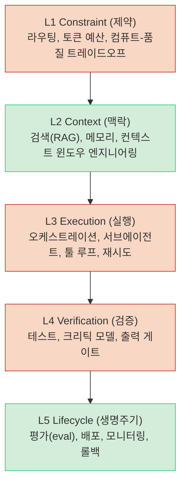
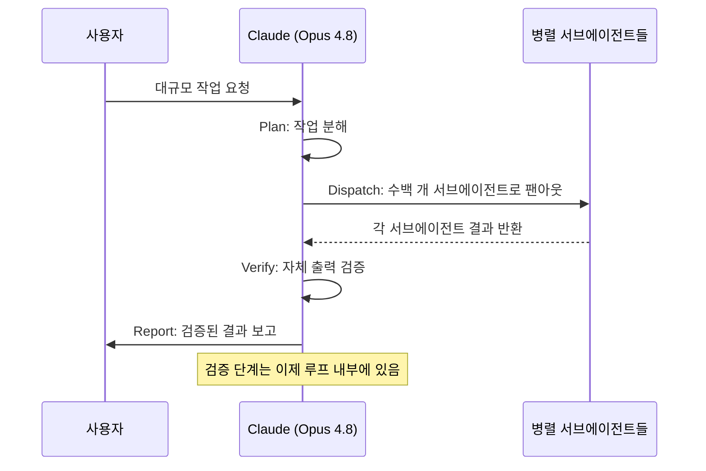
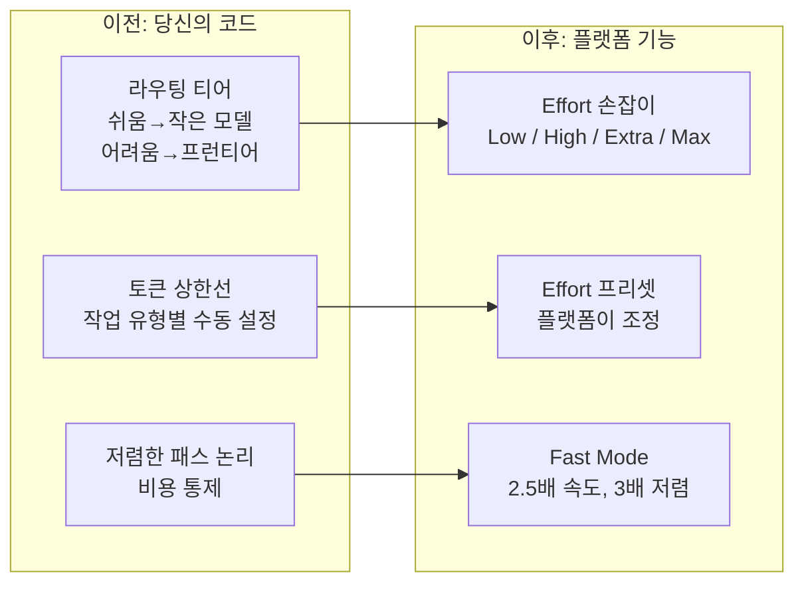
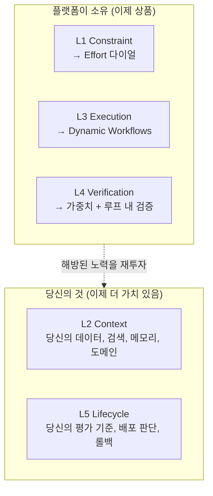
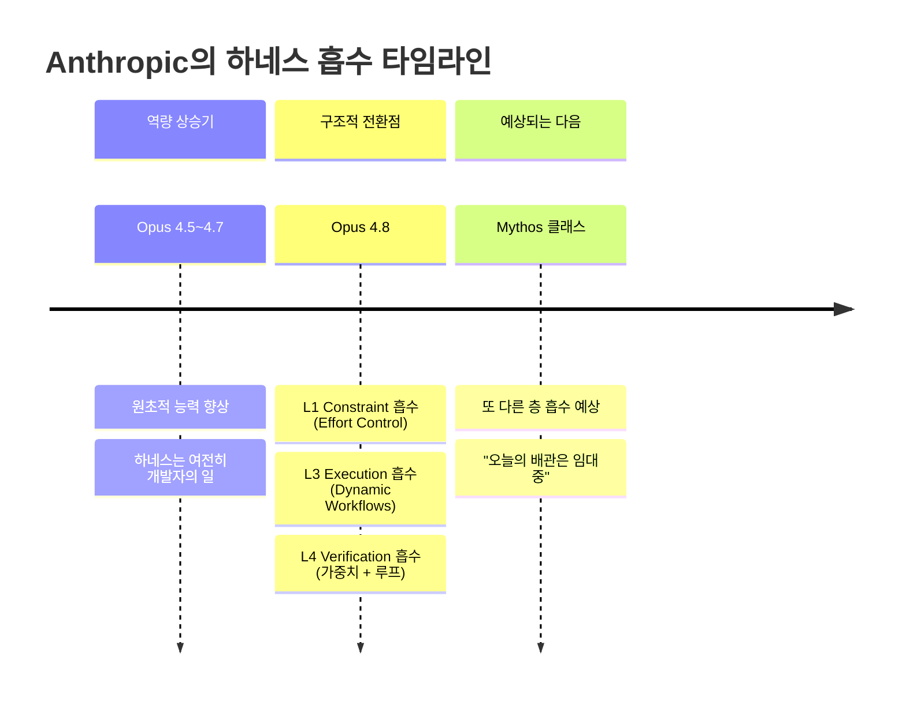

> **원문:** [What Anthropic Didn’t Say About Opus 4.8: It’s Anthropic Absorbing Your Harness](https://medium.com/@han.heloir/what-anthropic-didnt-say-about-opus-4-8-it-s-anthropic-absorbing-your-harness-6d4ea10bf66d) - Han HELOIR YAN, Ph.D. (Medium)  
> **발행일:** 2026년 5월 29일  
> **정리 및 해설:** Claude 기반 상세 분석  
> **최종 업데이트:** 2026년 5월 31일

---

## 들어가며: 한 줄의 코드 변경이 불러온 구조적 지진

당신이 한 일은 단 하나였다. `claude-opus-4-7`을 `claude-opus-4-8`로 바꾼 것. 세션은 설정 변경 없이 시작되었고, 벤치마크 결과는 전반적으로 향상되었으며, 파이프라인은 아무 문제 없이 돌아갔다. 모든 게 단순한 모델 업그레이드처럼 보였다.

하지만 그 조용한 업그레이드 뒤에서 무언가 근본적으로 바뀌었다. Anthropic은 이를 "더 나은 코딩 점수", "저렴해진 패스트 모드", "더 정직한 모델"이라고 설명했다. 거의 모든 분석 기사들도 이 프레임을 그대로 반복했다. 그러나 Han HELOIR YAN이 지적하는 것처럼, 이 설명은 **눈속임**이다.

Opus 4.8은 단순히 더 똑똑해진 모델이 아니다. Anthropic이 당신이 직접 구축하던 하네스(harness)의 핵심 부분들을 조용히 플랫폼 안으로 흡수한 사건이다. 그것도 한 번의 릴리즈에서.

---

## 1. '하네스'란 무엇인가 — AI 시스템의 진짜 가치는 어디에 있는가

먼저 "하네스"라는 개념을 이해해야 한다. 프런티어 AI 모델, 즉 Claude나 GPT 같은 최신 대형 언어 모델은 그 자체로는 완성품이 아니다. 원초적인 다음 토큰 예측기(next-token predictor)에 불과하다. 이것을 실제 프로덕션 환경에서 신뢰할 수 있는 시스템으로 만들기 위해 그 주변에 감싸는 **구조적 틀**이 바로 하네스다.

지난 2년간 AI 시스템을 구축하는 엔지니어와 팀들의 경쟁 우위는 모델 자체가 아니라 이 하네스에 있었다. 모델 벤더(Anthropic, OpenAI 등)는 엔진을 팔고, 나머지 다섯 개 층은 개발자의 몫으로 남겨두었다.

Han은 이 하네스를 다섯 개의 층으로 정의한다.

*빨간색(L1, L3, L4): Opus 4.8 이후 플랫폼이 흡수한 층 / 초록색(L2, L5): 여전히 개발자의 영역*

각 층을 조금 더 구체적으로 설명하면 다음과 같다.

**L1 Constraint(제약 층)** 은 모델에 얼마나 많은 컴퓨팅 자원을 쓸지 결정하는 층이다. 쉬운 요청은 작은 모델로 라우팅하고, 어려운 요청은 비싼 프런티어 모델로 보내는 논리, 그리고 토큰 상한선 설정이 여기에 해당한다. 개발자들은 이 라우팅 코드를 통해 비용을 통제했다.

**L2 Context(맥락 층)** 은 모델에게 무엇을 먹이느냐의 문제다. 도메인 데이터를 어떻게 검색(Retrieval-Augmented Generation, RAG)하여 컨텍스트 윈도우에 넣을지, 이전 대화나 작업 내용을 어떻게 메모리로 관리할지가 이 층에 속한다.

**L3 Execution(실행 층)** 은 복잡한 작업을 어떻게 분해하고 병렬로 처리할지에 관한 오케스트레이션 층이다. 여러 서브에이전트를 어떻게 조율하고, 실패 시 재시도 논리를 어떻게 처리하는지가 이 층의 핵심이었다.

**L4 Verification(검증 층)** 은 모델의 출력을 신뢰하기 전에 검사하는 게이트다. 모델이 자신 있게 틀린 답을 내놓는 문제(confident-but-wrong)를 잡기 위해 린터, 테스트 스위트, 크리틱 모델, 사람 검토자 등을 두는 이 층은 에이전틱 시스템에서 특히 중요했다.

**L5 Lifecycle(생명주기 층)** 은 시스템이 실제로 잘 작동하는지를 판단하는 조직의 지식 층이다. 무엇이 "올바른" 출력인지에 대한 도메인별 평가 기준(eval suite), 배포 게이트, 모니터링, 롤백 계획이 여기에 속한다.

---

## 2. 모든 사람이 읽은 벤치마크 — 그러나 아무도 마지막 열을 제대로 읽지 않았다

Opus 4.8의 발표 당시 모든 기사들이 인용한 벤치마크 표가 있다. 중간 열만 보면 조용한 모델 업그레이드다. 그런데 마지막 열 — "이 향상이 무엇을 의미하는가" — 를 읽으면 전혀 다른 이야기가 된다.

| 벤치마크 | Opus 4.7 | Opus 4.8 | 이 향상이 가리키는 것 |
|----------|----------|----------|----------------------|
| 에이전틱 코딩 (SWE-bench Pro) | 64.3% | **69.2%** | L3 실행 + L4 검증 |
| 도구 활용 추론 (멀티분야) | 54.7% | **57.9%** | 일반 능력 향상 |
| 장문 컨텍스트 검색 (1M 토큰) | 40.3% | **68.1%** | L2 컨텍스트 층 지원 |
| 자체 코드 결함 미신고 비율 | 기준선 | **~4배 감소** | L4 검증이 가중치로 |

마지막 열의 메시지는 하나다. **"이 향상들은 당신이 직접 소유하던 층을 가리킨다."**

---

## 3. Anthropic이 말하지 않은 것: 세 개 층의 흡수

### 3-1. L4 검증(Verification)의 첫 번째 흡수 — 가중치 속으로

Opus 4.8의 가장 주목할 만한 수치는 자체 코드 결함 미신고 비율이 Opus 4.7 대비 약 4배 감소했다는 것이다. Anthropic은 이를 "정직성 향상"이라고 표현했다. 그러나 구조적으로 보면 이것은 완전히 다른 의미를 갖는다.

기존에 개발자들이 L4 층을 구축한 이유는 명확했다. 모델은 자신감 있게 틀린 답을 생성하는 경향이 있었기 때문이다. 그래서 모델 출력 이후 두 번째 패스를 달았다. 린터를 돌리고, 테스트 스위트를 실행하고, 크리틱 모델을 통과시키고, 경우에 따라서는 사람 검토자가 직접 확인했다. 이 모든 과정은 추가 토큰과 지연 시간(latency)을 소비했다.

Opus 4.8은 이 행동의 일부를 **모델 가중치 자체에 내재화**했다. 모델이 자신의 불확실성을 인라인으로 표시하고, 스스로 작성한 코드의 결함을 선제적으로 지적한다. Bridgewater의 테스터가 Anthropic에 보고한 내용도 이것이다: "가장 큰 차이점은 모델이 분석의 입출력 문제를 선제적으로 지적했다는 것이며, 이는 다른 모델들이 사용자가 직접 발견하도록 내버려두던 것이다."

이것은 L4 작업이 모델 내부에서 이루어지고 있다는 의미다. 추가 토큰 없이, 별도의 구성 없이.

**실질적 함의:** 당신의 볼트온(bolt-on) 검증 레이어의 한계 가치가 줄어들었다. 특히 "침묵 속의 실패(silent failure)"를 잡기 위해 구축한 크리틱 모델 게이트가 있다면, 그 작업의 상당 부분이 이제 업스트림에서 무료로 처리된다.

### 3-2. L4 검증의 두 번째 흡수 — 실행 루프 속으로

같은 릴리즈에서 Anthropic은 **Dynamic Workflows**를 발표했다. 이것은 단순히 병렬 서브에이전트를 생성하는 기능이 아니다. Anthropic의 설명에 따르면, Claude는 작업을 계획하고(Plan), 수백 개의 병렬 서브에이전트를 실행하며(Dispatch), 결과를 **검증한 후(Verify)** 보고한다(Report).

핵심은 **검증이 이제 실행 루프의 내장 단계**가 되었다는 것이다. 예전에는 실행이 끝난 후 당신이 감싸는(wrap) 코드로 추가하던 게이트였다. 이제 그것이 루프 안으로 들어왔다.

같은 릴리즈에서 검증이 두 방향에서 흡수된 것이다. 한쪽은 모델 가중치 내부에서, 다른 한쪽은 오케스트레이션 루프 내부에서.

### 3-3. L3 실행(Execution)의 흡수 — 오케스트레이션이 플랫폼 원시 기능이 되다

Dynamic Workflows가 L4를 흡수한 것만이 아니다. 그것은 동시에 **L3 실행 층 전체**를 흡수했다. 이것이 가장 충격적인 부분이다.

이전에 어려운 작업을 여러 에이전트에 분산시키려면 개발자가 직접 해야 했다. 작업을 분해하는 플래너 코드를 작성했다. 병렬 워커들로의 팬아웃(fan-out)을 관리했다. 부분 실패, 재시도, 며칠에 걸친 작업의 상태 관리를 직접 처리했다. 이것을 직접 구축하거나, 멀티에이전트 프레임워크를 도입하여 그것의 의견을 그대로 따라야 했다. 이 조립 작업이 L3였고, 그것은 당신의 경쟁 우위였다.

Dynamic Workflows는 사용자가 작업을 계획하고, 병렬 서브에이전트를 실행하며, 출력을 검증하고 결과를 보고하는 것을 가능하게 한다. Anthropic에 따르면, 이 기능은 수십만 줄에 달하는 대규모 코드베이스를 처리할 수 있도록 설계되었다.

CyberAgent의 엔지니어는 이 기능을 "단일 서브에이전트를 실행하는 것과 완전한 에이전트 팀을 구축하는 것 사이의 간극을 채워준다"고 표현했다. 그것이 바로 Anthropic이 점령한 영토다. 대부분의 팀들이 기성 솔루션이 맞지 않아 직접 손으로 만들던 **중간 단계 오케스트레이션 tier**가 이제 플랫폼의 기본 기능(primitive)이 되었다.

**수치로 보는 실제 사례:** 한 초기 보고에 따르면, Claude Code와 Opus 4.8을 사용해 약 75만 줄의 Rust 코드를 11일 만에 포팅했으며 테스트 스위트의 99.8%가 통과했다는 사례가 있다. 원문 저자는 이 수치를 벤더 인접 주장(vendor-adjacent claim)으로 취급하고 직접 재현하기 전까지는 액면가로 받아들이지 말라고 주의를 기울인다. 그러나 그 형태, 즉 대규모 코드 마이그레이션을 킥오프에서 머지까지 자동으로 처리한다는 방향성은 실제다.

### 3-4. L1 제약(Constraint)의 흡수 — 다이얼이 당신의 라우팅 코드를 대체하다

세 번째 흡수는 가장 조용하지만, 가장 은밀한 것이다. Opus 4.8은 **Effort Control(노력 제어)** 을 도입했다. 사용자는 Low, Medium, High, Max 중에서 Claude가 응답에 쏟는 노력의 양을 선택할 수 있으며, 낮은 노력 설정에서는 더 빠른 결과를, 높은 설정에서는 더 상세한 답변을 받을 수 있다.

이것이 왜 L1 흡수인가? 컴퓨트 대비 품질 트레이드오프는 L1의 핵심이고, 그 결정은 예전에 당신의 코드에 있었기 때문이다. 당신은 쉬운 요청을 작은 모델로 라우팅하는 코드를 작성했다. 작업 유형별로 토큰 상한선을 설정했다. 저렴한 패스로 처리 가능한 요청과 프런티어 모델이 필요한 요청을 구분하는 논리를 만들었다. 이 모든 것이 비용을 통제하는 방식이었다.

Effort Control은 그 결정을 **벤더가 노출하고 벤더가 조정하는 손잡이**로 바꾼다.

Opus 4.8은 기본값으로 High 노력 설정을 사용하며, 이 기본 수준에서도 코딩 작업은 Opus 4.7과 거의 동일한 수의 토큰을 사용하면서 더 나은 성능을 제공한다.

또한 Fast Mode는 모델이 표준 속도의 2.5배로 작동할 수 있으며, 이전 모델 대비 3배 저렴해졌다.

이것이 흡수가 작동하는 방식이다. 통제권을 잃는 것처럼 느껴지지 않는다. 사용하지 않으면 바보인 것처럼 보이는 기능처럼 느껴진다.

---

## 4. 그들이 건드리지 않은 두 개의 층 — 진짜 해자(Moat)

여기서 묵시론적 독해를 수정해야 한다. Anthropic은 L1, L3, L4를 흡수했다. 하지만 **L2(컨텍스트)와 L5(생명주기)는 건드리지 않았다.** 이것은 우연이 아니다. 이 두 층은 구조적으로 벤더가 소유할 수 없는 것들이기 때문이다.

### 4-1. L2 Context — 더 큰 방이 생겼지만, 가구는 여전히 당신의 것

Opus 4.8은 기본 100만 토큰 컨텍스트 윈도우를 지원한다. 그리고 장문 컨텍스트 검색 성능이 40.3%에서 68.1%로 크게 향상되었다. 이는 더 크고 날카로운 방이 생긴 것이다.

하지만 그 방에 무슨 가구를 놓을지는 Anthropic이 결정할 수 없다. 당신의 도메인 데이터, 검색 전략, 메모리 설계는 Anthropic이 볼 수 없는 것들이다. 원문의 표현처럼, "더 큰 방, 여전히 당신의 가구."

오히려 컨텍스트 윈도우가 커질수록, 무엇을 그 안에 넣을지에 대한 **컨텍스트 엔지니어링의 가치는 더 높아진다.** 100만 토큰을 잘 채우는 것이 이전보다 더 중요한 기술이 된 것이다.

### 4-2. L5 Lifecycle — "올바름"의 정의는 여전히 당신의 것

생명주기 층은 시스템이 실제로 작동하는지를 판단하는 조직의 지식이다. 당신의 평가 스위트(eval suite)는 **당신의 문제에 대한 올바름의 정의**이다. 그것은 모델이 배송하는 것이 아니다.

Opus 4.8이 더 정직한 모델이 되었다는 것은 당신의 모니터링을 더 좋게 만든다. 하지만 무엇을 모니터링할지에 대한 결정을 대신하지는 않는다. 배포 게이트, 롤백 계획, 수용 기준, 그리고 가장 중요한 것 — 당신의 도메인에서 "완료됨(done)"이 무엇을 의미하는지 — 이 모든 것은 Anthropic이 가질 수 없는 제도적 지식이다.

---

## 5. Opus 4.8 이후의 구조적 지도

세 개 층이 하룻밤 사이에 상품이 되었다. 두 개 층이 전부가 되었다. 방어 가능한 작업이 사라진 것이 아니다. 스택 위쪽으로 이동한 것이다 — 배관(plumbing)이 아니라 데이터와 판단으로 만들어진 부분으로.

---

## 6. 월요일에 실제로 해야 할 것

교체 자체는 사소하다. 모델은 `claude-opus-4-8`로 접근할 수 있으며, 1M 컨텍스트 윈도우가 필요한 경우 `claude-opus-4-8[1m]`을 사용하면 된다. 가격은 Opus 4.7과 동일하게 유지된다.

하지만 전략적 변화는 사소하지 않다. 이것은 **구축 운동이기 전에 삭제 운동**이다.

### 단계 1: 각 층을 점검하고 하나의 질문을 던져라

각 층을 걸어가며 한 가지 질문만 해라: **"이것은 여전히 내가 소유해야 하는 것인가?"**

**L4 검증 층에 대해:** 크리틱 및 게이트 로직을 감사하고, 모델이 거짓 승리를 선언하는 것을 잡기 위해서만 존재하는 부분을 찾아라. 그 작업의 의미 있는 부분을 모델이 이제 스스로 처리한다. 도메인 규칙을 인코딩하는 검사는 유지하고, 일반적인 검사는 퇴역시켜라.

**L3 실행 층에 대해:** 맞춤형 플래너-팬아웃(planner-fan-out) 배관을 유지하고 있다면, 실제 마이그레이션 작업에 Dynamic Workflows를 파일럿으로 실행해보고 당신의 코드가 여전히 가치를 내는지 측정해라.

**L1 제약 층에 대해:** 당신의 라우터를 Effort 다이얼과 비교 실행하고, 당신의 트래픽에 대해 비용이나 지연 시간에서 다이얼을 이기는 경우에만 라우팅을 유지해라.

### 단계 2: 해방된 노력을 진짜 해자에 재투자하라

삭제 운동으로 해방된 모든 것을 이제 두 개의 층에 투자해라.

**L2 컨텍스트 엔지니어링을 날카롭게 만들어라.** 더 나은 검색, 더 나은 메모리, 100만 토큰 공간의 더 나은 활용. 방이 더 커졌으니 좋은 가구를 선택하는 것이 그 어느 때보다 중요해졌다.

**L5 생명주기를 깊게 만들어라.** 당신의 문제에서 "올바름"이 무엇을 의미하는지를 인코딩하는 더 엄격한 평가, 더 촘촘한 모니터링, 더 빠른 롤백. 이것이 이제 차별화가 사는 곳이고, 다음 릴리즈가 도달할 수 없는 곳이다. Anthropic은 당신의 데이터를 가지고 있지 않고, 당신의 완료 기준을 알지 못하기 때문이다.

---

## 7. 더 큰 패턴: 경계선은 계속 이동한다

단일 릴리즈에서 물러서서 보면, 패턴이 진짜 이야기가 된다. 각 Opus 포인트 릴리즈는 하네스 안으로 조금씩 더 깊이 손을 뻗어왔다.

Anthropic은 이미 향후 수 주 안에 Mythos 클래스 모델을 시사했다. Anthropic은 필요한 안전 조치가 완료되면 Mythos 프리뷰 기간이 곧 끝날 수 있음을 암시했다. 다음 릴리즈가 또 다른 층을 흡수할 것이라고 가정하고, 오늘 당신이 소유하는 배관이 임대 중인 것처럼 구축하라.

---

## 8. 핵심 통찰: 진짜 해자는 벤더가 볼 수 없는 것

한 발 더 물러서면, 이 글 전체의 핵심이 보인다. 내구성 있는 경쟁 우위는 벤더가 구조적으로 소유할 수 없는 것들로 만들어진다.

당신의 데이터. 당신의 도메인. 당신의 평가 기준. 당신이 "올바름"을 어떻게 정의하는지에 대한 판단. Anthropic은 이것들을 볼 수 없다. 따라서 흡수할 수 없다.

Opus 4.8은 당신의 포지션을 약화시키지 않았다. 진짜 당신의 우위가 아니었던 층들을 걷어내고, 진짜 우위인 층들을 향해 모두를 밀어넣었다. 해자는 여전히 하네스다. 다만 더 작아지고, 더 날카로워지고, 더 복사하기 어려워졌다.

---

## 부록: 참고 자료

본 분석은 다음 출처들을 바탕으로 작성되었다.

- **Introducing Claude Opus 4.8**, Anthropic 공식 발표 — 정직성 주장, Effort Control, Dynamic Workflows의 Plan-Dispatch-Verify-Report 루프에 대한 일차 출처
- **Claude Opus 4.8 System Card**, Anthropic — 헤드라인 수치의 배경이 되는 광범위한 정렬 및 능력 평가, 자체 코드 결함 4배 감소 메트릭 포함
- **Anthropic releases Opus 4.8 with new dynamic workflow tool**, TechCrunch — 코드베이스 규모 마이그레이션 프레이밍과 Bridgewater 사용후기
- **Claude Opus 4.8 is here**, VentureBeat — Fast Mode 가격 및 자체 검증 서브에이전트 설명
- **Anthropic Releases Claude Opus 4.8**, gHacks Tech News — 가격 구조, Dynamic Workflows 사용 가능 플랜 세부 정보

---

*이 문서는 Han HELOIR YAN의 Medium 아티클 "What Anthropic Didn't Say About Opus 4.8: It's Anthropic Absorbing Your Harness"를 기반으로 최신 정보를 추가하여 상세히 풀어쓴 해설 문서입니다. 원 저자의 분석 프레임워크와 핵심 논지를 최대한 충실하게 반영했습니다.*
