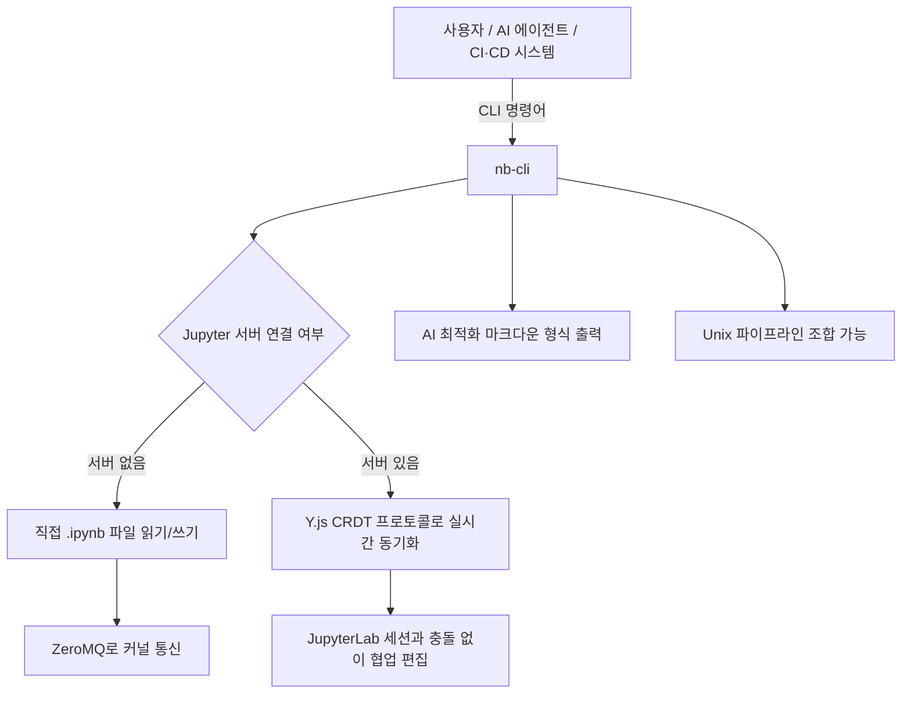
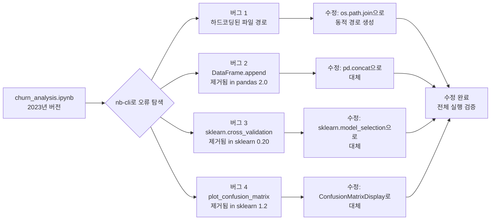
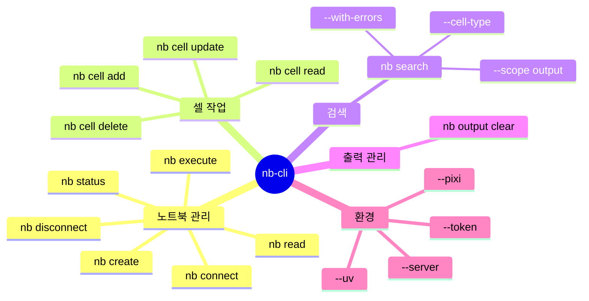
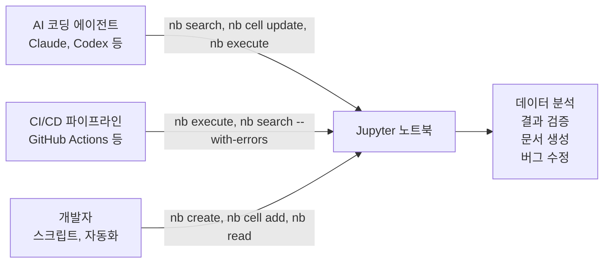

> **출처**: [Jupyter Blog — Piyush Jain 저](https://blog.jupyter.org/nb-cli-a-command-line-interface-for-ai-agents-and-notebook-automation-996ad7edacd9) (2026년 5월 11일)  
> **프로젝트**: [github.com/jupyter-ai-contrib/nb-cli](https://github.com/jupyter-ai-contrib/nb-cli)

---

## 1. 왜 nb-cli가 등장했는가 — 배경과 문제 인식

### 1.1 AI 에이전트 시대의 개발 도구

Claude, GPT 같은 대규모 언어 모델(LLM)은 커맨드라인 인터페이스(CLI)를 매우 잘 다룬다. 수십억 줄의 CLI 사용 예시가 Stack Overflow, GitHub, 공식 문서 등을 통해 학습 데이터로 축적되어 있기 때문이다. 그런데 Jupyter 노트북을 프로그래밍 방식으로 다루는 데에는 오랫동안 공백이 존재했다. 기존 도구들은 노트북 *안에서* 에이전트를 실행하는 데 집중했지, 노트북 자체를 하나의 작업 대상(artifact)으로 다루는 에이전트를 위한 도구는 부재했다.

### 1.2 노트북이 "블랙박스"가 되는 순간

Jupyter 노트북(`.ipynb` 파일)은 데이터 탐색과 분석에 있어 없어서는 안 될 도구다. 하지만 그 내부 구조는 복잡하게 중첩된 JSON 형식으로 되어 있어, 자동화 스크립트나 LLM이 접근하기 매우 까다롭다. 아래는 기존 방식이 한계를 드러내는 대표적 시나리오들이다.

| 시나리오 | 기존 방식의 한계 |
|---|---|
| **자율적 분석 감사** | AI 에이전트가 데이터 과학 워크플로를 점검하려면 개별 셀을 직접 파싱해야 함 |
| **자동화된 CI/CD 검증** | 노트북을 실행하고 오류를 감지하는 신뢰할 만한 방법이 없음 |
| **대규모 문서화** | 노트북 내용을 자동으로 깔끔한 문서로 변환하는 도구 부재 |
| **프로덕션 디버깅** | 헤드리스(headless) 환경에서 실행 실패를 진단하기 위해 UI를 수동으로 열어야 함 |
| **노트북을 데이터로 활용** | 보고서나 시각화를 프로그래밍 방식으로 생성하기 위해 노트북을 구조화된 DB처럼 다루고 싶을 때 |

기존의 해결 방법들은 JupyterLab UI를 직접 조작하거나, 복잡한 JSON을 파싱하는 취약한 Python 스크립트를 작성하거나, 실시간 통합 기능이 없는 실행 도구에 의존하는 방식이었다. **nb-cli**는 이 공백을 채우기 위해 설계되었다.

---

## 2. nb-cli란 무엇인가 — 핵심 개요

nb-cli는 **Rust로 작성된 오픈소스 커맨드라인 인터페이스**다. AI 에이전트, 자동화 스크립트, 그리고 Jupyter 노트북에 프로그래밍 방식으로 접근해야 하는 개발자를 위해 설계되었다. nbformat 명세를 준수하면서, 노트북을 읽고(read), 쓰고(write), 실행하고(execute), 조작(manipulate)하는 작업을 빠르고 조합 가능한(composable) 방식으로 처리한다.



### 개발자 소개

| 이름 | 소속 | 역할 |
|---|---|---|
| **Andrii Ieroshenko** | AWS SDE | JupyterLab, Jupyter AI 기여자, Jupyter Media Strategy WG 멤버 |
| **Brian Granger** | AWS Senior Principal Technologist | Project Jupyter 공동 창립자, Jupyter·PyTorch Foundation 이사 |
| **Piyush Jain** | AWS Principal Engineer | Jupyter 및 Agentic AI 담당, Jupyter Server Council 멤버 |

---

## 3. 핵심 기능 상세 해설

### 3.1 Jupyter 서버 없이도 동작한다

nb-cli의 가장 큰 특징 중 하나는 **실행 중인 Jupyter 서버가 없어도 작동한다**는 점이다. 기본적으로 `.ipynb` 파일을 직접 읽고 쓰며, 커널 실행이 필요한 경우에는 **ZeroMQ**를 통해 커널과 직접 통신한다. 이 덕분에 별도의 서버를 띄울 필요 없이 CI 파이프라인이나 스크립트 환경에서 바로 활용할 수 있다.

```bash
# 기본 워크플로 예시 (서버 없음)
nb create analysis.ipynb
nb cell add analysis.ipynb --source "import pandas as pd"
nb cell add analysis.ipynb --source "# 데이터 분석" --type markdown
nb execute analysis.ipynb
nb read analysis.ipynb
```

반면, 여러 사용자나 에이전트가 **동시에** 같은 노트북을 편집해야 하는 경우에는 서버 연결이 필요하다. 이때 nb-cli는 JupyterLab이 내부적으로 사용하는 것과 동일한 **Y.js CRDT(충돌 없는 복제 데이터 타입)** 프로토콜을 사용하여 실시간 동기화를 지원한다.

```bash
# 서버 연결 워크플로 예시
nb connect
nb connect --server http://localhost:9999 --token abc
nb cell add experiment.ipynb --source "df.head()"
nb execute experiment.ipynb --cell fe456
nb execute experiment.ipynb --restart-kernel
nb disconnect
```

서버에 연결된 상태에서는 해당 노트북이 JupyterLab에 열려 있는지 자동으로 감지하여, 열려 있으면 서버 API를 통해 충돌 없는 편집을 수행하고, 열려 있지 않으면 파일 기반 작업으로 자동 전환한다.

---

### 3.2 AI에 최적화된 마크다운 형식 (Sentinel Format)

이 기능은 nb-cli의 설계 철학이 가장 잘 드러나는 부분이다. 왜 기존 형식이 LLM에 부적합한지, 그리고 어떻게 해결했는지를 이해하는 것이 중요하다.

#### 기존 형식의 문제점

**JSON 형식 (`.ipynb` 기본 형식)** 의 경우, 소스 코드가 문자열 배열로 저장되고, 출력물에는 base64 인코딩 데이터가 포함되며, 메타데이터는 여러 단계로 중첩된다. LLM이 이 형식을 처리할 때 전체 토큰의 30~40%가 `{`, `}`, `[`, `]`, 이스케이프된 개행 문자 등 **의미 없는 구조 기호**로 낭비된다. 고정된 컨텍스트 윈도우에서 이는 매우 비효율적이다.

**순수 마크다운 형식**은 토큰 효율적이고 사람이 읽기 좋지만, **모호성**이 문제다. `#` 기호가 마크다운 제목인지 Python 주석인지 알 수 없고, 코드 펜스(```)가 노트북 셀인지 마크다운 셀 내의 예시 코드인지 구별할 수 없다. AI 에이전트가 "7번 셀의 오류를 수정해줘"라는 요청을 받았을 때, 순수 마크다운 형식에서는 그 셀을 신뢰성 있게 찾아낼 구조적 기준점이 없다.

#### Sentinel 형식의 설계

nb-cli는 이를 해결하기 위해 **줄 단위 센티넬(sentinel) 형식**을 설계했다.

~~~

```python
df.head()
```

```text
   col_a  col_b
0      1      a
```
~~~

이 형식의 설계 의도를 구체적으로 살펴보면 다음과 같다.

| 설계 요소 | 효과 |
|---|---|
| `@@cell`·`@@output` 센티넬 | 중괄호를 세거나 중첩 구조를 추적하지 않아도 명확한 구조적 경계를 제공 |
| 센티넬 줄 위의 인라인 JSON 메타데이터 | 셀 타입, 인덱스, 실행 횟수 정보가 내용 바로 앞 토큰에 위치 → 어텐션 메커니즘이 정보를 잘 찾음 |
| 언어 힌트가 있는 코드 펜스 | 모델의 구문 수준 학습 능력 활성화 |
| 자기 완결적 셀 블록 | 중간에 잘려도 JSON과 달리 전체 구조가 깨지지 않고 우아하게 대처 가능 |

---

### 3.3 Unix 철학에 따른 조합 가능성(Composability)

nb-cli는 **일반 텍스트 출력, stdin 지원, 예측 가능한 종료 코드** 등 Unix 관례를 따른다. 이로 인해 다른 CLI 도구들과 자연스럽게 조합된다. AI 에이전트 입장에서 이 조합 가능성은 매우 중요한데, 하나의 셸 명령으로 여러 번의 API 호출과 중간 파싱 작업을 대체할 수 있기 때문이다.

예를 들어, 에이전트가 "노트북에 요약 섹션을 추가하고 실행해줘"라는 요청을 받았다고 하자. nb-cli 없이는 노트북을 읽는 API 호출, 구조 파싱, 셀 삽입, 파일 쓰기, 커널 찾기, 실행, 출력 읽기 등 각 단계마다 별도의 API 호출이 필요하다. nb-cli를 사용하면 다음과 같이 단 하나의 셸 호출로 처리된다.

```bash
nb cell add analysis.ipynb --source "$(cat <<'EOF'
# Summary
print(f"Rows: {len(df)}, Columns: {len(df.columns)}")
df.describe()
EOF
)" && nb execute analysis.ipynb -i -2 -i -1 && nb read analysis.ipynb -i -1
```

세 가지 작업(셀 추가 → 실행 → 결과 읽기)이 하나의 파이프라인으로 연결된다. 에이전트는 전체 노트북을 다시 읽지 않고도 필요한 출력만 받는다.

디버깅도 마찬가지다. 실패한 노트북을 조사할 때 모든 셀을 읽을 필요 없이 다음 한 줄로 문제 셀만 찾아낼 수 있다.

```bash
nb search analysis.ipynb --with-errors
```

---

### 3.4 안정적인 셀 참조 방식

nb-cli는 셀을 참조하는 두 가지 방식을 모두 지원한다.

- **인덱스 기반**: `--cell-index 0` (음수 인덱싱 지원: `-1`은 마지막 셀)
- **ID 기반**: `--cell f68t57` (셀이 이동해도 ID는 변하지 않음)

```bash
# 인덱스로 참조
nb cell update analysis.ipynb --cell-index 0 --source "x = 42"
nb execute analysis.ipynb --cell-index -1

# ID로 참조
nb cell update analysis.ipynb --cell ce456 --source "print('Done')"
```

---

### 3.5 강력한 검색 기능

nb-cli에는 셀을 내용, 타입, 실행 오류 기준으로 빠르게 찾아내는 내장 검색 기능이 있다. 기본적으로 셀 소스 코드를 대상으로 검색하며, `--scope output` 옵션으로 실행 출력물까지 범위를 확장할 수 있다.

```bash
# pandas import 셀 찾기
nb search analysis.ipynb "import pandas"

# 오류가 있는 셀만 추출
nb search analysis.ipynb --with-errors

# 출력 결과에서 특정 에러 찾기
nb search analysis.ipynb "KeyError" --scope output

# 마크다운 셀에서 TODO 찾기
nb search analysis.ipynb "TODO" --cell-type markdown
```

특히 `--with-errors`는 AI 에이전트에게 매우 유용하다. 전체 노트북을 읽지 않고도 문제가 있는 셀만 받아볼 수 있기 때문이다. `--scope output`과 결합하면 모든 셀의 결과를 파싱하지 않고 에러 트레이스백에서 직접 검색할 수 있다.

---

### 3.6 멀티셀 한 번에 추가하기

노트북 작업 시 가장 자주 발생하는 패턴 중 하나는 마크다운 헤더, 설정 코드, 분석 코드를 연달아 추가하는 것이다. nb-cli는 앞서 설명한 센티넬 형식을 활용하여 여러 셀을 한 번의 호출로 추가할 수 있다.

```bash
nb cell add report.ipynb --source "$(cat <<'EOF'
# Results
import pandas as pd
df = pd.read_csv('results.csv')
df.head()
EOF
)"
```

더 세밀한 제어가 필요할 때는 전체 JSON 메타데이터 형식도 지원한다.

```bash
nb cell add report.ipynb --source "$(cat <<'EOF'
# Analysis Header
print("hello")
EOF
)"
```

`stdin`도 지원하므로 파이프라인에서도 자연스럽게 활용할 수 있다.

```bash
printf '@@markdown\n## Summary\n\n@@code\ndf.describe()\n' | nb cell add report.ipynb --source -
```

같은 일괄 처리(batching) 철학은 실행과 삭제에도 적용된다.

```bash
# 2번부터 5번 셀까지 실행
nb execute analysis.ipynb --start 2 --end 5

# 개별 셀 삭제
nb cell delete analysis.ipynb -i 0 -i 2

# 범위로 삭제
nb cell delete analysis.ipynb --range 0:3
```

---

### 3.7 환경 인식 실행 (Environment-Aware Execution)

`--uv` 및 `--pixi` 플래그를 지원하여 해당 환경 관리자를 통해 Jupyter 서버와 커널을 자동으로 탐색한다. `nb status --python`은 현재 연결된 커널과 동일한 환경에서 Python을 실행하는 데 필요한 명령어 접두사를 반환한다. AI 에이전트가 생성한 셸 명령이 활성화된 노트북 환경과 일치해야 할 때 특히 유용하다.

```bash
nb connect --uv
nb execute analysis.ipynb --pixi
nb status --python

# 커널과 동일한 환경에서 패키지 버전 확인
$(nb status --python) python -c "import pandas; print(pandas.__version__)"
```

---

## 4. 실제 활용 사례

### 4.1 AI 에이전트 워크플로

AI 코딩 에이전트가 노트북 오류를 자동으로 감지하고 수정하는 워크플로의 예시다.

```bash
# 1단계: 오류가 있는 셀 탐색
nb search data_analysis.ipynb --with-errors

# 2단계: 문제 셀 수정 (인코딩 문제 해결)
nb cell update data_analysis.ipynb --cell-index 3 --source "df = pd.read_csv('data.csv', encoding='utf-8')"

# 3단계: 수정된 셀만 재실행
nb execute data_analysis.ipynb --cell-index 3
```

### 4.2 CI/CD 파이프라인 통합

노트북을 코드와 동일하게 CI/CD로 검증하는 자동화된 테스트 워크플로다.

```bash
echo "노트북 실행 중..."
nb execute pipeline.ipynb --allow-errors

echo "오류 검사 중..."
if nb search pipeline.ipynb --with-errors; then
  echo "노트북 실행 실패"
  exit 1
fi

echo "커밋 전 출력 초기화 중..."
nb output clear pipeline.ipynb

echo "✓ 모든 셀이 성공적으로 실행되었습니다"
```

### 4.3 프로그래밍 방식으로 노트북 자동 생성

월별 판매 보고서 같은 반복적인 문서를 자동으로 생성하는 예시다.

```bash
nb create report.ipynb
nb cell add report.ipynb --source "$(cat <<'EOF'
# Monthly Sales Report
Generated on $(date)
import pandas as pd
df = pd.read_csv('sales_data.csv')
df.describe()
EOF
)"
nb execute report.ipynb
```

### 4.4 프로덕션 노트북 디버깅

배포된 노트북에서 문제를 빠르게 진단하는 워크플로다.

```bash
# 오류 셀 즉시 파악
nb search failing_notebook.ipynb --with-errors

# 폐기된 API 사용 여부 검사
nb search analysis.ipynb "pandas.np"
nb search notebook.ipynb "eval("

# 특정 셀 내용 확인
nb read failing_notebook.ipynb --cell-index 5

# 커널을 초기화하고 재실행
nb execute failing_notebook.ipynb --restart-kernel
```

---

## 5. nb-cli가 실제 작동하는 모습 — 두 가지 실제 사례

### 사례 1: LLM을 위한 강화학습 노트북 자동 생성

**사용자 요청**: "LLM을 위한 강화학습을 가르쳐줘. 노트북을 만들고 각 셀마다 어떻게 작동하는지 설명해줘. 핵심 개념인 정책 모델(policy model), 보상 모델(reward model), KL 발산 페널티(KL divergence penalty), PPO, GRPO를 다뤄줘. CPU에서 API 키 없이 실행되도록 작은 토이 모델(작은 어휘, GRU 기반)을 사용해줘."

이 요청에 대해 Claude(AI 에이전트)는 nb-cli를 사용하여 `rl_for_llms_comprehensive.ipynb`라는 노트북을 생성했다. 생성된 노트북의 구조는 다음과 같다.

#### 노트북 내용 구성

노트북의 제목은 **"Reinforcement Learning for LLMs — A Comprehensive Guide"** 이며, 소개 섹션에서 다음과 같은 학습 목표를 제시한다.

> "이 노트북은 RLHF(인간 피드백 강화학습) 파이프라인의 모든 구성요소를 심층적으로 살펴봅니다. 수학적 원리를 이해하고, 각 부분이 어떻게 연결되는지 직접 확인하세요."

노트북에서 직접 구현하는 7가지 핵심 요소는 다음과 같다.

1. **정책 언어 모델(Policy Language Model)**: 트랜스포머의 대역을 맡는 GRU 기반 소형 모델
2. **학습된 보상 모델(Learned Reward Model)**: 합성 선호 쌍(synthetic preference pairs)으로 훈련된 모델 — 하드코딩된 오라클이 아님
3. **PPO(근위 정책 최적화, Proximal Policy Optimization)**: InstructGPT와 ChatGPT의 기반 알고리즘
4. **GRPO(그룹 상대 정책 최적화, Group Relative Policy Optimization)**: DeepSeek-R1의 기반 알고리즘, PPO보다 저렴함
5. **엔트로피 정규화(Entropy Regularization)**: 정책 붕괴(policy collapse) 방지
6. **멀티턴 대화(Multi-turn Dialogue)**: 드문(sparse), 대화 종료 보상을 사용하는 변형
7. **종합 훈련 곡선 시각화 및 어블레이션 비교**

**전제 조건**: PyTorch와 신경망에 대한 기본 지식만 있으면 되며, RL 배경 지식은 불필요하다. 모든 개념을 처음부터 설명한다.

**섹션 0 — 설치 및 전역 설정** 구성을 보면, 세 가지 의존성(torch, numpy, matplotlib)을 설치하고 전역 상수와 고정 랜덤 시드를 설정한다.

```python
%pip install torch numpy matplotlib --quiet

import torch
import torch.nn as nn
import torch.nn.functional as F
import numpy as np
import matplotlib.pyplot as plt
from collections import namedtuple, defaultdict
from itertools import product
import copy, random

# — Reproducibility —
SEED = 42
torch.manual_seed(SEED)
np.random.seed(SEED)
random.seed(SEED)
```

이 노트북의 핵심 가치는 복잡한 RLHF 개념들을 실제로 동작하는 코드로 단계별로 구현하면서, 각 셀마다 그것이 왜 필요한지, 어떻게 작동하는지를 마크다운 셀로 상세하게 설명한다는 점이다. GPU나 API 키 없이 CPU만으로 실행 가능하도록 GRU 기반 소형 모델을 사용한 것도 접근성 측면에서 중요한 설계 선택이다.

---

### 사례 2: Codex가 오래된 노트북의 여러 버그를 자동 수정

**사용자 요청**: "`churn_analysis.ipynb` 파일은 2023년에 마지막으로 업데이트된 망가진 연구용 노트북이에요. 처음부터 끝까지 깨끗하게 실행되도록 수정해주세요. 실패하는 모든 셀을 파악하고, 각 문제를 수정한 뒤 노트북이 성공적으로 실행되는지 확인해주세요. 수정 후에는 변경한 각 셀 위에 무엇이 문제였고 왜 그런지 설명하는 짧은 마크다운 노트를 추가해주세요."

#### Codex가 발견하고 수정한 4가지 버그

JupyterLab의 Git 차이(diff) 화면을 통해 수정 사항을 확인할 수 있으며, 각 변경 사항은 다음과 같다.



**버그 1 — 하드코딩된 파일 경로**

- **수정 전**: `df = pd.read_csv('/Users/james/projects/churn/data/churn_raw.csv')`
- **수정 후**:
  ```python
  import os
  data_path = os.path.join(os.path.dirname(os.path.abspath('churn_analysis.ipynb')), 'churn_data.csv')
  df = pd.read_csv(data_path)
  print(f'Loaded {len(df):,} rows')
  ```
- **설명**: 원본 코드는 James의 컴퓨터에만 존재하는 경로를 하드코딩했다. `churn_data.csv`를 노트북 자체 디렉터리를 기준으로 찾도록 수정하여 모든 협업자가 변경 없이 실행할 수 있게 했다.
- 수정 노트: `**Fix (2026):** The original cell hard-coded '/Users/james/projects/churn/data/churn_raw.csv', a path that only existed on James's machine. Updated to use 'churn_data.csv' in the notebook's own directory so any collaborator can run this without changes.`

**버그 2 — DataFrame.append() 제거됨 (pandas 2.0)**

- **수정 전**: `df_balanced = df_clean.append(df_minority, ignore_index=True)`
- **수정 후**: `df_balanced = pd.concat([df_clean, df_minority], ignore_index=True)`
- **설명**: `DataFrame.append()`는 pandas 1.4에서 폐기 예고되었고 pandas 2.0에서 완전히 제거되었다. 현재 관용적 방법인 `pd.concat()`으로 교체했다.
- 수정 노트: `**Fix (2026):** 'DataFrame.append()' was removed in pandas 2.0 (deprecated since 1.4). Replaced with 'pd.concat()', which is the current idiomatic way to combine DataFrames.`

**버그 3 — sklearn.cross_validation 제거됨 (sklearn 0.20)**

- **수정 전**: `from sklearn.cross_validation import ...` (또는 유사한 구식 import)
- **수정 후**: `from sklearn.model_selection import ...`
- **설명**: `sklearn.cross_validation` 모듈은 scikit-learn 0.20에서 제거되었다. sklearn 0.18부터 올바른 모듈인 `sklearn.model_selection`으로 교체했다.
- 수정 노트: `**Fix (2026):** 'sklearn.cross_validation' was removed in scikit-learn 0.20. Replaced the import with 'sklearn.model_selection', which has been the correct module since sklearn 0.18.`

**버그 4 — plot_confusion_matrix 제거됨 (sklearn 1.2)**

- **수정**: `plot_confusion_matrix` 함수를 `ConfusionMatrixDisplay`로 대체
- **설명**: `plot_confusion_matrix`는 scikit-learn 1.2에서 제거되었다.
- 수정 노트: `**Fix (2026):** 'sklearn.cross_validation' was removed in scikit-learn 0.20. Replaced the import with 'sklearn.model_selection', which has been the correct module since sklearn 0.18.`

Codex는 이 네 가지 버그를 수정한 후 노트북이 처음부터 끝까지 오류 없이 실행되는지 검증했다. 각 수정된 셀 위에는 무엇이 문제였고 왜 그런지를 설명하는 마크다운 주석이 자동으로 추가되었다. 이 전체 작업은 nb-cli의 `nb search --with-errors`, `nb cell update`, `nb execute` 명령을 체계적으로 활용하여 이루어졌다.

---

## 6. 설치 및 시작하기

### 설치 방법

**방법 1 — 설치 스크립트 (권장)**:
```bash
curl -fsSL https://raw.githubusercontent.com/jupyter-ai-contrib/nb-cli/main/install.sh | bash
```

**방법 2 — Cargo로 설치** (플랫폼이 지원되지 않는 경우):
```bash
cargo install nb-cli
```

**방법 3 — 소스에서 빌드**:
```bash
git clone https://github.com/jupyter-ai-contrib/nb-cli.git
cd nb-cli
cargo build --release
# 바이너리 위치: target/release/nb
```

**AI 에이전트용 스킬 설치** (에이전트가 모든 노트북 작업에 nb를 활용하도록):
```bash
npx skills install jupyter-ai-contrib/nb-cli
```

---

## 7. 명령어 전체 요약



---

## 8. 기존 도구들과의 비교

| 특성 | 기존 Python 스크립트 | nbconvert | nb-cli |
|---|---|---|---|
| Jupyter 서버 필요 여부 | 불필요 | 불필요 | **불필요** |
| CLI 친화성 | 낮음 | 중간 | **높음** |
| AI 에이전트 최적화 | 없음 | 없음 | **전용 설계** |
| 실시간 협업 지원 | 없음 | 없음 | **Y.js CRDT** |
| 멀티셀 한번에 추가 | 수동 코드 필요 | 해당 없음 | **지원** |
| 오류 셀만 추출 | 복잡한 파싱 필요 | 없음 | **`--with-errors`** |
| 언어/성능 | Python | Python | **Rust (고성능)** |
| Unix 파이프라인 통합 | 제한적 | 제한적 | **완전 지원** |

---

## 9. 프로젝트에 참여하는 방법

nb-cli는 막 시작된 실험적 오픈소스 프로젝트다. 참여 방법은 다음과 같다.

1. **사용해보기**: nb-cli를 설치하고 사용하면서 버그나 개선 사항을 [GitHub 이슈](https://github.com/jupyter-ai-contrib/nb-cli)에 등록한다.
2. **토론 참여**: `jupyter-ai-contrib` 저장소에서 이슈를 열거나 기존 토론에 참여한다.
3. **기여**: 버그 리포트, 기능 요청, PR 모두 환영한다.

---

## 10. 결론 — nb-cli가 의미하는 것

nb-cli는 단순한 CLI 도구가 아니다. 이것은 **Jupyter 노트북을 소프트웨어 스택의 일급 시민(first-class citizen)으로 만들려는 시도**다. 대화형 탐색 도구로서의 노트북이 AI 에이전트, CI/CD 파이프라인, 자동화 스크립트와 자연스럽게 통합될 수 있는 세상을 지향한다.



Rust로 구현된 성능, Unix 철학에 따른 조합 가능성, LLM을 위해 특별히 설계된 Sentinel 형식, 그리고 서버 없이도 동작하는 유연성 — 이 모든 요소가 결합하여 AI 시대의 노트북 자동화 표준을 제시하고 있다.

---

*원문 출처: [Jupyter Blog — nb-cli: A Command-Line Interface for AI Agents and Notebook Automation](https://blog.jupyter.org/nb-cli-a-command-line-interface-for-ai-agents-and-notebook-automation-996ad7edacd9)*
