> **원본 논문:** [Code as Agent Harness](https://arxiv.org/html/2605.18747v1): Toward Executable, Verifiable, and Stateful Agent Systems  
> **발표:** 2026년 5월 · arXiv:2605.18747 · UIUC(일리노이대학교 어바나-샴페인) 연구팀  
> **이 문서의 목적:** 논문을 읽지 않아도 핵심을 이해할 수 있도록 쉬운 말로 풀어쓴 해설

## 관련글

[**Code as Agent Harness: 실행 가능하고 검증 가능하며 상태를 가진 AI 에이전트 시스템을 향하여**](https://k82022603.github.io/posts/code-as-agent-harness-%EC%8B%A4%ED%96%89-%EA%B0%80%EB%8A%A5%ED%95%98%EA%B3%A0-%EA%B2%80%EC%A6%9D-%EA%B0%80%EB%8A%A5%ED%95%98%EB%A9%B0-%EC%83%81%ED%83%9C%EB%A5%BC-%EA%B0%80%EC%A7%84-ai-%EC%97%90%EC%9D%B4%EC%A0%84%ED%8A%B8-%EC%8B%9C%EC%8A%A4%ED%85%9C%EC%9D%84-%ED%96%A5%ED%95%98%EC%97%AC/)

---

## 1. 이 논문은 한 마디로 어떤 내용인가요?

AI가 코드를 잘 쓴다는 건 이미 알려진 사실입니다. 그런데 이 논문은 완전히 새로운 시각을 제시합니다.

> **"코드는 AI가 만들어내는 '결과물'이 아니라, AI가 일하는 '작업 환경' 자체다."**

예를 들어 볼까요. 건물을 짓는 공사장을 상상해 보세요. 지금까지의 AI 연구는 "AI가 설계도(코드)를 얼마나 잘 그리는가"에 집중했습니다. 그런데 이 논문은 "설계도가 곧 공사장의 뼈대이고, AI는 그 뼈대 위에서 실제로 공사를 한다"고 말합니다.

코드가 단순한 출력물이 아니라, AI 에이전트가 생각하고, 행동하고, 환경을 이해하는 **틀(harness)** 이 된다는 것입니다.

---

## 2. '하네스(Harness)'가 뭔가요?

낯선 단어니까 먼저 설명하겠습니다.

원래 harness는 마차를 끄는 말에 씌우는 **마구(馬具)** 를 뜻합니다. 말의 힘을 마차에 전달하는 연결 장치이죠. 소프트웨어에서는 테스트를 실행하는 보조 도구를 "테스트 하네스"라고 부릅니다.

이 논문에서 **에이전트 하네스**는 AI 에이전트가 일을 할 때 그것을 감싸고 안내하는 **코드 기반 인프라 전체**를 뜻합니다. 쉽게 말하면 AI가 실제로 일하는 **작업대(작업 환경 전체를 받쳐주는 기반)** 같은 것입니다.

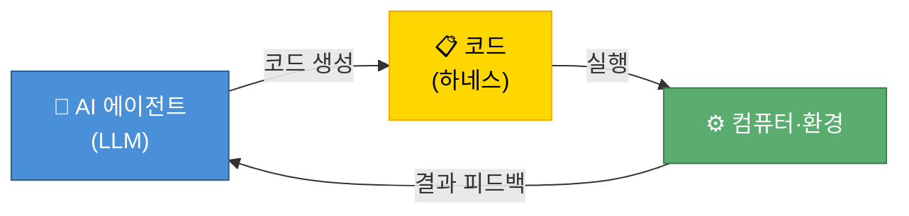

**코드가 하네스가 되면 세 가지가 달라집니다:**

| 기존 방식 | 하네스 방식 |
|---------|-----------|
| AI가 "이렇게 하면 될 것 같아요" 라고 말함 | AI가 코드로 써서 실제로 실행해봄 |
| 결과가 맞는지 사람이 판단해야 함 | 컴퓨터가 테스트를 돌려 자동으로 확인함 |
| 대화가 끝나면 맥락이 사라짐 | 코드 파일·저장소에 상태가 남아있음 |

---

## 3. 논문이 다루는 세 가지 큰 덩어리

논문은 "코드가 어떻게 하네스가 되는가"를 세 단계로 나눠서 설명합니다.

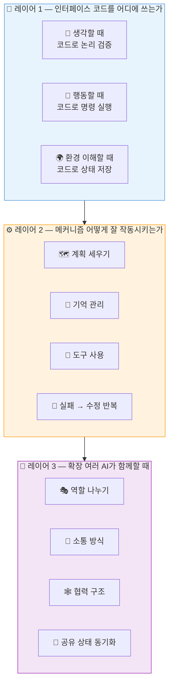

---

## 4. 레이어 1 — 코드를 어디에 쓰는가 (인터페이스)

### 4-1. 생각할 때 코드 쓰기 (Code for Reasoning)

AI가 어려운 수학 문제를 풀 때 어떻게 할까요? 말로 "음... 123에 456을 곱하면..." 이라고 계산하면 틀릴 수 있습니다. 하지만 파이썬 코드로 `print(123 * 456)` 을 실행하면 컴퓨터가 정확하게 계산해 줍니다.

이것이 바로 **생각의 도구로 코드 쓰기**입니다. 말 대신 코드로 논리를 표현하고, 그 코드를 실행해서 결과를 검증합니다.

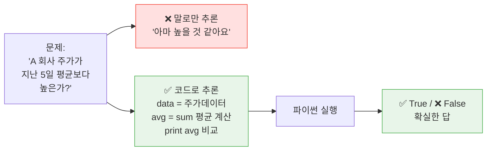

### 4-2. 행동할 때 코드 쓰기 (Code for Acting)

AI가 로봇에게 "물건을 집어서 상자에 넣어"라고 할 때, 자연어 명령보다 코드 함수 호출이 훨씬 정확합니다.

```python
# 자연어 명령보다 코드가 더 정밀하다
robot.pick_up(object="사과", location=(x=10, y=20, z=5))
robot.move_to(destination="상자")
robot.release()
```

이처럼 AI의 행동을 코드로 표현하면 **무엇을 했는지 기록이 남고**, **재사용도 가능**하며, **다른 AI에게 전달**할 수도 있습니다.

### 4-3. 환경 이해할 때 코드 쓰기 (Code for Environment Modeling)

AI가 GitHub 저장소에서 버그를 고친다고 가정해 봅시다. 저장소의 파일 구조, 어떤 함수가 어떤 파일에 있는지, 의존 관계는 어떤지를 코드로 모델링해두면, AI가 "지금 어디에 있고 무엇을 바꿔야 하는지"를 명확하게 알 수 있습니다.

---

## 5. 레이어 2 — 어떻게 잘 작동시키는가 (메커니즘)

코드를 루프 안에 넣은 다음에는 그 루프가 제대로 돌아가도록 하는 메커니즘이 필요합니다.

### 5-1. 계획 세우기 (Planning)

큰 작업을 작은 단계로 나누는 방법입니다.

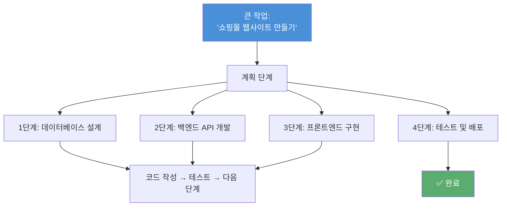

논문은 계획 방식을 네 가지로 분류합니다.

- **줄 세우기 계획:** 1→2→3 순서대로 실행하는 단순한 방식
- **구조 보고 계획:** 코드 저장소의 의존성 그래프를 먼저 파악하고 계획을 세우는 방식
- **여러 길 탐색 계획:** 체스처럼 여러 경우의 수를 검토하고 최선을 선택하는 방식
- **여러 AI 조율 계획:** 여러 AI가 각자 맡은 부분을 계획하고 서로 조율하는 방식

### 5-2. 기억 관리 (Memory)

AI는 대화가 끝나면 기억을 잃습니다. 장기 프로젝트에서는 이게 치명적인 문제입니다. 논문은 기억을 다섯 종류로 나눕니다.

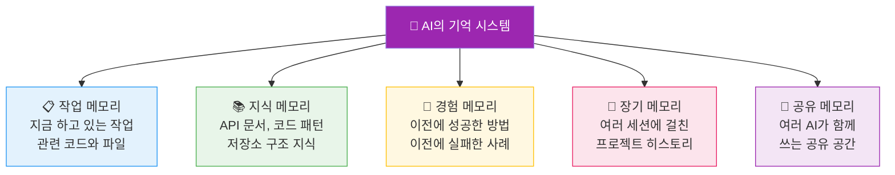

### 5-3. 도구 사용 (Tool Use)

AI가 파일을 읽고, 터미널에 명령을 치고, 외부 API를 호출하는 모든 행동이 "도구 사용"입니다. 논문은 이를 네 유형으로 나눕니다.

- **함수 도구:** 특정 기능을 수행하는 함수를 호출합니다. (예: 날씨 API 조회)
- **환경 도구:** 운영체제, 브라우저, 터미널과 직접 상호작용합니다.
- **검증 도구:** 만든 코드가 맞는지 확인하는 린터, 테스터를 실행합니다.
- **조율 도구:** 여러 도구를 순서에 맞게 연결하여 자동화합니다.

### 5-4. 실패 → 수정 반복 (Iterative Debugging)

이것이 하네스의 가장 중요한 부분입니다. 에러가 나면 그냥 포기하는 게 아니라, 에러 메시지를 읽고 자동으로 고칩니다.

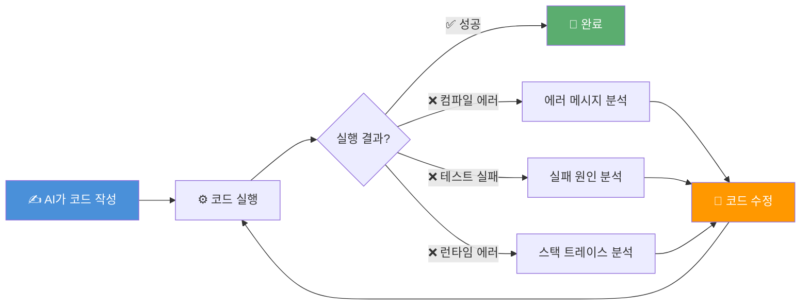

피드백의 종류는 다양합니다.

| 피드백 종류 | 예시 | 역할 |
|-----------|------|-----|
| 컴파일 에러 | "변수가 정의되지 않았습니다" | 문법 문제 알려줌 |
| 테스트 실패 | "예상: 5, 실제: 3" | 로직 문제 알려줌 |
| 런타임 에러 | "NullPointerException" | 실행 중 문제 알려줌 |
| 정적 분석 | "보안 취약점 발견" | 잠재 위험 알려줌 |
| 사람/다른 AI | "이 부분이 비효율적이에요" | 품질 개선 방향 알려줌 |

---

## 6. 레이어 3 — 여러 AI가 함께할 때 (확장)

혼자 하는 AI보다 팀으로 일하는 AI 여럿이 더 복잡한 일을 해결할 수 있습니다. 하지만 팀으로 일하려면 역할 분담, 소통 방식, 협력 구조가 필요합니다.

### 6-1. 역할 나누기 (Role Specialization)

실제 소프트웨어 회사처럼 AI도 역할을 나눕니다.

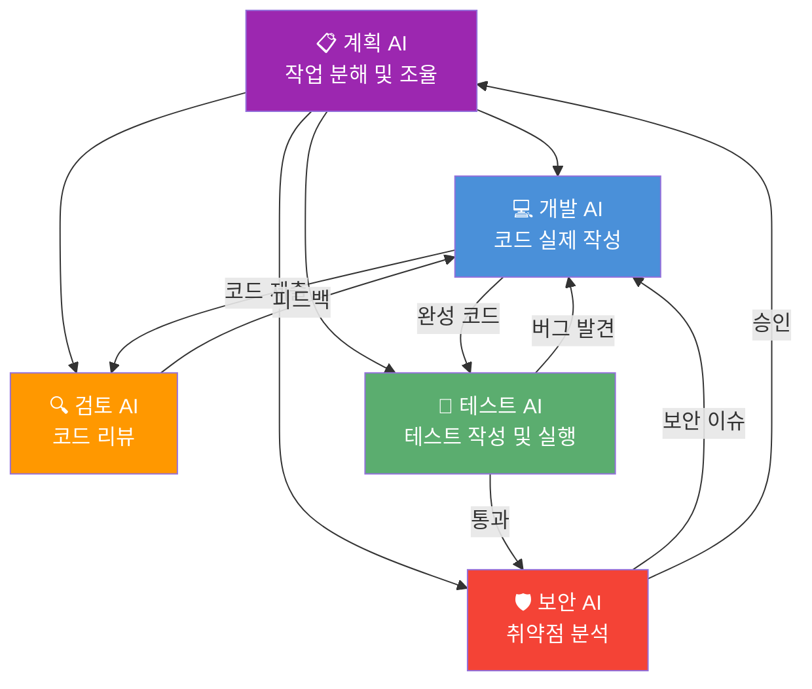

### 6-2. 협력 구조 (Workflow Topology)

어떤 순서와 구조로 AI들이 협력하느냐에 따라 성능이 크게 달라집니다.

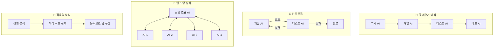

---

## 7. 논문이 강조하는 핵심 포인트 3가지

### ① "실행 결과가 거짓말을 안 한다"

AI가 "이 코드가 맞을 것 같다"고 말해도 틀릴 수 있습니다. 하지만 코드를 실행해서 테스트를 돌리면 통과/실패가 명확합니다. 코드 실행 결과는 객관적인 진실이고, 이것이 AI 에이전트를 훨씬 신뢰할 수 있게 만드는 핵심입니다.

### ② "실패가 정보다"

오류 메시지, 테스트 실패, 컴파일 에러는 모두 "무엇이 잘못됐는지"를 알려주는 귀중한 피드백입니다. 하네스는 이 피드백을 자동으로 수집해서 AI에게 돌려줍니다. AI는 이 피드백을 바탕으로 스스로 코드를 고칩니다.

### ③ "혼자보다 팀이 낫다"

단 하나의 AI가 모든 일을 하는 것보다, 각각 특화된 여러 AI가 역할을 나누면 더 복잡한 소프트웨어를 더 안정적으로 만들 수 있습니다. 코드라는 공유 기반이 있어서 AI들 사이의 협력이 가능합니다.

---

## 8. 이 논문에서 실제로 도움받을 수 있는 것들

이 논문은 순수 학술 연구이지만, 실용적인 인사이트를 많이 담고 있습니다.

### 🏢 AI 서비스를 만드는 개발자라면

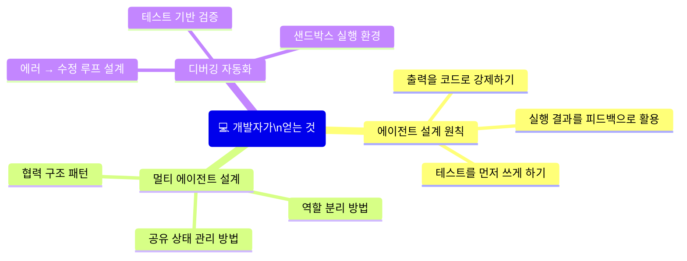

예를 들어, AI 코딩 어시스턴트를 만든다면:
- AI에게 코드를 바로 출력하게 하는 대신, 테스트를 먼저 쓰게 하고 그 테스트를 통과하는 코드를 쓰게 합니다.
- 코드 실행 결과를 자동으로 AI에게 피드백해서 스스로 고치게 합니다.
- 큰 작업은 여러 AI가 나눠서 처리하게 합니다.

### 🔬 AI 연구자라면

논문이 정리한 300편 이상의 관련 논문 목록이 연구 지도 역할을 합니다. 자신의 연구가 어떤 위치에 있는지, 앞으로 어떤 방향으로 나아가야 하는지를 파악할 수 있습니다.

### 🏭 기업에서 AI를 도입하려는 경영자·기획자라면

AI 도입이 실패하는 이유 중 하나는 "모델만 바꾸면 된다"는 오해입니다. 이 논문은 **"모델이 아니라 하네스가 성능을 결정한다"** 는 것을 실증적으로 보여줍니다.

OpenAI의 Codex 팀도 "초반 진행이 느렸던 건 모델 능력 부족이 아니라, 환경(하네스)이 제대로 설계되지 않았기 때문"이라고 회고했습니다.

즉, AI를 잘 쓰려면 **모델 선택**만큼이나 **실행 환경 설계**에 투자해야 합니다.

### 📚 AI에 관심 있는 일반인이라면

Claude Code, GitHub Copilot, ChatGPT의 코드 해석 기능 등 **우리가 일상적으로 쓰는 AI 도구들이 왜 그렇게 작동하는지** 를 이해하는 데 도움을 줍니다. 이 도구들이 단순히 "텍스트를 생성하는 도구"가 아니라, 실행·검증·기억·협력이 엮인 정교한 시스템이라는 것을 알 수 있습니다.

---

## 9. 논문이 제시하는 앞으로의 방향 (미해결 과제)

논문은 솔직하게 "아직 해결되지 않은 문제들"을 제시합니다. 이 부분이 향후 연구의 로드맵입니다.

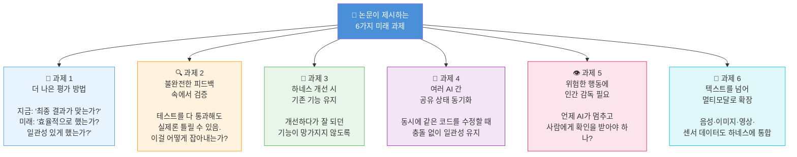

### 과제 1: 더 똑똑한 평가 방법 만들기

지금 AI 코딩 능력 테스트는 "문제를 풀었는가, 못 풀었는가"만 봅니다. 하지만 같은 문제를 푸는 데 100번 시도한 AI와 3번 시도한 AI는 분명히 다릅니다. 앞으로는 얼마나 효율적으로, 얼마나 일관성 있게, 얼마나 설명 가능한 방식으로 문제를 풀었는지도 평가해야 합니다.

실제로 **"SWE-bench에서 해결됐다고 표시된 이슈들도 실제로는 틀린 방식으로 해결된 경우가 많다"** 는 연구가 이미 나왔습니다. 평가 방법 자체가 아직 미성숙하다는 뜻입니다.

### 과제 2: 불완전한 피드백 속에서 검증하기

테스트를 모두 통과했다고 해서 코드가 완전히 옳은 건 아닙니다. 테스트가 모든 경우를 커버하지 못할 수 있고, 현실에서는 예상치 못한 입력이 들어오기도 합니다. AI가 테스트 통과 여부를 넘어서 더 깊은 수준에서 코드의 정확성을 판단하는 능력이 필요합니다.

### 과제 3: 개선해도 이전 기능이 망가지지 않게

AI 하네스를 더 좋게 만들다 보면, 이전에 잘 되던 기능이 갑자기 안 되는 "회귀(regression)" 문제가 생길 수 있습니다. 사람이 만드는 소프트웨어에서도 흔한 문제인데, AI 하네스도 마찬가지입니다. 하네스를 안전하게 점진적으로 개선하는 방법이 필요합니다.

### 과제 4: 여러 AI가 동시에 작업할 때 충돌 막기

여러 AI가 동시에 같은 파일을 수정하면 충돌이 발생합니다. 이건 개발자들이 Git을 쓸 때도 겪는 문제인데, AI 팀에서는 더 복잡합니다. 멀티 에이전트 시스템에서 각 AI가 서로의 작업 내용을 일관성 있게 파악하고 충돌 없이 협력하는 방법을 찾아야 합니다.

### 과제 5: 언제 AI가 사람에게 확인받아야 하는가

AI가 데이터베이스를 삭제하거나, 돈을 이체하거나, 서버를 재시작하는 행동을 자율적으로 해도 될까요? 위험하거나 되돌리기 어려운 행동을 하기 전에 AI가 사람에게 확인을 받는 시스템이 필요합니다. 하지만 매번 확인받으면 자동화의 의미가 없어지죠. **어느 선에서 AI가 자율적으로 행동하고, 어느 선에서 사람의 승인을 받아야 하는지** 의 기준을 세우는 것이 중요한 과제입니다.

### 과제 6: 텍스트를 넘어 멀티모달로 확장

지금 코드 하네스 연구는 주로 텍스트 코드를 다룹니다. 하지만 현실 세계의 AI 에이전트는 카메라 영상, 마이크 음성, 로봇 센서 데이터 등 다양한 형태의 정보를 다뤄야 합니다. 이런 다양한 정보를 코드 하네스 안에 통합하는 것이 다음 도전입니다.

---

## 10. 실생활 예시로 전체 개념 정리

**"AI에게 온라인 쇼핑몰의 버그를 찾아서 고쳐달라고 한다"** 고 가정해봅시다.

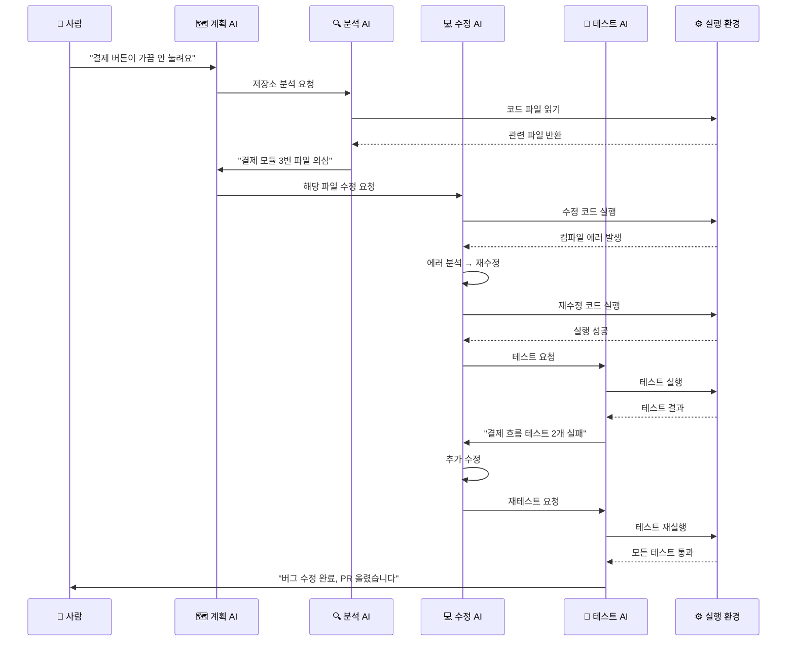

이 과정에서:
- **코드가 인터페이스(레이어1):** AI들이 코드를 읽고 쓰며 소통합니다.
- **계획·메모리·피드백(레이어2):** 계획 AI가 조율하고, 에러 메시지가 피드백이 되며, 저장소 정보가 기억 역할을 합니다.
- **멀티 에이전트(레이어3):** 네 개의 AI가 역할을 나눠 협력합니다.

---

## 11. 핵심 정리

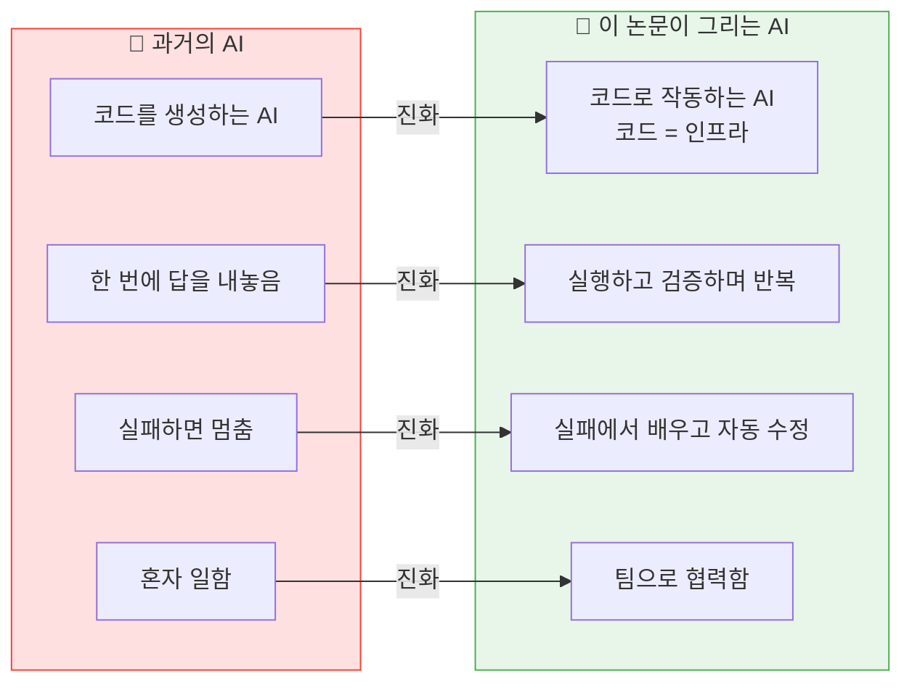

이 논문의 핵심 메시지를 딱 세 줄로 정리하면:

1. **코드는 AI의 출력물이 아니라, AI가 일하는 환경 자체다.**
2. **실행 결과가 거짓말을 안 한다. 그래서 코드가 최고의 피드백 도구다.**
3. **아무리 좋은 AI 모델도, 제대로 된 하네스(실행 환경) 없이는 제 능력을 발휘 못 한다.**

---

*이 문서는 [arXiv:2605.18747](https://arxiv.org/abs/2605.18747) "Code as Agent Harness"의 내용을 일반 독자도 이해할 수 있도록 풀어쓴 해설입니다. 기술적 세부사항은 원본 논문과 별첨 상세 해설 문서를 참고하세요.*
