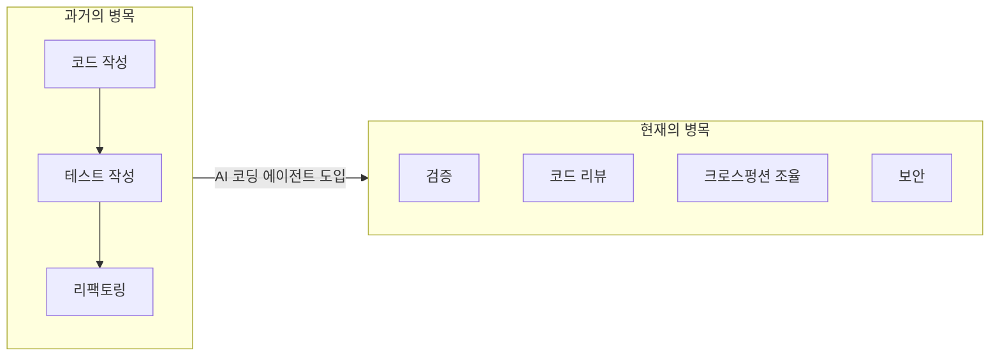
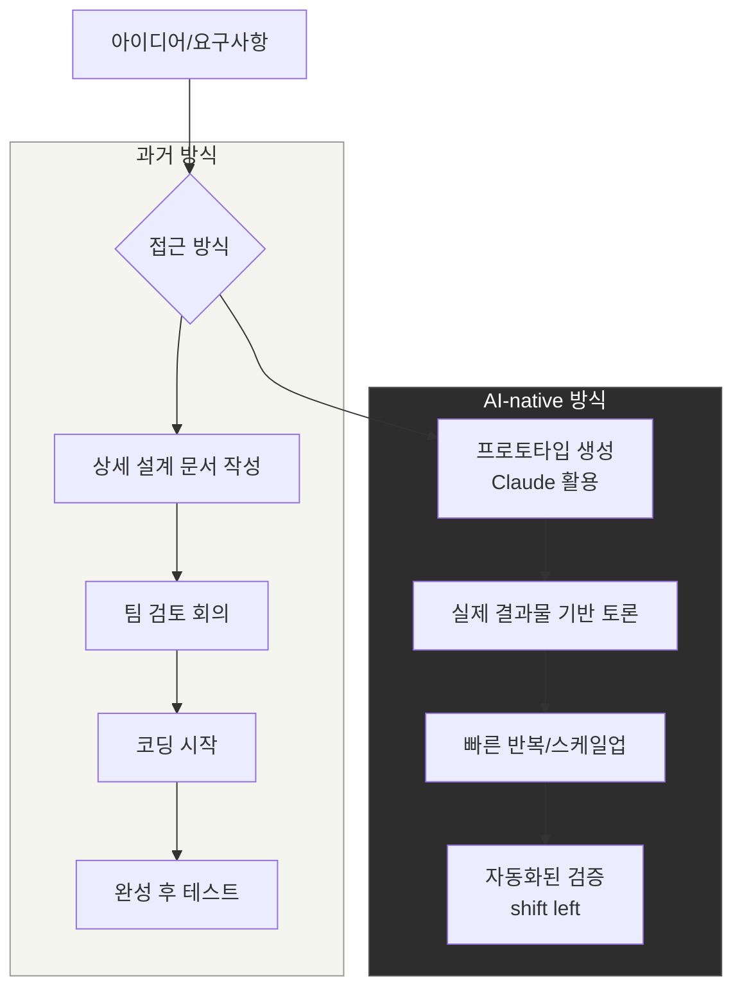
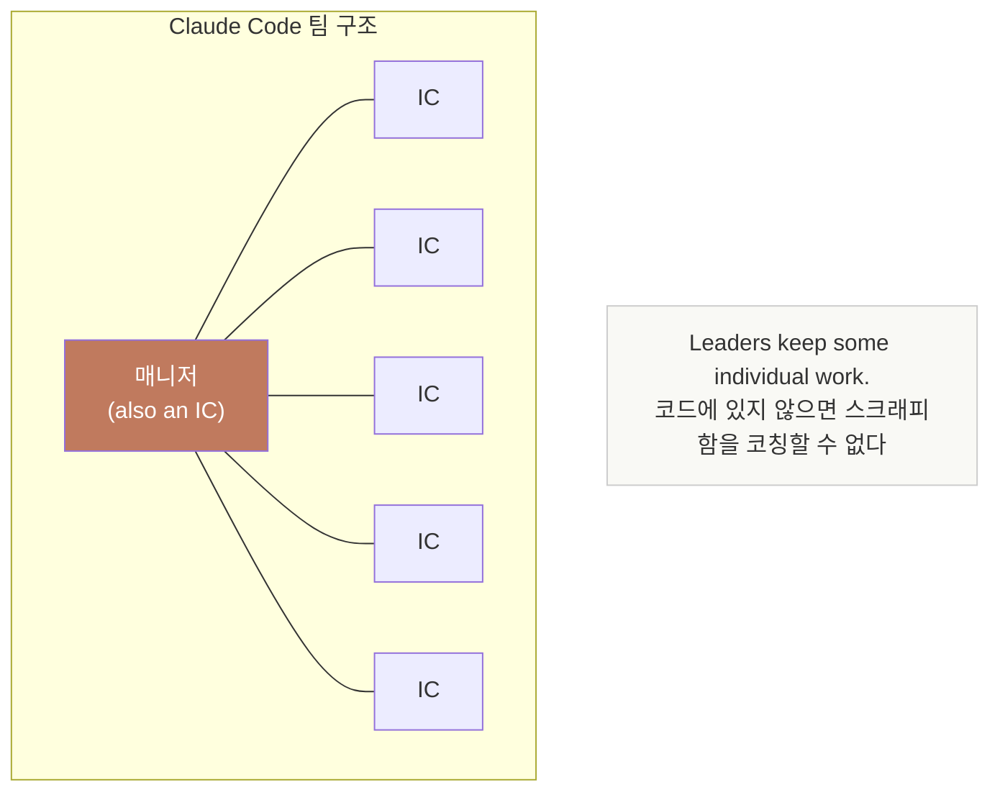
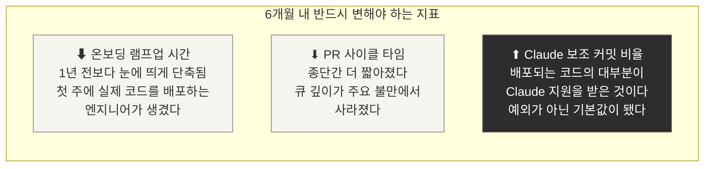
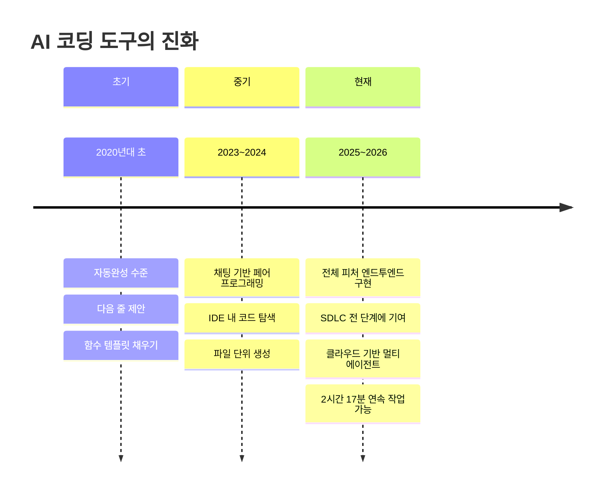
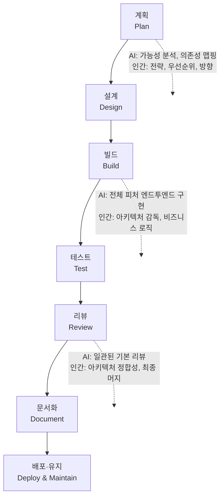
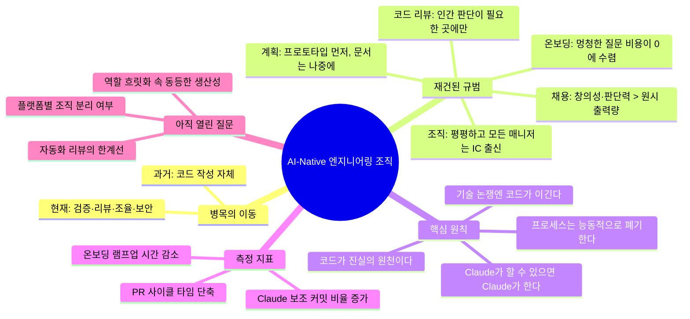

> **출처 1**: Fiona Fung (Anthropic, Claude Code & Cowork 엔지니어링·프로덕트 리더) — [*"Running an AI-native engineering org"*](claude/session/ldn-running-an-ai-native-engineering-org), Code with Claude 2026 London (2026년 5월 22일 녹화 공개)
>
> **출처 2**: OpenAI Codex 개발자 문서 — [*"Building an AI-Native Engineering Team"*](https://developers.openai.com/codex/guides/build-ai-native-engineering-team) (2025년 8월 기준 데이터 포함)

---

## 들어가며

AI 코딩 에이전트가 개인 도구에서 조직 전체의 기본값(default)으로 자리 잡는 순간, 진짜 어려운 과제는 도구 자체가 아니라 **조직의 프로세스**라는 사실이 드러난다.

Anthropic의 Claude Code와 Cowork를 이끄는 Fiona Fung은 2026년 5월 Code with Claude 런던 컨퍼런스에서 이 주제를 정면으로 다뤘다. 그녀는 Meta와 Microsoft에서도 팀을 이끈 경험을 바탕으로, Anthropic 내부에서 실제로 겪은 병목의 이동, 사라진 팀 규범들, 새롭게 재건한 원칙들, 그리고 실제 효과를 입증하는 지표들을 솔직하게 공유했다. 같은 시기, OpenAI 역시 Codex를 중심으로 한 AI-native 엔지니어링 팀 구축 가이드를 공식 개발자 문서로 발행했다.

이 두 문서는 서로 다른 회사에서 출발했지만 놀랍도록 유사한 결론에 도달한다. AI 코딩 에이전트가 소프트웨어 개발 라이프사이클(SDLC) 전반에 걸쳐 기여하기 시작하면, 엔지니어링 조직의 병목 지점, 팀 구조, 채용 기준, 지식 공유 방식이 모두 바뀌어야 한다는 것이다.

---

## 1부: 병목이 이동했다 — Anthropic의 관찰

### 과거의 병목: 코드를 쓰는 것 자체

수십 년간 소프트웨어 엔지니어링에서 가장 비싼 자원은 **엔지니어의 시간**이었다. 코드를 작성하고, 테스트를 작성하고, 리팩토링하는 작업 하나하나가 곧 비용이었기 때문에, 모든 팀 프로세스는 이 희소한 자원을 보호하는 방향으로 설계되었다.

Fiona Fung은 2000년대 초 Microsoft Visual Studio 팀에서의 경험을 예시로 든다. 당시에는 클라우드 자체가 존재하지 않았고, 빌드 시스템은 서버 한 대에 몰려 있었으며, PR을 한 번에 6개밖에 머지할 수 없었다. 테스트가 실패하면 어느 PR이 원인인지 일일이 디버깅해야 했다. 이후 클라우드와 지속적 빌드(continuous build)가 등장하면서 그 병목은 해소되었다. Fiona가 강조하는 것은, 지금 일어나고 있는 변화가 **또 한 번의 병목 이동**이라는 점이다.

### 새로운 병목: 코드 주변의 모든 것

Claude Code 팀에서 코딩은 더 이상 느린 부분이 아니다. 이제 느린 부분은 다음과 같다.

```
[과거의 병목]
코드 작성 · 테스트 작성 · 리팩토링

              ↓ AI 코딩 에이전트 등장

[현재의 병목]
검증(Verification) · 리뷰(Review) · 크로스펑션(XFN) · 보안(Security)
```

처리량(throughput)이 극적으로 늘어난 결과, 팀은 새로운 질문들을 마주하게 된다.

- **이게 맞는 건가?** (Is this correct?) — 검증의 문제
- **누가 리뷰하는가?** (Who reviews?) — 리뷰 역할 분배의 문제
- **어떻게 유지보수하는가?** (How's it maintained?) — 스케일에 따른 유지비용의 문제



---

## 2부: 조용히 작동을 멈춘 프로세스들

Fiona Fung이 강조하는 개념 중 하나는 **"조용히 작동을 멈추는(quietly stops working)"** 프로세스다. 어떤 프로세스든 처음에는 문제를 해결하기 위해 만들어진다. 그런데 시간이 지나면서 그 문제 자체가 사라지거나 변했음에도, 프로세스는 관성에 의해 살아남는다. 아무도 명시적으로 폐기를 선언하지 않기 때문에.

AI 코딩 에이전트의 도입으로 다음 다섯 가지 영역의 기존 프로세스가 조용히 유효성을 잃기 시작했다.

| 영역 | 변화의 내용 |
|------|------------|
| **계획 규범 (Planning norms)** | 엔지니어링 속도와 처리량이 근본적으로 달라졌다 |
| **코드 소유권 (Code ownership)** | "누가 이걸 작성했나"는 점점 이상한 질문이 되어간다 |
| **코드 리뷰 (Code review)** | 새로운 형태, 새로운 규모, 새로운 도구가 등장했다 |
| **팀 구성 (Team make-up)** | 역할이 흐릿해지고 있다. 이제 어떤 스킬셋이 중요한가? |
| **지식 공유 (Knowledge sharing)** | 문서(documentation)는 더 이상 진실의 원천이 아니다 |

이 다섯 가지는 단순한 불편함이 아니다. 기존 방식으로 계속 운영할 경우 오히려 팀의 발목을 잡는 요소로 변한다는 것이 Fiona의 핵심 주장이다.

---

## 3부: 바닥부터 다시 세운 다섯 가지 규범

### 규범 1: 코드 리뷰 — 인간의 판단이 실제로 필요한 곳에만

Claude Code 팀은 코드 리뷰를 전면 재설계했다. 핵심은 **모든 것을 리뷰하는 것이 아니라, 인간의 판단이 실제로 필요한 부분을 식별하는 것**이다.

Claude가 잘 처리하는 영역과 여전히 인간이 필요한 영역을 명확히 분리한다.

**Claude가 담당하는 영역:**
- 스타일과 린트(style and lint)
- 명백한 버그(obvious bugs)
- 스펙 드리프트(spec drift) 및 누락된 테스트
- 반복 패턴과 버그 바운티 트리아지(triage)

**여전히 인간 리뷰어가 필요한 영역:**
- 법적 검토(legal review)
- 리스크 허용 범위(risk tolerance) 판단
- 제품 감각과 미적 판단(product sense and taste)
- 신뢰 경계와 보안에 민감한 코드(trust boundaries, security-sensitive code)

Fiona는 구체적인 예시를 들었다. 지난 12월, CLI에서 Claude 아이콘을 눈사람으로 바꾸려 했을 때, 직접 코드를 만들고 디자이너에게 리뷰를 요청했다. 디자이너는 "이건 눈사람이 아니라 Mr. Peanut(미국의 땅콩 마스코트)처럼 생겼다"고 정확히 지적했다. 이것이 바로 제품 감각(product sense)이 인간 리뷰에서만 얻을 수 있는 가치다.

또한 Fiona는 코드베이스에 스펙(spec)을 체크인해 놓을 것을 권장한다. Claude가 스펙 드리프트(spec drift) 여부를 자동으로 검증할 수 있어 품질 관리에 실질적 도움이 되기 때문이다.

---

### 규범 2: 온보딩 — "멍청한 질문"의 비용이 0에 수렴

과거 온보딩에서 신입 엔지니어가 느끼는 가장 큰 심리적 장벽 중 하나는 "기본적인 질문을 하면 팀원의 시간을 빼앗는다"는 부담감이었다. 베테랑 엔지니어들은 바쁘고, 코드베이스를 배우는 과정에서 발생하는 수백 가지 소소한 질문들은 그 자체로 팀 전체의 비용이었다.

Claude Code 팀에서 이 비용은 사실상 0에 수렴했다. Fiona는 자신의 온보딩 경험을 직접 공유한다. 새 팀에 합류하면서 처음으로 기술 딥다이브를 사람이 아닌 Claude와 함께 진행했다. 버그 수정에 착수하기 전 Claude에게 "이 버그 주변의 코드 영역에 대해 먼저 가르쳐 달라"고 요청했고, Claude는 표면 영역 전체를 설명해 주었다. 

"이전에는 엔지니어에게 질문하면 그들의 시간을 빼앗는 것 같아 미안했는데, 이제 Claude에게 물어보면서 그런 죄책감 없이 자유롭게 배울 수 있게 됐다"는 것이 Fiona의 설명이다.

온보딩의 실질적 개선을 나타내는 지표로, Fiona는 **첫 PR까지 걸리는 시간(onboarding ramp-up time)** 이 지속적으로 단축되고 있다고 언급한다. 이제 입사 첫 주에도 실제 코드를 배포하는 엔지니어가 나오고 있다.

---

### 규범 3: 계획 — 사전 설계 문서 축소, 프로토타입 우선

과거의 계획 프로세스는 코딩이 비쌌기 때문에 설계되었다. 코딩을 시작하기 전에 확신을 최대화하기 위해 긴 설계 문서(design doc)를 작성하고 검토하는 방식이 당연했다. 그런데 코딩 자체가 싸지면 이 논리는 무너진다.

Fiona는 두 가지 새로운 원칙을 제시한다.

**기술적 논쟁에서는 코드가 이긴다 (In technical debates, code wins)**

팀원들이 설계 방향을 두고 논쟁할 때, 화이트보드 앞에 서서 토론하는 대신 Claude로 두 가지 버전을 모두 프로토타이핑해서 실제 결과물을 놓고 비교하는 방식을 쓴다. "짓는 것은 싸고, 논쟁하는 것은 비싸다(Building is cheap. Arguing is expensive.)" Fiona는 Boris와의 리팩토링 논쟁에서 화이트보드 대신 세 가지 버전의 PR을 직접 생성해 코드 임팩트와 콜러(callee) 영향을 비교한 경험을 소개했다.

**프로토타입 먼저, 문서는 나중에 (Less upfront. More prototype.)**

Claude Code 팀의 대부분의 기술적 토론은 설계 문서가 아닌 PR이나 프로토타입 안에서 이루어진다. 과거에 프로토타이핑에는 딜레마가 있었다. 빠르게 만들다 보면 코너를 자르게 되고, 그 결과물이 프로덕션에 그대로 올라갈 수 있다는 우려 때문이었다. 그러나 Fiona는 이제 Claude 덕분에 프로토타입을 시작점으로 삼고, 이후 프로덕션 수준으로 빠르게 스케일업할 수 있다고 말한다.

무엇을 줄였는가? "코딩 전에 설계 문서 먼저" 의식(the "design doc before any code" ritual). 대부분의 경우 이건 연극에 가까웠다. 문서가 필요하다면, 코드 이후에 작성하면 된다.

무엇을 강화했는가? **검증(Verification)**. AI-native 흐름에서 무언가가 잘못되면, 예전과는 다른 방식으로 잘못된다. 품질을 확보하기 위한 유일한 방법은 검증을 자동화해서 "shift left"(소스에 더 가깝게 오류를 잡는 것)하는 것이다.



---

### 규범 4: 채용 — 원시 출력량보다 창의성과 판단력

역할의 경계가 흐릿해지면서 채용 기준도 재정의되었다. Fiona는 현재 두 가지 엔지니어 프로필에 집중한다.

**프로필 1: 제품 감각을 가진 창의적 빌더 (Creative builders with product sense)**

무엇을 만들어야 할지 파악하고 빠르게 프로토타입으로 만들어낼 수 있는 사람. "Taste is scarce, typing is not.(취향은 희소하고, 타이핑은 그렇지 않다.)" 코드를 얼마나 많이 쓸 수 있는지보다, 무엇을 만들기로 선택하고 그게 맞다는 걸 어떻게 아는지가 더 중요하다.

**프로필 2: 깊은 시스템 전문가 (Deep systems experts for the hard parts)**

"trust but verify(믿되 검증하라)"가 가장 중요한 영역을 다루는 사람. 미묘하게 잘못된 것(subtly wrong)도 여전히 잘못된 것이다. 보안, 아키텍처, 신뢰 경계처럼 AI가 틀렸을 때 비용이 가장 큰 부분에서 깊은 전문성을 갖춘 사람이 필요하다.

Fiona가 덜 중시하게 된 것은 **원시 출력량(raw output)** — 시간당 몇 줄의 코드를 쓸 수 있는지가 아니다. 이제 타이핑은 병목이 아니므로, 그 능력을 기준으로 채용하는 것은 의미가 없다.

---

### 규범 5: 조직 형태 — 평평하고 모든 매니저는 IC 출신

Fiona는 Claude Code 팀에서 10:1 매니저-IC 비율을 채택하지 않는다. 대신:

- **가능한 한 평평한 조직**을 유지한다. 매니저는 작업 팟(pod)을 지원하되, 사람들이 작업이 있는 곳으로 유연하게 이동할 수 있도록 애자일하게 운영한다.
- **모든 매니저는 IC(Individual Contributor)로 먼저 시작**한다. 팀원을 관리하는 책임을 지기 전에, 직접 코드베이스에서 구르며 엔지니어로서의 경험을 쌓는 시간을 갖는다.

Fiona가 이 규범을 만든 이유는 분명하다. "직접 코드에 있지 않으면 스크래피함(scrappiness)을 코칭할 수 없다. 내가 엔지니어들에게 빠르게 프로토타이핑하고 버리라고 요청한다면, 나도 그렇게 해야 한다."

또한 매니저가 직접 IC로 활동하는 것이 제품을 손으로 경험하는 가장 좋은 방법이기도 하다. 예전에는 코드베이스에 다시 들어가는 것이 두려운 일이었지만, Claude 덕분에 온보딩 부담이 크게 줄었다고 Fiona는 말한다.



---

## 4부: 크로스펑션 갭을 Claude로 메우다

AI 코딩 에이전트의 등장으로 엔지니어링 팀 내 크로스펑션(cross-functional) 협업 방식도 달라졌다. Fiona는 디자이너가 UX 폴리시 수정을 Claude로 직접 적용하는 사례를 든다.

과거에는 이런 방식이었다.

```
엔지니어가 버그 수정 배포 → 컨텐츠 디자이너 기다림 → 며칠 후 배포하거나 어설픈 카피 그냥 배포
```

이제는 이렇게 된다.

```
엔지니어가 버그 수정 배포 → Claude가 카피 초안 작성 → 인간이 결정 → 당일 배포
```

XFN 갭은 더 이상 병목이 아닌 협력자가 된다. 인간은 여전히 결정하지만, 이제 인간이 첫 번째 초안을 만드는 사람이 아니게 됐다.

이 변화는 엔지니어에게도 동일하게 적용된다. Fiona 본인도 버그 수정 중 짧은 카피 문구가 필요할 때 Claude를 컨텐츠 디자인 파트너로 활용했다. 엔지니어가 문장을 너무 장황하게 쓰는 경향이 있는데, Claude가 간결하고 명확한 표현을 제안해 준다는 것이다.

---

## 5부: 지식 공유 — 코드가 진실의 원천이다

과거 팀에 합류할 때 Fiona는 모든 엔지니어를 만나 기술적 딥다이브를 진행했다. 주요 목적은 시스템 구조를 파악하는 것이었다. 이제 그 역할의 상당 부분을 Claude가 담당한다.

Claude Code 팀에서는 **코드(codebase) 자체가 진실의 원천(source of truth)** 이다. Fiona가 팀에 합류했을 때, 기술 딥다이브를 처음으로 사람이 아닌 Claude와 함께 진행했다. Claude는 코드베이스를 읽고 구조를 설명하며, 관련 영역의 맥락을 제공했다.

이 패러다임 전환에서 중요한 실천 지침은 다음과 같다. 어떤 스펙(spec)이든 **코드베이스에 체크인**해 두면, Claude가 그것을 기준으로 스펙 드리프트를 검증할 수 있다. 문서는 업데이트 루프에서 벗어나면 금방 구식이 되지만, 코드와 함께 관리되는 스펙은 최신 상태를 유지하기 쉽다.

Fiona는 이렇게 말한다. "엔지니어들을 만나는 것은 여전히 중요하다. 다만 이제 대화의 내용이 달라졌다. 시스템 구조를 배우는 대신, 지금 가장 신경 쓰는 것들에 대해 이야기한다."

---

## 6부: 어떻게 롤아웃했나 — 탑다운과 바텀업의 균형

Fiona는 이 모든 변화를 팀 전체에 적용할 때, 무엇을 위에서 정하고 무엇을 팀 자율에 맡겼는지를 명확히 했다.

### 팀 전체에 강제된 원칙들 ("Must-do", forcing function)

1. **모든 팀원이 Claude Code와 Cowork를 사용한다.** 만드는 제품을 직접 쓰는 것은 협상 불가능한 원칙이다.
2. **Claudify everything you can (가능한 모든 것을 Claude화)** — "Claude가 할 수 있다면, Claude가 해야 한다." 이 질문을 항상 던지는 것이 기본 자세다.
3. **구 프로세스를 폐기할 명시적 허가.** 프로세스는 스스로 사라지지 않는다. 누군가 의도적으로 "이건 더 이상 필요 없다"고 선언해야 한다.

### 팀/팟 단위의 자율 영역 (bottoms-up)

- Claude가 각 팀의 트리아지(triage)에서 어떻게 활용되는지
- 플래닝 리추얼, 스탠드업, 온콜(on-call) 구성
- 어떤 워크플로우를 먼저 Claudify할 것인지

Fiona가 발견한 것은, 전체 팀 문화에 대한 정렬과 각 팟의 자율성 사이에서 균형을 잡는 것이 핵심이라는 점이다.

---

## 7부: 이것이 실제로 작동하고 있다는 세 가지 지표

Fiona는 도입이 실제로 효과를 내고 있는지 판단할 수 있는 세 가지 핵심 지표를 제시한다. 6개월 이내에 이 지표들이 움직이지 않는다면, AI 채택이 실제로 작동하지 않는다는 신호다.



Fiona는 PR 사이클 타임에 대해 중요한 주의사항을 덧붙인다. 전체 사이클 타임만 볼 것이 아니라, 각 단계(빌드 시간, CI 대기 시간, 리뷰 시간 등)를 분해해서 어디가 막히고 있는지 파악해야 한다. 처리량이 늘었는데 CI 시스템이 따라잡지 못한다면, PR 사이클 타임이 줄지 않을 수도 있다. 이건 AI 채택의 실패가 아니라 인프라의 병목이다.

마지막으로, 처리량 이상으로 중요한 것은 **실제 제품이 더 좋아지고 있는가**다. 팀이 해결하려는 문제를 측정하는 방법을 갖추는 것이, 단순히 커밋 수를 세는 것보다 훨씬 중요하다.

---

## 8부: Fiona가 여전히 풀고 있는 세 가지 질문

Fiona는 솔직하게 아직 해결하지 못한 질문들도 공유했다.

**1. iOS와 Android 조직을 분리할 필요가 여전히 있는가?**

전통적으로 모바일 팀은 iOS와 Android로 분리되어 있었다. 하지만 Claude 덕분에 엔지니어들이 모바일 플랫폼을 더 쉽게 넘나들 수 있게 되면서, 이 분리가 여전히 필요한지에 대한 의문이 생겼다.

**2. 완전 자동화 리뷰를 어디까지 밀어붙일 수 있는가?**

"충분히 빠름"과 "중요한 무언가를 잃었음" 사이에는 선이 있다. 그 선을 어떻게 식별하고 관리할 것인가.

**3. 역할이 흐릿해지는 상황에서 모든 구성원이 동등하게 생산적일 수 있는가?**

검증이 핵심 과제가 된 지금, 어떤 역할을 맡은 사람이든 자신의 변경 사항에 대해 확신을 가질 수 있도록 어떻게 지원할 것인가.

---

## 9부: OpenAI의 시각 — SDLC 전체를 AI 에이전트와 함께

같은 시기 OpenAI는 Codex 개발자 문서를 통해 AI-native 엔지니어링 팀 구축에 대한 가이드를 발행했다. 이 문서는 소프트웨어 개발 라이프사이클(SDLC)의 각 단계를 구체적으로 분석한다.

### AI 코딩 도구의 진화 궤적

METR의 2025년 8월 연구 결과에 따르면, 최전선 모델들은 약 50%의 성공 확률로 **2시간 17분** 분량의 연속 작업을 완료할 수 있다. 이 능력은 약 7개월마다 두 배씩 향상되고 있다. 불과 몇 년 전만 해도 모델은 약 30초 분량의 추론만 가능했다.



### AI 코딩 에이전트의 핵심 역량

OpenAI가 정의하는 현재 코딩 에이전트의 핵심 역량은 네 가지다.

| 역량 | 의미 |
|------|------|
| **통합된 시스템 컨텍스트** | 단일 모델이 코드, 설정, 텔레메트리를 함께 읽고 일관된 추론을 제공한다 |
| **구조화된 도구 실행** | 컴파일러, 테스트 러너, 스캐너를 직접 호출해 정적 제안이 아닌 검증 가능한 결과를 만든다 |
| **영구적 프로젝트 메모리** | 긴 컨텍스트 윈도우와 compaction으로 기획에서 배포까지 이전 설계 결정을 기억하며 따라간다 |
| **평가 루프** | 모델 출력을 유닛 테스트, 레이턴시 목표, 스타일 가이드 등 벤치마크에 자동으로 테스트한다 |

### SDLC 7단계별 AI 에이전트의 역할

OpenAI는 AI 코딩 에이전트가 SDLC의 각 단계에서 어떻게 역할을 분담하는지를 "위임(Delegate) - 검토(Review) - 소유(Own)"의 3단계로 정리한다.



**1. 계획 단계**: AI 에이전트가 스펙을 읽고 코드베이스와 대조해 모호성, 엣지 케이스, 의존성을 표면화한다. 우선순위, 장기 방향, 트레이드오프 판단은 인간이 담당한다.

**2. 설계 단계**: AI가 보일러플레이트를 스캐폴딩하고 디자인 시스템을 구현하며, 여러 프로토타입을 몇 시간 만에 이터레이션한다. 설계 시스템 전체 방향, UX 패턴, 아키텍처 결정은 인간이 소유한다.

**3. 빌드 단계**: 에이전트는 잘 명세된 피처에 대해 데이터 모델, API, UI 컴포넌트, 테스트, 문서를 한 번에 만들어낸다. 인간은 구현자에서 감독자·편집자로 역할이 이동한다.

**4. 테스트 단계**: AI는 요구사항 문서와 피처 코드를 읽고 테스트 케이스를 제안하며 엣지 케이스와 실패 모드를 파악한다. 테스트의 의도와 커버리지 전략은 인간이 소유한다.

**5. 코드 리뷰 단계**: AI 코드 리뷰는 모든 PR에 일관된 기본 리뷰를 제공한다. 전통적인 정적 분석과 달리, 모델은 코드를 실제로 실행하고 런타임 동작을 해석하며 파일과 서비스를 가로지르는 로직을 추적할 수 있다. 최종 머지와 코드의 프로덕션 동작에 대한 책임은 엔지니어가 진다.

**6. 문서화 단계**: AI가 코드베이스를 읽고 기능 요약, Mermaid 다이어그램, 릴리즈 노트를 생성한다. 엔지니어는 문서 구조를 설계하고 "왜(why)"를 추가하며 외부 공개 문서를 검토한다. `AGENTS.md`에 문서 업데이트 지침을 포함시키면 매 작업마다 자동으로 반영된다.

**7. 배포·유지 단계**: AI가 로그를 분석하고 이상 지표를 표면화하며 관련 코드 변경을 추적한다. MCP 서버를 통해 로깅 시스템과 코드베이스를 통합하면, 인시던트 대응 시간을 크게 줄일 수 있다. Virgin Atlantic은 Codex VS Code 확장을 통해 Azure DevOps MCP와 Databricks Managed MCP를 IDE 안에서 통합해 운영 컨텍스트를 단일화했다.

---

## 10부: 두 회사가 수렴하는 핵심 원칙들

서로 다른 출발점에서 시작한 Anthropic과 OpenAI의 실전 경험은 몇 가지 공통된 원칙으로 수렴한다.

### 원칙 1: 코드를 실행할 수 있는 루프를 만들어라

OpenAI의 가이드는 `AGENTS.md`에 테스트와 린터를 실행하는 에이전트 루프를 설정할 것을 강조한다. Anthropic의 Fiona는 검증 자동화를 "shift left"하는 것이 가장 중요하다고 말한다. 두 접근 모두 에이전트가 실행-검증-수정의 루프를 스스로 돌릴 수 있는 환경을 구축하는 것이 핵심임을 강조한다.

### 원칙 2: 잘 명세된 작업부터 시작하라

OpenAI는 명시적으로 "잘 명세된 작업부터 시작하라(start with well-specified tasks)"고 권고한다. Fiona의 "코드가 논쟁을 이긴다"는 원칙도, 프로토타이핑이 가능하려면 명세가 충분히 구체적이어야 한다는 전제를 깔고 있다.

### 원칙 3: AGENTS.md / CLAUDE.md를 진지하게 다루되 간결하게 유지하라

OpenAI는 AGENTS.md에 테스트 커버리지 가이드라인, 문서 업데이트 지침, 실행 가능한 명령들을 포함시킬 것을 권고한다. 이 파일은 에이전트가 팀의 컨벤션과 규칙을 따르도록 하는 핵심 인터페이스다.

### 원칙 4: 인간의 판단이 필요한 영역을 명확히 정의하라

두 문서 모두 AI에게 완전히 위임해서는 안 되는 영역을 명확히 한다. Anthropic의 기준에서는 법적 검토, 리스크 허용 범위, 제품 감각, 보안 민감 코드가 그 영역이다. OpenAI의 기준에서는 전략적 우선순위, 아키텍처 방향, 코드의 프로덕션 책임이 그 영역이다.

### 원칙 5: 프로세스는 능동적으로 폐기되어야 한다

"사람들은 프로세스를 스스로 삭제하지 않는다. 새 프로세스 위에 쌓아 올릴 뿐이다. 폐기될 수 있는 것들을 명시하라."는 Fiona의 원칙은, OpenAI가 강조하는 "작은 것부터 시작해 컴파운딩 효과를 만들어라"와 맥을 같이한다.

---

## 실천을 위한 제안: 지금 당장 할 수 있는 한 가지

Fiona Fung은 청중에게 한 가지 과제를 남겼다.

> **"당신의 팀에서 가장 시끄러운 워크플로우 하나를 골라라. 그리고 그게 여전히 존재해야 할 이유가 있는지 물어라. 엔지니어링이 비쌌던 시대에만 의미 있었던 것이라면, 이미 그 이유는 사라졌다. Claude Code로 거기서부터 시작하라. 한 번에 하나씩."**

마지막으로 Fiona가 공유한 맥락이 있다. 프레젠테이션을 준비할 당시에는 Claude의 Routines 기능이 아직 출시 전이었다. 3주 후 Routines가 출시되었고, 실제 발표 무대에 섰을 때 슬라이드 몇 장은 이미 구식이 되어 있었다. 모델과 제품은 그만큼 빠르게 개선되고 있다. 두 달 전에 Claude가 잘 하지 못했던 작업도 지금은 잘 할 수 있을지 모른다. 그렇기 때문에 성장 마인드셋을 유지하고, 항상 기존 프로세스의 유효성을 재검토하는 것이 AI-native 조직의 기본 자세다.

---

## 요약



---

*작성일: 2026년 6월 1일*

*참고 자료:*
- *Fiona Fung, "Running an AI-native engineering org", Code with Claude 2026 London, 2026년 5월 22일 공개 (https://claude.com/code-with-claude/session/ldn-running-an-ai-native-engineering-org)*
- *OpenAI Codex, "Building an AI-Native Engineering Team" (https://developers.openai.com/codex/guides/build-ai-native-engineering-team)*
