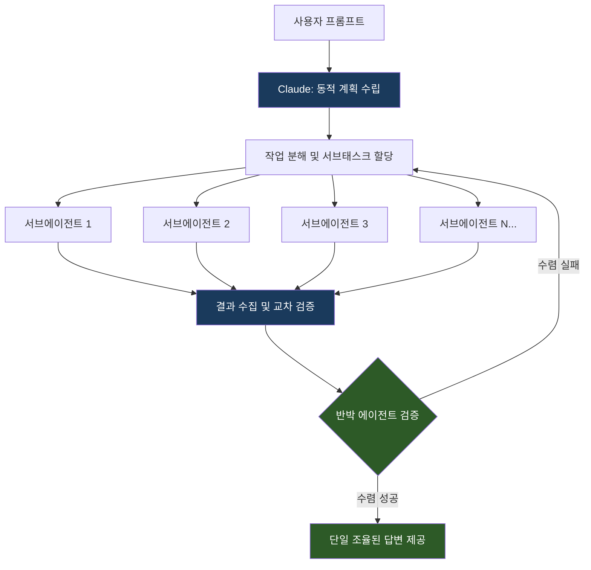
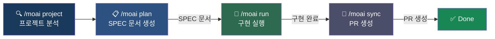
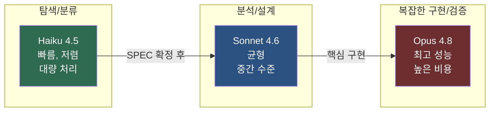
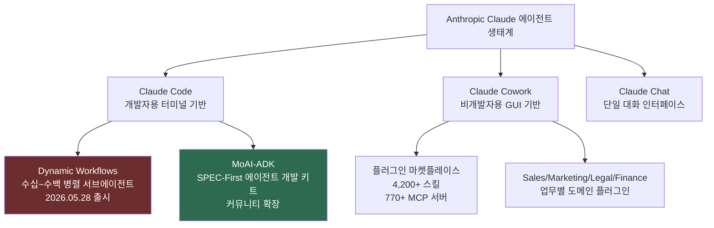
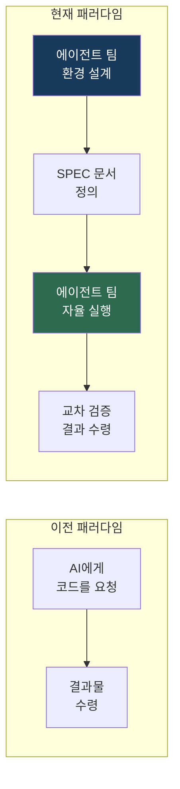

## MoAI-ADK 실전 워크플로에서 읽는 2026년 에이전트 생태계의 전환점

---


## 1. 도입: 하나의 터미널 화면이 담고 있는 것들

어떤 터미널 화면에는 단순한 명령 실행 결과 이상의 의미가 담겨 있을 때가 있다. 이번에 공유된 화면이 그렇다.

화면 상단에는 **MoAI(모두의 AI, MoAI-ADK)** 에이전트가 `.moai/specs/` 디렉터리 전체를 탐색하고 Wave 3 후보 디렉터리의 존재 여부를 점검한 분석 결과가 표시되어 있다. 그 아래로는 `wave3-candidate-survey`라는 이름의 동적 워크플로가 실행 중이며, 5개의 병렬 서브에이전트가 각각 수만 개의 토큰을 소비하면서 동시에 작업을 수행하고 있다. 화면 최하단에는 "Waiting for 1 dynamic workflow to finish"라는 메시지가 조용히 깜빡이고 있다.

이 화면은 단순히 "코드 도구가 실행 중이다"가 아니라, AI 에이전트 생태계에서 지금 어떤 방향으로 무게 중심이 이동하고 있는지를 보여주는 압축된 상징이다.

화면을 공유한 이가 남긴 메모가 이 방향성을 정확히 포착하고 있다.

> "claude workflow를 보고 있으니 많은 생각이 든다. 점차적으로 자율적으로 에이전트 팀 구축에 비중이 실리고 있다. 토큰을 녹이는 용광로로 변경된 workflow는 잘 쓰면 득이고, 모르고 쓰면 다 돈이다."

이 문서는 그 화면이 무엇을 의미하는지, 그 배경에서 무슨 일이 일어나고 있는지를 최신 정보를 토대로 상세히 풀어낸다.

---

## 2. 화면에 무엇이 보이는가 — 터미널 분석

### 2.1 MoAI 에이전트의 사전 조사 결과

화면 상단부에 표시된 분석 블록은 MoAI-ADK가 Claude Code 내에서 로컬 파일시스템을 탐색하여 도출한 중간 조사 결과다.

- **범위**: `.moai/specs/` 전체 인벤토리 탐색 및 Wave 3 후보 디렉터리의 물리적 존재 여부 확인
- **발견 사항**: implemented 상태의 SPEC 21개, draft·planned 상태 30개 확인. Wave 3 명명 후보 디렉터리(REDACT / DAEMON-OBSERVABILITY / VECTOR-E2E / DRIFT)는 아직 미생성 상태로, `/moai plan`을 통해 신규 작성 필요
- **드리프트 경고**: draft 백로그 30개 중 다수가 `GOOSE-*` 레거시 브랜드명을 사용 중 — MINK 리네임 이전의 구(舊) 명칭으로 stale 가능성 있음. 또한 `SPEC-MINK-HEALTH-001`은 `DAEMON-OBSERVABILITY`와, `SPEC-MINK-VECTOR-001`은 `VECTOR-E2E`와 범위가 중첩됨
- **권장 조치**: 현재 실행 중인 백그라운드 survey 워크플로(5개 explorer) 완료 대기 → 각 후보의 ground-truth를 바탕으로 `AskUserQuestion` 구성

이 내용이 뜻하는 바는, MoAI-ADK가 단순히 코드를 작성하는 도구가 아니라 **프로젝트의 스펙 문서 상태 자체를 지속적으로 감사(audit)하고 관리하는 에이전트**로서 동작하고 있다는 점이다. 어떤 스펙이 구현됐는지, 어떤 것이 오래되어 폐기되어야 하는지, 어떤 것들이 서로 범위를 중복하고 있는지를 자율적으로 파악한다.

### 2.2 실행 중인 Dynamic Workflow — wave3-candidate-survey

화면 하단부에는 실제로 실행 중인 워크플로의 상태가 표시되어 있다.

```
wave3-candidate-survey
Survey Wave 3 remaining SPEC candidates + worki…1/5 agents · 1m22s

  Phases              Survey · 5 agents
  │ 1 Survey 1/5  │  ✓ survey:spec-inven…  Haiku 4.5  125.4k tok  ·…
  │               │  ● survey:dirty-tree   Haiku 4.5  108.9k tok  ·…
  │               │  ● survey:redact       Haiku 4.5  108.6k tok  ·…
  │               │  ● survey:daemon-obs   Haiku 4.5  145.5k tok  ·…
  │               │  ● survey:impl-drift   Haiku 4.5  143.3k tok  ·…
```

5개의 서브에이전트가 동시에 실행 중이며, 각각의 역할은 다음과 같이 해석된다.

| 서브에이전트 | 역할 |
|---|---|
| `survey:spec-inven` | 전체 SPEC 인벤토리 파악 및 분류 (완료) |
| `survey:dirty-tree` | 작업 트리의 더티(dirty) 상태 파일 분석 |
| `survey:redact` | REDACT 후보 범위 조사 |
| `survey:daemon-obs` | DAEMON-OBSERVABILITY 후보 범위 조사 |
| `survey:impl-drift` | 구현 완료 SPEC과 실제 코드 간의 드리프트 감지 |

이 시점에서 5개 에이전트가 소비하고 있는 토큰을 단순 합산하면 **약 631,700 토큰**이다. 이 중 첫 번째 에이전트(`spec-inven`)만 완료(✓)되었고, 나머지 4개는 실행 중(●)이다. 전체 워크플로는 약 1분 22초가 경과한 시점이다. 사용된 모델은 비용 대비 처리량이 높은 **Claude Haiku 4.5**다.

이 화면 자체가 오늘날 에이전트 워크플로의 특성을 압축적으로 보여준다. 하나의 작업 요청이 여러 서브에이전트로 분해되고, 그것들이 병렬로 실행되며, 각각이 수만에서 수십만 개의 토큰을 독자적으로 소비하는 구조다.

---

## 3. 배경: Claude Code Dynamic Workflows 정식 출시

### 3.1 2026년 5월 28일 — 무엇이 달라졌나

이 화면이 가능해진 것은 Anthropic이 2026년 5월 28일 Claude Code에 **Dynamic Workflows(동적 워크플로)** 를 연구 미리보기(Research Preview)로 공식 출시했기 때문이다.

오늘 Anthropic은 Claude Code에 Dynamic Workflows를 도입했다. 분기 단위로 계획해야 했던 작업이 이제 며칠 안에 완료된다. Claude는 단일 세션에서 수십에서 수백 개의 병렬 서브에이전트를 실행하는 오케스트레이션 스크립트를 동적으로 작성하며, 결과물이 사용자에게 전달되기 전에 자체적으로 검증을 수행한다.

Dynamic Workflows는 Claude Code CLI, Desktop, VS Code 익스텐션에서 Max, Team, Enterprise 플랜을 대상으로 리서치 프리뷰로 제공되며, Claude API, Amazon Bedrock, Vertex AI, Microsoft Foundry에서도 사용 가능하다.

### 3.2 핵심 작동 원리

워크플로가 시작되면 Claude는 프롬프트를 기반으로 동적으로 계획을 수립하고, 작업을 서브태스크로 분해하여 병렬로 실행 중인 서브에이전트들에게 작업을 분산한다. 결과는 통합되기 전에 검증 과정을 거치며, 사용자는 단일하고 조율된 하나의 답변을 받게 된다. 에이전트들은 서로 독립적인 각도에서 문제에 접근하고, 다른 에이전트들이 그 결과를 반박하려 시도하며, 답변들이 수렴할 때까지 반복이 계속된다.

이 메커니즘을 도식으로 나타내면 아래와 같다.



특히 주목할 부분은 **적대적 검증(Adversarial Verification)** 구조다. 어떤 서브에이전트가 "이 함수에 레이스 컨디션이 있다"고 주장하면, 별도의 서브에이전트가 그 주장을 반박하는 임무를 맡는다. 반박을 통과한 주장만이 최종 결과에 포함된다. 이는 단순한 병렬 처리가 아니라, 품질 보증을 위한 내부 검증 루프를 에이전트 수준에서 구현한 것이다.

Dynamic Workflows는 단순한 병렬 실행이 아니다. Anthropic은 "에이전트들이 서로 독립적인 각도에서 문제에 접근하고, 다른 에이전트들이 그 결과를 반박하려 시도하며, 실행이 답변들이 수렴할 때까지 계속 반복된다"고 설명한다. 반박을 통과한 주장만 사용자에게 도달한다.

### 3.3 내부 구현: JavaScript 오케스트레이션 스크립트

Dynamic Workflows는 Claude가 "더 많은 에이전트를 실행하기로 결정"하는 게 아니다. Claude가 실제 JavaScript 프로그램, 즉 오케스트레이션 스크립트를 작성하고, 별도의 런타임이 그것을 백그라운드에서 실행하는 방식이다. 그 동안 채팅 인터페이스는 계속 사용 가능하다.

이 설계가 중요한 이유는 오케스트레이션 계획이 Claude의 컨텍스트 내부가 아니라 **외부 코드 형태로 존재**하기 때문이다. 작업이 중단되더라도 완료된 에이전트의 결과는 캐시되어 있어, 동일한 세션에서 재개 시 처음부터 다시 시작하지 않아도 된다.

워크플로는 병렬 및 장시간 실행을 위해 설계되어 시간 단위 혹은 일 단위로 실행될 수 있다. 진행 상황은 실행 중에 저장되므로, 중단된 작업은 처음부터 다시 시작하는 대신 중단된 지점에서 이어서 실행된다. 단, 이를 위해서는 동일한 Claude Code 세션이어야 한다. Claude Code를 종료하면 다음 세션에서는 워크플로를 처음부터 다시 시작한다.

### 3.4 활성화 방법: 두 가지 경로

Dynamic Workflows를 시작하는 방법은 두 가지다.

**방법 1 — 직접 요청:**
Claude Code에서 "Create a workflow"라는 문구를 포함한 프롬프트를 입력하면 Claude가 Dynamic Workflows 패턴에 해당하는 요청임을 인식하고 실행 계획을 수립한 후 확인을 요청한다.

**방법 2 — ultracode 설정 활성화:**
`/effort ultracode` 명령으로 활성화하며, xhigh 추론 수준과 자동 워크플로 오케스트레이션을 결합한다. ultracode가 켜진 상태에서는 Claude가 각 요청을 스스로 평가하여 워크플로가 필요한지 판단하고, 하나의 요청이 여러 워크플로로 순차 처리될 수 있다 — 코드를 이해하는 워크플로, 변경사항을 적용하는 워크플로, 검증하는 워크플로가 연속으로 실행되는 방식이다. 루틴한 작업이 끝나면 `/effort high`로 되돌리는 것이 좋다. ultracode는 일반 세션보다 훨씬 많은 토큰을 소비하기 때문이다.

Max 또는 Team 플랜 사용자의 경우 워크플로는 기본적으로 활성화되어 있다. Enterprise 사용자의 경우 관리자가 먼저 활성화해야 한다. Anthropic의 명시적 권고사항은 "Dynamic Workflows를 사용할 때는 자동 모드(Auto Mode)를 켜두라"는 것이다.

### 3.5 실제 검증 사례: Bun 프로젝트 Zig → Rust 포팅

Dynamic Workflows를 통해 가능해진 대규모 작업의 실제 사례로, Bun(Node.js와 경쟁하는 JavaScript 런타임)의 리라이트가 있다. Jarred Sumner은 Dynamic Workflows를 이용해 Bun을 Zig에서 Rust로 포팅했다. 약 75만 줄의 Rust 코드를 생성하고 기존 테스트 스위트의 99.8%를 통과시키는 데 첫 번째 커밋부터 머지까지 11일이 걸렸다. 하나의 워크플로는 Zig 코드베이스의 모든 struct 필드에 적합한 Rust 라이프타임을 매핑했다. 다음 워크플로는 수백 개의 에이전트가 병렬로 각 .zig 파일을 동작이 동일한 .rs 파일로 포팅하되, 파일당 두 명의 검토자를 두는 방식으로 실행됐다. 수정 루프가 빌드와 테스트 스위트가 모두 클린하게 통과할 때까지 구동됐다.

이 사례는 Dynamic Workflows가 단순한 "멀티태스킹 AI"가 아님을 보여준다. 인간 엔지니어 팀이 수개월에 걸쳐 수행해야 할 작업을 에이전트 팀이 단 열하루 만에 완수한 것이다.

---

## 4. MoAI-ADK — Claude Code 위에서 동작하는 SPEC 주도 에이전트 키트

### 4.1 MoAI-ADK란 무엇인가

MoAI-ADK는 Claude Code를 위한 고성능 AI 개발 환경이다. 24개의 전문화된 AI 에이전트와 52개의 스킬이 협력하여 품질 높은 코드를 생산한다. 새 프로젝트와 기능 개발에는 TDD(기본값)를, 테스트 커버리지가 낮은 기존 프로젝트에는 DDD를 자동 적용하며, 서브에이전트와 에이전트 팀의 이중 실행 모드를 지원한다. Go로 작성된 단일 바이너리로, 제로 의존성으로 모든 플랫폼에서 즉시 실행된다.

MoAI는 "모두의 AI(Modu-ui AI)"의 약자로, 한국의 오픈소스 AI 개발 커뮤니티에서 시작된 프레임워크다. 핵심 철학은 **SPEC-First Development**다. 코드를 먼저 작성하는 것이 아니라 스펙 문서를 먼저 정의하고, 그 스펙을 기반으로 에이전트들이 구현을 진행하는 방식이다.

MoAI-ADK는 Harness Engineering 패러다임을 구현한다 — 코드를 직접 작성하는 것이 아니라, AI 에이전트들이 동작할 환경 자체를 설계하는 방식이다. "인간이 방향을 제시하고, 에이전트가 실행한다."는 것이 엔지니어의 역할 변화를 보여준다.

### 4.2 기본 워크플로: Plan → Run → Sync



**`/moai project`**: 프로젝트 전체를 분석하여 현재 상태를 파악한다. 구현된 SPEC, 드래프트 SPEC, 레거시 SPEC, 중복 SPEC을 구분하는 인벤토리를 구축한다. 이번 화면에서 보이는 survey 워크플로가 바로 이 단계에 해당한다.

**`/moai plan`**: 복잡도 점수가 5 이상인 경우 자동으로 SPEC 문서를 생성한다. 구현 전에 무엇을 만들 것인지를 문서화하는 단계다.

**`/moai run`**: SPEC 문서를 기반으로 실제 구현을 진행한다. 복잡도에 따라 단일 에이전트(`--solo`) 또는 팀 모드(`--team`)로 실행되며, 팀 모드에서는 여러 에이전트가 병렬로 작업을 수행한다.

**`/moai sync`**: 완성된 구현 결과를 git 브랜치와 동기화하고 PR을 생성한다.

### 4.3 실행 모드: 단독 vs. 팀

에이전트 디스패치 방식을 제어할 수 있다. `--team` 옵션은 병렬 팀 기반 실행으로 여러 에이전트가 동시에 작업한다. `--solo` 옵션은 순차적인 단일 에이전트 위임 방식이다. 시스템은 복잡도를 기준으로 자동 선택하기도 하는데, 도메인이 3개 이상, 파일이 10개 이상, 또는 복잡도 점수가 7 이상인 경우다.

v2.7.1부터는 팀 모드의 기본값이 **CG(Claude leader + GLM workers) 모드**로 변경됐다. tmux 패널 수준의 환경 격리를 통해 Claude 리더와 GLM 워커를 분리하여 실행한다. 이 구조는 오케스트레이터 에이전트(리더)와 실행 에이전트(워커)가 분리된 계층적 멀티에이전트 구조를 취한다.

### 4.4 화면에서 보이는 Wave 시스템

화면에 등장하는 "Wave 3"는 MoAI-ADK가 대규모 프로젝트를 단계적으로 구현하기 위해 SPEC들을 묶는 방식이다. Wave 1 → Wave 2 → Wave 3 순으로 구현 우선순위와 의존성을 관리한다. 이번 survey 워크플로는 Wave 3에 포함될 후보 SPEC들을 사전에 조사하는 준비 단계다.

조사 중에 발견된 `GOOSE-*` 레거시 브랜드명 문제는, 프로젝트가 이미 MINK라는 이름으로 리브랜딩되었음에도 draft 상태의 SPEC 문서들이 아직 이전 이름을 사용하고 있다는 것을 뜻한다. 이러한 네이밍 드리프트는 대규모 프로젝트에서 흔히 발생하며, MoAI-ADK의 survey 에이전트가 이를 자동으로 탐지하고 있다.

---

## 5. 토큰을 녹이는 용광로 — 비용 구조의 현실

### 5.1 Dynamic Workflows의 토큰 소비

Dynamic Workflows는 일반 Claude Code 세션보다 실질적으로 더 많은 토큰을 소비한다. 이는 예상된 동작이며 버그가 아니다 — 수백 개의 병렬 서브에이전트를 수 시간 동안 실행하면 비례적으로 더 많은 컴퓨팅이 필요하다.

코드베이스 전체 감사는 단일 패스 접근 방식보다 10~100배 더 많은 토큰을 사용할 수 있다. 일반 대화를 통해 동일한 작업을 처리하면 10,000 토큰이 들 수 있지만, 워크플로에서는 100,000 토큰 이상이 사용될 수 있다.

이번 화면에서 확인된 수치만 해도, 5개 에이전트가 약 1분 22초 동안 소비한 토큰은 이미 약 63만 토큰이다. 이 survey 단계가 끝나도 Wave 3 계획 및 구현 단계가 남아 있으므로, 하나의 주요 기능 개발 사이클에서 수백만 토큰이 소비되는 것은 충분히 현실적인 시나리오다.

### 5.2 모델 선택의 중요성

이번 화면에서 5개 에이전트 모두 **Claude Haiku 4.5**를 사용하고 있다는 점은 의도적인 선택이다. Haiku는 Claude 모델군 중 가장 빠르고 저렴한 모델로, 탐색(survey)이나 분류처럼 추론 깊이보다 처리 속도와 비용이 중요한 작업에 적합하다. 실제 구현 단계에서는 더 강력한 Sonnet이나 Opus 계열 모델로 전환하는 전략이 합리적이다.





적절한 사용 시점: 작업이 단일 컨텍스트 윈도우에 비해 너무 크고, 분할 전략이 사전에 알 수 없으며, 토큰 경제보다 결과 품질이 더 중요한 세 가지 조건이 동시에 충족될 때 Dynamic Workflows를 사용해야 한다. 대규모 마이그레이션(500개 이상의 파일), 코드베이스 전체 보안 감사 등이 대표적인 적합 사례다.

### 5.3 비용 통제 전략

Dynamic Workflows와 MoAI-ADK 같은 멀티에이전트 시스템을 운영할 때 토큰 비용을 통제하기 위한 실질적인 접근법은 다음과 같다.

**작업 범위 명확화**: ultracode를 상시 켜두는 것이 아니라, 반드시 필요한 복잡한 작업에서만 활성화한다. 루틴한 작업에서는 `/effort high`로 되돌린다.

**모델 계층화**: 탐색/분류에는 Haiku, 일반 개발에는 Sonnet, 핵심 복잡 작업에만 Opus를 사용하는 계층적 모델 전략을 수립한다.

**범위 제한 테스트**: 프로덕션 워크로드에 적용하기 전에 작은 범위의 작업으로 먼저 토큰 소비 패턴을 파악한다.

**캐시 활용**: Claude Code의 프롬프트 캐시를 적극 활용하여, 반복적으로 사용되는 시스템 프롬프트와 컨텍스트의 재처리 비용을 줄인다.

---

## 6. Claude Cowork — 비개발자를 위한 에이전트 워크스페이스

### 6.1 Claude Cowork의 위치

Claude Cowork는 2026년 1월 12일 연구 미리보기로 Claude 데스크톱 앱 내의 탭으로 공개됐다. 이는 채팅 및 코드 탭과 나란히 존재한다. 출시 후 일주일 내에 모든 Pro 사용자에게 업데이트가 배포됐다. Windows 사용자로의 롤아웃은 4월 3일에 시작되어 완전한 크로스플랫폼 배포가 이루어졌다.

Claude Code가 개발자용이라면 Cowork는 비개발자용이다. 같은 자율 멀티스텝 실행 능력이지만, 인터페이스가 다르다. Code 사용자라면 이미 이 기능을 알고 있다. Cowork는 사용자 스스로 병렬성을 설계할 필요 없이 그 능력을 제공한다. 웹사이트 사용자에게는 가장 큰 숨겨진 업그레이드다. 지금까지 단일 파일 모드로만 작업해왔다면, Cowork는 멀티스레드로 실행된다.

### 6.2 에이전트 생태계 내 위치 관계



Claude Code와 Cowork는 같은 에이전트 아키텍처 위에 동작하지만, 접근 방식이 다르다. Code는 터미널과 파일시스템에 직접 접근하는 개발자 도구인 반면, Cowork는 GUI를 통해 동일한 자율 실행 능력을 지식 노동자 누구나 사용할 수 있도록 포장한 것이다.

### 6.3 MCP 커넥터를 통한 실무 연결

Cowork의 실질적 가치는 MCP(Model Context Protocol) 커넥터를 통한 외부 데이터 연결에 있다. 단순히 텍스트를 처리하는 것이 아니라, 실제 업무 시스템에 접속하여 데이터를 가져오고 작업을 실행한다. HubSpot, Salesforce, Google Workspace, Slack 등 주요 업무 도구들과 연결될 수 있으며, 2026년 2월 업데이트에서만 12개의 새 커넥터가 추가됐다.

---

## 7. 자율 에이전트 팀 구축 — 에코시스템의 방향

### 7.1 단일 에이전트에서 에이전트 팀으로

동적 워크플로의 출시는 단순한 기능 추가가 아니다. Dynamic Workflows는 에이전트들이 복잡한 작업을 병렬로 실행하게 해준다. Claude Code의 경로를 따른다면, 지식 노동에 대한 시사점은 분명하다. Anthropic은 2026년 5월 28일 Claude Code에 Dynamic Workflows를 출시했으며, 고정된 순서를 따르는 대신 런타임에 작업별 구조를 구성하고 실행할 수 있게 됐다.

이전에는 멀티에이전트 패턴이 고급 사용자가 수동으로 설계해야 하는 것이었다면, 이제 Claude 자신이 작업에 맞는 에이전트 팀의 구성을 동적으로 결정하고 실행한다. 이것이 "자율 에이전트 팀 구축"이라는 표현이 의미하는 핵심이다.

### 7.2 에이전트 오케스트레이션 패턴의 비교

현재 생태계에는 Dynamic Workflows, 수동 서브에이전트, 에이전트 팀이라는 세 가지 서로 다른 실행 패턴이 공존한다. 각각이 해결하는 문제가 다르다.

| 패턴 | 적합한 상황 | 토큰 비용 | 제어 수준 |
|---|---|---|---|
| 단일 에이전트 | 단순하고 명확한 작업 | 최소 | 최고 |
| 수동 서브에이전트 | 알려진 분할 전략이 있는 작업 | 중간 | 높음 |
| Dynamic Workflows | 단일 컨텍스트를 초과하는 복잡한 작업 | 높음 | 자율적 |
| MoAI-ADK 에이전트 팀 | SPEC 기반 대규모 개발 사이클 | 높음 | 구조화됨 |

Dynamic Workflows, 서브에이전트, 에이전트 팀은 서로 다른 문제를 해결한다. 잘못된 것을 사용하면 토큰, 시간, 신뢰를 낭비한다. 질문은 이제 "이것을 어떻게 프롬프트할까?"가 아니라 "이 문제의 구조에 가장 잘 맞는 실행 모델은 무엇인가?"다.

### 7.3 에이전트 생태계의 확장: 검증 사례들

Dynamic Workflows의 실제 활용 사례들을 살펴보면, 서비스나 저장소 전체를 병렬로 탐색하고 모든 발견 사항에 대해 독립적 검증을 수행하는 코드베이스 전체 버그 탐색, 성능 감사, 보안 감사가 있다. 또한 수천 개의 파일에 걸친 프레임워크 교체, API 지원 중단 처리, 언어 포팅 같은 대규모 마이그레이션과 현대화 작업, 그리고 오답의 비용이 높을 때 워크플로가 문제에 독립적으로 여러 번 시도하고 반박 에이전트가 결과를 검토한 뒤 사용자에게 전달하는 검증이 필요한 중요 작업도 포함된다.

Klarna의 Senior Engineering Manager Alessio Vallero는 "Dynamic Workflows는 대규모 코드베이스 전체의 발견 및 검토 작업에서 특히 유용했다. 기존 정적 분석이 놓쳤던 사용되지 않는 코드를 식별하고 정리 기회를 발굴하는 데 강력한 결과를 보였다"고 말했다. CyberAgent의 Lead Systems Engineer Ken Takao도 "Dynamic Workflows는 단일 서브에이전트를 실행하는 것과 전체 에이전트 팀을 구성하는 것 사이의 공백을 채워준다. 계획에서 구현까지 자연스럽게 흘러가서 가시성을 잃지 않고도 긴 실행을 신뢰할 수 있다"고 했다.

---

## 8. 종합: 지금 일어나고 있는 일의 의미

### 8.1 패러다임 전환의 실체

하나의 터미널 화면에서 시작된 이 분석이 결국 도달하는 곳은 하나의 질문이다. **AI 코딩 도구는 어디를 향해 가고 있는가?**

답은 화면에서 이미 가시적이다. 에이전트는 더 이상 단순히 코드를 작성하는 도구가 아니다. 프로젝트의 상태를 자율적으로 파악하고, 어떤 작업이 필요한지를 스스로 판단하며, 그 작업을 수십에서 수백 개의 병렬 에이전트로 분배하여 실행하고, 결과를 교차 검증한 뒤 인간에게 제공하는 시스템으로 진화하고 있다.

이것은 "AI가 코드를 써준다"는 수준에서 "AI 팀이 프로젝트를 진행한다"는 수준으로의 전환이다.

### 8.2 "잘 쓰면 득이고, 모르고 쓰면 다 돈"의 의미

이 문장은 단순한 비용 경고가 아니다. 여기에는 두 가지 통찰이 내포되어 있다.

첫째, **사용 목적의 명확성**이다. Dynamic Workflows와 같은 자율 에이전트 팀 실행은 단순한 작업에 적용하면 사용자가 수작업으로 처리할 수 있는 작업에 100배의 토큰을 소비하는 결과로 이어진다. 정말 단일 컨텍스트를 초과하는 복잡성을 가진 작업인지를 먼저 판단해야 한다.

둘째, **에이전트 설계 능력**이다. 어떤 모델을 어느 단계에 배치할 것인지, 어떤 범위에서 병렬화를 허용할 것인지, 어느 시점에 인간이 개입해야 하는지를 설계하는 능력이 이제 개발자의 핵심 역량이 되고 있다. 코드를 작성하는 사람이 아니라 에이전트가 일할 환경을 설계하는 사람으로의 역할 전환이다.



### 8.3 MoAI-ADK가 보여주는 미래

MoAI-ADK는 Harness Engineering 패러다임을 구현한다 — AI 에이전트들이 동작할 환경 자체를 설계하는 방식이다. "인간이 방향을 제시하고, 에이전트가 실행한다."

이 화면에서 보이는 것이 바로 그 모습이다. 사람은 Wave 3 개발을 진행하겠다는 방향을 제시했다. MoAI-ADK의 survey 워크플로가 5개의 에이전트를 병렬로 배치하여 그 결정에 필요한 정보를 수집하고 있다. 사람이 해야 하는 일은 그 결과를 보고 최종 판단을 내리는 것이다.

---

## 9. 요약 및 체크리스트

### Dynamic Workflows 적용 판단 기준

| 기준 | 워크플로 필요 | 단일 에이전트로 충분 |
|---|---|---|
| 작업 규모 | 수백~수천 파일 | 수십 파일 이하 |
| 분할 전략 | 사전에 알 수 없음 | 명확히 정의됨 |
| 우선순위 | 결과 품질 > 토큰 비용 | 토큰 비용 절감 중요 |
| 검증 필요성 | 고위험·높은 정확도 필요 | 일반적 수준의 정확도 |

### MoAI-ADK 워크플로 요약

| 명령 | 역할 | 에이전트 수 |
|---|---|---|
| `/moai project` | 프로젝트 상태 분석 및 인벤토리 구축 | 자율 결정 |
| `/moai plan` | SPEC 문서 생성 (복잡도 5 이상 시 자동 실행) | 단일 |
| `/moai run --solo` | 순차 단일 에이전트 구현 | 1 |
| `/moai run --team` | 병렬 팀 모드 구현 | 다수 |
| `/moai sync` | Git 동기화 및 PR 생성 | 단일 |

---

## 참고 자료

- [Introducing dynamic workflows in Claude Code — Anthropic (2026.05.28)](https://claude.com/blog/introducing-dynamic-workflows-in-claude-code)
- [MoAI-ADK GitHub Repository — modu-ai/moai-adk](https://github.com/modu-ai/moai-adk)
- [Claude Cowork for Sales: 2026년 팀 AI 완벽 가이드 — Naoma.ai](https://www.naoma.ai/ko/articles/claude-cowork-guide)
- [클로드 코워크 사용법 — Anthropic 팀이 실제로 쓰는 활용 사례 7가지 — GPTers](https://www.gpters.org/nocode/post/how-use-claude-cowork-0CdQIT9LWrd3Zbl)
- [Dynamic Workflows in Claude Code: Complete Guide 2026 — claudefa.st](https://claudefa.st/blog/guide/development/dynamic-workflows)
- [Claude Code Orchestration — Ken Huang, Agentic AI Substack](https://kenhuangus.substack.com/p/claude-code-orchestration-dynamic)
- [Facebook 포스트 원문 (wave3-candidate-survey 워크플로 화면 공유 및 코멘트)](https://www.facebook.com/share/p/18kA8AghcT/)

---

*작성일: 2026년 6월 1일*
