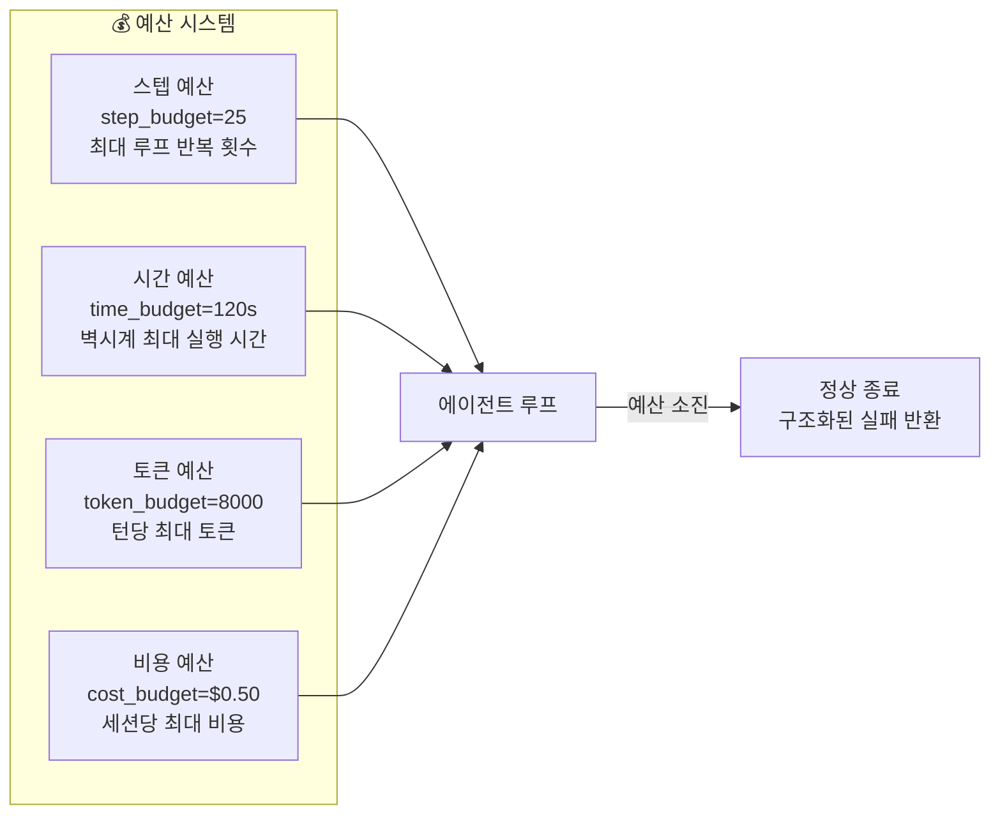
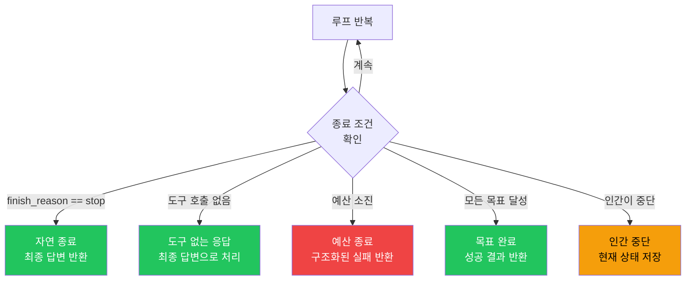
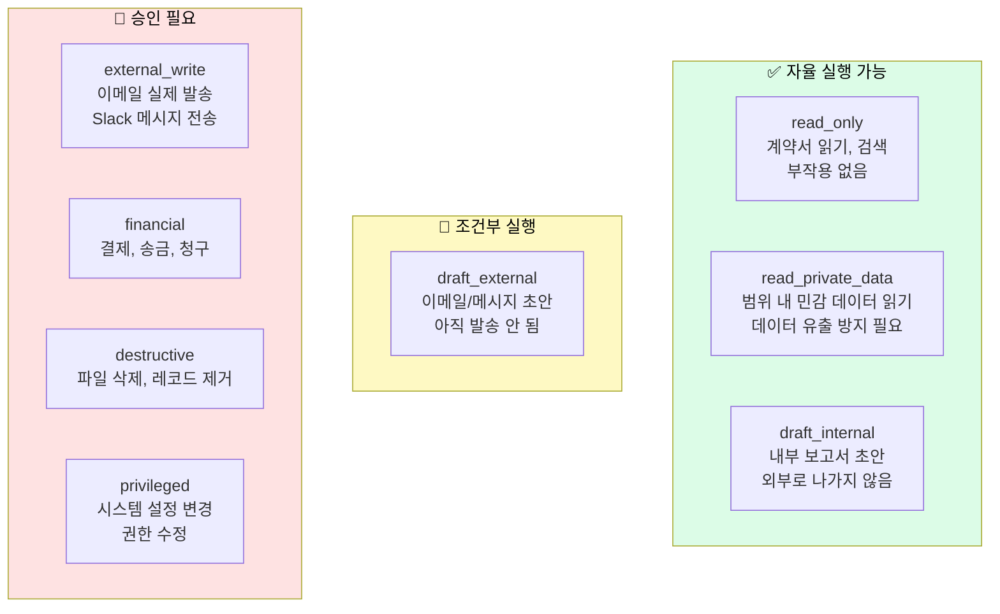
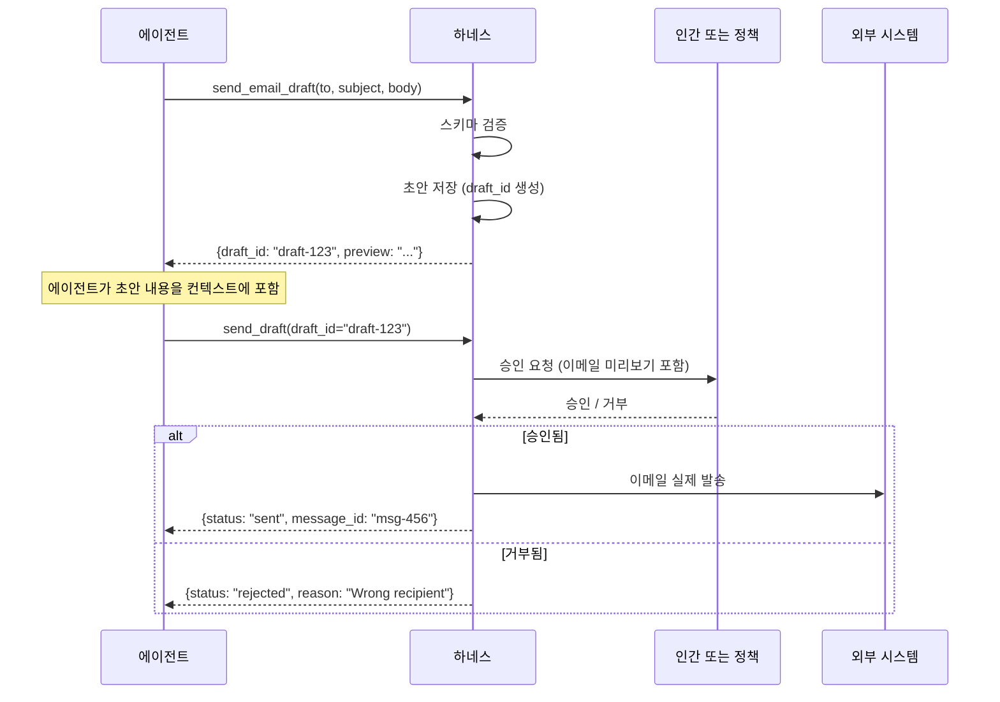

### `agentic-loop.md` · `tools-and-permissions.md` · `checklists.md` 완전 해설

> **대상**: LLM 에이전트를 직접 구현하거나 기존 에이전트를 개선하는 ML 엔지니어  
> **핵심 참조**: `references/agentic-loop.md`, `references/tools-and-permissions.md`, `references/checklists.md`  
> **출처**: [DenisSergeevitch/agents-best-practices](https://github.com/DenisSergeevitch/agents-best-practices)  
> **작성일**: 2026-06-01

## 관련글

- [**AI 에이전트 모범 사례: 프로덕션 수준의 하네스 엔지니어링 완전 해설 (2026)**]()
- [**ML 엔지니어를 위한 에이전트 하네스 설계 가이드**]()
- [**플랫폼 아키텍트를 위한 에이전트 하네스 아키텍처 가이드**]()
- [**팀 리더를 위한 에이전트 프로젝트 관리 가이드**]()
- [**보안/컴플라이언스 전문가를 위한 에이전트 하네스 보안 가이드**]()
- [**AI 에이전트 하네스 엔지니어링 종합 실전 가이드**]()
- [**Spring 개발자를 위한 AI 에이전트 개발 완전 가이드**]()


---

## 목차

1. [ML 엔지니어가 반드시 알아야 할 한 가지](#1-ml-엔지니어가-반드시-알아야-할-한-가지)
2. [에이전트 루프 설계 (`agentic-loop.md`)](#2-에이전트-루프-설계-agentic-loopmd)
   - 2.1 루프 불변조건
   - 2.2 예산 시스템
   - 2.3 재시도 로직
   - 2.4 컴팩션 트리거
   - 2.5 종료 조건
3. [도구와 권한 설계 (`tools-and-permissions.md`)](#3-도구와-권한-설계-tools-and-permissionsmd)
   - 3.1 도구 계약과 타입 스키마
   - 3.2 위험 클래스 분류 체계
   - 3.3 초안-커밋 패턴
   - 3.4 권한 매트릭스
   - 3.5 구조화된 도구 결과
4. [구현 및 감사 체크리스트 (`checklists.md`)](#4-구현-및-감사-체크리스트-checklistsmd)
5. [실전 구현 패턴](#5-실전-구현-패턴)
6. [흔한 실수와 해결책](#6-흔한-실수와-해결책)
7. [구현 체크리스트 요약](#7-구현-체크리스트-요약)

---

## 1. ML 엔지니어가 반드시 알아야 할 한 가지

에이전트 시스템을 프로덕션에 올리는 ML 엔지니어가 가장 자주 빠지는 함정은 **모델 성능에만 집중하는 것**이다. GPT-4, Claude Opus, Gemini Ultra를 써도 에이전트가 실패한다면, 대부분의 원인은 모델이 아니라 **하네스 설계의 문제**다.

agents-best-practices 리포지터리가 제시하는 핵심 공식은 간단하다.

> *"Keep the loop simple and make the runtime rigorous."*
> (루프는 단순하게 유지하되, 런타임은 엄격하게 만들라.)

ML 엔지니어에게 이것이 의미하는 바는 구체적이다. 루프 로직을 최대한 단순하게 유지하고, 모든 도구 호출 전후에 하네스 코드가 엄격하게 검증하도록 설계하는 것이다. 모델 프롬프트를 반복 수정하는 것보다 하네스 코드를 한 번 잘 작성하는 것이 훨씬 효과적이다.

---

## 2. 에이전트 루프 설계 (`agentic-loop.md`)

### 2.1 루프 불변조건

에이전트 루프가 항상 만족해야 하는 **불변조건(invariants)** 이 있다. 이 조건들이 깨지면 에이전트는 예측 불가능하게 된다.

**불변조건 1: 모든 도구 호출은 결과를 받는다**

도구 호출이 성공하든, 실패하든, 타임아웃이 나든, 권한이 거부되든—에이전트는 반드시 구조화된 관찰(observation)을 받아야 한다. "도구를 호출했지만 결과가 없는" 상태는 허용되지 않는다.

```python
# ❌ 잘못된 방식 - 결과가 없을 수 있다
try:
    result = tool_call(args)
    context.append(result)
except Exception:
    pass  # 예외를 무시하면 에이전트가 기다린다

# ✅ 올바른 방식 - 항상 관찰을 생성한다
try:
    result = execute_tool(tool_call)
    observation = ToolResult(status="success", data=result)
except TimeoutError:
    observation = ToolResult(status="timeout", error="Tool did not respond in 10s")
except PermissionError as e:
    observation = ToolResult(status="denied", error=str(e))
except Exception as e:
    observation = ToolResult(status="error", error=str(e))
finally:
    context.append(observation)  # 항상 추가
```

**불변조건 2: 루프는 유한하다**

무한히 실행될 수 있는 루프는 없다. 예산 시스템이 이것을 보장한다.

**불변조건 3: 하네스가 실행한다, 모델이 아니다**

모델은 구조화된 도구 호출을 제안한다. 실제 실행, 권한 확인, 스키마 검증은 모두 하네스 코드의 책임이다.

### 2.2 예산 시스템

프로덕션 에이전트 루프는 반드시 4가지 예산을 강제 적용해야 한다. 예산 없는 루프는 언젠가 반드시 문제를 일으킨다.



예산이 소진되었을 때 에이전트를 어떻게 종료할지 명확히 설계해야 한다. 갑작스러운 종료는 안 되며, 반드시 **구조화된 실패 응답**을 반환해야 한다.

```python
class Budgets:
    step: int = 25           # 최대 루프 반복 횟수
    time: float = 120.0      # 초 단위 최대 실행 시간
    tokens_per_turn: int = 8000  # 턴당 최대 토큰
    cost_usd: float = 0.50   # 달러 단위 최대 비용

    # 내부 상태
    _steps_used: int = 0
    _start_time: float = field(default_factory=time.time)
    _tokens_used: int = 0
    _cost_used: float = 0.0

    def exhausted(self) -> tuple[bool, str]:
        """예산이 소진되었는지 확인하고 이유를 반환한다."""
        if self._steps_used >= self.step:
            return True, f"step_budget_exceeded ({self._steps_used} steps)"
        if time.time() - self._start_time >= self.time:
            return True, f"time_budget_exceeded ({self.time}s)"
        if self._tokens_used >= self.tokens_per_turn:
            return True, f"token_budget_exceeded ({self._tokens_used} tokens)"
        if self._cost_used >= self.cost_usd:
            return True, f"cost_budget_exceeded (${self._cost_used:.3f})"
        return False, ""
```

### 2.3 재시도 로직

도구 실패는 재시도 가능한 것과 재시도 불가능한 것을 구분해야 한다.

```python
RETRYABLE_ERRORS = {
    "rate_limit",          # API 레이트 리밋
    "timeout",             # 일시적 타임아웃
    "service_unavailable", # 임시 서비스 불가
}

NON_RETRYABLE_ERRORS = {
    "permission_denied",   # 권한 없음 - 재시도해도 같음
    "schema_invalid",      # 잘못된 인수 - 모델이 수정해야 함
    "budget_exceeded",     # 예산 소진 - 즉시 종료
    "approval_rejected",   # 인간이 거부 - 재시도 안 됨
}

def execute_with_retry(tool_call, max_retries=2):
    for attempt in range(max_retries + 1):
        result = execute_tool(tool_call)
        if result.status == "success":
            return result
        if result.error_type in NON_RETRYABLE_ERRORS:
            return result  # 즉시 반환, 재시도 없음
        if attempt < max_retries and result.error_type in RETRYABLE_ERRORS:
            time.sleep(2 ** attempt)  # 지수 백오프
            continue
        return result  # 최대 재시도 초과
```

### 2.4 컴팩션 트리거

컨텍스트가 너무 길어질 때 컴팩션을 적용한다. **핵심은 컴팩션이 활성 상태(active state)를 보존해야 한다는 것이다.**

```python
def should_compact(context: Context, budget: Budgets) -> bool:
    """컴팩션이 필요한지 판단한다."""
    return context.token_count() > budget.tokens_per_turn * 0.8

def compact_context(context: Context, preserve_approvals: bool = True) -> Context:
    """
    컴팩션 시 보존해야 할 것들:
    1. 현재 태스크와 목표
    2. 활성 승인 기록 (preserve_approvals=True)
    3. 최근 에러와 발견 사항
    4. 결과 아티팩트 참조
    5. 시스템 정책과 로드된 규칙

    버려도 되는 것들:
    1. 중간 추론 과정
    2. 중복된 검색 결과
    3. 이미 처리된 도구 출력
    """
    summary = summarize_for_compact(context)

    new_context = Context()
    new_context.add_system_policies(context.system_policies)  # 항상 보존

    if preserve_approvals:
        new_context.add_approvals(context.active_approvals)  # 승인 보존

    new_context.add_summary(summary)
    new_context.add_recent_steps(context.recent_steps(n=5))  # 최근 5스텝 보존

    return new_context
```

> **⚠️ 주의**: `preserve_approvals=True`를 빠뜨리면 에이전트가 이미 거부된 액션을 다시 시도할 수 있다. 이것은 실제 프로덕션에서 발생한 버그 유형이다. Anthropic의 Claude Code 포스트모템에서도 컴팩션이 사고 기록(thinking history)을 지워버리는 캐싱 버그가 품질 저하의 원인으로 지목되었다.

### 2.5 종료 조건

에이전트 루프는 다음 중 하나가 발생하면 종료된다.



---

## 3. 도구와 권한 설계 (`tools-and-permissions.md`)

### 3.1 도구 계약과 타입 스키마

**모든 도구는 명확한 계약을 가져야 한다.** 계약에는 이름, 입력 스키마(타입 지정), 출력 스키마(타입 지정), 위험 클래스가 포함된다. 스키마가 없는 도구는 하네스가 검증할 수 없다.

```python
from dataclasses import dataclass
from typing import Literal

# 도구 위험 클래스 정의
RiskClass = Literal[
    "read_only",           # 읽기 전용, 자율 실행 가능
    "read_private_data",   # 민감 데이터 읽기, 범위 확인 필요
    "draft_internal",      # 내부 초안, 외부 부작용 없음
    "draft_external",      # 외부 발송 초안, 커밋 전까지 무해
    "external_write",      # 외부 쓰기, 승인 필요
    "financial",           # 금융 거래, 승인 필요
    "destructive",         # 파괴적 작업, 승인 필요
    "privileged",          # 권한 있는 작업, 엄격한 승인 필요
]

class ToolContract:
    name: str
    description: str
    input_schema: dict        # JSON Schema 형태로 타입 정의
    output_schema: dict       # 반환 타입 정의
    risk_class: RiskClass
    requires_approval: bool   # 승인 필요 여부
    idempotent: bool          # 같은 인수로 여러 번 호출해도 안전한가?
    reversible: bool          # 취소 가능한가?
```

좋은 도구 정의의 예시:

```python
READ_CONTRACT_TOOL = ToolContract(
    name="read_contract",
    description="계약서 파일을 읽어 텍스트 내용을 반환한다.",
    input_schema={
        "type": "object",
        "properties": {
            "contract_id": {"type": "string", "pattern": "^CONTRACT-[0-9]+$"},
            "section": {"type": "string", "enum": ["full", "clauses", "parties", "dates"]}
        },
        "required": ["contract_id"]
    },
    output_schema={
        "type": "object",
        "properties": {
            "content": {"type": "string"},
            "word_count": {"type": "integer"},
            "sections": {"type": "array"}
        }
    },
    risk_class="read_only",
    requires_approval=False,
    idempotent=True,
    reversible=True  # 읽기는 항상 가역적
)
```

### 3.2 위험 클래스 분류 체계

도구의 위험 수준을 명확히 분류하고, 각 클래스에 적절한 처리 방식을 정의해야 한다.



권한 라우팅 코드:

```python
def route_tool_call(tool_call, permissions_matrix):
    """도구 호출의 위험 클래스에 따라 올바른 실행 경로를 선택한다."""
    tool = registry.get(tool_call.name)

    # 1단계: 도구가 존재하는가?
    if not tool:
        return ToolResult(status="error", error=f"Unknown tool: {tool_call.name}")

    # 2단계: 스키마 검증 (코드 계층에서!)
    validation_error = validate_schema(tool_call.args, tool.input_schema)
    if validation_error:
        return ToolResult(status="schema_invalid", error=validation_error)

    # 3단계: 권한 확인
    if not permissions_matrix.is_allowed(tool.name, current_session):
        return ToolResult(status="denied", error=f"Not authorized: {tool.name}")

    # 4단계: 위험 클래스에 따른 처리
    if tool.risk_class in ("read_only", "read_private_data", "draft_internal"):
        return execute_tool(tool_call)

    elif tool.risk_class == "draft_external":
        result = execute_tool(tool_call)  # 초안 생성
        # 초안 ID를 반환하되 아직 발송하지 않음
        return result

    elif tool.risk_class in ("external_write", "financial", "destructive", "privileged"):
        # 초안 먼저 생성
        draft = create_draft(tool_call)
        # 인간 승인 요청
        approval = request_human_approval(draft)
        if approval.approved:
            return execute_tool(tool_call)
        else:
            return ToolResult(status="rejected", error="Human rejected: " + tool_call.name)
```

### 3.3 초안-커밋 패턴

외부에 영향을 미치는 모든 작업에는 **초안-커밋 패턴**을 적용해야 한다. 이것은 에이전트가 "어떤 일을 하고 싶다"는 의도를 먼저 표명하고, 인간(또는 정책)이 검토한 뒤 실제로 커밋하는 방식이다.



이메일 도구의 구체적인 구현 예시:

```python
# ❌ 나쁜 패턴 - 단일 호출로 즉시 발송
def send_email(to: str, subject: str, body: str):
    smtp.send(to, subject, body)

# ✅ 좋은 패턴 - 초안-커밋 분리
def send_email_draft(to: str, subject: str, body: str) -> dict:
    """이메일 초안을 생성하고 draft_id를 반환한다. 아직 발송하지 않는다."""
    draft = DraftStore.create({
        "type": "email",
        "to": to,
        "subject": subject,
        "body": body,
        "created_at": datetime.now().isoformat(),
        "risk": "external_communication"
    })
    return {"draft_id": draft.id, "preview": draft.preview}

def send_draft(draft_id: str) -> dict:
    """저장된 초안을 발송한다. 반드시 외부 승인이 있어야 실행된다."""
    draft = DraftStore.get(draft_id)
    if not ApprovalStore.is_approved(draft_id):
        raise PermissionError("Approval required before sending")
    result = smtp.send(draft.to, draft.subject, draft.body)
    DraftStore.mark_sent(draft_id)
    return {"status": "sent", "message_id": result.message_id}
```

### 3.4 권한 매트릭스

권한 매트릭스는 코드로 표현되어야 한다. 프롬프트 텍스트로 권한을 제어해서는 안 된다.

```python
# 권한 매트릭스 정의
PERMISSION_MATRIX = {
    # tool_name: {session_type: allowed}
    "read_contract":           {"all": True},
    "search_legal_precedents": {"all": True},
    "draft_risk_brief":        {"all": True},
    "send_email_draft":        {"all": True},
    "send_draft":              {"legal_reviewer": True, "admin": True, "standard": False},
    "delete_contract":         {"admin": True, "legal_reviewer": False, "standard": False},
    "modify_terms":            {"admin": True, "legal_reviewer": True, "standard": False},
}

class PermissionResolver:
    def __init__(self, matrix: dict):
        self.matrix = matrix

    def is_allowed(self, tool_name: str, session_type: str) -> bool:
        tool_permissions = self.matrix.get(tool_name, {})
        # 세션 타입 확인 → 전체 허용 확인 → 기본 거부
        return (
            tool_permissions.get(session_type, False) or
            tool_permissions.get("all", False)
        )

    def risk_class(self, tool_name: str) -> RiskClass:
        return registry.get(tool_name).risk_class
```

### 3.5 구조화된 도구 결과

모든 도구는 항상 구조화된 결과를 반환해야 한다. 자유 형태의 문자열을 반환하면 에이전트가 파싱 에러로 실패하거나 잘못된 정보를 추출할 수 있다.

```python
class ToolResult:
    status: Literal["success", "error", "denied", "timeout", "schema_invalid", "rejected"]
    data: dict | None = None        # 성공 시 실제 결과
    error: str | None = None        # 실패 시 오류 메시지
    error_type: str | None = None   # 재시도 가능 여부 판단용
    tool_name: str = ""             # 어떤 도구를 호출했는지
    duration_ms: float = 0.0        # 실행 시간 (관찰성)
    cost_usd: float = 0.0           # 비용 (예산 추적)

    def to_observation(self) -> str:
        """에이전트 컨텍스트에 추가될 관찰 문자열을 생성한다."""
        if self.status == "success":
            return f"Tool {self.tool_name} succeeded: {json.dumps(self.data)}"
        elif self.status == "denied":
            return f"Tool {self.tool_name} denied: {self.error}"
        elif self.status == "timeout":
            return f"Tool {self.tool_name} timed out after {self.duration_ms:.0f}ms"
        else:
            return f"Tool {self.tool_name} failed ({self.status}): {self.error}"
```

---

## 4. 구현 및 감사 체크리스트 (`checklists.md`)

`checklists.md`는 두 종류의 체크리스트를 제공한다: 구현 체크리스트(빌드 중 사용)와 감사 체크리스트(배포 전 사용).

### 핵심 구현 체크리스트

ML 엔지니어가 에이전트를 구현할 때 확인해야 할 항목들이다.

```
루프 설계
[ ] 스텝 예산이 설정되어 있고 강제 적용된다
[ ] 시간 예산이 설정되어 있고 강제 적용된다
[ ] 토큰 예산이 설정되어 있고 강제 적용된다
[ ] 비용 예산이 설정되어 있고 강제 적용된다
[ ] 예산 소진 시 구조화된 실패 응답을 반환한다
[ ] 모든 도구 호출은 결과(성공 또는 실패)를 받는다
[ ] 컴팩션이 활성 승인 상태를 보존한다
[ ] 모든 종료 조건이 명확히 정의되어 있다

도구 설계
[ ] 모든 도구는 타입 스키마를 갖는다
[ ] 스키마 검증이 실행 전에 이루어진다 (코드 계층에서!)
[ ] 모든 도구에 위험 클래스가 지정되어 있다
[ ] 위험 작업은 초안-커밋 패턴을 사용한다
[ ] 광범위한 도구(execute_anything 등)가 없다
[ ] 모든 도구 결과는 구조화되어 있다
[ ] 도구 타임아웃이 설정되어 있다

권한
[ ] 권한 매트릭스가 코드로 정의되어 있다 (프롬프트 아님)
[ ] 외부 쓰기 도구는 승인 게이트가 있다
[ ] 금융/파괴적 작업은 승인 게이트가 있다
[ ] 모델이 자체 액션을 승인할 수 없다

컨텍스트와 메모리
[ ] 시스템 정책이 안정적인 프리픽스에 위치한다
[ ] 신뢰할 수 없는 데이터에 신뢰 레이블이 붙는다
[ ] 컴팩션이 대화 산문보다 작업 상태를 보존한다
[ ] JIT 검색이 불필요한 컨텍스트를 줄인다
```

### 감사 체크리스트 (배포 전 필수)

```
보안 평가
[ ] 프롬프트 인젝션 테스트를 통과한다
   ("이전 명령을 무시하고..." 유형의 입력 테스트)
[ ] 타임아웃 복원력 테스트를 통과한다
   (도구가 응답하지 않을 때 루프가 종료되는가?)
[ ] 과잉 도구화 테스트를 통과한다
   (에이전트가 불필요한 도구를 요청하지 않는가?)
[ ] 예산 강제 적용 테스트를 통과한다
   (예산 소진 시 올바르게 종료되는가?)
[ ] 승인 스푸핑 테스트를 통과한다
   (컨텍스트를 조작해 승인이 있는 것처럼 속일 수 없는가?)

관찰성
[ ] 모든 도구 호출이 로그로 기록된다
[ ] 모든 권한 결정이 로그로 기록된다
[ ] 비용과 토큰 사용량이 추적된다
[ ] 에러 유형이 명확히 분류된다
[ ] 추적(trace)에서 어떤 도구가 호출되었고 어떤 결과를 받았는지 확인 가능하다

인프라
[ ] 에이전트 루프가 장기 실행 환경에서 안정적이다
[ ] 컨텍스트 컴팩션이 장시간 실행 시 올바르게 작동한다
[ ] 재시작 후 상태가 복구된다 (필요한 경우)
```

---

## 5. 실전 구현 패턴

### 완전한 에이전트 루프 구현

다음은 모든 원칙을 통합한 완전한 에이전트 루프 구현 예시다.

```python
import time
import json
from dataclasses import dataclass, field
from typing import Literal

class AgentLoop:
    def __init__(
        self,
        model_adapter,
        tool_registry,
        permission_resolver,
        context_builder,
        budgets: Budgets
    ):
        self.model = model_adapter
        self.tools = tool_registry
        self.permissions = permission_resolver
        self.context_builder = context_builder
        self.budgets = budgets
        self.trace = []  # 모든 이벤트 기록

    def run(self, task: str) -> AgentResult:
        context = self.context_builder.build_initial(task)

        while True:
            # 예산 확인
            exhausted, reason = self.budgets.exhausted()
            if exhausted:
                return AgentResult(
                    status="budget_exhausted",
                    reason=reason,
                    partial_output=context.last_output,
                    trace=self.trace
                )

            # 모델 호출
            self.budgets.increment_step()
            response = self.model.generate(
                context=context,
                tools=self.tools.get_typed_schemas()  # 타입 스키마만 전달
            )
            self._record_trace("model_response", response)

            # 자연 종료 확인
            if response.finish_reason == "stop" or not response.tool_calls:
                return AgentResult(
                    status="success",
                    output=response.text,
                    trace=self.trace
                )

            # 도구 호출 처리
            for tool_call in response.tool_calls:
                observation = self._handle_tool_call(tool_call)
                context.append_observation(observation)
                self._record_trace("tool_observation", observation)

                # 예산 업데이트
                self.budgets.add_cost(observation.cost_usd)
                self.budgets.add_tokens(observation.token_count)

            # 컴팩션 트리거 확인
            if context.token_count() > self.budgets.tokens_per_turn * 0.8:
                context = compact_context(context, preserve_approvals=True)
                self._record_trace("compaction", {"tokens_before": context.pre_compact_tokens})

    def _handle_tool_call(self, tool_call) -> ToolResult:
        tool = self.tools.get(tool_call.name)

        # 도구 존재 확인
        if not tool:
            return ToolResult(
                status="error",
                error=f"Unknown tool: {tool_call.name}",
                tool_name=tool_call.name
            )

        # 스키마 검증 (반드시 코드에서!)
        validation_error = validate_schema(tool_call.args, tool.input_schema)
        if validation_error:
            return ToolResult(
                status="schema_invalid",
                error=validation_error,
                tool_name=tool_call.name
            )

        # 권한 확인
        if not self.permissions.is_allowed(tool.name, self.session_type):
            return ToolResult(
                status="denied",
                error=f"Permission denied: {tool.name}",
                tool_name=tool_call.name
            )

        # 위험 클래스에 따른 처리
        return route_tool_call(tool_call, self.permissions)

    def _record_trace(self, event_type: str, data):
        self.trace.append({
            "event": event_type,
            "timestamp": time.time(),
            "data": data,
            "step": self.budgets._steps_used
        })
```

---

## 6. 흔한 실수와 해결책

### 실수 1: 프롬프트 텍스트로 안전 보장

```python
# ❌ 프롬프트 텍스트로 보안 시도 - 프롬프트 인젝션에 취약
system_prompt = """
당신은 절대로 파일을 삭제하면 안 됩니다.
당신은 절대로 이메일을 발송하면 안 됩니다.
"""

# ✅ 코드로 강제 적용
if tool.risk_class == "destructive":
    raise PermissionError("Destructive actions require explicit approval")
```

### 실수 2: 예산 없는 루프

```python
# ❌ 무한히 실행될 수 있는 루프
while True:
    response = model.generate(context)
    if response.finish_reason == "stop":
        break

# ✅ 반드시 예산으로 종료 보장
budgets = Budgets(step=25, time=120, cost=0.50)
while not budgets.exhausted()[0]:
    response = model.generate(context)
    budgets.increment_step()
    if response.finish_reason == "stop":
        break
```

### 실수 3: 광범위한 도구 노출

```python
# ❌ 위험한 광범위 도구
tools = [
    {"name": "execute_anything", "description": "어떤 명령이든 실행"},
    {"name": "write_database", "description": "데이터베이스에 쓰기"},
    {"name": "send_message", "description": "어떤 채널에든 메시지 전송"},
]

# ✅ 좁고 타입 지정된 도구
tools = [
    {"name": "read_file", "input": {"path": "string"}, "risk": "read_only"},
    {"name": "update_user_name", "input": {"user_id": "string", "name": "string"}, "risk": "internal_write"},
    {"name": "send_email_draft", "input": {"to": "string", "subject": "string", "body": "string"}, "risk": "draft_external"},
]
```

### 실수 4: 컴팩션이 승인 상태를 지움

실제 프로덕션에서 발생한 버그다. 긴 대화 후 컴팩션이 실행되면서 "이미 승인된" 기록이 사라지고, 에이전트가 동일한 작업을 다시 승인 요청하거나, 더 나쁜 경우 이미 거부된 작업을 재시도한다.

```python
# ❌ 승인 상태를 잃는 컴팩션
context = compact_context(context)  # preserve_approvals 없음

# ✅ 승인 상태를 보존하는 컴팩션
context = compact_context(context, preserve_approvals=True)
# 그리고 승인 기록을 프롬프트 외부 영구 저장소에도 백업
approval_store.backup(context.active_approvals)
```

### 실수 5: 반복 실패를 프롬프트로 수정

```python
# ❌ 반복 실패를 프롬프트에 조언으로 추가
system_prompt += """
- tool_x가 None을 반환하면 tool_y를 사용하세요
- tool_x가 실패하면 다시 시도하세요
- 응답이 JSON이 아니면 다시 요청하세요
"""

# ✅ 반복 실패를 하네스 기능으로 해결
def execute_tool_x(args):
    result = tool_x(args)
    if result is None:
        # 하네스에서 자동으로 tool_y로 폴백
        result = tool_y(args)
    if not is_valid_json(result):
        # 하네스에서 자동으로 JSON 검증 및 재시도
        result = retry_with_json_enforcement(tool_x, args)
    return result
```

---

## 7. 구현 체크리스트 요약

ML 엔지니어가 에이전트를 프로덕션에 올리기 전 최종 확인 목록이다.

```mermaid
flowchart LR
    subgraph BUILD["🔧 구현 단계"]
        B1["✅ 4가지 예산\n설정 및 강제 적용"]
        B2["✅ 타입 도구\n스키마 검증"]
        B3["✅ 위험 클래스\n라우팅 로직"]
        B4["✅ 초안-커밋\n패턴 적용"]
        B5["✅ 컴팩션\n승인 보존"]
    end

    subgraph TEST["🧪 테스트 단계"]
        T1["🔴 인젝션\n저항성 평가"]
        T2["🔴 타임아웃\n복원력 평가"]
        T3["🔴 예산 소진\n종료 평가"]
        T4["🔴 승인 스푸핑\n저항성 평가"]
    end

    subgraph OBS["📊 관찰성"]
        O1["📝 모든 도구 호출\n추적 로그"]
        O2["💰 비용/토큰\n사용량 추적"]
        O3["🔍 에러 분류\n재시도 판단"]
    end

    BUILD --> TEST --> OBS

    style B1 fill:#22c55e,color:#fff
    style B2 fill:#22c55e,color:#fff
    style B3 fill:#22c55e,color:#fff
    style B4 fill:#22c55e,color:#fff
    style B5 fill:#22c55e,color:#fff
    style T1 fill:#ef4444,color:#fff
    style T2 fill:#ef4444,color:#fff
    style T3 fill:#ef4444,color:#fff
    style T4 fill:#ef4444,color:#fff
```



이 가이드를 통해 설계된 에이전트는 단순히 "작동하는 에이전트"가 아니라, 프로덕션 환경에서 **예측 가능하고, 안전하며, 비용 통제가 가능한** 에이전트가 된다.

---

*작성일: 2026-06-01*  
*참조: [DenisSergeevitch/agents-best-practices](https://github.com/DenisSergeevitch/agents-best-practices)*
