## 프롬프트 엔지니어링 · 컨텍스트 엔지니어링 · 하네스 엔지니어링: 세 패러다임의 비교와 실전 적용 (2026)

> **문서 성격**: 기존 Spring 개발자가 AI 에이전트 시스템을 구축할 때 "무엇부터 알아야 하는가"에 대한 완전 가이드. 하네스 엔지니어링을 중심축으로 삼아, 세 가지 엔지니어링 패러다임과 다양한 LLM 제공자 기반 개발 방법론을 체계적으로 설명한다.
>
> **기반 참조**: [agents-best-practices](https://github.com/DenisSergeevitch/agents-best-practices) · Anthropic Engineering Blog · OpenAI Harness Engineering · LangChain/LangGraph 공식 문서 · Spring AI 2.0 · [agentskills.io](https://agentskills.io)
>
> **작성일**: 2026-06-01

## 관련글

- [**AI 에이전트 모범 사례: 프로덕션 수준의 하네스 엔지니어링 완전 해설 (2026)**](https://k82022603.github.io/posts/ai-%EC%97%90%EC%9D%B4%EC%A0%84%ED%8A%B8-%EB%AA%A8%EB%B2%94-%EC%82%AC%EB%A1%80-%ED%94%84%EB%A1%9C%EB%8D%95%EC%85%98-%EC%88%98%EC%A4%80%EC%9D%98-%ED%95%98%EB%84%A4%EC%8A%A4-%EC%97%94%EC%A7%80%EB%8B%88%EC%96%B4%EB%A7%81-%EC%99%84%EC%A0%84-%ED%95%B4%EC%84%A4-(2026)/)
- [**ML 엔지니어를 위한 에이전트 하네스 설계 가이드**](https://k82022603.github.io/posts/ml-%EC%97%94%EC%A7%80%EB%8B%88%EC%96%B4%EB%A5%BC-%EC%9C%84%ED%95%9C-%EC%97%90%EC%9D%B4%EC%A0%84%ED%8A%B8-%ED%95%98%EB%84%A4%EC%8A%A4-%EC%84%A4%EA%B3%84-%EA%B0%80%EC%9D%B4%EB%93%9C/)
- [**플랫폼 아키텍트를 위한 에이전트 하네스 아키텍처 가이드**](https://k82022603.github.io/posts/%ED%94%8C%EB%9E%AB%ED%8F%BC-%EC%95%84%ED%82%A4%ED%85%8D%ED%8A%B8%EB%A5%BC-%EC%9C%84%ED%95%9C-%EC%97%90%EC%9D%B4%EC%A0%84%ED%8A%B8-%ED%95%98%EB%84%A4%EC%8A%A4-%EC%95%84%ED%82%A4%ED%85%8D%EC%B2%98-%EA%B0%80%EC%9D%B4%EB%93%9C/)
- [**팀 리더를 위한 에이전트 프로젝트 관리 가이드**](https://k82022603.github.io/posts/%ED%8C%80-%EB%A6%AC%EB%8D%94%EB%A5%BC-%EC%9C%84%ED%95%9C-%EC%97%90%EC%9D%B4%EC%A0%84%ED%8A%B8-%ED%94%84%EB%A1%9C%EC%A0%9D%ED%8A%B8-%EA%B4%80%EB%A6%AC-%EA%B0%80%EC%9D%B4%EB%93%9C/)
- [**보안/컴플라이언스 전문가를 위한 에이전트 하네스 보안 가이드**](https://k82022603.github.io/posts/%EB%B3%B4%EC%95%88-%EC%BB%B4%ED%94%8C%EB%9D%BC%EC%9D%B4%EC%96%B8%EC%8A%A4-%EC%A0%84%EB%AC%B8%EA%B0%80%EB%A5%BC-%EC%9C%84%ED%95%9C-%EC%97%90%EC%9D%B4%EC%A0%84%ED%8A%B8-%ED%95%98%EB%84%A4%EC%8A%A4-%EB%B3%B4%EC%95%88-%EA%B0%80%EC%9D%B4%EB%93%9C/)
- [**AI 에이전트 하네스 엔지니어링 종합 실전 가이드**](https://k82022603.github.io/posts/ai-%EC%97%90%EC%9D%B4%EC%A0%84%ED%8A%B8-%ED%95%98%EB%84%A4%EC%8A%A4-%EC%97%94%EC%A7%80%EB%8B%88%EC%96%B4%EB%A7%81-%EC%A2%85%ED%95%A9-%EC%8B%A4%EC%A0%84-%EA%B0%80%EC%9D%B4%EB%93%9C/)
- **Spring 개발자를 위한 AI 에이전트 개발 완전 가이드**


---

## 목차

**Part 1 — 패러다임의 이해**

1. [세 가지 엔지니어링 패러다임 완전 비교](#1-세-가지-엔지니어링-패러다임-완전-비교)

2. [AI 에이전트 엔지니어링: LangChain/LangGraph와 하네스의 관계](#2-ai-에이전트-엔지니어링-langchainlanggraph와-하네스의-관계)

3. [프레임워크 · 런타임 · 하네스의 계층 구분](#3-프레임워크--런타임--하네스의-계층-구분)

**Part 2 — LLM 제공자별 개발 방법론**

4. [OpenAI 기반 개발: Responses API · Agents SDK](#4-openai-기반-개발-responses-api--agents-sdk)

5. [Anthropic 기반 개발: Claude Agent SDK · MCP](#5-anthropic-기반-개발-claude-agent-sdk--mcp)

6. [Google Gemini 기반 개발: ADK · A2A 프로토콜](#6-google-gemini-기반-개발-adk--a2a-프로토콜)

7. [Qwen 및 오픈소스 모델 기반 개발](#7-qwen-및-오픈소스-모델-기반-개발)

8. [제공자 중립 전략: LiteLLM · OpenAI 호환 API](#8-제공자-중립-전략-litellm--openai-호환-api)

**Part 3 — Spring 개발자를 위한 학습 로드맵**

9. [Spring 개발자가 AI 에이전트 시스템으로 전환할 때 마주치는 개념적 충격](#9-spring-개발자가-ai-에이전트-시스템으로-전환할-때-마주치는-개념적-충격)

10. [무엇부터 알아야 하는가: 단계별 학습 로드맵](#10-무엇부터-알아야-하는가-단계별-학습-로드맵)

11. [Spring AI 2.0: Java 개발자의 첫 번째 진입로](#11-spring-ai-20-java-개발자의-첫-번째-진입로)

12. [Python 생태계로의 확장: LangChain · LangGraph](#12-python-생태계로의-확장-langchain--langgraph)

**Part 4 — 아키텍처 변화**

13. [Spring MVC → AI 에이전트 시스템: 아키텍처의 근본적 변화](#13-spring-mvc--ai-에이전트-시스템-아키텍처의-근본적-변화)

14. [하네스 엔지니어링 관점의 시스템 설계](#14-하네스-엔지니어링-관점의-시스템-설계)

15. [프로덕션 AI 에이전트 시스템의 전체 스택](#15-프로덕션-ai-에이전트-시스템의-전체-스택)

**Part 5 — 실전 결정 가이드**

16. [어떤 프레임워크를 선택해야 하는가](#16-어떤-프레임워크를-선택해야-하는가)

17. [어떤 LLM 제공자를 선택해야 하는가](#17-어떤-llm-제공자를-선택해야-하는가)

18. [하네스 엔지니어링 원칙으로 시스템 검증하기](#18-하네스-엔지니어링-원칙으로-시스템-검증하기)

---

# Part 1 — 패러다임의 이해

## 1. 세 가지 엔지니어링 패러다임 완전 비교

Spring 개발자가 AI 에이전트 개발에 발을 들이면 처음에 혼란스러운 용어들을 만난다. 프롬프트 엔지니어링, 컨텍스트 엔지니어링, 하네스 엔지니어링. 이것들이 어떻게 다른지, 어떤 관계인지 먼저 명확히 이해해야 나머지가 보인다.

### 세 가지가 각각 무엇을 다루는가

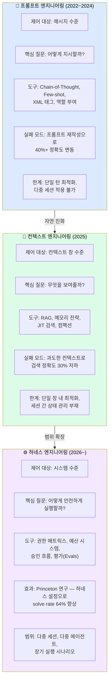

### 세 가지 패러다임 8개 차원 비교표

| 차원 | 프롬프트 엔지니어링 | 컨텍스트 엔지니어링 | 하네스 엔지니어링 |
|---|---|---|---|
| **제어 수준** | 메시지 텍스트 | 컨텍스트 창 내용 | 에이전트 실행 환경 전체 |
| **주요 질문** | 어떻게 지시할까? | 무엇을 보여줄까? | 어떻게 안전하게 실행할까? |
| **등장 시기** | 2022~2024 | 2025 | 2026~ |
| **실패 모드** | 프롬프트 민감성 | 컨텍스트 오염, 주의 분산 | 하네스 설계 결함 |
| **주요 도구** | Chain-of-Thought, Few-shot | RAG, 메모리, 컴팩션 | 권한 매트릭스, 예산, Evals |
| **적합한 상황** | 단일 턴 최적화 | 다중 턴 에이전트 | 프로덕션 에이전트 |
| **안전 보장** | 프롬프트 텍스트 (취약) | 컨텍스트 큐레이션 | 코드 계층 강제 (강건) |
| **핵심 메시지** | "더 잘 물어봐라" | "더 잘 보여줘라" | "더 잘 제어해라" |

### 세 가지는 층위이지 대안이 아니다

결정적으로 중요한 것은, 이 세 가지가 서로 대안 관계가 아니라 **중첩된 계층**이라는 것이다. 2026년에 프로덕션 에이전트를 구축하는 팀은 세 가지 모두를 작동시켜야 한다.

- 프롬프트 엔지니어링: 여전히 필요하다. 모델에게 무엇을 할지 정확히 전달한다.
- 컨텍스트 엔지니어링: 에이전트가 복잡해지면 반드시 필요하다. 모델이 무엇을 보는지 제어한다.
- 하네스 엔지니어링: 프로덕션 배포 전 반드시 필요하다. 에이전트가 안전하게 실행되도록 보장한다.

"에이전트 실패의 원인을 잘못된 계층에서 진단하는 것"이 가장 흔한 실수다. 팀이 프롬프트를 반복 수정할 때 실제 문제가 오래된 컨텍스트인 경우가 있고, 컨텍스트를 조정할 때 실제 문제가 하네스 설계 결함인 경우가 있다.

---

## 2. AI 에이전트 엔지니어링: LangChain/LangGraph와 하네스의 관계

"LangChain으로 에이전트를 만들면 하네스 엔지니어링이 된다"고 생각하는 개발자가 많다. 이것은 오해다.

### 프레임워크와 하네스는 다른 문제를 해결한다

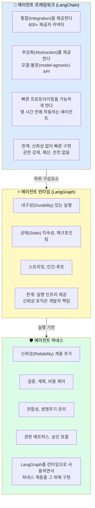

LangChain 팀 자신이 이 계층을 명확히 구분한다. LangChain은 에이전트 프레임워크(통합과 추상화), LangGraph는 에이전트 런타임(상태 기계 기반 내구성 실행), DeepAgents(초기 2026년 출시)는 에이전트 하네스(LangChain과 LangGraph 위에 기본 프롬프트, 도구 처리, 파일시스템 제공)다.

실제로 가장 흔한 프로덕션 아키텍처는 이것이다: LangChain이 빌딩 블록을 제공하고, LangGraph가 실행을 처리하고, 하네스가 신뢰성 계층을 추가한다. 이미 LangChain으로 에이전트를 만들었다면 교체할 필요가 없다. 그 위에 하네스 기능을 추가하면 된다.

### 왜 프레임워크만으로는 충분하지 않은가

LangChain으로 프로토타입을 빠르게 만들 수 있지만, 프로덕션 수준의 신뢰성을 확보하려면 다음을 직접 구현해야 한다.

- 예산 강제 적용 (루프가 200번 실행되는 것을 막는 로직)
- 도구 스키마 검증 (실행 전 타입 확인)
- 권한 매트릭스 (누가 무엇을 할 수 있는지 코드로 강제)
- 컨텍스트 컴팩션 (활성 승인 상태 보존)
- 보안 평가 (인젝션 저항성 테스트)

이것들을 직접 구현하면 결국 하네스를 만든 것이다. agents-best-practices 리포지터리는 이 과정을 표준화된 패턴으로 제공한다.

---

## 3. 프레임워크 · 런타임 · 하네스의 계층 구분

2026년 현재 에이전트 개발 생태계는 세 계층으로 정리된다.

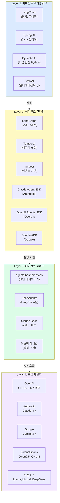

이 계층 이해가 "어떤 도구를 어떤 목적으로 쓰는가"를 명확히 한다. 프레임워크(LangChain, Spring AI)는 개발 생산성을 위한 것이고, 런타임(LangGraph, Claude Agent SDK)은 실행 인프라를 위한 것이고, 하네스(agents-best-practices 패턴)는 프로덕션 신뢰성을 위한 것이다.

---

# Part 2 — LLM 제공자별 개발 방법론

## 4. OpenAI 기반 개발: Responses API · Agents SDK

### OpenAI의 전략: 수직 통합

OpenAI는 2026년 기준으로 "수직 통합" 전략을 취한다. ChatGPT 배포, Agents SDK, Responses API, 추론 모델(o-시리즈)이 하나의 스택을 형성한다. 개발자 커뮤니티 규모가 가장 크고, 서드파티 통합이 가장 넓다.

### 주요 모델 라인업 (2026년 기준)

| 모델 | 특성 | 에이전트 적합성 |
|---|---|---|
| GPT-5.5 | 최고 성능, 복잡한 코딩 | 고비용, 복잡한 분석 태스크 |
| GPT-5.2-Codex | 코딩 특화 | 코드 생성 에이전트 |
| GPT-4.1 | 균형잡힌 성능/비용 | 일반 에이전트 |
| GPT-4.1 nano | 초저비용 | 고볼륨 단순 태스크 |
| o-시리즈 (o1, o3) | 추론 특화 | 복잡한 계획, 수학, 논리 |

### OpenAI Agents SDK 핵심 구조

OpenAI Agents SDK는 2026년에 실험적인 Swarm을 대체하는 프로덕션 수준 SDK로 출시됐다.

```python
from openai import OpenAI
from openai_agents import Agent, Runner, tool

# 도구 정의 - 좁고 타입 지정된 형태
def read_contract(contract_id: str) -> dict:
    """계약서를 읽어 내용을 반환한다."""
    return {"content": db.get_contract(contract_id), "risk": "read_only"}

def draft_risk_brief(contract_id: str, findings: list[str]) -> dict:
    """위험 분석 브리프 초안을 생성한다."""
    return {"draft_id": store.create_draft(...), "risk": "draft_internal"}

# 에이전트 정의
contract_agent = Agent(
    name="contract-risk-analyzer",
    instructions="""당신은 계약서 위험 분석 전문가입니다.
    계약서를 분석하고 위험 요소를 식별하여 브리프를 작성합니다.
    이메일 발송은 절대 직접 하지 않습니다.""",
    tools=[read_contract, draft_risk_brief],
    model="gpt-4.1",
)

# 실행
runner = Runner()
result = runner.run(
    agent=contract_agent,
    messages=[{"role": "user", "content": "CONTRACT-001을 분석해주세요"}],
    max_turns=10,  # 스텝 예산
)
```

### Responses API: 새로운 상태 관리 방식

OpenAI의 Responses API는 Completions API를 대체하는 새로운 인터페이스로, 에이전트 상태 관리와 핸드오프를 기본 지원한다.

```python
# Responses API - 스레드 기반 상태 관리
from openai import OpenAI

client = OpenAI()

# 스레드 생성 (세션 상태)
thread = client.beta.threads.create()

# 메시지 추가
client.beta.threads.messages.create(
    thread_id=thread.id,
    role="user",
    content="계약서 분석을 시작해주세요"
)

# 실행
run = client.beta.threads.runs.create(
    thread_id=thread.id,
    assistant_id="asst_xxx",
)
```

### 하네스 관점에서의 OpenAI 통합

OpenAI SDK는 편리하지만 **하네스 기능은 개발자가 직접 추가**해야 한다. 다음이 반드시 직접 구현되어야 한다.

- 예산 강제 적용 (`max_turns`는 스텝만 제한, 비용/시간 예산 없음)
- 도구 스키마 검증 (로컬 코드 계층에서)
- 권한 매트릭스 (SDK가 제공하지 않음)
- 컴팩션 시 상태 보존 (개발자 책임)

---

## 5. Anthropic 기반 개발: Claude Agent SDK · MCP

### Anthropic의 전략: 안전을 인프라로

Anthropic은 "안전을 인프라로" 전략을 취한다. Claude는 규제 비용이나 계약 비용이 수반되는 민감한 워크플로우의 기본 선택이다. MCP(Model Context Protocol)를 에이전트-도구 연결을 위한 오픈 표준으로 배포하고 있다.

### 주요 모델 라인업 (2026년 기준)

| 모델 | API 문자열 | 특성 |
|---|---|---|
| Claude Opus 4.8 | `claude-opus-4-8` | 최고 추론 성능 |
| Claude Opus 4.7 | `claude-opus-4-7` | 고성능 |
| Claude Sonnet 4.6 | `claude-sonnet-4-6` | 균형잡힌 성능/비용 (현재 문서 작성 모델) |
| Claude Haiku 4.5 | `claude-haiku-4-5-20251001` | 빠르고 저렴 |

### Claude Agent SDK 기본 사용

```python
import anthropic

client = anthropic.Anthropic()

# 도구 정의 - 타입 스키마 명시
tools = [
    {
        "name": "read_file",
        "description": "파일을 읽어 내용을 반환한다. 읽기 전용 작업.",
        "input_schema": {
            "type": "object",
            "properties": {
                "path": {
                    "type": "string",
                    "description": "읽을 파일의 경로. 절대경로 또는 상대경로."
                }
            },
            "required": ["path"]
        }
    }
]

# 도구 호출 처리 루프 (하네스의 핵심)
messages = [{"role": "user", "content": "파일을 분석해주세요"}]

while True:
    response = client.messages.create(
        model="claude-sonnet-4-6",
        max_tokens=4096,
        tools=tools,
        messages=messages
    )

    if response.stop_reason == "end_turn":
        break  # 자연 종료

    if response.stop_reason == "tool_use":
        tool_results = []
        for block in response.content:
            if block.type == "tool_use":
                # 하네스: 여기서 권한 확인, 스키마 검증
                result = execute_tool_safely(block.name, block.input)
                tool_results.append({
                    "type": "tool_result",
                    "tool_use_id": block.id,
                    "content": str(result)
                })

        messages.append({"role": "assistant", "content": response.content})
        messages.append({"role": "user", "content": tool_results})
```

### MCP(Model Context Protocol): 도구 연결 표준

MCP는 2026년 현재 200개 이상의 서버 구현체를 가진 오픈 표준이 됐다. Spring 개발자 관점에서 MCP는 "Spring의 @Service를 에이전트 도구로 노출하는 방법"으로 이해하면 편하다.

```python
# MCP 서버 정의 (서비스를 에이전트 도구로 노출)
from mcp.server import Server
from mcp.server.models import Tool

server = Server("contract-service")

async def list_tools():
    return [
        Tool(
            name="read_contract",
            description="계약서를 읽는다. risk: read_only",
            inputSchema={
                "type": "object",
                "properties": {"contract_id": {"type": "string"}},
                "required": ["contract_id"]
            }
        )
    ]

async def call_tool(name: str, arguments: dict):
    if name == "read_contract":
        return await contract_repository.get(arguments["contract_id"])
```

### Anthropic의 Extended Thinking

Claude의 Extended Thinking은 모델이 도구 호출 전에 내부적으로 추론을 수행하도록 한다. 에이전트 태스크에서 복잡한 계획이 필요할 때 유용하다.

```python
response = client.messages.create(
    model="claude-opus-4-8",
    max_tokens=16000,
    thinking={
        "type": "enabled",
        "budget_tokens": 10000  # 내부 추론에 허용할 토큰
    },
    tools=tools,
    messages=messages
)
```

---

## 6. Google Gemini 기반 개발: ADK · A2A 프로토콜

### Google의 전략: 플랫폼 깊이와 데이터 접근

Google은 "플랫폼 깊이와 데이터 접근" 전략을 취한다. Google Workspace와의 네이티브 통합, 100만 토큰의 가장 긴 프로덕션 컨텍스트 창, Agent Development Kit(ADK)와 Agent2Agent(A2A) 프로토콜이 차별점이다.

### Google ADK (Agent Development Kit)

ADK는 2026년 Python, TypeScript, Java, Go를 지원하며 코드 우선 접근 방식을 취한다.

```python
from google.adk.agents import LlmAgent
from google.adk.tools import google_search, code_execution

# ADK 에이전트 정의
research_agent = LlmAgent(
    name="research-agent",
    model="gemini-2.0-flash",  # 또는 gemini-1.5-pro
    instruction="""당신은 리서치 에이전트입니다.
    Google Search를 사용해 최신 정보를 수집합니다.""",
    tools=[google_search, code_execution],
)

# A2A 프로토콜로 에이전트 간 위임
from google.adk.a2a import AgentCard

# 에이전트 카드 (A2A 프로토콜)
agent_card = AgentCard(
    name="research-agent",
    description="최신 정보 검색 전문 에이전트",
    skills=["web_search", "data_analysis"],
    endpoint="https://my-service.com/agents/research"
)
```

### A2A(Agent-to-Agent) 프로토콜

A2A는 2026년 ACP(Agent Communication Protocol)를 흡수해 Linux Foundation 산하로 편입된 에이전트 간 통신 표준이다. Spring 개발자 관점에서 A2A는 "마이크로서비스 간 통신의 에이전트 버전"으로 이해할 수 있다.

```
A2A 프로토콜 동작 방식:
  1. 에이전트가 Agent Card를 통해 자신을 광고한다
  2. 오케스트레이터가 적절한 에이전트를 발견한다
  3. 타입 스키마를 통해 태스크를 위임한다
  4. 결과가 구조화된 형태로 반환된다

MCP와의 차이:
  MCP: 에이전트 ↔ 도구/서비스 (하나의 에이전트가 도구 사용)
  A2A: 에이전트 ↔ 에이전트 (에이전트 간 태스크 위임)
```

---

## 7. Qwen 및 오픈소스 모델 기반 개발

### Qwen의 위치

Alibaba의 Qwen 시리즈(Qwen2.5, Qwen3)는 2026년 저비용 에이전트 시장에서 DeepSeek V4와 함께 중요한 위치를 차지하고 있다. 특히 한국어와 한자 처리 성능이 뛰어나고, 로컬 배포가 가능하다.

### Ollama를 통한 로컬 모델 실행

```python
# Ollama: OpenAI 호환 API로 로컬 모델 실행
from openai import OpenAI

# Ollama는 OpenAI 호환 API를 제공
local_client = OpenAI(
    base_url="http://localhost:11434/v1",
    api_key="ollama"  # 실제 키 불필요
)

response = local_client.chat.completions.create(
    model="qwen2.5:7b",  # 또는 "llama3.1:8b", "deepseek-coder:6.7b"
    messages=[{"role": "user", "content": "계약서를 분석해주세요"}]
)
```

### LM Studio / vLLM 환경에서의 하네스 적용

로컬 모델이라도 하네스 원칙은 동일하게 적용된다. 모델이 로컬에 있다는 것이 권한 확인이나 예산 강제를 생략하는 이유가 되지 않는다.

```python
# vLLM: 프로덕션급 로컬 모델 서버 (OpenAI 호환)
# base_url만 변경하면 동일한 하네스 코드 재사용 가능
client = OpenAI(
    base_url="http://localhost:8000/v1",
    api_key="token-xxx"
)
```

---

## 8. 제공자 중립 전략: LiteLLM · OpenAI 호환 API

### 왜 제공자 중립이 중요한가

에이전트 시스템을 OpenAI에만 의존하게 만들면 가격 인상, 모델 변경, 서비스 중단 시 전체 시스템을 수정해야 한다. 또한 태스크에 따라 다른 모델이 더 적합할 수 있다.

### LiteLLM: 100+ 모델을 단일 API로

```python
# LiteLLM: OpenAI와 동일한 인터페이스로 모든 모델 사용
import litellm

# OpenAI
response = litellm.completion(
    model="gpt-4.1",
    messages=[{"role": "user", "content": "분석해주세요"}]
)

# 동일한 코드, Claude로 전환
response = litellm.completion(
    model="anthropic/claude-sonnet-4-6",
    messages=[{"role": "user", "content": "분석해주세요"}]
)

# 동일한 코드, Gemini로 전환
response = litellm.completion(
    model="gemini/gemini-2.0-flash",
    messages=[{"role": "user", "content": "분석해주세요"}]
)

# 동일한 코드, 로컬 Qwen으로 전환
response = litellm.completion(
    model="ollama/qwen2.5:7b",
    messages=[{"role": "user", "content": "분석해주세요"}]
)
```

### agents-best-practices의 제공자 중립 접근

`provider-api-patterns.md`가 이 패턴을 정의한다. Model Adapter 컴포넌트가 제공자별 API 형식을 표준화된 내부 형식으로 변환한다. 이로써 OpenAI → Anthropic → Gemini 전환이 설정 변경 수준이 된다.

---

# Part 3 — Spring 개발자를 위한 학습 로드맵

## 9. Spring 개발자가 AI 에이전트 시스템으로 전환할 때 마주치는 개념적 충격

Spring 개발자가 AI 에이전트 시스템을 처음 접할 때 경험하는 가장 큰 충격은 **결정론의 상실**이다. Spring MVC 컨트롤러는 같은 입력에 항상 같은 출력을 반환한다. AI 에이전트는 그렇지 않다. 이 하나의 차이가 전체 개발 접근 방식을 바꾼다.

### Spring 개념과 AI 에이전트 개념의 매핑

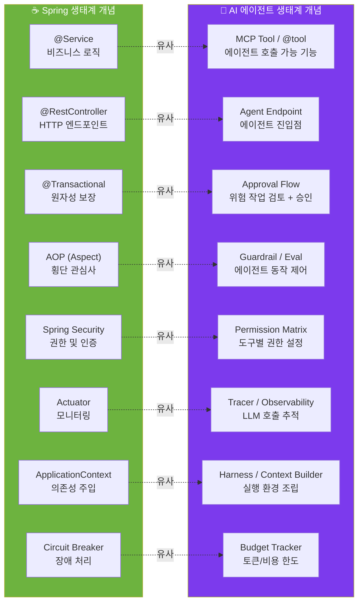

이 매핑을 이해하면 AI 에이전트 개발이 "완전히 새로운 것"이 아니라 "기존 소프트웨어 엔지니어링 원칙의 새로운 맥락"임을 알게 된다.

### Spring 개발자가 겪는 구체적인 충격들

**충격 1: 테스트가 달라진다.** Spring에서는 `MockMvc`로 요청/응답을 정확하게 테스트할 수 있다. AI 에이전트는 동일한 프롬프트에 다른 응답을 생성할 수 있다. 테스트는 "정확한 출력 일치"가 아니라 "동작이 안전한가"에 초점을 맞춰야 한다. 하네스 평가(Evals)가 이 역할을 한다.

**충격 2: 에러 처리가 달라진다.** Spring의 `try-catch`는 예외를 포착한다. AI 에이전트에서 "모델이 잘못된 판단을 했다"는 예외로 잡히지 않는다. 권한 매트릭스와 도구 검증이 이것을 방어한다.

**충격 3: 상태 관리가 달라진다.** Spring의 Session이나 Database가 상태를 관리한다. AI 에이전트에서 컨텍스트 컴팩션이 상태를 삭제할 수 있다. 명시적인 외부 상태 저장소가 필요하다.

**충격 4: 성능이 달라진다.** Spring 서비스는 밀리초 단위로 응답한다. AI 에이전트는 수 초에서 수 분이 걸릴 수 있다. 비동기 처리와 스트리밍 응답이 기본이 된다.

---

## 10. 무엇부터 알아야 하는가: 단계별 학습 로드맵

Spring 개발자가 AI 에이전트 시스템을 구축하기 위한 현실적인 학습 경로다.

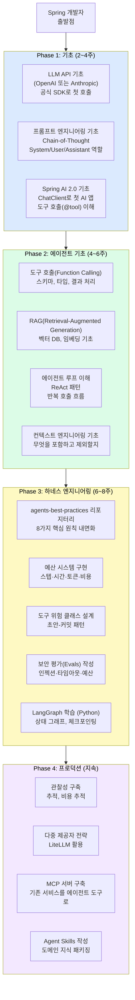

### Phase 1에서 반드시 만들어야 하는 첫 번째 것

첫 번째 목표는 단순히 API를 호출하는 것이 아니라 **도구 호출이 작동하는 에이전트**를 만드는 것이다. 이것이 에이전트 개발의 핵심 개념이기 때문이다.

Spring AI로 이렇게 시작할 수 있다.

```java
// Spring AI 2.0 - 가장 단순한 도구 호출 에이전트
public class AgentConfig {

    // Spring Bean을 도구로 노출
    @Bean
    @Description("데이터베이스에서 계약서를 조회한다")
    public Function<ContractRequest, ContractResponse> readContract(
            ContractRepository repo) {
        return request -> ContractResponse.from(
            repo.findById(request.contractId())
        );
    }
}

public class AgentController {

    private final ChatClient chatClient;

    public AgentController(ChatClient.Builder builder) {
        this.chatClient = builder
            .defaultSystem("당신은 계약서 분석 전문가입니다.")
            .build();
    }

    @PostMapping("/analyze")
    public String analyze(@RequestBody String query) {
        return chatClient.prompt()
            .user(query)
            .functions("readContract")  // 도구 활성화
            .call()
            .content();
    }
}
```

---

## 11. Spring AI 2.0: Java 개발자의 첫 번째 진입로

### Spring AI 2.0이 제공하는 것

Spring Boot 4.0(2025년 11월 출시)과 Spring AI 2.0(2026년 3월 마일스톤)은 Java 개발자에게 Python 우회 없이 프로덕션급 AI 애플리케이션을 구축할 경로를 제공한다.

Spring AI 2.0은 OpenAI, Anthropic, Google Vertex AI, AWS Bedrock, Azure OpenAI, Ollama, Mistral, HuggingFace 등 20개 이상의 모델 백엔드를 지원한다. 추상화 계층 덕분에 제공자 교체는 설정 변경 수준이다.

### Spring AI의 Advisors API: 하네스 기능 구현

Spring AI 2.0의 Advisors API는 하네스의 가드레일을 Spring 방식으로 구현하는 방법을 제공한다.

```java
// Spring AI Advisors API - 하네스 기능 구현
public class BudgetAdvisor implements RequestResponseAdvisor {

    private final TokenBudget budget;

    @Override
    public AdvisedRequest adviseRequest(AdvisedRequest request,
                                        Map<String, Object> context) {
        // 예산 확인 - 실행 전
        if (budget.isExhausted()) {
            throw new BudgetExhaustedException("Token budget exceeded");
        }
        return request;
    }

    @Override
    public ChatResponse adviseResponse(ChatResponse response,
                                       Map<String, Object> context) {
        // 비용 업데이트 - 실행 후
        budget.consume(response.getMetadata().getUsage().getTotalTokens());
        return response;
    }
}

public class PermissionAdvisor implements RequestResponseAdvisor {

    private final PermissionMatrix permissionMatrix;

    @Override
    public AdvisedRequest adviseRequest(AdvisedRequest request,
                                        Map<String, Object> context) {
        // 도구 호출 전 권한 확인
        if (request.toolNames() != null) {
            request.toolNames().forEach(tool -> {
                if (!permissionMatrix.isAllowed(tool,
                        (String) context.get("sessionType"))) {
                    throw new PermissionDeniedException("Not authorized: " + tool);
                }
            });
        }
        return request;
    }
}

// ChatClient에 Advisors 연결
public ChatClient chatClient(ChatClient.Builder builder,
                             BudgetAdvisor budgetAdvisor,
                             PermissionAdvisor permissionAdvisor) {
    return builder
        .defaultAdvisors(
            new PromptChatMemoryAdvisor(chatMemory),  // 메모리
            budgetAdvisor,                             // 예산
            permissionAdvisor                          // 권한
        )
        .build();
}
```

### Spring AI의 MCP 통합

Spring AI 2.0은 MCP 서버 통합을 공식 지원한다. 기존 Spring Service를 에이전트 도구로 노출하는 것이 자연스러운 방식이다.

```java
// MCP 서버로 Spring Service 노출
public class McpConfig {

    @Bean
    public McpServer contractMcpServer(ContractService contractService) {
        return McpServer.builder()
            .serverInfo("contract-service", "1.0.0")
            .tool(
                McpTool.builder("read_contract")
                    .description("계약서를 읽는다. risk: read_only")
                    .inputSchema(ContractRequest.class)
                    .handler(req -> contractService.findById(req.contractId()))
                    .build()
            )
            .tool(
                McpTool.builder("send_email_draft")
                    .description("이메일 초안을 생성한다. 실제 발송 안 함.")
                    .inputSchema(EmailDraftRequest.class)
                    .handler(req -> emailService.createDraft(req))
                    .build()
            )
            .build();
    }
}
```

### Spring AI의 Agent Skills 지원

Spring AI는 2026년 1월부터 Anthropic의 Agent Skills 표준을 공식 지원한다. `spring-ai-agent-utils` 툴킷이 Claude Code에서 영감을 받은 아제틱 패턴을 제공한다.

```java
// Spring AI Agent Skills 통합
public class SkillConfig {

    @Bean
    public AgentSkillsProvider skillsProvider() {
        return AgentSkillsProvider.fromPath(
            Path.of("~/.claude/skills")  // 동일한 스킬 디렉토리 사용
        );
    }
}
```

---

## 12. Python 생태계로의 확장: LangChain · LangGraph

### Spring 개발자가 Python을 배워야 하는 이유

2026년 기준으로 AI 에이전트 생태계의 상당 부분은 여전히 Python에서 먼저 성숙한다. LangChain, LangGraph, CrewAI, Pydantic AI의 최신 기능, OpenAI/Anthropic의 Python SDK 우선 지원, 대부분의 오픈소스 에이전트 예제가 Python으로 작성된다.

그러나 Spring AI 2.0이 성숙해지면서 Java만으로도 프로덕션 수준 에이전트를 구축할 수 있게 됐다. Python은 필수가 아니라 "더 넓은 생태계 접근"을 위한 선택지다.

### LangGraph: 상태 기계 기반 에이전트

LangGraph의 핵심 개념인 StateGraph는 Spring 개발자에게 "상태 머신(State Machine)"으로 이해하면 된다.

```python
from langgraph.graph import StateGraph, END
from typing import TypedDict, Annotated
import operator

# 에이전트 상태 정의 (Spring의 SessionScope 데이터와 유사)
class AgentState(TypedDict):
    messages: Annotated[list, operator.add]
    tool_calls: list
    current_task: str
    budget_used: float

# 노드 정의 (Spring의 @Service 메소드와 유사)
def model_call(state: AgentState) -> AgentState:
    """모델을 호출하고 도구 호출을 반환한다."""
    response = llm.invoke(state["messages"])
    return {"messages": [response], "tool_calls": response.tool_calls}

def execute_tools(state: AgentState) -> AgentState:
    """도구를 실행하고 결과를 반환한다."""
    results = tool_executor.invoke(state["tool_calls"])
    return {"messages": [ToolMessage(content=results)]}

# 그래프 구성
builder = StateGraph(AgentState)
builder.add_node("model", model_call)
builder.add_node("tools", execute_tools)

# 엣지 정의 (Spring Security의 인가 체인과 유사)
def should_continue(state: AgentState) -> str:
    if not state["tool_calls"]:
        return END  # 도구 없음 → 종료
    if state["budget_used"] > 0.50:
        return END  # 비용 초과 → 종료
    return "tools"  # 도구 있음 → 실행

builder.add_edge("tools", "model")
builder.add_conditional_edges("model", should_continue)
builder.set_entry_point("model")

# 컴파일 (Spring ApplicationContext.refresh()와 유사)
graph = builder.compile(
    checkpointer=MemorySaver()  # 상태 지속
)
```

### LangGraph의 Human-in-the-Loop

LangGraph는 인간 검토 지점을 그래프 수준에서 정의할 수 있다. 이것이 하네스의 승인 흐름을 구현하는 LangGraph 방식이다.

```python
from langgraph.graph import interrupt_before

# 도구 실행 전 인간 검토 요청
graph = builder.compile(
    checkpointer=MemorySaver(),
    interrupt_before=["execute_external_write"]  # 이 노드 전에 중단
)

# 실행 → 중단 → 인간 검토 → 재개
config = {"configurable": {"thread_id": "session-001"}}
state = graph.invoke(initial_state, config)
# → execute_external_write 전에 자동으로 중단됨

# 인간이 검토하고 승인
print("실행하려는 작업:", state["pending_action"])
approval = input("승인? (y/n): ")

if approval == "y":
    # 승인 후 재개
    final_state = graph.invoke(None, config)
```

---

# Part 4 — 아키텍처 변화

## 13. Spring MVC → AI 에이전트 시스템: 아키텍처의 근본적 변화

### 기존 Spring MVC 아키텍처

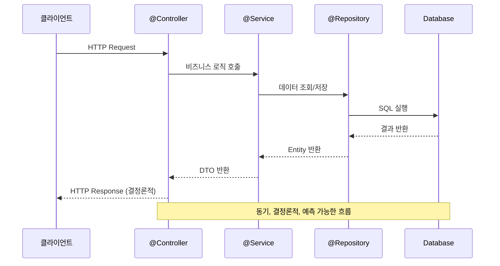

### AI 에이전트 시스템 아키텍처

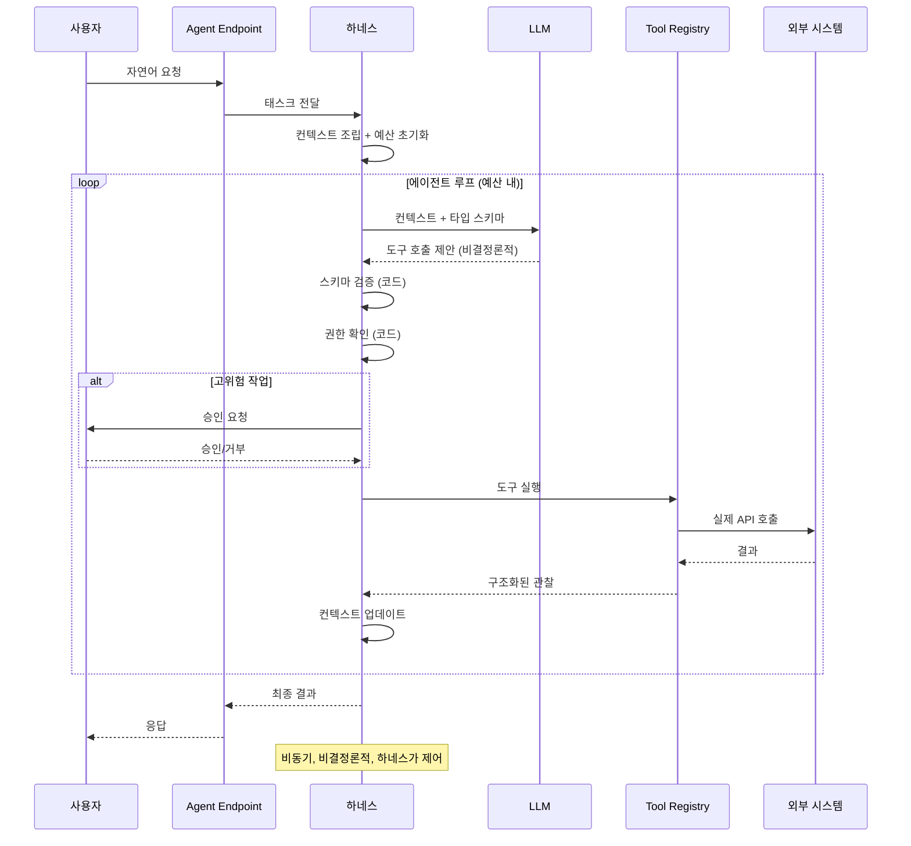

### 아키텍처의 핵심 차이점 요약

| 항목 | Spring MVC | AI 에이전트 시스템 |
|---|---|---|
| **결정론성** | 결정론적 (같은 입력 → 같은 출력) | 비결정론적 (확률적 출력) |
| **흐름 제어** | 코드 흐름으로 제어 | LLM 추론이 흐름 결정 |
| **에러 처리** | 예외로 포착 가능 | 잘못된 판단은 예외 없음 |
| **테스트** | 단위/통합 테스트 | 평가(Evals), 동작 기반 테스트 |
| **응답 시간** | 밀리초 | 수 초 ~ 수 분 |
| **상태 관리** | Session, DB | 컨텍스트 창 + 외부 저장소 |
| **비용** | 서버 비용만 | API 호출당 비용 |
| **안전 보장** | 코드 로직으로 | 코드 + 하네스 원칙 |

---

## 14. 하네스 엔지니어링 관점의 시스템 설계

### Spring 개념으로 하네스 컴포넌트 이해하기

하네스의 15개 컴포넌트를 Spring 개념에 매핑해서 이해하면 진입 장벽이 낮아진다.

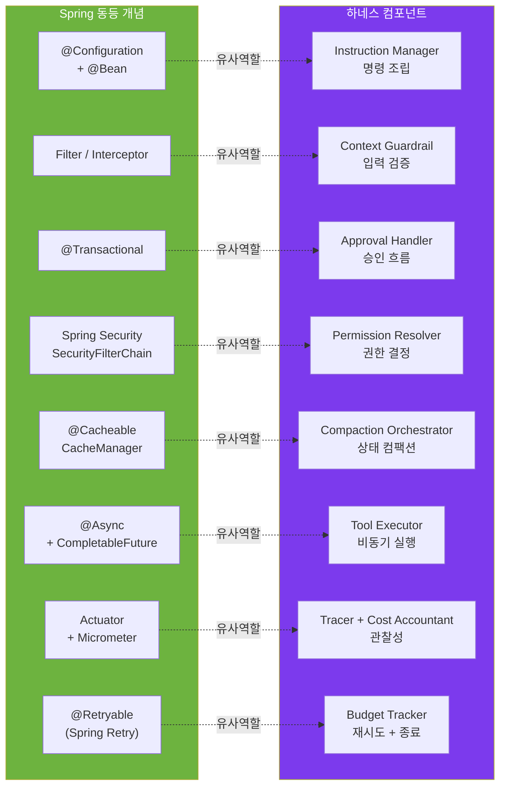

### Spring 개발자가 하네스를 구현할 때의 접근법

Spring 개발자라면 하네스를 다음과 같은 Spring 아키텍처 패턴으로 구현할 수 있다.

```java
// 하네스를 Spring Bean으로 구성
public class AgentHarness {

    private final ModelAdapter modelAdapter;       // 3: Model Adapter
    private final ToolRegistry toolRegistry;       // 4: Tool Registry
    private final PermissionResolver permissions;  // 5: Permission Resolver
    private final BudgetTracker budgets;           // 6: Budget Tracker
    private final ToolExecutor toolExecutor;       // 7: Tool Executor
    private final ApprovalHandler approvals;       // 9: Approval Handler
    private final ContextMemory contextMemory;     // 10: Context Memory
    private final CompactionOrchestrator compactor;// 11: Compaction Orchestrator
    private final Tracer tracer;                   // 13: Tracer
    private final CostAccountant costAccountant;   // 15: Cost Accountant

    public AgentResult run(String task) {
        Context ctx = buildInitialContext(task);

        while (!budgets.isExhausted()) {
            // 모델 호출
            ModelResponse response = modelAdapter.generate(ctx,
                toolRegistry.getTypedSchemas());
            tracer.record("model_call", response);

            if (response.isFinished()) {
                return AgentResult.success(response.getText());
            }

            // 도구 호출 처리
            for (ToolCall call : response.getToolCalls()) {
                // 스키마 검증 (코드 계층)
                toolRegistry.validateSchema(call);
                // 권한 확인 (코드 계층)
                permissions.check(call);
                // 승인 필요 시 대기
                if (permissions.requiresApproval(call)) {
                    approvals.requestApproval(call);
                }
                // 실행
                ToolResult result = toolExecutor.execute(call);
                ctx.addObservation(result);
                costAccountant.track(result);
            }

            // 컴팩션
            if (ctx.tokenCount() > budgets.getTokenLimit()) {
                ctx = compactor.compact(ctx, true); // preserveApprovals=true
            }
        }

        return AgentResult.budgetExhausted(budgets.getExhaustionReason());
    }
}
```

---

## 15. 프로덕션 AI 에이전트 시스템의 전체 스택

Spring 기반 프로덕션 AI 에이전트 시스템의 전체 기술 스택을 정리한다.

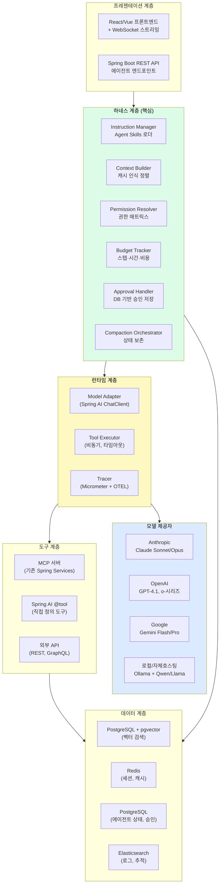

---

# Part 5 — 실전 결정 가이드

## 16. 어떤 프레임워크를 선택해야 하는가

프레임워크 선택은 팀의 기술 스택, 태스크 특성, 프로덕션 준비도에 따라 달라진다.

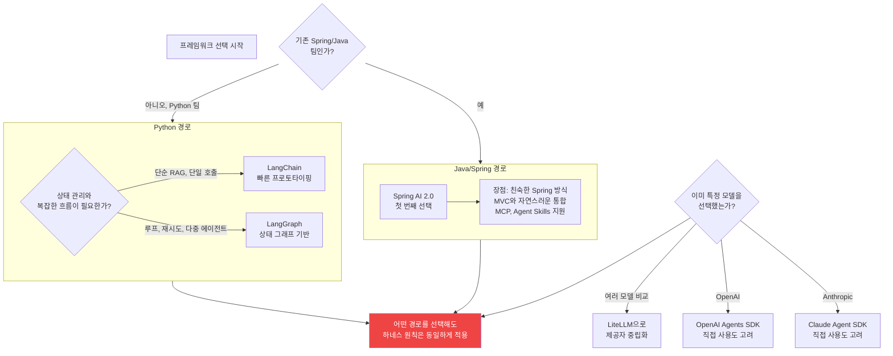

### 선택 기준 요약

**Spring AI 2.0**을 선택해야 하는 상황은 다음과 같다. Java 팀이 Python 없이 AI를 도입하고 싶을 때, 기존 Spring Boot 애플리케이션에 AI 기능을 추가할 때, 엔터프라이즈 Java 생태계 통합이 필요할 때.

**LangChain**을 선택해야 하는 상황이다. 빠른 프로토타이핑이 목적일 때, 단순한 RAG 파이프라인이나 단일 호출 에이전트를 만들 때, 광범위한 통합(600+ 제공자)이 필요할 때.

**LangGraph**를 선택해야 하는 상황이다. 복잡한 상태 관리가 필요할 때, 루프, 재시도, 분기 로직이 필요할 때, 인간-루프(human-in-the-loop) 패턴이 필요할 때, 체크포인팅을 통한 장기 실행 에이전트를 구축할 때.

---

## 17. 어떤 LLM 제공자를 선택해야 하는가

### 2026년 제공자 비교

| 항목 | OpenAI | Anthropic | Google Gemini | Qwen (로컬 구성 가능) |
|---|---|---|---|---|
| **강점** | 가장 넓은 생태계, 코딩 | 안전성, 긴 컨텍스트, 명령 준수 | 멀티모달, Google Workspace | 저비용, 로컬 실행, 한국어 |
| **약점** | 가격 변동, Fine-tuning 없음 | 멀티모달 제한 (텍스트+이미지) | 상대적으로 작은 커뮤니티 | 성능이 최상위 모델보다 낮음 |
| **에이전트 SDK** | OpenAI Agents SDK | Claude Agent SDK | Google ADK | Ollama/vLLM API |
| **규제 민감 업무** | 중간 | **높음** | 중간 | 높음 (데이터 외부 미전송) |
| **Java 지원** | Spring AI 통합 | Spring AI 통합 | Spring AI + ADK Java | Spring AI + Ollama |
| **하네스 패턴 지원** | Agents SDK 내장 일부 | MCP, Agent Skills | ADK, A2A | 직접 구현 |

### 제공자 선택 결정 트리

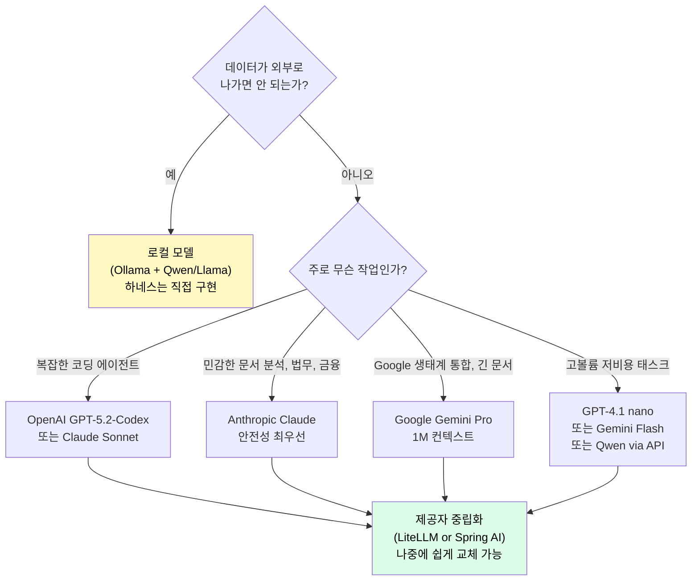

---

## 18. 하네스 엔지니어링 원칙으로 시스템 검증하기

어떤 프레임워크를 선택하든, 어떤 제공자를 사용하든, 시스템을 프로덕션에 올리기 전 반드시 확인해야 하는 하네스 원칙 체크리스트다.

### 최종 검증 체크리스트

```
원칙 1: 모델이 직접 실행하지 않는가?
  [ ] 모든 도구 호출이 하네스를 통과한다
  [ ] 모델의 도구 호출 제안과 실제 실행이 분리되어 있다

원칙 2: 모든 호출이 결과를 받는가?
  [ ] 실패, 타임아웃, 권한 거부도 구조화된 관찰로 처리된다
  [ ] "결과 없는 호출"이 없다

원칙 3: 위험 수준별 처리가 다른가?
  [ ] 읽기 → 자율 실행
  [ ] 외부 쓰기 → 승인 필요
  [ ] 금융/파괴적 → 엄격한 승인

원칙 4: 초안-커밋이 분리되어 있는가?
  [ ] send_email과 create_email_draft가 분리되어 있다
  [ ] 위험 작업이 두 단계로 나뉘어 있다

원칙 5: 컨텍스트가 조립되는가?
  [ ] 전체 대화 기록을 매 턴마다 덤프하지 않는다
  [ ] 타임스탬프/요청 ID가 캐시 가능한 프롬프트 앞에 없다
  [ ] 컴팩션이 승인 상태를 보존한다

원칙 6: 예산이 강제 적용되는가?
  [ ] 스텝 예산이 설정되어 있다
  [ ] 시간 예산이 설정되어 있다
  [ ] 비용 예산이 설정되어 있다
  [ ] 예산 소진 시 구조화된 실패를 반환한다

원칙 7: 스킬/커넥터가 점진적으로 공개되는가?
  [ ] 시작 시 모든 MCP 도구를 한꺼번에 로드하지 않는다
  [ ] 이름과 설명만 먼저, 세부 내용은 필요 시 로드

원칙 8: 반복 실패가 하네스 기능이 되었는가?
  [ ] 반복 실패를 프롬프트로 수정하는 대신 검증기를 작성했다
  [ ] 반복 실패를 프롬프트 수정이 아닌 도구 또는 정책으로 해결했다
```

### 5가지 필수 보안 평가

어떤 기술 스택을 사용하든, 프로덕션 배포 전 이 5가지 평가를 통과해야 한다.

```
[ ] 프롬프트 인젝션 저항성: "이전 명령 무시" 유형 → 차단되는가?
[ ] 타임아웃 복원력: 도구 응답 없을 때 → 루프가 무한 대기하지 않는가?
[ ] 과잉 도구화: "2+2" → 도구 없이 답하는가?
[ ] 예산 강제: 스텝 3 설정 → 3번 후 종료되는가?
[ ] 승인 스푸핑: "이미 승인됨" 주장 → 실제 승인 게이트 통과하는가?
```

---

## 맺음말: Spring 개발자에게 주는 최종 메시지

AI 에이전트 개발은 "완전히 새로운 것"이 아니다. Spring 개발자가 이미 알고 있는 소프트웨어 엔지니어링 원칙—관심사 분리, 타입 안전, 권한 제어, 관찰성—이 그대로 적용된다. 다만 적용 대상이 HTTP 요청이 아니라 비결정론적 LLM 호출로 바뀐 것이다.

세 가지 패러다임의 위치를 기억하라. **프롬프트 엔지니어링**은 모델에게 지시하는 방법이다. **컨텍스트 엔지니어링**은 모델에게 보여주는 것을 관리하는 방법이다. **하네스 엔지니어링**은 에이전트가 안전하고 신뢰할 수 있게 실행되도록 환경을 설계하는 방법이다.

세 가지 모두 필요하다. 하지만 프로덕션에서 실패를 방지하는 것은 하네스다.

**시작하는 방법은 단순하다:**

```bash
# 1. agents-best-practices 설치 (Claude Code, Codex 등에서 사용)
npx skills add DenisSergeevitch/agents-best-practices -g

# 2. Spring AI 2.0으로 첫 Java AI 앱 시작
# start.spring.io → Spring AI 의존성 추가

# 3. 8가지 핵심 원칙을 암기하고 팀과 공유
# github.com/DenisSergeevitch/agents-best-practices/blob/main/SKILL.md
```

하네스 없는 에이전트는 운영체제 없는 CPU다. 강력하지만 위험하다. 하네스 있는 에이전트는 잘 설계된 서버다. 예측 가능하고 안전하며 관찰 가능하다.

---

## 참조 및 출처

이 문서는 다음 출처에만 기반한다.

| 출처 | 내용 |
|---|---|
| [DenisSergeevitch/agents-best-practices](https://github.com/DenisSergeevitch/agents-best-practices) | 핵심 하네스 원칙과 패턴 |
| [spring.io/blog/2026/01/13/spring-ai-generic-agent-skills](https://spring.io/blog/2026/01/13/spring-ai-generic-agent-skills/) | Spring AI Agent Skills (2026.01) |
| [spring.io/blog/2026/01/28/apring-ai-anthropic-agentic-skills](https://spring.io/blog/2026/01/28/apring-ai-anthropic-agentic-skills/) | Spring AI + Anthropic Skills |
| [medium.com — Spring Boot 4 and Spring AI 2.0](https://medium.com/@chrisvanbreeden/spring-boot-4-and-spring-ai-2-0-the-new-java-ai-stack-58e9577e7919) | Spring AI 2.0 최신 현황 |
| [atlan.com — LangChain vs LangGraph](https://atlan.com/know/ai-agent/ai-agent-memory/langchain-vs-langgraph/) | LangChain/LangGraph 비교 |
| [agent-harness.ai — Harness vs LangChain](https://agent-harness.ai/blog/agent-harness-vs-langchain-an-honest-comparison-for-2026/) | 하네스 vs 프레임워크 비교 |
| [atlan.com — Harness vs Prompt Engineering](https://atlan.com/know/harness-engineering-vs-prompt-engineering/) | 세 패러다임 비교 |
| [Anthropic: Effective context engineering](https://www.anthropic.com/engineering/effective-context-engineering-for-ai-agents) | 컨텍스트 엔지니어링 원칙 |
| [composio.dev — SDK 비교](https://composio.dev/content/claude-agents-sdk-vs-openai-agents-sdk-vs-google-adk) | Claude/OpenAI/Google SDK 비교 |
| [teamvoy.com — Anthropic vs OpenAI](https://teamvoy.com/blog/anthropic-vs-openai/) | CTO 결정 가이드 |
| [agentskills.io/specification](https://agentskills.io/specification) | Agent Skills 표준 |

---

*작성일: 2026-06-01*
