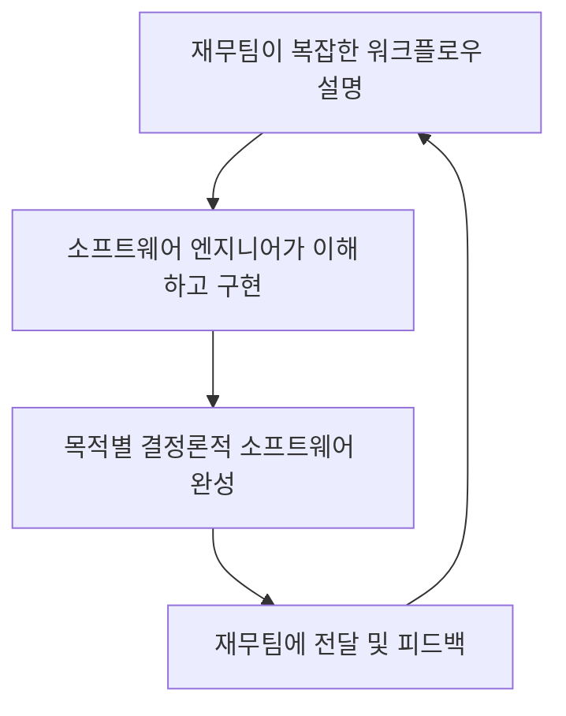
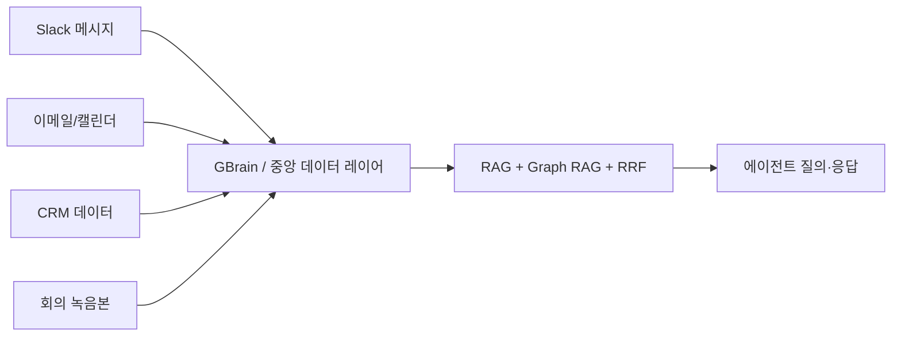
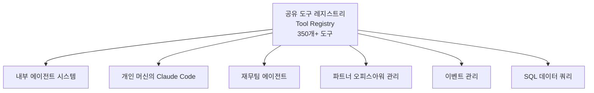
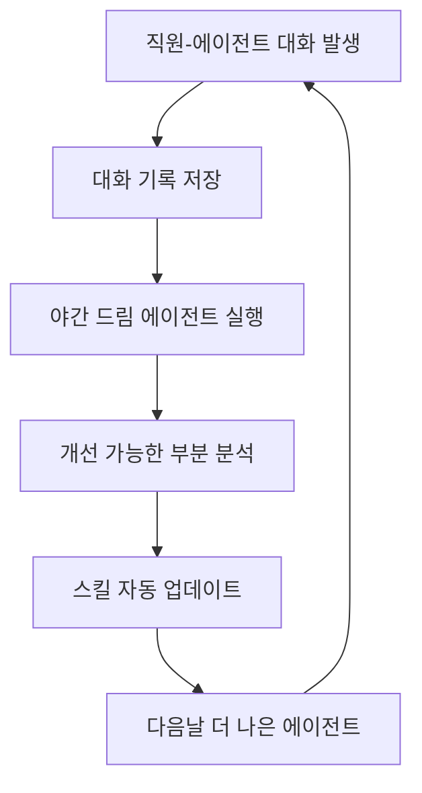
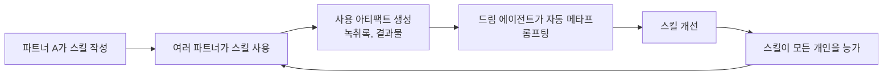
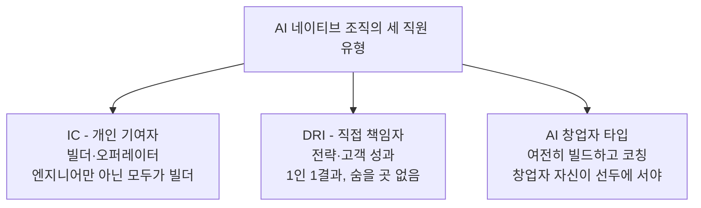
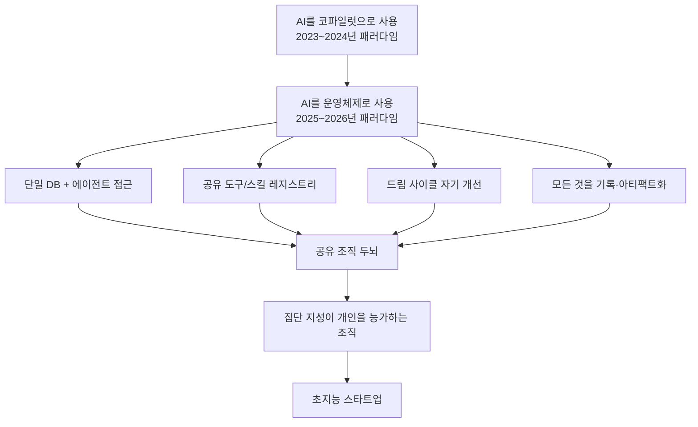

> **출처**: Y Combinator Lightcone Podcast (2026년 5월 27일) — [Pete Koomen(YC General Partner) 인터뷰](https://www.youtube.com/watch?v=B246K_G7mHU)  
> **추가 출처**: YC Startup School — Diana Hu(YC Partner) 강연 ["The Playbook For Building An AI Native Company"](https://www.ycombinator.com/library/OX-the-playbook-for-building-an-ai-native-company)

---

## 목차

1. [배경: Pete Koomen은 누구인가](#1-배경)
2. [출발점: 재무팀 문제와 에이전트 인프라의 탄생](#2-출발점)
3. [SQL 접근 권한이 모든 것을 바꾼 순간](#3-sql-접근권한)
4. [단일 데이터베이스의 힘: 컨텍스트의 통합](#4-단일-데이터베이스)
5. [Jevons 역설: 질문의 폭발적 증가](#5-jevons-역설)
6. [에이전트를 위한 데이터 비정규화: GBrain 개념](#6-데이터-비정규화)
7. [싱글플레이어 시대를 넘어서: 멀티플레이어 에이전트 문제](#7-싱글플레이어-한계)
8. [350개의 도구와 공유 레지스트리](#8-도구-레지스트리)
9. [Skillify, DRY, MECE: 스킬 관리의 원칙](#9-skillify-dry-mece)
10. [셀프 임프루빙 드림 사이클: 매일 밤 스스로 개선하는 시스템](#10-드림-사이클)
11. [두 문장 피치 스킬: 집단 지성이 개인을 능가하는 순간](#11-두문장-피치)
12. [조직 내 초지능이 복리로 쌓이는 방법](#12-초지능의-복리)
13. [모든 것을 기록하라: 아티팩트가 곧 빌딩 레이어](#13-모든것-기록)
14. [공유 조직 두뇌: 집단 지성의 실체](#14-공유-조직-두뇌)
15. [신뢰 우선 문화가 필수 조건인 이유](#15-신뢰-우선-문화)
16. [신입 직원의 온보딩 혁명](#16-신입-직원-온보딩)
17. [말 없는 마차(Horseless Carriages) 에세이: AI 소프트웨어 비판](#17-말없는-마차)
18. [채팅이 에이전트의 최선의 인터페이스인 이유](#18-채팅-인터페이스)
19. [저스트인타임 소프트웨어의 등장](#19-저스트인타임-소프트웨어)
20. [AI의 중앙집중화 vs 탈중앙화: 역사적 선택의 기로](#20-중앙화-vs-탈중앙화)
21. [Diana Hu: AI 네이티브 회사의 플레이북](#21-diana-hu-플레이북)
22. [조직 구조의 재설계: 세 가지 직원 유형](#22-조직-구조-재설계)
23. [스타트업이 가진 거대한 이점](#23-스타트업의-이점)
24. [핵심 정리 및 실천 가이드](#24-핵심-정리)

---

## 1. 배경

Pete Koomen은 A/B 테스트 플랫폼 **Optimizely**를 공동 창업해 연간 반복 매출(ARR) 1억 달러 이상으로 성장시킨 후 2020년에 매각한 인물이다. 이후 Y Combinator(YC)의 제너럴 파트너로 합류했으며, 현재는 YC 내부의 AI 에이전트 인프라 전체를 설계하고 구축하는 역할을 맡고 있다. 2026년 5월 27일 YC의 Lightcone 팟캐스트에서 그는 처음으로 YC 내부에서 어떻게 AI 시스템을 구축해 왔는지를 공개적으로 이야기했다.

이 에피소드는 단순한 생산성 도구 소개가 아니다. AI를 조직 운영의 **운영체제(Operating System)** 로 삼는다는 것이 무엇을 의미하는지, 그것이 어떻게 조직 내부에 점진적으로 축적되어 '초지능(Superintelligence)'으로 발전할 수 있는지를 구체적인 사례와 함께 설명한다.

---

## 2. 출발점: 재무팀 문제와 에이전트 인프라의 탄생

YC 내부의 AI 인프라는 약 1년 반 전, 재무팀과의 협업 문제에서 출발했다. 당시 YC는 오랫동안 자체 소프트웨어로 운영되어 왔고, 재무팀이 필요로 하는 업무—분개 입력(journal entry), 투자 라운드 기록, 각종 재무 워크플로우 처리—를 소프트웨어 엔지니어들이 지원하고 있었다.

그 과정은 다음과 같은 비효율적인 루프로 이루어졌다.

Pete Koomen은 이 루프를 보면서, 한편으로는 Cursor나 Windsurf 같은 에이전트 코딩 도구들이 자신의 개인 컴퓨터에서 엄청난 능력을 발휘하는 것을 목격하고 있었다. Claude Code도 바로 그 무렵 등장했다. 그는 이 두 가지 현실 사이의 간극이 점점 커지는 것을 느꼈다.

"왜 재무팀에게 자신들의 소프트웨어를 직접 제어할 수 있는 도구를 주지 않는가?" 라는 질문이 프로젝트의 출발점이었다. 즉, 소프트웨어 엔지니어가 복잡한 워크플로우를 Ruby 코드로 작성하는 대신, 재무팀이 **영어 프롬프트**로 자신들의 업무 논리를 직접 표현할 수 있게 하는 것이다.

---

## 3. SQL 접근 권한이 모든 것을 바꾼 순간

초기 도구 개발에서 가장 결정적인 전환점은 에이전트에게 **프로덕션 데이터베이스에 대한 읽기 전용 SQL 쿼리 권한**을 주는 것이었다. 처음에는 매우 제한된 도구들만 존재했고, 도메인도 매우 좁게 설정되어 있었다.

당시 YC 엔지니어 Jared가 두 가지 도구를 만들었다. 하나는 데이터베이스에 대한 읽기 전용 쿼리 실행 도구였고, 다른 하나는 모델 파일을 읽는 도구였다. 그는 스스로 "규칙을 어기는 것 같다"고 느끼면서도, 에이전트에게 프로덕션 데이터베이스에 대한 **완전한 접근 권한**을 주는 도구를 조용히 배포했다.

결과는 놀라웠다. 이것은 훗날 **OpenClaw** 같은 도구에서 증명된 패턴—보안과 프라이버시를 지나치게 걱정하는 것이 오히려 AI의 능력을 제한하고 있었다는 사실—과 정확히 맞닿아 있었다. 제한을 풀었을 때 비로소 에이전트는 "믿을 수 없을 정도로 강력"해졌다.

---

## 4. 단일 데이터베이스의 힘: 컨텍스트의 통합

이 실험이 특히 효과를 발휘할 수 있었던 이유는 YC의 독특한 데이터 구조에 있었다. YC는 자체 소프트웨어로 운영되며, **모든 중요한 데이터가 하나의 PostgreSQL 데이터베이스에 집약**되어 있다. 구체적으로는 다음과 같은 데이터가 모두 이 단일 DB 안에 존재한다.

- 역대 YC가 투자한 모든 회사 정보
- 창업자 정보
- 재무 거래 내역
- 파트너들이 내부 CRM에 남긴 메모
- 이벤트 관련 데이터

대부분의 회사들이 서드파티 SaaS 도구들에 분산해서 저장하는 정보들을 YC는 모두 자체 개발 소프트웨어 안에 보관하고 있다. 이것이 에이전트에게 **스키마 정보만 약간 추가로 제공**했을 때, "지난 4개 배치에서 우주 관련 회사에 투자한 투자자를 모두 보여줘" 같은 임의적이고 복잡한 질문에도 즉시 답할 수 있게 된 이유다.

Pete는 이것을 이렇게 표현했다: "모든 컨텍스트가 한 곳에 있을 때, 에이전트는 우리 비즈니스에 관한 거의 모든 질문에 답할 수 있다."

---

## 5. Jevons 역설: 질문의 폭발적 증가

SQL 쿼리 도구가 가져온 변화는 단순히 질문에 더 쉽게 답할 수 있게 된 것 이상이었다. **질문 자체의 수와 복잡성이 폭발적으로 증가**했다.

이것은 경제학의 **Jevons 역설(Jevons' Paradox)** 과 정확히 같은 현상이다. 어떤 자원의 효율성이 높아지면 그 자원의 소비량이 오히려 증가한다는 원리다. BI(Business Intelligence) 도구를 사용해 "지난 4개 배치에서 우주 관련 기업에 투자한 투자자" 같은 쿼리를 만들려면 몇 시간이 걸렸다. 그러니 정말 중요한 경우가 아니면 그냥 포기하게 된다.

에이전트에게 SQL 접근 권한을 주었을 때, 사람들은 이전에는 감히 묻지 않았던 질문들을 마구 던지기 시작했다. 데이터 과학팀의 문을 두드려 백로그를 기다릴 필요가 없어지자, 질문의 장벽이 무너졌다. 이것이 조직 내에서 팀 간 협조 절차를 제거할 때 얻는 또 다른 Jevons 역설의 사례다.

2026년 현재에도 대부분의 사람들은 BI 팀이 SQL 쿼리를 작성해주길 기다리는 세계에 살고 있다는 점을 Pete는 지적했다. 아직 갈 길이 멀지만, 그만큼 기회도 크다.

---

## 6. 에이전트를 위한 데이터 비정규화: GBrain 개념

다른 회사들처럼 데이터가 여러 시스템에 분산되어 있는 경우에는 어떻게 해야 할까? Pete와 Gary가 이야기하는 해법은 **에이전트를 위한 데이터 비정규화(Denormalization)** 다.

이것은 구글이 초창기에 직면했던 문제와 유사하다. 구글의 엔지니어들은 **BigTable**이라는 개념을 만들어냈는데, 복잡한 스키마와 조인 대신 에이전트가 처리하기 좋은 형태의 하나의 큰 테이블로 데이터를 재구성하는 것이다.

Gary가 개발한 **GBrain**이 바로 이 접근법의 현대적 구현이다. GBrain은 여러 시스템의 데이터를 에이전트 검색에 최적화된 형태로 재구성한다. 기술적으로는 다음과 같은 요소들이 포함된다.

- **RAG(Retrieval-Augmented Generation)**: 검색 기반 정보 증강
- **Graph RAG**: 그래프 구조를 활용한 검색
- **하이브리드 RRF(Reciprocal Rank Fusion)**: 다양한 검색 결과의 재랭킹

이렇게 데이터가 에이전트에 최적화된 형태로 정리되고, 에이전트에게 사용자가 무엇을 중요하게 여기는지에 대한 맥락까지 제공되면, 에이전트는 "모퉁이 너머를 볼 수 있을" 정도로 강력해진다. 질문을 입력했을 때 에이전트가 질문의 진짜 의도를 해석하고, 그 사용자를 잘 아는 사람만이 줄 수 있는 수준의 답변을 제시하게 된다.

---

## 7. 싱글플레이어 시대를 넘어서: 멀티플레이어 에이전트 문제

지난 1년 반을 돌아보면, 우리는 여전히 에이전트의 **싱글플레이어 시대**에 있다고 Pete는 진단한다. Claude Code, Codex, Pico, OpenClaw, Hermes 같은 주요 에이전트 하네스들은 모두 **단일 인간이 단일 머신에서 사용**하도록 설계되어 있다. 이 환경에서 에이전트는 거의 모든 것을 할 수 있고, 사용자를 엄청나게 강력하게 만들어준다.

그런데 Pete가 보기에 아직 아무도 제대로 해결하지 못한 큰 문제가 있다: **멀티플레이어 하네스**다. 즉, 팀 수준 또는 조직 수준에서 그 슈퍼파워를 가능하게 하는 것이다.

YC가 구축한 인프라에서 흥미로운 부분이 바로 이것이었다—개인과 팀이 에이전트를 사용할 수 있게 해주는 어떤 원시 개념(primitives)들이 실제로 작동하는지를 관찰해온 것이다.

레거시 조직이 이 문제를 해결하는 방법으로 Pete가 제안하는 것은 **공통 컨텍스트 레이어**의 구축이다. 조직 내 중요한 컨텍스트가 최대한 많이 모여 있는 **데이터 웨어하우스**가 그 출발점이다. 에이전트가 모노레포(monorepo) 안에서 훨씬 효율적으로 작동하듯, YC의 에이전트들이 모든 것이 하나의 스키마에 담긴 단일 데이터베이스 위에서 작동할 때 훨씬 높은 가치를 발휘한다는 것이 그 근거다.

---

## 8. 350개의 도구와 공유 레지스트리

YC의 AI 시스템의 또 다른 핵심은 **내부 도구 레지스트리(Tool Registry)** 다. 처음에는 시스템이 단순했다. 에이전트 루프, 간단한 도구 레지스트리, 그리고 모델 라우터 정도가 전부였다. 처음에는 20개 정도의 도구가 있었고, 그 중에 마법 같은 SQL 쿼리 기능이 포함되어 있었다.

그런데 시간이 지나면서 각 팀이 자신들의 업무에 필요한 도구를 계속 추가하기 시작했다.

- 파트너들은 오피스아워 일정 관리 도구를 추가했다
- 재무팀은 분개 입력 도구를 추가했다
- 행사 관리 도구, 각종 운영 도구가 추가되었다

현재 YC의 도구 레지스트리에는 **350개 이상의 도구**가 있다. 중요한 점은, 이 도구들이 한 곳에 모여 있기 때문에 내부 에이전트뿐만 아니라 각 개인의 머신에서 실행되는 **Claude Code에도 동일하게 제공**할 수 있다는 것이다.

이 공유 레지스트리가 바로 에이전트들을 "직장에서 실제로 유용한 것"으로 만드는 핵심이다.

---

## 9. Skillify, DRY, MECE: 스킬 관리의 원칙

도구 레지스트리가 발전하면서 **스킬(Skill)** 이라는 개념이 등장했다. 스킬은 도구 위에 올라가는 간단한 추상화 레이어다. Pete와 Gary는 스킬 관리에 두 가지 원칙을 적용한다.

**DRY (Don't Repeat Yourself)**  
중복하지 말 것. 같은 기능을 하는 스킬이 10개 있는 것은 나쁘다. 파라미터로 다양한 동작을 처리할 수 있는 하나의 스킬이 훨씬 좋다.

**MECE (Mutually Exclusive, Collectively Exhaustive)**  
상호 배타적이고 전체를 포괄할 것. 맥킨지 컨설턴트들이 슬라이드 덱을 구성할 때 사용하는 원칙이기도 하다. DRY 위에 추가되는 레이어로, 스킬들이 서로 겹치지 않으면서 필요한 모든 영역을 커버해야 한다는 것이다.

**Skillify와 Check Resolvable**  
Gary가 만든 **Skillify**는 메타 스킬로, 에이전트 안에서 무언가 새로운 작업을 하고 나면 그것을 스킬로 자동 변환해주는 기능을 한다. 에이전트가 어떤 작업을 수행하고 결과가 마음에 들면, "Skillify해줘"라고 말하면 그것이 도구 호출 또는 메서드 호출처럼 스킬화된다.

이후에는 **Check Resolvable**이라는 메타 스킬을 실행해 기존의 모든 스킬과 도구를 살펴보고, DRY와 MECE 원칙을 위반하지 않는지 확인한다.

Pete는 Claude Code의 스킬 레지스트리, YC의 도구 레지스트리, 그리고 OpenClaw의 스킬 시스템이 모두 근본적으로 동일한 개념인 **리졸버(Resolver)** 라는 사실을 흥미롭게 관찰했다. 이것은 유닉스의 스택과 힙 발견처럼, 에이전트 시스템의 새로운 원시 개념(primitives)이 지금 이 순간 동시에 다양한 곳에서 발견되고 있다는 신호다.

---

## 10. 셀프 임프루빙 드림 사이클: 매일 밤 스스로 개선하는 시스템

YC의 에이전트 인프라 중 가장 강력한 기능 중 하나는 **자율 자기 개선 루프(Autonomous Self-Improving Loop)** 다. Andrej Karpathy의 Auto Research나 Codex의 SWE-Goal 기능과 맥락이 같다.

YC에는 매일 밤 실행되는 일반 에이전트가 있다. 이 에이전트는 다음과 같은 작업을 수행한다.

1. 그날 직원들이 에이전트와 나눈 **모든 대화를 읽는다**
2. 에이전트가 더 잘할 수 있었을 부분을 찾는다
3. 처음부터 알았더라면 더 효율적으로 처리할 수 있었을 **컨텍스트 조각들**을 식별한다
4. 그 내용을 바탕으로 스킬을 개선한다

Gary의 표현을 빌리자면, 이것은 OpenClaw의 **드림 사이클(Dream Cycle)** 과 같은 개념이다. GBrain에도 드림 사이클이 있다. 이 사이클은 스킬 개선뿐만 아니라, 모든 대화 녹취록을 읽고 사람과 회사에 대해 새로 알게 된 정보를 내부 CRM에 다시 기록하는 데도 활용될 수 있다.

---

## 11. 두 문장 피치 스킬: 집단 지성이 개인을 능가하는 순간

이 자기 개선 루프가 실제로 어떻게 작동하는지를 보여주는 가장 구체적인 사례가 바로 **두 문장 피치(Two-Sentence Pitch) 스킬**이다.

YC에서 두 문장 피치란 회사가 무엇을 하는지, 왜 흥미로운지를 누구나 이해할 수 있는 자연어로 두 문장에 압축하여 설명하는 것이다. 들을 때 두 가지 질문에 답이 되어야 한다.

- **첫 번째 문장**: "이게 대체 뭔데?" — 정확히 무엇을 하는 회사인지 이해할 수 있어야 한다. 이해가 안 되면 질문 자체를 할 수 없다.
- **두 번째 문장**: "왜 이게 중요한데?" — 가치가 있고 주목할 만한 이유가 설명되어야 한다.

놀랍게도 가장 경험 많은 창업자들도 이것을 잘 하지 못한다. 자신이 하는 일에 너무 깊이 빠져 있어 '완벽한 컨텍스트'를 갖고 있기 때문이다. YC 파트너 Tom이 이 두 문장 피치를 가르치는 에이전트 스킬을 처음 손으로 작성했다.

그 다음에 일어난 일이 중요하다. 다른 파트너 두 명이 스프링 배치 창업자들과 진행한 그룹 오피스아워 회의—모든 창업자가 두 문장 피치를 시도하고 피드백을 받은 자리—의 **녹취록을 에이전트에게 넘겼다**. 그리고 이렇게 지시했다: "이 녹취록을 읽고 배운 내용을 바탕으로 두 문장 피치 스킬을 개선해라."

결과: 스킬이 눈에 띄게 좋아졌다. Pete의 평가에 따르면 "이 스킬은 이제 두 문장 피치를 쓰는 것에 있어 나 개인보다 더 낫다."

이것이 조직 내부에서 초지능이 탄생하는 방식이다.

---

## 12. 조직 내 초지능이 복리로 쌓이는 방법

두 문장 피치 스킬 이야기는 작은 사례처럼 보이지만, 그 안에 매우 강력한 메커니즘이 내재되어 있다.

Jack Dorsey가 Block을 "결제 분야의 미니 AGI"로 만들겠다는 비전과 맥락이 같다. 어떤 조직의 운영이든 수천 가지 작은 기능들의 집합이다. 두 문장 피치는 그 중 하나일 뿐이다.

이 메커니즘을 일반화하면 다음과 같다.

1. 누군가 프롬프트(스킬)를 작성한다
2. 여러 사람이 그것을 사용한다
3. 사용 과정에서 아티팩트(대화 녹취록, 결과물)가 생성된다
4. 그 아티팩트가 메타 프롬프팅의 재료가 된다
5. 매일 밤 에이전트가 그 재료로 스킬을 자동 개선한다
6. 결과적으로 그 스킬은 개인 누구보다도 더 잘하게 된다

이것을 YC가 하는 모든 것에 적용한다. YC에서 창업자를 위해 하는 수천 가지 일들 하나하나에 이 메커니즘을 적용하면 어떻게 될까? 그것이 조직 내 초지능을 구축하는 방법이다. Pete의 말로 표현하면 "더 복잡하지 않다. 모든 것을 조합하고, 어느 누가 할 수 있는 어느 일이든 집합적으로 결합해 이 과정에 넣으면, 초조직(super organization)을 갖게 된다."

---

## 13. 모든 것을 기록하라: 아티팩트가 곧 빌딩 레이어

AI 네이티브 조직을 만드는 방법에 대해 Pete가 제시하는 두 번째 핵심 원칙은 **모든 것을 기록하라**는 것이다.

"AI를 코파일럿으로 사용하는 것은 2023~2024년의 발상이다. 진짜 중요한 것은 AI를 모든 것의 빌딩 레이어로 사용하는 것이고, 그러기 위해서는 모든 아티팩트를 기록해야 한다."

회의 녹음, 이메일, 문서, 대화—이 모든 것이 아티팩트다. 회의 녹화 도구들이 급격히 확산된 이유도 바로 이것이다. 단순히 나중에 참고하기 위해서가 아니라, 그 녹취록이 에이전트의 자기 개선 재료가 되기 때문이다.

Dario Amodei(Anthropic CEO)의 에세이에서 언급된 것처럼, AI 발전의 장벽 중 일부는 기술적인 것이 아니라 사회적·문화적인 것이다. 2년 전만 해도 회의를 녹음하는 것은 어색하고 침투적으로 느껴졌다. 오늘날에는 Zoom 회의는 기본적으로 녹화된다고 가정한다.

중요한 것은 이 아티팩트들을 단순히 보관하는 것이 아니라, 에이전트가 그것을 소화하고 다음 업무—이메일 작성, 커뮤니케이션, 계획 수립—의 품질을 높이는 데 활용할 수 있게 하는 것이다.

---

## 14. 공유 조직 두뇌: 집단 지성의 실체

Pete는 이 모든 것을 하나의 비유로 표현한다: **공유 조직 두뇌(Shared Organizational Brain)**. 그것은 "우리가 뇌를 연결할 수 있는 것에 가장 가까운 것"이다.

두 문장 피치 스킬은 단순히 창업자를 위한 텍스트 스니펫을 생성하는 것이 아니다. 그것은 파트너가 "효과적인 창업자 커뮤니케이션이 무엇인지" 더 잘 이해하는 데 도움이 된다. Diana, Harj, Gary가 수년간 이 일을 하며 쌓아온 지식이 스킬 안에 녹아들었기 때문이다.

이 시스템이 구축되면 다음과 같은 일이 가능해진다. 에이전트와 함께 연습 세션을 할 수 있다. 에이전트에게 자신의 두 문장 피치를 비판해달라고 할 수 있다. 모든 파트너의 집단적 지식이 이제 에이전트를 통해 언제든 접근 가능해지기 때문이다.

이것은 모든 조직 구성원을 역량 강화(empower)한다. 단순히 더 빠르게 만드는 것이 아니라, 개인이 절대로 홀로 접근할 수 없었던 집단 지성에 연결되게 만든다.

---

## 15. 신뢰 우선 문화가 필수 조건인 이유

YC의 에이전트 시스템에서 미묘하지만 매우 중요한 설계 결정이 하나 있다. **기본적으로 에이전트 대화가 모든 정규직 직원에게 공개된다**는 것이다. 모든 에이전트 대화가 내부 슬랙 채널에 브로드캐스트되고, 누구나 그 채널에 들어와 볼 수 있다.

이 결정은 쉽지 않았다. "모두가 모든 것을 보면 괜찮은가?"라는 질문이 여러 번 있었다. 그러나 결국 이 결정이 옳았다는 것이 증명되었다. 이유는 세 가지다.

첫째, **학습 확산**. 다른 사람들이 어떻게 에이전트를 사용하는지 보고 새로운 사용법을 배우게 된다. Gary가 매우 창의적인 방식으로 에이전트를 활용하는 것을 다른 파트너들이 지켜보면서 "아, 그렇게도 쓸 수 있구나"라는 깨달음을 얻었다.

둘째, **사회적 통제**. 에이전트가 가장 강력할 때는 많은 컨텍스트에 제한 없이 접근할 수 있을 때이다. 이것은 대부분의 조직이 운영되는 방식과 정반대다. 대화를 기본적으로 공개 브로드캐스트함으로써, 일종의 **사회적 통제**를 도입했다. 고신뢰 환경 안에서 이것이 개인 정보를 합리적으로 보호하면서도 에이전트의 능력을 최대화하는 균형을 이루었다.

셋째, **조직적 전제 조건**. 이것은 진정한 에이전트 조직, 즉 1000배 성능을 내는 초지능 조직을 만들기 위해 필요한 두 가지 특성을 드러낸다. 바로 **평등주의(egalitarianism)** 와 **신뢰 우선(trust-by-default)** 이다. 이 두 가지는 대부분의 조직에서 기본값이 아니다. 조직의 창업자라면, 이것을 핵심 가치로 가져가야 한다.

Pete의 말로는, 이런 환경은 소규모의 정렬된 사람들이 고신뢰 환경에서 운영되는 스타트업에서 가장 잘 작동한다.

---

## 16. 신입 직원의 온보딩 혁명

이 AI 인프라가 YC에 가져온 실질적인 변화 중 하나는 **온보딩 품질의 향상**, 즉 새로 합류하는 직원들의 초기 수준을 높인 것이다.

전통적으로 신입 직원이 온전히 업무에 익숙해지려면 6개월이 걸린다. 최고의 선배들로부터 배우는 것은 시간이 걸리고, 선배들은 바쁘다.

이 시스템에서는 신입 직원이 자동으로 조직의 집단적 컨텍스트를 갖게 된다. Pete가 창업자들에게 세일즈를 코칭하는 방식, Gary가 창업자들에게 구체적인 조언을 주는 방식—이 모든 것이 이제 스킬을 통해 접근 가능하다. 신입 직원은 가상의 "최고의 멘토"와 함께 일하는 것처럼 빠르게 성장할 수 있다.

또한 AI 코딩 에이전트를 처음 사용했을 때 Pete가 경험한 것처럼, "너무 멍청하거나 기초적이어서 물어보기 부끄러운 질문"을 에이전트에게는 망설임 없이 물어볼 수 있다. 이것이 조직 차원에서 동일하게 작동한다. 신입이 하그에게 질문하기 부끄러워서 못 물어보던 것들을 에이전트에게 물어볼 수 있다. 그러면 더 많은 질문이 답변되고, 더 빨리 성장한다.

---

## 17. 말 없는 마차(Horseless Carriages) 에세이: AI 소프트웨어 비판

Pete Koomen은 YC의 에이전트 인프라를 구축한 경험을 바탕으로 **"Horseless Carriages"** 라는 에세이를 써서 인터넷에서 큰 반향을 일으켰다. 이 에세이는 당시 많은 AI 소프트웨어들이 범하고 있던 근본적인 실수를 비판했다.

말 없는 마차(Horseless Carriage)는 자동차의 초창기 별명이었다. 초기의 자동차는 말 대신 엔진을 단 마차처럼 생겼다. 자동차가 가져올 근본적인 변화—도로, 도시 구조, 이동 패턴 전체—를 제대로 상상하지 못했기 때문이다.

Pete가 비판한 것은 당시의 AI 소프트웨어들이 AI를 **결정론적 소프트웨어 안에 작은 기능으로 끼워 넣는** 방식이었다. Gmail의 AI 이메일 작성 보조 기능이 대표적 사례였다. 개발자가 프롬프트 컨텍스트를 모두 숨겨두고 사용자는 그것을 볼 수도 변경할 수도 없었다.

이것은 전통적인 소프트웨어 개발의 논리—"복잡한 것은 개발자가 판단해서 사용자로부터 보호해야 한다"—를 AI 시대에도 그대로 가져온 것이다. Pete는 이것을 "안전주의(Safetyism)"라고 부르며 비판한다.

AI의 진정한 잠재력은 소프트웨어의 **제어권을 개발자에서 사용자로 이동**시키는 것이다. 그리고 이것이 실현된 미래의 AI 네이티브 소프트웨어는 다음과 같은 형태를 띨 것이다.

- 결정론적 소프트웨어가 AI를 감싸는 것이 아니라
- **에이전트가 결정론적 도구들을 감싸는 것**

에이전트가 소프트웨어를 조율하는 것이지, 소프트웨어가 AI를 보조 기능으로 포함하는 것이 아니다.

---

## 18. 채팅이 에이전트의 최선의 인터페이스인 이유

AI를 위한 새로운 UI가 필요하다는 이야기가 많다. Pete와 Gary는 이에 대해 명확한 입장을 취한다: **채팅이 에이전트의 최선의 인터페이스다**.

Gary가 처음에는 반대 입장이었다. 채팅이 AI 애플리케이션의 모든 UI가 될 것이라고 생각하지 않았다. 그러나 경험을 통해 생각을 바꿨다. 그 이유는 다음과 같다.

채팅은 인간 언어에 가장 가깝고, 인간 언어와 글쓰기는 사고의 표현에 가장 가깝다. 따라서 채팅은 명확한 지성으로 가는 가장 가까운 디딤돌이다. 특정 박스 안에 AI를 가두는 것은 너무 제약이 많다.

또한 에이전트를 점점 신뢰하게 될수록, 에이전트가 하는 일을 일일이 검토하기 위한 복잡한 UI가 덜 필요해진다. 에이전트가 필요한 순간에 특정 뷰를 만들어 보여주면 된다(**저스트인타임 소프트웨어**).

채팅은 또한 멀티모달이다. 텍스트, 음성 메모, 사진, 파일—모두 채팅 인터페이스를 통해 전달할 수 있다. Telegram처럼 이상적이지 않은 메신저도 나름대로 잘 작동한다. 타이핑하기 싫을 때 음성 메모로 에이전트에게 복잡한 맥락을 전달하는 것도 자연스럽게 된다.

---

## 19. 저스트인타임 소프트웨어의 등장

Pete는 또 하나의 중요한 트렌드를 이야기한다: **저스트인타임(Just-in-Time) 소프트웨어**.

최고의 AI 소프트웨어들을 보면, 공통점이 있다. 매우 작고 간결하며, 모델이 빛날 수 있도록 최소한의 코드만 미리 작성해 두었다는 것이다. 수만 줄의 코드도 쓸 수 있지만, 사용자가 이해하기 위해 거의 아무것도 몰라도 되는 매우 단순한 것에서 시작하는 능력이 엄청나게 강력하다.

Gary의 경험이 이를 잘 보여준다. Gary는 가리리스트(Gary's List) 프로젝트를 위해 반년 만에 50만 줄의 Rails 코드를 작성했다. 깊은 연구와 팩트 체킹을 하는 완전한 에이전트 프레임워크를 구축한 것이다. 그러나 그것은 2013년 방식의 소프트웨어 개발이었다—경직되고, 확장하는 데 10배의 시간이 걸린다.

반면 GBrain(가리리스트 2.0)은 약 4만 줄의 TypeScript와 2,000줄 정도의 마크다운으로 구현된다. 그리고 훨씬 동적이다. 예를 들어 특집 정치인의 약력을 두 번째 단락에 포함하고 싶다면, Rails 파일을 수정할 필요가 없다. 에디터가 OpenClaw 인터페이스에서 그냥 그렇게 요청하면 된다.

이것이 저스트인타임 소프트웨어다. 미래의 대부분의 소프트웨어는 이런 모습일 것이다.

---

## 20. AI의 중앙집중화 vs 탈중앙화: 역사적 선택의 기로

Pete와 Gary의 대화에서 가장 무게감 있는 주제 중 하나는 AI가 가져올 **중앙집중화 대 탈중앙화의 갈림길**이다.

**디스토피아 시나리오**: 1984의 Apple Macintosh 광고가 보여준 세계처럼, 소수의 거대 기업들이 가장 발전된 AI를 독점하고, 사용자는 자신의 프롬프트조차 통제할 수 없는 세계. Gmail AI 기능처럼 프롬프트가 잠겨 있는 것이 컴퓨팅 전체로 확장된 세계. 이것은 개인용 컴퓨터가 존재하지 않았던 1960~70년대처럼, 수십만 달러짜리 메인프레임과 미니컴퓨터만 존재하고, 좁은 사제 계층과 기관들이 생산 수단을 통제하는 세계다.

**유토피아 시나리오**: 홈브루 컴퓨터 클럽과 Steve Jobs·Steve Wozniak이 차고에서 납땜하며 Apple I을 500대 팔았던 것처럼, 개인들이 자신의 AI를 소유하고 프로그래밍하는 세계. 자신의 소프트웨어를 실행하고, 자신의 프롬프트를 바꾸고, 어떤 모델을 쓸지 선택하고, 오픈웨이트 모델도 고를 수 있는 세계.

Pete의 평가로는, ChatGPT는 10억 명의 사용자가 있지만 MCP가 잠겨 있어 자신의 데이터베이스에 연결하기 어렵다. Claude는 조금 더 열려 있지만 완전히 자유롭지는 않다. Perplexity Computer가 가장 개방적이지만 여전히 OpenClaw나 Hermes에 비하면 제한적이다.

"AI가 당신에게 일어나는 것(AI happens *to* you)"이 되느냐, "당신이 AI를 제어하고 프로그래밍하는 것"이 되느냐의 갈림길이다. 이 18~24개월, 혹은 5년이 그 방향을 결정할 것이다.

---

## 21. Diana Hu: AI 네이티브 회사의 플레이북

YC 파트너 Diana Hu는 Startup School 강연에서 Pete Koomen의 인프라 관점을 회사 전체의 운영 방식으로 확장한다.

Diana가 제시하는 핵심 프레임은 이것이다: **AI는 회사가 사용하는 도구가 아니라, 회사가 운영되는 운영체제여야 한다.** 모든 워크플로우, 모든 결정, 모든 프로세스가 지속적으로 학습하고 개선되는 지능 레이어를 통해 흘러야 한다.

### 폐쇄 루프 시스템(Closed Loop System)

제어 시스템 공학에서 **오픈 루프**는 피드백 없이 실행되는 시스템이다. 과거의 회사들은 기본적으로 오픈 루프로 운영되었다. 의사결정을 내리고, 실행하고, 결과를 체계적으로 측정해서 과정을 조정하는 것이 항상 이루어지지 않았다. 오픈 루프는 본질적으로 손실이 있다.

반면 **폐쇄 루프**는 자기 조절적이다. 출력을 지속적으로 모니터링하고 목표에 맞게 과정을 조정한다. 자기 개선 에이전트와 함께라면, 회사 전체가 폐쇄 루프로 운영될 수 있다.

### 회사를 쿼리 가능하게 만들기

폐쇄 루프를 구축하려면 **회사 전체를 AI가 읽을 수 있는 상태(queryable)** 로 만들어야 한다. 구체적으로 다음이 필요하다.

- AI 노트 테이커로 모든 회의 녹음
- DM과 이메일 최소화, 에이전트가 모니터링하는 채널로 소통
- 매출, 세일즈, 엔지니어링, 채용, 운영 모든 것이 담긴 커스텀 대시보드

### 엔지니어링 스프린트 플래닝 사례

에이전트가 Linear 티켓, 슬랙 엔지니어링 채널, Pylon 같은 도구의 고객 피드백, GitHub, Notion의 고수준 계획, 세일즈 콜 녹음, 매일 스탠드업까지 접근할 수 있다면, 이전 스프린트에서 실제로 무엇이 출시되었고 고객 요구에 얼마나 부합했는지를 분석할 수 있다. 이를 바탕으로 다음 스프린트 계획을 훨씬 더 예측 가능하고 정확하게 제안할 수 있다.

Diana가 경험한 바로는 이 방식을 도입한 팀들이 스프린트 시간을 절반으로 줄이고, 같은 시간에 최대 10배 더 많은 일을 해냈다.

---

## 22. 조직 구조의 재설계: 세 가지 직원 유형

AI 루프, 쿼리 가능한 조직, 소프트웨어 팩토리가 도입되면, **전통적인 관리 계층 구조는 더 이상 의미가 없다**고 Diana는 주장한다.

과거에 중간 관리자와 코디네이터가 필요했던 이유는 조직 위아래로 정보를 비효율적으로 전달하기 위해서였다. AI 네이티브 조직에서 그 역할은 지능 레이어가 담당한다. 회사가 쿼리 가능하고, 아티팩트가 풍부하며, AI가 읽을 수 있는 상태라면, 인간 미들웨어는 최소화해야 한다.

Jack Dorsey의 Block이 이 방향으로 가고 있다. 그는 같은 조직도와 관리 구조를 유지하면서 AI를 도입한다면 본질적인 변화를 놓치는 것이라고 본다. 회사 자체를 지능 레이어로 재구축해야 하며, 사람들은 정보를 라우팅하는 대신 가장자리에서 시스템을 가이드해야 한다.

Dorsey가 제시하는 세 가지 직원 유형은 다음과 같다.

이 구조에서 회사는 더 적은 인원으로 더 큰 성과를 낼 수 있다. **헤드카운트 최대화가 아니라 토큰 사용량 최대화**가 핵심 지표가 된다. AI 도구를 가진 한 명이 과거에 대형 엔지니어링 팀이 하던 일을 해낼 수 있기 때문이다.

---

## 23. 스타트업이 가진 거대한 이점

Diana는 이 모든 것에 있어 **초기 단계 창업자가 거대한 이점**을 갖는다고 강조한다.

레거시 시스템이 없다. 경직된 조직도가 없다. 재훈련해야 할 수천 명의 사람들이 없다. 처음부터 올바른 방식으로 회사를 구축할 수 있다.

반면 기존 회사들은 이미 작동하는 제품과 프로세스를 유지하면서 동시에 수년간 쌓아온 표준 운영 절차와 핵심 가정들을 해체해야 한다. 일부 회사들은 핵심 비즈니스와 분리된 내부 스컹크워크 팀을 만들어 이 문제를 해결한다. Mutiny가 좋은 사례다. 그러나 대부분의 대형 회사들에게 핵심 프로세스의 변화는 이미 작동하는 것을 망가뜨릴 위험을 내포한다.

스타트업은 그 제약이 없다. AI를 중심으로 시스템, 워크플로우, 문화를 처음부터 설계할 수 있다. 그 결과로 기존 기업들보다 1,000배 빠르게 운영할 수 있다.

Pete의 표현을 빌리자면, 지금 이것을 실행하는 회사는 **시간 여행**을 하는 것이다. 지금 연 10만~100만 달러를 AI 토큰에 쓰는 것이 2년 뒤에는 1만 달러, 그다음 해에는 수백 달러가 될 것이다. 그때는 모든 회사가 이렇게 운영될 것이다. 지금 그것을 하는 회사는 모든 포춘 500대 기업과 모든 기존 스타트업을 한 번에 앞지를 수 있다.

---

## 24. 핵심 정리 및 실천 가이드

이 두 영상에서 도출되는 핵심 원칙들을 정리한다.

### 지금 당장 할 수 있는 것들

**① 컨텍스트를 한 곳에 모아라**  
가능한 많은 조직의 중요한 데이터를 하나의 데이터 웨어하우스나 단일 데이터베이스로 집약하라. 에이전트가 모노레포에서 더 잘 작동하듯, AI도 데이터가 한 곳에 있을 때 가장 강력해진다.

**② 내부 도구 레지스트리를 구축하라**  
팀별로 에이전트가 사용할 수 있는 도구들을 하나의 공유 레지스트리에 모아라. 처음에는 20개로 시작해도 된다. 시간이 지나면 자연스럽게 성장한다.

**③ 모든 것을 기록하라**  
회의, 결정, 대화—모든 중요한 상호작용이 아티팩트로 남아야 한다. 이것이 에이전트의 자기 개선 재료가 된다.

**④ 에이전트 대화를 팀에 투명하게 공개하라**  
에이전트와의 대화를 내부 채널에 브로드캐스트하면, 팀원들이 서로에게서 배울 수 있고, 사회적 통제가 자연스럽게 이루어진다.

**⑤ 드림 사이클을 구축하라**  
매일 밤 대화 녹취록을 읽고 스킬을 개선하는 자동화된 에이전트 루프를 만들어라.

**⑥ DRY + MECE 원칙으로 스킬을 관리하라**  
중복 스킬을 제거하고, 파라미터로 다양한 동작을 처리하는 단일 스킬을 선호하라.

**⑦ 제어권을 사용자에게 돌려주어라**  
개발자가 모든 것을 결정하고 사용자를 복잡성으로부터 "보호"하는 방식을 벗어나라. 에이전트가 도구를 조율하게 하고, 사용자가 프롬프트와 로직을 직접 제어할 수 있게 하라.

**⑧ 신뢰 우선 문화를 만들어라**  
AI가 가장 강력할 때는 제한 없이 컨텍스트에 접근할 수 있을 때다. 정보를 기본적으로 잠그고 선택적으로 공개하는 것이 아니라, 기본적으로 공개하고 필요한 경우에만 제한하는 문화가 필요하다.

---

### 이 모든 것이 가리키는 방향

결론적으로, 이 플레이북이 말하는 것은 간단하다. **조직이 하는 모든 것에 이 메커니즘을 적용하라.** 작은 것부터 시작해 하나씩 스킬로 만들고, 그 스킬이 매일 밤 개선되게 하라. 그러면 시간이 지날수록 조직의 집단 지성은 복리로 쌓이고, 어느 순간 그 스킬들은 조직의 가장 뛰어난 개인보다도 더 잘하게 된다. 그것이 조직 내부의 초지능이다.

---

*이 문서는 Y Combinator Lightcone Podcast (2026년 5월 27일) Pete Koomen 인터뷰와 YC Startup School Diana Hu 강연 내용을 바탕으로 작성되었습니다.*
