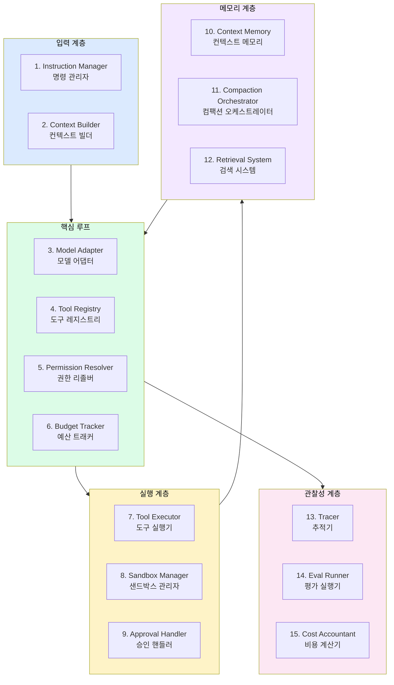
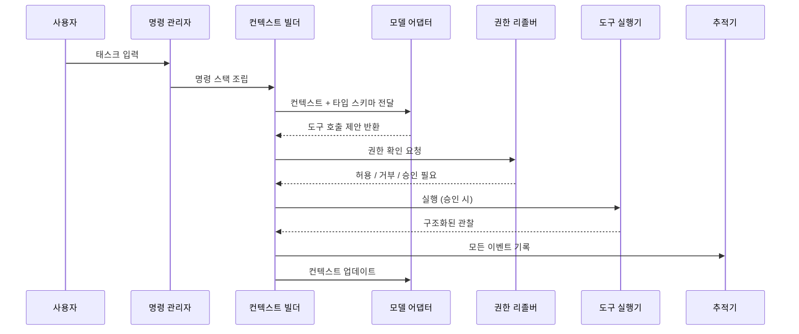
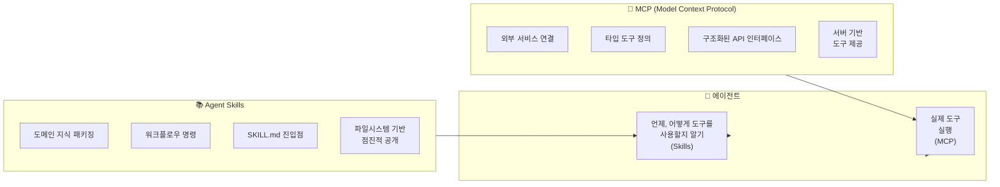
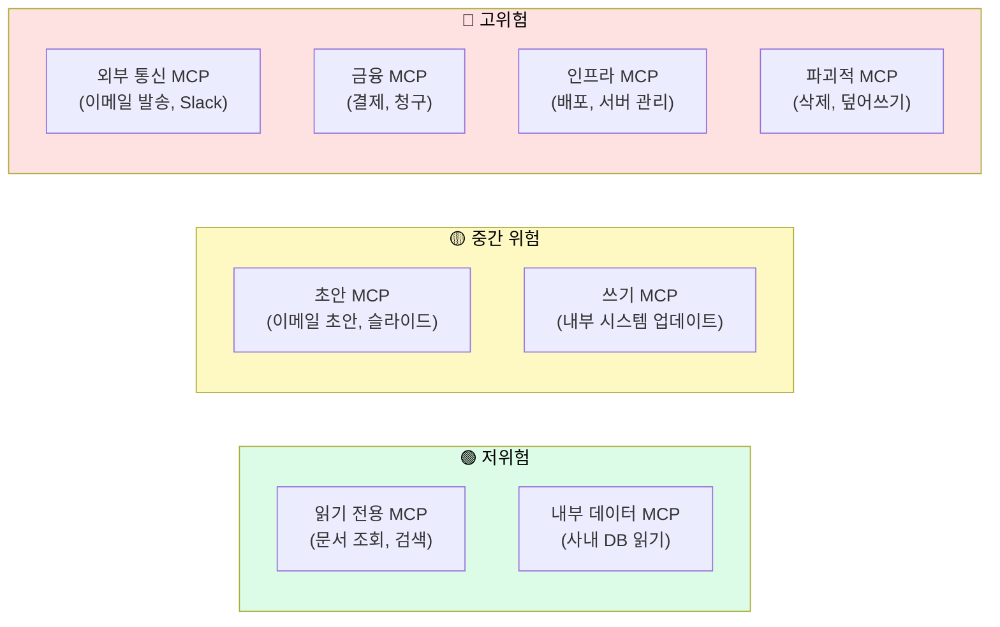
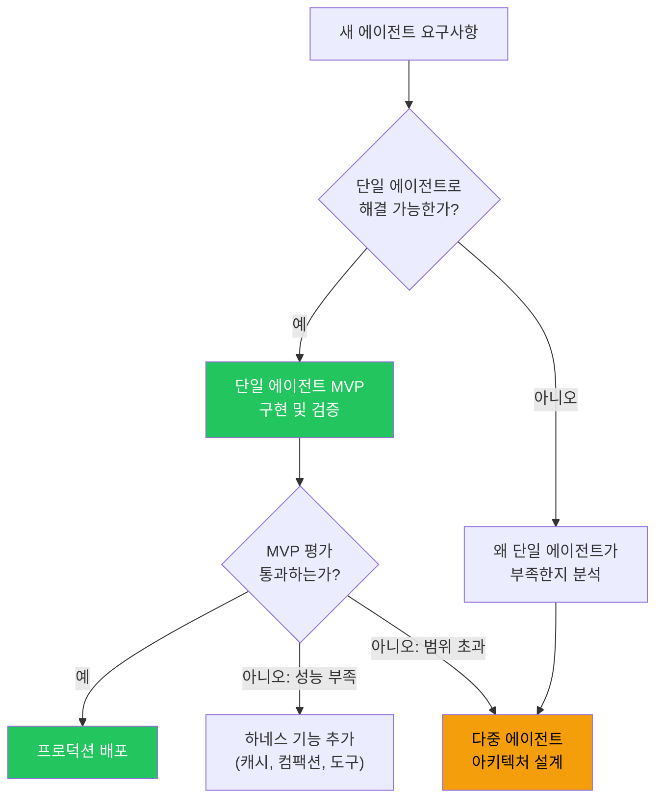
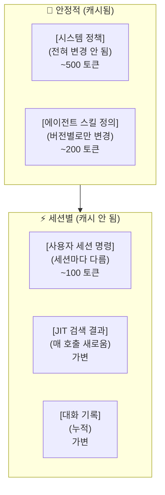
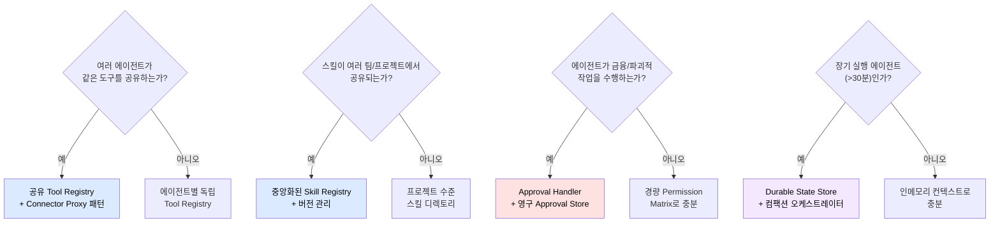

### `architecture.md` · `skills-and-connectors.md` · MCP 통합 전략 완전 해설

> **대상**: 에이전트 플랫폼 인프라를 설계하거나, 여러 에이전트가 공유하는 기반을 구축하는 플랫폼 아키텍트  
> **핵심 참조**: `references/architecture.md`, `references/skills-and-connectors.md`  
> **출처**: [DenisSergeevitch/agents-best-practices](https://github.com/DenisSergeevitch/agents-best-practices)  
> **작성일**: 2026-06-01

## 관련글

- [**AI 에이전트 모범 사례: 프로덕션 수준의 하네스 엔지니어링 완전 해설 (2026)**]()
- [**ML 엔지니어를 위한 에이전트 하네스 설계 가이드**]()
- [**플랫폼 아키텍트를 위한 에이전트 하네스 아키텍처 가이드**]()
- [**팀 리더를 위한 에이전트 프로젝트 관리 가이드**]()
- [**보안/컴플라이언스 전문가를 위한 에이전트 하네스 보안 가이드**]()
- [**AI 에이전트 하네스 엔지니어링 종합 실전 가이드**]()
- [**Spring 개발자를 위한 AI 에이전트 개발 완전 가이드**]()


---

## 목차

1. [플랫폼 아키텍트의 역할](#1-플랫폼-아키텍트의-역할)
2. [15개 컴포넌트 모델 (`architecture.md`)](#2-15개-컴포넌트-모델-architecturemd)
   - 2.1 컴포넌트 전체 지도
   - 2.2 각 컴포넌트 상세 해설
   - 2.3 이벤트 흐름과 권한 계층
3. [Agent Skills와 MCP 통합 (`skills-and-connectors.md`)](#3-agent-skills와-mcp-통합-skills-and-connectorsmd)
   - 3.1 Agent Skills vs MCP: 개념 구분
   - 3.2 점진적 공개 패턴
   - 3.3 MCP 서버 거버넌스
   - 3.4 커넥터 공급망 관리
4. [플랫폼 수준 아키텍처 패턴](#4-플랫폼-수준-아키텍처-패턴)
5. [다중 에이전트 환경에서의 고려사항](#5-다중-에이전트-환경에서의-고려사항)
6. [컨텍스트 엔지니어링과 캐시 전략](#6-컨텍스트-엔지니어링과-캐시-전략)
7. [플랫폼 설계 결정 가이드](#7-플랫폼-설계-결정-가이드)

---

## 1. 플랫폼 아키텍트의 역할

플랫폼 아키텍트는 개별 에이전트를 구현하는 것이 아니라, **에이전트들이 동작하는 기반 환경을 설계**한다. 이 관점에서 agents-best-practices 리포지터리의 `architecture.md`와 `skills-and-connectors.md`는 핵심 참조 자료가 된다.

플랫폼 아키텍트가 설계해야 할 핵심 질문들이 있다. 에이전트가 도구를 어떻게 발견하고, 권한을 어떻게 조회하며, 비용을 어떻게 추적하는가? 여러 에이전트가 동일한 MCP 서버를 공유할 때 어떤 거버넌스가 필요한가? Agent Skills는 어떻게 배포되고 업데이트되는가? 이 문서가 이 질문들에 대한 답을 제공한다.

---

## 2. 15개 컴포넌트 모델 (`architecture.md`)

### 2.1 컴포넌트 전체 지도

agents-best-practices의 `architecture.md`는 에이전트 하네스를 15개 명확한 컴포넌트로 분해한다. 각 컴포넌트는 명확한 책임 경계를 갖는다.



### 2.2 각 컴포넌트 상세 해설

#### 컴포넌트 1: Instruction Manager (명령 관리자)

명령 계층을 관리하는 컴포넌트다. 시스템 수준 정책, 에이전트 스킬 정의, 사용자 세션 명령, 런타임 힌트를 올바른 순서로 조립한다.

**핵심 책임:**
- 시스템 정책을 항상 가장 앞에 배치한다 (캐시 가능성 보장)
- 스킬 명령을 점진적으로 공개한다 (이름과 설명만 먼저, 전체는 활성화 시)
- 사용자 명령의 신뢰 수준을 레이블링한다
- 프롬프트 인젝션 가능성이 있는 명령을 신뢰되지 않음으로 표시한다

```python
class InstructionManager:
    def build_instruction_stack(self, session_context: SessionContext) -> InstructionStack:
        stack = InstructionStack()

        # Layer 0: 시스템 정책 (항상 첫 번째, 캐시됨)
        stack.add_layer(LayerType.SYSTEM, self.system_policies.get_stable())

        # Layer 1: 에이전트 스킬 정의 (이름+설명만, 전체 아님)
        stack.add_layer(LayerType.SKILLS, self.skill_registry.get_summaries())

        # Layer 2: 세션별 명령 (캐시 안 됨)
        stack.add_layer(LayerType.SESSION, session_context.instructions,
                       trust_level=TrustLevel.TRUSTED)

        # Layer 3: 사용자 입력 (신뢰되지 않음으로 표시!)
        stack.add_layer(LayerType.USER_INPUT, session_context.user_message,
                       trust_level=TrustLevel.UNTRUSTED)  # 인젝션 가능 소스

        return stack
```

#### 컴포넌트 2: Context Builder (컨텍스트 빌더)

모델 호출에 필요한 컨텍스트를 조립한다. 전체 대화 기록을 덤프하는 것이 아니라, 현재 태스크에 필요한 것만 선별적으로 포함한다.

**핵심 책임:**
- 캐시 인식 정렬(cache-aware ordering) 적용: 안정적인 것 먼저
- 신뢰 경계 레이블링
- 불필요한 컨텍스트 제거
- 컴팩션 후 활성 상태 재수화(rehydration)

#### 컴포넌트 3: Model Adapter (모델 어댑터)

모델 제공자(OpenAI, Anthropic, 오픈소스)와의 인터페이스를 표준화한다. 플랫폼 아키텍트 관점에서 가장 중요한 컴포넌트 중 하나다.

**핵심 책임:**
- 제공자별 API 형식 변환
- 재시도 로직 (레이트 리밋, 임시 장애)
- 응답 정규화 (finish_reason, tool_calls 표준화)
- 비용 추적을 위한 토큰 계수

```python
class ModelAdapter:
    """제공자 중립적 모델 인터페이스"""

    def generate(self, context: Context, tools: list[ToolSchema]) -> ModelResponse:
        # 제공자별 형식으로 변환
        if self.provider == "anthropic":
            raw_response = self._call_anthropic(context, tools)
        elif self.provider == "openai":
            raw_response = self._call_openai(context, tools)
        else:
            raw_response = self._call_compatible(context, tools)  # OpenAI 호환 API

        # 응답 정규화
        return self._normalize_response(raw_response)

    def _normalize_response(self, raw) -> ModelResponse:
        """모든 제공자의 응답을 표준 형식으로 변환"""
        return ModelResponse(
            text=self._extract_text(raw),
            tool_calls=self._extract_tool_calls(raw),
            finish_reason=self._map_finish_reason(raw),
            input_tokens=self._count_input_tokens(raw),
            output_tokens=self._count_output_tokens(raw),
            cost_usd=self._calculate_cost(raw)
        )
```

#### 컴포넌트 4: Tool Registry (도구 레지스트리)

사용 가능한 모든 도구의 중앙 저장소다. 단순한 목록이 아니라, 각 도구의 타입 스키마, 위험 클래스, 버전, 검증 로직을 포함하는 완전한 레지스트리다.

```python
class ToolRegistry:
    def __init__(self):
        self._tools: dict[str, ToolDefinition] = {}

    def register(self, tool: ToolDefinition):
        """도구를 등록한다. 스키마 유효성을 검사한다."""
        validate_tool_definition(tool)  # 스키마 검증
        self._tools[tool.name] = tool

    def get_typed_schemas(self, risk_filter: list[RiskClass] | None = None) -> list[dict]:
        """모델에 전달할 타입 스키마 목록을 반환한다. 광범위한 도구는 포함하지 않는다."""
        tools = self._tools.values()
        if risk_filter:
            tools = [t for t in tools if t.risk_class in risk_filter]
        return [t.to_typed_schema() for t in tools]

    def get(self, name: str) -> ToolDefinition | None:
        return self._tools.get(name)
```

#### 컴포넌트 5: Permission Resolver (권한 리졸버)

런타임 권한 결정을 수행하는 컴포넌트다. 중요한 것은 이 로직이 **코드 계층**에 있다는 것이다. 프롬프트 텍스트로 권한을 제어하면 안 된다.

#### 컴포넌트 6: Budget Tracker (예산 트래커)

스텝, 시간, 토큰, 비용 예산을 실시간으로 추적하고 강제 적용한다.

#### 컴포넌트 7: Tool Executor (도구 실행기)

스키마 검증과 권한 확인이 완료된 후 실제 도구를 실행한다. 타임아웃, 재시도, 에러 처리를 담당한다.

#### 컴포넌트 8: Sandbox Manager (샌드박스 관리자)

코드 실행이나 파일 시스템 접근 같은 잠재적으로 위험한 작업을 격리된 환경에서 실행한다.

#### 컴포넌트 9: Approval Handler (승인 핸들러)

인간 검토가 필요한 액션에 대한 승인 흐름을 관리한다. **핵심은 승인 기록이 프롬프트 외부에 저장된다는 것이다.**

```python
class ApprovalHandler:
    def __init__(self, approval_store: ApprovalStore):
        self.store = approval_store  # 프롬프트 외부 영구 저장소

    def request_approval(self, action: ActionDraft) -> ApprovalRequest:
        """승인 요청을 생성하고 외부 저장소에 기록한다."""
        request = ApprovalRequest(
            action=action,
            status="pending",
            expires_at=datetime.now() + timedelta(hours=24)
        )
        self.store.save(request)  # 프롬프트 외부에 저장!
        return request

    def check_approval(self, action_id: str) -> ApprovalStatus:
        """승인 상태를 컨텍스트 외부에서 조회한다."""
        return self.store.get_status(action_id)  # 컨텍스트에 의존하지 않음

    def is_model_approving_own_action(self, approver: str) -> bool:
        """모델이 자신의 액션을 승인하려는지 감지한다."""
        return approver == "model"  # 절대 허용하지 않는다
```

#### 컴포넌트 10-12: 메모리 계층

메모리 계층은 세 가지 컴포넌트로 구성된다.

**Context Memory (컨텍스트 메모리)**: 현재 세션의 대화 기록, 활성 계획, 승인 기록을 관리한다.

**Compaction Orchestrator (컴팩션 오케스트레이터)**: 컨텍스트가 너무 길어질 때 요약을 생성하되, 반드시 활성 상태(승인, 현재 계획, 에러 기록)를 보존한다.

**Retrieval System (검색 시스템)**: 관련 지식, 이전 실행 결과, 문서를 JIT(Just-In-Time)으로 검색한다.

#### 컴포넌트 13-15: 관찰성 계층

**Tracer (추적기)**: 모든 운영 이벤트(도구 호출, 권한 결정, 컴팩션, 예산 소비)를 구조화된 형식으로 기록한다.

**Eval Runner (평가 실행기)**: 하네스 자체를 테스트하는 평가를 실행한다. 인젝션 저항성, 타임아웃 복원력, 예산 강제 적용 등을 검증한다.

**Cost Accountant (비용 계산기)**: 토큰, API 비용, 도구 실행 비용을 세션별, 에이전트별, 프로젝트별로 집계한다.

### 2.3 이벤트 흐름과 권한 계층



---

## 3. Agent Skills와 MCP 통합 (`skills-and-connectors.md`)

### 3.1 Agent Skills vs MCP: 개념 구분

플랫폼 아키텍트가 자주 혼동하는 개념이 Agent Skills와 MCP다. 두 개념은 보완적이지만 다른 역할을 한다.



**Agent Skills**: "에이전트가 무엇을 해야 하는지"를 가르친다. 파일시스템 기반으로, SKILL.md 파일에 도메인 지식과 워크플로우 명령이 담겨 있다. 점진적 공개로 컨텍스트를 효율적으로 사용한다. MCP 도구를 언제, 어떻게 사용해야 하는지 가르치는 것이 주 역할이다.

**MCP(Model Context Protocol)**: "에이전트가 무엇을 할 수 있는지"를 확장한다. 서버 기반으로, 외부 서비스(Slack, GitHub, 데이터베이스 등)에 대한 타입 도구를 제공한다. 구조화된 입/출력 스키마로 정확한 도구 실행을 보장한다.

### 3.2 점진적 공개 패턴

점진적 공개(Progressive Disclosure)는 Agent Skills 표준의 핵심 설계 패턴이다. 에이전트 하네스가 실제로 어떻게 스킬을 로드하는지 이해하는 것이 중요하다.

```
시작 시 (토큰 최소화):
  skill-1: "계약서 검토 전문가. 계약서 리스크 분석 시 사용."  (~50 토큰)
  skill-2: "이메일 초안 작성. 고객 커뮤니케이션 초안화 시 사용."  (~40 토큰)
  skill-3: "법률 판례 검색. 유사 판례 조회 시 사용."  (~45 토큰)

  합계: ~135 토큰 (100개 스킬이어도 ~5,000 토큰)

태스크 감지 시 (전체 로드):
  "계약서 Q4-2024-0123을 검토해주세요" 
  → agents-best-practices 스킬 활성화
  → 전체 SKILL.md 로드 (~1,400 토큰)
  → 나머지 99개 스킬은 메타데이터만 유지
```

```python
class SkillRegistry:
    def __init__(self, skills_dir: str):
        self._skills: dict[str, Skill] = {}
        self._load_metadata(skills_dir)  # 시작 시 메타데이터만

    def _load_metadata(self, skills_dir: str):
        """시작 시 이름과 설명만 로드한다. 전체 내용은 로드하지 않는다."""
        for skill_dir in Path(skills_dir).iterdir():
            skill_md = skill_dir / "SKILL.md"
            if skill_md.exists():
                metadata = parse_yaml_frontmatter(skill_md)
                self._skills[metadata.name] = Skill(
                    name=metadata.name,
                    description=metadata.description,  # 수십 토큰
                    path=skill_dir,
                    full_content=None  # 아직 로드하지 않음
                )

    def get_summaries(self) -> list[dict]:
        """모델 컨텍스트에 추가할 요약만 반환한다."""
        return [{"name": s.name, "description": s.description}
                for s in self._skills.values()]

    def activate(self, skill_name: str) -> str:
        """요청 시 전체 스킬 내용을 로드한다."""
        skill = self._skills[skill_name]
        if skill.full_content is None:
            skill.full_content = (skill.path / "SKILL.md").read_text()
        return skill.full_content
```

실제 데이터를 보면 점진적 공개의 중요성이 명확해진다. 한 MCP 서버에 연결하면 20개 이상의 도구 정의가 로드되고, 최대 50,000+ 토큰의 JSON 스키마가 생성된다. 에이전트가 리팩토링 태스크를 처리하기 전에 이미 컨텍스트의 절반이 도구 정의로 채워진다. 점진적 공개로 이 문제를 해결한다.

### 3.3 MCP 서버 거버넌스

플랫폼 아키텍트는 여러 에이전트가 MCP 서버를 공유할 때의 거버넌스를 설계해야 한다.

#### MCP 서버 위험 분류



#### MCP 서버 감사 체크리스트

```
MCP 서버 등록 시 확인 사항:
[ ] 서버의 모든 도구를 검토했는가?
[ ] 각 도구의 위험 클래스가 지정되었는가?
[ ] 광범위한 도구(execute_anything 등)가 없는가?
[ ] 도구 스키마가 타입 지정되어 있는가?
[ ] 서버 인증이 올바르게 설정되었는가?
[ ] 서버가 DDoS/rate limit 보호가 있는가?
[ ] 악성 스킬 패키지 가능성을 검토했는가?
[ ] 공급망 보안(서드파티 MCP)을 확인했는가?
```

#### 커넥터 프록시 패턴

플랫폼 수준에서 MCP 서버를 직접 에이전트에 노출하지 않고, 프록시를 통해 관리하는 것이 권장된다.

```python
class ConnectorProxy:
    """MCP 서버에 대한 에이전트 접근을 중재한다."""

    def __init__(self, mcp_server: MCPServer, policy: ConnectorPolicy):
        self.server = mcp_server
        self.policy = policy
        self.audit_log = AuditLog()

    def call_tool(self, tool_name: str, args: dict, agent_id: str) -> ToolResult:
        # 1. 에이전트가 이 커넥터를 사용할 권한이 있는가?
        if not self.policy.agent_allowed(agent_id, tool_name):
            return ToolResult(status="denied", error=f"{agent_id} not authorized for {tool_name}")

        # 2. 위험 클래스 확인
        risk = self.policy.get_risk_class(tool_name)
        if risk in ("external_write", "financial") and not self.has_approval(agent_id, tool_name):
            return ToolResult(status="approval_required", draft_id=self.create_draft(args))

        # 3. 실행 및 감사 로그
        result = self.server.call(tool_name, args)
        self.audit_log.record(agent_id, tool_name, args, result)
        return result
```

### 3.4 커넥터 공급망 관리

서드파티 MCP 서버와 스킬 패키지는 잠재적인 공급망 보안 위험을 가진다. 악의적인 스킬 패키지가 에이전트를 조작할 수 있다.

```python
class SkillPackageValidator:
    """스킬 패키지의 안전성을 검증한다."""

    def validate(self, skill_package: SkillPackage) -> ValidationResult:
        checks = []

        # 1. 스킬이 외부 URL을 참조하는가? (데이터 유출 가능성)
        checks.append(self._check_external_urls(skill_package))

        # 2. 스킬이 비정상적으로 많은 권한을 요구하는가?
        checks.append(self._check_permission_scope(skill_package))

        # 3. 스킬이 신뢰할 수 없는 소스를 신뢰하도록 지시하는가?
        checks.append(self._check_trust_escalation(skill_package))

        # 4. 스킬이 다른 스킬의 명령을 무효화하려는가?
        checks.append(self._check_instruction_overrides(skill_package))

        return ValidationResult(checks)
```

---

## 4. 플랫폼 수준 아키텍처 패턴

### 4.1 단일 에이전트 MVP 먼저

agents-best-practices의 핵심 원칙 중 하나는 **단일 에이전트 MVP를 먼저 검증하고, 측정된 실패가 정당화할 때만 복잡성을 추가한다**는 것이다.



### 4.2 플랫폼 컨트롤 플레인 설계

여러 에이전트를 운영하는 플랫폼은 다음과 같은 컨트롤 플레인 구성요소가 필요하다.

```python
class AgentPlatform:
    """에이전트 플랫폼 컨트롤 플레인"""

    def __init__(self):
        # 공유 인프라
        self.tool_registry = SharedToolRegistry()     # 모든 에이전트가 공유
        self.skill_registry = SharedSkillRegistry()   # 스킬 중앙 관리
        self.permission_service = PermissionService() # 권한 중앙 관리
        self.approval_store = PersistentApprovalStore() # 승인 영구 저장
        self.cost_tracker = PlatformCostTracker()     # 비용 중앙 추적
        self.audit_log = PlatformAuditLog()           # 감사 로그

    def create_agent_session(self, agent_type: str, session_config: SessionConfig) -> AgentSession:
        """새 에이전트 세션을 시작한다. 각 세션은 격리된 권한 컨텍스트를 갖는다."""
        return AgentSession(
            tool_registry=self.tool_registry.scoped(agent_type),  # 범위 제한
            skills=self.skill_registry.for_agent_type(agent_type),
            permissions=self.permission_service.build_matrix(agent_type, session_config),
            budget=self._get_budget(agent_type, session_config),
            cost_tracker=self.cost_tracker.session_tracker(),
            audit_log=self.audit_log.session_log()
        )
```

---

## 5. 다중 에이전트 환경에서의 고려사항

agents-best-practices는 명확히 경고한다: **단일 에이전트 루프가 측정된 평가에서 실패하기 전까지는 다중 에이전트 시스템을 설계하지 말라.**

그러나 다중 에이전트가 필요한 경우, 플랫폼 아키텍트가 반드시 고려해야 할 패턴이 있다.

### 서브에이전트 격리

각 서브에이전트는 **재구성된 권한 컨텍스트**를 가져야 한다. 부모 에이전트의 모든 권한을 상속받아서는 안 된다.

```python
class SubagentLauncher:
    def spawn_subagent(self, parent_session: AgentSession,
                       subagent_task: str,
                       allowed_tools: list[str]) -> SubagentSession:
        """서브에이전트를 격리된 권한으로 생성한다."""

        # 부모의 권한을 전부 상속하지 않는다!
        # 명시적으로 허용된 도구만 포함
        scoped_permissions = PermissionMatrix(
            allowed_tools=allowed_tools,  # 명시적 허용 목록
            session_type="subagent",
            parent_id=parent_session.id  # 추적 가능성
        )

        # 서브에이전트는 별도 예산을 가진다
        subagent_budget = Budgets(
            step=10,  # 부모보다 작은 스텝 예산
            time=30,
            cost=parent_session.budget.remaining_cost * 0.5  # 남은 예산의 절반만
        )

        return SubagentSession(
            task=subagent_task,
            permissions=scoped_permissions,
            budget=subagent_budget,
            parent_session=parent_session
        )
```

### 에이전트 간 핸드오프

에이전트 간 작업을 전달할 때는 반드시 타입이 지정된 스키마를 사용해야 한다. 자유 형태의 텍스트 핸드오프는 정보 손실과 오해의 원인이 된다.

```python
class AgentHandoff:
    """에이전트 간 표준화된 작업 전달 형식"""
    task_id: str
    source_agent: str
    target_agent: str
    task_description: str
    context_summary: str           # 현재까지의 진행 상황 요약
    artifacts: list[ArtifactRef]   # 이전 에이전트가 생성한 결과물
    active_approvals: list[str]    # 이미 받은 승인 목록
    constraints: dict              # 전달할 제약 조건
    budget_remaining: BudgetState  # 남은 예산

    def validate(self):
        """핸드오프 전에 필수 필드를 검증한다."""
        if not self.context_summary:
            raise ValueError("Context summary is required for handoff")
        if not self.task_description:
            raise ValueError("Task description is required for handoff")
```

---

## 6. 컨텍스트 엔지니어링과 캐시 전략

플랫폼 아키텍트 관점에서 **프롬프트 캐싱은 단순한 비용 절감이 아니라 아키텍처 결정**이다. 캐시 가능한 프리픽스를 설계하는 것은 플랫폼 수준에서 결정해야 하는 사항이다.

### 캐시 인식 프롬프트 순서 설계



**절대 하면 안 되는 것**: 타임스탬프, 요청 ID, 세션 ID와 같이 자주 변하는 데이터를 프롬프트 앞부분에 배치하는 것이다.

```python
# ❌ 캐시 히트율 = 0%: 매 요청마다 달라지는 값이 앞에 있다
bad_prompt = f"""
Request ID: {request_id}     # 매번 다름
Timestamp: {datetime.now()}   # 매번 다름
Session: {session_id}         # 세션마다 다름

You are a helpful assistant...  (나머지 내용)
"""

# ✅ 캐시 히트율 최대화: 안정적인 내용이 앞에 온다
good_prompt = f"""
You are a helpful assistant specialized in contract review.
[시스템 정책 - 변경 없음]
[스킬 정의 - 버전 변경 시만 달라짐]

--- Session Context (not cached) ---
Session: {session_id}
User message: {user_message}
"""
```

---

## 7. 플랫폼 설계 결정 가이드

플랫폼 아키텍트가 직면하는 주요 설계 결정과 agents-best-practices의 권고 사항을 정리한다.

### 의사결정 프레임워크



### 플랫폼 수준 안티패턴

실제 플랫폼 구축 시 자주 발생하는 잘못된 패턴들이다.

**안티패턴 1**: 모든 MCP 서버 도구를 에이전트에 직접 노출한다. 권장: ConnectorProxy를 통해 범위를 제한하고 감사 로그를 남긴다.

**안티패턴 2**: 단일 에이전트로 해결 가능한 문제를 다중 에이전트 아키텍처로 과도 설계한다. 권장: 단일 에이전트 MVP를 먼저 검증하고, 측정된 실패가 있을 때만 확장한다.

**안티패턴 3**: 승인 상태를 에이전트 컨텍스트에만 저장한다. 권장: 영구 저장소(데이터베이스)에 백업하고, 컴팩션 후에도 복구 가능하게 한다.

**안티패턴 4**: 플랫폼 비용 추적 없이 에이전트를 배포한다. 권장: 세션별, 에이전트 유형별 비용을 실시간으로 집계한다.

**안티패턴 5**: 서드파티 스킬 패키지를 검증 없이 설치한다. 권장: 스킬 패키지 검증 파이프라인을 구축하고, 신뢰할 수 있는 소스만 허용한다.

---

*작성일: 2026-06-01*  
*참조: [DenisSergeevitch/agents-best-practices](https://github.com/DenisSergeevitch/agents-best-practices) | [agentskills.io](https://agentskills.io/specification)*
