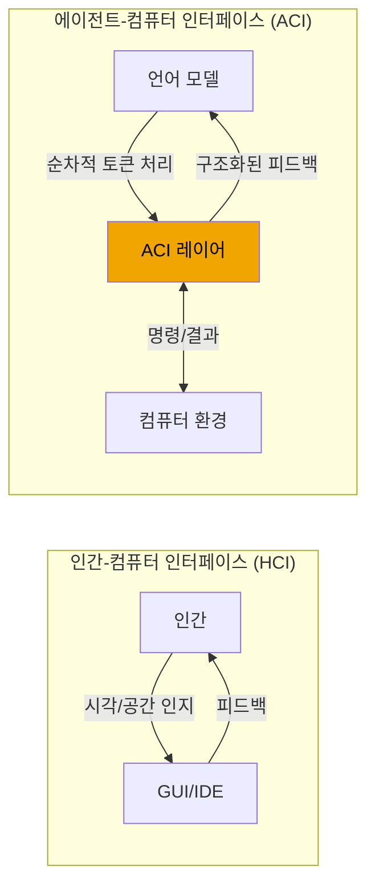
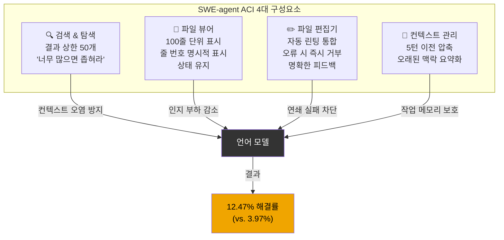
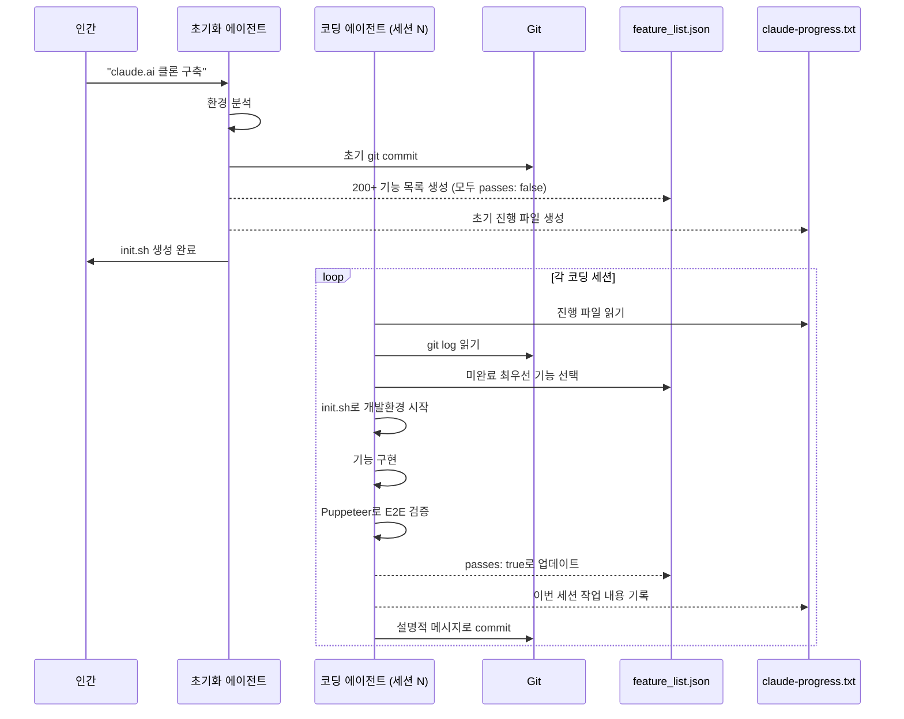
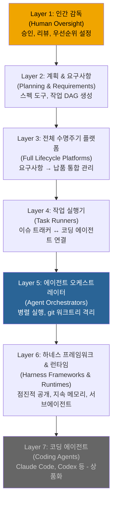
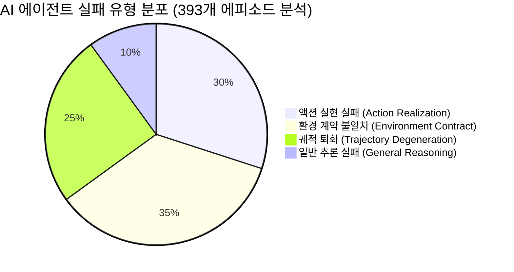
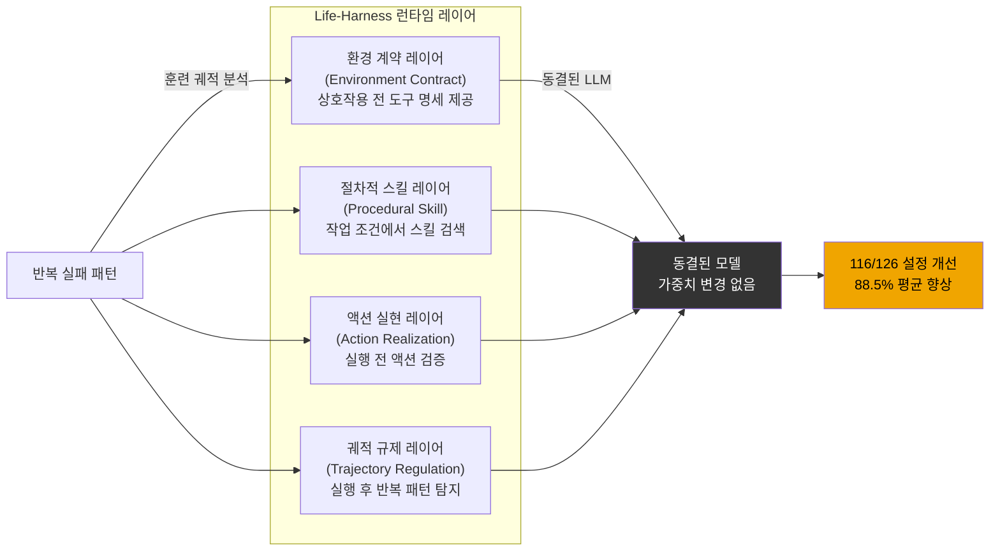
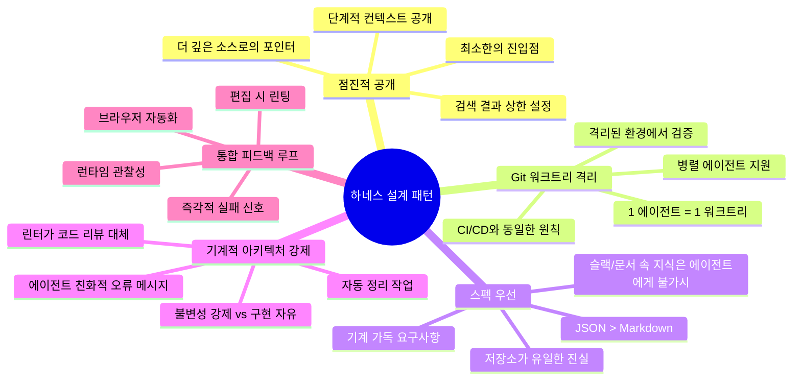

> **"The model is what thinks. The harness is what thinks about."**  
> — Rohit (@rohit4verse), ["Last week's Life-Harness paper: 116 of 126 model-environment setups improved by patching the harness alone."](https://x.com/rohit4verse/status/2061168127166280140) (2026.05)

## 관련글

[**하네스가 전부다: AI 에이전트 시대의 진짜 경쟁력**](https://k82022603.github.io/posts/%ED%95%98%EB%84%A4%EC%8A%A4%EA%B0%80-%EC%A0%84%EB%B6%80%EB%8B%A4-ai-%EC%97%90%EC%9D%B4%EC%A0%84%ED%8A%B8-%EC%8B%9C%EB%8C%80%EC%9D%98-%EC%A7%84%EC%A7%9C-%EA%B2%BD%EC%9F%81%EB%A0%A5/)

---

## 목차

1. [왜 이 주제가 중요한가](#1-왜-이-주제가-중요한가)
2. [핵심 주장: 모델이 병목이 아니다](#2-핵심-주장-모델이-병목이-아니다)
3. [SWE-agent 논문과 ACI의 탄생 (2024)](#3-swe-agent-논문과-aci의-탄생-2024)
4. [Anthropic의 하네스 엔지니어링: 장기 실행 에이전트 문제](#4-anthropic의-하네스-엔지니어링-장기-실행-에이전트-문제)
5. [OpenAI의 하네스 엔지니어링: 수동 코드 제로 실험](#5-openai의-하네스-엔지니어링-수동-코드-제로-실험)
6. [Awesome Agent Harness 분류 체계](#6-awesome-agent-harness-분류-체계)
7. [Life-Harness 논문: 2026년 5월의 최신 증거](#7-life-harness-논문-2026년-5월의-최신-증거)
8. [모든 시스템에서 반복되는 설계 패턴 5가지](#8-모든-시스템에서-반복되는-설계-패턴-5가지)
9. [엔지니어에게 주는 함의](#9-엔지니어에게-주는-함의)
10. [결론: 하네스가 레버리지의 핵심이다](#10-결론-하네스가-레버리지의-핵심이다)

---


## 1. 왜 이 주제가 중요한가

2026년 3월, X(구 트위터)에서 한 편의 글이 폭발적인 반응을 일으켰다. Rohit(@rohit4verse)이 작성한 "The Harness Is Everything"이라는 글은 130만 뷰를 기록하며 AI 엔지니어링 커뮤니티에서 광범위하게 공유되었다. 그리고 두 달 후인 2026년 5월, 이 글의 핵심 주장을 학술적으로 뒷받침하는 논문이 arxiv에 발표되었다. 중국 베이징대학교 연구팀이 발표한 "Life-Harness" 논문이다.

이 두 가지 사건이 공유하는 핵심 메시지는 하나다. **AI 에이전트의 성능을 결정하는 것은 모델의 능력이 아니라, 모델을 감싸고 있는 환경 설계, 즉 '하네스(harness)'다.**

이는 단순한 주장이 아니다. 동일한 모델, 동일한 작업, 동일한 컴퓨팅 예산에서 인터페이스 설계만 바꾼 것으로 벤치마크 성능이 64% 향상되었다는 실험 결과가 2024년에 이미 발표되었고, 2026년에는 18개 모델, 126개 설정에서 116개가 하네스 수정만으로 개선되었다는 새로운 실험 결과가 나왔다.

본 문서는 이 주제를 가능한 한 상세하고 정확하게 서술한다. Rohit의 원문 글, Princeton NLP 그룹의 SWE-agent 논문(2024), Anthropic과 OpenAI의 내부 엔지니어링 사례, 그리고 Life-Harness 논문(2026)을 종합하여 '하네스 엔지니어링'이라는 신흥 분야를 이해하기 쉽게 설명한다.

---

## 2. 핵심 주장: 모델이 병목이 아니다

### 2.1 모두가 틀린 방향으로 최적화하고 있다

AI 에이전트 성능이 기대에 못 미칠 때 사람들이 가장 먼저 하는 것들이 있다. 더 큰 모델로 바꾼다. 프롬프트를 더 정교하게 다듬는다. 컨텍스트를 더 길게 넣는다. 또 다른 프레임워크를 도입한다. 이 네 가지 접근은 모두 **입력 측(input-side) 조작**이다. 그리고 Rohit은 이것들이 모두 추측에 불과하다고 단언한다.

```
WHAT EVERYONE TUNES (모두가 튜닝하는 것들)
─────────────────────────────────────────
bigger model     → $$$$, 여전히 엉망
better prompts   → 미미한 개선
longer context   → 노이즈만 늘어남
another framework → 복잡성만 가중

all input-side. all guesses. (전부 입력 측. 전부 추측.)
```

반면 실제로 작동하는 팀들이 하는 것은 다르다. 그들은 에이전트가 실패했을 때 "어떻게 더 좋은 프롬프트를 쓸까?"를 묻지 않는다. 대신 "에이전트가 이 작업에서 실패하게 만드는 **환경의 구조적 결함**이 무엇인가?"를 묻는다.

### 2.2 하네스란 정확히 무엇인가

하네스(harness)는 시스템 프롬프트가 아니다. API 래퍼도 아니다. 프롬프트 템플릿이나 평가 프레임워크도 아니다. 하네스는 **언어 모델이 작동하는 완전히 설계된 환경** 전체를 의미한다. 구체적으로 다음 요소들을 포함한다.

- 에이전트가 호출할 수 있는 도구(tools)와 그 포맷
- 에이전트가 받는 정보의 형식과 구조
- 히스토리가 압축되고 관리되는 방식
- 실수를 연쇄 실패로 이어지기 전에 잡아내는 가드레일
- 세션 경계를 넘어 작업을 이어갈 수 있게 하는 비계(scaffolding)

Rohit의 표현을 빌리면: **"모델은 생각하는 것이다. 하네스는 모델이 무엇을 생각할지를 결정하는 것이다."**

### 2.3 수치가 말하는 것

다음 두 가지 실험 결과가 이 주장의 핵심 증거다.

```
실험 1 (SWE-agent, Princeton NLP, NeurIPS 2024)
────────────────────────────────────────────────
동일 모델 (GPT-4)
동일 작업 (SWE-bench 버그 수정)
동일 컴퓨팅

원시 bash 인터페이스: 3.97% 해결
설계된 ACI:          12.47% 해결

→ 64% 상대적 성능 향상, 인터페이스 설계만으로

실험 2 (Life-Harness, Peking University, 2026.05)
────────────────────────────────────────────────
18개 모델 백본 테스트
7개 결정론적 벤치마크
126개 모델-환경 설정

하네스 패치 후: 116개 설정에서 성능 향상 (92.1%)
평균 상대적 향상: 88.5%
모델 가중치 변경: 없음
벤치마크 환경 변경: 없음
```

---

## 3. SWE-agent 논문과 ACI의 탄생 (2024)

### 3.1 배경: 컨텍스트 창은 RAM 슬롯이 아니다

많은 사람들이 AI 에이전트의 컨텍스트 창을 컴퓨터의 RAM처럼 생각한다. 데이터를 집어넣으면 모델이 처리하고 출력을 생성한다는 단순한 모델이다. 이 사고방식은 에이전트 시스템을 망가뜨리는 방식으로 잘못되어 있다.

컨텍스트 창은 실제로 에이전트가 특정 세션 동안 갖는 **전체 작업 의식(working consciousness)** 에 가깝다. 창 안의 모든 토큰은 계산 비용을 소모한다. 관련 없는 모든 정보는 관련 있는 정보와 어텐션(attention)을 두고 경쟁한다. 모델은 노이즈를 깔끔하게 무시하는 선택적 어텐션 메커니즘을 갖고 있지 않다. 노이즈는 방 안에 존재하며, 추론의 질에 영향을 미친다.

예를 들어 에이전트가 대규모 코드베이스에서 grep을 실행해 1만 개의 결과를 반환받으면, 더 많은 정보를 얻은 것이 아니다. **작업 메모리가 관련 없는 데이터로 침수되어**, 이후 모든 단계의 품질이 저하된다.

Princeton NLP 그룹은 2024년 SWE-agent 논문에서 이 문제를 철저히 기록했다. 표준 bash 인터페이스를 사용한 에이전트는 '뒤흔들림(thrashing)' 현상을 보였다. 수천 개의 결과를 반환하는 grep 명령을 내리고, 무엇을 찾고 있었는지 잃어버리고, 더 많은 grep 명령을 내리고, 점차 컨텍스트를 노이즈로 채우다가, 결국 틀린 답을 내놓거나 진행을 완전히 멈추는 패턴이었다. 문제는 모델의 지능이 아니었다. **환경이 에이전트 스스로로부터 스스로를 보호하는 메커니즘을 갖추지 못했던 것**이다.

### 3.2 ACI란 무엇인가

ACI(Agent-Computer Interface, 에이전트-컴퓨터 인터페이스)는 SWE-agent 논문에서 언어 모델 에이전트와 컴퓨터 환경 사이에 위치하는 추상화 레이어로 정의된다. HCI(Human-Computer Interface, 인간-컴퓨터 인터페이스)와의 유비는 의도적이다. HCI 연구가 인간의 인지 구조에 맞는 인터페이스 설계를 탐구하듯, ACI 연구는 언어 모델의 인지 구조에 맞는 인터페이스 설계를 탐구한다.

인간의 인지 구조는 시각적 패턴 인식, 공간 기억, 화면 전체에 걸친 병렬 어텐션, 훑어보고 선택적으로 집중하는 능력을 포함한다. 언어 모델의 인지 구조는 근본적으로 다르다. 순차적 토큰 처리, 컨텍스트 순서와 포맷에 대한 민감성, 제한된 작업 메모리, 프롬프트에서 가장 두드러지게 나타나는 정보에 앵커링하는 경향이 그 특징이다. 좋은 ACI를 설계한다는 것은 이러한 제약을 이해하고 그에 맞게, 그에 거슬러가지 않고 설계하는 것을 의미한다.



### 3.3 SWE-agent ACI의 4가지 핵심 구성 요소

SWE-agent의 ACI는 언어 모델이 원시 컴퓨터 접근 권한을 가질 때 어떻게 실패하는지에 대한 특정 통찰을 각각 반영하는 네 가지 주요 구성 요소를 가졌다.

#### 구성 요소 1: 검색 및 탐색 (Search & Navigation)

검색 구성 요소는 표준 grep 및 find 명령을 목적에 맞게 제작된 도구(`find_file`, `search_file`, `search_dir`)로 대체했다. 핵심 차이는 문법이 아니었다. **출력 관리**였다. 결과는 50개로 상한이 설정되었다. 쿼리가 이 한도를 초과하면 도구는 결과가 너무 많으니 검색을 좁히라는 메시지를 반환했다.

이것이 사소해 보일 수 있지만, 실제로는 논문에서 가장 중요한 결정 중 하나였다. 인지 부하 상태의 인간처럼, 에이전트도 불확실할 때 더 광범위하게 검색하는 경향이 있다. 상한 설정된 검색 도구는 이 패턴을 강제 함수(forcing function)를 만들어 중단시켰다. 모호하게 접근하면 진행할 수 없다. 구체적이어야 한다. 이는 에이전트를 더 신중하고 목표 지향적인 행동으로 이끌었다.

#### 구성 요소 2: 파일 뷰어 (File Viewer)

파일 뷰어는 논문의 인지 구조에 대한 통찰이 가장 구체적으로 드러나는 부분이다. 연구자들은 여러 뷰어 구성을 테스트하여 한 번에 100줄을 표시하는 것이 '골디락스 숫자'임을 발견했다. 더 적은 줄(30줄 테스트)은 에이전트가 주변 코드에 대한 컨텍스트를 잃고 편집 실수를 저질렀다. 더 많은 줄(또는 전체 파일)은 에이전트가 자신이 어디에 있는지 잃어버려 중요한 세부 사항을 놓쳤다.

뷰어는 상태를 유지했다. 상호작용 전반에 걸쳐 파일 내 위치를 유지했다. 그리고 결정적으로 **모든 보이는 줄에 명시적인 줄 번호를 앞에 붙였다**. 이 마지막 세부 사항은 외형적으로 보일 수 있지만 그렇지 않았다. 에이전트가 47번째부터 52번째 줄을 대상으로 하는 편집 명령을 내려야 할 때, 보기에서 직접 그 번호를 읽을 수 있어야 하며, 세거나 산술을 수행할 필요가 없다. 에이전트의 작업 메모리에서 그 인지적 작업을 제거함으로써 실제 문제 해결에 더 많은 용량을 확보할 수 있었다.

#### 구성 요소 3: 린팅이 통합된 파일 편집기 (File Editor with Linting)

파일 편집기의 핵심 혁신은 가드레일이 포함된 즉각적인 피드백이었다. 편집 명령은 시작 줄, 끝 줄, 교체 텍스트를 단일 작업으로 받아들였다. 모든 편집 후 도구는 수정된 파일에서 자동으로 린터를 실행하고 결과를 보고했다. **편집이 구문 오류를 도입하면 편집은 적용되기 전에 거부**되었고, 에이전트는 원본 코드와 실패한 편집 모두를 보여주는 명확한 오류 메시지를 받았다.

이는 순진한 에이전트 구현에서 연쇄 실패를 일으키는 피드백 루프를 닫았다. 린터 없이는 에이전트가 구문 오류를 도입하고, 테스트 스위트를 실행하고, 관련 없어 보이는 실패를 보고(실제 오류는 다른 곳에 있으므로), 여러 단계에 걸쳐 잘못된 문제를 쫓고, 결국 컨텍스트 창을 허상을 쫓으며 소진할 수 있다. 편집기에 직접 통합된 린터로 구문 오류는 도입 순간에 포착되고, 수정은 문제가 전파되기 전에 지역화된다.

#### 구성 요소 4: 컨텍스트 관리 (Context Management)

네 번째 구성 요소는 긴 세션에 걸쳐 복합되는 문제인 오래된 컨텍스트의 축적을 해결했다. 에이전트가 작업을 진행함에 따라 히스토리는 더 이상 환경의 현재 상태를 반영하지 않는 오래된 관찰, 중간 상태, 탐색적 단계들로 채워진다. 그 히스토리는 모두 컨텍스트 창의 공간을 차지하고, 오래된 정보를 제공함으로써 에이전트를 적극적으로 오도할 수 있다.

ACI의 컨텍스트 관리 시스템은 최근 다섯 번의 턴 이전의 오래된 관찰을 단일 줄 요약으로 압축했다. 이는 활성 컨텍스트를 최근의 관련 정보에 집중시키면서 전반적인 궤적의 압축된 기록을 유지했다.



### 3.4 벤치마크 결과와 그 의미

SWE-agent 논문은 인기 있는 파이썬 저장소의 실제 GitHub 이슈 모음인 SWE-bench 데이터셋에서 ACI를 벤치마크했다. 작업은 자연어 버그 리포트를 받아 이를 해결하는 코드 패치를 생성하는 것이다. 이는 익숙하지 않은 코드베이스를 탐색하고, 오류 메시지를 이해하고, 올바른 코드를 작성하고, 수정을 검증하는 것을 요구하는 어렵고 실질적인 작업이다.

GPT-4와 표준 bash 셸 인터페이스를 사용한 경우 시스템은 이슈의 **3.97%** 를 해결했다. GPT-4와 목적에 맞게 제작된 ACI를 사용한 경우 **12.47%** 를 해결했다. 이것이 앞서 언급한 64% 상대적 개선이며, 전적으로 인터페이스 설계에서 나온 것이다.

연구자들은 또한 각 설계 결정의 기여도를 분리하기 위해 한 번에 하나의 구성 요소를 제거하는 제거 연구(ablation studies)를 수행했다. 린터 통합이 일관되게 가장 높은 레버리지 구성 요소 중 하나였다. 상한 설정된 검색은 컨텍스트 침수를 방지하는 데 중요했다. 줄 번호가 있는 상태 유지 파일 뷰어는 원시 cat 명령과 더 단순한 뷰어 설계 모두보다 의미 있게 우수했다.

**성능 차이는 모델 지능에 관한 것이 아니었다. 인지 부하 관리에 관한 것이었다.** ACI는 모델이 상태를 추적하기 위해 해야 하는 작업을 줄였고, 실제로 중요한 작업을 위한 공간을 만들었다.

---

## 4. Anthropic의 하네스 엔지니어링: 장기 실행 에이전트 문제

### 4.1 단일 컨텍스트 창 경계: 진짜 어려운 문제

SWE-agent 논문은 단일 에이전트 세션을 위한 인터페이스 설계 방법을 다루었다. Anthropic의 엔지니어링 팀은 Claude Agent SDK와 Claude Code를 작업하면서 다른 문제를 만났다. **작업이 단일 컨텍스트 창에서 완료하기에는 너무 클 때 무슨 일이 일어나는가?**

이는 틈새 엣지 케이스가 아니다. 대부분의 실제 소프트웨어 프로젝트는 어떤 컨텍스트 창에도 들어맞기에 너무 크다. 프로덕션 웹 애플리케이션에는 수백 개의 파일, 수천 개의 함수, 테스트 스위트, 구성, 문서, 종속성이 있다. 200K 토큰 컨텍스트 창이 있어도 전체 프로젝트를 동시에 머릿속에 담을 수 없다.

순진한 해결책은 압축(compaction)이다. Claude Agent SDK는 창이 가득 찰 때 오래된 컨텍스트를 요약하는 압축 기능을 포함한다. 하지만 압축만으로는 충분하지 않다. Anthropic의 내부 실험에 따르면 압축이 있더라도, 여러 컨텍스트 창에 걸쳐 루프를 실행하는 최전선 코딩 모델은 높은 수준의 프롬프트에서 프로덕션 품질의 웹 앱을 일관되게 구축하지 못했다.

### 4.2 반복되는 두 가지 실패 패턴

실패는 두 가지 패턴을 중심으로 집중되었으며, 두 가지 모두 교훈적이다.

**첫 번째 실패 패턴: 한 번에 너무 많이 하려는 시도.** "claude.ai의 클론을 만들어라"와 같은 프롬프트가 주어졌을 때, 에이전트는 전체 애플리케이션을 한 번에 구현하려고 했다. 어떤 것도 완료하거나 테스트하지 않고 기능 하나씩 구현하기 시작하고, 구현 도중 컨텍스트 창이 고갈되고, 다음 세션은 반쯤 구현된 애플리케이션, 무엇이 완료되었는지에 대한 문서 없음, 코드 상태에 대한 명확한 표시 없이 시작해야 했다. 다음 에이전트 인스턴스는 진전을 이루는 것보다 엉망진창을 이해하는 데 컨텍스트 예산의 대부분을 소진했다.

**두 번째 실패 패턴: 조기 승리 선언.** 일부 기능이 구축된 후 후속 에이전트 인스턴스는 주위를 둘러보고 진전이 이루어졌음을 확인하고 작업이 완료되었다고 결론 내렸다. 이것은 어리석음이 아니다. 불완전한 정보에서의 합리적인 추론이다. 에이전트는 이 프로젝트에서 "완료"가 실제로 무엇을 의미하는지를 알 수 있는 구조화된 방법이 없었다.

두 실패는 공통 근본 원인을 공유한다. **에이전트는 컨텍스트 창 경계를 넘어 살아남아 미래 세션을 방향 지을 수 있는 프로젝트 상태에 대한 지속적이고 구조화된 이해가 없었다.**

### 4.3 2-에이전트 아키텍처: 초기화 에이전트 + 코딩 에이전트

Anthropic의 해결책은 이후 장기 에이전트 작업을 다루는 방식의 템플릿이 된 두 부분 아키텍처였다.



**첫 번째 부분: 초기화 에이전트.** 이것은 고유한 시스템 프롬프트를 가진 특수화된 첫 번째 세션으로, 그 전체 목적은 이후의 모든 코딩 에이전트가 작동할 환경을 설정하는 것이다. 기능을 작성하지 않는다. 여러 후속 세션에 걸쳐 기능 개발을 가능하게 하는 비계를 만든다.

초기화 에이전트는 세 가지 핵심 출력물을 생성한다.

첫째, **`init.sh` 스크립트**를 생성한다. 이는 개발 환경을 안정적으로 시작할 수 있다. 단순해 보이지만 상당한 레버리지를 가진다. 뒤따르는 모든 코딩 에이전트 세션은 서버를 시작하고, 데이터베이스를 설정하고, 애플리케이션을 테스트 가능한 상태로 만드는 방법을 파악하는 데 토큰을 소비하는 대신 `init.sh`를 실행함으로써 시작할 수 있다.

둘째, **포괄적인 기능 목록 파일(`feature_list.json`)** 을 생성한다. Anthropic이 내부적으로 실행한 claude.ai 클론 실험에서, 이는 "사용자가 새 채팅을 열고, 쿼리를 입력하고, 엔터를 누르고, AI 응답을 볼 수 있다"와 같은 200개 이상의 구체적인 엔드-투-엔드 기능 설명을 의미했다. 모든 기능은 처음에 실패로 표시되었다. 이 파일은 프로젝트의 근거 진실(ground truth) 역할을 한다.

셋째, **`claude-progress.txt` 파일**을 생성하고 초기 git 커밋을 만든다. 진행 파일은 에이전트가 각 세션 끝에 작업한 내용, 완료한 내용, 남긴 상태를 문서화하여 업데이트하는 사람이 읽을 수 있는 로그다.

**두 번째 부분: 코딩 에이전트.** 초기화 후의 모든 세션은 다른 프롬프트를 사용한다. 한 번에 하나의 기능 작업, 환경을 깨끗한 상태로 남기기, 세션이 끝나기 전에 진행 파일과 git 히스토리 업데이트. 점진적 진전, 문서화된 상태, 깨끗한 인수인계.

### 4.4 기능 목록이 인지적 닻(Cognitive Anchor)인 이유

기능 목록은 특별한 주의를 받을 만하다. 이것이 없으면, 복잡한 코드베이스에서 작동하는 에이전트는 코드 자체에서 프로젝트 완성도를 추론해야 한다. 이 추론은 신뢰할 수 없다. 코드는 기능적이지 않은 채로 존재할 수 있다. 기능은 불완전하게 존재할 수 있다.

기능 목록은 완성도를 명시적이고 모호하지 않게 만든다. 각 기능에는 `passes` 필드가 있으며 `true` 또는 `false`다. 에이전트는 기능이 엔드-투-엔드로 작동하는지 검증한 후 이 필드를 업데이트하거나 그렇지 않거나 한다. 모호함이 없다. 필요한 추론이 없다. 근거 진실은 파일에 산다.

Anthropic은 이 목록을 Markdown 대신 **JSON으로 저장하는 의도적인 결정**을 내렸다. 그 이유는 행동적이다. 경험적으로 모델은 Markdown 파일에 비해 JSON 파일을 부적절하게 수정하거나 덮어쓸 가능성이 낮다. JSON은 캐주얼한 편집에 저항하는 엄격한 구조를 가진다. 이는 기능 목록이 에이전트가 신중하게 업데이트하는 것이 되도록 하는 작은 세부 사항이다.

```json
{
  "category": "functional",
  "description": "새 채팅 버튼이 새로운 대화를 생성한다",
  "steps": [
    "메인 인터페이스로 이동",
    "'New Chat' 버튼 클릭",
    "새 대화가 생성되는지 확인",
    "채팅 영역에 환영 상태 표시 확인",
    "사이드바에 대화가 나타나는지 확인"
  ],
  "passes": false
}
```

### 4.5 테스트: 아무도 이야기하지 않으려는 실패 모드

Anthropic은 거의 모든 진지한 에이전트 코딩 프로젝트에서 나타나는 실패 모드를 문서화했다. 에이전트가 제대로 엔드-투-엔드로 검증하지 않고 기능을 완료로 표시하는 것이다. 에이전트는 코드 변경을 하고, 단위 테스트나 개발 서버에 대한 curl 명령을 실행하고, 통과 결과를 보고, 기능을 완료로 표시한다. 하지만 기능은 사용자가 브라우저를 통해 테스트할 때 실제로 작동하지 않는다.

해결책은 에이전트에게 **Puppeteer MCP 서버(브라우저 자동화 도구)** 에 대한 접근 권한을 주는 것이었다. 이를 통해 Claude가 실제로 애플리케이션을 탐색하고, 버튼을 클릭하고, 폼을 채우고, 기능이 엔드-투-엔드로 작동하는지 검증할 수 있었다. 성능 향상은 극적이었다. 코드만으로는 보이지 않던 버그가 에이전트가 사용자가 볼 것을 볼 수 있게 되자 명백해졌다.

이것은 일반 원칙의 구체적인 예시다. **에이전트의 작업 품질은 피드백 루프의 품질에 의해 제한된다.** 에이전트가 중요한 도메인에서 자신의 행동 결과를 관찰할 수 없다면, 실제 정확성과 상관관계가 없을 수 있는 프록시 지표를 최적화한다.

---

## 5. OpenAI의 하네스 엔지니어링: 수동 코드 제로 실험

### 5.1 실험의 개요

2025년 8월 말, OpenAI의 Codex 팀은 하나의 제약 조건으로 git 저장소를 시작했다. **인간이 작성한 코드 없음.** 저장소의 모든 코드 줄, 애플리케이션 로직, 테스트, CI 구성, 문서, 관찰성 도구, 내부 개발자 유틸리티를 포함한 모든 것이 Codex 에이전트에 의해 작성된다. 인간은 방향을 잡는다. 에이전트는 실행한다.

5개월 후, 저장소는 모든 범주에 걸쳐 **약 100만 줄의 코드**를 포함했다. 약 1,500개의 풀 리퀘스트가 열리고 병합되었다. 세 명의 엔지니어로 구성된 소규모 팀이 대부분을 주도했으며, 엔지니어 1인당 하루 평균 3.5개의 풀 리퀘스트를 기록했다. 팀이 일곱 명으로 성장함에 따라 엔지니어 1인당 처리량은 실제로 증가했다. 제품에는 수백 명의 일일 내부 사용자와 외부 알파 테스터가 있었다.

2026년 2월에 발표된 이 경험을 설명하는 글의 핵심 메시지는 SWE-agent 논문과 동일하다. **병목은 결코 모델 능력이 아니었다. 병목은 항상 환경 설계였다.**

### 5.2 엔지니어링 작업의 재정의

OpenAI의 하네스 엔지니어링 글에서 가장 중요한 관찰은 엔지니어링 작업 자체가 어떻게 변화했는지에 관한 것이다. 코드를 작성하는 것이 더 이상 주된 작업이 아닐 때, 당신은 무엇을 하는가?

당신은 환경을 설계한다. 의도를 명세화한다. 피드백 루프를 구축한다. 그리고 끊임없이 "이 버그를 어떻게 수정할까?"가 아니라 "**에이전트가 여기서 실패하게 만드는 환경의 어떤 구조적 부분이 누락되었거나 잘못 구성되어 있는가?**"를 묻는다.

이것은 엔지니어링 사고에서 심오한 전환이다. 코드 디버깅을 멈춘다. 코드를 생성하는 **시스템**을 디버깅하기 시작한다.

### 5.3 저장소 지식을 시스템의 기록으로

OpenAI 하네스의 가장 중요한 아키텍처 결정 중 하나는 **저장소 자체를 에이전트가 알아야 하는 모든 것의 진실의 원천**으로 만드는 것이었다. 통찰은 단순하지만 광범위한 영향을 미쳤다. 에이전트의 관점에서, 실행하는 동안 컨텍스트에서 접근할 수 없는 것은 사실상 존재하지 않는다. Google Docs, Slack 스레드, 사람들의 머릿속에 사는 지식은 시스템에 보이지 않는다.

초기에 팀은 "하나의 큰 AGENTS.md" 접근 방식을 시도했다. 에이전트가 프로젝트, 아키텍처, 관례, 제약에 대해 알아야 하는 모든 것을 담고 있는 단일 큰 지침 파일이다. 이것은 예측 가능하게 네 가지 방식으로 실패했다.

첫째, **컨텍스트는 희소한 자원이다**. 거대한 지침 파일은 작업, 코드, 관련 문서를 밀어낸다. 에이전트는 핵심 제약을 놓치거나 잘못된 것을 최적화하기 시작한다. 둘째, **너무 많은 지침은 지침이 되지 못한다**. 모든 것이 중요하다고 표시되면 아무것도 그렇지 않다. 에이전트는 의도적으로 탐색하는 대신 로컬로 패턴 매칭을 시작한다. 셋째, **즉시 썩는다**. 코드베이스가 발전함에 따라 단일 매뉴얼은 오래된 규칙의 무덤이 된다. 넷째, **검증하기 어렵다**. 단일 블록은 적용 범위 검사, 신선도 추적, 또는 교차 연결에 적합하지 않다.

해결책은 더 깊은 진실의 원천을 가리키는 짧은 AGENTS.md 파일(약 100줄)을 맵으로 사용하는, **시스템 기록으로 취급되는 구조화된 `docs/` 디렉토리**였다. 이는 에이전트가 처음부터 압도되는 대신 작은 안정적인 진입점에서 시작하고 어디를 더 찾아야 하는지를 배우는 **점진적 공개(progressive disclosure)** 를 가능하게 했다.

### 5.4 애플리케이션 가독성: 시스템을 에이전트에게 보이게 만들기

코드 처리량이 증가함에 따라 병목이 생성에서 검증으로 이동했다. 팀은 인간 QA 역량이 검증할 수 있는 것보다 빠르게 코드를 생성하고 있었다. 해결책은 더 많은 검증 작업이 에이전트 스스로 할 수 있는 것으로 만들기 위해, 애플리케이션을 Codex에게 직접 **가독적**으로 만드는 것이었다.

이는 여러 구체적인 투자를 포함했다. 각 git 워크트리당 애플리케이션을 부팅 가능하게 만들어 Codex가 작업하는 각 변경 사항에 대해 애플리케이션의 격리된 인스턴스를 시작하고 구동할 수 있게 했다. Chrome DevTools Protocol을 에이전트 런타임에 연결하고 DOM 스냅샷, 브라우저 탐색을 위한 도구를 만들었다. 이는 Codex가 버그를 재현하고, 수정을 검증하고, UI 동작에 대해 직접 추론할 수 있게 했다.

또한 LogQL, PromQL, TraceQL을 통해 Codex에 노출된 로그, 메트릭, 트레이스를 포함하는 **완전한 로컬 관찰성 스택**을 구축했다. 각 에이전트 작업은 자체 관찰성 데이터를 가진 완전히 격리된 버전의 애플리케이션에서 실행되었으며, 작업이 완료되면 해체되었다. 이는 에이전트가 코드만으로 동작을 추론해야 하는 에이전트보다 훨씬 광범위한 문제 클래스를 포착하고 수정할 수 있게 했다.

### 5.5 아키텍처를 기계적으로 강제하기

완전히 에이전트가 생성한 코드베이스의 가장 흥미로운 과제 중 하나는 시간이 지남에 따라 아키텍처적 일관성을 유지하는 것이다. Codex는 불균일하거나 차선인 것들을 포함하여 저장소에 이미 존재하는 패턴을 복제한다. 시간이 지남에 따라 이는 표류(drift)로 이어진다. 나쁜 패턴이 퍼진다.

OpenAI의 해결책은 **인간 코드 리뷰가 아닌 기계적으로 불변성을 강제**하는 것이었다. 애플리케이션은 엄격한 아키텍처 모델을 중심으로 구조화되었다. 각 비즈니스 도메인은 엄격하게 검증된 의존성 방향을 가진 고정된 레이어 세트로 나뉘었다. 이러한 제약은 맞춤 린터(자연히 Codex가 작성한)와 구조적 테스트에 의해 강제되었다.

핵심 통찰은 **경계 내에서 상당한 자유를 허용하면서 경계를 기계적으로 강제**하는 것이었다. 린터는 코드가 레이어 계층을 통해 올바른 방향으로 흐르는지 확인했다. 특정 기능이 그 경계 내에서 어떻게 구현되는지를 지시하지 않았다.

또한 린터는 에이전트를 위한 도움이 되는 오류 메시지를 생성하도록 맞춤 제작되었다. 린터가 위반을 포착하면 오류 메시지에는 에이전트 컨텍스트에 주입하기 위해 포맷된 수정 지침이 포함되었다.

---

## 6. Awesome Agent Harness 분류 체계

GitHub의 AutoJunjie 프로젝트가 관리하는 Awesome Agent Harness 저장소는 하네스 엔지니어링 도구의 신흥 생태계를 매핑하려고 시도한다. 저장소는 전체 스택을 일곱 가지 레이어로 분류한다.



이 분류의 핵심 주장은 **실행 레이어(Layer 7)는 상품(commodity)이다**. 파운데이션 모델은 기능적 코드를 생성할 수 있다. 이것은 더 이상 차별화된 능력이 아니다. 차별화된 능력은 **조율(coordination)과 환경 설계**다.

각 레이어를 더 자세히 살펴보면:

**Layer 2 (계획 & 요구사항 도구)**: 에이전트는 맹목적으로 실행한다. 명세가 모호하거나 불분명하면 에이전트는 인간이 의도하지 않은 해석을 만족하는 것을 생성할 것이다. 여기에 속하는 도구들은 실행이 시작되기 전, 요구사항 단계에서 정밀도를 강제한다. 이 공간의 한 프로젝트인 Chorus는 "역전된 대화 격차"를 해결하려 한다. 인간이 에이전트가 필요로 하는 방식으로 정밀한 스펙 티켓을 작성하도록 하는 대신, AI가 작업 DAG를 제안하고 요구사항을 정교화하며, 인간이 실행 전 엄격한 검증 및 승인 역할을 맡게 한다.

**Layer 5 (에이전트 오케스트레이터)**: 병렬로 작업하는 에이전트들이 동일한 코드베이스에서 공유 작업 공간을 가진다면 서로 충돌한다. git 워크트리 격리는 각 에이전트에 자체 샌드박스를 제공하여 많은 에이전트가 서로 밟지 않고 동시에 작업할 수 있게 한다. Vibe Kanban, Emdash, Composio 같은 도구들이 이 패턴을 구현한다.

---

## 7. Life-Harness 논문: 2026년 5월의 최신 증거

### 7.1 논문 개요

2026년 5월 21일, 중국 베이징대학교(Peking University)의 Tianshi Xu, Huifeng Wen, Meng Li는 "Adapting the Interface, Not the Model: Runtime Harness Adaptation for Deterministic LLM Agents"라는 제목의 논문을 arxiv에 발표했다([arXiv:2605.22166](https://arxiv.org/html/2605.22166v2)). 이 논문은 Rohit이 2개월 전 주장한 것을 실험적으로 증명하는 결과를 담고 있다.

**핵심 질문**: 동결된 LLM 에이전트가 결정론적 환경에서 반복적으로 실패할 때, 모델을 재훈련하거나 환경을 수정하는 대신 에이전트 주변의 런타임 하네스를 개선할 수 있는가?

**답**: 예.

### 7.2 실험 방법론

연구팀은 먼저 동결된 Qwen3-4B-Instruct 모델을 사용하여 7개의 결정론적 에이전트 환경에서 실행했다. 이 환경은 가정 상호작용(ALFWorld), 웹 쇼핑(WebShop), 운영 체제 제어, 데이터베이스 작업, 정책 주도 비즈니스 워크플로우를 포괄했다. 그런 다음 **393개의 실패한 에피소드를 수동으로 검사**했다.

각 실패는 에이전트-환경 루프에서 가장 이른 지배적 병목 지점으로 태그가 붙었다. 결과로 나온 것은 거의 모든 프로덕션 에이전트 로그에 매핑할 수 있을 만큼 충분히 일반적인 **네 가지 범주 분류 체계**였다.

### 7.3 4가지 실패 카테고리



**1. 액션 실현 실패 (Action Realization Failure)**: 에이전트가 도구 호출을 올바르게 포맷하지 못한다. JSON이 깨졌다. 필수 필드가 누락되었다. 도구 이름이 잘못 표기되거나 없는 이름이 만들어졌다. 이것은 모델이 무엇을 해야 하는지 알지만 그것을 환경이 받아들일 수 있는 방식으로 표현하지 못하는 인터페이스 수준의 실패다.

**2. 환경 계약 불일치 (Environment Contract Mismatch)**: 에이전트가 잘못된 도구를 호출하거나, 올바른 도구를 잘못된 방식으로 호출한다. 규칙이 `lookup`을 사용하라고 할 때 `search`를 사용한다. 시스템이 거부하는 값을 전달한다. 이것은 도메인 규칙과 인터페이스 제약에 대한 이해 불일치다.

**3. 궤적 퇴화 (Trajectory Degeneration)**: 에이전트가 멈춘다. 같은 단계를 반복한다. 두 상태 사이를 루프한다. 작업을 완료하지 않고 허용된 단계를 소진한다. 텍스트 기반 가정 시뮬레이터(ALFWorld)에서 궤적 퇴화가 지배한다.

**4. 일반 추론 실패 (General Reasoning Failure)**: 에이전트가 단순히 잘못 생각한다. 포맷은 괜찮고, 도구는 맞고, 궤적은 의미가 있는데 최종 답이 여전히 틀렸다. 실패의 **단 9.9%** 만 이 범주에 속한다.

이 마지막 수치가 특히 중요하다. 에이전트 실패의 90% 이상이 모델 지능의 문제가 아니라 **인터페이스 불일치 문제**라는 것이다.

### 7.4 Life-Harness의 4가지 레이어



**환경 계약 레이어 (Environment Contract Layer)**: 상호작용 전에 런타임에서 도구의 이름, 용도, 제약 사항을 명시적으로 제공한다. 에이전트가 환경의 규칙을 "발견"하려고 하는 대신 런타임에서 주입된다.

**절차적 스킬 레이어 (Procedural Skill Layer)**: 훈련 궤적에서 성공적인 회복 패턴을 포착하여 재사용 가능한 스킬로 증류한다. 작업 조건에서 스킬을 검색하여 에이전트가 반복하는 각 작업을 처음부터 재발명하지 않도록 한다.

**액션 실현 레이어 (Action Realization Layer)**: 에이전트의 의도된 액션을 환경에 전달하기 전에 검증하는 레이어다. 잘못 포맷된 도구 호출을 포착하고 에이전트에게 수정 기회를 제공한다. 실패가 환경에 도달하기 전에 인터셉트한다.

**궤적 규제 레이어 (Trajectory Regulation Layer)**: 반복되는 실패 패턴을 탐지하고 중단시킨다. 에이전트가 루프에 갇혀 있음을 모니터링하고, 개입하여 진전을 위한 대안 전략을 제안한다.

### 7.5 핵심 발견: 하네스는 이식 가능하다

실험에서 가장 인상적인 측면 중 하나는 **전이 가능성(transferability)** 이다. Life-Harness는 단 하나의 4B 파라미터 모델(Qwen3-4B-Instruct)의 실패에서 진화되었지만, 17개의 다른 모델 백본에 변경 없이 재사용될 수 있었다.

이는 하네스가 **모델 특정 행동보다 환경 쪽 구조**를 포착한다는 것을 보여준다. 환경의 인터페이스 문제는 어느 모델이 그것을 사용하는지에 관계없이 인터페이스 문제다. 그리고 그 환경에 맞게 구축된 하네스는 그 위에서 실행되는 어느 모델에게도 도움이 된다.

더욱 놀라운 결과가 있다. 동결된 Qwen2.5-32B에 Life-Harness를 적용한 것이 동일한 기반 모델의 도구 사용 미세 조정 파생인 xLAM-2-32B를 능가했다. 미세 조정된 모델을 하네스가 이겼다.

### 7.6 Rohit의 예측이 증명된 방식

이 논문이 Rohit의 3월 글과 연결되는 것은 우연이 아니다. 다이어그램에 표시된 것처럼, Rohit은 2개월 전에 이 패턴을 예언했다. Life-Harness 논문은 동일한 핵심 아이디어의 학술적 증거를 제공한다.

- 실패는 하네스 패치가 된다
- 다음 에이전트는 그 수정을 상속한다
- 모델은 동결된 상태를 유지한다
- 결과는 광범위하고 실질적인 개선이다

---

## 8. 모든 시스템에서 반복되는 설계 패턴 5가지

이러한 모든 시스템과 모든 조직에서 몇 가지 설계 패턴이 반복적으로 나타난다. 이것들은 우연이 아니다. 이것들은 에이전트를 규모 있게 신뢰성 있게 배포하려고 할 때 항상 나타나는 문제에 대한 엔지니어링 솔루션이다.



### 패턴 1: 점진적 공개 (Progressive Disclosure)

에이전트에게 필요할 수 있는 모든 것을 미리 주지 말아라. 방향을 잡기 위해 필요한 최소한을 주고, 필요할 때 더 찾을 수 있는 포인터를 제공하라. 이 패턴은 SWE-agent의 상한 설정된 검색("모든 결과를 반환하지 말고, 에이전트가 정제하도록 강제")에, OpenAI의 `docs/` 아키텍처("더 깊은 진실을 가리키는 짧은 맵")에, Anthropic의 시작 시퀀스("먼저 진행 파일을 읽고, 그다음 기능 목록을")에, 그리고 구조화된 컨텍스트 레이어링을 구현하는 하네스 프레임워크에 나타난다.

인지적 이유는 컨텍스트가 유한한 자원이며, 에이전트의 어텐션은 그 전체에 걸쳐 균일하게 분산되지 않는다는 것이다. 프롬프트의 시작 부분에 제시된 정보는 불균형적인 영향을 미친다.

### 패턴 2: Git 워크트리 격리 (Git Worktree Isolation)

에이전트 하나, 워크트리 하나. 이 패턴은 모든 진지한 오케스트레이션 시스템에 나타난다. 추론은 간단하다. 병렬로 작업하는 여러 에이전트가 있을 때(또는 단일 에이전트가 작업을 순차적으로 실행할 때), 작업 스트림 간 격리가 필요하다. 격리 없이는 병렬 에이전트들이 서로의 변경 사항을 밟는다.

Git 워크트리는 파일 시스템 수준에서 이 격리를 제공한다. 각 에이전트는 자체 작업 디렉토리, 자체 브랜치, 자체 환경을 갖는다. 변경은 격리된 환경에서 이루어지고, 격리된 환경에서 테스트되며, 검증을 통과할 때만 병합된다.

### 패턴 3: 스펙 우선, 저장소가 기록의 시스템 (Spec First, Repository as System of Record)

에이전트는 비공식 지식에 맹목적이다. Slack 스레드, Google Doc, 또는 누군가의 머릿속에 사는 것은 에이전트에게 보이지 않는다. 에이전트가 작업할 수 있는 것은 컨텍스트 창에 있는 것뿐이며, 그것의 유일하게 신뢰할 수 있는 원천은 저장소다.

이 패턴은 Anthropic 하네스의 기능 목록 파일로, OpenAI 시스템의 구조화된 `docs/` 디렉토리로, 다양한 오픈소스 프레임워크의 AGENTS.md 파일로, 그리고 awesome-agent-harness 분류 체계의 스펙 도구 레이어로 나타난다.

이것은 엔지니어링 팀이 자신의 작업을 문서화하는 방식에 중요한 함의를 갖는다. 문서는 더 이상 인간 독자만을 위한 것이 아니다. **인간의 의도가 에이전트에게 가독적이 되는 메커니즘**이다.

### 패턴 4: 기계적 아키텍처 강제 (Mechanical Architecture Enforcement)

인간 코드 리뷰는 에이전트 구동 개발로 확장되지 않는다. 에이전트가 엔지니어당 하루 3.5개의 풀 리퀘스트를 열 수 있을 때, 리뷰는 코드 품질과 아키텍처 무결성을 유지하는 주요 메커니즘이 될 수 없다. 해결책은 아키텍처 제약을 자동으로 실행되는 기계적 검사로 인코딩하는 것이다.

맞춤 린터, 구조적 테스트, CI 파이프라인이 인간 구동 개발에서 코드 리뷰가 하는 것의 많은 부분을 대체한다. 기계적 검사는 일관되고, 빠르며, 위반 지점에서 즉각적인 피드백을 제공한다는 장점이 있다.

핵심 설계 원칙은 **구현이 아닌 불변성을 강제**하는 것이다. 의존성 방향, 경계 교차, 인터페이스에서의 데이터 검증, 명명 및 구조의 일관성에 대해 깊이 신경 쓴다. 에이전트가 어떤 특정 라이브러리를 사용하는지 또는 함수가 정확히 어떻게 분해되는지는 신경 쓰지 않는다.

### 패턴 5: 통합 피드백 루프 (Integrated Feedback Loops)

모든 고성능 하네스 아키텍처는 피드백 루프를 가능한 한 촘촘하게 닫는다. 편집 시 린터에 의해 잡힌 구문 오류. 에이전트가 쿼리할 수 있는 관찰성 도구를 통해 표면화된 런타임 오류. 에이전트가 구동할 수 있는 브라우저 자동화를 통해 잡힌 UI 버그. 무엇이 깨졌고 어디서 발생했는지에 대한 컨텍스트와 함께 반환된 테스트 실패.

이것은 소프트웨어 엔지니어링의 고전적 원칙의 하네스 버전이다. 오류를 일찍 잡을수록 수정 비용이 저렴하다. 에이전트에게는 이것이 훨씬 더 강력하게 적용된다. 즉시 잡히지 않은 오류는 컨텍스트에 누적되어 후속 추론의 품질을 저하시킨다.

---

## 9. 엔지니어에게 주는 함의

### 9.1 전이 가능한 기술

하네스 엔지니어링 분야는 그 핵심에서 에이전트 환경에 적용된 시스템 사고다. 이것은 언어 모델의 인지 구조를 충분히 이해하여, 그것에 맞서는 대신 그것과 함께 작동하는 환경을 설계하는 것을 요구한다. 상태 관리, 피드백 루프, 오류 복구, 컨텍스트 최적화에 대해 생각하는 것을 요구한다.

이 신흥 패러다임에서 가장 효과적인 엔지니어는 최고의 프롬프팅 기술을 가진 사람들이 아니다. **전체 시스템이 어떻게 작동하는지 이해하는 사람들**이다. 컨텍스트가 어떻게 흐르는지, 어디서 오염되는지, 피드백 루프를 어떻게 조여야 하는지, 세션 간에 상태를 어떻게 보존할지, 에이전트 동작을 마이크로 관리하지 않고 어떻게 제약을 강제할지를 이해하는 사람들.

### 9.2 에이전트 시스템이 작동하지 않을 때 해야 할 질문

하네스 엔지니어링 사고방식은 에이전트 시스템이 작동하지 않을 때 순진한 사고방식과 다른 질문 세트를 생성한다.

"더 나은 프롬프트를 어떻게 작성할까?" 대신 → **"에이전트가 현재 접근할 수 없는 어떤 정보가 필요한가?"**

"왜 모델이 이 실수를 하는가?" 대신 → **"전파되기 전에 이 실수를 잡아낼 어떤 피드백 루프가 누락되었는가?"**

"왜 에이전트가 내가 말한 대로 하지 않는가?" 대신 → **"에이전트가 내가 말한 대로 하는 것을 방해하는 환경의 어떤 제약이 있는가?"**

이 전환은 단순히 의미론적이 아니다. 엔지니어링 노력을 어디에 투자하는지 바꾼다. 이 특정 실패 모드를 해결하는 더 나은 프롬프트에 투자하는 것은 지역적이고 일시적이다. 실패 모드의 범주를 방지하는 더 나은 도구에 투자하는 것은 일반적이고 영구적이다. 하네스는 그 영구적인 투자가 사는 곳이다.

### 9.3 실행의 상품화

Awesome Agent Harness 저장소의 중심 주장에는 불편한 함의가 있다. 실행 레이어가 상품이라면, AI 구동 개발에서 장기적인 경쟁 해자는 모델에 있지 않다. **하네스에 있다.**

이것은 하네스 엔지니어링, 즉 에이전트가 규모에서 신뢰할 수 있는 작업을 수행할 수 있도록 하는 비계, 피드백 루프, 관찰성, 스펙 도구, 오케스트레이션 구축에 투자하는 조직과 개인이 사용할 어떤 모델에 집중하는지에 주로 초점을 맞추는 사람들에 비해 지속 가능한 이점을 가질 것이라는 것을 의미한다.

OpenAI의 Codex 팀은 특정 코드베이스와 도메인을 위한 맞춤 개발 플랫폼을 구축했다. Anthropic은 복잡한 애플리케이션에서 수개월의 점진적 진전을 가능하게 하는 하네스 아키텍처를 구축했다. SWE-agent 팀은 동일한 모델에서 64% 더 나은 결과를 생성하는 인터페이스를 구축했다. 이러한 이점 중 어느 것도 모델에서 나오지 않았다. **모두 환경에서 나왔다.**

---

## 10. 결론: 하네스가 레버리지의 핵심이다

변혁적 기술이 초기 단계에서 어떻게 오해받는지에는 패턴이 있다. 공개적 주목을 끄는 것, 즉 날 역량, 인상적인 데모, 벤치마크 점수는 장기적으로 누가 이기는지를 결정하는 것이 아닌 경우가 많다. **인프라 레이어**, 하네스, 환경, 기저 역량을 조직화하는 것이 보통 실제 가치가 창출되고 포착되는 곳이다.

웹은 HTML이 존재해서가 아니라 검색 엔진과 브라우저가 웹을 탐색 가능하게 만들었기 때문에 변혁적이었다. 모바일은 스마트폰이 존재해서가 아니라 앱 스토어와 개발자 도구가 규모에서 스마트폰 위에 구축하는 것을 가능하게 했기 때문에 변혁적이었다. 두 경우 모두 기저 역량을 조직화한 플랫폼 레이어가 지속 가능한 가치가 살았던 곳이었다.

AI 에이전트는 동일한 패턴을 따르고 있다. 역량은 존재한다. 질문은 누가 그 역량을 신뢰할 수 있고, 통제 가능하며, 지속적으로 개선 가능하게 만드는 환경을 구축하는지다.

SWE-agent 연구자들은 2024년에 이것을 이해하고 정량적으로 증명했다. Anthropic은 Claude Code를 구축하면서 이것을 이해하고 공개적으로 문서화했다. OpenAI는 내부 제품을 구축하면서 이것을 이해하고 교훈을 공유했다. Awesome Agent Harness 커뮤니티는 수십 개의 도구와 프레임워크에 걸쳐 이것을 카탈로그화하고 있다. 그리고 2026년 5월, 베이징대학교 연구팀은 Life-Harness 논문으로 이것을 학술적으로 증명했다.

**하네스가 레버리지가 사는 곳이다. 항상 그래왔다.**

---

## 참고 문헌 및 출처

| 출처 | 연도 | 설명 |
|------|------|------|
| SWE-agent: Agent-Computer Interfaces Enable Automated Software Engineering | 2024 | Princeton NLP 그룹, NeurIPS 2024. arXiv:2405.15793 |
| "The Harness Is Everything" (Rohit @rohit4verse) | 2026.03 | 1.3M 뷰를 기록한 X 스레드 + 상세 기술 문서 |
| Adapting the Interface, Not the Model: Runtime Harness Adaptation for Deterministic LLM Agents | 2026.05 | Life-Harness 논문. Peking University. arXiv:2605.22166 |
| OpenAI Codex Team Engineering Notes | 2026.02 | 100만 줄 코드베이스, 수동 코드 제로 실험 보고서 |
| Anthropic Claude Code / Claude Agent SDK 하네스 문서 | 2025-2026 | 2-에이전트 아키텍처, 기능 목록, 진행 파일 패턴 |
| AutoJunjie/Awesome-Agent-Harness (GitHub) | 2025-2026 | 하네스 엔지니어링 생태계 7레이어 분류 체계 |
| Harness Engineering for Coding Agent Users (Martin Fowler) | 2026.04 | 코딩 에이전트 맥락에서의 하네스 정의 및 실용적 지침 |
| The Four-Layer Agent Failure Taxonomy (Cobus Greyling, Medium) | 2026.05 | Life-Harness 논문 분석 및 4가지 실패 유형 해설 |

---

*이 문서는 2026년 6월 기준으로 공개된 연구 논문, 엔지니어링 문서, 기술 커뮤니티 자료를 바탕으로 작성되었습니다.*
