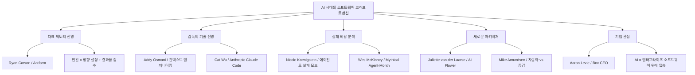
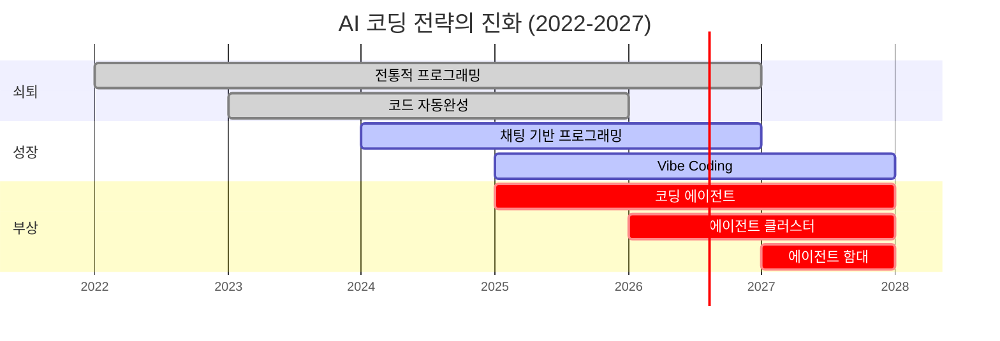
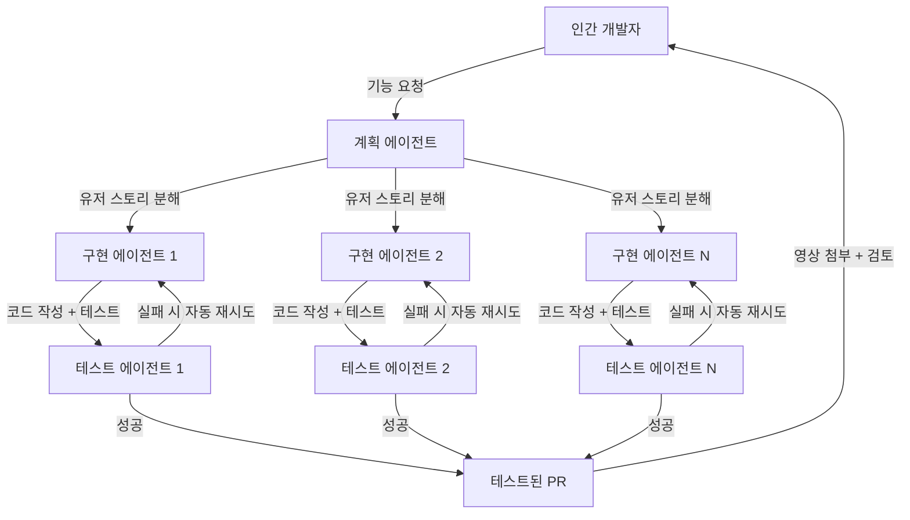
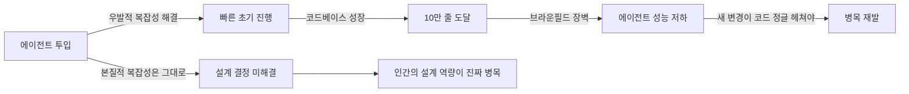
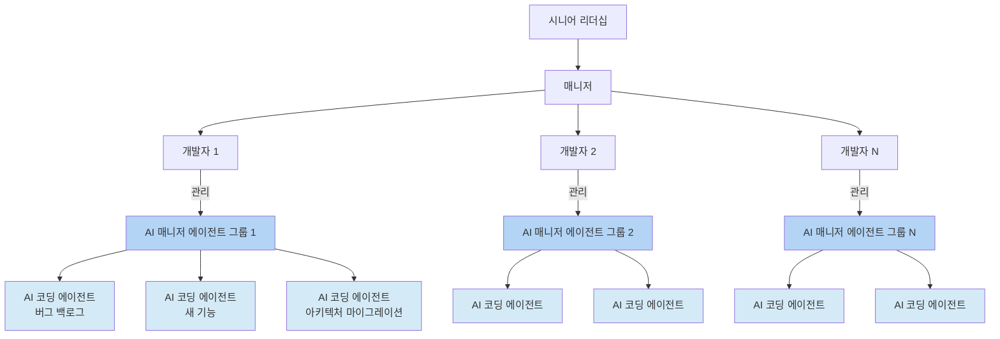
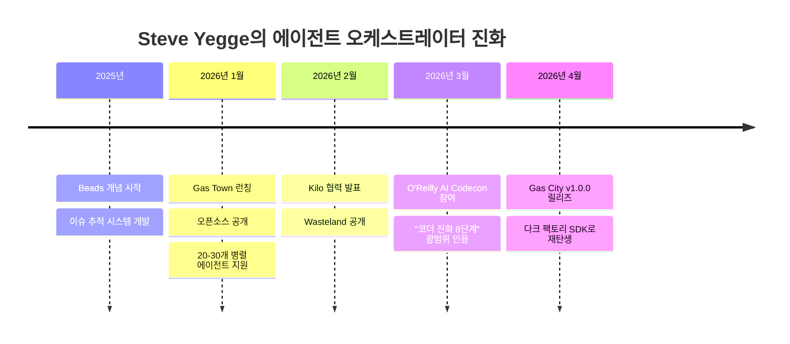
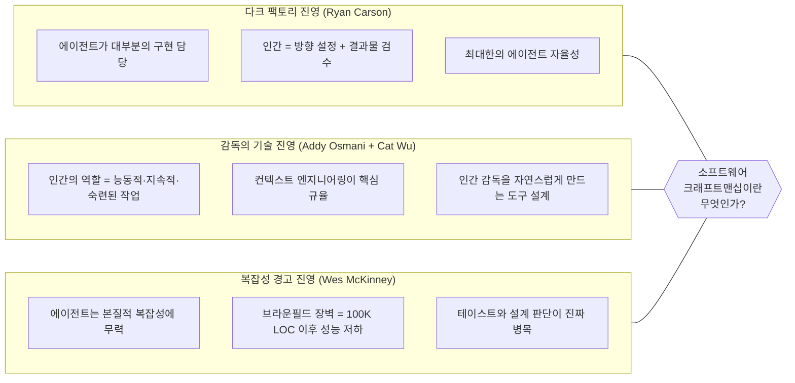
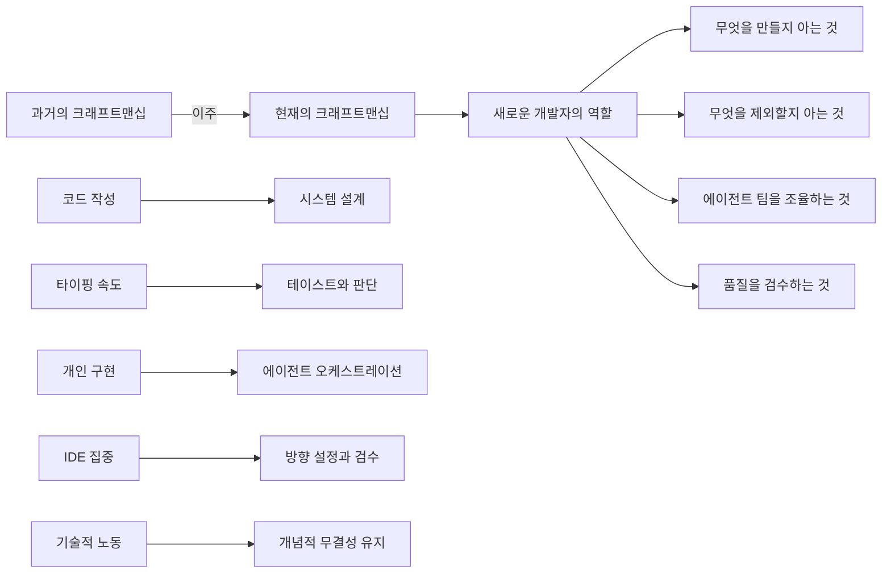

> **원문 출처**
> - Tim O'Reilly, *"Software Craftsmanship in the Age of AI"*, O'Reilly Radar, 2026년 3월 13일
> - Tim O'Reilly, *"Steve Yegge Wants You to Stop Looking at Your Code"*, O'Reilly Radar, 2026년 3월 12일
> - Steve Yegge, *"Revenge of the Junior Developer"*, Sourcegraph Blog, 2025년 3월 22일

---

## 목차

1. [개요: 왜 지금 이 논의가 중요한가](#1-개요-왜-지금-이-논의가-중요한가)
2. [O'Reilly AI Codecon 2026: 이벤트 배경](#2-oreilly-ai-codecon-2026-이벤트-배경)
3. [Steve Yegge의 세계관: 코더 진화의 8단계](#3-steve-yegge의-세계관-코더-진화의-8단계)
4. [코딩 전략의 6가지 물결](#4-코딩-전략의-6가지-물결)
5. [다크 팩토리: 인간이 방향만 설정하는 소프트웨어 공장](#5-다크-팩토리-인간이-방향만-설정하는-소프트웨어-공장)
6. [Ryan Carson의 Antfarm: 실제 다크 팩토리 구현](#6-ryan-carson의-antfarm-실제-다크-팩토리-구현)
7. [Addy Osmani의 포지션: 감독과 통제의 기술](#7-addy-osmani의-포지션-감독과-통제의-기술)
8. [Wes McKinney의 "신화적 에이전트-월": 에이전트를 추가한다고 빨라지지 않는다](#8-wes-mckinney의-신화적-에이전트-월-에이전트를-추가한다고-빨라지지-않는다)
9. [AI 뱀파이어: 생산성 향상이 만들어내는 새로운 번아웃](#9-ai-뱀파이어-생산성-향상이-만들어내는-새로운-번아웃)
10. [쓴 교훈 (The Bitter Lesson): AI에 맞서는 것의 무의미함](#10-쓴-교훈-the-bitter-lesson-ai에-맞서는-것의-무의미함)
11. [테이스트(Taste): 마지막 남은 경쟁 우위](#11-테이스트taste-마지막-남은-경쟁-우위)
12. [주니어 개발자의 복수: 역전된 서열](#12-주니어-개발자의-복수-역전된-서열)
13. [FY26 조직도: 인간과 AI의 새로운 계층 구조](#13-fy26-조직도-인간과-ai의-새로운-계층-구조)
14. [실패의 비용: 에이전트가 망가질 때](#14-실패의-비용-에이전트가-망가질-때)
15. [Gas Town에서 Gas City로: Yegge의 오케스트레이터 진화](#15-gas-town에서-gas-city로-yegge의-오케스트레이터-진화)
16. [Aaron Levie의 기업 관점: AI는 엔터프라이즈 소프트웨어를 대체하지 않는다](#16-aaron-levie의-기업-관점-ai는-엔터프라이즈-소프트웨어를-대체하지-않는다)
17. [핵심 논쟁: 세 가지 상충하는 철학](#17-핵심-논쟁-세-가지-상충하는-철학)
18. [비용의 현실: AI 코딩은 공짜가 아니다](#18-비용의-현실-ai-코딩은-공짜가-아니다)
19. [결론: 크래프트맨십은 죽지 않았다, 다만 이주했을 뿐이다](#19-결론-크래프트맨십은-죽지-않았다-다만-이주했을-뿐이다)

---

## 1. 개요: 왜 지금 이 논의가 중요한가

2026년 현재, 소프트웨어 개발의 본질에 관한 근본적인 질문이 업계 전체를 관통하고 있다. 그것은 단순히 "AI가 코드를 잘 짜는가"의 문제가 아니라, "코드를 짠다는 행위 자체가 여전히 개발자의 핵심 역할인가"라는 훨씬 더 심층적인 물음이다.

pandas 창시자인 Wes McKinney는 한 달에 100억 토큰 이상을 Claude, Codex, Gemini를 통해 소모하며, 직접 한 줄도 타이핑하지 않고 Go 코드를 대규모로 생성하고 있다. 그는 평생 Go를 손으로 작성해본 적이 없다. Steve Yegge는 "코드는 액체입니다. 호스로 뿌리는 겁니다. 그걸 쳐다보고 있으면 안 됩니다"라고 단언한다. 이 두 사람의 발언은 비유가 아니다. 이것이 지금 업계 최전선에서 실제로 벌어지고 있는 일이다.

이 문서는 2026년 3월 O'Reilly Radar에 게재된 두 편의 심층 아티클과 Steve Yegge의 Sourcegraph 블로그 포스트를 종합적으로 분석한 것이다. 세 편의 글은 모두 하나의 중심 주제를 향해 수렴한다. AI 에이전트가 코드의 대부분을 작성하는 세계에서, 소프트웨어 크래프트맨십이란 과연 무엇인가.

---

## 2. O'Reilly AI Codecon 2026: 이벤트 배경

Tim O'Reilly가 Addy Osmani와 공동 주최한 세 번째 O'Reilly AI Codecon은 2026년 3월 26일에 개최되었다. 이벤트의 부제 "AI 시대의 소프트웨어 크래프트맨십(Software Craftsmanship in the Age of AI)"은 의도적으로 도발적으로 설정되었다.

크래프트맨십이라는 단어는 세심한 주의, 의도, 그리고 깊은 기술을 내포한다. 소재에 직접 손을 대는 제작자를 연상시킨다. 그러나 우리가 진입하고 있는 세계에서는, 인상적인 결과물을 내는 사람들 중 상당수가 코드에 손을 대지 않는다. 이벤트는 이 긴장에서 출발한다.

연사 라인업은 이 핵심 질문에 서로 다른 각도에서 접근하는 사람들로 구성되었다. 에이전트가 코드의 대부분을 작성한다면, 정확히 우리는 무엇을 만들고 있는가.

---

## 3. Steve Yegge의 세계관: 코더 진화의 8단계

Steve Yegge는 Amazon과 Google에서 20년 가까이 근무한 베테랑 소프트웨어 엔지니어이자 블로거다. 2011년 Google 내부에서 유출된 "플랫폼 rant"으로 유명해진 그는 2026년 1월 1일 오픈소스 AI 에이전트 오케스트레이터인 Gas Town을 출시하며 멀티 에이전트 소프트웨어 개발의 주요 옹호자로 떠올랐다.

그의 "코더 진화의 8단계(Eight Levels of Coder Evolution)" 프레임워크는 Gas Town 런치 포스트의 일부로 발표되었으며, 이후 업계에서 광범위하게 인용되고 있다. 처음 4단계는 IDE 사용의 고도화에 관한 것이고, 5단계부터 8단계는 코딩 에이전트에 관한 것이다.

| 단계 | 설명 |
|------|------|
| **1단계** | AI 미사용 또는 거의 미사용 (코드 자동완성, 간헐적 ChatGPT 질문) |
| **2단계** | IDE 내 코딩 에이전트 (퍼미션 요청 방식의 좁은 에이전트) |
| **3단계** | IDE 에이전트 YOLO 모드 (퍼미션 해제, 에이전트 범위 확장) |
| **4단계** | IDE 내 광범위 에이전트 (에이전트가 화면을 채움, 코드는 diff로만) |
| **5단계** | CLI 단독 에이전트 (IDE 제거, diff가 흘러가는 것을 관찰) |
| **6단계** | CLI 멀티 에이전트 YOLO (병렬 에이전트 운영 시작) |
| **7단계** | AI 관리 에이전트 (에이전트가 에이전트를 관리) |
| **8단계** | 다크 팩토리 오케스트레이터 (인간은 전체 팩토리를 설계) |

핵심 전환점은 5단계다. IDE가 사라지고 다시는 열지 않는 단계다. Yegge가 설명하듯, Claude Code가 코드 조각을 작성할 수 있다는 것을 깨달으면, 레고 블록처럼 조립하기 시작한다. 그런데 에이전트 하나가 작업하는 동안 개발자는 앉아서 심심해진다. 그래서 또 하나를 실행한다. 그리고 또 하나를. 머지않아 6개의 에이전트가 병렬로 돌아가고, 그 중 하나는 항상 완료되어 주의를 기다리고 있다.

Yegge는 Amazon VP들이 비서 지원을 받던 것과 유사한 비유를 든다. 그 사람들은 사실상 두 명의 역할을 했다. 프린터가 고장났는지 걱정할 필요가 없었기 때문에, 진짜 문제에만 집중할 수 있었다. Gas Town이 그것과 구조적으로 유사하다는 것이다. "이제 우리 모두에게 비서가 생겼습니다. 모든 사람이 프린터가 어디서 막혔는지 알아내는 대신, 원하는 것에 더 생산적으로 시간을 쓸 수 있게 됩니다."

---

## 4. 코딩 전략의 6가지 물결

Steve Yegge의 Sourcegraph 블로그 포스트 "Revenge of the Junior Developer"에서 그는 AI 코딩 방식의 발전을 여섯 가지 겹치는 물결로 시각화한다. 이 모델은 전통적 프로그래밍에서 에이전트 함대(Agent Fleet)까지의 진화를 포착한다.

각 물결을 순서대로 설명하면 다음과 같다.

**전통적 프로그래밍 (2022~)**: 손으로 코드를 작성하는 방식으로, 현재 쇠퇴 중이다. 2027년경 실질적 구식화가 예상된다. Yegge는 여전히 이 방식을 고집하는 개발자들을 "새 아미시(New Amish)"라고 부른다.

**코드 자동완성 기반 (2023~)**: Copilot과 같은 도구를 사용하는 방식으로, 1년 전만 해도 주류였지만 지금은 "사형수 신세"가 되었다. Yegge는 이것을 AI 버전의 죽은 사람처럼 묘사한다.

**채팅 기반 프로그래밍 (2024~)**: Cursor, Windsurf 같은 IDE 내 채팅 보조 도구를 활용하는 방식이다. 현재도 성장 중이지만, 새로운 물결에 곧 추월될 것이다. 수동 코딩 대비 약 5배의 생산성을 보인다.

**코딩 에이전트 (2025년 상반기~)**: Aider.chat, Claude Code와 같은 진정한 코딩 에이전트들이다. 채팅 기반 대비 약 5배 생산성을 보이며, 이것들이 현재 게임의 중심이다. 에이전트는 사람이 실행하고 결과를 검토하는 동안 독립적으로 작업을 완수한다.

**에이전트 클러스터 (2025년 하반기~)**: 개발자 한 명이 여러 에이전트를 병렬로 운영하는 방식이다. Yegge는 이 단계가 소프트웨어 개발을 드디어 클라우드로 이동시킬 것이라고 주장한다. 로컬 데스크톱은 수십 개의 에이전트를 동시에 운영하기에 충분한 컴퓨팅 파워가 없기 때문이다.

**에이전트 함대 (2026~)**: AI 감독 에이전트가 코딩 에이전트 그룹을 관리하고, 인간 개발자는 대시보드를 통해 전체를 감독하는 방식이다. 개발자 한 명이 100개 이상의 에이전트를 동시에 운영할 수 있게 된다.

물결의 핵심 패턴이 있다. 채팅 기반을 시작으로, 각 연속적인 방식은 이전 방식보다 보수적으로 약 5배 더 생산적이다. 그리고 각 물결은 성숙할 시간을 주면 10배 더 생산적일 것이지만, 더 빠른 새 물결에 계속 평탄화된다.

---

## 5. 다크 팩토리: 인간이 방향만 설정하는 소프트웨어 공장

"다크 팩토리(Dark Factory)"라는 개념은 이 논의의 극단적 한쪽 끝을 대표한다. 이 용어는 로봇이 모든 작업을 수행하기 때문에 불을 켤 필요가 없는 로봇 공장에서 유래했다. 소프트웨어 맥락에서는, 인간이 방향을 설정하되 에이전트가 거의 모든 구현을 담당하는 소프트웨어 생산 환경을 의미한다.

Yegge가 언급하는 레벨 7이나 8이 이에 해당하며, 이것은 더 이상 이론이 아니다. 2026년 현재, 이런 환경을 실제로 운영하고 있는 개발자들이 존재한다.

다크 팩토리의 작동 방식을 간략히 도식화하면 다음과 같다.

중요한 점은, 다크 팩토리가 완전한 무인 공장이 아니라는 것이다. 인간의 역할이 사라지는 것이 아니라 변한다. 인간은 생산에 참여하지 않고, 품질을 검수한다. 조립 라인의 사람은 생산자가 아니라 검수자다.

---

## 6. Ryan Carson의 Antfarm: 실제 다크 팩토리 구현

Ryan Carson은 Treehouse를 창업해 100만 명 이상이 코딩을 배우도록 도운 연쇄 창업가다. 그는 현재 Antfarm이라는 오픈소스 도구를 개발하고 있다. Antfarm은 단일 명령으로 OpenClaw에 전체 에이전트 팀을 설치할 수 있도록 해주는 도구다.

2026년 2월에 런칭된 Antfarm은 MIT 라이선스 오픈소스로, YAML과 SQLite를 기반으로 작동한다. cron을 통해 작업을 스케줄링하고, 에이전트들이 독립적으로 작업을 폴링하며, SQLite가 상태를 추적한다. 번들로 제공되는 워크플로우는 세 가지다. 기능 개발(7개 에이전트), 보안 감사(7개 에이전트), 버그 수정(6개 에이전트)이다.

Carson의 AI Codecon 발표 "OpenClaw에서 에이전트 팀을 만들고 한 명령으로 코드를 배포하는 방법"은 사실상 소프트웨어 공장 운영 튜토리얼이다. 계획 에이전트가 기능 요청을 유저 스토리로 분해하고, 각 스토리는 별도의 에이전트에 의해 격리된 환경에서 구현 및 테스트되며, 실패 시 자동으로 재시도한다. 그 결과로 개발자는 테스트된 풀 리퀘스트를 돌려받는다.

주목할 만한 것은 Carson의 CI 파이프라인이다. 에이전트가 기능을 사용하는 자신을 녹화하고, 그 영상을 PR에 첨부하여 인간이 검토할 수 있도록 한다. 이것이 현재 다크 팩토리의 현실적 모습이다. 완전 자율이 아닌, 자동화된 생산 라인에서 인간 검수자가 결과물을 점검하는 구조다.

단, Carson의 발표는 긍정적인 측면만을 다루지 않는다. 에이전트가 망가질 때, 피드백 루프가 실패할 때, 자동 재시도가 충분하지 않을 때 무슨 일이 일어나는지도 다룬다. 이것이 현실적인 다크 팩토리의 경계다.

---

## 7. Addy Osmani의 포지션: 감독과 통제의 기술

Google Chrome의 개발자 경험 수석 엔지니어링 매니저인 Addy Osmani는 스펙트럼의 반대편 끝을 대표한다. 그는 AI 코딩에 깊이 열광하지만, 인간의 역할이 단순히 "방향을 설정하고 자리를 뜨는 것"이 아니라고 주장한다. 그것은 능동적이고, 지속적이며, 숙련된 작업이다.

Osmani의 AI Codecon 발표 "에이전트 오케스트레이션: 실제 소프트웨어 워크플로우에서 에이전트를 조율하는 패턴"은 조율(coordination) 문제를 다룬다. 그가 Tim O'Reilly와의 대화에서 언급했듯이, 코드를 검토하지 않고 수백 개의 에이전트를 운영하는 솔로 창업자부터 품질 게이트와 장기 유지보수를 고려해야 하는 엔터프라이즈 팀까지 스펙트럼이 존재한다. 대부분의 실제 팀은 그 중간 어딘가에 있으며, 도구가 아니라 패턴이 필요하다.

Osmani가 깊이 고민하는 것은 Andrej Karpathy가 "컨텍스트 엔지니어링(Context Engineering)"이라고 부른 개념이다. 이것은 LLM이 안정적으로 수행하기 위해 필요한 모든 정보를 구조화하는 규율이다. 그의 저서 "Beyond Vibe Coding: From Coder to AI-Era Developer"는 사실상 이 새로운 규율을 위한 매뉴얼이다.

컨텍스트 엔지니어링이란 프롬프트에 적절한 맥락을 담는 것을 넘어선다. 에이전트가 무엇을 알아야 하고, 어떤 순서로 알아야 하며, 어떤 맥락 내에서 작동해야 하는지를 시스템적으로 설계하는 것이다. 여기서 핵심 질문은 "어떻게 더 빨리 코드를 생성하는가"가 아니라 "어떻게 에이전트가 항상 올바른 방향으로 작업하도록 보장하는가"다.

Anthropic에서 Claude Code와 Cowork의 제품을 이끄는 Cat Wu는 플랫폼 제작자의 관점을 제시한다. 그녀의 "신뢰할 수 있고, 해석 가능하고, 조종 가능한" AI 시스템 구축에 대한 집중은, 도구가 인간의 감독을 자연스럽고 쉽게 만들어야 한다는 설계 철학을 대표한다.

---

## 8. Wes McKinney의 "신화적 에이전트-월": 에이전트를 추가한다고 빨라지지 않는다

pandas 창시자이자 Apache Arrow 제작자인 Wes McKinney의 기고문은 Tim O'Reilly가 프로그램을 재편성해서라도 포함시킨 내용이다. 그만큼 중요한 통찰을 담고 있다.

McKinney는 Fred Brooks의 1975년 고전 "The Mythical Man-Month"에서 출발한다. Brooks의 핵심 주장은, 지연된 소프트웨어 프로젝트에 더 많은 인력을 추가하면 오히려 더 늦어진다는 것이었다. McKinney는 같은 역학이 에이전트에도 적용되는지 묻는다.

그의 답은 복잡하다. 에이전트는 "우발적 복잡성(Accidental Complexity)"을 처리하는 데 탁월하다. 즉, 지루하고 반복적인 구현 작업을 빠르게 해결한다. 그러나 "본질적 복잡성(Essential Complexity)", 즉 어렵고 설계에 관한 결정들과 시스템의 개념적 무결성은 완전히 손대지 않은 채로 남긴다.

더 심각한 문제가 있다. 에이전트는 기계 속도로 새로운 우발적 복잡성을 생성한다. McKinney는 자신의 프로젝트인 roborev와 msgvault에서 10만 줄(100K LOC) 정도의 코드 베이스에 도달했을 때 이 문제에 부딪혔다. 에이전트들이 자신들이 생성한 비대한 코드베이스에 컨텍스트적으로 질식하기 시작하는 것을 지켜보았다.

McKinney는 이것을 "브라운필드 장벽(Brownfield Barrier)"이라고 부른다. 10만 줄에서 20만 줄 이후부터 모든 새 변경이 이전 에이전트들이 만든 코드 정글을 헤쳐나가야 한다. Posit에서 McKinney 팀은 VS Code 포크인 Positron(100만 줄 이상의 코드베이스)에서 에이전트들이 훨씬 더 많이 고전하는 것을 목격했다.

McKinney의 핵심 통찰은 Brooks의 50년 전 주장을 강화한다. 병목은 한 번도 "키보드 위의 손"이 아니었다. 에이전트가 노동 제약을 제거한 지금, 그 주장은 더욱 강해졌다. 번창할 개발자들은 가장 많은 병렬 세션을 운영하는 사람들이 아니다. 그들은 프로젝트의 개념적 모델을 머릿속에 담을 수 있고, 무엇을 만들고 무엇을 빼야 하는지 아는 사람들이다.

---

## 9. AI 뱀파이어: 생산성 향상이 만들어내는 새로운 번아웃

Steve Yegge가 발표한 "AI 뱀파이어(The AI Vampire)" 개념은 AI 지원 생산성이 만들어내는 음험한 새 형태의 번아웃을 설명한다.

과거의 과로는 회사가 당신에게 일을 쌓아올릴 때까지 쌓는 방식이었다. 새 버전은 당신의 상사가 초과 근무를 요청하는 것이 아니다. 그것은 Claude가 "이 프로젝트에서 제가 더 해드릴 것이 있을까요?"라고 묻는 것이다. 그러면 당신은 계속 "예, 예, 예"라고 대답한다. 왜냐하면 그것이 재미있고, 생산적이고, AI는 당신의 친구이지 고용주가 아니기 때문이다.

그러나 비틀림이 있다. AI는 모든 쉬운 문제를 해결하고, 당신에게는 어려운 것들만 남겨놓는다. 이것은 자전거 타기에서 모든 내리막이 없어지고 오르막만 남은 것과 같다고 Tim O'Reilly는 비유한다. Yegge는 Amazon에서 Jeff Bezos가 회의에서 겪었던 것과 연결한다. 사람들이 이미 모든 쉬운 문제를 해결한 프레젠테이션을 가져왔기 때문에, Bezos는 하루 종일 어려운 것만 처리하고 있었다.

"이제 이것이 당신에게 일어납니다. 모든 사람이 Jeff Bezos입니다. 모든 사람이 기업가입니다. 모든 사람이 이제 거대한 노동자 군대를 가졌습니다. 그리고 말씀드리는데, 그것은 지칩니다."

Yegge는 이 인지적 강도의 무자비함 때문에 이제 매일, 때로는 하루에 두 번씩 낮잠을 잔다고 밝혔다. 에이전트들은 당신이 더 빠르게 일하도록 도와주는 것만이 아니라, 어떤 종류의 일이 당신의 책상에 도달하는지를 근본적으로 바꾼다.

---

## 10. 쓴 교훈 (The Bitter Lesson): AI에 맞서는 것의 무의미함

Richard Sutton의 "쓴 교훈(The Bitter Lesson)"은 AI 연구의 역사를 통해 도출된 원칙이다. 핵심은 원시 계산 능력이 인간이 설계한 구조를 기반으로 한 시스템을 일관되게 이긴다는 것이다. Yegge는 이것을 논문이 아니라 매일의 운영 원칙으로 다룬다.

그의 실용적 테스트는 단순하다. AI를 더 스마트하게 만들기 위해 코드를 작성하고 있다면, 즉 모델이 처리할 수 있는 것을 처리하기 위해 휴리스틱, 파서, 정규 표현식을 추가하고 있다면, 당신은 쓴 교훈의 틀린 편에 있는 것이다. Yegge는 자신의 Gas Town 기여자들조차 이 실수를 하는 것을 목격한다. 모델이 인지할 수 있는 것을 처리하기 위해 작은 정규식 해킹을 가져다 대는 것이다.

O'Reilly는 이것을 1993년으로 거슬러 올라간다. 그의 회사가 GNN, 최초의 상업적 웹 포털을 만들었을 때, 그들은 최고의 웹사이트 카탈로그를 큐레이션했다. 그러다 Yahoo!가 모든 것을 카테고리별로 나열하기 시작했다. 그러다 Google이 모든 검색에 맞춤 큐레이션을 만들어내는 알고리즘 방식으로 처리했다. 어떤 접근법이 이겼는지는 알다시피 명확하다.

쓴 교훈은 AI에 관한 것만이 아니다. 규모와 계산이 손으로 조정된 해결책을 압도하는 기술의 역사에서 반복되는 패턴에 관한 것이다.

---

## 11. 테이스트(Taste): 마지막 남은 경쟁 우위

Yegge, McKinney, O'Reilly를 포함한 여러 사람들이 수렴한 핵심 통찰이 있다. 그것은 **테이스트(Taste), 즉 취향이 이제 핵심 희소 자원이라는 것**이다.

청중에서 대기업이 모든 레버리지를 갖고 있고 개인에게 공간이 없는 것 아니냐는 질문을 받은 Yegge의 대답은 단호했다. 절대 그렇지 않다. AI 시대에 창의성은 자본을 압도한다.

돈이 있어도 방향이 없으면 쓸모없다. Yegge는 수백만 달러의 토큰을 소모하여 빛을 보지 못하는 소프트웨어를 만드는 회사들이 분명히 존재할 것이라고 확신한다. 왜냐하면 그들에게는 테이스트가 없기 때문이다. 방향 없는 무작위 코드 생성이 있을 뿐이다. 반면, 오픈소스 로컬 추론 모델과 좋은 GPU를 가진 기업가가 사람들이 원하는 것을 알고 있다면, 중요한 것을 만들 수 있다.

"모든 것이 테이스트로 귀결될 것입니다. 회사들은 더 이상 우위가 없습니다. 기업가로서, 이것이 사람들이 엄청난 큰 영향을 만들 수 있는 황금 기회라고 생각합니다."

Fred Brooks가 50년 전에 설계 재능이 진짜 병목이라고 주장한 것은, 에이전트가 노동 제약을 제거한 지금 그 어느 때보다 강하게 사실이 되었다. 예전에는 코딩 속도가 제약이었기 때문에 테이스트만으로는 충분하지 않았다. 지금은 코딩 속도가 사실상 무제한이기 때문에, 무엇을 만들어야 하는지 아는 것이 유일한 진짜 차별화 요소가 된다.

---

## 12. 주니어 개발자의 복수: 역전된 서열

Steve Yegge의 2025년 3월 블로그 포스트 "Revenge of the Junior Developer"는 AI 시대가 개발자 계층 구조에 가져온 예상치 못한 전도를 이야기한다.

과거 1년간 일관되게 관찰된 패턴이 있다. 주니어 개발자들이 실제로 AI 채택에 더 열심이라는 것이다. 이것은 직관에 반하지만 설득력 있는 이유가 있다. 주니어들은 기존 방식에 투자한 것이 없다. 잃을 상태 쿼오가 없다.

반면 시니어 개발자들은 다른 양상을 보인다. Yegge는 많은 시니어 개발자 코호트들이 AI에 대한 단호한 반대 입장을 취하는 것을 다양한 업계 리더들로부터 듣는다. 하나의 구체적인 예로, 유명 브랜드의 기술 이사가 팀원 중 한 명이 색상 슬라이드와 차트가 담긴 PDF를 보내왔다고 했는데, 그 내용은 왜 AI를 버리고 일반 코딩으로 돌아가야 하는지를 설명하는 것이었다.

왜 시니어들이 저항하는가? Yegge는 깊게 파고든다. 그가 예전에 프로그래밍 언어에 관한 블로그를 쓸 때, 어떤 언어가 좋다고 말하면 쓰레드에서 격렬한 반응이 터져 나왔다. 몇 년이 지나서야 그 이유를 알아냈다. 사람들이 자신이 좋아한다고 하면 모두가 그 언어로 전환할 것이고, 그러면 시니어들도 배워야 할 것이라고 느꼈기 때문이다. 그들은 새로운 것을 배워야 하는 것을, 직업과 건강보험을 잃고 병원 계단 앞에서 죽는 것과 동일시했다. 이것이 불확실한 큰 변화 앞에서 인간의 본성이 작동하는 방식이다.

**진짜 혁신적 통찰**: Yegge는 AI를 적극 채택하는 주니어들이 두 가지 이유에서 기업에게 더 매력적이라고 주장한다. 첫째, 평균적으로 AI를 더 빨리 채택한다. 둘째, 더 저렴하다. 기업들이 개발자들이 토큰으로 이기게 하기 위해 비용을 절감해야 한다면, 어떤 개발자를 유지할지는 자명하다.

"AI가 당신보다 낫다는 것을 증명하는 것은 AI의 일이 아닙니다. AI를 사용해서 더 나아지는 것이 당신의 일입니다."

---

## 13. FY26 조직도: 인간과 AI의 새로운 계층 구조

Yegge의 "FY26 조직도"는 미래 소프트웨어 조직의 구조를 시각화한다. 이것은 추측이 아니라, 그가 관찰하고 있는 실제 진화 방향이다.

이 구조에서 모든 개별 기여자(리프 노드) 개발자들은 2선 라인 매니저처럼 행동한다. AI "매니저 에이전트"를 운영하고, 그 에이전트들은 코딩 에이전트 그룹을 감독한다. 단일 IC 개발자의 지도 아래, 하나의 관리된 에이전트 그룹은 버그 백로그를 처리하고, 또 다른 그룹은 새 비즈니스 기능을 작업하고, 세 번째 그룹은 장기 아키텍처 마이그레이션을 진행할 수 있다.

이것이 실제로 의미하는 것은, 미래의 소프트웨어 엔지니어의 일은 코딩 에이전트와 그 AI 감독관의 대시보드를 관리하는 것이 될 것이라는 점이다.

**멘토링 파이프라인**: Yegge는 Matt Beane의 기술 습득 연구를 인용한다. 사람들은 40단계 위에 있는 사람에게서 배우지 않고, 한 두 단계 앞선 사람에게서 배운다. 조직에서 각 사람보다 한 두 단계 앞에 있는 멘토를 찾고, 공감으로 모두를 함께 끌어올리는 것이 해법이다.

또한 Yegge는 직함의 재정의를 제안한다. 주니어 엔지니어들의 진짜 후계자는 PM, SDR, 재무·영업 담당자 등, 이제 AI로 무언가를 만들기 시작한 비개발자들이다. 전직 주니어 개발자들은 사실 이 새로운 바닥 계층을 위한 완벽한 멘토가 된다. 그리고 그 주니어들은 시니어에게, 시니어는 프린시펄에게 멘토링을 받는다. 멘토링이 쭉 이어지는 구조다.

---

## 14. 실패의 비용: 에이전트가 망가질 때

AI Codecon의 여러 연사들은 에이전트 기반 개발의 실패 모드에 집중한다. O'Reilly Radar 포스트에서 Tim O'Reilly가 이 부분을 특별히 강조하는 것은 우연이 아니다. 열정이 종종 덮어버리는 질문, 즉 잘못되면 무슨 일이 일어나는가에 대한 답이 필요하다.

Nicole Koenigstein의 발표 "에이전트 실패의 숨겨진 비용과 에이전트 AI의 다음 단계"는 데모에서 보이지 않는 실패 모드를 다룬다. Koenigstein은 O'Reilly 도서 "AI Agents: The Definitive Guide"를 집필 중이며, 에이전트가 샌드박스에서 할 수 있는 것과 프로덕션에서 하는 것 사이의 격차에 대해 기업들을 컨설팅해왔다.

Qodo의 Hila Fox는 보완적인 관점을 제공한다. 그녀의 발표는 단순한 프롬프트 기반 도구에서 프로덕션 멀티 에이전트 시스템까지의 실제 경로를 추적한다. 여기에는 도중에 잘못되는 모든 것들이 포함된다.

라이트닝 토크들도 실제 경험의 결과를 공유한다. Broadcom의 사이트 신뢰성 엔지니어인 Advait Patel은 AI 에이전트가 프로덕션 시스템을 망가뜨렸을 때와 팀이 어떻게 대응했는지를 이야기한다. Elastic의 Abhimanyu Anand는 모든 AI 빌더를 밤새 잠 못 자게 해야 할 질문을 던진다. "당신의 eval이 당신에게 거짓말하고 있는가?" 만약 평가 프레임워크가 거짓 신뢰를 주고 있다면, 당신은 모래 위에 건물을 짓고 있는 것이다.

---

## 15. Gas Town에서 Gas City로: Yegge의 오케스트레이터 진화

Gas Town의 출발점부터 현재까지의 진화를 이해하는 것은 Yegge의 사상을 이해하는 데 중요하다.

**Gas Town (2026년 1월 1일 런칭)**: Mad Max: Furiosa의 연료 창고에서 이름을 따온 오픈소스 AI 에이전트 오케스트레이터다. 단일 에이전트 인터페이스처럼 보이지만, 백그라운드에서 전문화된 에이전트들의 시리즈를 생성하고 관리한다. Go 언어로 약 189K LOC 규모로 개발되었으며, Beads 이슈 추적 시스템 위에서 작동한다. 주로 Claude Code를 기반으로 20~30개의 병렬 AI 코딩 에이전트를 관리한다.

MEOW 스택(Beads, Epics, Molecules, Protomolecules, Formulas)이 계층화된 워크플로우 추상화를 제공하며, GUPP(Gas Town Universal Propulsion Principle)가 에이전트들이 후크에서 작업을 실행하도록 보장한다.

**Wasteland (Gas Town 확장)**: Kilo와의 협력으로 클라우드 호스팅 버전이 출시되었다. "수천 개의 Gas Town"을 지원하며, 연합된 작업 중재와 사설 에이전트 군대를 위한 공개 공용 게시판 역할을 한다.

**Gas City (2026년 4월 v1.0.0 릴리즈)**: Gas Town을 처음부터 다시 작성한 SDK다. 하드코딩된 원래 Gas Town 팀 구조가 아닌 어떤 토폴로지에서든 협업 에이전트 팀을 배포할 수 있게 해준다. Yegge는 이것을 "나만의 다크 팩토리를 구축하기 위한 SDK"로 설명한다.

Gas City에서의 레벨 11 개발자는 "팩토리 빌더"다. 전체 커스텀 오케스트레이터를 구축하고, 완전한 다크 팩토리를 운영하며, 아키텍트, 큐레이터, 목동의 수준에서 작동하는 사람이다.

---

## 16. Aaron Levie의 기업 관점: AI는 엔터프라이즈 소프트웨어를 대체하지 않는다

AI Codecon은 Box의 공동창업자이자 CEO인 Aaron Levie와의 파이어사이드 채팅으로 마무리된다. Levie는 에이전트가 SaaS와 지식 근로에 미치는 의미에 대해 가장 사려 깊게 발언해온 엔터프라이즈 CEO 중 한 명이다.

그의 핵심 주장은 에이전트가 엔터프라이즈 소프트웨어를 대체하지 않는다는 것이다. 에이전트는 그 위에 탑승한다. 그리고 유용한 일을 하기 위해서는 콘텐츠, 맥락, 거버넌스가 필요하다. Levie는 대부분의 회사들이 감당할 여력이 없어 한 번도 하지 못한 방대한 작업들이 있다는 점도 지적한다. 한 번도 분석하지 못한 계약서들, 최적화하지 못한 프로세스들. AI는 단순히 기존 작업을 자동화하는 것이 아니다. 이전에 시도하기에는 너무 비쌌던 작업을 가능하게 한다.

이것은 O'Reilly가 자신의 연구에서 발전시켜온 주제와 연결된다. AI가 엄청난 가치를 창출하지만 그것이 의존하는 인간 전문성을 지지하는 경제적 순환 시스템을 공동화시키는 위험이다. Levie는 AI를 Box의 제품 중심에 두면서도 인간의 판단, 맥락, 거버넌스가 에이전트 세계에서 덜이 아니라 더 가치 있다는 주장을 펼쳐야 하는 공개 회사를 실시간으로 운영하고 있다.

---

## 17. 핵심 논쟁: 세 가지 상충하는 철학

AI Codecon의 구조는 세 가지 근본적으로 다른 인간-에이전트 관계 철학 사이의 긴장을 의도적으로 담고 있다.

이 세 진영은 서로 상충하지만, 동시에 현실적인 팀은 세 철학 모두에서 배울 것이 있다. 다크 팩토리 접근법은 탁월한 생산성을 제공하지만 실패 모드가 크다. 감독의 기술은 지속 가능하고 품질이 높지만 속도 면에서 불리할 수 있다. 복잡성 경고는 무한정 가속을 막는 현실적인 제동장치를 제공한다.

특히 흥미로운 것은 Wes McKinney와 Addy Osmani 사이의 수렴이다. 두 사람 모두 테이스트와 설계 판단이 그 어느 때보다 중요하다고 생각한다. 하지만 그들은 전혀 다른 각도에서 접근한다. McKinney는 병렬 에이전트 세션의 한계를 밀어붙이는 개인 개발자로서, Osmani는 수백 명으로 구성된 팀에 적용되는 패턴을 생각하는 사람으로서.

---

## 18. 비용의 현실: AI 코딩은 공짜가 아니다

Steve Yegge는 Sourcegraph 블로그에서 이 부분을 솔직하게 다룬다. AI 코딩은 토큰을 소모하며, 그것은 돈이다.

현재 기준으로 코딩 에이전트 인스턴스 하나를 운영하는 비용은 시간당 약 10~12달러다. 이것을 기준으로, 에이전트 인스턴스 하나의 가치는 하루 8~10시간 바쁘게 운영할 경우, 이 회계연도 동안 주니어 개발자 한 명을 추가로 보유하는 것과 대략 동등하다고 볼 수 있다.

에이전트 클러스터 단계가 되면, 개발자 한 명이 동시에 평균 5개의 에이전트를 운영한다고 가정하면, 하루 50달러, 연간 약 5만 달러의 추가 비용이 발생한다. 에이전트 함대 단계에서는 하루 수천 달러도 가능하다.

Yegge의 메시지는 명확하다. 소프트웨어 개발은 이제 pay-to-play 고속 열차가 되었다. 티켓을 살 여유가 없다면, 경쟁에서 뒤처질 위험이 있다. 그러나 동시에, 예산을 찾을 수 있다면 개발자의 생산성을 5~10배 향상시킬 수 있는 투자이기도 하다.

**제본스의 역설(Jevons Paradox)**: 추론 비용이 급락해도 사용량 증가가 그 비용 감소를 상쇄할 것이라는 점도 주목해야 한다. 버그 백로그는 사실상 무한하다. 저렴해질수록 더 많이 쓴다.

---

## 19. 결론: 크래프트맨십은 죽지 않았다, 다만 이주했을 뿐이다

Tim O'Reilly는 이 모든 논의를 하나의 결론으로 수렴시킨다. Steve Yegge가 프로그래밍의 황금기가 끝나고 있다는 것에 대한 슬픔과 수용의 문제로 설명했다면, O'Reilly의 대답은 다르다.

크래프트맨십은 죽지 않았다. 다만 이주(migrate)했을 뿐이다.

코드 작성에서 시스템 설계로. 타이핑에서 테이스트로. 개인의 영웅적 행위에서 오케스트레이션으로. 이 전환을 가장 먼저 이해하는 사람들이 엄청난 우위를 가질 것이다.

Yegge의 결론도 비슷하다. "우리는 더 큰 것들을 만들 것입니다. 그것이 모두가 걱정하는 것입니다. 무슨 일이 일어날까요? 그리고 대답은 우리가 더 큰 것들을 만들 것이고 그것은 재미있을 것이라는 겁니다."

Yegge가 인용하는 Rilke의 시가 이것을 가장 잘 표현한다. "우리가 싸우는 것은 너무 작고, 우리가 이길 때, 그것은 우리를 작게 만든다. 우리가 원하는 것은 연속적으로 더 위대한 존재들에 의해 결정적으로 패배하는 것이다." AI가 당신의 사고를 약화시키고 있다면, 그것은 당신이 충분히 어려운 문제들과 씨름하고 있지 않기 때문이다.

AI 시대의 크래프트맨십은 더 적은 코드를 작성하는 것이 아니라, 더 나은 결정을 내리는 것이다. 에이전트가 모든 쉬운 문제를 해결하고 난 뒤 남는 어려운 문제들, 그것이 이제 개발자의 진정한 전쟁터다.

---

## 참고 자료

- Tim O'Reilly, "Software Craftsmanship in the Age of AI," O'Reilly Radar, March 13, 2026: [링크](https://www.oreilly.com/radar/software-craftsmanship-in-the-age-of-ai/)
- Tim O'Reilly, "Steve Yegge Wants You to Stop Looking at Your Code," O'Reilly Radar, March 12, 2026: [링크](https://www.oreilly.com/radar/steve-yegge-wants-you-to-stop-looking-at-your-code/)
- Steve Yegge, "Revenge of the Junior Developer," Sourcegraph Blog, March 22, 2025: [링크](https://sourcegraph.com/blog/revenge-of-the-junior-developer)
- Steve Yegge, "Welcome to Gas Town," Medium, January 2026: [링크](https://steve-yegge.medium.com/welcome-to-gas-town-4f25ee16dd04)
- Steve Yegge, "Welcome to Gas City," Medium, April 24, 2026: [링크](https://steve-yegge.medium.com/welcome-to-gas-city-57f564bb3607)
- Wes McKinney, "The Mythical Agent-Month," O'Reilly Radar / wesmckinney.com, 2026: [링크](https://www.oreilly.com/radar/the-mythical-agent-month/)
- Addy Osmani, "Beyond Vibe Coding: From Coder to AI-Era Developer," O'Reilly, August 2025
- Darryl K. Taft, "Gas Town comes to the cloud," The New Stack, March 14, 2026: [링크](https://thenewstack.io/steve-yegges-ai-agent-orchestration-project-gas-town-comes-to-the-cloud-and-brings-the-wasteland-with-it/)

---

*작성 일자: 2026-06-02*
