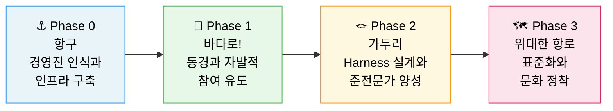
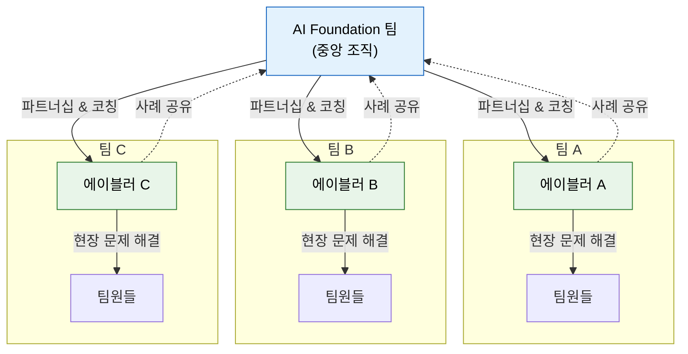
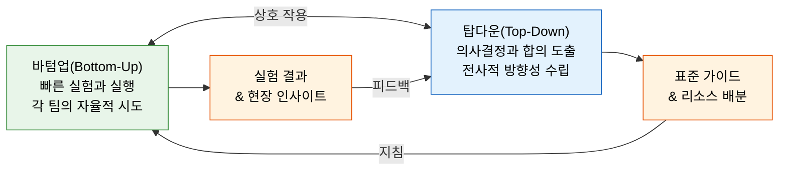
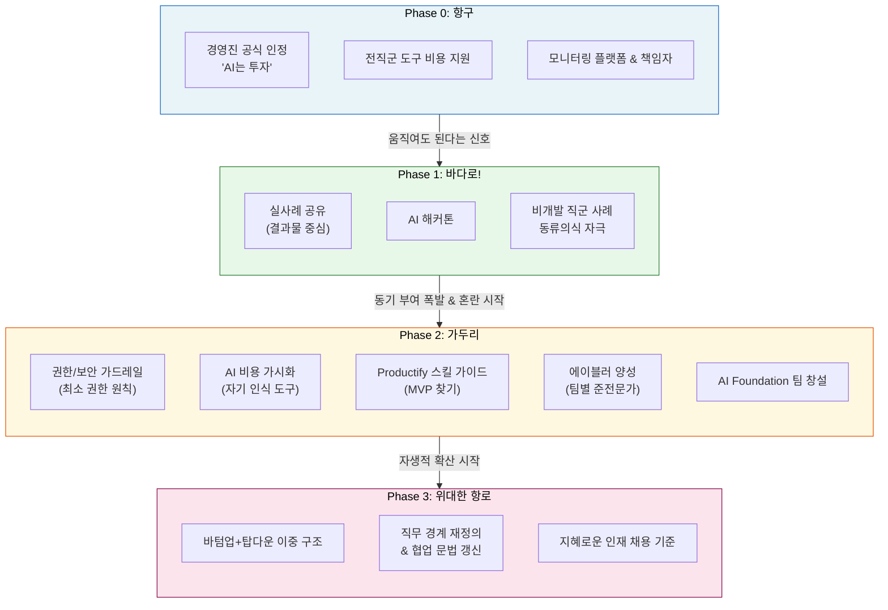

> **원문**: [강남언니 공식 블로그](https://blog.gangnamunni.com/post/ax-voyage-2026)  
> **저자**: 김윤혁(Brown) — Head of KOS(B2B SaaS) Biz. & CCO, 힐링페이퍼(강남언니)  
> **원문 게재일**: 2026년 5월 7일  
> **분석·정리일**: 2026-06-02

---

## 들어가며: 왜 이 글이 주목받는가

이 글은 단순한 AI 도구 사용 후기가 아니다. 강남언니(힐링페이퍼)의 CCO이자 전사 AX 책임자인 김윤혁이, 실제 조직 안에서 AI 전환이 어떻게 진행되고 어떤 단계에서 어떤 문제가 터지는지를 생생하게 기록한 실전 보고서다. 제목에서도 드러나듯, 이 글의 핵심 메시지는 "어려움은 AI를 도입한 이후부터 시작된다"는 것이다. 즉, 도구를 사주는 것만으로 AX가 완성되지 않는다는 냉정한 현실 인식이 이 글 전체를 관통한다.

글의 저자는 스스로를 "AI 전문가가 아닌, 기술자였다가 조직문화와 일하는 법을 담당하게 된 사람"으로 소개한다. 이 자기규정은 중요하다. 기술적 솔루션보다 사람과 문화 중심의 접근이 이 글 전체에 일관되게 흐르기 때문이다. 저자는 AX를 **"항구에서 망망대해로 배를 띄우는 항해"** 에 비유하면서, 전사 AI 전환을 4개의 페이즈로 나누어 설명한다.

---

## 배경: AX(AI Transformation)란 무엇인가

### DX를 넘어 AX로

AX는 AI Transformation의 약어로, 단순한 디지털화(DX: Digital Transformation)를 넘어 AI가 조직의 의사결정, 업무 방식, 문화 자체를 바꾸는 전면적인 전환을 의미한다. DX가 프로세스를 디지털화하고 효율을 높이는 데 초점을 맞췄다면, AX는 그 위에서 AI가 데이터를 학습하고 스스로 판단하는 구조를 만드는 것이다. AI 툴 도입을 넘어 조직이 일하는 방식 자체를 바꾸는 변화라고 할 수 있다.

### 글로벌 관점에서 본 AX의 현실

맥킨지(McKinsey)가 2025년 발표한 보고서 *Superagency in the Workplace*에 따르면, AI는 전 세계적으로 최대 4.4조 달러(USD)의 생산성 잠재력을 가지고 있는 것으로 분석되었다. 그러나 현실은 냉정하다. 92%의 기업이 AI 투자를 늘릴 계획을 갖고 있지만, 실제 업무 전반에 AI를 완전히 통합해 "성숙한 AI 조직"으로 운영하는 기업은 1% 미만에 불과하다. 세계경제포럼(WEF)은 2030년까지 전 세계 비즈니스 전환의 약 86%가 AI에 의해 주도될 것으로 전망했다.

2026년에 이르러 AX 논의의 무게중심은 이미 **"도입 여부"에서 "운영 방식과 사람의 역할 재정의"** 로 이동하고 있다. 이 글은 바로 그 전환점에서 쓰인 실전 기록이다.

### 강남언니(힐링페이퍼)는 어떤 회사인가

힐링페이퍼는 의사 출신 홍승일 대표가 2012년 창업한 메디테크 기업으로, 미용의료 정보 플랫폼 '강남언니'를 운영한다. 강남언니는 성형수술과 피부 시술 등 미용의료 정보를 제공하는 서비스로, 한국·일본·태국 등 전 세계 700만 명 이상의 사람들이 이용하고 있다. 2023년 흑자 전환에 성공했으며, 글로벌 No.1 미용의료 플랫폼을 목표로 빠르게 성장하고 있다. B2B SaaS(KOS, Korean Operating System for Clinics) 사업도 운영 중이다.

---

## 4개 페이즈 전체 구조 개요

이 글이 제시하는 AX 여정은 아래와 같은 4단계 구조를 가진다.

각 페이즈는 선형적으로 진행되지만, 실제로는 이전 단계의 성공이 다음 단계의 혼란을 만들어내는 역설적 구조를 가진다. 이것이 이 글이 주는 가장 독특한 통찰이다.

---

## Phase 0. 항구 — 경영진의 인식과 인프라

### 왜 "0"번인가

저자는 이 단계에 0번이라는 번호를 붙인 이유를 명확히 밝힌다. "여기서 막히면 시작조차 안 되기 때문"이다. 모든 AX 여정의 출발점은 현장 실무자의 열정이 아니라, 경영진이 권한과 예산을 결정하는 순간이다. 아무리 뛰어난 실무자가 있어도, 회사 돈으로 AI 도구를 쓸 수 없거나 회사 데이터에 AI를 연결할 권한이 없으면 아무것도 시작되지 않는다.

### 강남언니가 Phase 0에서 한 것

저자는 Phase 0에서의 실행 내용을 거창하지 않게 세 가지로 정리한다.

첫째, **경영진이 "AI는 비용이 아니라 투자"라고 공식적으로 인정**하는 것이다. 이것은 단순한 선언이지만, 조직 내에서 AI 도구 구매와 실험에 대한 정당성을 부여하는 결정적 신호가 된다. 경영진의 이 공식 인정 없이는 실무자들이 AI 도구 비용을 청구하는 것조차 눈치를 봐야 하는 상황이 된다.

둘째, **직군을 가리지 않고 AI 도구 사용 비용을 회사가 지원**하는 것이다. 개발자뿐만 아니라 HR, 디자인, 마케팅, 영업 등 모든 직군에게 AI 도구 접근권을 동등하게 제공하는 것은 이후 Phase 1에서 비개발 직군의 자발적 참여를 이끌어내는 데 결정적 역할을 한다.

셋째, **AI 안전성과 비용을 모니터링하는 최소한의 플랫폼과 책임자를 지정**하는 것이다. 완벽한 거버넌스 체계를 처음부터 구축하려 하지 않고, 최소한의 모니터링 체계와 담당자를 세우는 것으로 시작한다.

### Phase 0의 핵심 통찰

저자가 Phase 0에서 강조하는 가장 중요한 포인트는 **"완벽한 인프라"가 아니라 "움직여도 된다는 신호"** 라는 것이다. 많은 기업이 AI 거버넌스와 보안 정책, 데이터 정책이 완비되기 전까지는 AI 도구 사용을 허용하지 않으려 한다. 그러나 이런 방식은 빠르게 변화하는 AI 환경에서 조직 전체를 정체시키는 결과를 낳는다. 강남언니는 대신 "일단 움직여도 된다"는 공식 신호를 먼저 보내고, 거버넌스는 실험 속에서 함께 발전시켜나가는 방식을 택했다.

---

## Phase 1. "바다로 가보시죠!" — 동경을 만드는 단계

### 교육이 아닌 동경

저자는 Phase 1의 핵심 철학으로 잘 알려진 인용구를 가져온다.

> *"사람들에게 배 만드는 법을 가르치고 싶으면, 배 만드는 매뉴얼을 들이밀지 말고 바다를 동경하게 하라."*

이 문장은 AI 도입에서의 교육 방식에 대한 근본적인 질문을 던진다. 대부분의 기업이 AI 도입 초기에 선택하는 방식은 LLM이 무엇인지, 프롬프트 엔지니어링이 무엇인지 설명하는 교육 프로그램이다. 그러나 강남언니는 다른 길을 택했다. 기술적 지식을 설명하는 대신, 실제로 AI가 일을 어떻게 바꾸었는지를 보여주는 방식으로 접근한 것이다.

### 구체적인 실행 방식

**첫 번째**, 저자 본인이 AI 도구로 어떻게 업무를 바꾸었는지를 직접 공유했다. 스케줄 정리, 인터뷰 스크립트 기반 면접 결론 정리 같은 실무 사례를 어떤 지침으로 어떻게 처리했는지 결과물 형태로 보여준 것이다.

**두 번째**, AI 해커톤을 개최했다. 해커톤은 참가자들에게 실험의 기회를 주는 동시에, 짧은 기간 안에 AI로 무언가를 만들어내는 경험을 통해 심리적 장벽을 낮추는 효과가 있다.

**세 번째**, 그리고 이것이 가장 강력했던 방식인데, **"저 사람도 하고 있다" 시리즈**다. 핵심은 사례의 주인공 선택이었다. 저자가 의도적으로 배제한 것은 개발 지식이 있거나 기술에 친숙한 사람의 사례였다. 대신, 비개발 직군 동료가 AI를 가지고 만든 결과물을 끌어올려 공유했다. 이것은 "나도 할 수 있겠다"는 동류의식(peer identification)을 자극하는 탁월한 전략이었다.

### 두 가지 인상적인 사례

#### 사례 1: HR 동료의 인터뷰 스케줄링 자동화

컴퓨터공학을 전공했지만 "코딩하기 싫어서" HR로 전직한 동료가 있었다. 그 동료가 어느 날 AI 코딩 도구를 사용해 사내 캘린더와 연동되는 면접 스케줄링 도구를 직접 만들었다. 이 도구는 면접관 3명이 모두 빈 시간과 그때 비어있는 회의실을 자동으로 찾아주는 기능을 가지고 있었다. 원래 1시간씩 걸리던 일정 잡기 작업이 5분 안에 끝나기 시작했다. 이 사례의 중요성은 기술 전문가가 아닌 사람이 AI를 통해 자신이 직접 해결하기 어려웠던 기술적 문제를 풀어냈다는 점이다.

#### 사례 2: 디자이너가 만든 크롬 익스텐션

사용자 매뉴얼을 제작할 때 웹페이지의 임시 텍스트와 버튼을 일일이 보정하는 작업이 반복적으로 귀찮았던 디자이너가, AI 코딩 도구를 활용해 해당 임시 요소를 자동으로 정리해주는 크롬 익스텐션을 직접 만들었다. 처음에는 본인의 편의를 위해 만든 도구였는데, 사내에 공유되자마자 여러 팀이 해당 익스텐션을 가져갔다.

### 왜 이 방식이 효과적인가

이런 사례들이 쌓이면서 조직 내 분위기가 바뀌는 메커니즘은 심리학적으로도 설명된다. "저 사람도 했다 = 나도 할 수 있겠다"의 문법은 어떤 교육 프로그램보다 강력하다. 이것은 앨버트 반두라(Albert Bandura)의 사회 학습 이론에서 말하는 관찰 학습(observational learning)과 자기 효능감(self-efficacy) 증진 원리와 맞닿아 있다. 비슷한 역할과 배경을 가진 동료가 성공하는 것을 보면, 자신도 할 수 있다는 확신이 생기고 시도 의지가 높아진다.

---

## Phase 2. "가는 건 좋은데 쫌만 살살.." — 가두리(Harness)의 단계

### Phase 1이 너무 잘 되면 생기는 문제

저자가 지적하는 역설이 있다. Phase 2가 시작되는 시점은 Phase 1이 실패했을 때가 아니라, **Phase 1이 너무 잘 되기 시작한 직후**라는 것이다. 구성원들이 AI에 열광하고 스스로 무언가를 만들기 시작하면, 다음과 같은 풍경이 조직 내에 펼쳐진다.

- 어디선가 "저 이거 만들고 싶은데 admin 권한 좀, API key 좀"이라는 요청이 쏟아지기 시작한다.
- 어떤 이는 스크립트 하나면 충분한 일인데 "웹서비스 호스팅이 필요해요"라는 요청을 가지고 온다.
- 그리고 어딘가에서 AI 비용이 예상을 훌쩍 넘어서기 시작한다.

자유로운 실험이 허용된 이후에 나타나는 이런 현상들은 조직 입장에서는 보안 위험, 비용 통제 실패, 인프라 과부하로 이어질 수 있다. 그렇다고 이 시점에서 제동을 거는 방식이 서툴면, 어렵게 만들어낸 동기 부여와 자발적 참여의 불씨가 꺼져버린다.

### 가두리(Harness)의 개념

저자는 이 딜레마에 대한 해법으로 **"가두리(Harness)"** 개념을 도입한다. 회사 내에서는 "가두리"라는 표현을 자주 쓴다고 밝히면서, 적절한 가두리를 만들고 그 안에서 마음껏 날뛰게 하는 것이 목표라고 설명한다. 이것은 저자의 표현대로 "적절한 조율 속에서의 극도의 자율"과 같은 개념이다.

하네스(Harness)는 원래 공학 용어에서 온 개념으로, 최근 AI 분야에서 에이전트 오케스트레이션이나 LLM 운영 레이어를 지칭하는 데도 쓰인다. 이 글에서는 그것보다 넓은 의미, 즉 자유로운 실험과 혁신을 보장하면서도 보안·비용·품질의 경계를 설정하는 조직적 장치 전체를 가리키는 개념으로 사용되고 있다.

저자의 핵심 통찰을 한 문장으로 요약하면 이것이다: **"자유는 가드레일이 있을 때만 가속된다."**

### AI Foundation 팀의 창설과 구체적 운영 장치

이 단계에서 강남언니는 **AI Foundation**이라는 조직을 만들고, 다음 세 가지 운영 장치를 붙이기 시작했다.

**첫 번째, 권한·보안 가드레일.** "정말 필요한가? 어디까지 필요한가?"를 묻는 절차를 만들었다. 최소 권한 원칙(Principle of Least Privilege)을 기반에 두고, 그 위에서 실험을 허용하는 방식이다. 이것은 보안 위협을 막으면서도 실험의 속도를 최대한 유지하는 균형을 찾는 작업이다.

**두 번째, AI 비용 가시화.** 누가 얼마나 AI를 쓰는지 보이게 만들었다. 중요한 것은 이 가시화의 목적이 통제가 아니라 **자기 인식(self-awareness)** 이라는 점이다. "당신이 이만큼 썼다"는 정보를 투명하게 보여줌으로써 구성원 스스로 사용량을 조절하게 하는 것이다.

**세 번째, 프로덕티파이(Productify) 스킬 가이드.** 동료들의 문제를 듣고, 그것이 정말로 웹서비스 호스팅과 인프라가 필요한 일인지, 아니면 스크립트 한 개로 끝나는 일인지를 함께 판단해주는 Claude/Notion용 스킬 가이드를 만들었다. 저자는 이것을 "가장 가벼운 MVP를 찾아주는 작업"이라고 설명하며, 공개 GitHub 저장소([kimyoon21/brown-claude-marketplace](https://github.com/kimyoon21/brown-claude-marketplace))로도 배포했다.

### 한 사람이 전사 AI를 가르칠 수 없다 — 에이블러(A.I.bler) 양성

Phase 2에서 저자가 가장 강조하는 또 하나의 핵심 전략은 **준전문가 양성**이다. AI Foundation이라는 중앙 팀이 아무리 열심히 해도, 수백 명 규모의 조직에서 모든 팀의 AI 전환을 단일 팀이 이끌 수는 없다.

저자는 이를 엑셀 비유로 설명한다. "엑셀 잘 쓰는 법"을 한 회사에서 한 사람이 강의하지 않는다. 팀 곳곳에 엑셀 숙련자들이 존재해서 팀의 여러 가지 문제를 해결해주곤 한다. AI는 이미 엑셀과 비슷한 위치로 가고 있다는 것이 저자의 판단이다.

그래서 강남언니는 각 팀에 **에이블러(A.I.bler)** 라고 부르는 준전문가를 육성하기 시작했다. "AI로 일이 되게 한다"는 의미를 담은 이름이다. 에이블러는 해당 팀에서 가장 호기심이 많고 새 도구를 빨리 받아들이는 사람을 선발해, AI Foundation 팀과 일정 기간 함께 일하면서 팀의 실제 문제를 AI로 풀어보는 과정을 거친다.

목표는 에이블러 자신을 "AI 전문가"로 키우는 것이 아니다. 그 사람이 자기 팀으로 돌아갔을 때 "이거 AI로 어떻게 해?"라는 동료들의 질문에 답할 수 있는 사람, 즉 팀 내 AI 연락 창구가 되는 것이다. 이것이 반복되면, 어느 시점부터 AI Foundation이 직접 개입하지 않아도 각 팀이 자생적으로 AI 활용을 발전시키기 시작한다.

---

## Phase 3. "우리만의 위대한 항로를 찾아" — 표준을 정하고 문화를 만들기

### "아직 미래의 영역"

저자는 Phase 3에 대해 솔직한 고백을 한다. "저희도 이제 막 고민이 시작된 미래의 영역"이라는 것이다. 따라서 이 단계에서는 정해진 답이 아니라, 반드시 씨름해야 하는 질문들을 제시하는 것이 글의 목적이다. 저자의 말처럼, "이 질문을 회피하지 않는 회사가 결국 살아남는다."

### 첫 번째 질문: 100점짜리 표준은 없다

AI 시대의 가장 큰 특징 중 하나는 어제의 100점이 오늘의 80점이 된다는 것이다. 어떤 AI 모델을 쓸 것인가, 어떤 방식으로 사용할 것인가에 대한 "정답"이 OpenAI나 Anthropic의 업데이트 한 번으로 바뀐다. 지나치게 고정된 표준과 가이드라인을 만들면 그것이 오히려 혁신의 발목을 잡는다.

강남언니가 제시하는 해법은 **"빠르게 합의하고, 빠르게 갈아엎는 합의 운영 체계"** 다. 정답이 없는 환경에서 여러 사람이 실험적 시도를 빠르게 해보고, 그 안에서 조직 내 최적화된 방식을 도출하는 과정이 필요하다.

저자가 구체적 예시로 드는 것은 **LLM Wiki**와 같은 조직 지식체계 구축이다. AI 에이전트가 자동으로 코드와 문서를 만드는 시대가 되면서, 회사 내부의 위키·용어집·서비스 정의서 같은 "조직 코어 자산"의 중요성이 급격히 높아지고 있다. 이것을 어떻게 수집하고 가공하고 활용할 것인가는 모든 팀의 고민이다. 처음에는 자율적이고 바텀업으로 여러 가지 시도를 허용하지만, 시간이 갈수록 팀 간 합의와 전사적 방향성이 없으면 혼돈이 된다.

결론적으로 이 과정에서 필요한 것은 **바텀업의 빠른 실행 + 탑다운의 적정 레이어까지 의사결정과 합의 도출**이라는 이중 구조다.

### 두 번째 질문: 각자의 전문 영역 경계를 어디까지 넘을 것인가

저자는 과거와 현재의 흥미로운 역전을 지적한다. 예전에는 "오늘도 개발자가 안된다고 말했다"는 말이 있었다면, 지금은 "오늘도 디자이너가 'AI로 하니까 되던데요'라고 말했다"는 상황이 펼쳐지고 있다.

이것은 직무 전문성에 대한 위협이 아니라, 저자의 표현대로 **새로운 협업 문법의 시작**이다. 기존 애자일 방법론이 "각자의 전문 영역을 존중하며 함께 만든다"는 원칙 위에서 작동했다면, AI 시대의 협업은 "각자의 영역을 슬쩍 넘나들면서 책임은 분명히 나누는 것"에 가깝다.

이런 상황은 실무 현장에서 복잡한 충돌을 만든다. 프론트엔드 개발자가 놓친 부분을 백엔드 개발자가 AI를 써서 커버하기도 하고, 어떤 영역은 점점 사람이 직접 하지 않게 되기도 한다. 이때 "각자가 어떤 수준으로 선을 넘으면서도 상대방을 존중하고, 어떤 책임을 나눠 가지며, 어떤 대화를 나누면서 협업의 가치를 높일 것인가"에 대한 문화적 가이드를 조직이 제시해야 한다.

### 세 번째 질문: 우리는 누구를 영입해야 하는가

이 질문은 AI 시대의 인재상에 대한 논의로 이어진다. 저자는 세 가지 관점을 제시한다.

**자기 영역의 전문성은 여전히 필요하다.** 다만 자기 영역에 갇히지 않는 사람의 가치가 빠르게 높아지고 있다. AI를 사용할 수 있다는 것 자체는 점점 기본 자격이 되고 있다.

**진짜 차이는 문제 정의 능력과 태도에서 나온다.** "AI를 다룰 줄 안다"는 것이 점점 차별화 요소가 되지 않는 방향으로 가고 있다. 진정한 경쟁력은 자기 문제를 정확히 정의하는 능력, 그리고 틀려도 빠르게 다시 시도하는 태도에서 나온다. AI 자체도 처음에는 맥락을 모르는 천재 바보였다가 끊임없는 피드백으로 발전하듯이, 사람도 마찬가지다.

**지식이 아닌 지혜를 가진 사람이 필요하다.** 저자는 철학과 논리를 핵심 역량으로 가지고, 쉽게 지식을 습득 가능한 세상에서 다채로운 문제를 본질부터 풀어나가는 사람을 "지혜로운 사람"으로 정의한다. 정보와 지식은 AI가 제공할 수 있지만, 무엇이 진짜 문제인지를 파악하고 본질적 해결책을 구상하는 능력은 여전히 사람의 몫이다.

---

## 글 전체를 관통하는 핵심 통찰들

이 글에서 얻을 수 있는 가장 중요한 인사이트들을 종합적으로 정리한다.

### 1. AX의 어려움은 도입 이후에 시작된다

제목 그대로, 전직원이 AI를 쓰기 시작한 이후부터 진짜 어려움이 시작된다. AI 도구를 도입하고, 비용을 지원하고, 초기 동기 부여까지 성공했다고 해서 AX가 완료된 것이 아니다. 그 이후에 보안 문제, 비용 폭발, 품질 통제, 직무 경계 갈등, 표준화 부재 같은 문제들이 본격적으로 터져나온다. 많은 기업이 이 단계에서 준비 없이 혼란을 맞닥뜨리고, 초기 동력을 잃어버린다.

### 2. 자유는 가드레일이 있을 때만 가속된다

Phase 2에서 저자가 제시하는 핵심 원리다. 아무런 제약 없는 자유는 혼란으로 이어지고, 반대로 지나친 통제는 창의적 실험을 질식시킨다. 최적의 상태는 명확한 경계(가드레일) 안에서 최대한의 자율성을 허용하는 것이다. 이것은 단순히 AI 도입에만 해당하는 이야기가 아니라, 조직 운영의 보편적 원리이기도 하다.

### 3. 중앙 집중형 전파보다 분산형 전파가 더 강력하다

에이블러 시스템이 보여주는 것처럼, 한 명의 AI 전문가나 하나의 AI 팀이 전사 모든 구성원을 가르치는 모델은 조직이 커질수록 작동하지 않는다. 대신 각 팀에 현장 밀착형 준전문가를 심어 자생적으로 확산되게 하는 분산형 전파 방식이 훨씬 강력하다.

### 4. 표준은 고정이 아니라 갱신의 대상이다

AI 기술이 분기·반기 단위로 근본적으로 변화하는 시대에는 고정된 표준이 오히려 걸림돌이 된다. 빠르게 합의하고, 빠르게 갱신하는 "애자일 표준 운영 체계"가 필요하다.

---

## 강남언니 AX 4단계 종합 요약

---

## 이 글이 던지는 더 큰 질문들

이 글이 제시하는 내용은 강남언니라는 한 기업의 경험 보고서를 넘어서, 2026년 현재 AI 전환을 시도하는 모든 조직에 유효한 질문들을 담고 있다.

**AI 거버넌스와 혁신 사이의 균형을 어떻게 잡을 것인가?** 너무 엄격한 거버넌스는 실험을 막고, 너무 느슨한 거버넌스는 보안 사고와 비용 폭발을 초래한다.

**조직 지식체계(LLM Wiki, 용어집 등)를 어떻게 구축하고 에이전트에 연결할 것인가?** AI 에이전트 시대에는 회사 내부의 구조화된 지식이 경쟁력의 원천이 된다.

**"전문가"의 정의가 바뀌는 시대에 어떤 역량을 가진 사람을 채용하고 육성할 것인가?** 기술적 지식보다 문제 정의 능력과 철학적 사고가 중요해지는 시대다.

**AI가 일부 영역을 대체하기 시작할 때 팀 구성과 역할 분담을 어떻게 재설계할 것인가?** 이것은 더 이상 미래의 이야기가 아니다.

---

## 마치며: "배는 항구에 있을 때 가장 안전하지만, 그것이 배의 목적은 아니다"

저자는 글의 마지막을 선박 관련 명언으로 마무리한다. 이 비유는 단순하지만 강력하다. AX를 시작하지 않는 것이 단기적으로는 가장 안전해 보이지만, 그것은 조직이 존재하는 목적과 다르다는 것이다.

저자가 꿈꾸는 미래는 이렇다: AI에게 많은 영역을 위임함으로써 얻은 시간을, 구성원 각자가 더 깊은 문제와 본질적인 고민에 집중하는 데 쓰는 것. 그렇게 된다면 동일한 구성원 규모로도 더 빠르게, 더 큰 임팩트를 향해 나아갈 수 있다는 믿음이다.

이 글이 남기는 가장 중요한 메시지는 아마 이것일 것이다. AX는 기술 프로젝트가 아니다. 그것은 사람이 일하는 방식, 관계를 맺는 방식, 조직이 지식을 만들고 유통하는 방식을 함께 바꾸는 문화 프로젝트다. 그리고 이 여정은 전직원이 AI를 쓰기 시작한 바로 그 순간부터, 비로소 진짜로 시작된다.

---

## 참고 자료

- **원문 블로그**: [강남언니 공식 블로그 — AX의 어려움은 전직원이 AI를 쓰고난 이후부터 진짜 시작된다](https://blog.gangnamunni.com/post/ax-voyage-2026) (2026.05.07)
- **Productify 스킬 가이드 GitHub**: [kimyoon21/brown-claude-marketplace](https://github.com/kimyoon21/brown-claude-marketplace)
- **McKinsey**: *Superagency in the Workplace: Empowering People to Unlock AI's Full Potential* (2025.01.28)
- **flex 블로그**: [AX(AI Transformation) 뜻과 핵심요소](https://flex.team/blog/2025/10/27/ax) (2025.10.27)
- **GS칼텍스 미디어허브**: [트렌드 코리아 2026: AX 조직이 주목할 4가지 키워드](https://gscaltexmediahub.com/future/insight/trend-korea-2026-4-ax-organization-keywords/) (2026.03.03)
- **CJ대한통운 더 운반**: [2026 AX 트렌드, 한 편으로 정리하기](https://www.unban.ai/blog/ax-trend-complete-guide) (2026.03.05)
- **강남언니 디자이너 글**: [AI로 인해 빠른 해결과 부가가치의 제한에 대한 고민](https://blog.gangnamunni.com/post/ai-discovery-collaboration)

---

> 작성일: 2026-06-02
