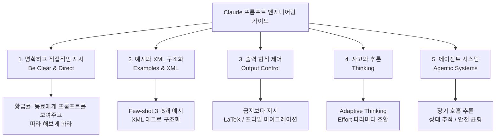
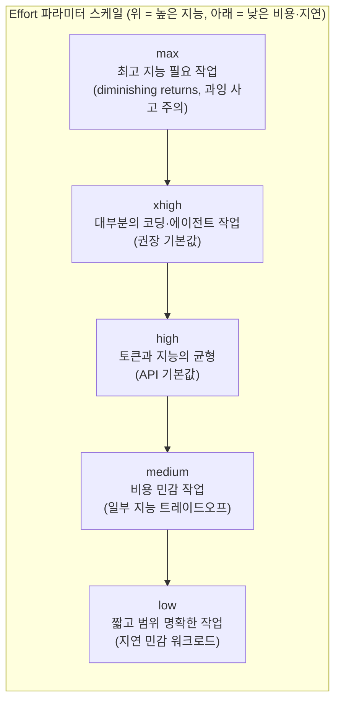
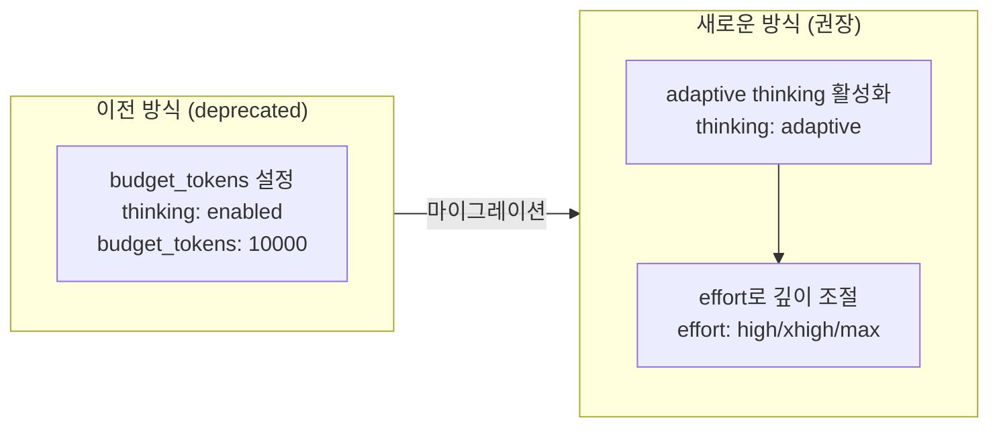
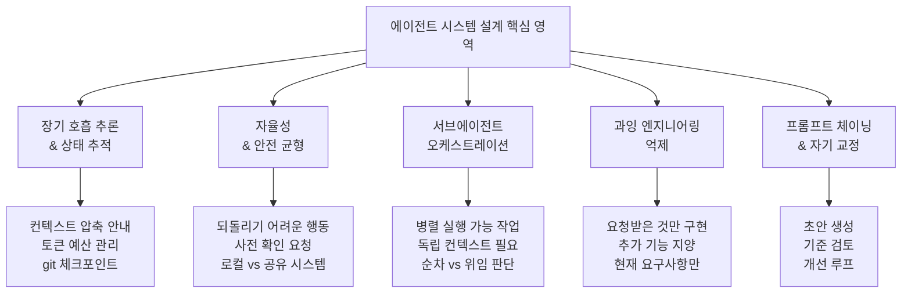
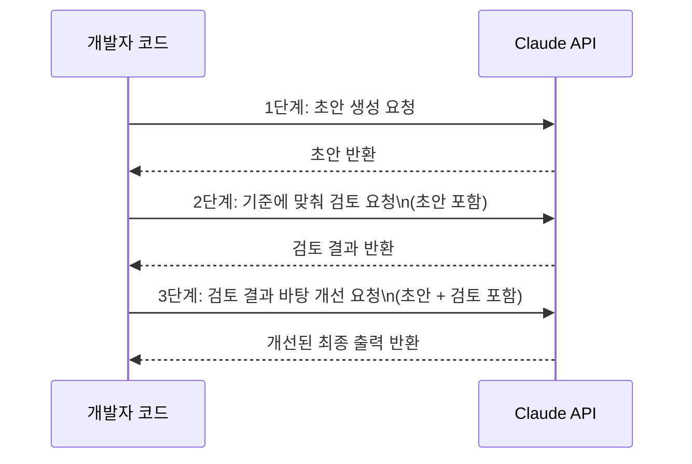
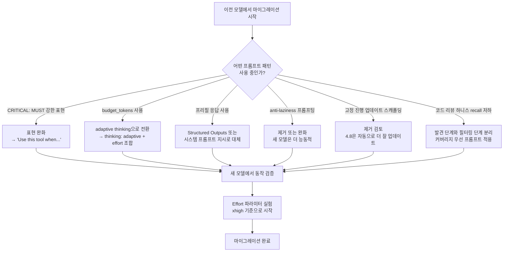

> **출처**: Anthropic 공식 프롬프트 엔지니어링 가이드 ([platform.claude.com](https://platform.claude.com/docs/en/build-with-claude/prompt-engineering/claude-prompting-best-practices)), PyTorchKR 커뮤니티 정리 ([discuss.pytorch.kr](https://discuss.pytorch.kr/t/claude-anthropic/10447)), Effort API 문서 ([platform.claude.com](https://platform.claude.com/docs/en/build-with-claude/effort))
> **대상 모델**: Claude Opus 4.8, Claude Opus 4.7, Claude Opus 4.6, Claude Sonnet 4.6, Claude Haiku 4.5
> **작성일**: 2026-06-02

---

## 목차

1. [가이드 개요 및 배경](#1-가이드-개요-및-배경)
2. [Claude Opus 4.8 전용 프롬프팅](#2-claude-opus-48-전용-프롬프팅)
   - [Effort 파라미터 완전 해설](#21-effort-파라미터-완전-해설)
   - [사고(Thinking)와 적응형 추론](#22-사고thinking와-적응형-추론)
   - [응답 길이 및 장황함 조정](#23-응답-길이-및-장황함-조정)
   - [도구 호출 경향과 제어](#24-도구-호출-경향과-제어)
   - [문자적 지시 따르기](#25-문자적-지시-따르기-literal-instruction-following)
   - [진행 업데이트와 톤 변화](#26-진행-업데이트와-톤-변화)
   - [서브에이전트 제어](#27-서브에이전트-제어)
   - [코드 리뷰 하니스 튜닝](#28-코드-리뷰-하니스-튜닝)
   - [인터랙티브 코딩 제품과 토큰 사용 패턴](#29-인터랙티브-코딩-제품과-토큰-사용-패턴)
   - [프론트엔드 설계 기본값의 변화](#210-프론트엔드-설계-기본값의-변화)
3. [일반 원칙: 모든 세대에 통하는 기본기](#3-일반-원칙-모든-세대에-통하는-기본기)
   - [명확하고 직접적인 지시](#31-명확하고-직접적인-지시)
   - [맥락 추가를 통한 성능 향상](#32-맥락-추가를-통한-성능-향상)
   - [예시(Few-shot) 활용법](#33-예시few-shot-활용법)
   - [XML 태그 구조화](#34-xml-태그-구조화)
   - [역할(Role) 부여](#35-역할role-부여)
   - [긴 컨텍스트 다루기](#36-긴-컨텍스트-다루기)
   - [모델 자기 인식 주입](#37-모델-자기-인식-주입)
4. [출력과 형식 제어](#4-출력과-형식-제어)
   - [금지보다 지시가 효과적인 이유](#41-금지보다-지시가-효과적인-이유)
   - [LaTeX 출력 제어](#42-latex-출력-제어)
   - [프리필 응답의 종료와 마이그레이션](#43-프리필-응답의-종료와-마이그레이션)
5. [도구 사용 최적화](#5-도구-사용-최적화)
   - [행동을 원하면 명시적으로 지시하기](#51-행동을-원하면-명시적으로-지시하기)
   - [병렬 도구 호출](#52-병렬-도구-호출)
   - [과잉·과소 발동 문제](#53-과잉과소-발동-문제)
6. [사고와 추론 제어](#6-사고와-추론-제어)
   - [과잉 사고 다스리기](#61-과잉-사고-다스리기)
   - [적응형 사고(Adaptive Thinking) 설정](#62-적응형-사고adaptive-thinking-설정)
7. [에이전트 시스템 설계](#7-에이전트-시스템-설계)
   - [장기 호흡 추론과 상태 추적](#71-장기-호흡-추론과-상태-추적)
   - [자율성과 안전의 균형](#72-자율성과-안전의-균형)
   - [서브에이전트 오케스트레이션](#73-서브에이전트-오케스트레이션)
   - [과잉 엔지니어링 억제](#74-과잉-엔지니어링-억제)
   - [프롬프트 체이닝과 자기 교정](#75-프롬프트-체이닝과-자기-교정)
8. [비전과 프론트엔드 설계](#8-비전과-프론트엔드-설계)
9. [마이그레이션 관점: 새 모델로 옮길 때 점검 사항](#9-마이그레이션-관점-새-모델로-옮길-때-점검-사항)
10. [모델별 Effort 파라미터 비교표](#10-모델별-effort-파라미터-비교표)

---

## 1. 가이드 개요 및 배경

Anthropic은 Claude 최신 모델군을 위한 프롬프트 엔지니어링 모범사례 문서를 단일 레퍼런스로 통합해 공개했다. 이 가이드는 2026년 5월 28일 출시된 Claude Opus 4.8을 비롯해 Claude Opus 4.7, Opus 4.6, Sonnet 4.6, Haiku 4.5까지를 아우르며, 기초적인 명료성 원칙부터 출력 제어, 도구 사용, 사고(thinking), 그리고 에이전트 시스템 설계까지 한 곳에 담고 있다.

이 문서가 단순한 팁 모음에 그치지 않고 주목받는 이유는 모델 세대가 바뀔 때마다 어떤 프롬프트를 어떻게 다시 손봐야 하는지에 대한 마이그레이션 관점을 전면에 내세우기 때문이다. 프롬프트 엔지니어링은 한때 "마법 주문 찾기"처럼 여겨졌지만, 최신 모델들이 지시를 점점 더 문자 그대로(literal) 따르게 되면서 그 성격이 근본적으로 달라졌다. 과거에는 모델이 알아서 의도를 추측해주길 기대하며 모호한 프롬프트를 던졌다면, 이제는 원하는 동작을 명확히 명시하고 모델 세대별 기본값(default)의 변화를 이해하는 것이 핵심 역량이 되었다.

특히 Claude Opus 4.6 이후 모델들은 시스템 프롬프트에 훨씬 민감하게 반응하기 때문에, 이전 모델을 위해 작성된 "CRITICAL: 반드시 ~하라"와 같은 강한 표현이 오히려 과잉 동작(overtriggering)을 유발하는 역설이 나타난다. 이 가이드는 그러한 함정을 피하고, 모델의 현재 기본 동작을 이해한 뒤 거기서 벗어나야 할 부분만 명확히 명시하는 방향으로 프롬프트 엔지니어링의 무게중심을 옮기는 것을 목표로 한다.



---

## 2. Claude Opus 4.8 전용 프롬프팅

Claude Opus 4.8은 2026년 5월 28일 출시된 Anthropic의 가장 강력한 범용 공개 모델이다. SWE-bench에서 88.6%를 달성했으며, 이전 Opus 4.7 대비 소프트웨어 엔지니어링, 에이전트 도구 사용, 지식 노동 전반에서 의미 있는 향상을 보인다. 가격은 Opus 4.7과 동일하게 입력 토큰 백만 개당 5달러, 출력 토큰 백만 개당 25달러이며, API 모델 문자열은 `claude-opus-4-8`이다.

이 모델은 장기 호흡 에이전트 작업, 지식 노동, 비전, 메모리 작업에서 특히 강점을 보이며, 기존 Opus 4.7용 프롬프트에서도 별도 수정 없이 대체로 잘 동작한다. 다만 몇 가지 기본 동작이 달라졌고, 이를 이해하지 못한 채 이전 프롬프트를 그대로 쓰면 의도와 어긋나는 결과를 얻을 수 있다.

### 2.1 Effort 파라미터 완전 해설

Effort 파라미터는 Opus 4.8을 다루는 데 있어 가장 중요한 개념이다. 이것은 모델의 지능(응답 품질·깊이)과 토큰 소비량(비용·지연) 사이의 트레이드오프를 조정하는 단일 다이얼로, Anthropic은 "이번 모델에서는 그 어떤 이전 Opus보다 effort가 중요할 가능성이 높으니, 업그레이드할 때 적극적으로 실험하라"고 강조한다.

Effort 파라미터는 Claude Opus 4.8, Claude Mythos Preview, Claude Opus 4.7, Claude Opus 4.6, Claude Sonnet 4.6, Claude Opus 4.5 모두에서 지원되며, 베타 헤더 없이 사용 가능하다. 응답 내의 텍스트, 도구 호출, 확장 사고 토큰까지 모든 토큰 지출에 영향을 미친다.



각 레벨의 특성을 구체적으로 살펴보면 다음과 같다.

**max 레벨**은 토큰 지출에 어떤 제약도 없이 절대적인 최대 능력을 발휘하는 설정이다. Opus 4.8, Mythos Preview, Opus 4.7, Opus 4.6, Sonnet 4.6에서 사용 가능하다. 가장 깊은 추론과 가장 철저한 분석이 필요한 작업에 쓰지만, 토큰을 더 써도 효과는 점점 줄어드는 수확 체감(diminishing returns) 구간이 있고 때때로 과잉 사고(overthinking)에 빠질 수 있다. 따라서 대부분의 워크로드에서 max는 상당한 비용 대비 상대적으로 작은 품질 향상만 가져온다.

**xhigh 레벨**은 장기 호흡 작업을 위한 확장 능력을 제공하며, Opus 4.8과 Opus 4.7에서만 사용 가능하다. 30분 이상 소요되는 장기 에이전트·코딩 작업, 반복적인 도구 호출, 심층 웹 검색, 지식 베이스 검색 등 탐색적 작업에 최적화되어 있다. Anthropic은 코딩과 에이전트 사용 사례에서 xhigh를 권장 시작점으로 제시한다. high보다 토큰 사용량이 의미 있게 증가하지만 그만큼 성능 향상도 뚜렷하다.

**high 레벨**은 파라미터를 명시하지 않았을 때의 기본값과 동일한 동작을 한다. 복잡한 추론, 까다로운 코딩 문제, 에이전트 작업 등 품질이 속도나 비용보다 중요한 작업 전반에 적합하다. 지능이 중요한 대부분의 용도에서 최소 기준선으로 삼아야 한다.

**medium 레벨**은 속도와 비용, 성능 간의 균형을 맞추는 절충안이다. 에이전트 코딩, 도구 집약적 워크플로우, 코드 생성 등 대부분의 애플리케이션에서 합리적인 선택이다. Sonnet 4.6을 사용할 때는 medium을 권장 기본값으로 설정하도록 Anthropic이 명시하고 있다.

**low 레벨**은 속도(더 적은 토큰으로 응답)나 비용을 최우선으로 할 때 쓴다. 간단한 분류, 빠른 조회, 대용량 고빈도 사용 사례처럼 지능 민감도가 낮은 작업에 적합하다. Sonnet 4.6의 경우 채팅이나 비코딩 사용 사례처럼 빠른 응답이 우선인 워크로드에 적합하다.

한 가지 중요한 점은 Effort가 토큰 예산을 엄격히 정하는 하드 캡(hard cap)이 아니라 모델의 행동 신호(behavioral signal)라는 것이다. 낮은 effort 레벨에서도 충분히 어려운 문제라면 모델은 여전히 사고하겠지만, 동일한 문제에 대해 높은 effort 수준에서보다는 덜 사고한다.

Opus 4.8과 xhigh 또는 max effort를 함께 사용할 때는 모델이 서브에이전트와 도구 호출 전반에 걸쳐 사고하고 행동할 충분한 공간을 확보하도록 `max_tokens`를 크게 설정해야 한다. 64k 토큰을 시작점으로 삼고 거기서부터 조정해나가는 것이 합리적이다.

API 사용 예시는 다음과 같다.

```python
import anthropic

client = anthropic.Anthropic()

response = client.messages.create(
    model="claude-opus-4-8",
    max_tokens=64000,
    messages=[{"role": "user", "content": "복잡한 코드 마이그레이션 작업..."}],
    output_config={"effort": "xhigh"}  # max, xhigh, high, medium, low
)
```

### 2.2 사고(Thinking)와 적응형 추론

Claude Opus 4.8에서 가장 중요한 변화 중 하나는 **사고(thinking)가 기본적으로 꺼져 있다**는 점이다. 이전 모델과 달리 Opus 4.8은 `thinking: {type: "adaptive"}`를 명시적으로 설정해야만 내부 추론 과정을 활성화한다. 이 설정 없이 요청을 보내면 사고 없이 직접 응답한다.

적응형 사고(adaptive thinking)는 Claude Opus 4.6과 Sonnet 4.6부터 도입된 핵심 기능이다. 활성화하면 모델이 effort 파라미터와 질의 복잡도를 스스로 판단해 언제, 얼마나 사고할지를 동적으로 결정한다. 쉬운 질의에는 곧장 답하고, 복잡한 질의에는 깊이 추론하는 방식이다. Anthropic의 내부 평가에서 적응형 사고는 기존 budget_tokens 기반의 확장 사고(extended thinking)보다 일관되게 더 나은 성능을 보였다.

high, xhigh, max effort 수준에서는 Claude가 거의 항상 깊이 사고하며, 낮은 effort 수준에서는 더 단순한 문제에 대해 사고를 건너뛸 수 있다.

큰 시스템 프롬프트가 있을 때 모델이 예상보다 자주 사고에 들어가는 경우, 다음처럼 지침을 추가해 발동 동작을 조정할 수 있다.

```
Thinking adds latency and should only be used when it will meaningfully improve answer quality — typically for problems that require multi-step reasoning. When in doubt, respond directly.
```

반대로 medium effort에서 사고가 부족하다고 느껴지면, 먼저 effort를 높이는 것이 첫 번째 해결책이다. 그래도 더 세밀한 제어가 필요하다면 프롬프트로 직접 지시할 수 있다.

budget_tokens 기반 확장 사고에서 적응형 사고로 마이그레이션할 때의 코드 패턴은 다음과 같다.

```python
# 이전 방식 (Opus 4.6 이하에서 사용하던 방식, 현재 deprecated)
# thinking={"type": "enabled", "budget_tokens": 10000}

# 새로운 방식 (Opus 4.8)
client.messages.create(
    model="claude-opus-4-8",
    max_tokens=64000,
    thinking={"type": "adaptive"},
    output_config={"effort": "high"},  # 또는 max, xhigh, medium, low
    messages=[{"role": "user", "content": "..."}],
)
```

Opus 4.8에서는 수동 확장 사고(`thinking: {type: "enabled", budget_tokens: N}`)가 지원되지 않으며, 이를 사용하면 400 에러가 반환된다. Opus 4.7 역시 동일한 제약이 있다.

### 2.3 응답 길이 및 장황함 조정

Claude Opus 4.8은 응답 길이를 고정된 장황함이 아니라 **작업의 복잡도에 맞춰 보정**한다. 단순 조회에는 짧게, 열린 분석에는 훨씬 길게 답하는 방식이다. 이는 대부분의 경우 바람직한 동작이지만, 제품이 특정 스타일이나 분량에 의존한다면 프롬프트로 조정해야 한다.

장황함을 줄이고 싶다면 다음처럼 지시한다.

```
Provide concise, focused responses. Skip non-essential context, and keep examples minimal.
```

중요한 점은 부정 예시("이것을 하지 말라")보다 적절한 간결함을 보여주는 **긍정 예시**가 더 효과적이라는 것이다. 특정 유형의 장황함(예: 지나친 맥락 설명, 불필요한 예시)이 문제라면 그런 장황함을 피하는 방법을 보여주는 예시를 프롬프트에 포함하는 것이 낫다.

### 2.4 도구 호출 경향과 제어

Claude Opus 4.8은 도구 호출보다 **추론을 선호하는 경향**이 있다. 이것이 대부분의 경우 더 나은 결과를 내는 방향이지만, 도구 사용을 늘리고 싶은 상황도 있다. 이때 가장 효과적인 방법은 effort를 high나 xhigh로 올리는 것이다. 에이전트 검색이나 코딩 시나리오에서 이 설정은 눈에 띄게 더 많은 도구 사용을 이끌어낸다.

도구 사용이 여전히 부족하다면 프롬프트에서 특정 도구를 언제, 왜, 어떻게 사용해야 하는지를 명확히 설명하는 방법도 있다. 예를 들어 웹 검색 도구를 충분히 사용하지 않는다면, 어떤 상황에서 웹 검색을 해야 하는지 구체적으로 기술해준다.

### 2.5 문자적 지시 따르기 (Literal Instruction Following)

Claude Opus 4.8의 또 다른 핵심 특징은 **더 문자적인 지시 따르기**이다. 이 모델은 프롬프트를 문자 그대로 해석하며, 한 항목에서 다른 항목으로 지시를 조용히 일반화하지 않고, 요청하지 않은 작업을 추론해서 수행하지도 않는다. 이 문자주의(literalism)는 특히 낮은 effort 레벨에서 더 두드러진다.

이러한 정밀함은 잘 다듬어진 프롬프트, 구조화된 추출, 예측 가능한 동작이 필요한 파이프라인에서 오히려 더 나은 성능을 낸다는 장점이 있다. 다만 지시를 넓게 적용하길 원한다면 그 범위를 명시해야 한다. 예를 들어 서식 지정이 모든 섹션에 적용되길 바란다면 "Apply this formatting to every section, not just the first one"처럼 적용 범위를 분명히 밝혀야 모델이 일반화한다.

### 2.6 진행 업데이트와 톤 변화

Claude Opus 4.8은 긴 에이전트 트레이스 내내 **더 규칙적이고 질 높은 사용자 대상 진행 업데이트**를 제공한다. 이전 모델을 위해 "도구 호출 3번마다 진행 상황을 요약하라"와 같은 강제 스캐폴딩을 넣어두었다면, 이제는 제거하는 편이 낫다. 업데이트의 길이나 내용이 사용 사례에 맞지 않으면 원하는 형태를 프롬프트로 명시하고 예시를 제공하면 된다.

문체 측면에서도 변화가 있다. Claude Opus 4.8은 **직접적이고 의견이 분명한(opinionated) 스타일**을 지향하며, 비위를 맞추는 표현(validation-forward phrasing)과 이모지 사용을 절제한다. 제품이 특정 목소리에 의존한다면 새 기준선에 맞춰 스타일 프롬프트를 재점검해야 한다. 더 따뜻하고 대화체인 톤을 원한다면 다음처럼 지시를 추가한다.

```
Use a warm, collaborative tone. Acknowledge the user's framing before answering.
```

### 2.7 서브에이전트 제어

Claude Opus 4.8은 이전 Opus 4.6보다 **기본적으로 더 적은 수의 서브에이전트를 생성**한다. Opus 4.6이 직접 grep 한 번이면 될 코드 탐색에도 서브에이전트를 띄우는 과용을 보였다면, 4.8은 기본적으로 더 신중하게 위임 여부를 판단한다. 이 동작은 프롬프트로 조정 가능하며, 언제 서브에이전트가 바람직한지 명시적으로 안내하면 된다.

```
Do not spawn a subagent for work you can complete directly in a single response (e.g. refactoring a function you can already see).

Spawn multiple subagents in the same turn when fanning out across items or reading multiple files.
```

반대로 서브에이전트를 더 적극적으로 활용하고 싶다면, 특정 조건에서 서브에이전트를 생성하도록 명시적으로 지시할 수 있다.

### 2.8 코드 리뷰 하니스 튜닝

Claude Opus 4.8은 이전 모델보다 버그를 잘 찾지만, **이전 모델에 맞춰 튜닝된 하니스에서는 오히려 재현율(recall)이 낮아 보일 수 있다**. 이는 모델의 능력 퇴보가 아니라 하니스 효과다. "고심각도 이슈만 보고하라", "보수적으로 하라", "사소한 것은 지적하지 말라"와 같은 지시를 새 모델이 더 충실하게 따르기 때문이다.

모델은 동일한 깊이로 코드를 조사하고 버그를 찾아내지만, 사용자가 정한 기준선 아래라고 판단한 발견은 보고하지 않는다. 즉, 정밀도(precision)는 오르지만 측정된 재현율은 떨어지는 현상이 나타난다.

이 문제를 해결하려면 **발견 단계와 필터링 단계를 분리**하는 것이 권장된다.

```
Report every issue you find, including ones you are uncertain about or consider low-severity. Do not filter for importance or confidence at this stage - a separate verification step will do that. Your goal here is coverage: it is better to surface a finding that later gets filtered out than to silently drop a real bug. For each finding, include your confidence level and an estimated severity so a downstream filter can rank them.
```

실제로 두 번째 단계가 없더라도 이 프롬프트는 효과적이다. 하니스에 별도의 검증, 중복 제거, 순위 매기기 단계가 있다면, 찾기 단계에서는 모델의 역할이 필터링이 아니라 커버리지임을 명확히 알려주면 된다.

단일 패스에서 모델이 스스로 필터링하길 원한다면, "important"와 같은 정성적 표현 대신 구체적인 기준을 제시한다. 예를 들어 "잘못된 동작, 테스트 실패, 또는 오해의 소지가 있는 결과를 유발할 수 있는 버그는 모두 보고하라. 순수한 스타일이나 명명 선호도 수준의 사소한 것만 생략하라"처럼 기준을 명확히 하면 된다.

### 2.9 인터랙티브 코딩 제품과 토큰 사용 패턴

Claude Code와 같은 인터랙티브 코딩 제품을 만드는 개발자라면 토큰 사용 패턴의 차이를 알아둘 필요가 있다. Claude Opus 4.8은 단일 사용자 턴으로 끝나는 자율(asynchronous) 코딩 에이전트보다, **여러 사용자 턴이 오가는 인터랙티브(synchronous) 환경에서 토큰을 더 많이 사용**하는 경향이 있다. 사용자 턴 이후에 더 많이 추론하기 때문인데, 이는 긴 세션의 일관성과 코딩 능력을 높이는 대신 토큰을 더 소비한다.

성능과 토큰 효율을 모두 잡으려면 세 가지 전략이 효과적이다. 첫째, xhigh나 high effort를 사용한다. 둘째, 자동 모드(auto mode)와 같은 자율 기능을 더해 사용자 상호작용 횟수를 줄인다. 셋째, 첫 번째 사용자 턴에서 작업, 의도, 제약을 충분히 명확하게 명시한다. 모호한 프롬프트를 여러 턴에 걸쳐 점진적으로 전달하면 토큰 효율과 성능이 오히려 떨어질 수 있다.

### 2.10 프론트엔드 설계 기본값의 변화

Claude Opus 4.8은 **일관된 기본 하우스 스타일**을 가지고 있다. 따뜻한 크림/오프화이트 배경(약 `#F4F1EA`), 세리프 디스플레이 서체(Georgia, Fraunces, Playfair), 이탤릭 강조, 테라코타/앰버 포인트 컬러가 그것이다. 이 스타일은 에디토리얼, 호스피탈리티, 포트폴리오 브리프에서는 잘 맞지만, 대시보드, 개발 도구, 핀테크, 헬스케어, 엔터프라이즈 앱에서는 어색하게 느껴질 수 있다.

이 기본값은 강고하다. "크림 색을 쓰지 말라", "깔끔하고 미니멀하게 만들어라"와 같은 일반적인 지시는 모델을 또 다른 고정 팔레트로 이동시킬 뿐 다양성을 만들어내지 못한다. 효과적인 방법은 두 가지다.

**방법 1: 구체적인 대안 명시**

모델은 명확한 사양을 정확하게 따른다. 색상 팔레트, 서체, 레이아웃 원칙, 여백, 버튼 스타일 등을 구체적으로 지정하면 원하는 방향으로 유도할 수 있다.

**방법 2: 빌드 전 시각적 방향 제안 요청**

빌드를 시작하기 전에 모델이 여러 시각적 방향을 제안하게 하고, 사용자가 그 중 하나를 선택하게 하는 방식이다.

```
Before building, propose 4 distinct visual directions tailored to this brief
(each as: bg hex / accent hex / typeface — one-line rationale).
Ask the user to pick one, then implement only that direction.
```

Claude Opus 4.8은 이전 모델보다 더 적은 프롬프팅으로도 개성 있는 프론트엔드를 생성한다. 하지만 AI 슬롭(AI slop)으로 불리는 진부한 패턴을 피하고 싶다면 다음 스니펫을 추가한다.

```
<frontend_aesthetics>
NEVER use generic AI-generated aesthetics like overused font families
(Inter, Roboto, Arial, system fonts), cliched color schemes
(particularly purple gradients on white or dark backgrounds),
predictable layouts and component patterns, and cookie-cutter design
that lacks context-specific character. Use unique fonts, cohesive colors
and themes, and animations for effects and micro-interactions.
</frontend_aesthetics>
```

---

## 3. 일반 원칙: 모든 세대에 통하는 기본기

모델 세대가 바뀌어도 변하지 않는 기초 원칙들이 있다. Anthropic은 이를 "Claude를 맥락이 없는 똑똑한 신입사원처럼 대하라"는 비유로 요약한다. 신입사원은 스스로 판단력이 있지만 조직의 맥락과 관행을 모르기 때문에, 원하는 것을 명확히 설명해야 한다는 의미다.

### 3.1 명확하고 직접적인 지시

Claude는 명확하고 명시적인 지시에 잘 반응한다. "기대 이상"의 결과를 원한다면 모호한 프롬프트로 모델이 알아서 추론하길 기대하는 대신, 그것을 명시적으로 요청해야 한다.

Anthropic이 제시하는 **황금률(Golden Rule)** 은 매우 실용적이다. "당신의 프롬프트를 작업 맥락이 거의 없는 동료에게 보여주고 따라 해보게 하라. 그가 헷갈린다면 Claude도 헷갈린다." 이 기준으로 프롬프트를 검토하면 불필요한 모호함을 상당수 제거할 수 있다.

구체적인 예로, 분석 대시보드 생성을 요청할 때 "Create an analytics dashboard"만으로는 모델이 최소한의 것만 만든다. 반면 "Create an analytics dashboard. Include as many relevant features and interactions as possible. Go beyond the basics to create a fully-featured implementation."처럼 수식어를 더하면 산출물의 완성도가 크게 달라진다.

지시를 작성할 때는 순서나 완결성이 중요한 경우 번호 매기기 목록이나 불릿 포인트로 단계를 나열하는 것이 효과적이다. 원하는 출력 형식과 제약 조건도 구체적으로 명시한다.

### 3.2 맥락 추가를 통한 성능 향상

지시의 이유를 설명하면 Claude가 목표를 더 잘 이해하고 표적화된 응답을 내놓는다. 단순히 규칙을 주는 것이 아니라 왜 그 규칙이 있는지를 설명하면, 모델이 그 설명으로부터 일반화할 수 있다.

대표적인 예로, "NEVER use ellipses"라고 쓰는 대신 "Your response will be read aloud by a text-to-speech engine, so never use ellipses since the text-to-speech engine will not know how to pronounce them."처럼 이유를 덧붙이면 모델은 그 맥락에서 유사한 다른 상황에도 올바른 판단을 내릴 수 있다. 예를 들어 괄호 안의 콘텐츠 처리 방식도 TTS 맥락에서 스스로 조정하게 된다.

### 3.3 예시(Few-shot) 활용법

예시는 Claude의 출력 형식, 톤, 구조를 조정하는 가장 신뢰할 만한 방법 중 하나다. 잘 만든 몇 개의 예시(few-shot 또는 multishot 프롬프팅)만으로도 정확도와 일관성이 극적으로 향상된다.

좋은 예시가 갖춰야 할 세 가지 조건이 있다. 첫째로 **관련성(Relevant)** — 실제 사용 사례를 가깝게 반영해야 한다. 둘째로 **다양성(Diverse)** — 엣지 케이스를 포함하며, Claude가 의도하지 않은 패턴을 학습하지 않도록 충분히 다양해야 한다. 셋째로 **구조화(Structured)** — `<example>` 태그로 감싸 지시와 명확히 구분되도록 만들어야 한다. 여러 예시는 `<examples>` 태그 안에 묶는다.

최상의 결과를 위해 Anthropic은 3~5개의 예시를 권장한다. Claude에게 예시의 관련성과 다양성을 평가하도록 요청하거나, 초기 예시를 바탕으로 추가 예시를 생성하도록 요청할 수도 있다.

### 3.4 XML 태그 구조화

XML 태그는 지시, 맥락, 예시, 변수 입력이 뒤섞인 복잡한 프롬프트를 Claude가 모호함 없이 파싱하도록 돕는다. 각 콘텐츠 유형을 `<instructions>`, `<context>`, `<input>` 같은 고유 태그로 감싸면 오해를 줄일 수 있다.

모범 사례는 일관되고 서술적인 태그 이름을 프롬프트 전반에 걸쳐 사용하는 것이다. 자연스러운 위계가 있으면 태그를 중첩한다. 예를 들어 여러 문서를 다룰 때는 `<documents>` 태그 안에 각각 `<document index="n">` 태그로 감싼다.

XML 구조화의 또 다른 이점은 프롬프트 인젝션(prompt injection) 위험을 줄인다는 것이다. 외부에서 입력된 데이터를 명확히 태그로 구분하면, 모델이 사용자 지시와 외부 콘텐츠를 혼동할 가능성이 낮아진다.

### 3.5 역할(Role) 부여

시스템 프롬프트에서 역할을 설정하면 Claude의 동작과 톤이 사용 사례에 맞게 집중된다. 단 한 문장이라도 차이를 만든다.

```python
import anthropic

client = anthropic.Anthropic()

message = client.messages.create(
    model="claude-opus-4-8",
    max_tokens=1024,
    system="You are a helpful coding assistant specializing in Python.",
    messages=[
        {"role": "user", "content": "How do I sort a list of dictionaries by key?"}
    ],
)
print(message.content)
```

역할 부여는 단순히 출력 스타일만 바꾸는 것이 아니다. 모델이 응답을 구성하는 방식, 어떤 정보를 강조할지, 어떤 전제를 깔고 시작할지 등 전반적인 맥락 설정에 영향을 미친다. "당신은 20년 경력의 시스템 아키텍트입니다"처럼 구체적인 역할을 부여하면 응답의 깊이와 관점이 달라진다.

### 3.6 긴 컨텍스트 다루기

대용량 문서(20k 토큰 이상)를 다룰 때는 구조가 성능에 직접적인 영향을 미친다. 핵심 원칙은 세 가지다.

**첫째, 긴 데이터를 프롬프트 상단에 배치한다.** 질의와 지시, 예시보다 위에 긴 문서를 두면 모든 모델에서 성능이 크게 향상된다. Anthropic의 내부 테스트에서 복잡한 다중 문서 입력에서 응답 품질이 최대 30%까지 개선된 것으로 나타났다.

**둘째, 여러 문서는 XML 태그로 구조화한다.** 각 문서를 `<document>` 태그로 감싸고 `<document_content>`, `<source>` 등의 하위 태그로 메타데이터를 구조화한다.



```xml
<documents>
  <document index="1">
    <source>annual_report_2023.pdf</source>
    <document_content>
      {{ANNUAL_REPORT}}
    </document_content>
  </document>
  <document index="2">
    <source>competitor_analysis_q2.xlsx</source>
    <document_content>
      {{COMPETITOR_ANALYSIS}}
    </document_content>
  </document>
</documents>

Analyze the annual report and competitor analysis. Identify strategic advantages and recommend Q3 focus areas.
```


**셋째, 응답을 인용에 근거(ground)시킨다.** 긴 문서 작업에서는 Claude가 작업 전에 관련 부분을 먼저 인용하도록 시키면 문서의 노이즈를 걷어낼 수 있다.

### 3.7 모델 자기 인식 주입

애플리케이션에서 Claude가 자신을 올바르게 식별하거나 특정 모델 문자열을 사용하도록 하려면, 시스템 프롬프트에 정체성을 명시한다. 모델은 학습 시점 이후 출시된 자신의 정확한 버전명을 모를 수 있으므로, 이 정보를 프롬프트로 주입하는 것이 안전하다.

```
The assistant is Claude, created by Anthropic. The current model is Claude Opus 4.8.
```

LLM 모델 문자열이 필요한 애플리케이션이라면 다음을 덧붙인다.

```
When an LLM is needed, please default to Claude Opus 4.8 unless the user requests otherwise.
The exact model string for Claude Opus 4.8 is claude-opus-4-8.
```

---

## 4. 출력과 형식 제어

### 4.1 금지보다 지시가 효과적인 이유

최신 Claude 모델은 이전보다 간결하고 자연스러운 소통 스타일을 가진다. 사실 기반의 담백한 진행 보고를 하고, 효율을 위해 도구 호출 후 장황한 요약을 생략하기도 한다. 추론 과정을 더 보고 싶다면 다음을 추가한다.

```
After completing a task that involves tool use, provide a quick summary of the work you've done.
```

형식을 제어하는 가장 효과적인 방법은 금지가 아니라 지시다. "Do not use markdown in your response" 대신 "Your response should be composed of smoothly flowing prose paragraphs."라고 쓰는 방식이다. 이유는 간단하다. 금지 표현은 모델에게 회피해야 할 대상을 알려줄 뿐, 대신 무엇을 해야 하는지는 알려주지 않기 때문이다.

XML 형식 지시자도 효과적인 기법이다. 예를 들어 "Write the prose sections of your response in `<smoothly_flowing_prose_paragraphs>` tags."처럼 태그를 활용하면 출력 형식을 명확히 지정할 수 있다.

또한 프롬프트의 스타일을 원하는 출력 스타일과 일치시키는 것도 강력한 기법이다. 프롬프트에서 마크다운을 걷어내면 출력의 마크다운도 줄어든다. 마크다운과 불릿을 최소화하려면 다음처럼 상세히 지시한다.

```
<avoid_excessive_markdown_and_bullet_points>
When writing reports, documents, technical explanations, analyses, or any long-form content, write in clear, flowing prose using complete paragraphs and sentences. Use standard paragraph breaks for organization and reserve markdown primarily for `inline code`, code blocks (```...```), and simple headings (###, and ###). Avoid using **bold** and *italics*.

DO NOT use ordered lists (1. ...) or unordered lists (*) unless : a) you're presenting truly discrete items where a list format is the best option, or b) the user explicitly requests a list or ranking

Instead of listing items with bullets or numbers, incorporate them naturally into sentences. This guidance applies especially to technical writing. Using prose instead of excessive formatting will improve user satisfaction. NEVER output a series of overly short bullet points.

Your goal is readable, flowing text that guides the reader naturally through ideas rather than fragmenting information into isolated points.
</avoid_excessive_markdown_and_bullet_points>
```

### 4.2 LaTeX 출력 제어

최신 Claude 모델은 수학 표현, 방정식, 기술적 설명에 기본적으로 LaTeX를 사용한다. 렌더링 환경에서는 이것이 바람직하지만, 평문이 필요한 경우에는 다음처럼 지시를 추가한다.

```
Format your response in plain text only. Do not use LaTeX, MathJax, or any markup notation
such as \( \), $, or \frac{}{}. Write all math expressions using standard text characters
(e.g., "/" for division, "*" for multiplication, and "^" for exponents).
```

### 4.3 프리필 응답의 종료와 마이그레이션

Claude 4.6 모델부터 시작해 Claude Mythos Preview까지, 마지막 어시스턴트 턴에 대한 **프리필(prefilled response)이 더 이상 지원되지 않는다**. 프리필이 포함된 요청은 400 에러를 반환한다. 이는 모델의 지능과 지시 따르기가 향상되어 대부분의 프리필 사용 사례가 불필요해졌기 때문이다. 이전 모델들은 계속 프리필을 지원하며, 대화 내 다른 위치에 어시스턴트 메시지를 추가하는 것은 영향을 받지 않는다.

기존 프리필 패턴별 마이그레이션 방법은 다음과 같다.

| 기존 프리필 사용 목적 | 대체 방법 |
|---|---|
| JSON/YAML 등 출력 형식 강제 | Structured Outputs 기능 사용, 또는 스키마를 따르도록 지시 |
| "Here is..." 같은 도입부 제거 | 시스템 프롬프트로 직접 지시, XML 태그로 출력 구조화, 또는 후처리로 제거 |
| 부적절한 거부(refusal) 우회 | 최신 모델은 거부 판단이 정교해져 일반 프롬프트로 충분 |
| 중단된 응답 이어가기 | 중단된 텍스트를 user 메시지로 옮겨 "이어서 작성하라"고 요청 |
| 컨텍스트 주입/역할 일관성 유지 | 시스템 프롬프트에 상태와 컨텍스트를 명시적으로 포함 |

---

## 5. 도구 사용 최적화

### 5.1 행동을 원하면 명시적으로 지시하기

최신 Claude 모델은 정밀한 지시 따르기를 위해 학습되었기 때문에, 특정 도구를 쓰라는 명시적 지시에 잘 반응한다. "can you suggest some changes"라고 물으면, 변경을 원했더라도 Claude는 제안만 할 수 있다. 행동을 끌어내려면 "Change this function to improve its performance."처럼 직접 명령해야 한다.

기본적으로 행동에 적극적이게 하려면 다음 스니펫을 시스템 프롬프트에 추가한다.

```
<default_to_action>
By default, implement changes rather than only suggesting them. If the user's intent is unclear,
infer the most useful likely action and proceed, using tools to discover any missing details
instead of guessing. Try to infer the user's intent about whether a tool call
(e.g., file edit or read) is intended or not, and act accordingly.
</default_to_action>
```

반대로 더 신중하게 행동하게 하려면 다음처럼 조정한다.

```
<do_not_act_before_instructions>
Do not jump into implementation or change files unless clearly instructed to make changes.
When the user's intent is ambiguous, default to providing information, doing research,
and providing recommendations rather than taking action.
</do_not_act_before_instructions>
```

### 5.2 병렬 도구 호출

최신 Claude 모델은 병렬 도구 실행에 능하다. 연구 중 여러 추측성 검색을 동시에 돌리고, 여러 파일을 한 번에 읽어 맥락을 빠르게 구축한다. 별도 프롬프팅 없이도 성공률이 높지만, 다음 스니펫으로 거의 100%까지 끌어올릴 수 있다.

```
<use_parallel_tool_calls>
If you intend to call multiple tools and there are no dependencies between the tool calls,
make all of the independent tool calls in parallel. Prioritize calling tools simultaneously
whenever the actions can be done in parallel rather than sequentially. For example, when
reading 3 files, run 3 tool calls in parallel to read all 3 files into context at the same time.
Maximize use of parallel tool calls where possible to increase speed and efficiency. However,
if some tool calls depend on previous calls to inform dependent values like the parameters,
do NOT call these tools in parallel and instead call them sequentially. Never use placeholders
or guess missing parameters in tool calls.
</use_parallel_tool_calls>
```

이 지시에서 핵심은 마지막 두 문장이다. 의존 관계가 있는 도구 호출은 순차적으로 처리해야 하며, 빠진 파라미터는 추측으로 채워서는 안 된다.

### 5.3 과잉·과소 발동 문제

Claude Opus 4.5와 4.6부터 이전보다 시스템 프롬프트에 민감하게 반응한다. 이로 인해 도구나 스킬의 **과소 발동(undertriggering)을 막으려고 작성했던 공격적인 표현이 이제는 과잉 발동(overtriggering)을 일으킬 수 있다**.

예를 들어 "CRITICAL: You MUST use this tool when..."이라는 표현은 새 모델에서 도구를 지나치게 자주 사용하게 만들 수 있다. 이런 표현을 "Use this tool when..."처럼 평범한 표현으로 누그러뜨리는 것이 해법이다.

이 조정이 필요한 이유는 모델 자체가 더 민감해졌기 때문이다. 이전 모델에서는 강한 표현이 필요했을 정도의 신호가 지금은 모델이 과잉 반응할 수준이 된 것이다.

---

## 6. 사고와 추론 제어

### 6.1 과잉 사고 다스리기

Claude Opus 4.6은 이전 모델보다 사전 탐색을 훨씬 많이 하며, 특히 높은 effort 설정에서 두드러진다. 이 초기 작업이 결과를 최적화하는 경우가 많지만, 때로는 과도하게 많은 맥락을 수집하거나 여러 갈래의 연구를 동시에 추적하는 경향이 있다.

과잉 사고를 다스리는 프롬프트는 이미 결정된 방향을 유지하도록 유도한다.

```
When you're deciding how to approach a problem, choose an approach and commit to it.
Avoid revisiting decisions unless you encounter new information that directly contradicts
your reasoning. If you're weighing two approaches, pick one and see it through.
You can always course-correct later if the chosen approach fails.
```

이전에 "더 철저하게" 하도록 유도한 프롬프트가 있었다면, 세 방향으로 조정해야 한다. 포괄적 기본값을 표적 지침으로 교체하고("Default to using [tool]" 대신 "Use [tool] when it would enhance your understanding"), 과잉 프롬프팅을 제거하며("If in doubt, use [tool]" 류의 표현 삭제), effort를 폴백으로 활용해 계속 과도하게 탐색하면 effort를 낮추는 방식이다.

원문은 사고를 다루는 몇 가지 실전 팁도 제시한다. **손으로 짠 단계별 계획보다 "think thoroughly"와 같은 일반 지시가 더 나은 추론을 끌어내는 경우가 많다.** Few-shot 예시 안에 `<thinking>` 태그를 넣으면 모델이 그 추론 패턴을 일반화한다. "Before you finish, verify your answer against [test criteria]."와 같은 자가 검증 요청은 코딩과 수학에서 오류를 안정적으로 잡아낸다.

한 가지 주의할 점은 확장 사고가 꺼져 있을 때 Claude Opus 4.5는 "think"라는 단어와 그 변형에 특히 민감하다는 것이다. 의도치 않은 사고를 유발하고 싶지 않다면 "consider", "evaluate", "reason through" 같은 대체 표현을 쓰는 것이 좋다.

### 6.2 적응형 사고(Adaptive Thinking) 설정

적응형 사고는 Claude Opus 4.6 이후 세대의 핵심 기능이다. `thinking: {type: "adaptive"}`로 설정하면 Claude가 effort 파라미터와 질의 복잡도를 보고 언제 얼마나 사고할지를 동적으로 결정한다. Anthropic의 내부 평가에서 적응형 사고는 기존 확장 사고(extended thinking)보다 일관되게 더 나은 성능을 냈다.

budget_tokens 기반 확장 사고에서 마이그레이션하는 경우, 사고 설정을 교체하고 예산 제어를 effort로 옮기면 된다.

```python
# 적응형 사고 + effort 파라미터 조합 (권장 방식)
client.messages.create(
    model="claude-opus-4-8",
    max_tokens=64000,
    thinking={"type": "adaptive"},
    output_config={"effort": "high"},  # 또는 "max", "xhigh", "medium", "low"
    messages=[{"role": "user", "content": "..."}],
)
```



모델별 사고 지원 현황은 다음과 같다.

| 모델 | 사고 방식 | budget_tokens 지원 |
|---|---|---|
| Claude Opus 4.8 | adaptive (`thinking: {type: "adaptive"}`) | 미지원 (400 에러) |
| Claude Mythos Preview | adaptive (기본값, 설정 불필요) | `disabled` 미지원 |
| Claude Opus 4.7 | adaptive (`thinking: {type: "adaptive"}`) | 미지원 (400 에러) |
| Claude Opus 4.6 | adaptive (`thinking: {type: "adaptive"}`) | deprecated (향후 제거) |
| Claude Sonnet 4.6 | adaptive (effort로 제어) | 기능 유지되나 deprecated |
| Claude Opus 4.5 | 수동 (`thinking: {type: "enabled", budget_tokens: N}`) | 지원 |

---

## 7. 에이전트 시스템 설계

최신 Claude 모델의 진가는 장기 호흡 에이전트 작업에서 드러난다. 이 영역은 프롬프트 설계가 가장 큰 차이를 만드는 곳이기도 하다.



### 7.1 장기 호흡 추론과 상태 추적

Claude는 한 번에 모든 것을 시도하기보다 점진적 진전(incremental progress)에 집중함으로써 긴 세션 내내 방향을 유지한다. 이 능력은 여러 컨텍스트 윈도우에 걸친 작업에서 특히 빛난다. Claude 4.6과 4.5 모델은 컨텍스트 인식(context awareness) 기능을 갖춰 남은 토큰 예산을 스스로 추적한다.

에이전트 하니스가 컨텍스트를 압축(compaction)하거나 외부 파일로 상태를 저장한다면, 이를 프롬프트로 알려줘야 모델이 토큰 예산을 이유로 작업을 일찍 중단하지 않는다.

```
Your context window will be automatically compacted as it approaches its limit,
allowing you to continue working indefinitely from where you left off.
Therefore, do not stop tasks early due to token budget concerns.
As you approach your token budget limit, save your current progress and state
to memory before the context window refreshes. Always be as persistent and
autonomous as possible and complete tasks fully, even if the end of your budget
is approaching. Never artificially stop any task early regardless of the context remaining.
```

메모리 도구는 컨텍스트 인식과 자연스럽게 짝을 이룬다. 다중 컨텍스트 윈도우 작업에서는 첫 윈도우에서 테스트와 셋업 스크립트로 골격을 세우고, 이후 윈도우에서 todo 리스트를 반복하는 전략이 권장된다. 상태 데이터는 `tests.json` 같은 구조화 포맷으로, 진행 노트는 자유 형식 텍스트로 관리하며, git을 상태 추적과 체크포인트에 활용하는 것이 효과적이다.

테스트의 중요성을 모델에 각인시키는 것도 중요하다. "It is unacceptable to remove or edit tests because this could lead to missing or buggy functionality."처럼 명확한 제약을 두면 테스트를 우회하는 방식으로 문제를 해결하려는 경향을 막을 수 있다.

### 7.2 자율성과 안전의 균형

지침이 없으면 Claude Opus 4.6은 파일 삭제, 강제 푸시, 외부 서비스 게시처럼 되돌리기 어렵거나 공유 시스템에 영향을 주는 행동을 할 수 있다. 위험한 행동 전 확인을 받게 하려면 다음을 추가한다.

```
Consider the reversibility and potential impact of your actions. You are encouraged to take
local, reversible actions like editing files or running tests, but for actions that are hard to
reverse, affect shared systems, or could be destructive, ask the user before proceeding.

Examples of actions that warrant confirmation:
- Destructive operations: deleting files or branches, dropping database tables, rm -rf
- Hard to reverse operations: git push --force, git reset --hard, amending published commits
- Operations visible to others: pushing code, commenting on PRs/issues, sending messages,
  modifying shared infrastructure

When encountering obstacles, do not use destructive actions as a shortcut. For example,
don't bypass safety checks (e.g. --no-verify) or discard unfamiliar files that may be
in-progress work.
```

이 지침은 되돌릴 수 있는 로컬 작업(파일 편집, 테스트 실행)은 자유롭게 하도록 허용하면서도, 공유 시스템이나 되돌리기 어려운 작업에 대해서는 사전 확인을 의무화하는 균형을 맞춘다.

### 7.3 서브에이전트 오케스트레이션

최신 모델은 명시적 지시 없이도 전문화된 서브에이전트에게 작업을 위임할 때를 인식한다. Claude Opus 4.8은 Dynamic Workflows 기능을 통해 최대 1,000개의 서브에이전트를 병렬로 실행할 수 있으며, 이는 대규모 코드베이스 마이그레이션 같은 작업에 특히 유용하다.

서브에이전트 사용 기준을 명확히 하려면 다음 지침을 활용한다.

```
Use subagents when tasks can run in parallel, require isolated context,
or involve independent workstreams that don't need to share state.
For simple tasks, sequential operations, single-file edits, or tasks where
you need to maintain context across steps, work directly rather than delegating.
```

복잡한 연구 작업에서는 경쟁 가설을 세우고 신뢰도를 추적하게 하는 전략이 효과적이다. 여러 소스 간 정보 검증을 유도하고, 구조화된 접근으로 "hypothesis tree나 research notes 파일에서 신뢰도 레벨과 가설을 추적하라"처럼 진행 방식을 구체적으로 지시하면 연구 품질이 향상된다.

### 7.4 과잉 엔지니어링 억제

Claude Opus 4.5와 4.6은 불필요한 파일과 추상화를 만들거나 요청하지 않은 유연성을 더하는 과잉 엔지니어링(overengineering) 경향이 있다. 이를 억제하는 프롬프트는 많은 개발자가 시스템 프롬프트에 그대로 가져다 쓸 만한 실용적인 스니펫이다.

```
Avoid over-engineering. Only make changes that are directly requested or clearly necessary.
Keep solutions simple and focused:

- Scope: Don't add features, refactor code, or make "improvements" beyond what was asked.
  A bug fix doesn't need surrounding code cleaned up.
  A simple feature doesn't need extra configurability.

- Documentation: Don't add docstrings, comments, or type annotations to code you didn't change.
  Only add comments where the logic isn't self-evident.

- Defensive coding: Don't add error handling, fallbacks, or validation for scenarios that
  can't happen. Trust internal code and framework guarantees. Only validate at system
  boundaries (user input, external APIs).

- Abstractions: Don't create helpers, utilities, or abstractions for one-time operations.
  Don't design for hypothetical future requirements. The right amount of complexity is the
  minimum needed for the current task.
```

테스트 통과에만 매달리거나 하드코딩으로 우회하는 동작을 막으려면 "implement a solution that works correctly for all valid inputs, not just the test cases"를 강조한다. 코드에 대한 환각(hallucination)을 줄이려면 "Never speculate about code you have not opened. If the user references a specific file, you MUST read the file before answering."처럼 조사 후 답변을 요구한다.

임시 파일 정리도 명시하는 것이 좋다. "If you create any temporary new files, scripts, or helper files for iteration, clean up these files by removing them at the end of the task."를 추가하면 작업 완료 후 스스로 정리하게 할 수 있다.

### 7.5 프롬프트 체이닝과 자기 교정

적응형 사고와 서브에이전트 오케스트레이션 덕분에 Claude는 대부분의 다단계 추론을 내부에서 처리한다. 그래도 중간 출력을 검사하거나 특정 파이프라인 구조를 강제해야 할 때는 명시적 프롬프트 체이닝(작업을 순차적 API 호출로 분해)이 여전히 유용하다.

가장 흔한 패턴은 **자기 교정(self-correction)** 이다. 초안을 생성하고, 기준에 맞춰 검토하게 한 뒤, 검토 결과를 바탕으로 다듬는 흐름이다. 각 단계를 별도 API 호출로 두면 어느 지점에서든 로깅하거나 분기할 수 있다.



---

## 8. 비전과 프론트엔드 설계

Claude Opus 4.5와 4.6은 비전 능력이 향상되어, 특히 여러 이미지가 컨텍스트에 있을 때 이미지 처리와 데이터 추출에서 더 나은 성능을 보인다. crop 도구나 스킬을 제공해 모델이 이미지의 관련 영역을 "확대"하게 하면 일관된 성능 향상이 있으며, Anthropic은 이를 위한 crop 도구 쿡북을 공개하고 있다. 이러한 향상은 컴퓨터 사용(computer use)으로도 이어져 UI 요소 해석이 더 정확해졌다.

컴퓨터 사용 시에는 최대 2576px(3.75MP)까지 지원하며, 성능과 비용의 균형점으로 1080p 해상도 전송을 권한다. 비용에 민감한 워크로드에는 720p나 1366×768도 강력한 선택지다.

---

## 9. 마이그레이션 관점: 새 모델로 옮길 때 점검 사항

이 가이드를 관통하는 핵심 메시지는 명확하다. 모델 세대가 바뀌면 기본값(default)이 바뀌고, 이전 세대를 위해 쌓아둔 프롬프트 보정이 새 세대에서는 역효과를 낼 수 있다는 것이다.



Claude 4.6 이상으로 옮길 때 구체적으로 점검해야 할 사항을 정리하면 다음과 같다.

**출력 품질 향상**을 위해서는 원하는 동작을 구체적으로 서술하고, "Go beyond the basics"와 같은 수식어로 출력의 품질과 디테일을 끌어올린다. 애니메이션이나 인터랙티브 요소는 원할 때 명시적으로 요청한다.

**사고 설정**은 budget_tokens 기반 수동 사고에서 적응형 사고로 전환하고 effort 파라미터로 사고 깊이를 제어한다.

**프리필 응답**은 더 이상 지원되지 않으므로 Structured Outputs 등으로 대체한다.

**anti-laziness 프롬프팅** — 이전 모델에서 모델을 더 부지런하게 만들려고 추가했던 프롬프팅은 덜어내야 한다. 새 모델은 훨씬 능동적이라 그런 지시에 과잉 발동하기 때문이다.

**모델별 권장 사항**으로는 Claude Sonnet 4.6의 경우 기본 effort가 high이므로, 대부분의 애플리케이션에는 medium을, 대용량·지연 민감 워크로드에는 low를 명시적으로 설정하는 것이 좋다. 가장 어렵고 긴 호흡의 문제(대규모 코드 마이그레이션, 심층 연구, 장기 자율 작업)에는 여전히 Claude Opus 4.8이 최선이다.

---

## 10. 모델별 Effort 파라미터 비교표

| 모델 | 지원 Effort 레벨 | 기본값 | 권장 시작점 |
|---|---|---|---|
| Claude Opus 4.8 | max, xhigh, high, medium, low | high | xhigh (코딩/에이전트) |
| Claude Mythos Preview | max, xhigh, high, medium, low | high | high |
| Claude Opus 4.7 | max, xhigh, high, medium, low | high | xhigh (코딩/에이전트) |
| Claude Opus 4.6 | max, high, medium, low | high | high |
| Claude Sonnet 4.6 | max, high, medium, low | high | medium (대부분 앱) |
| Claude Opus 4.5 | high, medium, low | 미지원 | - |

> 참고: Claude Opus 4.5에서 xhigh는 미지원. Claude Sonnet 4.6의 경우 Sonnet 4.5와 달리 effort 파라미터 지원. Sonnet 4.6의 기본값은 high이므로, 예상치 못한 지연을 피하려면 effort를 명시적으로 설정하는 것이 좋다.

---

## 결론: 프롬프트 엔지니어링의 무게중심 이동

이 가이드 전체를 관통하는 핵심 통찰은 프롬프트 엔지니어링의 성격 자체가 바뀌었다는 것이다. 과거에는 모호한 프롬프트를 던지고 모델이 의도를 추측해주길 기대했다면, 지금은 모델의 현재 기본 동작을 이해한 뒤 거기서 벗어나야 할 부분만 명확히 명시하는 방향으로 무게중심이 이동했다.

모델이 똑똑해질수록 프롬프트는 더 짧고 명확해진다. 개발자의 일은 모델과 싸우며 원하는 동작을 끌어내는 것이 아니라, 모델의 강점을 방해하지 않도록 시스템을 정밀하게 다듬는 쪽에 가까워지고 있다. Effort 파라미터는 그 정밀 조정의 가장 강력한 단일 레버이며, adaptive thinking은 추론 깊이를 동적으로 최적화하는 핵심 메커니즘이다.

결국 가장 좋은 프롬프트는 모델이 가진 능력을 충분히 발휘하도록 방해물을 제거하고, 모델이 알 수 없는 맥락을 명확히 제공하는 것이다. 그 균형이 앞으로 프롬프트 엔지니어링의 핵심 역량이 될 것이다.

---

*작성일: 2026-06-02*  
*주요 참고 자료:*  
- *[Anthropic 공식 프롬프트 엔지니어링 모범사례 문서](https://platform.claude.com/docs/en/build-with-claude/prompt-engineering/claude-prompting-best-practices)*  
- *[Anthropic Effort 파라미터 API 문서](https://platform.claude.com/docs/en/build-with-claude/effort)*  
- *[PyTorchKR 커뮤니티 정리 글](https://discuss.pytorch.kr/t/claude-anthropic/10447)*  
- *[Claude Opus 4.8 릴리즈 정보 (2026-05-28)](https://www.faros.ai/blog/claude-opus-4-8-engineering-leaders-guide)*
