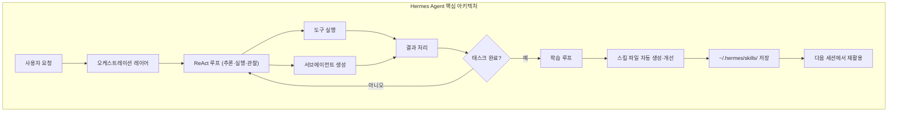
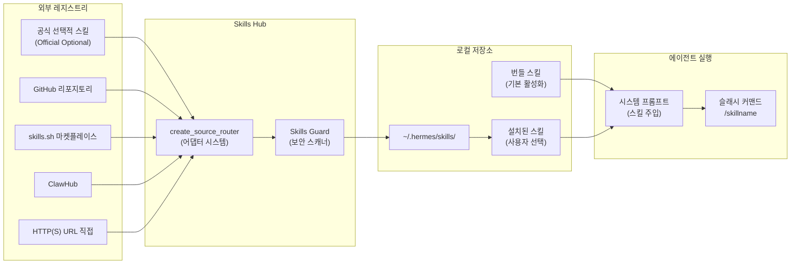
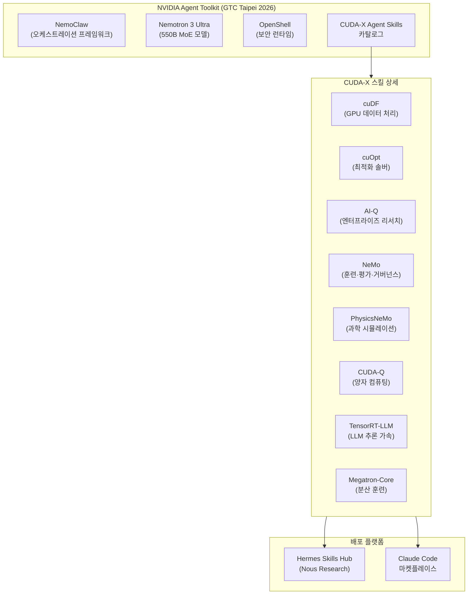
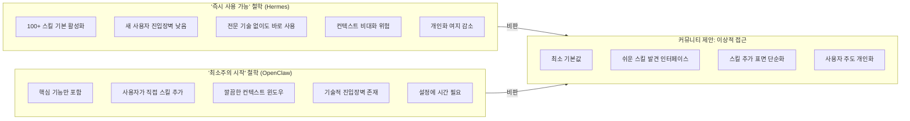
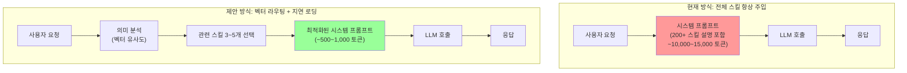
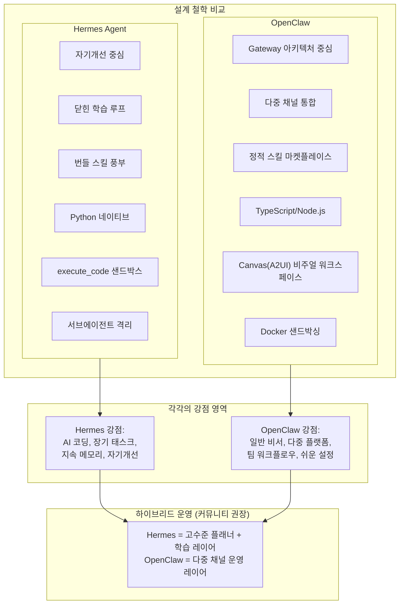

> **작성 기준**: 2026년 6월 3일 기준 최신 정보  
> **출처**: Nous Research 공식 문서, NVIDIA Blog, X(구 Twitter), GitHub Issue Tracker, SiliconANGLE, DEV Community 등

---

## 목차

1. [Hermes Agent란 무엇인가](#1-hermes-agent란-무엇인가)  
2. [Hermes Skills Hub 아키텍처 심층 이해](#2-hermes-skills-hub-아키텍처-심층-이해)  
3. [NVIDIA × Nous Research 협업: 엔터프라이즈 AI 스킬의 합류](#3-nvidia--nous-research-협업-엔터프라이즈-ai-스킬의-합류)  
4. [스킬 비대화 논란의 발화점: Theo의 비판](#4-스킬-비대화-논란의-발화점-theo의-비판)  
5. [Nous Research의 공식 반응과 설계 철학의 충돌](#5-nous-research의-공식-반응과-설계-철학의-충돌)  
6. [기술적 핵심 문제: 컨텍스트 윈도우 인플레이션](#6-기술적-핵심-문제-컨텍스트-윈도우-인플레이션)  
7. [커뮤니티의 실용적 대응: 스킬 최적화 방법](#7-커뮤니티의-실용적-대응-스킬-최적화-방법)  
8. [코딩 워크플로우 딜레마: Hermes 위임 vs 직접 연결](#8-코딩-워크플로우-딜레마-hermes-위임-vs-직접-연결)  
9. [에이전트 설계 철학의 분기: Hermes vs OpenClaw](#9-에이전트-설계-철학의-분기-hermes-vs-openclaw)  
10. [결론 및 시사점](#10-결론-및-시사점)

---

## 1. Hermes Agent란 무엇인가

Hermes Agent는 Nous Research가 2026년 2월에 공개한 오픈소스 AI 에이전트 프레임워크다. MIT 라이선스로 배포되었으며, 출시 3개월도 안 되는 시점에 GitHub에서 140,000개 이상의 Star를 기록했고, OpenRouter 기준으로 전 세계에서 가장 많이 사용되는 에이전트로 자리매김했다.

Hermes가 기존의 AI 에이전트 프레임워크와 가장 크게 구별되는 핵심 특성은 "자기개선(self-improvement)" 루프다. 대부분의 에이전트 프레임워크는 동일한 방식으로 반복 실행되는 정적인 실행 엔진에 불과하지만, Hermes는 에이전트가 복잡한 태스크를 성공적으로 수행하면 그 과정에서 학습한 내용을 재사용 가능한 Skill 파일로 자동 저장하고, 이를 다음 번에 유사한 태스크를 수행할 때 활용한다. Nous Research는 이것을 "닫힌 학습 루프(closed learning loop)"라고 부른다.

Nous Research는 Hermes 모델 패밀리, Nomos, Psyche 등 여러 고성능 AI 모델을 개발해온 AI 연구소다. 에이전트 프레임워크를 만든 조직이 동시에 그 에이전트를 구동하는 모델도 직접 훈련시킨다는 점에서, Hermes는 모델과 하네스(harness) 사이의 정렬(alignment)이 상당히 잘 이루어져 있다는 평가를 받는다.

Hermes의 핵심 기능을 정리하면 다음과 같다. 첫째, **자기진화형 스킬(Self-Evolving Skills)**: 에이전트가 복잡한 태스크를 수행하거나 피드백을 받을 때마다 학습 내용을 스킬로 저장하고 지속적으로 개선한다. 둘째, **격리된 서브에이전트(Contained Sub-Agents)**: 서브 태스크를 전담하는 단기 격리 워커를 생성하여 컨텍스트를 깔끔하게 유지하고, 로컬 모델에서도 작은 컨텍스트 윈도우로 동작할 수 있도록 설계되어 있다. 셋째, **설계에 의한 신뢰성(Reliability by Design)**: Nous Research가 직접 모든 스킬, 도구, 플러그인을 큐레이션하고 스트레스 테스트를 수행한다. 넷째, **동일 모델, 더 나은 결과**: 동일한 모델을 여러 프레임워크에서 실행한 개발자 비교 테스트에서 Hermes가 지속적으로 더 높은 성능을 보인다. 이는 Hermes가 단순한 얇은 래퍼가 아니라 능동적인 오케스트레이션 레이어이기 때문이다.

하드웨어 측면에서 Hermes는 NVIDIA RTX PC, NVIDIA RTX PRO 워크스테이션, NVIDIA DGX Spark에 최적화되어 있으며, Qwen 3.6 시리즈 모델(27B, 35B)을 로컬에서 실행할 때 특히 뛰어난 성능을 발휘한다.

---

## 2. Hermes Skills Hub 아키텍처 심층 이해

Hermes의 스킬 시스템을 이해하려면 먼저 "스킬"이 무엇인지를 명확히 해야 한다. Hermes에서 스킬이란 재사용 가능한 절차 기억(procedural memory)의 단위다. 각 스킬은 Markdown 형식의 `SKILL.md` 파일로 구성되어 있으며, 에이전트가 특정 태스크를 어떻게 수행해야 하는지에 대한 컨텍스트, 단계별 지침, 도구 사용법 등을 담고 있다. 스킬 파일이 에이전트의 시스템 프롬프트에 주입되면 에이전트는 해당 영역에서 훨씬 구체적이고 신뢰할 수 있는 방식으로 동작하게 된다.

Skills Hub는 이러한 스킬들을 발견하고 설치하는 사용자 중심의 디스커버리·관리 시스템이다. 공식 선택적 스킬(Official Optional Skills), GitHub 리포지토리, skills.sh 마켓플레이스, ClawHub 등 여러 레지스트리에 연결되며, `hermes skills` CLI 또는 `/skills` 슬래시 커맨드를 통해 관리한다.

Skills Hub의 설계 원칙 중 하나는 **사용자 독점 운영(User-Only Operation)** 이다. 에이전트 자신이 허브에서 스킬을 자율적으로 설치하거나 수정하거나 삭제하는 것은 불가능하다. 스킬의 설치와 관리는 오직 사용자만이 할 수 있다. 이는 외부 소스에서 들어오는 스킬이 악의적인 지시를 통해 에이전트의 능력을 확장하는 것을 방지하는 보안 설계다.

보안 측면에서, 외부 소스에서 설치되는 모든 스킬은 Skills Guard 스캐너를 통과해야 한다. 이 스캐너는 데이터 유출 패턴, 프롬프트 인젝션, 파괴적 명령, 서플라이 체인 공격 신호 등을 탐지한다. 공식(Official) 스킬은 빌트인 신뢰 수준이 적용되어 서드파티 경고 패널이 표시되지 않는다.

스킬에는 두 가지 주요 범주가 있다. **번들 스킬(Bundled Skills)** 은 Hermes Agent를 설치하면 자동으로 활성화되는 스킬들이다. 이것이 이번 논란의 핵심이다. **선택적 스킬(Optional Skills)** 은 기본적으로 비활성화되어 있으며, 사용자가 `hermes skills install official/<category>/<skill-name>` 명령으로 명시적으로 설치해야 한다.

설치된 스킬은 자동으로 슬래시 커맨드로 등록된다. 예를 들어 `excalidraw` 스킬을 설치하면 `/excalidraw` 커맨드로 즉시 사용할 수 있다.

스킬의 활성화 여부는 점진적 공개(progressive disclosure) 시스템을 통해 관리된다. 이 시스템은 현재 세션에서 사용 가능한 도구가 무엇인지에 따라 스킬을 자동으로 표시하거나 숨길 수도 있다. 예를 들어 특정 프리미엄 도구가 없을 때만 대안 스킬을 표시하도록 구성할 수 있다.

---

## 3. NVIDIA × Nous Research 협업: 엔터프라이즈 AI 스킬의 합류

2026년 6월 1일, Nous Research의 공식 X 계정은 NVIDIA와의 협업을 발표했다. NVIDIA의 공식 Agent Skills 카탈로그를 Hermes Skills Hub에 통합했다는 내용이다. 이 협업은 NVIDIA가 GTC Taipei 2026(Computex와 동시 개최)에서 공개한 "NVIDIA Agent Toolkit"의 일환으로 이루어졌다.

이번 통합으로 Hermes 에이전트는 다음과 같은 NVIDIA의 핵심 기술들을 활용하는 방법을 학습하게 되었다.

**CUDA-X 라이브러리 스킬들**: NVIDIA의 GPU 가속 라이브러리 생태계 전반을 에이전트가 다룰 수 있도록 한다. `cuDF` 스킬은 에이전트가 방대한 정형 데이터셋을 GPU 가속으로 처리하고 분석 결과를 추론할 수 있게 한다. `cuOpt` 스킬은 차량 경로 계획, 스케줄링, 공급망 관리, 자원 배분, 의사결정 최적화 등 복잡한 최적화 문제를 실시간으로 해결하는 능력을 에이전트에게 부여한다. `CUDA-Q` 스킬은 양자 프로그램을 생성·테스트·설치하고, 양자 컴퓨팅 시스템을 시뮬레이션하며, 양자 애플리케이션을 오케스트레이션하는 방법을 에이전트에게 가르친다.

**Omniverse 및 Physical AI 워크플로우 스킬**: `PhysicsNeMo` 스킬은 복잡한 과학·공학 시뮬레이션을 에이전트가 수행할 수 있도록 한다. `Cosmos 3`는 NVIDIA가 발표한 세계 최초의 오픈 Physical AI 옴니모델로, 실세계를 인식·이해·시뮬레이션하는 AI 에이전트 개발을 위한 토대를 제공한다.

**NeMo 훈련 및 추론 도구 스킬들**: `NeMo` 스킬은 에이전트 최적화, 평가, 거버넌스를 가속화한다. `NeMo-Evaluator` 스킬은 평가 실행, MLflow 결과 접근, 맞춤형 벤치마크 가져오기 등의 기능을 제공한다. `NeMo-Gym` 스킬은 RL(강화학습) 훈련 환경을 다루며, 벤치마크 추가, 리소스 서버 관리, 에이전트 배선, 보상 프로파일링 등을 지원한다.

**기타 플랫폼 컴포넌트 스킬들**: `AI-Q` 스킬은 엔터프라이즈 리서치 워크플로우를 위해 지능형 라우팅, 지속적 컨텍스트, 내장 평가 기능을 통합한다. `TensorRT-LLM` 스킬은 LLM 추론 가속화를 위한 도구들을 다룬다. `Megatron-Core` 스킬은 대규모 분산 훈련(모델 병렬화, 파이프라인 병렬화, 혼합 정밀도)을 지원한다.

NVIDIA의 GitHub 리포지토리(`NVIDIA/skills`)는 제품 리포지토리에서 매일 미러링되는 구조로 운영되며, 각 컴포넌트는 `components.d/` 디렉토리 내의 YAML 파일로 등록된다. 이는 공식적이고 구조화된 방식으로 에이전트 스킬을 배포하는 엔터프라이즈급 접근 방식을 보여준다.

같은 날 NVIDIA의 CUDA-X 에이전트 스킬들은 Hermes Skills Hub와 함께 **Claude Code 마켓플레이스**에서도 동시에 제공되기 시작했다. 이는 에이전트 스킬이 특정 에이전트 프레임워크에 종속되지 않고 `agentskills.io` 오픈 표준을 통해 여러 플랫폼 간에 이식 가능하다는 것을 보여주는 중요한 사례다.

---

## 4. 스킬 비대화 논란의 발화점: Theo의 비판

NVIDIA 스킬 통합 발표가 이루어진 것과 거의 같은 시기에, X에서는 Hermes Agent의 스킬 비대화 문제에 대한 격렬한 토론이 시작되었다. 이 논쟁을 촉발한 인물은 구독자 수십만 명을 보유한 테크 인플루언서 **Theo(t3.gg)** 다.

Theo는 자신의 X 계정에 다음과 같이 썼다. "Hermes Agent에는 정말 터무니없이 많은 스킬이 기본으로 활성화되어 있다. 100개가 넘는다. 이것은 그 절반 정도다. 그들이 무엇을 목표로 하는지는 이해한다. '즉시 사용 가능한 상태(ready out of the box)'의 에이전트를 원하는 것이다. 그런데 모든 사용자가 polymarket 스킬, baoyu 아트 스킬 3개(도대체 뭔지도 모르겠다), 헤드리스 Pokémon 스킬, 그리고 Minecraft 모드팩 서버 스킬을 처음 실행 시 모두 가져야 하는 이유를 모르겠다. Hermes Agent는 그냥 나를 위한 도구가 아닌 것 같다."

Theo의 비판이 의미 있는 이유는 단순히 개인적인 불편함을 토로한 것이 아니기 때문이다. 그는 소프트웨어 설계 철학의 문제를 정확히 짚었다. 100개 이상의 스킬이 기본 활성화된 에이전트는 다음과 같은 현실적인 문제를 만들어낸다.

첫째, 사용자 관련성 문제다. 암호화폐 예측 시장인 Polymarket의 스킬, 게임 서버 관리 스킬인 Minecraft 모드팩 스킬, 중국어 교육용 만화 생성 스킬인 baoyu 시리즈 스킬 등은 일반적인 개발자나 비즈니스 사용자에게는 전혀 관련이 없다. 스킬이 활성화되어 있다는 것은 에이전트가 항상 그 존재를 인식하고 있다는 의미다.

둘째, NVIDIA 스킬 추가로 인한 가속화다. 논란이 진행되는 바로 그 시점에 NVIDIA의 엔터프라이즈급 기술 스킬들이 대거 추가되었다. CUDA-X, NeMo, Megatron-Core 같은 고도로 전문화된 GPU 컴퓨팅 스킬이 Pokémon 플레이어 스킬과 같은 레지스트리에 나란히 존재하는 상황이 만들어진 것이다. 일반 사용자의 관점에서 이 두 스킬 모두 대부분의 사람에게는 필요 없는 것들이다.

셋째, 가시성과 제어의 문제다. 두 번째 첨부 자료에서 볼 수 있는 Hermes의 TUI(Terminal User Interface) 스킬 선택 화면은 스킬 목록이 얼마나 방대한지를 보여준다. `apple`, `autonomous-ai-agents`, `creative`, `data-science`, `devops`, `email`, `gaming`, `github` 등 다양한 카테고리에 걸쳐 수십 개의 스킬이 체크박스 형태로 나열되어 있다. TUI에 익숙하지 않은 사용자에게 이 목록은 압도적으로 느껴질 수 있다.

Threads의 @roach_log 사용자도 이 논란에 대해 자신의 입장을 밝혔다. 그도 Hermes를 좋아하지만, 왜 모든 사용자가 Polymarket이나 NVIDIA 관련 스킬을 기본으로 가져야 하는지 이해하지 못하겠다고 했다. 특히 스킬이 지속적으로 추가된다는 점, 즉 새로운 기업과의 파트너십이 생길 때마다 모든 사용자의 에이전트에 새 스킬이 자동으로 들어온다는 사실이 문제라고 지적했다.

커뮤니티 내에서도 의견이 나뉘었다. 한편에서는 스킬셋이 많다는 것이 Hermes의 장점이라 생각했던 사람들조차 "너무 과도하게 많은 건 단점"이라고 인정했다. 다른 한편에서는 오픈소스 프로젝트는 "기본에 충실한 컴팩트한" 구조가 바람직하다는 의견을 내놓았다. 에이전트는 개인화할수록 더 빛을 발하는데, 불필요한 스킬이 처음부터 많이 달려있으면 개인화의 여지가 줄어들고 복잡도만 높아진다는 논리다.

---

## 5. Nous Research의 공식 반응과 설계 철학의 충돌

Theo의 비판에 대해 Nous Research 측에서는 공식 반응이 나왔다. 그 핵심은 다음과 같다. "당신에게는 의미 없는 것들일 수 있다. 우리는 Hermes를 당신만을 위해 만들지 않았다. 모든 것이 비어있는 '영혼 없는 경험'을 원한다면, '즉시 사용 가능한 상태'가 전혀 준비되지 않은 openclaw를 써라."

이 응답은 설계 철학의 근본적인 충돌을 드러낸다. Nous Research는 계속해서 이렇게 설명했다. "우리는 Hermes Agent를 '아무것도 없이 시작해서 스스로 모든 것을 만들어내는' 에이전트로 만들지 않았다. 이것은 nanoclaw나 pi처럼 아무것도 없이 시작해서 사용자가 스스로 알아내야 하는 최소주의(minimalist) 에이전트가 아니다. 우리는 Hermes가 대부분의 사람에게 즉시 작동하기를 원한다. 그래서 사용자가 에이전트가 작동하게 만들거나 필요한 기능을 갖추게 하는 데 몇 주를 소비하지 않도록 하고 싶다. 이는 의도적인 설계 결정이다. 당신이 필요 이상으로 넓지만 과도하지는 않은 적당한 기준선에서 시작해서, 원하는 대로 조정할 수 있다. 비활성화하고 싶은 것이 있다면 `hermes skills config` 또는 `hermes tools`를 실행하면 된다."

이 응답의 핵심 논점은 **타깃 사용자층의 차이**다. Theo처럼 깊은 기술적 이해를 가진 개발자는 최소한의 것만 주고 스스로 확장해나가는 방식을 선호한다. 반면 AI 에이전트를 처음 접하거나 설정에 많은 시간을 투자하기 어려운 사용자는 처음부터 많은 것이 갖추어져 있는 쪽을 선호한다.

Nous Research의 반응에서 흥미로운 점은 openclaw를 "empty soulless experience"라고 표현한 부분이다. 이는 두 프레임워크 사이의 철학적 경쟁이 단순한 기능 비교를 넘어 에이전트의 정체성과 목적에 대한 깊은 질문으로 이어지고 있음을 보여준다.

그러나 커뮤니티 내의 더 신중한 목소리는 양쪽 모두에서 문제를 찾는다. "차라리 스킬 적용·생성 표면을 쉽게 열어주는 것이 더 좋은 방향"이라는 의견이 나왔다. 즉, 기본으로 활성화된 스킬을 많이 주는 것도, 아무것도 주지 않는 것도 아니라 사용자가 쉽게 자신에게 맞는 스킬을 발견하고 추가할 수 있는 인터페이스를 제공하는 것이 더 나은 해결책이라는 시각이다.

---

## 6. 기술적 핵심 문제: 컨텍스트 윈도우 인플레이션

단순한 UX 불편함을 넘어, 스킬 비대화는 심각한 기술적 문제를 야기한다. GitHub의 Hermes Agent 리포지토리에는 이와 관련한 Feature Request 이슈(#22620)가 등록되어 있으며, 그 내용은 다음과 같다.

"현재 스킬 시스템은 모든 설치된 스킬의 이름, 카테고리, 설명을 매 턴마다 시스템 프롬프트에 주입한다. 기본 Skills Hub를 사용하면 사용자는 쉽게 200개 이상의 스킬을 쌓을 수 있으며, 이는 매번의 단일 LLM 호출에 약 10,000~15,000개의 토큰을 추가한다."

이것이 왜 심각한 문제인가를 이해하려면 LLM의 작동 방식을 알아야 한다. 에이전트가 사용자의 질문에 응답하기 위해 LLM을 호출할 때마다, 해당 호출에는 시스템 프롬프트가 포함된다. 시스템 프롬프트에 스킬 목록이 포함되어 있다면, 사용자가 "오늘 날씨는?"이라고 물어보든 "이 코드를 리뷰해줘"라고 요청하든, 매번 수백 개의 스킬 설명이 컨텍스트에 실려 전송된다. 이는 다음과 같은 연쇄 문제를 낳는다.

**비용 증가**: 토큰 수에 비례하는 API 비용이 매 호출마다 10,000~15,000 토큰씩 추가된다는 것은, 활성화된 스킬이 많을수록 에이전트 운영 비용이 선형적으로 증가한다는 의미다.

**지연 증가**: 더 많은 토큰을 처리해야 하므로 응답 시간이 길어진다. 특히 로컬 모델로 Hermes를 실행하는 경우, 이 오버헤드는 체감 성능 저하로 직결된다.

**집중력 분산**: LLM은 컨텍스트 윈도우의 모든 내용에 어느 정도 주의를 기울인다. 관련 없는 수백 개의 스킬 설명이 컨텍스트에 있다면, 모델의 "주의(attention)"가 분산되어 실제 태스크 수행 품질이 저하될 수 있다.

**컨텍스트 한도 소진**: 대화가 길어질수록 컨텍스트 윈도우의 한도에 빠르게 도달하게 된다. 스킬 설명만으로 10,000~15,000 토큰을 소비하면, 실제 대화 내용이나 태스크 관련 정보를 담을 수 있는 공간이 그만큼 줄어든다.

이슈를 제기한 사용자는 해결책으로 **벡터 기반 스킬 라우팅(vector-based skill routing)** 또는 **지연 로딩(lazy loading)** 방식을 제안했다. 즉, 사용자의 요청을 먼저 분석하고, 해당 요청과 의미적으로 유사한 스킬만 선택적으로 시스템 프롬프트에 주입하는 방식이다. 이는 현재의 "모든 스킬 항상 주입" 방식에서 "필요한 스킬만 동적 주입"으로의 전환을 의미한다.

실제로 Composio 같은 서드파티 서비스는 이미 이 문제에 대한 우회 해결책을 제공하고 있다. Composio의 MCP 라우트를 활용하면 `https://connect.composio.dev/mcp`를 Hermes 설정에 등록하고, Tool Router가 태스크에 필요한 도구만 동적으로 로드하도록 할 수 있다. 이를 통해 200개 도구 분량의 컨텍스트 비대화를 방지할 수 있다.

---

## 7. 커뮤니티의 실용적 대응: 스킬 최적화 방법

논란이 커지면서 Hermes 사용자들은 자신들의 경험을 공유하며 실용적인 해결책을 제시하기 시작했다. @roach_log의 Threads 게시물은 가장 널리 퍼진 가이드 중 하나였다.

**방법 1: hermes dashboard를 통한 웹 기반 관리**

TUI(Terminal User Interface)에 익숙하지 않은 사용자들을 위해 권장하는 방법이다. 터미널에서 `hermes dashboard`를 입력하면 웹 페이지가 열리며, 그 안의 SKILLS 메뉴에서 활성화된 모든 스킬을 시각적으로 확인하고 켜거나 끌 수 있다. @roach_log는 "눈에 보이는 모든 스킬들을 꺼버리고, 실제로 사용하는 것만 켜두라"고 권장했다.

**방법 2: CLI를 통한 직접 관리**

Nous Research 공식 문서에 따르면, `hermes skills config` 또는 `hermes tools` 명령을 실행하면 설치된 스킬과 도구를 관리하는 인터페이스에 접근할 수 있다. 특정 스킬을 비활성화하거나, 필요한 스킬만 선택적으로 활성화할 수 있다.

**방법 3: 공식 선택적 스킬만 설치**

처음 Hermes를 설치하는 사용자라면, 기본으로 활성화된 번들 스킬들을 검토하고 불필요한 것들을 먼저 비활성화한 뒤, 공식 선택적 스킬 카탈로그(`hermes skills browse`)를 통해 자신에게 필요한 스킬만 추가하는 방식을 권장한다. NVIDIA 스킬의 경우, GPU 컴퓨팅 작업을 실제로 수행하는 개발자나 연구자에게만 유용하므로 대부분의 일반 사용자는 설치할 필요가 없다.

다음은 카테고리별로 어떤 스킬이 실제로 대부분의 사용자에게 유용한지를 정리한 것이다.

| 카테고리 | 대부분의 사용자에게 유용한 스킬 | 특정 사용자에게만 유용한 스킬 |
|---|---|---|
| `autonomous-ai-agents` | claude-code, hermes-agent | kanban-codex-lane (칸반 워커 전용) |
| `creative` | excalidraw, claude-design | baoyu-* 시리즈, ascii-video, manim-video |
| `devops` | kanban-orchestrator, kanban-worker | webhook-subscriptions |
| `gaming` | — | minecraft-modpack-server, pokemon-player |
| `github` | github-auth, github-code-review, codebase-inspection | — |
| `data-science` | jupyter-live-kernel | — |

NVIDIA 스킬은 별도 카테고리로 간주해야 하며, CUDA 프로그래밍, NeMo 훈련, 양자 컴퓨팅 등 해당 기술 스택을 실제로 다루는 전문가가 아니라면 활성화할 이유가 없다.

---

## 8. 코딩 워크플로우 딜레마: Hermes 위임 vs 직접 연결

이번 논란과 함께 커뮤니티에서는 또 다른 중요한 실용적 질문이 제기되었다. Hermes를 이미 사용 중인 사람들이 코딩 태스크를 어떻게 처리해야 하는가에 대한 질문이다.

Threads의 한 사용자는 이렇게 물었다. "헤르메스로 코딩까지 맡기시나요? 저는 비서실장 설정이 완료되어가는데 코딩은 따로 SSH 연결 같은 걸 해서 써야 할지, 아니면 그마저도 헤르메스한테 위임하는 2hop으로 가야 할지 고민이 됩니다. 직접 컨트롤이 효율적일 것 같으면서도 차라리 에이전트가 나보다 지시를 더 잘 내릴 것 같기도 하고..."

이에 대한 @roach_log의 답변이 커뮤니티에서 많은 공감을 받았다. "저는 헤르메스한테 보통 시킵니다. 너무 큰 프로젝트면 Codex에 직접 연결하기도 하는데, 보통 헤르메스에게 시켜도 잘 해주더라고요."

이 질문의 핵심은 에이전트 위임(delegation)의 계층화에 관한 것이다. Hermes를 통해 Claude Code CLI나 OpenAI Codex CLI에 작업을 위임하는 방식(2-hop)을 취할 경우, Hermes가 단순히 사용자의 요청을 코딩 에이전트에게 전달하는 중간 계층이 된다. 반면 직접 연결(1-hop)의 경우 사용자가 직접 코딩 에이전트와 소통한다.

Hermes의 번들 스킬 목록에서 볼 수 있듯이, `claude-code` 스킬과 `codex` 스킬은 모두 `autonomous-ai-agents` 카테고리에 기본 활성화(체크박스에 체크 표시)되어 있다. 이는 Hermes가 Claude Code CLI와 OpenAI Codex CLI를 서브에이전트로 활용하는 것을 공식적으로 지원하고 있음을 의미한다. `claude-code` 스킬은 "Claude Code CLI를 통해 코딩을 위임(features, PRs)"하는 역할을, `codex` 스킬은 "OpenAI Codex CLI를 통해 코딩을 위임(features, PRs)"하는 역할을 한다.

2-hop 방식의 장점은 Hermes가 더 높은 수준의 계획과 조율을 담당하면서, 실제 코드 실행은 특화된 코딩 에이전트에게 맡길 수 있다는 것이다. Hermes의 자기개선 루프가 코딩 워크플로우에도 적용되어, 반복적인 패턴을 스킬로 저장하고 개선할 수 있다. 단점은 중간 계층이 추가되므로 지연이 발생할 수 있고, 컨텍스트 전달 과정에서 정보 손실이 생길 수 있다는 것이다.

실용적인 조언으로는 소규모·반복적 코딩 태스크는 Hermes에게 위임하고, 대규모 복잡한 프로젝트는 직접 Claude Code나 Codex에 연결하는 하이브리드 전략이 합리적이다. 프로젝트의 범위와 복잡도가 Hermes 서브에이전트 한 번의 컨텍스트 내에서 처리 가능한지 여부가 기준이 될 수 있다.

---

## 9. 에이전트 설계 철학의 분기: Hermes vs OpenClaw

Hermes의 스킬 비대화 논란은 더 넓은 맥락인 **AI 에이전트 설계 철학의 분기**라는 큰 그림 안에서 이해해야 한다. 현재 오픈소스 AI 에이전트 생태계에서 가장 많이 비교되는 두 프레임워크는 Hermes Agent와 OpenClaw다.

OpenClaw는 수십만 개의 GitHub Stars를 보유한 오픈소스 개인 AI 에이전트 프레임워크로, TypeScript/Node.js로 작성되었다. 중앙 집중식 Gateway 아키텍처를 중심으로, LLM과 다양한 채팅 앱(WhatsApp, Telegram, Slack, Signal, Discord, iMessage 등 22개 이상의 플랫폼) 사이의 메시지를 라우팅하고, 이메일 관리, 브라우저 자동화, 쉘 커맨드, cron 작업 등 실세계 작업을 실행한다. ClawHub 스킬 마켓플레이스와 5,700개 이상의 커뮤니티 스킬을 보유하고 있다. OpenClaw의 스킬은 사용자가 작성하고 유지관리하는 정적 파일이다.

Hermes Agent는 Python으로 작성되었으며, 오케스트레이션의 중심에 에이전트 자신의 실행 루프와 자기개선 능력을 놓는다. OpenClaw가 다중 채널 통합과 생태계 깊이에 강점을 두는 반면, Hermes는 학습 레이어, 지속 메모리, 자동 생성 스킬, 모델 추론, 장기 지평 태스크에 강점을 두고 있다.

커뮤니티의 공통된 시각은 두 도구가 경쟁 관계가 아니라 보완적 관계라는 것이다. 실제로 많은 고급 사용자들이 OpenClaw를 다중 채널 운영 및 팀 워크플로우에 활용하면서, Hermes를 그 위의 고수준 플래너이자 학습 레이어로 함께 사용하는 전략을 취하고 있다.

두 프레임워크가 공통으로 따르고 있는 오픈 표준이 있다는 점은 중요하다. `agentskills.io` 오픈 표준 덕분에 스킬은 특정 프레임워크에 종속되지 않고 포터블하게 작성될 수 있다. NVIDIA의 CUDA-X 스킬이 Hermes Skills Hub와 Claude Code 마켓플레이스 양쪽에서 동시에 제공되는 것이 그 증거다. 이는 장기적으로 에이전트 생태계가 하나의 프레임워크에 종속되는 것이 아니라 공유 스킬 생태계를 중심으로 수렴할 수 있다는 가능성을 보여준다.

---

## 10. 결론 및 시사점

이번 논란은 AI 에이전트가 빠르게 실용화 단계로 진입하면서 맞닥뜨리는 핵심 설계 딜레마를 압축적으로 보여준다. 도달 가능성(accessibility)과 정밀성(precision) 사이의 긴장이 그것이다.

Nous Research가 100개 이상의 스킬을 기본 활성화한 것은 "더 많은 사용자가 에이전트를 포기하지 않고 즉시 가치를 경험하게 하겠다"는 분명한 의도를 가진 설계 결정이다. 반면 Theo의 비판은 "기본값이 과도하면 고급 사용자가 이탈하고, 성능도 저하된다"는 실질적인 우려를 담고 있다.

기술적 사실만 놓고 보면 비판이 타당한 부분이 있다. 200개 이상의 스킬이 활성화되면 매 LLM 호출마다 10,000~15,000 토큰의 오버헤드가 발생하며, 이는 비용·지연·성능 모두에 부정적인 영향을 미친다. 이는 단순한 UX 취향의 문제가 아니라 시스템 효율성의 문제다.

그러나 Nous Research의 반응도 완전히 틀린 것은 아니다. AI 에이전트를 처음 접하는 대부분의 사용자에게 "아무것도 없이 시작해서 모든 것을 스스로 구성하라"는 요구는 실질적인 진입장벽이 된다. 오픈소스 AI 에이전트가 전문 개발자의 전유물이 아니라 일반 사용자에게도 접근 가능하게 되려면 어느 정도의 기본값이 필요하다.

커뮤니티가 수렴하는 이상적인 방향은 "선택적이고 인텔리전트한 온보딩"이다. 사용자의 사용 목적을 처음에 간략히 파악하고, 그에 맞는 스킬 프리셋을 제안하되 불필요한 스킬을 기본 활성화하지 않는 방식이다. 또는 벡터 기반 스킬 라우팅을 통해 스킬이 많이 설치되어 있더라도 컨텍스트 오버헤드를 최소화하는 기술적 해결책도 검토되고 있다.

NVIDIA의 엔터프라이즈 AI 스킬이 Hermes Skills Hub에 합류한 것은 그 자체로 에이전트 생태계의 성숙을 보여주는 중요한 신호다. CUDA-X, NeMo, Omniverse 같은 전문 기술 스킬이 에이전트를 통해 접근 가능해진다는 것은, AI 에이전트가 단순한 챗봇의 업그레이드가 아니라 전문 기술 워크플로우를 자동화하는 도구로 진화하고 있음을 의미한다. 단, 그 스킬들이 실제로 필요한 사람의 에이전트에서만 활성화되도록 하는 세밀한 제어 메커니즘이 함께 성숙해야 할 것이다.

Hermes를 사용하는 사람이라면 당장의 실용적 조언은 명확하다. `hermes dashboard`를 열고 SKILLS 메뉴에서 현재 사용하지 않는 모든 스킬을 비활성화하라. Pokémon 플레이어 스킬, Minecraft 모드팩 스킬, Polymarket 스킬, NVIDIA CUDA 스킬(GPU 작업을 하지 않는 경우) 등은 대부분의 사용자에게 불필요하다. 에이전트는 덧붙이는 것보다 덜어내는 것으로 더 강해질 수 있다.

---

## 참고 자료

- Nous Research 공식 Hermes Agent 문서: https://hermes-agent.nousresearch.com/docs/
- NVIDIA Blog - Hermes Agent on DGX Spark: https://blogs.nvidia.com/blog/rtx-ai-garage-hermes-agent-dgx-spark/
- NVIDIA GitHub Skills 리포지토리: https://github.com/nvidia/skills/
- SiliconANGLE - NVIDIA Agent Toolkit 분석: https://siliconangle.com/2026/06/01/nvidia-gives-developers-tool-build-secure-autonomous-ai-workers-scale/
- Theo(t3.gg) X 게시물: https://x.com/theo/status/2061019720552525963
- Nous Research X 공식 발표: https://x.com/NousResearch/status/2061572272993751364
- Hermes Agent GitHub Issue #22620 (컨텍스트 인플레이션): https://github.com/NousResearch/hermes-agent/issues/22620
- DeepWiki Hermes Skills Hub 분석: https://deepwiki.com/NousResearch/hermes-agent/8.2-skills-hub
- Threads @roach_log 게시물: https://www.threads.com/@roach_log/post/DZEFS4FAW7T

---

*작성 일자: 2026-06-03*
