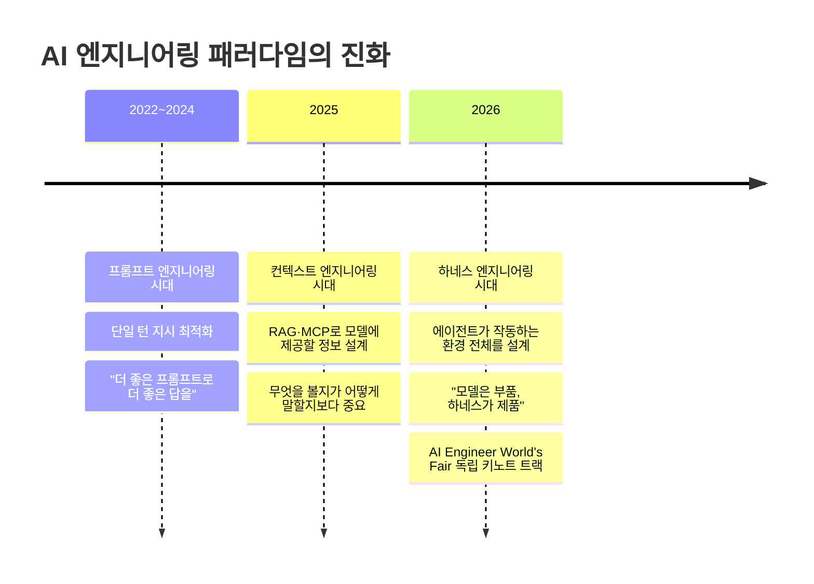
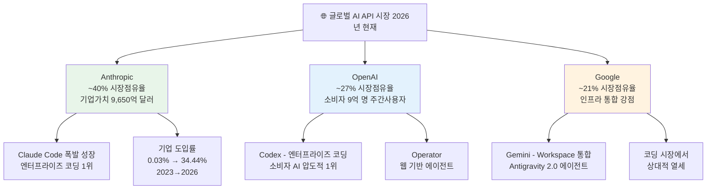
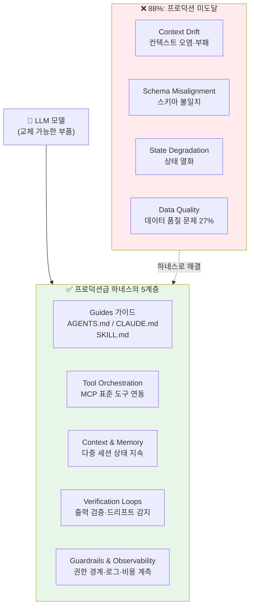
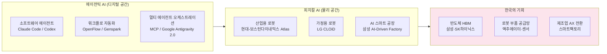
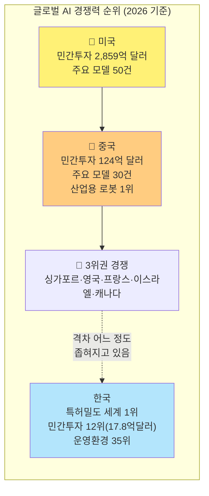
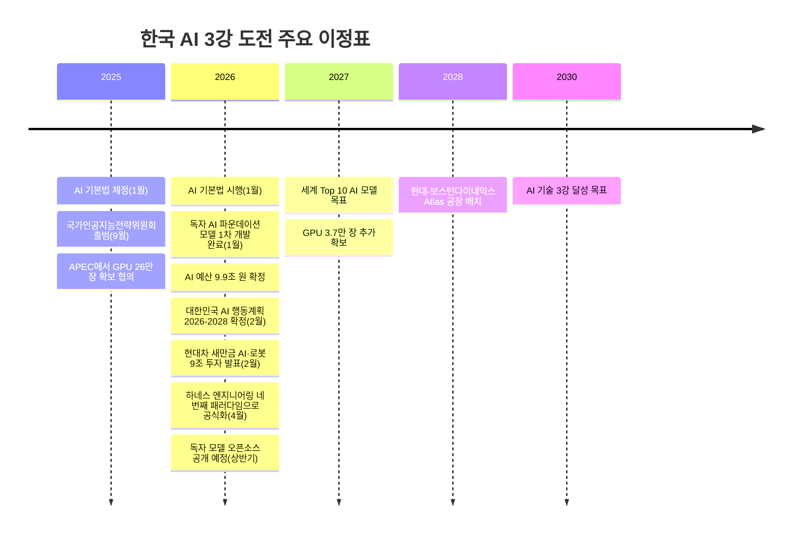

## 기사가 1년 전처럼 느껴지는 이유, 그리고 'AI 3강'의 현실적 의미

> **원문 기사**: [류정혜 국가인공지능전략위원회 위원, ‘한국 AI 3강 정책과 미래’ 발표](https://www.irobotnews.com/news/articleView.html?idxno=46533), 조규남 전문기자, 아이로봇뉴스, 2026.05.22  
> **포럼**: 코리아씨이오서밋 5월 포럼 (서울 강남 리버사이드호텔)  
> **발표자**: 류정혜 국가인공지능전략위원회 위원  
> **작성일**: 2026-06-02

---

## 1. 기사를 읽는 첫 인상 — 왜 1년 전 기사처럼 느껴지는가

"1년 전 기사인 줄 알았다"는 반응은 단순한 인상이 아니라 꽤 정밀한 직관이다. 2026년 5월 22일 작성된 기사임에도 불구하고, 강연이 제시하는 핵심 메시지들 — "AI가 대화의 시대에서 행동의 시대로", "에이전틱 AI의 부상", "앤트로픽의 급성장", "피지컬 AI와 휴머노이드" — 은 이미 2024년 말에서 2025년 초부터 업계에서 활발히 논의되어 온 주제들이다.

### 1-1. 주장별로 '시간표'를 따져보면

각 주장이 업계에서 실질적으로 합의된 시점을 추적하면 격차가 분명해진다.

| 강연의 주장 | 업계 합의 시점 | 2026년 5월 기준 상태 |
|---|---|---|
| "AI가 행동하는 시대로 진입" | 2025년 초 | 이미 완성된 현실 |
| "에이전틱 AI 본격화" | 2025년 중반 | 생산 배포 단계 |
| "앤트로픽이 빠르게 부상" | 2025년 하반기 | 역전 완료, OpenAI 추월 |
| "구글 I/O 이후 판도 변화" | 2025년 5~6월 | 이미 다음 라운드로 진입 |
| "피지컬 AI와 로봇 연결" | 2025년 말 | CES 2026에서 실물 공개 완료 |

이 격차가 만들어지는 구조적 이유는 하나다. AI 산업의 변화 속도가 너무 빠른 탓에, CEO 대상 포럼에서 설명할 만한 '정제된 이해'가 실제 산업 최전선에서 실현된 시점과 최소 6~12개월의 시차를 보인다. 이를 **정보 전달의 시차(Information Lag)** 라고 부를 수 있다.

### 1-2. 가장 결정적인 공백 — 하네스 엔지니어링

그러나 단순한 시차보다 더 근본적인 문제가 있다. 기사는 2026년에 일어나고 있는 가장 중요한 메타 수준의 변화를 완전히 누락하고 있다는 점이다. 그것은 바로 **하네스 엔지니어링(Harness Engineering)의 등장**이다.

기사는 Claude Code, OpenFlow, Genspark Flow를 에이전틱 AI의 사례로 언급하면서, 이것들을 단순히 "행동하는 AI"의 예시로만 소개한다. 그러나 2026년 AI 엔지니어링 커뮤니티의 관점에서 이 제품들의 진짜 의미는 완전히 다르다. 이것들은 **에이전트 하네스(Agent Harness) 제품들**이다. 즉, 모델이 실제 세계에서 작동하도록 감싸는 제어 계층의 사례다.

이 관점이 없으면 기사는 자동차의 마력(馬力)만 이야기하고 조향장치와 브레이크 시스템은 언급하지 않는 것과 같다. 에이전틱 AI가 "행동의 시대"가 된 것은 모델이 강력해졌기 때문만이 아니라, 그 모델을 프로덕션 환경에서 안정적으로 작동하게 만드는 하네스 계층이 성숙했기 때문이다. 이 구분이 빠진 채 에이전틱 AI를 설명하면, 2025년 수준의 이해에서 멈춰있는 것이다.

---

## 2. 강연 발표자와 배경: 국가인공지능전략위원회

류정혜 위원이 소속된 **국가인공지능전략위원회**는 이재명 대통령이 위원장을 직접 맡은 최고위급 AI 거버넌스 기구다. 2025년 9월 제1차 전체회의를 시작으로, 2026년 2월에는 **'대한민국 인공지능행동계획'**(인공지능 기본계획 2026~2028)을 심의·의결했다. 이 계획은 AI기본법 제6조에 따른 법정계획으로, 99개 실행과제와 326개 정책권고로 구성된 종합 로드맵이다.

위원회 출범의 제도적 토대가 된 **인공지능 기본법**은 2025년 1월 21일 제정되어 2026년 1월 22일 본격 시행됐다. 이 법은 AI를 개별 산업이 아니라 국가 핵심 인프라로 규정하는 획기적인 의미를 지닌다. 류 위원은 산업생태계 분과에서 활동하며 AI 스타트업 생태계와 정책 분야를 담당하고 있다.

---

## 3. 글로벌 AI 패권 경쟁 현황: 기사 속 주장과 2026년 현실

### 3-1. "2025년 이후 구글이 제미나이로 반격에 성공했다"?

기사는 2025년 이후 구글 I/O를 계기로 시장 판도가 바뀌었다고 설명한다. 이는 사실에 가깝지만, 2026년 6월 현재 기준으로 보면 그림이 더 복잡하다. 구글은 생태계 인프라(Gmail, Drive, Workspace 등)와의 통합으로 소비자 시장에서 강세를 유지하고 있으나, 정작 2026년 AI 경쟁의 핵심 전장으로 부상한 **기업용 코딩 및 에이전트 시장**에서는 상대적으로 뒤처져 있다는 평가가 지배적이다.

2026년 5월 구글은 개발자 컨퍼런스에서 여러 에이전트가 병렬로 작업을 수행하는 **'Antigravity 2.0'** 을 발표하며 에이전틱 AI 시장 진입을 본격화했다. 그러나 업계에서는 이미 Anthropic과 OpenAI가 수십 개월의 선행 학습 데이터와 실 사용 피드백을 축적한 상태라 구글이 격차를 좁히기 쉽지 않다고 본다. 무엇보다 2026년 AI 채택의 핵심 벡터가 된 **코딩 기반 에이전트 시장**에서 구글은 두드러지는 제품을 갖추지 못하고 있다는 점이 치명적 약점으로 지목된다.

### 3-2. "앤트로픽이 최근 가장 빠르게 부상하고 있다"?

이 주장은 기사가 다루는 내용 중 가장 현재성이 높은 부분이면서 동시에 이미 업계의 상식이 된 부분이기도 하다. 수치로 확인해 보면 그 성장 속도가 얼마나 극적인지 드러난다.

미국의 지출 데이터 분석 플랫폼 **Ramp**가 추적한 기업 AI 도입 지표에 따르면, Anthropic은 2023년 6월 기준 기업 도입률 0.03%에서 2025년 4월 7.94%, 그리고 2026년 4월에는 무려 **34.44%** 까지 폭발적으로 성장했다. 반면 OpenAI는 2025년 중반 약 36.5%로 정점을 찍은 뒤 서서히 하락세를 보이며 2026년 현재 역전된 상태다.

Brookings Institution이 2026년 3월 발표한 분석에서는 AI API 시장에서 **Anthropic이 약 40% 시장점유율을 차지하고 OpenAI 27%, Google 21%** 순으로 재편되었다고 평가했다. 이 성장의 핵심 동력은 **Claude Code**라는 단일 제품이다. Claude Code는 2025년 2월 출시 이후 빠르게 성장하여 2026년 현재 전 세계 GitHub 공개 커밋의 약 4%가 Claude Code에 의해 작성된 것으로 추정된다. Anthropic의 Boris Cherny 개발자는 2026년 1월 "Anthropic 자체 코드의 사실상 100%가 Claude Code로 작성된다"고 밝혔을 정도다.

기업가치 측면에서도 Anthropic은 2026년 5월 시리즈 H에서 650억 달러를 조달하며 기업가치 **9,650억 달러**로 평가받아, OpenAI를 제치고 전 세계에서 가장 가치 있는 AI 기업에 올랐다. "앤트로픽이 빠르게 부상하고 있다"는 기사의 표현은 이미 과거형으로 기록되어야 한다 — 부상이 아니라 정상 등극이 완료된 상황이다.

### 3-3. 경쟁 구도 요약

---

## 4. 에이전틱 AI: "행동하는 AI"는 이미 현실 — 그리고 그 너머

기사는 "AI가 대화의 시대를 넘어 행동의 시대로 진입했다"고 설명하며, Claude Code, OpenFlow, Genspark Flow 등을 사례로 든다. 이 진단 자체는 정확하다. 그러나 강연 시점인 2026년 5월 기준으로는 이 문장이 **미래 예측이 아닌 이미 완성된 현재**를 묘사하는 것에 가깝다. 더 중요한 것은, 에이전틱 AI가 '행동'하게 만드는 진짜 메커니즘에 대한 설명이 빠져있다는 점이다.

### 4-1. 에이전틱 AI의 현재

에이전틱 AI의 핵심 특성은 단순 텍스트 생성이 아닌 **자율적 행동 수행**에 있다. 사용자가 "여행 계획 짜줘"라고 말하면 항공권 검색, 호텔 예약, 결제까지 독립적으로 처리하고, 물류 현장에서는 재고 부족을 감지해 자동으로 발주를 넣고 배송 경로를 최적화한다. 마케팅 영역에서는 "다음 주 캠페인 실행해"라는 한 마디면 이메일 발송부터 SNS 광고 집행, 성과 분석까지 자동으로 처리된다. 개발 영역에서는 시스템 장애가 발생하면 AI가 코드 오류를 진단하고 수정하며, 서버 재부팅까지 수행해 스스로 복구하는 단계까지 왔다.

이러한 에이전틱 AI는 기술적으로 **MCP(Model Context Protocol)** 와 같은 표준 연동 규격을 통해 외부 서비스 및 데이터와 연결되며, 멀티 에이전트 오케스트레이션을 통해 여러 전문 에이전트가 병렬로 협력하는 방식으로 운영된다.

### 4-2. 하네스 엔지니어링: 기사가 완전히 놓친 2026년의 진짜 혁명

그러나 여기서 결정적인 질문 하나가 빠져있다. **에이전트가 실제로 프로덕션에서 작동하게 만드는 것은 무엇인가?**

답은 모델이 아니다. 바로 **하네스(Harness)** 다.

2026년은 AI 엔지니어링 커뮤니티에서 '하네스 엔지니어링(Harness Engineering)'이 네 번째 패러다임으로 공식 선언된 해다. 프롬프트 엔지니어링이 단일 턴의 지시를 최적화하는 것이었고, 컨텍스트 엔지니어링이 모델에게 제공할 정보를 설계하는 것이었다면, 하네스 엔지니어링은 **에이전트가 작동하는 환경 전체를 설계하는 것**이다.

2026년 4월 AI Engineer World's Fair에서 세 명의 독립적인 연사가 에이전트 하네스와 컨텍스트 엔지니어링을 1순위 과제로 꼽았다. 같은 달 이 개념은 독립적인 arXiv 논문으로도 공식화됐다. 2026년 6월 말 샌프란시스코에서 열리는 AI Engineer World's Fair 2026(6월 29일~7월 2일)에는 **하네스 엔지니어링 키노트**가 독립 트랙으로 편성되어 있다. 컨퍼런스 편제 자체가 이 분야의 독립성을 공식 인증한 것이다.

### 4-3. 핵심 공식: Agent = Model + Harness

Mitchell Hashimoto가 2026년 공식화한 이 공식은 2026년 AI 엔지니어링의 정수를 담고 있다. 모델은 무엇이든 될 수 있는 강력하지만 방향 없는 '말(horse)'이다. 하네스는 그 말이 올바른 방향으로 달리도록 채널링하는 '마구(馬具)' 전체다. 말이 아무리 빠르고 강해도 마구가 없으면 전장에서 쓸 수 없다.

이 관점에서 보면 기사가 언급한 Claude Code, OpenFlow, Genspark Flow는 단순한 '행동하는 AI의 사례'가 아니다. 이것들은 모두 **하네스 제품**이다. Claude Code는 모델(Claude Opus)을 감싸는 하네스이고, OpenFlow와 Genspark Flow는 여러 모델을 엮는 워크플로 하네스다. 이 구분이 없으면 "AI가 행동한다"는 현상은 설명되지만, "AI가 안정적으로 프로덕션에서 행동하게 만드는 것은 무엇인가"라는 더 중요한 질문은 남겨진다.

### 4-4. 88%라는 숫자가 모든 것을 말한다

현재 업계 데이터는 충격적이다. **AI 에이전트 프로젝트의 88%가 프로덕션 배포에 도달하지 못한다.** 이 수치는 모델이 더 강력해진다고 해서 개선되지 않았다. 병목은 모델 성능이 아니었다. 프로덕션급 하네스의 부재였다.

실패 원인을 분석하면 더 구체적이다. 기업 AI 프로젝트 실패의 65%는 하네스 결함 — 특히 **Context Drift(컨텍스트 오염)**, **Schema Misalignment(스키마 불일치)**, **State Degradation(상태 열화)** — 에서 발생한다. 나머지 27%는 하네스 아키텍처도 아닌 데이터 품질 문제다. 모델 성능 자체가 실패 원인인 경우는 소수에 불과하다. 모델을 최적화해도 하네스가 불안정하면 수확 체감만 반복된다는 뜻이다.

OpenAI의 실험이 이를 가장 극적으로 증명했다. 2026년 2월 Frontier Product Exploration 팀은 5개월간 진행한 실험 결과를 공개했다. 100만 줄 이상의 코드베이스, 1,500개 이상의 Pull Request — 모두 AI 에이전트가 작성하고 검토하고 병합했다. 인간 엔지니어들이 실제로 한 일은 코드를 쓰는 게 아니었다. **에이전트가 코드를 안정적으로 쓸 수 있는 시스템, 즉 하네스를 설계하는 것**이었다.

---

## 5. 피지컬 AI: 한국의 진짜 기회는 여기에 있는가

기사는 에이전틱 AI가 결국 휴머노이드와 로봇으로 연결되는 '피지컬 AI'의 시대가 온다고 예고한다. 이 부분에서 한국 기업들의 실제 움직임은 기사의 주장을 상당 부분 뒷받침한다.

### 5-1. 현대자동차그룹의 피지컬 AI 전략

현대자동차그룹은 2026년 1월 CES에서 **'Physical AI 전략'** 을 공식 선언했다. 보스턴 다이내믹스의 **아틀라스(Atlas)** 휴머노이드 로봇은 거의 완전한 관절 회전 범위와 360도 비전 시스템을 갖추고, 영하 20도~40도의 극한 환경에서도 최대 40kg 화물을 처리할 수 있다. 현대는 연간 3만 대 생산 체제를 구축하고 2028년부터 미국 조지아 공장(Metaplant America)에 우선 배치할 계획이다.

현대모터그룹은 또한 2026년 2월 새만금 지역에 AI 데이터센터, 로봇 제조 복합단지, 수소 생산 기지를 아우르는 **9조 원(약 63억 달러) 규모의 투자 계획**을 발표했다. 이는 단순한 자동차 기업에서 AI 기반 로보틱스 기업으로의 전환 선언과 다름없다.

### 5-2. 삼성전자와 LG전자의 합류

삼성전자는 2030년까지 전 제조 시설을 'AI 구동 공장(AI-Driven Factory)'으로 전환하겠다는 계획을 발표했다. LG전자는 CES 2026에서 가정용 휴머노이드 로봇 **CLOiD**를 공개했다. 두 팔과 다섯 손가락을 갖춘 CLOiD는 가사 노동을 수행하면서 동시에 스마트 가전을 조율하는 개인 AI 비서로 기능하도록 설계됐다.

### 5-3. 공급망 기회: 한국의 숨겨진 강점

한국의 피지컬 AI 경쟁력에서 종종 간과되는 부분이 **부품 공급망**이다. 2026년 기준 한국의 로보틱스 연합체에는 약 1,300개 기관이 참여하고 있으며, 삼성전자·현대·SK·LG 같은 대기업부터 Rainbow Robotics 같은 전문 로봇 기업까지 포함된다. LG는 기존 모터 정밀 생산 역량을 로봇 액추에이터 제조로 전환하고 있으며, 이는 휴머노이드 로봇의 핵심 원가 구조(수익의 대부분이 액추에이터 공급자에게 귀속)에서 유리한 위치를 점할 수 있음을 의미한다.

산업통상자원부는 2032년까지 AI 모델 및 제품 개발에 7,000억 원을 추가 책정했고, 차량·로봇·드론·가전용 온디바이스 AI 칩을 위한 별도 1조 원 프로젝트도 예비타당성 조사 면제로 신속 추진 중이다.

---

## 6. 'AI 3강'이란 무엇인가 — 개념의 정확한 이해

### 6-1. 'AI 3강'의 정식 정의

한국 정부가 공식적으로 사용하는 'AI 3강'은 **미국·중국에 이어 세 번째 AI 강국**이 되겠다는 목표다. 이는 단순히 "세계 3위를 차지하겠다"는 것이 아니라, AI 기술·인프라·생태계 전반에서 미국·중국과 함께 **글로벌 AI 패권의 3축**을 형성하겠다는 의미를 담고 있다.

정부의 공식 로드맵에 따르면 **2030년까지 AI 기술 3강 달성**이 목표다. 이를 위한 핵심 과제로 국가 초지능 연구소(가칭) 설립, 독자 AI 파운데이션 모델 세계 Top 10 진입, GPU 인프라 세계 3위 수준 확보 등이 제시되어 있다. 2026년도 AI 예산은 전년 대비 약 3배 증액된 **9.9조 원**으로 확정되었으며, AI 예산 사업 수도 738개로 대폭 늘었다.

### 6-2. 현재 한국의 실제 순위

**스탠퍼드 HAI, AI Index 2026 (2026년 4월 발표)**

스탠퍼드대학교 인간중심AI연구소(HAI)의 2026년 보고서에 따르면, 한국은 종합 점수 기준 미국·중국·인도에 이어 **4위**를 기록했다. 주목할 지표는 다음과 같다.

- **인구 10만 명당 AI 특허 등록 수**: 14.3건으로 세계 1위 (룩셈부르크 12.3건, 중국 7건)
- **AI 주요 모델 출시 건수(2025년)**: 미국 50건, 중국 30건에 이어 한국 5건으로 **3위**
- **AI 민간 투자 규모(2025년)**: 미국 2,859억 달러, 중국 124억 달러, 한국은 12위로 **17.8억 달러**

**영국 Tortoise Intelligence, 글로벌 AI 인덱스 2025**

이 평가에서 한국은 종합 5위를 기록했다. 1~2위는 미국·중국이 공고하게 차지하고 있으며, 3~4위는 싱가포르·영국이 점유하고 있다. 운영환경 부문에서는 전년 11위에서 35위로 급락한 점도 주목된다.

---

## 7. AI 3강 목표는 의미 있는가 — 비판적 평가

### 7-1. 목표의 의미 있는 측면

AI 3강 목표를 단순한 정치적 구호로 치부하기는 어렵다. 대통령실 AI미래기획수석 하정우는 "미국·중국의 양강 구도가 뚜렷하고, 3~10위권 국가 간 격차가 크지 않은 '3위권 그룹' 경쟁이 이어지고 있으며 한국이 역량의 밀도(인텐시티)와 규모(스케일)의 균형 측면에서 강점을 갖고 있다"고 평가했다. 실제로 한국은 IT 인프라 수준, 반도체 제조 역량, AI 특허 밀도에서 세계 최상위권이다.

특히 GPU 인프라 확충에서는 의미 있는 성과가 있었다. 한·미 협력 채널을 통해 엔비디아로부터 첨단 GPU 26만 장 확보 합의를 이끌어냈고, AWS와 손잡고 울산 AI 데이터센터 착공에 나섰으며, OpenAI와의 협력으로 서남권 초대형 AI 데이터센터 구축도 추진 중이다.

### 7-2. 목표의 심각한 도전 과제

**첫째, 민간 투자 규모의 압도적 격차.** 2025년 기준 미국의 AI 민간 투자는 한국의 160배가 넘는 2,859억 달러다. 중국도 124억 달러로 한국의 7배에 가깝다. 정부 예산 9.9조 원은 중요한 시작이지만, 이것만으로 민간 생태계의 격차를 메우기에는 역부족이라는 지적이 많다.

**둘째, AI 인재 유출 문제.** 한국은행 분석에 따르면 한국 AI 인력의 해외 유출 비중은 일반 근로자 대비 6%포인트 높으며, 해외 근무 국가 중 미국이 57.3%로 압도적이다. 미국의 풍부한 일자리와 높은 처우가 국내 최고 AI 인재를 흡수하는 구조가 지속되고 있다.

**셋째, AI 플랫폼 기업의 부재.** 현재 글로벌 AI 시장에서 시장점유율을 형성하는 것은 OpenAI·Anthropic·Google 같은 AI 플랫폼 기업들이다. 한국에는 네이버·카카오가 자체 AI 모델 개발에 나서고 있지만, 이들이 국제 시장에서 경쟁력 있는 AI 플랫폼으로 성장하려면 아직 갈 길이 멀다. 네이버의 HyperCLOVA 계열 모델과 카카오의 AI 모델은 국내 특화 서비스에 강점이 있지만, 글로벌 개발자 생태계를 끌어들이는 Claude Code나 ChatGPT Codex 같은 제품을 갖추고 있지는 않다.

**넷째, AI 3강의 기준 자체가 모호하다.** 현재 미국과 중국의 AI 역량 격차는 매우 크다. 미국은 100점 만점에 100점, 중국은 53점(토터스 AI 지수 기준)이다. 이 두 나라와 '3강'을 형성한다는 것이 어떤 구체적 지표에서 어떤 수준을 달성하는 것인지 명확하지 않다. 스탠퍼드 AI Index 2026에서 한국은 종합 4위이지만 민간투자 12위이고, AI 모델 수로는 3위이나 그 수가 5건에 불과해 미국(50건), 중국(30건)과는 큰 차이가 있다.

### 7-3. 현실적 해석: 'AI 3강'이 아닌 '3위권 그룹'

가장 현실적인 해석은 한국이 미국·중국처럼 독자적인 AI 패권을 형성하는 '3강'이 되는 것은 현재 지표상 2030년까지도 매우 어려우나, 영국·프랑스·싱가포르·이스라엘·캐나다 등과 경쟁하는 **'3위권 그룹' 내에서 주도권을 확보**하는 것은 충분히 달성 가능한 목표라는 것이다.

이 관점에서 보면 AI 3강 목표는 허황된 구호가 아니라 **전략적 포지셔닝 선언**으로 읽어야 한다. 핵심은 미국·중국을 따라잡는 것이 아니라, 반도체·로봇·제조업이라는 한국의 강점을 AI와 결합해 특정 분야에서 세계 최고 수준의 경쟁력을 확보하는 것이다.

---

## 8. 기사가 놓친 것들 — 보완이 필요한 맥락

### 8-1. 모델 경쟁 → 생태계 경쟁 → 하네스 경쟁으로의 진화

기사는 "AI 경쟁이 단순 모델 경쟁이 아니라 산업 생태계 구축 경쟁으로 바뀌고 있다"고 언급한다. 이 진단은 정확하지만 한 발 더 나아가야 한다. 2026년 현재 AI 생태계 경쟁의 핵심은 다음 세 가지로 구조화된다.

**에이전트 표준 선점**: MCP(Model Context Protocol) 같은 에이전트-도구 연동 표준을 누가 장악하느냐의 경쟁이다. Anthropic이 MCP를 오픈소스로 공개하면서 이 표준을 빠르게 업계 사실표준(de facto standard)으로 만드는 데 성공했다.

**개발자 생태계 락인**: Claude Code가 빠르게 성장한 이유는 단순히 성능이 좋기 때문만이 아니라, 개발자가 Claude Code를 통해 코드를 작성하고, 그 코드가 다시 Claude Code를 활용하는 도구를 만드는 **자기강화(self-reinforcing) 피드백 루프**가 형성되었기 때문이다.

**하네스 생태계 구축**: 2026년에 추가된 세 번째 경쟁 축이다. LangGraph, CrewAI, AutoGen 같은 오케스트레이션 프레임워크가 하네스의 도구 계층을 구성하고, MCP가 도구 연동 표준을 제공하며, 각 기업이 AGENTS.md, CLAUDE.md, SKILL.md 같은 가이드 파일로 에이전트의 작동 규칙을 정의한다. 이 하네스 생태계를 가장 광범위하게 확보한 기업이 AI 시장의 실질적 지배자가 된다. 기사는 여전히 '모델 경쟁에서 생태계 경쟁으로'라는 1세대 프레임에 머물러 있다.

### 8-2. 한국 AI 3강 전략에서 빠진 '하네스 역량'

이 맥락에서 한국의 AI 3강 전략을 다시 보면 중요한 공백이 드러난다. 현재 정부 로드맵은 모델 개발, GPU 인프라, 반도체, 데이터센터를 핵심 과제로 제시하고 있다. 이 모두 필요한 투자다. 그러나 하네스 엔지니어링 역량 — 즉 모델을 프로덕션에서 안정적으로 작동하게 만드는 제어 계층 설계 능력 — 에 대한 언급은 없다.

기업 AI 프로젝트 실패의 65%가 모델이 아닌 하네스 결함에서 온다는 데이터를 국가 정책에 적용하면, 강한 모델을 확보하더라도 그것을 실제 산업 현장에서 작동시키는 하네스 역량이 부재하면 3강은커녕 AI 도입 자체가 좌초될 수 있다는 경고로 읽힌다. AI 3강을 논하는 자리에서 하네스 엔지니어링이 전혀 언급되지 않는다는 사실 자체가, 그 논의가 현재의 최전선과 어느 정도 거리를 두고 있는지를 보여주는 지표다.

### 8-3. 노동시장 충격에 대한 논의 부재

기사는 에이전틱 AI의 기회만 강조하고 있으나, 이 흐름이 가져올 노동시장 충격에 대한 논의는 없다. 한국의 제조업 노동조합(한국노총)은 이미 로봇 배포가 고용에 미치는 영향과 AI 도입 과정에서의 노동자 권리 보호를 요구하고 있다. 정책 입안자들이 기술 도입 속도만큼이나 사회적 전환 지원 체계를 함께 구축해야 하는 이유다.

### 8-4. AI 보안이 3강의 선결 조건

대한민국 인공지능행동계획에서도 'AI 보안'이 12대 전략분야 중 대표 과제로 명시되어 있다. 에이전틱 AI 시대에는 단순한 데이터 보안을 넘어 **프롬프트 인젝션(Prompt Injection) 공격**, **에이전트 오케스트레이션 취약점** 같은 새로운 위협이 등장한다. 하네스 엔지니어링의 가드레일(Guardrails) 계층이 바로 이 보안 문제를 담당하며, 이 역량이 없는 에이전트 시스템은 공격 표면이 기존 소프트웨어보다 훨씬 넓어진다. AI 강국이 되려면 모델 성능뿐 아니라 이 보안 체계를 세계 수준으로 끌어올려야 한다.

---

## 9. 종합 평가

류정혜 위원의 강연은 글로벌 AI 트렌드를 CEO 청중에게 전달하는 목적에서 잘 구성된 발표였다. 에이전틱 AI에서 피지컬 AI로의 전환이라는 큰 흐름을 정확하게 포착했으며, 한국의 강점(반도체·제조업·로봇)을 AI 전략의 핵심 축으로 위치시킨 것도 타당하다. 앤트로픽의 급부상에 대한 진단도 데이터로 확인되는 사실이다.

그러나 "1년 전 기사처럼 느껴진다"는 직관은, 두 가지 층위에서 정확하다.

**첫 번째 층위는 시차(Information Lag)** 다. 강연이 다루는 내용의 상당 부분이 이미 2025년 중반에서 2026년 초 사이에 업계에서 충분히 논의되고 실현된 것들이라는 점에서, 최전선 현실과 6~12개월의 간격이 존재한다.

**두 번째 층위는 패러다임의 부재** 다. 기사는 에이전틱 AI가 '무엇을 하는가'는 설명하지만, '어떻게 프로덕션에서 작동하게 만드는가'라는 질문에는 답하지 않는다. 이 질문의 답이 바로 하네스 엔지니어링이며, 2026년 업계가 이 용어를 공식 패러다임으로 선언한 해다. 행동하는 AI를 설명하면서 행동을 가능하게 만드는 제어 계층을 언급하지 않는 것은 자동차 혁명을 이야기하면서 엔진룸이 아닌 차체 디자인만 보여주는 것과 같다.

'AI 3강' 목표에 대한 평가는 이분법적 판단보다 세밀한 시각이 필요하다. 미국·중국과 동등한 'AI 패권 3강'은 2030년 기준으로도 달성하기 어려운 목표다. 그러나 **반도체 HBM, 피지컬 AI 공급망, 제조 AX(AI 전환), AI 보안 등 특정 분야에서 세계 최고 수준의 경쟁력을 확보하는 '특화된 AI 강국'** 은 충분히 현실적인 목표다. 여기에 하나를 더 보탠다면 **하네스 엔지니어링 역량의 확보** — 모델을 프로덕션에서 작동시키는 제어 계층 설계 능력 — 가 AI 3강 전략에서 명시적으로 다뤄져야 할 과제다. AI 3강 담론의 가치는 목표 자체의 정확성보다, 이 목표를 향한 정책 집행 과정에서 얼마나 구체적이고 지속 가능한 실행력을 보이느냐에 달려 있다.

---

## 10. 참고 자료 및 데이터 출처

- 대한민국 인공지능행동계획 (인공지능 기본계획 2026~2028), 국가인공지능전략위원회·과학기술정보통신부, 2026.02
- Stanford HAI, AI Index Report 2026, 2026.04.13
- Tortoise Intelligence, Global AI Index 2025
- Ramp Business Travel & Spending Report, Anthropic 기업 도입률 데이터, 2026.04
- Brookings Institution, "What happens when AI companies compete with their customers?", 2026.03
- VentureBeat, "Anthropic finally beat OpenAI in business AI adoption", 2026.05
- CNBC, "Microsoft and Google take on Anthropic and OpenAI in AI coding models", 2026.06.01
- The Korea Times, "From robots to defense alliances: Companies pivot to physical AI", 2026.03
- Hyundai Motor Group, CES 2026 AI Robotics Strategy 발표, 2026.01
- NABO(국회예산정책처), AI 3대 강국 도약을 위한 예산 현황과 향후 과제, 2026.01
- 한국은행, AI 전문인력 현황과 수급 불균형 분석, 2025.12
- 파이낸셜뉴스, AI 인프라 경쟁: AI 3강 노리는 韓 속도전, 2026.04
- Atlan, "What Is Harness Engineering AI? The Definitive 2026 Guide", 2026.04
- TechTimes, "'Harness Engineering' Emerges as the Fourth Paradigm of AI Engineering", 2026.05.13
- Faros AI, "Harness Engineering: Making AI Coding Agents Work in 2026", 2026.05
- Medium (Adnan Masood, PhD.), "Agent Harness Engineering — The Rise of the AI Control Plane", 2026.04
- AI Engineer World's Fair 2026, Conference Program (aiengineerworldsfair.com), 2026.06~07
- Digital Applied, "Why 88% of AI Agents Fail Production", 2026.03

---

*작성일: 2026-06-02*
