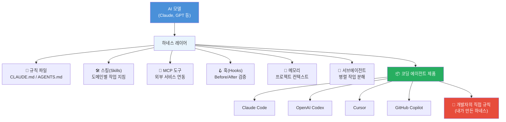
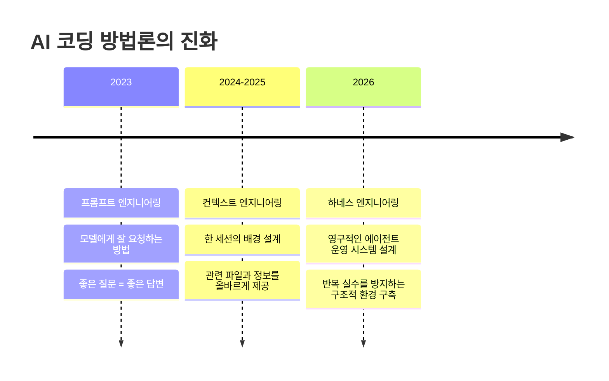
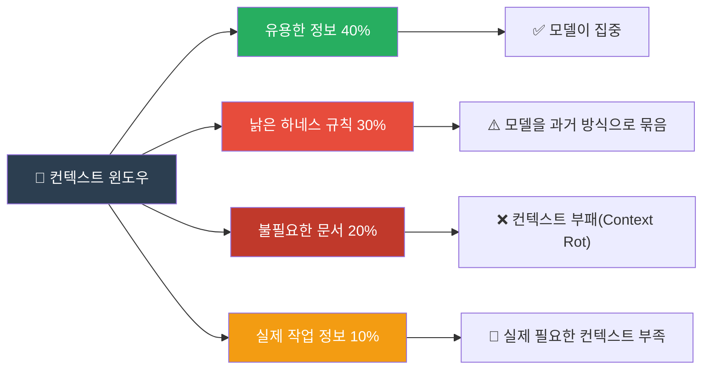
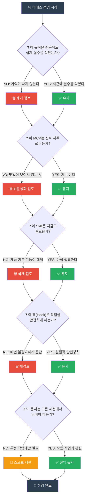
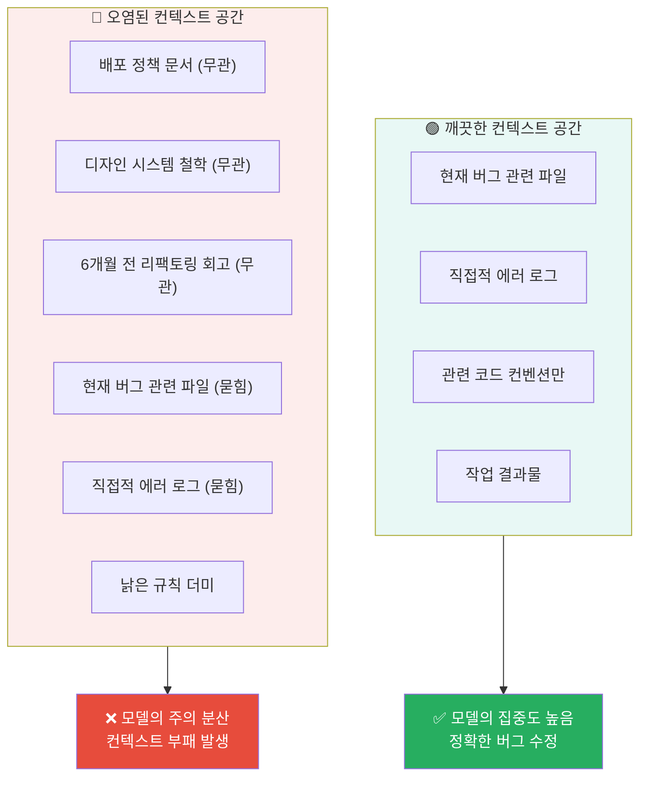
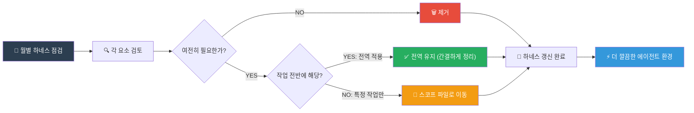

> **출처**: 개발동생 (YouTube 채널) 커뮤니티 포스트  
> **채널 설명**: AI를 단순히 쓰는 것을 넘어, 개발 워크플로우 자체를 AI Native하게 전환하는 방법을 다루는 현직 프로덕트 엔지니어이자 개발 크리에이터  
> **분류**: 하네스 엔지니어링 · AI 코딩 에이전트 · 에이전트 환경 설계 · 컨텍스트 엔지니어링

---

## 1. 먼저 이해해야 할 개념 — 하네스(Harness)란 무엇인가

이 글을 이해하려면 먼저 "하네스"라는 개념을 명확히 파악해야 한다. 하네스 엔지니어링(Harness Engineering)은 AI 코딩 에이전트를 감싸는 시스템, 즉 규칙(Rules), 도구(Tools), 스킬(Skills), 메모리(Memory), 피드백 루프(Feedback Loop)를 체계적으로 설계하는 기술이다.

쉬운 비유를 들면 이렇다. 말이 아무리 힘이 세도 고삐와 안장 없이는 원하는 방향으로 달릴 수 없다. AI 모델도 마찬가지다. Claude Code든 Cursor든 Codex든, 강력한 모델 그 자체보다 모델을 감싸는 환경 시스템이 실제 결과의 품질을 결정한다.

---

## 2. AI 엔지니어링 기술의 진화 흐름

하네스 엔지니어링은 AI 개발 방법론이 성숙해온 자연스러운 흐름의 결과다. 이 흐름을 보면 재미있는 패턴이 보인다. 매번 "모델에게 무엇을 말할까"에서 "모델을 둘러싼 시스템을 어떻게 설계할까"로 관심이 이동하고 있다.

- **프롬프트 엔지니어링(2023)**: 한 번의 입력을 잘 쓰는 기술. "어떻게 질문하면 원하는 답이 나올까?"를 고민하는 단계다.
- **컨텍스트 엔지니어링(2024~2025)**: 한 세션 안에서 모델이 보는 배경 정보 전체를 설계하는 기술. 어떤 파일을, 얼마나, 어떤 순서로 제공할지를 고민한다.
- **하네스 엔지니어링(2026)**: 영구적인 시스템이다. 세션이 끝나도 남아 있는 규칙, 스킬, 도구, 피드백 루프를 설계한다. Terraform 창시자 Mitchell Hashimoto는 이렇게 정의했다. "에이전트가 실수할 때마다, 그 실수가 다시는 발생하지 않도록 시스템을 엔지니어링하라." 더 좋은 모델을 기다리지 말고, 모델을 둘러싼 시스템을 고치라는 것이다.

---

## 3. 핵심 주장 — "이제 하네스를 덜어낼 시점이다"

개발동생의 이번 포스트는 하네스 엔지니어링의 필요성을 설파하는 글이 아니다. 오히려 그 반대다. 하네스가 필요하다는 사실은 이미 많은 사람들이 알고 있다. 이 포스트가 말하는 것은 그 다음 단계다.

**한 번 만든 하네스는 영원하지 않으며, 하네스는 생각보다 빨리 낡는다.**

이 단순한 주장이 왜 중요한지를 이해하려면, 하네스가 낡아가는 두 가지 핵심 원인을 살펴봐야 한다.

---

## 4. 하네스가 낡는 두 가지 이유

### 이유 1: 모델 자체가 점점 똑똑해진다

하네스의 많은 규칙은 "모델이 지시를 잘 따르지 않기 때문에" 만들어진다. 과거에는 모델이 지시를 제대로 이행하지 않았기 때문에 개발자들이 온갖 울타리를 쳐야 했다.

전형적인 예시는 다음과 같다:

- **"무조건 이 파일 먼저 읽어라"** — 모델이 필요한 컨텍스트를 스스로 파악하지 못하기 때문에 강제로 지정해준 것.
- **"절대 바로 구현하지 마라"** — 모델이 요청을 받으면 곧장 코드를 작성하려는 경향이 있어서 명시적으로 막은 것.
- **"반드시 계획부터 세워라"** — 무계획적인 구현이 잦은 실수로 이어지기 때문에 강제로 단계를 나눈 것.
- **"테스트 전에는 완료라고 하지 마라"** — 실제 검증 없이 "완료"를 선언하는 모델의 습관을 막기 위한 규칙.

그런데 모델이 좋아질수록, 이전에 강제로 묶어야 했던 행동들을 이제는 그냥 자연스럽게 하기 시작한다. Claude Sonnet 4, Claude Opus 4, GPT-5, Gemini 2.5와 같은 최신 모델들은 간단한 수정 작업이라면 자동으로 실행하고, 복잡한 작업이라면 스스로 계획을 수립한 후에 구현에 들어간다. AI 기업들이 하네스적 동작 패턴을 기본 학습 데이터로 내재화하기 시작했기 때문이다.

즉, 예전에 규칙으로 강제해야 했던 것이 이제는 모델이 기본적으로 수행하는 행동이 된 것이다.

### 이유 2: 코딩 에이전트 제품 자체가 하네스다

이 부분이 많은 사람들이 간과하는 지점이다. Claude Code, Codex, Cursor를 단순한 "모델 호출창"으로 보면 안 된다. 이 도구들은 그 자체로 이미 하나의 정교한 하네스다.

```mermaid
graph LR
    subgraph model ["기반 AI 모델"]
        M["Claude / GPT / Gemini"]
    end
    subgraph product ["코딩 에이전트 제품 (내장 하네스)"]
        P1["📂 파일 읽기 & 인덱싱"]
        P2["✏️ 코드 수정"]
        P3["💻 터미널 실행"]
        P4["🧪 자동 테스트"]
        P5["👀 코드 리뷰"]
        P6["🧠 메모리 관리"]
        P7["📋 규칙 파일 처리"]
        P8["⚡ Skills 실행"]
        P9["🌐 MCP 연동"]
        P10["🤖 백그라운드 에이전트"]
    end
    subgraph user ["내가 만든 하네스 (사용자 하네스)"]
        U1["CLAUDE.md 규칙"]
        U2["커스텀 스킬"]
        U3["프로젝트 훅"]
        U4["MCP 서버 설정"]
    end

    M --> product
    product --> user

    style model fill:#4A90D9,color:#fff
    style product fill:#27AE60,color:#fff
    style user fill:#E74C3C,color:#fff
```

Claude Code를 보면 파일 읽기, 코드 수정, 터미널 실행, 테스트, 리뷰, 메모리, 규칙, 스킬, 브라우저 제어, MCP 연동, 백그라운드 에이전트 실행 등이 이미 제품 안에 내장되어 있다. 이것들은 사실 Anthropic이 미리 설계해 둔 하네스 레이어다.

그러므로 개발자가 직접 만든 규칙들은 "코딩 에이전트 제품의 하네스 위에 다시 얹은 하네스"다. 레이어가 이중으로 쌓이는 구조인 것이다.

문제는 여기서 발생한다. 내가 3개월 전에 만든 규칙은 그 당시에는 진짜 필요했을 수 있다. 하지만 지금 Claude Code가 업데이트되면서 그 기능을 기본으로 잘 수행하게 됐을 수도 있다. Codex가 같은 문제를 더 좋은 방식으로 처리하게 됐을 수도 있다. Cursor가 제품 차원에서 그 워크플로우를 흡수했을 수도 있다. 실제로 2026년 현재, 주요 AI 코딩 에이전트들은 SKILL.md 형식을 범용적으로 지원하고, 맥락에 따른 스코프 적용을 자체적으로 수행한다.

---

## 5. 낡은 하네스가 만드는 실질적 해악

낡은 하네스는 단순히 "도움이 되지 않는" 수준이 아니다. 오히려 에이전트를 **적극적으로 방해**한다. 어떤 방식으로 방해하는지 살펴보자.

### 5-1. 중복 지시로 인한 혼란

Claude Code나 Codex는 이미 알아서 잘 판단하려고 하는데, 개발자가 예전에 만들어둔 낡은 규칙이 계속 끼어들어 모델을 과거의 방식으로 묶어버린다. 이것은 마치 숙련된 신입 직원에게 이미 다 알고 있는 기초적인 내용을 계속 반복해서 설명하는 것과 같다. 오히려 집중을 방해한다.

### 5-2. "항상 계획부터 세워라" 규칙의 함정

계획을 먼저 세우라는 규칙은 복잡한 작업에서는 분명히 효과적이다. 하지만 간단한 버그 수정이나 단순한 파일 편집에는 오히려 속도를 크게 저하시킨다. 규칙이 작업의 성격을 구분하지 못하고 모든 상황에 일괄 적용되기 때문이다. 최신 모델들은 작업의 복잡도를 스스로 판단해 계획이 필요한지 여부를 결정할 수 있는 수준에 도달했는데, 낡은 규칙이 이 판단을 막아버린다.

### 5-3. "항상 이 문서를 읽어라" 규칙의 함정

모든 세션마다 특정 문서를 읽도록 강제하는 규칙은 컨텍스트 오염의 주된 원인이다. 로그인 버그를 고치는 작업에서 배포 정책 문서, 디자인 시스템 철학, 6개월 전 리팩토링 회고가 컨텍스트 윈도우를 차지하고 있다면, 모델이 현재 작업에 집중하기 어려워진다. 이것은 단순히 "불필요한 정보가 있다"는 차원의 문제가 아니다.

연구 결과에 따르면, 컨텍스트 윈도우가 불필요한 정보로 채워질수록 AI 모델의 응답 품질이 실질적으로 저하된다. 이를 "컨텍스트 부패(Context Rot)"라고 부른다. 모델의 어텐션(Attention) 메커니즘이 관련 없는 정보에도 일정 부분 분산되기 때문이다. 심지어 Claude Code 개발팀의 연구에서는 "1M 토큰 한계"라는 현상이 보고됐는데, 컨텍스트 윈도우 크기와 무관하게 약 100만 토큰 이상에서 모델 성능이 급격히 하락한다는 것이다.

### 5-4. "항상 서브에이전트를 써라" 규칙의 함정

멀티에이전트 패턴은 복잡한 대규모 작업을 분해하는 데 강력하다. 하지만 간단한 버그 하나를 고치는 데 에이전트 팀을 소환하면, 문제 해결보다 프로세스 관리가 더 커지는 역설이 발생한다. 조율 비용, 컨텍스트 분산, 중간 보고서 생성 등 오버헤드가 실제 작업보다 무거워지는 것이다.

---

## 6. 하네스의 5가지 자기점검 질문

개발동생은 낡은 하네스를 걸러낼 수 있는 실용적인 자기점검 질문 다섯 가지를 제시한다. 이 질문들이 핵심이다.

### 질문 1: 이 규칙은 최근에도 실제 실수를 막았는가?

규칙의 존재 의의는 실수 방지다. 만약 최근 몇 달간 그 규칙이 실제로 어떤 실수도 막지 않았다면, 두 가지 가능성 중 하나다. 첫째, 해당 실수 패턴이 애초에 발생하지 않는 환경이 됐거나, 둘째, 모델이 이미 그 실수를 스스로 방지하게 됐거나. 어느 쪽이든 해당 규칙의 필요성은 줄어든다.

### 질문 2: 이 MCP는 진짜 자주 쓰이는가, 아니면 멋있어 보여서 켜둔 건가?

MCP(Model Context Protocol) 도구는 강력하지만, 활성화된 모든 MCP는 모델이 어떤 도구를 써야 할지 판단하는 과정에서 인지 부하를 증가시킨다. 실제로 한 달에 한 번도 사용하지 않는 MCP를 켜두는 것은 도움이 되지 않는다. 사용 빈도를 측정하고 불필요한 것은 비활성화해야 한다.

### 질문 3: 이 Skill은 지금도 필요한가, 아니면 제품 기본 기능으로 대체됐는가?

이 질문이 가장 중요하다. 2026년 현재 Claude Code, Codex, Cursor 등의 코딩 에이전트들은 빠르게 기능을 확장하고 있다. 6개월 전에 커스텀 스킬로 구현해야 했던 것들이 이제는 제품의 기본 기능이 된 경우가 많다. 예를 들어, SKILL.md 형식은 이제 Claude Code, Codex CLI, Gemini CLI를 포함한 대부분의 주요 에이전트가 표준으로 지원한다. 과거에 직접 만들어야 했던 것이 이제 표준화된 것이다.

### 질문 4: 이 훅(Hook)은 작업을 안전하게 만드는가, 아니면 매번 불필요하게 모델을 멈추게 하는가?

훅은 에이전트의 행동 전후에 개입해 검증이나 추가 처리를 수행하는 장치다. 파일 쓰기 전 확인, 배포 전 검증 등은 매우 가치 있는 훅이다. 하지만 단순한 파일 읽기에도 매번 승인을 요구하는 훅이나, 빠르게 처리할 수 있는 작업을 반복적으로 중단시키는 훅은 오히려 생산성을 낮춘다. "되돌릴 수 없는 작업"과 "되돌릴 수 있는 작업"을 구분해 훅의 범위를 제한하는 것이 더 현명하다.

### 질문 5: 이 문서는 모든 세션에서 읽어야 하는가, 아니면 필요할 때만 읽어도 되는가?

현재 코딩 에이전트들은 스코프 기반 규칙을 지원한다. Cursor의 경우 `.cursor/rules/` 디렉토리 안에 여러 `.mdc` 파일을 두고, 각각 특정 파일 타입이나 작업 유형에만 적용되도록 설정할 수 있다. GitHub Copilot도 2025년 7월 이후 `.github/instructions/` 디렉토리를 통한 스코프 기반 지침을 지원한다. 전역 규칙으로 모든 세션에 강제할 필요 없이, 관련 있을 때만 로드되도록 설정하는 것이 훨씬 효율적이다.

---

## 7. 전역 지침 파일의 위험성 — CLAUDE.md, AGENTS.md, Cursor Rules

포스트에서 특별히 강조하는 대목이 있다. 전역(Global) 지침 파일들은 매우 편리하지만, 동시에 가장 위험한 함정이기도 하다는 것이다.

### CLAUDE.md의 특성과 한계

CLAUDE.md는 Claude Code가 매 세션 시작 시 자동으로 로드하는 영구 지침 파일이다. 프로젝트의 코드 컨벤션, 테스트 명령어, 아키텍처 패턴 등을 담는다. 이 파일은 세션이 끝나도 남아 있어 다음 세션에도 동일한 지침을 제공한다.

그런데 시간이 지날수록 이 파일은 팽창하는 경향이 있다. 필요할 때마다 내용을 추가하지만, 불필요해진 내용을 적극적으로 삭제하는 경우는 드물기 때문이다. 그 결과, 이 파일이 너무 길어지면 "모든 작업에 따라붙는 짐"이 된다.

CLAUDE.md가 컨텍스트 윈도우에서 차지하는 비중이 크다면, 실제 작업과 관련된 정보가 들어올 공간이 줄어든다. 이것은 측정된 문제다. Claude Code 팀의 자체 데이터에 따르면, Claude Code는 Cursor 대비 동일한 작업에서 약 5.5배 적은 토큰을 사용하는데, 이는 더 효율적인 컨텍스트 관리 덕분이다.

### AGENTS.md의 범용성과 과부하

AGENTS.md는 Claude Code, OpenAI Codex, Gemini CLI 등 다양한 에이전트가 범용적으로 읽을 수 있는 표준 형식이다. 여러 도구를 동시에 사용하는 팀에서는 이 파일 하나로 모든 에이전트에게 동일한 지침을 제공할 수 있어 편리하다. 하지만 바로 그 범용성 때문에, 도구별로 세분화된 지침보다 더 일반적이고 광범위한 내용을 담게 되는 경향이 있다.

### Cursor Rules의 레거시 문제

Cursor의 경우 과거에는 프로젝트 루트의 단일 `.cursorrules` 파일을 사용했다. 이 방식은 현재 지원은 되지만 공식적으로 비권장(deprecated) 상태다. 현재 권장 방식은 `.cursor/rules/` 디렉토리 안에 여러 `.mdc` 파일을 두어, 각 파일이 특정 파일 타입이나 작업에만 적용되도록 스코프를 지정하는 것이다. 하지만 많은 개발자들이 과거에 만든 단일 `.cursorrules` 파일을 그대로 유지하고 있다. 이것이 레거시 하네스의 전형적인 형태다.

---

## 8. 컨텍스트는 작업 공간이다

포스트에서 제시하는 중요한 프레임이 있다. **AI 코딩에서 컨텍스트는 작업 공간(Workspace)이다.** 작업 공간이 깨끗할수록 모델이 집중하기 쉽다.

이것은 실생활 비유로 쉽게 이해할 수 있다. 책상 위에 지금 하는 일과 관련 없는 서류가 가득 쌓여 있다면, 정작 필요한 서류를 찾기도 어렵고 집중하기도 어렵다. AI 모델의 컨텍스트 윈도우도 정확히 같은 방식으로 작동한다.

---

## 9. 하네스 리팩토링 — 코드만 리팩토링하는 게 아니다

이 포스트의 핵심 결론은 이것이다. 코드를 리팩토링하듯, 에이전트 환경도 리팩토링해야 한다.

좋은 하네스는 계속 쌓이는 게 아니라 계속 갱신되어야 한다. 구체적으로는 다음 네 가지 원칙을 따른다.

1. **예전에도 필요하고 지금도 필요한 것**: 남긴다.
2. **이제 제품(에이전트)이 더 잘 하는 것**: 지운다.
3. **특정 작업에만 필요한 것**: 전역에서 빼고 스코프를 제한한다.
4. **자주 쓰는 것**: 짧고 정확하게 정리한다.

권장하는 주기는 **한 달에 한 번** 정도 내가 만든 하네스를 열어보고 "이거 아직도 필요한가?"라는 질문을 던지는 것이다.

---

## 10. 현재 코딩 에이전트 생태계의 실제 현황 (2026 기준)

포스트의 맥락을 더 깊이 이해하려면, 2026년 현재 AI 코딩 에이전트 생태계가 실제로 얼마나 성숙했는지를 알아야 한다.

2024년까지만 해도 선택지는 Copilot 계열 아니면 나머지였다. 2026년 현재는 20개 이상의 유능한 에이전트들이 경쟁하고 있다. 각 도구의 특성은 다음과 같이 정리된다.

**Claude Code**는 현재 가장 성숙한 터미널 에이전트 중 하나다. Claude Sonnet과 Opus 모델을 실행하며 MCP 완전 통합, SKILL.md 표준 지원, 강력한 멀티파일 리팩토링 능력을 갖추고 있다. OODA 루프(Observe-Orient-Decide-Act) 실행에서 뛰어난 성능을 보이며, 1M 토큰에 가까운 컨텍스트 윈도우를 실험적으로 지원하고 있다.

**OpenAI Codex**는 GPT-4o, o3, o4-mini 모델을 실행하는 OpenAI의 터미널 에이전트다. MCP와 SKILL.md를 지원하며 빠르고 간결한 출력이 특징이다.

**Cursor**는 IDE 기반 에이전트 중 멀티파일 시각적 리팩토링에서 가장 앞선 도구다. Composer 모드를 통한 에이전트 경험을 제공하며, `.cursor/rules/` 기반의 스코프 규칙을 지원한다.

중요한 사실은, 이 도구들이 개발자가 별도 하네스를 만들어야만 해결할 수 있었던 문제들을 점점 기본 기능으로 흡수하고 있다는 점이다. 이것이 바로 "하네스를 덜어낼 시점"이라는 주장의 근거가 된다.

---

## 11. 댓글에서 드러나는 현장의 반응

포스트에 달린 댓글들은 이 주제에 대한 현장 개발자들의 다양한 시각을 보여준다.

한 댓글은 재치 있게 "하네스 무용론 → 1주일 후 → 하네스가 더 강력히 돌아왔습니다!"라며 이 논쟁의 사이클을 꼬집었다. 하네스의 필요성과 과잉 사이를 오가는 현장의 딜레마를 잘 표현한 것이다.

또 다른 댓글은 "AI 기업들이 하네스 기본 탑재로 모델을 학습해서, 요즘은 그냥 말만 해도 알아서 계획 세우고 stage별로 구현 뒤 리뷰·배포까지 다 한다"고 관찰했다. 이것은 포스트의 첫 번째 논점, 즉 모델 자체가 하네스적 동작을 내재화하고 있다는 주장을 뒷받침한다.

"코딩 에이전트가 자동으로 판단해서 선별적으로 적용해주면 좋겠다"는 요청도 있었다. 이것은 이미 일부 도구에서 구현되고 있는 방향이다. 에이전트 스스로 현재 작업에 필요한 규칙과 스킬을 선택적으로 로드하는 방식이다.

하네스 개선 시나리오에 대한 자동화를 주기적으로 실행 중이라는 댓글도 있었다. 이것은 포스트의 핵심 방향, 즉 하네스 자체를 지속적으로 관리하고 개선하는 것을 실천하고 있다는 증거다.

---

## 12. 이 관점이 가지는 더 큰 의미

이 포스트는 단순히 "CLAUDE.md를 짧게 써라"는 팁이 아니다. 더 근본적인 사고방식의 전환을 촉구한다.

AI 코딩 도구를 도입할 때 많은 사람들은 "무엇을 더 붙일까"를 생각한다. 어떤 MCP를 추가할까, 어떤 스킬을 만들까, 어떤 규칙을 넣을까. 이것이 초기에는 맞는 접근법이다. 하지만 어느 시점부터는 "무엇을 이제 빼도 될까"를 생각해야 한다.

이것은 소프트웨어 개발에서 기술 부채(Technical Debt)와 리팩토링의 관계와 정확히 같다. 처음에 빠르게 만들어야 했던 코드는 시간이 지나면 리팩토링이 필요하다. 하네스도 마찬가지다. 처음에 필요했던 규칙들은 시간이 지나면, 모델과 도구가 발전하면, 불필요한 레거시가 된다.

하네스 리팩토링을 습관화하는 것, 그것이 2026년 AI 코딩 시대에 에이전트 환경을 건강하게 유지하는 방법이다.

---

## 요약 — 핵심 메시지 정리

| 구분 | 과거의 접근법 | 앞으로의 접근법 |
|------|------------|--------------|
| 하네스에 대한 태도 | 계속 추가하고 쌓는다 | 주기적으로 검토하고 정리한다 |
| 규칙에 대한 질문 | "무엇을 더 추가할까?" | "이거 아직도 필요한가?" |
| 전역 지침 파일 | 길고 포괄적으로 유지 | 짧고 핵심만, 나머지는 스코프 제한 |
| 모델 발전에 대한 대응 | 무시 혹은 인지 못함 | 제품이 대신하면 내 규칙은 삭제 |
| 하네스 관리 주기 | 없음 (쌓이기만 함) | 한 달에 한 번 점검 |
| 에이전트 환경 인식 | 코딩 에이전트 = 모델 호출창 | 코딩 에이전트 = 이미 하나의 하네스 |

> **핵심**: 하네스를 버리자는 것이 아니다. 관리하자는 것이다.  
> 좋은 하네스는 계속 쌓이는 게 아니라 계속 갱신되어야 한다.

---

*작성 일자: 2026-06-02*
