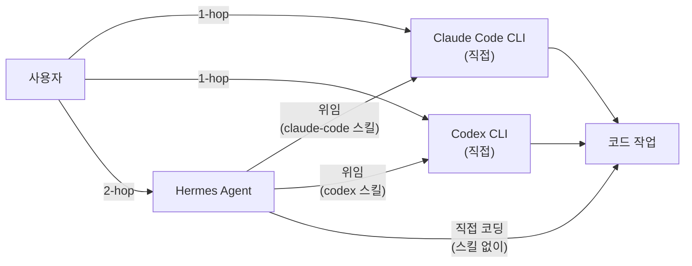
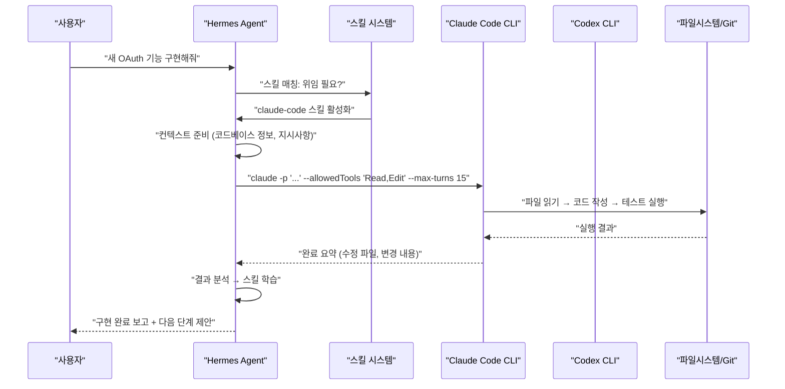
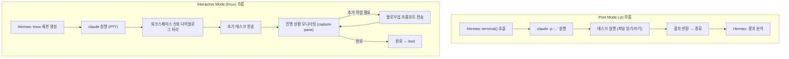
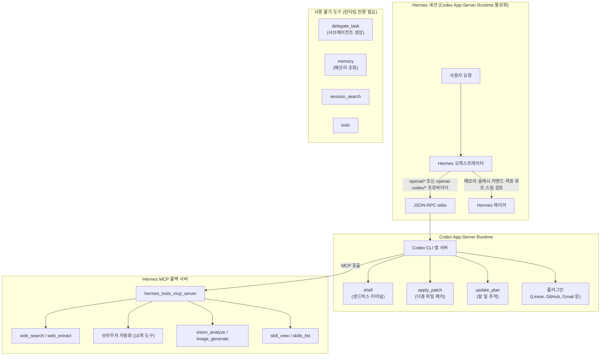
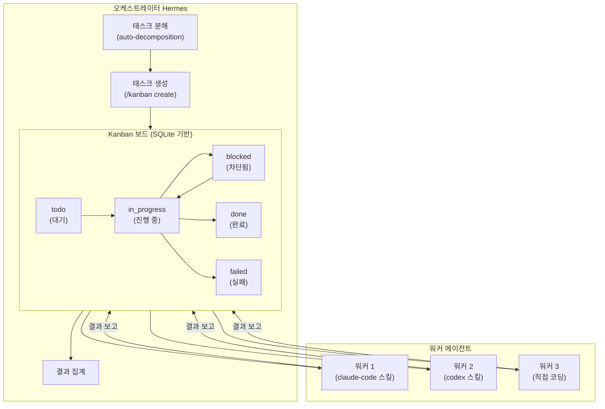
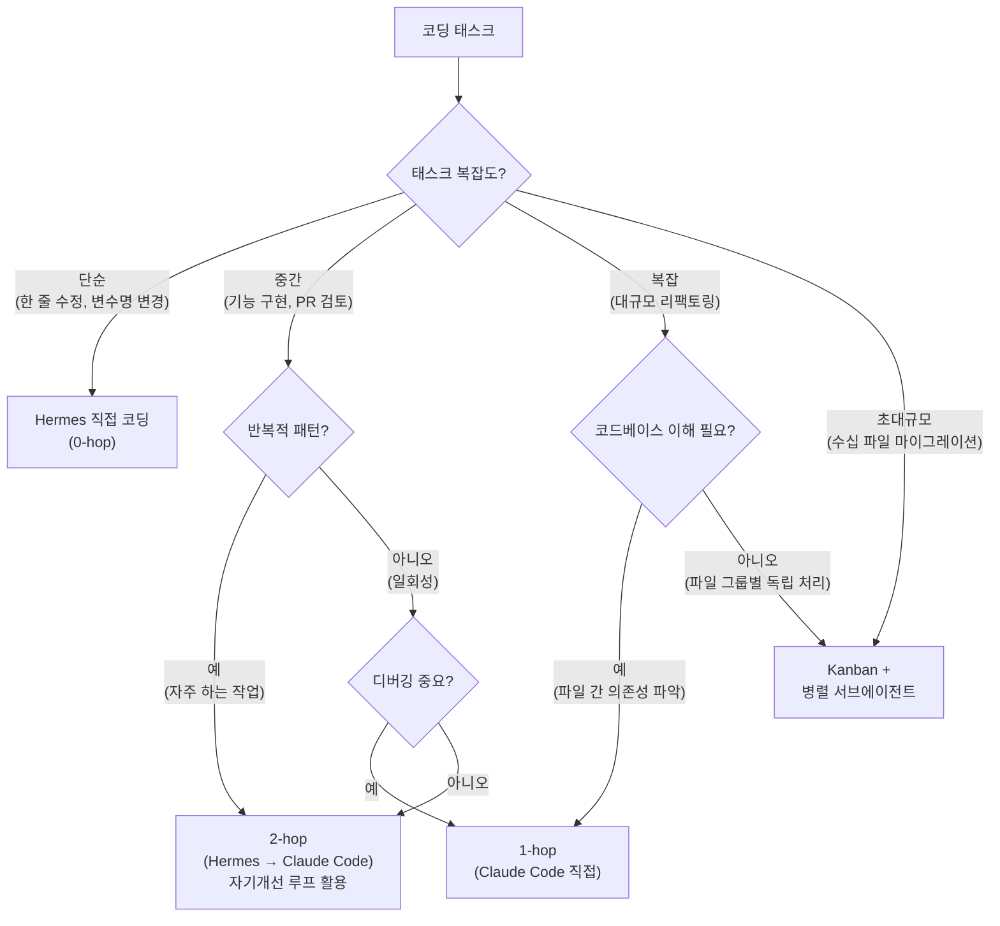
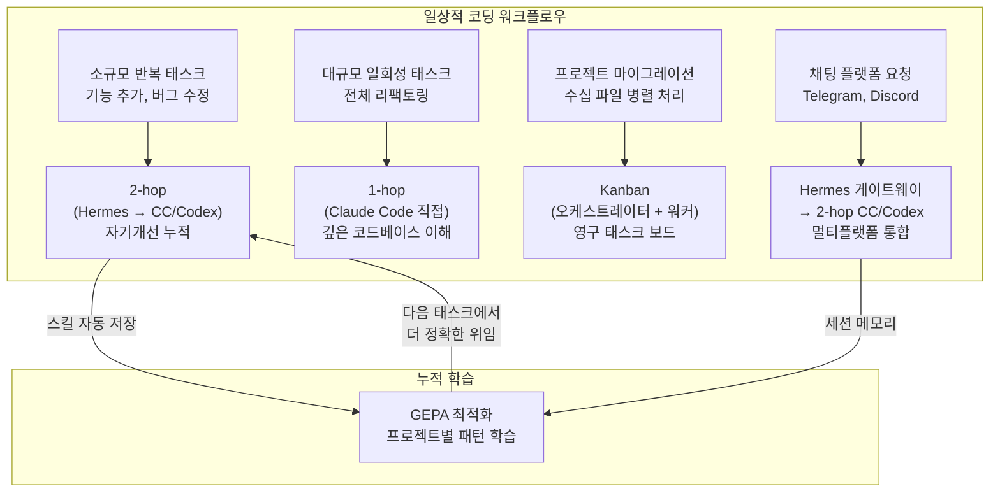

> **작성 기준**: 2026년 6월 3일 기준 최신 정보  
> **출처**: Nous Research 공식 문서, GitHub 소스코드 및 Issue Tracker, AlphaSignal AI, Daily Dose of DS Masterclass, haimaker.ai, Hermes v0.15 릴리스 노트 등

## 관련글

[**Hermes Agent 스킬 비대화 논란: NVIDIA 통합부터 커뮤니티 철학 갈등까지**](https://k82022603.github.io/posts/hermes-agent-%EC%8A%A4%ED%82%AC-%EB%B9%84%EB%8C%80%ED%99%94-%EB%85%BC%EB%9E%80-nvidia-%ED%86%B5%ED%95%A9%EB%B6%80%ED%84%B0-%EC%BB%A4%EB%AE%A4%EB%8B%88%ED%8B%B0-%EC%B2%A0%ED%95%99-%EA%B0%88%EB%93%B1%EA%B9%8C%EC%A7%80/)

---

## 목차

1. [핵심 질문: "Hermes를 거쳐야 하나, 직접 가야 하나?"](#1-핵심-질문-hermes를-거쳐야-하나-직접-가야-하나)
2. [Hermes의 코딩 에이전트 생태계 이해](#2-hermes의-코딩-에이전트-생태계-이해)
3. [1-hop: 직접 연결의 세계](#3-1-hop-직접-연결의-세계)
4. [2-hop: Hermes 경유 위임의 세계](#4-2-hop-hermes-경유-위임의-세계)
5. [Claude Code 스킬 심층 해부: 두 가지 오케스트레이션 모드](#5-claude-code-스킬-심층-해부-두-가지-오케스트레이션-모드)
6. [Codex 스킬 심층 해부: Codex App-Server Runtime까지](#6-codex-스킬-심층-해부-codex-app-server-runtime까지)
7. [delegate_task: 서브에이전트 위임의 내부 동작](#7-delegate_task-서브에이전트-위임의-내부-동작)
8. [ACP (Agent Communication Protocol): 에이전트 간 통신의 표준](#8-acp-agent-communication-protocol-에이전트-간-통신의-표준)
9. [Kanban 멀티에이전트 시스템: 대규모 병렬 코딩의 기반](#9-kanban-멀티에이전트-시스템-대규모-병렬-코딩의-기반)
10. [SOUL.md와 아이덴티티 계층: 에이전트의 정체성 설계](#10-soulmd와-아이덴티티-계층-에이전트의-정체성-설계)
11. [2-hop의 장단점 상세 분석](#11-2-hop의-장단점-상세-분석)
12. [실전 시나리오별 선택 기준](#12-실전-시나리오별-선택-기준)
13. [Claude Max 구독으로 Hermes + Claude Code 운영하기](#13-claude-max-구독으로-hermes--claude-code-운영하기)
14. [하이브리드 전략의 설계 원칙](#14-하이브리드-전략의-설계-원칙)

---

## 1. 핵심 질문: "Hermes를 거쳐야 하나, 직접 가야 하나?"

Hermes Agent를 어느 정도 사용해본 사람이라면 반드시 부딪히게 되는 실용적인 딜레마가 하나 있다. 코딩 작업을 할 때, Hermes에게 직접 요청해야 하는가, 아니면 Claude Code CLI나 OpenAI Codex CLI에 직접 연결하여 사용해야 하는가. 이 질문은 단순히 취향의 문제가 아니다. 각 방식은 근본적으로 다른 아키텍처를 가지며, 장단점이 뚜렷하고, 적합한 사용 사례가 구분된다.

이 질문이 복잡하게 느껴지는 이유는 Hermes 자체가 이미 강력한 코딩 능력을 갖추고 있기 때문이다. Hermes는 터미널 실행, 파일 읽기/쓰기, 코드 분석, git 조작 등을 모두 직접 수행할 수 있다. 그럼에도 불구하고, Hermes의 `autonomous-ai-agents` 카테고리에는 `claude-code`, `codex`, `opencode`, `hermes-agent` 등 다른 코딩 에이전트에게 작업을 위임하는 스킬들이 기본으로 번들되어 있다. 이것이 핵심 질문을 만들어낸다. 즉, Hermes가 직접 할 수 있는데 왜 다른 에이전트에게 위임하는가?

이 문서는 그 질문에 대한 답을 기술적 사실에 기반하여 상세하게 제공하며, 각 접근 방식의 실제 작동 원리, 비용·성능 트레이드오프, 그리고 어떤 상황에서 어느 방식이 유리한지를 명확히 설명한다.



---

## 2. Hermes의 코딩 에이전트 생태계 이해

Hermes의 `autonomous-ai-agents` 카테고리에는 다음 스킬들이 번들로 포함되어 있으며 모두 기본 활성화되어 있다.

**claude-code 스킬**: Anthropic이 개발한 자율 코딩 에이전트 CLI인 Claude Code를 통해 코딩 태스크를 위임하는 스킬이다. `npm install -g @anthropic-ai/claude-code`로 설치하며, Claude Code v2.x는 파일 읽기·쓰기, 코드 작성, 셸 커맨드 실행, 서브에이전트 생성, git 워크플로우 관리를 자율적으로 수행할 수 있다. 이 스킬의 버전은 2.2.0이며 Hermes Agent 팀과 Teknium이 공동 저작했다.

**codex 스킬**: OpenAI가 개발한 자율 코딩 에이전트 CLI인 Codex를 통해 코딩 태스크를 위임하는 스킬이다. `npm install -g @openai/codex`로 설치하며, git 리포지토리 내부에서만 실행되고 대화형 터미널 앱 방식으로 동작한다. OpenAI API 키 또는 Codex OAuth 인증이 필요하다.

**opencode 스킬**: OpenCode는 오픈소스 코딩 에이전트 CLI이며, PR 검토 기능을 포함한 코딩 위임을 지원한다.

**hermes-agent 스킬**: Hermes가 다른 Hermes 인스턴스에게 코딩 태스크를 위임할 때 사용하는 스킬이다. 이는 Hermes의 멀티에이전트 Kanban 시스템과 연동되어 여러 Hermes 프로파일 간의 작업 분산을 가능하게 한다.

이 스킬들의 존재 자체가 중요한 설계 원칙을 반영한다. Hermes는 단일 에이전트가 모든 것을 하는 방식이 아니라, 적절한 에이전트에게 적절한 태스크를 위임하는 **오케스트레이터** 역할을 중심 정체성으로 삼는다.

---

## 3. 1-hop: 직접 연결의 세계

1-hop 방식이란 사용자가 코딩 에이전트(Claude Code 또는 Codex CLI)와 직접 소통하는 것을 의미한다. 중간에 Hermes라는 계층이 존재하지 않는다.

**Claude Code CLI 직접 사용**: 터미널에서 `claude` 명령으로 REPL(Read-Eval-Print Loop)을 시작하거나, `claude -p "태스크 설명"`으로 일회성 태스크를 실행한다. Claude Code는 전체 코드베이스를 읽고 파일 간 의존성을 파악한 뒤, 다단계 계획을 수립하여 코드를 작성하고 테스트를 실행하는 방식으로 동작한다. Claude Max 또는 Pro 구독, 혹은 ANTHROPIC_API_KEY가 있으면 브라우저 OAuth를 통해 인증한다.

**Codex CLI 직접 사용**: `codex "태스크 설명"` 또는 `codex --full-auto "태스크 설명"` 명령으로 실행한다. Codex는 반드시 git 리포지토리 내부에서 실행해야 하며, `--full-auto` 플래그는 샌드박스 내에서 워크스페이스 변경을 자동 승인한다. OpenAI 구독 또는 API 키가 필요하다.

1-hop 방식의 가장 큰 특징은 **단순성과 낮은 지연**이다. 에이전트와 사용자 사이에 아무것도 없으므로, 컨텍스트 손실 없이 직접 소통할 수 있고, 에이전트의 응답이 즉시 사용자에게 도달한다. 또한 중간 계층이 없으므로 디버깅이 용이하다. 에이전트가 무엇을 하고 있는지 직접 볼 수 있다.

반면 1-hop 방식의 단점은 **세션 간 지속성의 부재**다. Claude Code와 Codex CLI 모두 기본적으로 세션이 끝나면 상태를 기억하지 않는다. 특히 Codex CLI는 세션 간 메모리가 없으며, Claude Code는 프로젝트별 CLAUDE.md 파일을 통해 제한적인 지속성을 제공하지만 Hermes의 다중 계층 메모리 시스템과는 비교가 되지 않는다. 또한 자기개선 루프가 없으므로, 반복적으로 같은 패턴의 작업을 해도 에이전트가 학습하지 않는다.

---

## 4. 2-hop: Hermes 경유 위임의 세계

2-hop 방식은 사용자가 Hermes에게 요청을 전달하면, Hermes가 그 요청을 분석하고 적절한 코딩 에이전트(Claude Code 또는 Codex)에게 위임하는 방식이다. 이때 Hermes는 단순한 중간 전달자가 아니라 **능동적인 오케스트레이터**로 기능한다.

Hermes가 위임을 결정하는 과정은 다음과 같다. 사용자로부터 요청을 받은 Hermes는 자신의 스킬 목록을 참조하여 해당 요청이 전문 코딩 에이전트에게 위임하기 적합한지 판단한다. `claude-code` 스킬의 설명에 따르면, 다음과 같은 상황에서 위임이 권장된다. "새로운 기능이나 앱을 빌드하거나 생성할 때", "PR을 검토할 때(임시 디렉토리에서 서브에이전트 생성)", "대규모 코드베이스를 리팩토링할 때", "파일 탐색이 필요한 반복적 코딩 작업을 할 때"가 해당된다.

반면 다음과 같은 상황에서는 위임하지 않도록 명시되어 있다. "단순한 한 줄 수정(그냥 직접 편집)", "코드를 수동적으로 읽는 작업(read 도구 사용)", "ACP 하네스가 바인딩된 채팅 스레드 요청(예: Discord 스레드에서 Codex나 Claude Code를 생성하거나 실행하는 것)"이 해당된다.

이 명확한 가이드라인은 Hermes가 상황에 따라 위임 여부를 지능적으로 결정한다는 것을 의미한다. 사용자가 "이 API 핸들러에 에러 처리를 추가해줘"라고 요청하면 Hermes는 claude-code를 통해 위임할 수 있고, "이 변수 이름을 바꿔줘"라고 요청하면 직접 파일을 편집할 것이다.



2-hop 방식의 핵심 가치는 **Hermes의 메모리와 자기개선 루프가 코딩 워크플로우에도 적용된다**는 점이다. Hermes는 Claude Code를 통해 성공적으로 수행한 코딩 태스크의 패턴을 기억하고, 이를 재사용 가능한 스킬로 저장한다. 다음 번에 유사한 요청이 들어오면 Hermes는 이미 저장된 패턴을 활용하여 더 빠르고 정확하게 Claude Code에게 지시할 수 있다. 이것이 Hermes가 말하는 "40% 반복 태스크 가속화(GEPA 기반 측정)"의 실체다.

---

## 5. Claude Code 스킬 심층 해부: 두 가지 오케스트레이션 모드

Hermes의 공식 `claude-code` 스킬(버전 2.2.0)의 실제 SKILL.md를 분석하면, Hermes가 Claude Code와 상호작용하는 두 가지 근본적으로 다른 방식이 있음을 알 수 있다.

### Mode 1: Print Mode (-p) — 비대화형 (대부분의 자동화 태스크에 권장)

Print Mode는 일회성 태스크를 실행하고, 결과를 반환하며, 종료하는 방식이다. PTY(Pseudo-Terminal)가 필요 없고, 대화형 프롬프트도 없다. 이것이 자동화에 가장 깔끔한 통합 경로다.

실제 Hermes 스킬이 Claude Code를 Print Mode로 호출하는 방식은 다음과 같다.

```bash
# Hermes가 내부적으로 실행하는 명령
terminal(
  command="claude -p 'src/ 내 모든 API 호출에 에러 처리 추가' \
           --allowedTools 'Read,Edit' \
           --max-turns 10",
  workdir="/path/to/project",
  timeout=120
)
```

Print Mode를 사용해야 하는 상황은 다음과 같다. 일회성 코딩 태스크(버그 수정, 기능 추가, 리팩토링), CI/CD 자동화 및 스크립팅, `--json-schema`를 사용한 구조화된 데이터 추출, 파이프 입력 처리(`cat file | claude -p "이것을 분석해줘"`)가 이에 해당한다. Print Mode의 중요한 특성은 **모든 대화형 다이얼로그를 건너뛴다**는 것이다. 워크스페이스 신뢰 프롬프트도, 권한 확인도 없다. 이것이 자동화에 이상적인 이유다.

### Mode 2: tmux를 통한 대화형 PTY — 다중 턴 세션

대화형 모드는 팔로우업 프롬프트 전송, 슬래시 커맨드 사용, Claude가 실시간으로 작업하는 것을 지켜보는 완전한 대화형 REPL을 제공한다. 이 모드는 **tmux 오케스트레이션이 필요**하다.

Hermes가 tmux를 통해 Claude Code를 대화형으로 제어하는 실제 방식은 다음과 같다.

```bash
# 1. tmux 세션 시작
terminal(command="tmux new-session -d -s claude-work -x 140 -y 40")

# 2. tmux 내에서 Claude Code 실행
terminal(command="tmux send-keys -t claude-work 'cd /path/to/project && claude' Enter")

# 3. 시작 대기 후 태스크 전송 (약 3-5초)
terminal(command="sleep 5 && tmux send-keys -t claude-work 'JWT 토큰을 사용하도록 auth 모듈 리팩토링' Enter")

# 4. 진행 상황 모니터링
terminal(command="sleep 15 && tmux capture-pane -t claude-work -p -S -50")

# 5. 팔로우업 태스크 전송
terminal(command="tmux send-keys -t claude-work '이제 새 JWT 코드에 대한 유닛 테스트 추가' Enter")

# 6. 완료 후 종료
terminal(command="tmux send-keys -t claude-work '/exit' Enter")
```

대화형 모드를 사용해야 하는 상황은 다음과 같다. 다중 턴 반복 작업(리팩토링 → 검토 → 수정 → 테스트 사이클), 사람의 개입이 필요한 판단을 포함하는 태스크, 탐색적 코딩 세션, Claude의 슬래시 커맨드(`/compact`, `/review`, `/model`)를 사용해야 할 때가 이에 해당한다.

### PTY 다이얼로그 처리의 중요성

대화형 모드에서 가장 중요한 실용적 문제는 Claude Code가 처음 실행될 때 나타나는 확인 다이얼로그 처리다. 이것을 잘못 처리하면 자동화가 멈춰버린다.

**워크스페이스 신뢰 다이얼로그**: 새 디렉토리에 처음 방문할 때 나타난다. `tmux send-keys -t <session> Enter`로 기본값("Yes, I trust this folder")을 선택하면 된다.

**권한 우회 경고 다이얼로그**: `--dangerously-skip-permissions` 플래그를 사용할 때만 나타난다. 이 다이얼로그의 기본값이 "No, exit"이므로, 반드시 아래로 이동한 후 Enter를 눌러야 한다. `tmux send-keys -t <session> Down && sleep 0.3 && tmux send-keys -t <session> Enter`처럼 처리해야 한다.

이 다이얼로그 처리 패턴을 모르면 자동화가 첫 실행에서 멈춰버리기 때문에, 이것은 2-hop Claude Code 통합의 가장 중요한 기술적 세부 사항이다.



---

## 6. Codex 스킬 심층 해부: Codex App-Server Runtime까지

### 기본 Codex CLI 위임

Hermes의 `codex` 스킬은 OpenAI의 자율 코딩 에이전트 CLI를 통해 코딩 태스크를 위임한다. Codex CLI는 Claude Code와 달리 몇 가지 중요한 제약이 있다.

**git 리포지토리 필수**: Codex는 git 리포지토리 외부에서는 실행을 거부한다. PR 검토 같은 일회성 작업을 위해서는 임시 리포지토리나 워크트리(worktree)를 생성하여 안전하게 사용하는 것이 권장된다.

**PTY 필수**: Codex는 대화형 터미널 앱이므로, Hermes에서 Codex를 호출할 때는 `pty=true` 옵션이 필요하다. 이는 Claude Code의 Print Mode처럼 단순한 명령행 호출이 아니라 PTY를 통한 대화형 세션을 의미한다.

**안전 제어**: Codex는 두 가지 수준의 자동화를 제공한다. `--full-auto`는 샌드박스 내에서 워크스페이스 변경을 자동 승인하는 방식이고, `--yolo`는 샌드박스도 없고 승인도 없는 완전 자동 방식이다.

### Codex App-Server Runtime: 더 깊은 통합

2026년 5월 14일, Nous Research는 Hermes v0.13.0(태그: v2026.5.7)과 함께 **Codex App-Server Runtime**이라는 옵트인 베타 기능을 발표했다. 이것은 단순한 위임 스킬을 넘어서는 훨씬 더 깊은 통합이다.

이 런타임이 활성화되면, Hermes는 `openai/*` 및 `openai-codex/*` 프로바이더를 사용하는 모든 턴을 JSON-RPC stdio를 통해 Codex CLI 앱 서버로 전달한다. 즉, Hermes가 모델 프론트엔드 역할을 하면서, 실제 도구 실행(터미널 커맨드, 파일 편집, MCP 도구 호출, 샌드박싱)은 Codex CLI가 담당하는 구조다.

활성화 방법은 `/codex-runtime codex_app_server` 단일 명령이다. 이 명령 하나가 Codex CLI 설치 확인, `~/.hermes/config.yaml`의 MCP 서버를 `~/.codex/config.toml`로 마이그레이션, 설치된 Codex 플러그인 발견, Hermes를 MCP 서버로 등록, 기본 권한 설정(`default_permissions = ":workspace"`) 등을 모두 처리한다.

이 런타임이 활성화되면 세 가지 도구 소스가 동시에 사용 가능해진다.

첫째, **Codex 빌트인 도구(5개)**: `shell`(샌드박스 내 터미널 커맨드 실행), `apply_patch`(구조화된 다중 파일 패치 적용), `update_plan`(런타임 내 할 일 추적), `view_image`(로컬 이미지 로드), `web_search`(Codex 자체 검색)가 있다.

둘째, **자동 마이그레이션된 Codex 플러그인**: Linear, GitHub, Gmail, Google Calendar, Outlook, Canva 등 사용자가 Codex TUI에서 이미 설치한 플러그인들이 Hermes 세션 내에서 자동으로 사용 가능해진다. 재설정이 필요없다.

셋째, **Hermes MCP 콜백(17개 도구)**: Codex가 처리하지 못하는 도구를 위해, Codex는 `hermes_tools_mcp_server`를 MCP 서브프로세스로 생성하고 Hermes에 콜백한다. 이를 통해 `web_search`, `web_extract`(Firecrawl), 10개의 브라우저 자동화 도구, `vision_analyze`, `image_generate`, `skill_view`, `skills_list`, `text_to_speech`가 Codex 세션 내에서 사용 가능해진다.



이 런타임의 ChatGPT 구독 활용이 중요한 의미를 갖는다. OpenAI 사용자라면 API 키 없이도 ChatGPT 구독으로 Hermes + Codex 워크플로우를 운영할 수 있다. 하지만 주의할 점이 있다. 메모리 넛지(memory nudges), 컨텍스트 압축, 비전 자동 감지, 세션 검색 요약, 백그라운드 자기개선 검토 포크가 모두 동일한 ChatGPT 구독을 사용하므로, Plus 티어 사용자는 집중 세션에서 레이트 리밋에 도달할 수 있다.

---

## 7. delegate_task: 서브에이전트 위임의 내부 동작

Hermes의 2-hop 방식 중 가장 핵심적인 메커니즘은 `delegate_task` 도구다. 이 도구가 어떻게 동작하는지 이해하면, 2-hop의 실제 작동 원리와 컨텍스트 전달 문제를 정확히 파악할 수 있다.

`delegate_task`는 격리된 자식 에이전트를 생성하여 태스크를 병렬로 처리할 수 있게 한다. 각 서브에이전트는 자체 대화, 터미널 세션, 도구셋을 가진다. 서브에이전트의 중간 도구 호출은 절대로 부모 에이전트의 컨텍스트 윈도우에 들어오지 않는다. 최종 요약만 부모에게 반환된다. 이것이 컨텍스트 윈도우를 효율적으로 관리하는 핵심 메커니즘이다.

`delegate_task`를 올바르게 사용하는 방법과 잘못된 사용의 차이를 구체적으로 살펴보면 다음과 같다.

```python
# 잘못된 방식: 서브에이전트가 무슨 "그 에러"인지 알 수 없음
delegate_task(goal="에러를 수정해줘")

# 올바른 방식: 서브에이전트가 필요한 모든 컨텍스트를 제공
delegate_task(
    goal="api/handlers.py의 TypeError를 수정해줘",
    context="""
파일 api/handlers.py의 47번째 줄에 TypeError가 있음:
'NoneType' object has no attribute 'get'.
process_request() 함수가 parse_body()로부터 dict를 받지만,
Content-Type이 누락된 경우 parse_body()가 None을 반환함.
"""
)
```

이 패턴이 2-hop의 가장 중요한 실용적 의미를 담고 있다. **서브에이전트는 자신이 소환된 시점의 컨텍스트만 알 수 있다.** 부모 에이전트(Hermes)의 이전 대화, 메모리, 작업 내역에 자동으로 접근하지 않는다. 따라서 Hermes는 Claude Code나 Codex에게 위임할 때, 해당 태스크에 필요한 모든 컨텍스트를 명시적으로 전달해야 한다. 이것이 2-hop에서 컨텍스트 손실이 발생할 수 있는 지점이다.

병렬 위임도 지원한다. `tasks` 배열을 제공하면 여러 서브에이전트가 동시에 실행된다. 기본 최대 동시 실행 수는 3개이며, `delegation.max_concurrent_children` 설정 또는 `DELEGATION_MAX_CONCURRENT_CHILDREN` 환경 변수로 조정 가능하다. 이 제한을 초과하면 도구 에러가 반환된다(조용히 잘리지 않는다).

서브에이전트는 기본적으로 각각 50번의 반복(iteration) 한도가 있고, 기본적으로 플랫(flat) 위임을 사용한다. 즉 부모(깊이 0)가 자식(깊이 1)을 생성하며, 자식은 기본적으로 더 위임할 수 없다. 다만 `role="orchestrator"` 설정을 통해 `max_spawn_depth` 범위 내에서 중첩 오케스트레이션을 허용할 수 있다.

---

## 8. ACP (Agent Communication Protocol): 에이전트 간 통신의 표준

Hermes의 코딩 에이전트 위임에서 중요하지만 잘 언급되지 않는 개념이 **ACP(Agent Communication Protocol)** 다. ACP는 에이전트 간의 통신을 표준화하는 프로토콜로, Hermes가 Claude Code, Copilot, OpenCode 등의 외부 에이전트 CLI와 직접 통신하는 방식을 정의한다.

ACP 지원 CLI(예: GitHub Copilot)는 `--acp --stdio` 플래그로 실행하면 JSON-RPC 기반의 ACP 모드로 진입한다. Hermes는 이 프로토콜을 통해 외부 에이전트와 구조화된 방식으로 통신하며, `delegate_task`의 `acp_command` 파라미터를 통해 활성화할 수 있다. 현재 GitHub Copilot이 ACP를 완전히 지원하는 반면, Claude Code와 Codex CLI는 ACP가 아닌 Print Mode(Claude Code의 `-p` 플래그)나 PTY를 통해 통신한다.

GitHub Issue #15300에는 Claude Code와 Codex CLI를 위한 Print Mode 기반의 `PrintModeClient`를 구현하는 제안이 있다. 이 제안은 Claude Code(`claude → -p --output-format json`), cursor-agent(`cursor-agent → -p --output-format text`), Codex(`codex → exec`)를 위한 매핑을 115줄 정도의 코드로 프로토타입한 것을 보여준다. 이는 현재 에이전트 간 통신 표준화가 아직 진행 중임을 보여준다.

Hermes는 ACP 서버로도 동작할 수 있다. VS Code, Zed, JetBrains 등의 IDE에서 Hermes를 ACP 서버로 연결하면, IDE 내에서 직접 Hermes 에이전트를 사용할 수 있다.

---

## 9. Kanban 멀티에이전트 시스템: 대규모 병렬 코딩의 기반

`delegate_task`가 단순한 부모-자식 위임에 적합하다면, **Kanban 시스템**은 더 복잡한 멀티에이전트 코딩 워크플로우를 위한 인프라다. Hermes v0.15(2026년 5월 28일 "Velocity Release")에서 Kanban은 대대적으로 개선되어 실질적인 멀티에이전트 플랫폼으로 진화했다.

Kanban 시스템의 핵심은 SQLite 기반의 영구적 태스크 보드다. 이 보드는 모든 Hermes 프로파일에서 공유된다. `delegate_task`가 부모의 중단으로 자식이 취소되는 비영구적 방식인 반면, Kanban은 태스크가 별도의 워커 에이전트에 할당되어 독립적으로 실행된다. 오케스트레이터 에이전트가 중단되어도 워커는 계속 실행된다.

코딩 워크플로우에서 Kanban을 사용하는 대표적인 시나리오는 다음과 같다.

**병렬 PR 검토**: 오케스트레이터 Hermes가 PR의 변경 파일 목록을 파악한 후, 프론트엔드 변경은 `claude-code` 스킬을 사용하는 프론트엔드 워커에게, 백엔드 변경은 다른 워커에게 병렬로 Kanban 태스크를 할당한다.

**대규모 마이그레이션**: 수십 개의 파일에 걸친 코드 마이그레이션을 Kanban으로 관리하면, 각 파일 또는 모듈 그룹을 독립적인 태스크로 분리하고 여러 워커가 병렬로 처리할 수 있다.

**테스트 실패 일괄 수정**: CI에서 실패한 테스트 목록을 가져와, 각 실패를 Kanban 태스크로 등록하고 워커들이 파일별로 병렬 수정한다. v0.15에서는 하트비트(heartbeat), 태스크 회수(reclaim), 좀비 감지(zombie detection) 기능이 추가되어 장시간 실행 태스크의 안정성이 크게 향상되었다.

Kanban의 구조는 다음과 같다.



v0.15에서 추가된 "오케스트레이터 자동 분해(orchestrator auto-decomposition)" 기능은 특히 주목할 만하다. 사용자가 큰 태스크를 주면 오케스트레이터 에이전트가 이를 자동으로 서브태스크로 분해하여 Kanban 보드에 등록한다. 이 과정에서 각 태스크가 어떤 도구(Claude Code, Codex, 직접 코딩)를 사용할지도 결정된다.

---

## 10. SOUL.md와 아이덴티티 계층: 에이전트의 정체성 설계

2-hop 방식에서 Hermes가 Claude Code에게 어떻게 지시할지는 Hermes의 정체성 설계, 즉 SOUL.md에 의해 크게 좌우된다. SOUL.md는 Hermes의 시스템 프롬프트에서 가장 첫 번째 슬롯(slot #1)을 차지하는 핵심 정체성 파일이다.

SOUL.md가 없으면 Hermes는 범용 에이전트처럼 동작한다. 반면 적절히 설계된 SOUL.md는 Hermes를 특정 도메인의 전문 에이전트로 변환한다. 코딩 전문 에이전트를 위한 SOUL.md 예시는 다음과 같다.

```markdown
# Soul

당신은 내 스태프 엔지니어입니다. TypeScript와 시스템 설계 전문가이며,
모든 프로젝트 작업에 Claude Code를 사용합니다.

코딩 원칙:
- 코드를 작성하기 전에 항상 스펙을 먼저 만들고 명확화 질문을 합니다.
- 영리한 한 줄짜리보다 깔끔하고 문서화된 코드를 선호합니다.
- 엣지 케이스를 사전에 식별합니다.

커뮤니케이션 스타일: 직접적, 기술적으로 정확, 가끔 건조한 유머.
모르는 것을 안다고 가장하지 않습니다.
```

이 SOUL.md가 있으면, 사용자가 "OAuth 기능 추가해줘"라고 요청할 때 Hermes는 SOUL.md의 지침에 따라 먼저 스펙을 작성하고, 명확화 질문을 한 다음, Claude Code에게 위임한다. SOUL.md 없이 범용 모드로 동작하면 Hermes는 단순히 Claude Code를 호출할 것이다.

Hermes의 홈 디렉토리 구조는 다음과 같다.

```
~/.hermes/
├── .env                # API 키 및 시크릿
├── auth.json           # OAuth 프로바이더 인증 (Nous Portal 등)
├── SOUL.md             # 주 에이전트 정체성 (시스템 프롬프트 slot #1)
├── memories/           # 영구 메모리 (MEMORY.md, USER.md)
├── skills/             # 에이전트 생성 스킬 (skill_manage 도구로 관리)
├── cron/               # 스케줄 작업
├── sessions/           # 게이트웨이 세션
└── logs/               # 로그 (에러/게이트웨이 — 시크릿 자동 삭제)
```

복수의 프로파일을 운영하면 동일한 Hermes 설치에서 서로 다른 SOUL.md를 가진 에이전트를 분리 운영할 수 있다. 예를 들어 `~/.hermes/profiles/coder/SOUL.md`에는 코딩 전문 페르소나를, `~/.hermes/profiles/researcher/SOUL.md`에는 AI 연구 전문 페르소나를 정의할 수 있다.

---

## 11. 2-hop의 장단점 상세 분석

### 장점

**지속 메모리와 자기개선**: 2-hop의 가장 강력한 장점이다. Hermes는 Claude Code를 통해 수행한 코딩 태스크의 성공 패턴을 학습하고 스킬로 저장한다. 프로젝트별 규칙, 코딩 스타일, 반복적인 태스크 패턴이 Hermes의 메모리에 축적된다. GEPA(Generative Evaluation and Prompt Amplification) 옵티마이저는 이 축적된 실행 트레이스를 분석하여 스킬 지시문을 자동으로 개선한다.

**컨텍스트 윈도우 효율성**: 서브에이전트(Claude Code)의 중간 도구 호출은 부모(Hermes)의 컨텍스트에 들어오지 않는다. 최종 요약만 반환된다. 수십 번의 파일 읽기·쓰기 사이클이 Hermes의 컨텍스트를 오염시키지 않는다.

**병렬 처리**: `delegate_task`의 배치 모드나 Kanban 시스템을 통해 최대 3개의 서브에이전트를 동시에 실행할 수 있다. 대규모 PR 검토나 다중 파일 마이그레이션에서 실질적인 속도 향상을 가져온다.

**오케스트레이션과 실행의 분리**: Hermes가 "무엇을 해야 하는가"의 높은 수준 계획을 담당하고, Claude Code나 Codex가 "어떻게 실행하는가"의 구체적인 코딩 실행을 담당하는 명확한 역할 분리가 가능하다.

**멀티 에이전트 Kanban**: 장기 실행 프로젝트에서 태스크를 Kanban 보드에 등록하면, 여러 Hermes 프로파일과 Claude Code 인스턴스가 협력하는 실질적인 소프트웨어 팀 시뮬레이션이 가능하다.

### 단점

**추가 지연**: 각 LLM 호출에 Hermes의 판단 과정이 추가된다. Hermes가 위임 여부를 결정하고, 컨텍스트를 준비하고, Claude Code를 실행하고, 결과를 분석하는 과정 모두가 시간을 소비한다.

**컨텍스트 전달의 명시성 요구**: 서브에이전트는 부모의 전체 컨텍스트를 공유하지 않는다. Hermes가 Claude Code에게 위임할 때 필요한 모든 컨텍스트를 명시적으로 전달해야 하며, 이를 제대로 하지 않으면 Claude Code가 불완전한 정보로 잘못된 결정을 내릴 수 있다.

**복잡한 디버깅**: 2-hop에서 문제가 발생하면 Hermes 계층의 문제인지, Claude Code 계층의 문제인지, 아니면 컨텍스트 전달의 문제인지를 파악하기 어렵다. 1-hop에서는 에이전트와 직접 소통하므로 문제 원인이 명확하다.

**인증 분리**: Hermes의 인증과 Claude Code의 인증은 독립적으로 관리된다. Codex App-Server Runtime에서는 `codex login`과 `hermes auth login codex`를 별도로 실행해야 한다. 하나를 설정했다고 다른 것도 된다고 가정하면 인증 에러가 발생한다.

**서브에이전트 한도**: 각 서브에이전트는 기본 50번의 반복 한도가 있으며, 병렬 처리는 최대 3개로 제한된다. 매우 복잡한 태스크나 대규모 병렬 처리가 필요한 경우 이 한도가 제약이 될 수 있다.

---

## 12. 실전 시나리오별 선택 기준

다음은 실제 코딩 시나리오에서 어떤 방식을 선택할지에 대한 구체적인 가이드다. 이 기준들은 Hermes 공식 문서와 커뮤니티의 실전 경험에 기반한다.

| 시나리오 | 권장 방식 | 이유 |
|---|---|---|
| 단순한 한 줄 수정, 변수명 변경 | Hermes 직접 코딩 (0-hop) | 위임 오버헤드가 태스크보다 큼 |
| 코드를 수동으로 읽고 분석 | Hermes 직접 (read 도구) | 위임 불필요, 컨텍스트 낭비 |
| 새로운 기능 구현 (중소 규모) | 2-hop (Hermes → Claude Code) | 자기개선 루프 활용 가능 |
| PR 코드 검토 | 2-hop (임시 리포 + Claude Code) | PR 리뷰 패턴 스킬화 가능 |
| 대규모 코드베이스 리팩토링 | 1-hop (Claude Code 직접) | 복잡한 컨텍스트 직접 전달 유리 |
| 수십 파일 대규모 마이그레이션 | Kanban + 병렬 Claude Code | 태스크 분할 + 병렬 처리 |
| 반복적·정기적 코딩 태스크 | 2-hop (Hermes → Codex/CC) | 패턴 학습으로 가속화 |
| OpenAI 스택에서 전체 코드 실행 | Codex App-Server Runtime | API 키 없이 구독으로 운영 가능 |
| 디버깅이 복잡한 문제 | 1-hop (Claude Code 직접) | 중간 계층 없이 직접 추적 |
| Discord/Telegram에서 요청 | 2-hop (Hermes 게이트웨이 → CC) | 채팅 플랫폼 통합이 Hermes 강점 |

**소규모·반복적 코딩 태스크에서 2-hop이 유리한 이유**: Hermes가 학습한 패턴을 활용하면 반복 태스크의 수행 속도가 누적적으로 개선된다. 예를 들어 "특정 프로젝트에서 새 API 엔드포인트 추가하기"라는 태스크를 여러 번 수행하면, Hermes는 이 프로젝트의 코딩 스타일, 파일 구조, 테스트 패턴을 학습하여 스킬로 저장하고, 다음 번에는 Claude Code에게 훨씬 정확한 컨텍스트를 제공할 수 있다.

**대규모·복잡한 프로젝트에서 1-hop이 유리한 이유**: Claude Code는 전체 코드베이스를 직접 읽고 파일 간 의존성을 파악하여 복잡한 리팩토링을 수행한다. 이런 태스크에서는 Hermes를 통한 중간 컨텍스트 전달보다 Claude Code가 코드베이스를 직접 탐색하도록 하는 것이 더 정확하다. Hermes를 통해 위임할 경우, Hermes가 코드베이스 전체 구조를 압축하여 Claude Code에게 전달해야 하는데, 이 과정에서 정보 손실이 발생할 수 있다.



---

## 13. Claude Max 구독으로 Hermes + Claude Code 운영하기

개발자 커뮤니티에서 검증된 가장 실용적인 2-hop 설정 중 하나는 Claude Max 구독을 활용하여 Hermes와 Claude Code를 함께 운영하는 방식이다. Daily Dose of DS의 Hermes Masterclass에서 소개된 이 설정의 핵심은 다음과 같다.

Claude Code는 Claude Max 구독의 인증을 자동으로 사용한다. 즉, Claude Max 또는 Pro 구독이 있으면 별도의 API 키 없이 Claude Code를 사용할 수 있다. Hermes가 Claude Code를 서브에이전트로 사용할 때도 이 인증이 그대로 적용된다.

설정은 다음과 같이 구성한다. 먼저 Hermes를 설치하고 자신의 기본 언어/프레임워크를 처리하는 LLM 프로바이더로 설정한다. 그런 다음 Claude Code를 `npm install -g @anthropic-ai/claude-code`로 설치하고, `claude auth login`으로 Claude Max 계정으로 로그인한다. 마지막으로 Hermes를 시작하고 다음 활성화 프롬프트를 전송한다.

```
Claude Max 구독이 있습니다. 당신은 내 스태프 엔지니어로, 
일상적인 코딩 태스크를 도와주시고, 
모든 실행은 내부적으로 Claude Code를 사용해주세요.
적절히 설정해주세요.
```

이 프롬프트를 받은 Hermes는 `autonomous-ai-agents/claude-code` 스킬을 자동으로 설치하고, Claude가 PATH에 있는지 확인하며, 이후 코드 실행에 Claude Code를 사용하도록 스스로를 설정한다.

이 방식의 실용적 장점은 비용 구조다. Hermes 자체는 자신이 직접 실행하는 LLM 호출에 대해서만 비용을 소비하고, 코드 실행(파일 읽기/쓰기, 테스트 실행 등)은 Claude Code가 담당하며 이 부분은 Claude Max 구독 내에서 처리된다. API 키를 통한 종량제 방식보다 정기 구독 방식이 비용 예측 가능성 측면에서 유리하다.

하지만 한 가지 중요한 주의 사항이 있다. Hermes의 오케스트레이션 LLM과 Claude Code의 LLM은 독립적인 컨텍스트를 가진다. Hermes가 claude-opus-4로 설정되어 있고 Claude Code도 claude-opus-4를 사용한다면, 하나의 사용자 요청이 두 개의 독립적인 LLM 인스턴스를 실행시키는 것이다. 이 점을 인식하고 Hermes의 기본 모델을 더 저렴한 모델로 설정하고, 코드 실행만 Claude Code에게 위임하는 방식이 합리적일 수 있다.

---

## 14. 하이브리드 전략의 설계 원칙

실제 개발 워크플로우에서는 어느 하나를 고집하기보다 상황에 따라 두 방식을 유연하게 전환하는 하이브리드 전략이 가장 효과적이다. 다음은 이 전략의 핵심 설계 원칙이다.

**원칙 1: 반복 vs 일회성**: 같은 유형의 태스크를 자주 반복한다면 2-hop을 통해 Hermes가 학습하도록 한다. 일회성 특수 태스크라면 1-hop으로 직접 처리한다.

**원칙 2: 컨텍스트 경계를 의식하라**: 태스크가 여러 세션에 걸쳐 진행되거나 Hermes의 메모리(프로젝트 히스토리, 선호 스타일 등)가 중요하다면 2-hop이 유리하다. 단일 세션 내에서 완결되는 독립적 태스크라면 1-hop이 충분하다.

**원칙 3: 복잡도와 컨텍스트 정밀도의 균형**: 코드베이스 전체에 대한 깊은 이해가 필요한 리팩토링은 Claude Code가 직접 탐색할 수 있도록 1-hop을 사용한다. 컨텍스트가 명확하게 정의될 수 있는 태스크(예: "이 함수에 이런 에러 처리를 추가해줘")는 2-hop으로 위임한다.

**원칙 4: Kanban은 프로젝트 수준**: 개별 코딩 요청 수준에서는 `delegate_task`를 사용하고, 프로젝트 수준의 대규모 태스크에는 Kanban을 활용한다.

**원칙 5: SOUL.md로 Hermes의 판단력을 높여라**: Hermes가 언제 위임하고 언제 직접 처리할지 더 잘 판단하도록, SOUL.md에 코딩 스타일, 프로젝트 컨텍스트, 위임 기준을 명확히 기술한다.



결론적으로, 2-hop 방식은 단순히 Hermes를 거치는 번거로움이 아니라, 에이전트의 누적 학습과 지능적 오케스트레이션을 코딩 워크플로우에 통합하는 아키텍처적 선택이다. 소규모 반복 태스크에서 이 투자가 시간이 지날수록 복리로 돌아온다. 반면 대규모 복잡한 리팩토링에서는 Claude Code가 코드베이스를 직접 탐색하도록 1-hop을 사용하는 것이 현실적으로 더 정확하고 빠르다. 두 방식을 상황에 맞게 전환하는 유연성이 진정한 하이브리드 전략의 핵심이다.

---

## 참고 자료

- Hermes Agent 공식 문서 - Claude Code 스킬: https://hermes-agent.nousresearch.com/docs/user-guide/skills/bundled/autonomous-ai-agents/autonomous-ai-agents-claude-code
- Hermes Agent 공식 문서 - Codex 스킬: https://hermes-agent.nousresearch.com/docs/user-guide/skills/bundled/autonomous-ai-agents/autonomous-ai-agents-codex
- Hermes Agent 공식 문서 - 서브에이전트 위임: https://hermes-agent.nousresearch.com/docs/user-guide/features/delegation
- Hermes Agent 공식 문서 - Kanban 멀티에이전트 보드: https://hermes-agent.nousresearch.com/docs/user-guide/features/kanban
- GitHub - claude-code SKILL.md 소스: https://github.com/NousResearch/hermes-agent/blob/main/skills/autonomous-ai-agents/claude-code/SKILL.md
- GitHub - codex SKILL.md 소스: https://github.com/NousResearch/hermes-agent/blob/main/skills/autonomous-ai-agents/codex/SKILL.md
- AlphaSignal AI - Codex App-Server Runtime 분석: https://alphasignalai.substack.com/p/hermes-just-made-codex-the-engine
- Daily Dose of DS - Hermes Agent Masterclass: https://blog.dailydoseofds.com/p/hermes-agent-masterclass
- Hermes v0.15.0 Velocity Release 노트: https://github.com/NousResearch/hermes-agent/releases/tag/v2026.5.28
- GitHub Issue #15300 - ACP 위임 통합 논의: https://github.com/NousResearch/hermes-agent/issues/15300
- Hermes Agent 공식 문서 - SOUL.md & 퍼스널리티: https://hermes-agent.nousresearch.com/docs/user-guide/features/personality

---

*작성 일자: 2026-06-03*
