## 1장 심화 해설 (실전 질문: 구축 기간이 짧으면 공통 DB + SQL JOIN이 허용되는가?)

> **원서**: Sam Newman, [*Monolith to Microservices: Evolutionary Patterns to Transform Your Monolith*](https://github.com/shubhamverma23/books/blob/master/Monolith%20to%20Microservices%20Evolutionary%20Patterns%20to%20Transform%20Your%20Monolith%20by%20Sam%20Newman%20(z-lib.org).pdf) (O'Reilly, 2019)  
> **한국어판**: [마이크로서비스 도입, 이렇게 한다](https://ebook.library.kr/detail?id=4801189909254&contentType=EB) (책만, 2021-01-20 / 옮긴이: 박재호)  
> 이 문서는 pp.45~58 범위의 내용(정보 은닉, 결합도 4유형, DDD 집계)을 상세히 해설하고,  
> "구축 기간이 짧을 때 공통 DB + SQL JOIN을 허용해도 되는가?"라는 핵심 실전 질문에  
> 최신 업계 동향과 함께 솔직하게 답합니다.

---

## 목차

1. [정보 은닉(Information Hiding) — MSA 경계를 결정하는 원리](#1-정보-은닉information-hiding--msa-경계를-결정하는-원리)
2. [결합도의 4가지 유형](#2-결합도의-4가지-유형)
   - 2-1. [구현 결합도 — 가장 위험한 형태](#2-1-구현-결합도--가장-위험한-형태)
   - 2-2. [시간적 결합도 — 동기 호출 체인의 위험](#2-2-시간적-결합도--동기-호출-체인의-위험)
   - 2-3. [배포 결합도 — 릴리스 기차의 함정](#2-3-배포-결합도--릴리스-기차의-함정)
   - 2-4. [도메인 결합도 — 피할 수 없지만 최소화할 수 있다](#2-4-도메인-결합도--피할-수-없지만-최소화할-수-있다)
3. [도메인 주도 설계(DDD) — 집계와 바운디드 컨텍스트](#3-도메인-주도-설계ddd--집계와-바운디드-컨텍스트)
4. [핵심 실전 질문: 공통 DB + SQL JOIN은 허용되는가?](#4-핵심-실전-질문-공통-db--sql-join은-허용되는가)
   - 4-1. [책이 말하는 원칙](#4-1-책이-말하는-원칙)
   - 4-2. [공통 DB 패턴의 공식적 위상](#4-2-공통-db-패턴의-공식적-위상)
   - 4-3. [현실에서의 스펙트럼과 판단 기준](#4-3-현실에서의-스펙트럼과-판단-기준)
   - 4-4. [기간이 짧을 때 권장하는 실용적 전략](#4-4-기간이-짧을-때-권장하는-실용적-전략)
5. [종합 정리 — MSA 설계의 "어디까지"에 대한 답변](#5-종합-정리--msa-설계의-어디까지에-대한-답변)

---

## 1. 정보 은닉(Information Hiding) — MSA 경계를 결정하는 원리

결합도 논의에서 반복해서 등장하는 개념이 바로 **정보 은닉(Information Hiding)** 이다. 이 개념은 1971년 데이비드 파나스(David Parnas)가 처음 개괄한 것으로, 모듈 경계를 정의하는 방법에 대한 연구에서 비롯되었다. 반세기가 지난 지금도 마이크로서비스 아키텍처의 근간을 이루는 원리다.

정보 은닉의 핵심 개념은 **"자주 변경되는 코드를 정적인 코드부와 분리하는 것"** 이다. 모듈 경계가 안정되기를 원하며, 더 자주 변경될 것으로 예상되는 모듈 구현 부분을 숨겨야 한다. 이렇게 하면 모듈 호환성이 유지되는 동안에는 내부 변경을 안전하게 수행할 수 있다.

실용적인 관점에서 이 원리는 다음을 의미한다. 모듈(또는 마이크로서비스) 경계에서 가능한 한 적게 외부로 노출해야 한다. 일단 무언가가 모듈 인터페이스의 일부가 되면, 이를 철회하기란 어렵다. 그러나 만일 지금 숨기면 언제든지 나중에 공유하기로 결정할 수 있다. **노출하지 않은 것은 나중에 공개할 수 있지만, 이미 공개한 것은 다시 숨기기 어렵다.** 이것이 정보 은닉의 핵심 실용 원리다.

캡슐화(encapsulation)와 정보 은닉은 관련이 있지만 정확히 동일하지 않다. 객체 지향 프로그래밍에서 캡슐화는 하나 이상의 항목을 컨테이너로 묶는 것을 의미한다. 클래스 정의에서 가시성을 통해 구현의 일부를 숨길 수 있다. 마이크로서비스에서의 정보 은닉은 이를 서비스 경계 수준으로 끌어올린 개념이다.

---

## 2. 결합도의 4가지 유형

책은 마이크로서비스에서 발생하는 결합도를 네 가지 유형으로 분류한다. 각 유형은 서로 다른 원인과 해결책을 가지며, 위험도도 다르다.

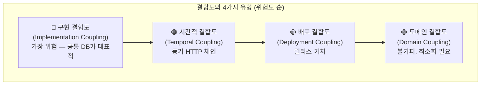

### 2-1. 구현 결합도 — 가장 위험한 형태

구현 결합도(Implementation Coupling)는 책에서 "내가 본 것 중 가장 위험한 형태의 결합도"라고 명시적으로 표현한다. 아이러니하게도 가장 쉽게 결합도를 낮출 수 있는 유형이기도 하다.

구현 결합도에서는 B의 구현 방식에 따라 A가 B에 결합된다. B의 구현이 변경될 때 A 또한 변경된다. 핵심 문제는 구현 세부사항을 종종 개발자가 임의로 선택한다는 점이다. 해결 방법은 여러 가지인데, 개발자는 그중 하나를 선택하지만 마음이 바뀔지도 모른다. 우리가 구현을 바꾸려고 할 때, 컨슈머를 망가뜨리지 않기를 원한다.

**가장 고전적이고 일반적인 예가 데이터베이스 공유다.** 책의 그림 1-9는 이 문제를 명확하게 보여준다. 주문 서비스가 시스템에 배치된 모든 주문의 음반을 포함하는 데이터베이스를 소유하고 있는데, 추천 서비스가 고객에게 이전 구매를 기반으로 음반을 제안하기 위해 이 데이터베이스에 직접 접근한다.

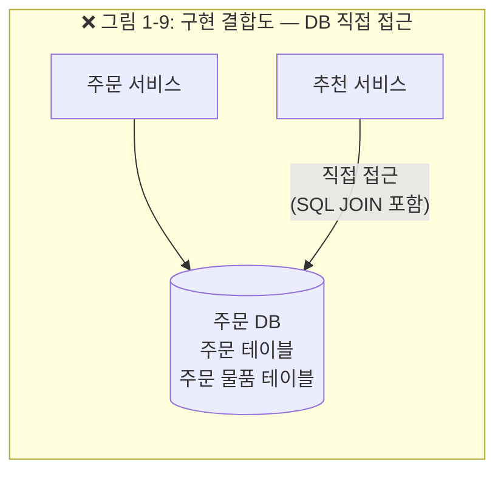

이 구조에서 추천 서비스는 구체적인 스키마 구조, SQL 언어, 심지어 행의 내용까지 주문 서비스의 구현 내용과 결합된다. 주문 서비스가 열 이름을 변경하거나 고객 주문 테이블을 분리한다면, 개념적으로 여전히 주문 정보를 포함하지만 추천 서비스가 이 정보를 가져오는 구현 방식을 망가뜨린다.

**해결책 1 — API 호출로 구현 세부사항 숨기기(그림 1-10)**

추천 서비스는 주문 서비스의 내부 데이터베이스에 직접 접근하는 대신, 주문 서비스가 공개하는 API를 통해 필요한 정보에 접근한다. 주문 서비스 내에서 변경된 사항은 공개 계약을 유지하는 한 컨슈머에게 보이지 않는다. 주문 서비스는 내부 구현을 자유롭게 바꿀 수 있다.

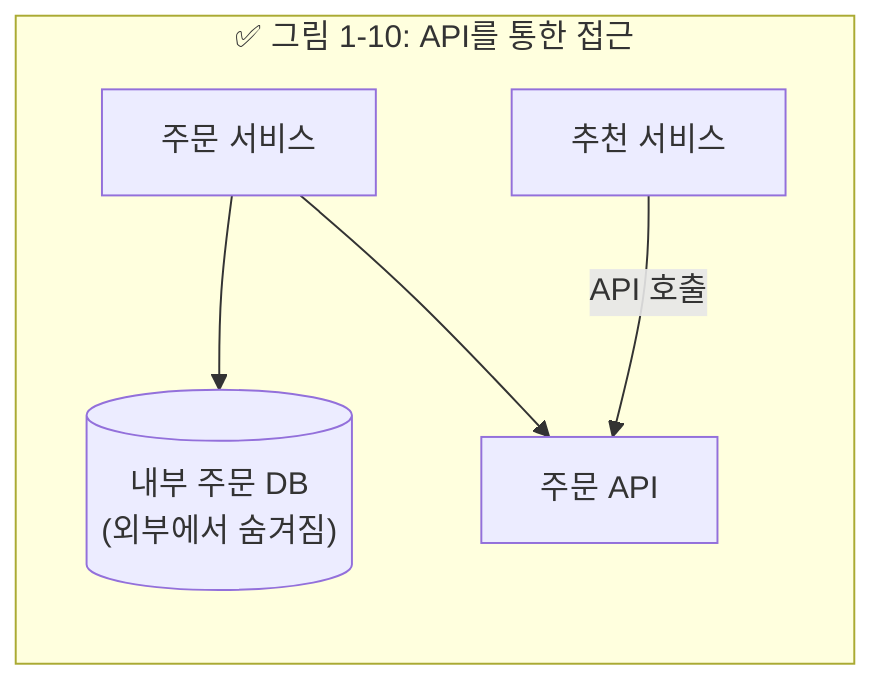

**해결책 2 — 공개 데이터 집합 게시(그림 1-11)**

또한 주문 서비스가 데이터베이스 형태로 데이터 집합을 게시하도록 만들 수도 있다. 컨슈머가 대량으로 접근하기 위해 사용됨을 의미한다. 주문 서비스가 적절히 데이터를 게시할 수 있는 한, 공개 계약을 유지하므로 주문 서비스 내에서 변경된 사항은 컨슈머에게 보이지 않는다. 공개된 데이터베이스는 내부 데이터베이스와 구조가 다르다.

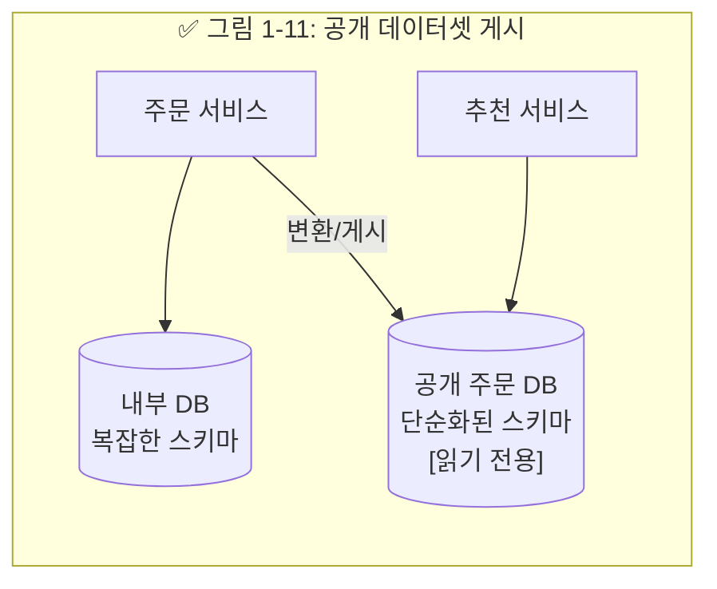

두 방법 모두 정보 은닉을 사용한다. 잘 정의된 서비스 인터페이스 뒤에 데이터베이스를 숨기면 서비스가 노출 대상의 범위를 제한하고 데이터 표현 방식을 변경할 수 있다.

또한 중요한 설계 원칙이 있다. 서비스 인터페이스를 정의할 때는 **'외부에서 내부로'라는 사고 방식**이 유용하다. 먼저 서비스 컨슈머의 입장에서 생각해 서비스 인터페이스를 설계한 다음, 해당 서비스 계약을 구현한다. 나쁜 접근법은 이와 반대다. 서비스를 담당하는 팀이 데이터 모델이나 다른 내부 구현 세부사항을 가져와서 외부 세계에 이를 공개하려는 것이다. '외부에서 내부로' 사고 방식은 "서비스 컨슈머가 무엇을 원하는가?"라는 질문에서 출발한다.

### 2-2. 시간적 결합도 — 동기 호출 체인의 위험

시간적 결합도(Temporal Coupling)는 주로 분산 환경에서 동기식 호출의 주요 도전과제 중 하나인 실행 시간에 발생하는 문제다. 메시지가 전송되는 시점과 메시지가 처리되는 방식이 시간과 관련되어 있는 경우, 시간적 결합도가 존재한다.

책의 그림 1-12는 세 서비스가 동기식 HTTP 체인으로 연결된 경우를 보여준다. 주문에 대해 필요한 정보를 가져오기 위해 창고 서비스에서 다운스트림 주문 서비스로 향하는 동기식 HTTP 호출이 있다. 요청을 충족하기 위해 주문 서비스는 계속해서 HTTP 호출을 통해 고객 서비스에서 정보를 가져와야 한다. 이와 같은 전체 연산을 완료하려면 창고, 주문, 고객 서비스가 모두 작동하고 네트워크로 연결돼 있어야 한다.

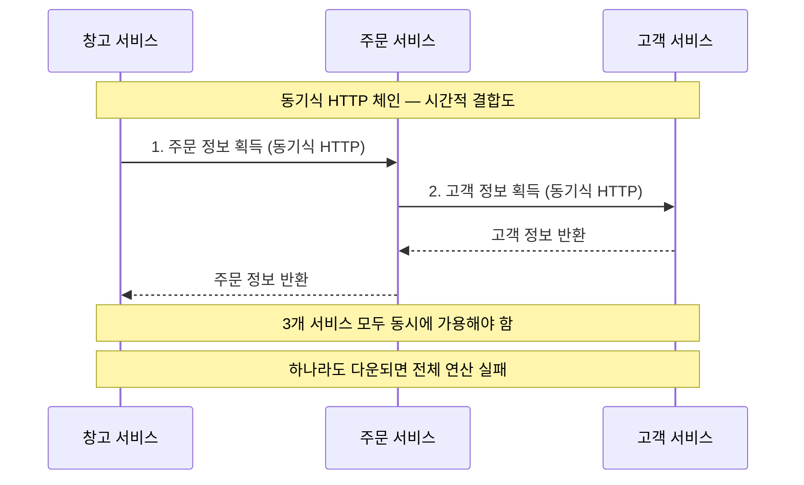

이 문제는 다양한 방법으로 해소할 수 있다. 첫째, 주문 서비스가 고객 서비스에서 필요한 정보를 캐시하면 주문 서비스는 몇몇 경우에 다운스트림 서비스와 시간적 결합도를 피할 수 있다. 둘째, 요청을 보내기 위해 메시지 브로커 같은 서비스를 사용하는 비동기 전송을 고려할 수도 있다. 메시지 브로커가 메시지를 다운스트림 서비스로 보내 놓으면 다운스트림 서비스가 여유가 생긴 시점에 해당 메시지를 처리한다.

### 2-3. 배포 결합도 — 릴리스 기차의 함정

배포 결합도(Deployment Coupling)는 정적으로 링크된 여러 모듈로 구성된 단일 프로세스를 상상하면 이해하기 쉽다. 모듈 중 한 곳에서 코드 한 줄이 변경되었으며 해당 변경사항을 배포하기를 원한다. 이렇게 하려면, 심지어 변경되지 않은 모듈들을 포함해 전체 모놀리스를 배포해야 한다. 모든 것이 반드시 함께 배포되어야 하므로 배포 결합도가 존재한다.

**릴리스 기차(Release Train)** 라는 패턴이 이 문제를 잘 보여준다. 릴리스 기차를 사용하면 일반적으로 반복 일정 형태로 사전에 계획된 릴리스 일정을 미리 작성해 놓는다. 릴리스 시점에 마지막 릴리스 기차 배포 이후의 모든 변경사항이 배포된다. 이 방식은 복잡한 배포 과정을 전혀 고민하지 않고 릴리스 기차 프로세스의 일부로 모든 서비스를 한 번에 배포하는 결과를 낳는다.

배포에는 위험이 따른다. 배포와 관련된 위험을 줄이는 방법 중 하나는 변경할 필요가 있는 사항만 바꾸는 것이다. 릴리스 규모가 작을수록 위험 부담도 줄어든다. 잘못될 것이 적기 때문이다. 변경을 줄였기 때문에 뭔가가 잘못되어도 문제를 찾아내 해결하기가 쉬워진다. 릴리스 규모를 줄이는 방법을 찾는 것은 지속적인 배포의 핵심이며, 빠른 피드백과 맞춤식 릴리스 방법의 중요성을 뒷받침한다.

샘 뉴먼은 이 맥락에서 마이크로서비스에 관심을 갖게 된 계기를 밝히기도 한다. 지속적인 전달(Continuous Delivery)에 대해 연구하며 마이크로서비스가 지속적인 전달을 더 쉽게 만드는 아키텍처라는 것을 발견했다는 것이다.

### 2-4. 도메인 결합도 — 피할 수 없지만 최소화할 수 있다

도메인 결합도(Domain Coupling)는 기본적으로 여러 독립적인 서비스로 구성된 시스템은 참여자 간에 상호작용이 있어야만 동작한다는 사실에서 비롯된다. 마이크로서비스 아키텍처에서 도메인 결합도는 결과며, 서비스 간의 상호작용은 실제 도메인에서 일어나는 상호작용을 모델링한다.

뮤직 사의 구체적인 예를 들면, 고객이 CD를 주문하면 창고에서 일하는 작업자들은 어떤 물품을 선택하고 포장해야 할지, 물품을 어디로 보내야 할지를 알아야 한다. 따라서 주문에 대한 정보는 창고 작업자들과 공유해야 한다.

도메인 결합도는 어느 정도 피할 수 없다. 하지만 우리가 공유하려는 개념이 무엇인지, 또 그 개념을 어떻게 공유해야 하는지를 신중하게 생각한다면 결합도 수준을 줄이려는 목표를 달성할 수 있다.

**중요한 것은 "얼마나 공유하는가"이다.** 그림 1-13부터 1-16까지는 이 스펙트럼을 보여준다.

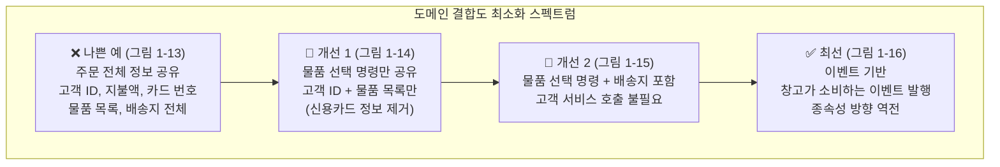

**그림 1-13 (주문 전체 정보 공유의 문제)**

주문 처리 서비스는 주문의 모든 세부사항을 창고 서비스로 전송한 다음, 물품을 포장하도록 만든다. 여기서 주문에는 고객 ID, 지불액, 카드 번호, 물품 목록 등이 모두 포함된다. 그러나 창고는 포장할 대상 물품과 배송지에 대한 정보만 필요하기 때문에 이런 접근은 합리적이지 않을 수도 있다. 물품 가격이 얼마인지는 알 필요가 없으며, 전체 주문을 공유할 경우 전혀 무관한 서비스에 신용카드 세부정보를 노출할 수도 있다.

**그림 1-14/1-15 (물품 선택 명령 — 최소 필요 데이터만 공유)**

이보다는 '창고' 서비스가 요구하는 정보만 포함한 '물품 선택 명령'이라는 새로운 도메인 개념을 생각할 수 있다. 이는 정보 은닉의 또 다른 예다. 창고 서비스가 고객에 대해 알아야 할 필요성조차 없애는 방식으로, 결합도를 더욱 줄일 수도 있다. 물품 선택 명령에 배송지 주소를 포함하면 창고가 고객 서비스를 따로 호출할 필요가 없어진다.

**그림 1-16 (이벤트 기반 접근 — 종속성 역전)**

대안으로 주문 처리에서 창고가 소비하도록(consume) 이벤트를 발생시키는 방식도 가능하다. 창고가 소비하는 이벤트를 발생시키는 방식으로, 종속성을 효과적으로 뒤집을 수 있다. 주문 처리 서비스로부터 주문 명령 이벤트를 수신하는 창고 서비스로 초점을 이동한다.

---

## 3. 도메인 주도 설계(DDD) — 집계와 바운디드 컨텍스트

이미 설명했듯이 비즈니스 도메인을 중심으로 서비스를 모델링하면 마이크로서비스 아키텍처에 엄청난 장점이 생긴다. 문제는 이 모델을 구현하는 방법인데, 여기서 도메인 주도 설계(Domain-Driven Design, DDD)가 등장한다.

에릭 에반스의 책 『도메인 주도 설계』는 프로그램에서 문제 도메인을 더 잘 표현하는 데 도움이 되는 일련의 중요한 개념을 제시했다.

### 집계(Aggregate)

도메인 주도 설계에서 **집계(Aggregate)** 는 다소 혼란스러운 개념이며, 다양한 정의가 존재한다. 집계는 단순히 임의의 객체 모음이 아니다. 데이터베이스에서 꺼내야 하는 가장 작은 단위는 무엇일까? 저자는 항상 집계를 실제 도메인 개념의 표현으로 간주하는 모델로 사용해왔다. 주문, 송장, 재고 물품 등과 같은 요소를 생각해보자.

집계는 일반적으로 수명주기가 있으므로 **상태 머신(State Machine)** 으로 구현할 수 있다. 예를 들어 주문은 "접수됨 → 처리 중 → 발송됨 → 배송완료"라는 상태 전이가 있다. 우리는 집계를 독립된 단위로 취급하기를 원한다. 집계의 상태 전이를 처리하는 코드를 상태 자체와 함께 그룹으로 묶기를 원한다.

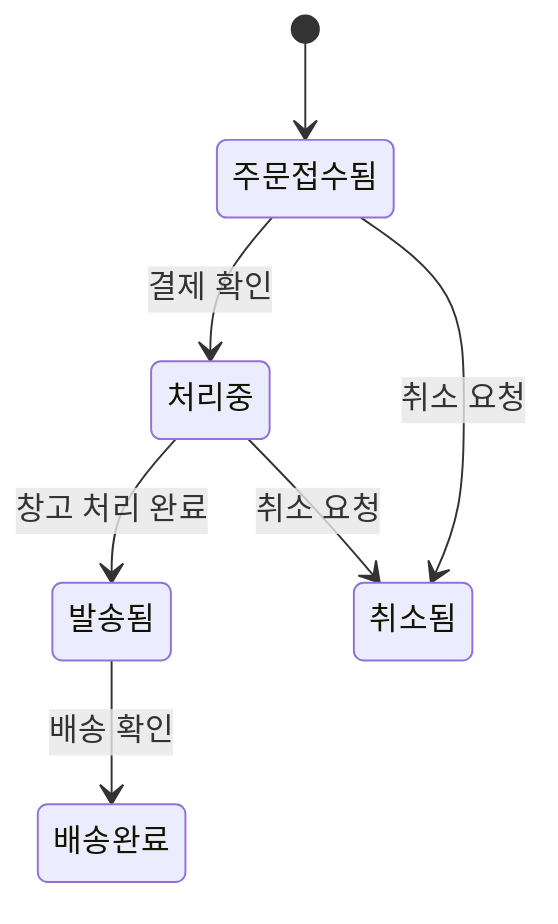

집계와 마이크로서비스를 생각해보면, 단일 마이크로서비스는 하나 이상의 다양한 집계의 수명주기와 데이터 저장소를 처리할 것이다. 다른 서비스의 기능이 이와 같은 집계 중 하나를 변경하려는 경우, 해당 집계의 변경을 직접 요청하거나, 집계 자체를 시스템의 다른 구성 요소에 반응시켜서 시스템 자체의 상태 전환을 개시해야 한다.

여기서 이해해야 할 핵심은 외부 시스템이 집계 내의 상태 전이를 요청하면 집계가 거절할 수도 있다는 사실이다. 이상적으로는 불법적인 상태 전환이 불가능한 방식으로 집계를 구현하고자 한다.

책의 그림 1-17은 결제 서비스가 송장 집계에서 대금 지급 전환을 일으키는 두 가지 방법을 보여준다. 하나는 직접 요청 방식(결제 서비스 → 송장 집계에 대금 지불 요청)이고, 다른 하나는 이벤트 기반 방식(결제 서비스 → 대기열에 이벤트 발행 → 송장 집계가 이벤트 수신 후 상태 전환)이다.

집계는 다른 집계와 관련이 있을 수도 있다. 하나의 고객 집계는 하나 이상의 주문 집계와 연관될 수 있다. 고객과 주문을 별도의 집계로 모델링하기로 결정했으며, 각각 다른 서비스에서 처리할 수 있다.

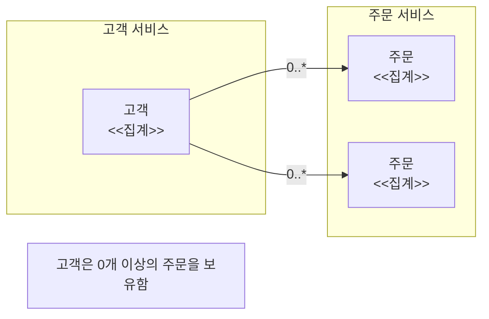

시스템을 집계로 분해하는 방법은 많으며, 몇몇 선택은 아주 주관적이다. 저자는 처음 시작할 때는 구현 문제를 부차적인 것으로 생각하고, 처음에는 다른 요소가 작동할 때까지 시스템 사용자의 멘탈 모델(Mental Model)을 초기 설계에 대한 지침으로 삼는다. 비개발자 동료의 도움을 받아 이런 도메인 모델을 구성하는 데 도움이 되는 협업 방식의 일환인 **이벤트 스토밍(Event Storming)** 을 2장에서 소개한다.

---

## 4. 핵심 실전 질문: 공통 DB + SQL JOIN은 허용되는가?

> "MSA 설계 어디까지 해야 하는 것인가?  
> 구축 기간이 짧으면 공통 DB를 두고 SQL JOIN하는 것 정도는 허용해도 되는 것인가?  
> 구축 기간이 짧은데 타 도메인 데이터는 반드시 API 호출해 사용하도록 설계해야 하는 것일까?"

이 질문은 현장에서 가장 자주 제기되는 현실적인 질문이다. 솔직하게, 그리고 충분한 근거를 가지고 답하겠다.

### 4-1. 책이 말하는 원칙

Sam Newman의 책은 이 질문에 대해 명확한 원칙을 제시한다.

**구현 결합도는 "가장 위험한 형태의 결합도"다.** 그리고 공통 데이터베이스 공유는 구현 결합도의 가장 고전적인 예다. 책은 반복적으로 강조한다: "정말로 필요한 경우가 아니라면 데이터베이스는 공유하지 말자. 독립적인 배포 가능성을 원한다면, 데이터베이스 공유는 여러분이 할 수 있는 최악의 선택 중 하나다."

하지만 Sam Newman은 교조적이지 않다. 그는 MSA의 장단점을 누구보다 잘 알고 있으며, "마이크로서비스가 필요하지 않을 수도 있다"는 것을 인정한다. 이것이 중요한 출발점이다.

### 4-2. 공통 DB 패턴의 공식적 위상

Chris Richardson의 microservices.io는 **공통 데이터베이스(Shared Database)** 를 공식적으로 하나의 패턴으로 정의하고 있다. 장점과 단점이 명확하다:

**장점**
- 개발자에게 친숙한 ACID 트랜잭션으로 데이터 일관성 보장
- 단일 데이터베이스는 운영이 단순하다
- 크로스 서비스 데이터 쿼리(JOIN)가 쉽다
- 초기 개발 속도가 빠르다

**단점**
- **개발 시간 결합(Development-Time Coupling)**: 서비스 A 팀이 스키마를 변경하면 같은 테이블을 사용하는 서비스 B 팀과 조율해야 한다. 이것이 개발 속도를 늦추고 팀 자율성을 해친다.
- **런타임 결합(Runtime Coupling)**: 모든 서비스가 같은 데이터베이스를 사용하므로 서로 간섭할 수 있다. 고객 서비스의 장기 실행 트랜잭션이 주문 테이블에 락을 걸면 주문 서비스가 블록된다.
- **단일 장애점**: 데이터베이스가 다운되면 모든 서비스가 다운된다.
- **기술 선택 제약**: 모든 서비스가 같은 데이터베이스 기술을 사용해야 한다.

### 4-3. 현실에서의 스펙트럼과 판단 기준

"MSA를 하면서 공통 DB + SQL JOIN을 써도 되는가?"라는 질문보다 먼저 물어야 할 질문이 있다: **"지금 상황에서 MSA가 맞는 선택인가?"**

현실에서 존재하는 스펙트럼은 다음과 같다:

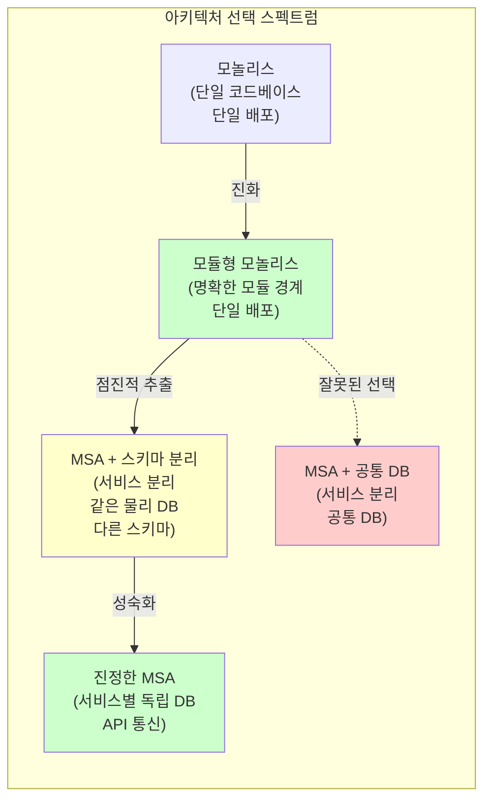

**MSA + 공통 DB + SQL JOIN (빨간 박스)** 이 왜 위험한 선택인지, 그리고 **모듈형 모놀리스**와 **MSA + 스키마 분리**가 왜 더 나은 대안인지를 이제 자세히 설명한다.

### 4-4. 기간이 짧을 때 권장하는 실용적 전략

#### 전략 A: 모듈형 모놀리스 (Modular Monolith) — 가장 권장

**기간이 짧다면, MSA보다 잘 설계된 모놀리스가 더 나은 선택일 수 있다.**

Martin Fowler가 제안한 "MonolithFirst" 패턴의 핵심은 이것이다: 처음부터 MSA를 구축하면 나중에 경계를 잘못 설정했음을 깨달을 때 수정 비용이 크다. 모놀리스로 시작해서 비즈니스 도메인을 충분히 이해한 뒤, 필요한 부분만 서비스로 추출하는 것이 더 안전하다.

모듈형 모놀리스는 다음을 의미한다:
- 단일 코드베이스이지만 명확한 모듈 경계 (패키지/네임스페이스/서브도메인)
- 각 모듈은 자신의 데이터만 소유 (같은 DB지만 모듈별 테이블 명확히 구분)
- 모듈 간 통신은 공식 인터페이스를 통해서만 (직접 DB 조인 대신 서비스 레이어 호출)
- 단일 프로세스로 배포

이 구조는 나중에 MSA로의 추출(Strangler Fig 패턴)을 용이하게 한다. Shopify가 수년간 모듈형 모놀리스를 운영하다가 체크아웃, 사기감지 같은 특정 기능만 마이크로서비스로 추출한 것이 좋은 예다.

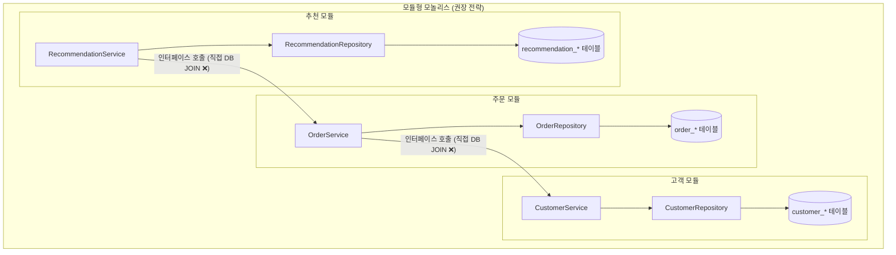

#### 전략 B: MSA + 스키마 분리 (Schema-per-Service) — 현실적 타협점

진짜로 MSA를 해야 한다면, 같은 물리적 데이터베이스를 쓰더라도 **스키마를 서비스별로 분리**하는 것이 올바른 중간 지점이다. 이것이 "Schema-per-Service" 패턴이다.

핵심 규칙은 단 하나다: **다른 서비스의 스키마에 직접 SQL JOIN하는 것은 절대 금지.** 크로스 서비스 데이터 접근은 반드시 API 호출을 통해야 한다. 단지 같은 물리적 서버를 공유할 뿐이다.

이 접근의 장점은 다음과 같다:
- 논리적 독립성: 스키마 변경이 다른 서비스에 직접 영향을 미치지 않는다
- 인프라 비용 절감: 소규모 팀에서 여러 DB 서버를 운영하는 부담을 줄인다
- 나중에 물리적 DB 분리가 용이하다 (연결 문자열만 바꾸면 됨)

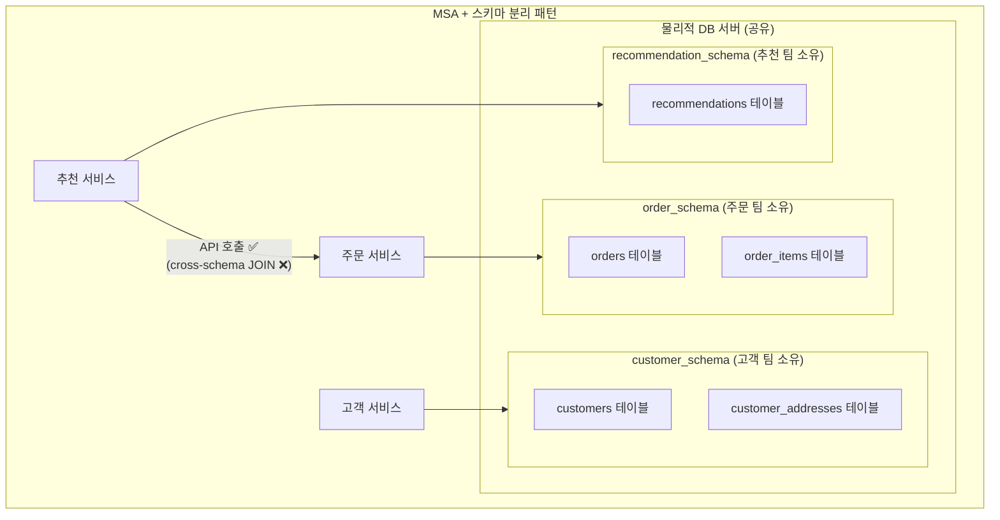

#### 전략 C: MSA + 공통 DB + 크로스 서비스 SQL JOIN (절대 금지)

이것은 **"분산 모놀리스(Distributed Monolith)"** 를 만드는 확실한 방법이다. 다음과 같은 이유로 절대 허용되어서는 안 된다:

**기술 부채가 기하급수적으로 누적된다.** "일단 붙여놓고 나중에 분리하자"는 계획은 현실에서 거의 실현되지 않는다. 시간이 지날수록 크로스 서비스 JOIN이 늘어나고, 나중에 분리하는 비용이 처음부터 제대로 설계하는 비용보다 훨씬 커진다.

**팀 자율성이 완전히 사라진다.** 서비스 A 팀이 스키마를 변경하려면 서비스 B 팀, C 팀과 조율해야 한다. MSA의 핵심 가치인 독립적 배포 가능성이 없어진다.

**장애 영향이 전파된다.** 하나의 서비스가 잘못된 쿼리로 DB 락을 장시간 점유하면, 같은 DB를 사용하는 모든 서비스가 영향을 받는다.

**스키마 변경이 도미노 장애를 일으킨다.** 서비스 A가 컬럼 이름을 변경하면, 그 컬럼에 의존하는 모든 서비스의 코드가 동시에 변경되어야 한다. 이것은 이미 모놀리스와 다를 바가 없다.

---

## 5. 종합 정리 — MSA 설계의 "어디까지"에 대한 답변

이 질문들에 대한 최종 답변을 정리하면 다음과 같다:

**Q1: MSA 설계 어디까지 해야 하는가?**

MSA는 목표가 아니라 수단이다. "마이크로서비스를 했다"는 사실이 중요한 것이 아니라, 독립적 배포 가능성, 비즈니스 도메인 중심 설계, 데이터 소유권이라는 핵심 원칙을 얼마나 구현했느냐가 중요하다. 구축 기간이 짧다면 잘 설계된 모듈형 모놀리스가 어설픈 MSA보다 훨씬 낫다.

**Q2: 공통 DB + SQL JOIN은 허용되는가?**

단기 타협으로 공통 물리 DB를 쓰는 것은 조건부로 허용 가능하다. 단, 반드시 **스키마 분리(Schema-per-Service)** 를 유지하고, **크로스 서비스 SQL JOIN은 절대 금지**해야 한다. 이 규칙을 어기는 순간 분산 모놀리스가 되며, 나중에 해소하는 비용이 처음부터 제대로 설계하는 비용보다 훨씬 커진다.

**Q3: 타 도메인 데이터는 반드시 API 호출로 사용해야 하는가?**

원칙적으로 예스(Yes)다. 선택지는 다음과 같다:

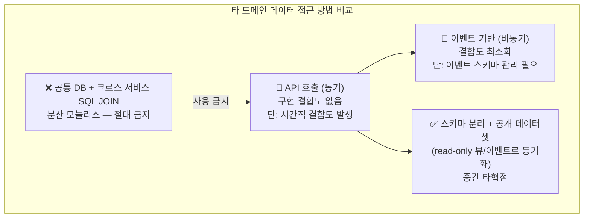

빠른 구축이 필요한 현실에서 선택 순서는 다음과 같다:

1. **1순위**: 정말 MSA가 필요한지 다시 검토하고, 모듈형 모놀리스 선택
2. **2순위**: MSA를 해야 한다면, 스키마 분리 + API 호출 (크로스 스키마 JOIN 금지)
3. **3순위**: 성능 이슈가 있는 특정 읽기 쿼리에 한해, CQRS 읽기 모델 (비동기 동기화된 별도 읽기 전용 데이터)
4. **절대 금지**: 공통 DB + 크로스 서비스 SQL JOIN (이것은 MSA가 아닌 분산 모놀리스)

가장 중요한 교훈: **"나중에 고치면 된다"는 생각이 가장 위험하다.** 구현 결합도는 코드베이스에 뿌리내릴수록 제거하기 어려워진다. 짧은 구축 기간이라는 제약이 있다면, 어설픈 MSA 대신 잘 설계된 모듈형 모놀리스를 선택하고, 진짜 MSA는 도메인 경계가 충분히 명확해졌을 때 점진적으로(Strangler Fig 패턴) 추출하는 것이 Sam Newman이 일관되게 권장하는 접근법이다.

---

## 참고 — 결합도 유형 요약표

| 결합도 유형 | 위험도 | 주요 원인 | 해결 방향 |
|---|---|---|---|
| 구현 결합도 | 🔴 최고 | 공통 DB, 내부 구현 직접 접근 | API 호출, 정보 은닉, 스키마 분리 |
| 시간적 결합도 | 🟠 높음 | 동기 HTTP 체인 | 캐싱, 비동기 메시지, 이벤트 기반 |
| 배포 결합도 | 🟡 중간 | 릴리스 기차, 함께 배포 | 독립 배포 파이프라인, CD |
| 도메인 결합도 | 🟢 불가피 | 서비스 간 협업 필요 | 필요 최소 데이터만 공유, 명령/이벤트 설계 |

---

