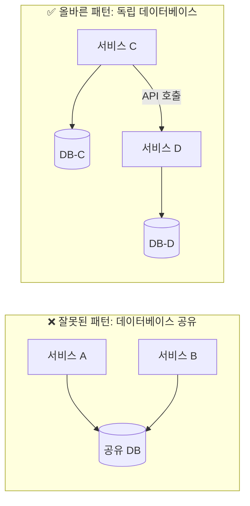
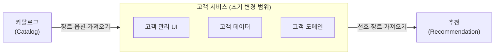
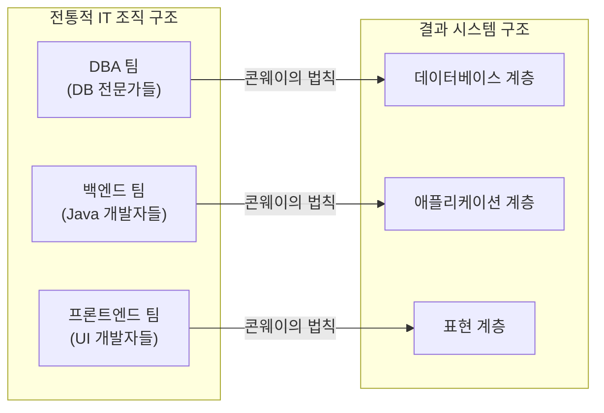
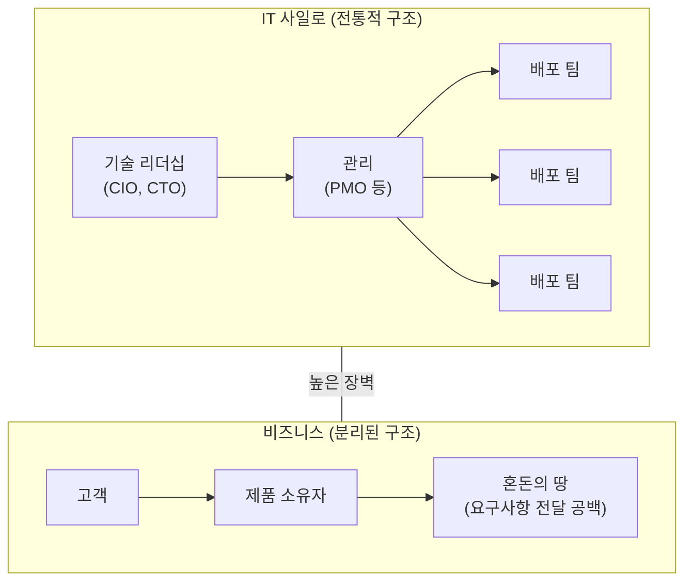
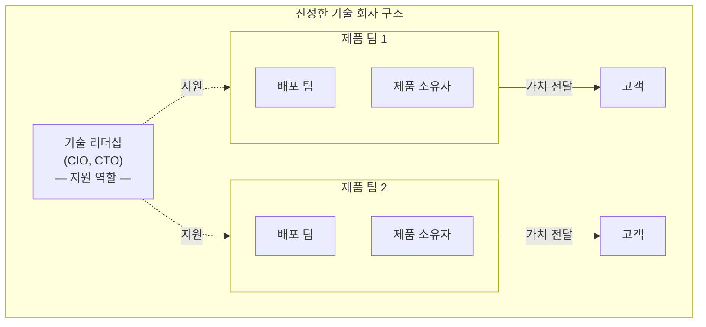
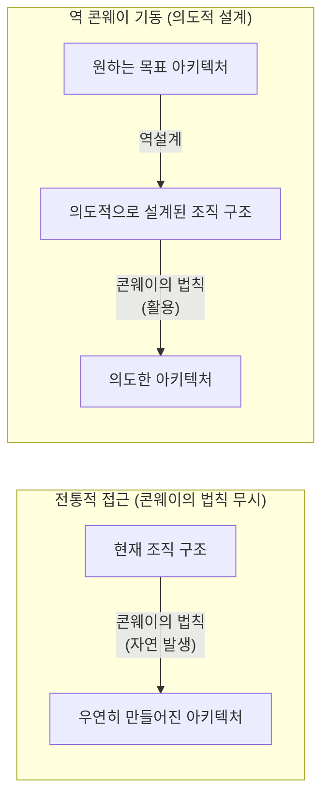
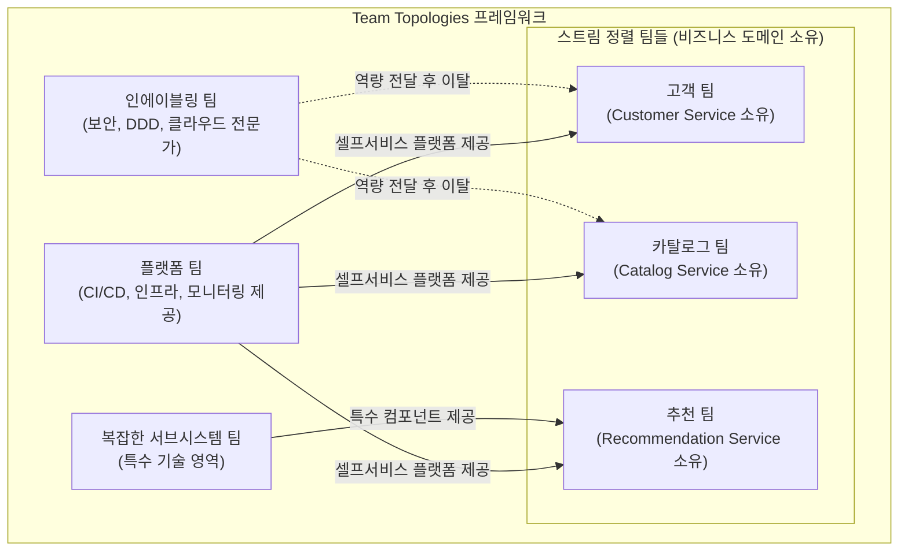
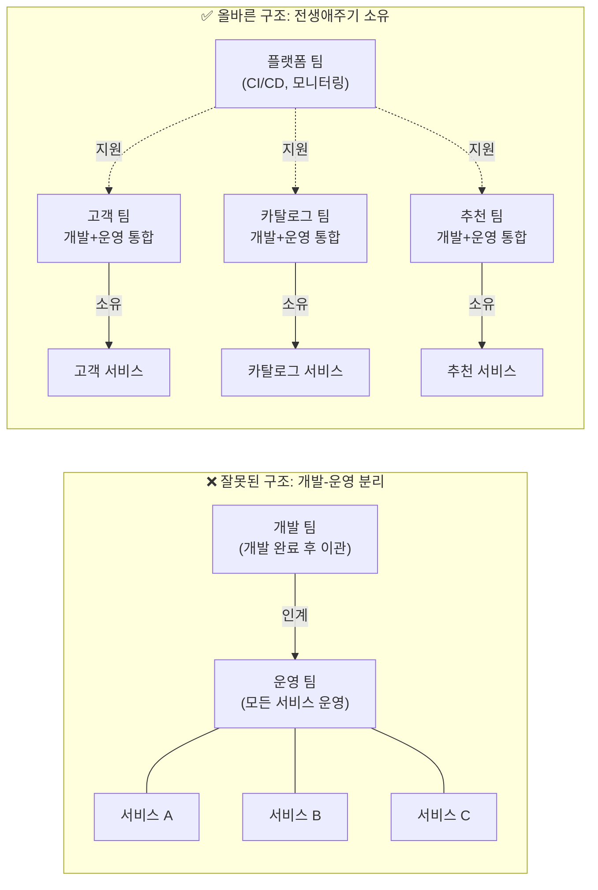
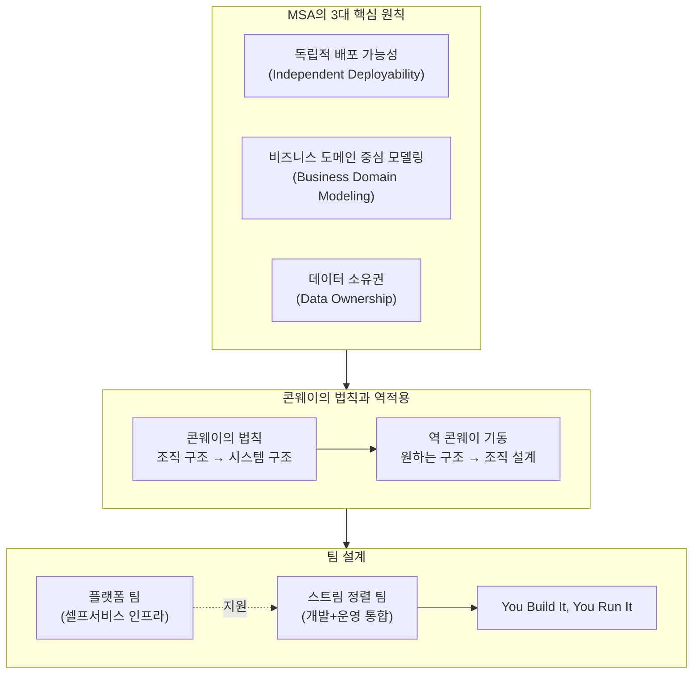

## 1장 상세 해설

> **원서**: Sam Newman, [*Monolith to Microservices: Evolutionary Patterns to Transform Your Monolith*](https://github.com/shubhamverma23/books/blob/master/Monolith%20to%20Microservices%20Evolutionary%20Patterns%20to%20Transform%20Your%20Monolith%20by%20Sam%20Newman%20(z-lib.org).pdf) (O'Reilly, 2019)  
> **한국어판**: [마이크로서비스 도입, 이렇게 한다](https://ebook.library.kr/detail?id=4801189909254&contentType=EB) — 기업의 유연성과 확장성을 높이는 마이크로서비스 마이그레이션 패턴과 현장 사례  
> (책만, 2021-01-20 / 옮긴이: 박재호)  
> 본 문서는 책의 1장(pp.27~38)을 중심으로 핵심 개념을 해설하고,  
> "콘웨이의 법칙에 따라 개발 조직과 운영 조직을 동시에 설계해야 하는가?"  
> 라는 실천적 질문에 대한 심층 답변을 포함합니다.

---

## 목차

1. [이 책은 어떤 책인가?](#1-이-책은-어떤-책인가)
2. [마이크로서비스란 무엇인가?](#2-마이크로서비스란-무엇인가)
3. [독립적인 배포 가능성 — MSA의 핵심 철학](#3-독립적인-배포-가능성--msa의-핵심-철학)
4. [비즈니스 도메인을 중심으로 하는 모델링](#4-비즈니스-도메인을-중심으로-하는-모델링)
5. [콘웨이의 법칙 — 조직 구조는 시스템 구조를 결정한다](#5-콘웨이의-법칙--조직-구조는-시스템-구조를-결정한다)
6. [데이터 소유권 문제 — 데이터베이스를 공유하지 마라](#6-데이터-소유권-문제--데이터베이스를-공유하지-마라)
7. [소유권 모델 — IT 사일로 vs. 진정한 기술 회사](#7-소유권-모델--it-사일로-vs-진정한-기술-회사)
8. [콘웨이의 법칙 역적용 (Inverse Conway Maneuver)](#8-콘웨이의-법칙-역적용-inverse-conway-maneuver)
9. [Team Topologies — 현대적 MSA 조직 설계 프레임워크](#9-team-topologies--현대적-msa-조직-설계-프레임워크)
10. [핵심 질문: 개발과 운영, 모두 콘웨이의 법칙으로 조직해야 하는가?](#10-핵심-질문-개발과-운영-모두-콘웨이의-법칙으로-조직해야-하는가)
11. [실천적 적용 — 프로젝트에서 어떻게 할 것인가?](#11-실천적-적용--프로젝트에서-어떻게-할-것인가)
12. [종합 정리](#12-종합-정리)

---

## 1. 이 책은 어떤 책인가?

샘 뉴먼(Sam Newman)의 *마이크로서비스 도입, 이렇게 한다(Monolith to Microservices)* 는 기존의 모놀리스 시스템을 마이크로서비스 아키텍처로 점진적으로 전환하는 방법을 집중적으로 다룬 책이다. 저자는 ThoughtWorks에서 12년을 보낸 뒤 독립 컨설턴트로 활동 중인 소프트웨어 아키텍트로, 마이크로서비스 분야의 선구자다. 이 책은 같은 저자의 베스트셀러 *Building Microservices(마이크로서비스 아키텍처 구축, 한빛미디어)* 의 동반 서적(Companion Book)으로 기획되었다. *Building Microservices*가 마이크로서비스 아키텍처 전반을 다루는 반면, 이 책은 이미 존재하는 모놀리스를 처음부터 다시 작성하지 않고 점진적으로 마이크로서비스로 전환하는 실용적인 패턴과 전략에 초점을 맞춘다.

책의 1장은 "더도 덜도 아닌 딱 마이크로서비스"라는 제목으로, 마이크로서비스 전반에 대한 보편적 이해를 공유하는 것을 목표로 한다. 저자가 서문에서 밝히듯, 이 장은 사람들이 자주 놓치는 미묘한 차이와 일반적인 오해들을 짚어주는 역할을 한다. 즉, 기술적 구현 세부사항보다 마이크로서비스의 본질이 무엇인지를 먼저 올바르게 이해시키는 데 집중한다.

---

## 2. 마이크로서비스란 무엇인가?

책은 마이크로서비스(Microservice)를 **"비즈니스 도메인을 중심으로 모델링된 독립적으로 배포 가능한 서비스"** 라고 정의한다. 이 정의에는 세 가지 핵심 요소가 담겨 있다.

첫째, **비즈니스 도메인 중심(Business Domain-centric)** 이라는 것이다. 마이크로서비스의 경계는 기술적 계층(UI, 백엔드, 데이터베이스)이 아니라 비즈니스 기능의 경계에 따라 나뉜다. 예를 들어 "고객 관리", "카탈로그", "추천" 같은 비즈니스 기능 단위가 각각의 서비스가 된다.

둘째, **독립적 배포 가능성(Independent Deployability)** 이다. 다른 서비스에 영향을 주지 않고도 해당 서비스만 단독으로 변경하고 배포할 수 있어야 한다. 이것은 MSA의 가장 중요한 실천 원칙이다.

셋째, **네트워크 통신 기반**이다. 마이크로서비스들은 네트워크를 통해 서로 통신하며, 분산 시스템의 형태를 구성한다. 각 서비스는 잘 정의된 인터페이스를 통해 데이터와 기능을 외부에 공개하고, 데이터 저장소는 서비스 경계 내부에 숨겨진다.

기술적 관점에서 보면, 마이크로서비스는 SOA(서비스 지향 아키텍처, Service-Oriented Architecture)의 한 유형이지만, 독립적 배포를 핵심 원칙으로 삼는다는 점에서 전통적인 SOA와 차별화된다. 또한 기술에 중립적이라는 장점이 있어서, 각 서비스가 서로 다른 프로그래밍 언어, 데이터베이스, 프레임워크를 선택할 수 있다.

---

## 3. 독립적인 배포 가능성 — MSA의 핵심 철학

### 개념의 본질

독립적인 배포 가능성(Independent Deployability)이란 "다른 서비스를 활용하지 않고서 마이크로서비스에 변경을 가하는 방식으로 서비스 환경에 배포할 수 있다"는 개념이다. 샘 뉴먼은 이 책에서 얻어갈 교훈이 하나뿐이라면 바로 이 개념이라고 강조한다.

중요한 것은 이것이 단지 "가능하다"는 능력의 문제가 아니라, "실제로 시스템 내에서 배포를 관리하는 방법"이라는 점이다. 즉, 조직이 평소에 이 방식으로 배포를 운영해야 한다는 것이다. 개념은 단순하지만 실행은 복잡하다.

### 느슨한 결합(Loose Coupling)이 전제조건

독립적 배포를 실현하려면 서비스 간에 **느슨한 결합(Loosely Coupled)** 이 보장되어야 한다. 느슨한 결합이란 다른 서비스를 변경하지 않고도 특정 서비스만 변경할 수 있는 능력이다. 이를 위해서는 서비스 간에 명시적이고 잘 정의되며 안정적인 계약(Contract)이 필요하다.

느슨한 결합을 해치는 가장 흔한 원인 중 하나가 **데이터베이스 공유**다. 두 서비스가 하나의 데이터베이스를 공유하면, 한 서비스의 스키마 변경이 다른 서비스에 영향을 미치게 되어 독립적 배포가 불가능해진다.



---

## 4. 비즈니스 도메인을 중심으로 하는 모델링

### 3계층 아키텍처의 문제점

전통적인 소프트웨어 시스템은 3계층 아키텍처를 따른다. 웹 UI(표현 계층)와 백엔드(애플리케이션 계층), 그리고 데이터베이스(데이터 계층)로 구성되며, 각 계층은 서로 다른 팀이 소유한다. 책에서는 가상의 음반사 "뮤직(Music)"을 예로 들어 이를 설명한다.

3계층 구조에서 단순해 보이는 기능 하나를 변경하는 데도 세 계층 모두를 수정해야 하는 문제가 발생한다. 예를 들어 고객이 선호하는 음악 장르를 지정할 수 있는 기능을 추가하려면, 장르 선택 UI를 변경하고(UI 팀), 장르를 외부에 노출하고 장르 API를 변경하는 백엔드를 수정하고(백엔드 팀), 장르 선택을 저장하는 데이터베이스를 변경해야 한다(데이터베이스 관리자 팀). 이 세 변경사항은 각 팀에서 관리하고, 올바른 순서로 배포해야 한다.

이처럼 **프로세스 경계를 넘어서는 변경은 비용이 많이 든다.** 하나의 기능 변경을 위해 세 팀이 협력하고 세 번의 배포를 조정해야 한다는 것은 소프트웨어 출시 속도를 심각하게 저해한다.

```mermaid
graph TD
    subgraph OLD["3계층 아키텍처 — 기술 역량 기준 팀 분리"]
        direction TB
        UI_T["👥 UI 팀"] --> UI["웹 UI<br/>&#60;&#60;표현&#62;&#62;"]
        BE_T["👥 백엔드 팀"] --> BE["백엔드<br/>&#60;&#60;애플리케이션&#62;&#62;"]
        DB_T["👥 DB 관리자 팀"] --> DB["데이터베이스<br/>&#60;&#60;데이터&#62;&#62;"]
        UI --> BE --> DB
    end

    subgraph CHANGE["장르 기능 변경 시 영향 범위"]
        C1["UI 변경<br/>(장르 UI 제어)"]
        C2["백엔드 변경<br/>(장르 API 노출)"]
        C3["DB 변경<br/>(장르 선택 저장)"]
        C1 --> C2 --> C3
    end
```



### 비즈니스 기능 중심 아키텍처 — 해결책

기술 계층이 아니라 **비즈니스 기능**을 중심으로 팀과 서비스를 구성하면 이 문제가 해결된다. 책은 대안 아키텍처로 고객 서비스(Customer Service)를 제안한다. 이 서비스는 고객 관리 UI, 고객 데이터, 고객 도메인 로직을 모두 하나의 서비스 안에 캡슐화한다.

고객의 선호 장르 변경은 이제 고객 서비스 단독 변경으로 처리될 수 있다. 카탈로그 서비스에서 사용 가능한 장르 목록을 가져오고, 추천 서비스는 선호 장르 정보에 접근하지만, 선호 장르를 "기록하는" 책임은 오직 고객 서비스에 있다. 이렇게 변경의 범위가 지역화(localized)된다.



이렇게 구성하면 고객 서비스는 UI, 애플리케이션 로직, 데이터 저장소라는 3계층의 얇은 조각들을 모두 하나의 단일 서비스에 캡슐화한다. 비즈니스 기능의 응집력이 높아지고, 기술 계층 간 결합도는 낮아진다.

---

## 5. 콘웨이의 법칙 — 조직 구조는 시스템 구조를 결정한다

### 콘웨이의 법칙이란?

1968년 멜빈 콘웨이(Melvin Conway)가 발표한 논문에서 유래한 이 법칙은 다음과 같이 표현된다:

> **"시스템을 설계하는 모든 조직은 … 불가피하게 조직의 커뮤니케이션 구조를 본뜬 시스템 구조를 만들어 낼 것이다."**  
> — 멜빈 콘웨이, '위원회는 어떻게 발명할까?' 발표 중에서

이 법칙은 단순한 관찰이다. 소프트웨어 시스템의 경계와 인터페이스는 그것을 만든 조직의 팀 경계와 커뮤니케이션 경계를 반영한다는 것이다.

### 3계층 아키텍처가 왜 그토록 흔한가?

콘웨이의 법칙은 3계층 아키텍처가 왜 그렇게 보편적으로 사용되는지를 완벽하게 설명한다. 과거 IT 조직은 핵심 역량(기술 스킬)을 기준으로 사람들을 그룹으로 묶었다. 데이터베이스 관리자들끼리, 자바 개발자들끼리, 프론트엔드 개발자들끼리 팀을 구성했다. 그 결과 각 팀의 경계가 그대로 시스템의 계층 경계가 된 것이다. 3계층 아키텍처는 그 자체로 나쁜 것이 아니라, 특정 조직 구조의 자연스러운 산물인 것이다.



### 조직이 바뀌면 시스템도 바뀌어야 한다

책은 단순히 이 현상을 관찰하는 데 그치지 않고, 중요한 통찰을 제시한다. 소프트웨어에 대한 우리의 열망이 바뀌었다. 우리는 이제 사람들을 다재다능한 팀으로 묶어서 업무 이관과 사일로를 줄이고, 그 어느 때보다도 훨씬 더 빠르게 소프트웨어를 출시하길 원한다. 이런 변화를 통해 팀을 조직하는 방식이 달라졌고, 그 결과로 시스템을 분해하는 방식도 달라졌다.

3계층 아키텍처는 기술 관점에서 응집력이 높지만, **비즈니스 기능 관점에서는 응집력이 낮다.** 쉽게 변경할 수 있게 만들려면 코드를 기술 기준이 아니라 비즈니스 기능 기준으로 그룹화해야 한다.

---

## 6. 데이터 소유권 문제 — 데이터베이스를 공유하지 마라

마이크로서비스에서 가장 자주 발생하는 오해 중 하나는 "서비스들이 공통 데이터베이스를 공유하면 되지 않을까?"라는 생각이다. 그러나 이는 독립적 배포 가능성을 완전히 무너뜨리는 선택이다.

마이크로서비스 아키텍처에서는 **데이터를 소유한 서비스가 해당 데이터에 대한 유일한 관문**이 되어야 한다. 다른 서비스가 특정 데이터에 접근하고 싶다면, 그 데이터를 보유한 서비스를 찾아서 해당 데이터를 요청해야 한다. 이것이 서비스 인터페이스를 안정적으로 유지하는 핵심 메커니즘이다.

데이터베이스를 숨기는 것은 결합도를 낮추는 효과도 있다. 서비스를 뒷받침하는 데이터베이스를 내부에 숨기면, 비즈니스 기능의 응집력이 높아진다. 데이터와 행동(Behavior)을 함께 캡슐화하면 비즈니스 기능의 응집력이 높아지는 것이다.

> **핵심 원칙**: 정말로 필요한 경우가 아니라면 데이터베이스는 공유하지 말자. 아니 그보다 더, 피할 수 있는 모든 방법을 강구해야 한다. 독립적인 배포 가능성을 원한다면, 데이터베이스 공유는 여러분이 할 수 있는 최악의 선택 중 하나다.

---

## 7. 소유권 모델 — IT 사일로 vs. 진정한 기술 회사

### 전통적 IT 사일로의 문제

책의 그림 1-4는 전통적인 IT 조직의 모습을 보여준다. IT 부문(기술 리더십, 관리/PMO, 배포 팀들)과 비즈니스 부문(고객, 제품 소유자) 사이에 높은 장벽이 존재한다. 소프트웨어 개발이라는 행위는 실제로 요구사항을 정의하고 고객과 연결된 비즈니스와는 완전히 분리된 부문에서 처리된다. 이런 구조에서 발생하는 기능 장애는 매우 많고 다양하다.



이 구조에서는 기술 팀이 실제 비즈니스 요구사항을 이해하기 어렵고, 비즈니스 팀은 소프트웨어 개발의 제약을 이해하기 어렵다. 결과적으로 소프트웨어는 비즈니스와 분리된 채 만들어지고, 변경 요청은 긴 승인 프로세스를 거쳐야 한다.

### 진정한 기술 회사의 모습

책의 그림 1-5가 보여주는 진정한 기술 회사는 완전히 다른 모습이다. 배포 팀과 제품 소유자가 하나의 팀으로 결합되어 있으며, 이 팀이 고객에게 직접 가치를 전달한다. 기술 리더십(CIO, CTO)은 이 팀들을 "지원"하는 역할로 전환된다.



이 모델에서 배포 팀은 제품 라인을 중심으로 나란히 정렬된다. 서비스가 비즈니스 도메인을 중심으로 정렬된다면, 제품을 지향하는 배포 팀에 소유권을 명확하게 할당하는 작업은 훨씬 더 수월해진다. 즉, 비즈니스 도메인 지향 마이크로서비스 아키텍처를 통해 조직적인 구조에서 이런 변화는 훨씬 더 손쉽다.

---

## 8. 콘웨이의 법칙 역적용 (Inverse Conway Maneuver)

### 개념 정의

콘웨이의 법칙은 **"조직 구조가 시스템 구조를 결정한다"** 는 관찰이다. 그렇다면 역으로, **원하는 시스템 구조를 먼저 정하고, 그것에 맞게 조직 구조를 설계하면 어떨까?** 이것이 바로 "콘웨이의 법칙 역적용(Inverse Conway Maneuver)" 또는 "역 콘웨이 기동(Reverse Conway Maneuver)"이다.

이 개념은 ThoughtWorks의 기술 디렉터 제임스 루이스(James Lewis, 마이크로서비스라는 용어의 공동 제안자)가 주창한 것으로, 2015년경에 본격적으로 주목받기 시작했다. 핵심 아이디어는 다음과 같다:

> **원하는 아키텍처를 먼저 정의하고, 그 아키텍처를 따르는 방식으로 팀을 구성한다. 그러면 소프트웨어는 자연스럽게 그 아키텍처를 향해 진화한다.**



### 왜 이것이 중요한가?

마이크로서비스 도입 실패 사례의 상당수는 아키텍처만 바꾸고 조직을 바꾸지 않은 경우에서 발생한다. 3계층 팀 구조(UI 팀, 백엔드 팀, DB 팀)를 유지한 채로 마이크로서비스를 도입하면, 콘웨이의 법칙에 따라 결국 기술 계층으로 분리된 "분산 모놀리스(Distributed Monolith)"가 탄생한다. 네트워크 호출만 추가되었을 뿐, 실제로는 3계층 아키텍처의 모든 단점을 그대로 가진 최악의 상황이 된다.

---

## 9. Team Topologies — 현대적 MSA 조직 설계 프레임워크

책의 내용을 현대적 실천으로 발전시킨 프레임워크가 매튜 스켈턴(Matthew Skelton)과 마누엘 파이스(Manuel Pais)의 **Team Topologies**다. 2019년 출판된 동명의 책에서 제안된 이 프레임워크는 콘웨이의 법칙과 역 콘웨이 기동을 실천하기 위한 구체적인 팀 유형과 상호작용 모드를 정의한다.

### 4가지 기본 팀 유형

**스트림 정렬 팀(Stream-Aligned Team)** 은 단일한 가치 흐름(비즈니스 도메인, 제품 기능, 사용자 여정 등)에 정렬된 팀이다. 이 팀은 해당 비즈니스 도메인의 마이크로서비스를 설계, 개발, 테스트, 배포, 운영하는 전 과정을 책임진다. 다른 팀에 대한 핸드오프를 최소화하고, 이상적으로는 제로(0)에 가깝게 만드는 것이 목표다. Sam Newman의 책에서 제안하는 "비즈니스 도메인 중심의 자율적 팀"이 바로 스트림 정렬 팀에 해당한다.

**플랫폼 팀(Platform Team)** 은 스트림 정렬 팀들이 자율적으로 작업할 수 있도록 내부 서비스 플랫폼을 제공하는 팀이다. CI/CD 파이프라인, 인프라 자동화, 모니터링 도구, 보안 가이드라인 등을 셀프서비스(Self-Service) 방식으로 제공하여 스트림 정렬 팀의 인지 부하(Cognitive Load)를 줄인다.

**인에이블링 팀(Enabling Team)** 은 특정 기술 도메인의 전문가들로 구성된 임시적 컨설팅 팀이다. 스트림 정렬 팀의 역량 격차를 해소하는 역할을 하며, 목적을 달성하면 해산한다.

**복잡한 서브시스템 팀(Complicated Subsystem Team)** 은 고도로 전문적인 기술 지식이 필요한 특정 시스템(예: 수학적 모델링, 암호화 엔진 등)을 담당하는 팀이다.



---

## 10. 핵심 질문: 개발과 운영, 모두 콘웨이의 법칙으로 조직해야 하는가?

> "프로젝트에서 콘웨이의 법칙에 따라 조직(팀/모듈)을 구성해 MSA 시스템 개발을 하고, 운영전환 후에도 콘웨이의 법칙에 따라 조직(팀/모듈)을 구성해 MSA 시스템을 운영한다?"

이 질문에 대한 답은 **"예스(Yes) — 그리고 사실 이 두 단계를 분리해서 생각하는 것 자체가 문제의 근원이다"** 이다. 상세히 설명하겠다.

### 10-1. 콘웨이의 법칙은 항상 작동 중이다

콘웨이의 법칙은 "개발 중"에만 적용되는 것이 아니다. 시스템이 운영되는 동안에도, 조직이 존재하는 한 계속해서 작동한다. 팀의 커뮤니케이션 구조가 바뀌면 시스템도 그 방향으로 진화하기 시작한다.

따라서 역 콘웨이 기동의 핵심은 "소프트웨어가 완성되기 전에 팀 간 커뮤니케이션 구조를 재구성하는 것"이다. 이는 개발 초기부터 적용되어야 하며, 운영 전환 이후에도 유지되어야 한다.

### 10-2. "개발 팀"과 "운영 팀"을 분리하는 것이 왜 잘못인가?

전통적인 IT 조직에서는 개발 팀이 소프트웨어를 만들어 완성하면, 운영 팀(또는 인프라 팀, SI 유지보수 팀)에 인계하는 방식을 사용했다. 이것이 바로 IT 사일로의 핵심 패턴이다.

이 방식은 MSA에서 치명적인 문제를 일으킨다:

첫째, 운영 팀은 소프트웨어의 설계 의도를 모르기 때문에, 장애가 발생했을 때 신속하게 대응하기 어렵다. 문제를 파악하기 위해 개발 팀에 문의해야 하고, 이 과정에서 시간이 지체된다.

둘째, 개발 팀은 운영의 고통을 모르기 때문에, 운영하기 쉬운 소프트웨어를 설계하지 않는다. 로깅, 모니터링, 장애 복구 등의 관심사가 설계 단계에서 후순위로 밀린다.

셋째, 운영 팀이 여러 서비스(여러 개발 팀의 결과물)를 동시에 담당하게 되면, 콘웨이의 법칙에 의해 서비스 경계가 흐려지거나 운영 팀이 병목점(Bottleneck)이 된다.

### 10-3. "You Build It, You Run It" — MSA의 운영 원칙

아마존(Amazon)이 마이크로서비스로 전환하면서 확립한 원칙이 바로 **"You Build It, You Run It(만든 팀이 운영한다)"** 이다. 이는 콘웨이의 법칙의 자연스러운 귀결이다.

한 팀이 특정 비즈니스 도메인의 마이크로서비스를 설계→개발→테스트→배포→운영→모니터링하는 전 생애주기를 책임진다. 이 팀은 해당 서비스에 대한 온콜(On-call) 당직도 포함하여 24시간 책임을 진다.

이것이 가능하려면 두 가지 전제 조건이 충족되어야 한다. 하나는 팀이 충분히 작고 자율적이어야 한다는 것이고(Amazon의 Two-Pizza Team 원칙 — 피자 두 판으로 먹일 수 있는 크기, 통상 5~10명), 다른 하나는 플랫폼 팀이 배포, 모니터링, 인프라 등을 셀프서비스로 제공하여 스트림 정렬 팀의 인지 부하를 낮춰줘야 한다는 것이다.



### 10-4. 개발→운영 전환 시 조직이 어떻게 달라져야 하는가?

단계별로 보면 다음과 같다:

**[1단계: MSA 개발 초기 — 역 콘웨이 기동 적용]**  
먼저 원하는 서비스 경계(비즈니스 도메인 기반 바운디드 컨텍스트)를 정의한다. 그리고 각 서비스 경계에 대응하는 스트림 정렬 팀을 구성한다. 이때 팀은 백엔드, 프론트엔드, QA, DevOps 역량을 모두 갖춘 크로스펑셔널(Cross-functional) 팀이어야 한다. 팀의 경계가 곧 서비스의 경계가 되도록 설계한다.

**[2단계: 운영 전환 (Go-Live)]**  
기존 모놀리스 시스템에서 MSA로 전환할 때, 팀 구조를 바꾸지 않으면 의미가 없다. 운영 전환 이후에도 각 스트림 정렬 팀은 자신이 소유한 서비스를 계속 운영한다. "개발이 완료되었으니 운영 팀에 이관한다"는 개념이 MSA에서는 존재하지 않는다.

**[3단계: 안정 운영 단계]**  
안정화 이후에도 팀 구조는 지속된다. 새로운 기능 요구사항이 오면 해당 서비스를 소유한 팀이 직접 개발하고 배포한다. 장애가 발생하면 해당 서비스 소유 팀이 1차 대응한다. 플랫폼 팀은 운영 도구(모니터링 대시보드, 알림, 로그 집계)를 지속적으로 개선하여 스트림 정렬 팀의 운영 부담을 줄인다.

```mermaid
timeline
    title MSA 프로젝트 생애주기와 콘웨이의 법칙 적용 시점
    section 1단계: 설계
        아키텍처 설계 : 비즈니스 도메인 식별
                      : 바운디드 컨텍스트 정의
                      : 서비스 경계 확정
    section 2단계: 개발 조직 구성
        역 콘웨이 기동 : 서비스 경계에 맞게 팀 구성
                      : 크로스펑셔널 스트림 정렬 팀 결성
                      : 플랫폼 팀 구성 (CI/CD 등)
    section 3단계: 개발 및 검증
        You Build It : 각 팀이 소유 서비스 개발
                     : 팀 경계 = 서비스 경계 유지
                     : 통합 테스트 및 검증
    section 4단계: 운영 전환
        You Run It : 동일 팀이 운영 인계 없이 계속 소유
                   : 온콜 당직 체계 수립
                   : 플랫폼 팀이 모니터링 제공
    section 5단계: 지속 운영
        지속적 진화 : 기능 추가 시 해당 팀이 자율 배포
                   : 서비스 경계 필요 시 재조정
                   : 조직 구조와 시스템 구조 공진화
```

### 10-5. 이 원칙을 지키지 않았을 때 발생하는 문제

콘웨이의 법칙을 무시하고 조직을 변경하지 않은 채 MSA를 도입하면 "분산 모놀리스(Distributed Monolith)"라는 최악의 상황이 만들어진다. 모놀리스의 모든 단점(강한 결합, 단일 배포, 변경 어려움)에 더해 분산 시스템의 복잡성(네트워크 지연, 장애 전파, 데이터 일관성 문제)까지 갖게 된다.

구체적인 증상을 열거하면 다음과 같다: 한 서비스를 배포하면 반드시 다른 서비스도 같이 배포해야 하는 상황이 발생한다. 서비스 A 팀이 서비스 B의 내부 구현을 알고 있어야 한다. 서비스 경계가 비즈니스 도메인이 아니라 기술 계층으로 나뉘어 있다. 한 서비스의 장애가 다른 서비스로 빠르게 전파된다. 이 모든 것이 조직 구조를 바꾸지 않은 결과다.

---

## 11. 실천적 적용 — 프로젝트에서 어떻게 할 것인가?

### 11-1. 도메인 주도 설계(DDD)와의 연결

책에서도 언급되고 Sam Newman이 별도로 강조하는 것처럼, 마이크로서비스의 경계를 정의하는 가장 좋은 방법은 **도메인 주도 설계(Domain-Driven Design, DDD)** 의 바운디드 컨텍스트(Bounded Context)를 활용하는 것이다. 각 바운디드 컨텍스트가 하나의 마이크로서비스(또는 소수의 밀접히 관련된 서비스들)에 대응되고, 각 바운디드 컨텍스트에 하나의 스트림 정렬 팀이 배정된다.

### 11-2. 팀 크기와 서비스 수

Amazon의 피자 두 판 규칙(Two-Pizza Team)처럼, 팀은 가능하면 5~10명 내외로 구성하는 것이 권장된다. 팀이 너무 크면 내부 커뮤니케이션 비용이 급증하여 생산성이 오히려 떨어진다.

하나의 팀이 관리하는 서비스 수는 팀의 인지 부하(Cognitive Load)가 감당할 수 있는 범위여야 한다. 일반적으로 한 팀이 너무 많은 서비스를 소유하면 각 서비스에 대한 깊이 있는 이해가 어려워진다.

### 11-3. 플랫폼 팀의 역할 — DevOps의 현실적 해결책

"You Build It, You Run It"은 훌륭한 원칙이지만, 각 스트림 정렬 팀에게 인프라 관리, CI/CD 파이프라인 구축, 모니터링 설정 등을 모두 맡기면 인지 부하가 과중해진다. 이 문제를 해결하는 것이 플랫폼 팀의 역할이다.

플랫폼 팀은 내부 개발자 플랫폼(Internal Developer Platform, IDP)을 구축하여 스트림 정렬 팀이 단순한 명령어 또는 셀프서비스 포털로 배포, 모니터링, 스케일링 등을 수행할 수 있게 해준다. 이는 운영의 복잡성을 제거하는 것이 아니라, 플랫폼 팀 내부로 추상화하는 것이다.

### 11-4. 모놀리스에서 MSA로 전환 시 조직 변화 순서

Sam Newman이 강조하는 것은 MSA 전환이 **기술이 아닌 조직과 문화로부터 시작되어야 한다**는 것이다. 권장하는 순서는 다음과 같다:

먼저 현재 모놀리스의 비즈니스 도메인을 식별하고 경계를 정의한다. 다음으로 해당 경계에 맞게 팀을 재구성하되, 아직 모놀리스를 운영 중이어도 팀 경계는 미래 서비스 경계에 맞게 조정한다. 팀이 안정화되면 각 팀이 소유한 모놀리스 내 모듈을 독립 서비스로 점진적으로 추출한다. 서비스가 독립되면 해당 팀이 그 서비스를 완전히 소유하고 독립 배포를 시작한다.

---

## 12. 종합 정리

책의 1장이 전달하는 핵심 메시지와 콘웨이의 법칙에 관한 핵심 통찰을 요약하면 다음과 같다.

마이크로서비스는 단순히 "서비스를 작게 쪼개는 기술"이 아니다. 마이크로서비스는 **비즈니스 도메인을 중심으로 조직과 시스템을 함께 재설계하는 전략**이다. 독립적 배포 가능성은 기술적 능력이 아니라 조직적 실천이다. 데이터 소유권은 서비스 경계를 지키는 핵심 원칙이다.

콘웨이의 법칙은 단순한 관찰이지만 매우 강력한 힘을 가진다. 이 법칙을 무시하면 아무리 훌륭한 마이크로서비스 아키텍처 설계도 현실에서는 분산 모놀리스로 귀결된다. 반면 이 법칙을 의도적으로 활용하는 역 콘웨이 기동을 적용하면, 원하는 아키텍처로 시스템이 자연스럽게 진화하게 된다.

가장 중요한 통찰: **개발과 운영은 분리될 수 없다.** 콘웨이의 법칙은 개발 단계에서만 적용되는 것이 아니다. 운영 전환 이후에도 동일한 팀이 동일한 서비스를 소유하고 운영하는 구조("You Build It, You Run It")를 유지해야만 MSA의 진정한 가치인 독립적 배포 가능성, 빠른 출시 속도, 조직 민첩성을 얻을 수 있다.



---

## 참고 문헌 및 추가 학습 자료

다음은 이 주제를 더 깊이 이해하기 위해 참고할 수 있는 주요 자료들이다:

**서적**
- Sam Newman, [*Monolith to Microservices: Evolutionary Patterns to Transform Your Monolith*](https://drive.google.com/file/d/1mUK0JFhcT7QIK6huI2dioJCAFYS95ZAR/view?usp=sharing) (O'Reilly, 2019) — **본 문서의 원전** / 한국어판: *마이크로서비스 도입, 이렇게 한다* (책만, 2021, 옮긴이: 박재호)
- Sam Newman, [*Building Microservices, 2nd Edition*](https://drive.google.com/file/d/1rKg3weEmm46fEAjpCBU4VDsQL04Qz_mW/view?usp=sharing) (O'Reilly, 2021) — 마이크로서비스 아키텍처 전반을 다루는 동반 서적 / 한국어판: *마이크로서비스 아키텍처 구축* (한빛미디어)
- Matthew Skelton & Manuel Pais, *Team Topologies* (IT Revolution, 2019) — 콘웨이의 법칙을 현대적 팀 설계로 발전시킨 책
- Eric Evans, *Domain-Driven Design* (Addison-Wesley, 2003) — 바운디드 컨텍스트와 도메인 모델링의 원전
- Nicole Forsgren, Jez Humble, Gene Kim, *Accelerate* (IT Revolution, 2018) — 역 콘웨이 기동의 실증적 연구를 포함한 DevOps 성과 연구

**핵심 인물**
- Melvin Conway — 콘웨이의 법칙 최초 제안자 (1968)
- James Lewis (ThoughtWorks) — '마이크로서비스'라는 용어 공동 제안자, 역 콘웨이 기동 주창자
- Sam Newman — *Building Microservices*, *Monolith to Microservices* 저자, 독립 컨설턴트
- Matthew Skelton & Manuel Pais — Team Topologies 저자

---

*작성 일자: 2026-06-02*
