## 4장 후반 상세 해설

> **원서**: Sam Newman, [*Monolith to Microservices: Evolutionary Patterns to Transform Your Monolith*](https://github.com/shubhamverma23/books/blob/master/Monolith%20to%20Microservices%20Evolutionary%20Patterns%20to%20Transform%20Your%20Monolith%20by%20Sam%20Newman%20(z-lib.org).pdf) (O'Reilly, 2019)  
> **한국어판**: [마이크로서비스 도입, 이렇게 한다](https://ebook.library.kr/detail?id=4801189909254&contentType=EB) (책만, 2021-01-20 / 옮긴이: 박재호)  
> 이 문서는 4장 후반부(pp.183~215)를 상세히 해설합니다.  
> 다루는 주제: 논리/물리 분리, DB vs 코드 분할 순서, 경계 컨텍스트 단위 DB, 테이블 분할, FK 이동

---

## 목차

1. [데이터베이스 분리의 봉합(Seam) 찾기](#1-데이터베이스-분리의-봉합seam-찾기)
2. [논리적 분리 vs 물리적 분리 — 무엇이 다른가?](#2-논리적-분리-vs-물리적-분리--무엇이-다른가)
3. [핵심 질문: DB를 먼저 분할할까, 코드를 먼저 분할할까?](#3-핵심-질문-db를-먼저-분할할까-코드를-먼저-분할할까)
   - 3-1. [DB를 먼저 분할하는 전략](#3-1-db를-먼저-분할하는-전략)
   - 3-2. [코드를 먼저 분할하는 전략](#3-2-코드를-먼저-분할하는-전략)
   - 3-3. [DB와 코드를 함께 분할하는 전략](#3-3-db와-코드를-함께-분할하는-전략)
   - 3-4. [샘 뉴먼의 최종 권고](#3-4-샘-뉴먼의-최종-권고)
4. [코드 수준 분리 패턴들](#4-코드-수준-분리-패턴들)
   - 4-1. [경계 컨텍스트 단위의 저장소](#4-1-경계-컨텍스트-단위의-저장소)
   - 4-2. [경계 컨텍스트 단위의 데이터베이스 — ThoughtWorks 실제 사례](#4-2-경계-컨텍스트-단위의-데이터베이스--thoughtworks-실제-사례)
   - 4-3. [데이터 접근 계층으로 작동하는 모놀리스](#4-3-데이터-접근-계층으로-작동하는-모놀리스)
   - 4-4. [다중 스키마 저장소](#4-4-다중-스키마-저장소)
5. [스키마 분리 실전 패턴들](#5-스키마-분리-실전-패턴들)
   - 5-1. [패턴: 테이블 분할](#5-1-패턴-테이블-분할)
   - 5-2. [상태 열 소유권 문제 — 누가 이 컬럼을 소유하는가?](#5-2-상태-열-소유권-문제--누가-이-컬럼을-소유하는가)
   - 5-3. [패턴: 외래 키 관계를 코드로 이동](#5-3-패턴-외래-키-관계를-코드로-이동)
6. [DB 마이그레이션 도구](#6-db-마이그레이션-도구)
7. [종합 정리](#7-종합-정리)

---

## 1. 데이터베이스 분리의 봉합(Seam) 찾기

우리는 여러 서비스를 통합하는 방법으로 데이터베이스를 사용하는 과정에서 발생하는 문제를 자세히 설명했다. 통합 용호자가 아닌 이상 이미 알겠지만, 경계를 깔끔하게 분리하기 위해 데이터베이스에서도 봉합(Seam)을 찾아낼 필요가 있음을 의미한다.

데이터베이스는 다루기가 상당히 까다로운 상대다. 접근 방식의 예를 살펴보기 전에 **논리적 분리와 물리적 배포가 어떻게 관련되는지**를 먼저 이해해야 한다.

---

## 2. 논리적 분리 vs 물리적 분리 — 무엇이 다른가?

데이터베이스 분리는 두 단계로 생각할 수 있다. 이 책에서 설명한 맥락에서 보면, 데이터베이스 분리는 주로 **논리적인 분리**를 의미한다. 그림 4-24처럼 단일 데이터베이스 엔진은 논리적으로 분리된 스키마를 2개 이상 완벽하게 제공할 수 있다.

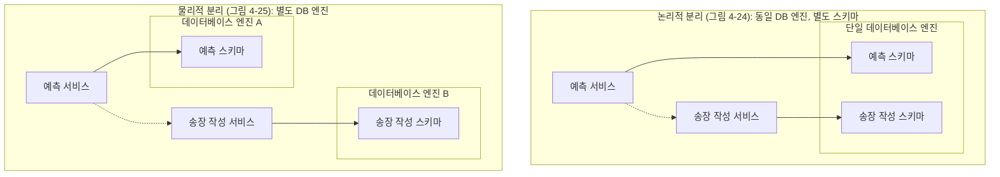

### 논리적 분리와 물리적 분리의 목표 차이

논리적 분리와 물리적 분리는 **달성하려는 목표부터 각기 다르다.**

**논리적 분리**의 목표는 **독자적인 변경과 정보 은닉이 가능하게 하는 것**이다. 같은 물리적 DB 서버를 쓰더라도 각 서비스가 자신의 스키마만 접근한다는 규칙이 지켜진다면, 스키마 변경의 영향이 다른 서비스로 전파되지 않는다.

**물리적 분리**의 목표는 **잠재적으로 시스템 견고성을 개선하고 자원 경합을 제거하는 과정에도 도움이 되므로 처리량이나 대기 시간을 향상시킬 수 있는 것**이다. 한 서비스의 부하가 다른 서비스의 성능에 영향을 미치지 않도록 격리하는 것이 주목적이다.

### 논리적 분리만의 위험: 단일 장애 지점

그림 4-24처럼 논리적으로 데이터베이스 스키마를 분해하지만 물리적으로 동일한 데이터베이스 엔진에 유지하면, 잠재적인 단일 장애 지점(Single Point of Failure)이 존재한다. 데이터베이스 엔진이 다운되면 두 서비스는 모두 영향을 받는다. 그러나 세상이 그렇게 만만치는 않다. 많은 데이터베이스 엔진에는 복제와 클러스터로 구성된 다중 데이터베이스 모드, 장애극복 메커니즘 등 단일 장애 지점을 회피하는 메커니즘이 있다.

또한 데이터베이스의 뷰를 외부에 공개하기를 원하는 경우에는, 동일 데이터베이스 엔진을 공유하는 여러 스키마가 필요하다는 점도 고려사항이다. 기반 데이터베이스와 뷰를 담은 스키마는 모두 동일 데이터베이스 엔진에 존재해야 한다.

**핵심 원칙**: 분리된 서비스를 다른 물리적인 데이터베이스 엔진에서 실행하는 선택지가 있는 경우에도, 먼저 논리적으로 스키마를 분해해 놓을 필요가 있다!

---

## 3. 핵심 질문: DB를 먼저 분할할까, 코드를 먼저 분할할까?

지금까지 공유 데이터베이스로 작업하는 과정에 도움이 되는 패턴들을 설명했지만, 결합도가 낮은 모델로 넘어가기를 바란다. 데이터베이스 분해와 관련된 패턴을 자세히 살펴보겠지만, 분해와 관련된 패턴 소개에 앞서 **분할 순서**부터 논의할 필요가 있다.

애플리케이션 코드가 자체 서비스에서 실행될 때까지 마이크로서비스 추출은 '완료'되지 않으며, 제어하는 데이터는 논리적으로 격리된 독자적인 데이터베이스로 추출된다. 우리에게는 몇 가지 선택지가 있다:

1. **데이터베이스를 먼저 분할한 다음, 코드를 분할**
2. **코드를 먼저 분할한 다음, 데이터베이스를 분할**
3. **둘 다 함께 분할**

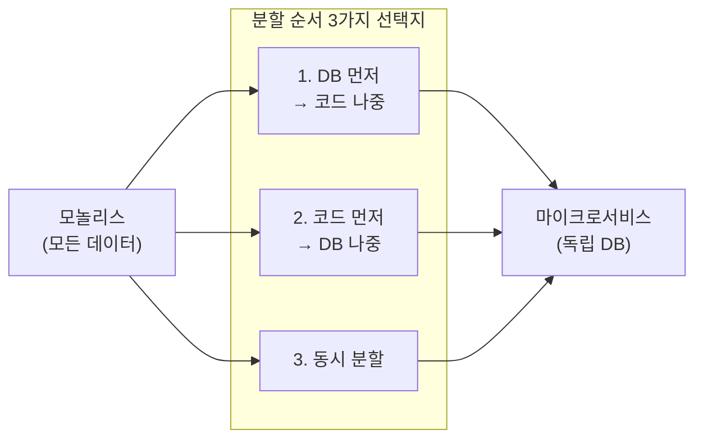

### 3-1. DB를 먼저 분할하는 전략

**분리된 스키마를 사용하면 단일 작업을 수행하기 위한 데이터베이스 호출 수가 아마도 증가할 것이다.** 이전에는 단일 SELECT 문으로 원하는 모든 데이터를 담을 수 있었지만, 이제는 두 위치에서 데이터를 가져와 메모리에서 조인(Join)해야 할 필요가 있다. 또한 2개의 스키마로 나누면 트랜잭션 무결성을 깨버리기에 애플리케이션에 큰 영향을 줄 수 있다.

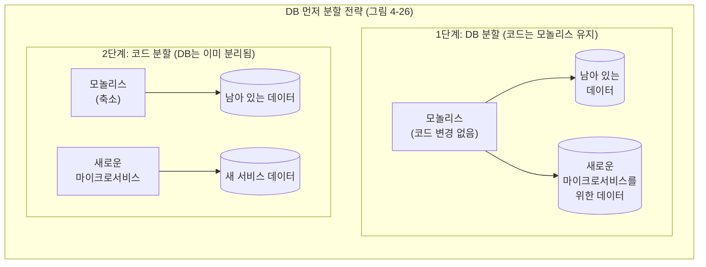

그림 4-26처럼 스키마를 분리하지만 애플리케이션 코드는 함께 유지하면, 엉뚱한 방향으로 향하고 있다는 사실을 알게 될 경우에 변경사항을 되돌리거나 서비스를 사용하는 컨슈머에게 영향을 주지 않으면서 변경사항을 계속 조정할 수 있다. 일단 데이터베이스 분리에 성공하면 애플리케이션 코드를 2개의 서비스로 분리하는 단계로 넘어갈 수 있다.

**DB 먼저 전략의 장점**: 성능과 트랜잭션 무결성 문제를 **조기에 발견**할 수 있다. 아직 코드를 나누기 전이므로, 문제가 발견되면 비교적 쉽게 되돌릴 수 있다.

**DB 먼저 전략의 단점**: 단기적 이점을 제공할 가능성이 희박하다. 공유 데이터베이스로 인한 고충은 점차 커지기 때문에, 우리는 시간과 노력을 들이고 있다. 또한 모놀리스 자체가 상용 소프트웨어처럼 블랙박스 시스템인 경우, 이 선택지를 사용할 수 없다는 점도 고려해야 한다.

### 3-2. 코드를 먼저 분할하는 전략

대다수 팀이 그림 4-29처럼 코드를 먼저 분할한 다음 데이터베이스를 분할한다. 새로운 서비스에서 단기적인 개선을 얻을 수 있으므로, 데이터베이스를 분리하는 방법으로 분해를 완료할 수 있다는 확신이 생긴다.

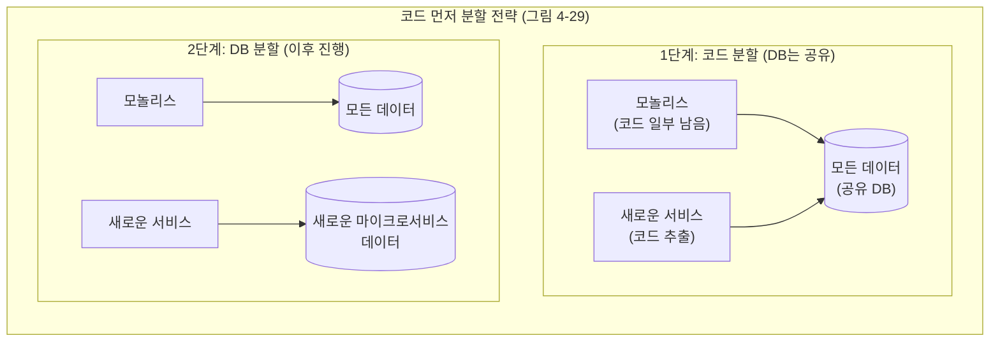

**코드 먼저 전략의 장점**: 애플리케이션 계층을 분리하면 새로운 서비스가 요구하는 데이터가 무엇인지 훨씬 더 쉽게 이해하게 된다. 또한 독립적으로 배포 가능한 코드 산출물을 더 일찍 확보한다는 이점도 얻을 수 있다.

**코드 먼저 전략의 핵심 위험**: 팀이 상황을 개선한 후에 중단하는 바람에 **공유 데이터베이스를 지속적으로 운영**한다는 점이다. 데이터 계층으로 분리를 완료하지 않을 경우 미래에 발생할 문제를 묻어두게 된다는 사실을 알아둬야 한다. 이와 같은 함정에 빠진 여러 팀을 본 적이 있지만, 다행스럽게도 이와 관련해 제대로 일한 조직도 있었다.

**솔직한 질문**: 여러분이 이 방향을 택했다면, 스스로에게 솔직해지자. 여러분의 조직은 이후 이어지는 단계에서 마이크로서비스가 소유한 모든 데이터를 분리할 만큼의 역량을 충분히 갖췄는가?

또 다른 문제라면, **조인 연산을 애플리케이션에 밀어넣을 때 발생하는 돌발상황을 뒤늦게 알아차릴 수도 있다**는 점이다.

### 3-3. DB와 코드를 함께 분할하는 전략

그림 4-33처럼 모든 코드와 데이터를 한 번에 분할하는 선택지도 있다. 이 수행 방식은 훨씬 더 큰 조치이기 때문에, 여러분이 내린 결정이 어떤 영향을 미치는지 평가하는 데 꽤 오랜 시간이 걸린다는 점이 문제다. 따라서 이런 접근 방식보다는 스키마나 애플리케이션 계층을 먼저 분할하는 방식을 강력하게 권장한다.

### 3-4. 샘 뉴먼의 최종 권고

> **만일 모놀리스를 변경할 수 있는데 성능이나 데이터 일관성에 대한 영향이 우려되는 경우라면, 스키마를 먼저 분할할 것이다. 그런 경우가 아니라면, 코드를 분리해 코드가 데이터 소유권에 미치는 영향을 이해하는 데 도움이 되는 방향으로 사용할 것이다.**

저자의 개인적 선호는 코드 먼저 분할이다. 다만 어떤 것을 먼저 분할하든, 이후에 반드시 데이터베이스 분리를 완료해야 한다는 점을 잊어서는 안 된다.

---

## 4. 코드 수준 분리 패턴들

### 4-1. 경계 컨텍스트 단위의 저장소

일반적으로, 하이버네이트(Hibernate) 같은 프레임워크가 지원하는 저장소 계층을 사용해 코드를 데이터베이스에 묶어 객체 또는 데이터 구조를 데이터베이스에 쉽게 매핑하게 만든다. 모든 데이터 접근을 처리할 단일 저장소 계층보다는 그림 4-27처럼 경계 컨텍스트를 따라 이런 저장소를 분해하는 방법이 값어치를 한다.

예를 들어 하이버네이트에서는 경계 컨텍스트마다 매핑 파일을 사용할 경우 이를 아주 명확하게 구분할 수 있다. 그 결과로 어떤 경계 컨텍스트가 스키마의 어떤 테이블에 접근하는지를 확인할 수 있다. 이는 향후 분해의 일부로 어떤 테이블을 이동할지를 파악하는 데 큰 도움이 될 수 있다.

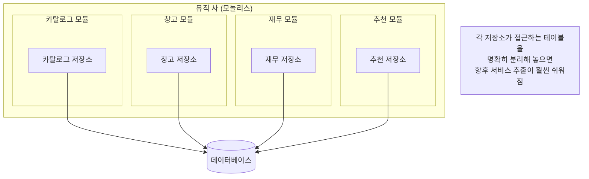

하지만 이는 우리에게 전모를 밝혀주지는 않는다. 예를 들어 재무 코드가 원장 테이블을 사용하고 카탈로그 코드가 물품 테이블을 사용한다고 말할 수도 있겠지만, 데이터베이스가 원장 테이블에서 물품 테이블로 외래 키 관계를 강제하는지는 명확하지 않을 수도 있다. 테이블 간의 관계를 이해하기 위해 **스키마스파이(SchemaSpy, http://schemaspy.sourceforge.net/)** 같은 도구를 사용해 테이블 간의 관계를 그래픽으로 표현할 수 있다.

**적용 대상**: 경계 컨텍스트 단위의 저장소 패턴은 모놀리스 분리 방법을 더 잘 이해하기 위해 재작업하는 어떤 상황에서든 효과가 있어 보인다.

### 4-2. 경계 컨텍스트 단위의 데이터베이스 — ThoughtWorks 실제 사례

일단 애플리케이션 관점에서 데이터 접근을 명확하게 격리하고 나면 이런 처리 방식을 스키마 수준에서도 계속해서 적용하는 방식이 의미가 있다. 마이크로서비스의 독립적인 배포 가능성이라는 핵심 개념에 따르면 마이크로서비스는 자신의 데이터를 소유해야 마땅하다.

**ThoughtWorks 수익 서비스 사례**:

소트웍스에서 수익을 계산하고 예측할 목적으로 몇 가지 새로운 메커니즘을 구현하고 있었다. 이 과정에서 작성해야 하는 3가지 광범위한 기능 영역을 파악했다. 이 문제를 해당 프로젝트의 책임자인 피터 길라드-모스(Peter Gillard-Moss)와 논의했다. 피터는 기능이 상당히 분리되어 있는 듯 보여도, 이 기능들을 별도 마이크로서비스로 제공할 경우 추가적으로 발생하는 유지 보수 작업이 우려된다는 의견을 피력했다. 그 당시 피터의 팀은 단 3명의 팀원으로 구성되어 규모가 작았으며, 팀은 새로운 서비스 분리가 굳이 필요하지는 않다고 생각했다.

결국 고민 끝에 그림 4-28처럼 **격리된 경계 컨텍스트 3가지(각각 개별 JAR 파일로 나뉨)를 포함하는 식으로 단일 서비스를 만들어 새로운 수익 기능을 효과적으로 배포하는 모델**로 간다는 결론을 내렸다.

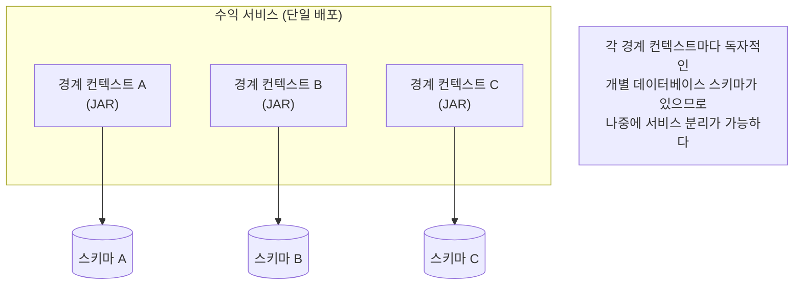

각 경계 컨텍스트마다 완전히 분리된 독자적인 데이터베이스가 있었다. 나중에 마이크로서비스로 분리할 필요가 있다면 작업이 훨씬 수월하리라 여겨졌다. **그러나 결국 분리 작업은 전혀 필요하지 않았다.** 몇 년이 지난 후에도 이 수익 서비스는 연관된 데이터베이스가 여러 개 있는 모놀리스(모듈식 모놀리스의 훌륭한 예) 형태로 그대로 남아 있다.

**적용 대상**: 언뜻 보기에는, 분리된 데이터베이스를 유지관리하기 위한 추가 작업은 모놀리스인 경우에는 큰 의미가 없다. 이는 분산 투자와 유사한 패턴이다. 단일 데이터베이스보다 약간 더 많은 작업을 수행하지만 나중에 마이크로서비스로 이동할 경우에 선택지를 열어 둔다. 심지어 마이크로서비스로 결코 이동하지 않더라도 데이터베이스를 뒷받침하는 스키마를 명확하게 분리하면 특히 많은 사람들이 모놀리스에서 작업하는 경우 정말 큰 도움이 될 수 있다.

> **중요 주의사항**: 나는 신제품이나 스타트업을 위한 마이크로서비스 구현을 지지하지 않는다. 두 경우에는 관련 이해당사자들의 도메인에 대한 이해가 안정적인 도메인 경계를 식별하기에 충분히 성숙하지 않았을 가능성이 높다. 특히 스타트업의 경우, 구축하려는 대상의 특성이 큰 폭으로 바뀔 수 있다.

### 4-3. 데이터 접근 계층으로 작동하는 모놀리스

모놀리스에서 직접 데이터에 접근하는 대신, 모놀리스 자체에 API를 생성하는 모델로 이동해보자. 그림 4-30에서 송장 서비스는 고객 서비스와 관련해 직원에 대한 정보가 필요하므로 모놀리스가 직원 서비스가 직원 정보에 접근할 수 있게 직원 API를 생성한다.

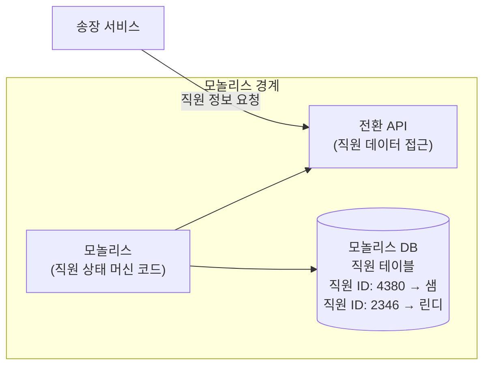

이 패턴이 더 널리 사용되지 않는 이유 중 하나로는, 아마도 뭔가 사람들이 모놀리스는 이미 죽었고 쓸모도 없다는 생각을 하기 때문일 것이다. 사람들은 모놀리스에서 벗어나고 싶어 한다. 사람들은 모놀리스를 더 유용하게 만들 생각을 하지 않는다! 그러나 여기서 긍정적인 면은 분명하다.

(아직) 데이터 분해와 씨름할 필요는 없어도 정보는 은닉해야 하므로 새로운 서비스를 모놀리스로부터 격리시키기가 훨씬 더 쉽다. 나라면, 모놀리스의 데이터가 그대로 남아 있을 거라고 판단하는 경우여야 이 모델을 채택할 수 있을 것 같다. 하지만 여러분의 새로운 서비스가 사실상 무상태형이 되리라 생각한다면, 이 모델은 잘 작동할 것이다.

**적용 대상**: 이 패턴은 데이터를 관리하는 코드가 여전히 모놀리스에 있을 때 가장 잘 작동한다. 데이터 관점에서 바라본 마이크로서비스는 상태와 이런 상태의 전이를 관리하는 코드의 캡슐화로 정의할 수 있다. 따라서 이 데이터의 상태 전이가 여전히 모놀리스에서 일어나는 경우, 해당 상태에 접근(또는 변경)하기를 원하는 마이크로서비스는 모놀리스에서 상태 전이를 거쳐야 한다. 모놀리스 데이터베이스에서 접근을 시도하는 데이터를 실제로는 마이크로서비스가 '소유'해야 한다면 이 패턴을 건너뛰고 데이터 분리 방안을 제안할 것이다.

### 4-4. 다중 스키마 저장소

앞서 살펴봤듯이 나쁜 상황은 더 악화시키지 않는 편이 좋다. 여전히 데이터베이스의 데이터를 직접 사용하더라도 마이크로서비스가 저장할 데이터 역시 기존 데이터베이스에 들어가야 하는 의미는 아니다.

그림 4-32에서 송장 서비스의 예를 볼 수 있다. **송장 핵심 데이터는 여전히 모놀리스에 존재하며**, 송장에 검토 내용을 추가할 수 있는 기능을 추가했다. 이는 모놀리스에 없는 새로운 기능에 해당한다. 이를 지원하려면 직원을 송장 ID에 매핑하는 검토자(Reviewer) 테이블을 저장해야 한다. 이 새로운 테이블을 모놀리스에 넣으면 데이터베이스 덩치만 키울 뿐이다. 대신 이 새로운 데이터를 송장 서비스의 자체적인 스키마에 넣는다.

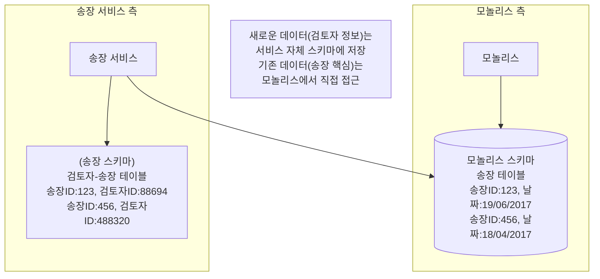

이 예에서, 우리는 외래 키(FK) 관계가 스키마 경계를 실질적으로 확장할 때 발생하는 문제를 고려해야 한다. 모놀리스 데이터베이스에서 데이터를 꺼내려면 시간이 걸리므로, 이 패턴을 사용하면 마이크로서비스가 자체적인 로컬 저장소를 관리하는 동시에 모놀리스 데이터베이스의 데이터에도 접근 가능하다면, 이는 매우 기쁜 일이다. 모놀리스에서 나머지 데이터를 끌어다 가져오는 식으로 관리하면, **테이블을 새로운 스키마로 한 번에 마이그레이션할 수 있다.**

**적용 대상**: 새로운 데이터를 저장해야 하는 새로운 기능을 마이크로서비스에 추가할 때 효과적으로 동작한다. 처음부터 분리하자. 이 패턴은 또한 모놀리스에서 데이터를 마이크로서비스의 자체적인 스키마로 이동하기 시작할 때도 의미가 있다.

---

## 5. 스키마 분리 실전 패턴들

지금까지 상당히 고수준에서 스키마 분리를 검토한 결과, 데이터베이스 분해와 관련한 복잡한 난제와 까다로운 문제들이 생겼다. 이제 저수준의 데이터 분해 패턴 몇 가지를 살펴보자.

> **관계형 vs NoSQL**: 4장에서 자세히 설명하는 많은 리팩터링 예제는 관계형 스키마로 작업할 때 발생하는 문제를 살펴본다. 여러분 중 대다수는 비관계형 데이터베이스(NoSQL)을 사용하고 있을 것이다. 여기 설명할 패턴 중 상당수가 NoSQL에서도 적용될 수 있으며, 조언이 여전히 유용하기를 바란다.

### 5-1. 패턴: 테이블 분할

간혹 서비스 경계를 2개 이상 가로질러 분할할 필요가 있는 단일 테이블에서 데이터를 찾게 될 텐데, 이는 꽤 흥미로운 일이다.

그림 4-34의 예를 보면, 단일 공유 테이블인 **물품** 테이블이 있으며 여기에는 판매 중인 물품뿐만 아니라 재고 수준에 대한 정보도 저장된다. 이 예에서는 카탈로그와 창고를 새로운 서비스로 분리하고자 하나, 양쪽을 위한 데이터가 단일 테이블에 혼합되어 있다.

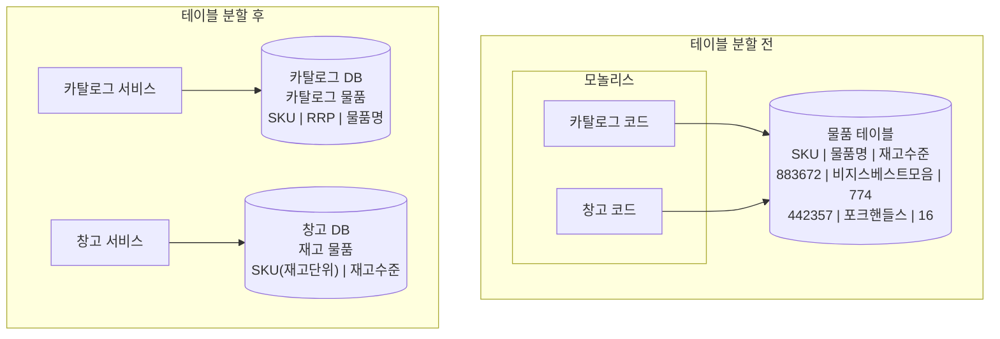

이 예는 매우 간단하다. 열 단위로 데이터 소유권을 쉽게 분리할 수 있었다. 그러나 여러 코드 조각이 동일한 열을 업데이트하면 어떻게 될까?

**FK 관계와 단일 DB 제약**: 이런 테이블들이 단일 스키마에 존재하면, 재고 물품 SKU(재고 단위) 열에서 카탈로그 물품 테이블로 연결되는 외래 키 관계를 선언하는 방식이 의미가 있을 것이다. 그러나 결국 이런 테이블을 별도 데이터베이스로 옮길 계획이므로 외래 키를 설정하더라도 데이터 일관성을 강제하는 단일 데이터베이스가 사라져 외래 키로부터 별다른 이익을 거두지 못한다.

**적용 대상**: 코드베이스의 여러 부분에서 업데이트할 듯이 보이는 테이블에서 특정 열이 발견되면, 누가 이 열에 속한 데이터를 '소유'할지에 대해 여러분은 결정을 내려야 한다. 영역 내에 있는 기존 도메인 개념으로 설명할 수 있을까? 이는 데이터를 옮길 장소를 결정하는 데 도움이 될 것이다.

### 5-2. 상태 열 소유권 문제 — 누가 이 컬럼을 소유하는가?

그림 4-35의 고객 테이블 예는 테이블 분할의 복잡성을 잘 보여준다. 고객 관리와 재무 코드 모두 고객 테이블의 **상태(state)** 열을 변경할 수 있다.

상태 열은 해당 고객이 이메일을 확인했는지를 알려주며, 고객 등록 과정에서 `NOT_VERIFIED` → `VERIFIED`로 바뀌는 값이다. 일단 고객이 VERIFIED 상태면, 쇼핑이 가능하다. 재무 코드는 고객이 청구 요금을 납부하지 않은 경우, 그에 따라 고객의 상태를 `SUSPENDED`로 변경할 것이다.

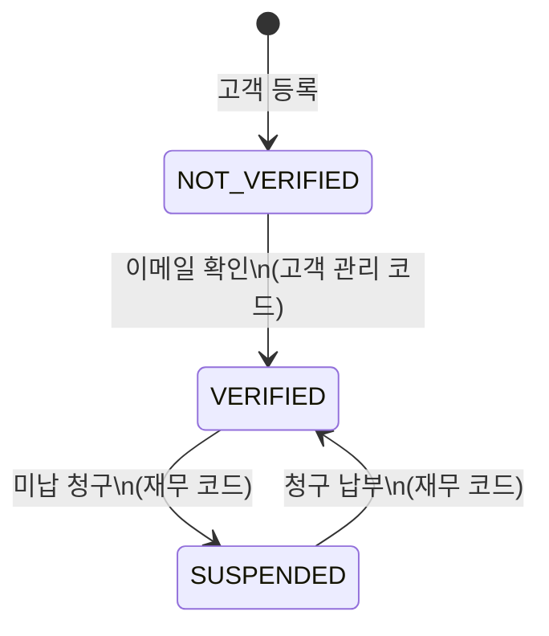

이 경우, 고객의 상태는 여전히 고객 도메인 모델의 일부가 되어야 할 것이므로, 조만간 생성될 고객 서비스가 그렇게 관리해야 할 것이다. 가능하다면 우리는 단일 서비스 경계 내부에 도메인 엔티티를 위한 상태 머신을 유지하고자 하며, 고객의 상태 업데이트는 확실히 고객을 위한 상태 머신의 일부처럼 취급해야 한다.

이는 서비스 분할이 이뤄졌을 때, 우리의 새로운 재무 서비스가 그림 4-36처럼 상태를 업데이트하기 위해 서비스를 호출할 필요가 있음을 의미한다.

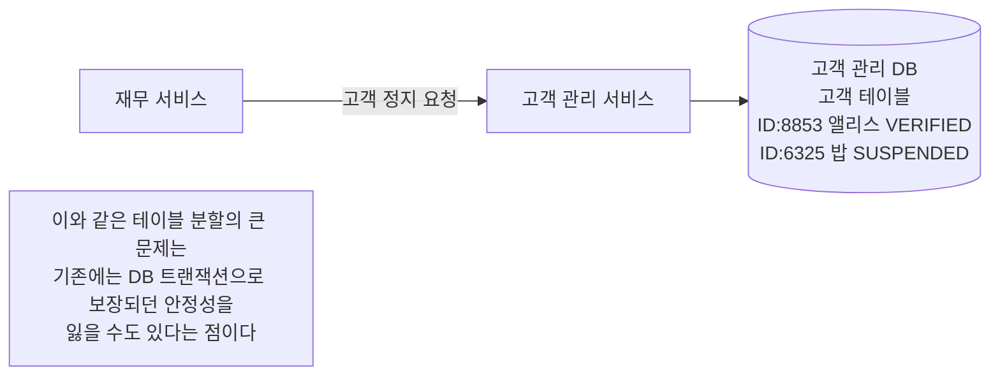

이와 같은 테이블 분할의 큰 문제는, **기존에는 데이터베이스 트랜잭션으로 인해 보장되고 있었던 안정성을 잃을 수도 있다**는 점이다. 4장의 끝부분에서 '트랜잭션'과 '사가(Saga)'를 다루며 이 주제를 더 깊숙이 살펴볼 것이다.

### 5-3. 패턴: 외래 키 관계를 코드로 이동

아티스트, 트랙, 음반에 대한 정보를 관리하고 외부에 공개할 수 있는 카탈로그 서비스를 추출하기로 결정했다. 현재 모놀리스 내부의 카탈로그 관련 코드는 음반 테이블을 사용해, 판매하게 될 수도 있는 CD에 대한 정보를 저장한다. 이 음반들은 결국 우리가 모든 판매를 추적하는 **원장(Ledger)** 테이블에서 참조된다.

그림 4-37에서 원장 테이블의 행들은 음반 테이블의 행과 관계를 맺도록 만들기 위해 스키마에 외래 키 관계를 정의했다. 이런 관계를 정의함으로써 기반 데이터베이스 엔진은 데이터 일관성을 보장할 수 있다.

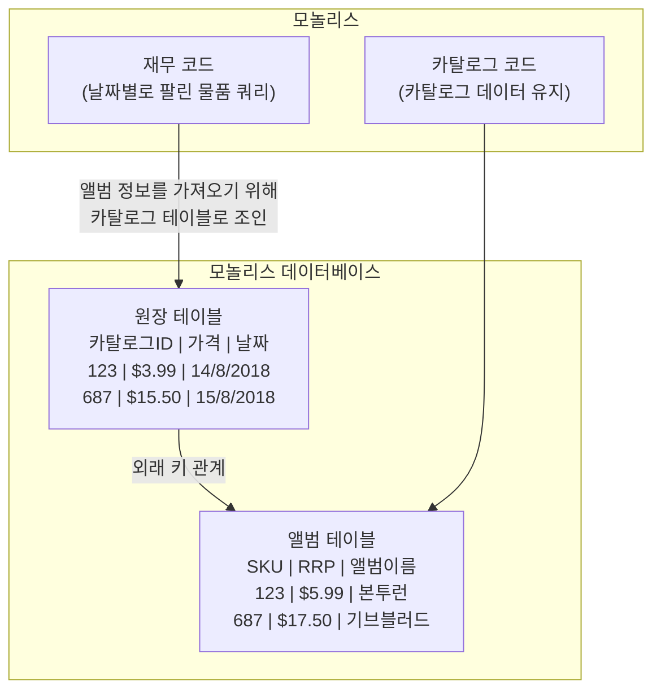

우리는 카탈로그 코드와 재무 코드를 각각의 서비스로 분리하길 원한다. 즉 이는 데이터도 함께 따라와야 함을 의미한다. 음반과 원장 테이블이 다른 스키마에 존재하는 상황이 벌어질 경우 외래 키 관계는 어떻게 될까? 우리에게는 고려해야 할 2가지 핵심 문제가 있다:

1. **조인 이동**: 새 재무 서비스에서 향후 이 보고서를 생성할 때 더 이상 데이터베이스 조인으로 작업할 수 없는 경우라면, 카탈로그 관련 정보는 어떻게 검색할까?
2. **데이터 불일치 대응**: 이제 데이터 불일치가 새로운 세계에 존재할 수 있다는 사실에 대해 어떻게 대응해야 할까?

**조인 이동 (그림 4-38)**:

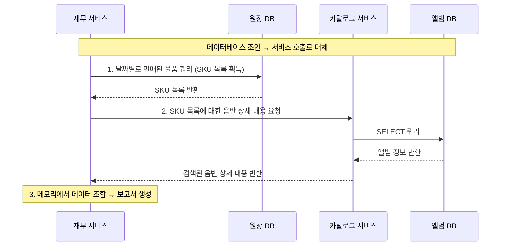

새로운 마이크로서비스 기반 세계에서 재무 서비스는 가장 많이 팔린 제품 보고서를 생성할 책임이 있지만, 음반 데이터는 마이크로서비스 내부에 가지고 있지 않다. 따라서 새 카탈로그 서비스에서 이 정보를 가져와야 한다.

보고서를 생성할 때 재무 서비스는 먼저 원장 테이블을 쿼리해 직전 달에 가장 많이 팔린 SKU 목록을 추출한다. 이 시점에서, 우리는 SKU 목록과 각 음반당 판매 수량만을 보유하고 있으며, 이게 바로 우리가 마이크로서비스 내부에 확보한 유일한 정보다. 다음으로, 각 SKU에 대한 정보를 요청하기 위해 카탈로그 서비스를 호출해야 한다.

당연히 **조인 작업은 여전히 진행 중**이지만, 이제는 데이터베이스 내부가 아니라 재무 서비스 내부에서 일어난다. 불행히도 효율성은 데이터베이스 내부에서 조인 작업을 하는 경우와 비교해 엄청나게 떨어질 것이다.

**성능 트레이드오프 판단**:

이런 상황에서 이와 같은 연산의 전체 대기 시간이 늘어난 것은 너무나도 당연했다. 이 보고서는 매달 생성되며 공격적으로 캐시될 수 있으므로 우리 사례처럼 특별한 경우에는 별 문제가 되지 않을 것이다. 그러나 빈번한 연산이라면 더 큰 문제가 될 수 있다.

대기 시간 증가 완화 방법: 카탈로그 서비스에서 SKU를 대량으로 조회하거나, 아니면 필요한 음반 정보를 서비스 내부에서 캐싱하는 방법으로 대기 시간 증가로 인한 영향을 어느 정도 완화할 수 있다.

결국 이런 대기 시간 증가가 문제인지 아닌지는 **여러분만이 결정**할 수 있다. 핵심 연산에 허용되는 대기 시간을 이해하고 현재 대기 시간을 측정할 수 있어야 한다. **예거(Jaeger, https://www.jaegertracing.io/)** 와 같은 분산 추적 시스템을 통해 여러 서비스에 걸친 연산의 정확한 작업 타이밍을 수집할 수 있으므로 이런 상황에서 실제로 도움이 될 것이다.

---

## 6. DB 마이그레이션 도구

데이터베이스 변경은 여러 가지 이유로 어렵다. 그중 하나는 데이터베이스를 쉽게 변경하게 만드는 도구가 제한적이라는 사실이다. 코드인 경우에는 IDE에 리팩터링 도구가 내장되어 있으며 변경 중인 시스템이 기본적으로 무상태라는 추가적인 이점도 있다. 데이터베이스인 경우에는 변경 중인 내역에 상태가 있으며 리팩터링을 지원하는 도구도 부족하다.

**DBDeploy**: 샘 뉴먼이 닉 애슬리(Nick Ashley)와 그레이엄 태클리(Graham Tackley)라는 동료 2명과 함께 만들었던 오픈소스 도구. 현재는 더 이상 쓰이지 않는다. 스키마를 대상으로 결정적인 방식으로 실행될 수 있는 SQL 스크립트에서 변경사항을 캡처하는 방식으로 동작했다.

**FlywayDB**: 요즘 추천하는 도구. https://flywaydb.org/ 에서 확인할 수 있다. 어떤 도구를 선택하든 버전 제어가 가능한 **델타 스크립트(각 버전 사이에 변경사항만 기록하는 스크립트)** 에서 각 변경사항을 캡처하는 기능은 꼭 사용하길 바란다.

---

## 7. 종합 정리

4장 후반부의 핵심 내용을 한눈에 볼 수 있도록 정리하면 다음과 같다.

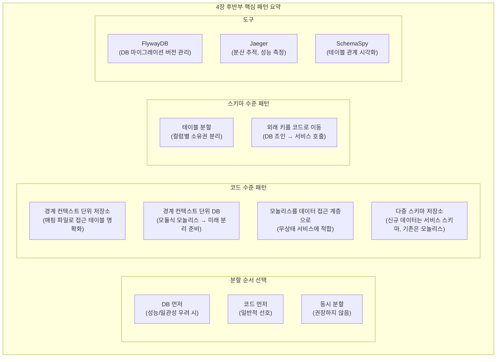

**최종 결론**: 데이터베이스 분해는 기술적 문제인 동시에 조직적 문제다. 어떤 데이터를 어떤 서비스가 소유해야 하는지는 비즈니스 도메인의 경계와 일치해야 하며, 이 경계는 팀의 경계와도 일치해야 한다(콘웨이의 법칙). 기술적 패턴들은 이 여정을 점진적으로 안전하게 진행하기 위한 도구일 뿐이다.

가장 중요한 점: **"완벽한 분리"를 처음부터 달성하려 하지 말고, 현재 상황을 더 악화시키지 않으면서 올바른 방향으로 한 걸음씩 나아가는 것**이 핵심이다.

---

