## 4장 상세 해설

> **원서**: Sam Newman, [*Monolith to Microservices: Evolutionary Patterns to Transform Your Monolith*](https://github.com/shubhamverma23/books/blob/master/Monolith%20to%20Microservices%20Evolutionary%20Patterns%20to%20Transform%20Your%20Monolith%20by%20Sam%20Newman%20(z-lib.org).pdf) (O'Reilly, 2019)  
> **한국어판**: [마이크로서비스 도입, 이렇게 한다](https://ebook.library.kr/detail?id=4801189909254&contentType=EB) (책만, 2021-01-20 / 옮긴이: 박재호)  
> 이 문서는 4장(pp.163~181) 범위의 내용을 상세히 해설합니다.  
> 다루는 주제: 공유 데이터베이스 패턴, DB 뷰, DB 래핑 서비스, DaaS 인터페이스, 소유권 양도

---

## 목차

1. [4장 개요 — 데이터베이스 분해가 왜 어려운가?](#1-4장-개요--데이터베이스-분해가-왜-어려운가)
2. [스키마 vs 데이터베이스 — 용어 정리](#2-스키마-vs-데이터베이스--용어-정리)
3. [패턴 1: 공유 데이터베이스 — 문제점과 예외적 허용 조건](#3-패턴-1-공유-데이터베이스--문제점과-예외적-허용-조건)
4. [패턴 2: 데이터베이스 뷰 — 정보 은닉의 임시 해법](#4-패턴-2-데이터베이스-뷰--정보-은닉의-임시-해법)
5. [패턴 3: 데이터베이스 래핑 서비스 — 혼돈을 숨기는 래퍼](#5-패턴-3-데이터베이스-래핑-서비스--혼돈을-숨기는-래퍼)
6. [패턴 4: 서비스로서 데이터베이스(DaaS) 인터페이스](#6-패턴-4-서비스로서-데이터베이스daas-인터페이스)
7. [소유권 양도 — 데이터를 진짜로 분리하는 방법](#7-소유권-양도--데이터를-진짜로-분리하는-방법)
8. [4장 패턴 종합 비교](#8-4장-패턴-종합-비교)

---

## 1. 4장 개요 — 데이터베이스 분해가 왜 어려운가?

앞선 내용에서 기능을 마이크로서비스로 추출할 수 있는 방법은 매우 다양하다는 것을 살펴봤다. 그러나 가장 큰 난제가 남아 있다. 바로 **"데이터를 어찌 해야 할까?"** 라는 질문이다.

마이크로서비스는 정보 은닉을 수행할 때 가장 잘 작동하며, 정보 은닉은 일반적으로 자체 데이터 저장소와 입출 메커니즘을 완전히 캡슐화하는 마이크로서비스로 발전할 수 있다. 따라서 마이크로서비스 아키텍처로 마이그레이션할 때 최대한 좋은 결과를 이끌어내고 싶다면, **모놀리스 데이터베이스를 분리해야 한다는 결론**으로 이어진다.

그러나 데이터베이스를 분리하는 작업은 단순한 노력과는 거리가 멀다. 전환 과정에서 다음과 같은 복잡한 문제들을 고려해야 한다:

- **데이터 동기화 문제**: 두 시스템이 같은 데이터를 필요로 할 때 어떻게 일관성을 유지할 것인가?
- **논리적 스키마와 물리적 스키마의 분해**: 스키마를 논리적으로 분리하는 것과 실제로 물리적으로 분리하는 것은 매우 다른 작업이다.
- **트랜잭션 무결성**: 여러 서비스에 걸친 데이터 변경을 어떻게 원자적으로 처리할 것인가?
- **조인(Join) 문제**: 현재 하나의 SQL 쿼리로 처리하던 데이터를 어떻게 분산된 서비스에서 조회할 것인가?
- **대기 시간(Latency)**: 네트워크 호출은 로컬 DB 쿼리보다 느리다.

4장에서는 이런 문제들을 살펴보고 도움이 되는 패턴들을 알아본다. 단, 분해를 시작하기에 앞서, 단일 공유 데이터베이스(Single Shared Database)를 관리하기 위한 당면 과제와 대응 패턴을 먼저 살펴봐야 한다.

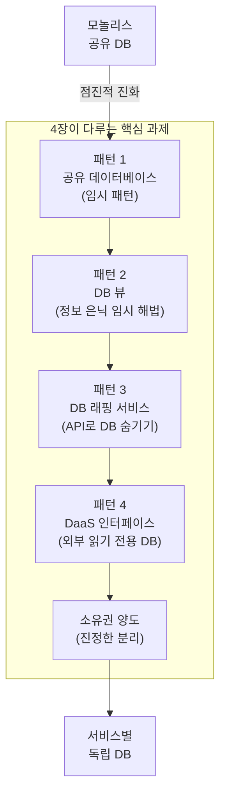

---

## 2. 스키마 vs 데이터베이스 — 용어 정리

본격적인 패턴 설명에 앞서 중요한 용어를 정리해야 한다. 저자 샘 뉴먼은 과거에 "데이터베이스"와 "스키마"라는 용어를 바꿔 쓴 적이 있어 혼란을 초래했음을 고백하며 이를 명확히 정의한다.

기술적으로 보면, **스키마(Schema)** 는 데이터를 담는 논리적으로 분리된 테이블 집합이다. 단일 데이터베이스 엔진 인스턴스는 여러 스키마를 제공할 수 있다. 즉 하나의 물리적 데이터베이스 서버 안에 여러 스키마가 존재할 수 있으며, 각 스키마는 논리적으로 데이터를 격리한다.

4장에서 저자가 '데이터베이스'라고 말할 때는 **논리적으로 격리된 스키마(Logically Isolated Schema)** 를 의미한다. 간결한 설명을 위해 명시적으로 달리 언급하지 않는 이상, 책의 도표에서 데이터베이스 엔진 개념은 생략한다.

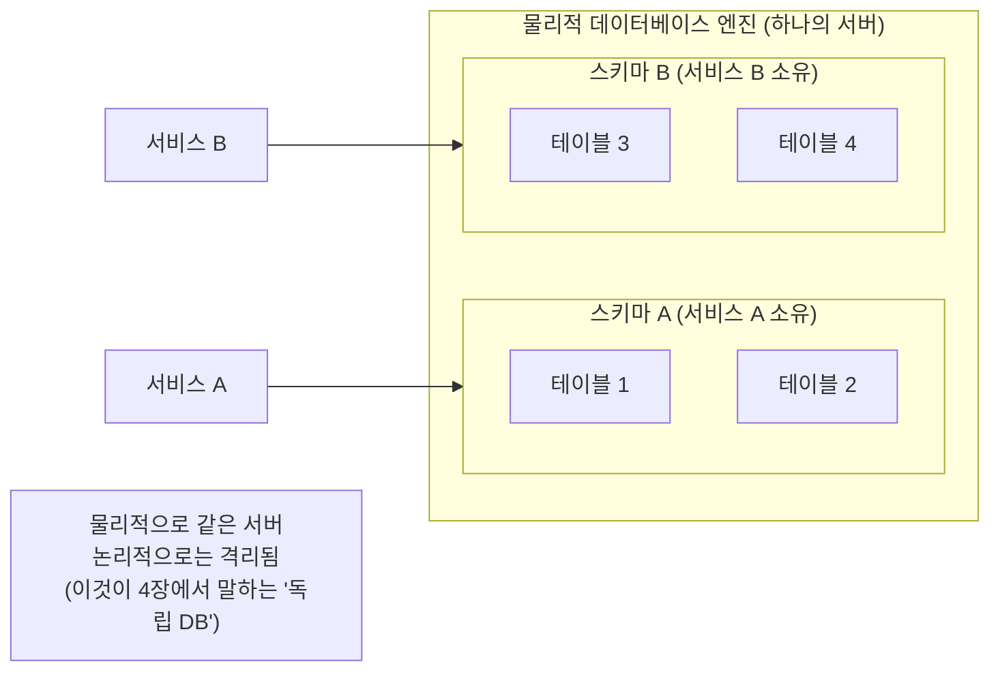

이 구분이 중요한 이유는, 클라우드 환경(특히 AWS DynamoDB 같은 NoSQL)에서는 스키마 개념 자체가 없고 테이블 개념만 있는 경우가 있기 때문이다. 이런 경우 논리적 격리를 위해 역할 기반 접근 제어(RBAC)를 사용해야 하며, 데이터베이스 서비스가 논리적 격리를 어떻게 바라보는지에 따라 접근 방식이 달라진다.

---

## 3. 패턴 1: 공유 데이터베이스 — 문제점과 예외적 허용 조건

### 공유 데이터베이스란?

공유 데이터베이스 패턴은 여러 마이크로서비스가 하나의 데이터베이스를 공유하고, 여러 스키마에 흩어져 있는 데이터에 자유롭게 접근하는 방식이다. 책의 그림 4-1은 운송, 재무, 주문 처리 서비스가 동일한 데이터베이스에 직접 접근하는 상황을 보여준다.

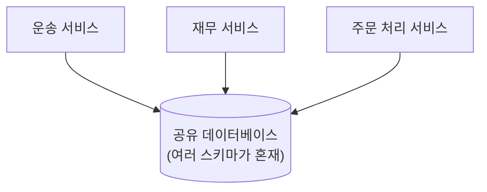

1장에서 살펴봤듯이, 도메인 결합도, 시간적 결합도, 구현 결합도라는 3가지 측면에서 결합도를 생각할 수 있다. 그림 4-1처럼 데이터베이스를 공유하는 개발자들은 여러 스키마에 흩어져 있기 때문에, 데이터베이스를 고려할 때 3가지 결합도 중 가장 큰 비중을 차지하는 것은 **구현 결합도**다.

공유 데이터베이스의 가장 중요한 문제는 **우리가 무엇을 공유하고 무엇을 숨길지 결정하는 기회를 부정하는(즉 정보 은닉을 무시하는) 것**이다. 이는 스키마의 어떤 부분을 안전하게 변경할 수 있는지 이해하기 어올 수 있다는 뜻이다. 외부 관계자가 데이터베이스에 접근할 수 있음은 알지만, 스키마의 어느 부분을 사용하는지는 모른다는 것은 별개의 문제다.

또한 **누가 데이터를 '제어'하는지 명확하지 않다**는 문제도 있다. 해당 데이터를 조작하는 비즈니스 로직은 어디에 있을까? 여러 서비스에 흩어져 있을까? 만약 그렇다면, 이는 비즈니스 로직의 응집력이 부족함을 시사한다. 마이크로서비스를 동작과 상태의 조합으로 간주할 때, 마이크로서비스는 하나 이상의 상태 머신을 캡슐화한다. 이렇게 상태를 변경하는 동작 방식이 시스템 전체에 퍼져 있다면, 이 상태 머신을 올바르게 구현할 수 있는지 확인하는 작업은 까다로워진다.

### 패턴 다루기

각 마이크로서비스가 자체적인 데이터를 소유할 수 있도록 데이터베이스를 분리하는 방식이 거의 항상 선호된다. 이런 방식이 불가능하다면, 데이터베이스 뷰 패턴(패턴 2)을 사용하거나 데이터베이스 래핑 서비스 패턴(패턴 3)을 채택하자.

### 예외적 허용 조건: 공유 DB가 적합한 2가지 상황

데이터베이스를 직접 공유하는 것이 마이크로서비스 아키텍처에 적합하다고 볼 수 있는 경우는 딱 2가지다.

**첫째, 읽기 전용 정적 참조 데이터(Read-Only Static Reference Data)다.** 국가 통화코드 정보, 우편번호 또는 우편번호 조회 테이블 등을 담는 스키마를 생각해보자. 이런 데이터 구조는 매우 안정적이며, 이와 같은 데이터의 변경 제어는 흔히 관리 작업으로 처리된다. 여러 서비스가 이 테이블에 읽기 전용으로 접근해도 구현 결합도 문제가 발생하지 않는다.

**둘째, 서비스가 여러 컨슈머를 다루기 위해 설계되고 관리되는 종단점으로서 데이터베이스를 직접 외부에 공개하는 경우다.** 이것이 바로 뒤에 나오는 서비스로서 데이터베이스(DaaS) 인터페이스 패턴이다. 이 경우에는 의도적으로 데이터베이스를 외부 인터페이스로 제공하는 것이므로 다른 차원의 이야기다.

---

## 4. 패턴 2: 데이터베이스 뷰 — 정보 은닉의 임시 해법

### 개념

여러 서비스를 위한 단일 데이터 소스(Single Source of Data)를 원하는 상황에서는 뷰(View)를 사용해 결합도와 관련된 문제를 완화할 수 있다. 뷰를 사용하면 기반 스키마에서 제한적으로 투사한 형태의 스키마를 서비스에 제공할 수 있다. 이와 같은 투사(Projection) 기법을 통해 서비스에 표출하는 데이터를 제한함으로써, 접근해서는 안 되는 정보를 은닉할 수 있다.

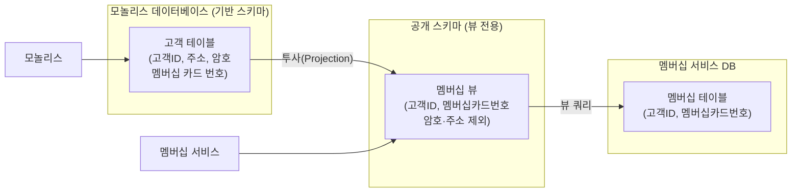

그림 4-4의 예를 보면, 모놀리스 데이터베이스의 고객 테이블에는 고객 ID, 주소, 암호, 멤버십 카드 번호가 모두 저장되어 있다. 그러나 멤버십 서비스는 오직 고객 ID와 멤버십 카드 번호의 매핑만 필요하다. 뷰를 통해 이 정보만을 외부에 공개함으로써, 암호나 주소 같은 민감한 정보는 멤버십 서비스에서 완전히 숨겨진다.

### 실제 사례: 투자 은행 가격 책정 시스템

저자 샘 뉴먼은 이 패턴의 가치를 실제 경험을 통해 설명한다. 그가 참여했던 한 투자 은행의 신용파생 시스템 재플랫폼화 프로젝트에서, 팀은 데이터베이스 결합도 문제에 정면으로 맞닥뜨렸다.

시스템을 사용하는 트레이더들에게 더 빠른 피드백을 제공하기 위해 시스템 처리량을 늘려야 했다. 여러 분석을 수행한 결과, 데이터베이스에 수행되는 쓰기 작업이 프로세싱의 병목 현상을 야기한다는 사실을 알게 됐다. 쓰기 시간의 급등을 목격하고 나서야, 스키마를 재구성하면 쓰기 성능을 대폭 향상시킬 수 있다는 사실을 깨달았다.

그러나 여기서 충격적인 사실이 드러났다. 제어권 밖에 있는 **"20개가 넘는"** 애플리케이션이 데이터베이스에 대한 읽기/쓰기 접근 권한을 가지고 있었으며, 안타깝게도 이 모든 외부 시스템에 동일한 사용자 이름과 비밀번호 자격 증명이 부여되어 있었다. 개별 사용자가 누구인지 또는 무엇에 접근하고 있는지를 파악하는 것은 불가능했다.

**뷰를 활용한 해결책**: 팀은 기존 스키마처럼 보이는 전용 스키마 호스팅 뷰를 작성하고 원본 스키마 대신 클라이언트가 해당 스키마를 가리키게 했다. 이를 통해 팀은 뷰를 유지하는 한, 스스로 만든 자체 스키마를 변경할 수 있었다. 그림 4-3은 이 변화를 잘 보여준다.

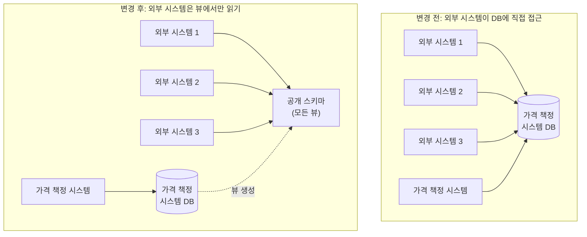

### 구체화된 뷰(Materialized View)

데이터베이스의 특성에 따라 구체화된 뷰(Materialized View)를 작성하는 옵션이 있을 수도 있다. 구체화된 뷰를 사용하면, 일반적으로 캐시 사용을 통해 뷰는 사전 계산된다. 즉 뷰에서 읽을 경우 기반 스키마에서 직접 읽을 필요가 없기 때문에 성능을 높일 수 있다. 하지만 사전 계산된 뷰가 어떻게 업데이트되는지와 관련해 어려움이 생기며, 이는 뷰에서 '김이 빠진(Stale)' 데이터 집합을 읽을 수도 있다는 의미다.

### DB 뷰 패턴의 한계

뷰 패턴은 완벽한 해법이 아니며 다음과 같은 명확한 한계가 있다:

**읽기 전용 제약**: 뷰 구현 방법은 여러 가지가 있는데, 일반적으로 쿼리 결과다. 이는 뷰 자체가 읽기 전용임을 의미하며, 이런 특성은 유용성을 즉시 제한한다.

**기술 호환성**: 관계형 데이터베이스에는 뷰가 공통적인 기능이며, 기술적으로 성숙한 여러 NoSQL 데이터베이스도 뷰를 지원하지만, 전부는 아니다.

**물리적 의존성**: 데이터베이스 엔진이 뷰를 지원하더라도, 기반 스키마와 뷰가 동일 데이터베이스 엔진에 존재해야 하는 등의 여러 제약이 있을 가능성이 높다. 이는 물리적인 배포 결합도를 증가시켜 잠재적인 단일 장애 지점을 만들 수 있다.

**소유권 문제**: 기반 스키마를 변경하면 뷰를 업데이트해야 할 수도 있으니, 뷰의 소유권이 누구에게 있는지를 신중하게 고려해야 마땅하다. 공개된 데이터베이스 뷰는 서비스 인터페이스와 유사하므로, 기반 스키마를 관리하는 팀이 최신 상태로 업데이트해서 관리하는 편이 좋다.

**언제 사용하는가**: 기존의 모놀리스 스키마를 분해하는 방식이 실용적이지 않다고 여겨지는 상황에 사용한다. 스키마 분해로 진행하는 노력이 너무 크다고 느껴진다면, 뷰는 올바른 방향으로 나아가는 첫 단계가 될 수 있다.

---

## 5. 패턴 3: 데이터베이스 래핑 서비스 — 혼돈을 숨기는 래퍼

### 개념

종종 뭔가를 다루기가 너무 어려운 경우에는 혼란을 숨기는 편이 합리적일 수 있다. **데이터베이스 래핑 서비스 패턴(Database Wrapping Service Pattern)** 을 사용하면 정확히 다음과 같은 작업을 수행할 수 있다. 즉 얇은 래퍼(Wrapper) 역할을 하는 서비스 뒤에 데이터베이스를 숨기고, 데이터베이스 종속성에서 서비스 종속성으로 이동하게 만든다.

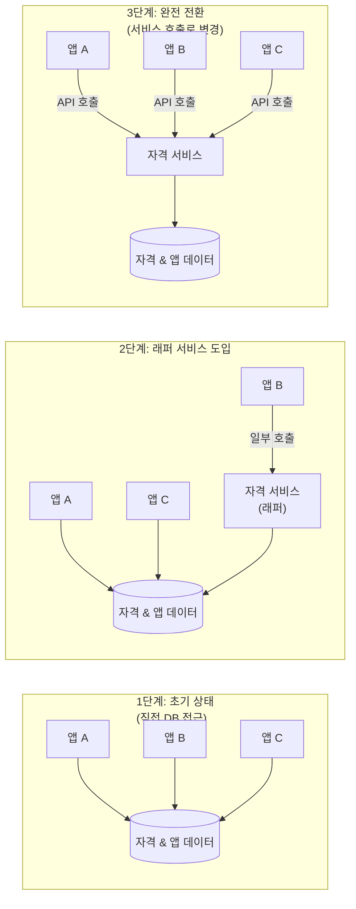

### 실제 사례: 호주 대형 은행의 자격(Entitlement) 시스템

샘 뉴먼은 호주의 한 큰 은행과 계약을 맺고 짧은 기간 동안 운영환경 구현을 맡은 조직을 도왔던 경험을 상세히 공유한다. 이 사례는 DB 래핑 서비스 패턴의 실용성을 생생하게 보여준다.

문제는 이 조직의 가장 중요한 핵심 중 하나인 **비즈니스 뱅킹 시스템**에 있었다. 이 시스템의 가장 중요한 부분 중 하나는 '자격(Entitlement)'이라 부르는 것을 관리하는 일이었다. 비즈니스 뱅킹에서 특정 계정에 접근할 수 있는 개인을 관리하고, 해당 계정에서 허용할 수 있는 작업을 계획하는 일은 매우 복잡했다. 권한이 어떻게 동작하는지 이해하기 위해 회사 A, B, C의 계정을 담당자를 예로 들어보자:

- B 회사의 경우 계정 간 최대 500달러를 이체할 수 있으며
- C 회사의 경우 계정 간 무제한 이체가 가능하지만 인출은 최대 250달러만 할 수 있다

이런 권한의 유지 관리와 적용은 데이터베이스의 저장 프로시저에서 거의 독점적으로 관리됐다. 모든 데이터 접근은 이와 같은 권한 부여 로직을 통해 이뤄졌다.

은행의 규모가 확장되고 비즈니스 로직과 상태가 복잡해짐에 따라 데이터베이스에 부하가 가해지기 시작했다. "우리는 오라클에 가능한 모든 자금을 쏟아 부었는데 아직 부족합니다." 결국 조직의 요구가 데이터베이스의 능력을 넘어설 것이라는 점이 문제였다.

**핵심 딜레마**: 문제의 중간에 버티고 있는 얽히고설킨 실타래가 바로 자격 시스템이었다. 연결을 끊으려는 시도는 악몽이 될 것이었고, 여기서 자칫 실수를 저지르기라도 한다면 이로 인해 불거질 위험은 엄청났다. 잘못된 단계로 이어지거나, 고객이 자신의 계좌에 접근 차단을 당할 수도 있으며, 설상가상으로 누군가가 고객의 돈에 접근하는, 결코 벌어져서는 안 될 일이 일어날 수도 있었다.

**해결책 — DB 래핑 서비스 도입**:

1. **즉각적 조치**: 가까운 시일 내에는 자격 시스템을 변경할 수 없다는 사실을 받아들이고, 최소한 문제를 더 이상 악화시키지 않도록 방어책을 세웠다. 따라서 사람들이 자격 스키마에 더 많은 데이터와 동작을 넣지 못하도록 막았다.

2. **전략적 계획**: 일단 이렇게 돌아가고 나면, 추출하기 쉬운 자격 스키마 부분을 제거하는 것을 고려해, 바라건대 장기적인 생존 가능성에 대한 우려가 줄어들 정도로 부하를 낮출 수 있을 것으로 봤다.

3. **자격 서비스 도입**: 팀은 문제가 있는 스키마를 "숨길" 수 있는 새로운 자격 서비스의 도입을 논의했다. 현재 데이터베이스가 이미 저장 프로시저 형태로 많은 동작을 구현했으므로, 처음에는 이 서비스에 동작이 거의 없을 것이다. 그러나 이렇게 설정한 목표는 **애플리케이션을 작성하는 팀이 자격 스키마를 다른 사람의 것으로 생각하도록 장려하고**, 자체 데이터를 로컬에 저장하도록 권장하는 것이었다.

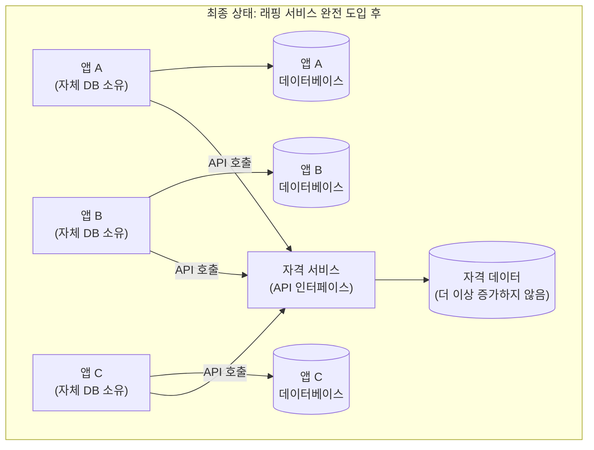

### DB 래핑 서비스의 적용 대상

데이터베이스 래핑 서비스 패턴은 기반 스키마 분리를 고려하기가 매우 어려운 상황에서 정말 잘 작동한다. 스키마를 둘러싼 명시적인 래퍼(Wrapper)를 배치하고 해당 래퍼를 통해서만 데이터에 접근할 수 있음을 분명하게 만들면 적어도 데이터베이스가 더 이상 증가하지 않게 제동을 걸 수 있다.

이 패턴은 **"여러분의 것"과 "다른 사람의 것"을 명확하게 구분**한다. 서비스 API는 기반 스키마와 서비스 계층의 소유권을 동일 팀에 부여할 때 가장 효과적일 것이다. 서비스 API는 이 API 계층이 어떻게 변경되는지에 대한 적절한 감독과 함께 관리형 인터페이스로 수용돼야 한다.

DB 뷰 패턴에 비해 장점이 있다. 첫째, 기존 테이블 구조에 매핑할 수 있는 뷰를 표현하는 과정에 제약이 없으며, 래퍼 서비스에서 코드를 작성해 기반 데이터에 접근하는 창을 정교하게 표현할 수 있다. 둘째, 래퍼 서비스는 또한 (API 호출을 통해) 쓰기를 수행할 수도 있다. 단순한 DB 뷰는 일반적으로 읽기 전용이지만, 래퍼 서비스는 쓰기도 가능하다.

---

## 6. 패턴 4: 서비스로서 데이터베이스(DaaS) 인터페이스

### 개념

때로는 클라이언트에게 쿼리를 위한 데이터베이스가 필요하다. 많은 양의 데이터를 쿼리하거나 가져와야 하거나, 이해관계자가 작업을 위해 SQL 종단점을 요구하는 도구를 이미 사용하고 있기 때문일 수도 있다. 예를 들어 비즈니스 지표에 대한 통찰력을 얻기 위해 주로 사용하는 태블로(Tableau) 같은 도구를 생각해보자.

이런 상황에서 데이터베이스 내에서 서비스가 관리하는 데이터를 클라이언트에 공개하는 것이 의미가 있을지도 모르지만, 서비스 경계 내에서 사용하는 데이터베이스와 외부로 공개된 데이터베이스를 분리할 수 있도록 유의해야 한다.

**권장하는 접근 방법**: 읽기 전용 종단점으로 외부에 공개되도록 설계된 **전용 데이터베이스**를 만들고, 기반 데이터베이스의 데이터가 변경될 때 이 데이터베이스를 채우는 방식이다.

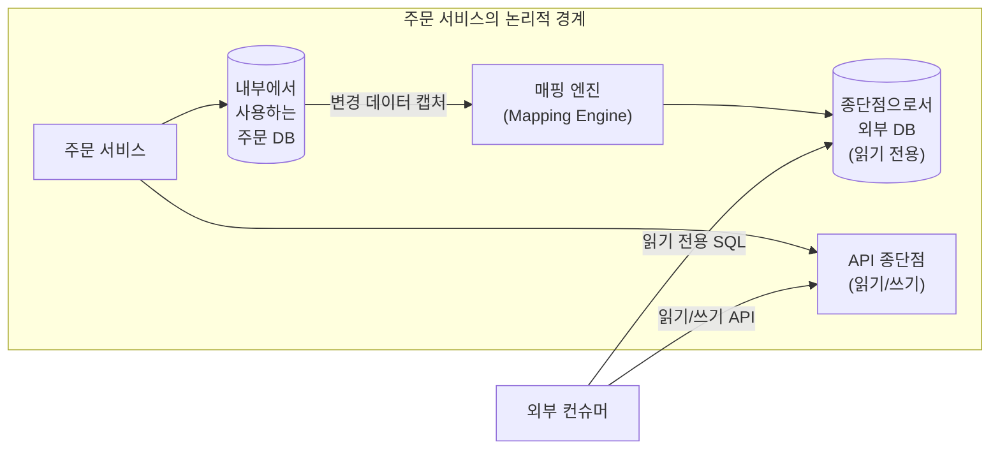

실제로 서비스에서 이벤트 스트림과 동기식 API를 각기 다른 종단점으로 외부에 공개하는 방식과 동일하게, 데이터베이스를 외부 컨슈머에게 공개할 수도 있다.

### 매핑 엔진의 역할과 구현

**매핑 엔진(Mapping Engine)** 은 내부 데이터베이스와 외부 데이터베이스 간의 추상화 계층 역할을 한다. 매핑 엔진은 변경사항을 완전히 무시하거나, 변경 내용을 직접 외부에 공개하거나, 또는 그 사이 어딘가에 자리잡을 수 있다.

핵심은 내부 데이터베이스가 구조를 변경할 때 외부 데이터베이스가 일관성을 유지한 채로 남아있도록, 매핑 엔진은 변경될 필요가 있다는 사실이다.

매핑 엔진 구현 방법은 크게 3가지다:

**방법 1: 변경 데이터 캡처(CDC) 시스템**  
이 해법은 가장 견고할 뿐만 아니라 가장 최신의 뷰를 제공할 가능성이 높다. 과거에는 이를 처리하기 위해 배치 작업(Batch Job)을 사용했을 것이다. 하지만 요즘에는 아마도 **디비지움(Debezium, https://github.com/debezium/debezium)** 같은 전용 변경 데이터 캡처 시스템을 활용할 것이다.

**방법 2: 배치 프로세스**  
배치 프로세스가 데이터를 복사하는 방식이지만, 이는 내부 데이터베이스와 외부 데이터베이스 간의 뒤처짐이 더 길어질 가능성이 높기 때문에 문제가 될 수 있으며, 몇몇 스키마에서는 어떤 데이터를 복사해야 할지 결정하기가 어려울 수도 있다.

**방법 3: 이벤트 기반**  
해당 서비스에서 일으킨 이벤트를 수신하고 이를 사용해 외부 데이터베이스를 업데이트하는 방식이다. IT 업계가 배치 작업에서 점차 멀어지고 데이터를 더 빠르게 원하면서 배치 작업은 실시간 처리에 자리를 내주고 있다. 이런 경향에 발맞추기 위해 변경 데이터 캡처 시스템을 준비하는 것은, 특히 서비스 경계 바깥으로 이벤트를 공개할 목적이라면 의미가 있다.

### Debezium — 현대적 CDC 도구

디비지움(Debezium)은 Apache Kafka Connect 기반의 오픈소스 분산 플랫폼으로, 데이터베이스를 실시간 이벤트 스트림으로 변환한다. PostgreSQL, MySQL, MongoDB, SQL Server, Oracle 등 다양한 데이터베이스를 지원하며, 데이터베이스의 트랜잭션 로그(WAL, Binlog)를 직접 읽어 애플리케이션 코드 수정이나 성능 오버헤드 없이 모든 커밋된 변경을 캡처한다.

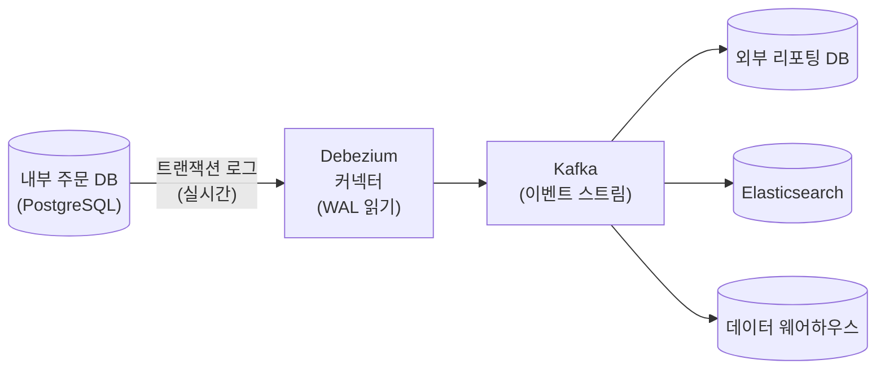

2025년 기준으로 Debezium 2.5+ 버전은 다음을 지원한다: Kafka 4.0 KRaft 통합, Kubernetes 및 Strimzi를 통한 클라우드 네이티브 배포, OpenTelemetry 및 Prometheus를 통한 종합적 관측 가능성, mTLS 및 시크릿 관리를 통한 프로덕션 수준의 보안.

### DB 뷰와 DaaS의 비교

DaaS(서비스로서 데이터베이스) 패턴은 단순한 데이터베이스 뷰보다 훨씬 더 정교하다.

데이터베이스 뷰는 일반적으로 특정 기술 스택과 연결되어 있다. 오라클 데이터베이스의 뷰를 제공하고 싶다면, 기반 데이터베이스와 뷰를 호스팅하는 스키마를 모두 오라클에서 실행해야 한다. DaaS 패턴 형태로 우리가 외부에 공개하는 데이터베이스는 완전히 다른 기술 스택이 될 수 있다. 서비스 내에서는 카산드라(Cassandra)를 사용하지만 전통적인 SQL 데이터베이스를 공개된 종단점으로 제공할 수도 있다.

DaaS 패턴은 데이터베이스 뷰보다 더 높은 유연성을 제공하지만 추가 비용이 든다. 데이터베이스 뷰로 시작해 나중에 전용 리포팅 데이터베이스로 전환하는 방식도 고려할 수 있다.

**적용 대상**: 종단점으로 외부에 공개된 데이터베이스는 읽기 전용이므로, 읽기 전용 접근이 필요한 클라이언트에게만 유용하다. 고객이 특정 서비스에서 보유하는 많은 양의 데이터를 대상으로 조인해 이터베이스의 데이터를 더 큰 데이터 웨어하우스로 가져와 여러 서비스에서 데이터를 쿼리할 수 있는 리포팅 데이터베이스 패턴에 상당히 적합하다.

---

## 7. 소유권 양도 — 데이터를 진짜로 분리하는 방법

앞서 살펴본 3가지 패턴(DB 뷰, DB 래핑 서비스, DaaS)은 모두 거대한 공유 데이터베이스에 임시방편으로 다양한 맹질을 해왔을 뿐이다. 이들은 상황이 더 나빠지는 것을 막거나, 점진적 분리를 위한 발판을 마련하는 데 유용하지만, 근본적인 문제를 해결하지는 않는다.

**가장 근본적인 문제**: 거대한 모놀리스 데이터베이스에서 데이터를 가져오는 까다로운 작업을 고려하기에 앞서, 문제의 데이터를 실제로 어디에 배치해야 할지 고려해야 한다. 모놀리스에서 서비스를 분리할 때, 어떤 데이터는 서비스와 함께 이동하며, 어떤 데이터는 원래 위치에 머물러야 한다.

### 패턴 A: 집계를 외부에 공개하는 모놀리스 (Monolith Exposing Aggregates)

이 패턴은 새로운 마이크로서비스가 아직 모놀리스가 소유한 데이터에 접근해야 하는 상황에서 사용한다.

책의 그림 4-8 예를 보면, 새로운 "송장 작성 서비스"는 승인 워크플로를 관리하려면 현재 직원에 대한 정보가 필요하다. 이 데이터는 현재 모두 모놀리스 데이터베이스 안에 있다. 모놀리스 자체에서 서비스 종단점(API 또는 이벤트 스트림일 수 있음)을 통해 직원에 대한 정보를 외부에 공개함으로써, 송장 작성 서비스가 요구하는 정보를 명시적으로 제공한다.

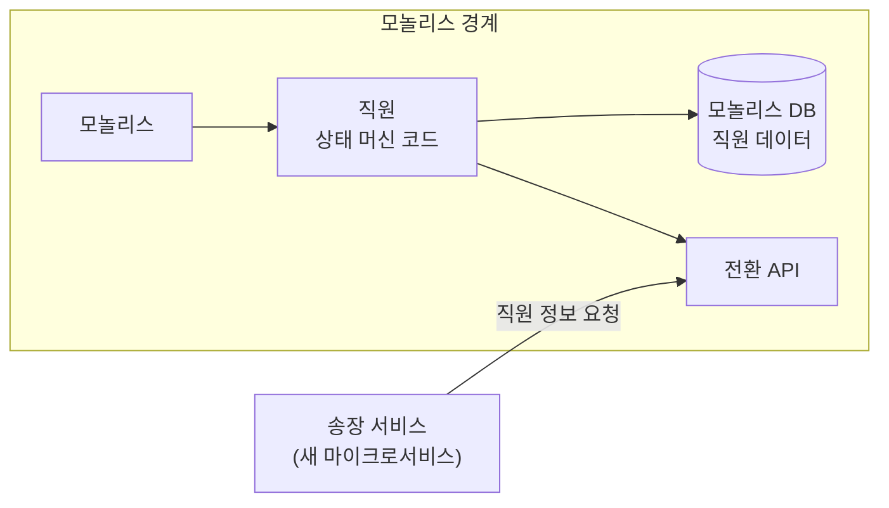

중요한 포인트: 우리는 마이크로서비스를 행동(Behavior)과 상태(State)의 조합으로 간주하기를 원한다. 모놀리스는 자체적으로 상태 변화를 허용하거나 허용하지 않는 규칙을 '소유'하고 있다. 단순히 데이터베이스를 감싸는 래퍼처럼 모놀리스를 취급하고 싶지는 않다. 데이터를 외부에 공개하는 기능 이외에도 이해관계자가 집계의 현재 상태를 쿼리하고 새로운 상태로 전환하기 위한 요청을 허용하게끔 연산을 외부에 공개하고 있다.

**더 많은 서비스로 가는 통로**: 송장 서비스의 요구를 정의하고 명확하게 정의된 인터페이스에 필요한 정보를 명시적으로 외부에 공개함으로써, 우리는 미래의 서비스 경계를 잠재적으로 발견할 수 있는 길을 가고 있다. 그림 4-9에서 볼 수 있듯이 다음 단계는 두말할 필요 없이 직원 서비스 추출이다. 직원 관련 데이터에 대해 API를 외부에 공개함으로써, 우리는 이미 새로운 직원 서비스의 컨슈머가 요구하는 바가 무엇인지 이해하는 작업을 진행해왔다.

### 패턴 B: 데이터 소유권 변경 (Data Ownership Transfer)

새로운 서비스가 아직 모놀리스가 소유한 데이터에 접근해야 할 필요가 있었던 이전 절에서, 다른 기능이 소유한 데이터에 새 송장 서비스가 접근할 때 무슨 일이 발생하는지를 살펴봤다. 만약 새로 추출된 서비스의 제어를 받아야 할 데이터가 모놀리스에 존재하는 경우, 무슨 일이 벌어질까?

해결책은 명확하다. **송장 관련 데이터는 모놀리스에서 새 송장 서비스로 옮기고, 여기서 데이터 수명주기를 관리해야 한다.** 그런 다음 송장 서비스를 송장 관련 데이터에 대한 진실의 원천으로 취급하고, 데이터를 읽거나 변경을 요청하기 위해 송장 서비스 종단점을 호출하도록 모놀리스를 변경해야 한다.

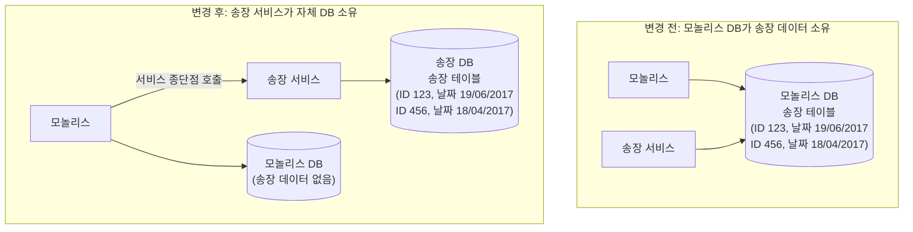

그러나 기존 모놀리스 데이터베이스에서 끼여 있는 송장 데이터를 풀어내는 작업은 복잡할 수 있다. 외래 키 제약 조건 위반이나 트랜잭션 경계 위반 등의 영향을 고려해야 할지도 모른다.

송장 관련 데이터에 대한 읽기 접근만 필요하게 모놀리스를 변경할 수 있다면, 그림 4-11처럼 **송장 서비스 데이터베이스에서 뷰를 투사하는 방식**을 고려할 수도 있다. 이 경우 송장 서비스의 데이터베이스가 실제 진실의 원천이 되고, 모놀리스는 뷰를 통해 역방향으로 읽기 접근을 한다.

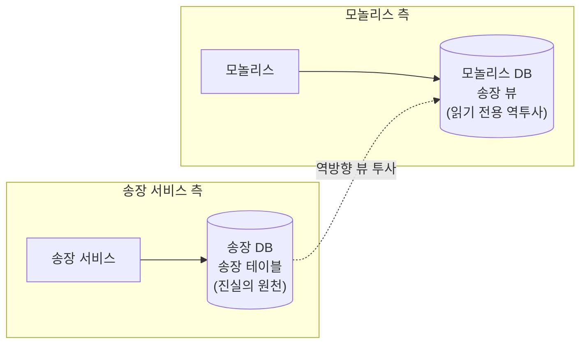

그러나 저자는 새로운 송장 서비스를 직접 호출하게끔 모놀리스를 변경하는 방식을 가장 선호한다고 밝힌다. 데이터베이스 뷰의 모든 제한 사항이 적용되기 때문이다.

**데이터 소유권 변경 패턴의 적용 대상**: 이 패턴은 명확하게 데이터 분리가 가능할 때 유용하다. 새로 추출한 서비스가 몇몇 데이터를 변경하는 비즈니스 로직을 캡슐화하는 경우, 해당 데이터는 새 서비스의 제어하에 있어야 한다. 데이터는 원래 위치에서 새 서비스로 옮겨져야 한다. 물론 기존 데이터베이스에서 데이터를 이동하는 프로세스는 간단한 프로세스와는 거리가 멀다. 이런 과정은 4장 후반부에서 집중해서 다룰 예정이다.

---

## 8. 4장 패턴 종합 비교

4장에서 소개된 패턴들을 목적, 복잡도, 적용 상황 기준으로 비교하면 다음과 같다.

| 패턴 | 결합도 해소 수준 | 복잡도 | 쓰기 지원 | 최적 적용 상황 |
|---|---|---|---|---|
| **공유 DB** | 없음 | 낮음 | ✅ | 읽기 전용 참조 데이터, DaaS |
| **DB 뷰** | 낮음 (읽기 제한) | 낮음~중간 | ❌ (일반적) | 정보 은닉 임시 조치, 스키마 분해 첫 단계 |
| **DB 래핑 서비스** | 중간 | 중간 | ✅ | 분리 불가능한 복잡한 DB, 소유권 이전 준비 |
| **DaaS** | 높음 (내외부 분리) | 높음 | 제한적 | 대량 읽기 쿼리 필요 클라이언트, 분석/리포팅 |
| **소유권 양도** | 완전 분리 | 매우 높음 | ✅ | 진정한 MSA, 독립 배포 가능성 실현 |

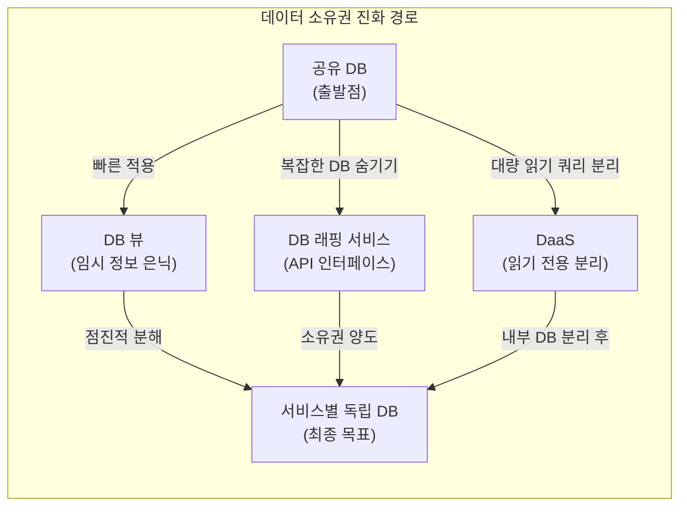

**핵심 통찰**: 이 모든 패턴은 단번에 완전한 MSA를 달성하는 것이 불가능한 현실에서, 점진적으로 결합도를 낮추면서 최종 목표인 "서비스별 독립 데이터베이스"로 나아가기 위한 중간 발판들이다. 저자 샘 뉴먼은 각 패턴을 선택하고 실행하면서 상황이 더 나빠지지 않도록 막고, 동시에 올바른 방향으로 나아가는 것이 중요하다고 강조한다.

> "여러분은 현재 시스템에서 지금 당장 처리하기가 불가능해 보이는 문제에 부딪히게 될 것이다. 지금 당장은 해법을 찾지 못하더라도, 팀원들과 문제를 파고들어, 곧 해결해야 할 문제임을 모두가 동의할 수 있게 해야 한다. 그런 다음에는 최소한 지금 당장 옳은 길로 가고 있다고 자각하게 만들어야 한다."  
> — 샘 뉴먼, 이 책의 조언

---

