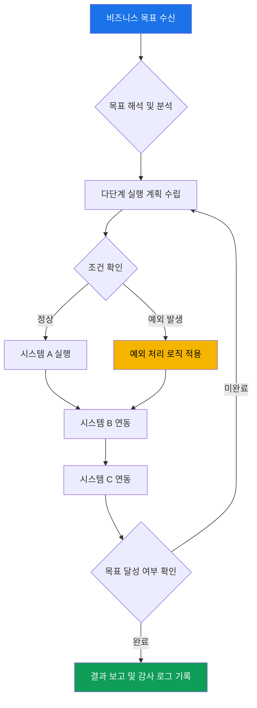
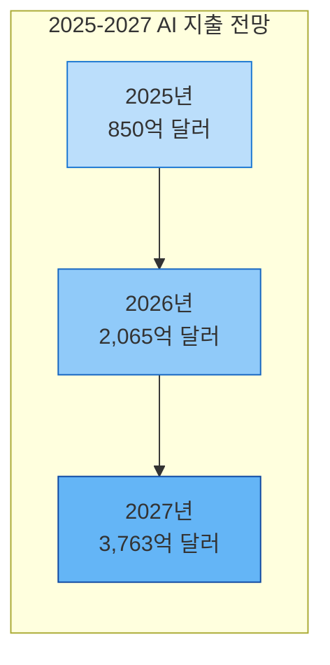
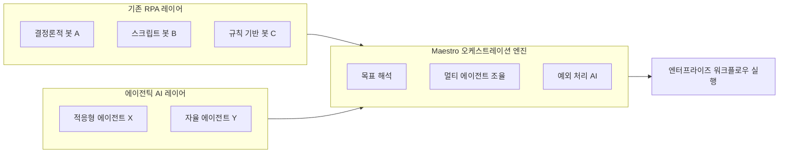
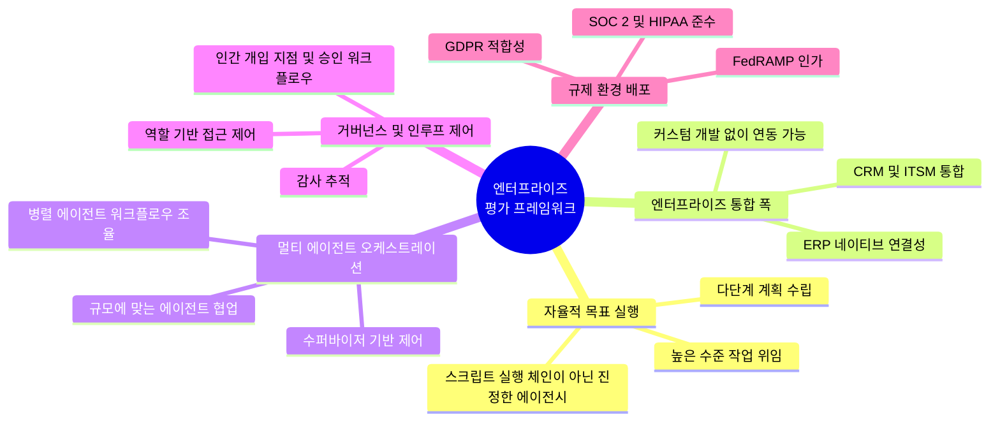
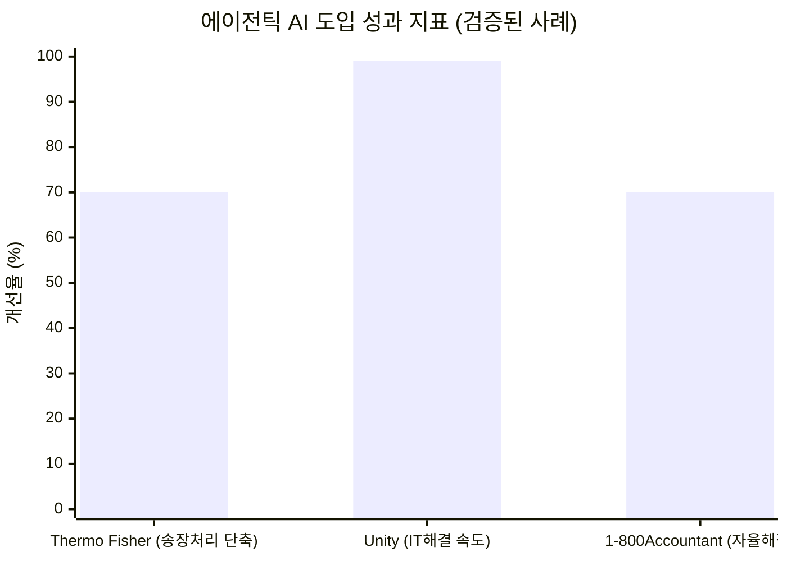
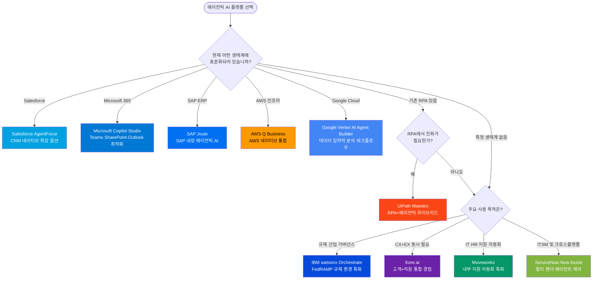

> **출처**: [Cygnet.ONE 분석 보고서](https://www.cygnet.one/feeds/blog/agentic-ai-tools-enterprise-operations) (2026년 4월 27일 발행) — 최신 정보 기반 상세 해설
>
> **작성 기준**: 2026년 6월 기준 검증된 정보 반영

---

## 목차

1. [서론: 엔터프라이즈 자동화의 새로운 전환점](#서론)
2. [에이전틱 AI란 무엇인가](#에이전틱-ai란-무엇인가)
3. [2026년의 시장 환경과 투자 동향](#2026년-시장-환경)
4. [10대 에이전틱 AI 도구 상세 분석](#10대-도구-분석)
   - 1. Salesforce AgentForce
   - 2. ServiceNow Now Assist
   - 3. Microsoft Copilot Studio
   - 4. UiPath (Maestro 오케스트레이션 엔진)
   - 5. IBM watsonx Orchestrate
   - 6. Google Vertex AI Agent Builder
   - 7. Kore.ai
   - 8. AWS Q Business
   - 9. Moveworks
   - 10. SAP Joule
5. [엔터프라이즈 평가 프레임워크 5대 기준](#평가-프레임워크)
6. [검증된 실제 도입 사례와 성과 지표](#검증된-사례)
7. [플랫폼 선택 가이드: 유형별 최적 솔루션](#플랫폼-선택-가이드)
8. [결론 및 실무 적용 전략](#결론)

---

## 서론: 엔터프라이즈 자동화의 새로운 전환점 {#서론}

2026년 현재, 복잡한 ERP, CRM, HRMS, 레거시 시스템을 운영하는 대기업들은 한 가지 근본적인 과제에 직면해 있다. 바로 스크립트 기반 자동화가 해결할 수 없는 **수작업 조율의 공백(manual coordination gap)** 이다.

전통적인 규칙 기반 자동화는 예외 상황이 발생하는 순간 작동을 멈춘다. 세금 데이터가 누락된 공급업체 송장, 부서 간 맥락이 필요한 IT 티켓, 불완전한 문서 때문에 멈춰버린 벤더 온보딩 워크플로우 — 이런 상황에서 기존의 RPA 봇은 그냥 멈추고 에스컬레이션할 뿐이다. 이러한 공백은 시간을 낭비하고, 컴플라이언스 리스크를 야기하며, 생산성을 갉아먹는다.

에이전틱 AI(Agentic AI)는 이 문제를 근본적으로 다른 방식으로 해결한다. 규칙을 따르는 대신 **높은 수준의 비즈니스 목표를 해석하고, 다단계 실행 계획을 수립하며, 조건이 바뀌어도 스스로 적응**한다. 사람이 일일이 방향을 지시하지 않아도 된다.

운영 리더들에게 잘못된 플랫폼 선택은 단순한 비용 낭비가 아니라 거버넌스 실패, 통합 장애, 심지어 프로젝트 취소로 이어지는 실질적인 결과를 초래한다.

---

## 에이전틱 AI란 무엇인가 {#에이전틱-ai란-무엇인가}

에이전틱 AI는 **높은 수준의 비즈니스 목표를 해석하고, 이를 실행 가능한 단계로 세분화하며, 지속적인 사람의 지시 없이도 엔터프라이즈 시스템 전반에 걸쳐 행동하는 자율 시스템**을 의미한다. 미리 정해진 스크립트를 따르는 규칙 기반 자동화와는 근본적으로 다르다.

전통적인 자동화는 예외 앞에서 무너진다. 세금 식별자가 누락된 송장이 들어오면 스크립트 RPA 봇은 멈추고 에스컬레이션한다. IT 인시던트가 세 가지 시스템의 컨텍스트를 요구할 때 규칙 기반 워크플로우는 적응하지 못한다. 에이전틱 AI는 예외를 추론하고, 여러 데이터 소스를 조회하며, 다단계 해결책을 자율적으로 실행함으로써 이 공백을 채운다.

이것이 가장 중요하게 작용하는 영역은 **수작업 핸드오프가 병목을 만드는 높은 예외 빈도 워크플로우**다.

- 송장 승인 및 매출채권(AP) 처리
- 여러 시스템에 걸친 IT 인시던트 해결
- 벤더 온보딩 및 계약 워크플로우
- 부서 간 조율 및 승인 프로세스

---

## 2026년의 시장 환경과 투자 동향 {#2026년-시장-환경}

에이전틱 AI에 대한 투자는 가속화되고 있다. **IDC는 2025년부터 2029년까지 AI 지출이 연간 31.9% 증가할 것**으로 전망하며, 에이전틱 AI가 그 성장의 상당 부분을 차지하게 된다고 밝혔다.

Gartner의 2026년 전망에 따르면, **2026년 말까지 기업 애플리케이션의 40%에 특정 작업 전용 AI 에이전트가 탑재**될 것으로 예상된다. 이는 2025년 초 5% 미만에서 급격히 증가한 수치다. **에이전틱 AI 소프트웨어 지출은 2026년 2,065억 달러, 2027년 3,763억 달러**로 82% 단년 성장이 예상된다.

그러나 낙관적인 시장 전망과 함께 가트너의 강력한 경고도 주목해야 한다.

> *"에이전틱 AI 프로젝트의 40% 이상이 2027년 말까지 취소될 것이며, 그 원인은 비용 증가, 불명확한 비즈니스 가치, 또는 불충분한 리스크 통제 때문이다."* — Gartner, 2025년 6월

Gartner 수석 이사 분석가 Anushree Verma는 이렇게 설명했다. "현재 대부분의 에이전틱 AI 프로젝트는 초기 단계 실험이나 개념 증명(POC)으로, 주로 과장된 기대에 의해 추진되고 있으며 종종 잘못 적용되고 있다. 이것이 조직들이 에이전트를 실제 규모로 배포하는 데 드는 진정한 비용과 복잡성을 직시하지 못하게 만들고, 프로젝트를 생산 단계로 넘기지 못하고 지연시킨다."

가트너는 또한 수천 개의 에이전틱 AI 벤더 중 실제로 진정한 에이전틱 역량을 갖춘 업체는 약 130개에 불과하다고 추산하며, **'에이전트 워싱(agent washing)'** — 기존 AI 어시스턴트, RPA, 챗봇 제품을 에이전틱 AI로 재브랜딩하는 현상 — 이 만연하다고 경고한다.

2026년 1월 Deloitte 보고서는 자율 AI 에이전트 거버넌스에 성숙한 모델을 갖춘 기업이 전체의 5분의 1에 불과하다는 점을 발견했는데, 이것이 바로 프로젝트 실패로 이어지는 거버넌스 격차다.

**플랫폼 결정을 올바르게 하는 것이 빨리 움직이는 것보다 더 중요하다.**

---

## 10대 에이전틱 AI 도구 상세 분석 {#10대-도구-분석}

이 10개 도구는 엔터프라이즈 준비도, 자율성 역량, 통합 폭, 거버넌스 통제, 그리고 실제 대규모 배포 실적을 기준으로 선정되었다.

---

### 1. Salesforce AgentForce

**Salesforce AgentForce**는 Salesforce 플랫폼에 내장된 에이전틱 AI 레이어로, 기업들이 CRM 데이터와 Einstein AI 역량을 활용하여 영업, 서비스, 마케팅 워크플로우 전반에 자율 에이전트를 배포할 수 있게 한다.

AgentForce의 가장 큰 강점은 Salesforce의 Data Cloud와 워크플로우 엔진에 네이티브로 연결되어 있다는 점이다. 에이전트는 사람의 개입 없이 케이스 해결, 리드 육성, 영업 파이프라인 업데이트를 처음부터 끝까지 처리한다. 2026년 1분기(FY26) 기준으로 AgentForce는 독립형 ARR(연간 반복 매출)에서 5억 달러를 돌파했으며, 이는 전년 대비 330% 증가한 수치로, 9,500건 이상의 유료 계약이 체결되었다.

핵심 기술인 **Atlas Reasoning Engine**은 CRM 네이티브 추론 역량 측면에서 경쟁사 중 가장 강력하다는 평가를 받는다. 2026년 Spring '26 업데이트에서는 Agentforce Voice가 도입되어 SIP(Session Initiation Protocol) 통합을 통해 전화, 웹, 모바일 채널에서 음성 에이전트를 지원하며, 특히 금융 서비스용 Agentforce Voice는 규제된 뱅킹 및 추심 문의를 처리할 수 있다.

| 항목 | 세부 내용 |
|------|-----------|
| **주요 기능** | 멀티 에이전트 오케스트레이션, Einstein AI 통합, Atlas Reasoning Engine, 사전 구축된 CRM 액션 라이브러리, MCP(Model Context Protocol) 지원 |
| **최적 활용 분야** | 영업 자동화, 고객 서비스 케이스 관리, CRM 네이티브 엔터프라이즈 운영 |
| **배포 모델** | 클라우드 네이티브 SaaS; Salesforce 플랫폼 구독의 일부 |
| **주의사항** | Salesforce 생태계 외부의 비-Salesforce 워크플로우에서는 한계가 있음 |

---

### 2. ServiceNow Now Assist

**ServiceNow Now Assist**는 ITSM, HR 서비스 제공, 운영 워크플로우에 에이전틱 AI를 도입하여, 에이전트가 티켓을 자동으로 해결하고, 예외 상황을 라우팅하며, ServiceNow 생태계 내에서 후속 프로세스를 트리거할 수 있게 한다.

ServiceNow의 내부 배포 결과는 Now Assist의 역량을 잘 보여준다. 해결 노트 작성 시간이 약 80% 단축되었고, 120일 내에 연간 1,000만 달러의 유형 이익을 창출했는데, 이는 연간 50명의 FTE(전일제 직원)와 맞먹는 규모다. 2026년 현재 ServiceNow AI Agents는 450개 이상의 엔터프라이즈 시스템 커넥터와 FedRAMP 컴플라이언스를 통해 정부 배포에서도 강점을 보이고 있다.

**AI Agent Orchestrator**는 여러 에이전트가 협력하여 복잡한 IT 및 HR 워크플로우를 처리할 수 있도록 하는 핵심 구성 요소다. 특히 크로스 플랫폼 거버넌스(여러 벤더의 에이전트를 하나의 제어 플레인에서 관리하는 기능)가 최우선 과제인 기업에 적합하다.

| 항목 | 세부 내용 |
|------|-----------|
| **주요 기능** | 티켓 자동 해결, 자연어로 워크플로우 생성, AI Agent Orchestrator, 부서 간 프로세스 오케스트레이션, 가상 에이전트 |
| **최적 활용 분야** | IT 서비스 관리, HR 운영, 공유 서비스 자동화 |
| **배포 모델** | 클라우드 SaaS; Now Platform 구독의 일부 |
| **주의사항** | 복잡한 배포를 위한 상당한 구현 리소스 필요 |

---

### 3. Microsoft Copilot Studio

**Microsoft Copilot Studio**는 엔터프라이즈가 Microsoft 365 생태계 내에서 커스텀 자율 에이전트를 구축하고 배포할 수 있게 하며, Teams, Outlook, SharePoint, Power Automate에 연결하여 내부 프로세스를 자동화한다.

Microsoft에 표준화된 기업들에게 가장 깊은 통합을 제공한다. 기존 M365 권한과 데이터 거버넌스 정책을 활용하므로 추가적인 커넥터 설정 없이도 작동한다. **1,400개 이상의 Power Platform 커넥터**는 가장 일반적인 엔터프라이즈 SaaS 통합을 지원하며, **Entra Agent ID 거버넌스 레이어**는 Microsoft 중심 배포에서 잘 통합되어 있다.

2026년 현재 Microsoft는 MCP(Model Context Protocol)와 A2A(Agent-to-Agent) 상호 운용성 표준을 수용하여 Azure를 이기종 멀티 에이전트 환경을 위한 운영 백본으로 포지셔닝하고 있다. 경쟁사 대비 비교: Salesforce는 CRM 네이티브 에이전트에서 강세를 보이지만 Copilot은 Teams, SharePoint, Outlook 내부에서 운영되는 에이전트에서 더 빠른 가치를 제공한다고 평가된다.

| 항목 | 세부 내용 |
|------|-----------|
| **주요 기능** | 노코드/로우코드 에이전트 빌더, Power Platform 통합, 1,400개 이상의 커넥터, M365 데이터 커넥터, Azure AD를 통한 거버넌스 |
| **최적 활용 분야** | 내부 생산성 자동화, 문서 워크플로우, Microsoft 네이티브 엔터프라이즈 환경 |
| **배포 모델** | 클라우드 SaaS; 일부 Microsoft 365 및 Power Platform 플랜에 포함 |

---

### 4. UiPath (Maestro 오케스트레이션 엔진)

**UiPath**는 수십 년의 RPA(로봇 프로세스 자동화) 전문성과 에이전틱 지능을 **Maestro 오케스트레이션 엔진**을 통해 결합하여, 기업들이 동일한 플랫폼에서 결정론적 봇과 적응형 AI 에이전트를 나란히 실행할 수 있게 한다.

기존 RPA 배포가 있는 기업에게 가장 명확한 업그레이드 경로를 제공한다는 것이 UiPath의 핵심 강점이다. Maestro는 기존 스택을 처음부터 다시 구축할 필요 없이 스크립트 자동화 위에 목표 지향적 지능을 추가한다. 강력한 거버넌스와 감사 역량은 규제 환경에 특히 적합하다.

BPMN 2.0 프로세스 모델링, 30개 이상의 사전 구축 템플릿, 실시간 인스턴스 감시 기능을 갖추고 있어 특히 금융, 제조, 공급망 분야의 백오피스 워크플로우에서 강점을 발휘한다.

| 항목 | 세부 내용 |
|------|-----------|
| **주요 기능** | RPA + 에이전틱 하이브리드, Maestro 멀티 에이전트 오케스트레이션, BPMN 2.0 프로세스 모델링, 30개 이상 사전 구축 템플릿, 실시간 인스턴스 감시 |
| **최적 활용 분야** | RPA에서 지능형 자동화로 전환하는 기업, 백오피스 및 공급망 워크플로우 |
| **배포 모델** | 클라우드, 온프레미스, 하이브리드; 엔터프라이즈 라이센싱 모델 |

---

### 5. IBM watsonx Orchestrate

**IBM watsonx Orchestrate**는 HR, 조달, 고객 서비스, 운영 전반에서 팀이 AI 에이전트와 어시스턴트를 구축, 배포, 관리할 수 있게 하는 엔터프라이즈 AI 플랫폼으로, 규제 산업에 강한 초점을 맞추고 있다.

IBM은 2026년 5월 IBM Think 2026에서 watsonx Orchestrate의 차세대 형태를 **다중 에이전트 제어 플레인(multi-agent control plane)** 으로 발표했다. 이는 일관된 정책 집행과 완전한 감사 가능성을 갖추고 어떤 소스의 수천 개 AI 에이전트도 배포, 거버넌스, 감사할 수 있는 체계다. IBM CEO Arvind Krishna는 5,000명의 리더들에게 앞서가는 기업은 더 많은 AI를 배포하는 것이 아니라, 비즈니스 운영 방식 자체를 AI 중심으로 재설계하고 있다고 강조했다.

500개 이상의 사전 구축 도구와 100개 이상의 도메인별 에이전트를 포함하며, SAP, Salesforce, ServiceNow와의 멀티 시스템 통합을 지원한다. 특히 IBM Granite 파운데이션 모델을 사용하여 어떤 AI 공급업체에도 종속되지 않는 오픈 하이브리드 아키텍처를 고수하는 점이 차별화된다. SAP Joule 에이전트와 IBM Consulting Advantage 에이전트 간의 Agent2Agent 상호 운용성 표준 연동도 2026년 5월 IBM Think에서 공개되었다.

실제 성과: Avid Solutions International은 직원 온보딩 시간을 25% 단축했으며, IBM의 내부 HR 어시스턴트는 연간 540만 건의 인터랙션을 처리하며 16,000시간 이상의 직원 시간을 절약하고 있다.

| 항목 | 세부 내용 |
|------|-----------|
| **주요 기능** | 사전 구축 에이전트 스킬 라이브러리(500개 이상 도구), 멀티 시스템 통합(SAP, Salesforce, ServiceNow), 하이브리드 클라우드 배포, AgentOps 관찰성 레이어 |
| **최적 활용 분야** | 규제 산업(은행, 보험, 의료), HR 및 조달 자동화 |
| **배포 모델** | 클라우드(IBM Cloud/AWS/Azure) 또는 IBM Cloud Pak을 통한 온프레미스; FedRAMP 인가 |

---

### 6. Google Vertex AI Agent Builder

**Google Vertex AI Agent Builder**는 엔터프라이즈 데이터와의 그라운딩, Google Search 및 BigQuery 통합, 멀티 에이전트 프레임워크, Gemini 모델 접근을 제공하는 클라우드 네이티브 에이전틱 AI 애플리케이션 설계 및 배포 플랫폼이다.

대규모 내부 지식 베이스에 그라운딩된 에이전트가 필요한 데이터 집약적 기업에게 가장 적합하다. 연구 자동화와 분석 기반 워크플로우에서 특히 강세를 보이며, 노코드(Agent Designer)와 코드 우선(Agent Development Kit) 두 가지 개발 경로를 모두 지원한다.

RAG Engine을 통한 Google Search 그라운딩, BigQuery를 통한 데이터 그라운딩, 100개 이상의 통합 커넥터가 핵심 강점이다. 단, Google Cloud 인프라에 대한 강한 의존성이 있어 비 GCP 시스템과의 멀티 에이전트 오케스트레이션에서는 추가적인 서드파티 텔레메트리와 커스텀 대시보드가 필요할 수 있다.

| 항목 | 세부 내용 |
|------|-----------|
| **주요 기능** | Gemini 모델 접근, Google Search 그라운딩이 있는 RAG Engine, BigQuery를 통한 데이터 그라운딩, 멀티 에이전트 오케스트레이션, 100개 이상 통합 커넥터 |
| **최적 활용 분야** | 데이터 집약적 연구 및 분석 자동화, Google Cloud 네이티브 기업 |
| **배포 모델** | Google Cloud의 클라우드 네이티브; 종량제 및 엔터프라이즈 계약 |

---

### 7. Kore.ai

**Kore.ai**는 고객 경험(CX), 직원 경험(EX), 백오피스 자동화를 아우르는 풀 피처 엔터프라이즈 에이전틱 AI 플랫폼으로, 대화형 AI와 멀티 에이전트 오케스트레이션을 결합한다.

고객 대면 워크플로우와 내부 워크플로우 모두에 걸쳐 동시에 에이전트가 필요한 기업에게 가장 강력한 옵션이다. 이 플랫폼은 500개 이상의 엔터프라이즈 고객에 걸쳐 매일 4억 5,000만 건의 인터랙션을 처리한다. 한 글로벌 뱅킹 고객은 월 1,500만 건의 신용카드 문의를 90%의 콜 컨테인먼트율로 처리하고 있다.

수퍼바이저 기반 모델을 통한 멀티 에이전트 오케스트레이션, 사전 구축 산업 솔루션, 대화형 AI와 워크플로우 융합, 100개 이상 엔터프라이즈 커넥터가 핵심 기능이다. SOC 2, HIPAA, GDPR 컴플라이언스를 갖추고 있어 BFSI(금융, 은행, 보험) 및 의료 분야에서 특히 강점을 보인다.

| 항목 | 세부 내용 |
|------|-----------|
| **주요 기능** | 수퍼바이저 기반 모델의 멀티 에이전트 오케스트레이션, 사전 구축 산업 솔루션, 대화형 AI + 워크플로우 융합, 100개 이상 엔터프라이즈 커넥터 |
| **최적 활용 분야** | CX 및 EX 자동화가 동시에 필요한 기업, BFSI 및 의료 분야 |
| **배포 모델** | 클라우드 SaaS 또는 프라이빗 클라우드; 엔터프라이즈 라이센싱; SOC 2, HIPAA, GDPR 컴플라이언트 |

---

### 8. AWS Q Business

**AWS Q Business**는 Amazon의 엔터프라이즈급 에이전틱 AI 플랫폼으로, AWS 생태계 내에서 문서 검색, 데이터 분석, 워크플로우 자동화를 결합하고, 최소한의 엔지니어링으로 서드파티 앱에 연결한다.

AWS 인프라에 표준화된 기업에게 최적의 선택이다. 에이전트는 내부 지식 베이스를 조회하고, 구조화 및 비구조화 데이터에서 인사이트를 생성하며, 연결된 비즈니스 앱 전반에서 워크플로우를 트리거할 수 있다. Accelya는 Q Apps를 활용하여 테스트 케이스 생성 작업량을 70~80% 절감하는 성과를 달성했다.

Lite와 Pro 두 가지 티어의 소비 기반 가격 모델로 운영되며, AWS 보안 및 아이덴티티 통합, 엔터프라이즈 지식 검색, 목적 특화 자동화를 위한 Q Apps가 핵심 기능이다.

| 항목 | 세부 내용 |
|------|-----------|
| **주요 기능** | 엔터프라이즈 지식 검색, 서드파티 앱 커넥터, AWS 보안 및 아이덴티티 통합, Q Apps, 채팅 오케스트레이션 |
| **최적 활용 분야** | 지식 관리, 데이터 리서치 워크플로우, AWS 네이티브 기업 |
| **배포 모델** | AWS의 클라우드 네이티브; Lite 및 Pro 티어의 소비 기반 가격 |

---

### 9. Moveworks

**Moveworks**는 자연어 이해와 작업 실행을 사용하여 IT, HR, 시설 티켓을 수동 개입 없이 처음부터 끝까지 해결하는 내부 엔터프라이즈 지원 전용 자율 AI다.

내부 지원 자동화에 특화되어 있으며, 헬프 데스크 티켓 볼륨 감소와 해결 시간 단축에서 탁월한 성과를 보인다. Broadcom은 88%의 자율 해결률을 달성했고, Databricks는 IT 및 HR 지원에서 73%의 티켓 해결률을 기록하고 있다. 또한 Unity는 Moveworks를 통해 IT 문제 해결 시간을 3일에서 1분 미만으로 단축했다.

커스텀 에이전트를 위한 Agent Studio, 의도 기반 티켓 해결, 소스 시스템에서 미러링된 자동화된 승인이 핵심 기능이다. FedRAMP Moderate 및 SOC 2 Type 2 인증을 보유하고 있다.

| 항목 | 세부 내용 |
|------|-----------|
| **주요 기능** | 의도 기반 티켓 해결, 커스텀 에이전트를 위한 Agent Studio, 자연어 처리, ITSM/HRMS 통합, 소스 시스템 미러링 자동화 승인 |
| **최적 활용 분야** | IT 헬프 데스크 자동화, HR 셀프 서비스, 내부 직원 지원 워크플로우 |
| **배포 모델** | 클라우드 SaaS; 엔터프라이즈 구독; FedRAMP Moderate 및 SOC 2 Type 2 인증 |

---

### 10. SAP Joule

**SAP Joule**은 SAP S/4HANA, SuccessFactors, Ariba, 기타 SAP 모듈에 네이티브로 내장된 SAP의 AI 코파일럿이자 에이전틱 프레임워크로, 기존 SAP 워크플로우 내에서 자율적으로 작동한다.

SAP를 핵심 ERP로 운영하는 기업에게 Joule의 네이티브 깊이를 따라올 수 있는 도구는 없다. 외부 커넥터 없이 SAP 데이터 내에서 탐색, 쿼리, 실행이 가능하며, 공급망, 재무, HR 팀에게 SAP에서 가장 마찰이 적은 진입점을 제공한다. SAP는 클라우드 포트폴리오 전반에서 2,400개 이상의 Joule 스킬을 제공한다고 밝혔다.

IBM watsonx Orchestrate와의 Agent2Agent 상호 운용성 표준 연동이 2026년 5월 IBM Think에서 공개되어, SAP 중심 기업들이 더 넓은 에이전틱 AI 생태계와 통합할 수 있는 경로가 열렸다.

| 항목 | 세부 내용 |
|------|-----------|
| **주요 기능** | S/4HANA, SuccessFactors, Ariba 전반의 네이티브 SAP 통합, 자연어 ERP 인터랙션, 내장 AI 워크플로우, 스킬/에이전트 빌더, Action Bar 인터페이스 |
| **최적 활용 분야** | SAP 중심 기업, SAP 생태계 내의 재무, 공급망, HR 자동화 |
| **배포 모델** | 클라우드(SAP BTP); SAP 클라우드 구독 티어에 포함; 소버린 클라우드 옵션 제공 |

---

## 엔터프라이즈 평가 프레임워크 5대 기준 {#평가-프레임워크}

Cygnet.ONE이 제시하는 엔터프라이즈 에이전틱 AI 도구 평가 프레임워크는 5개의 핵심 기준으로 구성된다.

이 다섯 가지 기준을 더 구체적으로 살펴보면 다음과 같다.

**첫째, 자율적 목표 실행(Autonomous Goal Execution)** 은 단순히 스크립트 실행 체인을 따르는 것이 아닌 진정한 작업 위임 역량을 의미한다. AI 에이전트가 독립적으로 복잡한 다단계 작업을 계획하고 완수할 수 있어야 한다.

**둘째, 엔터프라이즈 통합 폭(Enterprise Integration Breadth)** 은 커스텀 개발 없이 ERP, CRM, ITSM 시스템에 네이티브로 연결하는 능력을 뜻한다. CRM, ERP, API, 레거시 시스템 전반에서 원활한 연결성이 필요하다.

**셋째, 멀티 에이전트 오케스트레이션(Multi-Agent Orchestration)** 은 규모에 맞게 병렬 에이전트 워크플로우를 조율하는 능력이다. 특화된 하위 에이전트들이 협력하여 분산 워크플로우를 해결할 수 있어야 한다.

**넷째, 거버넌스 및 인루프 제어(Governance & Human-in-the-Loop Controls)** 는 역할 기반 접근 제어, 감사 추적, 인간 개입 지점 및 승인 워크플로우를 포함한다. 핵심 의사결정 지점에서 인간의 감독을 보장하는 구성 가능한 승인 게이트가 필요하다.

**다섯째, 규제 환경 배포(Regulated Environment Deployment)** 는 SOC 2, HIPAA, GDPR, FedRAMP 컴플라이언스 요건을 충족하는 실제 규제 환경에서의 검증된 사용을 의미한다.

엔터프라이즈 에이전틱 AI 도구를 평가할 때 가장 일반적인 실수는 실제 기술 스택과의 거버넌스, 예외 처리, 통합 깊이를 테스트하지 않고 데모 성능이나 기능 목록을 기반으로 선택하는 것이다.

---

## 검증된 실제 도입 사례와 성과 지표 {#검증된-사례}

BCG 보고서에 따르면, 한 조선업체는 에이전틱 AI를 사용하여 엔지니어링 노력을 약 40% 절감하고 설계 리드 타임을 60% 단축했다. 한 급여 제공업체는 이상 징후 해결 속도를 50% 이상 향상시켰다.

검증된 케이스 스터디들은 특정 영역에서 40~70%의 워크플로우 가속을 보여주고 있다.

**Thermo Fisher Scientific**은 에이전틱 AI를 통해 **송장 처리 시간을 70% 단축**하고 **53%의 직접 처리율(Straight-Through Processing)** 을 달성했다. 이는 수작업 검토 없이 자동으로 완료되는 송장의 비율이 절반 이상임을 의미한다.

**Unity**는 Moveworks를 활용하여 **IT 문제 해결 시간을 3일에서 1분 미만으로 단축**했다. 99% 이상의 처리 시간 개선은 AI 에이전트가 기존 수작업 에스컬레이션 프로세스를 완전히 대체했음을 보여준다.

**1-800Accountant**는 최대 세금 시즌 동안 **채팅 참여의 70%를 자율적으로 해결**했다. 피크 기간의 높은 부하 상황에서도 에이전틱 AI가 안정적으로 작동했다는 점이 중요하다.

**ServiceNow 내부 배포** 사례는 120일 내에 해결 노트 작성 시간 80% 단축과 연간 1,000만 달러(50 FTE 상당)의 유형 이익 창출을 달성했다.

**Broadcom**은 Moveworks를 통해 **88%의 자율 해결률**을 달성했으며, **Databricks**는 IT 및 HR 지원에서 **73%의 티켓 해결률**을 기록하고 있다.

---

## 플랫폼 선택 가이드: 유형별 최적 솔루션 {#플랫폼-선택-가이드}

어떤 단일 도구도 모든 엔터프라이즈에 맞지 않는다. 기술 스택, 워크플로우 복잡성, 조직 성숙도에 맞는 플랫폼을 선택해야 한다.

**Salesforce 에코시스템 중심 기업**이라면 AgentForce가 명확한 선택이다. CRM 데이터 모델(리드, 기회, 케이스, 계정) 내에서 워크플로우가 주로 이루어지고, Atlas Reasoning Engine을 통한 네이티브 추론이 필요한 경우에 최적이다.

**Microsoft 365에 표준화된 기업**은 Copilot Studio가 가장 빠른 가치를 제공한다. Teams, SharePoint, Outlook이 주요 작업 공간인 경우, 1,400개 이상의 커넥터와 Entra ID 거버넌스가 엔터프라이즈 규모의 배포를 용이하게 한다.

**기존 RPA 배포가 있는 기업**은 UiPath Maestro가 가장 명확한 업그레이드 경로를 제공한다. 기존 스택을 처음부터 다시 구축하지 않고도 에이전틱 지능을 추가할 수 있다.

**규제 산업(금융, 보험, 의료)** 기업들은 IBM watsonx Orchestrate, Kore.ai, Salesforce AgentForce를 우선 고려해야 한다. 단, FedRAMP 인가, SOC 2 컴플라이언스, HIPAA 준비 여부를 배포 약속 전에 독립적으로 검증해야 한다.

**SAP를 핵심 ERP로 운영하는 기업**에게는 SAP Joule이 가장 낮은 마찰의 진입점을 제공한다. 외부 커넥터 없이 SAP 데이터 내에서 직접 작동하는 유일한 옵션이다.

---

## 결론 및 실무 적용 전략 {#결론}

올바른 에이전틱 AI 플랫폼은 기존 시스템에 깔끔하게 통합되고, 처음부터 거버넌스를 적용하며, 파일럿에서 프로덕션으로 책임감 있게 확장한다. **브랜드 명성은 운영 적합성보다 훨씬 덜 중요하다.**

세 가지 우선순위가 평가를 이끌어야 한다.

**첫 번째 우선순위: 실제 워크플로우로 테스트하라.** 벤더 데모가 아닌, 가장 마찰이 많은 실제 프로세스를 통해 도구를 실행해 보아야 한다. 인보이스 처리, IT 인시던트 해결, 공급업체 온보딩 중 어느 것이 가장 자주 예외가 발생하는지 파악하고, 그 시나리오로 직접 테스트해야 한다.

**두 번째 우선순위: 거버넌스 역량을 사전에 감사하라.** 배포 전에 감사 추적, 역할 기반 접근 제어, 인루프 제어를 확인해야 한다. Deloitte 보고서가 경고했듯이, 자율 AI 에이전트 거버넌스에 성숙한 모델을 갖춘 기업은 전체의 20%에 불과하다. 나머지 80%가 거버넌스 격차로 인해 프로젝트를 실패할 위험에 처해 있다.

**세 번째 우선순위: 좁게 시작하고 확장하라.** 예외가 관리 가능하고 ROI를 측정할 수 있는 잘 정의된 저위험 워크플로우에서 먼저 배포한 후 자율성을 단계적으로 확장해야 한다. 초기 파일럿은 일반적으로 잘 정의된 사용 사례에서 2~3개월이 소요되며, 광범위한 엔터프라이즈 배포는 통합 복잡성과 거버넌스 성숙도에 따라 12~24개월이 걸린다.

가장 중요한 것은 **에이전틱 AI를 도입하는 것과 성공하는 것은 다르다**는 점이다. Gartner의 경고처럼, 2027년 말까지 40% 이상의 프로젝트가 취소될 것이라는 전망 앞에서, 플랫폼 선택의 정밀도가 속도보다 훨씬 더 중요하다.

---

## 부록: 10개 도구 종합 비교표

| 도구 | 최적 생태계 | 거버넌스 강도 | 규제 인증 | 배포 모델 | 특화 영역 |
|------|------------|--------------|----------|----------|----------|
| Salesforce AgentForce | Salesforce | ★★★★ | SOC 2 | 클라우드 SaaS | CRM·영업·서비스 |
| ServiceNow Now Assist | ServiceNow | ★★★★★ | FedRAMP, SOC 2 | 클라우드 SaaS | ITSM·HR |
| Microsoft Copilot Studio | Microsoft 365 | ★★★★ | Azure 표준 | 클라우드 SaaS | 내부 생산성 |
| UiPath Maestro | 멀티 (RPA 기반) | ★★★★★ | SOC 2, HIPAA | 클라우드/온프레미스/하이브리드 | 백오피스·공급망 |
| IBM watsonx Orchestrate | IBM/멀티클라우드 | ★★★★★ | FedRAMP, HIPAA | 클라우드/온프레미스 | 규제 산업 |
| Google Vertex AI | Google Cloud | ★★★ | GCP 표준 | 클라우드 SaaS | 데이터·분석 |
| Kore.ai | 독립형 | ★★★★ | SOC 2, HIPAA, GDPR | 클라우드/프라이빗 | CX+EX 통합 |
| AWS Q Business | AWS | ★★★★ | AWS 표준 | 클라우드 SaaS | 지식 관리 |
| Moveworks | 독립형 | ★★★★ | FedRAMP Mod, SOC 2 | 클라우드 SaaS | IT·HR 지원 |
| SAP Joule | SAP | ★★★★ | SAP 표준 | SAP BTP | ERP 내장 |

---

*이 문서는 Cygnet.ONE의 "10 Best Agentic AI Tools for Enterprise Operations in 2026" 분석 보고서(2026년 4월 27일)를 기반으로, 2026년 6월 기준 최신 정보 검색을 통해 내용을 보완·검증하여 작성되었습니다. 포함된 수치와 사례는 각 기업 및 분석 기관의 공식 발표에 근거합니다.*

---

작성 일자: 2026-06-04
