> 커리큘럼 3개 파트 전체 상세 해설 — 기본 · 심화 · K8s 전용 AI 도구 및 Observability

**작성일:** 2026-06-04  
**버전:** v1.0  
**분류:** Cloud Native / AI-Assisted DevOps / Platform Engineering

---

## 목차

1. [개요: 왜 AI 기반 Kubernetes 운영인가](#1-개요)
2. [파트 1 — AI 기반 Kubernetes 운영 기본](#2-파트-1--ai-기반-kubernetes-운영-기본)
   - 2.1 [AI 기반 EKS 아키텍처 설계 및 프로비저닝 자동화](#21-ai-기반-eks-아키텍처-설계-및-프로비저닝-자동화)
   - 2.2 [AI를 활용한 워크로드(Pod/Deploy) 배포 가속화](#22-ai를-활용한-워크로드-poddeploy-배포-가속화)
   - 2.3 [지능형 네트워크(Ingress/Service) 라우팅 설계](#23-지능형-네트워크-ingressservice-라우팅-설계)
   - 2.4 [Volume & StorageClass (스토리지 관리)](#24-volume--storageclass-스토리지-관리)
3. [파트 2 — AI 기반 Kubernetes 운영 심화](#3-파트-2--ai-기반-kubernetes-운영-심화)
   - 3.1 [AI 기반 복합 워크로드(DaemonSet/CronJob) 패턴 생성](#31-ai-기반-복합-워크로드-daemonsetcronjob-패턴-생성)
   - 3.2 [AI 기반 StatefulSet 구축 및 보안 정책(NetworkPolicy) 자동화](#32-ai-기반-statefulset-구축-및-보안-정책-networkpolicy-자동화)
   - 3.3 [스케줄링(Affinity/Taint) 전략 및 노드 배치 최적화](#33-스케줄링-affinitytaint-전략-및-노드-배치-최적화)
   - 3.4 [리소스 할당(Quota) 추론 및 용량 계획](#34-리소스-할당-quota-추론-및-용량-계획)
4. [파트 3 — K8s 전용 AI 도구 및 Observability 구축](#4-파트-3--k8s-전용-ai-도구-및-observability-구축)
   - 4.1 [K8sGPT & kubectl-ai를 활용한 운영](#41-k8sgpt--kubectl-ai를-활용한-운영)
   - 4.2 [AI 기반 Helm 차트 리팩토링 및 Istio 트래픽 제어](#42-ai-기반-helm-차트-리팩토링-및-istio-트래픽-제어)
   - 4.3 [AI 기반 Observability 구축](#43-ai-기반-observability-구축)
   - 4.4 [AI 기반 로그 파이프라인 (EFK)](#44-ai-기반-로그-파이프라인-efk)
5. [전체 아키텍처 조망](#5-전체-아키텍처-조망)
6. [학습 로드맵 및 참고 자료](#6-학습-로드맵-및-참고-자료)

---

## 1. 개요

### Kubernetes 운영의 복잡성 문제

Kubernetes는 오늘날 클라우드 네이티브 애플리케이션을 배포하고 운영하는 사실상의 표준 플랫폼으로 자리잡았다. 2025년 CNCF(Cloud Native Computing Foundation)의 연간 클라우드 네이티브 서베이에 따르면, 전 세계 컨테이너 사용자의 82%가 프로덕션 환경에서 Kubernetes를 운영하고 있으며, 그 중 66%가 GenAI 워크로드를 Kubernetes 위에서 실행한다. 이는 Kubernetes가 단순한 컨테이너 오케스트레이션 도구를 넘어, AI 시대의 핵심 인프라 플랫폼으로 진화했음을 의미한다.

그러나 Kubernetes 운영은 결코 단순하지 않다. 실제 프로덕션 클러스터에서는 수백 개의 Pod, 수십 개의 서비스, 커스텀 NetworkPolicy, RBAC 제약, Ingress 규칙, PersistentVolume 등이 복잡하게 얽혀 있으며, 장애가 발생했을 때는 `kubectl get pods`, `kubectl describe`, `kubectl logs`, `kubectl get events` 등 수십 개의 명령어를 조합해 단서를 찾아야 한다. 숙련된 엔지니어조차도 단일 장애를 진단하는 데 평균 30~60분이 소요되는 것이 현실이다.

### AI가 가져오는 패러다임 전환

이러한 운영 복잡성 문제를 해결하기 위해 AI가 Kubernetes 운영 영역에 깊숙이 침투하고 있다. AI는 단순히 YAML을 자동 생성하는 수준을 넘어, 클러스터 상태를 실시간으로 분석하고 장애의 근본 원인(Root Cause)을 자연어로 설명하며, 최적의 스케줄링 전략과 리소스 할당을 추론하는 수준으로 발전했다. 이 변화는 Kubernetes 운영을 **반응적(Reactive) 트러블슈팅에서 능동적(Proactive) 지능형 자동화**로 전환시키고 있다.

본 커리큘럼은 이러한 AI 기반 Kubernetes 운영의 전 영역을 세 파트로 나누어 다룬다. 파트 1에서는 AWS EKS 기반의 클러스터 설계와 기본 워크로드 운영을, 파트 2에서는 복합 워크로드 패턴과 고급 스케줄링 전략을, 파트 3에서는 K8sGPT/kubectl-ai 같은 K8s 전용 AI 도구와 Istio, Observability, EFK 로그 파이프라인을 집중적으로 다룬다.

---

## 2. 파트 1 — AI 기반 Kubernetes 운영 기본

### 2.1 AI 기반 EKS 아키텍처 설계 및 프로비저닝 자동화

#### EKS란 무엇인가

Amazon EKS(Elastic Kubernetes Service)는 AWS가 제공하는 완전 관리형 Kubernetes 서비스다. EKS를 사용하면 Kubernetes Control Plane(API Server, etcd, Scheduler, Controller Manager)을 직접 구성하고 관리할 필요 없이, AWS가 이를 자동으로 운영한다. 사용자는 Worker Node(데이터 플레인)만 관리하면 되며, 여기에도 AWS Fargate나 EKS Auto Mode를 활용하면 노드 관리 자체를 AWS에 위임할 수 있다.

#### EKS Auto Mode와 Karpenter

2025년 12월 AWS re:Invent에서 발표된 **EKS Auto Mode**는 Karpenter(오픈소스 노드 자동 프로비저너)의 핵심 원칙 위에 구축된 완전 자동화된 클러스터 관리 기능이다. EKS Auto Mode는 단 하나의 클릭으로 컴퓨팅, 스토리지, 네트워킹에 대한 Kubernetes 관리를 완전히 자동화한다. Karpenter의 빠른 노드 프로비저닝, 빈 패킹(Bin-Packing) 최적화, 동적 인스턴스 선택 기능을 기반으로 하며, EKS Auto Mode는 여기에 프로비저너 설정 자동화, 인스턴스 다양성, 스케일링 정책까지 자동으로 처리한다.

**GPU 프로비저닝 자동화**도 중요한 특징이다. EKS Auto Mode는 AI 워크로드를 위한 GPU 인스턴스를 자동으로 감지하고 프로비저닝하며, 자동 rightsizing(인스턴스 사양 최적화)을 수행한다. AWS는 또한 2025년 여름에 단일 클러스터에서 최대 **10만 개의 Worker Node**를 지원하는 EKS Ultra Clusters를 발표했는데, 이는 약 160만 개의 AWS Trainium 가속기 또는 80만 개의 NVIDIA GPU에 해당하는 규모다.

#### EKS 아키텍처 설계의 AI 활용

AI는 EKS 클러스터 설계 단계에서 다음과 같은 방식으로 활용된다.

첫째로 **인프라 코드 자동 생성**이다. 엔지니어가 요구사항을 자연어로 입력하면 AI가 Terraform, CDK, eksctl YAML 코드를 자동으로 생성한다. 예를 들어 "프로덕션 워크로드용 멀티-AZ EKS 클러스터, Managed Node Group 사용, GPU 노드 지원, IRSA 활성화"라는 요구를 AI에 전달하면, 적절한 VPC 설계, 서브넷 CIDR 설계, 보안 그룹 규칙, IAM 역할 설정까지 포함한 완성된 IaC 코드가 생성된다.

둘째로 **아키텍처 검증 및 Best Practice 체크**다. AI는 생성된 EKS 아키텍처가 AWS Well-Architected Framework의 5가지 기둥(운영 우수성, 보안, 신뢰성, 성능 효율성, 비용 최적화)을 충족하는지 자동으로 검증한다.

셋째로 **프로비저닝 자동화**다. 2025년 11월 GA(Generally Available)로 출시된 **EKS Capabilities**는 AWS Controllers for Kubernetes(ACK)와 Kube Resource Orchestrator(KRO)를 완전 관리형 서비스로 실행한다. 이를 통해 플랫폼 엔지니어는 `kubectl` 명령만으로 SQS, DynamoDB 같은 AWS 리소스를 직접 프로비저닝할 수 있으며, 수동 Helm 차트 배선이나 IRSA 설정 디버깅 없이도 빠르게 인프라를 구성할 수 있다.

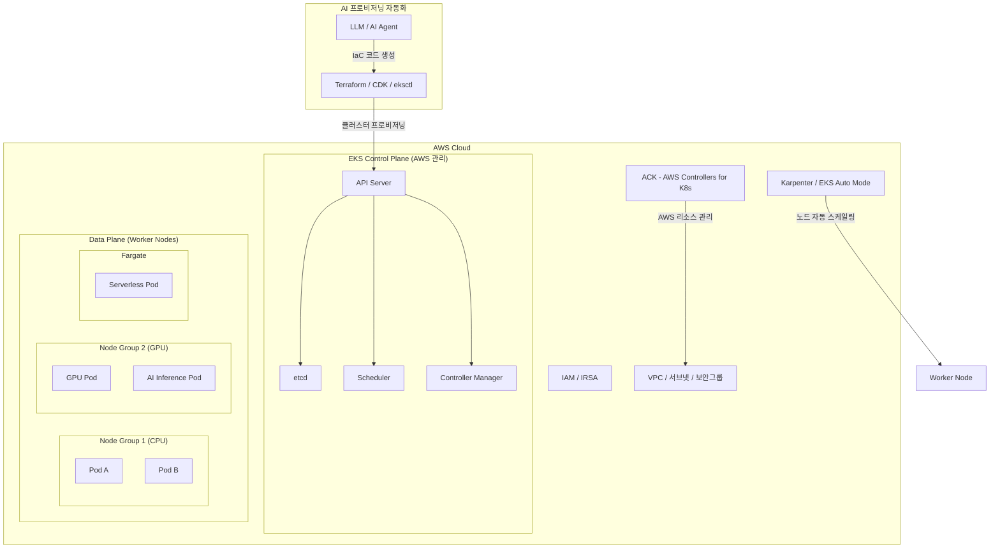

### 2.2 AI를 활용한 워크로드(Pod/Deploy) 배포 가속화

#### Kubernetes 워크로드의 기본 단위

Kubernetes에서 애플리케이션이 실행되는 가장 기본적인 단위는 **Pod**다. Pod는 하나 이상의 컨테이너를 묶은 논리적 단위로, 동일한 Pod 내의 컨테이너들은 네트워크 네임스페이스와 스토리지 볼륨을 공유한다. 실제 운영 환경에서는 Pod를 직접 배포하는 것보다 **Deployment**를 사용하는 것이 일반적이다. Deployment는 Pod의 선언적(Declarative) 상태를 정의하며, 지정된 수의 Pod 복제본(Replica)이 항상 실행되도록 보장하고, 무중단 롤링 업데이트와 롤백 기능을 제공한다.

#### AI가 가속화하는 배포 워크플로

AI는 Kubernetes 배포 프로세스의 여러 단계에서 엔지니어의 생산성을 획기적으로 향상시킨다.

**YAML 매니페스트 자동 생성**은 가장 즉각적인 효과를 낸다. 개발자가 "Python FastAPI 애플리케이션, 컨테이너 이미지 myapp:1.0, 레플리카 3개, CPU 500m, 메모리 512Mi 요청, 헬스체크 포함"이라고 자연어로 설명하면, AI가 완성된 Deployment YAML을 생성한다. 이 과정에서 AI는 readinessProbe, livenessProbe, resource requests/limits, 적절한 label/selector 설계까지 자동으로 포함시킨다.

**배포 전략 추천**도 AI의 주요 역할이다. AI는 서비스 특성(stateless/stateful, 트래픽 패턴, SLA 요구사항)을 분석하여 Rolling Update, Blue-Green, Canary 배포 전략 중 가장 적합한 것을 추천하고, 해당 전략의 구성 파라미터(maxSurge, maxUnavailable 등)를 자동 설정한다.

**배포 후 건강 상태 검증**에서도 AI가 활용된다. 배포 직후 AI는 Pod 상태, 이벤트 로그, 리소스 사용량을 실시간으로 분석하여 이상 징후를 감지하고, 필요시 자동 롤백 여부를 판단하는 데 도움을 준다.

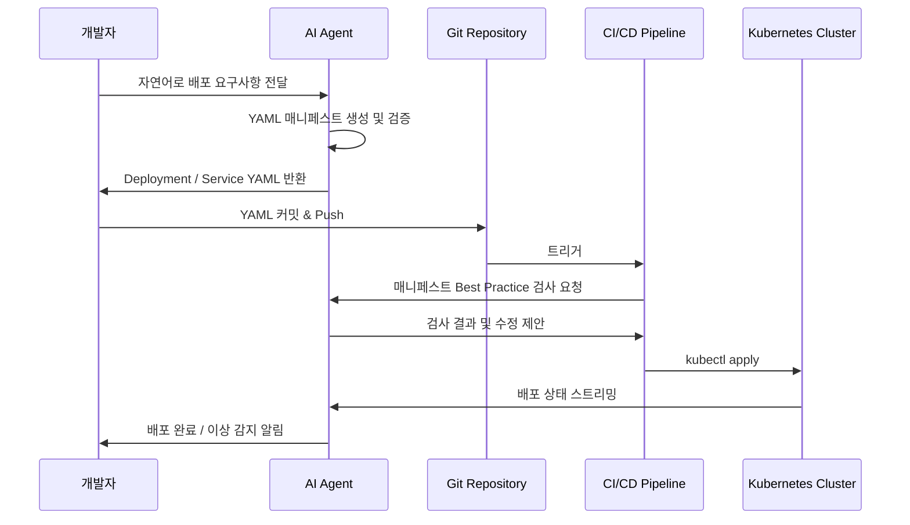

### 2.3 지능형 네트워크(Ingress/Service) 라우팅 설계

#### Kubernetes 네트워킹 기초

Kubernetes 클러스터 내부 네트워킹은 크게 세 계층으로 구성된다. **Pod 간 통신**은 CNI(Container Network Interface) 플러그인이 할당한 Pod IP를 통해 이루어지며, 클러스터 전체에서 모든 Pod가 서로 직접 통신할 수 있다. **Service**는 Pod의 IP가 자주 변경되는 특성을 극복하기 위해 고정된 가상 IP(ClusterIP)와 DNS 이름을 제공하는 추상화 계층이다. **Ingress**는 클러스터 외부에서 내부 서비스로 HTTP/HTTPS 트래픽을 라우팅하는 규칙을 정의한다.

#### Service 유형과 특성

Kubernetes Service는 목적에 따라 네 가지 유형으로 구분된다.

**ClusterIP**는 클러스터 내부에서만 접근 가능한 가상 IP를 생성한다. 마이크로서비스 간 내부 통신에 사용되며, 외부에서는 접근할 수 없다.

**NodePort**는 각 노드의 특정 포트(30000-32767 범위)를 통해 외부에서 서비스에 접근할 수 있게 한다. 개발/테스트 환경에서 주로 사용하지만, 프로덕션에서는 보안 및 관리 이유로 권장되지 않는다.

**LoadBalancer**는 클라우드 제공자의 로드밸런서(AWS ALB/NLB 등)를 자동으로 프로비저닝하여 외부 트래픽을 처리한다.

**ExternalName**은 클러스터 내부 서비스를 외부 DNS 이름으로 매핑한다.

#### AI 기반 Ingress 라우팅 설계

Ingress는 단순한 L7 라우팅 규칙을 넘어 SSL 종료, 경로 기반 라우팅, 호스트 기반 라우팅, 속도 제한(Rate Limiting), 인증 등 다양한 기능을 수행한다. AI는 서비스 아키텍처 요구사항을 분석하여 Ingress 규칙을 자동 생성하고, 상충되는 라우팅 규칙을 감지하며, 트래픽 패턴에 따른 최적의 Ingress Controller(NGINX, ALB Ingress Controller, Traefik 등) 선택을 추천한다.

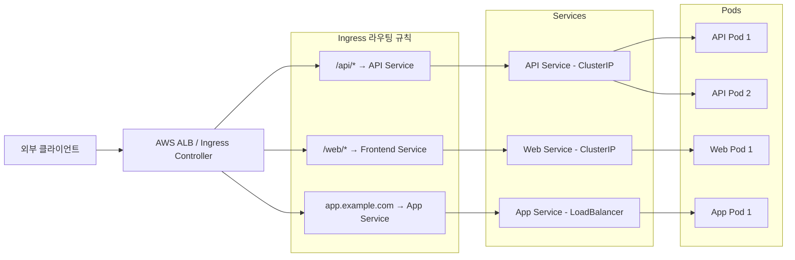

### 2.4 Volume & StorageClass (스토리지 관리)

#### Kubernetes 스토리지 개념

Kubernetes의 스토리지는 Pod의 생명주기와 독립적으로 데이터를 유지하는 것을 목표로 한다. **Volume**은 Pod에 마운트되어 컨테이너가 파일을 읽고 쓸 수 있게 하는 스토리지 추상화다. Pod가 삭제되면 emptyDir 볼륨의 데이터는 사라지지만, PersistentVolume은 Pod와 독립적으로 존재한다.

**PersistentVolume(PV)** 은 클러스터 관리자가 프로비저닝한 스토리지 리소스다. AWS EBS(Elastic Block Store), NFS, Azure Disk, Google Persistent Disk 등의 실제 스토리지를 Kubernetes 오브젝트로 추상화한다.

**PersistentVolumeClaim(PVC)** 은 사용자(개발자)가 원하는 스토리지 크기, 접근 모드 등을 선언하는 요청이다. Kubernetes는 PVC와 적합한 PV를 자동으로 바인딩한다.

**StorageClass**는 스토리지 프로비저너와 파라미터를 정의하는 템플릿이다. 동적 프로비저닝(Dynamic Provisioning)을 통해 PVC가 생성될 때 StorageClass에 정의된 스토리지를 자동으로 생성한다. AWS에서는 gp2, gp3, io1 등의 EBS 유형을 StorageClass로 정의할 수 있다.

#### AI를 활용한 스토리지 설계

AI는 워크로드 특성을 분석하여 최적의 StorageClass를 추천하는 데 활용된다. 예를 들어 데이터베이스 워크로드에는 높은 IOPS를 제공하는 io1/gp3 StorageClass를, 로그 수집에는 비용 효율적인 gp2나 EFS를, AI 학습 워크로드에는 고성능 NVMe SSD 기반 스토리지를 추천한다. 또한 AI는 스토리지 사용 패턴을 분석하여 용량 증설 시점을 예측하고, 고아(Orphan) PV를 감지하여 비용 낭비를 방지한다.

---

## 3. 파트 2 — AI 기반 Kubernetes 운영 심화

### 3.1 AI 기반 복합 워크로드(DaemonSet/CronJob) 패턴 생성

#### DaemonSet이란

**DaemonSet**은 클러스터의 모든 노드(또는 특정 노드 셀렉터에 해당하는 노드)에 Pod의 복사본을 하나씩 실행하는 워크로드 오브젝트다. 새 노드가 클러스터에 추가되면 DaemonSet은 자동으로 해당 노드에 Pod를 배포하고, 노드가 제거되면 해당 Pod도 함께 정리한다.

DaemonSet은 로그 수집 에이전트(Fluentd, Fluent Bit), 노드 모니터링 에이전트(Node Exporter, Datadog Agent), 네트워크 플러그인(Calico, Cilium), 스토리지 데몬 등 인프라 레벨의 기능을 모든 노드에 균일하게 배포할 때 사용한다.

AI는 DaemonSet 설계 시 여러 고려사항을 자동으로 처리한다. toleration 설정(Control Plane 노드 제외/포함 여부), updateStrategy(RollingUpdate vs OnDelete), 리소스 제한(너무 많은 리소스를 점유하면 다른 워크로드에 영향), hostPath 볼륨 접근 권한 등을 요구사항에 맞게 자동 구성한다.

#### CronJob이란

**CronJob**은 Unix/Linux의 cron과 유사하게, 지정된 일정에 따라 Job을 실행하는 Kubernetes 오브젝트다. Job은 한 번 실행하고 완료되는 배치 작업을 수행하며, CronJob은 이 Job을 반복 스케줄에 따라 생성한다.

실제 사용 사례로는 데이터베이스 백업(매일 새벽 2시), 보고서 생성(매주 월요일 오전 9시), 캐시 워밍(매시간), 로그 정리(매일 자정) 등이 있다. CronJob 설계에서 중요한 파라미터는 `concurrencyPolicy`(이전 Job이 완료되지 않았을 때 새 Job 생성 여부), `successfulJobsHistoryLimit`, `failedJobsHistoryLimit`(이력 보관 수), `startingDeadlineSeconds`(실행 지연 허용 시간) 등이다.

AI는 CronJob 실행 이력을 분석하여 실패 패턴을 감지하고 재시도 로직을 최적화하며, 여러 CronJob이 동시에 실행되어 리소스 경합이 발생하는 상황을 예측하여 스케줄을 분산시키는 권고안을 제시한다.

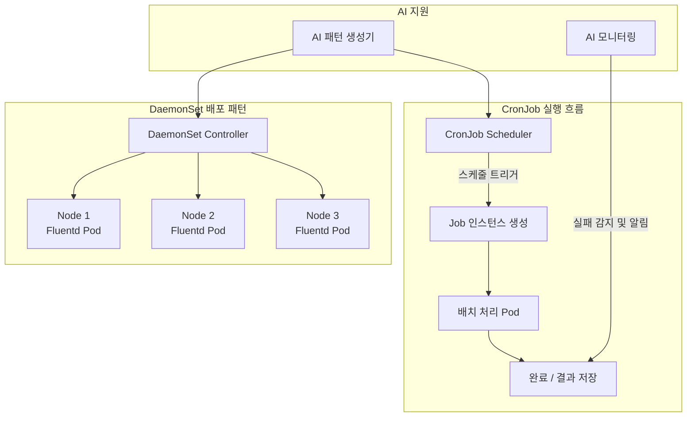

### 3.2 AI 기반 StatefulSet 구축 및 보안 정책(NetworkPolicy) 자동화

#### StatefulSet의 필요성

**StatefulSet**은 상태를 가진 애플리케이션(Stateful Application)을 배포하기 위한 워크로드 오브젝트다. Deployment와 달리 StatefulSet은 각 Pod에 고정된 ID(예: mysql-0, mysql-1, mysql-2)와 안정적인 네트워크 ID, 그리고 순서가 보장된 배포 및 삭제를 제공한다.

MySQL 클러스터, PostgreSQL, MongoDB ReplicaSet, Redis 클러스터, Apache Kafka, Apache ZooKeeper, Elasticsearch와 같이 노드 간 역할이 구분되고(Primary/Replica, Leader/Follower) 안정적인 네트워크 ID가 필요한 모든 데이터베이스 및 메시지 큐 시스템은 StatefulSet으로 배포된다.

StatefulSet의 각 Pod는 **Headless Service**를 통해 안정적인 DNS 이름을 부여받는다. 예를 들어 mysql StatefulSet의 0번 Pod는 `mysql-0.mysql.default.svc.cluster.local`이라는 DNS 이름으로 항상 접근할 수 있다. 각 Pod는 자신만의 **PersistentVolumeClaim**을 가지며, Pod가 재스케줄링되어 다른 노드로 이동하더라도 동일한 스토리지에 연결된다.

AI는 StatefulSet 구성에서 특히 복잡한 부분인 초기화 순서(Init Container를 통한 Primary 선출), 복제 설정(예: MySQL의 경우 0번 Pod가 Primary이고 나머지가 Replica), 백업 및 복구 전략 설계를 자동화하는 데 활용된다.

#### NetworkPolicy를 통한 보안 정책 자동화

**NetworkPolicy**는 Kubernetes 클러스터 내에서 Pod 간, 그리고 외부와의 네트워크 트래픽을 제어하는 방화벽 규칙이다. 기본적으로 Kubernetes는 모든 Pod 간 통신을 허용(Allow All)하는데, 이는 보안 측면에서 위험하다. NetworkPolicy를 통해 최소 권한 원칙(Principle of Least Privilege)을 네트워크 레벨에서 구현할 수 있다.

NetworkPolicy의 핵심 개념은 **Ingress(수신) 규칙**과 **Egress(발신) 규칙**으로, podSelector, namespaceSelector, ipBlock을 조합하여 세밀한 트래픽 제어가 가능하다.

AI 기반 NetworkPolicy 자동화는 세 단계로 이루어진다. 첫째, AI가 실제 클러스터의 네트워크 트래픽 플로우를 분석하여 실제로 발생하는 서비스 간 통신 패턴을 파악한다. 둘째, 이 패턴을 기반으로 "실제로 필요한 통신만 허용"하는 NetworkPolicy 초안을 자동 생성한다. 셋째, 생성된 정책을 시뮬레이션하여 기존 서비스 통신이 차단되지 않는지 검증한다.

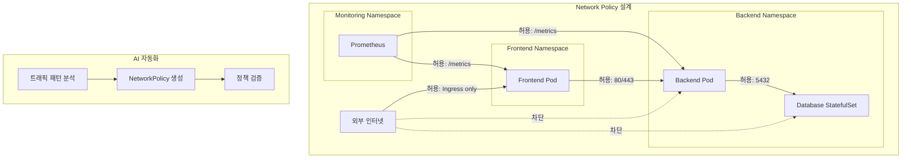

### 3.3 스케줄링(Affinity/Taint) 전략 및 노드 배치 최적화

#### Kubernetes 스케줄러의 동작 원리

Kubernetes 스케줄러는 새로운 Pod가 생성될 때 해당 Pod를 어느 노드에 배치할지 결정하는 핵심 컴포넌트다. 스케줄러는 두 단계로 동작한다. **Filtering(필터링)** 단계에서는 Pod의 요구사항을 충족하지 못하는 노드를 제외한다(예: 충분한 CPU/메모리가 없는 노드, 필수 레이블이 없는 노드). **Scoring(점수화)** 단계에서는 필터를 통과한 노드들에 점수를 부여하여 최적의 노드를 선택한다.

#### Node Affinity와 Pod Affinity

**Node Affinity**는 특정 조건을 가진 노드에 Pod를 배치하도록 지정하는 규칙이다. 예를 들어 GPU가 탑재된 노드에만 AI 추론 Pod를 배치하거나, 특정 AWS 리전의 가용 영역(AZ)에만 Pod를 배치하는 경우다. Node Affinity는 두 가지 유형이 있다. `requiredDuringSchedulingIgnoredDuringExecution`은 반드시 충족해야 하는 하드(Hard) 규칙이고, `preferredDuringSchedulingIgnoredDuringExecution`은 가능하면 충족하도록 하는 소프트(Soft) 규칙이다.

**Pod Affinity**는 특정 Pod와 같은 노드 혹은 같은 토폴로지 도메인(예: 같은 AZ)에 배치되도록 설정한다. 반대로 **Pod Anti-Affinity**는 특정 Pod와 동일한 노드에 배치되지 않도록 한다. 예를 들어 고가용성을 위해 동일 Deployment의 레플리카들이 서로 다른 노드에 분산 배치되도록 Anti-Affinity를 설정하는 것이 대표적인 패턴이다.

#### Taint와 Toleration

**Taint**는 노드에 설정하는 "오염" 표시로, 해당 Taint를 허용(Tolerate)하지 않는 Pod는 그 노드에 배치되지 않는다. 세 가지 효과(Effect)가 있다. `NoSchedule`은 새 Pod를 배치하지 않지만 기존 Pod는 유지한다. `PreferNoSchedule`은 가능하면 배치하지 않도록 한다. `NoExecute`는 새 Pod 배치를 막고 기존 Pod도 퇴거(Evict)시킨다.

**Toleration**은 Pod에 설정하여 특정 Taint가 있는 노드에도 배치될 수 있음을 선언한다. 예를 들어 GPU 노드에 `gpu=true:NoSchedule` Taint를 설정하고, GPU가 필요한 AI 워크로드 Pod에만 이 Taint를 허용하는 Toleration을 설정함으로써 GPU 리소스를 특정 워크로드에만 예약할 수 있다.

#### AI를 통한 스케줄링 최적화

AI는 클러스터의 노드별 리소스 사용률 이력, 워크로드 특성, 비용 데이터를 종합 분석하여 최적의 Affinity/Taint 전략을 추천한다. CAST AI와 같은 솔루션은 ML 기반 최적화 엔진이 실시간으로 워크로드를 분석하고 CPU/메모리 요청을 자동으로 rightsizing하며, 비용 효율적인 Spot 인스턴스를 자동으로 활용하고 인터럽트 발생 시 자동 대체 노드를 확보한다.

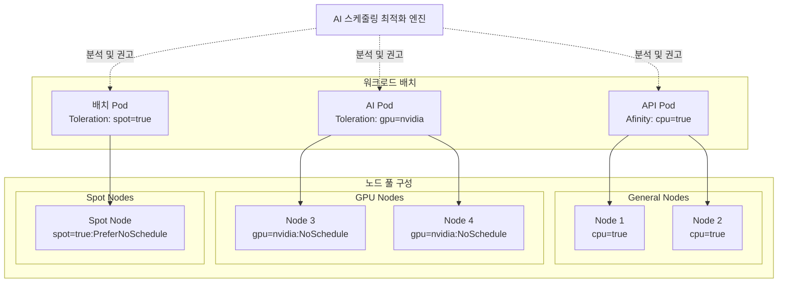

### 3.4 리소스 할당(Quota) 추론 및 용량 계획

#### ResourceQuota와 LimitRange

**ResourceQuota**는 네임스페이스(Namespace) 단위로 클러스터 리소스의 총 사용량을 제한하는 오브젝트다. 예를 들어 `development` 네임스페이스에서 사용할 수 있는 총 CPU는 10코어, 총 메모리는 20Gi, 최대 Pod 수는 50개로 제한할 수 있다. 이를 통해 하나의 팀이나 애플리케이션이 클러스터 전체 리소스를 독점하는 것을 방지한다.

**LimitRange**는 네임스페이스 내 개별 Pod나 컨테이너의 리소스 요청/제한 범위를 설정한다. 리소스 요청(Request)이나 제한(Limit)을 명시하지 않은 Pod에 기본값을 자동으로 적용하고, 최소/최대 허용 범위를 벗어나는 요청을 거부한다.

#### AI 기반 Quota 추론과 용량 계획

AI 기반 리소스 할당 최적화는 단순한 정적 제한 설정을 넘어 동적이고 지능적인 용량 관리를 가능하게 한다. 구체적으로는 다음과 같은 방식으로 동작한다.

**Vertical Pod Autoscaler(VPA)의 AI 강화**는 기존 VPA가 히스토리컬 리소스 사용 패턴을 분석하여 CPU/메모리 요청을 자동으로 조정하는 것에서 나아가, AI가 애플리케이션 코드 변경, 배포 일정, 비즈니스 이벤트(예: 쇼핑 시즌)를 고려한 선제적 리소스 조정을 가능하게 한다.

**Quota 위반 예측**은 현재 리소스 사용 추세를 분석하여 특정 네임스페이스의 Quota가 언제 소진될지를 미리 예측하고, 운영팀에 사전 경고를 제공한다.

**멀티 테넌트 비용 배분**에서는 AI가 네임스페이스별 실제 리소스 소비량을 정밀하게 측정하여 팀별 비용을 정확히 산출하고, 비용 이상(Anomaly)을 감지한다.

---

## 4. 파트 3 — K8s 전용 AI 도구 및 Observability 구축

### 4.1 K8sGPT & kubectl-ai를 활용한 운영

#### K8sGPT: AI 기반 클러스터 진단 도구

**K8sGPT**는 CNCF(Cloud Native Computing Foundation) 산하 오픈소스 프로젝트로, Kubernetes 클러스터에서 발생하는 오류, 오설정(Misconfiguration), 실패한 프로브(Failed Probe)를 지속적으로 스캔하고 분석하는 CLI 도구다. K8sGPT의 가장 큰 특징은 복잡한 Kubernetes 에러 메시지를 인간이 읽을 수 있는 자연어 설명과 실행 가능한 해결 방법으로 변환한다는 점이다.

K8sGPT는 플러그인 아키텍처를 채택하여 OpenAI GPT, Anthropic Claude, Google Gemini, AWS Bedrock, 로컬 LLM(Ollama) 등 다양한 AI 백엔드를 지원한다. 특히 로컬 AI 모델을 지원함으로써 API 키 없이도 기본 진단 기능을 활용할 수 있으며, 민감한 클러스터 정보가 외부로 유출되지 않는다.

**분석 대상**은 20가지 이상의 타입을 커버한다. Pod의 OOMKilled, CrashLoopBackOff, ImagePullBackOff, Pending 상태, Service의 Endpoint 미연결, PersistentVolumeClaim의 Unbound 상태, Ingress의 Backend 연결 실패, RBAC 권한 부족, Network Policy 설정 오류 등 실제 운영에서 빈번하게 발생하는 문제들을 감지한다.

K8sGPT는 2026년 현재 **MCP(Model Context Protocol) 서버 통합**을 통해 Claude나 ChatGPT 같은 AI 어시스턴트에서 직접 Kubernetes 클러스터 분석을 요청할 수 있는 기능을 지원한다. 이는 K8sGPT가 단순한 CLI 도구를 넘어 AI 에이전트 생태계의 핵심 도구로 진화했음을 의미한다.

K8sGPT 기본 사용 흐름:

```
# AI 백엔드 설정 (Claude 예시)
k8sgpt auth add --backend anthropic --model claude-opus-4-6

# 클러스터 분석 실행 (AI 설명 포함)
k8sgpt analyze --explain

# 특정 Analyzer만 실행
k8sgpt analyze --explain --filter=Pod,Service,PVC

# 익명화 처리 (민감 정보 보호)
k8sgpt analyze --explain --anonymize
```

출력 예시:

```
0 default/payment-service-5d8f9b (Pod)
Error: Back-off restarting failed container
AI Analysis:
  컨테이너가 반복적으로 재시작되는 CrashLoopBackOff 상태입니다.
  로그를 확인한 결과 환경변수 'DATABASE_URL'이 설정되지 않아
  데이터베이스 연결에 실패하고 있습니다.

  해결 방법:
  1. Secret 또는 ConfigMap에 DATABASE_URL을 정의하세요
  2. Deployment의 env 섹션에 해당 값을 참조하도록 설정하세요
  3. kubectl rollout restart deployment/payment-service 를 실행하세요
```

#### kubectl-ai: 자연어 기반 Kubernetes 운영 에이전트

**kubectl-ai**는 자연어 쿼리를 받아 AI가 이를 Kubernetes 운영 명령으로 변환하고 실행하는 CLI 도구다. 흥미롭게도 2025-2026년 기준으로 두 개의 서로 다른 kubectl-ai 프로젝트가 존재한다.

첫 번째는 **sozercan/kubectl-ai**(오리지널)로, 자연어 입력을 받아 Kubernetes YAML 매니페스트를 빠르게 생성하는 데 특화되어 있다. 리소스 스캐폴딩(Scaffolding)에 유용하다.

두 번째는 **GoogleCloudPlatform/kubectl-ai**(2024-2025년 출시, 에이전틱 버전)로, 단순한 YAML 생성을 넘어 라이브 클러스터를 대상으로 진단 명령을 실행하고, 멀티 턴 대화를 통해 문제를 추론하며, 수정 사항을 제안하고 적용하는 완전한 Kubernetes 운영 에이전트 기능을 제공한다. 이 버전은 인터랙티브 셸에서 실행되며, Kubernetes 전문가와 터미널을 공유하며 대화하는 것과 같은 경험을 제공한다.

중요한 안전 특성으로, kubectl-ai는 AI가 제안한 명령을 실행하기 전에 반드시 사용자의 확인을 요청한다. 이는 AI가 의도치 않은 변경을 자동으로 적용하는 것을 방지하는 설계적 결정이다.

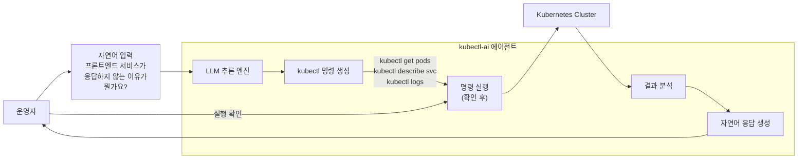

#### kagent: 차세대 Kubernetes AI 에이전트

2026년에 주목받고 있는 **kagent**는 K8sGPT와 kubectl-ai의 기능을 통합하고 더 나아가 멀티 에이전트 오케스트레이션을 지원하는 Kubernetes 네이티브 AI 에이전트 플랫폼이다. kagent는 Kubernetes 오퍼레이터 패턴으로 동작하며, 에이전트 설정을 Kubernetes CRD(Custom Resource Definition)로 선언적으로 관리한다.

### 4.2 AI 기반 Helm 차트 리팩토링 및 Istio 트래픽 제어

#### Helm: Kubernetes 패키지 매니저

**Helm**은 Kubernetes 애플리케이션의 패키지 매니저로, 복잡한 Kubernetes 리소스들(Deployment, Service, ConfigMap, RBAC 등)을 하나의 **Chart**로 묶어 재사용 가능하고 버전 관리가 가능한 패키지로 관리한다. Helm Chart는 템플릿 엔진을 사용하여 환경별로 다른 설정값(Values)을 주입할 수 있어, 동일한 Chart를 개발/스테이징/프로덕션 환경에 다르게 배포할 수 있다.

실제 엔터프라이즈 환경에서 Helm Chart는 시간이 지남에 따라 여러 사람이 수정하고 기능이 추가되면서 복잡도가 급격히 증가한다. 이때 **AI 기반 Helm 차트 리팩토링**이 필요해진다.

AI는 기존 Helm Chart를 분석하여 다음과 같은 리팩토링 작업을 수행한다. 중복된 템플릿 블록을 재사용 가능한 Named Template(`_helpers.tpl`)으로 추출하고, 하드코딩된 값을 Values.yaml으로 파라미터화하며, 레거시 API 버전(예: `extensions/v1beta1` → `networking.k8s.io/v1`)을 최신 버전으로 마이그레이션하고, 보안 취약점(예: 루트로 실행되는 컨테이너, 필요 이상의 권한)을 감지하여 수정한다.

AI 도구를 활용한 Helm 작업 경험에 따르면, Helm Chart 생성 시간이 기존 4시간에서 45분으로 단축되고 YAML 문법 오류가 제로(0)에 수렴하는 성과를 보고한 사례도 있다.

#### Istio: AI 시대의 서비스 메쉬

**Istio**는 Kubernetes 클러스터 내 마이크로서비스 간의 통신을 관리하는 서비스 메쉬(Service Mesh)다. 애플리케이션 코드를 변경하지 않고도 서비스 간 트래픽 관리, 보안, 관찰 가능성(Observability)을 중앙에서 제어할 수 있다.

Istio의 전통적인 아키텍처는 각 Pod에 **사이드카 프록시(Envoy)** 를 주입하는 방식이었다. 그러나 사이드카는 Pod마다 추가 CPU와 메모리를 소비하는 "사이드카 세금(Sidecar Tax)" 문제가 있었다.

2025-2026년 Istio의 가장 중요한 혁신은 **Ambient Mode**다. Ambient Mode는 사이드카 없이 노드 레벨의 `ztunnel`(Zero Trust Tunnel)을 통해 L4(TCP) 보안을 처리하고, 필요한 서비스에만 **Waypoint Proxy**를 선택적으로 배포하여 L7(HTTP) 기능을 제공한다. 이를 통해 사이드카 모드 대비 리소스 오버헤드를 크게 줄이면서 동일한 보안 및 트래픽 제어 기능을 제공한다.

2026년 3월 KubeCon EU(암스테르담)에서 Istio는 세 가지 중요한 신규 기능을 발표했다.

**Ambient Multicluster (Beta)** 는 사이드카 없는 Ambient Mode에서 멀티 클러스터 트래픽 관리를 지원한다. 여러 클러스터에 걸친 통합된 보안 및 트래픽 관리가 가능해졌다.

**Gateway API Inference Extension (Beta)** 는 AI 추론 트래픽을 위한 표준화된 관리 방식을 도입한다. Kubernetes 게이트웨이 API 워크플로우를 사용하여 AI 모델 추론 트래픽의 라우팅을 제어할 수 있어, 플랫폼 팀이 기존에 알고 있는 Kubernetes 방식으로 AI 인프라를 관리할 수 있다.

**agentgateway (실험적)** 는 Solo.io가 개발하고 리눅스 재단에 기증한 AI 네이티브 프록시로, AI 에이전트들 간의 동적 트래픽 패턴(가변적인 추론 지연, CoT(Chain-of-Thought) 패턴의 동적 멀티 서비스 호출, 컨텍스트 윈도우에 따라 크게 달라지는 페이로드 크기)을 효율적으로 처리하도록 설계되었다.

Istio의 핵심 트래픽 제어 기능은 **VirtualService**와 **DestinationRule**을 통해 구현된다.

```yaml
# Canary 배포를 위한 VirtualService 예시
# (트래픽의 90%는 v1, 10%는 v2로 라우팅)
apiVersion: networking.istio.io/v1alpha1
kind: VirtualService
metadata:
  name: payment-service
spec:
  http:
  - route:
    - destination:
        host: payment-service
        subset: v1
      weight: 90
    - destination:
        host: payment-service
        subset: v2
      weight: 10
```

AI는 Istio 설정에서 트래픽 이상을 실시간으로 감지하고 Canary 배포의 성공/실패를 자동으로 판단하여 트래픽 가중치를 조정하는 자동화된 Progressive Delivery를 구현하는 데 활용된다.

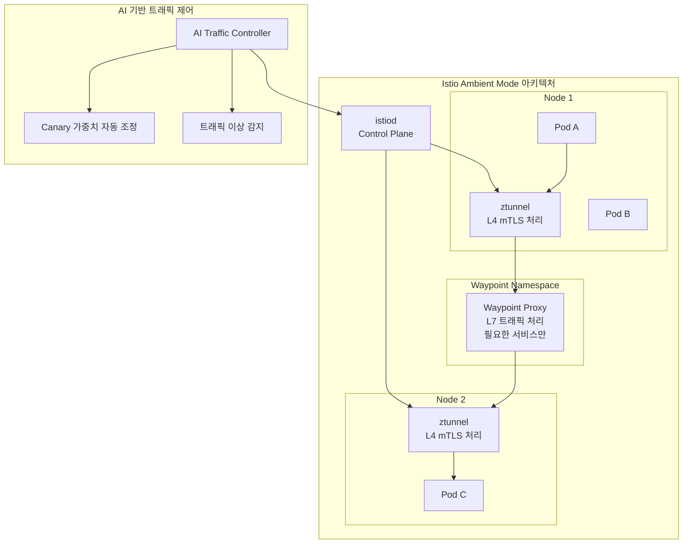

### 4.3 AI 기반 Observability 구축

#### Observability의 세 가지 신호

현대적 Kubernetes 환경에서 **Observability(관찰 가능성)** 는 단순한 모니터링(Monitoring)을 넘어선 개념이다. 모니터링이 "무엇이 잘못되었는가"를 파악하는 것이라면, Observability는 "왜 잘못되었는가"를 설명할 수 있는 능력이다. Kubernetes는 빠르게 변화하고 많은 계층으로 구성된 시스템이기 때문에, 문제의 원인이 애플리케이션 코드, 노드의 CPU 스로틀링, 재스케줄링, 잘못된 네트워크 경로, 클라우드 의존성 등 어디에나 있을 수 있다. Observability는 Pod, 노드, 컨트롤 플레인 컴포넌트, 클라우드 계층에 걸친 신호를 연관지어 근본 원인을 추론할 수 있게 한다.

Observability의 세 가지 핵심 신호는 다음과 같다.

**Metrics(메트릭)** 는 숫자로 표현되는 시계열 데이터다. CPU 사용률, 메모리 사용량, 요청 처리량(RPS), 에러율, 응답 시간(Latency) 등이 포함된다. Prometheus가 메트릭 수집의 표준 도구로 사용되며, Grafana로 시각화한다.

**Logs(로그)** 는 시스템과 애플리케이션이 생성하는 텍스트 형태의 이벤트 기록이다. 구조화된 로그(JSON 포맷)는 검색과 분석이 용이하다.

**Traces(트레이스)** 는 분산 시스템에서 하나의 요청이 여러 서비스를 거치며 처리되는 전체 경로를 추적하는 데이터다. 마이크로서비스 아키텍처에서 특정 API 호출이 어느 서비스에서 얼마나 시간이 걸렸는지 파악하는 데 필수적이다.

#### OpenTelemetry: 관찰 가능성의 표준

**OpenTelemetry(OTel)** 는 CNCF가 지원하는 오픈소스 표준으로, 메트릭, 로그, 트레이스를 수집하고 전송하기 위한 통일된 API와 SDK, 그리고 Collector를 제공한다. 2026년 현재 OpenTelemetry는 Kubernetes 관찰 가능성의 사실상 표준이 되었으며, 2025년 서베이에 따르면 Kubernetes 사용자의 81%가 OTel Collector를 K8s에서 실행한다.

OpenTelemetry의 핵심 장점은 **벤더 중립성**이다. OTel로 수집된 텔레메트리 데이터는 Prometheus, Jaeger, Datadog, Grafana Cloud, Splunk 등 어떤 백엔드로도 전송할 수 있어, 특정 솔루션에 종속되지 않는다.

OTel Collector는 Kubernetes 환경에서 보통 두 계층으로 배포된다. **에이전트 계층(DaemonSet 형태)** 은 각 노드에서 컨테이너 로그를 수집하고, Prometheus 엔드포인트를 스크래핑하며, 앱에서 전송된 트레이스를 수신한다. **게이트웨이 계층(Deployment 형태)** 은 모든 에이전트에서 수집된 텔레메트리를 집계하고 백엔드 시스템으로 라우팅한다.

#### eBPF: 커널 레벨 관찰 가능성

**eBPF(Extended Berkeley Packet Filter)** 는 Linux 커널에 안전하게 프로그램을 주입하여 시스템 콜, 네트워크 패킷, 컨테이너 동작을 커널 레벨에서 분석하는 기술이다. Kubernetes 환경에서 eBPF 기반 도구(Cilium, Tetragon, Pixie 등)는 애플리케이션 코드를 전혀 수정하지 않고도 서비스 간 모든 통신을 추적하고, 보안 위협을 실시간으로 감지하며, 네트워크 레이턴시를 세밀하게 측정할 수 있다.

#### AI 기반 Observability의 핵심 기능

AI는 방대한 Observability 데이터에서 의미 있는 인사이트를 추출하는 데 핵심 역할을 한다.

**이상 감지(Anomaly Detection)** 는 메트릭의 정상 패턴을 학습하고 이상값을 자동으로 감지한다. 단순한 임계값 기반 알람을 넘어, 시간대별 패턴(피크 시간대의 높은 트래픽은 정상), 주간 주기(월요일 오전 트래픽 급증은 정상) 등을 고려한 지능적인 알람을 제공한다.

**AI 기반 근본 원인 분석(Root Cause Analysis)** 은 수십 개의 연관된 알람 중에서 실제 근본 원인을 자동으로 파악한다. 예를 들어 여러 서비스에서 동시에 타임아웃이 발생했을 때, AI가 공통 의존성(예: 데이터베이스 연결 풀 고갈)을 자동으로 식별한다.

**예측적 스케일링**은 과거 트래픽 패턴과 비즈니스 이벤트 데이터를 분석하여 HPA(Horizontal Pod Autoscaler)의 스케일링이 발생하기 전에 미리 Pod를 확장하는 예측적 자동 스케일링을 구현한다.

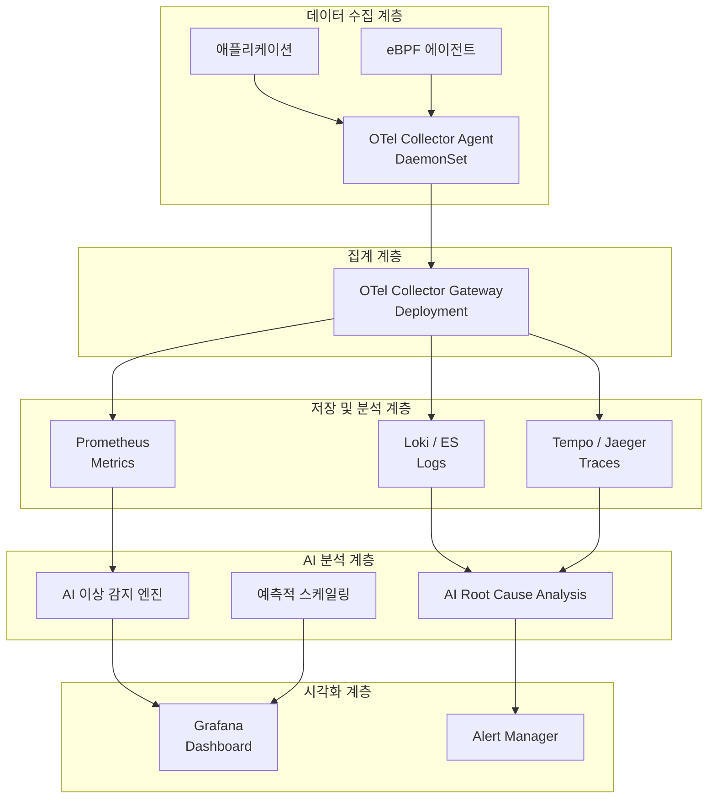

### 4.4 AI 기반 로그 파이프라인 (EFK)

#### EFK 스택이란

**EFK 스택**은 Kubernetes 환경에서 로그를 수집, 집계, 저장, 검색, 시각화하기 위한 오픈소스 솔루션 조합이다. 세 가지 컴포넌트의 첫 글자를 딴 이름이다.

**E - Elasticsearch**는 분산 검색 및 분석 엔진이다. 대용량 로그 데이터를 저장하고, 역색인(Inverted Index) 기반의 빠른 전문 검색(Full-Text Search)을 제공한다. Kubernetes에서는 보통 StatefulSet으로 배포되며, 마스터 노드와 데이터 노드를 분리하여 고가용성을 구성한다.

**F - Fluentd 또는 Fluent Bit**는 로그 수집 및 변환 에이전트다. DaemonSet으로 모든 노드에 배포되어 컨테이너 로그(`/var/log/containers/*.log`)를 자동으로 수집한다. 수집된 로그에 Kubernetes 메타데이터(Pod 이름, 네임스페이스, 레이블 등)를 자동으로 태깅하고, 필터링과 변환을 거쳐 Elasticsearch로 전송한다. **Fluent Bit**는 Fluentd의 경량 버전으로, 리소스 소비가 적어 Kubernetes 환경에서 점점 더 선호되고 있다.

**K - Kibana**는 Elasticsearch에 저장된 로그를 시각화하는 웹 대시보드다. 로그 검색, 필터링, 시계열 차트, 지도 시각화 등 다양한 분석 기능을 제공한다.

#### EFK에서 ELK로, 그리고 OpenTelemetry로의 진화

전통적으로 EFK/ELK(E-L-K, Logstash 사용)는 Kubernetes 로그 관리의 표준이었지만, 2025-2026년에는 OpenTelemetry 기반의 현대적 로그 파이프라인으로 진화가 이루어지고 있다. OpenTelemetry Collector가 Fluentd/Fluent Bit의 역할을 대체하거나 보완하며, Loki(Grafana Labs의 오픈소스 로그 집계 시스템)가 Elasticsearch 대비 훨씬 낮은 비용으로 로그를 저장하는 대안으로 각광받고 있다.

그러나 **로그 검색이 워크플로우의 중심인 팀**, 특히 대규모 비정형 로그 분석이 필요하거나 Elastic 생태계(Kibana, APM, SIEM)에 이미 투자한 팀에게는 EFK/Elasticsearch가 여전히 강력한 선택지다.

#### AI 기반 로그 파이프라인의 고도화

AI는 EFK 파이프라인의 여러 지점에서 가치를 더한다.

**지능형 로그 파싱**은 비정형 로그를 AI가 자동으로 분석하여 구조화된 필드로 추출한다. 예를 들어 커스텀 애플리케이션의 독특한 로그 포맷을 AI가 패턴을 학습하여 자동으로 파싱 규칙을 생성한다.

**이상 로그 감지**는 정상적인 로그 패턴에서 벗어나는 이상 메시지를 AI가 자동으로 감지하고 우선순위화한다. 수천 개의 에러 로그 중에서 실제로 조치가 필요한 것을 자동으로 선별한다.

**자연어 로그 검색**은 "지난 1시간 동안 payment 서비스에서 발생한 데이터베이스 연결 오류를 보여줘"와 같은 자연어 쿼리를 Elasticsearch의 DSL 쿼리로 자동 변환하여 비전문가도 손쉽게 로그를 분석할 수 있게 한다.

**로그 볼륨 최적화**는 AI가 로그의 중요도와 빈도를 분석하여 중복되거나 가치 없는 로그를 자동으로 필터링하고, 스토리지 비용을 최적화한다.

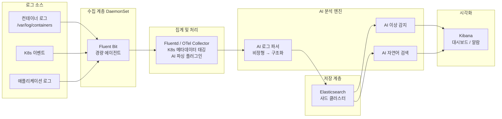

---

## 5. 전체 아키텍처 조망

세 파트의 학습 내용을 하나의 통합 아키텍처로 조망하면 다음과 같다. AI는 클러스터 설계 단계부터 운영, 관찰 가능성, 장애 대응까지 Kubernetes 라이프사이클 전반에 깊숙이 통합되어 있다.

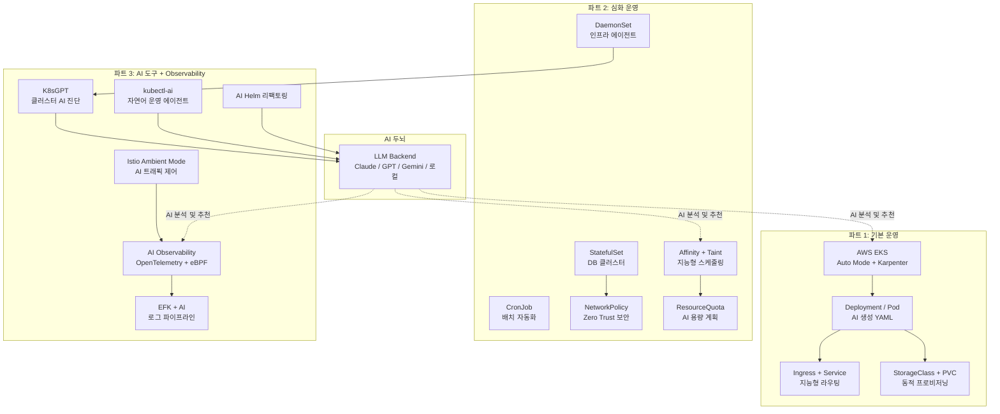

---

## 6. 학습 로드맵 및 참고 자료

### 권장 학습 순서

이 커리큘럼을 효과적으로 학습하기 위한 권장 순서는 다음과 같다.

파트 1의 기초를 충분히 다진 후 파트 2로 진행하는 것이 중요하다. 특히 EKS 클러스터를 직접 생성하고 기본 Deployment/Service를 배포하는 실습 없이 심화 내용으로 넘어가면 개념이 추상적으로 남을 수 있다. AWS Free Tier와 EKS의 경우 비용이 발생하므로, 학습 환경에서는 로컬 kind(Kubernetes in Docker)나 minikube 클러스터를 활용하는 것도 좋은 방법이다.

파트 3의 K8sGPT와 kubectl-ai는 파트 1, 2에서 학습한 Kubernetes 기초 지식이 있어야 AI의 출력을 제대로 검증하고 활용할 수 있다. AI 도구는 Kubernetes 전문가를 대체하는 것이 아니라, 전문가의 생산성을 극대화하는 도구임을 명심해야 한다.

### 핵심 원칙 요약

이 커리큘럼 전체를 관통하는 핵심 원칙은 다음과 같이 정리할 수 있다.

**AI는 어시스턴트이지 자율 시스템이 아니다.** K8sGPT든 kubectl-ai든 AI 기반 Helm 리팩토링이든, AI가 생성한 모든 결과물은 반드시 엔지니어가 검토하고 검증해야 한다. 특히 프로덕션 클러스터에 변경을 적용하기 전에는 항상 스테이징 환경에서 먼저 테스트해야 한다.

**선언적 GitOps 원칙을 유지하라.** AI가 생성한 YAML이라도 Git에 저장하고, CI/CD 파이프라인을 통해 배포하는 GitOps 원칙을 준수해야 한다. 이를 통해 변경 이력이 관리되고 롤백이 용이해진다.

**Observability 없이는 AI도 없다.** AI 기반 운영의 효과를 극대화하려면 메트릭, 로그, 트레이스 세 가지 신호가 모두 잘 갖춰진 Observability 인프라가 필수다. AI는 데이터가 있을 때만 의미 있는 분석을 수행할 수 있다.

### 주요 도구 및 기술 레퍼런스

| 영역 | 도구 / 기술 | 역할 |
|------|-----------|------|
| 클러스터 관리 | Amazon EKS, EKS Auto Mode, Karpenter | 클러스터 프로비저닝 및 노드 자동 관리 |
| AI 진단 | K8sGPT | 클러스터 오류 감지 및 자연어 설명 |
| AI 운영 에이전트 | kubectl-ai, kagent | 자연어 기반 Kubernetes 운영 |
| 패키지 관리 | Helm | Kubernetes 애플리케이션 패키징 |
| 서비스 메쉬 | Istio (Ambient Mode) | 트래픽 제어, mTLS, Observability |
| 텔레메트리 표준 | OpenTelemetry | 메트릭/로그/트레이스 수집 표준 |
| 로그 파이프라인 | EFK (Elasticsearch + Fluent Bit + Kibana) | 로그 수집/저장/분석 |
| 스케줄링 최적화 | CAST AI, VPA | AI 기반 리소스 rightsizing |
| 보안 | NetworkPolicy, mTLS (Istio), RBAC | 클러스터 내 Zero Trust 보안 |

---

> **작성일:** 2026-06-04  
> **기준 정보:** 2026년 6월 현재 공개된 기술 문서, CNCF 공식 발표, AWS 공식 블로그, KubeCon EU 2026 발표 내용을 기반으로 작성되었습니다.  
> **주의:** AI 기반 Kubernetes 도구는 빠르게 발전하는 분야이므로, 각 도구의 최신 버전 릴리즈 노트를 반드시 확인하시기 바랍니다.
