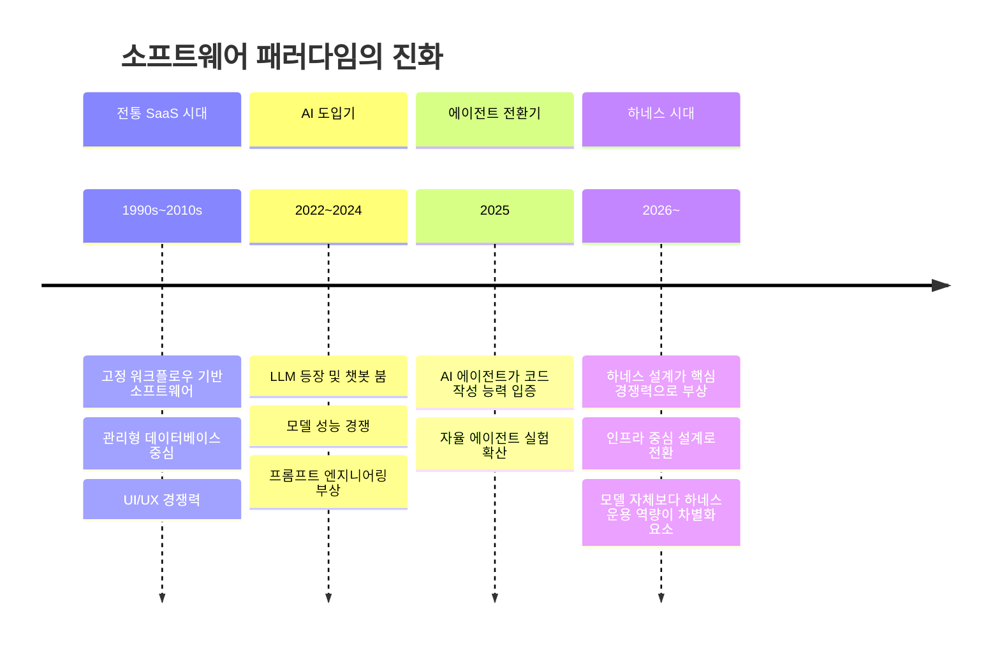
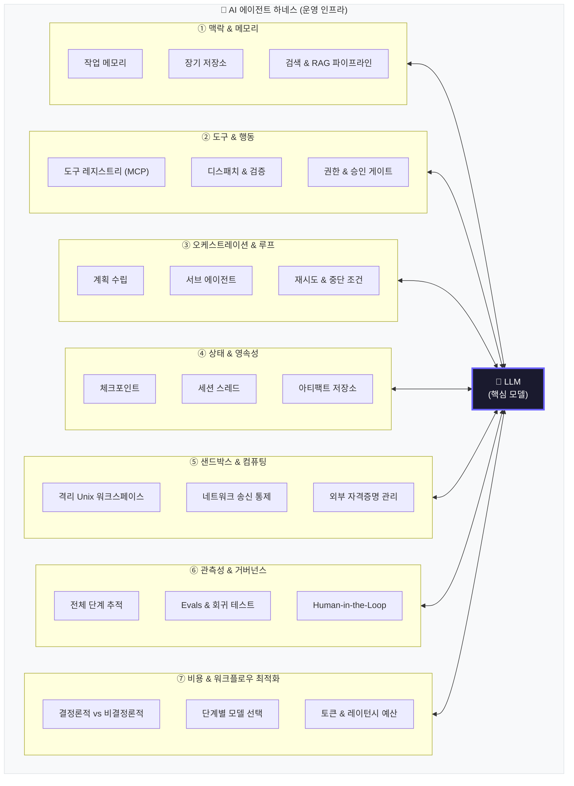
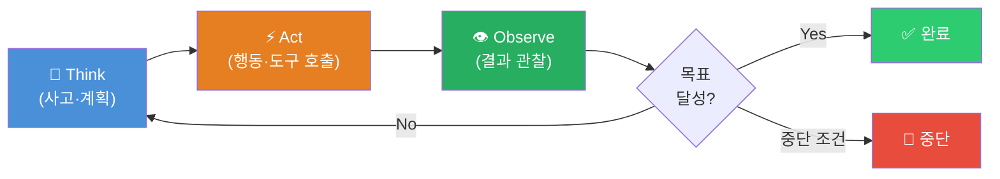
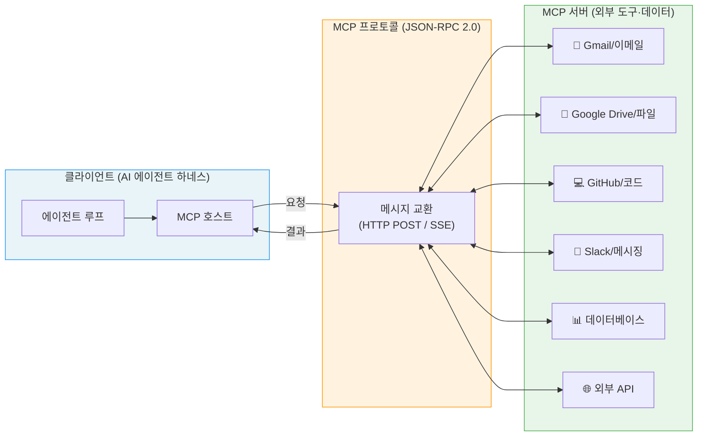
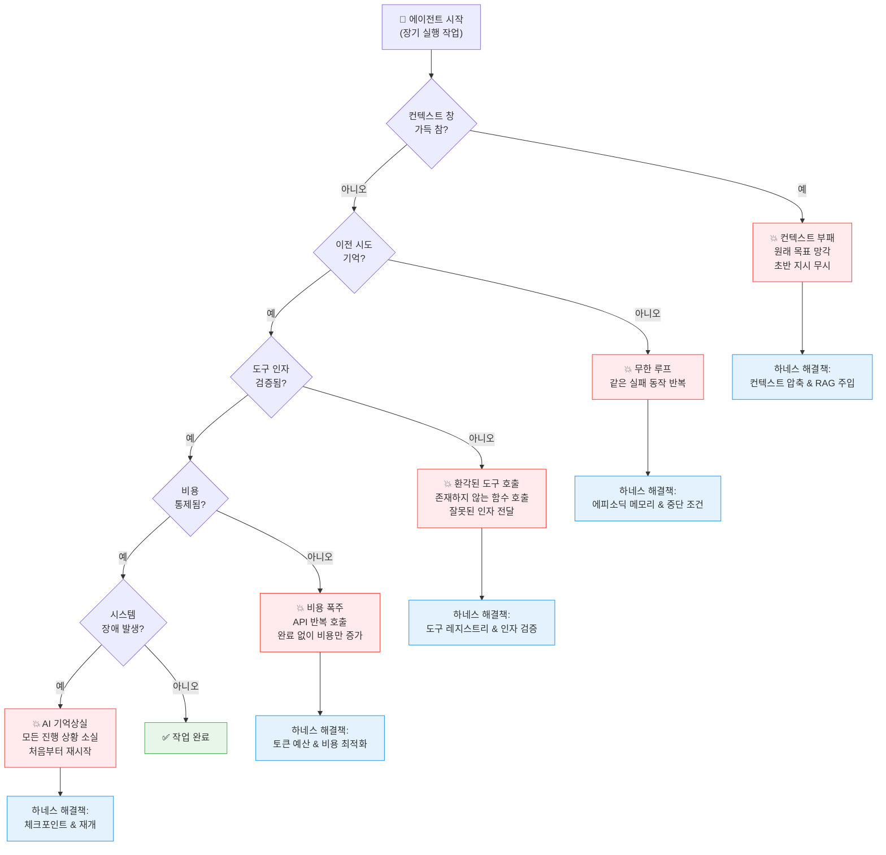
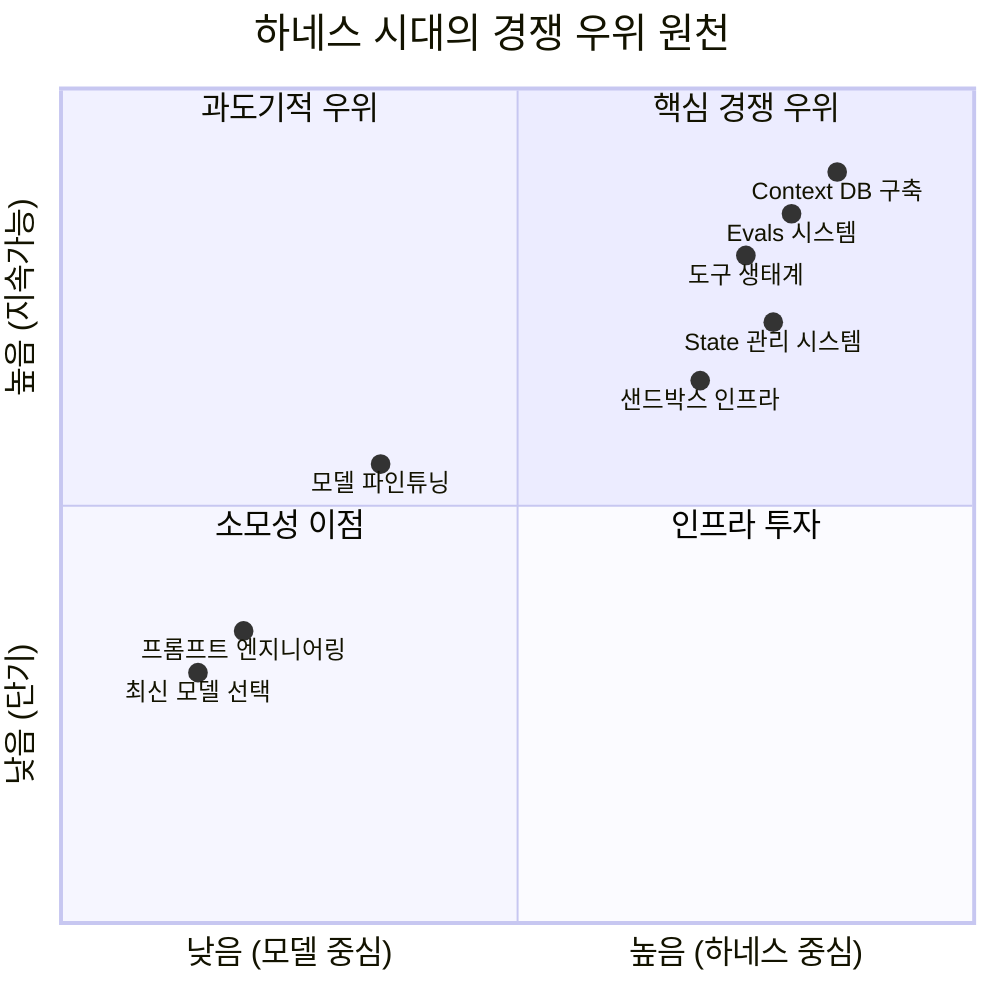
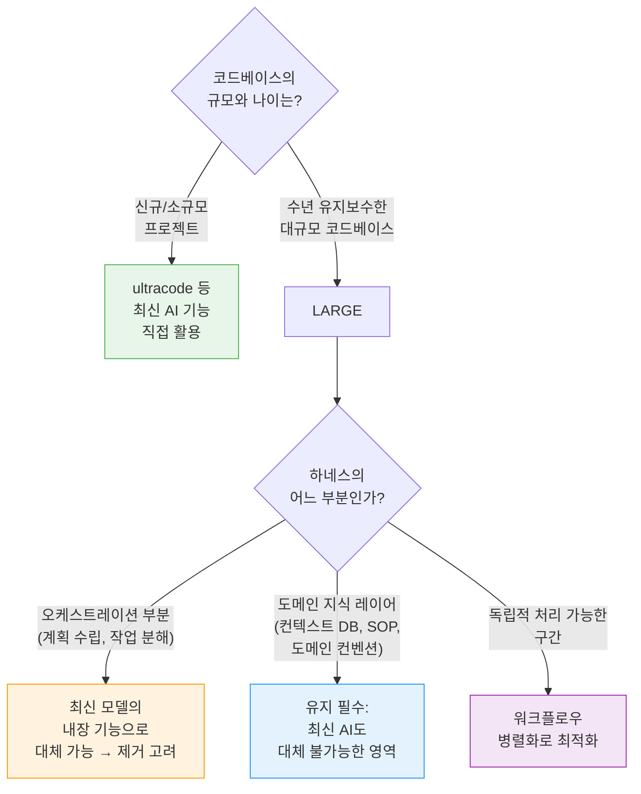
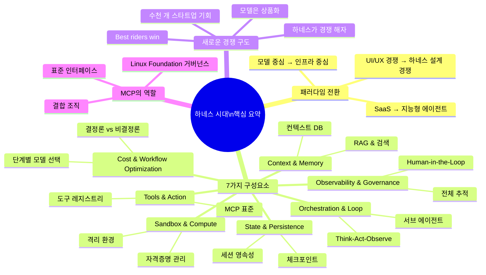

> **출처:** Tom Tunguz (Theory Ventures), ["Software After AI"](https://tomtunguz.com/harnessing-ai/) (2026-05-27) · GeekNews 토론 ([news.hada.io]( https://news.hada.io/topic?id=30061)) · Salesforce Agent Harness 공식 가이드 (2026-03) · MCP 2026 로드맵 분석 종합
>
> **작성일:** 2026-06-04

---

## 목차

1. [배경: 패러다임 전환의 시작](#1-배경-패러다임-전환의-시작)
2. [야생마 비유 — AI를 길들인다는 것의 의미](#2-야생마-비유--ai를-길들인다는-것의-의미)
3. [하네스란 무엇인가](#3-하네스란-무엇인가)
4. [AI 에이전트 하네스의 7가지 구성요소](#4-ai-에이전트-하네스의-7가지-구성요소)
   - 4.1 [Context & Memory (맥락과 메모리)](#41-context--memory-맥락과-메모리)
   - 4.2 [Tools & Action (도구와 행동)](#42-tools--action-도구와-행동)
   - 4.3 [Orchestration & Loop (오케스트레이션과 루프)](#43-orchestration--loop-오케스트레이션과-루프)
   - 4.4 [State & Persistence (상태와 영속성)](#44-state--persistence-상태와-영속성)
   - 4.5 [Sandbox & Compute (샌드박스와 컴퓨팅)](#45-sandbox--compute-샌드박스와-컴퓨팅)
   - 4.6 [Observability & Governance (관측성과 거버넌스)](#46-observability--governance-관측성과-거버넌스)
   - 4.7 [Cost & Workflow Optimization (비용과 워크플로우 최적화)](#47-cost--workflow-optimization-비용과-워크플로우-최적화)
5. [MCP: 하네스의 결합 조직](#5-mcp-하네스의-결합-조직)
6. [에이전트 프레임워크 vs. 하네스 — 핵심 차이](#6-에이전트-프레임워크-vs-하네스--핵심-차이)
7. [하네스 없이 에이전트가 실패하는 이유](#7-하네스-없이-에이전트가-실패하는-이유)
8. [새로운 경쟁 구도: 가장 잘 타는 자가 승리한다](#8-새로운-경쟁-구도-가장-잘-타는-자가-승리한다)
9. [한국 개발자 커뮤니티의 시각 (GeekNews 토론)](#9-한국-개발자-커뮤니티의-시각-geeknews-토론)
10. [종합 정리 및 시사점](#10-종합-정리-및-시사점)

---

## 1. 배경: 패러다임 전환의 시작

소프트웨어 산업은 지금 조용하지만 근본적인 지각변동을 겪고 있다. 2025년은 AI 에이전트가 코드를 작성할 수 있음을 증명한 해였다면, 2026년은 에이전트 자체가 어려운 부분이 아니라는 사실을 산업 전반이 깨달은 해다. OpenAI의 Codex 팀은 인간의 손을 거치지 않고 AI만으로 100만 줄이 넘는 프로덕션 애플리케이션을 구축했다. 그 과정에서 엔지니어들이 한 일은 코드를 직접 작성하는 것이 아니었다. 그들은 AI가 신뢰성 있게 코드를 작성할 수 있게 해주는 시스템, 즉 하네스(harness)를 설계했다.

Theory Ventures의 벤처 캐피털리스트 Tom Tunguz는 2026년 5월 27일 "Software After AI"라는 제목의 글에서 이 전환을 명쾌하게 정리했다. 그의 핵심 테제는 단순하다: **소프트웨어의 시대가 끝나는 것은 하네스 시대가 시작된다는 의미다.** AI는 고정된 워크플로우와 관리형 데이터베이스를 기반으로 작동하던 기존 SaaS를 지능(intelligence) 자체로 대체하며 소프트웨어 패러다임을 근본적으로 재정의하고 있다.

2025년까지 기업들이 더 강력한 프런티어 모델을 추구하는 데 집중했다면, 2026년에 들어서 산업계는 모델 자체가 아무리 발전해도 에이전트 스캐폴딩(scaffolding)이 부재하면 실전 배포 문제를 극복할 수 없다는 사실을 깨달았다. 설계의 중심이 모델 중심(model-centric)에서 인프라 중심(infrastructure-centric)으로 이동하고 있는 것이다.

---

## 2. 야생마 비유 — AI를 길들인다는 것의 의미

Tom Tunguz는 AI를 야생 머스탱(mustang)에 비유한다. 머스탱은 놀라운 힘과 속도를 가진 야생마이지만, 그 자체로는 다룰 수 없다. 마구(馬具)를 갖추고 길들여야 비로소 실제로 활용할 수 있는 존재가 된다. AI는 정확히 그와 같다. LLM은 강력하지만 야생마처럼 거칠고 예측 불가능하다. 그대로 방치하면 다음과 같은 문제들이 반복적으로 발생한다.

첫째, **컨텍스트 드리프트(Context Drift)** 다. 에이전트가 많은 정보를 처리할수록 이전 단계의 잡음 속에서 중요한 세부 사항을 잃어버린다. 둘째, **무한 루프**다. 에이전트는 같은 실패 행동을 이미 시도했다는 기억이 없기 때문에 계속 반복할 수 있다. 셋째, **환각된 도구 사용(Hallucinated Tool Usage)** 이다. 엄격한 검증 없이는 잘못된 매개변수를 가진 함수를 호출하거나 존재하지 않는 도구를 만들어낸다. 넷째, **비용 폭주**다. 관리되지 않는 에이전트는 비싼 API를 반복 호출하여 작업을 완료하지 못한 채 비용만 치솟게 만들 수 있다.

길들임(domestication)의 본질은 LLM을 중심에 두고 그 주위에 7개의 구성요소를 방사형으로 배치하는 아키텍처를 구축하는 것이다. 이것이 바로 AI 에이전트 하네스다.

---

## 3. 하네스란 무엇인가

**에이전트 하네스(Agent Harness)** 는 AI 모델을 감싸서 그 모델의 수명 주기, 맥락, 외부 세계와의 상호작용을 관리하는 운영 소프트웨어 계층이다. 하네스는 생각하는 "두뇌"가 아니다. 두뇌가 제대로 기능하는 데 필요한 도구, 기억, 안전 한계를 제공하는 환경이다.

Salesforce는 법률 시스템에 비유해 이를 명쾌하게 설명한다. AI 모델은 법률 지식과 해석 능력을 가진 변호사다. 그러나 변호사 혼자서 법치주의를 만들 수는 없다. 법체계의 구조를 제공하는 법원과 판사, 각 사건에 적용할 강력한 법률 체계, 그리고 공정한 판단을 돕는 배심원이 필요하다. **하네스는 바로 그 감독 및 통제 시스템이다.** 변호사(모델)가 법의 테두리 안에서 공정하게 활동하도록 보장한다.

에이전트 프레임워크와 하네스는 종종 혼용되지만, 엄밀히 구분된다. 에이전트 프레임워크(LangChain, CrewAI 등)는 에이전트 로직을 설계하기 위한 라이브러리와 빌딩 블록을 제공한다. 반면 **하네스는 에이전트가 실제 프로덕션 환경에서 동작하는 방식을 지배하는 런타임 시스템**이다. 프레임워크가 설계도라면, 하네스는 에이전트가 일하는 시설 전체다.

---

## 4. AI 에이전트 하네스의 7가지 구성요소

Theory Ventures의 아키텍처 다이어그램은 LLM을 중심(the smallest part)에 두고, 그 주위를 7개의 구성요소가 방사형으로 감싸는 구조를 보여준다. 아래에서 각 구성요소를 심층 분석한다.

---

### 4.1 Context & Memory (맥락과 메모리)

**모델이 보는 것 (What the model sees)**

컨텍스트와 메모리는 에이전트가 "지금 무슨 일이 일어나고 있는가"를 인식하는 방식 전체를 담당한다. 범용 모델은 도메인마다 맞춤형 검색(bespoke retrieval)이 필요하다. 방사선 전문의를 위한 컨텍스트 검색 시스템과 법무 보조원을 위한 시스템은 동일할 수 없다. 같은 LLM을 사용하더라도, 어떤 정보를 어떻게 모델에게 전달하느냐에 따라 결과의 정확도가 근본적으로 달라진다.

컨텍스트·메모리 레이어는 크게 세 가지 하위 시스템으로 구성된다.

**작업 메모리(Working Memory):** "45초 전에 에이전트가 무엇을 하고 있었나?"를 추적하는 단기 기억이다. 에이전트가 멀티스텝 작업을 수행하는 동안 이전 단계의 결과와 현재 상태를 유지한다.

**에피소딕 저장소 + 장기 저장소(Episodic + Long-term Stores):** 이전 세션의 작업 이력, 사용자 선호도, 이전에 해결한 문제 패턴 등을 보관하는 장기 기억이다. 대규모 이미지 검색(방사선·영상 생성), 수십억 건 문서에 대한 키워드 검색 등 케이스별로 시스템이 달라진다.

**검색 & RAG 파이프라인(Retrieval & RAG Pipelines):** 전체 데이터를 모델에 쏟아붓는 대신, 필요한 순간에 필요한 정보만 선택적으로 주입한다. 하네스는 컨텍스트 엔지니어링(context engineering)을 통해 세션 이력을 주기적으로 요약(압축, compaction)하고, RAG 기술을 활용해 실제로 필요할 때만 특정 문서나 데이터 포인트를 컨텍스트 창에 주입한다.

**컨텍스트 데이터베이스(Context Database):** 검색 시스템 옆에는 각 비즈니스가 실제로 어떻게 운영되는지를 담은 "레시피북"이 위치한다. 우리가 머릿속에 담고 출근하는 표준운영절차(SOP)가 바로 그 레시피다. 컨텍스트 DB의 본질은 이 레시피를 초기에 포착하고, 사람과 프로세스가 변화함에 따라 지속적으로 진화시키는 것이다.

모든 AI 모델은 "컨텍스트 창(context window)"이라는 한계를 가진다. 장기 실행 작업에서 이 창이 꽉 차면 에이전트는 "컨텍스트 부패(context rot)"를 겪기 시작한다. 원래 목표를 잊거나, 세션 초반에 제공된 중요한 지시사항을 무시하게 된다. 하네스의 메모리 관리는 이를 방지하는 핵심 메커니즘이다.

---

### 4.2 Tools & Action (도구와 행동)

**모델이 행동하는 방식 (How the model acts)**

도구(Tools)는 에이전트가 외부 세계에 영향을 미치는 수단이다. 컨텍스트 DB의 레시피가 "무엇을 할지"를 설명한다면, 도구는 그것을 실제로 수행하는 재료와 기구다. 즉, 도구 레이어는 에이전트의 사고를 실제 행동으로 전환하는 인터페이스다.

현대적인 하네스는 도구를 다음과 같은 엄격한 파이프라인으로 처리한다.

첫째, **도구 레지스트리(Tool Registry)를 통한 노출**이다. 에이전트가 사용할 수 있는 모든 도구가 중앙 레지스트리에 등록된다. 에이전트는 이 목록에서 적합한 도구를 선택한다. 둘째, **인자 검증(Argument Validation)** 이다. 모델이 전달한 인자가 올바른 형식인지, 필수 매개변수가 누락되지 않았는지 하네스가 검증한다. 이 단계 없이는 잘못된 인자로 외부 API를 호출하거나 존재하지 않는 함수를 호출하는 오류가 발생한다. 셋째, **호출 디스패치(Dispatch)** 다. 검증을 통과한 요청만 실제 외부 시스템으로 전달된다. 넷째, **승인 게이트(Approval Gates)** 다. 민감한 작업(대용량 데이터 삭제, 대규모 금융 거래 승인 등)은 자동으로 실행되지 않고 인간의 검토를 위해 일시 중지된다. 다섯째, **결과 파싱(Result Parsing)** 이다. 외부 시스템에서 돌아온 결과를 정제하고 불필요한 기술적 잡음을 제거한 후 에이전트 루프에 다시 주입한다.

**하네스의 품질은 안전하게 노출할 수 있는 도구의 수와 실패를 깔끔하게 처리하는 능력에 의해 결정된다.** 도구가 많을수록 에이전트의 역량이 확장되지만, 동시에 보안과 안정성의 부담도 커진다. 이 균형을 잘 관리하는 것이 하네스 설계자의 핵심 과제다.

---

### 4.3 Orchestration & Loop (오케스트레이션과 루프)

**모델이 생각하는 방식 (How the model thinks)**

에이전트 루프(Agentic Loop)는 AI 에이전트가 복잡한 작업을 수행하는 기본 메커니즘이다. 그 구조는 다음과 같이 반복된다.

오케스트레이션 레이어는 이 루프를 구조화하고 제어하는 여러 메커니즘을 포함한다.

**계획 수립(Planning):** 복잡한 목표를 실행 가능한 하위 단계로 분해한다. 단순한 작업은 단일 루프로 처리할 수 있지만, 주간 영업 캠페인 관리나 다단계 소프트웨어 개발 같은 복잡한 작업은 치밀한 계획이 필요하다.

**서브 에이전트와 위임(Sub-agents & Delegation):** 복잡한 프로젝트는 단일 에이전트로 처리하기보다 여러 전문 에이전트에게 분배하는 멀티 에이전트 패턴이 효율적이다. 하네스는 이 "허브 앤 스포크(hub-and-spoke)" 모델에서 디스패처 역할을 한다. 연구 에이전트, 작성 에이전트, 준법 검토 에이전트가 각자의 역할을 수행하고, 하네스가 이들 간의 핸드오프를 관리한다.

**재시도 & 예산 & 중단 조건(Retries, Budgets, Stop Rules):** 도구 호출이 실패하면 자동으로 재시도하고, 특정 횟수 이상 실패하면 에스컬레이션한다. 토큰 예산이나 시간 예산을 초과하면 작업을 중단한다. 무한 루프에 빠지지 않도록 적절한 중단 조건을 설정하는 것이 오케스트레이션의 핵심 과제 중 하나다.

**클로즈드 루프 학습(Closed Loop Learning):** 각 실행에서 학습하는 클로즈드 루프 패턴은 벤더 간 차별화 요소가 된다. 소프트웨어는 사용할수록 개선되어야 한다는 기본적인 기대치를 에이전트도 충족해야 한다.

---

### 4.4 State & Persistence (상태와 영속성)

**모델이 기억하는 것 (What the model remembers)**

대규모 엔터프라이즈에서는 수많은 사람들이 동시에 시스템을 사용한다. 이 환경에서 회복 탄력성(resilience)은 선택이 아닌 필수다.

핵심 시나리오를 생각해보자. 10단계 작업 중 7단계에서 하네스가 크래시한다면? 처음부터 다시 시작해야 한다면 그 비용은 용납할 수 없다. **잘 설계된 하네스는 8단계부터 재개(resume)한다.** 처음부터 다시 시작하지 않는다. 이것이 상태 및 영속성 레이어의 핵심 가치 제안이다.

대부분의 원시(raw) AI 모델은 무상태(stateless)다. 매 요청마다 모델은 처음부터 시작한다. 여러 시간이 걸리는 작업에서 이는 중대한 취약점이다. 네트워크 오류나 시스템 재시작이 발생하면 독립형 에이전트는 모든 진행 상황을 잃는다. 이를 "AI 기억상실(AI amnesia)"이라고 부르기도 한다.

이를 방지하기 위해 상태·영속성 레이어는 다음 메커니즘들을 제공한다. **파일 시스템 & 워크스페이스(File System & Workspace):** 에이전트가 생성한 임시 파일, 중간 결과물 등을 저장하는 영속 저장소다. **체크포인트 & 재개(Checkpoint & Resume):** 에이전트 진행 상황의 스냅샷을 주기적으로 저장하여, 실패 시 마지막 체크포인트부터 재개할 수 있도록 한다. **세션 스레드 영속성(Session & Thread Persistence):** 세션 간에 대화 이력과 컨텍스트를 유지한다. 사용자가 다음 날 다시 접속했을 때도 에이전트는 이전 작업을 기억한다. **아티팩트 & 스냅샷(Artifacts & Snapshots):** 에이전트가 생성한 보고서, 코드, 분석 결과 등 최종 산출물을 안전하게 보존한다.

---

### 4.5 Sandbox & Compute (샌드박스와 컴퓨팅)

**모델이 실행되는 곳 (Where the model runs)**

모든 에이전트는 독립된 작업 공간이 필요하다. 에이전트가 외부 코드를 실행하거나, 파일 시스템에 접근하거나, 외부 서비스를 호출할 때, 이러한 작업이 시스템 전체에 영향을 미치면 안 된다. 하네스의 샌드박스 레이어는 각 에이전트를 격리된 환경에서 실행하도록 보장한다.

**격리된 Unix 워크스페이스(Isolated Unix Workspace):** 각 에이전트 실행은 독립된 컨테이너 또는 가상화된 환경에서 이루어진다. 한 에이전트의 작업이 다른 에이전트나 호스트 시스템에 영향을 미칠 수 없다. **쉘, 패키지, Git 접근(Shell, Package, Git Access):** 에이전트가 소프트웨어 개발 작업을 수행하기 위해 필요한 도구들에 대한 통제된 접근을 제공한다. **네트워크 송신 통제(Network Egress Controls):** 에이전트가 어떤 외부 서비스에 연결할 수 있는지를 엄격하게 제한한다. 승인된 도메인 외부로의 데이터 전송을 차단하여 데이터 유출을 방지한다. **모델 외부 자격증명 관리(Credentials Outside the Model):** API 키, 비밀번호, 접근 토큰 등의 민감한 자격증명은 모델의 컨텍스트 창에 절대 포함되지 않는다. 하네스가 별도의 비밀 관리 시스템에서 자격증명을 안전하게 주입한다.

이 세 가지 요소, 즉 격리(isolation), 통제된 네트워크 접근(controlled egress), 외부 자격증명 관리(external credentials)가 샌드박스를 대규모로도 안전하고 기밀이 보장되며 빠르게 만드는 핵심이다.

---

### 4.6 Observability & Governance (관측성과 거버넌스)

**모델을 신뢰하는 방법 (How you trust the model)**

Tom Tunguz가 가장 강조하는 통찰 중 하나가 이 레이어를 관통한다: **"볼 수 없는 것은 신뢰할 수 없다(You cannot trust what you cannot see)."** 데모에서 프로덕션 시스템으로의 전환은 가시성과 거버넌스가 구축될 때 비로소 가능해진다.

**전체 단계 추적(Tracing & Structured Logs):** 에이전트의 모든 사고 과정, 도구 호출, 의사결정을 구조화된 로그로 기록한다. 문제가 발생했을 때 어느 단계에서 무엇이 잘못되었는지 정확하게 추적할 수 있다. **Evals & 회귀 테스트 스위트(Evals & Regression Suites):** 소프트웨어 개발에서 단위 테스트가 버그를 조기에 잡듯, Evals는 에이전트의 성능 회귀를 고객보다 먼저 발견하도록 돕는다. 새로운 모델 버전이나 프롬프트 변경 후 에이전트 동작이 예상대로인지 자동으로 검증한다. **가드레일 & 정책(Guardrails & Policy):** 에이전트가 절대로 수행해서는 안 되는 행동을 정책으로 정의하고 인프라 수준에서 강제한다. 프롬프트 레이어가 아닌 인프라 레이어에서 통제가 이루어지므로, 훨씬 더 강력하고 우회하기 어렵다. **Human-in-the-Loop (인간 개입):** 가장 위험도가 높은 결정에는 자동화를 중단하고 인간의 검토를 요구한다. 에이전트가 고가치 고객에게 이메일을 발송하는 것을 허용하되, 실제 전송 전에 인간 직원이 검토하고 승인하도록 워크플로우를 설계한다.

관측성과 거버넌스 레이어는 AI 도입의 책임성(accountability) 문제를 해결하는 핵심 수단이기도 하다. 기업이 AI 에이전트의 결정을 감사(audit)하고 설명할 수 있어야 하는 규제 환경에서, 이 레이어의 성숙도가 엔터프라이즈 AI 배포의 가장 중요한 판단 기준 중 하나가 되고 있다.

---

### 4.7 Cost & Workflow Optimization (비용과 워크플로우 최적화)

**무엇이 어디서 실행될지 결정하는 방법 (How you choose what runs where)**

일곱 번째 구성요소는 순수 기술적 요소가 아니라 아키텍처적 판단력(architectural judgment)이다. 같은 결과를 더 적은 비용으로, 더 빠르게 달성하기 위한 체계적 의사결정 프레임워크다.

**결정론적 vs. 비결정론적(Deterministic vs. Non-deterministic):** 모든 작업을 LLM에게 맡길 필요는 없다. 정해진 규칙으로 처리할 수 있는 부분은 결정론적(deterministic) 코드로, LLM의 추론 능력이 필요한 부분만 비결정론적(non-deterministic) AI에게 위임한다. 이 구분이 비용 효율성의 기초다. **단계별 모델 선택(Model Selection: SOTA → Small):** 모든 단계에 최첨단(SOTA) 모델을 사용할 필요는 없다. 복잡한 계획 수립은 대형 모델, 간단한 분류 작업은 소형 모델, 특정 도메인 작업은 파인튜닝된 특수 모델을 활용한다. 지능적인 모델 라우팅만으로도 비용을 크게 절감할 수 있다. **스킬 vs. 메모리 인코딩(Skills vs. Memory Encoding):** 어떤 지식을 파인튜닝을 통해 모델 자체에 "기술(skill)"로 내재화할지, 아니면 RAG를 통해 외부 메모리에서 검색할지를 결정한다. 자주 사용되고 안정적인 지식은 파인튜닝, 자주 변경되거나 문서 양이 방대한 지식은 메모리 검색이 더 적합한 경우가 많다. **토큰 & 레이턴시 예산(Token & Latency Budgets):** 각 작업에 허용되는 최대 토큰 수와 응답 시간을 사전에 정의한다. 실시간 사용자 대면 작업은 레이턴시 우선, 백그라운드 분석 작업은 비용 우선으로 최적화한다.

이 일곱 번째 레이어는 실제로 이전 여섯 개 레이어 모두에 영향을 미치는 횡단 관심사(cross-cutting concern)다. 어떤 메모리 전략을 쓸지, 어떤 도구를 레지스트리에 올릴지, 어느 단계에서 Human-in-the-Loop를 적용할지 — 이 모든 결정이 비용과 워크플로우 최적화라는 관점에서 재검토되어야 한다.

---

## 5. MCP: 하네스의 결합 조직

Tom Tunguz는 MCP(Model Context Protocol)가 도구 연결을 위한 **결합 조직(connective tissue)** 으로 부상했다고 말한다. 이 비유는 매우 정확하다. 결합 조직이 신체 기관들을 이어주듯, MCP는 AI 에이전트와 외부 도구·데이터 소스를 연결하는 표준 인터페이스 역할을 한다.

Anthropic이 2024년 11월에 공개한 MCP는 16개월 만에 AI 에이전트가 외부 세계와 연결하는 사실상의 표준(de facto standard)이 되었다. OpenAI, Google DeepMind, Microsoft, AWS 모두 MCP를 채택했으며, Python 및 TypeScript SDK 다운로드 수는 월 9,700만 건을 넘어섰다. 2025년 12월에는 Anthropic이 MCP를 Linux Foundation 산하의 Agentic AI Foundation(AAIF)에 기증하여 벤더 중립적 커뮤니티 거버넌스 표준으로 전환했다.

2026년 기준으로 공식 레지스트리에 등록된 공개 MCP 서버는 수만 개에 달하며, GitHub에서 `mcp-server` 토픽을 가진 저장소는 15,926개(2026년 5월 기준)에 달한다. MCP는 이제 단순한 개발자 도구를 넘어 엔터프라이즈 인프라로 성숙하는 단계에 있다.

2026년 MCP 로드맵의 핵심 방향은 다음과 같다. **수평 확장(Horizontal Scaling):** 현재의 스테이트풀 세션이 로드 밸런서와 충돌하는 문제를 해결하기 위해 세션을 전송 레이어에서 분리한다. **에이전트 통신(Agent Communication):** `Tasks` 프리미티브에 재시도 의미론과 만료 정책을 추가하여 비동기 장기 실행 작업을 지원한다. **엔터프라이즈 준비(Enterprise Readiness):** 감사 추적, SSO 통합, 게이트웨이 패턴 등 기업 환경에서 요구되는 기능들을 표준화한다.

---

## 6. 에이전트 프레임워크 vs. 하네스 — 핵심 차이

하네스와 에이전트 프레임워크의 차이를 명확히 이해하는 것이 아키텍처 설계의 출발점이다.

| 특성 | 에이전트 (두뇌) | 하네스 (몸/환경) |
|------|-----------------|-----------------|
| **주요 기능** | **추론**: 문제 해결을 위한 다음 단계 결정 | **실행**: 도구, 상태, 외부 연결 관리 |
| **범위** | **확률론적**: 패턴과 논리로 최선의 행동 예측 | **결정론적**: 하드코딩된 규칙, 안전 점검, 프로토콜 준수 |
| **책임** | **사고**: 정보 처리 및 워크플로우 계획 | **실행/안전**: 가드레일 강제, 데이터 영속성 보장 |
| **구현 예시** | LangChain, CrewAI, AutoGen 등 프레임워크 | 런타임 인프라, 도구 레지스트리, 상태 관리 DB |
| **변경 빈도** | 모델 버전이 바뀔 때마다 조정 | 비즈니스 로직과 함께 독립적으로 진화 |

하네스의 중요한 특성 중 하나는 **모델 불가지론(model-agnostic)** 이라는 점이다. 잘 설계된 하네스는 비즈니스 로직을 한 번 구축하면, 새로운 모델이 출시되었을 때 기존 도구, 데이터 연결, 보안 정책을 그대로 유지하면서 모델만 교체할 수 있다. 이는 빠르게 발전하는 AI 환경에서 미래 지향적 시스템을 구축하는 데 필수적인 속성이다.

---

## 7. 하네스 없이 에이전트가 실패하는 이유

하네스의 필요성을 가장 직관적으로 이해하는 방법은 하네스 없이 에이전트가 실패하는 구체적인 시나리오를 살펴보는 것이다.

---

## 8. 새로운 경쟁 구도: 가장 잘 타는 자가 승리한다

Tom Tunguz의 가장 중요한 전략적 통찰은 경쟁 구도에 관한 분석이다. 그의 핵심 명제: **모든 기업이 동일한 모델에 접근할 수 있는 시대에는 모델이 아니라 하네스를 더 잘 설계하고 운용하는 쪽이 승리한다.** 표현을 빌리면, "가장 잘 타는 자(best riders)"가 이긴다.

이 새로운 경쟁 구도는 모든 시장 카테고리에 동일하게 적용되지는 않는다. 빅랩(주요 AI 연구소)들이 직접 우선시하는 시장에서는 빠른 실행력과 모델에 대한 직접적인 통제력이 이점이 된다. 그러나 그 외의 수천 개 분리된 시장이 스타트업과 도메인 전문가에게 열려 있다.

경쟁 우위의 원천이 어디로 이동했는지 살펴보면 다음과 같다.

2026년 현재, Salesforce는 이를 이렇게 정리했다: **모델 자체는 상품(commodity)이 되어가고 있다. 조직의 진정한 경쟁 해자(competitive moat)는 에이전트 인프라, 즉 하네스가 될 것이다.** 잘 설계된 하네스는 영리한 데모를 신뢰성 있는 엔터프라이즈 소프트웨어로 전환한다. 이것이 AI가 규모 있게 인간과 나란히 작동할 수 있도록 만드는 기억력, 안전성, 영속성을 제공한다.

---

## 9. 한국 개발자 커뮤니티의 시각 (GeekNews 토론)

해당 아티클이 GeekNews(news.hada.io)에 소개된 후, 한국 개발자 커뮤니티 내에서 매우 흥미롭고 실용적인 토론이 전개되었다. 이 토론은 하네스 이론의 실전 적용에 대한 현장의 목소리를 담고 있어 주목할 만하다.

### "하네스를 제거했다"는 주장

커뮤니티에서 가장 화제가 된 의견은 일부 개발자들이 기존에 구축해놓은 하네스 설정을 **모두 제거했다**는 주장이었다. 이 견해의 핵심 논거는 다음과 같다: "모델이 발전할수록 하네스는 오히려 모델의 성능을 제약하는 요인이 된다. 어설픈 하네스 설정은 오히려 더 후진 결과물을 만들어낸다. 이전 모델 버전에 맞게 설계된 하네스 설정은 최신 모델에서는 더 이상 의미가 없다."

이에 대해 반대 의견도 제시되었다. OpenAI도 자사 내부 프로젝트에 하네스를 사용하며, 같은 품질의 결과물을 구현하는 데 드는 토큰을 절반까지 줄일 수 있다는 점에서 성능과 비용 모두를 잡을 수 있는 하네스는 여전히 유효하다는 것이다.

### 핵심 통찰: 코드베이스의 나이와 결합도에 따른 판단

이 토론에서 가장 중요한 합의점이 도출되었다. 한 개발자는 이를 명쾌하게 정리했다: **"하네스의 진짜 가치는 오케스트레이션이 아니라, 최신 AI 기능이 대체할 수 없는 층 — 지식 그래프, 도메인 컨벤션, 검증 불변식 — 에 있다."**

결론은 "지운다 vs. 남긴다"의 이분법이 아니라, **코드베이스의 나이와 결합도에 따라 달라지는 판단**이라는 것이다.

이 통찰은 Tom Tunguz의 원글에서 강조한 7번째 구성요소, 즉 아키텍처적 판단력(architectural judgment)과 정확히 일치한다. 모든 것을 무조건 하네스화할 필요도, 모든 하네스를 제거할 필요도 없다. **무엇이 AI에게 맡길 일이고 무엇이 구조화된 인프라로 처리해야 할 일인지를 구분하는 능력**이 바로 하네스 엔지니어링의 본질이다.

---

## 10. 종합 정리 및 시사점

Tom Tunguz의 "AI 이후의 소프트웨어: 하네스 시대의 개막"은 단순한 기술 트렌드 분석을 넘어, AI 시대 소프트웨어 경쟁의 판이 어떻게 달라지는지를 명확하게 보여준다.

**핵심 메시지 요약:**

첫째, 소프트웨어 패러다임이 UX와 데이터 관리에서 하네스, 즉 LLM을 신뢰성 있는 에이전트로 전환하는 레이어 구축으로 이동하고 있다. 둘째, AI 에이전트 하네스는 컨텍스트&메모리, 도구&행동, 오케스트레이션&루프, 상태&영속성, 샌드박스&컴퓨팅, 관측성&거버넌스, 비용&워크플로우 최적화라는 7가지 구성요소로 정의된다. 셋째, LLM은 "가장 작은 부분(the smallest part)"이며, 하네스가 실제 작업을 수행한다. 넷째, 모든 기업이 동일한 모델에 접근할 수 있는 시대에는 하네스를 더 잘 설계하고 운용하는 쪽이 승리한다. 다섯째, 현장 적용에서는 코드베이스의 맥락에 따라 하네스의 어느 부분을 유지하고 어느 부분을 최신 AI 기능으로 대체할지를 판단하는 아키텍처적 사고가 요구된다.

궁극적으로, 하네스 시대는 소프트웨어 엔지니어의 역할 자체를 재정의한다. 코드를 직접 작성하는 것에서 AI가 신뢰성 있게 작동할 수 있는 시스템을 설계하는 것으로. 이것이 2026년 현재, 소프트웨어 엔지니어링의 새로운 본질이다.

---

*작성일: 2026-06-04*

*주요 참고 자료: Tom Tunguz, "Software After AI" (tomtunguz.com, 2026-05-27) · Salesforce, "What Is an Agent Harness?" (2026-03) · GeekNews 토론 (news.hada.io/topic?id=30061) · MCP 2026 로드맵 분석 · WorkOS MCP Guide (2026-03)*
