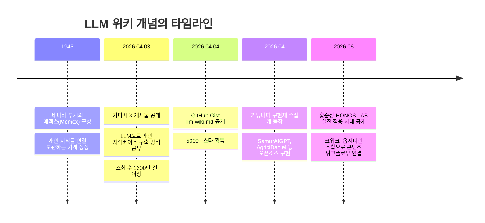
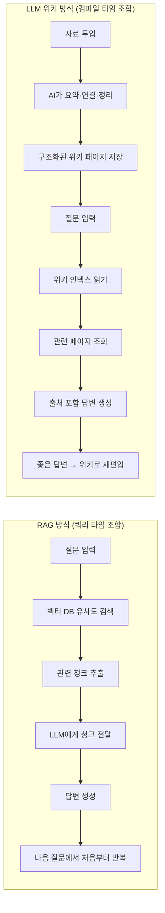
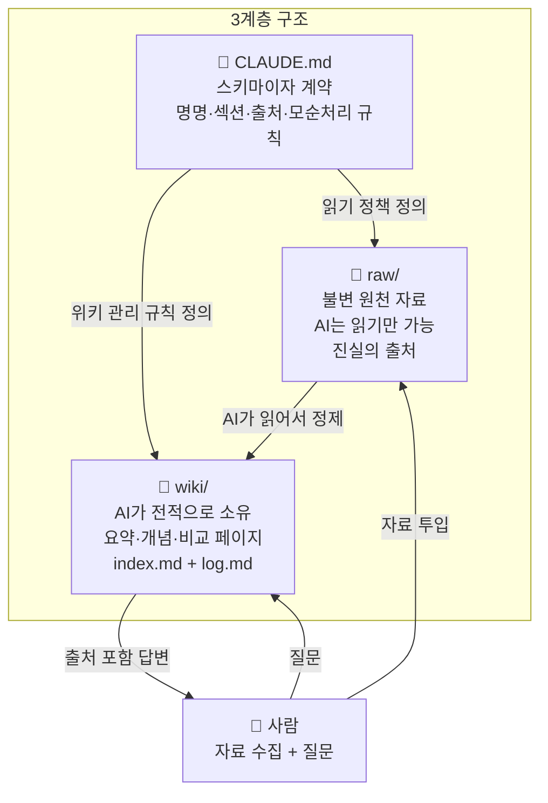
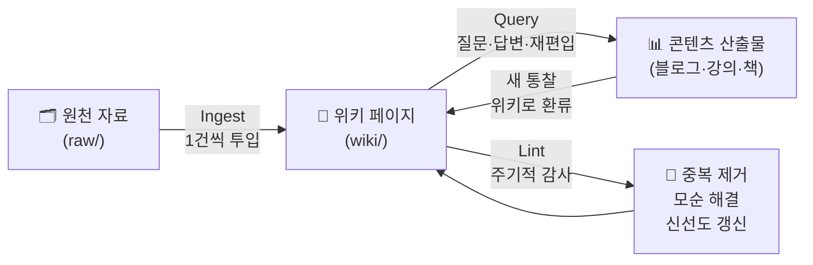
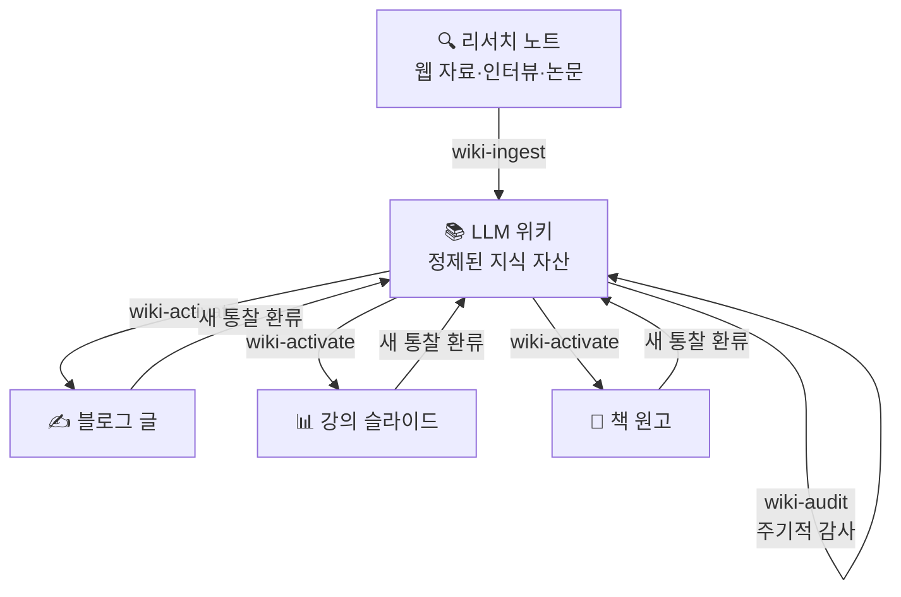

> **출처:** 홍순성 (HONGS LAB, AI 글쓰기·콘텐츠 전략가)  
> **원문:** [노트는 쌓는데 왜 다시 안 볼까 — AI가 정리하는 LLM 위키](https://sshong.com/20772)  
> **발행일:** 2026년 6월 4일  
> **분석 작성일:** 2026-06-04

---

## 개요

이 문서는 AI 글쓰기·콘텐츠 전략가 홍순성(HONGS LAB)이 2026년 6월 4일 공개한 글 「노트는 쌓는데 왜 다시 안 볼까 — AI가 정리하는 LLM 위키」의 핵심 내용을 체계적으로 정리하고, 2026년 현재 이 개념과 관련한 최신 맥락을 함께 서술한 참조 문서다. 홍순성은 옵시디언(Obsidian)과 클로드 코워크(Claude Cowork)를 실제로 운영하면서 직접 경험한 문제의식을 바탕으로, 앤드레이 카파시(Andrej Karpathy)가 2026년 4월 제안한 'LLM 위키' 패턴을 콘텐츠 생산 워크플로우와 연결하는 방법을 설명한다.

---

## 목차

1. [배경: 노트는 쌓이는데 왜 다시 안 보는가](#1-배경)
2. [LLM 위키란 무엇인가](#2-llm-위키란)
3. [카파시의 원제안과 배경](#3-카파시의-원제안)
4. [RAG와 LLM 위키의 차이](#4-rag와의-비교)
5. [도구 조합: 옵시디언과 클로드 코워크](#5-도구-조합)
6. [3계층 구조 설계](#6-3계층-구조)
7. [세 가지 핵심 작업: Ingest·Query·Lint](#7-세-가지-핵심-작업)
8. [스킬 3종 세트: wiki-ingest·wiki-activate·wiki-audit](#8-스킬-3종-세트)
9. [콘텐츠 생산 사이클과 복리 효과](#9-콘텐츠-생산-사이클)
10. [주의사항과 한계](#10-주의사항과-한계)
11. [2026년 생태계 현황](#11-2026년-생태계-현황)
12. [핵심 인사이트 요약](#12-핵심-인사이트)

---

## 1. 배경: 노트는 쌓이는데 왜 다시 안 보는가 {#1-배경}

홍순성이 이 글을 쓰게 된 직접적인 동기는 자신의 경험에서 출발한다. 옵시디언 볼트를 활용해 리서치 자료, 강의 준비, 글쓰기 초안, 일정 관리까지 한 곳에서 운영하면서, 자료는 계속 쌓이는데 막상 블로그 글을 쓰거나 강의를 준비할 때 그 원천 자료를 다시 찾아 참조하는 과정이 매번 숙제가 된다는 점을 지적한다.

노트 앱을 열심히 쓰는 사람이라면 누구나 공감할 수 있는 구조적 문제다. 새 자료가 들어올 때마다 기존 노트와 연결하고, 요약을 정리하고, 관련 페이지를 찾아 링크를 거는 후처리 작업을 사람 손으로 모두 처리하기엔 번거롭다. 결국 자료는 쌓이되, 실제로 꺼내 쓰는 노트는 몇 개에 그치고 나머지는 접근조차 안 되는 '죽은 창고'가 된다.

이 문제를 홍순성은 **클로드 코워크가 볼트를 통째로 읽고 쓰는 방식**으로 해결하고자 한다. 사람이 모든 정리와 연결 작업을 직접 하는 대신, AI에게 그 역할을 맡기는 운영 방식의 전환이다. 이것이 글에서 소개하는 'LLM 위키'의 출발점이다.

---

## 2. LLM 위키란 무엇인가 {#2-llm-위키란}

홍순성은 LLM 위키를 한 문장으로 정의한다. **"AI가 내 자료를 읽고 스스로 정리하고 연결해서 관리하는 나만의 위키백과."** 새 앱을 설치하거나 기존 시스템을 교체하는 것이 아니라, AI에게 자료 정리를 맡기는 **운영 방식**의 변화다.

이 방식에서 인간의 역할과 AI의 역할은 명확하게 분리된다. 사람은 자료를 모으고 좋은 질문을 던지는 일만 한다. 자료의 요약, 개념 간 연결, 모순 발견과 정리는 AI가 전담한다. 노트를 더 많이 쌓는 것이 목표가 아니라, **쌓은 노트를 AI가 유지하게 만들어 저장할수록 똑똑해지는 구조로 바꾸는 것**이 목표다.

홍순성은 이 개념의 지적 계보로 배니버 부시(Vannevar Bush)의 1945년 메멕스(Memex) 구상을 언급한다. 메멕스는 개인이 자신의 모든 지식을 연결해 보관하는 기계를 상상한 개념으로, 부시는 당시 이 아이디어를 기술적으로 실현하지 못했다. 그로부터 약 80년이 지난 2026년, 정리와 유지보수를 맡아줄 AI가 등장하면서 비로소 실현 가능한 구조가 갖춰진 셈이다.

---

## 3. 카파시의 원제안과 배경 {#3-카파시의-원제안}

홍순성이 참조하는 원 아이디어는 AI 연구자 앤드레이 카파시(Andrej Karpathy, OpenAI 공동창업자·전 Tesla AI 디렉터)가 2026년 4월 3일 X(구 트위터)에 공개한 게시물에서 출발한다. 카파시는 그 게시물에서 자신이 LLM을 사용하는 방식이 코드 생성에서 지식 관리로 이동하고 있다는 점을 밝혔고, 이틀 뒤 GitHub Gist에 `llm-wiki.md`라는 아이디어 파일을 공개했다.

그 게시물은 AI 개발자 커뮤니티에 큰 반향을 일으켰다. 조회 수 1600만 건 이상을 기록했고, GitHub Gist는 며칠 만에 5000개 이상의 스타를 받았다. 이후 수십 개의 커뮤니티 구현체가 등장했으며, RAG 파이프라인에 대한 대안적 패턴으로 진지하게 논의되기 시작했다.

카파시는 자신의 단일 연구 주제에 대해 이 방식으로 유지한 위키가 약 100개 문서, 40만 단어 분량으로 성장했다고 밝혔다. 대부분의 박사 논문보다 긴 분량이지만, 직접 한 단어도 타이핑하지 않은 결과물이다.



---

## 4. RAG와 LLM 위키의 비교 {#4-rag와의-비교}

홍순성은 독자들이 LLM 위키를 더 쉽게 이해할 수 있도록 널리 알려진 RAG(검색 증강 생성, Retrieval-Augmented Generation)와의 비교를 제시한다.

### RAG의 작동 방식

RAG는 질문이 들어올 때마다 자료 더미에서 관련 조각을 그때그때 찾아온다. 자료는 미리 임베딩(embedding) 벡터로 변환되어 벡터 데이터베이스에 저장되고, 질문이 들어오면 유사도 검색으로 관련 청크(chunk)를 뽑아 LLM에 전달한다. 미리 정리해두지 않기 때문에, 여러 문서를 종합해야 하는 질문이 들어오면 매번 조각을 새로 꿰맞춰야 한다.

### LLM 위키의 작동 방식

LLM 위키는 자료를 넣는 순간 요약, 연결, 모순 정리를 끝내둔다. 질문이 들어왔을 때 LLM은 이미 정제된 지식 페이지를 읽고 답한다. 동일한 질문에 대한 답이 이미 구조화된 형태로 존재하기 때문에, 매번 원시 자료를 재조합할 필요가 없다.

홍순성은 도서관 비유를 사용해 이 차이를 설명한다. RAG는 질문할 때마다 서가를 처음부터 뒤지는 사서이고, LLM 위키는 미리 주제별로 분류하고 색인까지 붙여둔 서가다. 한 번 정리해 두고 계속 최신 상태로 유지하는, 쌓일수록 단단해지는 지식 구조다.



### 언제 무엇을 써야 하는가

홍순성은 둘을 대립 구도로 보지 않는다. 규모와 용도에 따라 선택이 달라진다. 경계가 분명한 개인 지식, 약 100개 자료 이하의 컬렉션에는 위키가 적합하다. 대규모이거나 실시간으로 변하거나 여러 사람이 함께 쓰는 지식이라면 RAG다. 볼륨이 커지면 위키와 검색을 함께 쓰는 하이브리드가 된다.

기술적 관점에서 명확한 경계선은 약 5만~10만 토큰이다. 이 범위 안에서는 LLM 위키가 인프라 없이 단순하게 운영되며 토큰 효율도 높다. 이 범위를 넘어서면 RAG의 확장성이 필요해진다.

---

## 5. 도구 조합: 옵시디언과 클로드 코워크 {#5-도구-조합}

홍순성이 LLM 위키를 구현하는 도구 조합은 **옵시디언(Obsidian) + 클로드 코워크(Claude Cowork)** 다. 그는 이 조합을 핵심 비유로 설명한다. 옵시디언은 작업실, AI는 그 안에서 일하는 작업자, 위키는 작업 결과물이다.

### 옵시디언을 선택한 이유

옵시디언은 마크다운 파일로 메모를 저장하는 노트 앱이다. 가장 중요한 특성은 **로컬 우선(local-first)** 구조다. 모든 노트가 사용자의 컴퓨터에 일반 텍스트 마크다운 파일로 저장된다. 이 구조 덕분에 별도의 연동 작업 없이 외부 AI 에이전트가 그대로 파일을 읽고 쓸 수 있다. 클라우드 전용 앱이었다면 API 설정이나 플러그인이 필요했을 것이다.

또한 옵시디언은 `[[노트 제목]]` 형식의 양방향 링크를 지원한다. AI가 관련 페이지를 연결할 때 이 형식을 그대로 사용하면 옵시디언의 그래프 뷰에서 지식 네트워크가 시각적으로 드러난다.

### 클로드 코워크란 무엇인가

클로드 코워크는 Anthropic이 2026년 1월에 공개한 데스크톱 기반 AI 에이전트다. 사용자가 자연어로 목표를 주면 로컬 파일, 앱, 문서를 직접 다뤄 결과물을 만드는 지식 노동용 도구다. Claude Code가 개발자 전용 CLI 도구라면, 코워크는 개발자가 아닌 일반 사용자도 쓸 수 있도록 설계된 에이전트다. Pro 요금제(월 20달러) 이상의 유료 플랜에서 macOS와 Windows의 Claude Desktop 앱을 통해 사용 가능하며, 현재는 리서치 프리뷰(Research Preview) 단계에 있다.

보안 구조는 경량 리눅스 가상머신(VM)을 로컬에서 실행하는 방식이다. AI 에이전트는 이 VM 안에서만 작동하므로 시스템 파일이나 다른 앱에는 접근하지 못하고, 네트워크도 허용 목록 내의 도메인만 통과시킨다.

일반 챗봇과 코워크의 차이는 네 가지로 요약된다. 첫째, 일반 챗봇은 그때 올린 파일만 보고 대화가 끝나면 사라지지만, 코워크는 노트 폴더를 직접 읽고 노트로 영구 보관한다. 둘째, 일반 챗봇의 결과는 대화창 텍스트에 그치지만, 코워크는 워드나 파워포인트 같은 파일로도 만들어낸다. 셋째, 코워크는 노트와 규칙 파일로 맥락을 대화 간에 이어간다.

홍순성은 일정 관리부터 글쓰기, 강의 준비, 리서치까지 옵시디언 볼트 하나에서 운영하는데, 코워크가 이 볼트를 통째로 읽고 쓰기 때문에 도구를 옮겨 다닐 일이 없다는 점을 강점으로 꼽는다.

---

## 6. 3계층 구조 설계 {#6-3계층-구조}

LLM 위키의 물리적 구조는 단순하다. 폴더 두 개와 파일 하나로 시작한다.

```
볼트 루트/
├── raw/                  ← 불변 원천 자료 (AI 읽기 전용)
│   └── 주제명/
│       └── 2026-04-10-자료명.md
├── wiki/                 ← AI가 전적으로 소유하는 지식 페이지
│   ├── index.md          ← 전체 목차 (내용 허브)
│   ├── log.md            ← 시간 순서 작업 기록 (append-only)
│   └── 주제명/
│       └── 개념-페이지.md
└── CLAUDE.md             ← 스키마이자 계약 (위키 관리 규칙)
```

### raw 폴더: 불변 원천

`raw` 폴더는 AI가 읽기만 하고 수정하지 않는 진실의 출처다. 웹 기사, 논문, 인터뷰 원문, 필기 노트 등 입력된 자료가 날짜와 출처가 포함된 파일명으로 저장된다. 이 폴더의 내용이 바뀌지 않기 때문에, 위키 페이지의 주장이 어느 원천 자료에서 나왔는지 언제든 소급하여 확인할 수 있다.

### wiki 폴더: AI가 관리하는 지식

`wiki` 폴더는 AI가 전적으로 소유하는 마크다운 페이지 모음이다. 요약 페이지, 개념 페이지, 비교 페이지, 경험 페이지가 여기 쌓인다. 사람은 이 폴더의 내용을 읽고 질문을 던지지만, 직접 편집하는 주체는 AI다. `index.md`는 전체 위키의 목차 역할을 하며, `log.md`는 모든 작업(ingest, query, lint)을 시간 순서대로 기록하는 추가 전용 파일이다.

### CLAUDE.md: 스키마이자 계약

`CLAUDE.md`(Claude Code에서는 이 파일명, OpenAI Codex에서는 `AGENTS.md`를 사용)는 이 구조의 핵심이다. AI를 규율 있는 위키 관리자로 만드는 설정 파일로, 페이지 명명 규칙, 공통 섹션 구조, 출처 표기 방식, 모순 발견 시 처리 규칙을 정의한다. Claude Code나 코워크가 이 파일을 읽으면 일관된 방식으로 위키를 운영한다.

홍순성은 이 파일을 처음부터 완성하지 않는 것이 좋다고 권고한다. 첫 자료를 넣으면서 드러난 규칙을 누적해, 위키와 규칙을 함께 키워가는 방식이다. 그는 볼트 안에 'LLM 위키' 폴더 하나를 만들어 이 구조를 두고, 따로 관리하던 리서치 노트 폴더까지 원천 자료로 등록해두었다.



---

## 7. 세 가지 핵심 작업: Ingest·Query·Lint {#7-세-가지-핵심-작업}

LLM 위키의 운영은 세 가지 작업의 반복으로 이루어진다. 카파시의 원래 아이디어에서 제시된 이 세 작업은 홍순성의 실전 운영에도 그대로 적용된다.

### Ingest(넣기): 자료를 위키로 변환하는 과정

Ingest는 새 자료를 위키 지식으로 전환하는 작업이다. 단순히 파일을 폴더에 복사하는 것이 아니라, AI가 자료를 정독하고 핵심을 요약한 뒤, 기존 페이지와의 연결을 만들고, 목차와 작업 로그를 갱신하는 일련의 과정이다. 자료 한 건이 위키 페이지 10~15개에 영향을 미친다.

카파시는 한 번에 하나씩 넣고 요약을 직접 확인하는 '단건 방식'을 권장한다. 여러 자료를 한꺼번에 투입하면 품질 통제가 약해진다. 홍순성은 한 발 더 나아가, 리서치 노트를 바로 위키로 올리지 않고 같은 주제가 세 건 이상 모이고 다시 쓸 일이 분명할 때만 정식 위키 페이지로 승격하는 방식을 채택했다고 밝힌다.

### Query(끌어내기): 쌓인 지식을 답변과 새 콘텐츠로

Query는 위키에서 필요한 지식을 꺼내는 작업이다. AI는 먼저 `index.md` 목차를 읽어 관련 페이지 후보를 좁힌 뒤, 해당 페이지의 본문을 정독해 출처와 함께 답을 만든다. 홍순성이 강조하는 핵심 원칙은 **재편입**이다. 질문을 통해 얻은 좋은 답변과 새롭게 발견된 개념 간 연결을 대화 기록에 묻어두지 않고, 새 페이지로 위키에 편입해 누적한다. 질문을 거듭할수록 위키가 자라는 구조가 만들어진다.

### Lint(점검): 위키의 건강을 유지하는 주기적 감사

Lint는 위키가 커지면서 생기는 품질 저하를 예방하고 교정하는 작업이다. 같은 내용의 중복, 서로 어긋나는 주장, 오래되어 신선도가 떨어진 페이지, 다른 페이지에서 링크가 없는 외톨이 페이지를 주기적으로 찾아 보강한다. 구조 점검은 자동화할 수 있고, 의미 점검은 AI가 담당하며, 시각적 점검은 옵시디언의 그래프 뷰로 확인한다.



---

## 8. 스킬 3종 세트: wiki-ingest · wiki-activate · wiki-audit {#8-스킬-3종-세트}

세 가지 작업을 매번 자연어로 지시하면 절차가 흔들리고 품질이 일관되지 않는다. 홍순성은 이를 해결하기 위해 코워크의 '스킬(Skill)' 기능을 활용한다. 스킬은 반복 절차를 고정해두는 코워크의 기능으로, 한번 정의해두면 이름만 불러도 같은 절차가 매번 동일하게 실행된다.

### wiki-ingest: 넣기 담당

`wiki-ingest`는 리서치 노트, 웹 자료, 메모를 읽어 위키 페이지로 만드는 스킬이다. 개념 페이지와 경험 페이지를 나누어 만들고, 출처와 갱신일을 규칙대로 붙이고, 목차와 링크를 자동으로 정리한다. "이 자료 위키에 넣어줘"라고 한마디 하면 페이지가 생성되고 관련 페이지와의 연결까지 완료된다.

### wiki-activate: 활용 담당

`wiki-activate`는 쌓인 위키를 읽어 답변을 생성하거나, 블로그 글·강의·책 원고로 풀어내는 스킬이다. 주목할 만한 점은 위키 밖의 지식을 섞지 않도록 막는 옵션이 있다는 것이다. 이 옵션을 활성화하면 AI가 사전 학습 지식이 아닌 개인 위키의 범위 안에서만 답을 생성하도록 제한할 수 있다. 홍순성은 이 글 자체도 위키에 쌓아둔 페이지 여섯 개를 `wiki-activate`로 읽어 작성했다고 밝힌다.

### wiki-audit: 점검 담당

`wiki-audit`는 Lint 작업을 수행하는 스킬이다. 위키가 커지면서 발생하는 중복, 충돌, 신선도 저하, 구조 문제를 점검해 보고서 형태로 보여준다. 병합이나 삭제 같은 비가역적 작업은 사람의 확인을 받은 뒤에만 처리한다. 안전망이 내장된 감사 도구다.

세 스킬과 세 작업의 대응 관계는 다음과 같다.

| 작업 | 스킬 | 역할 |
|------|------|------|
| Ingest (넣기) | `wiki-ingest` | 원천 자료 → 위키 페이지 변환 |
| Query (끌어내기) | `wiki-activate` | 위키 → 답변 및 콘텐츠 생성 |
| Lint (점검) | `wiki-audit` | 위키 건강 감사 및 정비 |

---

## 9. 콘텐츠 생산 사이클과 복리 효과 {#9-콘텐츠-생산-사이클}

홍순성이 LLM 위키를 PKM(개인 지식 관리) 도구에 그치지 않고 **콘텐츠 생산 원천**으로 자리매김하는 방식이 이 글의 핵심 실용 통찰이다.

한 번 정제한 위키 페이지는 블로그 글, 강의 슬라이드, 책 원고로 후크와 문체만 바꿔 분기할 수 있다. 동일한 지식 자산에서 형식이 다른 여러 산출물이 동시에 갈라져 나온다. 그리고 그 산출물을 만드는 과정에서 얻은 새 통찰은 다시 위키로 돌아온다. 콘텐츠를 만들수록 위키가 자라고, 위키가 자랄수록 다음 콘텐츠 제작이 빨라지는 **복리 구조**가 만들어진다.



이 구조에서 위키는 저장소가 아니라 **정제된 생산 원천**이다. 자료를 모을수록, 콘텐츠를 만들수록, 질문을 던질수록 위키는 풍부해진다. 홍순성이 글에서 '쌓을수록 똑똑해지는 지식'이라고 표현하는 것이 바로 이 복리 메커니즘이다.

---

## 10. 주의사항과 한계 {#10-주의사항과-한계}

홍순성은 장점과 함께 명확한 주의사항도 제시한다.

**환각(Hallucination) 위험.** AI는 위키에 없는 내용에 대해 질문받으면 근거 없는 답변을 생성할 수 있다. 위키 밖 범위의 질문에는 `wiki-activate`의 위키 범위 제한 옵션을 사용하거나, 답변에 반드시 출처를 포함하도록 규칙을 설정하는 것이 중요하다.

**토큰 한계.** 자료가 약 5만~10만 토큰을 넘으면 단일 컨텍스트 창 안에서의 탐색이 어려워진다. 이 시점부터는 `index.md` 기반의 계층적 탐색이나 검색 레이어(예: Tobi Lütke가 개발한 QMD 같은 마크다운 전용 로컬 검색 엔진) 추가를 검토해야 한다.

**투입 자료의 품질.** LLM 위키의 품질은 투입하는 원천 자료의 품질에 의해 결정된다. 부정확하거나 편향된 자료를 넣으면 위키 전체의 신뢰도가 낮아진다.

**단일 벤더 수치 해석.** 글에서 언급된 '위키가 RAG 대비 토큰 약 95% 절감, 응답 속도 약 70배 향상'은 단일 업체에서 측정한 수치다. 이 수치를 조건 확인 없이 그대로 받아들이기보다, 자신의 사용 조건에 맞게 검증하는 편이 안전하다.

**빠르게 변하는 도메인의 신선도 문제.** AI 분야처럼 지식이 빠르게 바뀌는 도메인에서는 위키 페이지가 원천 자료보다 먼저 낡아버릴 수 있다. Lint 작업의 주기를 도메인 변화 속도에 맞게 설정하는 것이 중요하다.

---

## 11. 2026년 생태계 현황 {#11-2026년-생태계-현황}

카파시의 2026년 4월 제안 이후 수 주 만에 커뮤니티 구현체들이 빠르게 등장했다. 대표적인 오픈소스 구현체로는 Claude Code, Codex, Gemini CLI와 호환되는 멀티플랫폼 위키 에이전트인 SamurAIGPT/llm-wiki-agent(약 1,965 스타), 옵시디언 연동에 특화된 AgriciDaniel/claude-obsidian(약 1,480 스타)이 있다.

Claude Code와 Obsidian의 MCP(Model Context Protocol) 연동을 통한 구현도 활발하다. Claude Code가 MCP를 통해 옵시디언 볼트 파일을 직접 읽고 편집할 수 있게 되면서, 코워크 없이도 동일한 LLM 위키 패턴을 구현하는 환경이 갖춰졌다.

국내에서는 이 개념이 빠르게 확산되어, 패스트캠퍼스가 'Claude와 옵시디언으로 만드는 나만의 세컨드브레인 LLM Wiki for Business'라는 오프라인 3주 과정을 운영하고 있다. 개발자 커뮤니티인 GeekNews에서도 긍정적인 토론이 있었으며, 블로그와 위키독스 등 여러 한국어 기술 블로그에서 실전 구현 사례가 꾸준히 발행되고 있다.

Y Combinator는 2026년 봄 스타트업 요청(Requests for Startups)에서 'company brain'을 핵심 빠진 기능으로 지목했다. 개인용 패턴을 기업 규모로 확장하는 시도도 이미 시작되었지만, 역할 기반 접근 제어, ACID 트랜잭션, GDPR 규정 준수 등 기업 환경에 필요한 거버넌스 기능이 원래 패턴에는 없다는 점이 과제로 지적되고 있다.

---

## 12. 핵심 인사이트 요약 {#12-핵심-인사이트}

홍순성의 글이 전달하는 가장 중요한 메시지는 **기준의 전환**이다. 노트를 더 많이, 더 부지런히 쌓는 것이 목표가 아니다. 쌓은 노트를 AI가 유지하게 만들어, 저장할수록 더 스마트해지는 구조로 바꾸는 것이 목표다.

이 전환이 의미하는 바는 세 가지다.

첫째, **지식 관리의 주체가 바뀐다.** 사람은 자료를 선별하고 질문의 품질을 높이는 데 집중하고, 요약·연결·정리·감사는 AI가 전담한다. 인간의 판단력과 AI의 처리 능력이 각자의 강점에서 역할을 나눈다.

둘째, **지식이 복리로 성장한다.** 자료를 넣을수록, 질문을 던질수록, 콘텐츠를 만들수록 위키가 풍부해지고, 풍부해진 위키가 다음 작업을 빠르게 만든다. 선순환이 시작되면 지식 자산의 가치가 시간이 지날수록 커진다.

셋째, **1945년의 이상이 2026년에 실현된다.** 배니버 부시가 메멕스에서 상상했던 개인 연결 지식 저장소는, 정리와 유지보수를 대신해줄 AI가 등장하면서 처음으로 실용적인 형태로 구현될 수 있게 되었다. LLM 위키는 그 아이디어의 2026년 버전이다.

---

## 참고 자료

- 홍순성 (HONGS LAB). (2026.06.04). [노트는 쌓는데 왜 다시 안 볼까 — AI가 정리하는 LLM 위키](https://sshong.com/20772)
- Andrej Karpathy. (2026.04.03). [LLM Knowledge Bases - GitHub Gist](https://gist.github.com/karpathy/442a6bf555914893e9891c11519de94f)
- Codersera. (2026.04.06). [Karpathy's LLM Knowledge Base: Build an AI Second Brain](https://codersera.com/blog/karpathy-llm-knowledge-base-second-brain/)
- Atlan. (2026.04.07). [LLM Wiki vs RAG: The Karpathy Concept and Enterprise Reality](https://atlan.com/know/llm-wiki-vs-rag-knowledge-base/)
- AI Builder Club. (2026). [Karpathy's LLM Wiki: Build a Personal Knowledge Base That Compounds](https://www.aibuilderclub.com/blog/karpathy-llm-wiki)
- Victor. (2026.05). [Building an Andrej Karpathy–Style LLM Wiki for a Personal Knowledge Base](https://medium.com/@victorjongsoon2000/building-an-andrej-karpathy-style-llm-wiki-for-a-personal-knowledge-base-01981d429d7f)
- gpters. (2026.04.29). [클로드 코워크(Claude Cowork) 사용법 — Anthropic 팀이 실제로 쓰는 활용 사례 7가지](https://www.gpters.org/nocode/post/keulrodeu-koweokeu-claude-cowork-sayongbeob----anthropic-timi-siljero-0CdQIT9LWrd3Zbl)

---

*작성일: 2026-06-04*
