> 출처: Anthropic 공식 블로그, X(트위터) [*A harness for every task: dynamic workflows in Claude Code*](https://x.com/trq212/status/2061907337154367865), InfoQ, Medium, MarkTechPost 외 다수

---

## 목차

1. [개요 및 출시 배경](#1-개요-및-출시-배경)
2. [핵심 개념: 하네스(Harness)란 무엇인가](#2-핵심-개념-하네스harness란-무엇인가)
3. [기존 방식의 한계 — 세 가지 실패 패턴](#3-기존-방식의-한계--세-가지-실패-패턴)
4. [다이나믹 워크플로우의 작동 원리](#4-다이나믹-워크플로우의-작동-원리)
5. [핵심 API와 코딩 프리미티브](#5-핵심-api와-코딩-프리미티브)
6. [6가지 워크플로우 패턴 상세 해설](#6-6가지-워크플로우-패턴-상세-해설)
7. [실제 활용 분야 10가지](#7-실제-활용-분야-10가지)
8. [워크플로우 활성화 및 사용 방법](#8-워크플로우-활성화-및-사용-방법)
9. [토큰 사용량과 비용 고려사항](#9-토큰-사용량과-비용-고려사항)
10. [워크플로우 저장 및 공유](#10-워크플로우-저장-및-공유)
11. [주요 제약 조건과 보안 구조](#11-주요-제약-조건과-보안-구조)
12. [실제 사례: Bun 프로젝트 대규모 리라이팅](#12-실제-사례-bun-프로젝트-대규모-리라이팅)
13. [정적 워크플로우와 다이나믹 워크플로우의 비교](#13-정적-워크플로우와-다이나믹-워크플로우의-비교)
14. [프롬프트 예시 모음](#14-프롬프트-예시-모음)
15. [결론 및 전망](#15-결론-및-전망)

---

## 1. 개요 및 출시 배경

2026년 5월 28일, Anthropic은 Claude Code에 **다이나믹 워크플로우(Dynamic Workflows)** 기능을 Research Preview(연구 미리보기) 형태로 공개했다. 이 기능은 Claude Opus 4.8 모델 출시와 함께 발표되었으며, Claude Code v2.1.154 버전 이상에서 사용 가능하다. 해당 출시는 Anthropic이 올해 개발자를 위해 내놓은 기능 중 아키텍처적으로 가장 중요한 변화라는 평가를 받고 있다.

다이나믹 워크플로우는 하나의 Claude 에이전트가 단일 컨텍스트 창 내에서 모든 것을 처리하던 기존 방식에서 벗어나, Claude 스스로 자바스크립트(JavaScript) 오케스트레이션 스크립트를 즉석에서 작성하고, 수십에서 수백 개의 병렬 서브에이전트(subagent)를 하나의 세션 내에서 동시에 실행하며 결과를 교차 검증한 후 최종 답변을 사용자에게 전달하는 방식이다.

공식 블로그는 이 기능을 다음과 같이 요약했다. "분기별로 계획해야 했던 작업이 이제 며칠 안에 완료됩니다." 실제로 한 개발자는 단일 프롬프트 하나로 Claude가 85개의 에이전트를 거의 16분 동안 병렬로 실행하면서 스크립트를 직접 작성하고, 에이전트 간 수동 인계 없이 전체 오케스트레이션을 완료한 사례를 X(구 트위터)에 공유하기도 했다.

현재 지원 플랜 및 플랫폼은 다음과 같다.

| 구분 | 상세 |
|---|---|
| 지원 플랜 | Max, Team, Enterprise (Enterprise는 관리자가 별도 활성화 필요) |
| 지원 인터페이스 | Claude Code CLI, Desktop App, VS Code Extension |
| 클라우드 플랫폼 | Claude API, Amazon Bedrock, Vertex AI, Microsoft Foundry |
| 기본 활성화 | Max·Team 기본 활성화, Pro는 수동 활성화 필요, Enterprise는 관리자 설정 필요 |
| 현재 상태 | Research Preview (사양 변경 가능) |

---

## 2. 핵심 개념: 하네스(Harness)란 무엇인가

다이나믹 워크플로우를 이해하기 위해서는 먼저 "하네스(Harness)"라는 개념을 정확히 파악해야 한다. 이 글의 원제목이기도 한 **"A harness for every task"** 는, Claude Code가 각 작업에 최적화된 실행 제어 틀(harness)을 자동으로 만들어 낸다는 의미를 담고 있다.

하네스란 에이전트가 작업을 수행하는 방식, 즉 어떤 도구를 쓰고, 어떤 순서로 실행하며, 어떤 모델을 선택하고, 얼마나 많은 서브에이전트를 생성할지를 결정하는 실행 프레임워크다. 기존 Claude Code의 기본 하네스는 코딩 작업에 최적화되어 있어서, 많은 비기술적 작업에도 어느 정도 유용하지만, 리서치, 보안 분석, 에이전트 팀 조율, 코드 리뷰처럼 더 구조화된 대규모 병렬 작업에서는 한계가 있었다.

다이나믹 워크플로우는 Claude가 "어떤 방식으로 이 작업을 처리할 것인가"에 대한 실행 계획 자체를 자바스크립트 스크립트로 즉석에서 작성하여 그것을 하네스로 삼는 방식이다. 즉, 오케스트레이션 계획이 대화 기억(context window)이 아닌 코드 안에 담기기 때문에, 500개 파일을 다루는 마이그레이션이 중간에 방향을 잃지 않는다. 계획이 메모리가 아닌 스크립트에 저장되어 있기 때문이다.

---

## 3. 기존 방식의 한계 — 세 가지 실패 패턴

기존 Claude Code 하네스에서 복잡한 작업을 단일 컨텍스트 창 안에서 처리할 때, 세 가지 대표적인 실패 패턴이 반복적으로 발생했다. 다이나믹 워크플로우는 이 세 가지 문제를 구조적으로 해결하기 위해 설계되었다.

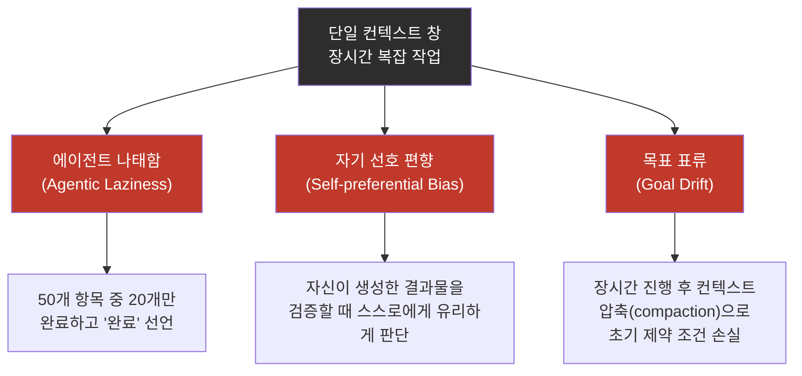

첫 번째 실패 패턴은 **에이전트 나태함(Agentic Laziness)** 이다. 보안 검토 항목이 50개인데 20개만 처리한 뒤 작업이 완료되었다고 선언하는 것처럼, 복잡하고 다단계인 작업을 중간에 멈추는 현상이다. 단일 컨텍스트 창에서 장시간 작업이 이루어질수록 이 경향이 강해진다.

두 번째는 **자기 선호 편향(Self-preferential Bias)** 이다. Claude가 자신이 생성한 결과물이나 발견 사항을 검증하거나 평가할 때, 자기 자신에 대해 유리한 판단을 내리는 경향이다. 독립된 검토자가 없는 상황에서는 특히 두드러진다.

세 번째는 **목표 표류(Goal Drift)** 이다. 매우 많은 턴(turn)을 거쳐 작업이 진행되는 동안, 특히 컨텍스트 압축(compaction) 단계를 거칠 때마다 원래 목표에서 미묘하게 벗어나는 현상이다. "X를 하지 말 것"과 같은 엣지 케이스 요구 사항이나 초기 제약 조건들이 요약 과정에서 손실될 수 있다.

다이나믹 워크플로우는 각각 독립된 컨텍스트 창을 가진 서브에이전트들에게 집중적이고 분리된 목표를 부여함으로써, 이 세 가지 실패 패턴에 구조적으로 대응한다.

---

## 4. 다이나믹 워크플로우의 작동 원리

다이나믹 워크플로우가 시작되면 다음과 같은 순서로 실행이 진행된다.

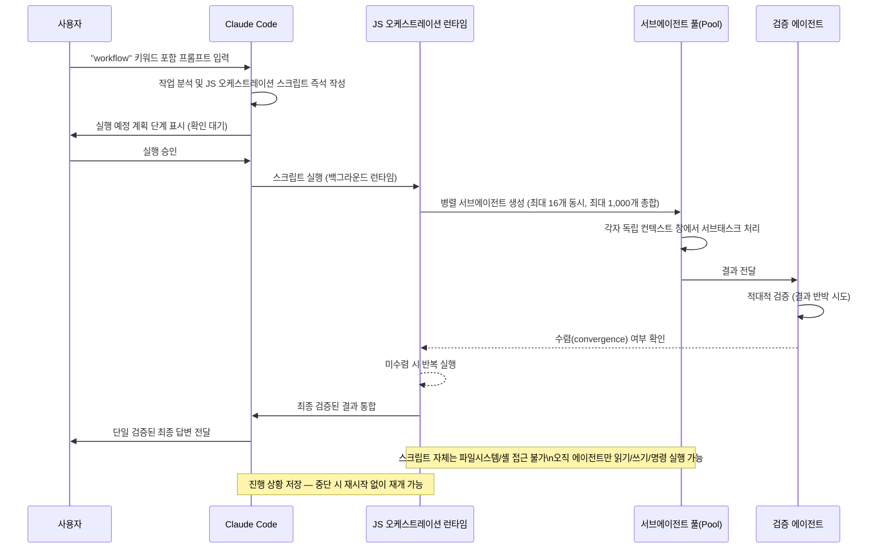

워크플로우가 작동하는 방식의 핵심은 오케스트레이션 스크립트가 코드로 존재한다는 점이다. Claude가 즉석에서 작성하는 자바스크립트 파일에는 작업 계획 전체가 담겨 있으며, 이 스크립트를 실행하는 전용 백그라운드 런타임이 있다. 스크립트 자체는 파일시스템이나 셸에 직접 접근할 수 없으며, 오직 서브에이전트들만이 읽기, 쓰기, 명령 실행을 수행할 수 있다. 이는 중요한 보안 설계 결정이다.

또한 워크플로우가 실행 중에 사용자 행동이나 터미널 종료 등으로 인해 중단되더라도, 진행 상황이 저장되어 있어 세션을 재개하면 중단 시점부터 다시 이어서 실행된다.

런타임의 하드 제한은 명확하다. 동시에 실행 가능한 에이전트 수는 최대 16개이며(CPU 코어 수가 적은 머신에서는 더 낮을 수 있다), 하나의 실행(run)에서 생성 가능한 총 에이전트 수는 최대 1,000개다. 이 두 제한은 각각 로컬 리소스를 보호하고, 루프가 걷잡을 수 없이 반복되는 상황을 방지하기 위한 것이다.

---

## 5. 핵심 API와 코딩 프리미티브

다이나믹 워크플로우는 몇 가지 특별한 자바스크립트 함수를 중심으로 서브에이전트를 생성하고 조율한다. 표준 자바스크립트 내장 객체인 JSON, Math, Array 등도 사용 가능하다.

### 5.1 agent() 함수

`agent()` 함수는 워크플로우의 기본 단위다. 하나의 서브에이전트를 생성하고 실행한다.

```javascript
// 함수 시그니처
agent(prompt, opts?): Promise<string | JsonSchema>

// 사용 예시
const bugs = await agent(
  "audit auth.ts",
  {
    schema: BugList,        // JSON Schema → 검증된 JSON 출력 보장
    model: "haiku",         // opus · sonnet · haiku. 생략 시 부모로부터 상속
    isolation: "worktree",  // "worktree"(체크아웃) 또는 "remote"
    agentType: "reviewer",  // 커스텀 / 내장 서브에이전트 유형
  }
)
```

각 파라미터의 역할은 다음과 같다.

`prompt`는 에이전트에게 전달되는 유일한 입력이며 필수 값이다. `schema`는 JSON Schema를 지정하면 에이전트의 출력이 그 스키마에 맞는 JSON으로 검증되어 반환된다. `model`은 이 에이전트에 사용할 모델을 명시하며, opus, sonnet, haiku 중 선택할 수 있고 생략하면 부모 에이전트의 모델을 상속한다. `isolation`은 에이전트가 실행될 환경으로, "worktree"는 git worktree를 체크아웃하여 격리된 환경에서 실행하고 "remote"는 원격에서 실행한다. `agentType`은 내장된 에이전트 유형을 지정하거나 커스텀 에이전트를 설정할 때 사용한다.

### 5.2 병렬 실행 프리미티브: parallel()과 pipeline()

단일 `agent()` 호출을 여러 번 조합하는 두 가지 핵심 구성 요소가 있다.

```javascript
// parallel() — 팬아웃 후 동시 실행, 배리어(barrier): 모두 완료까지 대기
const all = await parallel(
  files.map(f =>
    () => agent(f)
  )
)

// pipeline() — 각 항목이 모든 단계를 순서대로 통과, 배리어 없음
await pipeline(items,
  x => agent(draft(x)),
  d => agent(check(d))
)
```

`parallel()`은 여러 에이전트 함수 배열을 받아 모두 동시에 실행하고, **배리어(barrier)** 역할을 한다. 즉, 모든 병렬 에이전트가 완료될 때까지 기다린 뒤 다음 단계로 넘어간다. 반면 `pipeline()`은 각 항목이 지정된 모든 단계를 순서대로 통과하되, 배리어 없이 각 항목이 독립적으로 흘러간다.

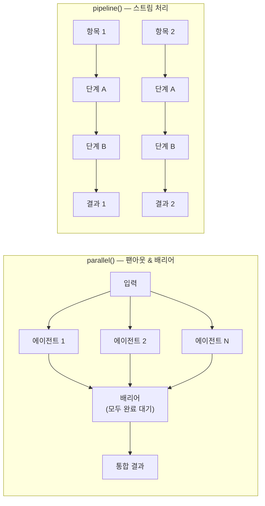

---

## 6. 6가지 워크플로우 패턴 상세 해설


다이나믹 워크플로우가 Claude가 자율적으로 구성하고 조합하는 대표적인 여섯 가지 패턴이 있다. 이 패턴들을 이해하면 언제, 어떻게 워크플로우를 활용해야 하는지 직관이 생긴다.

### 패턴 1: 분류 후 행동 (Classify-And-Act)

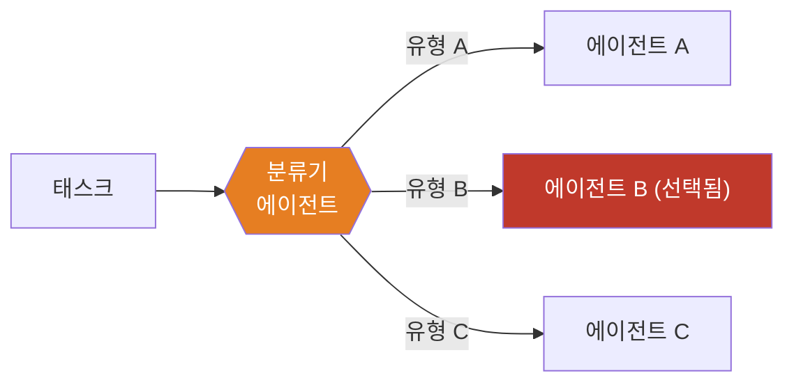

분류기 에이전트가 먼저 작업의 유형을 결정하고, 그 결과에 따라 적합한 에이전트나 동작으로 라우팅하는 패턴이다. 입력의 특성에 따라 다른 처리 경로를 선택해야 할 때 유용하다. 또는 작업 마지막에 분류기를 배치하여 출력의 유형을 결정하는 데 활용할 수도 있다.

실용적인 예로는 지원 티켓의 심각도를 분류하여 각기 다른 우선순위 에이전트로 라우팅하거나, 코드 변경의 종류(버그 수정, 기능 추가, 리팩터링)를 파악한 뒤 해당 전문 에이전트에게 맡기는 경우가 있다.

### 패턴 2: 팬아웃 후 종합 (Fanout-And-Synthesize)

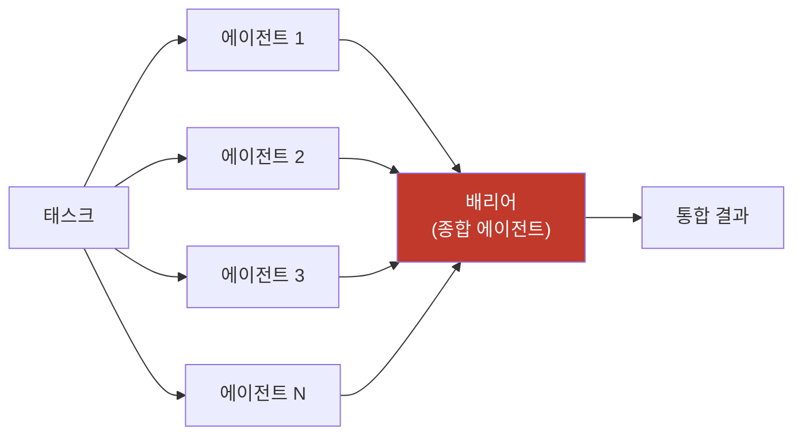

작업을 여러 개의 소규모 단계로 분할하고, 각 단계마다 독립된 에이전트를 실행한 뒤, 그 결과들을 종합하는 패턴이다. 단계의 수가 매우 많거나, 각 단계가 서로를 오염시키지 않도록 독립된 컨텍스트 창이 필요한 경우에 특히 유용하다. 종합 단계는 배리어 역할을 한다. 즉, 모든 팬아웃 에이전트가 완료되기를 기다린 뒤 구조화된 결과물들을 하나의 최종 결과로 병합한다.

### 패턴 3: 적대적 검증 (Adversarial Verification)

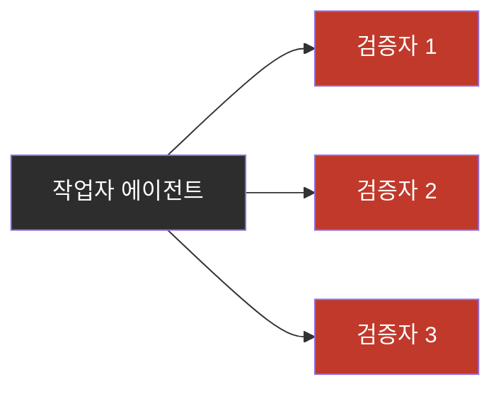

각 서브에이전트가 작업을 완료하면, 별도로 생성된 독립 에이전트가 그 결과물을 루브릭(rubric)이나 기준에 맞서 적대적으로 검증하는 패턴이다. 작업자 에이전트와 검증자 에이전트가 완전히 분리된 컨텍스트를 갖기 때문에 자기 선호 편향 문제를 구조적으로 방지한다.

### 패턴 4: 생성 후 필터링 (Generate-And-Filter)

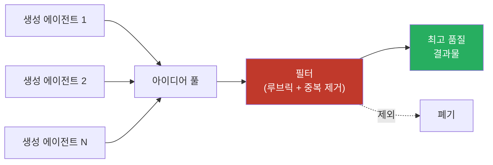

먼저 주제에 대한 다양한 아이디어를 생성하고, 그것을 루브릭이나 검증을 통해 필터링하며, 중복을 제거하고 가장 품질 높은 결과만 반환하는 패턴이다. CLI 도구의 이름 짓기, 마케팅 카피 생성, 코드 아키텍처 대안 탐색 등 창의적인 탐색 작업에 적합하다.

### 패턴 5: 토너먼트 (Tournament)

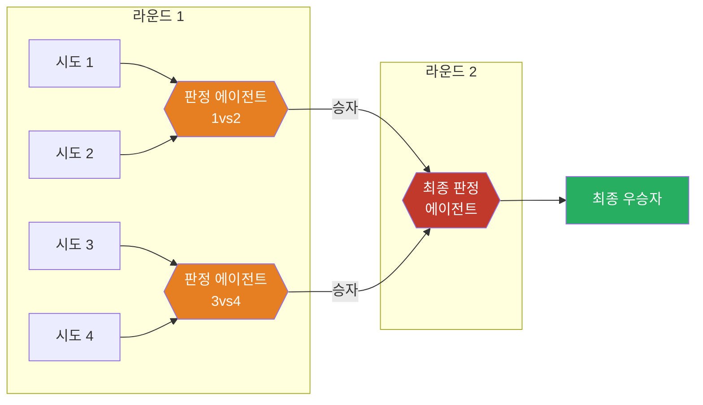

작업을 나누는 대신, 에이전트들이 같은 작업에 서로 다른 접근법으로 경쟁하게 만드는 패턴이다. N개의 에이전트가 각자 작업을 시도하고, 그 결과들이 판정 에이전트에 의해 쌍별 비교(pairwise comparison) 방식으로 평가된다. 쌍별 비교는 절대적인 점수 매기기보다 더 신뢰할 수 있는 방식이기 때문에 이 패턴이 특히 유용하다.

이 패턴은 1,000개 이상의 항목을 품질 순으로 정렬하는 경우에도 적용된다. 1,000개 항목을 단일 프롬프트로 정렬하려 하면 품질이 저하되고 컨텍스트를 초과하지만, 토너먼트 방식으로 쌍별 비교 에이전트를 구성하면 각 비교가 독립된 에이전트로 이루어지므로 결정론적 루프가 대괄호(bracket)를 유지하고 현재 순서만 컨텍스트에 남는다.

### 패턴 6: 완료까지 루프 (Loop Until Done)

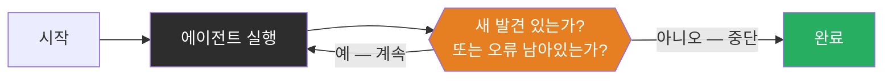

작업의 양이 미리 알 수 없는 경우, 고정된 횟수가 아니라 중단 조건이 충족될 때까지(새로운 발견 없음, 또는 로그에 더 이상 오류 없음 등) 에이전트 생성을 반복하는 패턴이다. 불규칙하게 실패하는 테스트를 재현하거나, 코드베이스 전체에서 특정 패턴을 지속적으로 탐색하는 작업에 적합하다.

---

## 7. 실제 활용 분야 10가지

다이나믹 워크플로우가 빛을 발하는 대표적인 활용 분야는 다음과 같다.

### 7.1 마이그레이션과 리팩터링 (Migrations & Refactors)

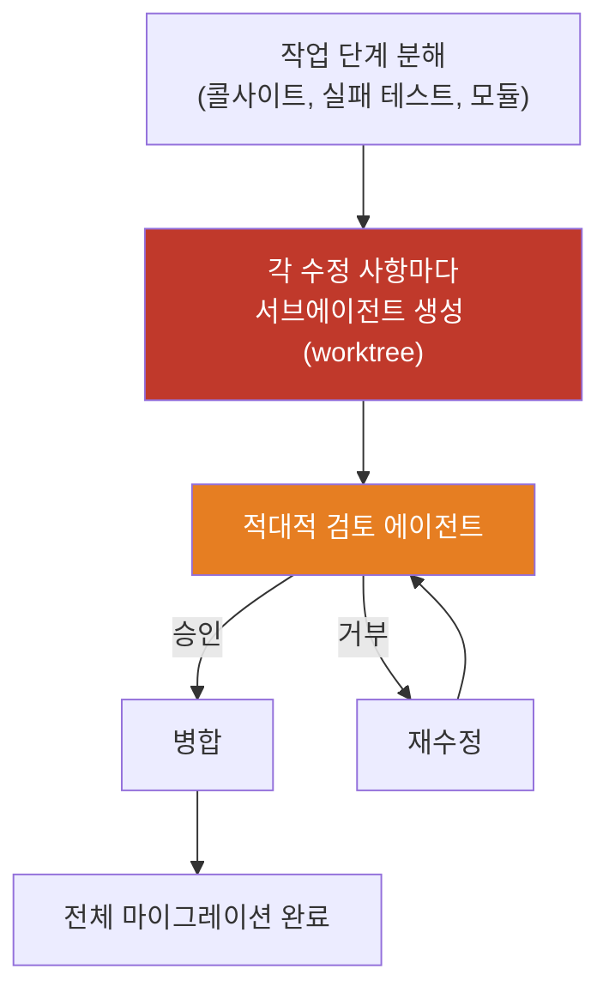

대규모 코드베이스 마이그레이션에서 워크플로우는 작업을 단계별로 분해하고, 각 수정 사항마다 worktree에서 서브에이전트를 생성하여 수정을 수행한 뒤 별도의 적대적 검토 에이전트가 리뷰하고 병합하는 방식으로 동작한다. 병렬화를 최대화하려면 에이전트가 리소스 집약적인 명령을 사용하지 않도록 프롬프트에 명시하는 것이 좋다.

### 7.2 딥 리서치 (Deep Research)

Claude Code에는 `/deep-research` 스킬이 내장되어 있으며, 이것이 다이나믹 워크플로우의 대표적인 번들 워크플로우다. 이 워크플로우는 웹 검색을 팬아웃 방식으로 병렬 수행하고, 소스를 가져오며, 그 주장들을 적대적으로 검증한 뒤, 인용이 포함된 보고서를 종합한다. 표준 검색 도구가 첫 번째 그럴듯한 답을 수용하는 것과 달리, `/deep-research`는 자신의 발견을 반박하도록 명시적으로 설계되어 있다. 검색을 여러 각도에서 팬아웃하고, 소스들을 교차 검증하며, 각 주장에 내부 투표를 수행하고, 적대적 검증을 통과한 주장만 포함한다.

단순히 웹 검색뿐만 아니라, Slack의 특정 채널에서 상태 보고서를 취합하거나 코드베이스를 심층 탐색하여 특정 기능이 어떻게 동작하는지 조사하는 용도로도 활용할 수 있다.

### 7.3 딥 검증 (Deep Verification)

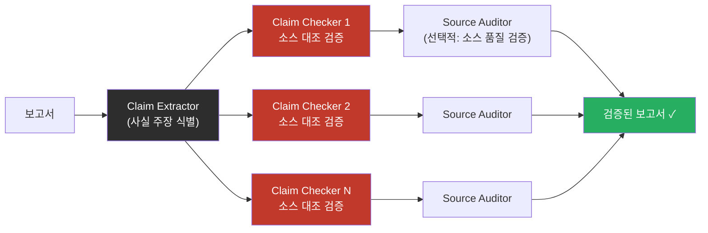

블로그 포스트, 기술 문서, 보고서 등에 포함된 모든 사실적 주장을 검증하고 싶을 때 활용하는 패턴이다. 하나의 에이전트가 모든 사실적 주장을 식별하고, 각 주장마다 독립된 Claim Checker 에이전트가 소스에 대조하여 검증한다. 추가적으로 Source Auditor 에이전트가 소스 자체의 품질을 검증하는 선택적 레이어를 추가할 수 있다.

### 7.4 대규모 정렬/순위 매기기 (Sorting)

1,000개 이상의 항목을 정성적인 기준으로 정렬하는 경우, 단일 프롬프트로 처리하면 품질이 저하되고 컨텍스트를 초과한다. 토너먼트 방식을 사용하면 쌍별 비교 에이전트가 대괄호를 처리하고 각 비교가 독립된 에이전트로 이루어지므로 정확도를 유지할 수 있다.

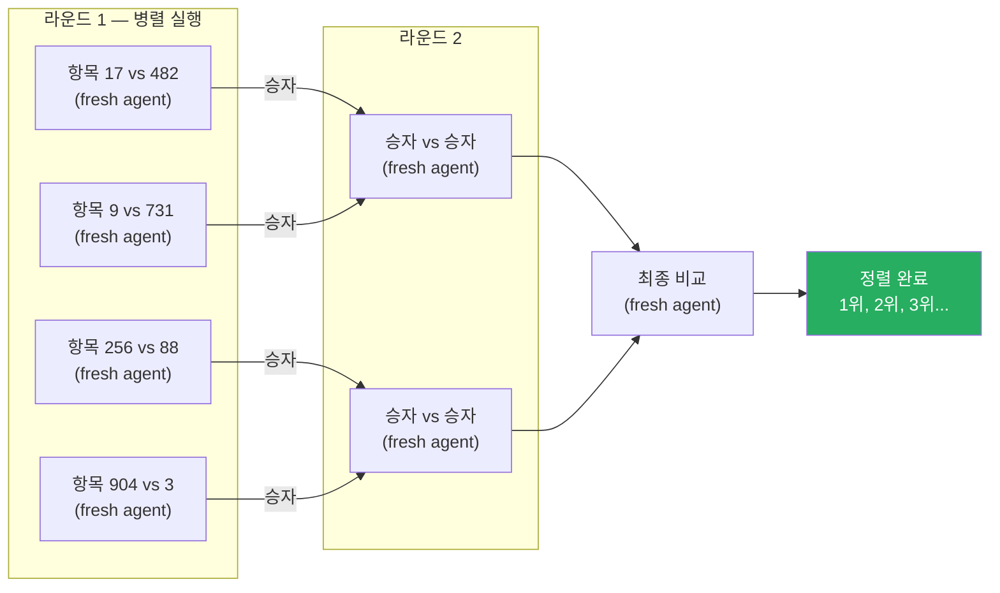

### 7.5 규칙 준수 검증 (Rule Adherence)

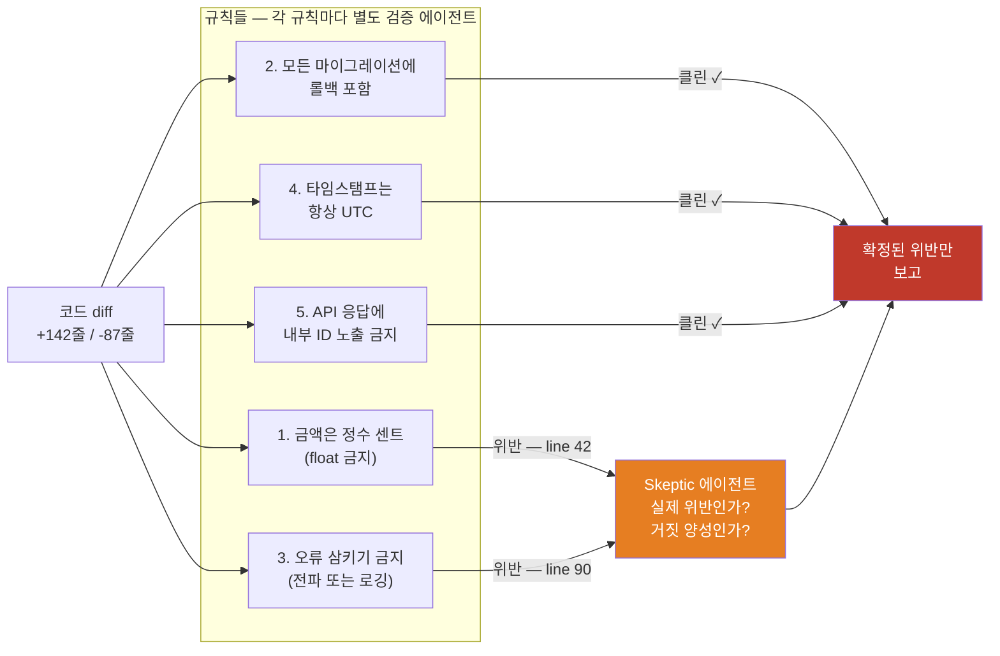


CLAUDE.md에 규칙을 아무리 잘 정의해도 Claude가 놓치는 경우가 있다. 이 패턴에서는 각 규칙마다 별도의 검증 에이전트가 해당 규칙 위반 여부만 집중적으로 검사한다. 검증 에이전트들이 플래그를 올린 항목은 다시 Skeptic 에이전트가 검토하여, 실제 위반인지 거짓 양성인지 최종 확인한다. 이 역방향 접근법도 유효하다. 최근 세션과 코드 리뷰 코멘트에서 반복적으로 교정한 내용을 마이닝하고, 병렬 에이전트로 클러스터링하며, 각 후보를 적대적으로 검증한 뒤("이 규칙이 실제 실수를 방지했을까?") 생존한 것들을 CLAUDE.md에 정제하는 것이다.

### 7.6 근본 원인 조사 (Root-Cause Investigation)

버그 디버깅은 여러 독립적인 가설을 세우고 검증할 때 가장 효과적이다. 하나의 컨텍스트 창만 사용하면 자기 선호 편향이 발생할 수 있다. 워크플로우는 로그, 파일, 데이터 등 분리된 증거로부터 각기 독립된 에이전트가 가설을 생성하도록 구조적으로 강제하고, 각 가설은 검증자 및 반박자 패널 앞에 서게 된다.

이는 코드에만 국한되지 않는다. "왜 3월에 매출이 떨어졌는가?"(영업), "왜 이 파이프라인이 실패했는가?"(데이터 엔지니어링), 또는 어떤 사후 분석(post-mortem) 작업에도 동일한 구조가 적용된다.

### 7.7 대규모 트리아지 (Triage at Scale)

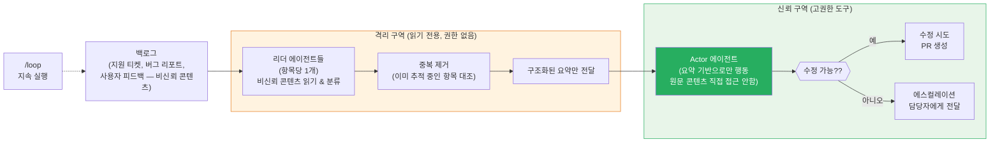

모든 팀에는 인간이 모두 처리할 수 없는 지원 큐, 버그 리포트, 백로그가 있다. 트리아지 워크플로우는 각 항목을 분류하고, 이미 추적 중인 항목과 중복을 제거하며, 수정 가능하면 수정을 시도하거나 담당자에게 에스컬레이션한다.

특히 중요한 점은 **격리(Quarantine) 설계**다. 신뢰할 수 없는 공개 콘텐츠를 읽는 에이전트는 읽기 전용 도구만 갖고 고권한 행동을 수행할 수 없다. 정보에 행동하는 에이전트는 원문 콘텐츠가 아닌 구조화된 요약만 받는다. 이는 프롬프트 인젝션 공격을 방지하는 보안 설계다. `/loop`과 결합하면 이 워크플로우를 지속적으로 실행할 수 있다.

### 7.8 탐색과 취향 판단 (Exploration & Taste)

솔루션의 다양한 접근법을 탐색하고, 특히 디자인이나 네이밍처럼 취향 기반의 판단이 필요할 때 루브릭으로 평가하는 경우에 유용하다. 다양한 솔루션을 탐색하도록 요청하고, 검토 에이전트에게 좋은 솔루션이 갖춰야 할 기준(rubric)을 제공한다.

### 7.9 경량 평가/Evals (Evals)

특정 작업에 대한 경량 평가를 수행하기 위해, worktree에서 별도의 에이전트들을 실행하고 비교 에이전트로 특정 출력물을 루브릭에 맞게 비교하고 채점한다. 예를 들어 직접 만든 스킬(Skill)이 특정 기준에 맞게 동작하는지 평가하고 개선하는 데 활용할 수 있다.

### 7.10 모델 및 인텔리전스 라우팅 (Model & Intelligence Routing)

작업 유형에 맞게 조율된 분류기 에이전트를 만들어 어떤 모델을 사용할지 결정하게 하는 패턴이다. 예를 들어 "auth 모듈이 어떻게 동작하는지 설명해 줘"라는 작업에서 최적 모델은 auth 모듈의 파일 수와 코드베이스 구조에 따라 달라진다. 분류기 에이전트가 이 조사를 먼저 수행하고, 예상 복잡도에 따라 Sonnet과 Opus 중 어느 것이 적합한지 라우팅한다.

---

## 8. 워크플로우 활성화 및 사용 방법

### 8.1 기본 활성화 방법

다이나믹 워크플로우를 시작하는 방법은 두 가지다.

첫 번째는 프롬프트에 **"workflow"라는 단어를 포함**하는 것이다. 이 트리거 단어를 감지하면 Claude가 자동으로 워크플로우 생성을 시도한다.

두 번째는 **`ultracode` 설정을 활성화**하는 것이다. `/effort ultracode` 명령으로 접근할 수 있으며, effort 수준을 `xhigh`로 설정하면서 Claude가 언제 워크플로우를 사용할지 자동으로 판단하게 한다. ultracode는 특정 모델 계층이나 단순 effort 수준이 아니라 "Claude Code 설정"으로, `xhigh` 추론 + 자동 오케스트레이션을 결합한 세션 한정 설정이다. 세션이 종료되면 초기화되므로 무거운 작업이 완료되면 `/effort high`로 되돌리는 것이 토큰 비용 절감에 도움이 된다.

단순 코딩 작업에는 ultracode 없이 기존 방식이 더 효율적이다. "5명의 리뷰어 패널이 정말 필요한가?"를 자문해보는 것이 좋다.

### 8.2 Auto Mode와의 조합

Anthropic은 다이나믹 워크플로우를 사용할 때 **Auto Mode(자동 모드)를 함께 활성화**할 것을 강력히 권장한다. 수백 개의 서브에이전트를 실행하는 워크플로우에서 매번 권한 승인 프롬프트가 뜨면 병렬 처리가 불가능하기 때문이다. Auto Mode는 AI 분류기가 위험해 보이는 행동을 차단하면서 서브에이전트들이 중단 없이 실행될 수 있게 한다.

워크플로우가 세션에서 처음 실행될 때, Claude Code는 실행 예정인 내용을 사용자에게 먼저 표시하고 확인을 기다린다.

### 8.3 /goal과 /loop와의 조합

반복 가능한 워크플로우(트리아지, 리서치, 검증 등)에는 `/goal`과 `/loop`을 함께 사용하면 효과적이다. `/loop`는 워크플로우를 정기적으로 반복 실행하게 하고, `/goal`은 명확한 완료 조건을 설정한다.

### 8.4 토큰 사용량 예산 설정

프롬프트에 명시적인 토큰 예산을 지정할 수 있다. 예를 들어 "10k 토큰을 사용해서 이 작업을 처리해줘"라고 하면 해당 한도가 캡으로 설정된다. 워크플로우는 처음에는 범위가 잘 정의된 작은 작업으로 시작하여 사용 패턴을 파악한 뒤 대규모 작업으로 확장하는 것이 권장된다.

---

## 9. 토큰 사용량과 비용 고려사항

다이나믹 워크플로우는 일반 Claude Code 세션보다 **훨씬 더 많은 토큰을 소비**한다. 이는 여러 독립 에이전트가 각각 자체 컨텍스트를 갖고 실행되기 때문이다.

터미널 UI에서 확인할 수 있는 워크플로우 실행 통계의 예시는 다음과 같다.

```
Dynamic workflows
1 running · 2 completed

> ✓ review-changes   · 14 agents  · 482k tok  · 6m 12s
  ○ find-flaky-tests · 6 agents   · 121k tok  · 1m 48s
  ✓ deep-research    · 22 agents  · 1.1M tok  · 11m 3s

↑/↓ select · enter view · s save · esc close
```

`deep-research` 워크플로우 하나에 22개의 에이전트가 사용되었고 1.1M 토큰이 소비된 것을 볼 수 있다. 이 비용을 정당화하려면 작업이 실제로 워크플로우의 병렬 구조와 적대적 검증으로부터 이득을 얻어야 한다.

일반적인 코딩 작업, 단일 파일 수정, 짧은 Q&A 등에는 워크플로우가 필요하지 않으며 오히려 낭비가 된다. 작업이 계획 2~3단계로 Claude가 머릿속에 담을 수 있을 정도라면 서브에이전트나 스킬을 사용하는 것이 더 효율적이다. 계획이 코드가 되어야 하고, 반복 가능하며, 수백 개의 독립 작업으로 확장될 때 비로소 워크플로우를 사용할 시점이다.

---

## 10. 워크플로우 저장 및 공유

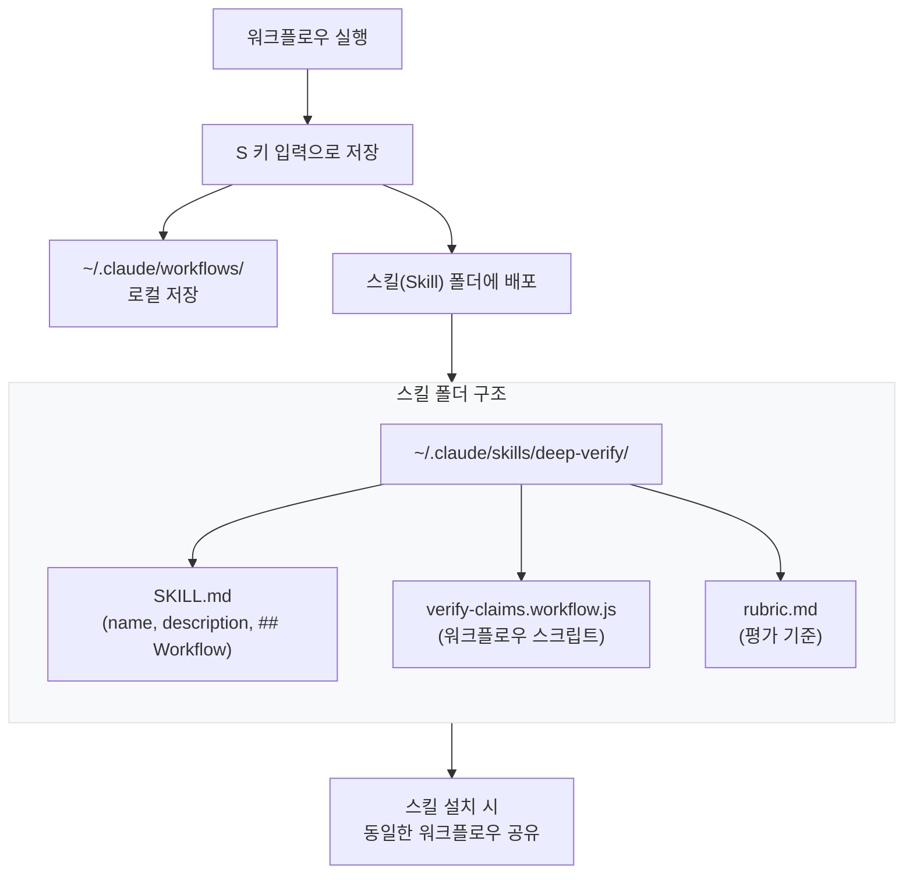

워크플로우는 실행 중에 워크플로우 메뉴에서 **"S" 키를 눌러 저장**할 수 있다. 저장된 워크플로우는 `~/.claude/workflows`에 체크인하거나 스킬(Skill)을 통해 배포할 수 있다.

스킬을 통해 공유하려면, 자바스크립트 워크플로우 파일을 스킬 폴더 안에 넣고 `SKILL.md`에서 참조하면 된다. `SKILL.md` 예시는 다음과 같다.

```
---
name: deep-verify
description: Verify every claim in a report
---

## Workflow
Run ./verify-claims.workflow.js to check
each claim with its own subagent.
```

스킬 폴더를 공유하면 해당 스킬을 설치하는 모든 사람이 동일한 워크플로우를 실행할 수 있다. 더 높은 유연성을 원한다면 스킬 내의 워크플로우를 그대로 실행해야 할 스크립트가 아닌 **템플릿**으로 취급하도록 Claude에게 프롬프트할 수도 있다.

---

## 11. 주요 제약 조건과 보안 구조

다이나믹 워크플로우에는 명확한 기술적 제약과 보안 설계 결정이 있다.

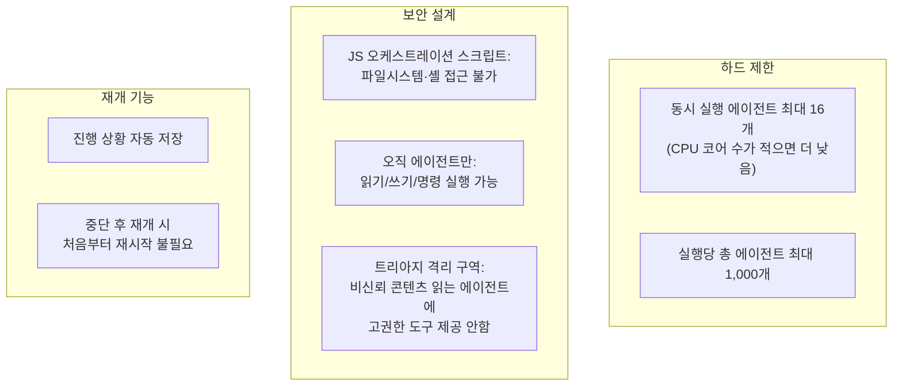

가장 중요한 보안 설계 원칙은 **스크립트와 에이전트의 권한 분리**다. Claude가 즉석에서 작성하는 자바스크립트 오케스트레이션 스크립트 자체는 파일시스템이나 셸에 직접 접근할 수 없다. 파일 읽기/쓰기와 셸 명령 실행은 오직 서브에이전트만이 수행할 수 있다. 이는 오케스트레이션 레이어와 실행 레이어를 명확히 분리하여 스크립트 레벨에서의 임의 코드 실행을 방지한다.

트리아지 패턴에서의 격리 구역(Quarantine) 설계도 중요한 보안 고려사항이다. 비신뢰 공개 콘텐츠(지원 티켓, 버그 리포트 등)를 읽는 에이전트에게는 읽기 전용 도구만 주어지고 고권한 행동을 수행하는 에이전트에게는 원문이 아닌 정제된 구조화 요약만 전달된다. 이 설계는 악의적인 사용자가 지원 티켓에 프롬프트 인젝션 공격을 심어놓았더라도, 그 콘텐츠를 읽는 에이전트가 고권한 행동을 직접 실행할 수 없도록 막는다.

---

## 12. 실제 사례: Bun 프로젝트 대규모 리라이팅

다이나믹 워크플로우의 가장 주목할 만한 실증 사례는 **Bun 프로젝트의 Zig → Rust 포팅**이다.

Bun은 Claude Code를 수백만 사용자에게 배포하는 자바스크립트 런타임으로, Bun의 창시자 Jarred Sumner는 약 100만 줄 규모의 Zig 코드를 Rust로 이전해야 했다. 단순한 재작성이 아닌, 기존 테스트 스위트가 통과해야 하는 충실한 포팅이었다. 이전에는 팀 단위로 분기에 걸쳐 계획해야 했던 규모의 작업이었다.

Jarred Sumner는 다이나믹 워크플로우를 활용하여 다음과 같은 방식으로 이 작업을 처리했다.

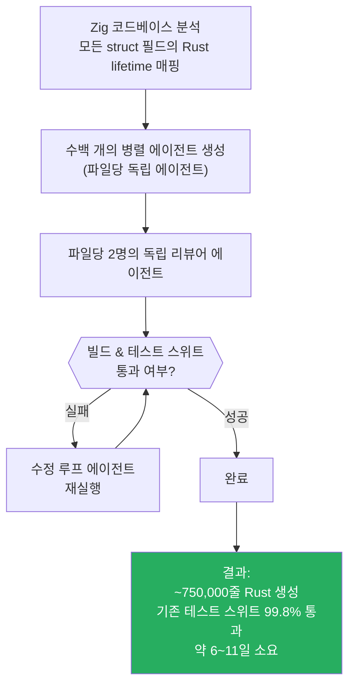

결과는 약 75만 줄의 Rust 코드 생성, 기존 테스트 스위트 99.8% 통과, 소요 기간 약 6~11일이었다. 여러 보고서에서 6일 또는 11일로 언급되는데, 이는 측정 기준(첫 커밋부터 머지까지 등)에 따라 달라진다. 아직 프로덕션에 반영된 것은 아니며, Jarred Sumner가 자신의 X 스레드에 상세한 과정을 공개했다.

이 사례가 중요한 이유는 다이나믹 워크플로우가 단지 코드 생성 속도를 높이는 것이 아니라, 작업을 **계획하는 방식 자체를 바꾼다**는 점을 보여주기 때문이다. 분기 단위로 팀이 해야 할 일을 며칠 안에 처리할 수 있다는 것은 소프트웨어 엔지니어링의 계획 지평선에 근본적인 변화를 가져온다.

---

## 13. 정적 워크플로우와 다이나믹 워크플로우의 비교

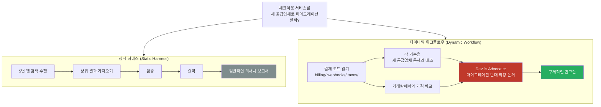

동일한 질문에 대해 정적 하네스와 다이나믹 워크플로우가 어떻게 다른 결과를 도출하는지 비교해보면 차이가 명확하다.

정적 하네스는 웹 검색 → 결과 수집 → 검증 → 요약이라는 고정된 절차를 따르기 때문에, 작업의 특수성과 무관하게 동일한 파이프라인을 통과한다. 결과는 일반적인 리서치 보고서다.

다이나믹 워크플로우는 먼저 실제 코드베이스를 읽고, 각 기능을 새 공급업체 문서와 비교하며, 현재 거래량에서의 가격을 산출하고, 심지어 마이그레이션에 반대하는 최강의 논거를 찾는 "Devil's Advocate" 에이전트까지 포함시킨다. 결과는 해당 조직의 상황에 맞춘 구체적인 권고안이다.

정적 워크플로우가 모든 엣지 케이스에 작동해야 하기 때문에 더 일반적일 수밖에 없는 반면, 다이나믹 워크플로우는 Claude Opus 4.8의 지능을 활용하여 해당 특정 사용 사례에 맞는 맞춤형 하네스를 직접 설계한다.

이 차이는 또한 다이나믹 워크플로우가 기술적 작업보다 **비기술적 작업에서 오히려 더 유용한 경우**가 많다는 점을 설명한다. 투자자, 고객, 경쟁사 관점에서 사업 계획을 검토하거나, 수십 개의 이력서를 특정 직무 기준으로 평가하거나, Slack의 인시던트 채널에서 반복되는 근본 원인을 찾는 작업 등이 그 예다.

---

## 14. 프롬프트 예시 모음

다이나믹 워크플로우의 가능성을 탐색하는 데 활용할 수 있는 프롬프트 예시들이다. 이 예시들은 공식 블로그 원문에서 제시된 것들이다.

**소프트웨어 엔지니어링:**
- "이 테스트가 50번 중 1번 정도 실패해. 워크플로우를 설정해서 재현하고, 가설을 세운 다음 worktrees에서 적대적으로 검증해 /goal 하나의 가설이 작동할 때까지 멈추지 마."
- "워크플로우를 사용해서 User 모델을 모든 곳에서 Account로 이름을 바꿔."

**리서치 및 분석:**
- "워크플로우를 사용해서 지난 6개월간 Slack #incidents 채널을 파고들어서 아무도 티켓을 제출하지 않은 반복되는 근본 원인을 찾아."
- "내 블로그 포스트 초안을 보고 워크플로우로 코드베이스에 대한 모든 기술적 주장을 검증해, 틀린 내용을 배포하고 싶지 않아."

**창의적 작업:**
- "이 CLI 도구의 이름이 필요해. 워크플로우로 여러 옵션을 브레인스토밍하고 토너먼트를 열어서 상위 3개를 골라."
- "내 사업 계획을 가지고 투자자, 고객, 경쟁사 관점에서 서로 다른 에이전트들이 뜯어보는 워크플로우를 실행해."

**HR 및 팀 관리:**
- "80개의 이력서 폴더가 있어. 워크플로우로 백엔드 직책에 맞게 순위를 매기고 상위 10개를 다시 확인해. AskUserQuestion 도구로 루브릭에 대한 내 의견도 물어봐."

**지식 관리:**
- "내 최근 50개 세션을 분석해서 내가 반복적으로 교정하는 사항을 찾아내고, 반복되는 것들을 CLAUDE.md 규칙으로 만들어."

---

## 15. 결론 및 전망

Claude Code 다이나믹 워크플로우는 단순한 기능 업데이트가 아니라 **Claude Code가 단일 어시스턴트에서 자율적으로 조직화된 에이전트 집단으로 격상되는 아키텍처적 전환**이다. 프롬프트 하나에 수백 개의 에이전트가 병렬로 사고하고, 서로의 결과를 반박하며, 수렴될 때까지 반복한다.

현재 Research Preview 상태로 사양이 변경될 수 있다. 동시 실행 에이전트 수(최대 16개)와 실행당 총 에이전트 수(최대 1,000개)는 현재 기준이며, 향후 조정될 수 있다.

가장 중요한 실용적 원칙은 **"모든 작업에 워크플로우가 필요한 것은 아니다"** 는 점이다. 워크플로우는 대규모 병렬 구조, 독립적 검증, 또는 결정론적 완료 보증이 필요한 작업에서 비로소 그 가치를 발휘한다. 일상적인 코딩 작업에서 5명의 리뷰어 패널을 만드는 것은 과잉이다. 그러나 수백 개의 파일에 걸친 마이그레이션, 철저한 보안 감사, 사실 검증이 필요한 리포트 작성, 또는 수천 개 항목의 품질 순위 매기기와 같은 작업에서는 다이나믹 워크플로우가 이전에는 불가능하거나 지나치게 비효율적이었던 작업을 현실적인 시간 안에 완료할 수 있게 한다.

Anthropic 기술 스태프인 Thariq Shihipar와 Sid Bidasaria는 이 기능을 "시작점"으로 표현했다. 최선의 활용 방법은 아직 많이 발견되지 않았고, 커뮤니티가 함께 탐색해나가는 영역이다.

---

## 참고 자료

- Anthropic 공식 블로그: [Introducing dynamic workflows in Claude Code](https://claude.com/blog/introducing-dynamic-workflows-in-claude-code) (2026-05-28)
- X(트위터) 원문: [@trq212 — A harness for every task](https://x.com/trq212/status/2061907337154367865) (2026-05-28)
- InfoQ: [Claude Code Adds Dynamic Workflows for Parallel Agent Coordination](https://www.infoq.com/news/2026/06/dynamic-workflows-claude-code/) (2026-06-02)
- Medium ILLUMINATION: [Claude Code's Dynamic Workflows: The AI agent architecture that just rewrote 750,000 lines of code in 6 days](https://medium.com/illumination/claude-codes-dynamic-workflows-the-ai-agent-architecture-that-just-rewrote-750-000-lines-of-code-d605a1d9b6d4) (2026-05-31)
- MarkTechPost: [Anthropic Ships Claude Opus 4.8 Alongside Dynamic Workflows](https://www.marktechpost.com/2026/05/28/anthropic-ships-claude-opus-4-8-alongside-dynamic-workflows-and-cheaper-fast-mode-with-workflows-capped-at-1000-subagents/) (2026-05-28)
- EdTech Innovation Hub: [Anthropic releases Claude Opus 4.8 for coding agents](https://www.edtechinnovationhub.com/news/anthropic-pushes-claude-opus-48-beyond-code-completion-with-dynamic-workflows) (2026-06-02)
- Pasquale Pillitteri: [Dynamic Workflows in Claude Code: Research Preview with Up to 1,000 Subagents](https://pasqualepillitteri.it/en/news/3663/claude-code-dynamic-workflows-anthropic-research-preview) (2026-06-03)

---

#claude-code5 #dynamic-workflows3 #anthropic8 #multi-agent5 #ai-agent6 #LLM-orchestration3 #agentic-ai4
