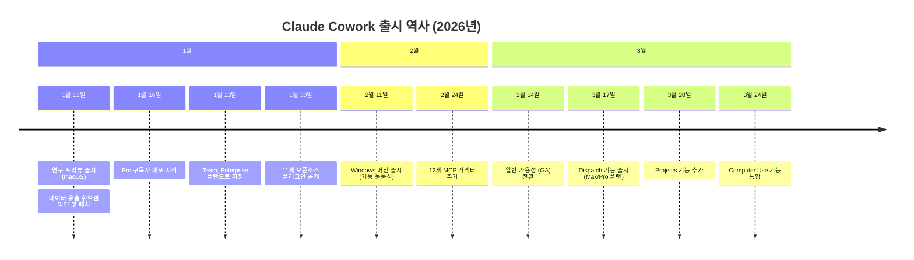
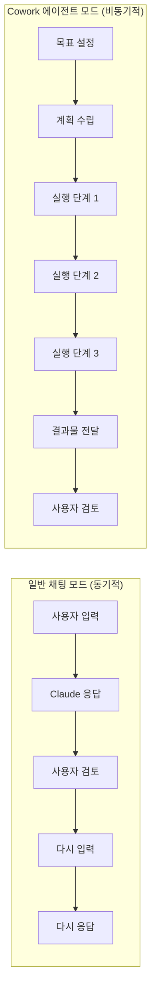
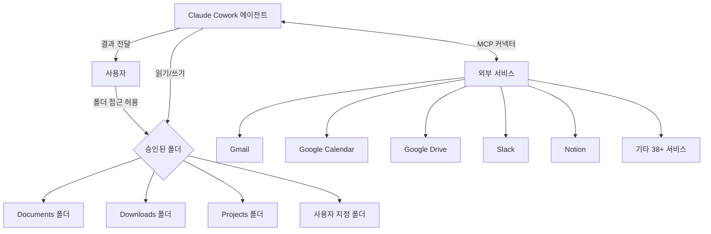
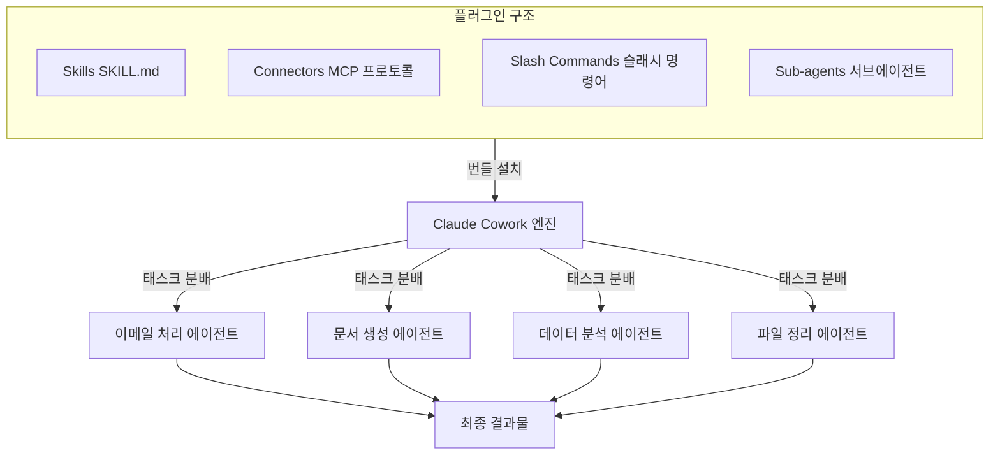
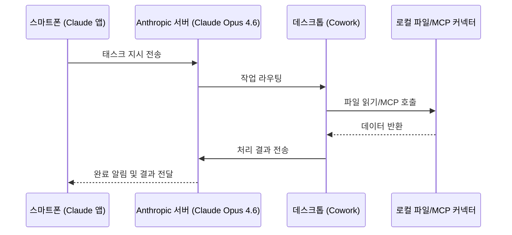
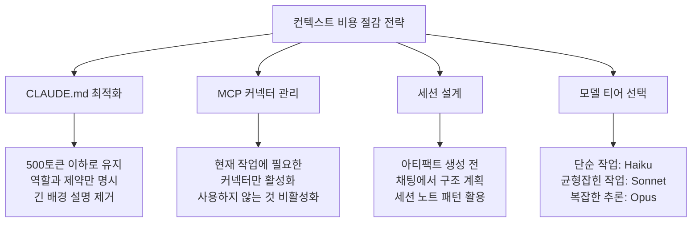
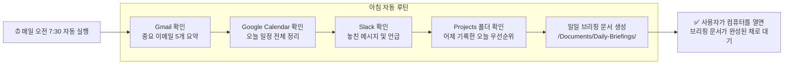
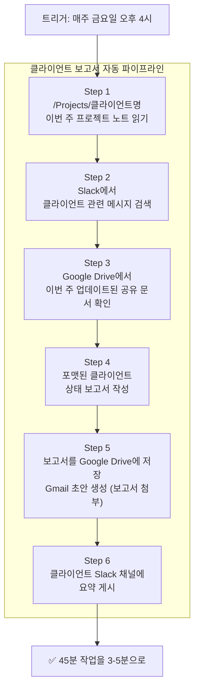

> **작성 기준**: 2026년 6월 3일 기준 공개 정보 및 Anthropic 공식 발표 내용을 토대로 작성되었습니다.

---

## 목차

1. [들어가며: 대부분의 사람이 모르는 Claude의 또 다른 얼굴](#1-들어가며)
2. [Claude Cowork의 탄생: Claude Code에서 모든 사람에게로](#2-탄생-배경)
3. [핵심 철학: "시스템이 스스로 프롬프트하게 만들어라"](#3-핵심-철학)
4. [Claude Cowork의 아키텍처: 어떻게 작동하는가](#4-아키텍처)
5. [MCP 커넥터와 플러그인 생태계](#5-mcp-커넥터와-플러그인)
6. [Dispatch: 스마트폰으로 데스크톱을 원격 제어하다](#6-dispatch-기능)
7. [예약 태스크: 자는 동안에도 일하는 Claude](#7-예약-태스크)
8. [CLAUDE.md와 컨텍스트 효율성: 보이지 않는 비용](#8-claudemd와-컨텍스트-효율성)
9. [14일 자동화 완성 플랜: Khairallah의 단계별 가이드 분석](#9-14일-자동화-플랜)
10. [실전 자동화 파이프라인 구축 전략](#10-자동화-파이프라인-전략)
11. [보안과 한계: 솔직한 평가](#11-보안과-한계)
12. [Cowork vs Claude Code: 무엇이 다른가](#12-cowork-vs-claude-code)
13. [결론: 챗봇을 넘어 디지털 직원으로](#13-결론)

---

## 1. 들어가며

2026년 현재, 많은 사람들이 Claude를 채팅 창에서만 사용하고 있다. 질문하고, 답을 받고, 필요하면 다시 질문하는 방식이다. 그런데 Anthropic이 만들어둔, 그리고 대부분의 사람들이 아직 발견하지 못한 다른 차원의 도구가 있다. 바로 **Claude Cowork**다.

X(구 트위터)의 AI 전문가 Khairallah AL-Awady([@eng_khairallah1](https://x.com/eng_khairallah1/status/2061735480862150850))는 2026년 6월, Cowork를 "2026년 가장 저평가된 AI 기능"이라고 부르며 14일 완성 자동화 플랜을 공개했다. 같은 날 또 다른 [게시물](https://x.com/eng_khairallah1/status/2061821319034143172)에서는 한 Anthropic 엔지니어의 말을 인용했다.

> *"당신은 Claude에게 프롬프트를 입력하는 것이 목적이 아닙니다. 당신의 목적은 스스로 프롬프트하는 시스템을 구축하는 것이어야 합니다."*

이 두 문장이 현재 AI 생산성 도구의 진화 방향을 압축적으로 담고 있다. 사용자가 매번 명령을 내리는 것이 아니라, 한 번 설계해놓으면 스스로 작동하는 자율 시스템을 만드는 것. Claude Cowork는 바로 그 개념을 코딩 없이도 실현할 수 있게 해주는 도구다.

---

## 2. Claude Cowork의 탄생: Claude Code에서 모든 사람에게로

### 2.1 탄생 배경

Claude Cowork의 탄생에는 흥미로운 관찰이 있었다. Anthropic의 개발자 도구인 Claude Code는 원래 소프트웨어 엔지니어들이 터미널에서 코드를 작성하고 테스트하기 위한 CLI(Command-Line Interface) 도구로 만들어졌다. 그런데 실제 사용 패턴을 분석해보니, 개발자들이 Claude Code를 단순한 코딩 이상의 목적으로 활용하고 있었다. 로컬 파일 시스템에서 문서를 정리하고, 스프레드시트를 생성하고, 회의 노트에서 보고서를 만드는 등 다양한 지식 업무에 적용하고 있었던 것이다.

Anthropic은 이 관찰에서 기회를 포착했다. "Claude Code의 강력함을 개발자가 아닌 일반 지식 근로자에게도 제공할 수 있다면?" — 그 질문에서 Claude Cowork가 탄생했다.

### 2.2 출시 타임라인

Anthropic이 공개한 내용에 따르면, Cowork는 2026년 1월 연구 프리뷰 형태로 처음 소개되었으며, Claude Code의 에이전트 워크플로우를 개발자가 아닌 더 넓은 범위의 지식 근로자들에게 제공하는 것이 목표였다. Anthropic은 1월 16일에 Pro 구독자에게 Cowork를 출시한 뒤, 1월 23일에는 Team과 Enterprise 플랜으로 가용성을 확장했다.

이후 Anthropic은 2026년 3월 14일에 Claude Cowork를 프리뷰에서 일반 가용성 단계로 전환했으며, 새로운 역할 기반 접근 제어와 세분화된 MCP 권한을 함께 선보였다.

---

## 3. 핵심 철학: "시스템이 스스로 프롬프트하게 만들어라"

### 3.1 패러다임의 전환

Claude를 채팅 창에서 사용하는 방식은 근본적으로 동기적(synchronous)이다. 사용자가 입력하고, Claude가 응답하고, 사용자가 다시 입력한다. 이 방식에서는 사용자가 반드시 그 자리에 있어야 한다. 이것이 대부분의 사람들이 Claude를 사용하는 방법이고, 동시에 Claude 활용 가치의 극히 일부만을 끌어내는 방법이기도 하다.

Cowork가 제안하는 패러다임은 완전히 다르다. 목표를 한 번 설정해놓으면, 시스템이 스스로 판단하고 실행한다. 사용자는 결과물만 확인하면 된다. 이것이 Anthropic 엔지니어가 "시스템이 스스로 프롬프트하게 만들어라"고 말한 의미다.

### 3.2 챗봇과 에이전트의 근본적 차이

Cowork는 사용자가 목표를 정의하면 Claude가 그 목표에 도달하는 방법을 스스로 파악하는 방식으로 작동한다. 일반 채팅에서 Claude는 메시지에 응답하지만 파일에 직접 접근하지 못한다. Cowork에서는 승인된 폴더에 대한 접근 권한을 부여하면 Claude가 해당 위치의 파일을 직접 읽고, 편집하고, 생성한다.

### 3.3 "팀을 운영하는 것"의 의미

Khairallah의 글에서 언급된 핵심 메시지는 이렇다. "채팅 창에서 한 번도 벗어난 적이 없다면, 당신은 하나의 에이전트를 사용할 수 있는 상황에서 하나만 사용하고 있는 것이다." 즉, Cowork를 활용하면 파일 정리 에이전트, 이메일 요약 에이전트, 보고서 작성 에이전트 등이 각자의 역할을 수행하는 병렬 구조를 만들 수 있다.

---

## 4. Claude Cowork의 아키텍처: 어떻게 작동하는가

### 4.1 기술적 기반

Claude Cowork는 Claude Code와 동일한 컴퓨터 사용(Computer Use) 역량을 공유한다. Anthropic이 개발자들이 Claude Code를 코딩 이외의 작업, 특히 로컬 파일 시스템을 다루는 비코딩 업무에도 활발히 적용한다는 사실을 인식한 뒤, Claude Desktop 앱 안에 보다 사용자 친화적인 인터페이스로 Cowork를 탑재했다.

처리 방식에 대해 알아두어야 할 중요한 기술적 사실이 있다. Cowork는 인터넷 연결이 필요한데, AI 모델이 Anthropic의 서버에서 실행되기 때문이다. 파일의 읽기와 쓰기는 로컬에서 이루어지지만, 실제 처리는 클라우드에서 진행된다.

### 4.2 샌드박스 폴더 모델

Cowork의 보안 설계는 샌드박스 방식을 따른다. 사용자가 명시적으로 접근을 허용한 폴더에 한해서만 Claude가 파일을 읽고 쓸 수 있다. 이 방식은 Claude가 무제한으로 시스템에 접근하는 상황을 방지한다.

Anthropic은 사용자가 어떤 폴더와 커넥터에 Claude가 접근할 수 있는지 직접 제어할 수 있다고 명시하고 있으며, Cowork는 중요한 작업을 실행하기 전에 확인을 요청한다.

### 4.3 실행 모드

Claude Desktop의 Code 탭에서는 두 가지 실행 모드를 선택할 수 있다. 하나는 파일을 자동으로 수정하되 터미널 명령 실행 전에는 확인을 요청하는 모드이고, 다른 하나는 잘 정의된 작업에 이상적인 완전 자율 모드다.

---

## 5. MCP 커넥터와 플러그인 생태계

### 5.1 MCP(Model Context Protocol)란

MCP는 Anthropic이 2024년 말 도입한 개방형 표준으로, Claude가 외부 데이터 소스 및 소프트웨어 도구와 통신할 수 있게 해주는 프로토콜이다. Cowork의 강력함 중 상당 부분은 이 MCP 생태계에서 나온다.

2026년 현재 Cowork의 커넥터 라이브러리는 Gmail, Google Drive, Google Calendar, Slack, Notion, Salesforce, DocuSign, Apollo, Clay, Outreach, FactSet, WordPress를 포함하여 서드파티 서버까지 더해진 긴 목록을 아우른다.

### 5.2 주요 커넥터 목록

| 카테고리 | 지원 서비스 |
|---------|------------|
| 이메일/커뮤니케이션 | Gmail, Slack, Outlook (Microsoft 365) |
| 문서/저장소 | Google Drive, Google Docs, OneDrive, SharePoint, Notion |
| 일정 관리 | Google Calendar |
| CRM/영업 | Salesforce, Apollo, Clay, Outreach |
| 법률/재무 | DocuSign, LegalZoom, FactSet, Cointracker |
| 출판/콘텐츠 | WordPress |
| 개발/기술 | TMUX terminal, C# compilation |

### 5.3 플러그인 시스템

플러그인은 스킬, 커넥터, 슬래시 커맨드, 서브에이전트를 특정 업무 기능을 중심으로 묶어 놓은 번들이다. 플러그인을 한 번 설치하면 Claude가 여러 개의 도구를 개별적으로 설정할 필요 없이 전체 툴킷을 한 번에 사용할 수 있다. Anthropic은 공개 플러그인 마켓플레이스를 운영하며, 기업은 관리자가 통제하는 프라이빗 마켓플레이스를 운영할 수 있다.

Skills는 Cowork에서 중요한 개념이다. 폴더 안에 SKILL.md 파일을 만들어 브랜드 보이스나 표준 프로세스를 정의하면, Cowork가 매번 해당 지침을 자동으로 따른다. 이는 사용자가 동일한 지시를 반복하지 않아도 일관된 결과물을 만들어내는 핵심 메커니즘이다.

### 5.4 플러그인 아키텍처

---

## 6. Dispatch: 스마트폰으로 데스크톱을 원격 제어하다

### 6.1 Dispatch가 해결하는 문제

Cowork의 초기 버전에서 가장 큰 제약은 데스크톱 앞에 앉아 있어야 한다는 것이었다. 회의 중이거나 외출 중이면 자동화가 멈춰버렸다. Dispatch는 이 문제를 해결하기 위해 등장했다.

2026년 3월 17일 Anthropic의 공식 웨비나 "The Future of AI at Work"에서 Boris Cherny와 Mikaela Grace가 소개한 Dispatch는 데스크톱에서 지속적인 대화를 시작하고, 스마트폰으로 이를 제어하며, AI가 자율적으로 파일과 애플리케이션에서 작업할 수 있게 해주는 기능이다. 38개 이상의 애플리케이션과 통합된 비서가 항상 활성화 상태로 유지된다.

### 6.2 Dispatch의 작동 원리

중요한 기술적 사실이 있다. Dispatch는 모바일 AI 에이전트가 아니다.

가장 쉽게 이해하는 방법은 데스크톱에서 이미 실행 중인 Cowork 세션에 연결된 워키토키라고 생각하는 것이다. 스마트폰이 메시지를 보내면, Mac 또는 PC가 그 작업을 수행한다. 모바일 앱은 제어 인터페이스 역할을 한다. 즉, Claude 모바일 앱이 사용자의 지시를 데스크톱 세션으로 전달하고 결과를 다시 받아온다. 스마트폰 자체에서는 AI 처리가 전혀 이루어지지 않는다.

### 6.3 Dispatch 사용 조건

Dispatch를 사용하려면 컴퓨터가 깨어 있어야 하고, Claude Desktop 앱이 열려 있어야 하며, 인터넷 연결이 활성화되어 있어야 한다. 또한 모든 플러그인, MCP 커넥터, 워크플로우가 Dispatch를 통해 접근 가능하므로 원격 접근을 위해 별도로 재설정할 필요가 없다.

Dispatch는 Claude Opus 4.6으로 구동되며, 단일 지속적 스레드를 통해 스마트폰과 데스크톱 간의 컨텍스트를 유지한다.

### 6.4 Dispatch 활용 시나리오

실제 업무 흐름에서 Dispatch가 어떻게 적용되는지 살펴보자.

Dispatch 덕분에 외출 중에도 Claude에게 파일 가져오기, 문서 요약, 메모 초안 작성, 스프레드시트 검토, 회의 브리핑 준비, 코딩 작업 시작 등을 요청할 수 있으며, Claude는 적절한 데스크톱 세션으로 작업을 라우팅한다.

예를 들어, 외부 회의 중에 스마트폰으로 이렇게 입력할 수 있다. "방금 /Contracts 폴더에 들어온 세 개의 문서를 처리해줘. 핵심 조건을 요약하고 특이한 내용이 있으면 표시해줘. 요약본은 Google Drive에 저장하고, 완료되면 Slack으로 알려줘." 회의가 끝날 즈음, 스마트폰에 완료 알림이 도착해 있을 것이다.

---

## 7. 예약 태스크: 자는 동안에도 일하는 Claude

### 7.1 스케줄링의 힘

Cowork의 가장 강력하지만 가장 과소평가된 기능 중 하나가 예약 태스크다. 예약 태스크를 설정하는 가장 간단한 방법은 Cowork에서 태스크 설명 앞에 "schedule"을 입력하는 것이다. 그런 다음 빈도를 설정한다. 매일, 매주, 또는 사용자 지정 주기를 선택할 수 있고, Claude가 나머지를 처리한다. 태스크에 앱이나 브라우저를 열어야 할 경우 Computer Use를 사용해 직접 실행한다.

단, 중요한 제약이 있다. Mac을 닫거나 절전 모드로 전환하면 예약 태스크가 실행되지 않는다. 야간 자동화에 의존한다면 에너지 설정을 조정해야 한다.

### 7.2 실제 자동화 예시

아침 루틴을 예약 태스크로 설정하면, 매일 오전 7시 30분에 다음과 같은 작업이 자동으로 실행된다.

- 지난 밤 도착한 이메일 중 중요한 것 5개 요약
- 오늘 일정 전체 정리 (회의 시간, 참석자, 안건 포함)
- Slack 직접 메시지 및 언급 확인
- 어제 Projects 폴더에 기록한 오늘 우선순위 확인
- 위 내용을 담은 "일일 브리핑" 문서 생성 및 저장

이 모든 과정을 Claude가 3분 만에 처리하고 사용자가 컴퓨터를 열었을 때 결과물이 기다리고 있다. 사용자가 직접 했다면 20~30분이 걸릴 작업이다.

---

## 8. CLAUDE.md와 컨텍스트 효율성: 보이지 않는 비용

### 8.1 CLAUDE.md의 역할과 오버헤드

Khairallah의 글에서 흥미로운 언급이 있다. 바로 CLAUDE.md가 매 세션마다 타이핑하기 전에 컨텍스트 윈도우의 14%를 소비한다는 것이다. CLAUDE.md는 Claude Code 및 Cowork에서 사용되는 지시 파일로, 폴더 내에 위치해 매 세션마다 Claude가 자동으로 읽어들인다.

CLAUDE.md는 500토큰 이하로 유지할 것이 권장된다. 시스템 프롬프트는 모든 API 호출마다 입력 토큰으로 과금되므로, 2,000토큰짜리 시스템 프롬프트를 20번의 에이전트 호출에 걸쳐 반복하면 오버헤드만으로 40,000토큰이 소비된다.

MCP 커넥터도 숨겨진 비용 원천이다. 연결된 MCP 서버 각각은 매 메시지마다 도구 정의를 컨텍스트에 로드하며, 이는 매 턴마다 최대 18,000토큰의 오버헤드를 발생시킨다. 서버가 여러 개일 경우 이 비용은 복합적으로 증가한다.

### 8.2 컨텍스트 비용 관리 전략

효과적인 세션 노트 패턴도 있다. 세션 종료 시 Claude에게 핵심 결정사항과 다음 단계를 요약하도록 요청하고, 다음 세션에서 그 파일을 로드하면 된다. 이렇게 하면 중요한 내용만 정확히 이어받을 수 있다.

---

## 9. 14일 자동화 플랜: Khairallah의 단계별 가이드 분석

Khairallah AL-Awady가 공개한 14일 플랜은 Cowork 입문자를 위한 체계적인 실행 로드맵이다. 각 단계를 상세히 분석해보자.

### 9.1 Day 1: 첫 번째 경험 — 환경 설정

모든 여정의 시작은 Claude Desktop 앱 다운로드다. 앱을 열고 Cowork 탭으로 이동하면, Claude가 접근 가능한 폴더를 선택하도록 안내한다. 처음에는 작게 시작하는 것이 좋다. Documents 폴더, Downloads 폴더, Desktop 폴더 정도면 충분하다.

첫 번째 태스크로 다음과 같은 명령을 내려보자. "내 Downloads 폴더에 있는 모든 파일을 읽어라. 각 파일이 무엇인지, 언제 다운로드된 것인지 요약을 만들어라. 날짜순으로 정렬된 표로 정리해줘." Claude가 각 파일을 읽고 분석한 뒤 체계적인 개요를 제공하는 것을 보는 순간, Cowork가 단순한 챗봇이 아님을 체감하게 된다.

### 9.2 Day 2-3: 서비스 연결 — 외부 세계와 연결하기

이 단계에서는 일상적으로 사용하는 서비스들을 Cowork에 연결한다. 각 커넥터 설정은 2~3번의 클릭과 접근 권한 승인으로 완료된다.

Gmail을 연결한 후에는 이렇게 확인해볼 수 있다. "지난 24시간 동안 도착한 읽지 않은 이메일을 확인해라. 중요한 것들을 요약해줘." Google Calendar를 연결한 후에는 "내일 일정이 어떻게 돼? 각 미팅에서 누구를 만나고 무슨 이야기를 하게 되는 건지 알려줘." 이렇게 하나씩 연결하고 테스트하면서 각 커넥터가 어떻게 작동하는지 파악한다.

### 9.3 Day 4-5: 아침 루틴 구축 — 하루가 바뀌는 자동화

이 단계가 Cowork 경험의 핵심이다. 매일 아침 7시 30분에 자동 실행되는 태스크를 설정한다.

### 9.4 Day 6-7: 파일 처리 시스템 — 반복 업무의 자동화

대부분의 지식 근로자들은 매주 수 시간을 문서 처리에 소비한다. Cowork는 이 영역에서 극적인 시간 절약을 실현한다.

**청구서 처리기**: "내 /Invoices/Incoming 폴더의 모든 PDF를 읽어라. 각 문서에서 공급업체명, 청구서 번호, 금액, 만기일, 항목별 내역을 추출해라. 모든 청구서가 나열된 스프레드시트를 /Invoices/Summary에 생성하고, 7일 이내 만기가 되는 것은 표시해줘."

**팀 업데이트 컴파일러**: "/Team-Updates의 최근 5개 문서를 읽어라. 각 문서의 핵심 내용을 하나의 주간 팀 요약으로 결합해서 /Reports에 저장해줘."

이런 태스크를 Claude는 1분 이내에 처리한다. 사람이 직접 했다면 30분에서 한 시간이 필요한 작업이다.

### 9.5 Day 8-10: 마감 루틴 구축 — 하루를 문서화하기

아침 루틴의 거울 이미지로, 저녁 마감 루틴을 구축한다.

오늘 생성하거나 수정한 파일 목록 정리, 오늘 참여한 Slack 스레드의 핵심 결과 요약, 오늘 발송한 이메일 중 답변을 기다리는 것 목록 작성, 오늘의 완료 사항, 미완 사항, 내일 우선순위를 담은 마감 노트 생성까지를 자동화한다. 하루가 시작될 때 정돈된 상태로 출발하고, 끝날 때 기록으로 마무리되는 리듬이 만들어진다.

### 9.6 Day 11-14: 도메인별 자동화 — 나만의 자동화 시스템 완성

마지막 단계에서는 자신의 업무 분야에 맞게 특화된 자동화를 구축한다.

마케팅 담당자라면 "매주 월요일, 우리 업계 최신 뉴스를 검색해라. 상위 5개 트렌드를 요약하고 /Marketing/Weekly-Trends에 저장해줘." 영업 담당자라면 "지난 1주일간 리드로부터 받은 새 이메일을 읽어라. 각각을 단계별로 분류하고 (신규 문의, 팔로업 필요, 제안 요청, 클로징) 파이프라인 요약을 만들어줘." 팀 매니저라면 "지난 2주간 /Team-Updates의 모든 프로젝트 업데이트 문서를 읽어라. 정상 진행 중인 프로젝트, 위험 상태인 프로젝트, 내가 해결해야 할 블로커를 보여주는 상태 보고서를 만들어줘."

---

## 10. 실전 자동화 파이프라인 전략

### 10.1 멀티스텝 워크플로우 설계

Cowork의 진정한 위력은 단일 태스크가 아닌 연쇄 파이프라인에서 나타난다. 클라이언트 보고서 파이프라인을 예로 들면 다음과 같다.

이 파이프라인은 Claude가 3~5분 만에 완료한다. 수동으로 진행했다면 45분에서 한 시간이 걸리는 작업이다.

### 10.2 회의 준비 자동화

매일 저녁, 다음 날 일정을 확인하고 각 회의에 대해 준비 문서를 생성하는 자동화를 구축할 수 있다. 이전에 같은 참석자들과 나눈 회의 노트 검색, 관련 프로젝트 폴더에서 연관 노트 가져오기, Gmail에서 참석자와의 최근 이메일 스레드 검색, 회의별 한 페이지 준비 문서 생성 및 /Meeting-Prep/날짜 폴더에 저장이 자동으로 이루어진다. 아무런 준비 시간을 들이지 않고도 모든 회의에 준비된 상태로 참석할 수 있다.

### 10.3 콘텐츠 일괄 처리

텍스트 파일에 읽고 싶은 URL 10개를 저장해두면 Claude가 각 기사를 읽고 핵심 주장, 3가지 주요 통찰, 실행 가능한 교훈, 업무 관련성 평가를 담은 요약을 생성한다. 10개의 기사가 요약되고 정리되어 /Reading-Summaries에 단일 문서로 저장된다. 소비한 시간은 0이다.

---

## 11. 보안과 한계: 솔직한 평가

### 11.1 보안 고려사항

Cowork에 대해 솔직하게 이야기해야 할 부분이 있다. 출시 2일 만에 Cowork에서 데이터 유출 취약점이 발견된 것은 주목할 만한 사례다. Computer Use를 통한 완전한 데스크톱 제어가 가능해지면서 공격 표면이 이전보다 훨씬 넓어졌다. Anthropic은 안전장치를 구현했지만, 이 기술이 기업 규모에서 완전히 준비되기까지는 더 많은 성숙이 필요하다고 스스로 인정한다.

또한 악의적인 행위자가 Claude가 읽는 웹페이지나 문서에 숨겨진 지시사항을 삽입해 사용자가 승인하지 않은 작업을 실행하게 만드는 프롬프트 주입 위험도 존재한다. Anthropic은 프롬프트 주입 시도를 탐지하기 위한 자동 스캐닝을 구축했지만, 이것이 진화하는 위협임을 인정한다.

현재 Anthropic의 권고사항은 민감한 데이터를 처리하는 애플리케이션과 함께 이 기능을 사용하지 않는 것이다.

### 11.2 현실적인 한계

Khairallah도 솔직하게 인정한다. Cowork는 완벽하지 않다. 일부 태스크는 올바른 결과를 얻기까지 몇 번의 반복이 필요하다. 복잡한 파일 작업은 가끔 수정이 필요하다. 매우 큰 파일은 처리 한계에 부딪힐 수 있다. 데스크톱이 켜져 있고 앱이 열려 있어야 한다는 하드웨어 요구사항도 있다.

그러나 그는 가치 방정식이 단순하다고 말한다. 30분을 투자해 작동 방식을 배우면, 그것을 사용하는 동안 매주 수 시간을 절약할 수 있다.

### 11.3 엔터프라이즈 준비 상태

Anthropic은 새로운 역할 기반 접근 제어와 세분화된 MCP 권한을 도입하며 Cowork가 기업 IT 팀을 설득할 수 있을 것으로 보고 있다. 그러나 대부분의 Cowork 플러그인은 사용자별 인증을 제공하지만, Claude가 연결된 후 실제로 어떤 레코드를 읽고, 어떤 작업을 수행하고, 어떤 데이터가 나갔는지에 대한 감사 추적 가시성이 부족한 편이다. 개인에게는 작동하지만, 법무, 재무, 엔지니어링 부서에 걸쳐 Claude를 배포하는 500인 기업에게는 감사 추적의 부재가 승인된 배포와 보안 사고의 차이를 만들 수 있다.

---

## 12. Cowork vs Claude Code: 무엇이 다른가

두 도구는 동일한 기술적 기반을 공유하지만 대상과 접근 방식이 다르다.

| 항목 | Claude Cowork | Claude Code |
|------|--------------|------------|
| **주요 대상** | 일반 지식 근로자 | 소프트웨어 개발자 |
| **인터페이스** | GUI (그래픽 인터페이스) | CLI (터미널/명령줄) |
| **필요 기술** | 없음 (코딩 불필요) | 터미널/CLI 기본 지식 |
| **위치** | Claude Desktop 앱 내 Cowork 탭 | 터미널 명령줄 |
| **주요 사용 사례** | 문서, 이메일, 파일 관리, 생산성 자동화 | 코드 작성, 테스트, PR, 저장소 관리 |
| **파일 접근** | 승인된 폴더 (샌드박스) | 파일 시스템 전반 |
| **수익 규모** | 성장 중 (2026년 GA) | 연간화 기준 25억 달러 이상 (2026년 초 기준 10억 달러에서 성장) |

Cowork Dispatch는 문서, 이메일, 생산성 도구를 다루는 사람들을 위한 것이고, Claude Code Remote는 코드를 작성하는 사람들을 위한 것이라는 구분이 가장 명확하다.

---

## 13. 결론: 챗봇을 넘어 디지털 직원으로

Anthropic이 Cowork를 Windows에 출시하면서 파일 관리와 태스크 자동화 도구를 데스크톱 컴퓨팅 시장의 약 70%에 해당하는 Windows 사용자들에게 제공하게 되었으며, 이는 Microsoft의 오랜 AI 파트너인 OpenAI의 직접 경쟁자와 Microsoft가 손을 잡는 주목할 만한 기업 간 재편이기도 하다.

Khairallah가 그린 2주 전후 비교는 인상적이다. 첫째 날에는 컴퓨터를 열고, 이메일을 수동으로 확인하고, 캘린더를 확인하고, Slack을 확인하고, 파일 정리를 시작하는 데만 30분이 사라진다. 14일째에는 컴퓨터를 열면 Claude가 밤새 정리한 브리핑이 기다리고 있다. 무엇이 긴급한지, 오늘 어떤 미팅이 있는지, 무엇을 우선시해야 하는지 즉시 파악하고 바로 실제 업무를 시작한다.

Claude Cowork는 AI를 "사용하는" 것과 AI와 "함께 시스템을 구축하는" 것의 차이를 극명하게 보여주는 사례다. 한 번의 설정 투자로 매일 반복되는 운영 부담을 Claude에게 위임하고, 인간은 더 가치 있는 판단과 창의적 업무에 집중하는 것. 그것이 Anthropic 엔지니어가 말한 "시스템이 스스로 프롬프트하게 만들어라"의 진정한 의미다.

---

## 참고 자료

- [Claude Cowork 공식 제품 페이지](https://claude.com/product/cowork)
- [Anthropic 공식 뉴스](https://www.anthropic.com/news)
- [Claude Cowork Dispatch 소개 (VentureBeat)](https://venturebeat.com/technology/anthropics-claude-cowork-finally-lands-on-windows-and-it-wants-to-automate)
- [Cowork GA 발표 (The New Stack)](https://thenewstack.io/anthropic-takes-claude-cowork-out-of-preview-and-straight-into-the-enterprise/)
- [Dispatch 기능 상세 분석 (Fortune)](https://fortune.com/2026/04/28/claude-dispatch-feature-capabilities-service/)
- [Claude Cowork Dispatch 가이드 (DataCamp)](https://www.datacamp.com/tutorial/claude-cowork-dispatch)
- [원본 X 포스트 @eng_khairallah1](https://x.com/eng_khairallah1/status/2061821319034143172)

---

*이 문서는 2026년 6월 3일 기준 공개된 정보를 바탕으로 작성되었습니다. Anthropic의 제품 업데이트에 따라 일부 내용이 변경될 수 있습니다.*
