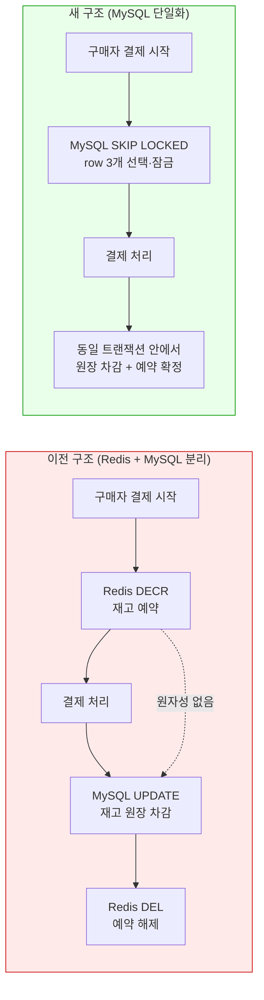
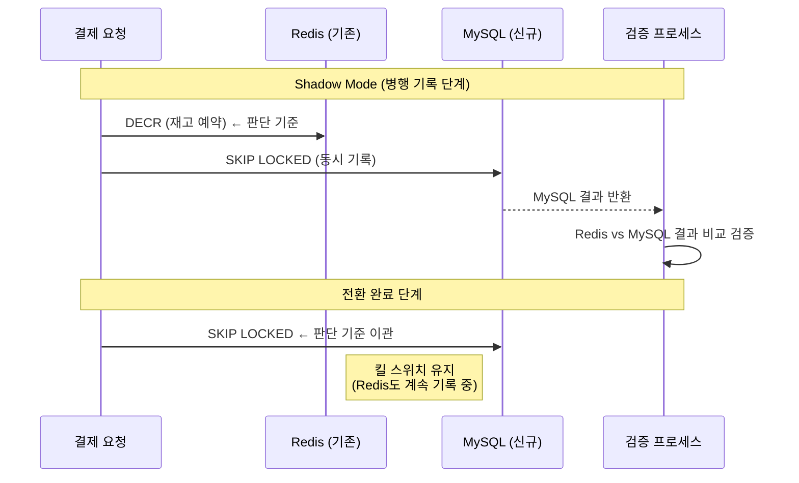
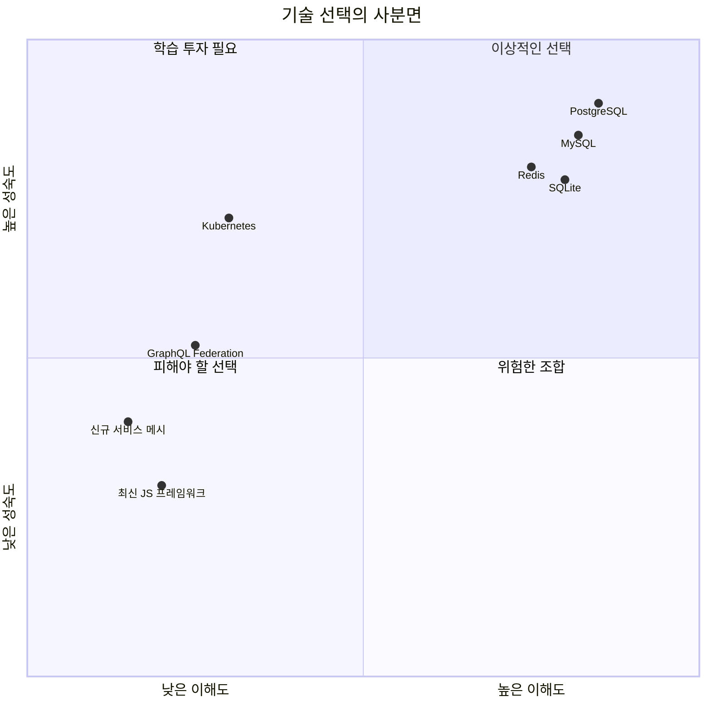
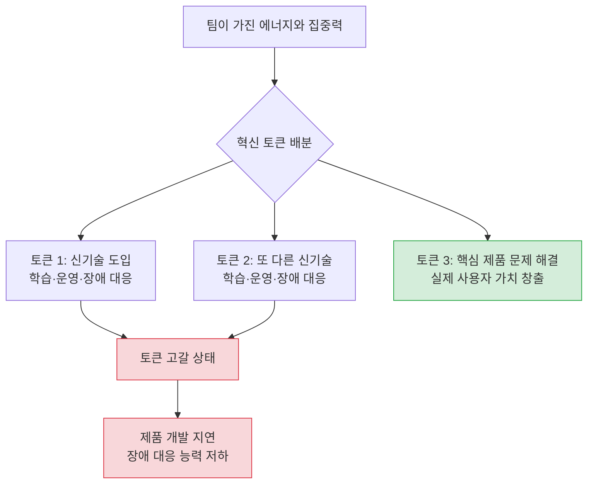
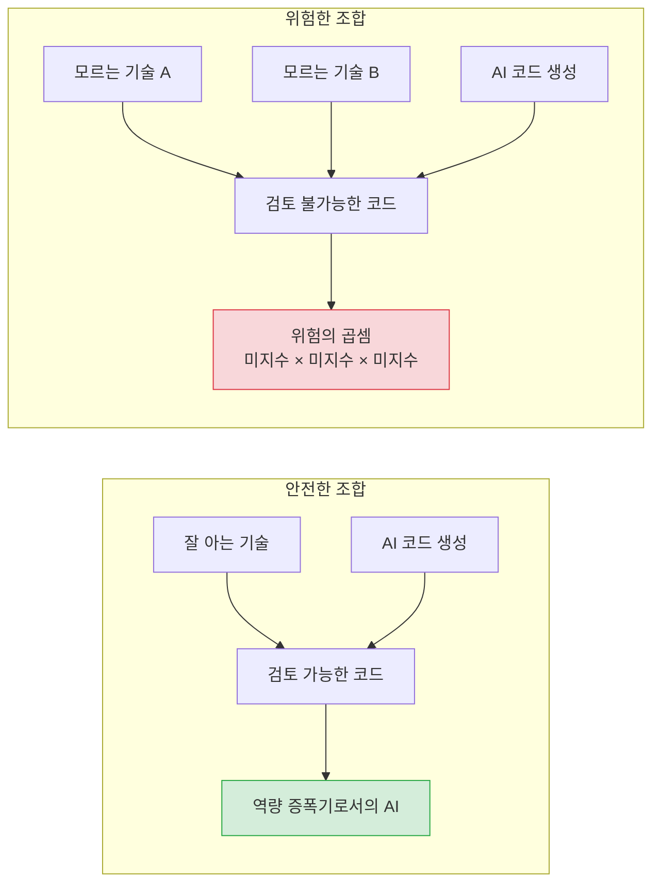
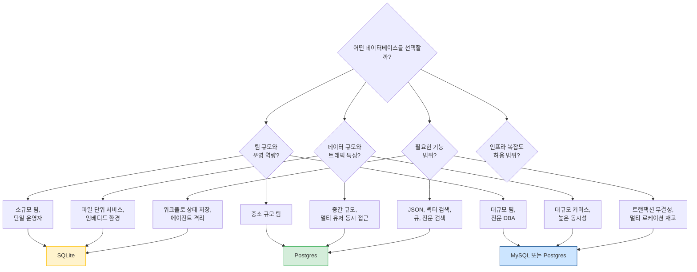
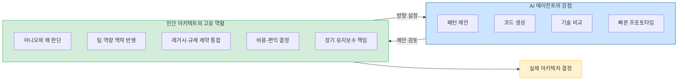
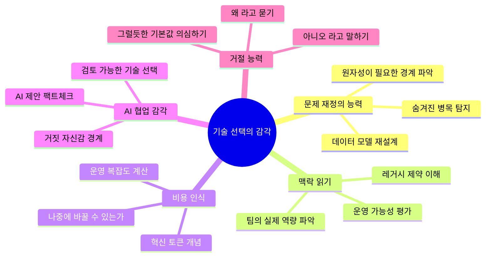

> GeekNews Weekly #360 (2026-05-25 ~ 2026-05-31) 상세 분석  
> 원본: https://news.hada.io/weekly/202622

---

## 들어가며

2026년 5월 마지막 주, 개발자 커뮤니티 GeekNews가 발행한 위클리 뉴스레터 360호의 제목은 「기술 선택의 감각을 잃지 않기」였다. 몇 달간 AI 모델 출시와 에이전트 도구들의 급격한 변화가 이어지던 와중에, 이 호는 조용하지만 근본적인 질문을 던졌다. *AI가 코드를 대신 써주는 시대에, 엔지니어에게 정말 중요한 역량은 무엇인가?*

뉴스레터 편집자가 이번 주의 핵심 콘텐츠로 고른 것은 인공지능 관련 신기술 뉴스가 아니었다. 오히려 2015년에 쓰인 고전적인 글 하나와, 2025년에 그것을 AI 시대의 언어로 다시 쓴 글 하나였다. 그리고 그 사이를 잇는 현실의 사례로, Shopify가 Redis 기반의 재고 예약 시스템을 MySQL로 전환한 과정을 보여주는 엔지니어링 포스트를 함께 소개했다.

이 문서는 GN#360의 주요 내용을 하나씩 풀어내면서, 그 안에서 공통적으로 흐르는 메시지—**기술 선택은 정답을 고르는 게 아니라 제약 조건을 읽는 일이다**—를 깊이 있게 살펴본다.

---

## 1. 배경: 2026년 5월의 기술 생태계

GN#360이 발행된 시점에 기술 생태계는 미묘한 변곡점을 지나고 있었다. Claude Opus 4.8이 출시되었지만, 과거 GPT-4나 Claude 3 Opus처럼 업계 전체가 들썩이는 분위기는 아니었다. 프론티어 모델의 출시가 일상적인 이벤트로 정착해가는 것이다. 한편 OpenAI의 Codex가 GPT-5.5와 함께 재조명받으면서 「Codex 활용 사례 모음」이 대폭 확장되었고, 에이전트 코딩 도구들은 코드 작성을 넘어 PR 리뷰, 데이터 분석, 재무 모델링, 슬라이드 작성까지 업무 범위를 빠르게 넓혀가고 있었다.

그러나 이 혼잡한 AI 뉴스의 홍수 속에서 편집자의 눈을 끈 것은 Shopify 엔지니어링 블로그에 올라온 한 편의 글이었다. 제목은 「우리는 재고 예약 시스템을 Redis에서 MySQL로 교체했다—그리고 성능이 확장됐다」.

---

## 2. Shopify의 Redis → MySQL 전환: 사례 분석

### 2.1 문제의 배경: 오버셀

이커머스에서 **오버셀(oversell)** 은 악몽 같은 시나리오다. 실제 남은 재고가 1개인 상품을 두 명의 구매자가 동시에 결제할 경우, 한 사람에게는 주문 취소 메일과 사과를 보내야 한다. 반대로 실제로는 재고가 있는데 없다고 잘못 표시하면 팔 수 있었던 기회를 놓친다. Shopify 규모에서는 이 두 가지 실패 중 하나라도 발생하면 그 피해가 순식간에 불어난다.

2025년 블랙프라이데이 당시 Shopify 플랫폼에서는 분당 510만 달러의 매출이 발생했다. 이 트랜잭션 하나하나가 재고를 건드린다. Shopify의 오버셀 방지 시스템은 결제 처리 중에 재고를 일시적으로 예약하는 방식으로 동작한다. 구매자가 "결제 완료" 버튼을 누른 순간부터 결제가 확정될 때까지 짧은 시간 동안 해당 재고를 잠가두는 것이다.

### 2.2 기존 Redis 모델과 그 한계

기존 시스템은 Redis에서 동작했다. 상품 항목마다 수량 키를 두고, 예약할 때는 `DECR`, 취소할 때는 `INCR` 명령을 호출하는 방식이었다. Redis의 원자적 연산 특성 덕분에 동시성 처리 자체는 문제없었다.

그러나 핵심적인 문제가 있었다. 예약 데이터는 Redis에 있고, 재고 원장(ledger)은 MySQL에 있었기 때문에, 결제 완료 후 재고를 확정적으로 차감하는 `Claim` 단계에서 두 시스템을 함께 업데이트해야 했다. 이 두 작업을 하나의 원자적 트랜잭션으로 묶는 것이 불가능했기 때문에, 순서에 따라 오버셀이나 언더셀이 발생할 수 있는 구조적 취약점이 존재했다. 또한 Redis는 멀티 로케이션 재고(여러 창고에서 재고를 나누어 보유하는 구조)를 인식하지 못했고, 별도 클러스터를 운영해야 하는 운영 부담도 컸다.

### 2.3 MySQL SKIP LOCKED를 활용한 새로운 설계

이전에 단순히 MySQL로 전환하려던 시도는 실패했다. 상품마다 수량 컬럼 하나를 두는 방식은 동시 접근 시 심각한 경합(contention)이 발생했기 때문이다. 해결의 실마리는 MySQL 8에서 지원되기 시작한 `SKIP LOCKED` 기능에서 왔다.

핵심 아이디어는 **데이터 모델의 재정의**였다. 상품 10개 재고를 하나의 row에 수량 컬럼 `10`으로 관리하는 대신, 실제 판매 가능한 단위 하나마다 row 하나를 만드는 것이다. 재고가 10개면 row가 10개다. 3개를 예약한다는 것은 단순히 `UPDATE SET quantity = 7`이 아니라, 3개의 row를 선택해서 이동시키는 하나의 트랜잭션이 된다.

```sql
-- 간략화한 예약 쿼리
SELECT id FROM reservation_units
WHERE shop_id = ? 
  AND inventory_item_id = ?
  AND inventory_group_id = ?
LIMIT 3
FOR UPDATE SKIP LOCKED;
```

`SKIP LOCKED`는 이 구조에서 결정적인 역할을 한다. 다른 트랜잭션이 이미 잠근 row가 있다면, 그 row를 기다리는 대신 건너뛰고 사용 가능한 다른 row를 반환한다. 대기(waiting)가 사라지고, 경합이 줄어든다.

또한 예약 테이블과 재고 원장이 같은 MySQL 데이터베이스 안에 있기 때문에, 예약과 확정 차감을 하나의 ACID 트랜잭션으로 묶을 수 있다. Redis 시절에 존재하던 "결제는 됐는데 재고는 안 차감된" 류의 버그 전체가 구조적으로 제거된다.



### 2.4 풀 크기와 버스트 대응

한 상품에 재고가 50,000개 있고 위치가 10곳이라면 단순 계산으로 50만 개의 row가 필요하다. 이러면 `SKIP LOCKED` 스캔이 느려진다. Shopify는 이 문제를 **예약 풀(pool)의 상한 설정**으로 해결했다. 상품/위치 조합마다 최대 1,000개의 row만 풀에 유지하고, 결제가 이루어지며 row가 소비되면 별도의 보충(replenishment) 프로세스가 재고 원장에서 새 row를 채워 넣는다.

버스트 상황, 즉 플래시 세일처럼 갑자기 수백 건의 동시 결제가 몰릴 경우 풀이 일시적으로 고갈될 수 있다. 이때는 예약 경로가 인라인(inline)으로 보충을 트리거하며, 하나의 트랜잭션만 보충을 수행하고 나머지는 그 완료를 기다린다. 천둥 떼 문제(thundering herd, 모든 트랜잭션이 동시에 삽입을 시도하는 상황)를 막기 위한 설계다.

### 2.5 진짜 병목은 쿼리가 아니었다

시스템을 구축하고 프로덕션 부하 테스트를 진행했을 때, 처리량의 상한이 예상보다 낮았다. 흥미로운 점은 P90 레이턴시는 허용 범위였고, CPU도 최대치가 아니었다는 것이다. 쿼리도 이미 최적화되어 있었다. 원인을 찾기 위해 팀은 **연결 가시성(connection visibility)** 이라는 개념을 도입했다.

모든 SQL 구문에 비즈니스 프로세스를 식별하는 주석 태그를 붙였다.

```sql
SELECT * FROM inventory_units
/* conn_tag:checkout_completion */
WHERE ...
```

그리고 프록시 레이어(ProxySQL)에서 이 태그를 파싱해 각 호출자가 DB 연결을 얼마나 오래 점유하는지 측정했다. 결과는 놀라웠다. 예약 쿼리 자체가 느린 게 아니었다. 체크아웃 경로의 **다른 부분들이 커넥션을 불필요하게 오래 쥐고 있었고**, 그것이 재고 예약에 쓸 커넥션 풀을 고갈시키고 있었다.

체크아웃 경로의 커넥션 점유 문제를 수정하자 프라이머리 DB의 읽기 쿼리가 50%, 트랜잭션이 33% 줄었다. CPU는 50% 이하, 리더 CPU는 16% 이하를 유지하며 목표치를 초과 달성했다.

### 2.6 안전한 전환: Shadow Mode

Redis에서 MySQL로의 전환은 한 번에 이루어지지 않았다. **Shadow Mode**라고 부르는 병행 기록 방식으로 진행했다. 모든 예약 쓰기를 Redis와 MySQL에 동시에 기록하되, 실제 판단의 기준은 Redis가 유지했다. 이 상태에서 MySQL의 결과를 실제 트래픽과 비교 검증하고, 성능과 정확도에 만족했을 때 판단 기준을 MySQL로 전환했다. 문제 발생 시 즉시 Redis로 되돌릴 수 있는 킬 스위치도 남겨뒀다.



### 2.7 이 사례에서 진짜 교훈

편집자가 이 글을 메인으로 다룬 이유는 단순히 기술적인 흥미 때문만은 아니었다. 이 사례의 핵심 메시지는 **"Redis보다 MySQL이 낫다"가 아니라는 것**이다. 중요한 것은 문제의 형태를 다시 보는 능력이었다. *원자성이 정말 필요한 경계는 어디인가? 두 시스템을 분리하는 대신 하나의 시스템 안에서 문제를 해결할 수 없는가? 진짜 병목은 어디에 있는가?*

5년 전에 내린 결정이 지금도 올바른지 재검토하라는 메시지도 담겨 있다. `SKIP LOCKED`는 MySQL 8에서야 등장한 기능이다. 2021년에는 MySQL로 이 문제를 풀 수 없었을 수 있지만, 2026년에는 가능하다. 기술은 진화하고, 이전의 결론이 영원히 유효하지는 않다.

---

## 3. "지루한 기술을 선택하라" — 2015년 원본 논증

### 3.1 Dan McKinley의 핵심 논거

2015년, Etsy의 엔지니어였던 Dan McKinley는 「Choose Boring Technology」라는 제목의 글을 발표했다. 10년이 지난 지금도 소프트웨어 엔지니어링 커뮤니티에서 반복적으로 인용되는 고전이다.

McKinley의 핵심 주장은 **혁신 토큰(innovation tokens)** 이라는 비유로 표현된다. 모든 회사와 팀에게는 혁신 토큰이 제한적으로 주어지며—대략 3개 정도—새로운 기술을 도입할 때마다 그 토큰이 소비된다고 보는 것이다. NodeJS를 선택하면 토큰 하나, MongoDB를 선택하면 또 하나, 출시된 지 1년도 안 된 서비스 디스커버리 기술을 쓰면 또 하나. 토큰이 고갈되면 팀은 제품 문제를 해결하는 대신 기술 학습과 장애 대응에 에너지를 소진한다.

McKinley가 강조한 것은 "지루한 기술이 나쁜 기술"이 아니라는 점이다. 지루하다는 것은 오랫동안 검증되어 그 **실패 양상(failure modes)** 이 알려져 있다는 뜻이다. 새벽 3시에 장애가 났을 때, Stack Overflow 답변이 쌓여 있는 기술과 개척지를 걷는 기술 중에 어느 쪽에서 더 빨리 복구할 수 있겠는가? 그 차이가 바로 팀의 안도감과 서비스 안정성을 결정한다.

McKinley는 MySQL, PostgreSQL, PHP, Python, Memcached, Cron 등을 "지루하지만 좋은 기술"의 예시로 들었다. Etsy의 초기 사례로는, Python 개발자를 채용하고 나서 굳이 Python으로 써야 할 무언가를 만들어낸 결과 쓸모없는 중간 레이어가 생겨났고, 그 제거에만 수년이 걸렸다는 이야기를 들었다. 그 사이 검색 레이턴시 P90이 2분이었다는 사실이 이 이야기를 강렬하게 만든다.



### 3.2 혁신 토큰의 개념 구조



McKinley는 이 모델이 근사치임을 인정하면서도, 이 비유가 팀으로 하여금 "우리가 지금 무엇을 쓰고 있는가"를 직관적으로 파악하게 해준다고 했다. 중요한 것은 새 기술이 나쁘다는 것이 아니라, 신기술 도입 결정이 **비용을 수반한다는 사실을 명시적으로 인식**하게 만드는 데 있다.

---

## 4. AI 시대의 재논증 — "지루한 기술을 선택하라, Revisited"

### 4.1 Aaron Brethorst의 2025년 재론

2025년 7월, 시애틀 소재 기술 리더 Aaron Brethorst는 자신의 블로그에 「Choose Boring Technology, Revisited」를 게재했다. 2015년 글에 대한 자신의 10년 전 독후감을 언급하면서, AI 코딩 도구의 등장이 이 원칙을 어떻게 더 중요하게 만들었는지를 설명했다.

그의 핵심 지적은 간단하다. AI 코딩 도구는 거의 어떤 기술 스택에 대해서도 그럴듯해 보이는 코드를 생성할 수 있다. Claude나 Copilot에게 Kubernetes와 GraphQL Federation, 최신 JavaScript 프레임워크를 함께 쓰는 마이크로서비스를 구현해달라고 하면, 명명 규칙을 따르고 오류 처리도 갖춘 전문가스러워 보이는 코드가 나온다.

문제는 **그 코드가 틀렸을 때, 본인이 그 사실을 알아챌 수 없다는 것**이다.

### 4.2 미지의 기술 × AI 생성 코드 = 위험의 곱셈

Brethorst는 이렇게 표현했다. 모르는 기술을 AI 생성 코드와 결합하면, 미지수들이 더해지는 게 아니라 **곱해진다**.

- 해당 프레임워크 선택이 적절한지 모른다.
- AI의 구현이 모범 사례를 따르는지 모른다.
- 생성된 코드 중 어떤 부분이 보일러플레이트이고 어떤 부분이 핵심 비즈니스 로직인지 모른다.
- 어떤 실패 양상을 주의해야 하는지 모른다.

실제로 그는 AI가 생성한 코드가 deprecated된 API를 사용하거나, 보안 안티패턴을 구현하거나, 프로덕션 부하에서야 드러나는 미묘한 성능 문제를 만드는 것을 목격했다. 겉으로는 옳아 보이는 코드였다. 네이밍도 맞았고, 오류 처리도 있었다. 그러나 해당 기술에 충분히 익숙한 사람만이 알아챌 수 있는 방식으로 잘못되어 있었다.



### 4.3 AI가 뒤바꿔 놓은 것: 나쁜 코드가 좋아 보인다

McKinley의 2015년 원칙은 "운영 복잡도와 인지적 부담을 줄이자"는 논리였다. 그것은 여전히 유효하다. 그러나 AI 시대에는 추가적인 위험이 생겼다. **AI 도구가 어떤 스택에서도 전문가스러운 코드처럼 보이는 결과물을 만들어주기 때문에, 거짓 자신감이 생긴다.**

과거에는 나쁜 코드가 대부분 나쁘게 보였다. 지금은 문제 있는 코드가 도메인에 충분히 익숙하지 않으면 눈치채기 어려울 만큼 잘 보인다.

역설적으로, AI 도구를 가장 잘 활용할 수 있는 사람은 AI 없이도 해당 기술을 잘 아는 사람이다. Brethorst는 Rails 코드를 Claude에게 생성하게 한 뒤 검토할 수 있는 이유가 Rails를 충분히 알기 때문이라고 했다. AI는 모르는 기술의 대리인이 아니라, **아는 기술의 역량 증폭기**가 된다.

### 4.4 AI 시대를 위한 실천 가이드라인

Brethorst는 세 가지 실천적 가이드라인을 제시했다.

첫째, 새 기술을 평가할 때 스스로에게 물어봐야 한다. *"AI가 이 기술로 구현 코드를 생성했을 때, 내가 그것을 적절히 검토할 수 있는가?"* 대답이 "아니오"라면, 미션 크리티컬한 업무에 그 기술을 쓰지 말아야 한다.

둘째, 무언가 새로운 것을 배우기로 결심했다면 (혁신 토큰 하나를 쓰기로 했다면), AI 제안을 팩트체크할 수 있을 만큼 깊이 이해하는 시간을 실제로 투자해야 한다. 복사-붙여넣기 후 최선을 바라는 방식으로는 안 된다.

셋째, AI 도구를 동시에 여러 새 기술을 도입하는 핑계로 삼으면 안 된다. AI가 새 언어, 새 프레임워크, 새 인프라를 모두 다룰 수 있는 것처럼 느껴지게 해줄 수 있지만, 그 어느 것도 제대로 검증할 수 없다.

> *가장 지루한 기술이 당신 스택에서 가장 중요한 기술일 수 있다. AI가 틀렸을 때를 알아챌 수 있을 만큼 그것을 충분히 이해하고 있기 때문에.*

---

## 5. 데이터베이스 선택의 스펙트럼

GN#360이 다룬 또 다른 중요한 논의는 데이터베이스 선택에 관한 것이었다. 이 주제에 대한 여러 글들이 흥미로운 스펙트럼을 형성했다.

### 5.1 "일단 Postgres로 시작하라"의 배경

최근 몇 년 사이 PostgreSQL은 소프트웨어 개발 커뮤니티에서 "기본값에 가장 가까운 데이터베이스"로 자리 잡았다. 그 이유는 하나의 시스템에서 처리할 수 있는 문제의 범위가 넓어졌기 때문이다.

JSON 데이터를 저장하고 쿼리하는 것은 물론, 전문 검색(full-text search), 메시지 큐 기능, 벡터 검색(pgvector)까지 Postgres 안에서 구현할 수 있다. 소규모 팀에게 여러 시스템—Elasticsearch, Redis, 전용 메시지 브로커 등—을 별도로 운영하는 것은 생각보다 훨씬 큰 비용이다. 운영 지식, 장애 대응 절차, 백업 정책, 모니터링 설정 모두 시스템마다 따로 필요하기 때문이다.

「2026년, 그냥 Postgres를 쓰자」 같은 글이 공감을 얻는 이유가 여기에 있다. 잘 아는 시스템 하나 안에서 문제를 해결하는 편이, 각각은 더 나아 보이는 여러 시스템을 관리하는 것보다 실용적일 때가 많다.

### 5.2 세 가지 데이터베이스의 철학적 차이

같은 주에 「Postgres에서 내구성 워크플로를 구축하는 방법」과 「SQLite만으로도 내구성 있는 워크플로를 구현할 수 있다」는 글이 함께 올라왔다. 이 두 글은 서로 다른 관점에서 같은 질문을 던지고 있었다. *워크플로의 상태를 어디에 저장할 것인가?*

한쪽에서는 Postgres를 단순한 저장소가 아니라 워크플로의 실행 상태를 기록하고 복구하는 기반으로 사용할 수 있다고 주장했다. 다른 쪽에서는 특정 규모와 조건에서는 SQLite 파일 하나와 Litestream으로도 각 에이전트나 워크플로가 독립적인 상태 단위를 가지며 장애 격리가 더 쉬울 수 있다고 했다.



### 5.3 기술 선택은 정답이 아니라 제약 조건 읽기

GN#360 편집자는 이 흐름을 정리하면서 중요한 통찰을 제시했다. *Postgres가 "기본값"이 되는 시대에도 반대 질문을 잊으면 안 된다.* 정말 Postgres가 필요한지, MySQL이 더 자연스럽지 않은지, SQLite로 충분한 문제를 너무 일찍 서버형 데이터베이스로 키우고 있는 건 아닌지.

기술 선택은 결국 이런 요소들을 종합적으로 읽는 작업이다.

- 팀이 잘 아는 기술인가
- 실제 운영 가능한 역량이 있는가
- 장애 발생 시 복구할 수 있는가
- 데이터 정합성이 반드시 필요한가
- 나중에 분리 가능한 구조인가
- 현재의 선택이 치명적인 실수인가, 아니면 나중에 바꿀 수 있는가

---

## 6. "Claude는 당신의 아키텍트가 아니다"

이번 주에 함께 다루어진 「Claude는 당신의 아키텍트가 아니다, 그런 척하게 두지 말라」는 글은 AI 에이전트 시대의 기술 선택 문제를 아키텍처 설계 차원에서 바라본다.

### 6.1 AI 에이전트의 유창함과 한계

AI 에이전트는 이벤트 기반 아키텍처, 서비스 메시, 서버리스, 멀티 에이전트 구조 같은 패턴들을 유창하고 그럴듯하게 설계해준다. 각 패턴에는 나름의 타당성이 있고, AI가 제시하는 설명도 논리적이다.

그러나 좋은 아키텍트에게 필요한 능력은 단순히 타당한 패턴을 제안하는 것이 아니다. "아니오"와 "왜?"를 말하는 능력이다. 실제 팀의 역량은 어떤가? 운영 환경에 어떤 제약이 있는가? 레거시 시스템과의 호환성은? 규제 조건은? 비용 구조는 지속 가능한가? 이러한 맥락적 판단을 AI 에이전트는 충분히 대신하지 못한다.

### 6.2 에이전트는 그럴듯한 기본값을 빠르게 제안한다

GN#360 편집자는 자신이 실제 경험한 사례를 공유했다. 운영 중인 서버에 장애가 발생했을 때, 함께 상황을 파악하던 에이전트가 곧바로 "인스턴스 업그레이드"를 제안했다. 그러나 실제 원인은 폭증한 크롤러 봇 요청을 제대로 막지 못한 코드 수준의 문제였다. 관련 코드를 수정하자 문제가 해결됐다. 인스턴스 업그레이드는 증상을 잠시 완화했을 수 있지만 근본 원인과는 무관했다.

에이전트는 주어진 정보를 바탕으로 그럴듯한 해결책을 제안하도록 설계되어 있다. 그 과정에서 팀이 가진 맥락—어디서 비용이 발생하고 있는지, 레거시 코드에 어떤 제약이 있는지, 지금 어떤 변화를 감당할 수 있는지—을 AI가 온전히 갖고 있지 않다면, 제안은 그럴듯하지만 최선이 아닐 수 있다.





### 6.3 AI에게 아키텍처를 맡기면 감각이 약해진다

편집자가 지적한 가장 중요한 위험은 단기적인 잘못된 결정이 아니다. 장기적으로 **판단의 감각 자체가 약해질 수 있다는 것**이다. 에이전트에게 기술 결정을 통째로 맡기는 습관이 쌓이면, 엔지니어는 스스로 제약 조건을 읽고 트레이드오프를 따지는 근육을 쓰지 않게 된다. 그 근육은 쓰지 않을수록 약해진다.

HN(Hacker News) 댓글에서는 이 글의 전제—"Claude가 '아니오'를 못 한다"—에 동의하지 않는 반론도 많았다. 비판을 먼저 하라는 프롬프트를 주거나 회의적인 페르소나를 부여하면 AI도 충분히 반박을 한다는 경험담이었다. 이 관점은 일리가 있다. 프롬프트 설계로 AI를 비판자 역할로 활용할 수 있는 것은 사실이다. 그러나 그 비판이 팀의 실제 맥락과 제약 조건을 반영할 수 있는지는 또 다른 문제다.

---

## 7. 주변 글들이 강화하는 맥락

GN#360은 메인 주제 외에도 같은 맥락에서 읽을 수 있는 글들을 함께 소개했다. 그 중 몇 가지는 기술 선택 논의를 더 풍부하게 만든다.

### 7.1 Go에서 Rust로 마이그레이션하기

이 글은 단순한 언어 전환 가이드가 아니라 **무엇을 컴파일 타임에 보장받을 것인가**의 문제로 마이그레이션을 접근한다. `nil`, 데이터 레이스, 오류 누락 같은 런타임 함정을 타입 시스템으로 옮기는 대신, 높은 학습 곡선과 느린 컴파일 속도를 감수하는 트레이드오프를 솔직하게 제시한다.

전면 재작성 대신 성능 핫패스나 워커부터 분리하는 **Strangler 전략**을 권한다는 점이 GN#360 메인 주제와 공명한다. 유행하는 언어가 아니라, 지금 우리 시스템의 **특정 문제에 맞는 언어를 배치**하라는 결론이다.

### 7.2 "Constraint Decay" 논문

이 논문은 LLM 에이전트가 기능 요구사항은 그럴듯하게 충족하지만, 백엔드의 API 계약, 아키텍처 패턴, DB, ORM 제약이 누적될수록 성능이 무너지는 현상을 실험으로 보여준다. 실패 원인의 상당 부분이 데이터 계층과 ORM 런타임 위반에서 나온다는 점이 실무적으로 중요하다.

이것은 Brethorst의 주장을 실험적으로 뒷받침한다. AI 코딩 에이전트를 실무에 쓰려면 프롬프트를 잘 쓰는 것만으로는 부족하고, 구조적 제약을 테스트와 정적 검증으로 고정하는 장치가 필요하다.

### 7.3 Flue: 에이전트 하네스 프레임워크

Claude Code나 Codex를 강력하게 만드는 하네스 아키텍처를 일반화한 TypeScript 프레임워크다. **Agent = Model + Harness**라는 정의 아래 Model, Harness, Sandbox, Filesystem의 4계층으로 구분한다. "에이전트를 쓰는 것"에서 "에이전트를 제품 안에 직접 구성하는 것"으로 넘어가는 흐름을 잘 보여준다.

"다른 사람의 에이전트를 임대하지 말고 전체 스택을 직접 소유하라"는 메시지는 기술 선택에 대한 주체성과도 연결된다.

### 7.4 병목은 "조직"에 있다

AI 코딩 도구가 코드 작성 속도를 높여도 조직의 병목이 그대로라면 가치 전달 속도는 크게 달라지지 않는다는 분석이다. DORA 보고서를 인용하며 "AI는 증폭기일 뿐, 잘하는 조직의 강점도 못하는 조직의 역기능도 똑같이 키운다"는 결론을 내린다.

자동화 테스트, CI/CD, 관측 가능성, ADR, 골든 패스 같은 엔지니어링 인에이블먼트는 사람 개발자뿐 아니라 AI 에이전트를 안전하게 움직이게 하는 가드레일이 된다는 점에서, 기술 선택 이전에 기반 인프라를 갖추는 일의 중요성을 강조한다.

---

## 8. 종합: 기술 선택의 감각이란 무엇인가

GN#360 전체를 관통하는 메시지를 정리하면, 기술 선택의 감각은 다음과 같은 능력들의 복합체다.



### 8.1 AI가 선택지를 넓혀줄수록 선별 감각이 중요해진다

AI 코딩 도구는 구현 가능한 기술 선택지의 범위를 폭발적으로 넓혔다. 예전에는 팀이 모르는 기술을 쓰려면 적어도 그것을 배우는 시간이 자연스러운 장벽으로 작동했다. 이제 AI가 그 장벽을 낮춰주기 때문에, 잘 모르는 기술로 빠르게 무언가를 만들 수 있다는 착각이 쉽게 생긴다.

그러나 AI가 코드를 대신 써주는 것과 그 기술의 실패 양상을 이해하는 것은 전혀 다른 문제다. 도구가 빠를수록, 오히려 그 제안을 냉정하게 검토하는 감각이 더 중요해진다.

### 8.2 좋은 기술 선택의 세 가지 기준

편집자가 강조한 좋은 기술 선택의 기준은 세 가지다.

**첫째**, 문제의 모양을 정확히 본다. Shopify가 Redis에서 MySQL로 바꾼 것은 MySQL이 더 빠르거나 더 좋아서가 아니었다. 원자성이 필요한 경계를 재정의하고, 두 시스템이 분리되어 있어 발생하는 구조적 취약점을 제거하는 것이 목적이었다.

**둘째**, 선택의 비용을 제대로 이해한다. 혁신 토큰 비유가 강력한 이유는 모든 기술 선택이 학습, 운영, 장애 대응의 비용을 수반한다는 사실을 명시적으로 만들기 때문이다. 그 비용을 인식하지 않으면 무의식적으로 과소평가하게 된다.

**셋째**, 지금 틀리면 치명적인 부분과 나중에 바꿀 수 있는 부분을 구분한다. 데이터 모델은 나중에 바꾸기 어렵다. 특정 SaaS 의존성은 나중에 분리하기 어렵다. 반면 특정 라이브러리나 프레임워크는 상대적으로 교체하기 쉽다. 이 구분이 지금 얼마나 신중해야 하는지를 결정한다.

### 8.3 AI 시대의 엔지니어에게 남겨진 핵심 역할

GN#360이 제시하는 결론은 이것이다. 도구는 계속 바뀌겠지만, 좋은 엔지니어링은 여전히 "지금 이 문제에 맞는 기술을 왜 선택했는지" 설명할 수 있는 사람에게서 나온다.

AI가 어떤 기술 스택이든 그럴듯하게 만들어줄 수 있는 시대에, 엔지니어에게 가장 필요한 능력은 그 제안을 냉정하게 검토하고 팀과 제품의 맥락에 맞게 줄이고, 바꾸고, 때로는 거절하는 판단력이다. 이 판단력이 바로 "기술 선택의 감각"이다.

---

## 참고 자료

| 자료 | 출처 | 설명 |
|------|------|------|
| GN#360 원문 | https://news.hada.io/weekly/202622 | GeekNews 위클리 #360 |
| Choose Boring Technology (2015) | https://mcfunley.com/choose-boring-technology | Dan McKinley 원본 |
| Choose Boring Technology, Revisited (2025) | https://www.brethorsting.com/blog/2025/07/choose-boring-technology,-revisited/ | Aaron Brethorst 재론 |
| Shopify Redis→MySQL 전환 | https://shopify.engineering/scaling-inventory-reservations | Emilie Noel, Shopify Engineering, 2026-05-12 |

---

*작성 일자: 2026-06-04*
