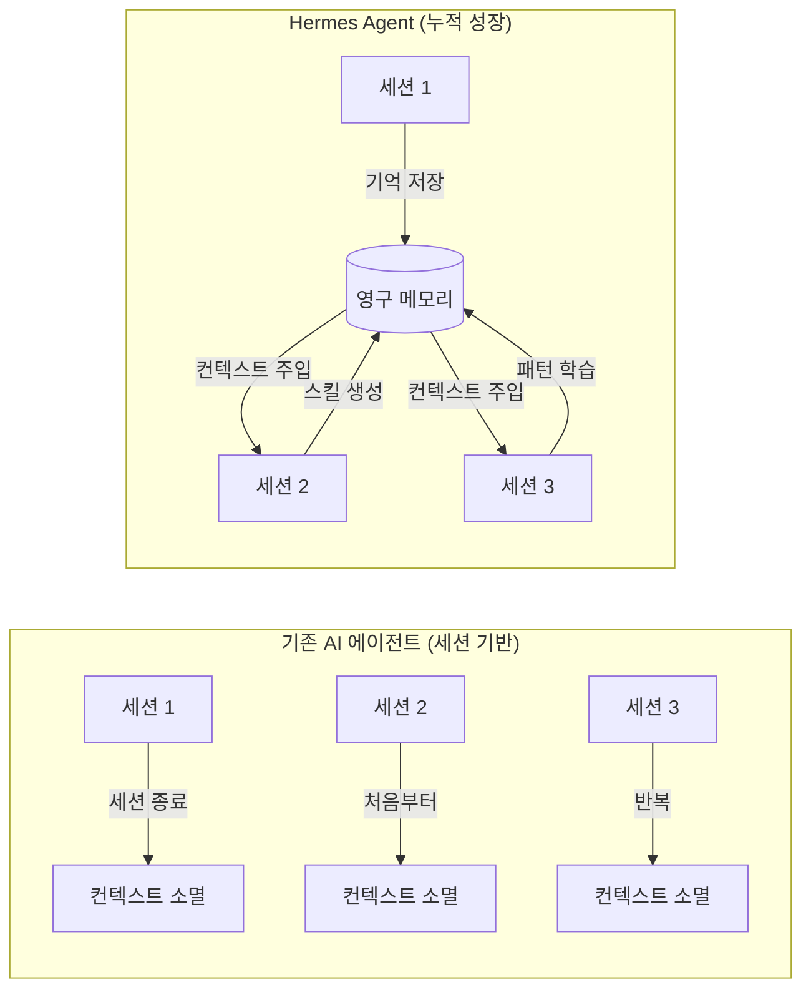
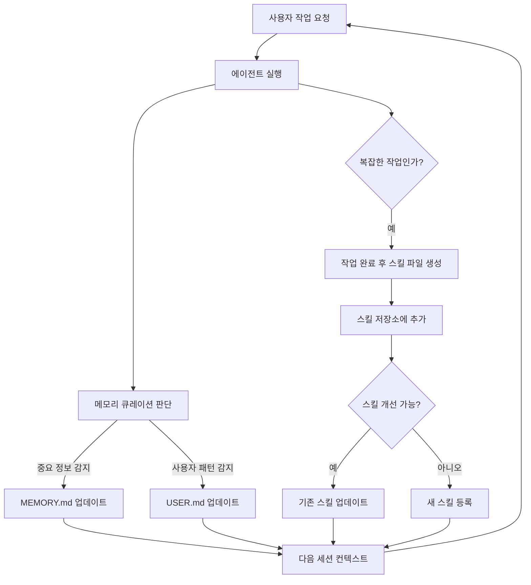
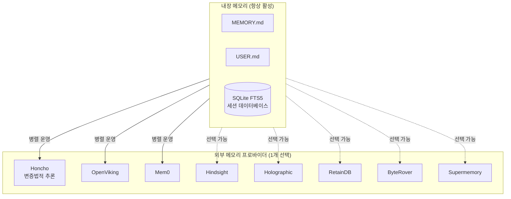
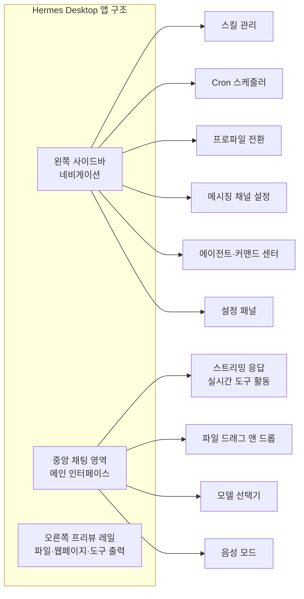
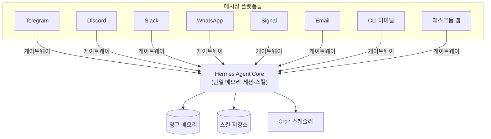
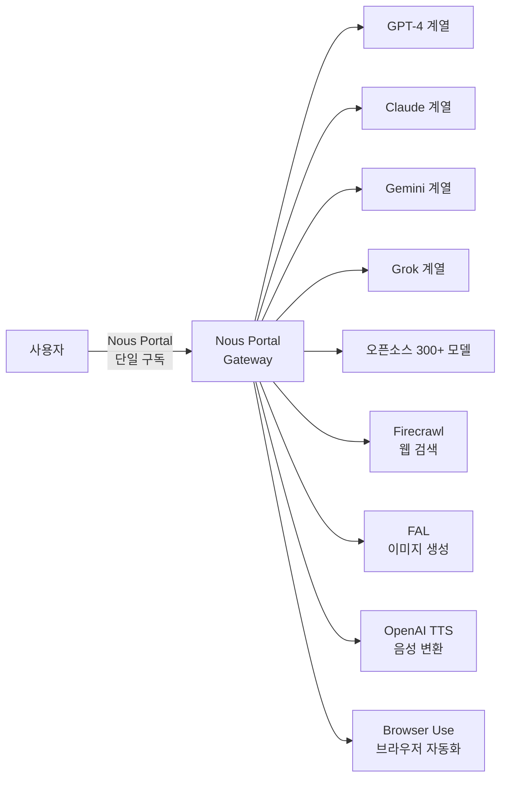

> **Nous Research의 오픈소스 자율 AI 에이전트 Hermes가 2026년 6월 2일, 공식 데스크톱 앱으로 세상에 나왔다.**

---

## 목차

1. [들어가며: Hermes Desktop 등장의 의미](#1-들어가며)
2. [Nous Research와 Hermes Agent의 배경](#2-배경)
3. [핵심 개념: "성장하는 에이전트"란 무엇인가](#3-핵심-개념)
4. [폐쇄적 학습 루프 (Closed Learning Loop)](#4-폐쇄적-학습-루프)
5. [영구 메모리 시스템 심층 분석](#5-영구-메모리-시스템)
   - 5.1 [내장 메모리 구조](#51-내장-메모리-구조)
   - 5.2 [SQLite FTS5 세션 검색](#52-sqlite-fts5-세션-검색)
   - 5.3 [Honcho: 변증법적 사용자 모델링](#53-honcho-변증법적-사용자-모델링)
   - 5.4 [8개의 외부 메모리 프로바이더](#54-8개의-외부-메모리-프로바이더)
6. [스킬 시스템과 agentskills.io 표준](#6-스킬-시스템)
7. [데스크톱 앱 UI 구성 및 기능](#7-ui-구성-및-기능)
8. [크로스 플랫폼 메시징 게이트웨이](#8-메시징-게이트웨이)
9. [자연어 스케줄링 자동화](#9-자연어-스케줄링)
10. [서브에이전트 위임 (Delegate)](#10-서브에이전트-위임)
11. [샌드박스 실행 환경 5종](#11-샌드박스-실행-환경)
12. [웹 탐색 및 멀티모달 기능](#12-웹-탐색-및-멀티모달)
13. [설치 방법 및 요구사항](#13-설치-방법)
14. [Nous Portal: 구독 플랜과 모델 접근](#14-nous-portal)
15. [Jensen Huang의 GTC 키노트에서의 등장](#15-gtc-키노트)
16. [기술적 구현: Electron + React 아키텍처](#16-기술-아키텍처)
17. [인터페이스 통합: CLI, TUI, Dashboard, Desktop](#17-인터페이스-통합)
18. [주요 한계 및 현실적 고려사항](#18-한계-및-고려사항)
19. [OpenClaw와의 비교: 두 오픈소스 에이전트 프레임워크](#19-openclawと-비교)
20. [결론: 오픈소스 에이전트의 새로운 지평](#20-결론)

---

## 1. 들어가며

2026년 6월 2일, Nous Research는 공식 X(트위터) 계정을 통해 간결하지만 의미심장한 발표를 했다. "The next evolution of Hermes Agent is here! Introducing Hermes Desktop: everything you love about Hermes, now native on your machine." 이 발표와 함께 오픈소스 AI 에이전트 Hermes는 터미널이라는 전문가 영역에서 벗어나 macOS, Windows, Linux를 모두 지원하는 네이티브 데스크톱 앱으로 탈바꿈했다.

이 소식이 AI 커뮤니티에서 큰 반향을 일으킨 이유는 단순히 "GUI가 생겼다"는 것 이상이었다. Hermes는 처음부터 일반적인 AI 챗봇 래퍼나 코딩 어시스턴트로 설계된 것이 아니었다. 이 에이전트는 사용할수록 실제로 성장하는, 즉 기억을 쌓고 스킬을 자동 생성하며 사용자의 패턴을 학습하는 시스템으로 설계되었다. 그 핵심 철학이 이제 터미널 없이도 누구나 접근할 수 있는 형태로 공개된 것이다.

현재 버전은 **Hermes Agent v0.15.2**이며, 공개 프리뷰(Feature Preview) 상태다. MIT 라이선스로 배포되어 소스 코드 열람, 수정, 자체 호스팅이 모두 가능하다. 공식 GitHub 저장소는 `NousResearch/hermes-agent`이며, 다운로드 페이지는 `hermes-agent.nousresearch.com/desktop`이다.

---

## 2. 배경

### Nous Research란

Nous Research는 오픈소스 LLM 파인튜닝과 AI 에이전트 연구에 집중하는 AI 연구 그룹이다. 특히 Hermes 시리즈 파인튜닝 모델(Hermes 2, Hermes 3 등)로 잘 알려져 있으며, 이 모델들은 도구 호출(tool calling), 복잡한 추론, 에이전트 작업에 최적화된 것으로 평가받는다. 그들의 작업은 오픈소스 커뮤니티에서 광범위하게 활용되어 왔다.

### Hermes Agent의 시작

Hermes Agent는 2026년 2월에 처음 오픈소스로 공개되었다. 처음에는 터미널 기반의 CLI 도구로 출발했으며, curl 명령어 한 줄로 설치가 가능한 형태였다. Linux, macOS, WSL2 환경을 지원했고, 자체적으로 필요한 의존성을 모두 자동 설치했다. 데이터는 전적으로 사용자의 머신에 저장되며, 텔레메트리나 클라우드 연동은 없었다.

출시 직후부터 이 에이전트는 단순한 작업 실행 도구가 아니라, 장기적인 메모리와 자기 개선 능력을 갖춘 플랫폼이라는 점에서 주목받았다. 그리고 NVIDIA GTC 타이페이 2026 키노트에서 CEO 젠슨 황이 "incredible harness"로 직접 언급함으로써 더욱 넓은 주목을 받게 되었다.

---

## 3. 핵심 개념

### "성장하는 에이전트"의 의미

Hermes Desktop의 공식 슬로건은 **"The Agent That Grows With You"** 다. 이 슬로건은 단순한 마케팅 문구가 아니라, 에이전트의 설계 철학을 정확히 반영한다.

대부분의 AI 에이전트나 챗봇은 각 세션이 독립적이다. 어제 나눈 대화, 어제 해결한 문제, 어제 학습한 패턴은 오늘 새 세션을 시작하면 사라진다. 사용자는 매번 맥락을 다시 설명해야 하고, 에이전트는 매번 처음부터 시작한다. 이 반복은 효율 저하의 근본 원인이다.

Hermes는 이 문제를 정면으로 해결하려 설계되었다. 대화는 기억되고, 해결한 문제는 재사용 가능한 스킬로 변환되며, 사용자의 습관과 선호도는 누적된다. 오래 사용할수록 에이전트는 해당 사용자에게 더욱 최적화된다. 이것이 "성장한다"는 의미다.



---

## 4. 폐쇄적 학습 루프

Nous Research 팀은 Hermes를 **Closed Learning Loop(폐쇄적 학습 루프)**를 가진 에이전트로 설명한다. 이것이 단순한 채팅 래퍼와 Hermes를 구분하는 핵심이다.

루프의 작동 방식은 다음과 같다. 에이전트가 복잡한 작업을 완료하면, 그 해결 과정과 결과를 분석하여 재사용 가능한 스킬 파일을 생성한다. 이 스킬은 Markdown 형식으로 저장되며, 이후 유사한 작업을 만났을 때 자동으로 참조된다. 시간이 지남에 따라 스킬은 더 많은 사용 사례를 통해 자체적으로 개선된다.

메모리는 에이전트가 직접 관리한다. 사용자가 명시적으로 "기억해"라고 말하지 않아도, 에이전트는 중요한 정보를 감지하고 저장하도록 주기적으로 판단한다. 이를 "agent-curated memory"라고 부른다.



이 루프가 "폐쇄적(closed)"인 이유는, 외부의 재훈련이나 수동 개입 없이 에이전트 자체의 경험만으로 지속적으로 능력이 향상되는 구조이기 때문이다.

---

## 5. 영구 메모리 시스템

Hermes의 메모리 시스템은 단일 구조가 아니라 여러 층위가 협력하는 계층적 아키텍처로 설계되어 있다. 각 층위는 서로 다른 범위와 특성을 갖는다.

### 5.1 내장 메모리 구조

가장 기본적인 층위는 두 개의 Markdown 파일이다.

**MEMORY.md**는 에이전트가 장기적으로 기억해야 할 프로젝트 관련 사실들을 저장한다. 특정 코드베이스의 구조, 반복적으로 사용되는 설정, 해결된 문제의 요약 등이 이 파일에 쌓인다.

**USER.md**는 사용자 자체에 대한 정보를 저장한다. 선호하는 프로그래밍 언어, 작업 스타일, 커뮤니케이션 패턴, 자주 쓰는 도구 등이 시간이 지남에 따라 누적된다.

두 파일 모두 에이전트가 자율적으로 업데이트하며, 사용자가 직접 편집하는 것도 가능하다. 단, 에이전트의 다음 큐레이션 사이클에서 덮어쓰일 수 있다는 점을 감안해야 한다.

### 5.2 SQLite FTS5 세션 검색

내장 파일 메모리만으로는 수일 또는 수주 전에 나눈 구체적인 대화 내용을 참조하기 어렵다. 이 문제를 해결하기 위해 Hermes는 모든 과거 대화를 **SQLite 데이터베이스**에 저장하며, FTS5(Full-Text Search 5) 인덱싱을 적용한다.

FTS5는 SQLite의 전문 검색(full-text search) 확장 기능으로, 수천 개의 과거 메시지 중에서도 관련 내용을 빠르게 찾아낼 수 있다. 에이전트는 현재 작업과 관련된 과거 대화를 자연어 쿼리로 검색하고, LLM 기반 요약을 통해 필요한 컨텍스트만 추출하여 현재 세션에 주입한다.

이 메커니즘 덕분에 사용자가 "지난달에 해결했던 도커 네트워크 문제"를 다시 언급하면, 에이전트는 해당 대화를 검색하여 당시의 해결책을 즉시 참조할 수 있다.

### 5.3 Honcho: 변증법적 사용자 모델링

Honcho는 Plastic Labs가 개발한 AI 네이티브 메모리 백엔드로, Hermes의 메모리 프로바이더 플러그인 시스템에 통합되어 있다. 단순한 키-값 저장소와는 근본적으로 다른 접근법을 취한다.

Honcho는 대화가 끝난 후 그 내용을 분석하여 사용자에 대한 깊은 이해를 축적한다. 이 과정을 **변증법적 추론(dialectic reasoning)** 이라고 부른다. 각 대화 턴마다(cadence 설정에 따라) Honcho는 교환된 내용을 분석하고 사용자의 선호도, 습관, 목표에 대한 인사이트를 도출한다.

특히 주목할 것은 **3단계 깊이(dialecticDepth)** 구조다.

첫 번째 깊이(Depth 1, Fast Summary)는 현재 활성 세션의 주제를 빠르게 요약한다. 두 번째 깊이(Depth 2, Self-Audit)는 그 요약의 정확도를 검증하며, 요약이 충분히 좋다고 판단되면 조기 종료하여 토큰을 절약한다. 세 번째 깊이(Depth 3, Reconciliation)는 모순을 해결한다. 예를 들어 사용자가 갑자기 React에서 Vanilla CSS로 전환했다면, 기존의 React 선호도를 오래된 것으로 표시하고 Vanilla CSS 선호도를 반영하도록 컨텍스트 주입을 업데이트한다.

Honcho는 또한 **멀티 에이전트 프로파일**을 지원한다. 복수의 Hermes 인스턴스(예: 코딩 어시스턴트 + 개인 어시스턴트)가 동일한 사용자와 대화할 때, 각 인스턴스는 독립적인 "피어(peer)" 프로파일을 유지한다. 이를 통해 서로 다른 역할의 에이전트들이 컨텍스트를 오염시키지 않으면서도 사용자를 정확히 모델링한다.

### 5.4 8개의 외부 메모리 프로바이더

Hermes는 Honcho 외에도 총 8개의 외부 메모리 프로바이더 플러그인을 제공한다. 이들은 내장 메모리 시스템을 대체하는 것이 아니라 병렬로 보완하는 역할을 한다. 한 번에 하나의 외부 프로바이더만 활성화할 수 있다.

| 프로바이더 | 특징 |
|---|---|
| **Honcho** | 변증법적 추론, 딥 사용자 모델링 |
| **OpenViking** | 외부 지식 연동 |
| **Mem0** | 의미 검색 기반 메모리 |
| **Hindsight** | 사후 분석 기반 메모리 |
| **Holographic** | 홀로그래픽 메모리 구조 |
| **RetainDB** | 데이터베이스 방식 장기 기억 |
| **ByteRover** | 분산 메모리 탐색 |
| **Supermemory** | 지식 그래프 + 의미 검색 |



---

## 6. 스킬 시스템

Hermes의 스킬은 에이전트가 작업을 해결한 뒤 자동으로 생성하는 재사용 가능한 Markdown 파일이다. 스킬은 특정 작업에 대한 해결 절차, 사용할 도구, 주의사항 등을 담고 있으며, 향후 유사한 작업을 만났을 때 컨텍스트로 자동 주입된다.

중요한 것은 이 스킬들이 **agentskills.io**라는 오픈 표준을 따른다는 점이다. agentskills.io는 에이전트 스킬의 형식과 공유 방식을 표준화하기 위한 오픈 이니셔티브다. 이 표준을 따름으로써 Hermes 사용자들은 커뮤니티가 만든 스킬을 손쉽게 설치하거나, 자신이 만든 스킬을 공유할 수 있다.

데스크톱 앱의 **Skills 패널**에서는 설치된 스킬을 탐색하고, 새 스킬을 추가하며, 기존 스킬을 관리하는 것이 GUI 환경에서 가능하다. 이전에는 이 모든 작업을 터미널 명령어로 수행해야 했다.

---

## 7. UI 구성 및 기능

Hermes Desktop은 **채팅 중심(chat-first)** 레이아웃을 채택하며, 왼쪽 사이드바를 통해 다양한 관리 패널로 이동하는 구조다. Electron 프레임워크 기반으로 제작되었으며, React UI가 내장되어 있다.



### 채팅 인터페이스

앱의 핵심은 채팅 영역이다. 가장 주목할 기능은 **스트리밍 응답**과 함께 제공되는 **실시간 도구 활동 표시**다. 에이전트가 어떤 도구를 호출하고 있는지, 어떤 파일을 읽고 쓰는지, 어떤 명령어를 실행하는지를 대화 중에 실시간으로 확인할 수 있다. 이는 에이전트 작업의 투명성을 크게 높인다.

오른쪽 **프리뷰 레일**은 웹 페이지, 파일, 도구 출력물을 채팅과 나란히 표시한다. 에이전트가 파일을 편집하면 그 변경 사항이 실시간으로 오른쪽 패널에 표시되며, 사용자는 채팅을 계속하면서 결과를 확인할 수 있다.

**세션 공유**는 특히 중요한 특징이다. 데스크톱 앱에서 시작한 대화는 CLI나 TUI(터미널 UI)에서 이어받을 수 있으며, 반대로 CLI에서 시작한 세션을 데스크톱 앱에서 계속하는 것도 가능하다. 모든 인터페이스가 동일한 에이전트 코어를 공유하기 때문이다.

**파일 드래그 앤 드롭**을 통해 채팅 영역 어디에나 파일을 끌어다 놓으면 해당 메시지에 파일이 첨부된다. 미드 세션에서의 **모델 전환**도 지원된다. 대화 중 더 강력한 모델이 필요하다고 판단되면 창을 닫지 않고 즉시 전환할 수 있다.

### 파일 브라우저

앱 내에 내장된 파일 브라우저를 통해 작업 디렉토리를 탐색하고 미리볼 수 있다. 에이전트가 파일을 읽고 쓰고 편집하는 과정을 실시간으로 추적하는 데 유용하다. `hermes desktop --cwd <path>` 플래그 또는 `HERMES_DESKTOP_CWD` 환경 변수로 초기 프로젝트 디렉토리를 지정할 수 있다.

### 음성 모드

Hermes Desktop은 **음성 모드(Voice Mode)** 를 완전히 지원한다. 사용자가 마이크로 말하면 에이전트가 작업을 수행하고, 그 결과를 음성으로 읽어준다. macOS에서는 첫 실행 시 마이크 접근 권한을 한 번 요청한다. TTS(텍스트-음성 변환)는 Nous Portal을 통해 OpenAI의 TTS 서비스를 기본으로 사용한다.

### 설정 패널

이전에는 YAML 파일을 직접 편집해야 했던 설정들이 이제 GUI로 관리된다. 설정 패널은 다음 영역을 포함한다:

- **프로바이더/API 키** 관리: LLM 제공사별 API 키 입력 및 관리
- **모델 선택**: 사용할 모델과 파라미터 설정
- **툴셋 설정**: 활성화할 도구 선택
- **MCP 서버**: Model Context Protocol 서버 연동 설정
- **게이트웨이**: 메시징 플랫폼 연결 설정
- **세션 관리**: 세션 이력 조회 및 관리

### 관리 패널

왼쪽 사이드바의 관리 패널들은 터미널 명령어로만 가능했던 작업들을 GUI로 제공한다.

**Skills 패널**에서는 설치된 스킬 목록을 탐색하고, 새 스킬을 설치하거나 기존 스킬을 삭제할 수 있다. **Cron 패널**에서는 예약된 자동화 작업들을 확인하고 추가, 수정, 삭제할 수 있다. **Profiles 패널**은 독립적인 설정, 스킬, 세션을 가진 복수의 Hermes 인스턴스를 전환하는 데 사용된다. **Messaging 패널**은 각 메시징 플랫폼의 게이트웨이 채널을 설정한다. **Agents 및 Command Center 패널**은 멀티 에이전트 오케스트레이션을 위한 인터페이스다.

---

## 8. 메시징 게이트웨이

Hermes의 독특한 특징 중 하나는 단일 에이전트, 단일 메모리로 다양한 메시징 플랫폼을 동시에 지원하는 **게이트웨이** 아키텍처다.

현재 지원하는 플랫폼은 다음과 같다:

- **Telegram**
- **Discord**
- **Slack**
- **WhatsApp**
- **Signal**
- **Email**
- **CLI** (터미널)
- 데스크톱 앱 (신규 추가)

이 아키텍처의 핵심 가치는 **컨텍스트의 연속성**이다. Slack에서 시작한 작업을 집에서 WhatsApp으로 이어받거나, 모바일에서 Telegram으로 시작한 대화를 데스크톱 앱에서 계속하는 것이 가능하다. 모든 플랫폼이 동일한 메모리와 세션에 접근하기 때문이다.



---

## 9. 자연어 스케줄링

Hermes는 내장 **Cron 스케줄러**를 통해 반복 작업을 자동화할 수 있다. 설정 방식이 특별한데, 기술적인 Cron 표현식 대신 자연어로 스케줄을 지정한다.

예를 들어 "매일 오전 8시에 뉴스 브리핑 생성", "매주 금요일 오후 5시에 주간 보고서 작성", "매 시간마다 서버 상태 확인" 같은 지시가 자동으로 해석되어 예약 작업으로 등록된다. 예약된 작업들은 사용자의 개입 없이 게이트웨이를 통해 지정된 시간에 자동으로 실행된다.

데스크톱 앱의 **Cron 패널**을 통해 현재 예약된 모든 작업을 시각적으로 확인하고, 새 작업을 추가하거나 기존 작업을 수정 또는 삭제할 수 있다.

---

## 10. 서브에이전트 위임

Hermes는 복잡한 작업을 처리하기 위해 **서브에이전트(Subagent)** 시스템을 지원한다. 메인 에이전트는 독립적인 컨텍스트, 터미널, Python RPC 스크립트를 가진 서브에이전트들에게 하위 작업을 위임할 수 있다.

이 아키텍처의 핵심 장점은 **제로 컨텍스트 비용 파이프라인(zero-context-cost pipelines)** 이다. 각 서브에이전트는 자신에게 할당된 작업과 관련된 컨텍스트만 보유하며, 불필요한 정보로 컨텍스트 창이 낭비되지 않는다. 여러 서브에이전트가 병렬로 실행될 경우 전체 작업 처리 효율이 크게 향상된다.

**Agents 및 Command Center 패널**은 이런 멀티 에이전트 오케스트레이션을 시각적으로 관리할 수 있는 인터페이스를 제공한다.

---

## 11. 샌드박스 실행 환경

에이전트가 코드를 실행하거나 시스템 명령을 수행할 때의 보안은 매우 중요한 문제다. Hermes는 5가지 실행 백엔드를 지원하며, 각각은 다른 수준의 격리와 유연성을 제공한다.

| 백엔드 | 특징 | 적합한 사용 사례 |
|---|---|---|
| **Local** | 로컬 머신에서 직접 실행 | 개발 환경, 빠른 프로토타이핑 |
| **Docker** | 컨테이너 격리, 네임스페이스 분리 | 안전한 코드 실행, 재현 가능 환경 |
| **SSH** | 원격 서버 실행 | 프로덕션 서버 작업, 클라우드 인프라 |
| **Singularity** | HPC 환경 최적화 컨테이너 | 고성능 컴퓨팅, 연구 클러스터 |
| **Modal** | 서버리스 클라우드 실행 | 확장 가능한 자동화, 온디맨드 작업 |

Docker와 Singularity 백엔드는 컨테이너 하드닝(container hardening)과 네임스페이스 격리를 적용하여 에이전트가 수행하는 작업이 호스트 시스템에 의도치 않은 영향을 주는 것을 방지한다.

---

## 12. 웹 탐색 및 멀티모달

Hermes Desktop은 다양한 지각 및 생성 도구를 내장하고 있다. Nous Portal 구독을 통해 이러한 도구들을 추가 API 키 설정 없이 사용할 수 있으며, 자체 API 키가 있는 경우 직접 연결도 가능하다.

- **웹 검색**: Firecrawl을 통해 최신 웹 정보를 검색
- **브라우저 자동화**: Browser Use를 통해 실제 웹 브라우저를 자동으로 조작
- **비전(Vision)**: 이미지를 분석하고 내용을 이해
- **이미지 생성**: FAL을 통해 텍스트 프롬프트에서 이미지 생성
- **텍스트-음성 변환(TTS)**: OpenAI TTS를 통해 텍스트를 음성으로 변환
- **멀티 모델 추론**: 단일 작업에서 여러 모델의 추론 결과를 조합

---

## 13. 설치 방법

### macOS (12 이상)

공식 사이트에서 `.dmg` 파일을 다운로드하여 설치한다. 서명(signed) 및 공증(notarized) 처리가 되어 있어 macOS의 보안 경고 없이 설치된다.

또는 터미널에서 다음 명령어로 에이전트와 데스크톱 앱을 함께 설치할 수 있다:

```bash
curl -fsSL https://raw.githubusercontent.com/NousResearch/hermes-agent/main/scripts/install.sh | bash -s -- --include-desktop
```

이미 Hermes CLI가 설치된 경우:

```bash
hermes desktop
```

### Windows (10/11)

공식 사이트에서 `.exe` 설치 파일을 다운로드하여 실행한다. Windows 전용 GUI 설치 프로그램은 첫 실행 시 `install.ps1`을 통해 Python(uv 번들), portable Git, ripgrep 등 필요한 모든 의존성을 자동으로 설치한다. **관리자 권한이나 시스템 변경이 필요 없다.** `.msi` 패키지도 별도로 제공된다.

### Linux (모든 배포판)

현재 공식 웹사이트의 다운로드 버튼은 macOS와 Windows 직접 설치 파일만 제공하며, Linux는 터미널 설치 방식을 안내한다. 다음 중 하나를 선택할 수 있다:

```bash
# 방법 1: 설치 스크립트 (추천)
curl -fsSL https://raw.githubusercontent.com/NousResearch/hermes-agent/main/scripts/install.sh | bash -s -- --include-desktop

# 방법 2: GitHub 릴리즈에서 직접 다운로드 (AppImage / .deb / .rpm)
# https://github.com/NousResearch/hermes-agent/releases/latest
```

### 시스템 요구사항

| 플랫폼 | 최소 요구사항 |
|---|---|
| macOS | macOS 12 이상 |
| Windows | Windows 10/11 |
| Linux | 임의 배포판 |
| Python | 3.11 이상 (없으면 자동 설치) |
| 메모리 | 최소 2GB RAM |
| 저장소 | 최소 20GB |

---

## 14. Nous Portal

Hermes Agent는 기본적으로 사용자가 직접 API 키를 설정해야 하는 오픈소스 소프트웨어다. 여러 LLM 제공사(Anthropic, OpenAI 등)와 도구 제공사(Firecrawl, FAL 등)에 각각 가입하고 API 키를 관리하는 것은 번거로울 수 있다.

**Nous Portal**은 이 문제를 해결하기 위해 2026년 4월 27일 출시된 통합 구독 플랫폼이다. 하나의 구독으로 300개 이상의 AI 모델과 핵심 도구들을 한 번에 사용할 수 있다.

### 구독 플랜

| 플랜 | 가격 | 특징 |
|---|---|---|
| **Free** | $0/월 | $0.10 월 크레딧, 기본 평가용 |
| **Plus** | $20/월 | 가입 시 +$2 보너스 크레딧, 300+ 모델, 번들 도구 |
| **Super** | $100/월 | 가입 시 +$10 보너스 크레딧, 300+ 모델, 번들 도구 |
| **Ultra** | $200/월 | 가입 시 +$20 보너스 크레딧, 300+ 모델, 번들 도구 |

### 번들 도구

Portal 구독에는 별도 설정 없이 사용 가능한 도구들이 포함된다. 웹 검색은 Firecrawl이 처리하고, 이미지 생성은 FAL이, TTS는 OpenAI가, 클라우드 브라우저 자동화는 Browser Use가 담당한다. 이 도구들은 Nous Research의 게이트웨이를 통해 라우팅되며, Hermes Agent는 Portal 인증만으로 모두 자동으로 사용할 수 있다.

2026년 5월 15일에는 Nous Research와 xAI의 협업으로 **Grok 통합**이 추가되었다. X Premium+ 구독자는 기존 Grok 구독을 통해 Hermes Agent에서 Grok 4.3, Grok TTS, Grok Imagine을 별도 비용 없이 사용할 수 있게 되었다.



---

## 15. Jensen Huang의 GTC 키노트

Nous Research의 Hermes Desktop 발표에서 특히 주목할 대목은 NVIDIA CEO **젠슨 황**이 **GTC 타이페이 2026 키노트**에서 이 에이전트를 직접 언급했다는 사실이다. 젠슨 황은 현대 기업 운영 체제를 구성하는 4가지 요소 중 하나로 에이전트 하네스(agentic harnesses)를 꼽으면서 "OpenClaw, Hermes, another incredible harness"라고 직접 언급했다.

이 언급은 Hermes가 단순한 개인 개발자 도구를 넘어 기업 환경에서의 AI 인프라 레이어로 인정받고 있음을 보여준다. 키노트에서 젠슨 황은 이러한 에이전트 하네스들이 "on-prem 또는 어디서든 실행될 수 있다"고 강조했다.

Hermes Desktop 발표 트윗에서도 Nous Research는 "First demoed in Jensen's GTC keynote, it's now in public preview"라고 명시했다. 즉, 데스크톱 앱은 GTC 무대에서 세상에 처음 선보인 것이며, 이후 수주간의 준비 끝에 공개 프리뷰로 출시된 것이다.

---

## 16. 기술 아키텍처

### Electron 기반 네이티브 앱

Hermes Desktop은 **Electron** 프레임워크로 구축된 네이티브 앱이다. Electron은 웹 기술(HTML, CSS, JavaScript)로 크로스 플랫폼 데스크톱 앱을 만들 수 있게 해주는 프레임워크로, VS Code, Slack 데스크톱 앱 등이 같은 기술을 사용한다.

앱의 렌더러 레이어는 **React + Vite**로 구성된다. 패키지된 앱은 Electron 셸만 포함하며, 첫 실행 시 `HERMES_HOME`(`~/.hermes` 또는 Windows의 경우 `%LOCALAPPDATA%\hermes`)에 Hermes Agent 런타임을 설치한다. React 렌더러는 표준 게이트웨이 API를 통해 `hermes dashboard --tui` 백엔드와 통신하며, 에이전트 자체를 재구현하는 것이 아니라 기존 에이전트를 재사용한다.

### 설치 디렉토리 구조

| 경로 | 내용 |
|---|---|
| `~/.hermes/` | Hermes 홈 디렉토리 (macOS/Linux) |
| `%LOCALAPPDATA%\hermes` | Hermes 홈 디렉토리 (Windows) |
| `~/.hermes/hermes-agent/` | 에이전트 런타임 |
| `~/.hermes/logs/desktop.log` | 데스크톱 앱 부팅 로그 |
| `~/.hermes/hermes-agent/MEMORY.md` | 에이전트 장기 메모리 |
| `~/.hermes/hermes-agent/USER.md` | 사용자 모델링 파일 |

### CLI 참조

터미널에서도 데스크톱 앱 관련 명령을 사용할 수 있다.

| 명령 | 설명 |
|---|---|
| `hermes desktop` | 데스크톱 앱 빌드 및 실행 |
| `hermes desktop --skip-build` | 빌드 없이 기존 앱 실행 |
| `hermes desktop --cwd <path>` | 초기 프로젝트 디렉토리 지정 |
| `hermes desktop --build-only` | 빌드만 수행 (실행 없음) |
| `hermes update` | 에이전트 최신 버전으로 업데이트 |
| `hermes logs gui -f` | 데스크톱 로그 실시간 추적 |

---

## 17. 인터페이스 통합

Hermes는 하나의 에이전트를 여러 인터페이스에서 접근하는 방식을 채택한다. 어떤 인터페이스를 사용하든 동일한 설정, 동일한 API 키, 동일한 세션, 동일한 스킬, 동일한 메모리를 공유한다.

| 인터페이스 | 설명 | 사용 방법 |
|---|---|---|
| **CLI** | 터미널 커맨드라인 | `hermes` |
| **TUI** | 터미널 기반 텍스트 UI | `hermes --tui` |
| **Web Dashboard** | 브라우저 관리 패널 (Chat 탭 포함) | `hermes dashboard` |
| **Desktop App** | 네이티브 Electron 앱 | `hermes desktop` 또는 .dmg/.exe |
| **Messaging Gateway** | Telegram, Discord 등 | `hermes gateway` |

이 다면적 접근은 사용자가 상황에 따라 자유롭게 인터페이스를 선택할 수 있게 한다. 서버에서는 CLI, 로컬에서는 데스크톱 앱, 이동 중에는 Telegram, 팀 작업 중에는 Slack 등 각 환경에 맞는 인터페이스를 선택하면서도 모든 대화와 메모리가 하나로 통합된다.

---

## 18. 한계 및 고려사항

Hermes Desktop이 강점을 갖는 동시에, 현실적으로 인지해야 할 한계들도 존재한다.

**공개 프리뷰 단계의 불안정성**: 현재 v0.15.2는 공개 프리뷰 상태이므로 버그와 예상치 못한 동작이 발생할 수 있다. Linux 데스크톱은 여전히 터미널 설치 방식을 사용한다.

**자율 메모리의 감독 필요성**: 에이전트가 자율적으로 메모리를 큐레이션하고 스케줄링을 실행하기 때문에, 사용자는 어떤 정보가 저장되고 어떤 작업이 예약되어 있는지 주기적으로 확인하는 것이 권장된다. 특히 민감한 정보가 `MEMORY.md`나 `USER.md`에 의도치 않게 저장될 수 있다.

**메모리 한계**: 외부 메모리 프로바이더는 한 번에 하나만 활성화할 수 있다. 또한 SQLite 세션 데이터베이스는 로컬에서만 동작하므로, 여러 머신에서 Hermes를 실행할 경우 대화 이력이 자동으로 동기화되지 않는다.

**학습 곡선**: 다양한 기능(게이트웨이, 샌드박스 백엔드, 스킬 시스템, 멀티 에이전트 등)의 폭이 넓어 초보 사용자에게는 적응 시간이 필요하다.

**Free 티어 제한**: Nous Portal의 무료 플랜은 월 $0.10 크레딧으로, 실제 워크로드에 사용하기에는 충분하지 않다. 의미 있는 사용을 위해서는 유료 플랜이 필요하거나, 직접 API 키를 설정해야 한다.

---

## 19. OpenClaw와의 비교

2026년 초 AI 에이전트 오픈소스 생태계에서 Hermes와 함께 크게 주목받은 프레임워크는 **OpenClaw**다. 젠슨 황의 GTC 키노트에서도 두 에이전트가 나란히 언급되었으며, OpenRouter 글로벌 랭킹에서도 경쟁 구도를 형성하고 있다.

| 비교 항목 | Hermes Agent | OpenClaw |
|---|---|---|
| **주요 강점** | 영구 메모리, 자기 개선, 폐쇄적 학습 루프 | 속도, 넓은 플랫폼 지원, 커뮤니티 스킬 |
| **메모리 방식** | 에이전트 자동 큐레이션, 8개 외부 프로바이더 | 수동 설정 필요 (기본 제공 없음) |
| **스킬 마켓플레이스** | agentskills.io | Clawhub (대규모 커뮤니티) |
| **데스크톱 앱** | 공식 네이티브 앱 (신규) | 없음 (터미널 중심) |
| **GTC 키노트 언급** | 있음 | 있음 |
| **라이선스** | MIT | 오픈소스 |

OpenClaw의 Clawhub는 더 큰 스킬 마켓플레이스를 보유하고 있으며 커뮤니티 규모가 크다. 반면 Hermes는 세션 간 자동 메모리 지속성에서 강점을 가진다. OpenClaw 측에서도 Hermes의 메모리 기능을 직접 언급하며 "Hermes was built to solve that gap(메모리 부재 문제)"이라고 인정할 정도다.

---

## 20. 결론

Hermes Desktop의 출시는 오픈소스 AI 에이전트 생태계에서 중요한 전환점을 의미한다. 이는 단순히 "GUI가 생겼다"는 사실을 넘어, 터미널에서만 동작하던 전문가용 에이전트 인프라가 일반 사용자들도 접근할 수 있는 제품으로 진화했다는 신호다.

Hermes가 제안하는 핵심 가치, 즉 기억이 누적되고 스킬이 자동 생성되며 사용할수록 성장하는 에이전트라는 개념은, AI 에이전트 분야의 본질적인 문제인 "컨텍스트 리셋" 문제에 대한 구조적 해법이다. 이를 MIT 라이선스의 오픈소스로, 그것도 데이터를 완전히 로컬에 보관하는 방식으로 제공한다는 점에서 독보적인 위치를 차지한다.

NVIDIA 젠슨 황이 GTC 키노트에서 직접 언급했다는 사실, 그리고 Nous Portal을 통한 300개 이상의 모델 접근이라는 생태계 구축은 Hermes가 단순한 실험적 프로젝트를 넘어 장기적인 제품 비전을 갖추고 있음을 보여준다.

현재 공개 프리뷰 단계인 만큼 예상치 못한 문제들이 발생할 수 있으나, 공식 GitHub 저장소와 Discord 커뮤니티를 통한 피드백 채널이 활발히 운영되고 있다. Hermes Desktop은 오픈소스 에이전트 인프라가 개발자 도구에서 일반 사용자용 제품으로 전환되는 흐름을 가장 잘 보여주는 사례 중 하나로 평가받고 있다.

---

## 참고 자료

- 공식 다운로드 페이지: [https://hermes-agent.nousresearch.com/desktop](https://hermes-agent.nousresearch.com/desktop)
- 공식 문서 (Desktop App): [https://hermes-agent.nousresearch.com/docs/user-guide/desktop](https://hermes-agent.nousresearch.com/docs/user-guide/desktop)
- 공식 GitHub 저장소: [https://github.com/NousResearch/hermes-agent](https://github.com/NousResearch/hermes-agent)
- Nous Portal: [https://portal.nousresearch.com](https://portal.nousresearch.com)
- agentskills.io 표준: [https://agentskills.io](https://agentskills.io)
- Honcho 메모리 공식 문서: [https://hermes-agent.nousresearch.com/docs/user-guide/features/honcho](https://hermes-agent.nousresearch.com/docs/user-guide/features/honcho)
- NVIDIA GTC 타이페이 2026 키노트 (젠슨 황 언급)
- MarkTechPost 릴리즈 분석: [https://www.marktechpost.com/2026/06/03/nous-research-releases-hermes-desktop...](https://www.marktechpost.com/2026/06/03/nous-research-releases-hermes-desktop-a-native-cross-platform-front-end-for-hermes-agent-v0-15-2-with-streaming-tool-output/)

---

#hermes-agent4 #nous-research3 #AI-agent5 #desktop-app2 #persistent-memory4 #open-source5 #closed-learning-loop2 #agentic-AI4 #Electron2 #Honcho2

---


