> **문서 요약**: 이 문서는 국내 대형 유통 그룹(편의점·홈쇼핑·MD·물류 사업부를 포함)의 내부 개발팀이 구축 중인 엔터프라이즈 에이전틱 AI 플랫폼 "Oreo"의 전체 아키텍처, 설계 원칙, 실제 연동 사례, 운영 통제 규칙을 종합적으로 정리한 기술 분석 문서입니다. 

---

## 목차

1. [전체 개요: Oreo가 만들고자 하는 것](#1-전체-개요)
2. [ReKA: 지식을 자산으로 바꾸는 통합 운영 체계](#2-reka)
3. [sLLM + LoRA: 대체가 아닌 철저한 역할 분담](#3-sllm--lora)
4. [Google × Oreo A2A 연동 완료 사례](#4-google--oreo-a2a-연동)
5. [AgenticOps Mindset: AI 개발 패러다임 시프트](#5-agenticops-mindset)
6. [6-Tier 시스템 해부도: The Core Metaphor](#6-6-tier-시스템-해부도)
7. [Golden Rules: 채널 통합의 절대 규칙 통제도](#7-golden-rules)
8. [Ralph vs. Oreo: 에이전트 자율성과 기업형 통제의 조화](#8-ralph-vs-oreo)
9. [Oreo Agents Farm: AgenticWorker에서 AgenticEmployee로의 진화](#9-oreo-agents-farm)
10. [Claude Enterprise 파일 첨부 통제와 Oreo Intake](#10-claude-enterprise-파일-첨부-통제)
11. [Agentic 자율성과 계약 기반 통제의 철학](#11-agentic-자율성과-계약-기반-통제)
12. [종합 결론: Oreo가 만들려는 세계](#12-종합-결론)

---

## 1. 전체 개요

Oreo는 단순한 챗봇이나 AI 검색 도구가 아니다. 대규모 유통·커머스 그룹의 사내 AI 운영 인프라 전체를 재설계하려는 야심 찬 시도로, 그 핵심 명제는 다음 하나의 문장으로 요약된다.

> **"에이전트를 자유롭게 하되, 자유의 경계는 계약으로 남긴다."**

이 명제가 나오기까지, 개발팀은 적지 않은 시행착오를 겪었다. 에이전트를 계속 만드는데 잘 안 되는 상황이 오래 이어졌고, 그 원인이 기술 자체의 문제가 아니라 **에이전트와 계약을 맺지 않은 것**에 있었다는 사실을 뒤늦게 깨달았다. 프롬프트에 "정책을 지켜라"고 쓰는 것은 요청이지 강제가 아니다. 계약이 있어야 비로소 강제가 된다.

Oreo 플랫폼은 크게 다섯 개의 핵심 구성 요소로 이루어진다.

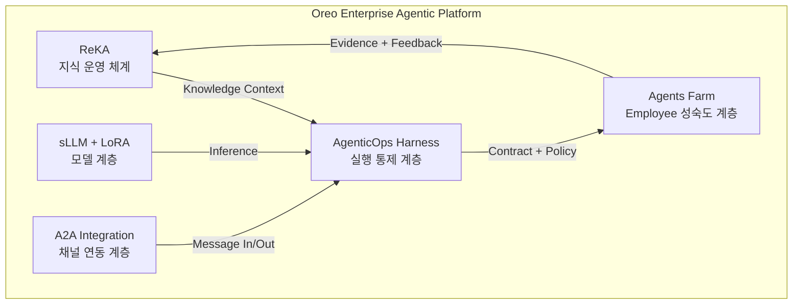

각 구성 요소는 독립적으로 존재하지 않고, 서로 긴밀하게 연결되어 있다. ReKA가 지식을 공급하고, sLLM이 추론을 담당하며, A2A가 외부 채널과 연결하고, AgenticOps Harness가 전체 실행을 통제하며, Agents Farm이 에이전트를 성숙시킨다. 그리고 성숙된 에이전트의 결과는 다시 ReKA로 돌아가 지식 품질을 높인다.

---

## 2. ReKA: 지식을 자산으로 바꾸는 통합 운영 체계

### 2.1 ReKA란 무엇인가

ReKA(Knowledge Library)는 사내 지식을 **권한 기반으로 수집·저장·조회하고, 답변 근거를 명확히 남기는 체계**다. 이름에서 알 수 있듯이 단순한 RAG(Retrieval-Augmented Generation) 시스템이 아니다.

흔히 이런 시스템을 처음 접하는 사람들은 다음과 같은 오해를 한다.

| 오해 | 진실 |
|---|---|
| 단순 검색창이다 | 검색 + 관계 + 근거 + 권한의 통합체다 |
| 새로운 입력 도구다 | 기존 업무 도구에 쓰면 알아서 연동된다 |
| 단일 BU만의 도구다 | 편의점, 홈쇼핑, MD, 물류 공통 인프라다 |

ReKA의 핵심 가치는 "검색이 잘 된다"는 것이 아니라, **지식이 일하는 방식을 바꾼다**는 데 있다. 기존에 회사 안에 있는 지식은 흩어져 있고, 최신인지 알기 어렵고, 누가 봐도 되는지 불분명하며, 어떤 답변의 근거로 쓰였는지 남지 않는다. ReKA는 이 네 가지 문제를 동시에 해결하려 한다.

### 2.2 ReKA의 운영 원리

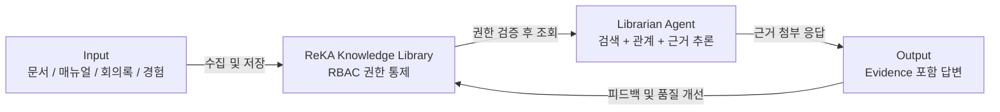

ReKA의 데이터 흐름은 단방향이 아니다. 답변 결과가 다시 지식 품질 개선으로 돌아오는 **피드백 루프**가 내장되어 있다. 이는 ReKA가 정적인 문서 저장소가 아니라, 살아있는 지식 자산 관리 시스템임을 의미한다.

### 2.3 RBAC(Role-Based Access Control)의 역할

ReKA에서 권한(RBAC)은 단순히 "볼 수 있다/없다"를 결정하는 보안 장치가 아니다. 지식 접근의 경로 자체를 설계하는 핵심 구조다.

기존의 지식 접근 방식은 **조직 → 지식**의 직선적 구조였다. 특정 조직에 속하면 해당 조직의 지식 전체에 접근할 수 있었다. 그러나 ReKA가 지향하는 새로운 구조는 다르다.

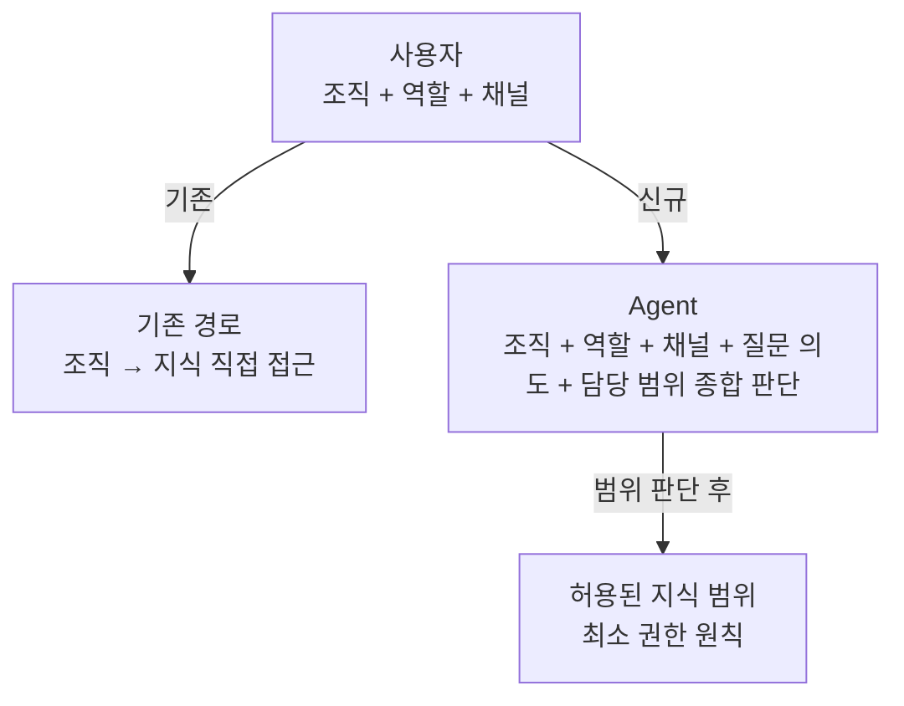

새로운 구조에서 에이전트는 사용자의 조직, 역할, 채널, 질문 의도, 담당 범위를 함께 보고 검색할 수 있는 지식의 범위를 판단한다. 이 범위 안에서만 답한다. 단순히 "이 팀 소속"이라는 이유만으로 모든 지식에 접근할 수 없다.

### 2.4 Evidence(근거)의 운영적 의미

ReKA에서 Evidence는 장식이 아니라 운영의 기본 단위다. AI 답변이 그럴듯하다고 충분하지 않다. 세 가지가 확인되어야 한다.

1. **어떤 문서를 보고 답했는가** - 출처 명시
2. **그 문서를 볼 권한이 있었는가** - 권한 검증 이력
3. **답변 과정이 어디에 남았는가** - 감사 추적

이를 위해 ReKA의 운영 체계는 다음 다섯 단계의 흐름을 반드시 갖추어야 한다.

```
약속 (Contract) → 신호 (Signal) → 증거 (Evidence) → 확인 (Verify) → 막기 (Block)
```

이 흐름이 없으면 ReKA는 좋은 데모일 수는 있어도, 실제 업무를 맡길 수 있는 운영 체계가 되기 어렵다.

### 2.5 공통 인프라로서의 ReKA와 BU별 책임 구조

ReKA가 편의점·홈쇼핑·MD·물류에 걸친 공통 인프라가 되려면, 각 BU(Business Unit)의 책임 구조도 함께 설계되어야 한다. 다음 다섯 가지 질문에 반드시 답이 있어야 한다.

- 각 지식의 오너(Owner)가 누구인가
- 어떤 지식이 공통이고, 어떤 지식이 BU 전용인가
- 오답이 나오면 누가 고치는가
- 권한 정책은 누가 승인하는가
- 지식 품질 개선의 피드백 루프가 어떻게 연결되는가

이 질문들에 답이 없으면, ReKA는 단일 BU의 챗봇에 머문다.

---

## 3. sLLM + LoRA: 대체가 아닌 철저한 역할 분담

### 3.1 세 계층의 은유

sLLM, LoRA, ReKA의 관계를 이해하는 가장 직관적인 방법은 책으로 비유하는 것이다.

- **Base sLLM (EXAONE 등)**: 한국어 일반 능력을 담은 두꺼운 사전이다. 언어를 이해하고 생성하는 근본적인 능력을 제공한다. LG AI Research가 개발한 EXAONE은 2024년 3.5 시리즈(2.4B, 7.8B, 32B)를 거쳐 2025년 4.0으로 발전하며 추론과 생성 능력을 결합한 하이브리드 모델로 자리잡았다.

- **LoRA (Low-Rank Adaptation)**: 사전에 붙이는 얇은 부록이다. 도메인 특유의 말투, 용어 보강, 업무별 미세 조정을 담당한다. 중요한 것은 **지식은 LoRA가 아닌 ReKA가 외운다**는 원칙이다. LoRA에 지식을 넣으려는 시도는 모델 재학습이라는 고비용 구조를 초래하고, 지식 갱신도 어렵게 만든다.

- **ReKA**: 답변의 팩트와 근거를 제공하는 최신 자료철이다. 지식의 저장과 검색을 담당하며, LoRA가 아닌 ReKA를 통해 지식이 모델에 공급된다.

### 3.2 모델 할당 매트릭스 (2×2)

모든 요청을 동일한 모델로 처리하는 것은 비효율적이다. Oreo는 작업의 복잡도와 호출 빈도에 따라 모델을 두 가지로 나누어 활용한다.

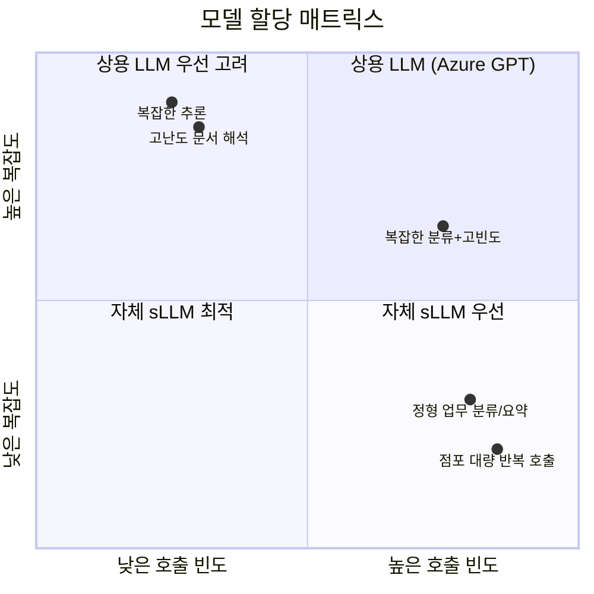

구체적으로 설명하면 다음과 같다.

**상용 LLM (Azure GPT)** 은 고난도 문서 해석과 복잡한 추론에 투입된다. 이런 작업은 발생 빈도가 상대적으로 낮고, 정확도 요구사항이 높다. 외부 API 비용이 발생하더라도 품질을 우선시하는 영역이다.

**자체 sLLM**은 점포나 매장의 대량 반복 호출, 정형화된 업무 분류와 요약에 투입된다. 유통 그룹 특성상 전국 수천 개 점포에서 동시다발적으로 발생하는 쿼리를 외부 API로 처리하면 비용이 폭발적으로 증가한다. 자체 sLLM은 이 문제를 해결하면서, 동시에 데이터가 외부로 나가지 않아 **보안**도 확보한다.

핵심 원칙은 **sLLM은 상용 LLM의 '대체'가 아니라는 것**이다. 반복 호출은 내부 모델(고정비/보안)로, 복잡한 추론은 외부로 나누는 역할 분담이다.

---

## 4. Google × Oreo A2A 연동 완료 사례

### 4.1 A2A 프로토콜의 배경

Google이 2025년 4월 발표한 A2A(Agent-to-Agent) 프로토콜은 서로 다른 벤더가 만든 AI 에이전트들이 서로를 발견하고, 작업을 위임하며, 엔터프라이즈 시스템 전반에서 협력할 수 있게 해주는 오픈 표준이다. HTTP, Server-Sent Events, JSON-RPC 2.0을 전송 계층으로 사용하며, Agent Cards를 통해 능력을 광고한다. 2026년 4월 기준으로 150개 이상의 조직이 이 표준을 지원하고 있다.

Oreo 팀은 이 A2A 프로토콜을 활용하여 Google Chat과 Gemini Enterprise를 Oreo 플랫폼에 연동하는 작업을 완료했다. 이 작업의 핵심 설계 원칙은 **"입구는 달라도 본체는 하나"** 다.

### 4.2 연동 아키텍처

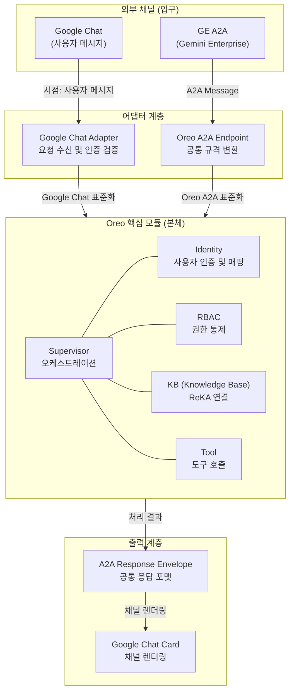

이 아키텍처의 핵심은 **Adapter & Endpoint를 통한 입구 단일화**다. 외부 채널의 요청을 수신하고 인증을 검증하여 내부로 전달하는 전용 게이트웨이 역할을 한다. 다양한 외부 Payload를 Oreo 내부 공통 규격으로 변환하여 비즈니스 로직을 일원화하는 것이 **Common Envelope 데이터 표준화**의 역할이다.

Oreo 핵심 모듈인 Supervisor, Identity, RBAC, KB, Tool은 어떤 채널이 연결되든 **본체 로직 수정 없이 그대로 재활용**된다. 이것이 "입구는 달라도 본체는 하나"의 실질적 의미다.

### 4.3 개발 과정에서 마주친 기술적 함정

연동 작업은 설계만큼 순탄하지 않았다. 다음 세 가지 주요 문제가 발생했고, 해결하면서 노하우가 축적되었다.

**Identity 매핑 오류**: 사용자 신원을 내부 시스템의 Identity와 연결하는 과정에서 불일치가 발생했다. 외부 채널의 사용자 ID 체계와 내부 RBAC의 사용자 ID 체계가 다르기 때문이다.

**채널별 카드 렌더링 차이**: 시스템(Pod-side)이 생성한 출력과 실제 채널에서 렌더링되는 결과가 다를 수 있다. Google Chat의 네이티브 렌더링 규칙('collapse' 등)은 별도로 검증해야 한다. 이것이 바로 Rule 33의 배경이 된다.

**Trace ID 단절**: 분산된 에이전트 환경에서 요청의 추적 ID가 중간에 끊어지는 문제다. 문제 발생 시 원인 추적이 불가능해지기 때문에, Trace ID의 연속성은 관측성(Observability)의 핵심 요건이다.

### 4.4 7단계 확장 체크리스트

이 연동 사례는 이후 다른 채널이나 에이전트로 확장할 때 재사용 가능한 패턴으로 정리되었다. 확장 검증은 7단계로 진행된다.

1. **입구 정의** - 신규 채널의 Adapter 또는 Endpoint 명세 확인
2. **Identity 배핑** - 외부 사용자 ID와 내부 Identity 매핑 설계
3. **공통 변환** - Common Envelope으로의 데이터 변환 규칙 정의
4. **Supervisor 라우팅** - 신규 채널 요청의 내부 라우팅 경로 설정
5. **응답 매핑** - 내부 응답을 채널별 출력 형식으로 변환
6. **완성도 확인** - Latency, 호출 수, 성공률, Datadog 지표 검증
7. **심해 설계** - 채널 고유 예외 처리 및 Dead-end 방지 설계

"숫자로 증명하는 운영 검증 완료"의 기준은 기능 구현만으로 끝나지 않는다. 수치적 지표(Latency, 성공률)와 Datadog 지원 가시성이 모두 확보되어야 완료로 간주한다.

---

## 5. AgenticOps Mindset: AI 개발 패러다임 시프트

### 5.1 전통적 접근과 Agentic 접근의 단절

AI를 도입한 개발 조직이 가장 먼저 깨야 할 고정관념이 세 가지 있다.

- **"옵션 A, B, C 중에 어떤 걸로 할까요?"** - AI에게 선택지를 제시하고 결정을 미루는 행동
- **"기능 개발 잘 완료되었습니다."** - 성공 여부만 보고하고 증거는 남기지 않는 행동
- **"모든 운영 및 배포 단계를 사람이 수동으로 모니터링."** - AI가 있음에도 모든 것을 사람이 직접 확인하려는 행동

Agentic 접근에서는 이 세 가지가 모두 금지된다. 대신 네 가지 핵심 원칙이 작동한다.

### 5.2 핵심 원칙 1: AI 주도, 인간 통제 (HITL 4 Gates)

AI Core(Claude, Codex 등)가 분석, 코드, 테스트 전체를 주도한다. 인간은 모든 단계에 개입하지 않고, 오직 네 개의 관문에서만 개입한다.

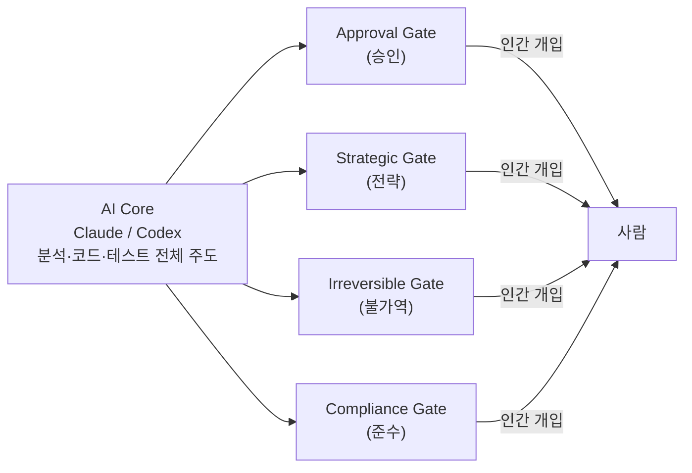

- **Approval Gate**: 중요한 의사결정의 최종 승인이 필요할 때
- **Strategic Gate**: 전략적 방향의 선택이 필요할 때
- **Irreversible Gate**: 롤백이 불가능한 불가역적 행동을 하기 직전
- **Compliance Gate**: 법적·규정적 준수 확인이 필요할 때

이 네 관문 외에는 AI가 자율적으로 처리한다. 사람이 모든 것을 검토하려는 충동을 억제하는 것이 AgenticOps Mindset의 첫 번째 관문이다.

### 5.3 핵심 원칙 2: 증거 기반 4축 보고

단순한 "성공/실패" 이분법적 보고는 금지된다. 모든 보고는 네 개의 축으로 구성된다.

| 축 | 설명 | 의미 |
|---|---|---|
| Verified (검증 됨) | 결과가 실제로 확인된 것 | 신뢰할 수 있는 완료 상태 |
| Not Verified (미검증) | 처리했으나 아직 확인되지 않은 것 | 추가 확인 필요 |
| Evidence (증거) | 판단의 근거가 된 데이터 | 왜 그렇게 판단했는가 |
| Next Blocker (다음 블로커) | 다음 단계를 막고 있는 것 | 무엇이 해결되어야 전진하는가 |

이 4축 보고 체계는 AI가 단순히 "완료했습니다"고 말하는 것이 아니라, 무엇을 확인했고, 무엇이 아직 불확실하며, 어떤 근거로 판단했고, 다음을 위해 무엇이 필요한지를 구조적으로 제시하게 만든다.

### 5.4 핵심 원칙 3: 추천 1개 + Tradeoff

AI는 "A, B, C 중에 무엇이 좋을까요?"라고 묻지 않는다. 반드시 **최적의 추천 방안 1개**와 **그에 따른 1줄 Tradeoff**를 함께 제시한다.

예시 형식:
> "추천: X 방식으로 구현합니다. Tradeoff: 초기 구현 속도는 빠르지만, 향후 확장 시 Y 부분을 재설계해야 합니다."

질문 대신 추천을 제시하는 이 원칙은 AI가 의사결정의 짐을 사람에게 전가하지 않게 만드는 핵심 규범이다.

### 5.5 핵심 원칙 4: Single-Trajectory & Hypothesis-driven

모든 Commit은 명확한 궤적(Trajectory)을 갖는다. 궤적이 닫히면 반드시 **사전 검증(Pre-validation)** 이 이루어져야 한다. 사전 검증의 질문은 단 하나다.

> "이게 Prod에서 조용히 실패하면 어떻게 알지?"

이 질문에 답할 수 없는 Commit은 완성된 것이 아니다. Hypothesis-driven 접근은 모든 행동에 "이 행동이 실패할 경우의 감지 방법"을 미리 설계해두는 것이다.

---

## 6. 6-Tier 시스템 해부도: The Core Metaphor

### 6.1 로봇 팔 은유

Oreo 시스템의 6계층 구조를 이해하는 가장 직관적인 은유는 정밀한 로봇 팔이다. 로봇 팔은 관절(Joint)을 따라 움직이고, 각 부위에는 신경망, 감각기관, 반사 메커니즘, 차단 장치가 내장되어 있다. Oreo 시스템도 마찬가지다.

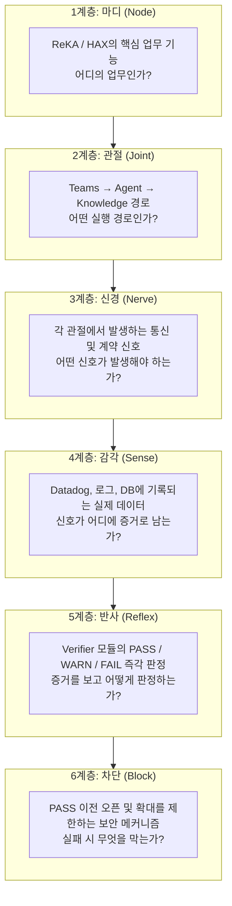

### 6.2 각 계층의 역할

**마디(Node)** 는 업무 기능의 핵심 단위다. ReKA에서는 지식 검색 기능이, HAX에서는 사용자 경험 자동화 기능이 마디에 해당한다. "어디의 업무인가?"라는 질문에 답한다.

**관절(Joint)** 은 업무가 실행되는 경로다. Microsoft Teams라는 채널을 통해 에이전트로, 그리고 Knowledge Base로 이어지는 실행 경로 전체가 관절에 해당한다. "어떤 실행 경로인가?"라는 질문에 답한다.

**신경(Nerve)** 은 각 관절에서 발생해야 하는 통신 및 계약 신호다. 에이전트가 어떤 행동을 했을 때 어떤 이벤트가 발생해야 하는지, 어떤 계약 신호가 발행되어야 하는지를 정의한다.

**감각(Sense)** 은 신호가 실제로 기록되는 곳이다. Datadog의 메트릭, 로그 파일, 데이터베이스가 여기에 해당한다. 신경이 "신호가 발생해야 한다"고 정의한다면, 감각은 "신호가 실제로 어디에 증거로 남는가"를 담당한다.

**반사(Reflex)** 는 감각으로 수집된 증거를 보고 즉각적으로 판정하는 Verifier 모듈이다. PASS(통과), WARN(경고), FAIL(실패) 세 가지 판정을 내린다. 이 판정은 사람의 개입 없이 즉각적으로 이루어진다.

**차단(Block)** 은 PASS가 확인되기 전에 확대나 오픈을 막는 보안 메커니즘이다. 실패가 감지되었을 때 무엇을 막을지, 어떤 범위까지 확산을 차단할지를 정의한다.

이 여섯 계층의 관계를 한 문장으로 요약하면 다음과 같다.

> "ReKA의 업무 마디가 Teams 관절을 따라 움직이고, 각 구간의 신경망 신호가 Datadog에 감각(증거)으로 남으며, Verifier가 반사적으로 판정하여 실패를 차단한다."

---

## 7. Golden Rules: 채널 통합의 절대 규칙 통제도

### 7.1 규칙의 우선순위 체계

Oreo의 채널 통합에는 세 개의 우선순위 계층으로 구성된 절대 규칙이 존재한다. 이 규칙들은 운영 경험에서 얻은 교훈을 코드화한 것이며, 위반 시 실제 운영 문제로 직결된다.

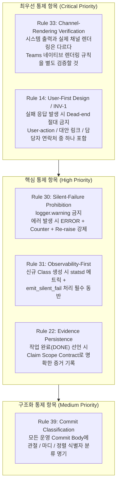

### 7.2 Rule 33: 채널 렌더링 검증의 함정

가장 자주 놓치는 규칙이 Rule 33이다. 개발자가 시스템(Pod-side)에서 생성한 출력과 실제 Google Chat 또는 Microsoft Teams에서 사용자가 보는 화면이 다를 수 있다. 채널마다 카드 렌더링 규칙이 다르고, 'collapse' 동작 등의 UI 동작 방식이 플랫폼별로 상이하다.

실패 응답의 형태는 반드시 다음 네 가지 중 하나여야 한다.

| 응답 유형 | 설명 |
|---|---|
| User-action | 사용자가 직접 취할 수 있는 행동 안내 |
| Alternative link | 다른 경로를 통한 대안 링크 |
| Contact info | 담당자 연락처 |
| ~~Dead-end~~ | **절대 금지** - 더 이상 갈 곳이 없는 막힌 응답 |

### 7.3 Rule 30: 조용한 실패는 없다

`logger.warning`으로만 기록하고 넘어가는 이른바 "조용한 실패(Silent Failure)"는 엄격히 금지된다. 에러가 발생하면 다음 세 가지가 반드시 함께 실행되어야 한다.

1. **ERROR 로그**: 에러 내용의 명시적 기록
2. **Counter 증가**: Datadog 등 메트릭 시스템의 카운터 증가
3. **Re-raise**: 에러를 상위로 다시 던져 전파

이 세 가지가 동반되어야만 나중에 조사할 때 에러의 발생 시점, 빈도, 전파 경로를 모두 추적할 수 있다.

### 7.4 Rule 22: "완료"의 의미를 재정의한다

작업 완료(DONE) 선언이 실제로 완료를 의미하려면, Claim Scope Contract를 통해 **명확한 증거가 기록**되어야 한다. "완료했습니다"는 신뢰할 수 없다. "다음 증거가 기록되었고, 그 내용이 계약 범위와 일치합니다"가 완료다.

### 7.5 Rule 39: Commit의 신원 확인

모든 운영 Commit의 Body에는 세 가지 식별자가 명기되어야 한다.

- **JOINT ID** (예: J-01): 어떤 관절(실행 경로)에 속하는 변경인가
- **NODE ID** (예: N-A): 어떤 마디(업무 기능)에 속하는 변경인가
- **ALIGNMENT ID** (예: A-REV): 어떤 정렬(전략 방향)과 연결된 변경인가

이 분류 체계가 없으면 수백 개의 Commit이 쌓였을 때 어떤 변경이 어떤 업무에 영향을 주는지 추적이 불가능해진다.

---

## 8. Ralph vs. Oreo: 에이전트 자율성과 기업형 통제의 조화

### 8.1 Ralph의 철학: "LLM 컨텍스트 대신 Repo 상태를 믿어라"

Ralph는 개인 개발자의 생산성을 극대화하기 위한 에이전트 패턴이다. 핵심 철학은 단순하다.

- 매번 세션을 초기화한다
- 대화 기억(LLM 컨텍스트)에 의존하지 않는다
- 대신 Git 히스토리와 파일(prd.json 등)을 작업 기억으로 활용한다

이 방식의 장점은 **Fresh Context Loop**다. 컨텍스트가 오염되거나 잊혀지는 문제가 없다. 항상 현재 상태(Repo 상태)에서 출발하기 때문에 일관성이 높다. 단점은 거칠다는 것이지만, 작업의 흔적(Git 커밋)이 남기 때문에 수렴한다.

Ralph의 종료 조건은 명확하다: **모든 Story Pass**.

### 8.2 Oreo Enterprise Harness의 철학: "계약, 정책, 증거로 실행 경계를 닫아라"

Oreo는 개인이 아닌 **기업 환경**을 위한 에이전트 운영 체계다. Ralph의 단순함만으로는 부족한 세 가지 질문에 답해야 한다.

1. 누가 요청했는가 (Identity)
2. 어떤 지식을 볼 수 있는가 (ReKA + RBAC)
3. 언제 사람 승인이 필요한가 (HITL 4 Gates)

Oreo의 메모리 계층은 Ralph의 Git/파일이 아니라 Ledger, DB, Datadog이다. 종료 조건도 단순 "Story Pass"가 아니라 **5-Phase Gate 통과와 HITL 승인**이다.

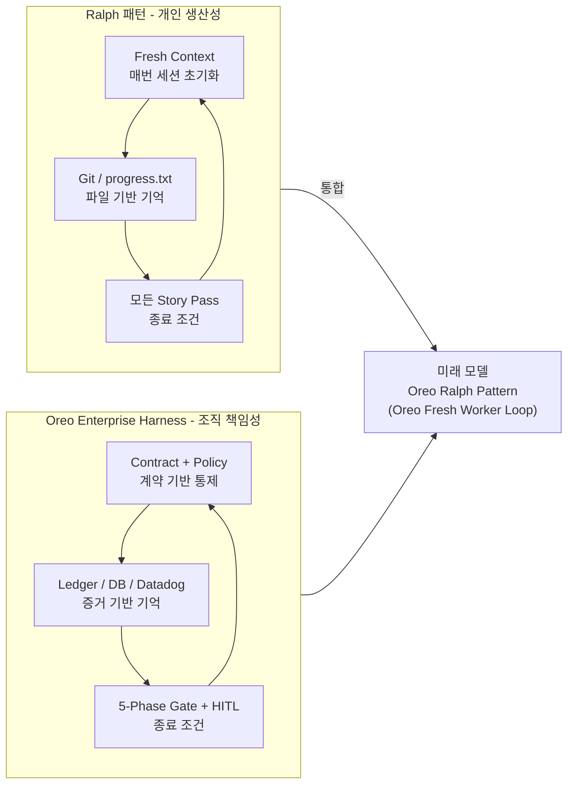

### 8.3 미래 모델: Oreo Ralph Pattern

Ralph의 Fresh Context Loop와 Oreo의 Enterprise Harness를 결합한 미래 모델이 **Oreo Ralph Pattern**, 또는 **Oreo Fresh Worker Loop**다. 이 패턴의 실행 흐름은 다음과 같다.

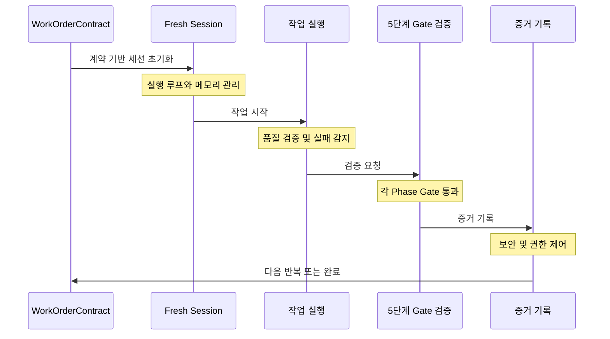

**WorkOrderContract**는 에이전트에게 주어지는 공식 작업 명세다. 에이전트는 이 계약의 범위 안에서만 일한다. Fresh Session은 매번 새로운 컨텍스트로 시작하지만, WorkOrderContract가 연속성을 보장한다. 5단계 Gate 검증은 품질과 보안을 동시에 확인하고, 모든 결과는 증거로 기록된다.

---

## 9. Oreo Agents Farm: AgenticWorker에서 AgenticEmployee로의 진화

### 9.1 Worker와 Employee의 근본적 차이

에이전트를 단순히 "요청된 작업을 수행하는 자동화 도구(Worker)"로 보는 관점과, "부여된 미션과 책임 경계 내에서 지속적으로 업무를 완수하는 직원(Employee)"으로 보는 관점 사이에는 근본적인 차이가 있다.

| 구분 | Worker (작업자) | Employee (직원) |
|---|---|---|
| 작동 방식 | Prompt instruction에 따라 단일 작업 수행 | 미션(Mission) + 책임(Responsibility) + 정책(Policy) 기반 |
| 지속성 | 요청이 있을 때만 작동 | 경계 내에서 지속적으로 업무 완수 |
| 자율성 | 지시된 것만 실행 | 상황 판단하여 적합한 행동 선택 |
| 책임 | 없음 (지시 따름) | 미션·권한·정책·증거·HITL 경계 모두 보유 |

AgenticEmployee는 **사람의 대체재가 아니다**. 미션, 권한, 정책, 증거, HITL 경계를 가진 업무 단위다.

### 9.2 L0에서 L5까지의 성숙도 모델

에이전트의 성숙도는 6단계로 구분된다.

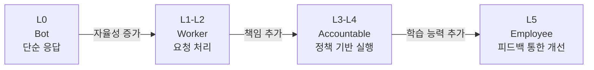

각 단계의 핵심 지표와 목표 상태는 명확하다.

| 성숙도 레벨 | 핵심 지표 | 목표 상태 |
|---|---|---|
| L1-L2 (Worker) | 권한 위반 호출 수 (Unauthorized Calls) | Downstream 0 (차단 완료) |
| L3-L4 (Accountable) | 근거(Citation) 커버리지 | 80% 이상 근거 제시 (90%+ Citation) |
| L5 (Employee) | 반복 실패 감소율 (Repeat Failure Reduction) | 지식 개선 후 실패율 30% 감소 |

### 9.3 책임 있는 자율성 (Bounded Autonomy)

AgenticEmployee의 자율성은 다섯 개의 경계 안에서 작동한다.

- **미션(Mission)**: 이 에이전트가 달성해야 할 목표
- **권한(Authority)**: 허용된 도구와 리소스의 범위
- **정책(Policy)**: 준수해야 할 규칙과 제약
- **증거(Evidence)**: 모든 행동의 기록 의무
- **HITL 경계**: 인간이 반드시 개입해야 하는 시점

이 다섯 경계가 명확하게 정의된 에이전트만이 진정한 의미의 AgenticEmployee다.

### 9.4 4대 핵심 계약 프레임워크

Oreo에서 에이전트는 네 개의 계약 구조 안에서 실행된다.

**Policy SSOT(Single Source of Truth) & Runtime Enforcement**

정책은 단일 기준(SSOT)으로 관리되어야 한다. 프롬프트 지침이 아닌, 시스템 런타임에서 강제로 집행되어야 한다. 프롬프트는 "이렇게 해주세요"라는 요청이다. 하지만 계약은 위반 시 실행 자체가 차단된다.

**ReAct Strategy & Evidence Gate**

에이전트는 ReAct(Reasoning + Acting) 전략으로 자율적 전략을 수립하되, 모든 결과물은 허용된 지식(KB)과 도구 사용 근거를 담은 **증거 팩(Evidence Pack)** 을 통과해야 한다. 증거 팩은 두 가지를 포함한다.

1. 허용된 지식(KB): 답변에 사용된 지식이 허가된 범위 내인지 확인
2. 도구 사용 근거: 어떤 도구를 왜 사용했는지의 이력

핵심 원칙은 다음으로 요약된다.

> **"프롬프트는 지침일 뿐, 계약이 강제다."**

"규칙을 지켜라"라는 프롬프트보다, 정책을 위반하는 도구 호출 자체를 원천 차단하는 계약 구조가 엔터프라이즈 AI의 핵심이다.

---

## 10. Claude Enterprise 파일 첨부 통제와 Oreo Intake

### 10.1 파일 첨부가 보안의 입구인 이유

Claude Enterprise를 도입한 조직에서 가장 먼저 직면하는 현실적 문제가 있다. 사용자가 Claude Desktop을 열고 회사 문서를 그대로 붙여넣는 순간, 보안의 경계가 흔들린다. 파일 첨부는 작은 기능처럼 보이지만, 실제로는 **회사 자료가 AI로 들어가는 입구**다.

이 입구를 어떻게 통제하느냐가 Enterprise AI 보안의 핵심이다. 파일 첨부를 통제한다는 것은 단순히 첨부 버튼 하나를 막는 것이 아니다. 다음 네 가지를 정하는 일이다.

1. 사용자가 **어떤 자료**를 AI에 전달할 수 있는가
2. **어떤 경로**를 통해 전달해야 하는가
3. **어떤 검증**을 거쳐야 하는가
4. **어떤 AI**에 전달할 수 있는가

### 10.2 Oreo Intake: 공식 경로 설계

회사 자료가 AI에 도달하기 전의 공식 경로가 **Oreo Intake**다.

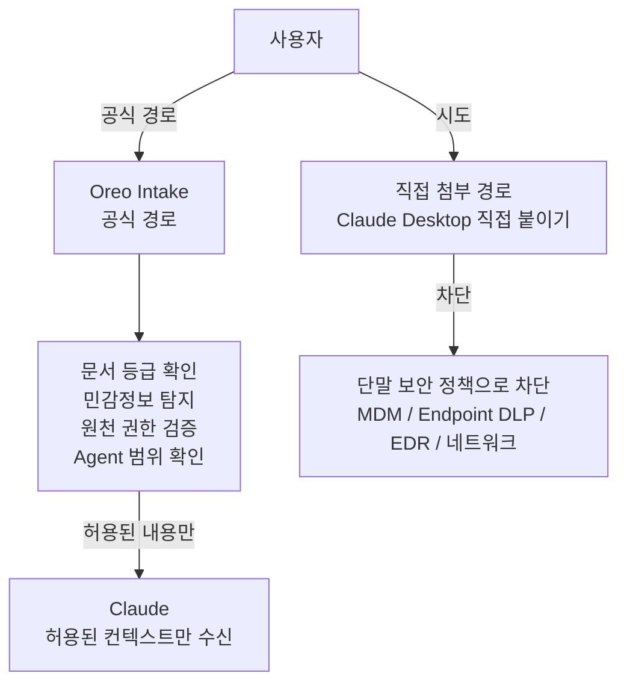

Oreo Intake를 통과하면 다음 네 가지가 순서대로 확인된다.

- **문서 등급 확인**: 이 자료의 보안 등급은 무엇인가
- **민감정보 탐지**: 개인정보, 영업비밀 등 민감 데이터가 포함되어 있는가
- **원천 권한 검증**: 이 사용자가 이 자료를 AI에 제공할 권한이 있는가
- **Agent 범위 확인**: 이 자료를 처리할 수 있는 Agent의 범위는 어디까지인가

### 10.3 역할의 명확한 분리

보안 아키텍처에서 각 구성요소의 역할은 명확하게 분리된다.

| 구성요소 | 역할 |
|---|---|
| Oreo Intake | 안전한 공식 경로를 만든다 |
| 단말 보안 (MDM/DLP/EDR) | 위험한 직접 첨부 경로를 막는다 |
| Claude Enterprise | 조직이 관리하는 AI 사용 환경이 된다 |

중요한 원칙은 **파일이 올라간 뒤에 감사하는 것이 아니라, 올라가기 전에 확인하는 것**이다. 원본을 그대로 넘기는 것이 아니라, 필요한 만큼만 제공하는 것. 그 과정이 증거로 남는 것.

사용자 경험 측면에서도 중요한 원칙이 있다. "Claude에 직접 첨부할 수 없습니다"에서 끝나면 불편만 남는다. 반드시 **"회사 자료는 Oreo Intake로 검증한 뒤 Claude에서 사용할 수 있습니다"** 까지 이어져야 한다.

---

## 11. Agentic 자율성과 계약 기반 통제의 철학

### 11.1 자동화와 Agentic의 경계

단순히 callback을 붙이고 정해진 이벤트에 반응하는 것은 **자동화**다. Agentic 시스템은 다르다. 다음 네 가지를 스스로 해낼 수 있어야 한다.

1. 목표를 이해한다
2. 필요한 경로를 판단한다
3. 도구를 선택한다
4. 결과를 검증한다

그러나 ReAct(Reasoning + Acting) 루프를 붙인다고 자동으로 안전해지는 것이 아니다. 루프가 어떤 권한 안에서 움직이는지, 어떤 지식에 접근해도 되는지, 어떤 도구를 호출할 수 있는지, 언제 멈춰야 하는지가 명확하지 않으면 위험하다.

### 11.2 Oreo가 바라보는 올바른 계약 구조

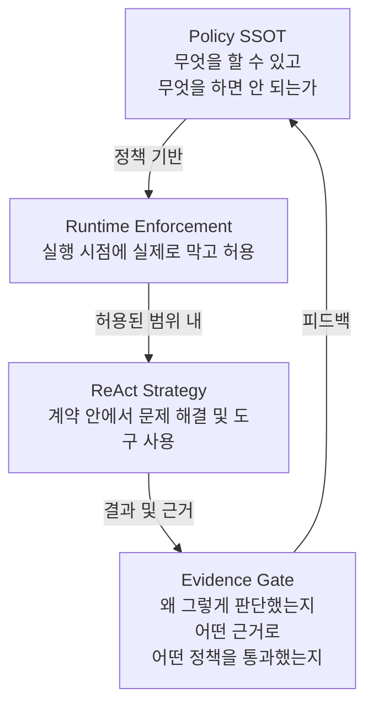

이 네 요소가 모두 갖추어져야 비로소 신뢰할 수 있는 에이전트가 된다. 특히 **Policy SSOT**는 문서에만 있으면 안 된다. 실행 시점의 Runtime Enforcement가 있어야 한다.

### 11.3 공통 계약 프레임과 개별 에이전트 정책

HR 에이전트, ReKA 에이전트, HAX 에이전트, OFC 에이전트, AIOps 에이전트가 각자 다른 방식으로 권한과 경계를 구현하면, 운영이 복잡해지고 같은 문제가 반복된다.

달라져야 하는 것은 프레임워크가 아니다. **각 에이전트의 business mission policy**다.

| 구분 | 내용 |
|---|---|
| 공통 계약 | 하나의 프레임워크 (Policy SSOT, Runtime Enforcement, ReAct, Evidence Gate) |
| 개별 에이전트 | 자신의 미션, 허용된 지식, 도구, 위임 범위, 증거 기준만 다르게 |

### 11.4 랄프와 하네스에서 Oreo가 배운 것

**랄프(Ralph)** 는 반복을 말한다. 에이전트를 계속 돌리되, 대화의 기억 대신 repo와 파일과 git history를 기억으로 삼는다. 매번 새로 시작하지만 작업의 흔적은 남는다.

**하네스(Harness)** 는 환경을 말한다. 에이전트에게 일을 시키는 것이 아니라, 에이전트가 일할 수 있는 환경을 만든다. 문서, 규칙, 테스트, 도구, 권한, 피드백 루프를 설계한다. 모델을 믿는 것이 아니라, **모델이 실수해도 다시 잡아낼 수 있는 구조**를 믿는다.

**Oreo**는 이 두 흐름을 기업 환경으로 가져온다. 랄프처럼 fresh하게, 하네스처럼 통제 가능하게, 그리고 기업에서는 그것만으로 부족하기에 계약이 더해진다.

> "자율성은 계약 안에서 움직일 때 의미가 있다. 통제는 에이전트를 막기 위한 것이 아니라, 더 멀리 보내기 위한 안전장치다."

---

## 12. 종합 결론: Oreo가 만들려는 세계

### 12.1 궁극적인 목표

Oreo 프로젝트의 궁극적인 목표는 "똑똑한 챗봇"이 아니다. 다음 네 가지 특성을 가진 구조다.

1. **일을 맡길 수 있는 구조** - 에이전트에게 업무를 위임하고 사람이 다른 일에 집중할 수 있다
2. **실패해도 흔적이 남는 구조** - 무엇이 잘못되었는지 추적할 수 있다
3. **다음 세션이 이전 세션을 믿지 않아도 이어갈 수 있는 구조** - Fresh Context이지만 연속성이 있다
4. **사람이 모든 것을 기억하지 않아도 조직이 계속 전진하는 구조** - 지식이 사람에 종속되지 않는다

### 12.2 에이전트 생태계의 현재 위치

2025년 4월 Google이 발표한 A2A 프로토콜이 2026년 기준으로 150개 이상의 조직에서 채택되었고, 국내외 주요 AI 에이전트들이 빠르게 통합 생태계를 형성하고 있다. Oreo 팀의 내부 공유에서도 "에이전트는 GE(Google Enterprise)로 대동단결 중"이라는 표현이 나온다. Oreo는 이 흐름에서 **Thin Agent만 남기는 방향**으로 진화하고 있다. 핵심 모듈(Supervisor, Identity, RBAC, KB, Tool)을 공통으로 유지하면서, 채널 어댑터는 얇게 유지하는 구조다.

### 12.3 Oreo가 증명하려는 것

Oreo가 가장 근본적으로 증명하려는 것은 다음 명제다.

> **AI 보안은 모델을 믿는 일이 아니다. 자료가 모델에 닿기 전의 경로를 통제하는 일이다.**

그리고 그 통제는 에이전트를 막기 위한 것이 아니라, 에이전트가 **믿을 수 있게 일할 수밖에 없는 구조**를 만들기 위한 것이다.

결국 우리가 만들어야 하는 것은 답변을 잘하는 AI가 아니라, **지식이 일하는 방식을 바꾸는 운영 체계**다.

---

## 참고: 핵심 용어 정리

| 용어 | 정의 |
|---|---|
| ReKA | 권한 기반 지식 수집·저장·조회 및 증거 보존 통합 운영 체계 |
| RBAC | Role-Based Access Control. 역할 기반 접근 통제 |
| sLLM | Small/Self LLM. 자체 운영하는 소형 언어 모델 |
| LoRA | Low-Rank Adaptation. 사전학습 모델의 경량 파인튜닝 기법 |
| EXAONE | LG AI Research가 개발한 한국어 중심 대형 언어 모델 시리즈 |
| A2A | Agent-to-Agent. Google이 2025년 4월 발표한 에이전트 간 상호운용 오픈 프로토콜 |
| HITL | Human-in-the-Loop. 인간이 AI 의사결정에 개입하는 거버넌스 방식 |
| AgenticOps | Agentic + Operations. AI 에이전트 기반 운영 방법론 |
| Evidence Pack | 에이전트 행동의 근거(허용 지식 + 도구 사용 이력)를 담은 증거 묶음 |
| Policy SSOT | 정책의 단일 진실 공급원 (Single Source of Truth) |
| Oreo Intake | 회사 자료가 AI에 도달하기 전 검증을 거치는 공식 경로 |
| WorkOrderContract | 에이전트에게 주어지는 계약 기반 공식 작업 명세 |
| Ralph Pattern | Fresh Context Loop 기반의 개인 에이전트 생산성 패턴 |
| AgenticEmployee | 미션·권한·정책·증거·HITL 경계를 가진 성숙한 AI 에이전트 단위 |
| HAX | Headless Automation eXperience. 사용자 경험 자동화 에이전트 (추정) |
| Bounded Autonomy | 계약과 정책 경계 안에서의 책임 있는 자율성 |

---

*작성일: 2026-06-04*

*본 문서는 내부 공유된 NotebookLM 기반 아키텍처 자료를 기반으로 작성되었습니다. Oreo 플랫폼은 현재 개발 진행 중인 내부 엔터프라이즈 AI 플랫폼이며, EXAONE(LG AI Research), Google A2A Protocol, Claude Enterprise(Anthropic) 등 공개된 외부 기술을 참조합니다.*
