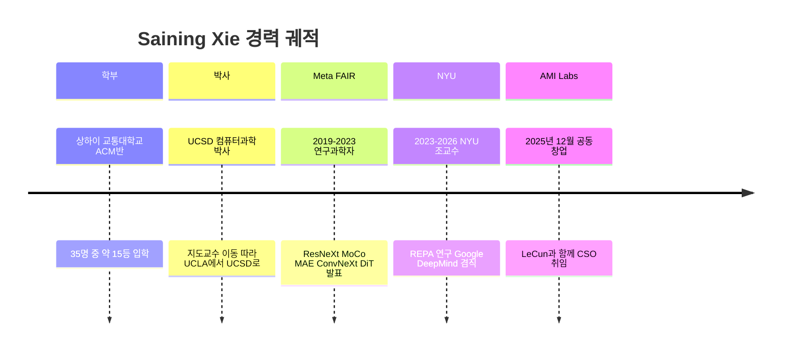
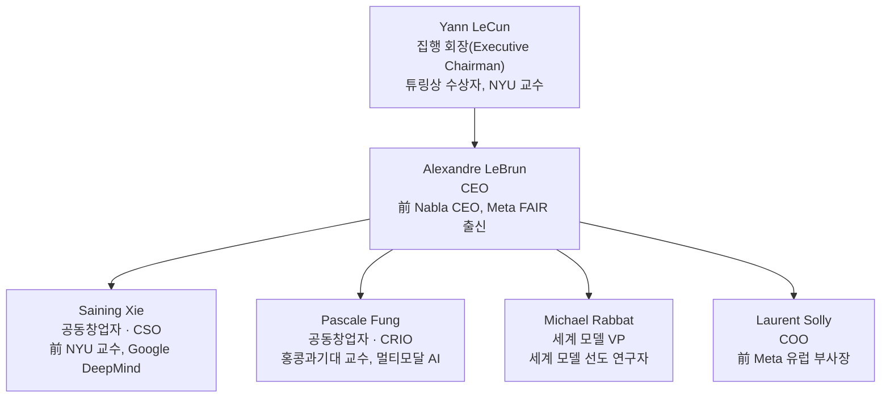
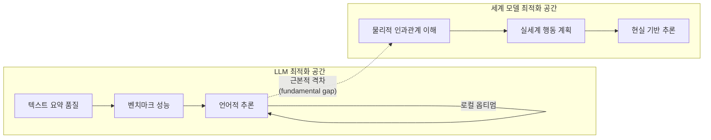
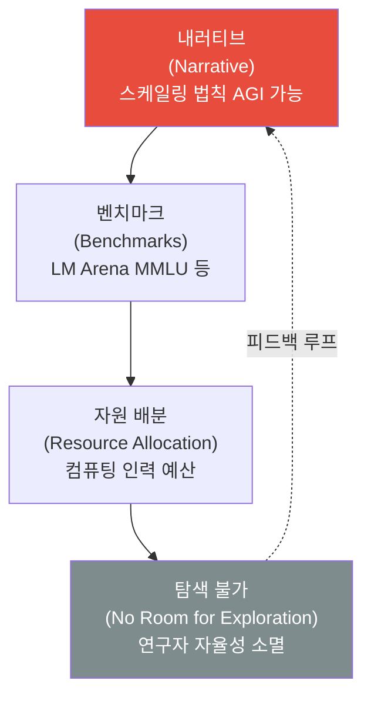
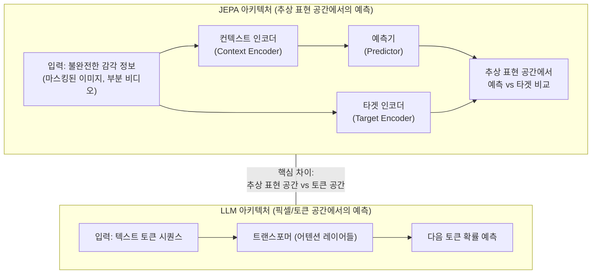
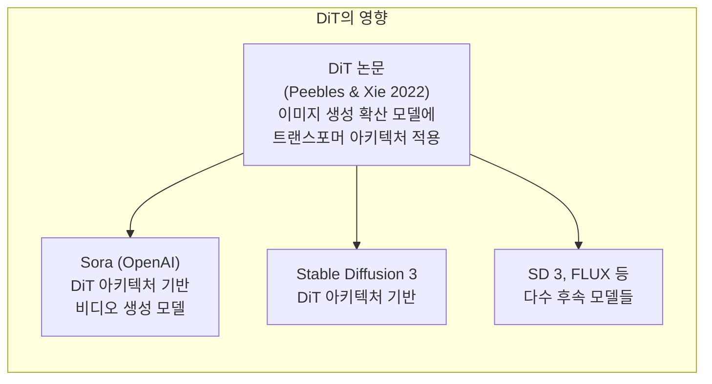
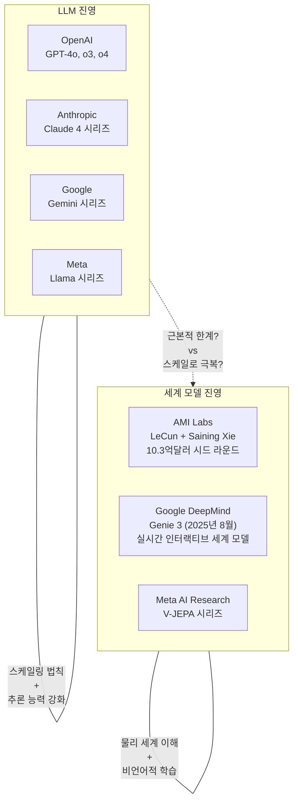

## 谢赛宁(Saining Xie)와의 7시간 마라톤 인터뷰 완전 분석

> **원문 출처:** 張小珺(Zhang Benita) 팟캐스트 「商業訪談錄」 133화 (2026년 3월 공개, 405분)  
> **정리/분석:** Annie([@anniebuildz](https://x.com/anniebuildz/status/2033981657964024214)) X(트위터) 스레드 기반  

---

## 목차

1. [들어가며: 영어권에서 거의 들리지 않은 목소리](#1-들어가며)
2. [谢赛宁은 누구인가: B급이라는 자기 묘사의 역설](#2-谢赛宁은-누구인가)
3. [AMI Labs: LeCun과의 만남, 그리고 10억 달러](#3-ami-labs)
4. [핵심 주장: LLM은 근본적으로 결함 있는 세계 모델](#4-핵심-주장)
5. [언어는 아편이다: 정보 격차와 세계 모델 개념](#5-언어는-아편이다)
6. [철학적 참조 비판: 비트겐슈타인과 파인만 인용의 왜곡](#6-철학적-참조-비판)
7. [실리콘밸리의 가치 사슬: 누가 벽을 보지 못하게 하는가](#7-실리콘밸리의-가치-사슬)
8. [마스터카드 전략: AMI의 데이터 연합](#8-마스터카드-전략)
9. [JEPA 아키텍처: 언어가 아닌 세계에서 시작하는 지능](#9-jepa-아키텍처)
10. [DiT에서 REPA까지: 연구자로서의 발자취](#10-dit에서-repa까지)
11. [카이밍 허와 금강경: 연구 철학의 형성](#11-카이밍-허와-금강경)
12. [Rich Sutton의 다람쥐 논의와 로봇의 본질적 난제](#12-rich-sutton의-다람쥐-논의)
13. [워싱턴 스퀘어 파크: 5분의 의미](#13-워싱턴-스퀘어-파크)
14. [42: 모든 것의 답이지만 질문을 모른다](#14-42)
15. [마치며: 이 인터뷰가 중요한 이유](#15-마치며)

---

## 1. 들어가며

2026년 봄, 중국어 AI 팟캐스트 생태계에서 하나의 기념비적인 에피소드가 조용히 공개되었다. 張小珺(장샤오쥔, Zhang Benita)가 진행하는 「商業訪談錄(상업 인터뷰 기록)」 133화, 제목은 「谢赛宁에 대한 7시간 마라톤 인터뷰: 세계 모델, 실리콘밸리 탈출, AMI Labs, 두 번의 Ilya 거절, Yann LeCun, Fei-Fei Li, 그리고 42」였다. 총 405분, 약 7시간에 달하는 이 대화는 영어권 AI 커뮤니티에서는 거의 주목받지 못했다.

배경부터 남다르다. 2026년 설 연휴, 중국에서는 로봇이 춘완(설날 특집 방송)에 등장하며 화제가 된 시기였고, 뉴욕은 수년 만에 가장 매서운 겨울을 보내고 있었다. 폭설이 지나간 직후 브루클린의 한 허름한 건물에서 두 사람은 오후 2시부터 자정이 넘을 때까지 대화를 나눴다. 이것은 준비된 무대 인터뷰가 아니었다. 정제되지 않은, 기나긴 겨울의 마라톤 대화였다.

인터뷰이인 谢赛宁(사이닝 시에, Saining Xie)는 당시 Yann LeCun과 함께 AMI Labs를 공동 창업하고, 수석 과학 책임자(CSO)로서 세계 모델 연구에 본격적으로 뛰어든 상태였다. AMI Labs는 당시 이미 제품 하나 없이 10.3억 달러의 시드 라운드를 완료하고, 투자전 기업가치 35억 달러를 기록한 직후였다. 이 대화는 그 자금과 그 선택의 배경, 그리고 현재 AI 업계에서 가장 뜨거운 논쟁인 LLM(대형 언어 모델) 대(對) 세계 모델 패러다임에 대한 가장 일관되고 솔직한 반론 중 하나다.

Annie(@anniebuildz)는 이 팟캐스트를 AnyGen을 통해 정확한 트랜스크립트로 변환하고, 200개 이상의 핵심 논지를 추출하여 영어 스레드로 정리했다. 본 문서는 그 스레드와 실제 팟캐스트 내용, 그리고 최신 맥락 정보를 종합하여 한국어로 상세하게 재구성한 것이다.

---

## 2. 谢赛宁은 누구인가

### 2-1. B급이라는 자기 묘사의 역설

AI 업계에는 천재 신화가 넘쳐난다. 어릴 때부터 각종 올림피아드를 석권하고, 최고의 대학에서 최고의 지도교수 밑에서 최단 기간에 박사를 마치고, 최고의 연구소로 직행하는 서사가 그것이다. Saining Xie의 이야기는 그런 직선 궤도가 아니다. 그래서 오히려 더 흥미롭다.

그의 자기 묘사는 단 두 글자로 압축된다. "B급(B class)." 상하이 교통대학교 ACM(알고리즘 경쟁) 반에 조기입학으로 들어갔지만 35명 중 약 15등이었다. 대학 시절 최고의 순간을 꼽으라는 질문에 그는 "신입생 여름방학이 내 인생의 정점이었다. 두 달 동안 아무것도 안 하고 기숙사에서 Dota만 했다"고 답했다. ACM 학생이라면 당연히 마이크로소프트 리서치 아시아(MSRA)로 인턴을 가야 하던 관행 속에서, 그는 지도교수에게 이렇게 말했다고 한다. "저 정말로 MSRA에 가고 싶지 않습니다. 싱가포르에서 제가 진짜 관심 있는 연구를 하고 싶습니다."

박사 과정도 평탄하지 않았다. UCLA에 지원했는데, 입학 예정 일주일 전에 지도교수 후보가 UCLA에서 UC샌디에이고(UCSD)로 자리를 옮겼다. 많은 학생이 당황하거나 다른 선택을 했을 상황이다. 그는 그냥 따라갔다. "중요한 건 어느 대학 이름이 아니라 누구와 함께 일하느냐다"라는 판단에서였다.

이 B급의 자기 묘사는 일종의 인식론적 장치이기도 하다. 그는 자신이 "특별한 원(Special One)"이 아니라 "평범한 원(Normal One)"이라고 표현하며 위르겐 클롭(Jürgen Klopp) 전 리버풀 감독의 말을 빌렸다. 클롭은 당시 조세 모리뉴가 자신을 "스페셜 원"이라고 자칭한 것에 대해 "나는 스페셜 원이 아니라 노멀 원"이라고 했다. 그러나 이 특정한 "노멀 원"은 그후 카이밍 허(Kaiming He)와 함께 연구하고, Ilya Sutskever의 제안을 두 번 거절하고, Fei-Fei Li와 협력하고, 튜링상 수상자와 함께 10억 달러짜리 스타트업을 공동 창업했다.

"많은 것이 우연에서 비롯된다. 그러나 때로 우연도 일종의 필연이다."

### 2-2. 경력: 선택들의 집합

UCSD에서 박사 학위를 마친 후 그는 Meta FAIR(Facebook AI Research)에서 4년간 연구과학자로 재직했다. 이 시기에 카이밍 허, 로스 깁스힉 등과 함께 컴퓨터 비전 분야의 핵심 논문들을 발표했다.

그의 주요 논문 이력은 다음과 같다.

**ResNeXt (CVPR 2017):** 집계 잔차 변환(Aggregated Residual Transformations) 기법을 통해 기존 ResNet의 확장성을 개선한 아키텍처. 이 논문의 제1저자로서 컴퓨터 비전 커뮤니티에 이름을 알렸다.

**MoCo v3 (2021):** 카이밍 허와 공동으로 자기지도(self-supervised) 시각 표현 학습의 기반을 닦은 모멘텀 대조 학습 연구.

**MAE (Masked Autoencoders, CVPR 2022 Oral):** 카이밍 허와 함께, BERT 방식의 마스킹 자기지도 학습을 시각 영역으로 전이시킨 연구. 이후 수많은 시각 사전학습 방법론에 영향을 미쳤다.

**ConvNeXt (CVPR 2022) / ConvNeXt V2 (CVPR 2023):** Vision Transformer가 지배하던 시기에 순수 합성곱 신경망(ConvNet)이 경쟁할 수 있음을 증명한 연구.

**DiT (Diffusion Transformers, 2022):** William Peebles와 공동으로 발표한 「Scalable Diffusion Models with Transformers」. 이미지 생성 모델의 백본을 기존 U-Net에서 트랜스포머로 대체하는 DiT 아키텍처를 제안했으며, OpenAI의 비디오 생성 모델 Sora의 기술적 핵심이 되면서 가장 많이 인용된 논문이 되었다.

Meta FAIR를 떠난 뒤 NYU(뉴욕대학교) 조교수로 자리를 잡았고, 이후 Google DeepMind에서 연구과학자로 일했다. 2026년 AMI Labs를 공동 창업하며 CSO 직함을 맡은 현재, 그의 NYU 홈페이지에는 "2026년 봄, 여름 학기 안식년(Sabbatical) 예정"이라는 문구가 남아 있었다고 전해진다.

그러나 이 화려한 이력보다 더 인상적인 것은 그가 선택하지 않은 것들이다. OpenAI가 두 번 연락을 취했고, Ilya Sutskever가 직접 접촉했다. 그는 두 번 모두 거절했다. 이것은 단순한 진로 선택이 아니라, 그가 어떤 방향의 AI를 믿는지에 대한 일관된 신념의 표현이었다.

---

## 3. AMI Labs

### 3-1. 창립 배경과 규모

AMI Labs(Advanced Machine Intelligence Labs)는 2025년 12월 공식적으로 모습을 드러냈고, 2026년 1월 파리에서 공식 출범했다. 창업 당시 팀은 25명에 불과했다. 그럼에도 불구하고 투자 시장의 반응은 전례 없는 수준이었다.

당초 보도에 따르면 AMI는 €5억(약 5,500억원) 수준의 자금 조달을 목표로 했다. 그러나 실제로는 €8억9천만(약 9,800억원)에 가까운 금액이 모였고, 달러 기준으로 환산하면 총 10.3억 달러(약 1.4조원)에 달하는 역대급 시드 라운드였다. 이는 유럽 기업 역사상 최대 시드 라운드로 기록되었다. 투자전 기업가치는 35억 달러(약 4.8조원)로 책정되었다.

투자자 명단도 이례적이다. NVIDIA, 테마섹(Temasek), 삼성, 도요타 벤처스 같은 전략적 투자자들과 함께 제프 베이조스, 마크 큐반, 에릭 슈미트 같은 개인 투자자들이 참여했다.

### 3-2. 핵심 경영진

팀 구성에서 주목할 것은 OpenAI 및 Google을 떠난 연구자들이 다수 포함되어 있다는 점이다. 인터뷰에서 Xie는 이들 중 일부가 아직 베스팅(vesting)이 완료되지 않은 수천만 달러 상당의 스톡옵션을 포기하고 합류했다고 밝혔다. "그들은 한 치의 망설임도 없었다(They didn't even think twice)."

### 3-3. AMI의 사명: "진짜 지능은 언어에서 시작하지 않는다"

AMI 공식 홈페이지(amilabs.xyz)에 명시된 사명은 간결하다. "We share one belief: real intelligence does not start in language. It starts in the world.(우리는 하나의 믿음을 공유한다: 진짜 지능은 언어에서 시작하지 않는다. 세계에서 시작한다.)" 이 한 문장이 AMI가 LLM 기반 빅테크와 정면으로 다른 방향을 택하겠다는 선언이다.

LeBrun CEO는 TechCrunch 인터뷰에서 "내 예측은 '세계 모델'이 다음 번 유행어가 될 것이라는 것이다. 6개월 후면 모든 회사가 자금 조달을 위해 자신들을 세계 모델 회사라고 부를 것이다"라고 말했다. 그리고 이 발언 자체가 AMI가 자신들을 단순한 유행어 추종자가 아닌, 그 개념의 진원지로 보고 있다는 자신감의 표현이다.

---

## 4. 핵심 주장

### 4-1. "LLM은 근본적으로 결함 있는 세계 모델"

인터뷰의 가장 중요한 명제는 가장 단순하게 표현된다.

> **"LLMs are a fundamentally flawed world model."**  
> (LLM은 근본적으로 결함 있는 세계 모델이다.)

이 문장을 이해하려면 세 가지 개념을 차례로 짚어야 한다. 첫째, LLM이 무엇을 학습했는가. 둘째, 세계 모델이란 무엇인가. 셋째, 그 둘이 왜 근본적으로 다른가.

LLM은 인터넷에서 수집된 텍스트를 학습한다. 그 텍스트는 인간이 쓴 문장들이다. 인간이 쓴 문장은 인간이 세계를 관찰하고 생각한 결과를 *요약하여 타인에게 전달하는 매개체*다. 즉, LLM이 학습한 것은 세계 자체가 아니라, 인간이 세계에 대해 *기록한 것*이다.

Xie의 표현을 빌리면, 언어란 "사후에 공유하는 요약본"이다. 컵이 떨어져 깨진다. 우리는 "컵이 깨졌다"고 말한다. 그 짧은 문장에는 물리학적 역학, 중력, 재질의 특성, 인과관계가 모두 생략되어 있다. 두 사람이 그 문장을 이해할 수 있는 것은, 두 사람 모두 이미 그 모든 생략된 정보를 머릿속에 내재한 세계 모델을 가지고 있기 때문이다. 언어는 그 공유된 이해에 대한 *포인터(pointer)*일 뿐이다.

LLM은 그 포인터를 흉내 내는 방법을 학습했지만, 포인터가 가리키는 것—즉 세계 모델—을 구축하지 못했다. 이것이 결함의 본질이다.

### 4-2. "로컬 옵티멈" 논제

Annie는 이 주장을 다음과 같이 요약했다. "언어 모델은 범용 지능으로 가는 디딤돌이 아니다. 그것은 로컬 옵티멈(local optimum)이다. 그리고 이 업계는 그 옵티멈 안에 너무 깊이 들어와서 벽이 보이지 않는다."

로컬 옵티멈이란 수학적 최적화 개념으로, 특정 탐색 공간에서 가장 좋아 보이는 지점이지만 전역적으로는 더 나은 지점이 존재하는 상태를 말한다. Xie의 주장은, LLM 스케일링 법칙이 유효하고 벤치마크 성능이 계속 올라가는 것처럼 보여도, 그것은 단지 텍스트 요약 공간 안에서의 최적화일 뿐이라는 것이다. 진짜 목표—물리 세계를 이해하고 그 안에서 행동하는 지능—는 다른 공간에 있다.

---

## 5. 언어는 아편이다

### 5-1. 정보 대역폭의 비교

Xie의 논거는 신경과학적 수치에서 시작한다. 인간의 시각 처리 시스템은 초당 약 10억 비트(1 Gbps)의 정보를 처리한다. 반면 언어가 전달하는 정보량은 초당 10~100 비트 수준에 불과하다. 네 자릿수에 달하는 차이다.

이 격차 자체가 문제가 아니다. 핵심은 뇌가 그 10억 비트를 어떻게 다루느냐다. "뇌는 초당 10억 비트의 정보를 20와트의 전력으로 행동 패턴으로 변환할 수 있다." 이 압축과 변환 엔진, 즉 감각적 혼돈을 이해와 행동으로 전환하는 메커니즘이 바로 그가 말하는 세계 모델이다.

언어는 이 과정의 입력이 아니라 출력이다. 생각한 후에 공유하는 결과물이지, 생각의 재료가 아니다. 현재 멀티모달 AI의 주류 구조도 이 문제를 해결하지 못한다. 대부분의 멀티모달 모델은 LLM을 백본으로 유지하면서 시각 인코더를 "눈"으로 붙이는 방식이다. 그러나 만약 기반이 되는 LLM 자체가 요약본만 학습했다면, 거기에 눈을 붙인다고 해서 이해가 생기는 것이 아니다. 단지 요약할 것이 더 많아질 뿐이다.

### 5-2. "언어는 아편" 메타포의 의미

Xie는 이 구조적 의존성을 가리켜 "언어는 일종의 독이자 아편"이라고 표현했다. 목발에 계속 의지하면 다리 근육은 강해지지 않는다. 아편에 의지하면 고통을 직면하고 극복하는 능력이 약해진다. LLM이 언어에 너무 깊이 의존하는 것도 마찬가지다. 언어라는 편리한 매개체가 있는 한, 그것이 가리키는 *실제 세계*를 직접 학습하려는 동기가 생기지 않는다.

---

## 6. 철학적 참조 비판

### 6-1. 비트겐슈타인 오독 문제

AI 연구자들이 언어 우선주의를 철학적으로 정당화할 때 가장 자주 인용하는 구절이 있다. 루드비히 비트겐슈타인의 「논리-철학 논고(Tractatus Logico-Philosophicus)」에 나오는 "내 언어의 한계가 내 세계의 한계다"는 문장이다. 이 인용을 근거로, 언어를 완전히 마스터하면 세계를 이해하는 것과 동일하다는 주장이 LLM 진영에서 종종 제기된다.

Xie의 반론은 단호하다. "그건 완전히 터무니없는 소리다." 비트겐슈타인이 그 문장을 쓴 것은 명제 논리의 한계를 논하는 맥락이었다. 더 중요한 것은, 비트겐슈타인 본인이 후기 저작인 「철학적 탐구(Philosophical Investigations)」에서 자신의 초기 입장을 스스로 해체했다는 점이다. 후기 비트겐슈타인은 언어가 내재적 의미를 갖지 않는다고 주장했다. 기호는 실제 세계와의 상호작용을 통해서만 의미를 얻는다. 이는 정확히 세계 모델 진영의 핵심 논지와 일치한다. 즉, 언어 우선주의를 정당화하기 위해 비트겐슈타인을 인용하는 것은, 비트겐슈타인이 스스로 뒤집은 논리를 끌어다 쓰는 것과 같다는 비판이다.

### 6-2. 파인만 인용 비판

또 하나의 자주 인용되는 철학적 기반은 리처드 파인만의 말이다. "내가 만들 수 없는 것은 이해하지 못한다(What I cannot create, I do not understand)." 이 인용을 근거로, AI가 텍스트나 이미지를 *생성*할 수 있다면 그것을 이해하는 것과 같다는 주장이 나온다.

Xie의 반론은 파인만의 말이 가리키는 맥락에 관한 것이다. 파인만이 "만들기(creation)"라고 할 때 그것은 물리 세계와 씨름하는 것을 의미했다. 방정식을 유도하고, 실험을 설계하고, 자연 현상을 재현하는 것이었다. "우리는 '만들기'를 확산 모델의 역전파 손실로 축소할 수 없다. 그건 완전히 터무니없다." 픽셀을 생성하는 것과, 물리 세계의 인과관계를 이해하는 것은 근본적으로 다른 과제라는 것이다.

---

## 7. 실리콘밸리의 가치 사슬

### 7-1. 내러티브에서 자원 배분까지

왜 업계 전체가 LLM 스케일링에 수렴하고 있는가? Xie의 분석은 개인이나 특정 회사의 무능이 아니라 구조적 인센티브에 집중한다.

실리콘밸리에는 하나의 가치 사슬이 작동하고 있다. 가장 상단에 내러티브(narrative)가 있다. "스케일링 법칙이 통한다", "AGI는 가능하다", "LLM이 그 길이다"라는 이야기다. 이 내러티브가 측정 지표(benchmarks)를 만든다. 어떤 모델이 더 좋은지를 판단하는 기준으로 LM Arena, MMLU 같은 벤치마크가 설정된다. 벤치마크가 자원 배분(resource allocation)을 결정한다. 어디에 컴퓨팅을 쏟고, 어디에 인력을 투입할지가 벤치마크 성능에 의해 결정된다. 자원 배분이 확정되면 현장 연구자들이 탐색할 수 있는 공간이 사라진다.

### 7-2. 내부에서 보고 들은 것

이 구조가 이론적 추측이 아님을 보여주는 일화가 있다. Xie가 REPA 논문을 발표한 후, Google 연구자들이 개인적으로 연락을 취해왔다고 한다. 그들의 말은 이랬다. "나도 비슷한 방향으로 2주 동안 연구를 해봤다. 그런데 관리자가 멈추라고 했다. 제품 사이클이 있다는 이유로."

Google에서 2년간 파트타임으로 일한 Xie의 목적은 하나였다. "내가 그들이 무엇을 하는지 보고 싶었다. 그러면 내가 무엇을 하지 말아야 할지 알 수 있으니까." 그가 본 것은, 사람들이 나쁜 의도를 가진 것이 아니라는 사실이었다. 단지 구조가 다른 것을 불가능하게 만들었다.

로봇 스타트업들은 이 공백을 채우지 못한다. 하드웨어 스케일링과 모방 학습(imitation learning)에 갇혀 있기 때문이다. DeepMind는 Gemini로 수렴했다. Pi 같은 랩들은 LLM 위에서 구축하는 방식을 택했다. 선도 사전학습을 하는 곳이 없다.

"내가 아는 누군가가 이것을 진지하게 연구하고 있다는 걸 알았다면, 회사를 창업하지 않았을지도 모른다."

---

## 8. 마스터카드 전략

### 8-1. 데이터 문제의 본질

AMI Labs의 전략을 이해하려면, 세계 모델이 필요로 하는 데이터가 현재 AI 패러다임이 사용하는 데이터와 얼마나 다른지를 먼저 이해해야 한다.

OpenAI의 전략은 단순하고 강력했다. 인터넷을 다운로드하고, 트랜스포머를 학습시키고, 배포한다. 이것이 가능했던 이유는 텍스트 데이터가 풍부하고, 무료이고, 사실상 수천 년의 인간 문명에 의해 사전에 레이블링되어 있기 때문이다. 모든 문장은 그 자체로 압축된 감독 신호(supervision signal)이다.

세계 모델이 필요로 하는 데이터는 이와 정반대의 특성을 갖는다. 공장, 엔진, 병원, 자율주행 시스템에서 나오는 연속적이고, 고차원적이고, 노이즈가 가득한 센서 데이터다. 이것은 인터넷에 없다. YouTube는 오락을 위해 큐레이션된 콘텐츠다. 그것은 지능적 에이전트가 실제 물리 세계에서 보는 것의 극히 일부분이다.

"세계 모델은 세계가 필요하다. 그리고 그 데이터는 현재 보이지 않는다."

### 8-2. MasterCard 비유

Xie는 AMI의 전략을 신용카드 역사에서 빌린 비유로 설명했다. Bank of America의 Visa가 시장을 지배하던 시절, 작은 은행들은 Visa를 직접 능가하려 하지 않았다. 대신 그들은 동맹을 결성하고 MasterCard를 출범시켰다. 분산된 역량의 연합이 독점적 플랫폼에 대항하는 방식이다.

AMI는 실리콘밸리의 빅테크들을 규모로 이기려 하지 않는다. 대신 물리 세계의 산업 파트너들과 연합을 구축한다. 공장, 병원, 자율 시스템을 운영하는 기업들은 Silicon Valley가 수집 방법조차 모르는 종류의 데이터를 가지고 있다. 이 데이터들은 대형 언어 모델 회사들이 생각조차 해보지 않는 형태다.

AMI의 첫 번째 파트너십은 의료 AI 스타트업 Nabla와의 협업으로 알려져 있으며, 향후 헬스케어 분야에서의 세계 모델 응용을 1차 상업화 목표로 삼고 있다. 비행기, 공장, 의료 장비에서 나오는 지속적인 물리적 센서 데이터가 향후 AMI의 학습 데이터의 근간이 될 것이다.

---

## 9. JEPA 아키텍처

### 9-1. JEPA란 무엇인가

JEPA(Joint Embedding Predictive Architecture, 결합 임베딩 예측 아키텍처)는 Yann LeCun이 제안한 인지 아키텍처로, LLM 방식과 근본적으로 다른 방법론이다. LeCun은 2022년 발표한 논문 「A Path Towards Autonomous Machine Intelligence」에서 이 개념의 토대를 제시했다.

LLM이 언어 토큰을 예측하도록 학습하는 것과 달리, JEPA는 추상 표현 공간에서 미래를 예측하도록 설계된다. 이미지의 일부 영역을 다른 영역으로부터 표현(representation)을 예측하는 I-JEPA(이미지 JEPA), 비디오의 미래 프레임 표현을 예측하는 V-JEPA가 그 구현체들이다.

### 9-2. JEPA로의 여정

Xie는 JEPA에 대한 자신의 입장 변화를 세 단계로 요약했다. "나는 JEPA를 의심하는 것에서, JEPA를 이해하는 것으로, 그리고 JEPA가 되는 것으로 나아갔다."

JEPA는 단순한 모델이 아니다. 인지 아키텍처다. 그의 메타포는 이렇다. "JEPA는 광활한 바다다. 언어 모델은 그 바다를 항해하는 배들 중 하나일 뿐이다. 실수는 그 배가 바다라고 생각하는 것이다."

I-JEPA는 이미지 영역에서 레이블 없이 추상적인 시각 장면 이해를 개발한다. 이 접근 방식은 어린이가 누군가 뉴턴 법칙을 설명해주지 않아도 물체가 떨어지는 것을 보면서 중력에 대한 직관적 이해를 형성하는 방식과 유사하다.

---

## 10. DiT에서 REPA까지

### 10-1. DiT: 가장 많이 인용되지만 자화자찬이 없는 작업

DiT(Diffusion Transformers) 논문은 2022년 William Peebles와 Saining Xie가 공동으로 발표한 「Scalable Diffusion Models with Transformers」다. 이미지 생성 확산 모델의 백본을 기존의 U-Net에서 트랜스포머로 대체하자는 단순하지만 강력한 아이디어였다. DiT 모델은 Gflops로 측정되는 순전파 연산량이 증가할수록—트랜스포머 깊이/너비 확장 혹은 입력 토큰 수 증가를 통해—일관되게 낮은 FID 점수(더 좋은 생성 품질)를 달성했다.

이 아키텍처는 OpenAI가 Sora를 만들 때 기술적 핵심으로 채택되었다. Xie의 논문은 현재 AI 분야에서 가장 많이 인용되는 논문 중 하나가 되었다.

그런데 정작 Xie 본인은 이 논문을 스스로 "0.25점"이라고 평가했다. 진정으로 패러다임을 바꾸는 논문의 척도를 1이라고 했을 때의 자기 평가다. "내가 하지 않았어도 누군가 다른 사람이 했을 것이다." 다음 단계가 워낙 명확하게 보이는 연구여서, 독창성 면에서 스스로 높게 평가하지 않는다는 뜻이다.

### 10-2. REPA: 자신이 더 자랑스러운 작업

그가 더 자랑스럽게 평가하는 연구는 REPA와 RE다. REPA(REPresentation Alignment)는 2024년 발표되어 ICLR 2025에서 Oral(구두 발표) 채택된 논문이다. KAIST의 Sihyun Yu, Sangkyung Kwak, Huiwon Jang, Jongheon Jeong과 Jinwoo Shin, 그리고 Saining Xie가 공동 어드바이징으로 발표했다.

핵심 아이디어는 이렇다. 확산 트랜스포머(DiT)를 훈련할 때, 모델 내부의 표현(representation)이 충분히 의미 있게 학습되지 않는 것이 훈련 효율성의 병목이라는 것을 발견했다. REPA는 이 문제를 해결하기 위해 *표현 정렬(representation alignment)*이라는 정규화 기법을 도입한다. 구체적으로, 확산 트랜스포머의 내부 표현을 DINO 같은 사전학습된 자기지도 시각 인코더의 표현과 정렬시킨다. 이 단순한 추가 학습 목표가 훈련 효율성과 생성 품질을 모두 극적으로 향상시켰다.

REPA는 SiT(Scalable Interpolant Transformers) 훈련을 17.5배 가속하고, FID=1.42라는 당시 최고 수준의 생성 품질을 달성했다. 후속 연구인 REPA-E는 이를 더 확장하여 표준 REPA 대비 17배 이상, 바닐라 훈련 대비 45배 이상의 속도 향상을 보였다.

REPA가 DiT보다 더 중요하다고 그가 평가하는 이유는 핵심 통찰의 깊이에 있다. DiT는 아키텍처 치환이었다. REPA는 "표현(representation)이 핵심 하중 부담 층"이라는 근본적 명제를 입증한 연구다. 단지 픽셀을 생성하는 것이 아니라, 내부에 얼마나 의미 있는 추상 표현을 학습했느냐가 생성 품질과 훈련 효율성을 결정한다는 것이다. 이는 언어 모델 중심의 표현이 아니라, 시각적·물리적 표현의 중요성을 강조하는 AMI의 세계 모델 논제와 직접 연결된다.

---

## 11. 카이밍 허와 금강경

### 11-1. 극도의 집중력: 마인드 플로우

Meta FAIR 시절 카이밍 허와 함께 일한 경험은 Xie의 연구 방법론 형성에 결정적 영향을 미쳤다. 카이밍 허는 ResNet, MAE, Momentum Contrast 등을 만들어낸 현재 MIT 교수이자 컴퓨터 비전 분야의 살아있는 전설이다.

Xie는 그를 관찰하면서 "마인드 플로우(mind flow)"라는 표현을 사용했다. "그는 하나의 문제가 자신의 전체 정신 사이클을 점령하는 극도의 집중력을 갖고 있다." 밥을 먹을 때도, 출퇴근할 때도, 사람들과 이야기할 때도, 그 하나의 문제가 배경에서 계속 돌아간다. 다른 모든 것은 0에 가까워진다.

이것은 멀티태스킹의 반대다. 수십 개의 문제를 동시에 조금씩 건드리는 것이 아니라, 하나의 문제를 완전히 자신의 인지적 생태계 안으로 끌어들이는 방식이다.

### 11-2. 아이디어를 찾는 방법

좋은 연구 아이디어는 어떻게 나오는가? Xie의 답은 일반적 기대를 비튼다.

"책상에 앉아서 아이디어를 생각하려고 해서는 절대로 안 된다." 만약 책상에서 아이디어를 떠올렸다면, 그것은 거의 확실하게 나쁜 아이디어다. 수천 명의 다른 사람들이 똑같이 생각하고 있거나, 이미 누군가가 시도해봤을 것이다.

진짜 아이디어는 탐색적 과정에서 나온다. 수개월에 걸쳐 논문들을 재현하고, 다양한 조합을 시도하고, 이상한 것들을 실험하는 과정이다. "해커처럼 접근하라. 이것저것 만져보라. 연구를 게임처럼 대하라." 이 탐색에서 우연히 발견하는 것이 진짜 자신만의 아이디어다.

그리고 연구의 진행 방식에 대한 한 가지 원칙이 있다. "최종 논문이 초기 아이디어와 완전히 일치한다면, 그 연구는 처음부터 지루한 아이디어였다는 뜻이다. 장애물도, 놀라움도 없다는 것은 탐험이 없었다는 의미다."

### 11-3. 금강경과 연구 취향

Meta FAIR에서 일을 시작했을 때, 카이밍 허는 Xie에게 금강경(Diamond Sutra, 金剛經) 한 권을 건넸다. 불교 철학 텍스트를 연구자에게 건네는 행위는 단순한 친절이 아니었다. 금강경의 핵심 가르침 중 하나는 "겉모습에 속지 말라"는 것이다.

이것이 연구 취향(research taste)으로 연결된다. 어떤 문제가 중요한가, 어떤 문제가 단순히 지금 유행하는가를 구별하는 능력이 연구 취향이다. 

"연구 취향은 사실 내적인 수련이다—內法. 철학, 미학, 그리고 무엇이 진짜 중요한지에 대한 솔직함."

패션을 따르는 것이 아니라 실질적으로 중요한 문제를 쫓는 능력, 특히 지금 당장 화제가 되지 않더라도 그것이 장기적으로 의미 있다는 것을 알아보는 안목이다.

### 11-4. 논문 전략: 평균이 아닌 최대값을 최적화하라

연구자 경력에서 논문 품질과 영향력의 관계는 극도로 비선형적이다. 괜찮은 논문은 거의 흔적도 남기지 않는다. 좋은 논문은 약간의 관심을 받는다. 정말로 중요한 논문은 무한에 가까운 영향을 미친다.

"당신이 최적화해야 하는 것은 자신의 작업의 평균이 아니라 최대값이다. 한 번만 성공하면 된다." 이 원칙은 안정적으로 좋은 논문을 꾸준히 발표하는 전통적 학문 경력 전략과 다르다. 몇 년에 걸쳐 탐색하고, 작은 논문들을 발표하고, 그 탐색 끝에 진짜 중요한 연구 하나를 내놓는 방식이다.

---

## 12. Rich Sutton의 다람쥐 논의

### 12-1. 다람쥐 수준 지능의 역설

인터뷰 후반부에 인상적인 논의가 등장한다. 강화학습의 아버지이자 2024년 튜링상 수상자인 Richard Sutton(리처드 서튼)의 주장이다.

서튼의 핵심 논제는 이렇다. 코딩을 하고 화성에 가는 것보다, 실제 세계에서 목표를 갖고 감정을 느끼고 사회적 행동을 하며 생존하는 다람쥐 수준의 지능을 구현하는 것이 더 어렵다.

이 주장은 처음에 직관에 반한다. 수학 올림피아드 문제를 푸는 AI, 코드를 작성하는 AI는 이미 존재한다. 그런데 다람쥐 수준의 지능이 더 어렵다고? 서튼의 논지는, 우리가 "지능"이라고 자랑하는 것들—코딩, 글쓰기, 수학—은 사실 한 번 다람쥐 수준의 현실 기반 지능이 확보되면 비교적 쉽게 따라오는 것들이라는 점이다.

12살 짜리 아이는 집 안의 모든 가사를 할 수 있다. 어떤 로봇도 그 근처에 가지 못한다. 로봇 팔다리의 힘은 이미 인간을 능가한다. 그러나 문제는 하드웨어가 아니다. 뇌(인지 아키텍처)가 없다. 아무도 그것을 만들고 있지 않다.

### 12-2. 연결점: 왜 이것이 세계 모델로 이어지는가

이 논의가 중요한 이유는, AMI가 풀려는 문제의 본질이 바로 이것이기 때문이다. 더 큰 LLM을 만드는 것은 코딩 능력을 향상시키고 언어적 추론을 개선한다. 그러나 물리 세계를 이해하고, 원인과 결과를 추적하고, 불완전한 정보 속에서 행동 계획을 세우는 것—이것은 언어 텍스트를 아무리 많이 학습해도 직접 해결되지 않는다. 다람쥐가 숲속에서 겨울을 준비하는 행동은, GPT가 그 행동을 설명하는 것보다 훨씬 더 복잡한 실세계 추론을 필요로 한다.

---

## 13. 워싱턴 스퀘어 파크

### 13-1. 하루의 가장 중요한 5분

기술과 비전에 관한 이야기들 사이에, 인터뷰는 놀랍도록 인간적인 순간들도 담고 있다. Xie는 NYU 교수로서 매일 출근하는 길에 워싱턴 스퀘어 파크를 통과한다.

그 5~10분이 하루에서 가장 좋은 휴식이라고 그는 말했다. "버스커들이 피아노를 치고 있다. 사람들이 춤추고 있다. 부모가 유아차를 밀고 있다. 노인들이 체스를 두고 있다. 학생들이 노트북을 열고 있다. 젊은이들이 아무것도 안 하고 있다. 세계는 우리가 하루 종일 생각하는 것보다 훨씬 크다."

이것은 단순한 휴식 습관 이야기가 아니다. AI를 연구하는 사람, 특히 "인공 일반 지능"을 향한 길을 찾으려는 사람에게 이 관찰은 중요한 인식론적 점검이다. 세계의 복잡성과 다양성은 어떤 모델도 완전히 포착할 수 없다. 그리고 그 불완전성을 직시하는 것이 더 겸손하고 더 정확한 연구의 출발점이다.

---

## 14. 42

### 14-1. 더글러스 애덤스의 답, 그리고 질문

인터뷰의 제목에는 "42"가 포함되어 있다. 더글러스 애덤스의 소설 「은하수를 여행하는 히치하이커를 위한 안내서(The Hitchhiker's Guide to the Galaxy)」에서, 우주에서 가장 강력한 컴퓨터 "Deep Thought"은 750만 년의 계산 끝에 "삶, 우주, 그리고 모든 것에 대한 궁극적인 질문"에 대한 답을 제시한다. 그 답은 "42"다. 문제는 아무도 그 질문이 무엇인지 모른다는 것이다.

인터뷰에서 "세계 자체가 하나의 거대한 세계 모델인가"라는 질문에 Xie는 이렇게 답했다. "물론이다. 하지만 모든 것에 대한 답을 계산하려면 우주만큼 큰 컴퓨터가 필요할 것이다." 그 답이 42라는 것이다. 그러나 우리는 아직도 질문이 무엇인지 모른다.

이 메타포는 깊다. AGI를 향한 경주에서, 더 많은 데이터와 더 많은 컴퓨팅을 투입하는 것이 "답"을 찾는 것처럼 보일 수 있다. 그러나 우리가 정말로 물어야 할 질문이 무엇인지—즉 지능이란 무엇이고, 이해란 무엇이고, 진짜 세계 모델은 어떤 모양이어야 하는지—를 아직 충분히 탐구하지 못했다는 겸손한 인식이다.

---

## 15. 마치며

### 15-1. 이 인터뷰가 특별한 이유

Xie의 주장이 특별한 이유는 그 내용만이 아니다. 그 출처 때문이다. 이것은 LLM 경쟁에서 뒤처진 사람의 합리화가 아니다. DiT를 발표하고, Sora의 기반 아키텍처를 만든 사람의 말이다. OpenAI가 두 번 연락을 취했고, Ilya Sutskever가 직접 접촉했다. 그는 두 번 모두 거절했다.

이기는 쪽에서 의도적으로 내려온 사람의 비판이 갖는 무게는, 처음부터 참여하지 못한 사람의 비판과 다르다.

### 15-2. LLM 대 세계 모델: 결론이 아닌 진행 중인 논쟁

이 논쟁은 어느 한쪽이 명백히 옳다고 말하기 어렵다. OpenAI는 계속 새로운 추론 모델을 출시하고 있고, LLM 기반 시스템의 역량은 빠르게 확장되고 있다. Dario Amodei(Anthropic CEO)는 2026년 이내에 데이터센터에서 천재들의 나라에 준하는 AI가 가능하다는 예측을 했다.

동시에 LeCun은 2025년 11월 공개 강연에서 "LLM을 통한 초지능으로의 경로는 완전히 틀렸다. 절대로 작동하지 않을 것이다"라고 말했다. AMI Labs는 10억 달러를 조달하며 이 신념을 실행에 옮겼다.

Xie의 말처럼, 이 논쟁이 의미 있는 것은 양쪽 모두 수천억 달러를 걸고 있기 때문이다.

### 15-3. 결국 다시 워싱턴 스퀘어 파크로

인터뷰는 기술 논쟁으로 끝나지 않는다. 7시간의 마지막에 대화는 더 작고 더 솔직한 것으로 돌아온다.

클롭이 롤 모델인 이유를 물어봤을 때, Xie는 이렇게 답했다. 클롭의 역할은 자신의 열정과 에너지로 다른 모든 사람에게 동력을 공급하는 것이었다. 그것이 리더십이었다. "진정한 사람들 사이의 교류가 중요한 것이다. 어쩌면 다른 어떤 것도 중요하지 않을지도 모른다."

세계 모델을 만들려는 사람이, 세계에서 가장 중요한 것이 사람들 사이의 진정한 연결이라고 말한다. 이것이 모순처럼 들릴 수 있다. 그러나 어쩌면 그것이 바로 핵심이다. 진짜 지능이 무엇인지 이해하려면, 지능이 만들어낸 것들—언어, 도구, 코드—보다 지능 자체를 낳는 조건들을 더 깊이 바라보아야 한다는 것.

버스커, 춤추는 사람들, 체스 두는 노인들, 아무것도 안 하는 젊은이들이 있는 공원. 세계는 우리가 하루 종일 생각하는 것보다 훨씬 크다.

---

## 부록: 주요 용어 해설

**DiT (Diffusion Transformers):** 이미지 생성 확산 모델에서 U-Net 백본 대신 트랜스포머를 사용하는 아키텍처. Peebles & Xie (2022) 제안. Sora의 기술적 기반이 됨.

**REPA (REPresentation Alignment):** 확산 트랜스포머 내부 표현을 사전학습된 시각 인코더 표현과 정렬하는 학습 기법. SiT 훈련을 17.5배 가속. ICLR 2025 Oral.

**JEPA (Joint Embedding Predictive Architecture):** Yann LeCun이 제안한 인지 아키텍처. 픽셀이나 토큰 공간이 아닌 추상 표현 공간에서 미래를 예측하도록 설계. I-JEPA(이미지), V-JEPA(비디오) 등의 구현체가 있음.

**세계 모델 (World Model):** AI 시스템이 현실이 어떻게 작동하는지—물리학, 인과관계, 공간 관계, 객체 영속성—에 대한 내부 표현을 학습하는 방식. 언어를 읽는 것이 아니라 세계를 관찰함으로써 학습.

**스케일링 법칙 (Scaling Laws):** 모델 크기, 데이터 양, 컴퓨팅을 늘릴수록 예측 가능한 방식으로 모델 성능이 향상된다는 경험적 법칙. LLM 개발 전략의 핵심 근거.

**로컬 옵티멈 (Local Optimum):** 특정 탐색 공간에서 가장 좋아 보이는 지점이지만, 전역적으로는 더 나은 지점이 존재하는 상태. Xie는 LLM이 언어적 텍스트 공간에서의 로컬 옵티멈이라고 주장.

**AMI Labs:** Advanced Machine Intelligence Labs. Yann LeCun, Alexandre LeBrun, Saining Xie 등이 2025년 12월 창업. 파리 본사. 2026년 1월 공식 출범. 10.3억 달러 시드 라운드, 투자전 기업가치 35억 달러.

---

