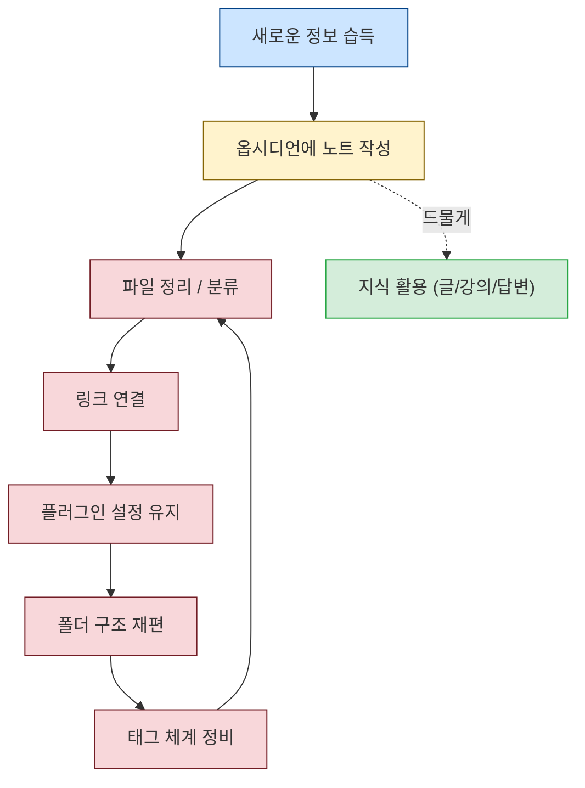
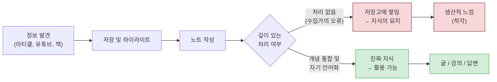
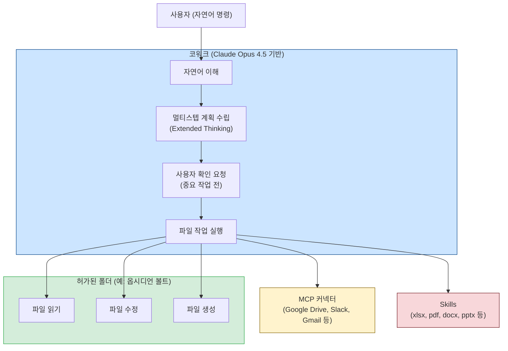
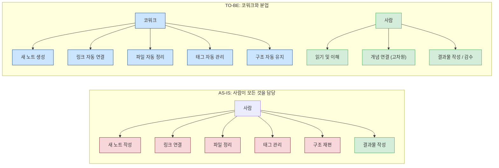
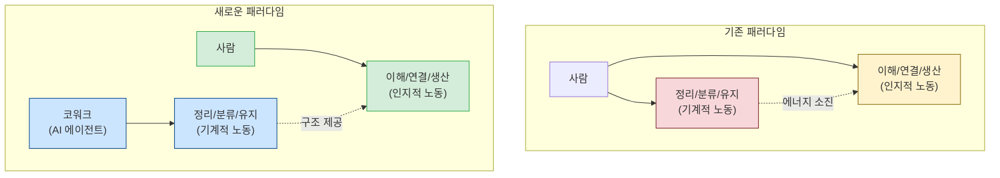

> **원문 출처**: Facebook 포스팅 (2026년) - [*옵시디언의 부담을 코워크에 넘기면, 지식이 일을 시작한다*](https://www.facebook.com/share/p/1bVcE1saK7/)
>
> **핵심 주제**: 개인 지식 관리(PKM) 시스템의 구조적 한계와 AI 에이전트를 통한 노동 분담 패러다임 전환  
>
> **작성 기준**: 2026년 6월 최신 정보 기반

---

## 목차

1. [글의 핵심 명제](#1-글의-핵심-명제)
2. [옵시디언이란 무엇인가 — 철학과 구조](#2-옵시디언이란-무엇인가--철학과-구조)
3. [옵시디언의 강점 — 왜 이렇게 많은 사람이 선택하는가](#3-옵시디언의-강점--왜-이렇게-많은-사람이-선택하는가)
4. [막히는 지점 — 볼트는 커지는데 지식은 잠든다](#4-막히는-지점--볼트는-커지는데-지식은-잠든다)
5. [수집가의 오류(Collector's Fallacy) — PKM의 핵심 함정](#5-수집가의-오류collectors-fallacy--pkm의-핵심-함정)
6. [부담의 정체 — 저장을 위한 정리의 역설](#6-부담의-정체--저장을-위한-정리의-역설)
7. [코워크(Cowork)란 무엇인가 — Anthropic의 데스크톱 AI 에이전트](#7-코워크cowork란-무엇인가--anthropic의-데스크톱-ai-에이전트)
8. [코워크가 옵시디언의 부담을 어떻게 넘겨받는가](#8-코워크가-옵시디언의-부담을-어떻게-넘겨받는가)
9. [지식 관리의 주체를 바꾸는 전환 — 핵심 패러다임 시프트](#9-지식-관리의-주체를-바꾸는-전환--핵심-패러다임-시프트)
10. [실제 적용과 현실적 한계](#10-실제-적용과-현실적-한계)
11. [결론 — 지식이 일을 시작하는 순간](#11-결론--지식이-일을-시작하는-순간)

---

## 1. 글의 핵심 명제

이 페이스북 포스팅은 하나의 근본적인 질문에서 출발합니다. 노트는 계속 늘어나는데, 왜 그 노트가 글이 되거나 강의가 되거나 실질적인 답이 되는 일은 좀처럼 일어나지 않는가. 저자는 이것이 사용자의 게으름이나 의지 부족의 문제가 아니라고 단언합니다. 문제는 더 깊은 곳, 즉 구조 자체에 있다는 것입니다. 옵시디언(Obsidian)이라는 도구가 설계된 방식이 사용자를 지식을 생산하는 사람이 아니라 지식을 관리하는 관리자로 만들어버린다는 진단이 포스팅의 핵심 출발점입니다.

그리고 이 구조적 문제를 해결하는 전환점으로, 저자는 Anthropic의 데스크톱 AI 에이전트인 코워크(Cowork)를 제시합니다. 코워크가 노트를 만들고, 링크를 잇고, 구조를 유지하는 기계적 노동을 대신 맡음으로써, 사람은 정작 사람이 해야 할 일 — 읽고, 이해하고, 더 나은 연결을 발견하는 일 — 에 집중할 수 있게 된다는 것입니다. 포스팅의 제목이 말하듯, 부담을 내려놓는 순간 그동안 저장만 되어 있던 지식이 비로소 일을 시작합니다.

---

## 2. 옵시디언이란 무엇인가 — 철학과 구조

옵시디언은 2020년 3월 Dynalist Inc.의 공동 창업자 Shida Li와 Erica Xu가 처음 출시한 개인 지식 관리(PKM, Personal Knowledge Management) 애플리케이션입니다. 2026년 3월 기준 버전 1.12.7까지 업데이트되었으며, Windows, macOS, Linux, Android, iOS를 모두 지원합니다.

옵시디언의 가장 근본적인 철학은 "로컬 파일 우선(Local-first)"입니다. 모든 노트는 사용자의 컴퓨터 로컬 드라이브에 마크다운(.md) 형식의 텍스트 파일로 저장됩니다. 이것이 말하는 바는 단순하지만 강력합니다. 서버가 없어도, 인터넷이 끊겨도, 심지어 앱이 더 이상 개발되지 않더라도 사용자의 지식은 그 사람의 것으로 남습니다. 특정 서비스에 종속되지 않는 데이터 주권(data sovereignty)의 개념이 설계 철학의 중심에 있습니다.

두 번째 핵심 개념은 볼트(Vault)입니다. 볼트는 옵시디언이 관리하는 폴더 단위입니다. 사용자는 하나 또는 여러 개의 볼트를 만들고, 그 안에 마크다운 파일들을 구성합니다. 볼트가 결국 그냥 파일 시스템 폴더이기 때문에, 내보내기도 자유롭고 다른 도구와 연동도 용이합니다.

세 번째 핵심 개념이 이 포스팅에서 중요하게 다뤄지는 양방향 링크(Backlinks)와 그래프 뷰(Graph View)입니다. 옵시디언에서는 `[[노트 이름]]` 문법으로 노트와 노트를 연결할 수 있고, 이 연결들을 시각화하면 개념들이 어떻게 서로 연결되어 있는지를 네트워크 그래프로 볼 수 있습니다. 이 기능이 옵시디언을 단순한 메모 앱이 아니라 제텔카스텐(Zettelkasten) 방법론, 세컨드 브레인(Second Brain) 방법론 등 고급 PKM 이론의 실천 도구로 만들어줍니다.

2026년 현재 옵시디언은 커뮤니티 플러그인 생태계만 2,700개를 넘어섰으며, 월간 활성 사용자 수가 약 150만 명에 달하는 도구로 성장했습니다.

---

## 3. 옵시디언의 강점 — 왜 이렇게 많은 사람이 선택하는가

포스팅은 옵시디언의 장점이 분명하다는 점을 인정하는 것에서 시작합니다. 실제로 옵시디언이 PKM 도구 시장에서 독보적인 위치를 차지하게 된 데는 뚜렷한 이유가 있습니다.

첫째로 완전한 데이터 소유권입니다. 노션(Notion)이나 에버노트(Evernote)처럼 클라우드 서버에 데이터를 저장하는 도구들과 달리, 옵시디언의 볼트는 사용자의 로컬 파일 시스템 위에 있습니다. 서비스가 종료되거나 가격 정책이 바뀌어도 데이터는 그대로입니다. 내보내기 포맷이 표준 마크다운이라 어느 텍스트 편집기로든 열 수 있습니다.

둘째로 확장성입니다. 2,700개가 넘는 커뮤니티 플러그인이 Dataview(데이터베이스형 쿼리), Templater(템플릿 자동화), Tasks(할일 관리), Smart Connections(AI 기반 의미론적 연결) 등 거의 모든 용도를 커버합니다. 사용자는 자신의 필요에 맞게 옵시디언을 거의 무제한으로 확장할 수 있습니다.

셋째로 마크다운 기반의 이식성입니다. 볼트의 모든 파일이 마크다운이기 때문에, Claude Code나 코워크 같은 AI 에이전트가 직접 파일을 읽고 쓰는 것이 가능합니다. 2026년에 들어서는 같은 볼트를 Claude Code(터미널 환경), 코워크(데스크톱 환경), 심지어 Codex(코딩 환경)가 공유하며 각기 다른 역할을 수행하는 아키텍처가 등장했습니다.

이러한 강점들이 결합되어, 옵시디언 볼트는 단순한 노트 앱을 넘어 AI 에이전트가 접근할 수 있는 개인 지식 인프라의 역할을 하기 시작했습니다.

---

## 4. 막히는 지점 — 볼트는 커지는데 지식은 잠든다

그러나 포스팅이 핵심적으로 지적하는 것은 이 장점들이 역설적으로 또 다른 문제를 만들어낸다는 점입니다. 볼트가 커지기 시작하면서 사용자는 새로운 종류의 일을 맞닥뜨리게 됩니다.

수백 개, 수천 개로 늘어난 파일들을 정리하는 일. 의미가 달라졌는데 아직 고쳐지지 않은 끊어진 링크들을 수선하는 일. 한 달 전에 만든 폴더 구조가 지금의 사고 구조와 맞지 않아서 전체를 재편하는 일. 플러그인을 하나 추가할 때마다 그 설정을 파악하고 유지하는 인지 부하. 이것들이 포스팅이 말하는 "부담(burden)"의 실체입니다.

PKM을 오래 다룬 실무자들이 공통적으로 지적하는 지점이 있습니다. 시스템을 실제로 활용하는 만큼이나 시스템을 유지하는 데 시간이 들어간다는 것입니다. 포스팅은 이것을 "도구가 또 하나의 일거리가 되는 구조"라고 표현합니다. 옵시디언 커뮤니티 포럼에서도 이 역설은 반복적으로 등장합니다. "PKM의 가장 큰 위험은 도끼를 갈다가 하루를 다 써버리는 것이다. 나무를 베는 대신 도구를 다듬는 데만 시간을 소비하게 된다"는 표현이 커뮤니티에서 자주 회자됩니다.

위 다이어그램이 보여주는 것처럼, 대부분의 에너지와 시간이 빨간 박스로 표시된 정리·유지·수선의 루프에 갇히게 됩니다. 초록으로 표시된 실제 지식 활용 — 글을 쓰거나, 강의를 만들거나, 날카로운 답을 내놓는 일 — 은 점선으로 표시된 것처럼 드물고 희미한 경로가 됩니다.

---

## 5. 수집가의 오류(Collector's Fallacy) — PKM의 핵심 함정

포스팅이 언급하는 "수집가의 오류(Collector's Fallacy)"는 PKM 이론에서 매우 중요한 개념입니다. 이 개념은 제텔카스텐(Zettelkasten) 방법론으로 유명한 zettelkasten.de에서 정식으로 명명된 것으로, 지식 관리 시스템이 빠지는 가장 흔한 함정을 설명합니다.

수집가의 오류의 핵심은 이것입니다. 무언가를 안다는 것(knowing something)과 무언가에 대해 안다는 것(knowing about something)은 전혀 다른 일이라는 것입니다. 북마크를 저장하고, 링크를 모으고, 글을 하이라이트하는 동안 우리는 생산적이라는 느낌을 받습니다. 정보가 쌓이는 것이 보이기 때문입니다. 그러나 그 정보를 자신의 언어로 소화하고, 기존의 지식과 연결하고, 새로운 통찰을 만들어내는 과정 — 즉 진짜 앎의 과정 — 은 뒤로 계속 밀립니다.

이 오류는 행동경제학에서 말하는 "완료 착각(Completion Illusion)"과 구조가 유사합니다. 책을 사는 행위가 책을 읽는 것과 동일한 만족감을 주는 것처럼, 정보를 저장하는 행위가 정보를 이해하는 것과 유사한 만족감을 줍니다. 그러나 저장은 이해가 아닙니다. 이 착각이 깨지지 않는 한, 볼트는 계속 커지는 반면 실제 지식은 잠든 채로 남아 있습니다.

수집가의 오류를 겪은 사람들의 경험담은 놀랍도록 일치합니다. 3,000개, 5,000개의 노트를 쌓아 올리고 나서야 그것이 아름답게 정리된 지식의 묘지였음을 깨닫는 것입니다. 노트는 안전하게 저장되어 있지만, 아무 데도 가지 않습니다.

포스팅이 제시하는 처방은 명확합니다. 저장이 아니라 꺼내 쓰기 위해 정리하는 것, 그리고 선별하되 과도하게 정리하지 않는 것입니다. 정리 자체가 목적이 되어서는 안 됩니다. 정리는 꺼내 쓰는 순간을 위한 준비여야 합니다.

---

## 6. 부담의 정체 — 저장을 위한 정리의 역설

포스팅은 옵시디언 특유의 구조적 함정들을 구체적으로 짚어냅니다. 이 함정들은 서로 연결되어 있으며, 하나를 해결하려다 다른 하나가 커지는 구조를 가집니다.

첫 번째 함정은 깊은 폴더 계층입니다. 폴더를 세밀하게 나눌수록 더 잘 정리될 것 같습니다. 그러나 실제로는 검색 효율이 개선되지 않는 반면 정리 부담만 급격히 늘어납니다. 어떤 노트가 어느 폴더에 들어가야 하는지를 결정하는 인지 비용, 폴더 구조가 달라졌을 때 기존 파일들을 이동하는 노동, 그리고 시간이 지남에 따라 폴더 계층과 실제 사고 구조 사이의 불일치가 커지는 문제가 발생합니다. 옵시디언 커뮤니티에서는 깊은 폴더 구조를 포기하고 최대한 평평한 단층 구조로 전환한 사람들의 경험담이 자주 공유됩니다.

두 번째 함정은 플러그인 생태계의 역설입니다. 2,700개가 넘는 플러그인은 옵시디언의 강점이면서 동시에 부담의 원천입니다. 각 플러그인은 설정이 필요하고, 업데이트를 추적해야 하며, 다른 플러그인과의 충돌 가능성을 관리해야 합니다. PKM 전문가들조차도 수십 개의 플러그인을 실행하면서 8개 정도만이 진짜 필수적이라고 평가합니다. 도구를 정교하게 다듬을수록 도구 자체가 일이 된다는 역설이 여기서 발생합니다.

세 번째 함정은 링크 유지의 부담입니다. 옵시디언의 핵심 기능인 양방향 링크는 노트 간 연결을 시각화해주지만, 볼트가 커질수록 끊어진 링크, 중복된 개념을 가진 노트들, 업데이트되지 않은 연결들이 쌓입니다. 이것들을 정기적으로 점검하고 수선하는 일은 결코 작은 일이 아닙니다.

이 세 가지 함정이 합쳐지면, 사용자는 매주 상당한 시간을 옵시디언 관리에 쏟게 됩니다. 노트를 쌓는 데서 오는 안도감은 있지만, 그 노트들이 실제 결과물 — 글, 강의, 명확한 답변 — 로 전환되는 경험은 점점 희박해집니다.

---

## 7. 코워크(Cowork)란 무엇인가 — Anthropic의 데스크톱 AI 에이전트

포스팅의 전환점은 코워크(Cowork)라는 도구의 등장입니다. 코워크를 정확히 이해하기 위해서는 그 기술적 배경을 먼저 파악해야 합니다.

### 7.1 코워크의 탄생 배경

코워크는 2026년 1월 12일, Anthropic이 리서치 프리뷰로 공개한 데스크톱 AI 에이전트입니다. 이 도구는 Anthropic의 개발자용 코딩 에이전트인 Claude Code가 성공을 거두면서, 동일한 에이전트 아키텍처를 비개발자 사용자에게도 제공하겠다는 방향에서 탄생했습니다. Anthropic에 따르면, 코워크는 Claude Agent SDK를 기반으로 Claude Code와 동일한 에이전트 스택 위에 구축되었습니다.

주목할 만한 사실은, 코워크 자체가 약 1주일 반 만에 Claude Code를 활용해서 개발되었다는 점입니다. AI 에이전트가 AI 에이전트 도구를 만든 셈입니다.

### 7.2 코워크의 기술적 구조

코워크의 작동 원리는 폴더 권한 모델(folder-permission model)에 기반합니다. 사용자가 코워크 세션을 시작할 때, 로컬 컴퓨터의 특정 폴더를 지정합니다. Claude는 그 폴더 안에서만 파일을 읽고, 수정하고, 생성할 수 있습니다. 전체 하드 드라이브를 자유롭게 돌아다닐 수 없으며, 반드시 명시적으로 허가된 폴더 안에서만 작동합니다.

중요한 작업을 수행하기 전에는 사용자에게 확인을 요청하는 절차가 있습니다. 이것은 AI 에이전트가 의도치 않게 파일을 삭제하거나 수정하는 사고를 방지하기 위한 안전장치입니다.

코워크를 구동하는 모델은 Claude Opus 4.5입니다. 이 모델은 하이브리드 추론 모델로, 확장 사고(Extended Thinking) 모드에서 최대 64,000 토큰의 내부 추론을 수행할 수 있습니다. 이 깊은 추론 능력이 복잡한 멀티스텝 파일 작업에서 중요한 역할을 합니다.

### 7.3 코워크의 출시 및 확장 과정

코워크는 처음 macOS용 Claude 데스크톱 앱의 Claude Max 구독자를 대상으로 시작되었습니다. 이후 빠르게 접근 범위를 넓혔습니다.

2026년 1월 16일에 Pro 구독자로 확대되었고, 1월 23일에는 Team 및 Enterprise 플랜으로 확장되었습니다. 2월 12일에는 Windows 버전이 출시되어 macOS 버전과 동일한 기능을 제공하게 되었습니다. 3월 20일에는 Projects 기능이 추가되면서, 세션 간에 컨텍스트가 유지되지 않던 초기의 가장 큰 한계가 해결되었습니다. 2026년 4월에는 일반 가용성(GA) 출시가 이루어지면서 역할 기반 접근 제어, 세분화된 MCP 권한 설정 등 엔터프라이즈 기능이 추가되었습니다.

### 7.4 코워크의 핵심 기능

코워크가 일반 AI 챗봇과 다른 가장 중요한 특징은 파일을 직접 읽고, 수정하고, 생성한다는 것입니다. 대화 창 안에서 텍스트를 주고받는 것이 아니라, 실제 로컬 파일 시스템 위에서 작동하는 에이전트입니다.

코워크가 수행할 수 있는 작업의 예시들이 실제로 문서화되어 있습니다. 다운로드 폴더를 정리하면서 파일들을 분류하고 이름을 정돈하는 작업, 흩어진 노트들을 읽어서 구조화된 보고서 초안을 작성하는 작업, 여러 스크린샷에서 금액을 추출해 경비 정산 스프레드시트를 만드는 작업 등이 이에 해당합니다. 이 모든 작업이 사용자가 자연어로 지시하면 코워크가 자율적으로 수행합니다.

Skills 기능은 xlsx, pptx, docx, pdf 등 오피스 파일 포맷을 네이티브로 처리할 수 있도록 해주는 내장 역량입니다. 예를 들어 PDF를 합치거나 분리하고, 양식을 채우는 작업까지 가능합니다.

MCP(Model Context Protocol) 커넥터를 통해서는 로컬 파일 작업을 넘어 Google Drive, Slack, Gmail 같은 외부 서비스와도 연동이 됩니다. Anthropic이 설계한 MCP 표준은 현재 월간 다운로드 1억 건을 넘어서며 AI-도구 연동의 사실상 업계 표준이 되었습니다.

Projects 기능은 2026년 3월에 추가되어, 코워크의 가장 큰 초기 한계였던 세션 간 컨텍스트 단절 문제를 해결했습니다. 이제 사용자는 폴더, 지시사항, 작업 히스토리가 하나의 공간에 묶인 프로젝트를 만들 수 있습니다. 마케팅 프로젝트에서 배운 내용이 재무 프로젝트로 누출되지 않도록 프로젝트 단위로 메모리가 격리됩니다.

---

## 8. 코워크가 옵시디언의 부담을 어떻게 넘겨받는가

포스팅의 핵심 주장으로 돌아옵니다. 코워크가 어떻게 옵시디언의 정리 노동을 대신 맡을 수 있는지를 구체적으로 살펴봅니다.

### 8.1 볼트를 허가된 폴더로 지정

가장 기본적인 연동 방식입니다. 코워크 세션을 시작할 때, 사용자가 옵시디언 볼트 폴더를 코워크의 작업 폴더로 지정합니다. 이렇게 하면 코워크는 볼트 안의 모든 마크다운 파일을 읽고 수정하고 새로 만들 수 있게 됩니다.

옵시디언 볼트가 마크다운 파일의 집합이라는 사실이 여기서 결정적인 이점이 됩니다. 코워크(Claude)는 마크다운을 완벽하게 이해하고 생성할 수 있습니다. 볼트 구조 자체가 코워크와의 연동에 최적화되어 있다고 봐도 무방합니다.

### 8.2 코워크가 맡을 수 있는 옵시디언 관리 작업들

코워크가 실제로 수행할 수 있는 작업들을 구체적으로 나열하면 다음과 같습니다.

노트 자동 생성 측면에서는, 사용자가 URL이나 텍스트를 붙여넣으면 코워크가 그 내용을 읽고 요약하여 볼트에 마크다운 노트로 저장합니다. 기존에는 사용자가 직접 노트를 작성해야 했던 과정이 코워크에 위임됩니다.

링크 연결 측면에서는, 코워크가 볼트 안의 기존 노트들을 읽고 새로 만들어진 노트와 연결될 수 있는 개념들을 찾아 `[[링크]]` 문법으로 자동으로 연결합니다. 사람이 일일이 어떤 노트와 연결할지 판단하고 입력하던 작업을 코워크가 처리합니다.

구조 유지 측면에서는, 볼트의 파일 구조를 검토하고, 고아 노트(orphaned notes, 어디와도 연결되지 않은 노트)를 찾아내고, 중복되는 개념을 가진 노트들을 통합하거나 정리합니다. 또한 태그 체계를 일관성 있게 유지하는 작업도 가능합니다.

보고서 초안 작성 측면에서는, "이번 주에 작성한 노트들을 기반으로 요약 보고서를 만들어줘"라고 지시하면, 코워크가 볼트 안의 관련 파일들을 순회하며 내용을 종합해 하나의 마크다운 문서로 만들어냅니다. 산재된 노트가 하나의 완성된 글이나 강의 자료로 전환되는 과정을 코워크가 담당하는 것입니다.

### 8.3 AI 에이전트의 유지 비용 우위

코워크를 비롯한 AI 에이전트가 볼트 유지에서 사람보다 구조적으로 유리한 이유가 있습니다. AI 에이전트는 지루함을 느끼지 않습니다. 교차 참조를 업데이트하는 것을 잊지 않습니다. 한 번에 수십 개의 파일을 처리하는 데 부담을 느끼지 않습니다. 한 실무자의 경험에 따르면, AI 에이전트를 볼트 유지에 활용한 결과 지식 관리에 쓰던 시간이 이전의 30~40%에서 10% 미만으로 줄었습니다. 유지 비용이 거의 0에 가까워지면서 볼트가 최신 상태를 유지하게 된 것입니다.

---

## 9. 지식 관리의 주체를 바꾸는 전환 — 핵심 패러다임 시프트

포스팅이 가장 강조하는 것은 단순히 도구를 바꾸는 게 아니라 노동의 주체를 바꾸는 패러다임 전환입니다.

기존 모델에서는 사람이 모든 것의 주체였습니다. 노트를 쓰고, 링크를 잇고, 구조를 설계하고, 유지하고, 그 위에서 결과물도 만들어냈습니다. 이 모든 것을 혼자 감당하다 보니, 에너지의 상당 부분이 유지 작업에 소진되고 정작 결과물을 만드는 데는 잔여 에너지만 남았습니다.

새로운 모델에서는 역할이 분리됩니다. 코워크가 노트를 만들고, 링크를 잇고, 구조를 유지합니다. 사람은 이해하고 연결하고 판단하는 일, 즉 기계가 대체하기 어려운 고차원적 인지 작업에 집중합니다. 기계적 노동의 주체가 바뀌는 이 전환이 결과적으로 사람이 옵시디언에서 보내는 시간을 오히려 줄이면서도, 볼트에 잠들어 있던 지식이 글과 강의, 답변으로 흘러나오게 만든다는 것이 포스팅의 핵심 주장입니다.

포스팅의 마지막 문장이 이것을 압축합니다. "늘어나는 것은 옵시디언 활용이 아니라 지식 데이터의 활용입니다." 도구를 더 많이 쓰게 되는 것이 목표가 아니라, 도구 안에 쌓인 지식이 실제 세상에서 작동하게 되는 것이 목표라는 말입니다.

이 패러다임 전환이 더 넓은 맥락에서도 의미를 갖는 이유가 있습니다. 지식 관리 소프트웨어 시장은 2026년 162억 달러 규모에서 2034년 740억 달러 규모로 성장할 것으로 전망되며, 이 성장의 핵심 동력은 생성형 AI와 AI 에이전트의 PKM 시스템 통합입니다. 즉, 포스팅이 제안하는 방향이 단순한 개인적 워크플로우 실험이 아니라, 지식 산업 전체가 향하고 있는 방향과 일치합니다.

---

## 10. 실제 적용과 현실적 한계

포스팅의 논리가 이론적으로 매력적이라 하더라도, 실제 적용 과정에서 고려해야 할 현실적인 제약들이 있습니다.

### 10.1 현실적인 선행 조건

코워크를 통해 옵시디언 볼트를 관리하려면 일정한 선행 조건이 필요합니다.

구독 요건 측면에서, 코워크는 2026년 4월 일반 가용성 출시 이후 유료 플랜 전반에서 접근 가능하지만, 모델 및 사용량에 따른 구독 요금이 발생합니다.

볼트 구조 측면에서는, 코워크가 볼트를 효율적으로 처리하려면 볼트 자체에 일정한 구조가 있어야 합니다. 완전히 무질서한 볼트보다는 기본적인 폴더 구조와 파일 명명 규칙이 있는 볼트에서 코워크가 더 잘 작동합니다. CLAUDE.md 같은 컨텍스트 파일을 볼트 루트에 작성해 두면, 코워크가 볼트의 목적, 구조, 작업 규칙을 자동으로 파악하고 적용할 수 있습니다.

### 10.2 보안과 신뢰의 문제

코워크가 로컬 파일에 접근하는 만큼 보안에 대한 고려가 필요합니다. Anthropic은 코워크 미리보기 단계에서 개인정보(PII)나 재무 기록처럼 민감한 데이터에 코워크를 사용하는 것을 자제하도록 안내하고 있습니다. 2026년 1월, 보안 업체 PromptArmor는 문서 내에 숨겨진 프롬프트 인젝션을 통해 코워크를 조작할 수 있는 취약점을 보고한 바 있습니다. Anthropic이 이 문제를 적극적으로 다루고 있지만, 중요한 문서를 다루는 볼트에서는 주의가 필요합니다.

### 10.3 인간의 역할이 사라지는 것이 아니다

포스팅이 주의 깊게 다루는 부분이 있습니다. 코워크에 부담을 넘기는 것이 사람의 역할을 없애는 것이 아니라는 점입니다. 코워크가 기계적 노동을 맡는 동안, 사람의 역할은 오히려 더 명확해집니다.

사람은 무엇이 중요한지를 판단합니다. 코워크가 만들어온 연결 중 어떤 것이 의미 있는지 확인합니다. 볼트의 방향성과 목적을 유지합니다. 그리고 최종적으로 외부에 내보낼 결과물의 질을 감수하고 판단합니다. AI 에이전트가 노트를 정교하게 관리해줄수록, 사람은 판단과 창조라는 더 고차원적인 작업에 집중할 수 있게 됩니다.

### 10.4 비교: AI 에이전트 볼트 관리 접근법

| 접근법 | 도구 | 특징 | 적합한 사용자 |
|---|---|---|---|
| 코워크 | Claude 데스크톱 앱 + 코워크 | GUI 기반, 비개발자 친화적, 멀티스텝 자율 작업 | 비개발자 지식 노동자 |
| Claude Code + Obsidian | Claude Code CLI + MCP | 터미널 기반, 세밀한 제어 가능, 고급 자동화 | 개발자 / 파워 유저 |
| Smart Connections 플러그인 | Obsidian 플러그인 | 옵시디언 내장, AI 기반 의미론적 연결 | 옵시디언 내에서 해결하고 싶은 사용자 |
| LLM Wiki + Local Search | Claude Code + qmd | RAG + 로컬 검색 엔진 조합, 오프라인 지원 | 프라이버시 중시 사용자 |

---

## 11. 결론 — 지식이 일을 시작하는 순간

이 페이스북 포스팅이 전달하는 메시지를 한 문장으로 압축하면 이렇습니다. 옵시디언을 잘 쓰는 길은 더 부지런히 정리하는 데 있지 않다. 정리라는 노동의 주체를 바꾸는 데 있다.

수집가의 오류는 정보를 모으는 것이 지식을 가지는 것과 같다는 착각입니다. 이것과 유사한 착각이 PKM 시스템 운영에서도 일어납니다. 볼트를 정교하게 관리하는 것이 지식을 활용하는 것과 같다는 착각입니다. 두 착각 모두 수단을 목적으로 혼동하는 데서 비롯됩니다.

코워크는 이 혼동을 끊어냅니다. 정리라는 수단을 기계에 넘기고, 사람은 목적 — 이해하고 연결하고 표현하는 일 — 에 돌아오게 합니다. 그 순간이 포스팅의 제목이 말하는 "지식이 일을 시작하는" 순간입니다.

볼트 안에 잠들어 있던 수백, 수천 개의 노트들이 코워크의 손을 거치면서 구조를 얻고 연결을 얻습니다. 사람이 이 구조 위에서 관심과 판단을 투입하면, 노트는 글이 되고, 강의가 되고, 날카로운 답이 됩니다. 지식은 더 이상 저장만 되어 있지 않습니다. 드디어 일을 시작합니다.

---

## 참고 자료

- Anthropic, "Introducing Anthropic Labs" (2026.01.13) — https://www.anthropic.com/news/introducing-anthropic-labs  
- VentureBeat, "Anthropic launches Cowork, a Claude Desktop agent that works in your files" (2026.01.13)  
- cybersecuritynews.com, "Anthropic Launches Projects Feature for Claude Cowork Desktop" (2026.03.21)  
- VentureBeat, "Anthropic's Claude Cowork finally lands on Windows" (2026.02.12)  
- DataCamp, "Claude Cowork Tutorial" (2026.01.16)  
- Let's Data Science, "Claude Cowork Explained" (2026.03.26)  
- zettelkasten.de, "The Collector's Fallacy"  
- Eric J. Ma, "Mastering Personal Knowledge Management with Obsidian and AI" (2026.03.06)  
- Alfonso Fortunato, "My Obsidian PKM Setup: Karpathy's LLM Wiki + Claude Code + Local Search" (2026.04.06)  
- Taskade, "History of Obsidian: Second Brain to AI Knowledge OS" (2026.03.24)  
- suprmind.ai, "Claude Features 2026: Projects, Artifacts, Memory, Computer Use, Skills, MCP" (2026.06)

---

