> **출처**: Anthropic 공식 블로그 — [A harness for every task: dynamic workflows in Claude Code](https://claude.com/blog/a-harness-for-every-task-dynamic-workflows-in-claude-code)  
> **작성자**: Thariq Shihipar, Sid Bidasaria (Anthropic Technical Staff)  
> **출시일**: 2026년 5월 28일 (Research Preview)  
> 

## 관련글

[**Claude Code 다이나믹 워크플로우(Dynamic Workflows) 완전 가이드**](https://k82022603.github.io/posts/claude-code-%EB%8B%A4%EC%9D%B4%EB%82%98%EB%AF%B9-%EC%9B%8C%ED%81%AC%ED%94%8C%EB%A1%9C%EC%9A%B0(dynamic-workflows)-%EC%99%84%EC%A0%84-%EA%B0%80%EC%9D%B4%EB%93%9C/)

---

## 목차

1. [개요: 동적 워크플로우란 무엇인가](#1-개요-동적-워크플로우란-무엇인가)
2. [출시 배경과 기술적 맥락](#2-출시-배경과-기술적-맥락)
3. [단일 컨텍스트 윈도우의 구조적 한계](#3-단일-컨텍스트-윈도우의-구조적-한계)
4. [동적 워크플로우의 작동 원리](#4-동적-워크플로우의-작동-원리)
5. [핵심 API: agent(), parallel(), pipeline()](#5-핵심-api-agent-parallel-pipeline)
6. [정적 워크플로우 vs 동적 워크플로우](#6-정적-워크플로우-vs-동적-워크플로우)
7. [여섯 가지 워크플로우 패턴](#7-여섯-가지-워크플로우-패턴)
8. [실전 활용 사례](#8-실전-활용-사례)
9. [런타임 제약 및 토큰 비용](#9-런타임-제약-및-토큰-비용)
10. [워크플로우 저장과 공유](#10-워크플로우-저장과-공유)
11. [활성화 방법 및 사용 팁](#11-활성화-방법-및-사용-팁)
12. [사용하지 말아야 할 때](#12-사용하지-말아야-할-때)
13. [실제 사례: Bun의 Zig→Rust 리라이트](#13-실제-사례-bun의-zigrust-리라이트)
14. [예시 프롬프트 모음](#14-예시-프롬프트-모음)
15. [마치며](#15-마치며)

---

## 1. 개요: 동적 워크플로우란 무엇인가

2026년 5월 28일, Anthropic은 Claude Code에 **동적 워크플로우(Dynamic Workflows)** 를 Research Preview로 출시했다. 이 기능은 Claude Opus 4.8의 릴리스와 함께 공개되었으며, Claude Code의 에이전틱 역량을 근본적으로 재정의하는 아키텍처 변화로 평가받고 있다.

동적 워크플로우를 한 줄로 정의하면 다음과 같다: **Claude가 주어진 작업에 맞춰 오케스트레이션 스크립트를 즉석에서 작성하고, 런타임이 그 스크립트를 배경에서 실행하면서 수십에서 수백 개의 서브에이전트(subagent)를 병렬로 조율하는 기능이다.** 중간 결과물들은 Claude의 컨텍스트 윈도우가 아닌 스크립트 변수에 보관되고, 최종 답변만이 Claude의 컨텍스트로 돌아온다. 이것이 기존 서브에이전트, 스킬과 구별되는 핵심 차이다.

기술적으로 더 정밀하게 설명하면, 동적 워크플로우는 특수 함수 몇 가지가 포함된 **JavaScript 파일**을 실행함으로써 동작한다. Claude가 해당 파일을 직접 작성하고, 별도 런타임이 이를 백그라운드에서 실행하는 방식이다. 사용자의 세션은 런타임이 에이전트들을 처리하는 동안에도 계속 응답 가능한 상태를 유지한다.

이전까지 Research, Security Analysis, Agent Teams, Code Review 같은 작업 유형들은 Claude Code 위에 **별도의 맞춤 하네스(custom harness)** 를 직접 구축해야만 최고 성능을 얻을 수 있었다. 동적 워크플로우는 이러한 별도 구축 없이, Claude Code 내부에서 네이티브하게 이 문제들을 해결할 수 있도록 해준다.

현재 이 기능은 Claude Code CLI, Desktop, VS Code 확장 프로그램에서 Max, Team, Enterprise(관리자 활성화 필요) 플랜을 위해 제공된다. Pro 플랜에서는 `/config`에서 수동으로 활성화해야 한다. 또한 Anthropic API, Amazon Bedrock, Google Cloud Vertex AI, Microsoft Foundry를 통해서도 접근 가능하며, Claude Code v2.1.154 이상이 필요하다.

---

## 2. 출시 배경과 기술적 맥락

### 2.1 하네스(Harness) 개념 이해

AI 에이전트 시스템에서 **하네스**란 에이전트의 실행을 제어하는 골격 구조, 즉 에이전트가 어떤 순서로 어떤 도구를 사용하고, 어떻게 컨텍스트를 관리하며, 언제 멈추는지를 결정하는 실행 프레임워크를 의미한다. Claude Code의 기본 하네스는 코딩 작업에 최적화되어 있으며, 단일 컨텍스트 윈도우 내에서 계획과 실행을 동시에 수행하는 방식으로 설계되었다.

이 기본 하네스는 대부분의 일반적인 코딩 작업에서 매우 효과적으로 동작한다. 그런데 많은 비코딩 작업들이 코딩 작업과 구조적으로 유사하기 때문에, 기본 하네스만으로도 다양한 작업 유형에 걸쳐 유용하게 활용될 수 있었다.

그러나 Research, Security Analysis, Agent Teams, Code Review처럼 규모가 크고 복잡하며 구조화된 작업들에서는 기본 하네스의 한계가 분명히 드러났다. 이런 작업들에서 최고 성능을 얻으려면 개발자가 직접 별도의 맞춤 하네스를 설계해야 했는데, 이 과정은 상당한 엔지니어링 노력을 요구했다.

### 2.2 Claude Opus 4.8과의 연계

동적 워크플로우가 가능해진 배경에는 모델 능력의 성장도 있다. Anthropic은 Claude Opus 4.8이 동적 워크플로우와 결합했을 때 에이전트들이 더 오랜 시간 실행될 수 있을 만큼 뛰어난 역량을 갖추고 있다고 밝혔다. 실제로 Claude Opus 4.8은 수십만 줄 규모의 코드베이스 마이그레이션을 킥오프부터 머지까지 완전히 처리할 수 있는 수준으로 평가된다.

기존 정적 워크플로우는 모든 엣지 케이스를 미리 처리해야 했기 때문에 필연적으로 일반적인 형태를 띨 수밖에 없었다. 그러나 Claude Opus 4.8과 동적 워크플로우의 조합으로 인해, 이제 Claude는 특정 사용 사례에 맞게 재단된 맞춤 하네스를 스스로 작성할 수 있을 만큼 충분히 지능적이 되었다.

---

## 3. 단일 컨텍스트 윈도우의 구조적 한계

동적 워크플로우가 필요한 이유를 이해하려면, 먼저 기존 단일 컨텍스트 윈도우 방식의 구조적 취약점을 파악해야 한다.

기본 Claude Code 하네스는 하나의 컨텍스트 윈도우 안에서 **계획(planning)** 과 **실행(execution)** 을 동시에 수행한다. 대부분의 코딩 작업에서는 이 방식이 매우 효과적이다. 그러나 장시간 실행되는 작업, 대규모 병렬 작업, 고도로 구조화된 작업, 또는 대립적(adversarial) 검증이 필요한 작업에서는 점점 무너지기 시작한다.

이는 단순한 구현 버그가 아니라 **단일 컨텍스트 윈도우라는 아키텍처 자체에서 비롯된 구조적 실패 모드**들 때문이다. Anthropic은 이 실패 모드들을 다음 세 가지로 명확히 정의했다.

### 3.1 에이전틱 게으름 (Agentic Laziness)

에이전틱 게으름은 Claude가 복잡한 다단계 작업을 완료하기 전에 중단하고, 부분적 진행 이후 작업이 완료되었다고 선언하는 현상이다. 예를 들어, 50개 항목에 대한 보안 검토를 요청받았을 때 35개만 처리하고 완료했다고 보고하는 식이다. 작업의 복잡도가 높을수록, 그리고 작업이 길어질수록 이 현상은 더 빈번하게 발생한다.

### 3.2 자기 선호 편향 (Self-preferential Bias)

자기 선호 편향은 Claude가 루브릭(rubric)이나 평가 기준에 대비하여 자신의 결과물을 검증하거나 판단할 때, 자신이 만든 결과물을 선호하는 경향을 보이는 현상이다. 동일한 에이전트가 생성과 검증을 모두 담당할 경우, 진정한 의미의 독립적 검증이 이루어지기 어렵다.

### 3.3 목표 표류 (Goal Drift)

목표 표류는 대화가 여러 턴에 걸쳐 진행되면서 원래 목표에 대한 충실도가 점진적으로 저하되는 현상이다. 특히 컨텍스트 **컴팩션(compaction)** 이후에 심각해진다. 컴팩션은 컨텍스트 윈도우가 가득 찰 때 이전 내용을 압축·요약하는 과정인데, 이 과정이 필연적으로 손실을 동반하기 때문에 엣지 케이스 요구사항이나 "X를 하지 말 것"과 같은 제약 조건이 사라질 수 있다.

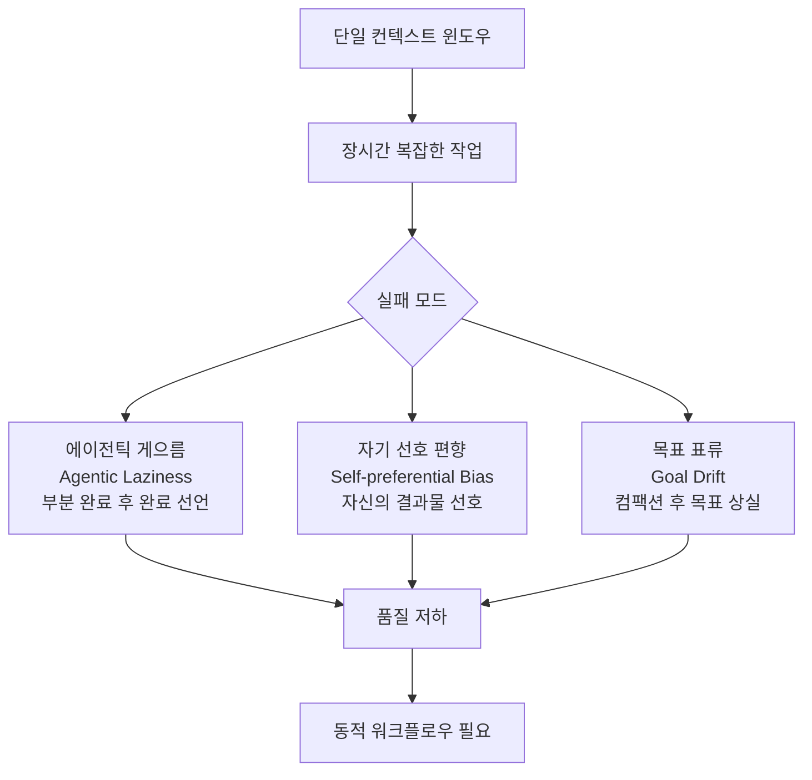

동적 워크플로우는 **각자의 컨텍스트 윈도우와 집중된 격리된 목표를 가진 여러 Claude 서브에이전트를 조율**함으로써 이 세 가지 실패 모드를 구조적으로 방지한다. 각 에이전트는 자신에게 주어진 좁은 범위의 작업만 처리하기 때문에 게으름이 발생할 여지가 줄어든다. 생성과 검증을 별도 에이전트가 수행하기 때문에 자기 선호 편향이 차단된다. 그리고 오케스트레이션 스크립트가 목표를 명시적으로 보존하기 때문에 목표 표류가 억제된다.

---

## 4. 동적 워크플로우의 작동 원리

### 4.1 기술적 실행 메커니즘

동적 워크플로우는 다음의 과정으로 실행된다.

사용자가 작업을 요청하면서 "workflow"라는 단어를 포함하거나 "ultracode" 트리거 단어를 사용하면, Claude가 해당 작업에 맞게 재단된 JavaScript 오케스트레이션 스크립트를 작성한다. 이어서 별도의 런타임이 이 스크립트를 백그라운드에서 실행하고, 런타임은 스크립트의 지시에 따라 서브에이전트들을 생성하고 조율한다. 중간 결과물들은 Claude의 컨텍스트 윈도우가 아닌 스크립트의 변수에 저장되며, 모든 에이전트가 작업을 완료하면 최종 결과만이 사용자에게 반환된다.

이 방식의 핵심적 의미는, **오케스트레이션 계획이 Claude의 컨텍스트 윈도우가 아닌 코드 안에 존재**한다는 점이다. 이를 통해 컨텍스트 오염, 컴팩션으로 인한 정보 손실, 그리고 앞서 언급한 세 가지 실패 모드가 구조적으로 방지된다.

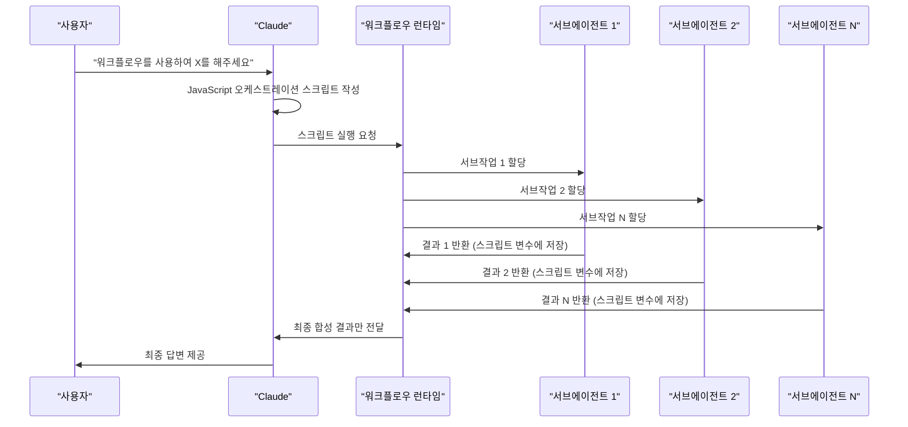

### 4.2 워크플로우 트리거

공식 문서에 따르면 동적 워크플로우를 시작하는 방법은 세 가지다.

첫 번째는 프롬프트에 **"workflow"** 단어를 포함시키는 것이다. Claude Code는 이 단어를 트리거로 인식하고 자동으로 워크플로우를 생성한다. 의도치 않게 트리거되었을 경우 `alt+w`로 무시할 수 있으며, `/config`의 "Workflow keyword trigger" 설정에서 이 기능을 비활성화할 수 있다.

두 번째는 **"ultracode"** 키워드를 사용하는 것이다. ultracode는 단순히 워크플로우를 생성할 뿐 아니라, 극도로 높은 추론 깊이와 자동 워크플로우 오케스트레이션을 활성화한다. 각 실질적인 작업마다 자동으로 워크플로우를 계획하며, 이해 → 설계 → 구현 → 검증의 여러 순차적 워크플로우를 연쇄적으로 실행할 수 있다. 토큰 소비가 극단적으로 높기 때문에 주의가 필요하다.

세 번째는 **/deep-research** 같은 내장 스킬을 직접 호출하는 것이다. `/deep-research`는 동적 워크플로우를 사용하는 공식 배포 스킬로, 웹 검색 팬아웃, 소스 수집, 적대적 주장 검증, 인용 포함 보고서 종합을 수행한다.

### 4.3 중단 및 재개

워크플로우가 사용자의 행동이나 터미널 종료로 인해 중단되더라도, 세션을 재개하면 중단된 지점부터 다시 이어서 진행할 수 있다. 이는 수 시간이 걸리는 대규모 마이그레이션 작업에서 특히 중요한 기능이다.

---

## 5. 핵심 API: agent(), parallel(), pipeline()

동적 워크플로우 스크립트에서 사용할 수 있는 핵심 함수들은 다음과 같다. 이 함수들은 표준 JavaScript 환경(JSON, Math, Array 등)에 추가로 제공되는 특수 함수들이다.

### 5.1 agent() 함수

`agent()` 함수는 워크플로우의 기본 단위로, 개별 서브에이전트를 생성하고 실행한다. 시그니처는 다음과 같다.

```javascript
agent(prompt, opts?): Promise<string | JsonSchema>
```

실제 사용 예시:

```javascript
const bugs = await agent(
  "audit auth.ts",
  {
    schema: BugList,       // JSON Schema → 검증된 JSON 출력
    model: "haiku",        // opus · sonnet · haiku. 생략 시 세션 모델 상속
    isolation: "worktree", // "worktree" (체크아웃) 또는 "remote"
    agentType: "reviewer", // 커스텀 / 내장 서브에이전트 타입
  }
)
```

각 파라미터의 의미를 살펴보면 다음과 같다.

**prompt**는 에이전트의 유일한 입력으로, 필수 파라미터다. 에이전트가 수행할 작업을 자연어로 기술한다.

**schema**는 JSON Schema를 지정하여 에이전트의 출력을 검증된 JSON 형태로 받을 수 있게 해준다. 구조화된 데이터를 다음 단계로 전달해야 할 때 유용하다.

**model**은 이 에이전트에 사용할 모델을 지정한다. opus, sonnet, haiku 중 선택할 수 있으며, 생략하면 현재 세션의 모델을 상속한다. 이 기능이 중요한 이유는, 작업의 복잡도에 따라 값비싼 모델과 저렴한 모델을 적재적소에 배치할 수 있기 때문이다. 예를 들어 단순 분류 작업에는 haiku를, 복잡한 추론이 필요한 작업에는 opus를 지정하는 식이다.

**isolation**은 에이전트의 실행 환경을 결정한다. "worktree"를 지정하면 Git worktree에서 격리된 환경으로 체크아웃하여 실행하며, 다른 에이전트의 파일 시스템 변경과 충돌하지 않는다. 이는 병렬 코드 수정 작업에서 특히 중요하다.

**agentType**은 커스텀 서브에이전트 타입이나 내장 서브에이전트 타입을 지정한다. "reviewer"처럼 미리 정의된 역할을 부여할 수 있다.

### 5.2 parallel() 함수

`parallel()` 함수는 여러 에이전트 함수를 동시에 실행하는 배리어(barrier)를 만든다. 모든 에이전트가 완료될 때까지 기다린 후 결과를 반환한다.

```javascript
// 팬아웃: 모든 파일에 대한 에이전트를 동시에 실행
const all = await parallel(
  files.map(f => () => agent(f))
)
```

`parallel()`의 핵심 특성은 **배리어 시맨틱**이다. 모든 팬아웃 에이전트들이 완료될 때까지 실행을 차단하고, 그 이후에 구조화된 출력들을 하나로 병합하는 합성(synthesize) 단계로 넘어간다. Fan-out-and-Synthesize 패턴의 핵심 구성 요소다.

### 5.3 pipeline() 함수

`pipeline()` 함수는 각 항목이 모든 스테이지를 순차적으로 통과하는 스트리밍 파이프라인을 구성한다. `parallel()`과 달리 배리어가 없어 항목들이 독립적으로 처리된다.

```javascript
await pipeline(items,
  x => agent(draft(x)),    // 1단계: 초안 작성
  d => agent(check(d))     // 2단계: 검토
)
```

`parallel()`이 모든 팬아웃 에이전트를 기다리는 배리어인 반면, `pipeline()`은 각 항목이 스테이지를 독립적으로 흘러가는 스트림이다. 항목 수가 많고 각 항목을 독립적으로 처리할 수 있을 때 `pipeline()`이 더 적합하다.

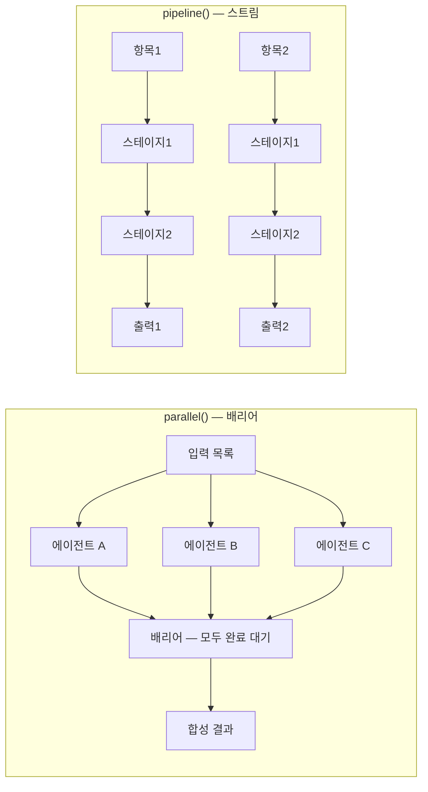

---

## 6. 정적 워크플로우 vs 동적 워크플로우

이 두 개념의 차이를 이해하는 것이 동적 워크플로우를 올바르게 활용하는 데 핵심이다.

**정적 워크플로우**는 Claude Agent SDK나 `claude -p` 명령어를 사용하여 여러 Claude Code 인스턴스를 조율하는 방식으로, 개발자가 직접 오케스트레이션 로직을 코드로 작성하는 방식이다. 정적 워크플로우는 모든 엣지 케이스에 대응해야 하므로 필연적으로 더 일반적인 형태를 취하게 된다.

**동적 워크플로우**는 Claude 자신이 특정 작업을 분석하고 그에 맞는 오케스트레이션 스크립트를 즉석에서 작성하는 방식이다. 이 전환의 의미는 심대하다. 오케스트레이션 단계가 이제 개발자의 결정이 아니라 모델의 결정이 된다. 개발자는 더 이상 오케스트레이션 로직을 작성하지 않는다. 대신 **성공 기준, 제약 조건, 신뢰 경계(trust boundary)** 를 작성하면 된다. 오케스트레이션은 그 뒤를 따른다.

아래 비교는 "결제 서비스를 새 프로바이더로 마이그레이션해야 하는가?"라는 동일한 질문에 대한 두 접근 방식의 차이를 보여준다.

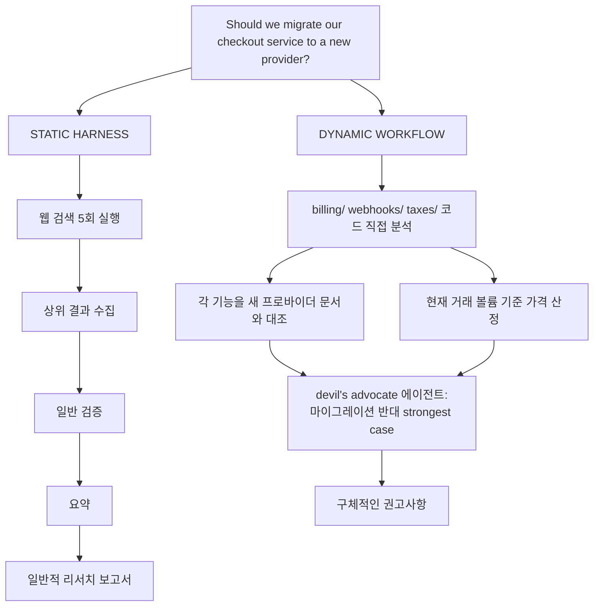

정적 하네스는 일반적인 웹 리서치 파이프라인을 따라 일반적인 보고서를 생성한다. 반면 동적 워크플로우는 실제 코드베이스를 읽고, 각 기능을 새 프로바이더 문서와 직접 대조하며, 거래 볼륨을 고려한 가격 계산을 수행하고, 마지막으로 마이그레이션에 반대하는 strongest case를 devil's advocate 에이전트가 제시한 후 구체적인 권고사항을 도출한다.

---

## 7. 여섯 가지 워크플로우 패턴


Anthropic은 동적 워크플로우를 구성할 때 Claude가 조합해서 사용하는 여섯 가지 공통 패턴을 공식 문서에서 제시하고 있다.

### 7.1 패턴 1: Classify-and-Act (분류 후 행동)

분류기 에이전트가 작업 유형을 먼저 판단하고, 그 유형에 따라 서로 다른 에이전트나 행동으로 라우팅하는 패턴이다. 또는 처리 과정의 마지막에 분류기를 배치하여 최종 출력 형태를 결정하는 용도로 활용하기도 한다.

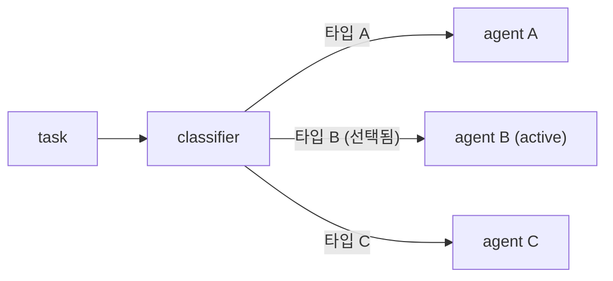

이 패턴의 대표적 활용 사례가 바로 **모델 및 지능 라우팅**이다. 예를 들어, "auth 모듈이 어떻게 동작하는지 설명해줘"라는 작업의 경우, 최적의 모델이 무엇인지는 auth 모듈에 파일이 몇 개나 있고 코드베이스의 구조가 어떠냐에 따라 달라진다. 분류기 에이전트가 먼저 코드베이스를 조사하고 복잡도를 평가한 후, 그 결과에 따라 Sonnet이나 Opus로 라우팅함으로써 토큰 비용 효율성을 높일 수 있다.

### 7.2 패턴 2: Fan-out-and-Synthesize (팬아웃 후 합성)

작업을 여러 개의 작은 단계로 분할하고, 각 단계에 대해 독립적인 에이전트를 실행한 후 결과들을 하나로 합성하는 패턴이다.

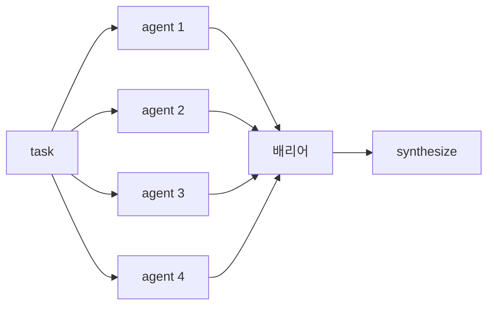

이 패턴은 두 가지 상황에서 특히 유용하다. 하나는 처리해야 할 작은 단계가 많을 때이고, 다른 하나는 각 단계가 깨끗한 컨텍스트 윈도우를 통해 이익을 얻을 때, 즉 단계들 사이의 간섭이나 교차 오염을 방지해야 할 때다. 합성 단계는 배리어로 동작하여 모든 팬아웃 에이전트들이 완료될 때까지 기다렸다가 하나의 결과로 병합한다.

딥 리서치 스킬 `/deep-research`가 이 패턴의 전형적인 예시다. 여러 각도에서 웹 검색을 팬아웃하고, 소스를 가져오고, 각 주장을 적대적으로 검증하고, 인용이 포함된 보고서를 종합한다.

### 7.3 패턴 3: Adversarial Verification (적대적 검증)

생성된 각 에이전트의 출력에 대해 별도의 검증 에이전트를 실행하여, 루브릭이나 기준에 대비하여 적대적으로 검토하는 패턴이다.

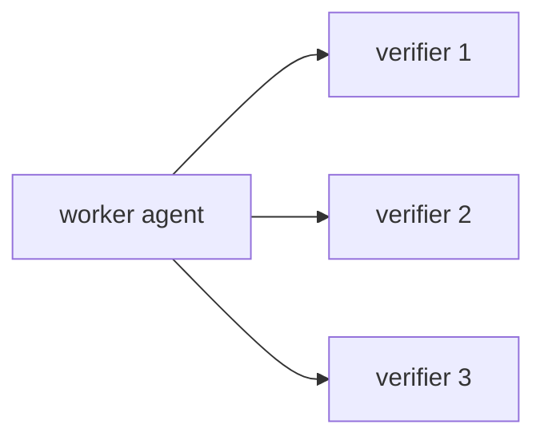

이 패턴은 앞서 설명한 **자기 선호 편향**을 구조적으로 차단하는 핵심 메커니즘이다. 생성자와 검증자가 별도의 컨텍스트를 가진 독립적인 에이전트로 분리되어 있기 때문에, 진정한 의미의 독립적 검토가 가능해진다.

### 7.4 패턴 4: Generate-and-Filter (생성 후 필터링)

특정 주제에 대한 아이디어나 결과물을 다수 생성한 후, 루브릭으로 필터링하거나 검증 절차를 통해 중복을 제거하고, 최고 품질의 검증된 아이디어만을 반환하는 패턴이다.

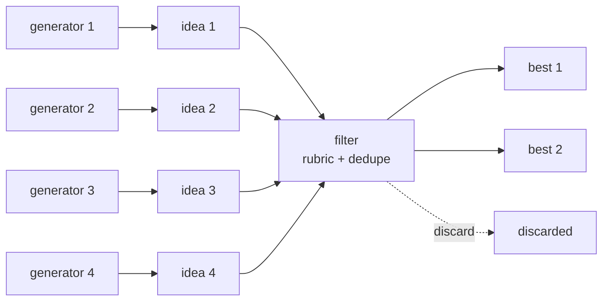

여러 생성기 에이전트들이 다양한 아이디어를 만들고, 필터 에이전트가 루브릭과 중복 제거를 적용하여 최고의 결과물만 통과시킨다. 이름 짓기, 디자인 탐색, 브레인스토밍처럼 다양한 옵션을 탐색한 후 최선을 선택해야 하는 작업에 적합하다.

### 7.5 패턴 5: Tournament (토너먼트)

작업을 분할하는 대신 에이전트들이 경쟁하는 패턴이다. N개의 에이전트가 서로 다른 접근 방식으로 동일한 작업을 시도하고, 판정 에이전트가 쌍별(pairwise) 비교를 통해 최종 우승자가 나올 때까지 판단을 반복한다.

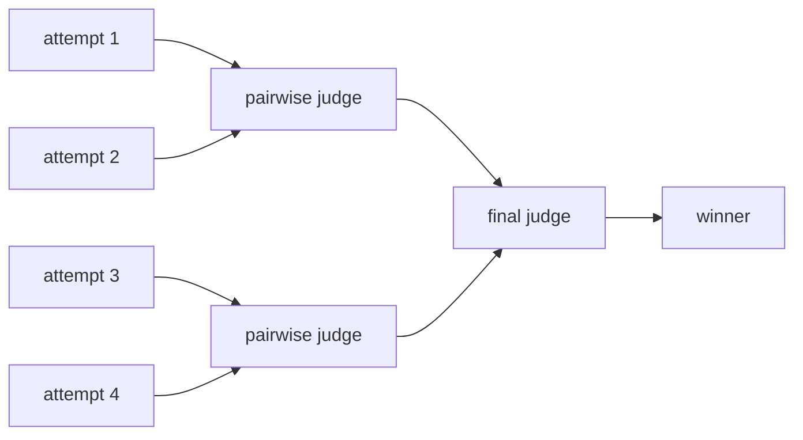

이 패턴이 중요한 이유는 **비교 판단이 절대 점수보다 신뢰성이 높기** 때문이다. "A가 B보다 낫다"라고 판단하는 것이 "A의 점수는 8.5점이다"라고 판단하는 것보다 일관성 있고 신뢰할 수 있다. 각 비교가 별도의 에이전트로 수행되기 때문에, 결정론적 루프가 브래킷(bracket)을 유지하고 실행 순서만이 컨텍스트에 남는다.

1000개 항목을 정렬해야 할 때 단일 프롬프트로 처리하면 품질 저하와 컨텍스트 초과가 발생하지만, 토너먼트 방식으로 처리하면 각 비교가 신선한(fresh) 에이전트로 수행되어 품질을 유지할 수 있다.

아래 다이어그램은 1,000개 항목을 토너먼트 방식으로 정렬하는 과정을 보여준다.

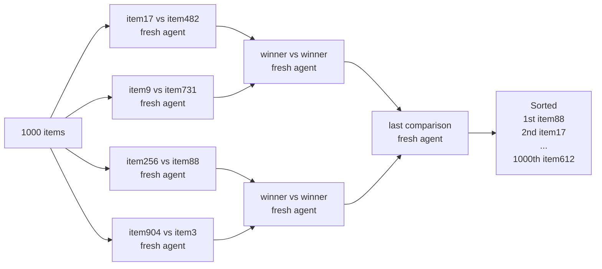

### 7.6 패턴 6: Loop Until Done (완료까지 반복)

작업량이 불확실할 때 고정된 횟수 대신, 중단 조건(예: 새로운 발견이 없음, 로그에 오류가 없음)이 충족될 때까지 에이전트를 반복 생성하는 패턴이다.

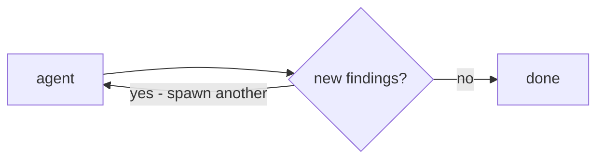

이 패턴은 탐색적 디버깅, 레이스 컨디션 재현, 보안 취약점 탐색처럼 사전에 작업량을 알 수 없는 작업에 특히 적합하다. 세 개 이상의 패턴을 조합하는 복합 패턴도 흔히 사용된다. 예를 들어 Fan-out + Adversarial Verification + Loop Until Done을 결합하면 매우 강력한 검증 파이프라인을 만들 수 있다.

---

## 8. 실전 활용 사례

Anthropic은 코딩 외에도 다양한 분야에서의 활용 사례를 제시하고 있으며, 때로는 비기술적 작업에서 오히려 더 유용하다고 강조한다.

### 8.1 마이그레이션과 리팩터링

대규모 코드 마이그레이션은 동적 워크플로우가 가장 극적인 성과를 보이는 영역이다. 성공적인 마이그레이션을 위한 핵심은 작업을 callsite, 실패한 테스트, 모듈 등의 단계별 작업 항목으로 분해하는 것이다.

각 수정 작업마다 worktree에서 서브에이전트를 생성하여 수정하고, 다른 에이전트가 적대적으로 검토한 후 병합한다. 자원 집약적인 명령을 피하도록 지시하면 머신 자원 고갈 없이 최대 병렬화를 달성할 수 있다. Bun의 실제 사례는 13절에서 상세히 다룬다.

### 8.2 딥 리서치

내장 스킬 `/deep-research`는 동적 워크플로우를 활용하는 딥 리서치의 표준 구현체다. 이 스킬은 웹 검색을 여러 각도로 팬아웃하고, 소스를 수집하고, 각 주장을 적대적으로 검증하고, 인용이 포함된 보고서를 종합한다.

이 방식은 웹 검색에만 국한되지 않는다. Slack 컨텍스트에서 상태 보고서를 작성하거나, 코드베이스를 깊이 탐색하여 특정 기능의 동작 방식을 조사하는 데에도 동일하게 적용할 수 있다.

### 8.3 딥 검증 (Deep Verification)

보고서의 모든 사실적 주장을 확인하고 출처화하려는 경우, 하나의 에이전트가 모든 사실 주장을 식별하고, 그 후 서브에이전트들이 각 주장을 상세히 확인하는 워크플로우를 생성할 수 있다.

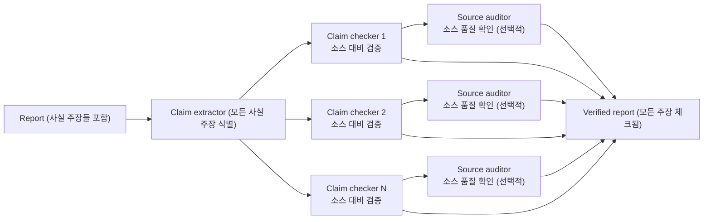

검증 에이전트가 소스 서브에이전트의 출처 품질까지 점검하도록 구성하면, 낮은 품질의 출처에 기반한 주장이 통과되는 것을 방지할 수 있다.

### 8.4 메모리와 규칙 준수

CLAUDE.md에 규칙을 작성해도 Claude가 놓치는 규칙이 있다면, 규칙 목록을 작성하고 규칙당 하나씩 검증 에이전트를 할당하는 워크플로우를 만들 수 있다. 각 에이전트는 깨끗한 컨텍스트에서 단 하나의 규칙만을 집중적으로 검토한다.

아래 흐름을 예시로 설명하면, diff에서 변경된 코드를 놓고 "money는 integer cents (float 금지)", "매 마이그레이션에는 rollback 포함", "오류를 삼키지 말 것 — 전파 또는 로그 기록", "timestamp는 UTC", "API 응답에 내부 ID 누출 금지"라는 다섯 가지 규칙 각각에 대해 별도 검증 에이전트가 배정된다. 규칙 1과 3에서 위반이 감지되면, Skeptic 에이전트가 이것이 실제 위반인지 거짓 양성인지를 재검토하고, 확인된 위반 사항만을 최종 반환한다.

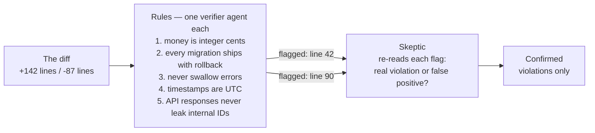

역방향 작업도 가능하다. 최근 세션과 코드 리뷰 코멘트에서 반복적으로 발생하는 수정 사항을 채굴하고, 병렬 에이전트로 클러스터링하고, 각 후보 규칙을 적대적으로 검증("이 규칙이 실제 실수를 방지했을까?")한 후 살아남은 규칙들을 CLAUDE.md로 정제하는 방식이다. 이를 통해 사용 패턴에서 자동으로 규칙을 도출하는 데이터 기반 CLAUDE.md 최적화가 가능해진다.

### 8.5 근본 원인 조사

디버깅에서 최선의 접근법은 여러 독립적인 가설을 세우고 각각을 검증하는 것이다. 그러나 단일 컨텍스트 윈도우에서는 자기 선호 편향 때문에 Claude가 자신이 처음 세운 가설을 선호하는 경향이 있다.

동적 워크플로우는 분리된 증거(로그, 파일, 데이터 등) 별로 별도 에이전트를 배정하여 독립적으로 가설을 생성하게 하고, 각 가설은 검증자와 반박자 패널을 거치게 함으로써 이를 구조적으로 방지한다.

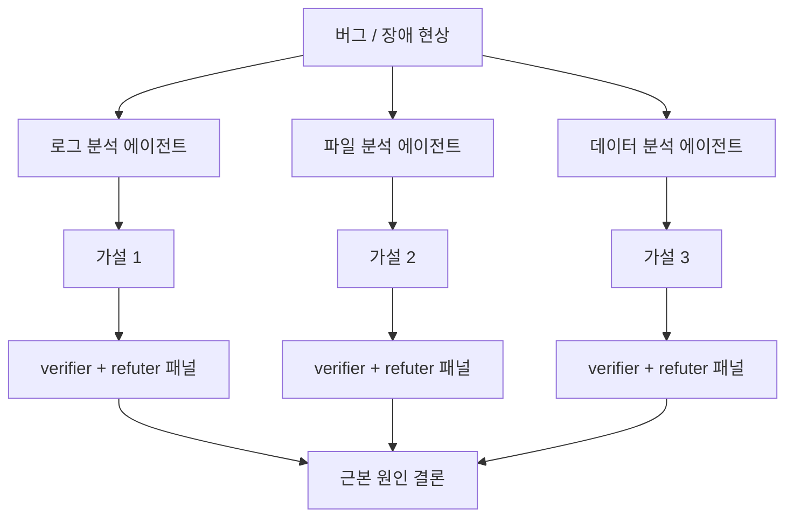

이 접근법은 코드 디버깅에만 국한되지 않는다. 영업(3월 매출이 떨어진 이유), 데이터 엔지니어링(이 파이프라인이 실패한 이유), 또는 모든 종류의 포스트모텀(post-mortem) 분석에 동일하게 적용할 수 있다.

### 8.6 대규모 트리아지 (Triage at Scale)

모든 팀에는 인간이 완전히 처리하기 어려운 지원 큐, 버그 리포트, 또는 백로그가 있다. 트리아지 워크플로우는 각 항목을 분류하고, 이미 추적 중인 항목과 중복을 제거하고, 자동 수정을 시도하거나 사람에게 에스컬레이션하는 행동을 취한다.

이 사용 사례에서 특히 중요한 보안 패턴이 **Quarantine(격리)** 이다.

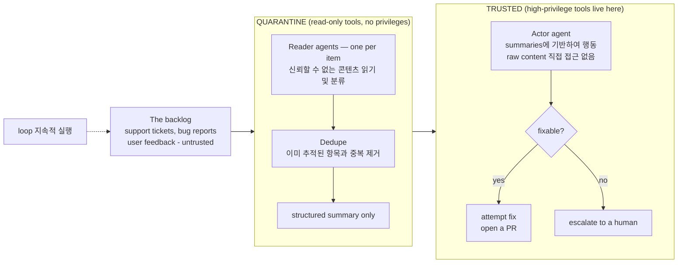

격리 패턴의 핵심은 신뢰할 수 없는 공개 콘텐츠를 읽는 에이전트가 고권한 행동을 직접 수행하지 못하도록 차단하는 것이다. 읽기 에이전트들은 격리된 환경에서 raw 콘텐츠를 읽고 분류하여 구조화된 요약만을 생성한다. 실제 행동(PR 작성, 파일 수정 등)은 이 요약에만 접근하는 신뢰된 행동 에이전트가 수행한다. 이 구조는 프롬프트 인젝션 공격과 같은 보안 위협을 방지한다. 트리아지 워크플로우는 `/loop`와 결합하여 지속적으로 실행되도록 구성할 수 있다.

### 8.7 탐색과 취향 기반 작업

디자인이나 네이밍처럼 취향에 기반하고 루브릭의 이점을 볼 수 있는 솔루션 탐색에도 유용하다. 여러 솔루션을 탐색하게 하고 리뷰 에이전트에 좋은 솔루션 기준의 루브릭을 제공하면, 리뷰 에이전트가 기준 충족 여부를 판단하여 작업을 완료한다. 토너먼트 방식으로 정렬하거나 선택하는 방식으로 확장할 수도 있다.

### 8.8 경량 평가(Evals) 실행

worktree에서 별도 에이전트들을 생성하고, 비교 에이전트로 루브릭에 대비하여 출력을 채점하는 경량 평가를 실행할 수 있다. 예를 들어, 직접 만든 스킬을 특정 기준으로 평가하고 개선하는 데 활용할 수 있다.

---

## 9. 런타임 제약 및 토큰 비용

### 9.1 하드 리밋

공식 문서에 따르면 런타임에는 두 가지 하드코딩된 제한이 있다.

**동시 실행 에이전트 최대 16개**: 로컬 자원을 보호하기 위한 제한이다. 실제 동시 실행 수는 머신의 CPU 코어 수에 따라 더 낮을 수 있다. 이 제한은 머신이 에이전트 실행으로 인해 자원이 고갈되는 것을 방지한다.

**실행당 최대 1,000개 에이전트**: 런어웨이 루프를 방지하기 위한 제한이다. 이 숫자는 동시에 1,000개가 실행된다는 의미가 아니라, 단일 실행에서 생성될 수 있는 총 에이전트 수의 상한이다.

보안 측면에서, 워크플로우 스크립트 자체는 파일 시스템이나 셸에 직접 접근할 수 없다. 오직 생성된 서브에이전트들만이 이러한 접근 권한을 가진다. 워크플로우 내의 서브에이전트들은 세션에서 상속된 허용 목록을 가진 `acceptEdits` 모드로 실행된다.

### 9.2 토큰 소비 특성

동적 워크플로우는 일반 Claude Code 세션보다 토큰을 **훨씬 더 많이** 소비한다. 하나의 워크플로우가 많은 수의 에이전트를 생성하므로 비용이 빠르게 증가한다. 세션의 모든 에이전트는 기본적으로 현재 세션의 모델을 사용하며, 이는 플랜 사용량과 rate limit에 영향을 미친다.

Claude Code CLI의 워크플로우 대시보드에서 실제 토큰 소비량을 확인할 수 있다.

```
Dynamic workflows
1 running · 2 completed

> ✓ review-changes   · 14 agents · 482k tok  · 6m 12s
  ↺ find-flaky-tests ·  6 agents · 121k tok  · 1m 48s
  ✓ deep-research    · 22 agents · 1.1M tok  · 11m 3s

↑/↓ select · enter view · s save · esc close
```

`review-changes` 워크플로우는 14개 에이전트로 482k 토큰을 6분 12초 동안 소비했으며, `deep-research` 워크플로우는 22개 에이전트로 1.1M 토큰을 11분 3초 동안 소비했다. 이 수치는 동적 워크플로우 사용 전 비용 계획 수립에 중요한 참고 지표가 된다.

토큰 소비를 제어하는 방법으로, **명시적 토큰 예산**을 프롬프트에 포함할 수 있다. "use 10k tokens"와 같이 프롬프트하면 해당 토큰을 상한으로 설정한다. 또한 모델별로 비용 차이가 있어 Haiku가 가장 저렴하고, Sonnet이 중간, Opus가 가장 비싸다. 워크플로우 스크립트 안에서 단계별로 다른 모델을 지정함으로써 비용 최적화를 달성할 수 있다.

```javascript
// 비용 최적화 예시: 단순 분류는 저렴한 모델로, 복잡한 추론은 고성능 모델로
agent('Simple classification task', { model: 'haiku' })
agent('Complex reasoning task', { model: 'opus' })
```

---

## 10. 워크플로우 저장과 공유

### 10.1 저장 방법

워크플로우 메뉴에서 "s"를 눌러 워크플로우를 저장할 수 있다. 저장된 워크플로우는 `~/.claude/workflows` 디렉토리에 위치하며, 이를 Git에 커밋하거나 스킬(skill)로 배포할 수 있다. 저장된 워크플로우는 나중에 동일한 작업에 대해 재실행하거나, 약간 수정하여 유사한 작업에 적용하거나, 팀원과 공유하는 용도로 활용할 수 있다.

### 10.2 스킬로 공유

스킬을 통해 워크플로우를 공유하려면, JavaScript 워크플로우 파일을 스킬 폴더에 넣고 SKILL.md에서 해당 파일을 참조하면 된다.

```
~/.claude/skills/deep-verify/
├── SKILL.md                      ← 스킬 설명 파일
├── verify-claims.workflow.js     ← 워크플로우 파일 (참조됨)
└── rubric.md                     ← 보조 파일
```

SKILL.md의 내용 예시는 다음과 같다.

```markdown
---
name: deep-verify
description: Verify every claim in a report
---

## Workflow

Run ./verify-claims.workflow.js to check
each claim with its own subagent.
```

**중요한 설계 원칙**: 스킬 내의 워크플로우를 그대로 실행해야 하는 스크립트가 아닌 **템플릿**으로 간주하도록 Claude에게 프롬프트하는 것이 권장된다. 이렇게 하면 유연성이 높아져, 실제 작업의 세부 사항에 맞게 워크플로우를 조정할 수 있다. 폴더를 공유하면 스킬을 설치한 모든 사람이 동일한 워크플로우를 실행할 수 있다.

---

## 11. 활성화 방법 및 사용 팁

### 11.1 프롬프팅 전략

앞서 설명한 여섯 가지 패턴과 구체적인 기법들을 활용한 **상세한 프롬프팅**이 최상의 결과를 낳는다. 원하는 패턴(Fan-out, Adversarial, Tournament 등), 기준(루브릭), 제약 조건(토큰 예산, 회피해야 할 명령어 등)을 명시적으로 기술할수록 Claude가 더 적합한 워크플로우를 설계한다.

워크플로우는 대규모 작업에만 사용하는 것이 아니다. **"quick workflow"** 를 프롬프트하여 특정 가정에 대한 빠른 적대적 검토를 수행하는 등, 소규모 작업에도 활용할 수 있다.

### 11.2 /goal 및 /loop와 결합

트리아지, 리서치, 검증처럼 반복 가능한 워크플로우는 `/loop`와 결합하여 정기적으로 실행되도록 구성할 수 있다. `/goal`을 사용하면 워크플로우의 하드 완료 요구사항을 설정하여, 특정 조건이 충족될 때까지 계속 실행되도록 할 수 있다.

### 11.3 작업별 모델 지정

작업의 복잡도에 따라 적절한 모델을 선택하는 것이 비용 최적화의 핵심이다. 단순한 분류나 데이터 처리 작업에는 `haiku`를 사용하고, 복잡한 추론과 판단이 필요한 작업에는 `opus`를 사용하는 방식으로 전체 비용을 상당히 줄일 수 있다.

### 11.4 worktree 격리 활용

코드를 수정하는 작업에서는 `isolation: "worktree"` 설정을 적극 활용해야 한다. 이를 통해 여러 에이전트가 동시에 서로 다른 파일을 수정해도 충돌이 발생하지 않는다. 특히 대규모 마이그레이션에서 최대 병렬화를 달성하는 데 필수적이다.

---

## 12. 사용하지 말아야 할 때

동적 워크플로우는 강력하지만, 모든 작업에 적합한 것은 아니다. 올바른 판단력이 필요하다.

**일반 코딩 작업**에는 대부분의 경우 워크플로우가 불필요하다. 단일 함수 작성, 버그 수정, 간단한 리팩터링 같은 작업들은 기본 하네스로 충분히 처리된다. 스스로에게 "이 작업에 정말 더 많은 컴퓨팅 파워가 필요한가?"를 물어보는 것이 좋은 기준점이 된다. 대부분의 전통적인 코딩 작업에는 5명의 리뷰어 패널이 필요하지 않다.

**토큰 비용이 우려되는 경우**에도 신중해야 한다. 단순한 질의응답, 짧은 코드 조각 생성, 명확하게 정의된 단순 작업에는 워크플로우보다 일반 모드가 더 경제적이다.

워크플로우가 진정한 가치를 발휘하는 상황은, 단일 컨텍스트 윈도우에서 아직 시도해보지 못한 방식으로 Claude Code를 밀어붙이는 창의적 활용이다.

| 적합한 상황 | 부적합한 상황 |
|-------------|---------------|
| 수백 개 파일에 걸친 대규모 마이그레이션 | 단일 파일 수정 |
| 50개 이상 항목의 구조화된 보안 감사 | 간단한 코드 리뷰 |
| 독립 가설 검증이 필요한 복잡한 디버깅 | 명확한 단일 버그 수정 |
| 취향 기반 의사결정을 위한 다중 옵션 탐색 | 명확한 정답이 있는 작업 |
| 신뢰할 수 없는 콘텐츠의 대규모 트리아지 | 소량의 명확한 데이터 처리 |
| 1000개 항목의 정성적 정렬 | 10개 이하 항목 정렬 |
| 사실 주장 수십 개가 담긴 보고서 검증 | 간단한 팩트 체크 |
| 레이스 컨디션 재현 및 근본 원인 탐색 | 명확한 스택 트레이스가 있는 버그 |

---

## 13. 실제 사례: Bun의 Zig→Rust 리라이트

동적 워크플로우의 실제 효용성을 가장 극적으로 보여주는 사례는 **JavaScript 런타임 Bun의 Zig에서 Rust로의 리라이트**다. 이 사례는 대규모 코드 마이그레이션에서 동적 워크플로우가 어떻게 활용되는지를 구체적으로 보여준다.

### 13.1 규모와 결과

Bun의 창시자 Jarred Sumner는 동적 워크플로우를 사용하여 약 75만 줄의 Rust 코드를 생성하고, 첫 번째 커밋부터 머지까지 11일 만에 완료했다. 기존 테스트 스위트의 99.8%가 통과하는 결과를 달성했다. 2026년 5월 14일, PR #30412가 Bun의 main 브랜치에 머지되었으며, 이 PR은 6,755개의 커밋, 2,188개의 파일 변경, 100만 줄 이상의 코드 추가를 담고 있었다.

### 13.2 워크플로우 구성

이 마이그레이션에서 활용된 워크플로우들의 구성을 살펴보면 동적 워크플로우의 강점이 잘 드러난다. 먼저 하나의 워크플로우가 Zig 코드베이스의 모든 struct 필드에 올바른 Rust lifetime을 매핑했다. 다음으로, 수백 개의 에이전트가 병렬로 동작하여 각 `.zig` 파일에 대해 동작이 동일한 `.rs` 파일을 작성했다. 각 파일마다 두 명의 검토 에이전트(adversarial reviewer)가 배정되었다. 이후 수정 루프 워크플로우가 빌드와 테스트 스위트를 계속 실행하면서 둘 다 성공할 때까지 반복했다. 포팅이 완료된 후에는 하룻밤 사이에 실행된 워크플로우가 불필요한 데이터 복사를 발견하고 각각에 대해 PR을 열었다.

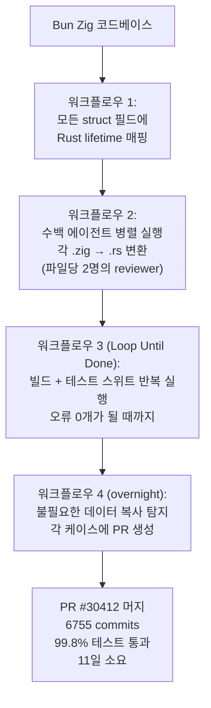

### 13.3 의미와 시사점

이 사례는 단순히 "AI가 코드를 많이 썼다"는 것 이상의 의미를 가진다. 동적 워크플로우가 없었다면 이 규모의 병렬 처리는 불가능했을 것이다. 각 파일마다 별도 에이전트를 배정하고, 각 에이전트에 전용 worktree와 리뷰어를 할당하고, 전체 과정을 오케스트레이션하는 것은 수동으로 구현하기에는 엄청난 엔지니어링 노력이 필요했을 것이다. Jarred Sumner는 "우리는 몇 달 동안 코드를 직접 타이핑하지 않았다. 이것은 이미 현상(status quo)이 되었다"고 말했다.

---

## 14. 예시 프롬프트 모음

공식 문서에서 제시된 예시 프롬프트들은 동적 워크플로우의 활용 범위를 이해하는 데 도움이 된다.

**코드 품질 및 디버깅:**
> "이 테스트는 50번 실행 중 1번 정도 실패합니다. 이를 재현할 수 있는 워크플로우를 구축하세요. 레이스 컨디션에 대한 여러 가설을 세우고, 하나의 가설이 증거로 뒷받침될 때까지 계속 진행하세요."

**코딩 규칙 자동화:**
> "워크플로우를 사용하여 최근 50개 세션을 살펴보고 반복적으로 수정하는 부분을 찾아, 그중 반복되는 부분을 CLAUDE.md 규칙으로 변환하세요."

**인시던트 분석:**
> "워크플로우를 사용하여 지난 6개월 동안 Slack의 #incidents를 분석하고 아무도 티켓을 제출하지 않은 반복적인 근본 원인을 찾아보세요."

**비즈니스 분석:**
> "제 사업 계획서를 가져다가 투자자, 고객, 경쟁업체의 관점에서 여러 담당자들이 꼼꼼하게 분석하는 워크플로우를 실행해 보세요."

**인재 선발:**
> "여기 이력서 80개가 담긴 폴더가 있습니다. 워크플로우를 사용하여 백엔드 직무에 적합한 이력서 순위를 매기고, 상위 10개를 다시 한번 확인해 주세요. AskUserQuestion 도구를 사용하여 평가 기준에 따라 저를 인터뷰해 주세요."

**네이밍 및 브레인스토밍:**
> "이 CLI 도구에 이름을 붙여야 합니다. 워크플로우를 사용하여 여러 옵션을 브레인스토밍하고 토너먼트 방식으로 상위 3개를 선정하세요."

**대규모 마이그레이션:**
> "워크플로우를 사용하여 모든 곳에서 User 모델의 이름을 Account로 변경하세요."

**기술 문서 검증:**
> "제 블로그 게시글 초안을 꼼꼼히 검토하고 워크플로우를 사용하여 코드베이스와 모든 기술적 주장을 대조해 주세요. 잘못된 내용을 배포하고 싶지 않습니다."

---

## 15. 마치며

동적 워크플로우는 Claude Code의 진화에서 단순한 기능 추가가 아니라 **아키텍처적 패러다임 전환**을 의미한다. 개발자가 오케스트레이션 로직을 작성하던 시대에서, Claude가 스스로 오케스트레이션 스크립트를 설계하는 시대로의 전환이다.

이 전환이 의미하는 바를 정확히 이해하는 것이 중요하다. 이것은 단순히 "에이전트가 더 많이 실행된다"는 것이 아니다. 오케스트레이션의 책임이 개발자에서 모델로 이동했다는 것이다. 따라서 엔지니어의 역할도 변화한다. 더 이상 오케스트레이션 로직을 코드로 작성하지 않아도 된다. 대신 **성공 기준, 제약 조건, 신뢰 경계**를 명확히 정의하는 데 집중하면 된다.

세 가지 구조적 실패 모드(Agentic Laziness, Self-preferential Bias, Goal Drift)를 명확히 식별하고, 이를 다중 에이전트 분리로 해결한 접근 방식은 AI 시스템 설계의 중요한 원칙을 보여준다. 단일 컨텍스트에서 모든 것을 처리하려는 욕심을 버리고, 작업을 격리하고 책임을 분리하는 것이 더 신뢰할 수 있고 고품질의 결과를 낳는다는 원칙은 소프트웨어 엔지니어링에서 오래된 지혜와도 일치한다.

그러나 동시에, Anthropic 자신이 강조하듯이 이 기능은 아직 Research Preview 단계이며 모범 사례들은 여전히 발전 중이다. 토큰 소비에 대한 경계심을 유지하면서, 기존에 시도하지 못했던 창의적인 방식으로 활용하는 접근이 필요하다. 워크플로우는 Claude Code를 확장하는 새로운 출발점이며, 그 최선의 활용 방식은 아직 많은 부분이 발견되기를 기다리고 있다.

---

## 참고 자료

- Anthropic 공식 블로그: [A harness for every task: dynamic workflows in Claude Code](https://claude.com/blog/a-harness-for-every-task-dynamic-workflows-in-claude-code)
- Anthropic 공식 블로그: [Introducing dynamic workflows in Claude Code](https://claude.com/blog/introducing-dynamic-workflows-in-claude-code)
- Anthropic 공식 발표: [Introducing Claude Opus 4.8](https://www.anthropic.com/news/claude-opus-4-8)
- Claude Code 공식 문서: [Orchestrate subagents at scale with dynamic workflows](https://code.claude.com/docs/en/workflows)
- HackerNews 번역 (GeekNews): [작업별 맞춤 하네스: Claude Code의 동적 워크플로우](https://news.hada.io/topic?id=30136)
- InfoQ: [Claude Code Adds Dynamic Workflows for Parallel Agent Coordination](https://www.infoq.com/news/2026/06/dynamic-workflows-claude-code/)
- MarkTechPost: [Anthropic Ships Claude Opus 4.8 Alongside Dynamic Workflows](https://www.marktechpost.com/2026/05/28/anthropic-ships-claude-opus-4-8-alongside-dynamic-workflows-and-cheaper-fast-mode-with-workflows-capped-at-1000-subagents/)
- Pasquale Pillitteri: [Dynamic Workflows in Claude Code: Anthropic Opens Research Preview with Up to 1,000 Subagents](https://pasqualepillitteri.it/en/news/3663/claude-code-dynamic-workflows-anthropic-research-preview)

---

