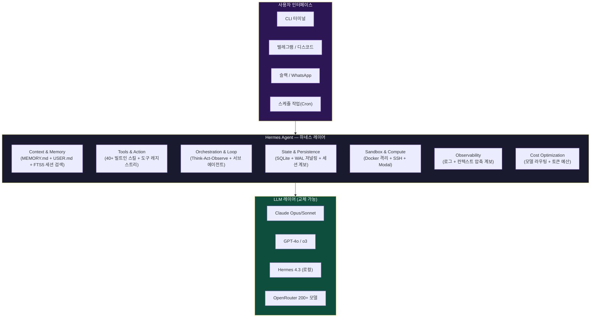
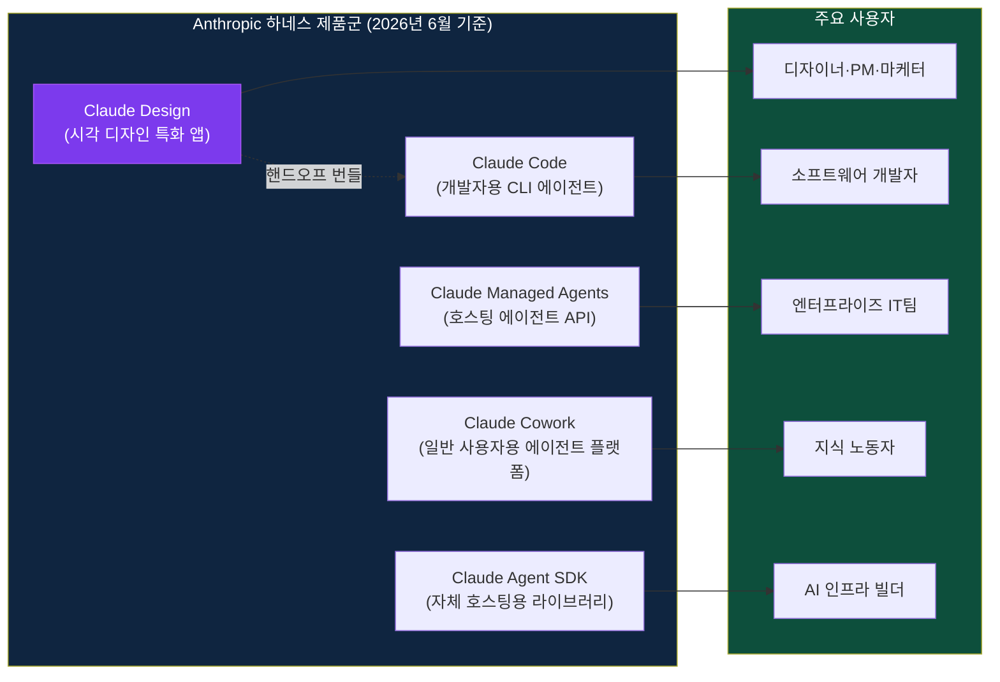
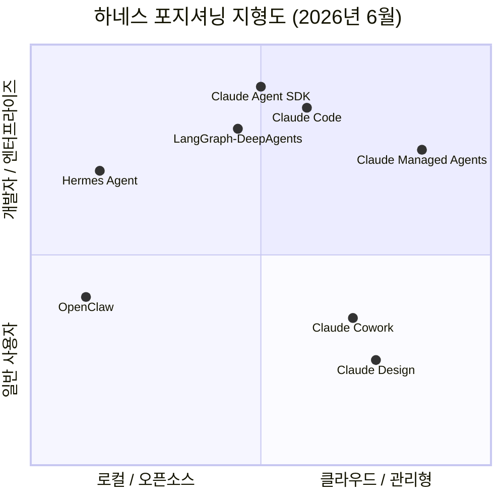
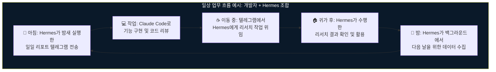
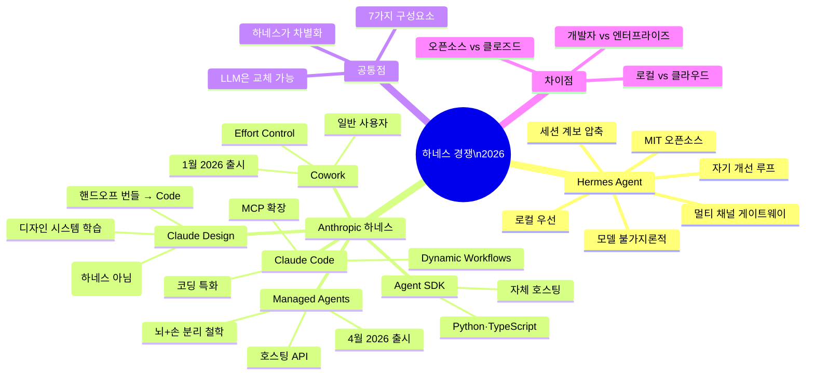
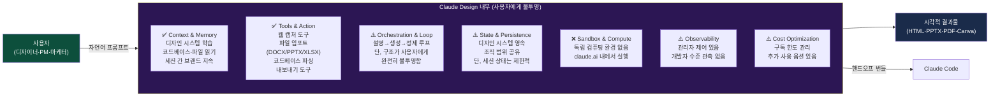
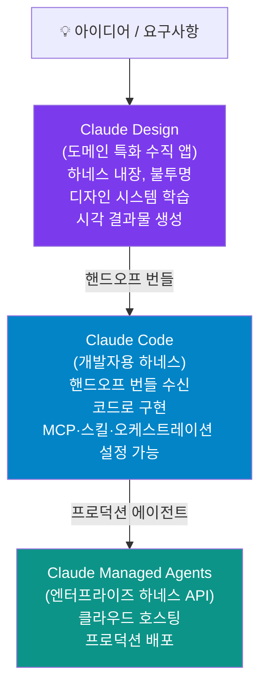
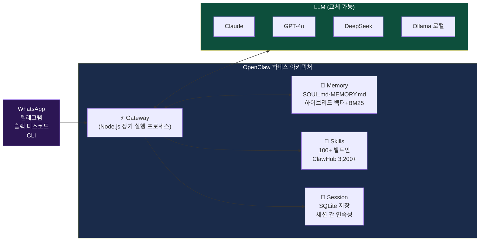
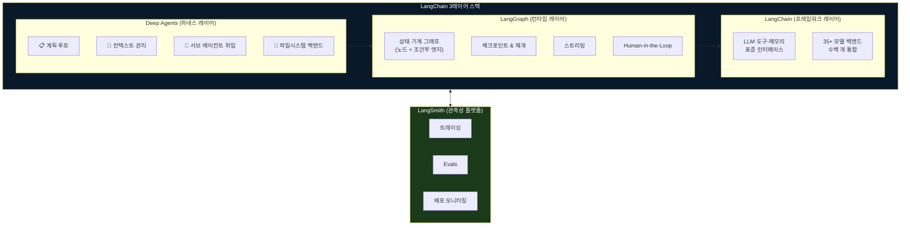
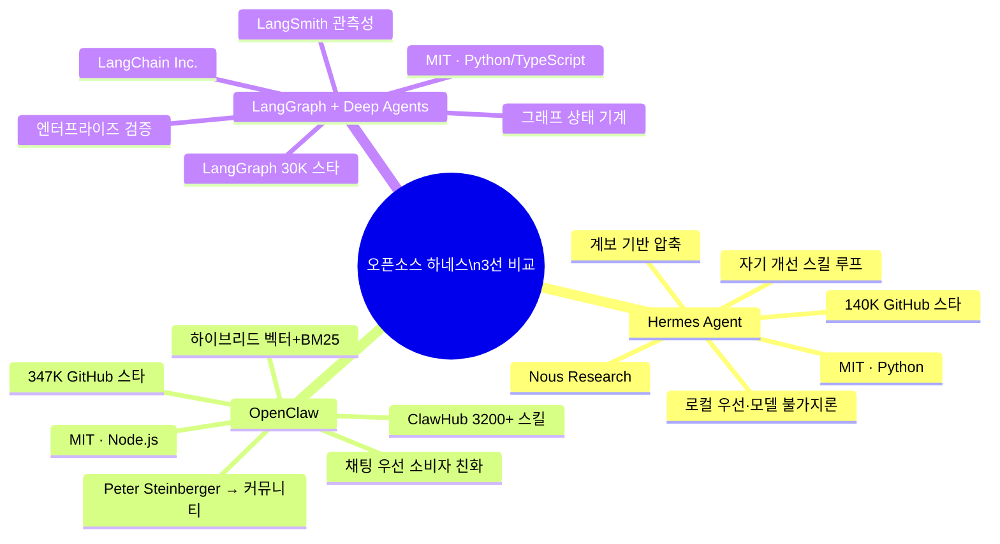

> **작성일:** 2026-06-05 | **최종 업데이트:** 2026-06-05 (부록 9·10 추가, 전체 검토 반영)  
> **참고 자료:** Arize AI (2026-06-01) · hermes-agent.org · GitHub NousResearch/hermes-agent · Blakecosley Hermes Guide (2026-05-31) · Petronella Tech (2026-04-17) · MindStudio 비교 시리즈 · Zylos Research (2026-04-20) · Hatchworks Claude Agent SDK Guide · Apiyi.com Managed Agents 가이드 (2026-04-14) · Releasebot Anthropic June 2026 · Anthropic Claude Design 공식 발표 (2026-04-17) · Zylon.ai OpenClaw 가이드 (2026-03-19) · innFactory OpenClaw vs Hermes (2026-05) · GitHub langchain-ai/deepagents · LangChain Deep Agents 공식 문서 · Atlan Top AI Agent Harness Tools 2026 (2026-04-13)

## 관련글

[**AI 이후의 소프트웨어: 하네스(Harness) 시대의 개막**](https://k82022603.github.io/posts/ai-%EC%9D%B4%ED%9B%84%EC%9D%98-%EC%86%8C%ED%94%84%ED%8A%B8%EC%9B%A8%EC%96%B4-%ED%95%98%EB%84%A4%EC%8A%A4(harness)-%EC%8B%9C%EB%8C%80%EC%9D%98-%EA%B0%9C%EB%A7%89/)

---

## 목차

1. [Hermes Agent란 무엇인가?](#1-hermes-agent란-무엇인가)
2. [Hermes Agent는 하네스인가? — 판정의 근거](#2-hermes-agent는-하네스인가--판정의-근거)
3. [Hermes Agent 아키텍처 심층 분석](#3-hermes-agent-아키텍처-심층-분석)
4. [Anthropic의 하네스 제품군 전체 지형도](#4-anthropic의-하네스-제품군-전체-지형도)
   - 4.1 [Claude Code](#41-claude-code)
   - 4.2 [Claude Managed Agents](#42-claude-managed-agents)
   - 4.3 [Claude Cowork](#43-claude-cowork)
   - 4.4 [Claude Agent SDK](#44-claude-agent-sdk)
   - 4.5 [Claude Design](#45-claude-design)
5. [7가지 구성요소 기준 1:1 비교 분석](#5-7가지-구성요소-기준-11-비교-분석)
6. [전략적 포지셔닝 비교: Nous Research vs. Anthropic](#6-전략적-포지셔닝-비교-nous-research-vs-anthropic)
7. [어떤 상황에 무엇을 선택해야 하는가?](#7-어떤-상황에-무엇을-선택해야-하는가)
   - 7.1 [Hermes Agent가 더 적합한 경우](#71-hermes-agent가-더-적합한-경우)
   - 7.2 [Claude Code가 더 적합한 경우](#72-claude-code가-더-적합한-경우)
   - 7.3 [두 가지를 함께 사용하는 방법](#73-두-가지를-함께-사용하는-방법)
   - 7.4 [OpenClaw · LangGraph/DeepAgents 선택 기준](#74-openclaw--langgraphdeepagents-선택-기준)
8. [종합 정리 및 시사점](#8-종합-정리-및-시사점)
9. [부록: Claude Design — 하네스인가, 아닌가?](#9-부록-claude-design--하네스인가-아닌가)
10. [부록: Hermes 외 대표 하네스 2선 — OpenClaw & LangGraph/DeepAgents](#10-부록-hermes-외-대표-하네스-2선--openclaw--langraphdeepagents)

---

## 1. Hermes Agent란 무엇인가?

Hermes Agent는 미국 독립 AI 연구소 **Nous Research**가 2026년 2월에 공개한 오픈소스 자율 AI 에이전트다. MIT 라이선스로 배포되며, 코드 전체를 누구나 열람하고 수정할 수 있다. 공식 홈페이지(hermes-agent.org)는 이를 이렇게 설명한다: "코딩 코파일럿도 아니고, 단일 API를 감싼 챗봇 래퍼도 아니다. Hermes는 서버 위에서 살아있으며, 학습한 것을 기억하고, 실행될수록 더 유능해진다."

출시 직후부터 Hermes Agent는 놀라운 성장 속도를 보였다. 2026년 4월 초 GitHub 스타 27,000개를 기록했고, 4월 20일 57,000개, 5월 중순에는 140,000개를 넘어서며 "2026년 가장 빠르게 성장하는 오픈소스 프로젝트 중 하나"로 언급되기 시작했다.

기술적으로 Hermes는 Python으로 작성된 서버 사이드 에이전트로, 단일 `curl` 명령어로 설치가 완료된다(Linux, macOS, WSL2 지원). 사용자의 서버 또는 VPS 위에서 상주하며 메시징 게이트웨이(텔레그램, 디스코드, 슬랙, WhatsApp, Signal)를 통해 사용자에게 접근한다. LLM 추론을 위해 자체 모델이 아닌 외부 제공자(Anthropic, OpenAI, OpenRouter, 로컬 vLLM 등 18개 이상)를 사용하며, Nous Portal을 통한 OAuth 통합도 지원한다.

Nous Research는 Hermes Agent 이전부터 Hermes 시리즈 오픈 웨이트 모델(Hermes 2.5, Hermes 3, Hermes 4.3 등)로 잘 알려진 연구소다. Hermes 4.3은 ByteDance의 Seed 36B 기반 모델로 2025년 8월에 출시되었으며, Nous Research의 분산 학습 네트워크 Psyche를 활용한 첫 번째 Hermes 모델이기도 하다. Hermes Agent는 이 모델 시리즈와는 별개로, 2026년에 출시된 하네스 소프트웨어 제품이다.

---

## 2. Hermes Agent는 하네스인가? — 판정의 근거

결론부터 말한다: **Hermes Agent는 명확히 하네스(Harness)다.** 이것은 단순한 해석이 아니라, 복수의 전문 기관과 Hermes 프로젝트 자체가 명시적으로 선언한 사실이다.

**공식 명칭에서의 증거**부터 살펴보자. Hermes Agent의 공식 GitHub 저장소 소개 문구는 "Open-source super AI assistant & Agent Harness"라고 자기 자신을 직접 하네스로 정의한다. agentskill.work의 프로젝트 설명도 동일하게 "Plans tasks, runs tools and skills, autonomously grows with memory and knowledge"라고 하네스의 핵심 기능을 나열한다.

**외부 전문가 분석에서의 증거**도 매우 명확하다. AI 관측성 전문 기업 Arize AI는 2026년 6월 1일 "Hermes from NousResearch is one of the strongest open-source agent harnesses in the ecosystem right now"라는 공식 분석 글을 발표했다. 이 분석에서 Arize는 하네스 아키텍처를 9가지 요소로 정의하고, Hermes가 이 모든 요소를 구현한다고 평가했다. Zylos Research의 2026년 4월 분석도 "Hermes Agent, one of the most complete open-source agent harnesses available today"라고 명시한다.

**구조적 특성에서의 증거**는 가장 결정적이다. Tom Tunguz의 하네스 정의를 기억해보자: "AI 모델을 감싸서 그 모델의 수명 주기, 맥락, 외부 세계와의 상호작용을 관리하는 운영 소프트웨어 계층." Hermes는 정확히 이 정의에 부합한다.

Hermes가 단순한 LLM 래퍼가 아닌 진정한 하네스임을 가장 잘 보여주는 증거는 **모델 불가지론성(Model-Agnostic)** 이다. remoteopenclaw.com의 분석은 이를 명쾌하게 정리한다: "Hermes는 자체 지능이 없다 — Claude, GPT, Gemini, 오픈소스 모델 등의 모델 제공자에 의존한다. 차이는 모델 자체가 아니라 모델 주변의 하네스에 있다." 이는 hermesatlas.com의 다음 평가와도 일치한다: "Hermes와 동일한 Claude Sonnet 모델을 Claude Code에도 사용할 수 있다. 차이는 모델 자체가 아니라 모델을 감싸는 하네스에 있다."

---

## 3. Hermes Agent 아키텍처 심층 분석

Arize AI의 9요소 분석 프레임워크와 Tom Tunguz의 7요소 프레임워크를 결합하면, Hermes의 하네스 아키텍처를 아래와 같이 이해할 수 있다.

### 3.1 핵심 아키텍처: run_agent.py의 AIAgent 클래스

Hermes의 하네스 핵심은 `run_agent.py`에 정의된 `AIAgent` 클래스다. Zylos Research와 kenhuangus.substack.com의 코드 분석에 따르면, 이 클래스는 모델, 예산, 콜백, 플랫폼 컨텍스트를 하나의 런타임 객체로 통합한다. `max_iterations`(기본값 90)로 최대 LLM 턴 횟수를 제한하고, `IterationBudget`은 부모 에이전트와 서브 에이전트 전체에 걸쳐 공유되어 전체 에이전트 트리의 총 작업량을 제한한다. 이것이 바로 무한 루프를 방지하는 하네스의 핵심 메커니즘이다.

### 3.2 컨텍스트 & 메모리 레이어: 3티어 시스템 + SOUL.md

Hermes의 메모리 시스템은 세 가지 실용적 레이어로 구성되어 있으며, 각 레이어는 명확히 다른 역할을 담당한다.

첫 번째는 **영속 메모리(Durable Memory)** 다. `MEMORY.md`에는 환경 사실, 컨벤션, 수정 사항 등 앞으로도 계속 유효할 사실을 저장한다. `USER.md`에는 사용자의 선호도, 이름, 목표, 팀 구조를 보관한다. 이 두 파일의 내용은 매 세션마다 자동으로 시스템 프롬프트에 주입된다. 단, 크기 제한이 있어 `MEMORY.md`는 최대 약 2,200자, `USER.md`는 약 1,375자로 압축 주입된다. 이는 컨텍스트 창 낭비를 방지하기 위한 설계다.

두 번째는 **스킬 메모리(Skill Memory)** 다. 절차적 기억에 해당하는 스킬은 `~/.hermes/skills/` 디렉토리에 `SKILL.md` 형식으로 저장된다. 에이전트가 어려운 문제를 해결하면 스스로 스킬 문서를 작성해 저장한다. 이것이 Hermes의 "자기 개선 루프"의 핵심이다. 스킬은 agentskills.io 오픈 스탠다드와 호환되어 팀 간 공유 및 허브를 통한 설치가 가능하다. 현재 공식 허브에는 18개 카테고리에 걸쳐 687개 이상의 스킬이 등록되어 있다.

세 번째는 **세션 검색(Session Search)** 이다. 모든 CLI 및 메시징 세션은 `~/.hermes/state.db`(SQLite + FTS5 전문 검색)에 저장된다. 사용자가 "지난번에 해결한 방식대로"라고 하면 에이전트가 `session_search` 도구를 활용해 이전 세션을 검색한다. v0.15(2026년 5월 28일)에서 세션 검색 성능이 4,500배 빨라졌다.

**SOUL.md**는 메모리가 아니라 에이전트의 정체성과 성격을 정의하는 별도의 파일이다. 시스템 프롬프트의 가장 첫 번째 슬롯에 배치되며, 도구 안내·스킬 인덱스·환경 힌트·메모리보다 앞서 로드된다. 에이전트의 목소리, 가치관, 행동 경계를 정의해 세션 간 성격 일관성을 보장한다.

### 3.3 컨텍스트 압축: 계보 기반(Lineage-Based) 압축

Hermes의 컨텍스트 압축은 단순한 컨텍스트 잘라내기가 아닌 **계보 기반 압축**으로 동작한다. Arize AI의 분석에 따르면, 오래된 턴은 보조 모델이 요약한다. 헤드와 테일 세그먼트는 토큰 예산으로 보호하고, 일정 임계값보다 오래된 도구 출력은 요약 전에 먼저 제거된다. 요약 예산은 압축 콘텐츠의 약 20% 비율로 결정되며, 2,000토큰이 하한선, 12,000토큰이 상한선이다.

압축 이벤트가 발생하면 현재 SQLite 세션 행이 닫히고, 요약을 시드로 한 자식 세션이 생성되며, 세션 ID가 교체된다. 이렇게 하면 장기 대화가 여러 번 압축되더라도 계속 덮어쓰는 단일 전사본 대신 **계보 체인(lineage chain)** 이 만들어진다. Arize는 이를 "다른 하네스 아키텍처에서는 볼 수 없는 고유한 특성"이라고 평가했다.

### 3.4 도구 & 행동: 레지스트리 분리 설계

Hermes는 도구 등록(registration)과 도구 노출(exposure)을 분리한다. 도구는 임포트 시점에 중앙 레지스트리에 등록되지만, 특정 실행 환경에서 모델에게 실제로 보이는 도구 집합은 별도의 툴셋 레이어가 결정한다. 이 집합은 플랫폼과 시나리오에 따라 범위가 결정되며, 위임된 실행(서브 에이전트)에서는 더욱 좁혀질 수 있다. 이 분리 덕분에 광범위한 도구 라이브러리를 유지하면서도 특정 실행의 모델 노출 범위를 토큰 비용과 보안 측면에서 관리 가능한 수준으로 유지할 수 있다.

빌트인 스킬은 40개 이상으로, MLOps, GitHub, 다이어그램 생성, 노트 작성 등이 포함된다. 외부 도구 연결을 위해 MCP 서버도 지원한다.

### 3.5 샌드박스 & 보안

Hermes는 실행 환경으로 로컬 터미널, Docker 컨테이너, SSH 원격, Modal/Singularity 클라우드 및 HPC 백엔드를 지원한다. Docker 모드에서는 읽기 전용 루트 파일시스템, 권한 제거(dropped capabilities), PID 제한, 네임스페이스 격리가 적용된다. 또한 터미널 명령어에 대한 사전 실행 스캐너(pre-execution scanner)가 포함되어 있으며, 파일시스템 체크포인트와 롤백도 지원한다. 모든 데이터는 `~/.hermes/`에 로컬로 저장되고, 텔레메트리나 클라우드 전송은 없다.

### 3.6 멀티 플랫폼 게이트웨이

Hermes만의 독특한 기능 중 하나는 **통합 메시징 게이트웨이**다. 텔레그램, 디스코드, 슬랙, WhatsApp, Signal, CLI를 단일 게이트웨이 프로세스로 연결한다. 음성 메모 전사, 플랫폼 간 세션 연속성(텔레그램에서 시작한 대화를 터미널에서 이어가기)도 지원한다. 이것은 Anthropic의 하네스들에는 없는 기능이다.

### 3.7 자기 개선 루프

Hermes 공식 GitHub는 Hermes를 "self-improving AI agent"로 정의하며, 이를 "the only agent with a built-in learning loop"라고 표현한다. 구체적으로는 경험으로부터 스킬을 생성하고, 사용 중 스킬을 개선하며, 지식을 영속화하도록 스스로 독려하는(nudge) 메커니즘이 내장되어 있다. 또한 GAPA(Gradient-free Automatic Prompt Alignment)라는 연구 프로젝트와 통합되어 있으며, 이는 ICLR 2026에 채택된 정규 연구 성과다.

---

## 4. Anthropic의 하네스 제품군 전체 지형도

Anthropic은 2026년 들어 단일 제품에서 **복수의 하네스 제품군**으로 포트폴리오를 급격히 확장했다. 2026년 4월 9일의 "트리플 발표(Triple Announcement)"가 그 전환점이었다: Claude Managed Agents 공개 베타 진입, Claude Cowork GA(일반 제공), Claude Code 대규모 업데이트가 동시에 이루어졌다. 이어 4월 17일에는 시각 디자인 특화 제품인 Claude Design이 Anthropic Labs에서 별도로 출시됐다. Claude Design은 엄밀한 의미의 하네스는 아니지만(→ 부록 9 참조), Anthropic의 에이전트 생태계를 완성하는 수직 애플리케이션으로서 이 절에서 함께 다룬다.

### 4.1 Claude Code

Claude Code는 Anthropic이 2025년에 출시한 개발자용 CLI 기반 코딩 에이전트 하네스다. 터미널에서 실행되며, 코드베이스를 읽고 이해하고, 파일을 직접 편집하고, 명령어를 실행하고, 테스트를 고치는 개발자의 실제 작업 흐름에 최적화되어 있다. MCP를 통한 외부 도구 연결, CLAUDE.md를 통한 프로젝트 컨텍스트 주입, git worktree 지원, 멀티 에이전트 오케스트레이션 등이 핵심 기능이다.

2026년 5월 MindStudio의 평가는 이를 명쾌하게 정리한다: "코드베이스를 읽고, 코드를 수정하고, 디버그하고, 리팩토링하는 작업이라면 2026년에는 Claude Code가 정답이다." MindStudio의 Code with Claude 2026 이벤트 분석에 따르면, Anthropic은 이 이벤트에서 신규 모델을 출시하지 않았다. 대신 Dreaming(연구 프리뷰), Outcomes(공개 베타), 멀티 에이전트 오케스트레이션(공개 베타), Claude Finance(10개 사전 빌드 에이전트), Add-ins라는 다섯 가지 하네스 기능을 출시했다. 이는 "프런티어 모델 경쟁보다 하네스 경쟁이 더 의미 있는 전쟁이 됐음"을 보여주는 상징적 장면이다.

Claude Code v2.1 계열(2026년 5월)에는 `--plugin-url`, `claude project purge`, `skillOverrides` 설정 등이 추가됐으며, Dynamic Workflows가 Max·Team·Enterprise 플랜의 연구 프리뷰로 배포되었다.

### 4.2 Claude Managed Agents

Claude Managed Agents는 2026년 4월 8일 공개 베타로 출시된 **클라우드 호스팅 에이전트 API**다. Apiyi.com의 분석은 이를 정확히 표현한다: "에이전트 루프 + 도구 실행 + 샌드박스 컨테이너 + 상태 영속성을 REST API 집합으로 묶은 Managed Agent Harness." 개발자는 `/v1/agents`, `/v1/environments`, `/v1/sessions` 엔드포인트를 호출하는 것만으로 Claude를 자율 에이전트로 실행할 수 있다.

Hatchworks의 Claude Agent SDK 가이드는 Anthropic이 이 설계 철학을 직접 서술한 2026년 4월 엔지니어링 포스트를 인용한다: 모든 에이전트는 "두뇌(brain)"와 "손(hands)"으로 분리된다. 두뇌는 Claude 모델과 다음 행동을 결정하는 하네스 로직이고, 손은 샌드박스·브라우저·파일시스템·커넥터로 실제 행동을 수행하는 계층이다. Managed Agents는 이 두 계층을 호스팅 인프라 위에서 모두 관리한다.

핵심 특징은 다음과 같다. Anthropic이 런타임·스케일링·모니터링을 담당한다. 에이전트 세션마다 격리 컨테이너가 자동으로 생성된다. Server-Sent Events(SSE) 기반의 실시간 스트리밍을 지원한다. 상태와 권한 관리가 네이티브로 처리된다. 가격은 세션당 $0.08/시간(토큰 비용 별도)이다. Rakuten, Notion, Sentry 등이 초기 도입 고객으로 보고되었다. 2026년 5월 중순에는 Claude Platform on AWS GA와 함께 AWS 고객도 네이티브 Claude Platform 경험을 그대로 사용할 수 있게 됐다.

Releasebot의 2026년 6월 Anthropic 업데이트에 따르면, Messages API가 이제 messages 배열 내부에 system 항목을 수용한다. 개발자는 에이전트 실행 중 프롬프트 캐시를 깨거나 user 턴을 우회하지 않고도 Claude의 지시사항을 업데이트할 수 있다. 이것은 특정 하네스에서 에이전트가 실행되는 동안 권한, 토큰 예산, 환경 컨텍스트를 업데이트하는 데 사용할 수 있다.

### 4.3 Claude Cowork

Claude Cowork는 2026년 1월에 처음 출시되고, 4월 9일 GA(일반 제공)가 선언된 **일반 사용자용 에이전트 플랫폼**이다. 비개발자를 포함한 지식 노동자가 에이전트 워크플로우를 구성하고 실행할 수 있도록 설계되었다.

2026년 4월 GA와 함께 여섯 가지 엔터프라이즈 기능이 추가됐다. 주목할 만한 점은 Cowork가 단순한 챗 인터페이스가 아닌 에이전트 템플릿, 플러그인, 도구 통합을 갖춘 플랫폼으로 발전하고 있다는 것이다. 법무 분야 사례를 보면, Thomson Reuters의 CoCounsel, Harvey, Solve Intelligence 등이 Claude 에이전트 SDK로 재구축되어 Cowork에 통합되었다. 코드 작성 없이 에이전트를 클릭 한 번으로 설치하고 사용할 수 있는 것이 핵심 가치다.

Claude Code에 통합된 Dynamic Workflows와 같은 기능도 Cowork에서 사용 가능하며, Outcomes 기능(2026년 Code with Claude 이벤트에서 공개)은 출력 품질을 10.1% 향상시키는 grading 루프를 추가한다. 이는 Hermes의 자기 개선 루프와 개념적으로 유사하지만, Anthropic의 클라우드 인프라 위에서 관리형으로 실행된다는 차이가 있다.

Releasebot의 6월 업데이트에 따르면, Claude Cowork 사용자는 이제 모델 선택기 옆에 위치한 새로운 Effort Control을 통해 응답 품질과 속도를 조절할 수 있다. Effort를 높이면 Claude가 더 깊이 사고하고, 낮추면 더 빠르게 응답하면서 사용량을 절약한다.

### 4.4 Claude Agent SDK

Claude Agent SDK는 Python과 TypeScript 라이브러리로, Claude Code를 구동하는 것과 동일한 에이전트 루프를 개발자 자신의 인프라 위에서 실행할 수 있게 한다. Hatchworks의 분석에 따르면, Managed Agents가 호스팅 인프라를 제공하는 것과 정반대로, Agent SDK는 개발자 자신의 프로세스에서 직접 에이전트 루프를 실행한다. Anthropic의 공식 권장 사용 패턴은 "SDK로 프로토타이핑하고, 프로덕션 환경에서는 Managed Agents로 전환"하는 것이다. Zylos Research는 이를 "의도적인 투 트랙 전략"으로 분석한다.

### 4.5 Claude Design *(하네스 위에 구축된 수직 앱 — 상세 분석은 [부록 9](#9-부록-claude-design--하네스인가-아닌가) 참조)*

Claude Design은 2026년 4월 17일 Anthropic Labs에서 출시한 시각 디자인 특화 제품이다. Claude Opus 4.7을 기반으로 하며, Pro·Max·Team·Enterprise 구독자를 위한 리서치 프리뷰로 제공된다. 텍스트 프롬프트로 인터랙티브 프로토타입, 슬라이드, 목업, 원페이저, 랜딩 페이지 등을 생성하는 데 특화되어 있으며, Figma·Canva가 지배하는 약 600억 달러 규모의 디자인 소프트웨어 시장에 대한 Anthropic의 도전으로 평가된다.

작동 방식의 핵심은 **디자인 시스템 자동 학습**이다. 온보딩 시 코드베이스와 디자인 파일을 읽어 팀의 색상·타이포그래피·컴포넌트를 학습하고, 이후 모든 프로젝트에 자동으로 적용한다. 결과물은 정적 이미지가 아닌 클릭 가능한 라이브 HTML이며, 완성된 디자인은 **"핸드오프 번들"로 패키징해 Claude Code에 단일 지시로 전달**된다. 이것이 Anthropic의 "프롬프트 → 디자인 → 코드 → 배포" 수직 파이프라인 전략의 핵심 연결 고리다.

Claude Design이 하네스 제품군에서 갖는 위치와 성격(하네스 여부 판정, 7요소 적용, 파이프라인 위치)에 대해서는 본 문서 뒤에 추가된 **[부록 9](#9-부록-claude-design--하네스인가-아닌가)** 에서 상세히 다룬다.

---

## 5. 7가지 구성요소 기준 1:1 비교 분석

Tom Tunguz의 7가지 하네스 구성요소 프레임워크를 기준으로 Hermes Agent와 Anthropic의 각 하네스를 비교한다. 비교 대상은 가장 직접 경쟁 관계에 있는 **Hermes Agent vs. Claude Code**를 중심으로, Managed Agents와 Cowork도 별도로 다룬다.

### 5.1 Context & Memory (맥락과 메모리)

Hermes Agent의 메모리 시스템은 Anthropic 하네스들과 철학적으로 근본이 다르다. Hermes는 세션 간 **영속적 개인화(persistent personalization)** 를 설계 원칙으로 삼는다. SOUL.md·MEMORY.md·USER.md로 구성된 3티어 파일 기반 메모리와 FTS5 세션 검색 DB가 함께 작동하며, 에이전트는 작업을 마칠 때마다 무엇을 기억할지 스스로 판단해 메모리를 업데이트한다. 계보 기반 컨텍스트 압축은 긴 대화에서도 이전 맥락의 추적 가능성을 유지한다.

Claude Code는 CLAUDE.md 파일을 통한 프로젝트 컨텍스트 주입과 MCP를 통한 외부 데이터 소스 연결에 강점이 있다. 세션 간 영속 메모리보다는 현재 작업 중인 코드베이스 전체를 컨텍스트로 이해하는 데 집중한다. Claude Managed Agents는 세션 상태를 호스팅 인프라에서 관리하지만, Hermes 수준의 자기 개인화 메모리 시스템은 없다.

### 5.2 Tools & Action (도구와 행동)

MindStudio의 비교 분석은 이 차이를 명쾌하게 정리한다: "Hermes의 스킬 시스템은 더 접근하기 쉽고, Claude Code의 MCP 모델은 기술적 사용 사례에서 더 유연하고 강력하지만 더 많은 사전 설정 작업이 필요하다."

Hermes는 40개 이상의 빌트인 스킬을 즉시 사용 가능한 형태로 제공하며, 에이전트가 스스로 새로운 스킬을 작성한다. 스킬은 SKILL.md 포맷으로 표준화되어 커뮤니티와 공유된다. 비개발자도 hermes skills install 명령어 하나로 스킬을 추가할 수 있다.

Claude Code는 MCP를 통한 무제한적인 확장성을 제공한다. 도구 스키마를 직접 정의하고 MCP 서버를 구성하는 기술적 설정이 필요하지만, 한번 구성하면 Hermes의 스킬 시스템보다 훨씬 더 깊은 통합이 가능하다. Claude Code에는 파일 읽기/쓰기, bash 실행, 웹 검색이 추가 설정 없이 항상 사용 가능한 빌트인 도구로 포함된다.

### 5.3 Orchestration & Loop (오케스트레이션과 루프)

Hermes는 Think-Act-Observe 루프를 기본으로, `max_iterations` 하드캡과 서브 에이전트 위임 기능을 갖추고 있다. v0.15에서 Kanban 기반 멀티 에이전트 자동 분해와 Swarm 토폴로지가 추가됐다. 서브 에이전트는 자체 태스크 ID와 터미널 컨텍스트를 갖고 구조화된 요약을 부모에게 반환한다. 재귀 깊이는 제한되며, 위임된 컨텍스트에서 위험한 명령은 기본적으로 거부된다.

Arize AI의 한계 분석에 따르면, 현재 Hermes의 자식 실행 대부분은 여전히 부모 호출 경로 하에 있다. 부모가 완료되면 자식도 완료된다. 독립적인 제어 의미론(independent control semantics)을 가진 영속적이고 외부에서 조종 가능한 자식 실행 평면은 아직 없다. 이것이 Hermes의 현재 아키텍처적 한계 중 하나다.

Claude Code는 Dynamic Workflows(멀티 에이전트 오케스트레이션), Dreaming(예약된 에이전트 루프), Outcomes(그레이딩 루프) 등 2026년 이후 추가된 오케스트레이션 기능들을 갖고 있다. Managed Agents는 3-에이전트 패턴(Planner → Generator → Evaluator)을 통한 장기 실행 태스크 일관성 유지를 Anthropic의 표준 패턴으로 제시한다.

### 5.4 State & Persistence (상태와 영속성)

이것이 Hermes가 편집기 우선 하네스들과 가장 크게 차별화되는 영역이다. Arize AI는 이를 "Hermes가 편집기 우선 하네스에서 가장 크게 벗어나는 부분"이라고 평가한다.

세션 상태는 WAL 저널링이 적용된 SQLite에 저장되어 파일시스템 수준에서 충돌 복구를 지원한다. 세션은 소스 태그, 압축 분할을 위한 부모-자식 계보, 게이트웨이가 추론 전에 라우팅을 결정하는 데 사용하는 메타데이터를 추적한다. 이 설계는 사실상 세션을 단순한 재개 가능한 기록이 아닌 런타임 인프라로 취급하는 것이다. CLI, 메시징 플랫폼, 예약 작업이 모두 동일한 세션 평면에 연결될 수 있다. 메시지는 추론 전에 올바른 세션으로 라우팅될 수 있고, 예약된 작업은 활성 터미널 없이도 세션에 쓸 수 있다.

Claude Code는 기본적으로 현재 세션 내의 컨텍스트 관리에 집중하며, 세션 간 영속성은 Hermes에 비해 제한적이다. Claude Managed Agents는 호스팅된 세션 상태 관리를 제공하지만, 세션 계보나 플랫폼 중립 라우팅 같은 Hermes의 정교한 설계는 없다.

### 5.5 Sandbox & Compute (샌드박스와 컴퓨팅)

두 제품의 샌드박스 접근 방식은 설계 철학에서 근본적으로 다르다.

Hermes는 **사용자 통제형 로컬 격리**를 제공한다. Docker 컨테이너, SSH 원격, Modal/Singularity 클라우드를 실행 환경으로 선택할 수 있으며, 모든 데이터는 로컬에 보관된다. 컨테이너 강화(읽기 전용 루트, 권한 제거, PID 제한, 네임스페이스 격리), 파일시스템 체크포인트·롤백, 터미널 명령어 사전 실행 스캐너가 보안 레이어를 이룬다. Petronella Tech의 분석에 따르면 완전 에어갭(air-gapped) 환경에서도 실행 가능하다.

Anthropic Managed Agents는 **서비스 제공자 관리형 격리**다. 에이전트 세션마다 Anthropic 인프라에서 격리 컨테이너가 자동 생성된다. 인프라 관리 부담이 없는 대신 데이터가 Anthropic 클라우드를 경유한다. HIPAA, CMMC 같은 엄격한 컴플라이언스 환경에서는 Hermes의 로컬 실행이 더 적합할 수 있다.

### 5.6 Observability & Governance (관측성과 거버넌스)

Hermes의 관측성은 로그 기반의 기본적인 수준이다. 세션 계보와 컨텍스트 압축 이력을 통해 에이전트 행동을 추적할 수 있지만, 엔터프라이즈 수준의 구조화된 감사 추적, Evals 시스템, 정책 강제 메커니즘은 상대적으로 부족하다. 보안 측면에서는 i-scoop.eu의 분석에 따르면 프리 실행 스캐너와 컨테이너 강화가 있지만, OpenClaw 대비 작은 생태계라 보안 감사 사례도 적다.

Anthropic 하네스들은 이 영역에서 우위를 갖는다. 특히 Claude Code는 CLAUDE.md를 통한 정책 강제, OpenTelemetry 기반 추적, Evals 시스템을 갖추고 있다. Managed Agents는 Anthropic이 런타임을 직접 관리하므로 감사 추적, RBAC, 엔터프라이즈 준수 기능이 내장된다. Cowork GA와 함께 추가된 엔터프라이즈 기능 6가지 중에도 거버넌스 관련 기능이 포함됐다.

### 5.7 Cost & Workflow Optimization (비용과 워크플로우 최적화)

Hermes의 가장 강력한 비용 최적화 도구는 **모델 라우팅 유연성**이다. MindStudio의 분석에 따르면, Hermes가 OpenAI Codex를 추론 제공자로 사용하면 $20/월 ChatGPT 구독으로 실행할 수 있어 API 요금 방식보다 훨씬 저렴할 수 있다. 일반적으로 로컬 vLLM과 오픈 웨이트 모델을 사용하면 토큰 비용 없이 실행할 수 있다.

Anthropic 하네스들은 Anthropic API 또는 Managed Agents의 세션 요금($0.08/시간 + 토큰)이 발생한다. 단, Anthropic 모델 자체의 프롬프트 캐싱이 매우 공격적으로 적용되어 장기 실행 에이전트에서 실질 비용을 상당히 낮출 수 있다.

---

## 6. 전략적 포지셔닝 비교: Nous Research vs. Anthropic

### 6.1 경쟁 관계인가, 보완 관계인가?

표면적으로 보면 경쟁 관계처럼 보이지만, 실제는 **복잡한 공생 관계(symbiotic relationship)** 다.

remoteopenclaw.com의 분석은 이를 명확히 정의한다: "Hermes는 Claude를 모델 제공자 중 하나로 사용한다. Claude가 지능을 제공하고, Hermes가 자율 인프라를 제공한다." 즉, Hermes는 Anthropic의 LLM을 소비하는 하네스이고, Anthropic의 하네스들(Claude Code 등)은 같은 LLM을 사용하는 경쟁 하네스다. 하지만 Claude Code는 Anthropic이 우선시하지 않는 "서버 상주, 멀티 채널, 세션 간 기억" 사용 사례를 다루지 않기 때문에, 많은 사용자가 Claude Code와 Hermes를 나란히 사용한다.

everything-pr.com의 Nous Research 프로필 분석은 전략적으로 중요한 통찰을 담고 있다: "Hermes 같은 하네스는 퍼스트 파티 도구가 의도적으로 제공하지 않는 다른 사용 사례 — 다른 스킬 번들, 다른 오케스트레이션 패턴, 다른 모델 제공자 전략, 다른 터미널 경험 — 를 가능하게 하기 위해 설계된다." 이것이 바로 Nous Research가 Claude Code 위에 구축하는 이유다. Claude가 2026년 현재 자율 코딩 작업에서 가장 강력한 모델이기 때문이다. 하지만 그것이 바뀌면 하네스는 다른 제공자로 라우팅을 변경할 것이다.

그러나 이 관계에는 전략적 긴장도 있다. 같은 분석은 다음을 지적한다: "Anthropic의 전략적 도전은 그 역(逆)이다. 어떤 사용자 집단의 기본값이 된 하네스는 관계를 이동시킨다: 사용자의 충성은 모델이 아닌 하네스에 있게 된다. Claude는 인프라가 되고, 하네스가 브랜드가 된다."

### 6.2 오픈소스 vs. 클로즈드: 철학의 차이

Hermes Agent는 **로컬 우선(local-first), 개인 정보 우선, 벤더 중립** 철학을 가진다. 데이터는 `~/.hermes/`에만 저장되고, 텔레메트리 없음, 클라우드 의존 없음, MIT 라이선스로 코드 전체가 공개된다. 이것은 Petronella Tech가 언급한 CMMC, HIPAA, CJIS 등 컴플라이언스 환경에서 완전 에어갭 실행을 가능하게 하는 근거가 된다.

Anthropic 하네스들은 **클라우드 우선, 관리형 인프라** 철학을 가진다. 사용자는 인프라를 관리하는 부담 없이 엔터프라이즈 수준의 스케일링·보안·준수 기능을 사용할 수 있다. 프로토타입에서 프로덕션까지의 전환을 "수개월이 아닌 수일"로 단축하겠다는 것이 Managed Agents의 핵심 가치 제안이다.

---

## 7. 어떤 상황에 무엇을 선택해야 하는가?

### 7.1 Hermes Agent가 더 적합한 경우

서버나 VPS 위에서 24시간 상주하는 자율 에이전트가 필요하다면 Hermes가 현재 선택지다. Claude Code는 랩톱에서 터미널을 열었을 때만 작동하지만, Hermes는 사용자가 자리를 비워도 예약된 작업을 수행하고, 텔레그램으로 결과를 보내온다.

데이터 주권이 중요한 환경도 Hermes의 영역이다. 의료 데이터, 법적 문서, 기업 기밀을 다루는 경우 완전 로컬 실행이 필수다. Hermes는 에어갭 환경에서 로컬 vLLM과 조합해 클라우드 의존 없이 실행할 수 있다.

멀티 채널 접근이 필요한 경우도 Hermes의 강점이다. 텔레그램에서 작업을 시작하고, 터미널에서 이어받고, 슬랙으로 결과를 받는 워크플로우는 Hermes의 통합 메시징 게이트웨이에서만 가능하다.

또한 모델 비용에 민감한 경우, Hermes의 광범위한 모델 지원(OpenRouter 200+ 모델, 로컬 vLLM 포함)을 활용하면 동일한 하네스를 유지하면서 비용을 최적화할 수 있다.

### 7.2 Claude Code가 더 적합한 경우

기존 코드베이스에서 집중적인 소프트웨어 개발 작업을 하는 경우 Claude Code가 더 적합하다. "코드 읽기, 파일 수정, 테스트 실행, 커밋" 루프는 Claude Code가 명확히 우수하다. IDE 통합(VS Code 확장)과 git worktree 지원이 개발자 경험을 최적화한다.

엔터프라이즈 규모의 배포에는 Claude Managed Agents나 Claude Code Enterprise가 적합하다. Anthropic이 인프라·스케일링·모니터링·컴플라이언스를 관리하므로 팀이 하네스 운영보다 비즈니스 로직에 집중할 수 있다.

코딩 외 업무 자동화를 주목적으로 하는 비개발자에게는 Claude Cowork가 가장 낮은 진입 장벽을 제공한다.

### 7.3 두 가지를 함께 사용하는 방법

커뮤니티 합의는 명확하다: 두 도구는 경쟁하지 않고 쌓인다. hermesatlas.com이 정리한 표현이 이를 가장 잘 요약한다: "Claude Code는 앉아서 코딩하는 자리에서, Hermes는 이동 중 또는 백그라운드 자동화에서. 진지하게 사용하는 대부분의 사람들은 두 도구를 나란히 실행한다."

### 7.4 OpenClaw · LangGraph/DeepAgents 선택 기준

OpenClaw와 LangGraph/DeepAgents의 선택 기준 및 상세 비교는 **[부록 10](#10-부록-hermes-외-대표-하네스-2선--openclaw--langraphdeepagents)** 을 참조한다. 간략한 기준만 정리하면 다음과 같다. OpenClaw는 비개발자가 WhatsApp·텔레그램만으로 자율 에이전트를 운용하고 싶을 때, 그리고 커뮤니티 스킬 생태계를 바로 활용하고 싶을 때 적합하다. LangGraph/DeepAgents는 팀 단위 엔터프라이즈 배포에서 완전한 에이전트 실행 경로 추적(LangSmith)이 필요하거나, 복잡한 조건부 분기·병렬 실행을 명시적 그래프로 설계해야 할 때 가장 적합한 선택이다.

---

## 8. 종합 정리 및 시사점

### 8.1 핵심 결론

Hermes Agent는 명확하게 하네스다. 공식 자체 정의, 외부 전문 기관의 평가, 구조적 특성 모두가 이를 뒷받침한다. Tom Tunguz의 7가지 하네스 구성요소 기준으로 분석하면, Hermes는 특히 **Context & Memory(계보 기반 압축, 3티어 메모리)**, **State & Persistence(세션을 런타임 인프라로 취급)**, **Sandbox & Compute(로컬 격리 + 다양한 실행 환경)** 에서 독특한 설계를 가진다. Arize AI의 9요소 프레임워크로 분석해도 Hermes는 모든 요소를 구현하는 "가장 완성도 높은 오픈소스 에이전트 하네스 중 하나"다.

Anthropic의 하네스 제품군은 의도적인 투 트랙 전략(관리형 vs. 자체 호스팅)을 구사하며, 엔터프라이즈 시장에서의 신뢰성과 규모를 핵심 가치로 한다. 2026년 4월의 트리플 발표는 Anthropic이 모델 성능 경쟁에서 **하네스 생태계 경쟁**으로 전략적 중심을 이동했음을 보여준다.

### 8.2 하네스 경쟁이 모델 경쟁을 대체하고 있다

Stanford HAI AI Index 2026에 따르면, AI 에이전트는 질문 답변에서 태스크 완수로 이동하고 있지만 구조화된 벤치마크에서 세 번 중 한 번은 여전히 실패한다. OSWorld에서 에이전트 정확도가 약 12%에서 66.3%로 상승해 인간 성능의 6%포인트 내에 도달했다. 이 환경에서 가치는 더 이상 원시 모델 지능에서만 오지 않는다. 메모리, 워크플로우 복구, 도구 오케스트레이션, 반복 가능성에서 온다. Hermes는 정확히 그 레이어를 위해 구축됐다.

MindStudio의 Code with Claude 2026 분석이 이를 선언적으로 표현한다: "Codex vs Claude Code가 GPT vs Opus보다 지금 당장 더 의미 있는 경쟁이다. 프런티어 모델 경쟁은 하네스 경쟁에 비해 조용해졌다."

이것이 하네스의 시대다. 그리고 Hermes Agent는 그 시대를 여는 가장 주목할 만한 오픈소스 플레이어 중 하나다.

---

## 9. 부록: Claude Design — 하네스인가, 아닌가?

### 9.1 Claude Design이란 무엇인가

Claude Design은 2026년 4월 17일 Anthropic Labs에서 출시한 시각 디자인 특화 AI 제품이다. Claude Opus 4.7 기반으로 동작하며, 텍스트 프롬프트·이미지·문서·코드베이스를 입력으로 받아 클릭 가능한 인터랙티브 프로토타입, 슬라이드 덱, 목업, 원페이저, 랜딩 페이지를 생성한다. 결과물은 정적 이미지가 아닌 라이브 HTML이며, Canva·PDF·PPTX·독립 HTML로 내보낼 수 있다.

핵심 워크플로우는 다음 순서로 흐른다. 온보딩 단계에서 Claude가 코드베이스와 디자인 파일을 읽어 팀의 디자인 시스템(색상·타이포그래피·컴포넌트)을 학습한다. 이후 모든 프로젝트에 해당 시스템이 자동 적용되어 브랜드 일관성이 유지된다. 사용자는 자연어로 원하는 결과물을 묘사하고, 인라인 코멘트·직접 편집·커스텀 슬라이더로 정제한다. 완성된 디자인은 "핸드오프 번들"로 패키징되어 Claude Code에 단일 지시로 전달된다.

### 9.2 하네스 여부 판정: Tom Tunguz 7요소 적용

결론부터 말하면, Claude Design은 **하네스 구성요소를 내장하고 있으나**, 일반적으로 통용되는 "하네스"와는 **다른 층위에 위치한 제품**이다. 정확한 표현은 **"하네스를 품은 도메인 특화 수직 애플리케이션(domain-specific vertical application)"** 이다.

7가지 구성요소별로 살펴보면 다음과 같다.

1. **Context & Memory(✅ 구현됨):** 온보딩 시 코드베이스와 디자인 파일을 읽어 팀 디자인 시스템을 학습하고, 이후 세션에서 지속적으로 재활용한다. 브랜드 자산이 자동 주입되는 방식은 하네스의 컨텍스트 DB 개념과 정확히 일치한다.
2. **Tools & Action(✅ 구현됨):** 웹 캡처 도구, 파일 임포트(DOCX·PPTX·XLSX), 코드베이스 파싱, 다중 포맷 내보내기 등 복수의 도구가 레지스트리 형태로 작동한다. 단, 이 도구들은 사용자가 추가·제거할 수 없는 고정 집합이다.
3. **Orchestration & Loop(⚠️ 부분 구현):** 설명→생성→정제의 반복 루프가 존재하지만 구조 전체가 사용자에게 불투명하게 고정되어 있다. 서브 에이전트 위임이나 멀티 에이전트 패턴은 없다.
4. **State & Persistence(⚠️ 부분 구현):** 디자인 시스템이 세션 간 영속되고, 조직 범위의 공유 링크가 지원된다. 그러나 Claude Code·Hermes 수준의 세션 상태 복구나 체크포인트는 없다.
5. **Sandbox & Compute(❌ 미구현):** 독립적인 격리 컴퓨팅 환경이 없다. claude.ai 인프라 내에서 실행되며, 별도 샌드박스 제어는 사용자에게 노출되지 않는다.
6. **Observability & Governance(⚠️ 부분 구현):** 엔터프라이즈 관리자가 기능 활성화 여부를 제어하고, 조직 범위 공유 정책을 설정할 수 있다. 그러나 개발자 수준의 트레이싱·Evals·가드레일 구성은 없다.
7. **Cost & Workflow Optimization(⚠️ 부분 구현):** 구독 한도 관리와 추가 사용 옵션이 있으며, Claude Opus 4.7이라는 단일 모델로 고정되어 있어 단계별 모델 선택 같은 최적화는 불가능하다.

### 9.3 왜 "하네스이기도 하고, 아닌가도 하다"는 답이 성립하는가

이 질문이 흥미로운 이유는 하네스를 **두 가지 층위**에서 구분해야 하기 때문이다.

**인프라 관점(구축자 시각):** Anthropic 엔지니어들은 Claude Design을 만들기 위해 하네스의 핵심 구성요소들(맥락 관리, 도구 레이어, 워크플로우 루프, 상태 영속)을 모두 구현했다. 이 층위에서 보면 Claude Design의 **내부에는 하네스가 있다.**

**사용자 관점(운용자 시각):** Claude Code·Managed Agents·Hermes Agent에서는 개발자나 운영자가 하네스의 구성요소를 직접 설정하고 통제한다. 반면 Claude Design 사용자는 "예쁜 프로토타입을 만들어줘"라고 말할 뿐, 하네스 아키텍처와 직접 상호작용하지 않는다.

이것은 "전동 드릴은 전기 모터를 내장하고 있지만 전기 모터 그 자체는 아니다"는 논리와 같다. Claude Design은 하네스를 **사용하는** 제품이지, 하네스 **자체**가 아니다.

### 9.4 다른 Anthropic 하네스들과의 결정적 차이

| 비교 항목 | Claude Code / Managed Agents / Hermes | Claude Design |
|---|---|---|
| **사용자 유형** | 개발자·운영자가 하네스를 직접 구성 | 디자이너·PM이 결과물만 사용 |
| **하네스 접근성** | 구성요소 설정 가능 (CLAUDE.md, MCP 등) | 내부 구조 불투명·고정 |
| **모델 교체** | 가능 (Hermes는 18개 이상 제공자) | 불가 (Opus 4.7 고정) |
| **도구 확장** | MCP·스킬 시스템으로 확장 가능 | 제공된 도구만 사용 가능 |
| **출력 형태** | 범용 (코드·문서·분석 등) | 시각 결과물 특화 |
| **파이프라인 위치** | 독립 실행 또는 다른 시스템 호출 | Claude Code에 넘기는 "업스트림" |

### 9.5 Anthropic 수직 파이프라인에서의 위치

Claude Design의 전략적 의미를 가장 잘 보여주는 특징은 **"핸드오프 번들 → Claude Code"** 연결이다. 디자인이 완성되면 Claude Code가 즉시 구현에 착수할 수 있는 번들로 패키징된다. 이는 Anthropic이 "프롬프트에서 배포까지"의 수직 파이프라인을 단계적으로 완성하고 있음을 보여준다.

### 9.6 최종 분류

Tom Tunguz의 7요소 하네스 프레임워크 기준으로 Claude Design은 **불완전한 하네스**다. Sandbox & Compute가 없고, Observability가 관리자 수준에 머물며, 도구·루프·상태가 모두 고정·불투명하게 제공된다. Arize AI가 Hermes를 "the strongest open-source agent harnesses"로 분류한 것과 같은 의미의 범용 하네스는 아니다.

가장 정확한 분류는 **"하네스 인프라 위에 구축된 도메인 특화 AI 제품"** 이다. Anthropic 제품 생태계 내에서 Claude Design은 파이프라인의 가장 앞단에서 시각적 명세를 생성하고, 그 결과물을 하네스(Claude Code)로 넘기는 구조다. 두 제품은 경쟁하는 것이 아니라 파이프라인으로 연결되어 있다.

---

## 10. 부록: Hermes 외 대표 하네스 2선 — OpenClaw & LangGraph/DeepAgents

> Hermes Agent 외에 "하네스"라고 부를 수 있는 대표적인 제품 두 가지를 선정해 분석한다.

### 선정 기준과 선택 이유

하네스라고 부를 수 있는 제품은 2026년 기준 수십 개가 존재한다. 여기서는 **접근 철학이 서로 뚜렷하게 다른** 두 제품을 선택했다. 첫 번째는 **OpenClaw**로, 소비자 친화적인 채팅 우선 로컬 하네스의 대표 주자다. 두 번째는 **LangGraph + Deep Agents(LangChain)** 로, 개발자·엔터프라이즈 지향의 그래프 기반 하네스 스택이다. 두 제품은 Hermes와 함께 오픈소스 하네스 생태계의 세 가지 서로 다른 설계 철학을 대표한다.

---

### 10.1 OpenClaw — 소비자 친화적 로컬 우선 하네스

#### 개요 및 배경

OpenClaw는 오스트리아 개발자 Peter Steinberger(PSPDFKit 창업자)가 2025년 11월 Moltbot이라는 이름으로 처음 공개한 오픈소스 AI 에이전트 프레임워크다. 3일 후 OpenClaw로 이름을 바꾸었으며, 이후 폭발적인 성장을 기록했다. 2026년 1월 GitHub 스타 110,000개, 3월 247,000개, 4월 347,000개를 넘어서며 GitHub 역사상 가장 많이 스타를 받은 프로젝트 중 하나가 됐다. 2026년 3월 창시자인 Steinberger가 OpenAI에 합류했고, 프로젝트 거버넌스는 Grok Research·Armalo AI·독립 관리자들로 구성된 기술 운영 위원회(technical steering committee)로 이전됐다. 창시자 이탈 후 오히려 개발 속도가 증가해 발표 이후 2주 동안 47개의 PR이 병합됐다.

OpenClaw는 처음부터 **채팅 우선(chat-first), 비개발자 친화** 철학으로 설계됐다. WhatsApp에서 "비행기 표 6천 루피 이하로 예약하고, 캘린더 블록하고, 팀 이메일에 일정표 보내줘"라고 텍스트를 보내면 10분 후 완료됐다는 식의 시나리오가 그 철학을 잘 보여준다. Zylon의 공식 분석은 이를 "LLM을 메모리·도구·트리거·지시사항·출력 채널로 둘러싸 모델을 상태 없는 텍스트 생성기에서 상태 있는 자율 오퍼레이터로 변환하는 프레임워크"라고 정의한다.

#### 5레이어 하네스 아키텍처

OpenClaw의 아키텍처는 5개의 수평 레이어로 구성된다.

첫 번째 레이어는 **모델(Model)** 이다. 추론 엔진으로, Claude·GPT-4o·DeepSeek·Ollama를 통한 로컬 모델 등 15개 이상의 AI 모델을 지원한다. 모델은 교체 가능하며 하네스에 종속되지 않는다.

두 번째 레이어는 **게이트웨이 & 세션 레이어(Gateway & Session Layer)** 다. 시스템의 중심부로, Node.js로 작성된 단일 장기 실행 프로세스다. WhatsApp·텔레그램·슬랙·디스코드 등 6개 이상의 메시징 채널에서 메시지를 라우팅하고, LLM 호출을 오케스트레이션하며, 스킬에 작업을 위임한다. 랩톱·홈 서버·월 5달러짜리 VPS 어디서든 실행된다.

세 번째 레이어는 **메모리(Memory)** 다. OpenClaw는 하이브리드 메모리 시스템을 사용한다. 벡터 인덱스(시맨틱 검색)와 BM25 키워드 검색을 결합한다. 구체적으로는 Markdown 파일을 약 400토큰 청크로 분할하고, 임베딩(OpenAI/Gemini/로컬 GGUF)하여 SQLite에 저장한다. 파일 구조는 `~/.openclaw/workspace/` 하위의 AGENTS.md(에이전트 설정), SOUL.md(성격·선호도), MEMORY.md(장기 사실·요약), HEARTBEAT.md(능동적 태스크 체크리스트)로 구성된다. 컨텍스트 창이 자동 압축(auto-compaction) 임계에 도달하면 에이전트가 먼저 영속 메모를 디스크에 기록하는 조용한 에이전트 턴을 실행한 후 요약이 이루어진다.

네 번째 레이어는 **스킬(Skills)** 이다. OpenClaw의 외부 세계 인터페이스다. 스킬은 웹 브라우저 제어·파일 관리·API 호출·멀티스텝 워크플로우 자동화 등을 수행하는 모듈이다. 100개 이상의 사전 구축 스킬이 포함되고, ClawHub 마켓플레이스(커뮤니티 기여 3,200개 이상)에서 추가 설치가 가능하다. 단, 2026년 초 ClawHub에서 341개의 악성 스킬이 발견된 보안 사건이 있었으며, 그 중 335개는 단일 캠페인에 의한 것이었다.

다섯 번째 레이어는 **출력 & 외부 시스템 연결**이다. 처리된 결과가 메시징 채널로 반환되거나 외부 시스템에 적용된다.

#### 7요소 하네스 기준 평가

OpenClaw는 Tom Tunguz의 7가지 구성요소를 다음과 같이 충족한다. Context & Memory는 하이브리드 벡터·BM25 검색과 SOUL.md·MEMORY.md·HEARTBEAT.md 파일 기반 영속 메모리로 구현된다. Tools & Action은 ClawHub 스킬 마켓플레이스와 100개 이상의 빌트인 스킬로 담당한다. Orchestration & Loop는 게이트웨이가 오케스트레이션하는 멀티스텝 워크플로우로 실행된다. State & Persistence는 SQLite 세션 저장과 파일 기반 메모리 영속으로 보장된다. Sandbox & Compute는 Docker 격리(샌드박스 프로세스에서 스킬 실행)로 제공하지만, 보안 CVE가 여러 건 발생했다. Observability & Governance는 상대적으로 취약한 영역으로, 기업 수준의 감사 추적·정책 강제 기능이 부족하다. Cost & Workflow Optimization은 모델 라우팅 유연성을 통해 지원하며, ChatGPT 구독($20/월)으로도 실행 가능한 구조다.

#### OpenClaw의 특징적 강점과 한계

OpenClaw의 강점은 세 가지다. 압도적인 커뮤니티 규모(347,000 GitHub 스타, 3,200개 스킬)가 생태계를 만들었다. 채팅 인터페이스 우선 설계로 비개발자도 WhatsApp·텔레그램에서 자연어로 에이전트를 운용할 수 있다. HEARTBEAT.md라는 독특한 능동적 태스크 체크리스트 메커니즘으로 에이전트가 스스로 주기적으로 점검해야 할 사항을 추적한다.

OpenClaw의 한계도 분명하다. 보안이 가장 큰 과제다. CVE-2026-25253(CVSS 8.8)은 패치됐지만, ClawHub 악성 스킬 사건과 다수의 후속 CVE는 생태계 규모가 커지면서 공격 표면도 넓어졌음을 보여준다. 또한 자체 승인 워크플로우·의사결정 경계·준법 로깅이 없어 금융·의료·규제 환경에서는 해당 레이어를 직접 구현해야 한다. MintMCP의 분석은 "프로덕션 배포에는 사소하지 않은 강화 작업과 운영 소유권이 필요하다"고 명시한다.

---

### 10.2 LangGraph + Deep Agents (LangChain) — 그래프 기반 엔터프라이즈 하네스 스택

#### 개요 및 배경

**LangChain**은 2022년부터 AI 에이전트 개발의 사실상 표준 프레임워크로 자리잡았다. 2026년 현재 LangChain 생태계는 세 층위의 스택으로 구성된다. 가장 아래에 **LangChain**(프레임워크 — LLM·도구·메모리·출력 파싱의 표준 인터페이스 제공)이 있고, 그 위에 **LangGraph**(런타임 — 에이전트 루프를 명시적 상태 기계 그래프로 모델링)가 있으며, 가장 위에 **Deep Agents**(하네스 — 계획·컨텍스트 관리·위임이 즉시 사용 가능하도록 번들된 "batteries-included" 하네스)가 올라탄다. 공식 문서는 이 세 레이어의 관계를 "LangGraph가 그래프 런타임, LangChain의 create_agent가 그 위의 최소 에이전트 하네스, Deep Agents가 create_agent 위의 더 의견이 강한 하네스"로 설명한다.

**LangGraph**는 2026년에 30,000개 이상의 GitHub 스타를 보유하며 2.0 버전을 출시했다. 3년간의 프로덕션 오케스트레이션 패턴을 집대성한 이 릴리즈는 타입 안전 스트리밍, Deploy CLI(관리형 호스팅), 통합 에이전트 프리미티브(Router·Supervisor·Subagent)를 도입했다. Klarna·Uber·J.P. Morgan·LinkedIn·Replit이 프로덕션에서 사용하고 있으며, 2026년 비교 벤치마크에서 87%의 태스크 성공률로 최고 성적을 기록했다고 Atlan이 분석했다.

**Deep Agents**는 2026년 3월 LangChain이 공개한 "batteries-included agent harness"로, 공식 GitHub README는 "Claude Code에서 영감을 받아, 무엇이 범용성을 만드는지 파악하고 더 나아가려는 시도"라고 명시한다.

#### LangGraph의 핵심 설계: 상태 기계로서의 에이전트 루프

**LangGraph**가 다른 하네스들과 근본적으로 다른 점은 에이전트 루프를 **명시적 상태 기계(explicit state machine)** 로 모델링한다는 것이다. 각 노드는 LLM 또는 도구 함수이고, 엣지는 결정론적 또는 에이전트 선택적 전환을 정의한다. 이 구조는 AgentExecutor 같은 불투명한 루프와 달리 실행 경로를 완전히 추적 가능하게 만들고, 중간에 일시 정지하거나 분기하거나 재개하는 것을 자연스럽게 지원한다.

**LangChain**의 2026년 State of Agent Engineering 리포트에 따르면 프로덕션 인시던트의 60% 이상이 상태 관리 문제에서 비롯된다. **LangGraph**의 상태 기계 설계는 정확히 이 문제를 해결하기 위한 것이다.

#### Deep Agents의 7요소 하네스 구현

1. **Context & Memory:** Deep Agents는 파일 기반 영속 메모리와 LangGraph의 BaseStore(크로스 스레드 키-값 저장소)를 결합한다. StateBackend(대화 내 임시), FilesystemBackend(호스트 파일시스템에 영속), RemoteBackend(원격 샌드박스)의 세 가지 백엔드를 지원하며, 실제 사용 사례에 따라 선택할 수 있다.
2. **Tools & Action:** MCP 어댑터(`langchain_mcp_adapters`)를 통해 모든 MCP 서버의 도구를 에이전트에 로드할 수 있다. LangChain의 수백 개 통합을 그대로 사용할 수 있어 도구 생태계가 가장 넓다. `HarnessProfile`로 특정 모델이나 제공자에 맞게 도구 스택을 튜닝한다.
3. **Orchestration & Loop:** LangGraph 상태 기계 위에서 동작하는 Supervisor·Router·Subagent 패턴이 핵심이다. 복잡한 멀티 에이전트 시스템에서 Supervisor(프런티어 모델)가 계획·라우팅을 담당하고 Worker(저렴한 모델)가 실행을 맡는 분리 패턴을 권장한다. 2026년 5월 200개 혼합 작업 실측 결과 이 패턴으로 비용을 약 60% 절감하면서 라우팅 정확도는 4포인트만 감소했다고 보고됐다.
4. **State & Persistence:** LangGraph 2.0의 체크포인트-재개 복구가 "단일 에이전트 태스크의 참조 설계"로 평가받는다. `interrupt_after`로 Human-in-the-Loop 포인트를 그래프에 명시적으로 삽입하고, 체크포인터가 모든 상태를 영속화하므로 장기간 실행 작업에서도 재개가 가능하다.
5. **Sandbox & Compute:** FilesystemBackend의 `virtual_mode=True`로 경로를 root_dir로 제한하고 `..` 경로 순회를 차단한다. 원격 샌드박스로 에이전트를 독립 환경에서 실행하는 RemoteBackend도 지원한다.
6. **Observability & Governance:** 이 영역이 LangGraph/Deep Agents의 가장 큰 강점이다. **LangSmith**가 모든 에이전트 실행의 완전한 추적·평가·배포 모니터링을 제공한다. 모든 노드 실행, 토큰 비용, 에이전트 실행 경로 시각화가 가능하다. AgentOps(YC W24)와의 통합으로 세션 재생·비용 추적·실패 감지도 지원된다.
7. **Cost & Workflow Optimization:** 모델 라우팅이 가장 정교하다. 같은 워크플로우 내에서 Supervisor에는 Claude Sonnet, Worker에는 Haiku·gpt-4o-mini를 쓰는 티어링이 기본 패턴으로 확립됐다. OmniRoute 같은 게이트웨이와 결합하면 스마트 모델 라우팅으로 40~60%의 토큰 비용 절감을 달성할 수 있다.

#### LangGraph/DeepAgents의 특징적 강점과 한계

가장 큰 강점은 **관측성**이다. LangSmith가 제공하는 LLM 실행의 완전한 가시성은 프로덕션 환경에서 다른 하네스가 따라오기 어려운 수준이다. 두 번째 강점은 **설계의 명시성**이다. 에이전트 루프를 상태 기계 그래프로 표현하면 복잡한 조건부 분기·병렬 실행·에러 처리가 명확하게 가시화된다. 세 번째는 **엔터프라이즈 채택 기반**이다. Klarna·Uber·J.P. Morgan이 실제 프로덕션에서 사용하는 실적이 있다.

한계는 **진입 장벽**이다. 상태 기계 설계 패턴을 익히는 학습 곡선이 있으며, OpenClaw나 Hermes처럼 채팅 인터페이스만으로 비개발자가 즉시 사용하는 형태가 아니다. 또한 LangGraph가 프레임워크·런타임 역할을 동시에 하면서 책임 범위가 다소 불분명한 지점이 있다.

---

### 10.3 세 가지 오픈소스 하네스 비교 요약

Hermes Agent, OpenClaw, LangGraph/DeepAgents는 하네스 생태계의 세 가지 서로 다른 설계 철학을 대표한다. 기원을 보면 Hermes는 AI 연구소(Nous Research)가 에이전트 인프라 전문 목적으로 설계했고, OpenClaw는 개인 개발자가 "내 손 위의 자율 비서" 비전으로 만들었으며, LangGraph/DeepAgents는 엔터프라이즈 AI 플랫폼 기업(LangChain)이 프로덕션 오케스트레이션 패턴을 집대성했다.

| 비교 항목 | Hermes Agent | OpenClaw | LangGraph + Deep Agents |
|---|---|---|---|
| **주요 사용자** | 개발자·파워 유저 | 비개발자·소비자 | 개발자·엔터프라이즈 팀 |
| **접근 방식** | CLI·메시징 게이트웨이 | 채팅 우선 (WhatsApp 등) | 코드·그래프 기반 |
| **GitHub 스타** | 140,000+ | 347,000+ | LangGraph 30,000+ |
| **메모리 방식** | 파일 기반 3티어 + FTS5 | 하이브리드 벡터+BM25 | LangGraph BaseStore + 파일 |
| **컨텍스트 압축** | 계보 기반 (부모-자식 세션) | 자동 압축 (메모리 플러시) | 그래프 상태 기계 체크포인트 |
| **도구 확장** | SKILL.md 표준 + MCP | ClawHub 마켓플레이스 + MCP | LangChain 통합 수백 개 + MCP |
| **관측성** | 로그 + 세션 계보 | 제한적 | LangSmith (가장 강력) |
| **보안** | 컨테이너 강화·MCP OAuth 2.1 | CVE 다수 (개선 중) | FilesystemBackend 격리 |
| **자기 개선** | 스킬 자동 생성 루프 | HEARTBEAT.md 체크리스트 | LangSmith Evals 기반 회귀 개선 |
| **라이선스** | MIT | MIT | MIT (LangChain/LangGraph) |
| **특징적 강점** | 세션 계보 압축·모델 불가지론 | 최대 커뮤니티·채팅 인터페이스 | LangSmith 관측성·엔터프라이즈 검증 |
| **주요 한계** | 독립 서브에이전트 제어 미성숙 | 거버넌스·보안 취약점 | 학습 곡선·비개발자 접근성 낮음 |

---

*부록 9 추가 참고 자료: Anthropic, "Introducing Claude Design by Anthropic Labs" (2026-04-17) · TechCrunch, "Anthropic launches Claude Design" (2026-04-17) · dapta.ai, "Claude Design: Anthropic's Bet on the $60B Design Market" (2026-04-23) · getaiperks.com, "Claude Design Review 2026" (2026-04-30)*

*부록 10 참고 자료: Zylon.ai, "What Is OpenClaw?" (2026-03-19) · Valletta Software, "OpenClaw Architecture Diagram 2026" · innFactory, "OpenClaw vs. Hermes Agent" (2026-05) · MintMCP, "How OpenClaw Works" (2026-03) · GitHub langchain-ai/deepagents · LangChain Deep Agents Docs · DEV Community, "Deep Agents: Building Long-Running Autonomous Agents" (2026-04-20) · Atlan, "Top AI Agent Harness Tools 2026" (2026-04-13) · Eastondev, "LangGraph State Management 2026" · buildmvpfast, "LangGraph Supervisor + Deep Agents" (2026)*

*전체 참고 자료: Arize AI (2026-06-01) · hermes-agent.org · GitHub NousResearch/hermes-agent · Blake Crosley Hermes v0.15 Reference (2026-05-31) · Petronella Tech (2026-04-17) · MindStudio 비교 시리즈 · Zylos Research (2026-04-20) · Hatchworks · Apiyi.com (2026-04-14) · Releasebot Anthropic (2026-06) · everything-pr.com · i-scoop.eu (2026-04-17) · Anthropic Claude Design 공식 발표 (2026-04-17) · Zylon.ai OpenClaw 가이드 (2026-03-19) · innFactory OpenClaw vs Hermes (2026-05) · GitHub langchain-ai/deepagents · LangChain Deep Agents 공식 문서*

*작성일: 2026-06-05 | 최종 업데이트: 2026-06-05 (부록 9·10 추가)*
