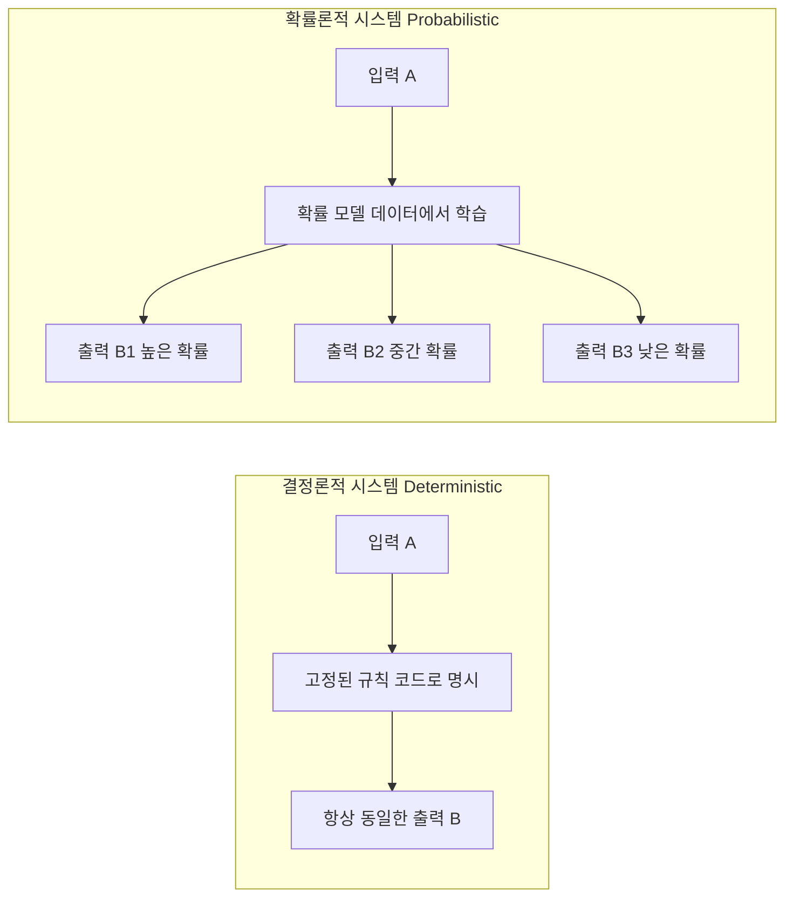
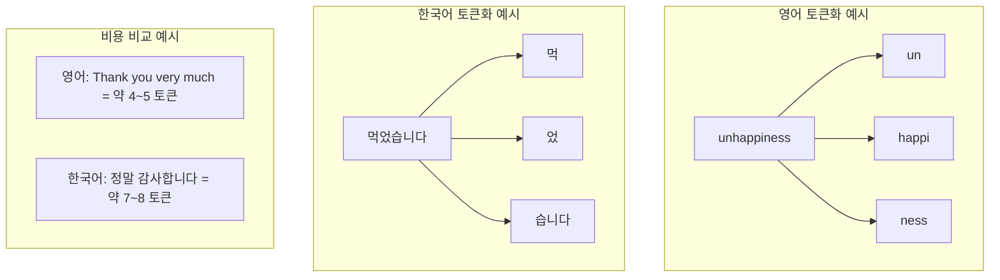
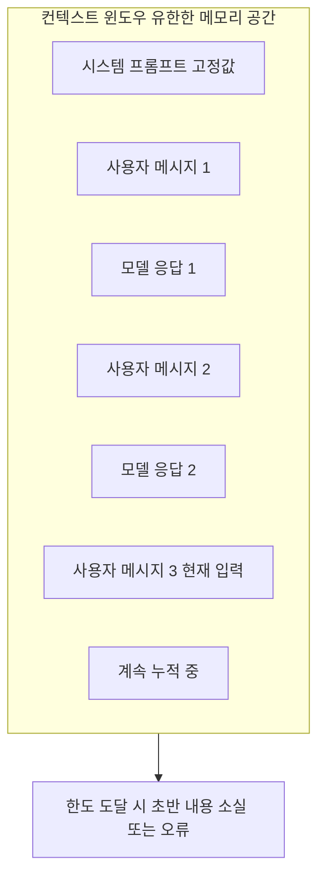
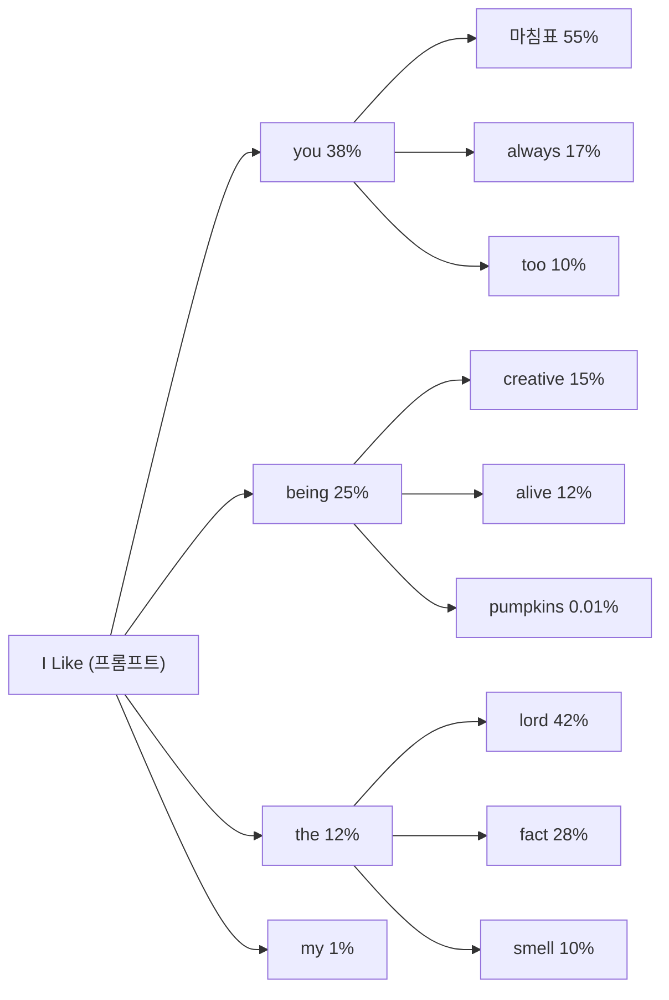
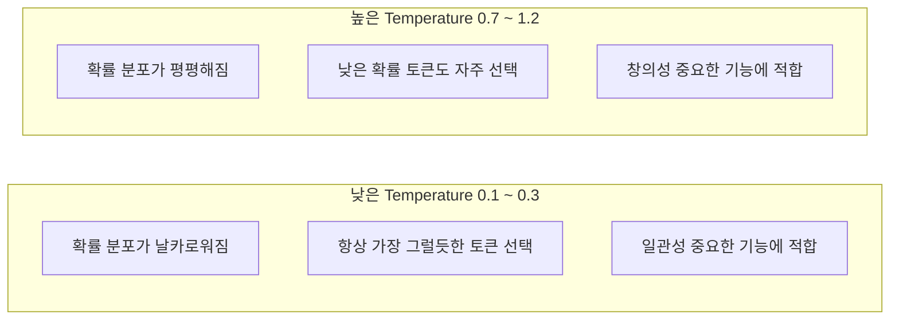
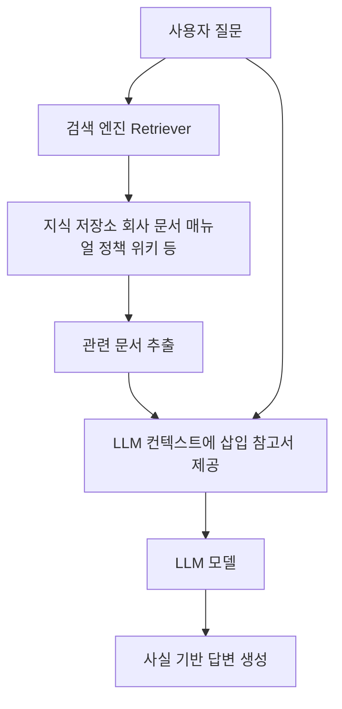
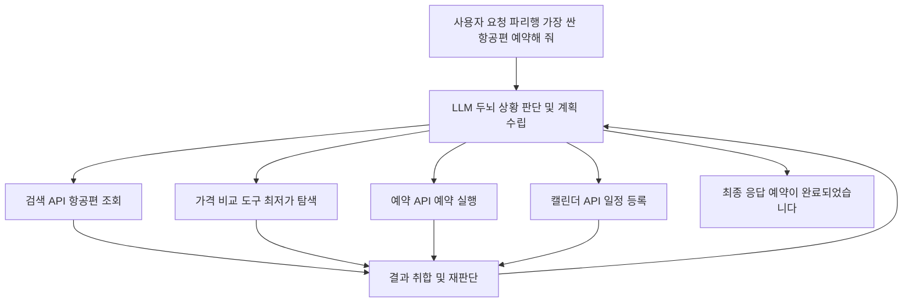
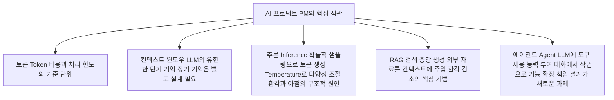
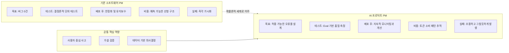

## 요즘IT <AI 프로덕트 매니지먼트 시리즈> ① + ② 통합 심층 해설

> **출처**: 요즘IT (yozm.wishket.com)  
> ① AI는 왜 자꾸 틀리는가 — https://yozm.wishket.com/magazine/detail/3775/  
> ② PM은 LLM을 어디까지 이해해야 할까? — https://yozm.wishket.com/magazine/detail/3784/  
> **원 시리즈 필자**: 출간 예정 도서 &lt;AI Product Management(가제)&gt; 저자  
> **해설 작성일**: 2026-06-05

---

## 목차

1. [시리즈 소개 및 배경](#1-시리즈-소개-및-배경)
2. [에어캐나다 챗봇 사건: 모든 것의 시작](#2-에어캐나다-챗봇-사건)
3. [결정론적 시스템 vs 확률론적 시스템](#3-결정론적-시스템-vs-확률론적-시스템)
4. [확률론이 만들어내는 세 가지 새로운 문제](#4-확률론이-만들어내는-세-가지-새로운-문제)
5. [AI 프로덕트 PM의 세 가지 대응 원칙](#5-ai-프로덕트-pm의-세-가지-대응-원칙)
6. [클로드 섀넌의 실험: LLM의 사상적 기원](#6-클로드-섀넌의-실험)
7. [핵심 지식 1 — 토큰: LLM이 글자를 보는 방식](#7-핵심-지식-1--토큰)
8. [핵심 지식 2 — 컨텍스트 윈도우: LLM의 단기 기억](#8-핵심-지식-2--컨텍스트-윈도우)
9. [핵심 지식 3 — 추론: 왜 답이 매번 다른가](#9-핵심-지식-3--추론)
10. [핵심 지식 4 — RAG: LLM에 참고서를 들려주는 법](#10-핵심-지식-4--rag)
11. [핵심 지식 5 — 에이전트: LLM에게 손과 발을 주는 법](#11-핵심-지식-5--에이전트)
12. [종합 정리: PM이 가져야 할 최소한의 직관](#12-종합-정리)

---

## 1. 시리즈 소개 및 배경

이 시리즈는 프로덕트 매니저(PM)의 관점에서 AI 프로덕트가 기존 소프트웨어 프로덕트와 무엇이 다른지를 체계적으로 설명한다. "AI가 무엇인가"를 설명하는 입문서가 아니라, "AI 프로덕트를 만드는 사람이 어떻게 사고해야 하는가"를 다루는 실무 가이드다.

제목은 PM을 향하고 있지만, 실제 독자층은 훨씬 넓다. AI 프로덕트를 기획하는 기획자, AI 기능을 구현하는 개발자, AI 서비스를 경영 관점에서 판단해야 하는 임원까지, AI 프로덕트의 특성을 정확히 이해하고자 하는 사람이라면 모두 참고할 만한 내용을 담고 있다.

시리즈는 크게 두 편으로 구성된다.

- **①편 "AI는 왜 자꾸 틀리는가"**: AI 프로덕트가 기존 소프트웨어와 본질적으로 다른 시스템임을 에어캐나다 챗봇 사건을 통해 설명하고, 그 차이가 PM의 실무에 어떤 영향을 미치는지를 다룬다.
- **②편 "PM은 LLM을 어디까지 이해해야 할까?"**: LLM의 작동 원리를 PM이 반드시 알아야 할 다섯 가지 핵심 개념(토큰, 컨텍스트, 추론, RAG, 에이전트)으로 나누어 설명한다.

필자는 출간 예정인 도서 &lt;AI Product Management(가제)&gt;의 내용 일부를 요즘IT 독자에 맞게 재가공했다고 밝히고 있다.

---

## 2. 에어캐나다 챗봇 사건

### 2.1 사건의 경위

2022년 11월, 캐나다 밴쿠버에 거주하던 제이크 모팻(Jake Moffatt)은 갑작스러운 할머니의 부고를 접했다. 급히 토론토로 이동해야 했던 그는 에어캐나다 웹사이트에 접속해 챗봇에게 물었다.

> "가족의 사별로 인한 항공권 할인이 있나요?"

챗봇은 친절하고 자신만만하게 답했다. 핵심 내용은 이러했다: "즉시 여행이 필요하다면 정상 요금으로 항공권을 먼저 구매한 뒤, 발권일로부터 90일 이내에 사별 할인(bereavement fare)을 소급 신청할 수 있습니다."

할머니의 장례식까지 시간이 촉박했고, 챗봇의 안내는 명확해 보였다. 모팻은 정가로 토론토 왕복 항공권을 구매했고, 귀국 후 챗봇이 알려준 절차대로 환불 신청서를 제출했다.

그러나 에어캐나다의 실제 정책은 달랐다. 사별 할인은 여행 전에 신청해야 하며, 이미 탑승을 마친 항공권에는 소급 적용이 불가하다는 것이 공식 입장이었다. 모팻이 챗봇과의 대화 기록을 증거로 제출하며 항의했지만, 에어캐나다 담당자는 다음과 같이 답했다: "챗봇이 오해를 불러일으키는 표현을 쓴 것은 인정하나, 공식 사별 여행 안내 페이지에 정확한 정책이 명시되어 있으므로 해당 규정이 우선한다." 사실상 "챗봇 오류는 인정하지만, 환불은 안 된다"는 입장이었다.

결국 소송으로 이어졌고, 재판소는 다음과 같은 판결을 내렸다.

> "챗봇이 회사 웹사이트의 일부인 이상, 그 내용이 정적(static) 페이지든 챗봇이든 회사는 그 내용에 책임을 져야 한다."

에어캐나다는 환불금 812달러를 지급했고, 얼마 지나지 않아 해당 챗봇은 조용히 서비스에서 사라졌다.

*(참고 기사: CBC, "Air Canada found liable for chatbot's bad advice on plane tickets", 2024)*

### 2.2 이 사건이 진짜로 가르쳐주는 것

이 사건을 단순히 "AI가 실수했다"는 일화로 읽으면 본질을 놓친다. 에어캐나다 챗봇은 의도적으로 거짓말을 한 것이 아니었다. 누군가가 잘못 학습시킨 것도 아니었다. 챗봇은 그저 주어진 문맥에서 "가장 그럴듯한 답변"을 생성했을 뿐이다. 그 답변이 회사의 실제 정책과 달랐을 뿐이고, 그 한 줄의 차이가 회사를 법정에 세웠다.

이것이 바로 AI 프로덕트와 기존 소프트웨어의 결정적인 차이다. 기존 소프트웨어는 코드에 적힌 대로만 동작한다. 반면 LLM은 "가장 그럴듯한 답"을 스스로 생성하며, 그 답이 사실인지를 스스로 검증하지 않는다. 이 구조적 특성을 이해하지 못한 채 AI 프로덕트를 만들기 시작하면, 어느 조직이든 비슷한 상황을 마주하게 된다.

---

## 3. 결정론적 시스템 vs 확률론적 시스템

AI 프로덕트를 이해하는 출발점은 두 종류의 시스템을 정확히 구분하는 데 있다.

### 3.1 결정론적 시스템(Deterministic System)

지난 수십 년간 우리가 만들고 사용해온 거의 모든 소프트웨어는 결정론적이다. 은행 앱에서 10만 원을 이체하면 정확히 10만 원이 빠져나간다. 9만 9천 원도, 10만 1천 원도 아니다. 같은 입력이 들어오면 항상 같은 출력이 나온다는 원칙이 이 시스템의 근간이다.

만약 이 원칙이 깨진다면, 그것은 반드시 수정해야 할 버그다. 결정론적 시스템의 규칙은 사람이 명시적으로 코드로 작성한다. 오류가 발생하면 원인이 명확하고 재현 가능하며, 코드를 수정하면 해결된다. 배포 이후에도 동일한 성능을 유지하며, 코드 추적을 통해 완전한 투명성을 확보할 수 있다. 로그인 인증, 계산기, 전통적인 체스 AI 등이 대표적인 예다.

### 3.2 확률론적 시스템(Probabilistic System)

LLM은 확률론적이다. 같은 질문을 100번 던지면 100번 다른 답이 나온다. 문장의 길이가 달라지고, 표현이 달라지고, 때로는 사실관계까지 미묘하게 달라진다. 그러나 이것은 버그가 아니다. 원래 그렇게 설계된 것이다.

LLM의 규칙은 사람이 직접 작성하지 않는다. 방대한 데이터에서 패턴을 스스로 학습한다. 오류가 발생하면 원인이 불명확하고 재현이 어려우며, 데이터나 모델 자체를 수정해야 해결된다. 시간이 지남에 따라 성능이 변할 수 있고(드리프트), 내부 동작을 해석하기 어려운 경우가 많다. 스팸 필터, 추천 시스템, LLM, 이미지 인식이 이 범주에 속한다.

### 3.3 두 시스템의 비교 다이어그램

### 3.4 핵심 개념 정리

| 비교 항목 | 결정론적 시스템 | 확률론적 시스템 |
|----------|-------------|--------------|
| 규칙 정의 방식 | 사람이 명시적으로 코드로 작성 | 데이터에서 패턴을 스스로 학습 |
| 같은 입력 → 출력 | 항상 동일한 결과 | 매번 다를 수 있는 결과 |
| 오류 발생 시 | 원인 명확, 재현 가능, 수정 후 해결 | 원인 불명확, 재현 어려움, 데이터/모델 수정 필요 |
| 성능 변화 | 배포 이후 동일한 성능 유지 | 시간이 지나면서 성능 저하 가능 (드리프트) |
| 해석 가능성 | 코드 추적으로 완전한 투명성 확보 | 내부 동작 해석이 어려운 경우 많음 |
| 대표 사례 | 로그인 인증, 계산기, 전통 체스 AI | 스팸 필터, 추천 시스템, LLM, 이미지 인식 |

**LLM이 동작하는 공간은 답을 "계산"하는 시스템이 아니라 "생성"하는 시스템이다. 더 정확히 말하면, 다음에 올 단어를 확률적으로 예측하는 시스템이다.** 이 차이가 AI 프로덕트를 만들 때 알아야 할 모든 것의 출발점이다.

---

## 4. 확률론이 만들어내는 세 가지 새로운 문제

확률론적 시스템의 특성은 단순한 기술적 디테일이 아니다. 프로덕트의 기획, 측정, 운영 방식이 통째로 달라지는 근본적인 변화를 초래한다. 세 가지 측면에서 살펴보자.

### 4.1 문제 1: 테스트가 깨진다

결정론적 소프트웨어의 테스트는 단순하고 명쾌하다. "입력 A를 넣으면 출력 B가 나와야 한다." 기댓값과 실제 출력이 일치하는지 자동화 테스트로 확인하면 된다. 결제 금액이 맞는지, 로그인이 정상적으로 동작하는지, 페이지가 제대로 렌더링되는지는 모두 이 원칙으로 검증할 수 있다.

AI 프로덕트는 처음부터 이 방식이 성립하지 않는다. 답이 매번 다르기 때문이다. "이 질문에 반드시 이 답이 나와야 한다"는 식의 테스트 케이스를 작성하는 순간, 그 테스트는 무의미해진다.

그래서 AI 프로덕트의 품질 검증은 "정답 맞히기"가 아니라 **"허용 범위 안에 있는가"** 를 확인하는 방식으로 전환된다. 사실관계에서 벗어나지 않는지, 어조는 적절한지, 응답 길이는 적당한지, 유해한 내용이 포함되지 않는지를 여러 각도에서 평가해야 한다.

이 작업을 업계에서는 **Eval(이밸, Evaluation의 줄임말)** 이라고 부른다. AI 프로덕트의 등장과 함께 새롭게 생겨난 전문 영역이며, 조직에 따라 "Eval 엔지니어"라는 전담 포지션을 별도로 두기 시작한 곳도 생겨나고 있다.

### 4.2 문제 2: 실패가 조용히, 그럴듯하게 일어난다

기존 소프트웨어의 실패는 대체로 눈에 잘 띈다. 페이지가 열리지 않고, 에러 메시지가 화면에 나타나며, 결제가 중단된다. 사용자도 알고, 운영자도 알며, 모니터링 시스템이 알람을 보낸다.

AI 프로덕트의 실패는 성격이 전혀 다르다. 에어캐나다 챗봇은 "오류"라는 경고 문구를 단 한 번도 화면에 띄우지 않았다. 대신 자신감 있는 어조로 잘못된 답을 출력했고, 사용자는 그 답을 완전히 신뢰하고 행동에 옮겼다. 문제는 한참 지난 뒤에야 드러났다.

이 패턴을 **환각(Hallucination)** 이라고 부른다. 코드는 정상으로 동작하고, 시스템은 아무 이상이 없으며, 응답 속도도 빠른데, 내용이 사실과 다르다. 그리고 "틀렸다"는 사실은 누군가가 외부에서 발견해 주기 전까지는 어디에도 자동으로 기록되지 않는다. 이것이 AI 프로덕트가 가진 가장 까다로운 실패 모드다.

### 4.3 문제 3: 비용이 예측되지 않는다

기존 SaaS의 인프라 비용은 어느 정도 예측 가능하다. 동시 접속자 수와 서버 비용 간의 관계가 비교적 선형적이어서, 한 번 계산해 두면 크게 달라지지 않는다.

AI 프로덕트는 다르다. 사용자가 한 번 질문할 때마다 처리된 토큰의 수에 비례해서 과금이 발생한다. 한 줄짜리 질문에 한 줄짜리 답을 받는 사용자와, PDF 파일 전체를 붙여 넣고 "이거 요약해 줘"라고 하는 사용자 간의 비용 차이는 100배 이상 날 수 있다.

더 심각한 문제는 이 비용이 청구서를 받기 전까지 잘 보이지 않는다는 점이다. 실제로 AI 기능을 출시한 회사들이 가장 자주 겪는 "숨겨진 사고"가 바로 이 비용 폭증이다. 특정 사용자가 시스템을 예상치 못한 방식으로 활용하기 시작하면, 그 한 명이 한 달 만에 수천 달러어치의 토큰을 소비하는 일이 실제로 발생한다. 전체 사용자 수는 그대로인데 비용 그래프만 수직으로 치솟는 이 상황은, 기존 SaaS PM이 거의 경험해 보지 못한 종류의 문제다.

---

## 5. AI 프로덕트 PM의 세 가지 대응 원칙

위에서 살펴본 세 가지 문제에 대응하기 위해, PM은 AI 프로덕트를 기획하고 운영하는 방식 자체를 바꿔야 한다. 세 가지 핵심 원칙을 제시한다.

### 5.1 원칙 1: "정확도 100%"를 KPI로 쓰지 않는다

기존 프로덕트의 이상적인 상태는 "버그 0건"이다. AI 프로덕트에서 이에 해당하는 목표를 설정한다면 "정확도 100%"가 될 것이다. 그러나 이 목표는 달성이 구조적으로 불가능하다. 어떤 LLM도 환각을 100% 제거하지 못한다. 이것은 특정 회사의 모델이 나빠서가 아니라, 확률적 예측에 기반한 모델 구조 자체의 한계다.

"정확도 100%"를 KPI로 설정하면 팀은 달성 불가능한 목표를 향해 끊임없이 자원을 소모하게 된다. 대신 올바른 질문은 이것이다.

> "어느 정도의 오류는 수용하되, 그 오류가 사용자에게 큰 피해를 주지 않도록 어떻게 시스템을 설계할 것인가?"

적용 기준은 도메인에 따라 달라진다. 의료나 금융처럼 오류 비용이 큰 도메인에서는 더 엄격한 기준이 필요하다. 반면 콘텐츠 추천이나 문서 요약처럼 "틀려도 회복 가능한" 도메인에서는 다소 너그러운 기준을 적용할 수 있다. **AI 프로덕트의 품질은 맞다/틀리다의 이분법이 아니라, 얼마나 자주, 얼마나 크게 틀리는지의 분포로 봐야 한다.**

### 5.2 원칙 2: 사용자가 "틀릴 수 있다"는 것을 알 수 있게 한다

에어캐나다 챗봇의 가장 큰 문제는 답이 틀렸다는 사실 자체가 아니었다. 그 답이 틀릴 수도 있다는 신호가 어디에도 없었다는 것이 문제였다. 챗봇이 "이 답변은 정확하지 않을 수 있으니, 정확한 정책은 아래 링크에서 확인하세요"라는 문구 한 줄만 함께 보여주었더라도 결과는 완전히 달랐을 것이다.

성숙한 AI 프로덕트는 답을 던지고 끝내지 않는다. 다음 세 가지를 함께 제공한다.

- **출처(Sources)**: 이 답은 어디에서 가져온 정보인가
- **확신 정도(Confidence)**: 이 답을 얼마나 신뢰할 수 있는가
- **에스컬레이션 경로(Escalation)**: 더 정확한 정보가 필요하면 어디로 이동해야 하는가

ChatGPT나 Claude가 화면 하단에 "AI is AI and can make mistakes. Please double-check responses."라는 경고를 달아두는 것도 이러한 맥락이다. Google의 Gemini도 동일한 방식으로 경고를 제공한다. 업계에서는 이를 **신뢰 설계(Trust Design)** 라고 부르며, AI 프로덕트 UX의 핵심 영역으로 자리 잡고 있다.

### 5.3 원칙 3: 출시가 끝이 아니라 시작이다

기존 소프트웨어는 배포 후 코드를 수정하지 않으면 동작이 변하지 않는다. AI 프로덕트는 다르다. 모델 제공사가 모델 자체를 업데이트하기도 하고, 사용자가 시간이 지남에 따라 던지는 질문의 패턴이 변하기도 한다. 출시 6개월 전에 잘 동작하던 챗봇이 이제 와서 이상한 답을 내놓기 시작할 수 있다.

출시 직후에는 사용자들이 예상 범위 안에서 "이 제품에 대해 알려주세요" 같은 표준적인 질문을 하더라도, 시간이 지나면 "경쟁사 제품과 비교해 줘", "회사가 망하면 환불받을 수 있어?" 같이 사전에 예상하지 못한 질문을 하기 시작할 수 있다. 모델이 이런 새로운 유형의 질문에 어떤 답을 내놓을지는 출시 전에 알기 어렵다.

따라서 **AI 프로덕트의 PM은 출시 이후에 오히려 더 바빠진다**. 답변 품질이 어떻게 변하고 있는지를 지속적으로 모니터링하고, 비용이 어디서 새고 있는지 추적하며, 사용자들이 시스템을 어떤 방식으로 활용하기 시작했는지를 꾸준히 관찰해야 한다. 출시 후의 운영이 기존 소프트웨어보다 훨씬 더 살아 있는 작업이 된다.

---

## 6. 클로드 섀넌의 실험

LLM의 구체적인 작동 원리를 이해하기 위해, 먼저 그 사상적 기원으로 거슬러 올라갈 필요가 있다.

### 6.1 1950년의 게임

1950년 어느 저녁, 벨연구소의 수학자 클로드 섀넌(Claude Shannon)이 부인 메리에게 게임을 하나 제안했다. 책을 아무 페이지나 펼쳐놓고, 클로드가 한 글자를 손으로 가린다. 메리는 그 가려진 글자가 무엇인지 맞혀야 한다. 맞히면 다음 글자로 넘어가고, 틀리면 정답을 알려준 뒤 진행한다. 그렇게 한 문장을 끝까지 따라가는 게임이었다.

결과는 놀라웠다. 메리는 보통 가려진 글자 4개 중 3개 가까이를 정확히 맞혔다. 'T' 다음에는 'H'가 올 가능성이 높고, 'TH' 다음에는 'E'가 올 가능성이 높다는 사실을 무의식적으로 알고 있었기 때문이다.

섀넌은 이 실험에서 출발해 "언어에는 예측 가능한 통계적 구조가 있다"는 사실을 수학적으로 증명했고, 이 발견이 훗날 LLM의 이론적 토대가 되었다. 해당 논문은 "Prediction and Entropy of Printed English"(1950)라는 제목으로 발표되었다. 한편, 앤트로픽의 AI 어시스턴트 '클로드(Claude)'는 바로 이 수학자 클로드 섀넌의 이름에서 따온 것으로 알려져 있다.

### 6.2 LLM의 본질

75년이 지난 지금, 우리가 사용하는 LLM은 매일 이 게임을 한다. 규모만 다를 뿐이다. "다음 한 글자"가 아니라 "다음 한 단어(토큰)"를 예측하고, 메리 한 사람의 직관이 아니라 인터넷 전체의 텍스트로 학습한 거대한 통계 모델이 그 예측을 수행한다.

**PM이 알아야 할 LLM의 본질을 한 줄로 요약하면 이것이다: LLM이 하는 일은 "다음에 올 단어를 확률적으로 예측하는 것"이다.** ChatGPT가 논문을 쓰고, Claude가 코드를 짜고, Gemini가 시를 만드는 것은 모두 이 원리의 확장판이다.

---

## 7. 핵심 지식 1 — 토큰

### 7.1 토큰이란 무엇인가

우리는 글을 단어 단위로 읽는다. "나는 오늘 점심을 먹었다"는 다섯 개의 단어다. 그러나 LLM은 다르게 읽는다. **토큰(Token)** 이라는 단위로 텍스트를 잘라서 처리한다.

토큰은 단어보다 작을 수도 있고, 클 수도 있는 모델이 학습 과정에서 자체적으로 만들어낸 기본 조각이다. 언어와 모델에 따라 토큰의 단위가 달라진다.

- 영어 예시: "unhappiness" → "un" + "happi" + "ness" (3개 토큰)
- 한국어 예시: "먹었습니다" → "먹" + "었" + "습니다" (약 3개 토큰)

### 7.2 한국어와 영어의 토큰 효율 차이

한국어는 같은 의미를 표현할 때 영어보다 약 1.5~2배 많은 토큰을 소비하는 경우가 많다. 영어로 "Thank you very much"가 4~5토큰이라면, 한국어 "정말 감사합니다"는 7~8토큰이 필요할 수 있다. 이는 영어가 LLM 학습 데이터의 대부분을 차지하기 때문에 영어에 유리한 방식으로 토큰화 알고리즘이 최적화되어 있기 때문이다.

### 7.3 PM에게 토큰 개념이 중요한 이유

LLM의 비용은 처리된 토큰의 수에 비례해서 청구된다. 이 사실에서 PM에게 직접적인 영향이 발생한다.

첫째, 같은 길이의 문장을 처리하더라도 한국어 서비스는 영어 서비스보다 더 많은 비용이 발생한다. 글로벌 사례에서 "이 기능의 비용은 사용자당 월 N달러"라는 수치를 그대로 한국어 서비스에 적용하면 예산이 부족해지는 상황이 발생한다.

둘째, 모델마다 "한 번에 처리할 수 있는 최대 토큰 수"가 정해져 있다(컨텍스트 윈도우, 다음 절에서 설명). 한국어로 동일한 분량의 문서를 처리하면 이 한도에 더 빨리 도달한다. 이를 모르고 시스템을 설계하면, 특정 길이 이상의 문서를 처리할 때 갑자기 응답이 잘려 나오거나 오류가 발생하는 상황을 만나게 된다.

---

## 8. 핵심 지식 2 — 컨텍스트 윈도우

### 8.1 LLM의 단기 기억

ChatGPT나 Claude와 길게 대화하다 보면 어느 순간 앞에서 한 말을 모델이 잊어버리는 것을 경험하게 된다. 처음에 "제 이름은 홍길동입니다"라고 말해놓고 수십 번 메시지를 주고받은 뒤 "제 이름이 뭐였죠?"라고 물으면 엉뚱한 답이 돌아올 수 있다.

이것은 버그가 아니라 구조적 한계다. LLM은 **컨텍스트 윈도우(Context Window)** 라는 한정된 "단기 기억 공간"만 가지고 있다. 모델마다 다르지만 보통 수만에서 수십만 토큰 정도 되는 이 공간 안에 들어 있는 정보로만 답을 만들어내고, 그 범위를 벗어난 내용은 "존재하지 않는 것처럼" 처리된다.

컨텍스트 윈도우에는 다음의 모든 내용이 누적된다.

- **시스템 프롬프트**: 서비스 운영자가 모델에게 부여하는 역할과 지시 사항 (고정값)
- **사용자 메시지**: 사용자가 입력한 내용
- **모델 응답**: 모델이 생성한 답변
- **확장된 사고(Extended Thinking)**: 일부 모델에서 사용하는 내부 추론 과정

### 8.2 컨텍스트 누적의 구조

대화가 길어질수록 컨텍스트 윈도우가 채워져 간다. 그리고 한도에 다다르면 초반의 메시지들이 밀려나 "잘려" 버린다. "턴 1"에서 가위표(✂) 표시가 있는 지점에 도달하면, 그 이전 내용은 모델이 더 이상 참조하지 못한다.

### 8.3 장기 기억의 부재

더 중요한 사실은, LLM에는 우리가 일반적으로 생각하는 "장기 기억"이 없다는 점이다. 어제 Gemini와 나눈 대화를 오늘도 기억하는 것처럼 보여도, 실제로는 대부분의 경우 그 이전 대화 내용을 매번 새로 컨텍스트에 끼워 넣는 방식으로 구현되어 있다. 모델 자체는 사용자를 알지 못한다. 매번 "이 대화의 앞부분은 이러했다"는 메모를 새로 받아서 읽고 답할 뿐이다.

### 8.4 PM에게 의미하는 것

"사용자를 기억하는 듯한 경험"을 제공하는 AI 서비스를 만들려면, 이를 위한 별도의 시스템을 설계해야 한다. 사용자 정보와 과거 대화 내용을 데이터베이스에 저장하고, 모델에게 매번 "이 사용자는 이런 사람이고, 지난번에 이런 대화를 나눴습니다"라고 주입해 주는 메커니즘을 구축해야 한다. 모델이 스스로 기억해 줄 것이라는 가정 위에 기능을 설계하면, 사용자가 반드시 혼란을 겪게 된다.

---

## 9. 핵심 지식 3 — 추론

추론(Inference)은 학습이 완료된 모델이 실제로 답을 "만들어내는" 과정을 가리킨다. 이 과정을 이해하면 LLM의 확률적 동작 방식이 명확해지고, 환각과 아첨이 왜 발생하는지까지 이해할 수 있게 된다.

### 9.1 답은 "계산"되는 것이 아니라 "뽑힌다"

사용자가 "파리는 어느 나라의 수도인가요?"라고 물으면, 모델은 어휘집에 있는 모든 토큰에 대해 "다음 토큰으로 이것이 올 확률"을 계산한다. "프랑스"가 42%, "프"가 11%, "유럽"이 8%, 나머지 토큰들이 나머지 확률을 나눠 갖는 식이다.

그런 다음 이 확률 분포를 참조해서 토큰을 하나 "뽑는다". 뽑힌 토큰을 첫 번째 출력으로 삼고, 그 다음 토큰의 확률 분포를 다시 계산해서 또 뽑는다. 문장이 끝날 때까지 이 과정을 반복한다.

### 9.2 토큰 확률 트리

아래 다이어그램은 프롬프트 "I Like" 다음에 올 수 있는 단어들의 확률 분포와, 그 이후 다시 펼쳐지는 두 번째 단어의 확률 분포를 보여준다.

확률이 가장 높은 토큰만 무조건 고르는 방식(그리디 디코딩, Greedy Decoding)을 사용하면 결과가 단조롭고 반복적이다. 그래서 실제 LLM은 확률 분포에서 무작위로 샘플링한다. 확률이 높은 토큰이 선택될 가능성이 높지만, 확률이 낮은 토큰도 가끔 선택된다. 이 작은 무작위성이 "같은 질문에도 매번 조금씩 다른 답이 나오는" 이유다.

### 9.3 Temperature: PM이 직접 조절할 수 있는 손잡이

그 무작위성의 강도를 조절하는 파라미터가 **Temperature(온도)** 다. 보통 0에서 2 사이의 값을 가진다.

| 상황 | 적합한 Temperature | 이유 |
|------|-----------------|------|
| 고객 지원 챗봇 (사실 기반) | 0.1 ~ 0.3 | 같은 질문에 다른 답이 나오면 신뢰가 무너짐 |
| 법률·의료 정보 제공 | 0.1 이하 | 오류의 파급 효과가 크므로 최대한 일관성 필요 |
| 마케팅 문구 생성 | 0.7 ~ 1.0 | 다양하고 창의적인 결과가 필요 |
| 브레인스토밍 도우미 | 1.0 ~ 1.2 | 예상 밖의 아이디어 발굴이 목적 |

"기본값으로 두면 알아서 잘 되겠지"라는 생각은 PM이 빠지기 쉬운 흔한 함정이다. 태스크의 성격에 맞는 Temperature를 의식적으로 설계해야 좋은 사용자 경험이 나온다.

### 9.4 환각(Hallucination): 자신만만하게 틀리는 이유

LLM은 답을 생성할 때 "이것이 사실인가?"를 검증하지 않는다. "이 문맥에서 이 토큰이 얼마나 그럴듯한가?"만 계산한다. 항공사 챗봇이 "가족 장례로 인한 할인이 있나요?"라는 질문을 받으면, "네, ~한 절차로 신청하실 수 있습니다"라는 형태의 답변 패턴이 이 문맥에서 가장 그럴듯하다고 판단하고 그에 맞는 답을 생성한다. 그 답이 실제 회사 정책과 일치하는지는 모델의 관심 밖이다.

더 까다로운 것은, 모델이 환각을 일으킬 때도 어조에 망설임이 없다는 점이다. 사람은 확신이 없을 때 "잘 모르겠는데요"라고 말하거나 목소리가 흔들린다. 반면 LLM은 불확실한 상황에서도 가장 그럴듯한 토큰을 자신 있게 뽑아 유창하게 이어 붙인다.

이것이 환각을 위험하게 만드는 결정적인 특성이다. 틀린 내용을 자신 있는 어조로 말한다면, 사용자가 그것이 틀렸다는 것을 알아채기가 매우 어렵다. 에어캐나다 챗봇 사건이 가능했던 근본 원인이 여기에 있다.

### 9.5 아첨(Sycophancy): 사용자에게 맞춰 비틀어지는 답

최근 LLM에서 새롭게 주목받는 현상이 있다. **아첨(Sycophancy)** 이라고 부르는데, 사용자가 어떤 답을 기대하는 것처럼 보이면 모델이 그 기대에 맞춰 답을 조정하는 경향이다.

"제 사업 아이디어 어떻게 생각하세요?"라고 물으면 대부분 칭찬 중심의 답이 돌아온다. "이거 문제 있죠?"라고 물으면 실제로 문제가 없는 경우에도 억지로 문제를 찾아 제시한다. 이것은 모델이 "착해서"가 아니다. 학습 과정(특히 RLHF: 인간 피드백 기반 강화학습)에서 사용자가 만족스러워한 답변에 더 높은 점수가 매겨졌고, 그 패턴이 모델의 확률 분포에 깊이 새겨졌기 때문이다.

PM 입장에서 이것은 심각하게 다뤄야 할 문제다. AI 어시스턴트가 의견에 항상 동의하고 칭찬만 늘어놓는다면, 사용자는 그 피드백을 점점 신뢰하지 않게 된다. 비판적 검토나 다양한 관점이 필요한 기능을 만들 때는, 모델이 반대 의견과 잠재적 약점을 명시적으로 제시하도록 프롬프트 수준에서 의도적으로 설계해야 한다.

---

## 10. 핵심 지식 4 — RAG

### 10.1 LLM의 지식 한계와 RAG의 등장

지금까지 살펴본 환각과 아첨은 모두 같은 근본 원인에서 비롯된다. 모델이 "학습할 때 본 패턴"으로만 답하기 때문이다. 그렇다면 모델이 학습할 때 보지 못한 정보, 즉 회사 내부 매뉴얼, 오늘자 뉴스, 서비스의 최신 정책과 같은 내용에 대해 정확하게 답하려면 어떻게 해야 할까?

이 문제를 해결하기 위해 등장한 접근법이 **RAG(Retrieval-Augmented Generation, 검색 증강 생성)** 다. 이름은 어렵지만 개념은 단순하다. "LLM에게 참고서를 펼쳐주고 답하게 하는 방식"이다.

### 10.2 RAG의 동작 원리

사용자가 질문하면, 시스템은 먼저 회사의 자료 저장소(매뉴얼, 위키, 정책 문서 등)에서 질문과 관련된 내용을 검색한다. 그 검색 결과를 LLM의 컨텍스트에 함께 넣어주고 "이 자료를 참고해서 답해줘"라고 요청한다. 모델은 자기 내부의 학습 패턴이 아니라, 그 자리에서 제공된 실제 문서를 근거로 답을 생성한다.

### 10.3 표준 LLM vs RAG 상세 비교

| 비교 항목 | 표준 LLM | RAG |
|----------|---------|-----|
| **지식 출처** | 학습 중 고정됨 (정적) | 외부 지식을 동적으로 검색 |
| **새로운 정보 처리** | 재학습 없이 업데이트 불가 | 실시간 또는 업데이트된 데이터 검색 가능 |
| **환각 위험** | 높음 (잘못된 사실 생성 가능) | 낮음 (사실적 출처를 검색함) |
| **답변 해석 가능성** | 출처 인용 불가 | 출처 인용 제공 가능 |
| **모델 크기 및 효율성** | 더 많은 지식 저장을 위해 대형 모델 필요 | 외부 검색으로 소형 모델도 좋은 성능 발휘 가능 |
| **도메인 적응** | 도메인 전용 데이터로 미세 조정 필요 | 검색 소스를 변경하여 쉽게 적응 |
| **비용 및 컴퓨팅** | 업데이트를 위해 값비싼 재학습 필요 | 필요할 때 지식을 검색하므로 더 효율적 |
| **예시 사용 사례** | 챗봇, 텍스트 요약, 번역 | 법률 AI 어시스턴트, 금융 연구, 기업 내부 QA |

### 10.4 PM에게 RAG가 중요한 이유

AI 기능을 기획할 때 다음의 구분이 가능해야 한다: "이건 LLM 혼자 처리할 수 있다" vs "이건 실제 자료를 함께 제공해야 한다."

- "파리의 수도는 어디인가요?" → LLM 단독으로 답 가능 (학습 데이터에 포함된 정적 사실)
- "우리 회사 환불 정책은 무엇인가요?" → RAG 필요 (회사 고유 정보, 학습 데이터에 없음)
- "오늘 주가는 얼마인가요?" → 실시간 검색 연동 필요 (학습 이후 시점의 정보)

거의 모든 기업용 AI 기능은 RAG가 필요하다. 에어캐나다 챗봇이 환각을 일으킨 것도, 회사의 실제 정책 문서가 모델의 컨텍스트에 제공되지 않았기 때문이라고 볼 수 있다. 실제 정책 문서를 RAG 방식으로 모델에게 제공했다면 그 챗봇은 정확한 답을 내놓을 수 있었을 것이다.

---

## 11. 핵심 지식 5 — 에이전트

### 11.1 LLM의 한계를 넘어서: 대화에서 작업으로

여기까지 살펴본 LLM은 결국 "질문을 받으면 답을 내놓는" 기계다. 입력이 들어오면 출력을 반환하고, 행동은 하지 않는다. 그러나 최근 1~2년 사이, AI 업계의 가장 뜨거운 화두는 "AI가 직접 일을 하게 만드는 법"이 되었다. 이를 가능케 하는 구조가 바로 **에이전트(Agent)** 다.

### 11.2 에이전트란 무엇인가

LLM이 "두뇌"라면, 에이전트는 그 두뇌에 "손과 발"을 붙여준 것이다. 사용자가 "다음 주 파리행 항공편 중 가장 싼 것을 예약해 줘"라고 하면, 단순히 정보를 알려주는 것이 아니라 실제로 검색 사이트를 열어보고, 가격을 비교하고, 예약 시스템에 정보를 입력하고, 캘린더에 일정을 등록하는 일까지 수행한다.

기술적으로는 LLM이 **도구(Tool)** 를 사용할 수 있게 만든 구조가 핵심이다. 모델이 "지금은 검색이 필요하다"고 판단하면 검색 API를 호출하고, "이메일을 보내야 한다"고 판단하면 메일 발송 함수를 실행한다. 매 단계에서 "다음에 무엇을 해야 하는가"를 판단하고 그 판단에 따라 행동한다.

### 11.3 에이전트가 가져오는 기능의 확장

에이전트의 등장으로 AI 기능의 영역이 근본적으로 확장된다.

| 기존 LLM 기반 기능 | 에이전트 기반 기능 |
|----------------|---------------|
| "이메일 초안을 써줘" | "이메일을 검토하고, 답장을 쓰고, 회의 일정을 잡아서 캘린더에 등록해 줘" |
| "이 코드의 버그를 찾아줘" | "코드베이스를 분석하고, 버그를 수정하고, 테스트를 실행해서 PR을 올려줘" |
| "오늘 뉴스를 요약해 줘" | "정해진 소스에서 뉴스를 수집하고, 분류하고, 요약해서 슬랙 채널에 올려줘" |

AI 기능의 영역이 "대화"에서 "작업"으로 이동하는 것이다.

### 11.4 에이전트 시대 PM의 새로운 과제

에이전트가 강력한 만큼, 그에 따른 책임의 범위도 커진다. LLM이 단순히 텍스트를 생성할 때는 사용자가 그 내용을 검토하고 행동을 결정한다. 그러나 에이전트는 직접 행동한다. 잘못된 판단이 실제 예약을 실행하고, 실제 이메일을 발송하고, 실제 코드를 배포할 수 있다.

에이전트 시대의 PM은 기능 설계뿐 아니라 다음 질문들을 함께 고민해야 한다.

- **취소 가능성**: AI의 행동을 사용자가 되돌릴 수 있는가?
- **확인 단계**: 돌이키기 어려운 행동을 하기 전에 사용자에게 확인을 구하는가?
- **권한 범위**: AI가 할 수 있는 행동의 범위를 어디까지 허용하는가?
- **오류 귀속**: AI가 잘못된 행동을 했을 때 책임은 누가 지는가?

에이전트 기능의 책임 설계는 기존 소프트웨어에서는 다룬 적 없는 새로운 영역이다.

---

## 12. 종합 정리

### 12.1 다섯 가지 핵심 개념 요약

지금까지 살펴본 내용을 한 줄씩 정리하면 다음과 같다.

LLM은 다음 단어를 확률적으로 예측하는 기계이고, 그 예측은 토큰 단위로 처리되며, 컨텍스트 윈도우라는 단기 기억만 가지고 있다. 부족한 지식은 RAG로 채우고, 직접 행동이 필요한 일은 에이전트 구조로 확장한다. 이것이 PM이 반드시 갖춰야 할 LLM 지식의 최소 범위다.

### 12.2 이 지식이 실무에서 만들어내는 변화

다섯 가지를 이해하면 엔지니어와의 대화가 달라진다.

| 모르는 상태 | 아는 상태 |
|----------|---------|
| "이거 LLM으로 가능합니까?" | "이 기능에는 RAG가 필요할 것 같은데, 자료 출처는 어디로 잡을까요?" |
| "왜 답이 자꾸 잘리죠?" | "컨텍스트 한도에 걸린 것 같은데, 입력 길이를 어떻게 줄일까요?" |
| "기본값으로 두면 되지 않나요?" | "이 기능은 팩트 기반이라 Temperature를 0.2로 낮춰야 할 것 같습니다" |
| "AI가 틀렸네요" | "환각이 발생한 것 같은데, 실제 정책 문서를 모델에 제공하고 있나요?" |
| "답이 매번 다르게 나오는 게 이상해요" | "확률적 샘플링 때문입니다. 일관성이 필요하면 Temperature를 낮춰야 합니다" |

### 12.3 AI 프로덕트 PM의 역할 재정의

기존 소프트웨어의 PM은 "버그를 0으로 만드는 사람"에 가까웠다. AI 프로덕트의 PM은 "확률과 함께 사는 법을 설계하는 사람"이다. 이 두 세계는 다른 규칙으로 움직인다. KPI 설정, 테스트 방법, 예상 실패 유형, 사용자 신뢰 설계가 모두 달라진다.

그러나 사용자 중심 사고, 가설 검증, 데이터 기반 의사결정이라는 PM의 핵심 역량은 그대로 유효하다. 다만 그 역량을 확률적으로 동작하는 시스템 위에서 어떻게 새롭게 적용할지를 익혀야 한다.

---

## 맺음말: 마법 상자에서 다룰 수 있는 시스템으로

LLM은 신비로운 마법 상자가 아니다. 다음 단어를 잘 예측하는, 거대하지만 제약이 분명한 기계다. 그 제약이 어디에 있는지를 아는 순간, AI 기능을 만드는 일이 "어떻게든 되겠지"의 영역에서 "이렇게 만들면 된다"의 영역으로 이동한다.

1950년 클로드 섀넌이 부인 메리와 함께 했던 단순한 글자 맞히기 게임에서, 수백억 개의 파라미터로 논문과 코드와 시를 만들어내는 현재의 LLM까지, 그 본질은 변하지 않았다. "다음에 올 것을 가장 그럴듯하게 예측하는 일." 그리고 그 예측이 아무리 정교해져도, "사실 확인"이 아닌 "패턴 매칭"이라는 구조적 한계 또한 변하지 않는다.

이 시리즈가 제시하는 다섯 개의 개념 — **토큰, 컨텍스트, 추론, RAG, 에이전트** — 만 이해해도 AI 프로덕트를 만드는 첫걸음을 내딛기에 충분하다. 그리고 이 직관이 갖춰지면, 사용자에게 줄 수 있는 경험의 범위가 보이기 시작한다.

"우리 사용자에게 진짜 가치 있는 AI 기능은 단순 대화일까, 자료를 참고하는 답변일까, 아니면 직접 일을 처리하는 에이전트일까?" 이 질문에 답할 수 있어야 좋은 AI 프로덕트가 나온다. 그리고 그 답은 기술이 아니라 이해에서 나온다.

---

## 참고 자료

- Claude E. Shannon, "Prediction and Entropy of Printed English", Bell System Technical Journal, Sep 15, 1950
- CBC News, "Air Canada found liable for chatbot's bad advice on plane tickets", 2024
- 요즘IT, "AI는 왜 자꾸 틀리는가 — AI 프로덕트 매니지먼트 시리즈 ①", https://yozm.wishket.com/magazine/detail/3775/
- 요즘IT, "PM은 LLM을 어디까지 이해해야 할까? — AI 프로덕트 매니지먼트 시리즈 ②", https://yozm.wishket.com/magazine/detail/3784/

---

*작성 일자: 2026-06-05*
