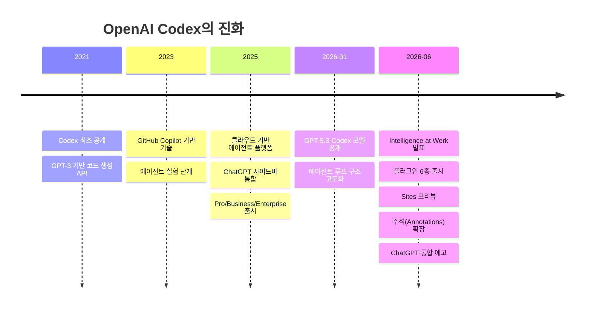
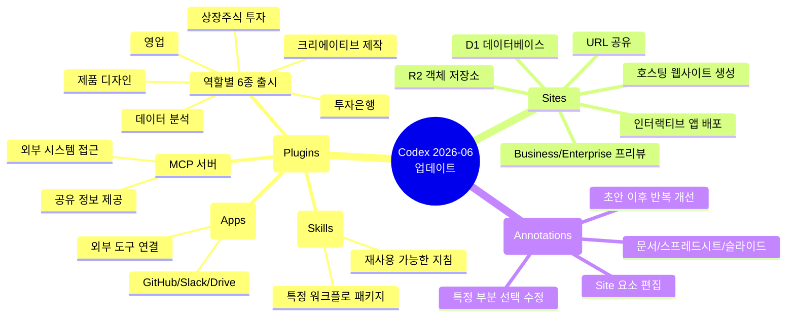
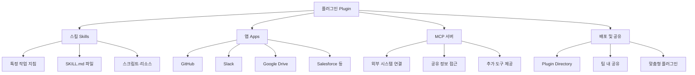
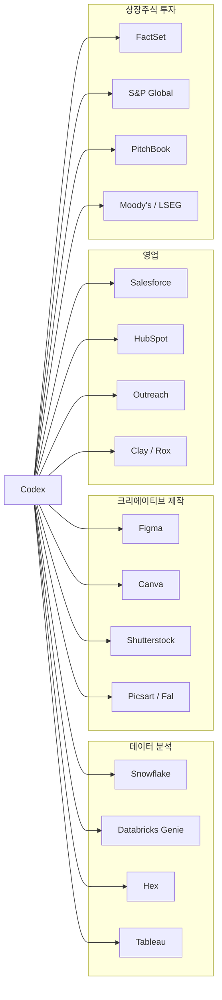
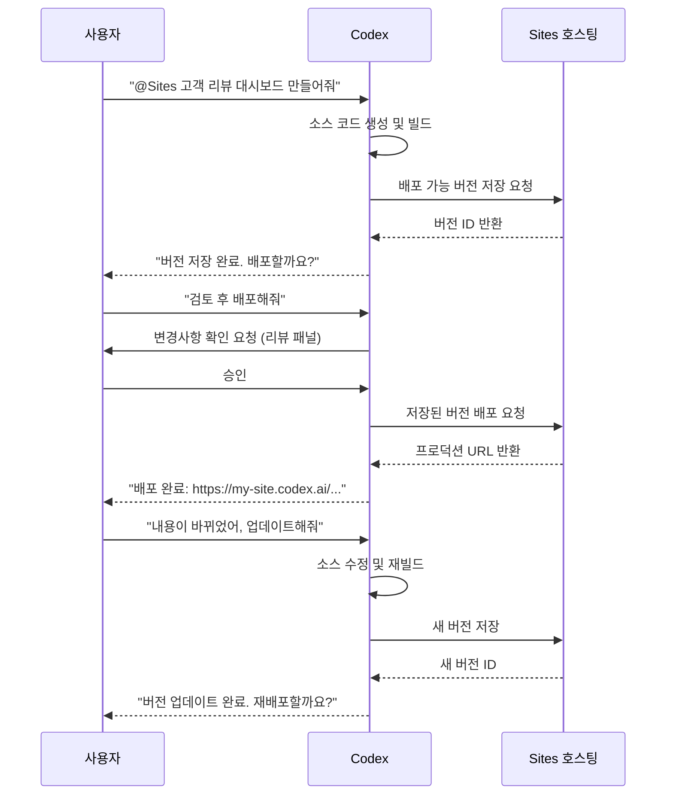
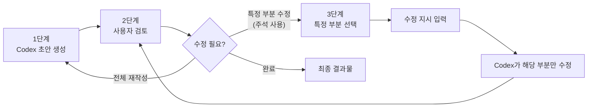
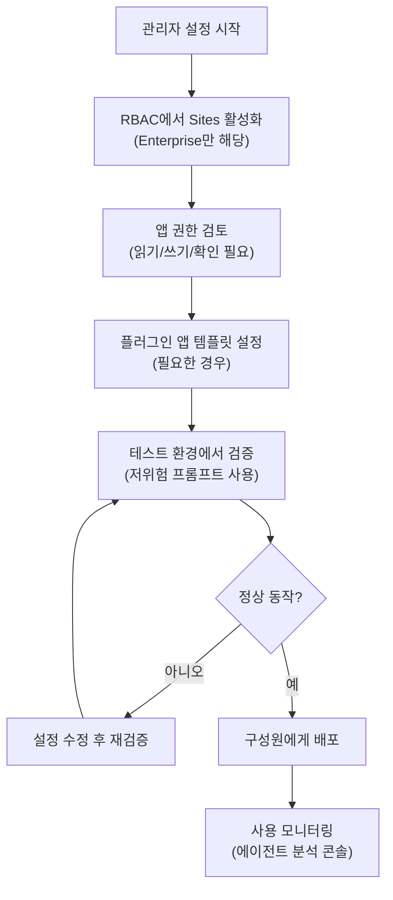
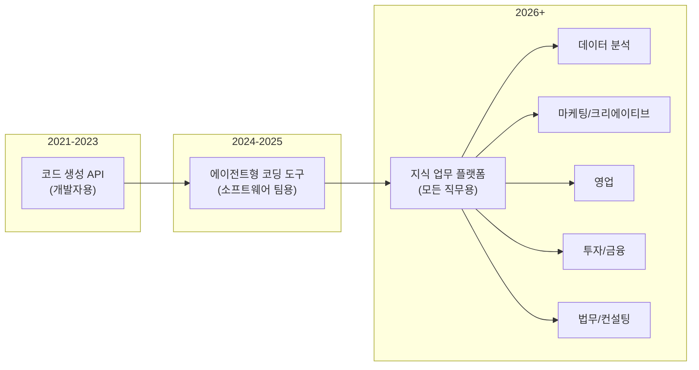

## 플러그인(Plugins), Sites, 주석(Annotations) 완전 분석

> **작성 기준일**: 2026-06-05  
> **발표 일자**: 2026년 6월 2일 (OpenAI "Intelligence at Work" 라이브스트림)  
> **출처**: OpenAI 공식 블로그, 개발자 문서, PyTorchKR, 주요 테크 미디어

---

## 목차

1. [배경: OpenAI Codex는 어떻게 여기까지 왔는가](#1-배경)
2. [Intelligence at Work 이벤트와 ChatGPT 통합 예고](#2-intelligence-at-work)
3. [세 가지 핵심 신기능 한눈에 보기](#3-세-가지-핵심-신기능)
4. [플러그인(Plugins): 팀의 도구와 워크플로를 하나로](#4-플러그인)
   - 4.1 플러그인의 세 가지 구성요소
   - 4.2 스킬(Skills): 재사용 가능한 워크플로 단위
   - 4.3 역할별 플러그인 6종 완전 분석
   - 4.4 플러그인 설치와 사용 방법
   - 4.5 권한과 데이터 공유 방식
5. [Sites: 분석과 아이디어를 인터랙티브 웹으로](#5-sites)
   - 5.1 Sites의 개념과 용도
   - 5.2 프로젝트·버전·배포의 구조
   - 5.3 지원되는 사이트 유형과 데이터 저장소
   - 5.4 접근 권한 설정
   - 5.5 파트너 에코시스템
   - 5.6 Blossom Bank 사례: 금융 예측 대시보드
6. [주석(Annotations): 결과물을 정밀하게 다듬는 방법](#6-주석)
7. [Agent Skills: 플러그인을 구성하는 기술적 토대](#7-agent-skills)
8. [실제 기업 사용 사례: OpenAI, Zapier, NVIDIA](#8-기업-사용-사례)
9. [관리자가 알아야 할 권한 설정과 도입 절차](#9-관리자-설정)
10. [향후 계획과 산업적 의미](#10-향후-전망)
11. [결론](#11-결론)

---

## 1. 배경: OpenAI Codex는 어떻게 여기까지 왔는가

OpenAI Codex는 처음에 에이전트형 코딩 도구로 세상에 등장했습니다. 개발자가 자연어로 작업을 지시하면 Codex가 코드를 작성하고, 버그를 찾아 수정하며, 풀 리퀘스트를 제안하는 방식의 "소프트웨어 엔지니어링 에이전트"였습니다. Codex의 초기 버전은 GPT 모델 계열 중 코드 특화 버전이었고, 이후 독립 에이전트 플랫폼으로 발전하면서 GitHub Copilot 같은 도구들과 차별화된 에이전틱(Agentic) 접근 방식을 앞세웠습니다.

그런데 실제로 Codex를 사용하기 시작한 사람들의 직군을 살펴보면, 처음부터 개발자만 쓰지 않았다는 사실이 드러납니다. 2026년 6월 OpenAI가 공개한 내부 수치에 따르면, 현재 매주 500만 명이 넘는 사람들이 Codex를 사용하고 있으며, 이 중 분석가, 마케터, 운영 담당자, 디자이너, 연구원, 투자자, 은행가 등 비개발자(non-developer)가 전체 사용자의 약 20%를 차지합니다. 더 주목할 만한 점은 성장 속도입니다. 비개발자 사용자는 개발자보다 **3배 이상 빠른 속도**로 늘어나고 있습니다.

이 데이터가 말해주는 것은 단순히 "개발자가 아닌 사람도 Codex를 쓴다"는 사실이 아닙니다. 코드를 짜는 작업 이상으로, 비정형적인 지식 업무—보고서 작성, 데이터 분석, 캠페인 기획, 투자 검토, 피치 자료 제작 등—에 AI 에이전트를 활용하려는 수요가 급속도로 확산되고 있다는 신호입니다. OpenAI는 이 흐름을 단순히 관찰하는 것을 넘어, Codex의 근본적인 방향을 재정의하는 결정을 내렸습니다. 2026년 6월 2일의 발표가 그 전환점입니다.



---

## 2. Intelligence at Work 이벤트와 ChatGPT 통합 예고

2026년 6월 2일, OpenAI는 "Intelligence at Work"라는 제목의 라이브스트림 발표를 통해 이번 업데이트를 공개했습니다. 행사 제목이 시사하듯, 이번 메시지의 핵심은 "인공지능이 실제로 일을 해야 한다"는 것입니다. 채팅을 넘어 실행(execution)으로, 그리고 개발자 도구를 넘어 모든 지식 근로자의 도구로 확장하겠다는 선언이었습니다.

발표에서 가장 큰 주목을 받은 부분 중 하나는 사실 이번에 공개된 세 가지 기능들보다, **Codex를 ChatGPT 앱 안에 통합하겠다는 계획**이었습니다. OpenAI는 "앞으로 몇 주 안에 Codex를 모든 곳의 ChatGPT 앱에 통합할 것"이라고 밝혔습니다. 현재 Codex는 별도의 독립 앱으로 존재하며, ChatGPT 내부에서는 Codex 앱 다운로드를 유도할 뿐 직접 사용이 불가능한 상태입니다.

이 통합의 전략적 의미는 분명합니다. 많은 기업 사용자들이 이미 ChatGPT를 쓰고 있지만, Codex는 알지 못하거나 언제 사용해야 하는지 파악하지 못하는 경우가 많습니다. ChatGPT와 Codex를 하나의 앱으로 합치면, 사용자가 도구를 선택하는 인지적 부담 없이 자연스럽게 에이전틱 기능을 사용할 수 있게 됩니다. 대화하고 생각하는 것(ChatGPT)과 실제로 일을 처리하는 것(Codex)이 단일 앱 안에서 이루어지는 그림입니다.

한편, OpenAI는 이번 업데이트에서 Codex를 구동하는 기반 모델을 **GPT-5.3-Codex**라고 명시했습니다. 이 모델은 OpenAI가 현재까지 개발한 에이전틱 코딩 모델 중 가장 뛰어난 성능을 가지며, 프론티어급 코딩 능력과 더 넓은 추론 능력을 결합한 것으로 설명되고 있습니다.

---

## 3. 세 가지 핵심 신기능 한눈에 보기

이번 발표의 실질적인 내용은 세 가지 기능으로 구성됩니다. 각각은 독립적인 기능이지만, 함께 작동할 때 더 큰 가치를 발휘하도록 설계되어 있습니다.



| 기능 | 핵심 역할 | 대상 사용자 | 제공 범위 |
|------|-----------|------------|-----------|
| **플러그인 (Plugins)** | 팀이 사용하는 도구·워크플로를 Codex와 연결 | 모든 직군 | 지원 지역 순차 제공 |
| **Sites** | 분석 결과·아이디어를 웹 앱으로 변환·공유 | Business/Enterprise | 프리뷰 (순차 제공) |
| **주석 (Annotations)** | 결과물의 특정 부분만 선택해 정밀 수정 | 모든 사용자 | 전반적 확장 적용 |

---

## 4. 플러그인(Plugins): 팀의 도구와 워크플로를 하나로

### 4.1 플러그인의 세 가지 구성요소

플러그인이란 Codex가 특정 팀의 업무 방식에 맞춰 작동하게 해주는 재사용 가능한 묶음입니다. 비유하자면, 플러그인은 Codex에게 특정 직무를 수행하는 방법을 알려주는 "직무 키트"와 같습니다. OpenAI 개발자 문서에 따르면 하나의 플러그인은 다음 세 가지 구성요소를 담을 수 있습니다.

**첫째, 스킬(Skills)** 은 특정 종류의 작업을 위한 재사용 가능한 지침입니다. Codex는 어떤 작업이 들어왔을 때 설치된 스킬들의 목록을 살펴보고, 해당 작업에 맞는 스킬을 선택해 그 안에 담긴 지침을 따릅니다. 예를 들어 "이 분기 매출 데이터를 분석해줘"라는 요청이 들어오면, 데이터 분석 스킬을 찾아 그 스킬에 정의된 절차—데이터를 어떻게 읽고, 어떤 분석 방법을 쓰고, 결과를 어떤 형식으로 제시하는지—를 따릅니다. 스킬을 많이 설치해도 처음에는 이름과 설명, 경로 정보만 컨텍스트에 올리고, 실제로 사용할 때만 전체 지침을 읽어 들이는 "점진적 공개(progressive disclosure)" 방식을 사용합니다. 이 덕분에 스킬을 많이 설치해도 프롬프트가 불필요하게 무거워지지 않습니다.

**둘째, 앱(Apps)** 은 GitHub, Slack, Google Drive, Salesforce 같은 외부 도구와의 연결 고리입니다. 앱 연결이 있어야 Codex가 해당 도구에서 데이터를 읽고, 작업을 수행할 수 있습니다. 예를 들어 Slack 앱이 연결되어 있으면, Codex는 특정 채널의 메시지를 요약하거나 답장 초안을 작성할 수 있습니다. 중요한 점은, 앱 연결이 새로운 접근 권한을 부여하지 않는다는 것입니다. 사용자가 이미 해당 도구에서 갖고 있는 권한 범위 안에서만 Codex가 작동합니다.

**셋째, MCP 서버(MCP Servers)** 는 모델 컨텍스트 프로토콜(Model Context Protocol)을 기반으로 동작하는 서비스입니다. 로컬 프로젝트 바깥에 있는 시스템—회사 내부 데이터베이스, 특수 API, 외부 데이터 서비스 등—에서 더 많은 도구와 공유 정보에 접근할 수 있게 해줍니다. MCP는 AI 에이전트가 외부 서비스와 소통하는 표준화된 방식으로, Codex가 특정 환경에 국한되지 않고 다양한 시스템과 연동할 수 있게 해주는 핵심 기반입니다.



### 4.2 스킬(Skills): 재사용 가능한 워크플로 단위

스킬은 플러그인을 구성하는 최소 단위이면서, 그 자체로도 독립적으로 활용할 수 있는 구성요소입니다. OpenAI 개발자 문서에서는 스킬을 오픈 에이전트 스킬 표준(open agent skills standard)을 기반으로 하는 디렉터리 기반 패키지로 정의합니다. 하나의 스킬은 `SKILL.md` 파일 하나와 선택적인 `scripts/`, `references/`, `assets/`, `agents/` 폴더들로 구성됩니다.

`SKILL.md` 파일에는 반드시 `name`(이름)과 `description`(설명)이 포함되어야 하며, 나머지는 Codex가 따라야 할 구체적인 지침으로 채워집니다. `description`은 단순히 스킬을 설명하는 텍스트가 아니라, Codex가 어떤 상황에서 이 스킬을 선택해야 하는지를 결정하는 핵심 판단 기준이 됩니다. 따라서 "이 스킬이 언제 작동해야 하고, 언제 작동하지 말아야 하는지"를 명확하게 기술하는 것이 중요합니다.

```markdown
---
name: skill-name
description: 이 스킬이 언제 작동해야 하는지, 언제 작동하지 말아야 하는지 명확히 설명.
---

Codex가 따라야 할 스킬 지침 내용.
```

스킬은 두 가지 방식으로 활성화됩니다. 사용자가 `/skills` 또는 `$` 명령을 통해 직접 호출하는 **명시적 호출**과, 작업 내용이 스킬의 `description`과 맞아떨어질 때 Codex가 자동으로 선택하는 **암시적 호출**입니다. 스킬의 저장 위치에 따라 저장소(REPO), 사용자(USER), 관리자(ADMIN), 시스템(SYSTEM) 스코프로 구분되며, Codex는 시작할 때 여러 위치에서 스킬을 스캔해 사용 가능한 목록을 구성합니다.

초기 스킬 목록이 컨텍스트 윈도우에서 차지할 수 있는 공간은 모델 컨텍스트 윈도우의 약 2%, 또는 컨텍스트 윈도우 크기를 알 수 없을 때는 8,000자로 제한됩니다. 스킬이 너무 많이 설치되면 설명이 줄어들거나 일부 스킬이 초기 목록에서 제외될 수 있으며, 이 경우 Codex가 경고를 표시합니다.

스킬을 사용자가 직접 만들 때는 내장 `$skill-creator`를 호출하거나, `SKILL.md` 파일을 직접 작성하는 방법을 쓸 수 있습니다. 완성된 스킬을 더 넓은 범위로 배포하고 싶다면, 플러그인으로 패키징해 Plugin Directory를 통해 배포합니다.

### 4.3 역할별 플러그인 6종 완전 분석

OpenAI는 이번 업데이트에서 총 62개의 인기 앱과 110개의 스킬을 통합한 6가지 역할별 플러그인을 한꺼번에 공개했습니다. 각 플러그인은 특정 직무에서 반복적으로 발생하는 지식 작업들을 Codex가 수행할 수 있도록 필요한 앱 연결, 스킬, 지침, 워크플로를 하나로 묶어 제공합니다.

---

#### 🔵 데이터 분석 플러그인 (Data Analysis)

**주요 대상**: 데이터 분석가, 비즈니스 인텔리전스 팀, 운영 담당자

**핵심 역할**: 데이터를 활용해 비즈니스 질문에 답하는 일련의 과정을 지원합니다. 단순히 데이터를 조회하는 것을 넘어, "왜 이 지표가 변했는가"라는 원인 분석까지 수행합니다.

**통합 도구**: Snowflake, Databricks Genie, Hex, Tableau 등 (추가 도구 예정)

**주요 기능**: 제품 및 비즈니스 데이터 탐색, 핵심 지표 변화 원인 분석, 보고서와 대시보드 자동 생성. Blossom Bank의 FY26 Revenue Forecast 대시보드처럼, 시나리오별 수익 예측을 인터랙티브하게 시각화하는 작업이 대표적인 사용 예시입니다.

---

#### 🟠 크리에이티브 제작 플러그인 (Creative Production)

**주요 대상**: 마케팅 팀, 크리에이티브 디렉터, 콘텐츠 제작자

**핵심 역할**: 크리에이티브 브리프를 실제 검토 가능한 에셋으로 전환합니다. 아이디어 단계에서 실제 시각적 결과물을 빠르게 생성하고 반복적으로 개선하는 과정을 지원합니다.

**통합 도구**: Figma, Canva, Shutterstock, Picsart, Fal

**주요 기능**: 캠페인 보드 제작, 디스플레이 광고 시안 생성 및 개선, 제품 라이프스타일 이미지 생성, 이커머스용 이미지 세트 제작.

---

#### 🟢 영업 플러그인 (Sales)

**주요 대상**: 영업 담당자, 어카운트 매니저, 영업 운영 팀

**핵심 역할**: 고객 정보를 수집하고, 이를 영업 활동의 모든 단계—미팅 준비, 후속 조치, 기회 분석—에 활용할 수 있도록 지원합니다.

**통합 도구**: Salesforce, HubSpot, Slack, Outreach, Clay, Rox, Actively

**주요 기능**: 우선순위가 높은 계정과 주요 신호 식별, 고객 미팅 준비, 후속 이메일 및 메시지 초안 작성, CRM 기록 업데이트, 클로징 계획 수립, 위험 거래 검토.

---

#### 🟣 제품 디자인 플러그인 (Product Design)

**주요 대상**: 프로덕트 매니저, UX 디자이너, 프로덕트 팀

**핵심 역할**: 초기 아이디어를 팀이 검토할 수 있는 인터랙티브 프로토타입으로 빠르게 전환합니다.

**통합 도구**: Figma, Canva (결과물 활용)

**주요 기능**: 제품 방향성 탐색, 사용자 흐름 검토, 실제 URL 기반 프로토타입 제작, 정적인 화면을 인터랙티브하게 전환. 완성된 작업물은 Figma와 Canva에서 계속 편집하고 활용할 수 있습니다.

---

#### 🟡 상장주식 투자 플러그인 (Public Equity Investing)

**주요 대상**: 주식 애널리스트, 포트폴리오 매니저, 리서치 팀

**핵심 역할**: 방대한 시장 및 기업 데이터를 통합해 투자 판단에 필요한 분석을 수행합니다.

**통합 도구**: Moody's, Daloopa, Datasite, FactSet, LSEG, S&P Global, PitchBook, Hebbia

**주요 기능**: 실적 발표 검토 및 요약, 기업 간 비교 분석, 주요 신호 추적, 투자 논리(investment thesis)의 강화 또는 약화 여부 평가.

---

#### 🔴 투자은행 플러그인 (Investment Banking)

**주요 대상**: 투자은행 애널리스트, 어소시에이트, M&A 담당자

**핵심 역할**: 리서치와 실사 결과를 클라이언트에게 바로 제시할 수 있는 피치 자료와 분석 문서로 전환합니다.

**통합 도구**: 금융 데이터 제공사들과의 연동 (구체적 목록은 별도 안내 예정)

**주요 기능**: 신뢰 가능한 데이터 기반 피치 자료 준비, 유사 기업(comparable companies) 및 유사 거래(comparable deals) 분석, 실사(due diligence) 결과를 권고안으로 전환.

---



### 4.4 플러그인 설치와 사용 방법

플러그인은 별도의 복잡한 설정 없이 바로 설치하고 사용할 수 있도록 설계되어 있습니다. 설치 경로는 크게 두 가지입니다.

**Codex 앱의 플러그인 디렉터리(Plugin Directory)** 에서 설치하는 방법이 기본입니다. 디렉터리는 세 가지 카테고리로 구분됩니다. 'Curated by OpenAI'는 OpenAI가 직접 선별한 플러그인으로 모든 Codex 사용자가 접근할 수 있습니다. 'Shared with you'는 같은 ChatGPT 워크스페이스의 다른 구성원들이 공유한 플러그인이며, 'Created by you'는 사용자가 직접 만든 플러그인입니다.

**Codex CLI**에서는 `codex` 실행 후 `/plugins` 명령으로 플러그인 목록을 열 수 있습니다. CLI의 플러그인 브라우저는 마켓플레이스별로 탭이 나뉘며, 각 플러그인의 세부 정보를 확인하고 설치 또는 제거할 수 있습니다.

설치 과정은 다음과 같이 진행됩니다. 플러그인을 찾아 상세 화면을 열고, 앱에서는 '+'버튼 또는 'Add to Codex'를, CLI에서는 'Install plugin'을 선택합니다. 플러그인에 외부 앱 연결이 필요한 경우 설치 과정에서 인증을 요청받거나, 처음 사용할 때 인증을 진행합니다. 설치 후에는 새 스레드를 열고 원하는 작업을 요청하면 됩니다.

사용할 때는 두 가지 방식을 쓸 수 있습니다. 원하는 결과를 자연어로 그냥 요청하면 Codex가 설치된 플러그인 중 적절한 것을 선택합니다. 예를 들어 "오늘 들어온 읽지 않은 Gmail 스레드를 요약해줘"라고 하면 Gmail 플러그인이 작동합니다. 특정 플러그인이나 스킬을 명시하고 싶다면 `@`를 입력해 직접 호출합니다.

플러그인을 지우지 않고 일시적으로 비활성화하고 싶다면, `~/.codex/config.toml` 파일에서 해당 플러그인의 `enabled` 값을 `false`로 설정한 뒤 Codex를 재시작하면 됩니다.

```toml
[plugins."gmail@openai-curated"]
enabled = false
```

### 4.5 권한과 데이터 공유 방식

플러그인을 설치할 때 가장 자주 묻는 질문은 "플러그인이 어디까지 접근할 수 있는가"입니다. OpenAI의 공식 문서에 따르면, 플러그인 설치 자체로는 새로운 데이터 접근 권한이 생기지 않습니다. 플러그인 내의 스킬은 설치 즉시 사용 가능하지만, 앱 연결이 포함된 기능은 반드시 사용자가 해당 앱에 로그인하고, 원본 시스템(소스 시스템)에 이미 접근 권한이 있어야 작동합니다. Codex를 통해 Salesforce 데이터를 읽으려면, 사용자가 Salesforce에 직접 접근할 수 있는 권한을 갖고 있어야 합니다.

외부 서비스로 데이터를 전송할 때는 해당 앱의 이용 약관과 개인정보 처리 방침이 적용됩니다. MCP 서버가 포함된 경우에는 별도의 인증이나 추가 설정이 필요할 수 있습니다. 기존에 설정된 승인 설정(approval settings)은 플러그인 설치 후에도 그대로 유지됩니다.

---

## 5. Sites: 분석과 아이디어를 인터랙티브 웹으로

### 5.1 Sites의 개념과 용도

Sites는 이번 발표의 세 가지 기능 중 가장 새로운 형태를 취하는 기능입니다. Business 및 Enterprise 고객을 대상으로 현재 프리뷰로 제공되고 있으며, OpenAI가 호스팅하는 인터랙티브 웹사이트와 앱을 Codex를 통해 생성하고 URL로 공유할 수 있게 해줍니다.

기존의 업무 방식에서 분석 결과나 계획서는 대부분 스프레드시트, 프레젠테이션, 또는 문서 파일 형태로 저장됩니다. 이 방식의 문제점은 여럿입니다. 내용이 바뀔 때마다 파일을 다시 공유해야 하고, 받은 사람이 여러 탭을 오가며 정보를 조합해야 하며, 인터랙티브한 탐색이 불가능합니다. Sites는 이 문제를 해결합니다. 결과물이 URL 하나로 접근 가능한 웹 앱이 되기 때문에, 팀원들은 브라우저를 열고 해당 주소로 이동하기만 하면 최신 정보를 인터랙티브하게 탐색할 수 있습니다.

Sites가 만들어낼 수 있는 결과물의 유형은 매우 다양합니다. 데이터 대시보드, 시나리오 플래너, 프로젝트 보드, 고객 리뷰 워크스페이스, 출시 자료 허브, 갤러리, 경량 내부 툴 등이 모두 Sites로 제작 가능합니다. 한 번 만들고 끝나는 것이 아니라, 내용이 바뀔 때마다 Codex에게 업데이트를 요청해 항상 최신 상태로 유지할 수 있습니다.

### 5.2 프로젝트·버전·배포의 구조

Sites의 동작 방식을 이해하려면 세 가지 개념—프로젝트(Project), 버전(Version), 배포(Deployment)—의 관계를 파악해야 합니다.

**프로젝트(Project)** 는 로컬 소스 코드와 OpenAI가 호스팅하는 사이트 간의 연결 고리입니다. Codex는 이 연결 정보와 선택적인 스토리지 바인딩 이름을 `.openai/hosting.json` 파일에 저장합니다. 프로젝트가 처음 생성될 때는 `project_id`가 없을 수 있으며, Sites가 호스팅 프로젝트를 프로비저닝한 후에 추가됩니다.

```json
{
  "project_id": "<project-id>",
  "d1": "DB",
  "r2": null
}
```

Sites 발행은 두 단계로 명확히 구분됩니다.

**1단계: 버전 저장(Save a version)**: Codex가 배포 가능한 사이트를 빌드하고, 그 버전을 소스 Git 커밋과 연결합니다. 이 단계는 실제 공개 URL을 만들지 않습니다. 라이브로 전환하기 전에 검토가 필요할 때 사용합니다.

**2단계: 버전 배포(Deploy a version)**: 저장된 버전 중 하나를 선택해 실제로 발행하고, 프로덕션 URL을 반환합니다. 중요한 점은, **Sites의 모든 배포 URL은 곧바로 프로덕션 배포**라는 것입니다. 별도의 스테이징 환경이 없으므로, 검토를 원한다면 "배포하지 말고 버전만 저장해줘"라고 명시적으로 요청해야 합니다.



Sites는 Cloudflare Worker 호환 출력(ES 모듈)을 빌드하는 프로젝트를 호스팅합니다. 새 프로젝트를 시작할 때는 Sites가 제공하는 권장 스타터를 사용할 수 있으며, 기존 프로젝트의 경우 Codex에게 호환 가능한 배포 아티팩트를 생성할 수 있는지 먼저 확인하도록 요청하는 것이 좋습니다.

### 5.3 지원되는 사이트 유형과 데이터 저장소

Sites에서 만들 수 있는 사이트 유형과 그에 맞는 저장소 선택은 다음과 같습니다.

| 사이트 요구사항 | Sites에 요청할 내용 |
|----------------|-------------------|
| 콘텐츠 중심 웹사이트 또는 랜딩 페이지 | 영구 상태 불필요 (경험상 필요할 때만 요청) |
| 저장된 레코드, 사용자 진행 상황, 게임 점수 | **D1**: 관계형 데이터베이스, 영구 구조화 데이터 |
| 이미지, 문서, 오디오, 영상 등 업로드 파일 | **R2**: 파일용 객체 저장소 |
| 검색 가능한 메타데이터가 있는 업로드 파일 | D1(메타데이터) + R2(파일 내용) 조합 |
| 현재 워크스페이스 사용자 인증이 필요한 내부 사이트 | 워크스페이스 인증 사용자 정체성 |
| 공개 로그인 또는 외부 ID 제공자 | 인증 활성화 Sites 프로젝트 |

주의해야 할 점은, 테마 선택이나 닫은 배너처럼 일시적인 표시 상태에는 영구 저장소를 요청하지 않는 것이 권장된다는 것입니다. 영구 저장소는 사람들이 사이트가 기억해주기를 기대하는 실제 제품 데이터에만 사용해야 합니다.

### 5.4 접근 권한 설정

배포한 사이트의 접근 범위는 세 가지 모드로 설정할 수 있습니다. 새 사이트를 처음 만들 때는, 내용과 데이터 처리 방식, 대상 독자를 충분히 검토하기 전까지 소유자와 관리자에게만 열어두는 것이 안전합니다.

| 접근 모드 | 명칭 | 접근 가능한 대상 |
|-----------|------|----------------|
| 소유자 및 관리자만 | `admins_only` | 사이트 소유자와 워크스페이스 관리자 |
| 워크스페이스 전체 | `workspace_all` | 워크스페이스의 모든 활성 사용자 |
| 사용자 지정 | `custom` | 직접 지정한 활성 사용자 또는 그룹 (소유자 항상 포함) |

Codex에게 접근 설정을 변경하도록 요청할 때는 다음과 같이 자연어로 지시할 수 있습니다.

```text
변경 전에 현재 사이트와 배포 URL을 먼저 보여줘.
```

런타임 환경 변수와 비밀키(secrets)는 Codex 앱 사이드바의 Sites 패널에서 관리합니다. 이 값들은 `.openai/hosting.json`에 저장해서는 안 되며, 소스 코드에도 커밋해서는 안 됩니다. 로컬 개발용 `.env` 파일과 `.env.example` 파일을 별도로 유지하고, 비밀 값은 Sites 패널을 통해서만 설정하는 것이 권장됩니다.

### 5.5 파트너 에코시스템

OpenAI는 Sites를 단독으로 발전시키는 것이 아니라, 외부 파트너들과의 에코시스템을 구축하면서 확장하고 있습니다. 현재 확인된 초기 파트너로는 Wix, Base44, Replit, Lovable, Figma, Webflow, Emergent 등이 있습니다. 이들과의 협업이 구체적으로 어떤 형태로 이루어질지는 아직 상세하게 공개되지 않았지만, Sites 에코시스템의 범위와 기능이 파트너십을 통해 계속 확장될 것으로 예상됩니다.

실제로 배포된 내부 앱과 해당 앱을 만드는 데 사용된 실제 프롬프트들은 OpenAI의 Sites Showcase 페이지(developers.openai.com/showcase/sites)에서 확인할 수 있습니다.

### 5.6 Blossom Bank 사례: 금융 예측 대시보드

두 번째로 제공된 화면은 데이터 분석 플러그인과 Sites를 함께 활용해 만든 **Blossom Bank FY26 Revenue Forecast** 대시보드입니다. 이 사례는 Sites가 실제 기업 업무에서 어떻게 활용될 수 있는지를 구체적으로 보여줍니다.

대시보드는 좌측에 시나리오 선택 패널을 두고 있어 Base Case(기본 계획), Upside(강한 성장), Conservative(하방 리스크) 세 가지 시나리오를 선택할 수 있습니다. 중앙에는 FY26 수익 예측(5,894백만 달러), 계획 대비 편차(+284백만 달러, +5.1%), 신뢰 구간(5,610M~6,210M, 95% 범위)이 핵심 지표로 표시됩니다.

하단에는 사업 라인별 수익 분해 표가 제공됩니다. Consumer Banking, Commercial Banking, Wealth Management 세 분야의 FY25 실적, FY26 계획, FY26 예측, 계획 대비 편차, FY25 대비 증감률, 그리고 분기별 예측치가 한눈에 정리되어 있습니다.

이런 유형의 대시보드를 기존 방식으로 만들려면 복잡한 데이터 파이프라인 설정, 별도의 웹 개발, 배포 환경 구성 등 상당한 기술적 작업이 필요합니다. Codex의 데이터 분석 플러그인과 Sites를 사용하면 이 모든 과정을 자연어 프롬프트 몇 가지로 처리하고, URL 하나로 팀 전체에 공유할 수 있습니다.

---

## 6. 주석(Annotations): 결과물을 정밀하게 다듬는 방법

주석(Annotations)은 Codex가 생성한 결과물의 특정 부분만을 선택해 수정을 지시하는 기능입니다. 개발자들은 이미 코드 파일, 마크다운 문서, Codex가 생성한 Sites를 다듬을 때 이 방식을 써왔습니다. 이번 업데이트로 주석이 적용 가능한 범위가 **문서, 스프레드시트, 슬라이드** 같은 사용자 생성 콘텐츠 전반으로 확장되었습니다.

주석의 사용 방식은 직관적입니다. 결과물에서 수정하거나 다듬고 싶은 부분을 선택(하이라이트)하고, 무엇을 어떻게 바꾸어야 하는지를 Codex에게 알려주면 됩니다. 몇 가지 구체적인 예를 들면 다음과 같습니다.

- Site의 내비게이션 바를 선택하고 "글꼴을 Roboto로 바꿔줘"라고 요청
- 투자 보고서에서 특정 주장 부분을 강조 표시하고 "이 주장의 근거가 되는 데이터를 찾아줘"라고 요청
- 슬라이드의 차트를 선택하고 "이 차트의 범례를 더 명확하게 표현해줘"라고 요청

주석이 중요한 이유는 결과물 작업의 흐름을 더 자연스럽게 만들기 때문입니다. AI가 초안을 생성한 후, 인간이 전체를 검토하면서 특정 부분에 피드백을 주고, AI가 그 부분만 수정하는 반복적인 협업 과정이 주석을 통해 매끄럽게 이루어집니다. "처음부터 다시 시작하지 않아도 되고, 이미 마음에 드는 부분을 다시 건드리지 않아도 된다"는 점이 핵심입니다.



주석은 "판단, 피드백, 반복적인 개선이 필요한 첫 번째 초안 이후 단계"를 지원하도록 설계되었습니다. 초안을 생성하는 것은 AI가 잘하지만, 그 초안이 실제 목적과 맥락에 맞는지는 인간의 판단이 필요합니다. 주석은 이 두 가지—AI의 생성 능력과 인간의 판단력—를 더 효율적으로 결합시켜 줍니다.

---

## 7. Agent Skills: 플러그인을 구성하는 기술적 토대

앞서 플러그인의 구성요소로 스킬을 설명했지만, 스킬은 플러그인 안에서만 존재하는 것이 아닙니다. 스킬은 Codex CLI, IDE 확장 기능, Codex 앱 모두에서 독립적으로 활용할 수 있습니다.

스킬의 파일 구조를 더 자세히 살펴보면 다음과 같습니다.

```
my-skill/
├── SKILL.md          # 필수: 지침 + 메타데이터
├── scripts/          # 선택: 실행 가능한 코드
├── references/       # 선택: 참조 문서
├── assets/           # 선택: 템플릿, 리소스
└── agents/
    └── openai.yaml   # 선택: UI 메타데이터 및 의존성 설정
```

`agents/openai.yaml` 파일을 통해 스킬의 UI 표현 방식, 호출 정책, 도구 의존성을 세밀하게 설정할 수 있습니다. 예를 들어 `allow_implicit_invocation: false`로 설정하면, 사용자가 명시적으로 `$skill` 형태로 호출해야만 스킬이 작동하고 자동 선택은 되지 않습니다.

```yaml
interface:
  display_name: "사용자에게 보이는 이름"
  short_description: "사용자에게 보이는 설명"
  icon_small: "./assets/small-logo.svg"
  brand_color: "#3B82F6"
  default_prompt: "스킬과 함께 사용할 기본 프롬프트"

policy:
  allow_implicit_invocation: false

dependencies:
  tools:
    - type: "mcp"
      value: "openaiDeveloperDocs"
      description: "OpenAI 문서 MCP 서버"
      transport: "streamable_http"
      url: "https://developers.openai.com/mcp"
```

스킬을 효과적으로 만들기 위한 권장 사항은 다음과 같습니다. 하나의 스킬은 하나의 작업에 집중해야 하며, 외부 도구나 결정적인 동작이 반드시 필요한 경우가 아니라면 스크립트보다 지침 중심으로 작성하는 것이 좋습니다. 지침은 명시적인 입력과 출력이 있는 명령형 단계로 작성하고, description에 사용된 핵심 트리거 단어들을 테스트해 실제로 원하는 상황에서만 스킬이 발동되는지 확인해야 합니다.

스킬을 한 리포지토리에서만 쓰는 로컬 용도라면 폴더 기반 관리로 충분하지만, 더 넓게 배포하거나 앱 연결과 함께 제공하려면 플러그인으로 패키징하는 것이 올바른 접근입니다. 다양한 스킬 예시는 `github.com/openai/skills` 저장소와 `agentskills.io/specification` 에서 확인할 수 있습니다.

---

## 8. 실제 기업 사용 사례: OpenAI, Zapier, NVIDIA

이번 발표에서 OpenAI는 단순히 새로운 기능을 나열하는 데 그치지 않고, 실제로 이 기능들이 어떻게 쓰이고 있는지를 구체적인 기업 사례를 통해 보여주었습니다.

**OpenAI 내부**에서는 비기술 팀이 Codex를 활용해 다양한 업무를 수행하고 있습니다. 코드를 전혀 작성하지 않아도 내부 앱을 구축하고, 임원 보고 자료를 준비하며, 운영 대시보드를 만들고, 크리에이티브 브리프를 브랜드 가이드라인과 디자인 원칙이 반영된 실제 작업물로 발전시키고 있습니다. AI 회사 내부에서 개발자가 아닌 팀원들도 일상적인 도구로 에이전트를 활용하고 있다는 사실 자체가 이 전환의 신호이기도 합니다.

**Zapier**는 자동화 플랫폼의 선두 기업답게, Codex를 팀의 정보 집약 및 변환 도구로 활용하고 있습니다. Slack, Google Docs, Coda 같은 곳에 흩어져 있는 정보를 모아, 사후 분석 보고서(post-mortem), 인시던트 대응 계획, 기능 개발 티켓으로 변환하는 워크플로를 Codex로 처리합니다. 여러 도구에서 수동으로 정보를 수집해 별도의 문서로 정리하는 작업이 Codex 플러그인을 통해 자동화되는 것입니다.

**NVIDIA**에서는 머신러닝 연구원들이 Codex를 실험 워크플로 전체에 걸쳐 활용하고 있습니다. 새로운 연구 아이디어를 발굴하는 단계부터 시작해, 그 아이디어를 검증하기 위한 실험 코드 작성, 그리고 머신러닝 인프라를 자동화하는 스크립트 작성까지 Codex가 관여합니다. 이는 Codex가 단순히 코드를 생성하는 도구가 아니라, 연구 작업의 흐름 전체를 가속화하는 에이전트로 기능하고 있음을 보여줍니다.

이 세 가지 사례가 공통적으로 보여주는 패턴은 명확합니다. Codex는 단일 작업을 처리하는 도구가 아니라, 여러 도구와 시스템을 넘나들며 정보를 수집하고, 변환하고, 결과물을 만들어내는 **워크플로 자동화 에이전트**로 기능하고 있습니다.

---

## 9. 관리자가 알아야 할 권한 설정과 도입 절차

Business, Enterprise, Edu 플랜의 워크스페이스에서는 관리자와 소유자가 ChatGPT를 통한 앱 접근을 통제합니다. 역할 기반 접근 제어(RBAC)를 통해 누가 어떤 앱을 사용할 수 있는지, 읽기 전용인지 아니면 작업(actions)까지 가능한지, 민감한 작업 전에 확인을 요구할 것인지를 설정할 수 있습니다.

플러그인 도입 전에 관리자가 확인해야 할 사항들이 있습니다. 일부 플러그인은 관리자가 조직별 설정을 입력하고 게시해야 하는 앱 템플릿(app template)에 의존합니다. 따라서 구성원에게 플러그인을 배포하기 전에 필요한 앱이나 커넥터가 준비되어 있는지, 저위험 프롬프트로 정상 동작하는지 미리 확인하는 것이 중요합니다.

Sites 관련해서는, Business 워크스페이스는 기본적으로 Sites가 활성화되어 있지만, Enterprise 워크스페이스에서는 관리자가 RBAC 설정에서 직접 Sites를 활성화해야 합니다. Sites의 배포 URL은 즉시 프로덕션 배포이므로, 접근 권한 설정을 배포 전에 반드시 검토해야 합니다. 처음에는 `admins_only` 모드로 설정해두고 내용을 검토한 후 범위를 확대하는 방식을 권장합니다.



워크스페이스 관리자는 ChatGPT 관리자 설정(chatgpt.com/admin/settings)에서 Sites RBAC 컨트롤을 열고 역할별 Sites 사용 권한을 설정할 수 있습니다. 플러그인의 앱 권한은 워크스페이스 설정에서 관리합니다.

---

## 10. 향후 계획과 산업적 의미

### 추가 예정 플러그인

OpenAI는 현재 6종의 역할별 플러그인에 이어 추가 직무를 위한 플러그인을 곧 출시할 예정이라고 밝혔습니다. 예고된 분야는 기업 재무(Corporate Finance), 사모펀드 투자(Private Equity), 마케팅 전략(Marketing Strategy), 전략 컨설팅(Strategy Consulting), 법무(Legal)입니다. 이는 Codex가 단순히 소프트웨어 개발과 데이터 분석을 넘어, 기업의 거의 모든 지식 집약적 직무를 지원하는 방향으로 확장될 것임을 시사합니다.

### 개방형 에코시스템 구축

OpenAI는 파트너가 Codex와 ChatGPT에서 직접 자체 플러그인을 만들고 배포할 수 있는 개방형 에코시스템을 구축하고 있다고 밝혔습니다. 이는 OpenAI가 직접 모든 플러그인을 만드는 것이 아니라, 외부 개발자와 기업들이 자신들의 도구와 워크플로를 Codex 생태계에 직접 통합할 수 있는 마켓플레이스 구조를 목표로 하고 있음을 의미합니다.

### 전략적 의미: 개발 도구에서 기업 운영 플랫폼으로

이번 업데이트의 산업적 의미는 단순히 기능 추가를 넘어섭니다. Codex는 프로그래머의 도구에서 시작해, 이제 분석가, 마케터, 투자자, 은행가까지 아우르는 보편적인 지식 업무 플랫폼으로 진화하고 있습니다. 비개발자 사용자가 개발자보다 3배 빠르게 성장하고 있다는 수치는, AI 에이전트의 주류 사용자가 이미 개발자 커뮤니티를 벗어나고 있다는 명확한 신호입니다.

이 전환이 기술 업계에 미치는 영향은 광범위합니다. 지식 업무(knowledge work)의 상당 부분이 자동화되거나 가속화될 것이며, 기업들은 새로운 AI 역량을 어떻게 조직 구조와 업무 방식에 통합할 것인지를 결정해야 하는 시점에 서 있습니다. "어떤 모델을 쓰는가"보다 "어떤 에이전트 하네스와 워크플로를 구축하는가"가 경쟁력의 핵심이 되는 시대가 빠르게 다가오고 있습니다.



---

## 11. 결론

OpenAI Codex의 이번 업데이트는 단순한 기능 추가가 아니라 제품의 정체성을 재정의하는 전환입니다. 플러그인, Sites, 주석이라는 세 가지 기능을 통해 Codex는 코드를 짜는 에이전트에서 모든 지식 업무를 수행할 수 있는 에이전트로 진화하고 있습니다.

플러그인은 기존 도구와의 연결을 쉽게 만들어주고, Sites는 결과물을 공유 가능한 인터랙티브 웹으로 변환하며, 주석은 결과물을 정밀하게 다듬는 과정을 자연스럽게 만들어 줍니다. 그리고 이 모든 것이 가까운 시일 내에 ChatGPT 안에 통합되어, 사용자가 도구를 선택하는 부담 없이 자연스럽게 에이전트의 힘을 활용할 수 있게 될 것입니다.

현재 매주 500만 명이 넘는 사용자 중 20%가 비개발자이고 그 비율이 빠르게 늘고 있다는 사실은, AI 에이전트가 이미 기술 전문가의 영역을 넘어 일반 지식 근로자의 일상 도구가 되고 있음을 보여줍니다. Codex의 이번 변화는 그 흐름에 대한 OpenAI의 명확한 응답입니다.

---

## 참고 자료

- [OpenAI 공식 블로그: Codex for every role, tool, and workflow (2026.06.02)](https://openai.com/ko-KR/index/codex-for-every-role-tool-workflow/)
- [OpenAI 개발자 문서: Plugins](https://developers.openai.com/codex/plugins)
- [OpenAI 개발자 문서: Sites](https://developers.openai.com/codex/sites)
- [OpenAI 개발자 문서: Agent Skills](https://developers.openai.com/codex/skills)
- [Sites Showcase](https://developers.openai.com/showcase/sites)
- [PyTorchKR: OpenAI Codex 확장 분석](https://discuss.pytorch.kr/t/openai-codex/10521)
- VentureBeat, 9to5Mac, TechCrunch, The New Stack 등 주요 테크 미디어 보도 (2026.06.02)

---

*작성 일자: 2026-06-05*
