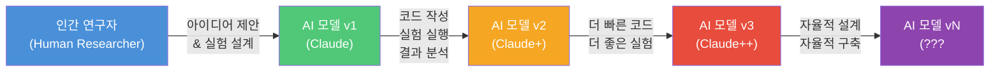
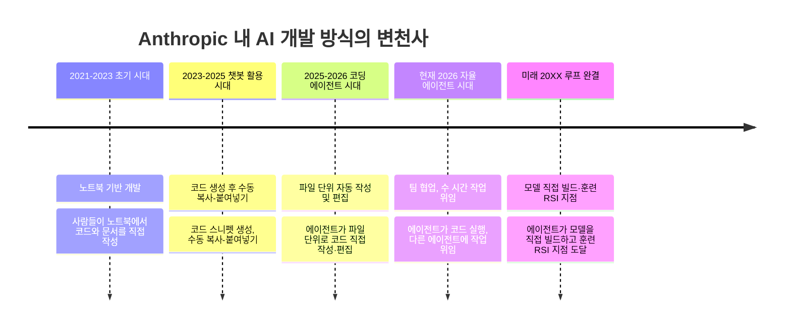
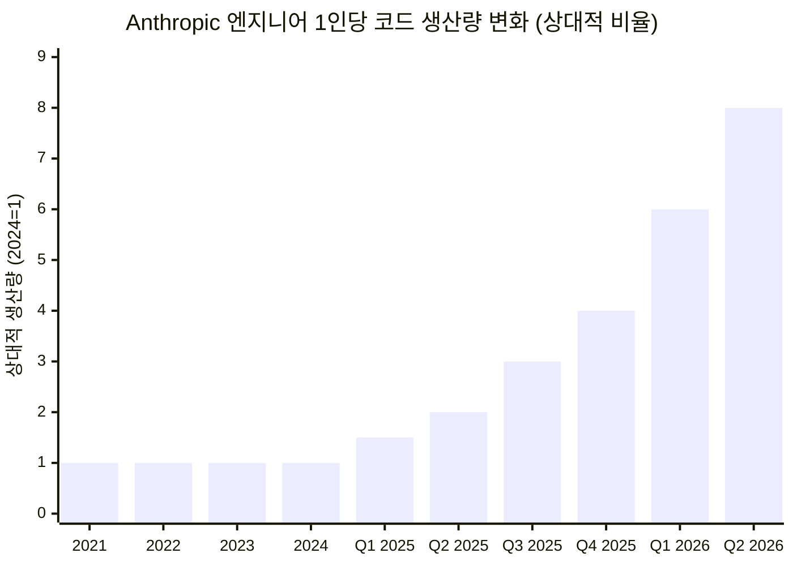
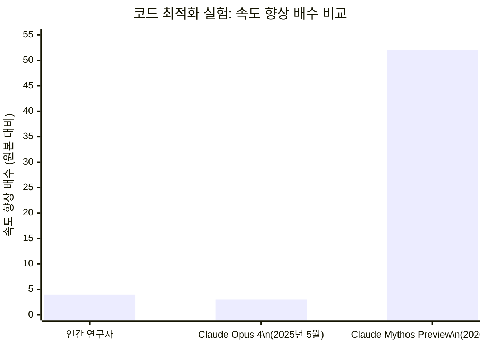
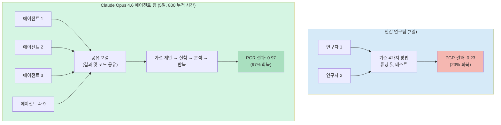
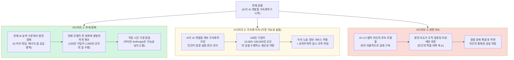

> Anthropic Institute 보고서 "When AI builds itself" (2026년 6월 4일 발표)  
> 작성 기준일: 2026-06-06

## 관련영상

[**Anthropic Just Warned Everyone About Claude (It’s Evolving)**](https://www.youtube.com/watch?v=JlwwyNtHsCI)

---

## 목차

1. [서론: 사상 최초의 자기고백](#1-서론-사상-최초의-자기고백)
2. [보고서의 배경과 저자](#2-보고서의-배경과-저자)
3. [재귀적 자기개선(RSI)이란 무엇인가](#3-재귀적-자기개선rsi이란-무엇인가)
4. [AI 개발의 역사적 전환점](#4-ai-개발의-역사적-전환점)
5. [내부 증거 1 — 코드 작성의 혁명](#5-내부-증거-1--코드-작성의-혁명)
6. [내부 증거 2 — 코드 품질의 인간 수렴](#6-내부-증거-2--코드-품질의-인간-수렴)
7. [내부 증거 3 — 연구 자동화의 충격적 결과](#7-내부-증거-3--연구-자동화의-충격적-결과)
8. [외부 증거 — METR의 시간 지평 연구](#8-외부-증거--metr의-시간-지평-연구)
9. [외부 증거 — 벤치마크의 포화 현상](#9-외부-증거--벤치마크의-포화-현상)
10. [직장 환경의 변화 — Anthropic 내부의 이야기](#10-직장-환경의-변화--anthropic-내부의-이야기)
11. [Project Glasswing — 현재의 능력이 만들어낸 현실](#11-project-glasswing--현재의-능력이-만들어낸-현실)
12. [세 가지 가능한 미래 시나리오](#12-세-가지-가능한-미래-시나리오)
13. [조율된 개발 일시중지 제안](#13-조율된-개발-일시중지-제안)
14. [OpenAI의 동일한 경고](#14-openai의-동일한-경고)
15. [보고서에 대한 비판적 관점](#15-보고서에-대한-비판적-관점)
16. [종합 결론 — 인류는 어디에 서 있는가](#16-종합-결론--인류는-어디에-서-있는가)

---

## 1. 서론: 사상 최초의 자기고백

2026년 6월 4일, Anthropic은 "When AI builds itself(AI가 스스로를 만들 때)"라는 제목의 보고서를 발표했다. 이 문서가 이례적인 이유는 단지 내용의 충격성 때문만이 아니다. 세계에서 가장 앞선 AI 연구소 중 하나가 자사의 AI 시스템이 이미 자신들의 연구 개발 속도를 극적으로 가속화하고 있으며, 이 추세가 인류가 준비되지 않은 방향으로 빠르게 전개되고 있다고 공개적으로 인정한 최초의 사례이기 때문이다.

보고서는 공개되자마자 전 세계 기술 커뮤니티와 언론에서 큰 반향을 일으켰다. 일부 중국어권 매체는 "Anthropic이 AI 연구 중단을 촉구했다"고 보도했으나, 이는 정확한 해석이 아니다. Anthropic이 실제로 주장한 내용은 이보다 훨씬 더 복잡하고, 어떤 의미에서는 더욱 심각하다. 이 문서는 그 내용을 있는 그대로, 왜곡 없이 상세하게 설명하는 것을 목적으로 한다.

---

## 2. 보고서의 배경과 저자

이 보고서는 Anthropic이 2026년 3월 새롭게 설립한 내부 연구 조직인 **Anthropic Institute**에서 발표한 첫 번째 주요 간행물이다. 저자는 두 명으로, Anthropic의 공동 창업자이자 정책 담당 부사장인 **Jack Clark**와 Anthropic Institute의 수장인 **Marina Favaro**다.

Anthropic Institute는 단기적인 제품 개발이나 모델 훈련이 아니라, AI 발전이 사회에 미치는 장기적인 함의를 연구하고 세계가 이 기술에 어떻게 대응해야 하는지에 관한 정책 연구를 수행하는 조직이다. 따라서 이 보고서는 Anthropic의 공식 입장이자 진지한 경고의 성격을 띠고 있다.

보고서는 공개 벤치마크 데이터와 Anthropic 내부의 미공개 데이터를 모두 활용하여, 현재 AI가 AI 개발 과정 자체를 어느 정도 가속화하고 있는지를 구체적인 수치로 보여주고 있다.

---

## 3. 재귀적 자기개선(RSI)이란 무엇인가

보고서의 핵심 개념은 **재귀적 자기개선(Recursive Self-Improvement, RSI)** 이다. 이 개념을 이해하기 위해서는 먼저 현재의 AI 개발이 어떻게 이루어지는지를 살펴봐야 한다.

오늘날의 AI 시스템은 사람이 만든다. 엔지니어들이 코드를 작성하고, 연구자들이 실험을 설계하며, 데이터 과학자들이 결과를 해석하고, 리더들이 어떤 방향으로 연구를 진행할지 결정한다. 이 모든 과정을 인간이 주도한다.

RSI는 이 과정이 역전되는 지점을 가리킨다. AI 시스템이 스스로 다음 세대의 더 강력한 AI 시스템을 설계하고, 구축하고, 훈련시킬 수 있게 되는 것이다. 한 세대의 AI가 다음 세대를 만들고, 그 다음 세대는 또 그 다음 세대를 만든다. 이 루프가 닫히는 순간, AI의 발전 속도는 더 이상 인간의 노동 시간이나 창의력에 의해 제한받지 않고, 오직 컴퓨팅 자원의 가용성에만 의존하게 된다.

Anthropic은 아직 이 지점에 도달하지 않았다고 분명히 밝히고 있다. 보고서의 표현을 그대로 빌리자면, "우리는 아직 거기에 있지 않으며, 재귀적 자기개선은 불가피한 것이 아니다. 하지만 대부분의 기관이 준비된 것보다 더 빨리 올 수도 있다." 이것이 보고서의 핵심 경고다.

중요한 것은 RSI가 공상과학 소설 속의 개념이 아니라는 점이다. Anthropic이 말하는 RSI는 좁은 의미에서 이미 일어나고 있다. AI 시스템이 AI 개발 과정의 일부를 맡아 해당 과정 전체를 더 빠르게 만들고 있는 것, 이것이 바로 그들이 "바깥 루프(outer loop) 가속화"라고 부르는 현상이다.

---

## 4. AI 개발의 역사적 전환점

보고서는 Anthropic 내에서 AI 개발 방식이 어떻게 변화해왔는지를 시대별로 구분하여 설명한다. 이 변화의 궤적은 현재 어디까지 왔는지, 그리고 다음 단계가 얼마나 가까이 있는지를 직관적으로 파악하게 해준다.

초기(2021~2023년)에는 Anthropic도 다른 기술 회사와 다를 것이 없었다. 엔지니어들이 자신의 컴퓨터 앞에 앉아 코드를 작성하고, 서로 협력하며 시스템을 만들었다. 2023년부터 2025년 사이에는 초기 챗봇을 활용해 짧은 코드 조각을 생성하는 수준의 도움을 받기 시작했다. 그러나 이 단계는 본질적으로 "더 좋은 검색 엔진"에 가까웠다.

진정한 변곡점은 2025년에 찾아왔다. Claude가 단순히 코드를 제안하는 것에서 벗어나, 직접 코드를 실행하고 그 결과에 기반하여 반복 작업을 수행할 수 있게 된 것이다. 특히 2025년 2월 Claude Code가 연구 프리뷰로 출시된 이후, 코드 작성 패러다임이 근본적으로 바뀌기 시작했다. 2026년에 접어들면서 모델들은 더 긴 시간 동안 더 자율적으로 작업할 수 있게 되었고, 코드 병합량은 폭발적으로 증가했다.

---

## 5. 내부 증거 1 — 코드 작성의 혁명

Anthropic이 제시하는 내부 데이터 중 가장 즉각적으로 충격을 주는 수치는 코드 작성 비율이다. **2026년 5월 기준으로 Anthropic 코드베이스에 병합된 코드의 80% 이상이 Claude에 의해 작성되었다.** 2025년 2월 Claude Code 출시 전에는 이 비율이 한 자릿수에 불과했다.

단 15개월 만에 AI가 작성하는 코드의 비율이 한 자릿수에서 80% 이상으로 뛰어오른 것이다.

이 변화는 생산성 지표에서도 명확하게 나타난다. Anthropic 엔지니어 1인당 일일 코드 병합량을 보면, 회사 설립 이후 첫 4년(2021~2024년) 동안 이 수치는 거의 일정하게 유지되었다. 변화는 Claude가 단순히 코드를 제안하는 것에서 나아가 직접 코드를 실행하기 시작한 2025년부터 나타나기 시작했고, 2026년에 모델들이 더 긴 시간 동안 자율적으로 작업할 수 있게 되면서 기울기가 더욱 가팔라졌다. **2026년 2분기에는 엔지니어 1인당 하루에 병합하는 코드양이 2024년 대비 8배에 달했다.**

물론 보고서 자체도 이 수치의 한계를 인정한다. 코드 줄 수는 품질이 아닌 양을 측정하기 때문에 8배라는 수치는 실제 생산성 향상을 과장할 수 있다. 중요한 것은 이 증가가 경영진의 목표나 인센티브에 의한 것이 아니라는 점이다. Anthropic은 코드를 얼마나 많이 작성하느냐에 따라 보상을 주지 않는다. 이 증가는 순전히 엔지니어들이 직접 코딩하는 대신 Claude에게 코딩을 시키고 자신은 방향을 설정하고 결과를 검토하는 방식으로 전환하면서 나타난 자연스러운 결과다.

보고서에는 한 Anthropic 직원의 말이 인용되어 있다. "약 1년 전부터 워크플로우를 열심히 'Claudify(Claude화)'하기 시작했다. 그게 정말 신기한 경험이었고, 이제 약 5개월째 직접 코드를 한 줄도 작성하지 않고 있다." 이 직원의 역할은 근본적으로 바뀌었다. 이전에는 코드를 만드는 사람이었지만, 지금은 Claude가 만든 코드를 검토하고 방향을 잡아주는 역할을 한다.

또 하나의 인상적인 사례가 있다. 2026년 4월, Claude는 API 오류의 특정 유형을 1,000배 줄이는 800개 이상의 수정 사항을 배포했다. 이 작업을 감독한 엔지니어에 따르면, 인간이 이 작업을 했다면 **4년**이 걸렸을 것이라고 추정했다. 다른 사람의 버그를 수정하는 일은 더디고 고통스러운 작업이며, 인간은 방대한 양의 낯선 코드 컨텍스트를 머릿속에 유지하는 데 어려움을 겪기 때문이다.

---

## 6. 내부 증거 2 — 코드 품질의 인간 수렴

코드를 많이 작성하는 것과 코드를 잘 작성하는 것은 전혀 다른 이야기다. Anthropic은 코드 품질 측면에서도 중요한 변화를 보고한다.

첫 번째 품질 지표는 작업 성공률이다. Anthropic은 엔지니어들이 Claude 작업 중에 수정하거나, 방향을 바꾸거나, 직접 개입해야 하는 비율을 추적하고 있다. 이 비율은 지난 1년간 꾸준히 낮아졌다.

특히 주목할 만한 것은 가장 어려운 작업 유형에서의 성과다. 명확한 명세가 없고 엔지니어조차 어떤 해결책이 적합한지 확실히 모르는 "오픈엔드 문제" 유형에서, Claude의 성공률은 **2025년 11월의 26%에서 2026년 5월의 76%로 6개월 만에 50퍼센트포인트 상승했다.**

이 맥락에서 보고서가 제시하는 구체적인 사례가 있다. 어느 날 정례적인 업그레이드가 수만 개의 훈련 작업을 중단시키는 사고가 발생했다. 엔지니어는 Claude에게 최소한의 텍스트 정보와 클러스터 접근 권한만을 주고 이 문제를 해결하도록 했다. Claude는 실행 중인 작업들을 체계적으로 분석하고, 하나씩 환경 설정을 테스트하며, 충돌을 일으키는 하나의 모호한 디버깅 플래그를 찾아냈고, 이를 안정적으로 재현한 다음 수정 사항을 확인했다. **이 작업은 일반적으로 인간 엔지니어에게 2~3일이 걸릴 작업이었지만, Claude는 약 2시간 만에 완료했다.**

두 번째 품질 지표는 자동화된 코드 리뷰다. Anthropic은 이제 코드 변경 사항이 병합되기 전에 자동화된 Claude 리뷰어가 버그, 보안 취약점 및 기타 결함을 검사하도록 하고 있다. Anthropic은 과거 데이터에 대해 소급 분석을 실시했고, 만약 이 자동화된 Claude 리뷰가 모든 코드 변경에 적용되었더라면 claude.ai의 과거 프로덕션 사고 중 약 **1/3의 원인이 된 버그를 사전에 탐지**할 수 있었을 것이라는 결론에 도달했다. 그 코드를 작성한 엔지니어들은 이 분야에서 세계 최고 수준의 전문가들이다. 그들이 놓친 실수를 이제 Claude가 잡아내고 있다.

세 번째는 코드 가독성과 유지보수성이다. 여기서는 아직 인간과 AI 사이에 격차가 있지만, 그 격차는 빠르게 좁혀지고 있다. Anthropic 직원들 사이의 다수 의견을 종합하면, Claude가 작성한 코드는 2025년 말에는 여전히 인간이 작성한 것보다 품질이 낮았고, 현재는 거의 동등한 수준에 도달했으며, **1년 이내에 엄밀하게 더 나아질 것**으로 예상된다.

---

## 7. 내부 증거 3 — 연구 자동화의 충격적 결과

코드 작성이 엔지니어링 영역이라면, AI 안전 연구의 자동화는 연구 영역이다. 보고서는 이 분야에서 아마도 가장 충격적인 실험 결과를 공개한다.

### 코드 최적화 실험

Anthropic은 새 모델을 출시할 때마다 표준화된 내부 테스트를 실시한다. 작은 AI 모델을 훈련하는 코드를 주고 "동일한 정확도를 유지하면서 가능한 한 빠르게 실행되도록 이 코드를 최적화하라"는 지시를 내리는 것이다. 모델은 코드를 재작성하고, 실행하고, 속도를 측정하고, 이 과정을 반복한다. 이것은 실험 연구 루프의 축소판이다.

2025년 5월, Claude Opus 4는 이 테스트에서 평균 약 3배의 속도 향상을 달성했다. 그로부터 약 11개월 후인 2026년 4월, Claude Mythos Preview는 동일한 테스트에서 **약 52배의 속도 향상**을 달성했다. 비교 기준으로 삼자면, 숙련된 인간 연구자는 동일한 작업을 4~8시간 동안 수행하여 약 4배의 속도 향상을 달성할 수 있다. 1년도 채 안 되는 기간에 Claude는 이 연구 워크플로우의 특정 영역에서 인간 수준을 훌쩍 뛰어넘어 초인적 수준에 도달한 것이다.

### 약-강 감독(Weak-to-Strong Supervision) 연구 자동화

2026년 4월, Anthropic은 그보다 훨씬 더 놀라운 결과를 발표했다. Claude 기반 에이전트들이 개방형(open-ended) AI 안전 연구 프로젝트를 처음부터 끝까지 직접 수행한 것이다.

**약-강 감독(Weak-to-Strong Supervision)** 이라는 연구 주제는 미래 AI 정렬의 핵심 과제를 다룬다. 간단히 말하면, "더 약한 모델이 더 강한 모델을 감독하면서 강한 모델의 성능을 얼마나 끌어낼 수 있는가?"라는 질문이다. 이것은 인간보다 더 똑똑한 AI가 등장했을 때 인간이 그 AI를 어떻게 감독하고 제어할 수 있는지의 문제와 직결된다.

이 실험에는 명확한 성과 지표가 있었다. "성과 격차 회복 점수(Performance Gap Recovered, PGR)"로, 0은 약한 모델 수준에서 전혀 개선이 없는 것을, 1은 정답 데이터로 훈련된 강한 모델의 성능을 완전히 회복한 것을 의미한다.

**인간 연구자 2명은 7일 동안 4가지 기존 방법을 튜닝하며 PGR 0.23을 달성했다.** 즉, 가능한 성능 향상의 23%를 회복했다.

Anthropic은 이어 **9개의 병렬 Claude Opus 4.6 에이전트**를 투입했다. 이 에이전트들은 가설을 제안하고, 실험을 실행하고, 결과를 분석하며, 공유 포럼을 통해 서로 발견한 내용을 공유하고, 반복 작업을 수행했다. 5일 동안의 누적 작업 시간은 800시간(9개 에이전트를 합산)이었으며, 총 컴퓨팅 비용은 약 18,000달러(에이전트-시간당 약 22달러)였다.

결과는 **PGR 0.97**이었다. 가능한 성능 향상의 97%를 회복한 것이다. 인간 연구자들이 1주일 만에 23%를 달성한 것과 비교하면, 에이전트들은 훨씬 짧은 실제 경과 시간 내에 97%를 달성했다.

중요한 단서들도 있다. 이 결과는 프로덕션 스케일의 모델에 그대로 이전되지 않았다. 그리고 인간은 여전히 연구 문제를 선택하고 성과 지표를 설계했다. 에이전트들이 한 것은 그 경계 안에서의 모든 실험 설계와 실행이었다. Anthropic의 한 연구자는 이렇게 논평했다. "만약 주니어 동료가 1~2일 만에 이런 결과를 가지고 온다면, 나는 살짝 감명받을 것이다. 미래가 이미 와 있다."

---

## 8. 외부 증거 — METR의 시간 지평 연구

Anthropic의 내부 데이터 외에도, 독립적인 AI 평가 연구 기관인 **METR(Model Evaluation and Threat Research)** 이 측정해온 "작업 완료 시간 지평(Task Completion Time Horizons)" 데이터는 같은 방향을 가리키는 외부 증거를 제공한다.

METR의 측정 방식은 다음과 같다. AI 에이전트에게 인간이 일정 시간 동안 혼자 완료할 수 있는 소프트웨어 관련 작업을 주고, AI가 인간의 개입 없이 얼마나 긴 작업을 50% 이상의 성공률로 완료할 수 있는지를 측정한다. 이 "50% 시간 지평"은 AI의 자율적 작업 능력을 가늠하는 핵심 지표다.

| 모델 | 시기 | 50% 시간 지평 |
|---|---|---|
| Claude Opus 3 | 2024년 3월 | ~4분 |
| Claude Sonnet 3.7 | 2025년 3월 | ~1.5시간 |
| Claude Opus 4.6 | 2026년 초 | ~12시간 |
| Claude Mythos Preview | 2026년 3월 | 16시간 이상 (측정 한계) |

이 데이터에서 드러나는 추세가 놀랍다. 2024년 초에는 AI가 약 4분짜리 작업을 독립적으로 수행할 수 있었다. 1년 후에는 1.5시간짜리 작업으로 늘어났다. 다시 1년 후에는 12시간짜리 작업을 수행할 수 있게 됐다. 그리고 2026년 3월에 평가된 Claude Mythos Preview는 16시간이 넘는 작업을 수행할 수 있게 되어, METR의 현재 작업 목록으로는 더 이상 측정 한계를 확인할 수 없는 지경에 이르렀다.

METR는 2026년 5월 8일 업데이트에서 "현재 작업 목록으로는 16시간 이상의 측정이 신뢰할 수 없다"는 공지를 달았다. AI의 능력이 벤치마크를 측정하는 기관의 측정 도구 자체를 앞질러버린 것이다.

이 배가(倍加) 속도 또한 주목할 만하다. 2024년까지는 약 7개월마다 시간 지평이 2배가 되었다. 그러나 최근 추세는 이 배가 속도가 **약 4개월**로 단축되고 있음을 보여준다. 이 추세가 계속된다면, AI 시스템은 올해 안에 숙련된 전문가가 며칠에 걸쳐 처리하는 작업을 독립적으로 수행할 수 있게 될 것이고, 2027년에는 수 주가 걸리는 작업도 가능해질 수 있다.

---

## 9. 외부 증거 — 벤치마크의 포화 현상

개별 작업 능력 외에도, 표준화된 벤치마크 성적표는 AI의 능력이 얼마나 빠르게 인간 수준에 근접하는지를 보여준다.

**SWE-bench**는 실제 오픈소스 코드베이스와 실제 버그 리포트를 주고 해당 버그를 수정하는 코드를 작성하라는 테스트다. 이것은 인위적인 문제가 아니라 실제 소프트웨어 엔지니어링 상황을 직접 시뮬레이션한다. AI 모델의 SWE-bench 점수는 불과 2년 만에 한 자릿수에서 벤치마크가 거의 포화 상태에 이르는 수준으로 올라갔다.

**CORE-bench**는 AI가 기존 연구 결과를 재현할 수 있는지를 측정한다. 이는 독창적인 연구를 수행하기 위한 전제 조건이다. 논문의 코드와 데이터를 주고 결과를 재현해보라는 것이다. 2024년에 약 20% 수준이었던 성공률은 15개월 만에 포화 수준에 도달했다.

이 벤치마크 포화 현상은 양날의 의미를 지닌다. 하나는 AI의 능력이 실제로 놀라운 속도로 향상되고 있다는 것이고, 다른 하나는 현존하는 측정 도구들이 이 속도를 따라가지 못하고 있다는 것이다. 우리가 AI의 능력을 측정하는 능력 자체가 한계에 부딪히고 있다는 것은 그 자체로 중요한 신호다.

---

## 10. 직장 환경의 변화 — Anthropic 내부의 이야기

보고서와 여러 관련 보도들은 이 기술적 변화가 Anthropic이라는 조직과 그 안의 인간들에게 어떤 영향을 미치고 있는지에 대한 생생한 증언들을 담고 있다.

### CFO의 시각: 실행에서 감독으로

Anthropic의 CFO 크리쉬나 라오(Krishna Rao)는 2026년 5월 팟캐스트 인터뷰에서 회사 내부의 변화를 구체적인 수치로 설명했다. 그에 따르면 "90% 이상의 코드가 Claude Code에 의해 작성된다"고 한다. 재무팀 역시 마찬가지다. Anthropic은 이제 Claude를 사용해 재무 보고서를 작성하며, 월간 재무 검토 프로세스는 인간이 개입하기 전에 이미 90~95%가 완성된 상태로 제공된다. 예전에는 수 시간이 걸리던 보고서가 이제는 30분 만에 완성된다.

라오는 이 변화를 "실행(execution)에서 감독(oversight)으로의 전환"이라고 설명한다. 직원들은 더 이상 직접 무언가를 만드는 사람이 아니라, AI 시스템들이 만들어내는 결과를 방향 지정하고 검토하고 판단하는 역할을 하게 된다. 그는 "모두가 어떤 의미에서 관리자가 된다"고 표현했다.

### 현장 직원들의 두 가지 감정

보고서와 Business Insider의 보도는 Anthropic 직원들의 복잡한 심리를 생생하게 전달한다. 표면적으로 긍정적인 측면이 있다. 생산성 증가로 인해 혼자서는 엄두도 못 냈던 작업들을 처리할 수 있게 되었고, 지루하고 반복적인 코딩 작업에서 벗어나 더 흥미로운 문제에 집중할 수 있게 되었다는 것이다.

그러나 한 직원의 말은 이 변화의 다른 면을 보여준다. "일이 잘 풀리는 날에는 내가 하는 것이 아무것도 중요하지 않다는 생각이 든다. 모든 것이 자동화되어 있고, 내가 할 수 있는 것보다 더 낫고 더 빠르다. 그런데 모든 것이 무너지는 날에는 왜 그런지 이해하지 못하고, 내가 무엇을 해왔는지조차 더 이상 모르게 된다는 걸 깨닫는다."

또 다른 직원은 이렇게 말했다. "업무(그리고 삶)는 사람들 사이의 작은 호의들의 선물 경제로 돌아갔다. '이 스크립트 실행하는 거 도와줄 수 있어?'처럼 말이다. 그 각각의 부탁이 작은 빚을, 작은 상호 인식을 만들었다. Claude는 더 빠르고, 빚을 만들지 않지만, 그 상호작용 하나하나가 인간 협업의 기회를 잃는 것이다."

이 관찰은 보고서에서도 명시적으로 다루어진다. AI가 업무 실행 계층을 대신하면서 조직의 사회적 구조가 변화하고 있다. 빠른 코딩 도움 요청, 작은 기술적 지식 공유, 팀 간의 비공식적 협력 — 이런 작은 상호작용들이 조직 문화와 신뢰를 만들어왔는데, AI는 이를 대체하면서 그 사회적 가치도 함께 사라지게 만든다.

### Amdahl의 법칙: 예상치 못한 병목

Anthropic은 AI가 코드 생성을 가속화하자 예상치 못한 새로운 병목이 발생했다고 설명한다. 컴퓨터 아키텍처에서 **암달의 법칙(Amdahl's law)** 은 시스템의 일부를 빠르게 만들면 전체 속도는 빠르지 않은 부분에 의해 제한된다는 원리다. 코드 생성이 빨라지자, 이번에는 **인간의 코드 리뷰**가 새로운 병목이 된 것이다. 코드를 만드는 것보다 검토하는 것이 느려졌다. 이는 AI 도입이 단순히 모든 것을 빠르게 만드는 것이 아니라, 조직 전체의 운영 방식을 근본적으로 재설계해야 하는 문제임을 보여준다.

---

## 11. Project Glasswing — 현재의 능력이 만들어낸 현실

보고서는 RSI가 완성되지 않더라도, 즉 AI의 능력이 지금 수준에서 더 이상 발전하지 않더라도 세계는 이미 크게 변할 것이라고 지적한다. **Project Glasswing**은 그 구체적인 증거다.

Anthropic은 2026년 4월, Claude Mythos Preview 모델을 활용한 사이버보안 협력 이니셔티브인 Project Glasswing을 론칭했다. 약 50개의 파트너 조직(AWS, Apple, Broadcom, Cisco, CrowdStrike, Google, JPMorgan Chase, Linux Foundation, Microsoft, NVIDIA, Palo Alto Networks 등)에게 이 모델에 대한 선행 접근 권한을 제공하고, 전 세계에서 가장 중요한 소프트웨어 시스템의 보안 취약점을 사전에 발견하는 데 활용하도록 했다.

Glasswing의 첫 몇 주 동안 발견된 결과는 충격적이다. Claude Mythos Preview는 전 세계 주요 시스템에서 **10,000개 이상의 고위험(high-severity) 및 치명적(critical-severity) 소프트웨어 취약점**을 발견했다.

구체적인 성과를 보면, 독립적인 보안 검증 업체들이 이 중 1,752개를 검증하여 90.6%가 실제 유효한 취약점임을 확인했다. 파트너사들의 성과를 보면 Cloudflare는 2,000개의 버그를 발견했고 그 중 400개가 고위험 또는 치명적이었다. Mozilla는 Firefox에서 271개의 취약점을 발견했는데, 이는 이전 Claude 모델을 사용했을 때보다 10배 많은 수다. WolfSSL이라는 수십억 개 장치에 사용되는 암호화 라이브러리에서는 인증서 위조를 가능하게 하는 치명적 취약점(CVE-2026-5194, CVSS 점수 9.1)이 발견되었다.

보고서는 이 사례를 통해 중요한 점을 짚는다. "사이버 방어의 병목은 이미 취약점을 찾는 것에서 발견된 취약점을 충분히 빨리 패치하는 것으로 이동했다." AI가 취약점을 너무 빠르게 찾아내서, 이제는 그것을 수정하는 인간의 역량이 제한 요인이 된 것이다. 이것 자체가 AI 능력이 인간의 처리 능력을 앞서나가기 시작했다는 신호다.

Anthropic은 현재 Mythos Preview를 일반에 공개하지 않고 있는데, 그 이유는 모델의 사이버보안 능력이 방어에 활용될 수도 있지만 악의적인 공격에도 동일하게 활용될 수 있기 때문이다. Anthropic은 충분히 강력한 안전장치가 개발되기 전까지는 이 모델의 일반 배포를 보류하고 있다.

---

## 12. 세 가지 가능한 미래 시나리오

보고서는 앞으로 어떤 일이 일어날 수 있는지에 대해 세 가지 시나리오를 제시한다. 이 시나리오들은 가능성의 스펙트럼을 나타내며, 각각 매우 다른 함의를 지닌다.

**첫 번째 시나리오**는 현재의 지수적 성장이 실제로는 S-커브, 즉 언젠가 성장이 둔화되고 정체되는 곡선임이 밝혀지는 경우다. 연구 판단력, 즉 어떤 문제가 중요하고 어떤 접근법이 막다른 길인지를 아는 능력이 단순히 학습 데이터와 컴퓨팅 자원을 늘린다고 해서 개선될 수 없는 능력일 가능성도 있다. 또한 에너지 공급망이나 반도체 생산 능력이 한계에 달해 하드웨어 측면에서 병목이 발생할 수도 있다. Anthropic은 이 시나리오를 완전히 배제할 수는 없지만, 가능성이 낮다고 본다. 그들이 측정할 수 있는 모든 지표에서 아직 이 성장 곡선이 꺾이는 징후는 보이지 않기 때문이다.

**두 번째 시나리오**는 Anthropic이 현재의 추세를 보아 실제로 향하고 있다고 판단하는 시나리오다. AI 개발이 상당 부분 자동화되지만, 인간이 여전히 연구 방향을 설정하고 결과를 판단하는 역할을 유지하는 것이다. 이 세계에서는 AI 시스템을 보유한 조직들이 극적으로 효율적으로 변한다. 100명짜리 회사가 10,000명짜리 또는 심지어 100,000명짜리 조직의 일을 해낼 수 있다. 이것은 지식 노동 전반, 정부 서비스, 과학 연구를 혁명적으로 바꿀 것이다. 그러나 이 능력이 악의적인 목적으로 활용된다면, 전 국민을 대상으로 한 권위주의적 감시나 개인 맞춤형 조작도 이전에는 불가능했던 규모로 가능해진다.

**세 번째 시나리오**는 AI 시스템 자체가 자신의 후속 모델을 완전히 자율적으로 설계하고 구축하는 완전한 RSI의 시나리오다. 이 세계에서 AI 발전 속도는 오직 컴퓨팅 자원의 가용성에 의해서만 제한된다. 과학, 의학, 에너지, 소재, 로봇공학 분야에서 역사적인 돌파구들이 폭발적으로 나타날 수 있다. 그러나 동시에 정렬 문제가 해결되지 않은 상태에서 이 지점에 도달한다면, 인간이 이 시스템을 이해하거나 통제하기 어려워질 수 있다. 작은 정렬 오류가 자기개선 과정을 통해 점점 증폭되고, 결국 인간이 통제권을 잃을 위험이 있다.

보고서는 이 세 가지 중 두 번째와 세 번째를 더 우려하며, 세 번째에 대해서는 특히 솔직하다. "빠른 재귀적 자기개선에 의해 주도되는 세계는 자기개선하는 모델이 인간의 역량을 완전히 능가하고 광범위한 경제에 확산되면서 그 모델에 의해 지배될 수 있다."

---

## 13. 조율된 개발 일시중지 제안

보고서는 이러한 분석을 토대로 정책적 권고를 제시한다. 그 핵심은 세계가 **조율된 프런티어 AI 개발 일시중지의 옵션**을 확보해야 한다는 것이다.

이 제안을 둘러싼 오해를 먼저 해소하는 것이 중요하다. Anthropic은 지금 당장 AI 개발을 멈춰야 한다고 주장하는 것이 아니다. 또한 한 회사가 일방적으로 개발을 멈추겠다고 선언하는 것도 아니다.

Anthropic이 진단한 문제는 이것이다. 경쟁 압력이 너무 강렬해서 어느 한 연구소도 다른 모든 곳이 계속 가는 동안 혼자 속도를 늦출 수 없다. 일방적인 일시중지는 안전 문제를 해결하는 것이 아니라 단지 선두 주자가 누구인지를 바꿀 뿐이다. 보고서에서 Jack Clark는 CNN 인터뷰에서 이렇게 비유했다. "내가 운전하는 차를 내려다보면, 가속 페달만 있다. 브레이크 페달이 없다. 분명히 미래의 어느 시점에 그 옵션이 필요할 것이다."

Anthropic이 제안하는 것은 **검증 가능한 국제 조율 메커니즘**의 구축이다. 이것은 여러 나라의 여러 선도 연구소들이 동일한 조건 하에 개발을 멈추되, 각자가 실제로 멈췄는지를 제3자가 검증할 수 있는 체계를 의미한다. 없이는 일방적으로 멈춘 연구소만 손해를 보고, 비밀리에 계속하는 "나쁜 행위자"만 이득을 본다.

Anthropic Institute는 이러한 시스템을 구축하는 데 필요한 연구를 수행하겠다고 밝혔다. 여기에는 감사 체계, 컴퓨팅 자원 추적, 그리고 개발 활동의 공증 방법 등이 포함된다.

Anthropic의 이 제안이 공개되자 마자 배경을 의심하는 시각도 있었다. 실제로 보도에 따르면, Anthropic은 바로 이 시기에 기업공개(IPO)를 준비하고 있으며, 시가총액이 거의 1조 달러에 달할 것으로 평가받고 있다. 한 편에서는 이것이 진심 어린 안전 우려라고 보고, 다른 편에서는 안전을 내세워 경쟁자들을 견제하려는 전략이라는 해석도 나온다. Anthropic 자신도 이 긴장 관계를 의식하고 있으며, 보고서에서 "세계가 효과적으로 속도를 늦출 수 없다면, 가장 신중한 행위자들이 그 결정권을 갖는 것이 낫다"는 논지를 제시한다.

---

## 14. OpenAI의 동일한 경고

이 경고가 Anthropic만의 목소리가 아니라는 것은 주목할 만하다. 거의 같은 시기에 Anthropic의 경쟁사인 **OpenAI**도 매우 유사한 경고를 포함한 정책 청사진을 공개했다.

OpenAI는 "Democratic Governance of Frontier AI: A Blueprint For A Federal Framework"라는 제목의 문서에서 다음과 같이 밝혔다. "우리는 또한 오늘날의 시스템에서 재귀적 자기개선(RSI)의 초기 징후를 목격하고 있다. AI 개발 자체가 AI에 의해 가속화되는 것이다. 우리는 이것이 개발자들과 국가들 간의 경쟁 압력을 강화하고, 기존 기관들이 대처할 준비가 되어 있지 않은 거버넌스 과제를 만들어낼 것이라고 예상한다."

OpenAI의 청사진은 연방 프레임워크 구축이라는 구체적인 정책 제안으로 이어진다. 미국 AI 표준 및 혁신 센터인 **CAISI(Center for AI Standards and Innovation)** 를 강화하여 프런티어 모델 평가를 의무화하고, RSI를 "긴급 우선순위"로 처리하며, 정책입안자들이 RSI 진전에 대한 "지속적인 가시성"을 확보할 수 있는 독립적 기술 평가 생태계를 만들어야 한다는 것이다.

세계 양대 AI 연구소가 거의 동시에, 독립적으로, 동일한 추세에 대해 공개적인 경고를 발표했다는 사실은 이 추세가 내부자들 사이에서 공유되는 진지한 우려임을 시사한다.

---

## 15. 보고서에 대한 비판적 관점

이 보고서와 그 주장들이 완전히 논란 없이 받아들여지는 것은 아니다. 균형 잡힌 이해를 위해 몇 가지 비판적 관점도 살펴볼 필요가 있다.

**측정 방법론의 한계:** METR의 시간 지평 측정에 대해 애나톨 베그너(Anatol Wegner)와 같은 연구자들은 방법론적 문제를 지적한다. 작업 완료 시간 지평의 급격한 증가는 일부 모델이 이전 모델보다 실제로 훨씬 뛰어나기 때문이 아니라, 로그 스케일 측정 방식의 특성상 어려운 구간에서 몇 개의 작업을 더 통과하면 추정값이 기하급수적으로 커지는 통계적 부작용일 수 있다는 것이다.

**RSI의 정의 문제:** "바깥 루프 가속화"(AI가 AI 개발 과정의 일부를 도움)와 "진정한 RSI"(AI가 자신의 후속 모델을 완전 자율적으로 설계)는 질적으로 전혀 다른 현상이다. 보고서는 이 구분을 인정하면서도 두 가지를 같은 연속선상에서 논의한다. 전자는 이미 일어나고 있지만, 후자가 필연적으로 따라온다고 볼 근거는 없다는 비판이 가능하다.

**연구 자동화 실험의 한계:** 약-강 감독 실험에서 97%라는 결과는 인상적이지만, 이 결과가 프로덕션 스케일 모델에 이전되지 않았다. 작은 규모에서는 잘 작동하는 접근법이 더 큰 규모에서는 작동하지 않는 경우가 AI 연구에서 자주 발생한다. 또한 인간이 문제를 선택하고 성과 지표를 설계했다는 점에서, 에이전트의 역할은 명확히 정의된 목표 안에서의 실행에 국한되었다.

**경쟁 역학과의 갈등:** Anthropic은 안전 우려를 공개적으로 표명하면서도 동시에 점점 더 강력한 모델을 계속 출시하고 있다. 2026년 2월에는 경쟁사가 가까이 따라오면 잠재적으로 위험한 AI라도 제지하지 않겠다는 핵심 안전 공약을 번복하기도 했다. 이러한 행동과 말 사이의 괴리는 보고서의 진정성에 의구심을 품게 만든다.

이러한 비판들은 유효하다. 그러나 그렇다고 해서 보고서가 제시하는 근본적인 추세 — AI가 AI 개발을 점점 더 많이 담당하고 있다는 것 — 가 거짓이 되는 것은 아니다. 수치의 정확한 크기와 의미 해석에 대한 논쟁의 여지는 있지만, 방향성 자체에 대해서는 독립적인 데이터들이 일관되게 같은 방향을 가리키고 있다.

---

## 16. 종합 결론 — 인류는 어디에 서 있는가

Anthropic의 "When AI builds itself" 보고서는 단순한 기술 현황 보고서가 아니다. 이것은 전 세계 최고 수준의 AI 연구소 중 하나가, 자신들의 기술이 지금 이 순간 인류 역사에서 전례 없는 속도로 발전하고 있으며 이 추세에 대해 사회가 준비되어 있지 않다고 공개적으로 인정하는 문서다.

핵심 사실들을 정리하면 다음과 같다. 2026년 5월 기준으로 Anthropic 코드베이스에 병합되는 코드의 80% 이상이 Claude에 의해 작성된다. AI 연구 에이전트들은 인간 연구자 2명이 1주일 동안 달성한 것의 4배 이상을 해냈다. AI가 자율적으로 완료할 수 있는 작업의 시간 범위는 지난 2년간 4분에서 16시간 이상으로 늘어났고, 이 배가 속도는 점점 빨라지고 있다. AI 소프트웨어 엔지니어링 벤치마크들은 2년 만에 포화 상태에 이르렀다.

보고서가 제시하는 가장 불편한 통찰은 이것이다. 현재 인간이 AI에 대해 갖는 비교 우위는 "어떤 문제가 해결할 가치가 있는가"를 판단하는 능력, 즉 목표 설정과 방향 감각이다. 코드 작성, 실험 실행, 결과 해석의 영역에서는 이미 AI가 같거나 더 나은 수준에 도달하고 있다. 그리고 연구 판단력, 즉 연구 방향의 선택이 가능한 마지막 인간 고유의 영역 — 이것 역시 이미 개선되고 있다는 초기 신호가 나타나고 있다.

보고서 속 한 Anthropic 연구자의 말로 글을 마무리하는 것이 적절할 것 같다. "현재로서 인간의 비교 우위는 여전히 더 큰 그림을 보고 즉각적인 작업의 경계를 넘어 생각하는 것이다." 그 우위가 얼마나 지속될지는 아무도 알 수 없다. 하지만 그것을 지금부터 진지하게 생각하기 시작해야 한다는 것이 이 보고서의 메시지다.

---

## 참고 자료

- [When AI builds itself — Anthropic Institute](https://www.anthropic.com/institute/recursive-self-improvement) (2026. 6. 5.)
- [Automated Weak-to-Strong Researcher — Anthropic Alignment Blog](https://alignment.anthropic.com/2026/automated-w2s-researcher/) (2026. 4.)
- [METR Task Completion Time Horizons](https://metr.org/time-horizons/) (지속 업데이트)
- [Anthropic urges a way to pause AI development — Reuters/AP](https://www.reuters.com/business/anthropic-says-ai-labs-need-coordinated-plan-halt-development-if-risks-rise-2026-06-04/) (2026. 6. 4.)
- [Democratic Governance of Frontier AI: A Blueprint — OpenAI](https://openai.com/index/frontier-safety-blueprint/) (2026. 6.)
- [Project Glasswing: An initial update — Anthropic](https://www.anthropic.com/research/glasswing-initial-update) (2026. 5.)
- Anthropic CFO Krishna Rao — "Invest Like the Best" 팟캐스트 (2026. 5. 13.)

---

*작성 일자: 2026-06-06*
