> **작성 기준일**: 2026-06-06  
> **출처**: Anthropic 공식 블로그, Claude Code 공식 문서, 관련 기술 분석 자료  
> **버전**: Claude Code v2.1.154 이상, Research Preview 기준

---

## 목차

1. [배경과 출시 맥락](#1-배경과-출시-맥락)
2. [Dynamic Workflows란 무엇인가](#2-dynamic-workflows란-무엇인가)
3. [왜 단일 에이전트만으로는 부족한가](#3-왜-단일-에이전트만으로는-부족한가)
4. [핵심 작동 원리](#4-핵심-작동-원리)
5. [기술 사양 및 제약 조건](#5-기술-사양-및-제약-조건)
6. [활성화 방법과 ultracode 설정](#6-활성화-방법과-ultracode-설정)
7. [6가지 핵심 워크플로우 패턴](#7-6가지-핵심-워크플로우-패턴)
8. [JavaScript 오케스트레이션 API: agent, parallel, pipeline](#8-javascript-오케스트레이션-api-agent-parallel-pipeline)
9. [Skill 폴더와 워크플로우 재사용](#9-skill-폴더와-워크플로우-재사용)
10. [Static Harness vs Dynamic Workflow: 두 접근법의 비교](#10-static-harness-vs-dynamic-workflow-두-접근법의-비교)
11. [워크플로우가 빛나는 10가지 작업 유형](#11-워크플로우가-빛나는-10가지-작업-유형)
12. [실전 사례: Bun의 Zig → Rust 포팅](#12-실전-사례-bun의-zig--rust-포팅)
13. [기업 도입 사례](#13-기업-도입-사례)
14. [Dynamic Workflow를 위한 프롬프트 작성법 13단계](#14-dynamic-workflow를-위한-프롬프트-작성법-13단계)
15. [비용과 토큰 소비 고려사항](#15-비용과-토큰-소비-고려사항)
16. [언제 Dynamic Workflow를 써야 하고, 언제 쓰지 말아야 하는가](#16-언제-dynamic-workflow를-써야-하고-언제-쓰지-말아야-하는가)
17. [AI 시대 개발자 역할의 변화](#17-ai-시대-개발자-역할의-변화)

---

## 1. 배경과 출시 맥락

2026년 5월 28일, Anthropic은 Claude Code v2.1.154와 함께 Dynamic Workflows를 Research Preview 형태로 공개했다. 이 기능은 새로운 플래그십 모델인 Claude Opus 4.8의 출시와 동시에 이루어졌으며, Anthropic이 올해 개발자를 위해 출시한 기능 중 아키텍처적으로 가장 중요한 변화로 평가받는다.

Dynamic Workflows는 Claude Code CLI, Desktop, VS Code 확장, Claude API를 통해 접근할 수 있으며, Amazon Bedrock, Vertex AI, Microsoft Foundry에서도 동일하게 지원된다. 이용 가능한 플랜은 Max, Team, Enterprise이며, Enterprise 플랜은 기본적으로 비활성화되어 있어 관리자가 Claude Code 설정에서 별도로 활성화해야 한다.

이 기능의 출시는 AI 코딩 도구의 발전 궤적을 명확히 보여준다. 자동완성(autocomplete)에서 시작해 채팅 기반 코딩 어시스턴트로, 그리고 터미널에 직접 통합되어 파일을 읽고 코드를 편집하며 명령어를 실행하는 도구로 진화해 온 역사 속에서, Dynamic Workflows는 또 한 번의 질적 도약을 의미한다. 이제 핵심은 "AI가 코드를 얼마나 잘 쓰는가"에서 "AI가 어떻게 작업 자체를 설계하고 조직하는가"로 옮겨졌다.

---

## 2. Dynamic Workflows란 무엇인가

Dynamic Workflows는 Claude Code 내부에서 생성되는 태스크 전용(task-specific) 실행 구조다. 단순히 하나의 대화 흐름 안에서 모든 계획과 실행을 처리하는 기존 방식과 달리, Claude는 작업을 어떻게 분해해야 하는지, 어떤 서브에이전트들이 실행되어야 하는지, 중간 결과물을 어떻게 저장해야 하는지, 최종 답변을 어떻게 생성해야 하는지를 정의하는 오케스트레이션 스크립트를 직접 작성한다.

Anthropic 공식 블로그의 표현을 빌리자면, "분기(quarter) 단위로 계획하던 작업을 이제 며칠 만에 완료할 수 있다." 이것이 가능한 이유는 Claude가 수십에서 수백 개의 병렬 서브에이전트를 하나의 세션 안에서 동적으로 작성하고 실행할 수 있으며, 결과를 사용자에게 전달하기 전에 스스로 검증하기 때문이다.

프롬프트에 "workflow"라는 단어를 포함하는 것만으로 이 기능이 트리거된다. Claude는 그 순간부터 자신만의 JavaScript 스크립트를 작성하고, 전용 런타임이 이를 받아 수많은 서브에이전트를 백그라운드에서 팬아웃(fan-out)하여 실행한다.

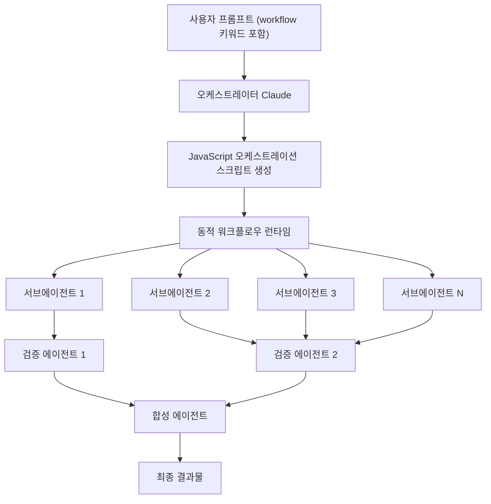

워크플로우의 구조적 핵심은 세 가지다. 첫째, 작업 계획이 대화 컨텍스트가 아닌 실행 가능한 스크립트로 외재화된다. 둘째, 각 서브에이전트는 독립된 좁은 컨텍스트에서 작동하므로 노이즈 없이 자신의 역할에 집중할 수 있다. 셋째, 결과물은 사용자에게 전달되기 전에 독립적인 에이전트들에 의해 교차 검증된다.

---

## 3. 왜 단일 에이전트만으로는 부족한가

대형 소프트웨어 작업에서 단일 에이전트는 표면적으로 충분해 보일 수 있다. 그러나 실제 장기(long-horizon) 작업에서는 예측 가능한 세 가지 실패 패턴이 반복적으로 등장한다.

**첫 번째 위험: 에이전틱 게으름(Agentic Laziness)**  
모델이 대규모 작업의 일부만 처리하고도 전체를 완료한 것처럼 동작하는 현상이다. 컨텍스트가 길어질수록, 또 작업의 복잡도가 높아질수록 이 경향은 강해진다. 모델은 진행 상황을 과대평가하고, 남은 엣지 케이스를 무시하거나, 부분 결과를 최종 결과로 제시하는 경향이 있다.

**두 번째 위험: 자기 선호 편향(Self-Preferential Bias)**  
모델은 자신이 생성한 솔루션을 지나치게 호의적으로 평가하는 경향이 있다. 이는 코드 리뷰, 보안 감사, 기술 보고서 검증 등 정확도가 결정적인 영역에서 특히 위험하다. 동일한 모델이 생성과 검증을 모두 담당할 때, 자신의 실수를 발견하는 능력은 현저히 저하된다.

**세 번째 위험: 목표 표류(Goal Drift)**  
장기 작업을 진행하는 동안 원래 목표가 서서히 변형되거나, 중요한 제약 조건들이 주의에서 사라지는 현상이다. 컨텍스트 윈도우가 관련 없는 중간 세부사항들로 채워지면서, 핵심 목표를 추적하기가 점점 어려워진다.

Dynamic Workflows는 작업을 전문화된 역할들로 분리함으로써 이 세 가지 위험을 모두 완화한다. 생성 담당 에이전트와 검증 담당 에이전트를 분리하고, 거짓 긍정(false positive)을 찾는 에이전트를 별도로 두며, 최종 합성 에이전트가 모든 결과를 읽기 쉬운 보고서로 통합한다. 각 에이전트는 자신의 좁은 역할에서만 작동하므로, 전체적인 맥락 오염 없이 깊이 있는 분석이 가능하다.

---

## 4. 핵심 작동 원리

Dynamic Workflows가 시작되면 다음과 같은 과정이 순서대로 진행된다.

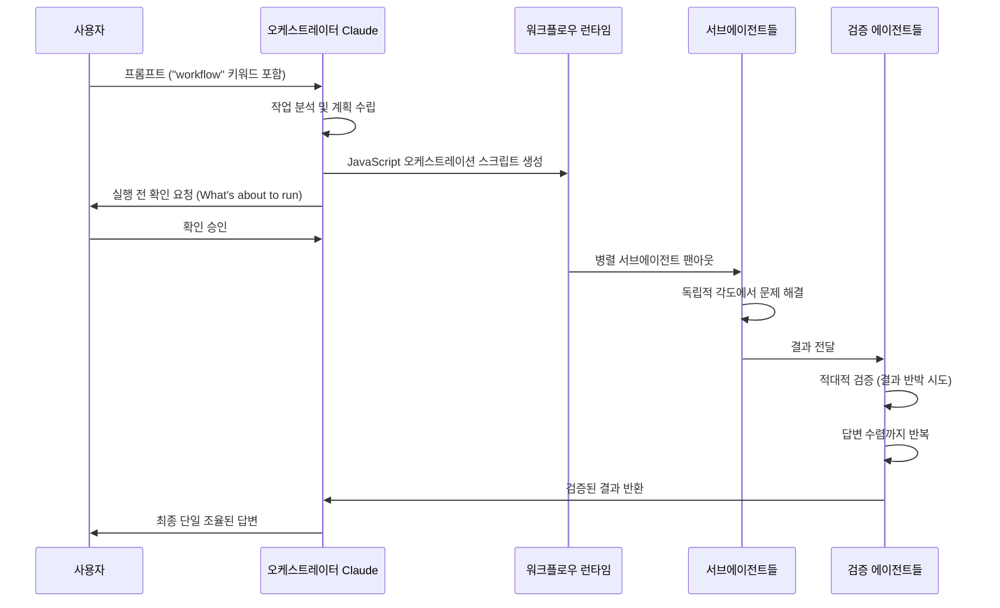

**per-agent 격리(Per-Agent Isolation)** 는 이 구조의 가장 중요한 특성이다. 각 에이전트는 공유된 하나의 혼잡한 대화를 쓰는 대신, 자신만의 좁은 컨텍스트에서 독립적으로 작동한다. 예를 들어 프로젝트 전반의 인증·권한 검토를 수행한다면, 한 에이전트는 모든 엔드포인트를 추출하고, 또 다른 에이전트는 인증 체크가 존재하는지 검사하며, 세 번째 에이전트는 입력 유효성 검증에 집중하고, 네 번째 에이전트는 위험한 발견 사항을 검증하며, 마지막 에이전트는 거짓 긍정을 제거하고 최종 보고서를 작성한다.

진행 상황은 실행 중에 지속적으로 저장된다. 따라서 장기 실행 작업이 중단되더라도 처음부터 다시 시작할 필요 없이 중단된 지점부터 재개할 수 있다. 수 시간 또는 수 일에 걸쳐 실행될 수 있는 복잡한 엔지니어링 작업에서 이는 실질적인 안정성을 제공한다.

오케스트레이션이 대화 외부에서 이루어지므로, 작업이 아무리 커져도 계획은 궤도를 벗어나지 않는다. 에이전트들은 서로의 결과를 독립적인 각도에서 검토하고, 다른 에이전트들은 그 발견 사항을 반박하려 시도하며, 이 과정이 답변이 수렴할 때까지 반복된다. 이것이 단일 패스로는 도달할 수 없는 결과에 워크플로우가 도달하는 방식이다.

---

## 5. 기술 사양 및 제약 조건

Dynamic Workflows는 강력하지만 명확한 기술적 한계 내에서 작동한다. 이를 이해하는 것은 올바른 활용의 전제 조건이다.

**에이전트 수 제한**  
런타임은 하드 제한을 적용한다. 동시 실행 에이전트는 최대 16개이며, 단일 실행에서 총 에이전트 수는 최대 1,000개다. 이 숫자는 상당한 병렬성을 허용하지만, 무한 확장은 불가능하다.

**워크플로우 스크립트의 역할 제한**  
워크플로우 스크립트 자체는 파일시스템이나 셸에 직접 접근할 수 없다. 파일 읽기, 쓰기, 명령어 실행은 오직 서브에이전트들만이 수행할 수 있다. 이는 보안적 설계 결정으로, 오케스트레이션 레이어와 실행 레이어를 명확히 분리한다.

**비용 구조**  
Dynamic Workflows는 일반적인 Claude Code 세션보다 훨씬 많은 토큰을 소비한다. 병렬 에이전트와 다중 품질 검토 패스가 포함된 워크플로우는 일반적인 3-라운드 세션보다 훨씬 많은 토큰과 턴을 사용할 수 있다. 실제 워크플로우 실행의 최소 비용 기준은 상당하므로, 이를 감안한 예산 계획이 필요하다.

**필요 조건**  
Claude Code v2.1.154 이상 버전이 필요하다. 이용 가능한 플랜은 Pro/Max/Team/Enterprise/API이며, Amazon Bedrock, Vertex AI, Microsoft Foundry를 통해서도 접근 가능하다. Enterprise 플랜은 관리자가 Claude Code 설정에서 명시적으로 활성화해야 한다.

**워크플로우 실행 전 확인**  
워크플로우가 처음 트리거될 때, Claude Code는 실행될 내용을 보여주고 사용자에게 확인을 요청한다. 조직 관리자는 관리형 설정을 통해 워크플로우를 선택적으로 비활성화할 수도 있다.

---

## 6. 활성화 방법과 ultracode 설정

Dynamic Workflows를 시작하는 방법은 크게 두 가지다.

**방법 1: 프롬프트에 "workflow" 키워드 포함**  
가장 단순한 방법이다. 프롬프트 어딘가에 "workflow"라는 단어를 포함하면 Claude는 자동으로 동적 오케스트레이션 계획을 수립한다. 예를 들어 "Run a workflow to audit every API endpoint under src/routes/ for missing auth checks"와 같이 작성하면 된다.

**방법 2: ultracode 설정 활성화**  
`/effort` 메뉴에서 `ultracode`를 선택하는 방법이다. ultracode는 독립적으로 이해해야 할 개념이다.

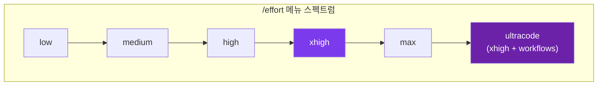

ultracode는 두 가지 요소의 결합이다. `effort="xhigh"`는 Claude Opus 4.8의 추론 깊이를 최고 수준으로 설정하며, 이는 수백만 개의 토큰 예산으로 30분 이상 지속되는 실행에 최적화되어 있다. 여기에 자동 워크플로우 오케스트레이션이 추가된다. ultracode가 켜져 있으면, Claude는 자신이 스스로 판단하여 태스크가 충분히 복잡할 때 동적 워크플로우를 자율적으로 실행하기로 결정한다.

중요한 구별: `effort="xhigh"`만으로는 동적 워크플로우가 트리거되지 않는다. xhigh는 추론 깊이만을 제어하며, 워크플로우 오케스트레이션을 활성화하지는 않는다. ultracode는 xhigh 추론 + 자동 워크플로우 결정권이다. 이 둘은 독립적인 개념이다.

또한 Anthropic은 `/deep-research`를 내장 워크플로우로 제공한다. 이는 단순한 검색 도구가 아니라, 여러 각도에서 검색을 팬아웃하고, 출처들을 교차 검증하며, 각 주장에 대해 내부 투표를 진행하고, 적대적 검토를 통과한 주장만 포함한 인용된 연구 보고서를 생성하는 워크플로우다.

```
# 워크플로우 활성화 방법 요약

# 1. 키워드로 명시적 트리거
"Run a workflow to audit every API endpoint under src/routes/ for missing auth checks"

# 2. ultracode 설정으로 자동 트리거
/effort ultracode

# 3. 내장 리서치 워크플로우 사용
/deep-research "What changed in the Node.js permission model between v20 and v22?"
```

---

## 7. 6가지 핵심 워크플로우 패턴

Dynamic Workflows를 실용적으로 이해하는 최선의 방법은 여섯 가지 반복 가능한 패턴을 통해서다. 이 패턴들은 Claude Code를 코딩 어시스턴트에서 다양한 종류의 작업 프로세스를 설계하고 실행할 수 있는 시스템으로 변환시킨다.

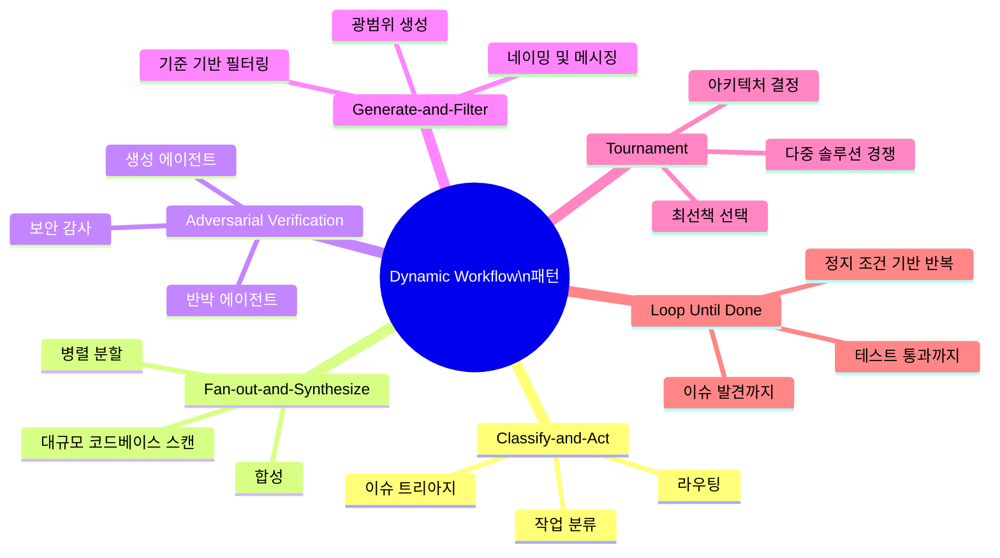

### 7.1 Classify-and-Act (분류 후 행동)

이 패턴에서는 첫 번째 에이전트가 들어오는 태스크를 먼저 분류한다. 그 분류 결과를 바탕으로 워크플로우는 다음에 취해야 할 올바른 행동을 선택하거나, 적합한 전문가 에이전트로 작업을 라우팅한다. 예를 들어 버그 리포트는 프론트엔드, 백엔드, 보안, 성능 문제로 분류된 후, 워크플로우는 각 범주에 맞는 전문 에이전트로 작업을 전달한다. 이슈 트리아지, 로그 분석, 지원 라우팅 워크플로우에 가장 적합하다.

### 7.2 Fan-out-and-Synthesize (분산 후 합성)

대규모 작업을 많은 작은 조각으로 분할하고, 각 조각을 별도의 에이전트가 처리한 후, 합성 단계에서 모든 결과를 하나의 일관된 결과물로 통합한다. 리포지토리 전반의 스캔과 대규모 코드베이스 분석에 가장 유용한 패턴이다. 예를 들어 전체 서비스에서 사용 중단된 API 사용 현황을 스캔할 때, 수십 개의 에이전트가 서로 다른 디렉토리를 동시에 검사하고, 마지막 에이전트가 발견 사항을 종합하여 전체 보고서를 생성한다.

### 7.3 Adversarial Verification (적대적 검증)

단순히 답을 생성하는 것이 목표가 아니라, 그 답에 도전하는 것이 목표다. 한 에이전트가 솔루션을 생성하면, 또 다른 에이전트가 결함, 누락된 증거, 위험한 가정을 찾으려 시도한다. 보안, 금융, 릴리스 검증, 기술 보고서 리뷰처럼 오답의 비용이 높은 영역에서 특히 가치 있다. 이 패턴은 "악마의 대변인(devil's advocate)" 역할을 시스템 차원에서 강제한다.

### 7.4 Generate-and-Filter (생성 후 필터링)

워크플로우는 먼저 광범위한 옵션 풀을 생성하고, 그 다음 명시적인 기준에 따라 필터링한다. 네이밍, 제품 메시징, CLI 설계, 제목 생성, 그리고 수량이 먼저 필요하고 그 다음 품질 관리가 필요한 모든 창의적 작업에 유용하다. 수십 개의 후보를 만든 후, 브랜드 가이드라인, 대상 독자, 기술적 명확성 등의 기준을 통과한 것만 추려내는 방식이다.

### 7.5 Tournament (토너먼트)

여러 에이전트가 동일한 문제를 서로 다른 방식으로 해결하고, 그 솔루션들을 비교하여 가장 강력한 접근법을 선택한다. 명확하게 우월한 단 하나의 답이 없는 경우, 예를 들어 아키텍처 결정, UI 트레이드오프, 리팩토링 계획에 유용하다. 단일 에이전트가 제시하는 첫 번째 솔루션이 최선이 아닐 수 있다는 인식에서 출발한다.

### 7.6 Loop Until Done (완료까지 반복)

일부 작업은 미리 알려진 단계 수가 없다. 이 패턴은 정지 조건이 충족될 때까지 계속 실행한다. 테스트가 통과될 때, 새로운 이슈가 발견되지 않을 때, 또는 품질 임계값이 충족될 때 실행을 멈춘다. 빌드가 통과할 때까지 수정을 반복하거나, 새로운 보안 이슈가 발견되지 않을 때까지 스캔을 계속하는 작업에 이상적이다.

---

## 8. JavaScript 오케스트레이션 API: agent, parallel, pipeline

Dynamic Workflows의 기술적 심장은 세 가지 핵심 API 함수로 이루어진 JavaScript 오케스트레이션 런타임이다.

### 8.1 `agent()` 함수: 단일 에이전트 실행

```javascript
agent(prompt, opts?): Promise<string | JsonSchema>
```

`agent()`는 워크플로우의 기본 구성 요소다. 단일 서브에이전트를 실행하고 그 결과를 반환한다.

```javascript
const bugs = await agent(
  "audit auth.ts",
  {
    schema: BugList,       // JSON Schema → 검증된 JSON 출력
    model: "haiku",        // opus/sonnet/haiku 선택. 생략 시 상속
    isolation: "worktree", // "worktree"(자체 체크아웃) 또는 "remote"
    agentType: "reviewer", // custom/built-in 서브에이전트 지정
  }
);
```

`schema` 파라미터는 에이전트의 출력을 JSON Schema에 따라 구조화된 JSON으로 변환한다. `model` 파라미터는 이 특정 에이전트에 사용할 모델을 지정한다(opus는 가장 강력하지만 비용이 높고, haiku는 빠르고 저렴하다). `isolation` 파라미터는 에이전트가 자체 작업 트리를 가질지, 아니면 원격으로 실행될지를 결정한다. `agentType`은 커스텀 또는 내장 서브에이전트 유형을 지정한다.

### 8.2 `parallel()` 함수: 병렬 실행

```javascript
parallel([ fns ])
```

`parallel()`은 여러 에이전트를 한 번에 실행하고, 모두 완료될 때까지 기다린다(Barrier). Fan-out-and-Synthesize 패턴의 핵심 구현체다.

```javascript
const all = await parallel(
  files.map(f => () => agent(f))
);
```

이 코드는 파일 목록에서 각 파일을 처리하는 에이전트를 생성하고, 모든 에이전트를 동시에 실행한 후, 모두 완료될 때 결과를 배열로 반환한다. 수십 개의 파일을 순차적으로 처리하는 대신 모두 동시에 처리함으로써 실행 시간을 극적으로 단축한다.

### 8.3 `pipeline()` 함수: 파이프라인 실행

```javascript
pipeline(items, ...)
```

`pipeline()`은 각 아이템이 모든 단계를 순서대로 통과하게 한다. `parallel()`과 달리 배리어(Barrier)가 없다. 각 아이템은 독립적으로 파이프라인을 통해 스트리밍된다.

```javascript
await pipeline(
  items,
  x => agent(draft(x)),
  d => agent(check(d))
);
```

이 코드는 각 아이템을 먼저 draft 에이전트를 통해 처리하고, 그 결과를 check 에이전트를 통해 검증한다. 아이템들은 배리어 없이 독립적으로 파이프라인을 흐르므로, 처음 아이템이 완료되는 즉시 다음 작업을 시작할 수 있다.

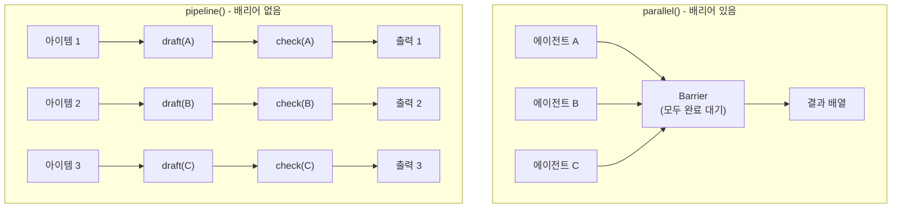

이 세 함수의 조합이 워크플로우 설계의 핵심이다. `agent()`는 개별 작업 단위이고, `parallel()`은 수평적 확장을 담당하며, `pipeline()`은 단계적 처리를 담당한다. 복잡한 작업은 이 세 함수를 중첩하고 조합하여 구성된다.

---

## 9. Skill 폴더와 워크플로우 재사용

Dynamic Workflows의 또 다른 중요한 측면은 성공적인 워크플로우 패턴을 재사용 가능한 Skill로 패키징하는 기능이다.

```
~/.claude/skills/deep-verify/
├── SKILL.md                    ← 워크플로우 설명 및 실행 방법
├── verify-claims.workflow.js   ← 실제 워크플로우 스크립트
└── rubric.md                   ← 평가 기준
```

`SKILL.md` 파일은 워크플로우의 이름, 설명, 그리고 실행 방법을 참조한다.

```markdown
---
name: deep-verify
description: Verify every claim in a report
---

## Workflow

Run ./verify-claims.workflow.js to check
each claim with its own subagent.
```

이 구조의 장점은 공유 가능성이다. 이 폴더를 공유하면, 해당 Skill을 설치한 누구나 동일한 워크플로우를 실행할 수 있다. 팀이 특정 종류의 검증, 마이그레이션, 또는 감사를 위한 검증된 워크플로우를 개발했다면, 그것을 하나의 폴더로 패키징하여 조직 전체에 배포할 수 있다.

이것은 "코드 재사용"과 유사하지만 AI 프로세스에 적용된 개념이다. 한 번 잘 동작하는 워크플로우를 발견하면, 그 패턴을 저장하고 표준화하여 반복 적용할 수 있다. 개인 워크플로우 라이브러리를 구축하는 것이 가능해지는 것이다.

---

## 10. Static Harness vs Dynamic Workflow: 두 접근법의 비교

"우리 체크아웃 서비스를 새로운 공급자로 이전해야 할까?"라는 동일한 질문에 대해 두 접근법이 어떻게 다르게 작동하는지 살펴보면 차이가 명확해진다.

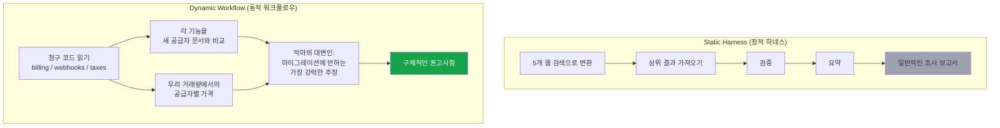

Static Harness 방식은 고정된 단계 시퀀스를 따른다. 외부 웹 검색 결과에 의존하여 일반적인 보고서를 생성하며, 실제 코드베이스나 비즈니스 맥락과 단절되어 있다. 결과물은 어느 회사에나 적용될 수 있는 일반적인 내용에 그친다.

Dynamic Workflow 방식은 먼저 실제 청구 코드(billing, webhooks, taxes 파일)를 읽는다. 그 다음 각 기능을 새로운 공급자의 실제 문서와 비교하고, 우리의 실제 거래량을 기준으로 비용을 계산한다. 그리고 "악마의 대변인" 에이전트가 이전에 반대하는 가장 강력한 주장을 의도적으로 구성한다. 결과물은 우리 코드베이스, 우리 거래 패턴, 실제 공급자 기능에 기반한 구체적인 권고사항이다.

---

## 11. 워크플로우가 빛나는 10가지 작업 유형

Anthropic은 하나의 컨텍스트 윈도우로는 확장되지 않고 워크플로우가 필요한 10가지 작업 유형을 명확히 정의한다.

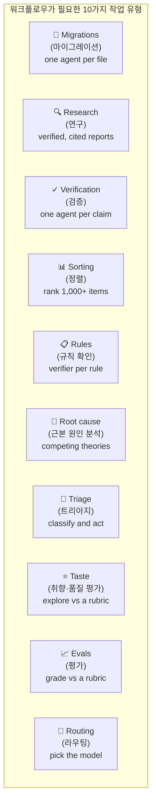

**Migrations (마이그레이션)**: 프레임워크 교체, API 사용 중단, 언어 포팅 등 수천 개의 파일에 걸쳐 있는 대규모 이전 작업. "파일당 하나의 에이전트" 패턴으로, 각 에이전트가 자신의 파일에만 집중한다.

**Research (연구)**: 단순한 검색이 아닌 검증되고 인용된 보고서가 필요한 연구. 여러 출처를 교차 검증하고, 각 주장을 독립적인 에이전트가 확인하며, 사실로 확인된 내용만 최종 보고서에 포함된다.

**Verification (검증)**: "주장당 하나의 에이전트" 방식으로, 각 클레임을 독립적으로 검증한다. 보안 감사, 마이그레이션 위험 검사, 중요한 릴리스 검증에 활용된다.

**Sorting (정렬)**: 1,000개 이상의 항목을 루브릭이나 기준에 따라 순위화해야 할 때. 단일 에이전트로는 컨텍스트 한계에 걸리는 규모의 작업을 병렬로 처리한다.

**Rules (규칙 확인)**: "규칙당 하나의 검증 에이전트" 패턴. 코드베이스가 수백 가지 스타일, 보안, 또는 비즈니스 규칙을 준수하는지 체계적으로 확인한다.

**Root cause (근본 원인 분석)**: 여러 경쟁 이론을 동시에 탐색한다. 한 에이전트는 성능 문제를 조사하고, 또 다른 에이전트는 메모리 누수를 추적하며, 세 번째 에이전트는 외부 의존성을 검사한다.

**Triage (트리아지)**: 들어오는 이슈, 버그 리포트, 지원 요청을 분류하고 적절한 경로로 라우팅한다. Classify-and-Act 패턴의 전형적인 적용 사례다.

**Taste (취향·품질 평가)**: 루브릭에 따라 여러 옵션을 탐색하고 평가한다. 제품 이름, CLI 명령어, 마케팅 문구 등 주관적 품질 판단이 필요한 작업에 활용된다.

**Evals (평가)**: 루브릭에 따라 출력물을 채점한다. AI 출력의 품질 평가, 코드 품질 측정, 문서의 완성도 검사 등에 활용된다.

**Routing (라우팅)**: 어떤 모델이나 에이전트 유형을 사용할지 결정한다. 작업의 특성에 따라 opus(복잡한 추론), sonnet(균형), haiku(빠르고 저렴) 중에서 적절한 것을 선택한다.

---

## 12. 실전 사례: Bun의 Zig → Rust 포팅

Dynamic Workflows의 실제 능력을 가장 극적으로 보여주는 사례는 Bun의 Zig에서 Rust로의 포팅 프로젝트다.

**배경**: Bun은 Claude Code 자체를 수백만 명의 사용자에게 배포하는 JavaScript 런타임이다. Bun의 창시자 Jarred Sumner는 기존 Zig 코드베이스를 Rust로 이전해야 했다. 단순한 재작성이 아니었다. 파일 단위로 충실하게 포팅해야 했으며, 기존 테스트 스위트 전체가 통과해야 했다. 과거라면 분기(quarter) 단위로 계획하고 팀 전체가 달려들어야 했던 작업이었다.

**결과**: 약 75만 줄의 Rust 코드가 생성되었고, 기존 테스트 스위트의 99.8%가 통과했다. 첫 커밋에서 머지까지 11일이 걸렸다. (참고: 이 작업은 아직 프로덕션에 배포되지 않았으며, Jarred Sumner가 향후 이 경험에 대해 상세히 기술할 예정이다.)

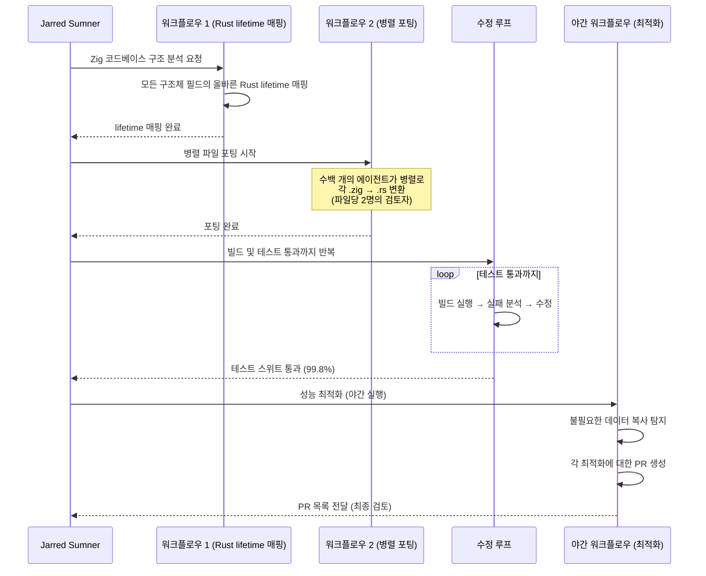

이 프로젝트는 Dynamic Workflows의 잠재력을 명확하게 보여준다. 한 번에 하나의 에이전트로 이 작업을 처리했다면, 컨텍스트 제한, 목표 표류, 자기 검증의 편향 등 여러 문제에 부딪혔을 것이다. 병렬 서브에이전트들이 독립적으로 작업하고, 파일당 두 명의 검토자가 있으며, 테스트가 통과할 때까지 루프를 계속 실행하는 구조가 이 규모의 작업을 가능하게 했다.

---

## 13. 기업 도입 사례

Dynamic Workflows는 출시 초기부터 실제 기업들에서 의미 있는 결과를 만들어내고 있다.

**Klarna (핀테크 기업)**  
Alessio Vallero(시니어 엔지니어링 매니저)는 다음과 같이 언급했다: "Dynamic Workflows는 특히 대규모 코드베이스에서의 발견 및 검토 작업에서 매우 가치 있는 것으로 증명되었습니다. 기존의 정적 분석이 놓쳤던 데드 코드를 식별하고 정리 기회를 발견하는 데 강력한 결과를 확인했으며, 엔지니어들이 유지보수 및 리팩토링 작업에서 더 빠르게 움직이는 데 도움이 됩니다." 정적 분석 도구가 탐지하지 못했던 코드 품질 문제를 Dynamic Workflows가 발견한 것은 의미 있는 결과다.

**CyberAgent (일본 인터넷 서비스 기업)**  
Ken Takao(수석 시스템 엔지니어)는 이렇게 설명했다: "Dynamic Workflows는 단일 서브에이전트를 실행하는 것과 완전한 에이전트 팀을 구축하는 것 사이의 간격을 채워줍니다. 계획에서 구현까지의 흐름이 자연스러워져, 더 긴 실행을 가시성을 잃지 않고 신뢰할 수 있게 되었습니다." 이는 이전에 수동으로 조립하던 워크플로우를 공식화한다는 커뮤니티의 반응과도 일치한다.

---

## 14. Dynamic Workflow를 위한 프롬프트 작성법 13단계


효과적인 Dynamic Workflow 프롬프트를 작성하기 위한 단계별 체크리스트다. Anthropic은 이를 통해 멀티 에이전트 워크플로우가 명확한 태스크 프레이밍, 강력한 역할 설계, 신뢰할 수 있는 검증을 통해 성공한다고 강조한다.

```mermaid
flowchart TD
    S1["1️⃣ 한 문장으로 작업 명확히 설명\n'analyze a small set of documents and produce a concise summary report'"]
    S2["2️⃣ 단일 에이전트에게 어려운 이유 설명\n'multi-step analysis, different types of expertise, and verification required'"]
    S3["3️⃣ 동적 워크플로우 생성 명시적 요청\n'Create a dynamic multi-agent workflow for this task'"]
    S4["4️⃣ 작업을 서브태스크로 분할하는 방법 정의\n'Break the task into clear subtasks and order them logically'"]
    S5["5️⃣ 각 에이전트에게 명확한 역할 부여\n'researcher, analyst, writer' 등 명확한 역할 지정"]
    S6["6️⃣ 각 에이전트에게 명확한 출력 형식 부여\n'markdown table, JSON, or bullet list'"]
    S7["7️⃣ 검증 에이전트 추가\n'Add a verifier agent to review all outputs for accuracy'"]
    S8["8️⃣ 고위험 결과에 대한 적대적 검토 요청\n'include an adversarial reviewer to challenge the conclusions'"]
    S9["9️⃣ 토큰·폴더·범위 제한 설정\n'Use at most 4,000 tokens and only analyze files in the specified folder'"]
    S10["🔟 작은 폴더나 좁은 범위로 시작\n'Start with the contents of a small sample folder before expanding'"]
    S11["1️⃣1️⃣ 마지막에 합성 단계 요청\n'End with a synthesis step that merges the outputs into one final report'"]
    S12["1️⃣2️⃣ 불확실한 결과 별도 표시\n'List uncertain findings under a clearly labeled UNCERTAIN section'"]
    S13["1️⃣3️⃣ 잘 작동하는 워크플로우 저장\n'If this workflow performs well, save it as a reusable template'"]
    
    S1 --> S2 --> S3 --> S4 --> S5 --> S6 --> S7 --> S8 --> S9 --> S10 --> S11 --> S12 --> S13
```

이 13단계를 실제 프롬프트에 적용하면 다음과 같은 구체적인 예시가 된다.

```
이 프로젝트의 인증 및 권한 이슈에 대한 동적 워크플로우를 생성해줘.

작업을 다음과 같이 분할해줘:
1. 모든 엔드포인트를 추출한다.
2. 각 엔드포인트에 인증 보호가 있는지 확인한다.
3. 누락된 입력 유효성 검증을 찾는다.
4. 위험한 발견 사항을 별도의 검증 에이전트로 전달한다.
5. 거짓 긍정(false positive)을 제거한다.
6. 심각도, 파일 경로, 증거, 제안된 수정 사항과 함께 최종 결과를 보고한다.

첫 번째 패스는 backend/src 로 제한하고, 출력은 짧고 증거 기반으로, 토큰 효율적으로 유지해줘.
```

이 프롬프트는 단순히 "프로젝트를 확인해줘"라고 묻는 것과 근본적으로 다르다. 작업이 어떻게 분할되고, 어떻게 검증되며, 어떻게 필터링되고, 어떻게 보고될지를 구체적으로 명시한다.

---

## 15. 비용과 토큰 소비 고려사항

Dynamic Workflows는 강력하지만, 그 강력함에는 비용이 따른다. 이를 이해하고 관리하는 것이 현명한 활용의 핵심이다.

**토큰 소비 규모**  
Dynamic Workflows는 일반적인 Claude Code 세션보다 의미 있게 더 많은 사용량을 소비한다. 병렬 에이전트들과 다중 품질 검토 패스가 포함된 워크플로우는 3-라운드의 일반 세션보다 훨씬 많은 턴과 토큰을 사용할 수 있다.

**비용 관리 전략**

첫째, 항상 좁은 범위(narrow scope)로 시작한다. 전체 리포지토리를 스캔하기 전에 작은 샘플 폴더로 먼저 테스트하여 예상 비용을 파악한다.

둘째, 에이전트 모델을 신중하게 선택한다. 모든 서브에이전트가 Opus를 사용할 필요는 없다. 단순한 텍스트 추출이나 패턴 매칭 작업에는 Haiku를 사용하고, 복잡한 추론이 필요한 검증 단계에만 Opus를 활용하는 전략이 비용을 크게 절감한다.

셋째, 범위 제한을 명시적으로 설정한다. "at most 4,000 tokens", "only analyze files in the specified folder" 등의 제한을 프롬프트에 명시하면 워크플로우가 비용 효율적으로 작동한다.

넷째, 성공적인 워크플로우 패턴을 저장하고 재사용한다. 한 번 좋은 워크플로우를 발견했다면, Skill 폴더로 저장하여 매번 새로 설계하는 대신 재사용한다.

다섯째, Dynamic Workflows를 모든 작업에 기본적으로 켜는 "마법의 모드"로 취급하지 않는다. 소규모 함수 작성, 단일 파일 편집, 에러 메시지 설명 같은 작업은 여전히 일반적인 Claude Code 세션이 더 빠르고 저렴하다.

**ultracode 사용 시 주의사항**  
ultracode를 활성화하면 Claude가 자율적으로 워크플로우 사용을 결정한다. 이는 편리하지만, 예상치 못한 비용 증가로 이어질 수 있다. 비용에 민감한 경우에는 ultracode 대신 프롬프트의 "workflow" 키워드를 통해 명시적으로 제어하는 것이 낫다.

---

## 16. 언제 Dynamic Workflow를 써야 하고, 언제 쓰지 말아야 하는가

모든 도구는 적절한 사용 맥락이 있다. Dynamic Workflows 역시 만능이 아니며, 올바른 상황 판단이 효과적인 활용의 전제 조건이다.

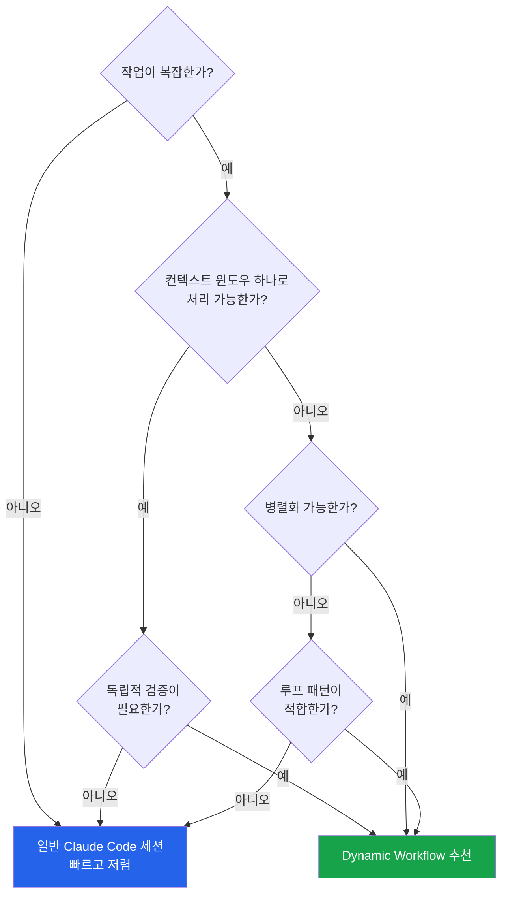

**Dynamic Workflow가 적합한 경우**:

리포지토리 전반의 스캔(전체 코드베이스에서 특정 패턴, 보안 이슈, 성능 문제 탐색)이 전형적인 사례다. 다중 파일 리팩토링, 프레임워크 마이그레이션, 언어 포팅처럼 수백 개의 파일을 건드리는 작업도 마찬가지다. 보안 검토, 릴리스 검증처럼 독립적 검증이 필수적인 작업, 반복 테스트 수정처럼 정지 조건이 필요한 작업, 그리고 연구 합성 및 기술 보고서 검증도 Dynamic Workflows가 빛을 발하는 영역이다.

다음 조건 중 하나라도 해당되면 Dynamic Workflow를 고려할 시점이다: 작업이 하나의 컨텍스트 윈도우를 초과하는 경우, 독립적인 검증이 필요한 경우, 자연스럽게 병렬 서브태스크로 분할될 수 있는 경우.

**Dynamic Workflow가 불필요한 경우**:

소규모 함수 작성, 단일 파일 편집, 에러 메시지 설명처럼 명확하고 작은 작업에는 일반 세션이 더 빠르고 저렴하다. 빠른 답변이 필요한 질문, 한 파일 수정, 개념 설명 등에는 워크플로우의 오버헤드가 아무런 가치를 더하지 않는다. 무분별하게 사용하면 토큰 비용만 늘리고 단순한 작업을 불필요하게 복잡하게 만들 뿐이다.

---

## 17. AI 시대 개발자 역할의 변화

Dynamic Workflows가 제시하는 가장 심층적인 함의는 기술적인 것이 아니라 직업적인 것이다. 이 기능은 AI 활용의 패러다임을 답변 생성에서 프로세스 설계로 이동시킨다.

기존 패러다임의 프롬프트는 "이 버그를 수정해줘"처럼 작성된다. 새로운 패러다임의 프롬프트는 "이 모듈을 검사하는 워크플로우를 사용해서 인증 이슈를 찾고, 엔드포인트를 에이전트별로 분할하며, 발견 사항을 검증하고, 증거에 기반한 결과만 보고해줘"처럼 작성된다.

이 두 프롬프트는 근본적으로 다르다. 첫 번째는 출력을 요청한다. 두 번째는 출력을 생성하고, 검증하고, 합성하는 프로세스를 요청한다.

이것은 소프트웨어 개발에서 숙련된 개발자의 역할이 변화하고 있음을 시사한다. 미래의 핵심 역량은 다음과 같이 이동하고 있다.

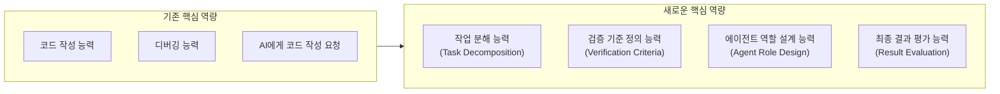

코드를 작성하는 능력보다, 복잡한 작업을 어떻게 분해할지 아는 능력이 중요해진다. 디버깅 능력보다, 어떤 검증 기준이 필요한지 정의하는 능력이 중요해진다. AI에게 코드를 요청하는 능력보다, 에이전트 역할을 설계하고 최종 결과를 평가하는 능력이 핵심이 된다.

Anthropic이 이 기능의 핵심 교훈으로 제시하는 메시지는 간결하다: "AI 시대의 이점은 가장 긴 프롬프트를 작성하는 사람이 아니라, AI가 올바른 프로세스를 실행하도록 가르치는 사람에게 돌아간다."

---

## 마무리: 요약 및 핵심 정리

Claude Code Dynamic Workflows는 2026년 5월 28일에 Research Preview로 출시된 멀티 에이전트 오케스트레이션 기능이다. 단일 에이전트의 한계를 극복하기 위해 수십~수백 개의 병렬 서브에이전트를 동적으로 생성하고 실행하며, 결과를 사용자에게 전달하기 전에 독립적으로 검증한다.

핵심 작동 원리는 세 가지다. 프롬프트의 "workflow" 키워드나 ultracode 설정이 오케스트레이션 스크립트 생성을 트리거하고, 런타임이 최대 16개 동시 에이전트(총 최대 1,000개)를 팬아웃하여 실행하며, 결과는 적대적 검증 후 단일 조율된 답변으로 합성된다.

6가지 핵심 패턴(Classify-and-Act, Fan-out-and-Synthesize, Adversarial Verification, Generate-and-Filter, Tournament, Loop Until Done)과 3개의 JavaScript API(`agent()`, `parallel()`, `pipeline()`)가 이 기능의 기술적 토대를 구성한다.

Bun의 Zig→Rust 포팅 사례(75만 줄, 11일, 테스트 스위트 99.8% 통과)는 이 기능이 실제로 어떤 규모의 작업을 가능하게 하는지 구체적으로 보여준다.

Dynamic Workflows는 모든 작업에 적합한 것이 아니며, 대규모 리포지토리 스캔, 다중 파일 마이그레이션, 독립적 검증이 필요한 중요 작업, 병렬화 가능한 반복 작업에서 가장 큰 가치를 발휘한다.

궁극적으로, 이 기능이 제안하는 것은 코딩 어시스턴트를 넘어 작업 설계 도구로서의 AI 활용이다. 더 긴 프롬프트가 아니라 더 나은 프로세스 설계가 AI 시대의 핵심 역량이 될 것이다.

---

*작성일: 2026-06-06*  
*참고 출처: Anthropic 공식 블로그 (claude.com/blog/introducing-dynamic-workflows-in-claude-code), Claude Opus 4.8 출시 공지 (anthropic.com/news/claude-opus-4-8), InfoQ 기술 분석, MarkTechPost, Reworked, 관련 기술 커뮤니티 분석 자료*
