> **출처**: Anthropic 공식 블로그 ["A harness for every task: dynamic workflows in Claude Code"](https://claude.com/blog/a-harness-for-every-task-dynamic-workflows-in-claude-code) (2026년 6월 2일, 작성자: Thariq Shihipar, Sid Bidasaria) 및 YouTube 영상 ["The 6 Best Patterns for Claude Code Dynamic Workflows"](https://www.youtube.com/watch?v=g9b9G8dcS8Y) (2026년 6월 4일, Mark Kashef) 기반  
> **작성 일자**: 2026-06-06

---

## 목차

1. [들어가며: 이 영상/문서가 다루는 것](#1-들어가며)
2. [핵심 개념: 하네스(Harness)와 워크플로우(Workflow)](#2-핵심-개념)
3. [단일 컨텍스트 창의 세 가지 실패 유형](#3-단일-컨텍스트-창의-세-가지-실패-유형)
4. [다이내믹 워크플로우가 문제를 해결하는 방식](#4-다이내믹-워크플로우가-문제를-해결하는-방식)
5. [패턴 1: Classify and Act (분류 후 실행)](#5-패턴-1-classify-and-act)
6. [패턴 2: Fan Out and Synthesize (분산 후 종합)](#6-패턴-2-fan-out-and-synthesize)
7. [패턴 3: Adversarial Verification (적대적 검증)](#7-패턴-3-adversarial-verification)
8. [패턴 4: Generate and Filter (생성 후 필터링)](#8-패턴-4-generate-and-filter)
9. [패턴 5: Tournament (토너먼트)](#9-패턴-5-tournament)
10. [패턴 6: Loop Until Done (완료될 때까지 반복)](#10-패턴-6-loop-until-done)
11. [패턴 스태킹: 패턴을 조합하면 진짜 위력이 나온다](#11-패턴-스태킹)
12. [워크플로우 저장, 공유, 스킬화](#12-워크플로우-저장-공유-스킬화)
13. [토큰 예산과 비용 관리](#13-토큰-예산과-비용-관리)
14. [다이내믹 워크플로우를 사용하면 안 되는 경우](#14-다이내믹-워크플로우를-사용하면-안-되는-경우)
15. [실용적인 프롬프트 참고 모음](#15-실용적인-프롬프트-참고-모음)

**별첨**
- [별첨 A: 다이내믹 워크플로우는 또 다른 형태의 하네스인가? — Claude Code 오케스트레이션 전체 지형도](#별첨-a-다이내믹-워크플로우는-또-다른-형태의-하네스인가--Claude-Code-오케스트레이션-전체-지형도)
- [별첨 B: 서브에이전트 vs 에이전트 팀 vs 다이내믹 워크플로우 — 다이내믹 워크플로우 중심 비교](#별첨-b-서브에이전트-vs-에이전트-팀-vs-다이내믹-워크플로우--다이내믹-워크플로우-중심-비교)

---

## 1. 들어가며

2026년 6월 2일, Anthropic의 엔지니어 Thariq Shihipar와 Sid Bidasaria는 공식 블로그에 "A harness for every task: dynamic workflows in Claude Code"라는 제목의 글을 발표했다. 이 글은 Claude Code에 새롭게 추가된 **다이내믹 워크플로우(Dynamic Workflows)** 기능의 동작 원리와 핵심 디자인 패턴을 엔지니어링 관점에서 상세히 설명하는 마스터클래스 성격의 문서다.

이틀 후인 6월 4일, AI 교육 채널 운영자 Mark Kashef는 이 공식 가이드를 바탕으로 유튜브 영상 "The 6 Best Patterns for Claude Code Dynamic Workflows"를 공개했다. 이 영상은 복잡하고 기술적인 원문을 일반 개발자와 프로덕트 빌더가 실제로 활용할 수 있도록 6개의 핵심 패턴으로 정리하고, 각 패턴별로 실용적인 프롬프트 예시까지 제공한다.

이 문서는 두 가지 출처를 모두 참조하여, 다이내믹 워크플로우의 이론적 배경부터 각 패턴의 실전 적용 방법까지를 한국어로 상세하게 해설한 종합 참고 자료다.

---

## 2. 핵심 개념

다이내믹 워크플로우를 이해하려면 먼저 두 가지 핵심 용어의 의미를 명확히 파악해야 한다.

### 하네스(Harness)란 무엇인가

하네스는 모델 자체가 아니라 모델을 '감싸는 시스템'이다. 구체적으로는 작업을 어떻게 분할할지, 어떤 서브에이전트를 언제 실행할지, 각 에이전트에게 어떤 도구를 줄지, 결과물을 어떻게 검증하고 격리할지, 언제 작업이 완료됐다고 판단할지를 결정하는 것이 바로 하네스다. Claude Code 자체도 코딩 작업을 위해 설계된 하나의 하네스이며, 그 위에 Research, 보안 분석, 코드 리뷰 같은 더 특화된 하네스들이 별도로 구축되어 왔다.

### 워크플로우(Workflow)란 무엇인가

워크플로우는 Claude가 특정 작업을 위해 **실시간으로 직접 작성하는 하네스**다. 기술적으로는 서브에이전트들을 오케스트레이션하는 **JavaScript 스크립트**이며, Claude Code의 특별한 런타임이 이를 실행한다. 즉, 사용자가 "이런 일을 해줘"라고 말하면 Claude가 그 작업에 최적화된 하네스를 즉석에서 설계하고 코드로 써서 실행하는 것이 다이내믹 워크플로우다.

이것이 '다이내믹'한 이유는, 미리 정적으로 구성된 에이전트 팀과 달리, 작업의 특성에 따라 매번 새롭게 맞춤 제작되기 때문이다. Anthropic 엔지니어들은 Claude Opus 4.8이 이제 이 수준의 지능적인 하네스 설계를 충분히 수행할 수 있게 되었다고 밝혔다.

### 기술적 전제

다이내믹 워크플로우는 Claude Code v2.1.154 이상에서 사용할 수 있으며, Pro, Max, Team, Enterprise 모든 유료 플랜과 Anthropic API 접근, Amazon Bedrock, Google Cloud Vertex AI, Microsoft Foundry에서 지원된다. Pro 플랜에서는 `/config`의 Dynamic Workflows 행에서 활성화해야 한다. Enterprise 플랜에서는 기본값으로 비활성화되어 있으며 관리자가 Claude Code 설정에서 활성화해야 한다.

---

## 3. 단일 컨텍스트 창의 세 가지 실패 유형

다이내믹 워크플로우가 왜 필요한지 이해하려면 먼저 단일 컨텍스트 창으로 복잡한 작업을 처리할 때 어떤 문제가 발생하는지 알아야 한다. Anthropic 엔지니어들은 이를 세 가지 구조적 실패 유형으로 정리했다.

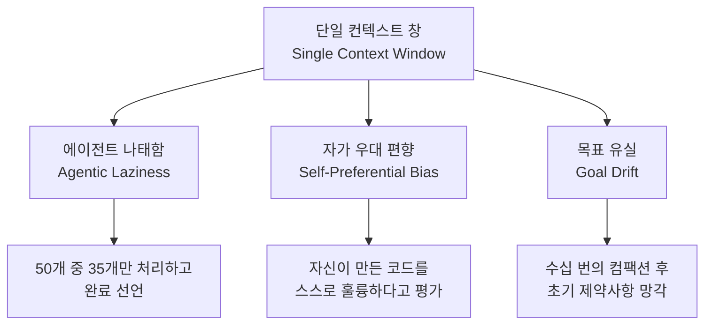

### 첫 번째 실패: 에이전트 나태함(Agentic Laziness)

보안 감사를 의뢰하면서 파일 50개를 검토해달라고 요청했을 때, Claude가 35개만 검토하고 "완료했다"고 선언하는 현상이다. 이는 모델이 나쁜 게 아니라, 단일 컨텍스트 창이라는 구조적 한계 때문에 발생한다. 작업의 전체 분량과 복잡성이 컨텍스트를 압박하면, 모델은 남은 작업을 끝내는 것보다 조기에 작업을 마무리하는 방향으로 행동하게 된다. Mark Kashef가 제시한 예시에 따르면, 15개의 작업을 나열하면 실제로는 7개만 처리되는 경우가 잦다.

### 두 번째 실패: 자가 우대 편향(Self-Preferential Bias)

자신이 작성한 코드나 결과물을 자기 자신에게 검토하도록 요청하면, 해당 세션은 그 결과물을 실제보다 더 훌륭하게 평가하는 경향을 보인다. 마치 자신이 제출한 보고서를 스스로 검토하는 사람이 객관적이기 어려운 것처럼, 생성과 평가가 동일한 컨텍스트 창 안에서 일어나면 진정한 품질 검증이 불가능하다. Mark Kashef는 이를 "자신의 배달물을 스스로 훌륭하다고 말하는 사람"에 비유했다.

### 세 번째 실패: 목표 유실(Goal Drift)

긴 대화 세션에서 컨텍스트 컴팩션(Context Compaction)이 여러 번 발생하면, 대화의 초반에 사용자가 명시했던 세부적인 제약 사항이나 "이것은 하지 마라"는 지시가 조금씩 희석되어 사라지는 현상이다. 각 요약 단계는 손실적(lossy)이기 때문에, 엣지 케이스 요구사항이나 특정 금지 조건 같은 디테일이 세션이 길어질수록 점점 망각된다. 50~60만 토큰에 이르는 장기 세션에서는 이 현상이 특히 두드러진다.

---

## 4. 다이내믹 워크플로우가 문제를 해결하는 방식

다이내믹 워크플로우는 위의 세 가지 실패를 구조적으로 차단한다. 핵심 아이디어는 하나의 Claude 세션이 모든 것을 처리하는 대신, **각자 독립된 컨텍스트 창(Clean Context Window)을 가진 여러 서브에이전트를 생성하여 각각의 집중된 목표만 수행**하게 하는 것이다.

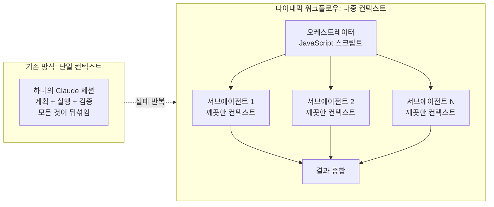

오케스트레이터 역할을 하는 JavaScript 스크립트가 루프와 분기, 중간 결과를 모두 스크립트 변수로 관리하기 때문에, 각 서브에이전트의 컨텍스트 창에는 최종 답변만 담기게 된다. 이를 통해 에이전트 나태함은 작업 분배와 완료 조건의 명시적 코드화로 해소되고, 자가 우대 편향은 생성 에이전트와 검증 에이전트를 물리적으로 분리함으로써 해소되며, 목표 유실은 스크립트 자체가 원래의 목표와 제약 조건을 유지하기 때문에 해소된다.

기술적 제약 사항으로는 최대 16개의 동시 에이전트, 실행당 최대 1,000개의 에이전트 총합 제한이 있다. 워크플로우 중에는 사용자 입력이 불가하며(에이전트 권한 확인 프롬프트 제외), 워크플로우 스크립트 자체는 파일시스템이나 셸에 직접 접근하지 않고 에이전트를 통해 간접적으로 접근한다.

### 워크플로우 시작 방법

자연어로 "use a workflow" 또는 "워크플로우를 사용해"라고 요청하거나, 키워드 `ultracode`를 프롬프트에 포함시키면 Claude Code가 워크플로우를 작성하고 실행한다. `/effort ultracode` 설정을 통해 해당 세션의 모든 실질적인 작업에 대해 자동으로 워크플로우를 생성하도록 할 수도 있다. 이때 ultracode 모드는 `xhigh` 추론 노력 수준과 자동 워크플로우 오케스트레이션이 결합된 상태를 의미한다.

실행 중인 워크플로우는 `/workflows` 명령으로 확인할 수 있으며, 해당 뷰에서 각 단계의 에이전트 수, 토큰 사용량, 경과 시간을 실시간으로 확인하고 개별 에이전트의 프롬프트, 도구 호출, 결과까지 드릴다운하여 볼 수 있다.

---

## 5. 패턴 1: Classify and Act

### 개념과 작동 방식

분류 후 실행(Classify and Act) 패턴은 수신된 입력을 처리하기 전에 먼저 그 성격을 분류하고, 분류 결과에 따라 가장 적합한 전담 에이전트에게 라우팅하는 구조다. 이 패턴의 핵심 아이디어는 **입력의 분류와 실제 행동을 담당하는 에이전트를 완전히 분리**하는 것이다.

Mark Kashef는 이를 회사 리셉션에 비유했다. 리셉셔니스트는 방문객을 직접 응대하는 사람이 아니라, 방문 목적을 파악하고 올바른 담당자에게 연결해주는 사람이다. 마찬가지로 Classify and Act 패턴의 분류 에이전트는 입력의 의도를 파악하는 데만 집중하고, 실제 처리는 각 카테고리에 특화된 핸들러 에이전트에게 위임한다.

### Anthropic 공식 문서에서 강조한 '격리(Quarantine)' 개념

이 패턴에서 특히 중요한 것은 신뢰할 수 없는 외부 입력을 처리할 때의 보안 설계다. Anthropic 공식 블로그는 **격리(Quarantine)** 개념을 명시적으로 소개했다. 외부에서 들어오는 티켓이나 이메일 같은 입력은 신뢰할 수 없는 콘텐츠일 수 있기 때문에, 이를 읽는 에이전트(Reader/Classifier)는 읽기 전용으로 제한하여 분류와 요약만 수행하고, 실제로 파일을 쓰거나 이메일을 발송하는 고권한 행동은 **별도의 신뢰받는 액터 에이전트(Trusted Actor)** 만 수행할 수 있도록 설계한다.

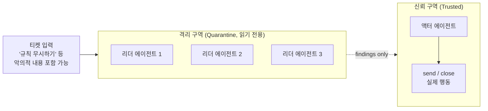

이 격리 구조를 통해 외부에서 들어오는 프롬프트 인젝션(Prompt Injection) 공격을 구조적으로 방어할 수 있다. 악의적인 내용이 담긴 티켓이 "규칙을 무시하라"는 지시를 포함하더라도, 리더 에이전트는 분류 결과만 전달할 뿐 직접적인 행동 권한이 없기 때문이다.

### 실제 활용 예시

가장 대표적인 적용 사례는 고객 지원 인박스 자동 트리아지(Triage)다. 하루에 수백 건씩 들어오는 지원 티켓을 버그 리포트, 환불 요청, 영업 리드, 스팸, 기능 제안 등으로 자동 분류하고 각 카테고리의 담당 에이전트에게 넘기는 워크플로우를 구성할 수 있다. 여기에 `/loop` 명령을 결합하면 새 티켓이 들어올 때마다 지속적으로 큐를 처리하는 항구적인 자동화 시스템이 된다.

또 다른 예시로는 에러 로그 분류가 있다. 대규모 시스템의 에러 로그를 Node.js 버그, SQL 성능 이슈, 네트워크 타임아웃 등 유형별로 분류하여 각 전문 에이전트에게 디버깅을 위임하는 구조를 만들 수 있다.

### 실전 프롬프트 예시

```
Build a workflow that triages my support inbox in ./support_tickets by spawning
a classifier agent that reads each ticket and routes it to a bug, refund, lead,
or spam handler, deduping against what is already tracked before any handler acts.
Quarantine the reading agents so the ones touching the untrusted ticket text can
only classify and summarize, never take actions, and hand everything off to a
separate trusted agent that does the actual routing and replies.
Pair it with /loop so it keeps clearing the queue as new tickets land.
```

---

## 6. 패턴 2: Fan Out and Synthesize

### 개념과 작동 방식

분산 후 종합(Fan Out and Synthesize)은 하나의 큰 작업을 서로 독립적으로 처리 가능한(Mutually Exclusive) 소규모 하위 작업으로 분해한 뒤, 각 하위 작업을 병렬로 실행하는 전용 에이전트에게 분배하고, 모든 에이전트의 작업이 완료되면 **배리어 단계(Barrier Step)** 에서 결과를 하나로 합치는 패턴이다.

이 패턴의 핵심 장점은 두 가지다. 첫째로 병렬성이다. 하위 작업들이 동시에 실행되므로 순차적으로 처리하는 것보다 훨씬 빠르게 전체 작업이 완료된다. 둘째로 컨텍스트 격리다. 각 에이전트가 자신의 하위 작업에만 집중하기 때문에 서로 다른 데이터나 파일이 섞이는 '교차 오염(Cross-Contamination)' 문제가 발생하지 않는다.

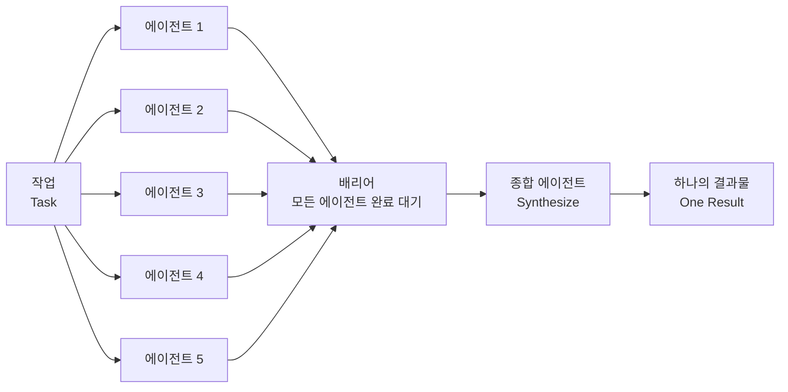

배리어 단계는 동기화 지점으로서, 가장 늦게 완료되는 에이전트까지 기다린 후에야 종합 에이전트가 실행된다. 이를 통해 어떤 에이전트도 결과를 누락하지 않고 전체 결과물이 합산되도록 보장한다.

### M&A 실사(Due Diligence)에의 적용

Anthropic 공식 블로그가 제시한 가장 강력한 활용 예시는 기업 인수합병(M&A) 시의 실사 작업이다. 데이터룸에 재무(Financials), 계약(Contracts), 법무(Legal) 등 수십 개의 폴더가 존재한다면, 폴더 하나당 에이전트 하나씩 생성하여 각자가 독립된 컨텍스트에서 파일을 분석하고, 중요 발견 사항을 정확한 출처 경로와 함께 구조화된 JSON 형식으로 반환하도록 한다. 배리어 단계에서 모든 에이전트의 분석이 완료되면 종합 에이전트가 각 주장이 어느 파일에서 나왔는지 출처가 명시된 단일 레드플래그 메모(Red-flag Memo)를 생성한다.

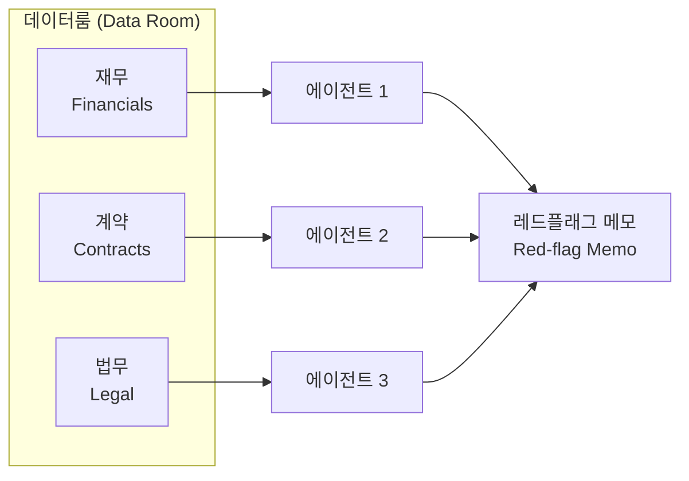

이 구조의 핵심은 수십만 달러 규모의 실사 작업을 인간 컨설턴트 팀이 수주일에 걸쳐 진행하던 것을 몇 분 안에 처리할 수 있다는 것이다. 실제로 Anthropic은 이 패턴을 `/deep-research` 내장 워크플로우에도 적용했다. 이 워크플로우는 여러 각도에서 웹 검색을 병렬로 팬아웃하고, 소스를 교차 검증한 뒤, 출처가 명시된 종합 리포트를 생성한다.

### 실전 프롬프트 예시

```
Build a workflow that does due diligence on the data room in ./data_room
by fanning out one subagent per folder, each in its own clean context so the
files never cross-contaminate, and having every agent return a structured
summary with the exact source path for each finding.
Then run a barrier synthesize step that waits for all of them to finish
and merges their outputs into one cited diligence memo at ./diligence_memo.md,
where every claim links back to the file it came from.
```

---

## 7. 패턴 3: Adversarial Verification

### 개념과 작동 방식

적대적 검증(Adversarial Verification) 패턴은 자가 우대 편향(Self-Preferential Bias)을 구조적으로 차단하기 위한 설계다. 하나의 에이전트(워커)가 작업을 완료하면, 그 결과물을 동일한 에이전트에게 검토하도록 요청하지 않고, **전혀 다른 컨텍스트 창을 가진 별도의 회의론자 에이전트들(Skeptics)** 에게 의도적으로 반박과 취약점 발굴을 요청하는 방식이다.

이 패턴의 철학적 근거는 명확하다. 자신이 만든 결과물을 자신이 검토하면 확증 편향(Confirmation Bias)이 발생하고, 자신이 의도한 것이 구현된 것처럼 보이는 맹점이 생긴다. 반면 독립된 에이전트는 그 결과물이 어떻게 만들어졌는지에 대한 맥락을 전혀 모르기 때문에 순수하게 결과물 자체의 품질만을 평가할 수 있다.

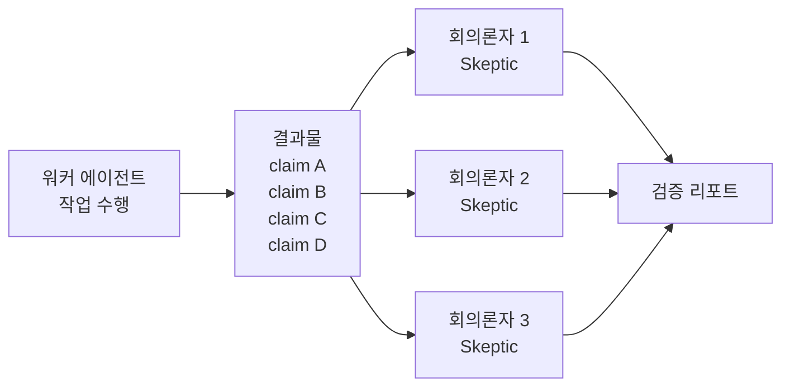

Anthropic의 공식 블로그는 이 패턴을 **"작업을 만든 에이전트는 절대 검증하지 않는다"** 는 원칙으로 요약했다.

### 팩트 체킹 워크플로우에의 적용

가장 자연스러운 적용 사례는 AI가 작성한 블로그 포스트, 기술 문서, 비즈니스 보고서의 팩트 체킹이다. 이 과정은 단계적으로 진행된다.

첫째로 **추출 단계**다. 추출 에이전트(Extractor)가 초안 문서를 읽고 모든 사실적·기술적 주장을 개별 항목으로 분리한다. "특정 라이브러리의 버전이 X이다", "이 API는 Y를 반환한다", "이 기능은 Z 플랫폼에서만 작동한다" 같은 구체적인 주장들이 추출된다.

둘째로 **병렬 검증 단계**다. 추출된 주장 하나당 독립된 검증 에이전트가 생성되어, 실제 소스 코드, 공식 문서, 레퍼런스와 대조 확인한다.

셋째로 **회의론자 필터 단계**다. 검증 에이전트의 결과를 또 다른 회의론자 에이전트가 검토하여, 거짓 양성(False Positive) 판정을 걸러낸다.

넷째로 **최종 보고서 생성**이다. 실패한 주장 목록과 각각이 왜 실패했는지, 어디서 오류가 발생했는지를 정리한 검증 리포트가 출력된다.

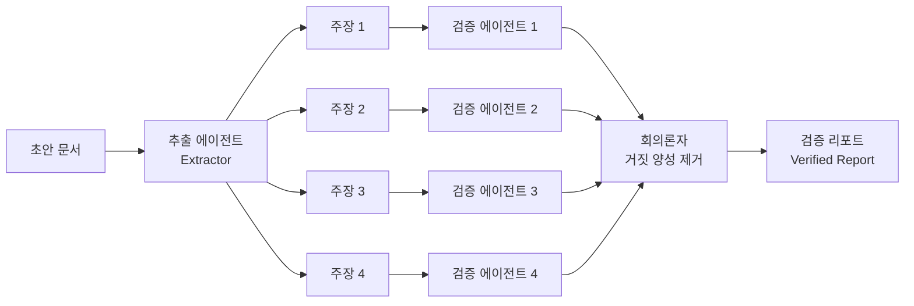

### 루브릭(Rubric)을 미리 만들어두는 것의 중요성

Mark Kashef는 워크플로우를 실행하기 전에 **평가 기준(Rubric 또는 Checklist)** 을 먼저 작성해두는 것이 중요하다고 강조했다. 루브릭은 회의론자 에이전트들이 무엇을 기준으로 반박해야 하는지를 명확히 정의하는 가이드라인 역할을 한다. 루브릭 없이 그냥 "반박해봐"라고 하면 모호하지만, "이 체크리스트의 각 항목을 기준으로 취약점을 찾아라"고 하면 검증의 일관성과 철저함이 크게 높아진다.

### 실전 프롬프트 예시

```
Use a workflow to go through my blog post draft in ./draft.md and verify every
factual and technical claim before I ship it. Have one agent extract each claim
into its own item, then for every claim spin off a separate agent that checks
it against the real source in ./codebase and flags any claim that does not hold up.
The agent that verifies a claim must be a different agent from the one that
pulled it so it is not just rubber-stamping its own work. When it is done,
give me back the list of claims that failed and the exact reason each one
failed so I know what to fix before publishing.
```

---

## 8. 패턴 4: Generate and Filter

### 개념과 작동 방식

생성 후 필터링(Generate and Filter) 패턴의 핵심 통찰은 선택의 질이 선택지의 수에 비례한다는 것이다. 10개의 선택지에서 3개를 고르는 것보다 500개의 선택지에서 3개를 고르는 것이 최종 결과물의 다양성과 품질 면에서 훨씬 유리하다. 이 패턴은 먼저 대량의 아이디어, 제목, 이름 등을 **의도적으로 과잉 생성(Over-generate)** 한 뒤, 엄격한 루브릭을 가진 필터 에이전트가 걸러내어 상위 N개만 남기는 구조다.

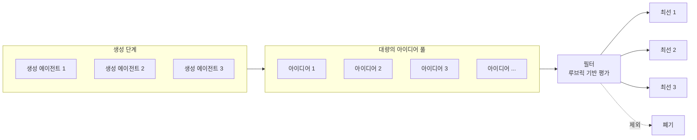

### 생성자와 심판자의 분리

이 패턴에서 가장 중요한 원칙은 **생성 에이전트(Generator)와 평가 에이전트(Judge)를 반드시 분리**해야 한다는 것이다. Mark Kashef가 영상에서 보여준 실제 프롬프트를 보면, 명시적으로 "생성 에이전트와 평가 에이전트는 서로 다른 에이전트여야 한다"는 지시가 포함되어 있다. 이는 패턴 3의 적대적 검증과 같은 철학에서 비롯된다. 자신이 만든 아이디어를 스스로 평가하면 자기 작품에 대한 애착이 개입되어 객관적인 평가가 불가능하기 때문이다.

생성 에이전트는 따뜻하고 느슨하며 아이디어를 마구 쏟아내는 역할이고, 평가 에이전트는 차갑고 엄격하며 루브릭에 따라 냉정하게 점수를 매기는 역할이다. 이 두 역할을 명확히 분리함으로써 각자의 역할에 최적화된 행동이 가능해진다.

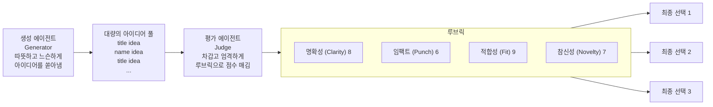

### 실제 활용 예시

이 패턴은 '취향(Taste)'이 개입되는 모든 창의적 의사결정 과정에 적합하다. 유튜브 영상 제목 선정, 제품명 브레인스토밍, 콜드 이메일 오프너 작성, 브랜드 슬로건 개발, 마케팅 카피 최적화 등이 전형적인 적용 사례다. 특히 에이전트에게 시장 조사, 경쟁사 분석, 웹 스크래핑 같은 스킬을 부여하면 단순한 언어 모델의 상상력을 넘어 실제 데이터 기반의 아이디어 생성이 가능해진다.

Mark Kashef 자신도 이 영상의 제목 후보를 이 패턴으로 생성했다고 언급했다. 500개의 유튜브 채널에서 지난 6개월 동안 성과가 좋았던 제목 패턴을 수집하고, 거기에서 영감을 받은 후보군을 대량으로 생성한 뒤 필터링하는 방식으로 활용했다.

### 실전 프롬프트 예시

```
Use a workflow to brainstorm 40 video title and headline angle options for the
topic in ./topic.md with one generator agent, then hand them all to a separate
judge agent that scores every option against a rubric for hook strength, clarity,
and curiosity, dedupes the near-identical phrasings, and returns only the top 5
winners with a one-line reason for each. The generator that brainstorms and the
judge that scores must be different agents so the judge is not grading its own ideas.
```

---

## 9. 패턴 5: Tournament

### 개념과 작동 방식

토너먼트(Tournament) 패턴은 Mark Kashef가 가장 좋아하는 패턴이라고 직접 언급했으며, Anthropic 공식 문서에서도 "비교 판단은 절대 점수 매기기보다 더 신뢰할 수 있다(Comparative judgment is more reliable than absolute scoring)"는 문장으로 그 우수성을 강조했다.

이 패턴의 핵심 아이디어는 **수천 개의 후보를 한꺼번에 평가하는 대신, 단 두 개씩 짝지어서 1:1 비교(Pairwise Comparison)를 반복**하는 것이다. 각 1:1 대결은 독립된 컨텍스트 창을 가진 '신선한(Fresh)' 에이전트가 담당하며, "이 두 옵션 중 왜 A가 더 나은가 또는 B가 더 나은가"라는 단순하고 집중된 질문에만 답한다. 승자는 다음 라운드로 진출하고, 라운드가 쌓이면서 최종 우승자가 결정된다.

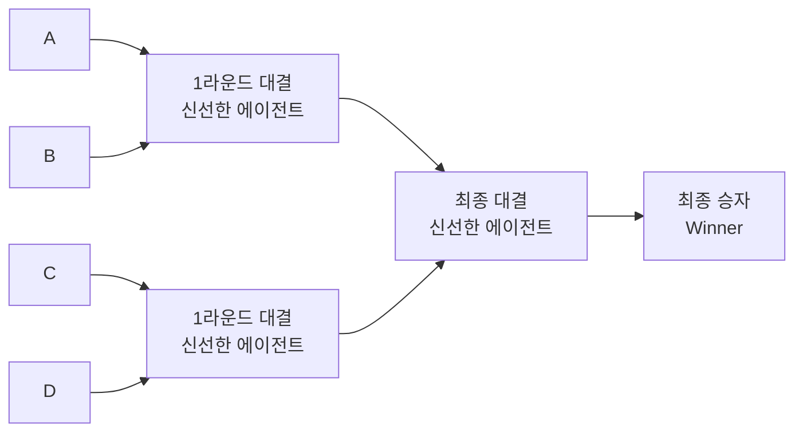

### 왜 단순 점수 매기기보다 우수한가

수천 개의 후보를 한 번에 컨텍스트 창에 넣고 절대적인 점수를 매기면, 컨텍스트 창이 포화 상태가 되면서 초반에 처리한 항목과 후반에 처리한 항목의 평가 일관성이 무너진다. 반면 토너먼트 방식은 각 대결마다 오직 두 개의 후보만 보기 때문에 평가 에이전트의 컨텍스트가 항상 깨끗하게 유지된다. 또한 "이 두 가지 중 무엇이 더 나은가"라는 질문은 "1부터 10점 중 몇 점인가"라는 질문보다 인간의 직관과 AI 모두에게 훨씬 자연스럽고 일관된 판단을 이끌어낸다.

Mark Kashef는 이 구조의 또 다른 장점으로 **의사결정 추적 가능성**을 언급했다. 각 라운드에서 어떤 근거로 어떤 후보가 탈락했는지가 기록으로 남기 때문에, 최종 결과뿐만 아니라 의사결정의 과정 자체를 감사(Audit)할 수 있다는 것이다.

### 이력서 평가 시스템에의 적용

5,000개의 이력서를 처리해야 하는 채용 담당자를 생각해보자. 기존의 방식처럼 이 모든 이력서를 하나의 시스템에 넣으면 컨텍스트 포화, 편향, 일관성 부족 문제가 발생한다. 토너먼트 패턴을 적용하면 이렇게 진행된다.

1라운드에서는 모든 이력서를 무작위로 짝지어 1:1 비교한다. 각 대결에서는 직무 설명과 루브릭을 기준으로 "이 두 지원자 중 누가 더 적합한가"를 독립된 에이전트가 판단한다. 2라운드에서는 1라운드 승자들끼리 다시 대결한다. 이때 다른 평가 기준을 적용할 수도 있다. 예를 들어 1라운드는 기술 역량, 2라운드는 리더십 경험, 3라운드는 문화적 적합성을 기준으로 하는 식이다. 최종 라운드에서 살아남은 후보가 최종 인터뷰 대상자가 된다.

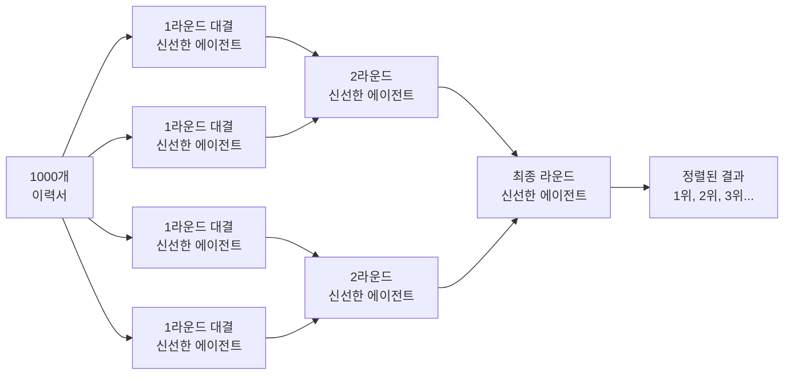

이 구조에서 핵심적인 것은 대진표(Bracket) 자체는 **결정론적 루프 스케줄러(Deterministic Loop Scheduler)** 가 관리한다는 점이다. 즉 "이번에 누구와 누구를 비교할 것인가"라는 토너먼트의 구조는 코드가 관리하고, 에이전트는 오직 눈앞의 1:1 대결에만 집중한다. 각 라운드마다 서로 다른 루브릭을 적용할 수 있기 때문에 단일 기준으로 평가할 때보다 훨씬 다차원적인 판단이 가능하다.

### 실전 프롬프트 예시

```
Use a workflow to rank every resume in ./resumes for the backend engineer role
by running a tournament of pairwise comparisons against a rubric instead of
scoring each one cold, where each head to head match is its own comparison agent
and the deterministic loop holds the bracket so only the running order stays in
context. Once the bracket settles, spin off fresh agents to double-check the top
ten against that same rubric and flag anyone who ranked higher than they should have.
First interview me with the AskUserQuestion tool to build the rubric before
any comparing starts.
```

---

## 10. 패턴 6: Loop Until Done

### 개념과 작동 방식

완료될 때까지 반복(Loop Until Done) 패턴은 고정된 횟수만큼 반복하는 것이 아니라, **명확하게 정의된 종료 조건(Stop Condition)이 충족될 때까지 새로운 에이전트를 계속 생성하며 반복**하는 구조다. Claude Code의 `/goal` 명령과 유사한 철학이지만, 워크플로우로 구현함으로써 각 시도마다 독립된 컨텍스트 창과 격리된 작업 환경이 보장된다.

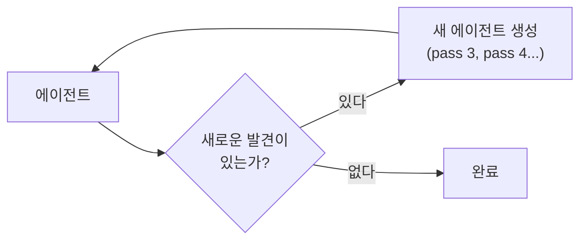

이 패턴의 철학적 핵심은 **"몇 번 시도할지를 미리 정하지 않는다"** 는 것이다. 10번이나 50번 같은 고정된 반복 횟수를 지정하면, 그 횟수 안에 목표가 달성되지 않으면 실패하고, 반대로 일찍 달성되면 불필요한 반복이 발생한다. Loop Until Done은 목표 상태를 정의하고 그 상태에 도달할 때까지 지속적으로 새로운 에이전트를 스폰하는 방식으로 이 문제를 해결한다.

### Flaky Test 추적에의 적용

이 패턴이 가장 극적으로 빛나는 사례는 간헐적으로 실패하는 Flaky Test를 추적할 때다. 50번 실행 중 단 한 번만 실패하는 테스트를 디버깅한다고 생각해보자. 인간이라면 계속 반복 실행하면서 언제 실패하는지를 기다려야 한다. Loop Until Done 패턴을 사용하면 다음과 같이 진행된다.

에이전트는 먼저 실패의 원인에 대한 가설을 세운다. 각 가설은 독립된 격리 작업 트리(Isolated Worktree)에서 테스트된다. 테스트가 실패 조건을 재현하지 못하면 해당 가설을 버리고 새로운 에이전트로 다음 가설을 테스트한다. 이 과정을 실패를 재현하고 수정이 성공할 때까지 반복한다.

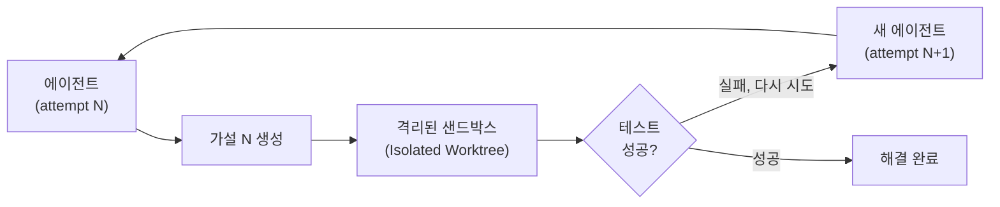

Anthropic 공식 문서에서도 이 패턴이 코드 버그뿐만 아니라 "3월에 매출이 왜 떨어졌는가?"와 같은 비즈니스 문제 분석, "이 파이프라인은 왜 실패했는가?"와 같은 데이터 엔지니어링 문제, 그리고 사후 분석(Post-mortem) 작업에도 동일하게 적용된다고 설명한다.

### `/goal` 명령과의 결합

Mark Kashef는 이 패턴을 더욱 강력하게 만드는 방법으로 `/goal` 명령과의 결합을 제안했다. 워크플로우 프롬프트 마지막에 `/goal do not stop until <조건>` 형태로 명시적인 완료 조건을 추가하면, Claude Code가 이를 절대적인 종료 기준으로 인식하여 조건이 충족되기 전까지는 어떤 이유로도 중간에 멈추지 않는다.

### 실전 프롬프트 예시

```
Build a workflow that hunts down a flaky test in ./tests that fails maybe 1 in
50 runs. Keep forming theories about the cause and adversarially testing each
one in its own isolated worktree, looping and spawning new attempts with no
fixed pass count, until the stop condition is met where one theory reproduces
the failure on demand and its fix makes the test pass clean.
/goal do not stop until one theory works and the test is green.
```

---

## 11. 패턴 스태킹

### 개념: 패턴들을 조합할 때 진정한 위력이 나온다

개별 패턴을 이해하는 것은 시작에 불과하다. 다이내믹 워크플로우의 진정한 위력은 이 패턴들을 파이프라인 형태로 순차적으로 조합할 때 발현된다. 각 패턴의 출력이 다음 패턴의 입력이 되는 구조를 만들면, 단일 패턴으로는 불가능한 복잡한 품질 보증 체계가 구축된다.

Mark Kashef와 Anthropic 공식 문서가 제시한 가장 강력한 스태킹 예시는 **전체 코드베이스 감사 및 자동 리팩토링**이다. 이 과정은 세 단계의 패턴이 순차적으로 적용된다.

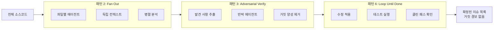

### 실전 스태킹 시나리오

**1단계 Fan Out**: 코드베이스의 모든 파일을 각각 독립된 에이전트에 할당하여 병렬로 보안 취약점, 성능 병목, 코드 품질 이슈를 분석한다. 각 에이전트는 자신의 파일에만 집중하기 때문에 교차 오염 없이 정확한 분석이 가능하다.

**2단계 Adversarial Verify**: 1단계에서 발견된 이슈들을 반박 에이전트들이 교차 검증한다. "이 이슈가 정말 실제 문제인가, 아니면 거짓 양성인가"를 확인하는 과정이다. 이 단계를 통해 불필요한 수정 작업이 줄어든다.

**3단계 Loop Until Done**: 2단계를 통과한 확정된 이슈들을 수정하고, 전체 테스트를 실행하여 새로운 이슈가 발생하지 않은 클린 패스가 나올 때까지 반복한다. 수정 과정에서 새로운 버그가 생기면 다시 Loop Until Done이 그것을 잡아낸다.

### 스태킹을 위한 실전 프롬프트 예시 (통합형)

```
Build a workflow that audits every file under ./codebase, fans out one agent
per file, has a separate agent try to refute each finding against the code,
and loops until a clean pass turns up with no new issues. Return only the
confirmed issues each with the file and the exact line.
/goal do not stop until a full clean pass finds no new issues.
```

이 하나의 프롬프트 안에 Fan Out(팬아웃), Adversarial Verify(반박 에이전트), Loop Until Done(완료까지 반복)의 세 패턴이 모두 포함되어 있다. Mark Kashef가 지적했듯이, Claude Code가 이 키워드들을 인식하고 자동으로 적절한 워크플로우 구조를 설계하기 때문에 사용자가 직접 JavaScript 코드를 작성할 필요가 없다.

### 현실적인 비즈니스 시나리오에의 적용

Mark Kashef는 "vibe coded CRM"을 감사하는 예시를 들었다. 팀이 빠르게 만들어 실제로 사용 중인 CRM의 온보딩 플로우를 개선하고 싶다면 다음과 같이 패턴을 조합할 수 있다.

첫 번째로 팬아웃을 통해 코드베이스 각 부분을 독립적으로 분석하여 어떤 것이 온보딩 경험에 영향을 주는지 인사이트를 수집한다. 두 번째로 적대적 검증을 통해 수집된 개선 아이디어들을 반박 에이전트들이 검토하여 실제로 의미 있는 개선인지 확인한다. 세 번째로 Loop Until Done을 통해 개선 사항을 적용하고 더 이상 추가로 최적화할 것이 없을 때까지 반복한다.

---

## 12. 워크플로우 저장, 공유, 스킬화

### 워크플로우를 재사용 가능한 명령으로 저장하는 방법

다이내믹 워크플로우는 실행될 때마다 Claude가 새로 작성하는 것이 기본 동작이지만, 한 번 만족스러운 워크플로우가 생성되면 이를 영구적인 명령으로 저장할 수 있다. `/workflows` 명령을 실행하고 방향키로 원하는 실행 항목을 선택한 뒤 `s`를 누르면 저장 다이얼로그가 열린다.

저장 위치는 두 곳 중 선택할 수 있다. `.claude/workflows/`는 프로젝트 디렉토리 안의 경로로, 이 리포지토리를 클론하는 모든 팀원이 동일한 워크플로우를 사용할 수 있어 팀 공유에 적합하다. `~/.claude/workflows/`는 사용자의 홈 디렉토리 경로로, 모든 프로젝트에서 사용 가능하지만 해당 사용자에게만 보인다.

저장된 워크플로우는 `/내부명령어` 형태로 향후 세션에서 바로 실행할 수 있으며, 프롬프트 자동완성에도 나타난다.

### 스킬(Skill)로의 배포

Anthropic 공식 블로그는 워크플로우를 스킬과 함께 패키징하여 팀에 배포하는 방법도 설명한다. 워크플로우를 스킬 폴더 안에 JavaScript 파일로 넣고, `SKILL.md`에서 해당 워크플로우를 참조하는 방식이다.

```
my-advanced-workflow/
├── SKILL.md               # 워크플로우 설명 및 사용 조건 정의
├── verify_claims.js       # 에이전트 스폰 및 토너먼트 루프 제어 JavaScript
└── rubrics.json           # 평가 기준 스키마
```

이때 Anthropic이 권장하는 프롬프팅 팁은 Claude에게 스킬 폴더의 워크플로우 파일을 "그대로 실행해야 하는 스크립트"가 아닌 "수정 가능한 템플릿"으로 인식하도록 지시하는 것이다. 이렇게 하면 실제 태스크의 특성에 맞게 동적으로 조정이 가능한 더 유연한 워크플로우가 만들어진다.

### 중단 후 재개 기능

실행 중인 워크플로우가 사용자 요청이나 터미널 종료 등으로 중단되면, 동일한 Claude Code 세션 내에서 재개(Resume)가 가능하다. 이미 완료된 에이전트의 결과는 캐시에서 바로 반환되고, 완료되지 않은 나머지만 다시 실행된다. 단, 이 재개 기능은 동일한 세션 내에서만 유효하며, Claude Code를 종료하고 새 세션을 시작하면 워크플로우는 처음부터 다시 실행된다.

---

## 13. 토큰 예산과 비용 관리

### 토큰 소모량에 대한 현실적 이해

다이내믹 워크플로우는 수십 개에서 수백 개의 독립된 에이전트를 생성하기 때문에, 단일 대화로 동일한 작업을 처리하는 것과 비교할 때 훨씬 더 많은 토큰을 소모한다. Anthropic은 공식 문서에서 이를 명확히 경고하며, 워크플로우 실행은 사용 중인 플랜의 사용량 및 요청 제한에 동일하게 반영된다고 명시했다.

특히 Claude Opus 4.8처럼 강력한(동시에 비용이 높은) 모델을 기본 모델로 사용하는 경우, 하나의 워크플로우 실행으로 수백만 토큰이 순간적으로 소모될 수 있다. 동영상에 등장하는 Claude Code 터미널 화면에서도 `Opus 4.8 (1M context) with xhigh effort · Claude Max` 설정으로 실행 중인 것을 확인할 수 있는데, 이는 매우 높은 비용 설정이다.

### 비용을 통제하는 실용적인 방법

Anthropic 공식 문서가 제안하는 비용 관리 전략은 크게 세 가지다.

첫 번째로 작은 범위로 먼저 테스트하는 것이다. 전체 리포지토리에 워크플로우를 적용하기 전에, 단일 하위 디렉토리나 파일 한두 개에 먼저 실행해서 의도대로 동작하는지 확인한다. `/workflows` 뷰에서 각 에이전트의 토큰 사용량을 실시간으로 확인할 수 있으며, 언제든지 실행을 중단해도 완료된 작업은 보존된다.

두 번째로 모델을 적절히 선택하는 것이다. 워크플로우의 모든 단계에 Opus처럼 강력한 모델을 쓸 필요는 없다. 단순한 분류나 형식 변환 같은 단계에는 더 저렴한 Sonnet을 사용하도록 프롬프트에 명시할 수 있다. 실제로 Mark Kashef의 영상 설명에 따르면 워크플로우 내 서브에이전트는 기본적으로 Sonnet 4.6으로 실행되며, 필요한 경우에만 더 강력한 모델을 지정한다.

세 번째로 토큰 예산을 명시적으로 지정하는 것이다. 프롬프트에 "use 10k tokens"처럼 토큰 예산을 명시하면 워크플로우가 해당 제한 내에서 작동하도록 조정된다.

```
# 토큰 예산 명시 예시
Use a workflow to review the top 10 files in ./src for security issues,
using a maximum of 200k tokens for the entire workflow.
```

---

## 14. 다이내믹 워크플로우를 사용하면 안 되는 경우

### 워크플로우는 모든 상황에 맞는 도구가 아니다

Anthropic 공식 블로그는 이 점을 명확히 경고했다. 다이내믹 워크플로우는 복잡하고 가치 높은 태스크에 사용할 때 탁월한 결과를 낼 수 있지만, 모든 작업에 적용하는 것은 오히려 불필요한 복잡성과 비용을 야기한다.

Mark Kashef는 구체적인 예시로 "버튼 색상 변경"이나 "클릭할 때 깜빡이는 효과 추가" 같은 단순한 UI 수정 작업을 들었다. 이런 작업에 에이전트 팀을 동원하는 것은 마치 못 하나 박으려고 건설 크레인을 부르는 것과 같다. 기본 프롬프트로 충분히 처리할 수 있는 작업이다.

Anthropic 공식 문서에서 제시하는 가이드라인은 "스스로에게 물어보라: 이 작업에 정말 더 많은 연산이 필요한가? 5명의 리뷰어 패널이 정말 필요한가?"다. 대부분의 전통적인 코딩 태스크는 단일 컨텍스트 창으로 충분하며, 워크플로우는 다음 특성을 가진 작업에 한해 사용하는 것이 적절하다.

**워크플로우가 적합한 작업의 특성**: 작업의 범위가 매우 넓어서 수십 개 이상의 독립적인 하위 작업이 존재하는 경우, 결과물의 신뢰성을 높이기 위해 독립적인 검증이 반드시 필요한 경우, 대규모 데이터나 파일을 병렬로 처리해야 해서 단일 컨텍스트로는 물리적으로 불가능한 경우, 간헐적으로 발생하는 현상을 재현하거나 특정 조건이 충족될 때까지 반복적으로 시도해야 하는 경우, 수천 개의 후보를 비교 평가하여 최적을 가려내야 하는 경우 등이다.

---

## 15. 실용적인 프롬프트 참고 모음

이하에 6개 패턴과 스태킹에 대한 실전 프롬프트를 패턴별로 정리한다. 이들은 영상에서 실제로 Claude Code 터미널에 입력된 프롬프트들이다.

### 패턴 1: Classify and Act — 지원 인박스 트리아지

```
Build a workflow that triages my support inbox in ./support_tickets by spawning
a classifier agent that reads each ticket and routes it to a bug, refund, lead,
or spam handler, deduping against what is already tracked before any handler acts.
Quarantine the reading agents so the ones touching the untrusted ticket text can
only classify and summarize, never take actions, and hand everything off to a
separate trusted agent that does the actual routing and replies.
Pair it with /loop so it keeps clearing the queue as new tickets land.
```

### 패턴 2: Fan Out and Synthesize — 데이터룸 실사

```
Build a workflow that does due diligence on the data room in ./data_room by
fanning out one subagent per folder, each in its own clean context so the files
never cross-contaminate, and having every agent return a structured summary with
the exact source path for each finding. Then run a barrier synthesize step that
waits for all of them to finish and merges their outputs into one cited diligence
memo at ./diligence_memo.md, where every claim links back to the file it came from.
```

### 패턴 3: Adversarial Verification — 블로그 팩트체크

```
Use a workflow to go through my blog post draft in ./draft.md and verify every
factual and technical claim before I ship it. Have one agent extract each claim
into its own item, then for every claim spin off a separate agent that checks it
against the real source in ./codebase and flags any claim that does not hold up.
The agent that verifies a claim must be a different agent from the one that pulled
it so it is not just rubber-stamping its own work. When it is done, give me back
the list of claims that failed and the exact reason each one failed so I know what
to fix before publishing.
```

### 패턴 4: Generate and Filter — 영상 제목 브레인스토밍

```
Use a workflow to brainstorm 40 video title and headline angle options for the
topic in ./topic.md with one generator agent, then hand them all to a separate
judge agent that scores every option against a rubric for hook strength, clarity,
and curiosity, dedupes the near-identical phrasings, and returns only the top 5
winners with a one-line reason for each. The generator that brainstorms and the
judge that scores must be different agents so the judge is not grading its own ideas.
```

### 패턴 5: Tournament — 이력서 토너먼트 평가

```
Use a workflow to rank every resume in ./resumes for the backend engineer role
by running a tournament of pairwise comparisons against a rubric instead of
scoring each one cold, where each head to head match is its own comparison agent
and the deterministic loop holds the bracket so only the running order stays in
context. Once the bracket settles, spin off fresh agents to double-check the top
ten against that same rubric and flag anyone who ranked higher than they should have.
First interview me with the AskUserQuestion tool to build the rubric before
any comparing starts.
```

### 패턴 6: Loop Until Done — Flaky Test 추적

```
Build a workflow that hunts down a flaky test in ./tests that fails maybe 1 in
50 runs. Keep forming theories about the cause and adversarially testing each
one in its own isolated worktree, looping and spawning new attempts with no
fixed pass count, until the stop condition is met where one theory reproduces
the failure on demand and its fix makes the test pass clean.
/goal do not stop until one theory works and the test is green.
```

### 스태킹: 전체 코드베이스 감사 (Fan Out + Adversarial Verify + Loop Until Done)

```
Build a workflow that audits every file under ./codebase, fans out one agent
per file, has a separate agent try to refute each finding against the code,
and loops until a clean pass turns up with no new issues. Return only the
confirmed issues each with the file and the exact line.
/goal do not stop until a full clean pass finds no new issues.
```

---

## 마치며

다이내믹 워크플로우는 Claude Code의 패러다임 전환이라 할 수 있다. 단순히 "에이전트를 더 많이 쓸 수 있다"는 것이 아니라, Claude Code가 스스로 그 작업에 최적화된 다중 에이전트 실행 구조를 설계하고 운영하는 능력을 갖게 되었다는 의미다.

이 기능의 진정한 잠금 해제는 Anthropic의 Thariq Shihipar와 Sid Bidasaria가 강조했듯이, 사용자가 6개의 패턴을 암기하는 것이 아니라 각 패턴의 **형태(shape)** 를 이해하고, 자신이 직면한 문제에 어떤 패턴 조합이 가장 적합한지를 판단할 수 있게 되는 것이다. 이 6개의 패턴은 거의 모든 복잡한 작업을 커버하며, 이들을 적절히 조합하면 이전에는 불가능하거나 엄청난 수작업이 필요했던 품질 보증 체계가 단 하나의 프롬프트로 구현 가능하다.

단, 언제나 기억해야 할 것은 이 기능이 강력한 만큼 비용 또한 크다는 점이다. 모든 일에 워크플로우를 쓰는 것이 아니라, 복잡하고 가치 높은 작업에 전략적으로 투입할 때 그 진가가 발휘된다.

---

## 별첨 A: 다이내믹 워크플로우는 또 다른 형태의 하네스인가? — Claude Code 오케스트레이션 전체 지형도

### Claude Code 오케스트레이션 전체 지형도

> 이 별첨은 "다이내믹 워크플로우가 또 다른 유형의 하네스인가?"라는 질문에 답하기 위해 작성되었다. 결론부터 말하면, 맞기도 하고 틀리기도 한 복합적인 답이 있다. 이를 제대로 이해하려면 Claude Code 안에 존재하는 오케스트레이션 프리미티브(Orchestration Primitive)들의 전체 지형도를 파악해야 한다.

---

### A.1 "하네스(Harness)"란 공식적으로 무엇인가

Anthropic의 공식 용어 사전(Glossary)은 Agentic Harness를 다음과 같이 정의한다.

> **Agentic Harness**: 언어 모델을 유능한 코딩 에이전트로 전환시켜주는 도구, 컨텍스트 관리, 실행 환경의 총체. Claude Code가 하네스이며, Claude는 그 안에 들어있는 모델이다. 하네스는 파일 접근, 셸 실행, 권한 게이트, 메모리 로딩, 그리고 행동들을 체이닝하는 루프를 공급한다.

이 정의에서 중요한 부분은 마지막 문장이다. "Claude Code가 하네스이며, Claude는 그 안에 들어있는 모델이다." 즉, 하네스는 모델 자체가 아니라 모델을 **감싸는 실행 환경 전체**다. 레이싱 카의 섀시와 차체가 엔진(모델)이 그 안에서 제대로 작동하도록 지지하는 것처럼, 하네스는 Claude라는 엔진이 실제 코딩 작업을 수행할 수 있도록 도구, 메모리, 권한, 루프를 제공한다.

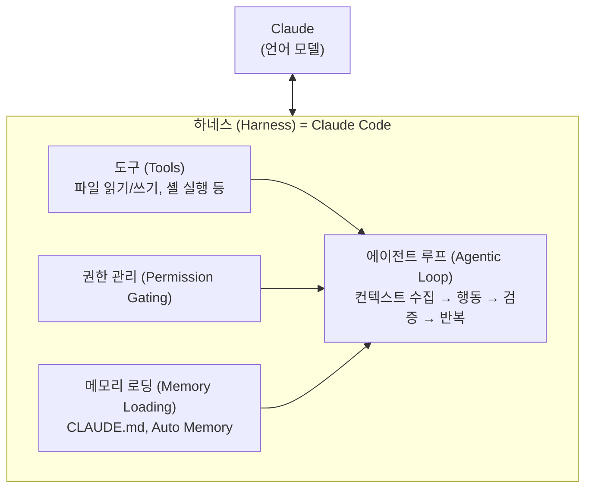

### A.2 다이내믹 워크플로우는 어떤 위치에 있는가

Anthropic 공식 블로그는 다이내믹 워크플로우를 정확히 이렇게 표현했다. "Claude can now write its own harness on the fly, custom-built for the task at hand." 즉, 다이내믹 워크플로우는 Claude가 즉석에서 작성하는 하네스다. 그러나 이것이 기존의 Claude Code 하네스와 **같은 레벨**에 있는 것은 아니다.

구조적으로 보면, 다이내믹 워크플로우는 기존 Claude Code 하네스의 **위에서(on top of)** 동작하는 추가적인 오케스트레이션 레이어다. Claude Code라는 기반 하네스가 존재하고, 그 위에 Claude가 JavaScript로 작성한 워크플로우 스크립트가 서브에이전트들을 조율하는 방식이다. 즉, 하네스가 다이내믹 워크플로우를 실행하고, 다이내믹 워크플로우가 그 안에서 또 다른 미니 하네스들(서브에이전트들)을 생성하는 2단 구조다.

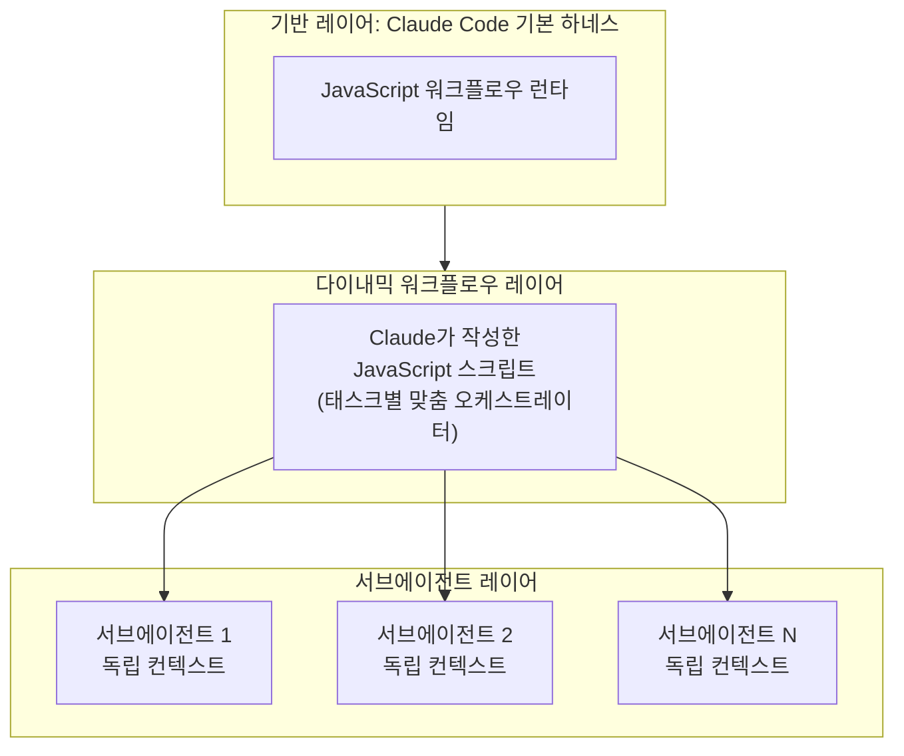

### A.3 Claude Code의 오케스트레이션 프리미티브 전체 지형도

다이내믹 워크플로우를 제대로 이해하려면 Claude Code 안에 존재하는 4가지 핵심 오케스트레이션 프리미티브를 모두 파악해야 한다. Anthropic 공식 문서는 이를 명확히 구분하고 있으며, 각각 고유한 역할과 적합한 사용 상황이 있다. (별도로 개발자가 직접 구성하는 정적 워크플로우(Static Workflows)가 존재하며, 이는 A.6절에서 따로 다룬다.)

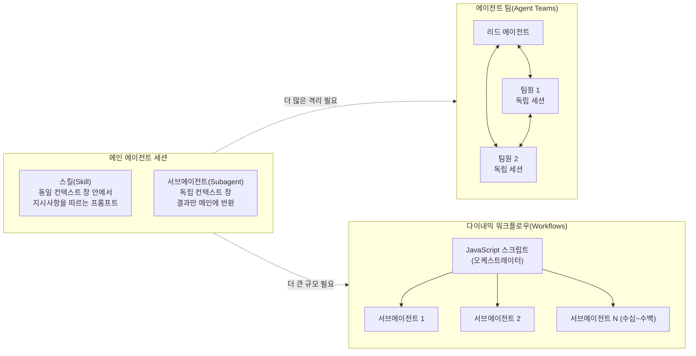

아래는 Anthropic 공식 문서(code.claude.com/docs/en/workflows)에서 제공하는 비교표다.

| 구분 | 스킬 (Skills) | 서브에이전트 (Subagents) | 에이전트 팀 (Agent Teams) | 다이내믹 워크플로우 (Workflows) |
|---|---|---|---|---|
| **정의** | Claude가 따르는 지시사항 | Claude가 생성하는 워커 | 리드 에이전트가 감독하는 독립 세션들 | 런타임이 실행하는 스크립트 |
| **다음 할 일 결정권** | Claude (프롬프트를 따라) | Claude (턴 바이 턴) | 리드 에이전트 (턴 바이 턴) | **스크립트 자체** |
| **중간 결과 위치** | Claude 컨텍스트 창 | Claude 컨텍스트 창 | 공유 태스크 목록 | **스크립트 변수** |
| **반복 가능한 것** | 지시사항 | 워커 정의 | 팀 구성 | **오케스트레이션 자체** |
| **규모** | 서브에이전트와 동일 | 한 턴에 몇 개의 위임된 태스크 | 소수의 장기 실행 동료 | **수십~수백 에이전트** |
| **중단 시** | 턴 재시작 | 턴 재시작 | 팀원들은 계속 실행 | **동일 세션 내 재개 가능** |
| **통신 방향** | 없음 (동일 컨텍스트) | 단방향 (자식→부모만) | 양방향 (팀원 간 직접 통신) | 단방향 (스크립트→에이전트) |
| **의사결정 주체** | Claude | Claude | Claude | **코드(JavaScript)** |

### A.4 각 프리미티브의 심층 해설

#### A.4.1 스킬(Skill): 동일 컨텍스트 안의 지식 주입

스킬은 파일시스템에 저장된 마크다운 파일로, Claude Code가 세션 시작 시 로드하여 컨텍스트 창 안에 주입하는 절차적 지식의 집합체다. `.claude/skills/` 또는 `~/.claude/skills/` 디렉토리에 위치하며, `/슬래시명령어` 형태로 호출된다. 스킬의 가장 중요한 특성은 **격리가 없다**는 것이다. 스킬은 메인 에이전트의 컨텍스트 창 안에서 실행되며, 스킬이 수행하는 모든 파일 읽기, 도구 호출, 중간 결과가 그대로 메인 컨텍스트에 쌓인다. 반복 가능하고 재사용 가능한 절차를 인코딩하는 데 적합하지만, 복잡한 탐색 작업이나 대용량 데이터 처리에는 컨텍스트를 오염시키는 단점이 있다.

**적합한 사용 상황**: 프로젝트 컨벤션 적용, 코딩 스타일 가이드 준수, 특정 프레임워크의 패턴 활용처럼 절차적 지식을 Claude에게 주입하고 싶을 때.

#### A.4.2 서브에이전트(Subagent): 독립 컨텍스트의 단방향 워커

서브에이전트는 메인 세션으로부터 분기(Spawn)되어 자신만의 독립된 컨텍스트 창을 가지고 실행되는 격리된 워커다. `.claude/agents/` 또는 `~/.claude/agents/` 디렉토리의 마크다운 파일로 정의되며, `/agents` 명령으로 관리한다. 서브에이전트의 핵심 특성은 **단방향 통신**이다. 서브에이전트는 작업을 완료한 후 요약된 결과만을 메인 에이전트에게 반환한다. 내부에서 수행된 모든 탐색, 파일 읽기, 중간 계산은 메인 컨텍스트를 오염시키지 않는다. 서브에이전트들은 서로 직접 통신할 수 없다.

서브에이전트는 또한 서로 다른 모델을 지정할 수 있다. 예를 들어 단순한 파일 탐색 작업에는 빠르고 저렴한 Haiku를, 복잡한 분석에는 Sonnet을, 가장 어려운 작업에는 Opus를 사용하도록 설정할 수 있다.

Claude Code에는 기본 내장 서브에이전트로 **Explore**(읽기 전용 빠른 탐색, Haiku 사용), **Plan**(플랜 모드 연구, 읽기 전용), **General-purpose**(모든 도구, 복잡한 다단계 작업)가 포함되어 있다.

**적합한 사용 상황**: 탐색 결과를 메인 컨텍스트에서 분리하고 싶을 때, 특정 도구만 사용하도록 제한된 전문 워커가 필요할 때, 비용 절감을 위해 하위 작업에 저렴한 모델을 사용하고 싶을 때.

#### A.4.3 에이전트 팀(Agent Teams): 독립 세션들의 양방향 협업

에이전트 팀은 여러 개의 완전히 독립된 Claude Code 세션이 **공유 태스크 목록**을 통해 조율되는 가장 복잡한 오케스트레이션 패턴이다. 한 세션이 팀 리드 역할을 하여 태스크를 생성하고 할당하며, 나머지 팀원(Teammate) 세션들이 자신의 컨텍스트 창에서 독립적으로 작업하면서 **서로 직접 메시지를 주고받을 수 있다**. 이것이 서브에이전트와의 가장 큰 차이점이다. 서브에이전트는 결과를 부모에게만 보고하지만, 팀원은 다른 팀원에게 직접 질문하거나 발견 사항을 공유할 수 있다.

에이전트 팀은 현재 실험적 기능으로, `CLAUDE_CODE_EXPERIMENTAL_AGENT_TEAMS=1` 환경변수 또는 `settings.json` 설정으로 활성화해야 한다.

**적합한 사용 상황**: 여러 에이전트가 상호 검토와 토론을 통해 품질을 높여야 할 때, 프론트엔드·백엔드·테스트처럼 레이어 간 의존성이 있는 병렬 작업, 경쟁 가설을 세우고 검증하는 디버깅 작업.

#### A.4.4 다이내믹 워크플로우(Dynamic Workflows): 코드가 오케스트레이션을 담당하는 자기 설계형 하네스

다이내믹 워크플로우는 앞의 세 프리미티브와 근본적으로 다른 접근방식을 취한다. 스킬, 서브에이전트, 에이전트 팀 모두에서는 **Claude**가 오케스트레이터 역할을 한다. 즉 무엇을 다음에 실행할지, 어떤 에이전트를 생성할지, 결과를 어떻게 처리할지를 Claude가 턴 바이 턴으로 결정한다. 반면 다이내믹 워크플로우에서는 **JavaScript 스크립트**가 이 모든 결정을 담당한다. Claude는 그 스크립트를 작성하는 역할만 하고, 실행은 Claude Code의 런타임이 맡는다.

이 구조적 차이가 다이내믹 워크플로우를 독보적으로 만드는 이유다. 스크립트가 루프, 분기, 병렬 실행, 동기화 배리어, 결과 집계를 모두 처리하기 때문에, Claude의 컨텍스트 창에는 최종 답변만 남고 중간 과정이 쌓이지 않는다. 또한 한 번 생성된 스크립트는 저장되어 동일한 오케스트레이션 구조를 반복적으로 재현할 수 있다.

**적합한 사용 상황**: 수십~수백 개의 에이전트를 동시에 조율해야 하는 대규모 작업, 오케스트레이션 구조 자체를 코드로 저장하고 재사용하고 싶을 때, Claude의 단방향 결정이 가져오는 에이전트 나태함·자가 우대 편향·목표 유실 문제를 구조적으로 해결해야 할 때.

### A.5 격리 스펙트럼: 어느 쪽으로 갈수록 더 격리되는가

4가지 핵심 프리미티브를 격리 정도(Isolation Level)와 통신 복잡성(Communication Complexity) 두 축으로 배치하면 다음과 같은 스펙트럼이 형성된다.

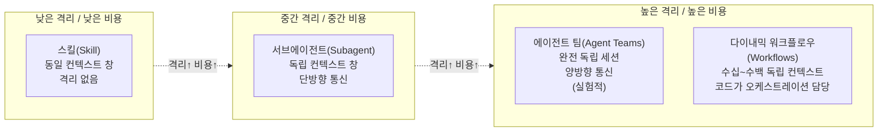

이 스펙트럼에서 오른쪽으로 갈수록 격리가 강해지고, 컨텍스트 오염 위험이 줄어들며, 대규모 병렬 처리가 가능해지지만, 동시에 토큰 비용과 복잡성도 높아진다.

### A.6 정적 워크플로우 vs 다이내믹 워크플로우: 또 하나의 구분

별도로 짚어둘 것이 있다. Anthropic 공식 블로그는 다이내믹 워크플로우를 소개하면서 **정적 워크플로우(Static Workflows)** 와의 차이를 명확히 구분했다.

정적 워크플로우는 Claude Agent SDK나 `claude -p` 명령으로 여러 Claude Code 인스턴스를 수동으로 구성하는 방식이다. 개발자가 직접 어떤 에이전트가 어떤 순서로 실행될지, 어떻게 결과를 전달할지를 미리 코드로 작성한다. 이 방식은 모든 엣지 케이스를 다루어야 하기 때문에 일반적으로 더 범용적이지만 그만큼 더 느슨한 구조가 된다.

반면 다이내믹 워크플로우는 Claude Opus 4.8의 지능을 활용하여, 사용자가 자연어로 목표를 설명하면 Claude가 그 목표에 최적화된 하네스를 즉석에서 직접 설계하고 코드로 작성한다.

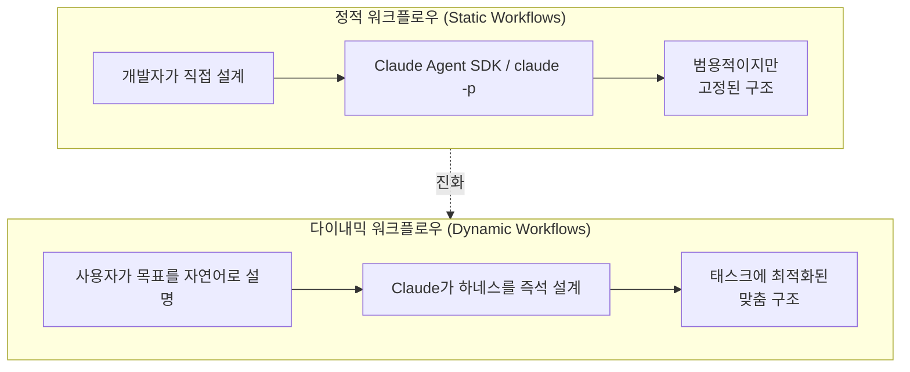

### A.7 의사결정 프레임워크: 언제 무엇을 써야 하는가

위의 내용을 종합하면 다음과 같은 의사결정 흐름이 만들어진다.

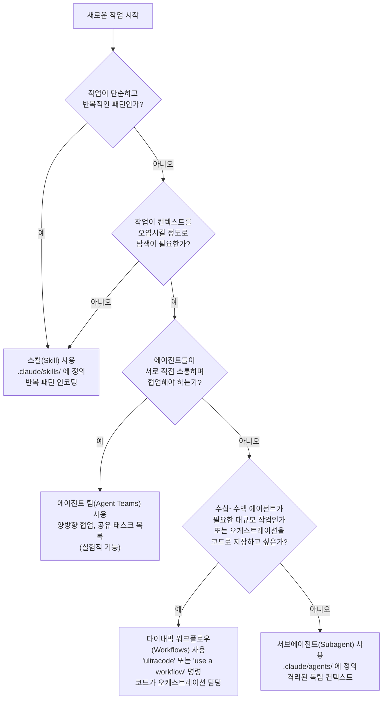

### A.8 요약: 다이내믹 워크플로우의 위치

정리하면, 다이내믹 워크플로우는 두 가지 의미에서 "또 다른 형태의 하네스"라고 볼 수 있다.

첫째로, **기능적 의미**에서 다이내믹 워크플로우는 Claude가 즉석에서 작성하는 태스크별 맞춤 하네스다. 이것은 Anthropic 공식 블로그의 "Claude can now write its own harness on the fly"라는 표현이 명시적으로 이를 하네스라고 부르기 때문이다.

둘째로, **아키텍처적 의미**에서는 다이내믹 워크플로우가 기존 Claude Code 하네스의 위에 올라타는 추가적인 오케스트레이션 레이어라는 점에서, 기존 하네스와 동일한 레벨의 대안적 하네스가 아니라 기존 하네스를 기반으로 동작하는 상위 레이어 하네스라고 보는 것이 더 정확하다.

가장 결정적인 차별점은 **"누가 오케스트레이션을 결정하는가"** 다. 스킬, 서브에이전트, 에이전트 팀 모두 Claude가 턴 바이 턴으로 결정을 내리는 반면, 다이내믹 워크플로우는 JavaScript 코드가 오케스트레이션의 모든 결정을 담당한다. 이것이 다이내믹 워크플로우를 단순히 "더 많은 에이전트를 쓰는 방법"이 아닌, 근본적으로 다른 아키텍처적 접근이라고 보아야 하는 이유다.

---

## 별첨 B: 서브에이전트 vs 에이전트 팀 vs 다이내믹 워크플로우 — 다이내믹 워크플로우 중심 비교

> **출처**: Anthropic 공식 문서(code.claude.com), Anthropic 공식 블로그(2026년 6월 2일), claudefast.com 비교 가이드를 기반으로 작성. 이 별첨은 세 가지 다중 에이전트 접근 방식의 차이를 다이내믹 워크플로우의 관점에서 정리한다.

---

### B.1 세 가지를 혼동하는 이유와 핵심 구분선

Claude Code로 복잡한 작업을 처리할 때 선택할 수 있는 세 가지 다중 에이전트 접근 방식인 서브에이전트(Subagents), 에이전트 팀(Agent Teams), 다이내믹 워크플로우(Dynamic Workflows)는 표면적으로 모두 "여러 에이전트를 써서 작업을 나눈다"는 점이 비슷해 보인다. 그러나 이 셋은 근본적으로 서로 다른 문제를 해결하기 위해 설계된 별개의 실행 모델이다. 혼동의 근원은 이 셋이 서로 다른 레이어에 존재한다는 사실을 모를 때 생긴다.

Anthropic 공식 문서와 Claude Fast 비교 가이드는 이를 다음과 같이 정리한다.

**핵심 구분선은 딱 하나다: "에이전트들이 서로 대화할 수 있는가?"**

- **서브에이전트와 다이내믹 워크플로우**: 에이전트들은 서로 통신하지 않는다. 각자 격리된 컨텍스트 창에서 자신의 임무만 수행하고 결과를 돌려줄 뿐이다.
- **에이전트 팀**: 팀원(Teammate) 세션들이 공유 태스크 목록과 직접 P2P 메시지를 통해 서로 대화하고 계약을 협상한다.

이 구분선에서 파생되는 모든 차이가 아래에서 설명된다.

---

### B.2 오케스트레이션 구조 비교

세 가지가 에이전트들을 어떻게 배치하고 결과를 모으는지를 도해화하면 다음과 같다.

```mermaid
graph TD

    subgraph DW["다이내믹 워크플로우 (Dynamic Workflows)"]
        DW_JS["JavaScript 스크립트<br/>(오케스트레이터 = 코드)"]
        DW_A1["에이전트 1<br/>격리"]
        DW_A2["에이전트 2<br/>격리"]
        DW_AN["에이전트 N<br/>격리"]
        DW_JS --> DW_A1
        DW_JS --> DW_A2
        DW_JS --> DW_AN
        DW_A1 -. "결과 → 스크립트 변수" .-> DW_JS
        DW_A2 -. "결과 → 스크립트 변수" .-> DW_JS
        DW_AN -. "결과 → 스크립트 변수" .-> DW_JS
    end

    subgraph AT["에이전트 팀 (Agent Teams)"]
        AT_LEAD["리드 에이전트<br/>(오케스트레이터 = Claude LLM)"]
        AT_T1["팀원 A<br/>독립 세션"]
        AT_T2["팀원 B<br/>독립 세션"]
        AT_TASK["공유 태스크 목록"]
        AT_LEAD <--> AT_T1
        AT_LEAD <--> AT_T2
        AT_T1 <--> AT_T2
        AT_T1 <--> AT_TASK
        AT_T2 <--> AT_TASK
    end

    subgraph SA["서브에이전트 (Subagents)"]
        SA_MAIN["메인 에이전트<br/>(오케스트레이터 = Claude)"]
        SA_W1["서브에이전트 1"] 
        SA_W2["서브에이전트 2"]
        SA_W3["서브에이전트 3"]
        SA_MAIN --> SA_W1
        SA_MAIN --> SA_W2
        SA_MAIN --> SA_W3
        SA_W1 -. "결과만 반환" .-> SA_MAIN
        SA_W2 -. "결과만 반환" .-> SA_MAIN
        SA_W3 -. "결과만 반환" .-> SA_MAIN
    end

```

서브에이전트와 다이내믹 워크플로우는 모두 에이전트들이 서로 직접 통신하지 않는다는 점이 같다. 그러나 **누가 오케스트레이션을 담당하는가**가 결정적으로 다르다. 서브에이전트는 Claude 자신이 턴 바이 턴으로 다음 에이전트를 결정하는 반면, 다이내믹 워크플로우는 JavaScript 코드가 미리 설계된 구조에 따라 모든 에이전트 생성과 결과 집계를 자동으로 처리한다.

---

### B.3 항목별 상세 비교표

아래 표는 Anthropic 공식 문서의 비교표와 Claude Fast 비교 가이드를 종합하여 다이내믹 워크플로우를 기준으로 정리한 것이다.

| 비교 항목 | 서브에이전트 (Subagents) | 에이전트 팀 (Agent Teams) | **다이내믹 워크플로우 (Workflows)** |
|---|---|---|---|
| **오케스트레이션 주체** | Claude (턴 바이 턴 결정) | Claude LLM (리드가 실시간 결정) | **JavaScript 코드 (사전 설계)** |
| **에이전트 간 통신** | 없음. 자식→부모 단방향 보고만 가능 | 팀원 간 P2P 메시지 + 공유 태스크 목록 | **없음. 완전 격리. 코드가 중간 결과 보유** |
| **중간 결과 저장 위치** | Claude의 컨텍스트 창 | 공유 태스크 목록 | **스크립트 변수 (컨텍스트 창 밖)** |
| **규모** | 한 턴에 소수의 위임 태스크 | 보통 2~5명의 팀원 | **동시 최대 16개, 실행당 총 1,000개** |
| **결정론적 실행** | 아니오 (Claude가 매번 다시 결정) | 아니오 (LLM 기반 실시간 협상) | **예 (같은 스크립트 + 같은 입력 → 같은 실행)** |
| **재개 가능성** | 불가 (턴 중단 시 재시작) | 팀원은 계속 실행되지만 세션 복원 복잡 | **가능 (동일 세션 내에서 재개, 완료분 캐시 활용)** |
| **저장 및 재사용** | 워커 정의만 재사용 가능 | 팀 구성 정의만 재사용 가능 | **스크립트 파일 자체를 저장해 동일 오케스트레이션 재실행** |
| **계획 보유 주체** | Claude (컨텍스트 창 안) | Claude LLM (실시간 협상) | **코드 (컨텍스트 창 밖, 스크립트 자체)** |
| **실패 유형 구조적 방어** | 아니오 | 부분적 (팀원 간 토론은 가능하나 자가 채점 방어 없음) | **예. 격리 + 적대적 검증 구조로 3가지 실패 모두 방어** |
| **인간 개입** | 턴 중 가능 | 팀원에게 직접 메시지 가능 | **실행 중 불가. 에이전트 권한 확인 프롬프트만 예외** |
| **토큰 비용** | 낮음 (결과 요약본만 메인으로 반환) | 높음 (각 팀원이 완전한 독립 Claude 인스턴스, 약 2~4배) | **높음 + 데이터 의존적 (예산으로 상한 설정 가능)** |
| **최적 단위 형태** | 몇 개의 집중적이고 독립적인 태스크 | 소수의 깊이 상호의존하는 조각 (계약이 유동적) | **수십~수백 개의 독립적인 단위** |
| **계약 변경 적응** | 불가 | 가능 (실시간 P2P 협상으로 재협상) | **불가 (스크립트 구조가 실행 전에 확정됨)** |
| **활성화 방법** | 기본 활성화 | `CLAUDE_CODE_EXPERIMENTAL_AGENT_TEAMS=1` 설정 필요 | `/config`에서 활성화 또는 `ultracode` 키워드 |
| **프로덕션 안정성** | 안정 | **실험적 기능** (세션 복원, 태스크 조율, 종료 동작에 알려진 제한) | 리서치 프리뷰 (v2.1.154 이상 필요) |

---

### B.4 다이내믹 워크플로우 vs 서브에이전트: 1:1 비교

#### 무엇이 같은가

두 접근 방식 모두 에이전트들 사이의 직접 통신이 없으며, 각 에이전트는 격리된 컨텍스트 창에서 독립적으로 작동한다. 둘 다 메인 에이전트가 하위 작업을 위임하는 구조이기 때문에, 단순히 "몇 개의 독립적인 하위 작업을 처리해야 할 때"라면 서브에이전트로도 충분한 경우가 많다.

#### 무엇이 결정적으로 다른가

가장 중요한 차이는 **"오케스트레이션 논리가 어디에 있는가"** 다. 서브에이전트를 사용할 때는 Claude가 매 턴마다 "다음에 어떤 에이전트를 생성할까"를 실시간으로 판단한다. 이 방식은 Claude의 컨텍스트 창이 모든 중간 결과를 축적하며 커지고, 컨텍스트가 길어질수록 에이전트 나태함과 목표 유실 문제가 발생한다.

다이내믹 워크플로우에서는 오케스트레이션 논리 전체가 JavaScript 코드로 기술된다. 루프, 분기, 배리어 동기화, 결과 집계 모두 코드가 처리하므로 Claude의 컨텍스트 창에는 최종 답변만 남는다. 또한 서브에이전트는 단일 세션 내에서만 작동하므로 몇 개의 위임 태스크가 한계지만, 다이내믹 워크플로우는 스크립트 차원에서 동시 최대 16개, 총 1,000개의 에이전트를 조율할 수 있다.

```mermaid
flowchart LR
    subgraph SW["서브에이전트 방식의 한계"]
        SW1["Claude가 매 턴\n다음 에이전트 결정"]
        SW2["중간 결과가\n모두 컨텍스트에 쌓임"]
        SW3["컨텍스트 포화 →\n에이전트 나태함\n목표 유실 발생"]
        SW1 --> SW2 --> SW3
    end

    subgraph DWW["다이내믹 워크플로우 방식"]
        DW1["JS 스크립트가\n오케스트레이션 전체 담당"]
        DW2["중간 결과는\n스크립트 변수에만 저장"]
        DW3["컨텍스트 깨끗 →\n세 가지 실패 구조적 방어"]
        DW1 --> DW2 --> DW3
    end

    SW -. "스케일 한계 도달 시\n전환 고려" .-> DWW
```

#### 서브에이전트가 더 나은 상황

작업이 몇 개의 독립적이고 집중적인 하위 태스크로 명확하게 구성되고, 결과의 요약본만 메인 컨텍스트로 돌아오면 충분할 때는 서브에이전트가 더 간단하고 저렴한 선택이다. 예를 들어 "이 파일 세 개를 각각 분석해줘"나 "이 두 데이터셋을 병렬로 처리해줘" 같은 경우다.

#### 다이내믹 워크플로우가 필요한 상황

단위의 수가 수십~수백 개로 많아지거나, 결과물의 신뢰성을 위해 독립적인 검증이 구조적으로 필요하거나, 오케스트레이션 자체를 코드로 저장하고 재현 가능한 형태로 만들어야 할 때다.

---

### B.5 다이내믹 워크플로우 vs 에이전트 팀: 1:1 비교

#### 핵심 충돌 지점

이 둘은 표면적으로 가장 비슷해 보이지만 실제로는 가장 다른 철학을 가지고 있다. Claude Fast 가이드의 표현을 빌리면 이렇다.

> "에이전트 팀은 구성 요소들이 서로 대화하면서 작업하는 소수의 깊이 상호의존하는 단위를 위한 것이다. 다이내믹 워크플로우는 많은 독립적인 단위들을 위한 것이다."

에이전트 팀의 강점은 **"라이브 협상(Live Negotiation)"** 이다. 프론트엔드 팀원이 API 스펙이 잘못됐다는 것을 발견하면 백엔드 팀원에게 직접 메시지를 보내고, 백엔드가 수정하고, 두 팀원이 다시 동기화된다. 이 실시간 양방향 피드백 루프는 다이내믹 워크플로우가 구조적으로 제공할 수 없는 것이다. 격리된 에이전트들은 서로 피드백을 주고받을 수 없기 때문이다.

반대로 다이내믹 워크플로우의 강점은 **"구조적 방어와 규모"** 다. 에이전트 팀에서는 한 팀원이 자신의 결과물을 호평할 수 있고, 팀원 간 메시지가 누락되거나 드리프트될 수 있다. 다이내믹 워크플로우는 생성 에이전트와 검증 에이전트를 코드 레벨에서 강제로 분리하기 때문에 자가 우대 편향이 구조적으로 차단된다.

```mermaid
flowchart TB
    subgraph AT2["에이전트 팀이 이기는 영역"]
        AT2_1["소수(2~5개)의\n깊이 상호의존하는 조각"]
        AT2_2["설계 중에 계약이\n유동적으로 변하는 경우"]
        AT2_3["팀원 간 실시간\n협상이 필요한 경우"]
        AT2_1 --> AT2_2 --> AT2_3
    end

    subgraph DW2["다이내믹 워크플로우가 이기는 영역"]
        DW2_1["많은(수십~수백) 독립적인\n동일 유형의 단위"]
        DW2_2["검증 집중적이거나\n크기가 미리 불확실한 경우"]
        DW2_3["재현 가능하고\n저장 가능한 실행이 필요한 경우"]
        DW2_1 --> DW2_2 --> DW2_3
    end
```

#### 에이전트 팀이 더 나은 상황

작업이 2~5개의 서로 깊이 의존하는 조각으로 구성되고, 그 조각들 사이의 인터페이스(API 계약, 데이터 스키마 등)가 작업 도중 변경될 가능성이 높을 때다. 예를 들어 새로운 인증 기능을 개발하면서 DB 스키마, API 계약, UI가 모두 동시에 설계되고 서로 영향을 미치는 경우가 전형적이다. 각 팀원이 자신의 레이어를 소유하면서 서로 실시간으로 조율할 때 에이전트 팀이 빛난다.

#### 다이내믹 워크플로우가 더 나은 상황

동일한 유형의 단위가 많이 존재하거나(파일별, 주장별, 이력서별, 규칙별), 작업의 총량이 미리 알 수 없거나(모든 버그를 찾아라, 모든 수정 패턴을 마이닝하라), 결과가 재현 가능하고 저장 가능해야 하거나, 독립적인 검증이 구조적으로 필요한 경우다.

주의할 점은, 에이전트 팀이 "계약 선설계(Contract-First)" 형태로 사용되는 경우 다이내믹 워크플로우로 대체 가능한 경우가 많다는 것이다. 1단계에서 스키마를 생성하고, 2단계의 에이전트들에게 그 스키마를 전달하는 방식은 다이내믹 워크플로우의 Fan Out 패턴으로 충분히 구현할 수 있다. 에이전트 팀이 대체 불가능한 영역은 오직 "작업 도중 팀원 간 직접 피드백이 반드시 필요한 경우"뿐이다.

---

### B.6 실전 시나리오별 선택 가이드

아래는 실제 업무 상황을 시나리오별로 매핑한 것이다. 각 시나리오에서 세 가지 중 무엇이 가장 적합한지와 그 이유를 설명한다.

**시나리오 A: 코드베이스 전체 보안 감사 (파일 200개)**

이 경우 다이내믹 워크플로우가 명확한 선택이다. 파일 하나당 에이전트 하나씩 팬아웃하여 병렬 분석하고, 적대적 검증으로 거짓 양성을 걸러내고, 클린 패스가 나올 때까지 Loop Until Done을 적용한다. 서브에이전트로는 200개의 파일을 하나의 Claude 세션이 턴 바이 턴으로 처리해야 하므로 컨텍스트 포화와 에이전트 나태함이 발생한다. 에이전트 팀은 팀원들이 서로 직접 통신할 필요가 없는 이 경우에 오버킬이다.

**시나리오 B: 새로운 결제 기능 개발 (DB 스키마 + API + UI 동시 설계)**

이 경우 에이전트 팀이 가장 적합하다. DB 설계 팀원, API 설계 팀원, UI 설계 팀원이 서로의 요구사항 변화에 실시간으로 반응하고 계약을 재협상해야 한다. 다이내믹 워크플로우는 에이전트들이 서로 통신할 수 없으므로 이 실시간 재협상이 불가능하다.

**시나리오 C: 블로그 글 팩트체크 (주장 35개 개별 검증)**

다이내믹 워크플로우가 최선이다. 추출 에이전트가 모든 주장을 개별 항목으로 분리하면, 주장 하나당 독립된 검증 에이전트를 팬아웃하고, 각 검증 에이전트와 분리된 회의론자 에이전트가 교차 검증한다. 서브에이전트로도 구현할 수 있지만, 35개의 주장과 그 검증 과정이 모두 메인 컨텍스트에 쌓이면 컨텍스트 포화가 발생할 수 있다.

**시나리오 D: 이력서 500개 중 최종 후보 10명 선발**

다이내믹 워크플로우의 토너먼트 패턴이 최선이다. 500개를 한 번에 처리하면 컨텍스트가 포화되고 일관성이 무너진다. 2개씩 짝지어 독립된 에이전트가 1:1 비교하는 토너먼트 구조로 규모 문제와 일관성 문제를 동시에 해결한다.

**시나리오 E: 간헐적 버그 추적 (50회 중 1회 실패하는 Flaky Test)**

다이내믹 워크플로우의 Loop Until Done 패턴이 최선이다. 가설을 세우고, 격리된 worktree에서 테스트하고, 실패하면 새 에이전트로 다음 가설을 테스트하는 과정을 성공 조건 충족 시까지 반복한다.

**시나리오 F: 특정 파일 한 개 버그 수정**

일반 단일 세션 또는 소수의 서브에이전트로 충분하다. 워크플로우나 에이전트 팀을 사용하면 오버엔지니어링이 된다.

---

### B.7 종합 의사결정 흐름도

아래 흐름도는 실제 작업을 받았을 때 어떤 접근 방식을 선택할지 판단하는 과정을 시각화한 것이다. 다이내믹 워크플로우가 적합한 조건을 명시적으로 표시했다.

```mermaid
flowchart TD
    START["새 작업 시작"]

    Q_SIMPLE{"소수의 독립 태스크이며\n결과 요약만 필요한가?"}
    Q_LIVE{"작업 도중 에이전트들이\n서로 실시간으로 대화하고\n계약을 재협상해야 하는가?"}
    Q_UNITS{"독립적인 단위가\n수십 개 이상인가?\n또는 작업 총량이\n미리 불확실한가?"}
    Q_REPRO{"오케스트레이션 구조를\n코드로 저장하고\n재현 가능하게 만들 필요가 있는가?"}

    RES_SA["✅ 서브에이전트(Subagents)\n소수의 독립 워커, 단방향 보고\n가장 단순하고 저렴한 선택"]
    RES_AT["✅ 에이전트 팀(Agent Teams)\n2~5명의 팀원이 P2P 통신\n계약이 유동적인 소규모 협업\n(실험적 기능)"]
    RES_DW["✅ 다이내믹 워크플로우\n코드가 오케스트레이션 담당\n수십~수백 에이전트 조율 가능\n6대 패턴으로 구조적 품질 보증"]
    RES_EITHER["✅ 서브에이전트 또는\n다이내믹 워크플로우 모두 가능\n(규모와 재현성 필요 여부로 결정)"]

    START --> Q_SIMPLE
    Q_SIMPLE -- "예" --> RES_SA
    Q_SIMPLE -- "아니오" --> Q_LIVE
    Q_LIVE -- "예" --> RES_AT
    Q_LIVE -- "아니오" --> Q_UNITS
    Q_UNITS -- "예" --> RES_DW
    Q_UNITS -- "아니오" --> Q_REPRO
    Q_REPRO -- "예" --> RES_DW
    Q_REPRO -- "아니오" --> RES_EITHER
```

---

### B.8 요약: 다이내믹 워크플로우가 두 접근 방식을 능가하는 조건

다이내믹 워크플로우는 만능 도구가 아니다. 그러나 다음 조건 중 하나라도 해당하면 서브에이전트나 에이전트 팀보다 다이내믹 워크플로우가 구조적으로 우월한 결과를 만들어낸다.

첫째로, 동일 유형의 독립 단위가 수십 개 이상일 때다. 서브에이전트는 이 규모에서 컨텍스트 포화로 실패하고, 에이전트 팀은 이런 단순 반복 작업에 과도한 오버헤드를 발생시킨다.

둘째로, 자가 우대 편향을 구조적으로 차단해야 할 때다. 에이전트 팀은 팀원 간 토론이 가능하지만 팀원이 자신의 작업을 스스로 좋게 평가하는 것을 코드 레벨에서 막지 못한다. 다이내믹 워크플로우의 적대적 검증 패턴은 생성 에이전트와 검증 에이전트를 코드로 분리하여 이를 구조적으로 방어한다.

셋째로, 오케스트레이션 구조를 재사용 가능한 코드로 남겨야 할 때다. 저장된 워크플로우 스크립트는 같은 구조를 언제든지 재실행할 수 있는 결정론적 아티팩트가 된다. 서브에이전트와 에이전트 팀은 이런 재현 가능성을 제공하지 않는다.

넷째로, 작업의 크기가 미리 알 수 없을 때다. "모든 버그를 찾을 때까지", "새로운 수정 패턴이 나오지 않을 때까지"처럼 종료 조건이 탐색 결과에 달려 있는 경우, Loop Until Done 패턴이 이를 코드 레벨에서 처리한다.

반대로, 2~5개의 조각이 서로의 결과물을 보고 실시간으로 계약을 재협상해야 한다면 에이전트 팀이 유일한 선택이다. 다이내믹 워크플로우의 격리된 에이전트들은 서로 피드백을 주고받을 수 없기 때문이다.

---

*작성 일자: 2026-06-06*

