> **출처**: "LangChain Just Released Deep Agents — And It Changes How You Build AI Systems" (Medium, Darshandagaa, 2026-04-03)  
> / "How to Build a Custom Agent Harness" (LangChain Blog, Sydney Runkle, 2026-06-03)  
> **최신 정보 반영**: 2026년 6월 기준 (deepagents v0.6.6, Interrupt 2026 발표 내용 포함)

---

## 목차

1. [왜 Deep Agents가 등장했는가](#1-왜-deep-agents가-등장했는가)
2. [에이전트 = 모델 + 하네스: 핵심 개념 정리](#2-에이전트--모델--하네스-핵심-개념-정리)
3. [LangChain 생태계의 3계층 구조](#3-langchain-생태계의-3계층-구조)
4. [Deep Agents(deepagents)란 정확히 무엇인가](#4-deep-agentsdeepagents란-정확히-무엇인가)
5. [5가지 내장 핵심 기능 상세 해설](#5-5가지-내장-핵심-기능-상세-해설)
6. [create_agent: 커스텀 하네스의 최소 프리미티브](#6-create_agent-커스텀-하네스의-최소-프리미티브)
7. [미들웨어 아키텍처: 하네스를 커스터마이징하는 방법](#7-미들웨어-아키텍처-하네스를-커스터마이징하는-방법)
8. [실전 예제: 웹 리서치 에이전트 구축](#8-실전-예제-웹-리서치-에이전트-구축)
9. [Deep Agents CLI: 터미널 코딩 에이전트](#9-deep-agents-cli-터미널-코딩-에이전트)
10. [언제 무엇을 써야 하는가: 선택 가이드](#10-언제-무엇을-써야-하는가-선택-가이드)
11. [Interrupt 2026: Deep Agents 생태계의 최신 동향](#11-interrupt-2026-deep-agents-생태계의-최신-동향)
12. [타 에이전트 SDK와의 비교](#12-타-에이전트-sdk와의-비교)
13. [전체 아키텍처 Mermaid 다이어그램](#13-전체-아키텍처-mermaid-다이어그램)
14. [결론: 에이전트 하네스 시대의 의미](#14-결론-에이전트-하네스-시대의-의미)

**별첨**

- [별첨 A: 미들웨어 공식 레퍼런스 — 개요 및 LangGraph 통합](#별첨-a-미들웨어-공식-레퍼런스--개요-및-langgraph-통합)
- [별첨 B: 사전 빌드 미들웨어 전체 레퍼런스](#별첨-b-사전-빌드-미들웨어-전체-레퍼런스)
- [별첨 C: 커스텀 미들웨어 작성 완전 가이드](#별첨-c-커스텀-미들웨어-작성-완전-가이드)
- [별첨 D: Claude Code 유사 코딩 에이전트 하네스 아키텍처 정의서](#별첨-d-claude-code-유사-코딩-에이전트-하네스-아키텍처-정의서)

---

## 1. 왜 Deep Agents가 등장했는가

에이전트를 진지하게 구축해본 거의 모든 팀에서 동일한 패턴이 반복된다. 처음에는 LangChain의 체인(chain)으로 시작한다. 단순한 파이프라인에서는 잘 작동한다. 그런데 태스크가 복잡해지면 — 도구 호출이 필요하고, 루프를 돌아야 하고, 가변 길이 출력을 처리해야 하는 순간이 오면 — 체인만으로는 부족하다는 것을 깨닫는다. 그래서 LangGraph를 집어든다. 그런데 LangGraph를 쓰기 시작하면 실제 문제를 풀기도 전에 상태 스키마(state schema), 조건부 엣지(conditional edge), 그래프 컴파일 로직부터 작성해야 한다는 현실에 부딪힌다.

LangGraph 자체가 나쁜 것이 아니다. LangGraph는 극도로 강력한 런타임이다. 그러나 그것은 저수준 프리미티브(low-level primitive)이며, 대부분의 팀은 그것을 애플리케이션 프레임워크인 양 사용하고 있다. LangChain은 이 문제를 인식했고, `deepagents`가 그 해답이다.

핵심은 이것이다. 에이전트를 직접 구현할 때마다 반복해서 만들어야 했던 것들 — 컨텍스트 관리, 서브에이전트 위임, 플래닝 루프, 장기 메모리 — 이것들이 이미 충분히 공통적인 문제가 되었다. LangChain은 이 해법들을 표준화할 때가 왔다고 판단했다. 에이전트 하네스(agent harness)라는 개념이 바로 그 표준화의 산물이다.

---

## 2. 에이전트 = 모델 + 하네스: 핵심 개념 정리

LangChain의 공식 블로그 포스트(2026-06-03)에서 시드니 런클(Sydney Runkle)은 에이전트를 다음과 같이 정의한다.

```
agent = model + harness
```

이 등식은 단순해 보이지만, AI 에이전트 엔지니어링의 본질을 관통한다. **모델**은 추론 엔진이다. 언어를 이해하고 다음 행동을 결정한다. 그런데 모델만으로는 아무것도 할 수 없다. 모델이 현실 세계와 연결되려면 **하네스(harness)** 가 필요하다.

하네스는 모델 주변의 스캐폴딩(scaffolding)이다. 모델이 무엇을 알아야 하는지(컨텍스트), 무엇을 할 수 있는지(도구), 어떤 지침을 따라야 하는지(시스템 프롬프트), 과거를 어떻게 기억하는지(메모리), 복잡한 태스크를 누구에게 위임할 수 있는지(서브에이전트) — 이 모든 것을 조율하는 인프라가 바로 하네스다.

에이전트의 근본적인 루프는 놀라울 정도로 단순하다. 모델이 도구를 루프 형태로 호출하다가 태스크가 완료되면 결과를 반환한다. 그 단순한 루프 위에 얼마나 정교한 하네스를 올리느냐가 에이전트의 실질적인 능력을 결정한다.

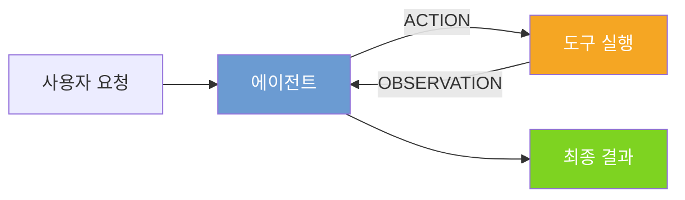

하네스가 중요한 이유는 분명하다. 에이전트는 모델이 받는 컨텍스트만큼만 좋다. 하네스의 역할은 매 단계마다 모델에게 올바른 컨텍스트를 적시에 제공하는 것이다. 따라서 유용한 에이전트를 만들려면, 주어진 태스크에 맞게 올바른 컨텍스트를 잘 전달하는 하네스가 필요하다.

---

## 3. LangChain 생태계의 3계층 구조

LangChain 에코시스템에는 현재 세 가지 레이어가 존재하며, 많은 개발자가 이를 혼동한다. 각각이 무엇이고 어떤 관계인지 명확히 정리하면 다음과 같다.

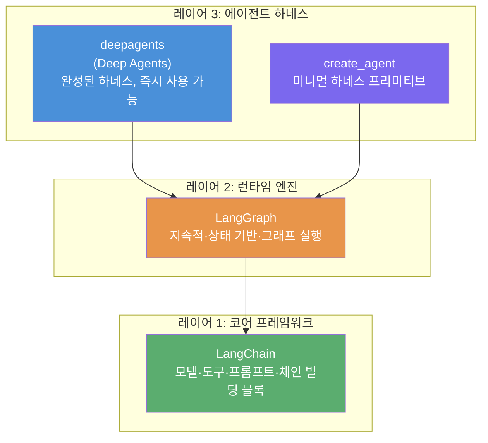

**LangChain**은 프레임워크다. 모델, 도구, 프롬프트, 체인 등 에이전트를 구성하는 기본 빌딩 블록을 제공한다. 기반 계층이다.

**LangGraph**는 런타임이다. 지속적이고 상태 기반인 그래프 실행 환경으로, 영속성(persistence), 스트리밍, 인터럽트, 복잡한 조건부 흐름을 처리한다. 엔진 역할이다.

**Deep Agents**는 하네스다. LangGraph와 LangChain 위에 올라간다. LangGraph를 대체하는 것이 아니라 내부적으로 LangGraph를 사용한다. Deep Agents가 제공하는 것은 의견이 담긴(opinionated) 기본값과 고수준 API다. 플래너, 파일시스템 계층, 컨텍스트 압축, 서브에이전트 인프라를 매번 처음부터 구축하지 않아도 된다.

Github의 deepagents 저장소는 이 관계를 자동차 비유로 설명한다. LangGraph는 엔진과 변속기를 준다. Deep Agents는 자동차를 준다. 즉, LangGraph가 엔진이라면 Deep Agents는 그 엔진을 탑재한 완성차다.

**`create_agent`** 는 이 생태계에서 중간 지점에 해당한다. LangChain이 제공하는 커스텀 하네스 구축을 위한 최소 프리미티브(minimal primitive)로, 핵심 에이전트 루프만 구현한다. 미들웨어를 통한 세밀한 커스터마이징이 가능한 동시에, Deep Agents처럼 번들된 미들웨어 스택을 제공하지는 않는다.

---

## 4. Deep Agents(deepagents)란 정확히 무엇인가

`deepagents`는 독립형 Python 라이브러리다. `pip install deepagents`로 설치한다. LangChain과 LangGraph 위에서 동작하며, LangChain 공식 문서에서는 이것을 "에이전트 하네스(agent harness)"로 정의한다. 즉, 다른 프레임워크와 동일한 핵심 도구 호출 루프를 제공하되, 처음부터 재발명하지 않아도 되는 내장 기능 세트가 함께 들어 있다.

2026년 3월에 Deep Agents Deploy와 함께 발표되었으며, 2026년 6월 현재 PyPI 기준 최신 버전은 `deepagents==0.6.6`이다. MIT 라이선스로 공개되어 있다.

라이브러리의 핵심 함수는 `create_deep_agent()`다. 가장 단순한 형태로 사용하면 다음과 같다.

```python
from deepagents import create_deep_agent

def get_weather(city: str) -> str:
    """Get weather for a given city."""
    return f"It's always sunny in {city}!"

agent = create_deep_agent(
    tools=[get_weather],
    system_prompt="You are a helpful assistant",
)

agent.invoke(
    {"messages": [{"role": "user", "content": "What is the weather in Mumbai?"}]}
)
```

단 한 개의 함수 호출이다. 내부적으로는 LangGraph 그래프, 상태 관리, 스트리밍, 컨텍스트 윈도우 관리가 모두 처리된다. 개발자는 이 중 어느 것도 직접 건드리지 않는다. 그러나 진짜 이야기는 기본으로 내장되어 있는 것들에 있다.

deepagents 설계 철학의 핵심은 "신뢰 모델(trust the LLM)"이다. 에이전트는 도구가 허용하는 모든 작업을 수행할 수 있다. 보안 경계는 도구나 샌드박스 수준에서 강제하며, 모델이 스스로 자기 제어를 할 것이라고 기대하지 않는다.

---

## 5. 5가지 내장 핵심 기능 상세 해설

### 5.1 계획 수립: `write_todos` 도구

모든 Deep Agent는 기본적으로 `write_todos` 도구에 접근할 수 있다. 복잡한 태스크가 주어지면 에이전트는 이 도구를 사용해 작업을 개별 단계로 분해하고, 각 단계의 상태(pending, in_progress, completed)를 추적하며, 태스크가 진행되면서 계획을 수정한다.

이것이 중요한 이유는 단순히 프롬프트 트릭이 아니기 때문이다. 투두 리스트는 에이전트 상태(agent state)에 영속적으로 저장된다. 에이전트는 세션 전체 생애주기에 걸쳐 이 리스트로 돌아와서 업데이트하고 참조할 수 있다. 모델에게 "단계적으로 생각하라"고 수동으로 프롬프팅할 필요가 없다. 구조 자체가 하네스에 내장되어 있다.

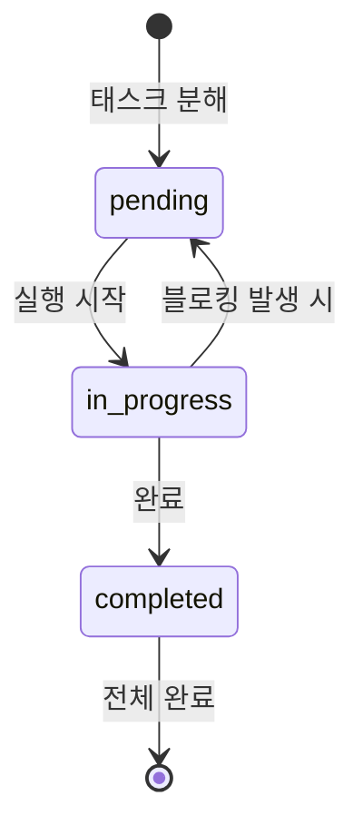

### 5.2 가상 파일시스템

이것이 가장 놀라운 기능이다. Deep Agents는 기본적으로 파일시스템 도구 세트를 제공한다: `ls`, `read_file`, `write_file`, `edit_file`, `glob`, `grep`.

왜 에이전트에 파일시스템이 필요한가? 컨텍스트 관리 때문이다. LLM 컨텍스트 윈도우는 유한하다. 에이전트가 긴 리서치 태스크를 수행하거나, 코드를 실행하거나, 대용량 도구 결과를 처리할 때 대화 히스토리는 순식간에 부풀어 오른다. Deep Agents는 대용량 콘텐츠를 컨텍스트 윈도우에 보관하는 대신 가상 파일시스템에 오프로딩(offloading)하는 방식으로 이 문제를 해결한다.

구체적으로 도구 결과가 20,000 토큰을 초과하면, 라이브러리는 자동으로 해당 내용을 설정된 백엔드에 저장하고, 컨텍스트에서는 파일 경로 참조와 10줄짜리 미리보기로 대체한다. 에이전트는 실제로 해당 내용이 필요할 때 `read_file`이나 `grep`으로 읽어올 수 있다. 이것은 지능적인 컨텍스트 압축이다. 단순한 청킹(chunking)이나 잘라내기(truncation)가 아니라, 필요 시 검색 가능한 목적 지향적 오프로딩이다.

파일시스템 백엔드는 플러그인 가능하다. 메모리 내 상태(기본값), 로컬 디스크, 크로스-스레드 영속성을 위한 LangGraph Store, 또는 Modal, Daytona 같은 샌드박스 환경을 선택할 수 있다.

### 5.3 서브에이전트 스폰(Subagent Spawning)

하네스에는 메인 에이전트가 독립된 서브태스크를 위해 특화된 서브에이전트를 생성할 수 있는 내장 `task` 도구가 포함되어 있다.

이것이 왜 중요한지 이해하려면 단일 에이전트의 한계를 생각해야 한다. 긴 리서치 태스크에서 단일 에이전트가 모든 것을 처리하면, 컨텍스트가 중간 단계, 검색 결과, 부분 출력으로 가득 찬다. 서브에이전트는 이 문제를 우아하게 해결한다. 메인 에이전트가 특정 서브태스크를 깨끗한 컨텍스트 윈도우를 가진 새로운 에이전트 인스턴스에 위임한다. 서브에이전트는 자율적으로 실행되고 작업을 완료한 뒤 단일 요약 결과만 메인 에이전트에게 반환한다. 메인 에이전트의 컨텍스트는 깔끔하게 유지된다.

```python
from deepagents import create_deep_agent, Subagent

code_reviewer = Subagent(
    name="code-reviewer",
    system_prompt="You are an expert code reviewer. Analyze code for bugs, style, and performance.",
    tools=[read_file_tool],
)

agent = create_deep_agent(
    tools=[internet_search],
    subagents=[code_reviewer],
    system_prompt="You are a research and engineering assistant.",
)
```

커스텀 서브에이전트를 자체 도구와 시스템 프롬프트로 구성할 수 있다. 추가 설정 없이도 기본 서브에이전트(파일시스템 도구를 갖춘 범용 에이전트)가 항상 사용 가능하다.

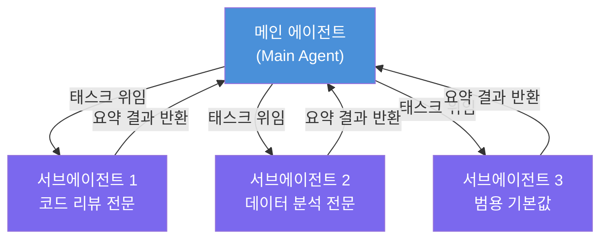

LangGraph의 `CompiledStateGraph`를 서브에이전트로 전달할 수도 있어, 커스텀 오케스트레이션과 하네스의 기본값을 함께 사용하는 것도 가능하다.

### 5.4 자동 컨텍스트 압축 및 요약

이 기능이 장기 실행 태스크에서 라이브러리가 진정한 가치를 발휘하는 지점이다.

에이전트의 컨텍스트가 모델의 컨텍스트 윈도우 한계의 85%에 도달하고, 더 이상 파일시스템에 오프로딩할 것이 없을 때, 하네스는 자동 요약을 트리거한다. LLM이 지금까지 일어난 모든 것에 대한 구조적 요약을 생성한다. 세션 의도, 생성된 아티팩트, 다음 단계가 포함된다. 이 요약이 작업 메모리에서 전체 대화 히스토리를 대체한다. 원본 메시지는 정식 기록으로서 파일시스템에 보존되므로, 에이전트는 필요 시 특정 세부 사항을 복구할 수 있다.

결과적으로 Deep Agents는 컨텍스트 한계에 걸리지 않고 복잡한 태스크를 무기한으로 실행할 수 있다. 이것은 날것의 LangGraph로 수동으로 구현해야 했던 기능이다.

### 5.5 대화 간 장기 메모리

기본적으로 에이전트 상태는 단일 스레드 내에 존재한다. 그러나 LangGraph Store와 함께 `CompositeBackend`를 설정하면, 에이전트는 세션과 스레드에 걸쳐 메모리를 영속시킬 수 있다.

`/memories/` 경로에 저장된 파일은 에이전트 재시작 후에도 살아남고, 어떤 대화 스레드에서든 접근 가능하다. 이것이 사용자의 선호도, 코드베이스 관례, 또는 며칠에 걸친 리서치 프로젝트의 진행 상황을 기억하는 에이전트를 만드는 방법이다.

```python
from deepagents import create_deep_agent
from deepagents.backends import CompositeBackend, StateBackend, StoreBackend
from langgraph.store.memory import InMemoryStore

store = InMemoryStore()
backend = CompositeBackend(
    routes={"/memories/": StoreBackend(store=store)},
    default=StateBackend(),
)

agent = create_deep_agent(
    tools=[...],
    backend=backend,
    memory=["path/to/AGENTS.md"],  # 영속적 컨텍스트 파일
)
```

---

## 6. `create_agent`: 커스텀 하네스의 최소 프리미티브

Deep Agents가 "완성된 차"라면, `create_agent`는 엔진과 기본 섀시만 있는 "키트카(kit car)"에 해당한다. LangChain이 "How to Build a Custom Agent Harness" 블로그 포스트(Sydney Runkle, 2026-06-03)를 통해 공개한 미들웨어 아키텍처의 핵심에 있는 것이 바로 이 `create_agent`다.

`create_agent`의 철학은 의도적으로 최소주의적(minimalistic)이다. 코어 에이전트 루프만 구현하고, 나머지 모든 것은 미들웨어를 통한 커스터마이징으로 남겨둔다. 이 접근 방식은 Pi라는 고도로 설정 가능한 코딩 에이전트 하네스의 철학과 유사하다.

```python
from langchain.agents import create_agent

agent = create_agent(
    model="anthropic:claude-sonnet-4-6",
    tools=tools,
    system_prompt="you are a helpful assistant..."
)
```

Deep Agents와 create_agent의 차이는 LangChain이 내부적으로도 활용하는 지점에서 명확히 드러난다. LangChain이 자체적으로 구축한 모든 에이전트 — GTM 에이전트, 비동기 코딩 에이전트, 노코드 에이전트 빌더 — 는 모두 `create_agent`를 기반으로 하되, 각 에이전트의 미션에 맞게 맞춤화된 미들웨어 스택을 얹어서 만든다. Deep Agents 자체도 `create_agent` 위에 의견이 담긴 미들웨어 스택을 올린 것이다.

---

## 7. 미들웨어 아키텍처: 하네스를 커스터마이징하는 방법

### 7.1 미들웨어란 무엇인가

미들웨어는 에이전트 루프의 매 단계에 — 모델 호출 전후, 도구 호출 전후, 에이전트 시작 및 종료 시 — 끼어드는(hook into) 메커니즘이다. 각 미들웨어는 하나의 관심사(concern)를 처리하며, 다른 미들웨어와 자유롭게 합성(compose)된다.

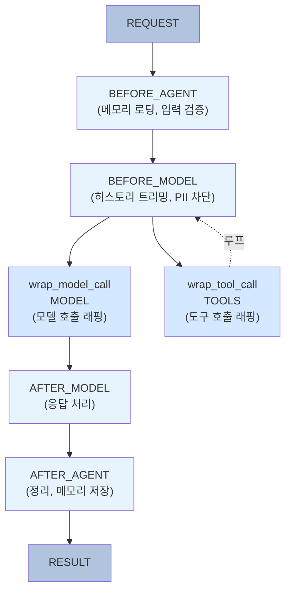

### 7.2 6개의 훅(Hook) 상세

**`before_agent`**: 에이전트 호출 시 한 번 실행된다. 메모리 로딩, 리소스 연결, 초기 입력 검증에 적합하다.

**`before_model`**: 각 LLM 호출 전에 실행된다. 히스토리 트리밍이나 LLM에 전달되기 전 PII(개인 식별 정보) 감지·제거에 활용한다.

**`wrap_model_call`**: 모델 호출 전체를 래핑(wrap)한다. 재시도 로직, 모델 폴백(fallback), 레이턴시 측정에 사용한다.

**`wrap_tool_call`**: 도구 호출을 래핑한다. 도구의 초기화, 실행, 정리(teardown) 전체 생애주기를 관리한다.

**`after_model`**: 모델 응답 처리 직후 실행된다. 스트림 필터링, 메타데이터 주입, 이벤트 라우팅에 사용한다.

**`after_agent`**: 에이전트 실행 완료 시 한 번 실행된다. 메모리 저장, 리소스 정리, 감사 로깅에 적합하다.

### 7.3 미들웨어가 제공하는 4가지 커스터마이징 레버

**결정론적 로직(Deterministic Logic)**: 비즈니스 로직, 정책 집행, 동적 에이전트 제어 — 루프의 특정 지점에서 반드시 실행되어야 하는 모든 것. 태스크 복잡도에 따른 모델 교체, 프롬프트 조정, 에이전트 메시지 히스토리 업데이트(압축 시 등)를 포함한다. 프롬프트 안에 넣을 수 없거나 넣어서는 안 되는 모든 로직의 자리다.

**도구(Tools)**: 에이전트에 도구를 직접 등록하는 대신, 미들웨어가 전체 생애주기(설정, 정리, 등록)를 처리하고 에이전트에게 깔끔한 도구 세트를 전달할 수 있다. 도구에 의존성이 있거나, 초기화가 필요하거나, 실행 종료 시 정리가 필요한 경우 이 방식이 중요하다.

**커스텀 상태(Custom State)**: 미들웨어가 훅들 사이에서 상태를 추적해야 한다면, 에이전트 상태를 커스텀 속성으로 확장할 수 있다. 이를 통해 카운터, 플래그, 또는 에이전트 실행 전체에 걸쳐 지속되는 다른 값들을 관리할 수 있다.

**스트림 핸들러(Stream Handlers)**: 미들웨어가 에이전트의 출력 스트림을 가로채고 변환할 수 있다 — 이벤트 필터링, 메타데이터 주입, 서로 다른 이벤트 타입을 다른 소비자에게 라우팅. UI가 토큰 델타를 소비하고, 감사 로그가 도구 호출을 캡처하고, 모니터링 시스템이 레이턴시를 추적해야 할 때 유용하다.

### 7.4 주요 사전 빌드 미들웨어 목록

LangChain이 제공하는 주요 사전 빌드 미들웨어를 기능 범주별로 정리하면 다음과 같다. 아래 표는 LangChain 블로그(2026-06-03)에서 언급된 범주 분류를 기반으로 하며, 공식 Built-in 목록(docs.langchain.com)에 수록된 것과 일부 차이가 있을 수 있다.

| 기능 범주 | 미들웨어 | 역할 |
|---|---|---|
| 컨텍스트 오버플로 방지 | `SummarizationMiddleware`, `ContextEditingMiddleware` | 장기 세션의 메시지 히스토리가 컨텍스트 윈도우를 초과하지 않도록 관리 |
| 메모리 접근 및 업데이트 | `FilesystemMiddleware`, `MemoryMiddleware`*, `SkillsMiddleware`* | 시작 시 관련 지식 로딩, 실행 종료 시 저장 |
| 환경 내 액션 수행 | `ShellToolMiddleware`, `FilesystemMiddleware`, `CodeInterpreterMiddleware`* | 파일시스템·실행 환경 접근으로 더 창의적인 해법 가능 |
| 태스크 위임 | `SubAgentMiddleware`, `AsyncSubAgentMiddleware`*, `TodoListMiddleware` | 서브에이전트가 깨끗한 컨텍스트 윈도우로 복잡한 서브태스크 처리 |
| 과도기적 실패 처리 | `ToolRetryMiddleware`, `ModelRetryMiddleware`, `ModelFallbackMiddleware` | 모델·도구의 예측 불가능한 실패에 재시도·폴백 로직 적용 |
| 정책 집행 | `PIIMiddleware`, `HumanInTheLoopMiddleware` | PII 처리, 컴플라이언스 체크, 모델이 무엇을 하든 매 호출마다 실행 |
| 에이전트 조종 | `HumanInTheLoopMiddleware` | 중요한 액션 전에 인간 승인 대기 |
| 비용 제어 | `ModelCallLimitMiddleware`, `ToolCallLimitMiddleware`, `PromptCachingMiddleware`(Anthropic) | 프롬프트 캐싱으로 토큰 비용 절감, 호출 횟수 제한 |

> *별표(\*) 표시 항목은 LangChain 블로그에서 언급되었으나, 2026-06-07 기준 공식 Built-in 문서의 공개 목록에서 직접 확인이 어려운 항목이다. 실제 사용 전 공식 레퍼런스([reference.langchain.com](https://reference.langchain.com/python/langchain/middleware/))를 확인하기 바란다.

미들웨어의 아름다움은 세 가지다. 에이전트 루프의 어느 지점에서도 커스터마이징이 가능하고, 관련 로직을 합성 가능하고 공유 가능한 코드 단위로 번들링하며, 각 조각이 격리되어 있어 동일한 미들웨어를 조직 내 모든 에이전트에 재사용할 수 있다.

---

## 8. 실전 예제: 웹 리서치 에이전트 구축

아래는 웹 검색을 수행하고 구조화된 보고서를 생성할 수 있는 리서치 에이전트의 실용적인 예제다.

```python
import os
from typing import Literal
from tavily import TavilyClient
from deepagents import create_deep_agent

tavily_client = TavilyClient(api_key=os.environ["TAVILY_API_KEY"])

def internet_search(
    query: str,
    max_results: int = 5,
    topic: Literal["general", "news", "finance"] = "general",
    include_raw_content: bool = False,
):
    """웹 검색을 실행하고 결과를 반환합니다."""
    return tavily_client.search(
        query,
        max_results=max_results,
        include_raw_content=include_raw_content,
        topic=topic,
    )

research_instructions = """You are an expert researcher. 
Your job is to conduct thorough research and then write a polished report.
Use internet_search to gather information.
Write your findings to files as you go to avoid losing context.
Use write_todos to plan your research steps before starting.
"""

agent = create_deep_agent(
    model="anthropic:claude-sonnet-4-6",  # 기본 모델
    tools=[internet_search],
    system_prompt=research_instructions,
)

result = agent.invoke({
    "messages": [{
        "role": "user",
        "content": "Research the current state of agentic AI frameworks in 2025 and write a structured report."
    }]
})

print(result["messages"][-1].content)
```

이 에이전트를 실행하면 내부에서 다음 순서로 일이 진행된다.

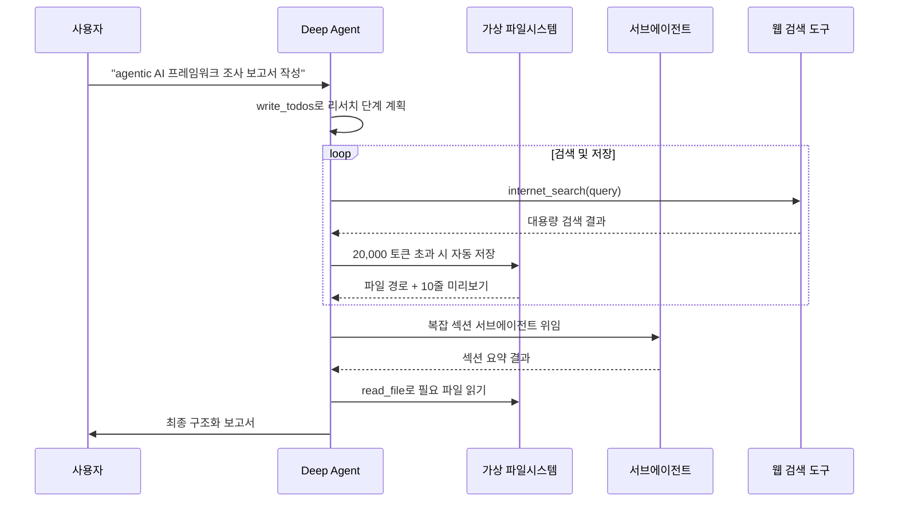

개발자가 작성한 것은 도구 함수와 시스템 프롬프트뿐이다. 플래닝, 파일 오프로딩, 서브에이전트 위임, 컨텍스트 압축은 하네스가 전부 처리했다.

---

## 9. Deep Agents CLI: 터미널 코딩 에이전트

`deepagents`는 같은 SDK 위에 구축된 커맨드라인 에이전트도 함께 제공한다.

```bash
pip install deepagents
deepagents  # 대화형 CLI 에이전트 실행
```

이것은 터미널에서 실행할 수 있는 코딩 에이전트로, Claude Code나 Aider와 유사하지만 Deep Agents SDK 위에 구축된 것이다. 지원 기능은 다음과 같다.

- **대화형 모드**: 인터랙티브 REPL 형태로 실행
- **비대화형 파이프 모드**: `-n` 플래그를 사용해 스크립팅 가능
- **커스텀 스킬**: 에이전트에 프로젝트별 역량 부여
- **영속적 메모리**: 프로젝트 관례를 기억하고 세션 간 유지

CLI 에이전트는 'deepagents-code'라는 이름의 별도 패키지로도 제공되며, 대화형 모드와 비대화형 모드 모두 동일한 `create_deep_agent()` 내부 구조를 사용한다. LangGraph의 인터럽트(interrupt) 기능을 활용한 Human-in-the-Loop 워크플로우도 지원한다.

---

## 10. 언제 무엇을 써야 하는가: 선택 가이드


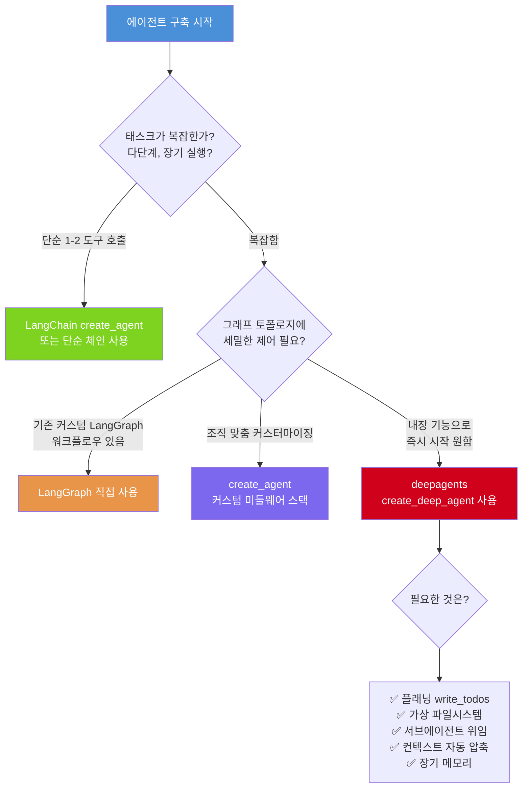

**`deepagents`가 적합한 경우:**

- 태스크가 완료까지 여러 단계와 계획이 필요할 때
- 도구 결과가 크고 긴 세션에 걸쳐 관리해야 할 때
- 인프라를 직접 구축하지 않고 서브에이전트 위임이 필요할 때
- 대화 스레드에 걸친 영속적 메모리가 필요할 때
- 코딩 에이전트나 자율 리서치 시스템을 구축할 때

**LangChain의 `create_agent`나 LangGraph를 사용해야 하는 경우:**

- 에이전트가 단순하다: 짧은 응답을 내는 도구 호출 한두 개
- 그래프 토폴로지에 대한 매우 세밀한 제어가 필요할 때
- 이미 커스텀 LangGraph 워크플로우에 깊이 들어와 있고 의견이 담긴 기본값을 원치 않을 때
- 조직 특유의 정책·비즈니스 로직을 코어 루프에 직접 내장해야 할 때

deepagents 공식 문서 자체도 이 점에 솔직하다. 단순한 에이전트에는 더 단순한 도구를 사용하라.

---

## 11. Interrupt 2026: Deep Agents 생태계의 최신 동향

2026년 5월 13-14일, 샌프란시스코 The Midway에서 열린 LangChain Interrupt 2026에서 LangChain은 에이전트 개발 생태계를 대폭 확장하는 일련의 발표를 했다. 이 발표들은 "프로토타입 에이전트와 프로덕션 등급 시스템 사이의 간극"을 좁히는 데 초점이 맞춰져 있다.

### Managed Deep Agents

Deep Agents를 위한 API 우선(API-first) 호스팅 런타임이다. 오픈소스 Deep Agents 하네스를 기반으로 구축되었으며, 에이전트 서버를 직접 구축하거나 런타임 인프라를 재조립할 필요 없이 복잡한 에이전트를 실행하고 운영할 수 있다. `/v1/deepagents` API를 통해 에이전트를 프로그래밍 방식으로 관리하고, LangSmith에서 모든 실행을 검사할 수 있다.

주요 기능으로는 내구성 있는 스레드(durable threads), 스트리밍 실행, 체크포인팅, Human-in-the-Loop 워크플로우, `AGENTS.md`, `skills/`, `subagents/`, `tools.json`을 지원하는 에이전트 컨텍스트 파일, 그리고 샌드박스 기반 코드 실행이 포함된다.

### LangSmith Engine

자율적인 에이전트 개선 루프를 제공한다. 프로덕션 트레이스를 감시하고, 실패를 명명된 이슈로 클러스터링하고, 실제 코드에 대한 근본 원인을 진단하고, 수정 사항과 평가 커버리지를 PR 형태로 제안한다. 개발자는 검토하고 병합만 하면 된다. Cogent와 Campfire는 이것을 활용해 수천 개의 트레이스에 영향을 미치는 이슈를 해결했다. 현재 퍼블릭 베타로 제공된다.

### SmithDB

에이전트 관찰성(observability)을 위해 특별히 설계된 데이터베이스다. Rust로 작성되었고 Apache DataFusion과 Vortex 위에 구축되었다. 핵심 LangSmith 워크로드에서 최대 15배 빠른 성능을 제공하며, P50 트레이스 트리 로딩이 92ms, P50 단일 실행 로딩이 71ms다. 현재 미국 클라우드 수집의 100%를 처리한다.

### LangSmith Sandboxes GA

에이전트를 위한 보안 코드 실행 환경이 정식 출시(Generally Available)되었다. 각 샌드박스는 하드웨어 가상화된 마이크로VM에서 실행되어 서비스와 다른 샌드박스로부터 격리된다. 스냅샷과 저렴한 포크(fork), 청사진(Blueprints), 비활성 시 자동 일시정지 등의 기능이 포함된다.

### Context Hub

에이전트 동작을 형성하는 파일들 — `AGENTS.md` 파일, 스킬, 정책, 예시, 기타 컨텍스트 번들 — 을 팀이 중앙에서 관리할 수 있게 해주는 플랫폼이다. 버전 관리가 가능한 컨텍스트 번들을 만들고, 파일 히스토리를 볼 수 있으며, 특정 환경으로 컨텍스트를 승격(promote)할 수 있다.

### Deep Agents 0.6 업데이트

Interrupt 2026 시점의 최신 버전인 Deep Agents 0.6은 오픈 소스 모델 통합에 집중했다. GLM5, DeepSeek 같은 오픈 모델과의 통합을 강화했고, NVIDIA와의 파트너십을 통해 다양한 실행 환경(샌드박스, 가상 파일시스템 등)을 지원한다.

---

## 12. 타 에이전트 SDK와의 비교

LangChain 공식 문서는 Deep Agents를 Claude Code 및 OpenAI Codex CLI와 비교하는 섹션을 포함하고 있다. 아래 표는 공개 문서와 각 사의 발표를 종합한 것으로, 일부 항목은 변동될 수 있다.

| 특성 | Deep Agents (LangChain) | Claude Code (Anthropic) | Codex CLI (OpenAI) |
|---|---|---|---|
| 모델 지원 | 모델 무관 (Anthropic, OpenAI, Google 등) | Claude 모델 우선 (Azure, Bedrock, Vertex 포함) | OpenAI 모델 중심 |
| 장기 메모리 | 지원 (CompositeBackend) | AGENTS.md 파일 기반 | 미지원 |
| 관찰성 도구 | LangSmith 네이티브 통합 | 별도 관찰성 도구 없음 | 제한적 |
| 샌드박스 | LangSmith Sandboxes (GA) | 지원 | OS 수준 샌드박스 지원 |
| 배포 옵션 | Managed Deep Agents (클라우드) | 로컬·클라우드 다양 | 제한적 |
| 커스터마이징 | 미들웨어로 세밀한 커스텀 | AGENTS.md, 훅 제공 | 제한적 |
| 보안 모델 | 도구 수준 경계 ("trust the LLM") | OS 수준 권한 제어 | OS 수준 경계 |
| 라이선스 | MIT 오픈소스 | 비공개 (독점) | 비공개 (독점) |

Deep Agents의 가장 명확한 강점은 모델 무관성과 장기 메모리, 그리고 LangSmith를 통한 풍부한 관찰성이다. 반면 Claude Code는 Anthropic 모델과의 퍼스트클래스 통합 및 세밀한 OS 수준 권한 제어에서 강점을 보이고, Codex CLI는 OS 수준 샌드박싱에서 차별화된다.

---

## 13. 전체 아키텍처 Mermaid 다이어그램

### 13.1 LangChain 에이전트 하네스 생태계 전체 지도

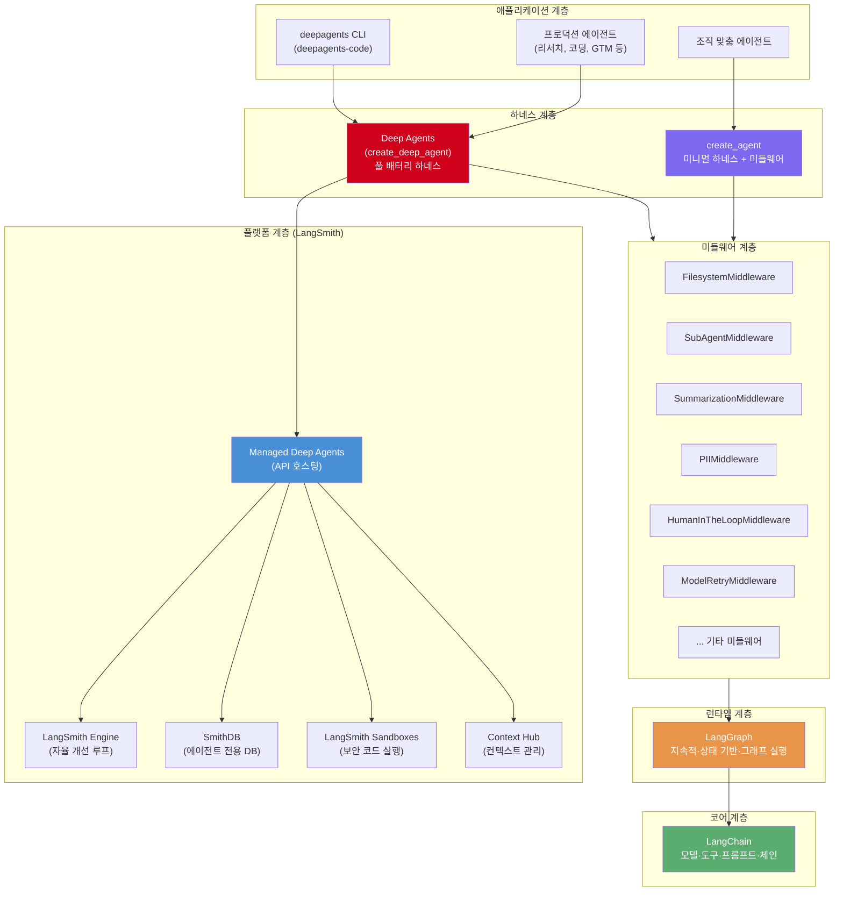

### 13.2 태스크-하네스 적합도 프레임워크

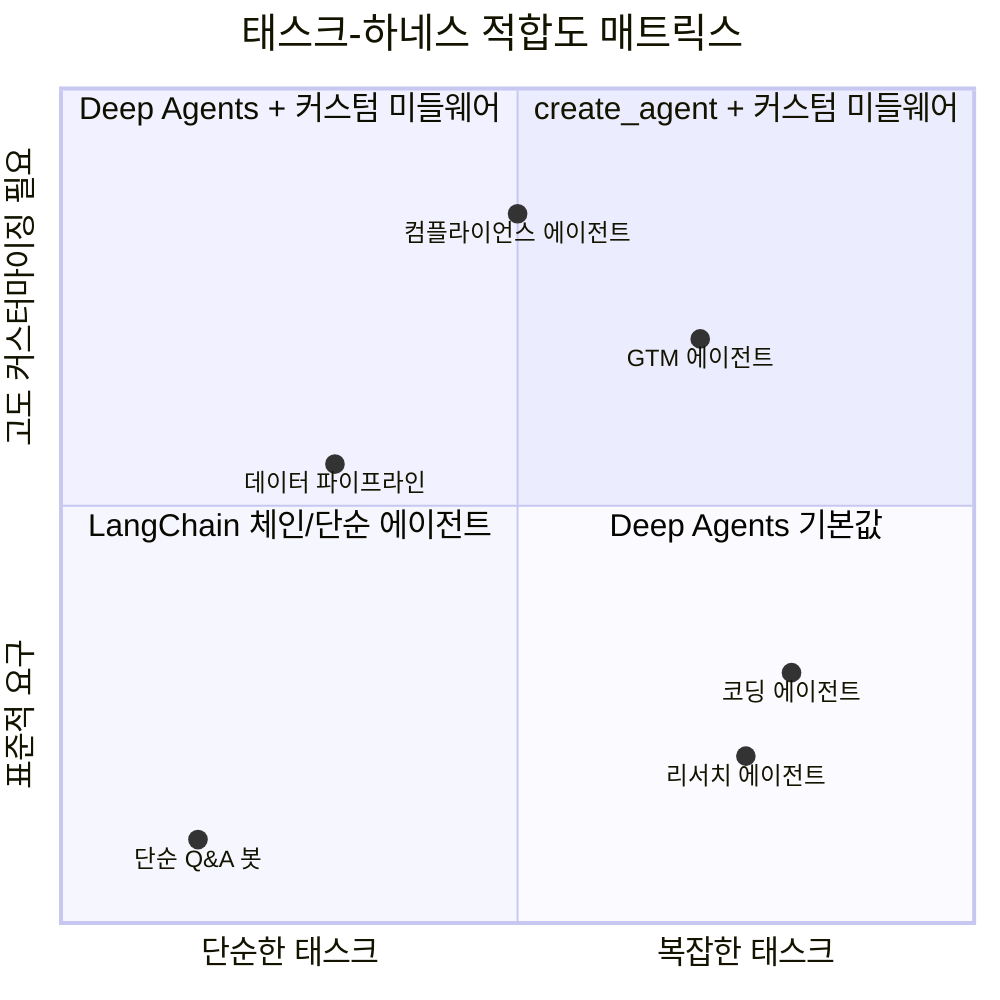

---

## 14. 결론: 에이전트 하네스 시대의 의미

이 발표의 시점에 주목할 필요가 있다. 에이전트형 AI는 변곡점에 와 있다. 기본 패턴들 — 도구 호출, ReAct 루프, 단순한 RAG — 은 이미 충분히 이해되었다. 업계가 지금 씨름하는 것은 에이전트를 장기 수평(long-horizon) 태스크에서 신뢰할 수 있게 만드는 방법이다. 계획, 대용량 컨텍스트, 영속성, 위임이 필요한 태스크들 말이다.

Interrupt 2026에서 발표된 State of Agent Engineering 보고서에 따르면, 현재 57%의 조직이 AI 에이전트를 프로덕션에서 운영 중이며, 이는 전년도의 51%에서 증가한 수치다. 에이전트는 더 이상 데모가 아니다. 프로덕션에서 실제로 돌아가고 있다.

프로덕션 에이전트를 구축하는 모든 팀은 정확히 동일한 문제를 처음부터 엔지니어링해야 했다. 컨텍스트 관리 전략, 서브에이전트 패턴, 메모리 아키텍처 — 이것들은 조직 전체에 걸쳐 약간씩 다른 형태로 계속해서 재발명되어 왔다.

Deep Agents는 이 해법들이 표준화될 만큼 충분히 공통적이라는 LangChain의 베팅이다. 에이전트 하네스 개념 — 의견이 담긴 기본값, 내장 인프라, 플러그 가능한 백엔드 — 은 대화의 중심을 "배관을 어떻게 구축하는가?"에서 "에이전트가 실제로 무엇을 해주기를 바라는가?"로 이동시키려는 시도다.

`create_agent`의 미들웨어 아키텍처는 이 표준화와 커스터마이징 사이의 균형을 맞추는 설계다. 공통 문제에는 사전 빌드된 미들웨어를 쓰고, 조직 특유의 문제에는 커스텀 미들웨어를 만들면 된다. 서로 다른 팀이 만든 미들웨어가 합성 가능하므로, 조직 내 새로운 에이전트는 이미 검증된 동작을 재구현 없이 상속할 수 있다.

성공 여부는 기본값이 프로덕션에서 얼마나 잘 버티느냐에 달려 있다. 그러나 설계 방향 자체는 올바른 판단이다. 에이전트 엔지니어링이 성숙 단계로 접어들고 있고, 인프라는 표준화되는 방향으로 수렴한다. `deepagents`와 `create_agent`는 그 수렴의 첫 번째 구체적인 산물이다.

---

## 시작하기 (Quick Start)

```bash
# 설치
pip install deepagents tavily-python

# 환경 변수 설정
export ANTHROPIC_API_KEY="your-key"
export TAVILY_API_KEY="your-key"
export LANGSMITH_TRACING=true   # 선택적, 디버깅용
export LANGSMITH_API_KEY="your-key"
```

공식 문서: [docs.langchain.com/oss/python/deepagents](https://docs.langchain.com/oss/python/deepagents)  
GitHub: [github.com/langchain-ai/deepagents](https://github.com/langchain-ai/deepagents)  
PyPI: `deepagents==0.6.6` (2026-05-28 기준 최신)

---

## 별첨 A: 미들웨어 공식 레퍼런스 — 개요 및 LangGraph 통합

> **출처**: [LangChain 공식 문서 — Middleware Overview](https://docs.langchain.com/oss/python/langchain/middleware/overview)

### A.1 미들웨어란 무엇이며 무엇에 쓰는가

LangChain 공식 문서는 미들웨어를 "에이전트 내부에서 일어나는 일을 더 촘촘하게 제어하는 수단"으로 정의한다. 이것은 추상적인 설명이지만, 실제 쓰임새는 다음 네 가지 범주로 명확하게 정리된다.

첫째, **추적과 가시성**이다. 에이전트가 어떤 결정을 내렸는지, 어떤 도구를 호출했는지, 얼마나 많은 토큰을 소비했는지를 로깅·분석·디버깅할 수 있다. 미들웨어가 없다면 이런 정보를 수집하려면 에이전트 코드 자체를 수정해야 한다. 미들웨어는 에이전트 코드에 손대지 않고 이 관심사를 분리한다.

둘째, **변환**이다. 프롬프트를 수정하고, 모델에 노출되는 도구 목록을 동적으로 조절하고, 출력 형식을 가공할 수 있다. 이것은 에이전트의 핵심 로직을 바꾸지 않고도 동작을 조율하는 방법이다.

셋째, **복원력**이다. 재시도, 폴백, 조기 종료 로직을 추가할 수 있다. 외부 API나 모델 서비스가 일시적으로 실패했을 때 에이전트가 우아하게 대처하도록 만드는 것이 이 범주에 해당한다.

넷째, **정책 집행**이다. 속도 제한, 가드레일, PII 탐지를 적용할 수 있다. 이런 요구 사항은 프롬프트 안에 넣는 것보다 코드 수준에서 강제하는 편이 훨씬 신뢰할 수 있다.

미들웨어를 `create_agent`에 등록하는 방법은 간단하다.

```python
from langchain.agents import create_agent
from langchain.agents.middleware import SummarizationMiddleware, HumanInTheLoopMiddleware

agent = create_agent(
    model="gpt-5.4",
    tools=[...],
    middleware=[
        SummarizationMiddleware(...),
        HumanInTheLoopMiddleware(...)
    ],
)
```

`middleware` 파라미터에 리스트로 전달하면 된다. 여러 미들웨어를 동시에 사용하는 것이 일반적이며, 실행 순서는 별첨 C에서 다룬다.

### A.2 에이전트 루프와 미들웨어 훅의 위치

에이전트의 코어 루프는 세 단계로 이루어진다. 모델을 호출하고, 모델이 선택한 도구를 실행하고, 더 이상 호출할 도구가 없을 때 종료한다. 미들웨어는 이 루프의 각 단계 전후에 훅(hook)을 노출한다.

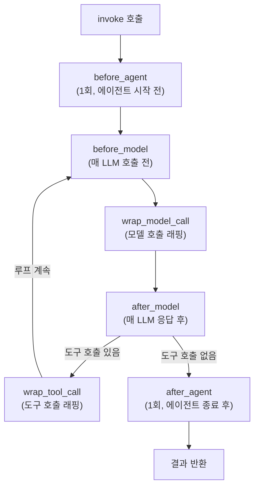

`before_agent`와 `after_agent`는 전체 `invoke` 호출당 한 번씩만 실행된다. `before_model`과 `after_model`은 루프를 돌 때마다, 즉 LLM을 호출할 때마다 실행된다. `wrap_model_call`은 모델 호출 자체를 래핑하고, `wrap_tool_call`은 각각의 도구 호출을 래핑한다.

### A.3 LangGraph 워크플로우 내에서 미들웨어 사용

미들웨어는 별도의 런타임이 아니다. 훅들은 `create_agent`가 반환하는 컴파일된 LangGraph 그래프 내부에서 실행된다. 따라서 미들웨어가 붙은 에이전트 전체를 더 큰 `StateGraph`의 노드나 서브그래프로 삽입할 수 있으며, 모든 미들웨어 훅은 그 안에서 계속 작동한다.

이 패턴이 유용한 경우는 에이전트를 단순한 "루프 종료 시까지 반복" 이상의 토폴로지에 배치해야 할 때다. 예를 들어, 입력을 분류한 뒤 여러 에이전트 중 하나로 라우팅하거나, 작업을 병렬로 팬아웃(fan-out)하거나, 에이전트 호출과 결정론적 단계를 이어 붙이는 경우가 이에 해당한다.

실제 예제로, 이메일 에이전트가 `send_email` 도구를 호출하기 전에 인간의 승인을 요구하는 구성을 보자.

```python
from langchain.agents import AgentState, create_agent
from langchain.agents.middleware import HumanInTheLoopMiddleware
from langgraph.graph import START, StateGraph

email_agent = create_agent(
    model="claude-sonnet-4-6",
    tools=[read_email, send_email],
    middleware=[HumanInTheLoopMiddleware(interrupt_on={"send_email": True})],
)

graph = (
    StateGraph(AgentState)
    .add_node("classify", classify_node)
    .add_node("email_agent", email_agent)
    .add_edge(START, "classify")
    .add_conditional_edges("classify", route)
    .compile()
)
```

`email_agent`가 `StateGraph`의 노드로 삽입되었다. `HumanInTheLoopMiddleware`가 내부에 있으므로, `send_email` 도구를 호출하기 전에 인터럽트가 발생해 인간의 판단을 기다린다. HITL 인터럽트, 요약, PII 제거, 재시도, 커스텀 훅 모두 에이전트 노드와 함께 이동한다. `HumanInTheLoopMiddleware`는 도구의 `.name` 속성으로 매칭하며, Python의 `@tool` 데코레이터로 선언된 함수는 함수 이름을 그대로 사용하므로 키가 `"send_email"`이 된다.

---

## 별첨 B: 사전 빌드 미들웨어 전체 레퍼런스

> **출처**: [LangChain 공식 문서 — Prebuilt Middleware](https://docs.langchain.com/oss/python/langchain/middleware/built-in)

LangChain과 Deep Agents는 흔한 에이전트 요구 사항을 위한 사전 빌드 미들웨어를 제공한다. 각 미들웨어는 프로덕션에서 바로 사용할 수 있도록 설계되었으며, 구체적인 요구에 맞게 설정할 수 있다. 아래에서는 각 미들웨어의 역할과 설정 옵션을 상세히 설명한다.

### B.1 SummarizationMiddleware — 대화 히스토리 자동 요약

장기 실행 에이전트에서 컨텍스트 오버플로를 방지하는 핵심 미들웨어다. 대화 히스토리가 토큰 한계에 가까워지면 오래된 메시지를 자동으로 요약하면서 최근 메시지는 원본 형태로 유지한다.

이 미들웨어가 유용한 상황은 세 가지다. 컨텍스트 윈도우를 초과할 만큼 긴 대화, 히스토리가 쌓이는 멀티턴 대화, 전체 대화 맥락이 중요한 애플리케이션이 그것이다.

한 가지 중요한 제약이 있다. 요약은 텍스트 지향 컨텍스트 압축이다. 이미지, 오디오, 비디오 페이로드는 크기를 줄이거나 다운샘플링하지 않는다. `keep` 설정으로 유지되는 최근 메시지는 원본 멀티모달 블록을 그대로 포함하지만, 요약 대상이 된 오래된 멀티모달 메시지는 생성된 텍스트 요약으로만 남는다. 이미지가 많은 애플리케이션이라면 미디어를 파일시스템이나 오브젝트 스토어에 저장하고 URL이나 파일 참조를 메시지 히스토리에 전달하는 방식이 권장된다.

```python
from langchain.agents import create_agent
from langchain.agents.middleware import SummarizationMiddleware

agent = create_agent(
    model="gpt-5.4",
    tools=[your_weather_tool, your_calculator_tool],
    middleware=[
        SummarizationMiddleware(
            model="gpt-5.4-mini",      # 요약 생성에 사용할 모델
            trigger=("tokens", 4000),  # 4000 토큰 초과 시 요약 트리거
            keep=("messages", 20),     # 최근 20개 메시지는 원본 보존
        ),
    ],
)
```

`trigger` 파라미터는 요약을 언제 시작할지 결정한다. 단일 조건 또는 여러 조건(OR 로직)의 리스트를 받는다. 각 조건은 `fraction`(모델 컨텍스트 크기의 비율, 0~1), `tokens`(절대 토큰 수), `messages`(메시지 수) 중 하나를 사용한다. 복수 조건을 사용하면 어느 하나라도 충족될 때 요약이 발동된다.

```python
# 복수 조건: 토큰 3000개 초과 OR 메시지 6개 초과 시 요약
SummarizationMiddleware(
    model="gpt-5.4-mini",
    trigger=[
        ("tokens", 3000),
        ("messages", 6),
    ],
    keep=("messages", 20),
)

# 비율 방식: 컨텍스트의 80% 초과 시 요약, 30%는 보존
SummarizationMiddleware(
    model="gpt-5.4-mini",
    trigger=("fraction", 0.8),
    keep=("fraction", 0.3),
)
```

`keep` 파라미터는 요약 이후 얼마나 많은 컨텍스트를 원본 그대로 유지할지 결정한다. `trigger`와 마찬가지로 `fraction`, `tokens`, `messages` 중 정확히 하나를 지정한다.

### B.2 HumanInTheLoopMiddleware — 인간 승인 게이트

에이전트 실행을 일시 정지하고 특정 도구 호출이 실행되기 전에 인간의 승인, 수정, 또는 거부를 받을 수 있게 한다. 이 미들웨어가 적합한 상황은 데이터베이스 쓰기나 금융 거래 같은 고위험 작업, 인간 감독이 의무인 컴플라이언스 워크플로우, 인간의 피드백이 에이전트를 안내하는 장기 대화다.

**중요한 전제 조건**: 이 미들웨어는 인터럽트 간 상태를 유지하기 위해 체크포인터(checkpointer)가 필요하다.

```python
from langchain.agents import create_agent
from langchain.agents.middleware import HumanInTheLoopMiddleware
from langgraph.checkpoint.memory import InMemorySaver

agent = create_agent(
    model="gpt-5.4",
    tools=[your_read_email_tool, your_send_email_tool],
    checkpointer=InMemorySaver(),
    middleware=[
        HumanInTheLoopMiddleware(
            interrupt_on={
                "your_send_email_tool": {
                    "allowed_decisions": ["approve", "edit", "reject"],
                },
                "your_read_email_tool": False,  # 이 도구는 인터럽트 없이 통과
            }
        ),
    ],
)
```

`interrupt_on` 딕셔너리의 키는 도구 이름이고, 값은 인터럽트 설정이다. `True`로 설정하면 기본 결정 옵션으로 인터럽트하고, 딕셔너리로 설정하면 허용 결정 목록을 커스터마이징할 수 있다. `False`로 설정하면 해당 도구는 인터럽트 없이 즉시 실행된다.

### B.3 ModelCallLimitMiddleware — 모델 호출 횟수 제한

무한 루프나 과도한 API 비용을 방지하기 위해 모델 호출 횟수를 제한한다. 이것은 제어되지 않는 에이전트가 너무 많은 API 호출을 하는 것을 방지하거나, 프로덕션 배포에서 비용을 통제하거나, 특정 호출 예산 내에서 에이전트 동작을 테스트할 때 유용하다.

```python
from langchain.agents import create_agent
from langchain.agents.middleware import ModelCallLimitMiddleware
from langgraph.checkpoint.memory import InMemorySaver

agent = create_agent(
    model="gpt-5.4",
    checkpointer=InMemorySaver(),  # thread_limit 사용 시 필요
    tools=[],
    middleware=[
        ModelCallLimitMiddleware(
            thread_limit=10,       # 스레드 내 전체 실행에서 최대 10회
            run_limit=5,           # 단일 호출당 최대 5회
            exit_behavior="end",   # 한계 도달 시 우아하게 종료
        ),
    ],
)
```

`thread_limit`은 동일한 스레드 ID를 가진 모든 실행에 걸쳐 누적되는 제한이다. 체크포인터가 필요하다. `run_limit`은 단일 `invoke` 호출 내의 제한이다. `exit_behavior`는 `"end"`(우아한 종료) 또는 `"error"`(예외 발생) 중 하나를 선택한다.

### B.4 ToolCallLimitMiddleware — 도구 호출 횟수 제한

모든 도구 전역 또는 특정 도구에 대해 호출 횟수를 제한한다. 외부 API 과호출 방지, 웹 검색이나 데이터베이스 쿼리 횟수 조절, 특정 도구의 속도 제한 적용, 에이전트 루프 폭주 방지에 적합하다.

```python
from langchain.agents import create_agent
from langchain.agents.middleware import ToolCallLimitMiddleware

agent = create_agent(
    model="gpt-5.4",
    tools=[search_tool, database_tool],
    middleware=[
        # 전역 제한: 모든 도구 합산
        ToolCallLimitMiddleware(thread_limit=20, run_limit=10),
        # 특정 도구만 제한
        ToolCallLimitMiddleware(
            tool_name="search",
            thread_limit=5,
            run_limit=3,
        ),
    ],
)
```

`exit_behavior`에는 세 가지 선택지가 있다. `"continue"`(기본값)는 초과된 도구 호출을 에러 메시지와 함께 차단하되 다른 도구와 모델은 계속 실행한다. 모델이 에러 메시지를 보고 언제 종료할지 결정한다. `"error"`는 즉시 `ToolCallLimitExceededError`를 발생시켜 실행을 중단한다. `"end"`는 즉시 실행을 종료하며, 초과된 도구 호출에 대한 `ToolMessage`와 AI 메시지를 생성한다. 단일 도구 제한 시에만 작동하며, 다른 도구에 대기 중인 호출이 있으면 `NotImplementedError`가 발생한다.

### B.5 ModelFallbackMiddleware — 모델 폴백

기본 모델이 실패할 때 대체 모델로 자동 전환한다. 모델 장애를 처리하는 복원력 있는 에이전트 구축, 더 저렴한 모델로 폴백하는 비용 최적화, OpenAI·Anthropic 등 여러 제공업체에 걸친 제공업체 이중화에 유용하다.

```python
from langchain.agents import create_agent
from langchain.agents.middleware import ModelFallbackMiddleware

agent = create_agent(
    model="gpt-5.4",
    tools=[],
    middleware=[
        ModelFallbackMiddleware(
            "gpt-5.4-mini",
            "claude-3-5-sonnet-20241022",
        ),
    ],
)
```

첫 번째 인자가 첫 번째 폴백 모델이고, 추가 인자로 순서대로 폴백할 모델을 나열한다. 기본 모델 실패 시 순서대로 시도한다.

### B.6 PIIMiddleware — 개인 식별 정보 탐지 및 처리

대화에서 개인 식별 정보(PII)를 탐지하고 처리한다. 의료·금융 분야의 컴플라이언스 요구사항, 로그를 정제해야 하는 고객 서비스 에이전트, 민감한 사용자 데이터를 다루는 모든 애플리케이션에 필수적이다.

```python
from langchain.agents import create_agent
from langchain.agents.middleware import PIIMiddleware

agent = create_agent(
    model="gpt-5.4",
    tools=[],
    middleware=[
        PIIMiddleware("email", strategy="redact", apply_to_input=True),
        PIIMiddleware("credit_card", strategy="mask", apply_to_input=True),
    ],
)
```

`strategy` 파라미터는 탐지된 PII를 어떻게 처리할지 결정한다. `"block"`은 PII 탐지 시 예외를 발생시킨다. `"redact"`는 `[REDACTED_{PII_TYPE}]`으로 치환한다. `"mask"`는 부분적으로 마스킹한다(예: `****-****-****-1234`). `"hash"`는 결정론적 해시로 치환한다.

내장 PII 타입은 `email`, `credit_card`, `ip`, `mac_address`, `url`이며, 커스텀 탐지기를 통해 조직 특유의 PII 패턴도 처리할 수 있다. 커스텀 탐지기는 정규식 문자열, 컴파일된 정규식 객체, 또는 사용자 정의 함수 세 가지 방식으로 제공할 수 있다.

```python
# 정규식 문자열로 API 키 탐지
PIIMiddleware(
    "api_key",
    detector=r"sk-[a-zA-Z0-9]{32}",
    strategy="block",
)

# 커스텀 함수로 SSN 탐지 (유효성 검사 포함)
def detect_ssn(content: str) -> list[dict[str, str | int]]:
    import re
    matches = []
    for match in re.finditer(r"\d{3}-\d{2}-\d{4}", content):
        ssn = match.group(0)
        first_three = int(ssn[:3])
        if first_three not in [0, 666] and not (900 <= first_three <= 999):
            matches.append({
                "text": ssn,
                "start": match.start(),
                "end": match.end(),
            })
    return matches

PIIMiddleware("ssn", detector=detect_ssn, strategy="hash")
```

`apply_to_output=True`로 설정하면 스트리밍 출력(텍스트 델타, 도구 호출 인자, 도구 출력, 상태 스냅샷)에도 PII 제거가 적용된다. `langchain>=1.3.2`가 필요하다.

### B.7 TodoListMiddleware — 태스크 계획 및 추적

에이전트에게 복잡한 다단계 태스크를 위한 태스크 계획 및 추적 기능을 부여한다. 이 미들웨어는 자동으로 `write_todos` 도구와 효과적인 태스크 계획을 안내하는 시스템 프롬프트를 에이전트에 제공한다. Deep Agents의 내장 기능이기도 하지만, `create_agent`와 함께 독립적으로 사용할 수도 있다.

```python
from langchain.agents import create_agent
from langchain.agents.middleware import TodoListMiddleware

agent = create_agent(
    model="gpt-5.4",
    tools=[read_file, write_file, run_tests],
    middleware=[TodoListMiddleware()],
)
```

`system_prompt` 파라미터로 투두 사용을 안내하는 커스텀 프롬프트를, `tool_description` 파라미터로 `write_todos` 도구의 커스텀 설명을 제공할 수 있다. 둘 다 생략하면 내장 기본값을 사용한다.

### B.8 LLMToolSelectorMiddleware — LLM 기반 도구 선택

메인 모델을 호출하기 전에 별도의 LLM을 사용해 현재 쿼리와 관련 있는 도구만 선택한다. 도구가 10개 이상인 에이전트에서 대부분의 도구가 쿼리와 무관한 경우, 불필요한 도구를 제거해 토큰 사용량을 줄이거나, 모델이 더 적은 선택지에서 더 정확하게 도구를 고르도록 유도할 때 유용하다.

이 미들웨어는 구조화된 출력(structured output)을 사용해 어떤 도구가 현재 쿼리와 가장 관련 있는지 LLM에게 물어본다. 구조화된 출력 스키마는 사용 가능한 도구 이름과 설명을 정의하며, 모델 제공업체는 종종 이 정보를 시스템 프롬프트에 자동으로 추가한다.

```python
from langchain.agents import create_agent
from langchain.agents.middleware import LLMToolSelectorMiddleware

agent = create_agent(
    model="gpt-5.4",
    tools=[tool1, tool2, tool3, tool4, tool5, ...],  # 많은 도구
    middleware=[
        LLMToolSelectorMiddleware(
            model="gpt-5.4-mini",      # 선택에는 작은 모델 사용
            max_tools=3,               # 최대 3개 도구만 선택
            always_include=["search"], # 이 도구는 항상 포함
        ),
    ],
)
```

`always_include` 리스트에 있는 도구는 항상 포함되며, `max_tools` 한도에서 제외된다.

### B.9 ToolRetryMiddleware — 도구 호출 자동 재시도

실패한 도구 호출을 설정 가능한 지수 백오프(exponential backoff)로 자동 재시도한다. 외부 API 호출의 일시적 실패 처리, 네트워크 의존 도구의 신뢰성 향상, 임시 오류를 우아하게 처리하는 복원력 있는 에이전트 구축에 적합하다.

```python
from langchain.agents import create_agent
from langchain.agents.middleware import ToolRetryMiddleware

agent = create_agent(
    model="gpt-5.4",
    tools=[search_tool, database_tool],
    middleware=[
        ToolRetryMiddleware(
            max_retries=3,         # 초기 호출 후 최대 3번 재시도
            backoff_factor=2.0,    # 지수 백오프 승수
            initial_delay=1.0,     # 첫 재시도 전 대기 시간 (초)
        ),
    ],
)
```

지수 백오프 공식은 `initial_delay * (backoff_factor ** retry_number)`다. `max_delay`로 최대 대기 시간을 제한하고, `jitter=True`(기본값)로 `±25%`의 무작위 변동을 추가해 "thundering herd" 문제를 방지한다. `tools` 파라미터로 재시도를 적용할 도구를 한정할 수 있으며, `retry_on`으로 어떤 예외에서 재시도할지 지정한다.

`on_failure`는 모든 재시도가 소진된 후 동작을 결정한다. `"return_message"`(기본값)는 에러 상세가 담긴 `ToolMessage`를 반환해 LLM이 실패를 처리하도록 한다. `"raise"`는 예외를 다시 발생시켜 에이전트 실행을 중단한다.

### B.10 ModelRetryMiddleware — 모델 호출 자동 재시도

실패한 모델 API 호출을 자동으로 재시도한다. 구성 방식은 `ToolRetryMiddleware`와 동일하지만 도구 대신 LLM 호출에 적용된다.

```python
from langchain.agents import create_agent
from langchain.agents.middleware import ModelRetryMiddleware

agent = create_agent(
    model="gpt-5.4",
    tools=[search_tool],
    middleware=[
        ModelRetryMiddleware(
            max_retries=3,
            backoff_factor=2.0,
            initial_delay=1.0,
        )
    ],
)
```

`on_failure`의 기본값이 `ToolRetryMiddleware`와 다르다. `"continue"`(기본값)는 에러 상세가 담긴 `AIMessage`를 반환해 에이전트가 우아하게 실패를 처리할 수 있게 한다. `"error"`는 예외를 다시 발생시킨다.

커스텀 예외 필터링도 가능하다.

```python
def should_retry(error: Exception) -> bool:
    if isinstance(error, TimeoutError):
        return True
    if hasattr(error, "status_code"):
        return error.status_code in (429, 503)  # 속도 제한이나 서비스 불가 시만 재시도
    return False

ModelRetryMiddleware(max_retries=3, retry_on=should_retry)
```

### B.11 LLMToolEmulator — LLM 기반 도구 에뮬레이션

실제 도구 호출 대신 LLM이 생성한 응답으로 도구 실행을 에뮬레이션한다. 실제 도구 실행 없이 에이전트 동작을 테스트하거나, 외부 도구를 사용할 수 없거나 비용이 많이 드는 개발 단계에서 프로토타이핑할 때 유용하다.

```python
from langchain.agents import create_agent
from langchain.agents.middleware import LLMToolEmulator

# 모든 도구 에뮬레이션 (기본 동작)
agent = create_agent(
    model="gpt-5.4",
    tools=[get_weather, search_database, send_email],
    middleware=[LLMToolEmulator()],
)

# 특정 도구만 에뮬레이션
agent2 = create_agent(
    model="gpt-5.4",
    tools=[get_weather, send_email],
    middleware=[LLMToolEmulator(tools=["get_weather"])],
)
```

`tools` 파라미터를 생략하면 모든 도구가 에뮬레이션된다. 빈 리스트 `[]`를 전달하면 어떤 도구도 에뮬레이션되지 않는다. `model` 파라미터로 에뮬레이션에 사용할 별도의 모델을 지정할 수 있다.

### B.12 ContextEditingMiddleware — 컨텍스트 편집

오래된 도구 호출 출력을 지워서 대화 컨텍스트를 토큰 한계 내로 유지한다. 최근 결과는 보존하면서 오래된 것들을 제거한다. 도구 호출이 많아 토큰 한계에 걸리는 긴 대화, 더 이상 관련 없는 오래된 도구 출력 제거를 통한 토큰 비용 절감, 최근 N개의 도구 결과만 컨텍스트에 유지하는 경우에 적합하다.

```python
from langchain.agents import create_agent
from langchain.agents.middleware import ContextEditingMiddleware, ClearToolUsesEdit

agent = create_agent(
    model="gpt-5.4",
    tools=[],
    middleware=[
        ContextEditingMiddleware(
            edits=[
                ClearToolUsesEdit(
                    trigger=100000,  # 100,000 토큰 초과 시 발동
                    keep=3,          # 최근 3개 도구 결과는 유지
                ),
            ],
        ),
    ],
)
```

`ClearToolUsesEdit`는 가장 흔히 사용되는 편집 전략이다. 작동 방식은 다음과 같다. 대화의 토큰 수를 모니터링하다가 `trigger` 임계값을 초과하면 오래된 도구 출력을 제거하고, 가장 최근 `keep`개의 도구 결과는 보존한다.

`exclude_tools` 리스트에 있는 도구의 출력은 절대 제거되지 않는다. 제거된 도구 출력은 `placeholder`(기본값: `"[cleared]"`) 텍스트로 대체된다. `clear_tool_inputs=True`로 설정하면 원본 도구 호출 파라미터도 빈 객체로 치환된다.

### B.13 ShellToolMiddleware — 지속적 셸 세션

에이전트에게 시스템 명령을 실행할 수 있는 지속적 셸 세션을 제공한다. 시스템 명령 실행이 필요한 에이전트, 개발 및 배포 자동화, 테스트·검증 워크플로우, 파일시스템 작업 및 스크립트 실행에 적합하다.

**보안 주의**: 실행 정책(`HostExecutionPolicy`, `DockerExecutionPolicy`, `CodexSandboxExecutionPolicy`)을 배포 환경의 보안 요구사항에 맞게 선택해야 한다. 또한 현재 지속적 셸 세션은 인터럽트(Human-in-the-loop)와 함께 작동하지 않는다.

```python
from langchain.agents import create_agent
from langchain.agents.middleware import (
    ShellToolMiddleware,
    HostExecutionPolicy,
    DockerExecutionPolicy,
)

# 호스트 실행 (신뢰 환경)
agent = create_agent(
    model="gpt-5.4",
    tools=[search_tool],
    middleware=[
        ShellToolMiddleware(
            workspace_root="/workspace",
            execution_policy=HostExecutionPolicy(),
        ),
    ],
)

# Docker 격리 실행
agent_docker = create_agent(
    model="gpt-5.4",
    tools=[],
    middleware=[
        ShellToolMiddleware(
            workspace_root="/workspace",
            startup_commands=["pip install requests"],
            execution_policy=DockerExecutionPolicy(
                image="python:3.11-slim",
                command_timeout=60.0,
            ),
        ),
    ],
)
```

실행 정책 세 가지를 구분하면 다음과 같다. `HostExecutionPolicy`는 호스트 시스템에 완전히 접근하는 기본 실행 방식이다. 에이전트가 이미 컨테이너나 VM 내부에서 실행되는 신뢰 환경에 가장 적합하다. `DockerExecutionPolicy`는 각 에이전트 실행마다 별도의 Docker 컨테이너를 시작해 더 강한 격리를 제공한다. `CodexSandboxExecutionPolicy`는 Codex CLI 샌드박스를 재사용해 추가적인 시스템 콜·파일시스템 제한을 적용한다.

`workspace_root`를 생략하면 에이전트 시작 시 임시 디렉토리가 생성되고 종료 시 삭제된다. `startup_commands`와 `shutdown_commands`로 세션 시작/종료 시 실행할 명령을 지정할 수 있다.

### B.14 FilesystemFileSearchMiddleware — 파일시스템 검색

에이전트에게 파일시스템에 대한 Glob 및 Grep 검색 도구를 제공한다. 코드 탐색 및 분석, 이름 패턴으로 파일 찾기, 정규식으로 코드 내용 검색, 대규모 코드베이스에서 파일 발견에 유용하다.

```python
from langchain.agents import create_agent
from langchain.agents.middleware import FilesystemFileSearchMiddleware

agent = create_agent(
    model="gpt-5.4",
    tools=[],
    middleware=[
        FilesystemFileSearchMiddleware(
            root_path="/workspace",
            use_ripgrep=True,       # ripgrep 사용 (없으면 Python 정규식으로 폴백)
            max_file_size_mb=10,    # 10MB 초과 파일은 건너뜀
        ),
    ],
)
```

이 미들웨어는 에이전트에게 두 가지 검색 도구를 추가한다. **Glob 도구**는 빠른 파일 패턴 매칭을 제공한다. `**/*.py`, `src/**/*.ts` 같은 패턴을 지원하며, 수정 시간 순으로 정렬된 매칭 파일 경로를 반환한다. **Grep 도구**는 정규식을 이용한 내용 검색을 제공한다. 전체 정규식 문법을 지원하고, `include` 파라미터로 파일 패턴 필터링이 가능하다. 출력 모드는 `files_with_matches`, `content`, `count` 중 하나를 선택한다.

### B.15 FilesystemMiddleware (Deep Agents) — 가상 파일시스템 컨텍스트 관리

이것은 컨텍스트 엔지니어링의 핵심 도전을 해결하는 미들웨어다. 공식 문서는 이것을 에이전트 구축에서 "주요 도전"이라고 표현한다. 가변 길이 결과를 반환하는 도구(예: `web_search`, RAG)를 사용할 때, 긴 도구 결과가 컨텍스트 윈도우를 빠르게 채울 수 있기 때문이다.

Deep Agents의 `FilesystemMiddleware`는 단기 및 장기 메모리 모두와 상호작용하는 네 가지 도구를 제공한다.

- `ls`: 파일시스템의 파일 목록 조회
- `read_file`: 파일 전체 또는 특정 줄 수 읽기
- `write_file`: 파일시스템에 새 파일 쓰기
- `edit_file`: 기존 파일 편집

```python
from langchain.agents import create_agent
from deepagents.middleware.filesystem import FilesystemMiddleware

agent = create_agent(
    model="claude-sonnet-4-6",
    middleware=[
        FilesystemMiddleware(
            backend=None,  # 기본값: StateBackend (그래프 상태에 저장)
            system_prompt="Write to the filesystem when...",  # 선택적 추가 시스템 프롬프트
            custom_tool_descriptions={
                "ls": "Use the ls tool when...",
                "read_file": "Use the read_file tool to..."
            }
        ),
    ],
)
```

단기 파일시스템(기본값)은 그래프 상태에 로컬로 쓴다. 장기 파일시스템은 `CompositeBackend`와 `LangGraph Store`를 설정해 스레드에 걸쳐 영속적 저장을 가능하게 한다.

```python
from deepagents.middleware import FilesystemMiddleware
from deepagents.backends import CompositeBackend, StateBackend, StoreBackend
from langgraph.store.memory import InMemoryStore

store = InMemoryStore()

agent = create_agent(
    model="claude-sonnet-4-6",
    store=store,
    middleware=[
        FilesystemMiddleware(
            backend=CompositeBackend(
                default=StateBackend(),
                routes={"/memories/": StoreBackend()}  # /memories/ 경로는 영속 저장
            ),
        ),
    ],
)
```

`/memories/` 경로에 저장된 파일은 서로 다른 스레드에 걸쳐 살아남는다. 이 경로 없이 저장된 파일은 임시 상태 저장소에 남는다.

### B.16 SubAgentMiddleware (Deep Agents) — 서브에이전트 위임

서브에이전트에 태스크를 위임하면 컨텍스트를 격리할 수 있어, 메인(감독자) 에이전트의 컨텍스트 윈도우가 깨끗하게 유지되면서도 태스크를 깊이 처리할 수 있다.

```python
from langchain.tools import tool
from langchain.agents import create_agent
from deepagents.middleware.subagents import SubAgentMiddleware

def get_weather(city: str) -> str:
    """Get the weather in a city."""
    return f"The weather in {city} is sunny."

agent = create_agent(
    model="claude-sonnet-4-6",
    middleware=[
        SubAgentMiddleware(
            default_model="claude-sonnet-4-6",
            default_tools=[],
            subagents=[
                {
                    "name": "weather",
                    "description": "날씨 정보를 제공하는 서브에이전트.",
                    "system_prompt": "Use the get_weather tool to get the weather in a city.",
                    "tools": [get_weather],
                    "model": "gpt-5.4",         # 서브에이전트 전용 모델
                    "middleware": [],             # 서브에이전트 전용 미들웨어
                }
            ],
        )
    ],
)
```

서브에이전트는 이름, 설명, 시스템 프롬프트, 도구로 정의한다. 커스텀 모델이나 추가 미들웨어도 지정할 수 있다. 더 복잡한 사용 사례에서는 사전 빌드된 LangGraph 그래프를 서브에이전트로 전달하는 것도 가능하다.

```python
from deepagents import CompiledSubAgent
from langgraph.graph import StateGraph

weather_graph = create_weather_graph()  # 커스텀 LangGraph 그래프
weather_subagent = CompiledSubAgent(
    name="weather",
    description="날씨 정보를 제공하는 서브에이전트.",
    runnable=weather_graph
)
```

사용자 정의 서브에이전트 외에도, 메인 에이전트는 항상 `general-purpose` 서브에이전트에 접근할 수 있다. 이 기본 서브에이전트는 메인 에이전트와 동일한 지침과 도구를 가지며, 중간 도구 호출로 인한 컨텍스트 팽창 없이 복잡한 태스크의 결과만 간결하게 받을 목적으로 설계되었다.

### B.17 프로바이더별 특화 미들웨어

LangChain은 특정 LLM 제공업체에 최적화된 미들웨어도 제공한다.

**Anthropic 미들웨어**: Claude 모델을 위한 프롬프트 캐싱(prompt caching), bash 도구, 텍스트 에디터, 메모리, 파일 검색 미들웨어가 포함된다. 특히 프롬프트 캐싱 미들웨어는 장기 실행 태스크에서 토큰 비용을 크게 절감할 수 있다.

**AWS 미들웨어**: Amazon Bedrock 모델을 위한 프롬프트 캐싱 미들웨어가 포함된다.

**OpenAI 미들웨어**: OpenAI 모델을 위한 콘텐츠 모더레이션 미들웨어가 포함된다.

---

## 별첨 C: 커스텀 미들웨어 작성 완전 가이드

> **출처**: [LangChain 공식 문서 — Custom Middleware](https://docs.langchain.com/oss/python/langchain/middleware/custom)

### C.1 두 가지 훅 스타일

커스텀 미들웨어는 에이전트 실행 흐름의 특정 지점에 끼어드는 훅을 구현함으로써 만든다. 훅에는 두 가지 스타일이 있다.

**노드 스타일 훅(Node-style hooks)** 은 특정 실행 지점에서 순차적으로 실행된다. 로깅, 검증, 상태 업데이트에 적합하다.

| 훅 | 실행 시점 |
|---|---|
| `before_agent` | 에이전트 시작 전 (호출당 1회) |
| `before_model` | 매 모델 호출 전 |
| `after_model` | 매 모델 응답 후 |
| `after_agent` | 에이전트 완료 후 (호출당 1회) |

**랩 스타일 훅(Wrap-style hooks)** 은 각 호출을 감싸며 핸들러를 언제 호출할지 제어한다. 재시도, 캐싱, 변환에 적합하다. 핸들러를 0번 호출(단락, short-circuit), 1번 호출(정상 흐름), 또는 여러 번 호출(재시도 로직)하도록 선택할 수 있다.

| 훅 | 실행 시점 |
|---|---|
| `wrap_model_call` | 매 모델 호출을 감쌈 |
| `wrap_tool_call` | 매 도구 호출을 감쌈 |

### C.2 미들웨어 만들기: 두 가지 방법

미들웨어를 만드는 방법은 데코레이터 기반과 클래스 기반 두 가지다.

**데코레이터 기반 미들웨어**는 단일 훅이 필요하고 설정이 복잡하지 않을 때, 빠른 프로토타이핑에 적합하다.

```python
from langchain.agents.middleware import before_model, after_model, AgentState
from langchain.messages import AIMessage
from langgraph.runtime import Runtime
from typing import Any

def check_message_limit(state: AgentState, runtime: Runtime) -> dict[str, Any] | None:
    if len(state["messages"]) >= 50:
        return {
            "messages": [AIMessage("Conversation limit reached.")],
            "jump_to": "end"  # 에이전트 종료로 점프
        }
    return None

def log_response(state: AgentState, runtime: Runtime) -> dict[str, Any] | None:
    print(f"Model returned: {state['messages'][-1].content}")
    return None
```

랩 스타일 데코레이터의 경우, 핸들러를 직접 호출하고 그 결과를 반환하는 구조다.

```python
from langchain.agents.middleware import wrap_model_call, ModelRequest, ModelResponse
from typing import Callable

def retry_model(
    request: ModelRequest,
    handler: Callable[[ModelRequest], ModelResponse],
) -> ModelResponse:
    for attempt in range(3):
        try:
            return handler(request)
        except Exception as e:
            if attempt == 2:
                raise
            print(f"Retry {attempt + 1}/3 after error: {e}")
```

**클래스 기반 미들웨어**는 동일한 훅에 동기·비동기 구현이 모두 필요하거나, 여러 훅을 하나의 미들웨어로 묶거나, 초기화 시 복잡한 설정이 필요할 때, 그리고 조직 전체에 재사용할 때 적합하다.

`AgentMiddleware`를 서브클래싱하면 클래스 수준 속성 세 가지를 활용할 수 있다. `state_schema`는 에이전트 상태를 커스텀 필드로 확장한다. `tools`는 미들웨어와 함께 배포되는 추가 도구를 등록한다(예: 투두 리스트 미들웨어의 `write_todos`). `transformers`는 스코프 인식 스트림 트랜스포머 팩토리를 등록한다.

```python
from langchain.agents.middleware import AgentMiddleware, AgentState, ModelRequest, ModelResponse
from langgraph.runtime import Runtime
from typing import Any, Callable

class LoggingMiddleware(AgentMiddleware):
    def before_model(self, state: AgentState, runtime: Runtime) -> dict[str, Any] | None:
        print(f"About to call model with {len(state['messages'])} messages")
        return None

    def after_model(self, state: AgentState, runtime: Runtime) -> dict[str, Any] | None:
        print(f"Model returned: {state['messages'][-1].content}")
        return None

    # 비동기 버전도 함께 정의 가능
    async def abefore_model(self, state: AgentState, runtime: Runtime) -> dict[str, Any] | None:
        return None

    async def aafter_model(self, state: AgentState, runtime: Runtime) -> dict[str, Any] | None:
        print(f"Model returned: {state['messages'][-1].content}")
        return None
```

### C.3 상태 업데이트

미들웨어는 훅에서 딕셔너리를 반환해 에이전트 상태를 업데이트할 수 있다. 노드 스타일 훅과 랩 스타일 훅에서 메커니즘이 다르다.

노드 스타일 훅(`before_agent`, `before_model`, `after_model`, `after_agent`)에서는 딕셔너리를 직접 반환한다. 딕셔너리는 그래프의 리듀서를 통해 에이전트 상태에 적용된다.

랩 스타일 훅(`wrap_model_call`, `wrap_tool_call`)에서는 모델 호출의 경우 상태 업데이트를 모델 응답 옆에 주입하기 위해 `Command`가 포함된 `ExtendedModelResponse`를 반환하고, 도구 호출의 경우 `Command`를 직접 반환한다.

```python
from langchain.agents.middleware import after_model, AgentState
from typing_extensions import NotRequired
from typing import Any
from langgraph.runtime import Runtime

# 커스텀 상태 필드 정의
class TrackingState(AgentState):
    model_call_count: NotRequired[int]

def increment_after_model(state: TrackingState, runtime: Runtime) -> dict[str, Any] | None:
    return {"model_call_count": state.get("model_call_count", 0) + 1}
```

### C.4 커스텀 상태 스키마

미들웨어가 훅들 사이에서 상태를 추적해야 한다면, 에이전트 상태를 커스텀 속성으로 확장할 수 있다. 이를 통해 카운터와 플래그 등을 에이전트 실행 전체에 걸쳐 유지하거나, 훅들 사이에서 데이터를 공유하거나, 속도 제한·사용량 추적·감사 로깅 같은 횡단 관심사를 구현하거나, 누적된 상태를 기반으로 조건부 결정을 내릴 수 있다.

```python
from langchain.agents import create_agent
from langchain.agents.middleware import AgentMiddleware, AgentState
from typing_extensions import NotRequired
from typing import Any

class CustomState(AgentState):
    model_call_count: NotRequired[int]
    user_id: NotRequired[str]

class CallCounterMiddleware(AgentMiddleware):
    state_schema = CustomState  # 클래스 속성으로 등록

    def before_model(self, state: CustomState, runtime) -> dict[str, Any] | None:
        count = state.get("model_call_count", 0)
        if count > 10:
            return {"jump_to": "end"}  # 10회 초과 시 종료
        return None

    def after_model(self, state: CustomState, runtime) -> dict[str, Any] | None:
        return {"model_call_count": state.get("model_call_count", 0) + 1}

agent = create_agent(
    model="gpt-5.4",
    middleware=[CallCounterMiddleware()],
    tools=[],
)

# 초기 상태 포함해서 호출
result = agent.invoke({
    "messages": [HumanMessage("Hello")],
    "model_call_count": 0,
    "user_id": "user-123",
})
```

### C.5 미들웨어 실행 순서

여러 미들웨어를 사용할 때 실행 순서는 훅 유형마다 다르다.

```python
agent = create_agent(
    model="gpt-5.4",
    middleware=[middleware1, middleware2, middleware3],
    tools=[...],
)
```

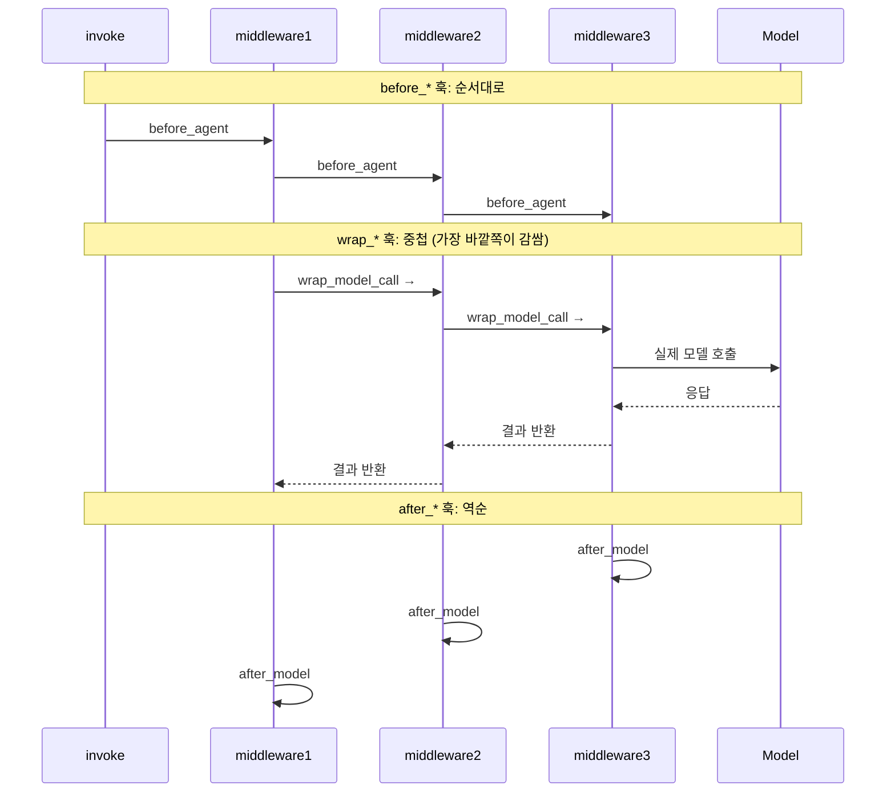

핵심 규칙을 요약하면 이렇다. `before_*` 훅은 처음부터 끝 순서로 실행된다. `after_*` 훅은 끝부터 처음 역순으로 실행된다. `wrap_*` 훅은 중첩된다. 첫 번째 미들웨어가 나머지 모두를 감싼다.

### C.6 에이전트 점프 (조기 종료)

미들웨어에서 조기에 종료하려면, `jump_to` 키를 포함한 딕셔너리를 반환한다. 단, 해당 훅이 점프를 허용한다고 선언되어 있어야 한다(`can_jump_to` 설정).

```python
from langchain.agents.middleware import after_model, hook_config, AgentState
from langchain.messages import AIMessage
from langgraph.runtime import Runtime
from typing import Any

def check_for_blocked(state: AgentState, runtime: Runtime) -> dict[str, Any] | None:
    last_message = state["messages"][-1]
    if "BLOCKED" in last_message.content:
        return {
            "messages": [AIMessage("I cannot respond to that request.")],
            "jump_to": "end"  # 에이전트 실행 종료로 점프
        }
    return None
```

사용 가능한 점프 대상은 세 가지다. `"end"`는 에이전트 실행 종료(또는 첫 번째 `after_agent` 훅)로 점프한다. `"tools"`는 도구 노드로 점프한다. `"model"`은 모델 노드(또는 첫 번째 `before_model` 훅)로 점프한다.

### C.7 실용 예제 모음

**동적 프롬프트 수정**: `wrap_model_call` 안에서 `request.system_message`에 접근해 시스템 프롬프트를 수정할 수 있다. `ModelRequest.system_message`는 항상 `SystemMessage` 객체로 제공된다. 이것은 에이전트가 `system_prompt="string"`으로 생성된 경우에도 마찬가지다.

```python
from langchain.agents.middleware import wrap_model_call, ModelRequest, ModelResponse
from langchain.messages import SystemMessage
from typing import Callable

def add_context(
    request: ModelRequest,
    handler: Callable[[ModelRequest], ModelResponse],
) -> ModelResponse:
    new_content = list(request.system_message.content_blocks) + [
        {"type": "text", "text": "Additional context injected at runtime."}
    ]
    new_system_message = SystemMessage(content=new_content)
    return handler(request.override(system_message=new_system_message))
```

**동적 모델 선택**: 메시지 수나 태스크 복잡도에 따라 실행 중 모델을 교체할 수 있다.

```python
from langchain.chat_models import init_chat_model

complex_model = init_chat_model("claude-sonnet-4-6")
simple_model = init_chat_model("claude-haiku-4-5-20251001")

def dynamic_model(
    request: ModelRequest,
    handler: Callable[[ModelRequest], ModelResponse],
) -> ModelResponse:
    model = complex_model if len(request.messages) > 10 else simple_model
    return handler(request.override(model=model))
```

**동적 도구 선택**: 상태나 컨텍스트에 따라 실행 시 관련 도구만 노출한다. 더 짧은 프롬프트, 더 높은 정확도, 권한 기반 접근 제어에 유용하다. 단, 모든 도구는 여전히 `create_agent`에 등록되어야 한다.

```python
def select_tools(
    request: ModelRequest,
    handler: Callable[[ModelRequest], ModelResponse],
) -> ModelResponse:
    relevant_tools = select_relevant_tools(request.state, request.runtime)
    return handler(request.override(tools=relevant_tools))
```

**도구 호출 모니터링**: `wrap_tool_call`로 도구 호출의 이름, 인자, 결과를 관찰하고 로깅할 수 있다.

```python
from langchain.agents.middleware import wrap_tool_call
from langchain.messages import ToolMessage
from langchain.tools.tool_node import ToolCallRequest
from langgraph.types import Command

def monitor_tool(
    request: ToolCallRequest,
    handler: Callable[[ToolCallRequest], ToolMessage | Command],
) -> ToolMessage | Command:
    print(f"Executing tool: {request.tool_call['name']}")
    print(f"Arguments: {request.tool_call['args']}")
    try:
        result = handler(request)
        print("Tool completed successfully")
        return result
    except Exception as e:
        print(f"Tool failed: {e}")
        raise
```

**Anthropic 프롬프트 캐싱**: Claude 모델을 사용할 때 캐시 제어 지시자를 포함한 구조화된 콘텐츠 블록으로 대형 시스템 프롬프트를 캐싱할 수 있다. 이것은 장기 실행 태스크에서 토큰 비용을 크게 절감하는 방법이다.

```python
def add_cached_context(
    request: ModelRequest,
    handler: Callable[[ModelRequest], ModelResponse],
) -> ModelResponse:
    new_content = list(request.system_message.content_blocks) + [
        {
            "type": "text",
            "text": "Here is a large document to analyze:\n\n<document>...</document>",
            "cache_control": {"type": "ephemeral"}  # 이 지점까지 캐싱
        }
    ]
    new_system_message = SystemMessage(content=new_content)
    return handler(request.override(system_message=new_system_message))
```

### C.8 커스텀 미들웨어 작성 모범 사례

LangChain 공식 문서가 제시하는 커스텀 미들웨어 개발 모범 사례는 다음과 같다.

첫째, 미들웨어는 하나의 관심사에 집중해야 한다. 각 미들웨어가 한 가지만 잘 하도록 설계한다. 관심사를 분리하면 테스트와 재사용이 쉬워진다.

둘째, 에러를 우아하게 처리한다. 미들웨어 에러가 에이전트를 충돌시키지 않도록 적절한 예외 처리를 구현한다.

셋째, 훅 유형을 적절히 선택한다. 순차적 로직(로깅, 검증)에는 노드 스타일, 제어 흐름(재시도, 폴백, 캐싱)에는 랩 스타일을 사용한다.

넷째, 커스텀 상태 속성을 명확히 문서화한다. 다른 개발자가 미들웨어를 이해하고 올바르게 사용할 수 있도록 어떤 상태 필드를 추가하는지 명시한다.

다섯째, 통합 전에 미들웨어를 독립적으로 단위 테스트한다. 미들웨어가 격리된 단위로 테스트 가능한 것이 이 아키텍처의 장점이다.

여섯째, 실행 순서를 고려해 중요한 미들웨어를 목록의 앞에 배치한다.

일곱째, 가능하면 사전 빌드된 미들웨어를 우선 사용한다. 요구 사항이 이미 있다면 바퀴를 재발명할 필요가 없다.

---

## 별첨 D: Claude Code 유사 코딩 에이전트 하네스 아키텍처 정의서

> **문서 목적**: LangChain(`create_agent` / `create_deep_agent`) · LangGraph · LangSmith 생태계를 기반으로, Claude Code에 상응하는 수준의 코딩 에이전트 하네스를 설계하기 위한 아키텍처 정의서다. 특정 조직의 코드베이스·배포 환경·보안 정책에 맞게 조정하기 위한 청사진(blueprint)으로 활용한다.

---

### D.1 설계 전제 및 핵심 원칙

#### D.1.1 무엇을 만들려는가

Claude Code는 터미널에서 실행되는 자율 코딩 에이전트다. 개발자가 자연어로 작업을 지시하면, 에이전트가 코드베이스를 탐색하고, 파일을 수정하고, 셸 명령을 실행하고, 테스트를 돌리고, 결과를 해석해 다시 코드를 개선하는 루프를 반복한다. 세션이 길어져도 컨텍스트를 잃지 않으며, 프로젝트 관례를 기억하고 다음 세션에 반영한다.

이 정의서에서 만들고자 하는 것도 동일한 수준의 하네스다. 단, 특정 모델·제공업체에 종속되지 않고 LangChain 생태계 위에서 조직의 인프라와 정책에 맞게 확장 가능한 형태로 설계한다.

#### D.1.2 설계 원칙 6가지

**원칙 1: 하네스가 모델보다 중요하다.** 코딩 태스크의 품질은 기반 LLM만큼이나 하네스 설계에 달려 있다. 컨텍스트 관리, 도구 구성, 메모리 아키텍처가 모델 교체보다 큰 성능 차이를 만든다.

**원칙 2: 신뢰는 도구 수준에서 집행한다.** "Trust the LLM" 원칙에 따라 에이전트가 스스로 자기 검열하기를 기대하지 않는다. 보안 경계는 도구 정의·샌드박스·미들웨어 정책으로 강제한다.

**원칙 3: 컨텍스트는 압축하되 잃지 않는다.** 장기 코딩 세션에서 컨텍스트 윈도우가 포화되는 것은 불가피하다. 이를 잘라내는 것이 아니라, 파일시스템 오프로딩과 구조화된 요약으로 핵심 정보를 유지하면서 압축해야 한다.

**원칙 4: 인간은 중요한 지점에서 제어권을 가진다.** 파일 삭제·배포·외부 서비스 호출처럼 되돌리기 어려운 작업은 반드시 인간 승인 게이트를 통과해야 한다.

**원칙 5: 모든 실행은 관찰 가능해야 한다.** LangSmith 트레이싱을 통해 에이전트의 모든 결정과 도구 호출이 가시화되어야 한다. 문제가 발생했을 때 트레이스로 근본 원인을 추적할 수 있어야 한다.

**원칙 6: 계층화하고 합성 가능하게 설계한다.** 각 미들웨어는 독립적으로 테스트 가능하고 재사용 가능해야 한다. 다른 유형의 에이전트(리서치, 데이터 분석 등)도 동일한 미들웨어를 조합해 구성할 수 있어야 한다.

---

### D.2 전체 시스템 계층 구조

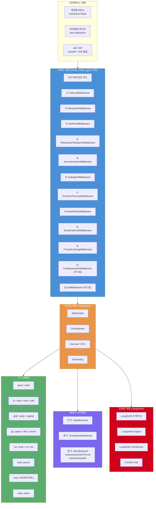

---

### D.3 하네스 기반 선택: create_deep_agent vs create_agent

코딩 에이전트 하네스를 구성할 때 가장 먼저 결정해야 하는 것은 기반을 무엇으로 삼을지다.

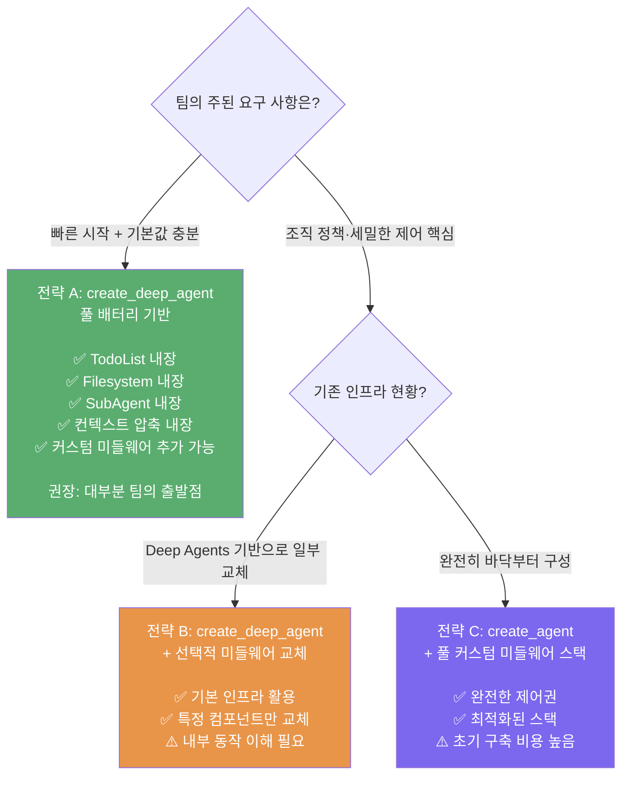

이 정의서는 **전략 A (create_deep_agent 기반)** 를 권장 출발점으로 삼는다. Deep Agents의 GitHub README가 명시하듯, deepagents 자체가 "Claude Code를 영감으로 삼아 무엇이 그것을 범용적으로 만드는지 파악하고 더 나아가려는 시도"로 출발했기 때문이다.

---

### D.4 미들웨어 스택 상세 설계

#### D.4.1 훅별 미들웨어 실행 위치

```mermaid
flowchart LR
    subgraph BA["before_agent\n(시작 시 1회)"]
        BA1["CodebaseIndexMiddleware\n프로젝트 구조 로딩"]
        BA2["AGENTS.md 자동 주입\n장기 메모리 로딩"]
        BA3["TodoListMiddleware\n도구 등록 + 시스템 프롬프트 주입"]
        BA4["SubAgentMiddleware\ntask 도구 등록"]
        BA5["FilesystemMiddleware\n파일시스템 도구 등록"]
    end
    subgraph BM["before_model\n(매 LLM 호출 전)"]
        BM1["SummarizationMiddleware\n컨텍스트 압축 체크"]
        BM2["LLMToolSelectorMiddleware\n관련 도구 필터링"]
    end
    subgraph WM["wrap_model_call\n(모델 래핑)"]
        WM1["ModelRetryMiddleware\n실패 재시도"]
        WM2["PromptCachingMiddleware\n시스템 프롬프트 캐싱"]
        WM3["ModelCallLimitMiddleware\n비용 제어"]
    end
    subgraph WT["wrap_tool_call\n(도구 래핑)"]
        WT1["HumanInTheLoopMiddleware\n위험 도구 승인 게이트"]
        WT2["ShellToolMiddleware\n셸 세션 관리"]
        WT3["GitMiddleware\nGit 도구 실행"]
    end
    subgraph AA["after_agent\n(종료 시 1회)"]
        AA1["장기 메모리 저장\n/memories/ 업데이트"]
        AA2["세션 요약\nCheckpointer 기록"]
    end
    BA --> BM --> WM --> WT --> AA
```

> **참고**: `TodoListMiddleware`·`SubAgentMiddleware`·`FilesystemMiddleware`는 도구를 에이전트에 **등록**하는 방식(AgentMiddleware의 `tools` 클래스 속성 활용)으로 작동하므로, 특정 훅 단계에 귀속되기보다 에이전트 컴파일 시 처리된다. 위 다이어그램은 각 미들웨어가 가장 큰 영향을 미치는 단계를 직관적으로 표현한 것이다.

#### D.4.2 미들웨어 구성 우선순위표

| 순서 | 미들웨어 | 유형 | 우선순위 |
|---|---|---|---|
| 1 | `TodoListMiddleware` | 사전 빌드 | 필수 |
| 2 | `FilesystemMiddleware` | Deep Agents | 필수 |
| 3 | `ShellToolMiddleware` | 사전 빌드 | 필수 |
| 4 | `FilesystemFileSearchMiddleware` | 사전 빌드 | 필수 |
| 5 | `SummarizationMiddleware` | 사전 빌드 | 필수 |
| 6 | `SubAgentMiddleware` | Deep Agents | 필수 |
| 7 | `HumanInTheLoopMiddleware` | 사전 빌드 | 필수 |
| 8 | `ModelRetryMiddleware` | 사전 빌드 | 필수 |
| 9 | `ModelCallLimitMiddleware` | 사전 빌드 | 권장 |
| 10 | `PromptCachingMiddleware` | Anthropic 특화 | 권장 |
| 11 | `CodebaseIndexMiddleware` | 커스텀 | 권장 |
| 12 | `GitMiddleware` | 커스텀 | 권장 |

---

### D.5 커스텀 미들웨어 설계

#### D.5.1 CodebaseIndexMiddleware

프로젝트가 시작될 때 코드베이스의 구조적 맥락을 수집해 에이전트에게 주입한다. 에이전트가 첫 번째 모델 호출 전에 이미 "이 코드베이스가 어떻게 생겼는지" 알고 있게 만드는 핵심 컴포넌트다.

```python
from langchain.agents.middleware import AgentMiddleware, AgentState
from langgraph.runtime import Runtime
from typing import Any
from typing_extensions import NotRequired
import subprocess, os

class CodebaseState(AgentState):
    project_root:      NotRequired[str]
    git_branch:        NotRequired[str]
    git_remote:        NotRequired[str]
    recent_commits:    NotRequired[str]
    agents_md_content: NotRequired[str]

class CodebaseIndexMiddleware(AgentMiddleware):
    """
    before_agent: 프로젝트 루트 탐지, Git 메타데이터, AGENTS.md 로딩.
    """
    state_schema = CodebaseState

    def __init__(self, workspace_root: str = "."):
        super().__init__()
        self.workspace_root = workspace_root

    def before_agent(
        self, state: CodebaseState, runtime: Runtime
    ) -> dict[str, Any] | None:
        updates = {
            "project_root": os.path.abspath(self.workspace_root)
        }
        try:
            updates["git_branch"] = subprocess.check_output(
                ["git", "rev-parse", "--abbrev-ref", "HEAD"],
                cwd=self.workspace_root, text=True
            ).strip()
            updates["git_remote"] = subprocess.check_output(
                ["git", "remote", "get-url", "origin"],
                cwd=self.workspace_root, text=True
            ).strip()
            updates["recent_commits"] = subprocess.check_output(
                ["git", "log", "--oneline", "-10"],
                cwd=self.workspace_root, text=True
            ).strip()
        except subprocess.CalledProcessError:
            updates["git_branch"] = "unknown (not a git repo)"

        agents_md = os.path.join(self.workspace_root, "AGENTS.md")
        if os.path.exists(agents_md):
            with open(agents_md) as f:
                updates["agents_md_content"] = f.read()
        return updates
```

#### D.5.2 GitMiddleware

Git 관련 도구를 등록하고 Git 작업의 보안 정책을 집행한다. `git push`, `git reset --hard` 같은 위험 명령은 `HumanInTheLoopMiddleware`와 연동해 반드시 확인을 받도록 구성한다.

```python
from langchain.agents.middleware import AgentMiddleware
from langchain.tools import tool
import subprocess

def git_status(workspace_root: str = ".") -> str:
    """현재 Git 저장소 상태를 반환한다."""
    r = subprocess.run(["git", "status", "--short"],
                       cwd=workspace_root, capture_output=True, text=True)
    return r.stdout or "Clean working tree"

def git_diff(ref: str = "HEAD", workspace_root: str = ".") -> str:
    """지정된 ref와 현재 변경 사항의 diff를 반환한다."""
    r = subprocess.run(["git", "diff", ref],
                       cwd=workspace_root, capture_output=True, text=True)
    return r.stdout[:10000]  # 10,000자 제한

def git_log(n: int = 10, workspace_root: str = ".") -> str:
    """최근 n개의 커밋 로그를 반환한다."""
    r = subprocess.run(["git", "log", "--oneline", f"-{n}"],
                       cwd=workspace_root, capture_output=True, text=True)
    return r.stdout

def git_commit(message: str, workspace_root: str = ".") -> str:
    """스테이징된 변경 사항을 커밋한다. 반드시 git_status 확인 후 사용."""
    r = subprocess.run(["git", "commit", "-m", message],
                       cwd=workspace_root, capture_output=True, text=True)
    return r.stdout + r.stderr

class GitMiddleware(AgentMiddleware):
    """Git 도구를 에이전트에 등록한다."""
    tools = [git_status, git_diff, git_log, git_commit]
```

---

### D.6 도구 생태계 및 보안 등급

#### D.6.1 도구 전체 목록

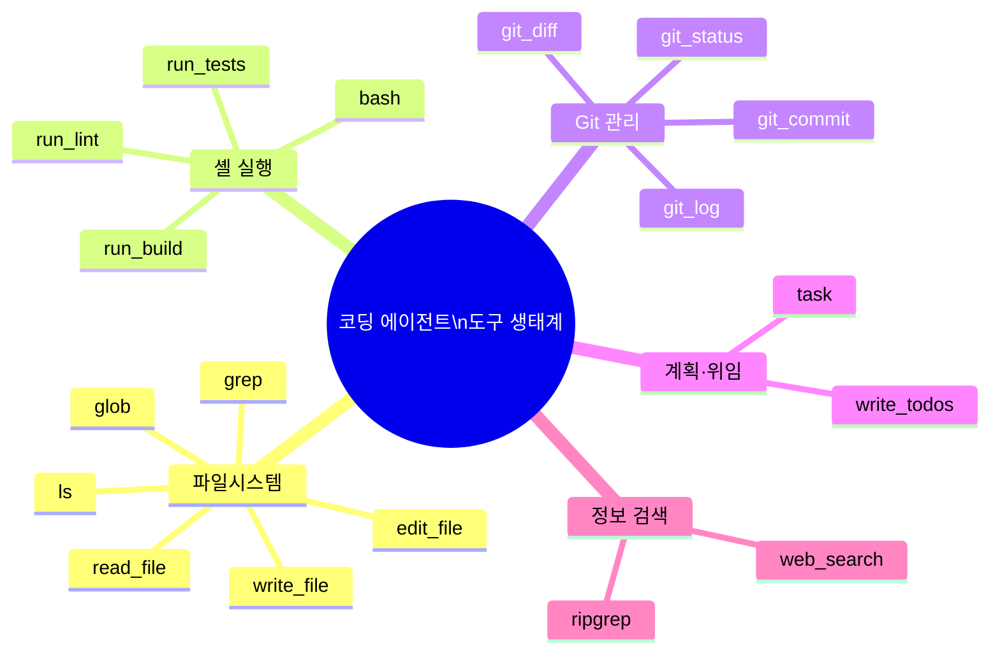

#### D.6.2 도구 보안 등급 및 HITL 정책

| 등급 | 도구 | HITL | 이유 |
|---|---|---|---|
| 🟢 안전 | `ls`, `read_file`, `glob`, `grep`, `git_status`, `git_log`, `git_diff`, `write_todos` | 자동 실행 | 읽기 전용 또는 되돌리기 가능 |
| 🟡 주의 | `write_file`, `edit_file`, `run_tests`, `run_lint` | 설정에 따라 | 변경 발생하나 범위 제한적 |
| 🔴 위험 | `bash`(시스템 변경), `git_commit`, `git_push`, 패키지 설치, 외부 API 호출 | 반드시 승인 | 되돌리기 어렵거나 외부 영향 |

```python
HumanInTheLoopMiddleware(
    interrupt_on={
        "git_commit":  {"allowed_decisions": ["approve", "edit", "reject"]},
        "git_push":    {"allowed_decisions": ["approve", "reject"]},
        "ls":          False,
        "read_file":   False,
        "write_file":  False,
        "edit_file":   False,
        "bash":        False,
        "git_status":  False,
        "git_diff":    False,
        "write_todos": False,
        "task":        False,
    }
)
```

---

### D.7 메모리 아키텍처

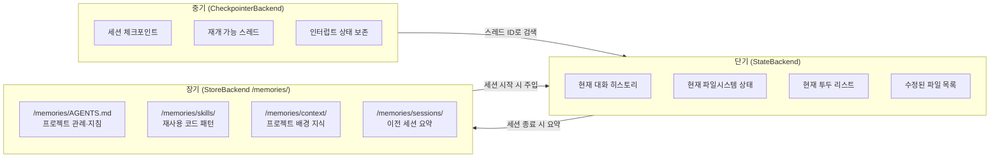

AGENTS.md 파일은 에이전트가 프로젝트 관례를 기억하는 핵심 파일이다. 코딩 스타일, 커밋 관례, 자주 사용하는 명령, 금지 사항 등 팀의 개발 문화를 자연어로 기술해 저장한다. 에이전트는 새 세션 시작 시 이 파일을 자동으로 로딩해 프로젝트 컨텍스트를 즉시 복원한다.

#### D.7.1 CompositeBackend 설정

```python
from deepagents.backends import CompositeBackend, StateBackend, StoreBackend
from langgraph.store.postgres import PostgresStore   # 프로덕션

store = PostgresStore.from_conn_string(os.environ["POSTGRES_URI"])

backend = CompositeBackend(
    default=StateBackend(),
    routes={
        "/memories/": StoreBackend(store=store),
        "/memories/skills/": StoreBackend(store=store),
    }
)
```

---

### D.8 커스텀 상태 스키마

```python
from langchain.agents.middleware import AgentState
from typing_extensions import NotRequired
from typing import Annotated

def _last_wins(a, b): return b
def _append(a: list, b: list) -> list: return (a or []) + (b or [])

class CodingAgentState(AgentState):
    # 프로젝트 컨텍스트 (CodebaseIndexMiddleware 제공)
    project_root:      NotRequired[str]
    git_branch:        NotRequired[str]
    git_remote:        NotRequired[str]
    recent_commits:    NotRequired[str]
    agents_md_content: NotRequired[str]

    # 세션 추적
    files_modified:    NotRequired[Annotated[list[str], _append]]
    commands_run:      NotRequired[Annotated[list[str], _append]]
    tests_passed:      NotRequired[bool]

    # 비용·한도 제어
    model_call_count:  NotRequired[int]
    tool_call_count:   NotRequired[int]

    # 계획 (TodoListMiddleware 제공)
    todos:             NotRequired[list[dict]]

    # 요약 (SummarizationMiddleware 제공)
    session_summary:   NotRequired[Annotated[str, _last_wins]]
```

---

### D.9 전체 에이전트 조립 코드

`create_deep_agent`는 TodoList·Filesystem·SubAgent·Summarization을 이미 내장하고 있다. 아래 코드는 두 가지 관점에서 작성되었다.

- **내장 기능 활용**: `subagents`, `backend`, `memory` 파라미터로 Deep Agents의 내장 기능을 커스터마이징
- **추가 미들웨어**: `ShellToolMiddleware`, `HumanInTheLoopMiddleware`, `ModelRetryMiddleware`, `ModelCallLimitMiddleware`, `CodebaseIndexMiddleware`, `GitMiddleware`는 `create_deep_agent`가 기본 제공하지 않는 기능이므로 추가

> **주의**: `create_deep_agent`가 `middleware` 파라미터를 통해 추가 미들웨어 주입을 지원하는지는 deepagents 공식 API 문서에서 확인 필요하다. 지원되지 않을 경우 아래 추가 미들웨어 부분은 `create_agent` 기반으로 전환해야 한다.

```python
import os
from langchain.agents.middleware import (
    SummarizationMiddleware, HumanInTheLoopMiddleware,
    ModelRetryMiddleware, ModelCallLimitMiddleware,
    FilesystemFileSearchMiddleware,
)
from langchain.agents.middleware.shell_tool import (
    ShellToolMiddleware, DockerExecutionPolicy, HostExecutionPolicy,
)
from deepagents import create_deep_agent, Subagent
from deepagents.backends import CompositeBackend, StateBackend, StoreBackend
from langgraph.checkpoint.postgres import PostgresSaver
from langgraph.store.postgres import PostgresStore

# ─── 인프라 ────────────────────────────────────────────────────
store = PostgresStore.from_conn_string(os.environ["POSTGRES_URI"])
checkpointer = PostgresSaver.from_conn_string(os.environ["POSTGRES_URI"])

# /memories/ 경로는 PostgresStore에 영속 저장, 나머지는 세션 상태에 저장
backend = CompositeBackend(
    default=StateBackend(),
    routes={"/memories/": StoreBackend(store=store)}
)

IS_PRODUCTION = os.environ.get("ENVIRONMENT") == "production"
execution_policy = (
    DockerExecutionPolicy(image="python:3.11-slim", command_timeout=120.0)
    if IS_PRODUCTION else HostExecutionPolicy()
)

# ─── 전문 서브에이전트 (create_deep_agent subagents 파라미터로 전달) ─
test_runner = Subagent(
    name="test-runner",
    system_prompt="테스트 실행 전문. 실패 원인 분석 후 간결한 보고서 반환.",
    tools=[],
    model="anthropic:claude-haiku-4-5-20251001",  # 비용 절감 목적의 소형 모델
)
code_reviewer = Subagent(
    name="code-reviewer",
    system_prompt="코드 리뷰 전문. 버그·성능·스타일 분석 후 구체적 개선안 제시.",
    tools=[],
    model="anthropic:claude-sonnet-4-6",
)

SYSTEM_PROMPT = """
당신은 숙련된 소프트웨어 엔지니어 에이전트입니다.

## 작업 원칙
- 먼저 write_todos로 작업 계획을 세우세요.
- ls/glob으로 프로젝트 구조를 파악한 후 파일을 읽으세요.
- 코드 수정 후 반드시 테스트를 실행해 검증하세요.
- 대용량 결과는 파일시스템에 저장하고 참조하세요.
- 복잡한 하위 태스크는 task 도구로 서브에이전트에 위임하세요.
- 커밋 전 git_status/git_diff를 반드시 확인하세요.
- 세션 간 기억할 내용은 /memories/AGENTS.md에 저장하세요.
"""

# ─── 에이전트 조립 ─────────────────────────────────────────────
# create_deep_agent 내장: TodoList, Filesystem, SubAgent, Summarization (기본 설정)
# middleware 파라미터: 내장되지 않은 추가 기능만 전달
agent = create_deep_agent(
    model="anthropic:claude-sonnet-4-6",
    system_prompt=SYSTEM_PROMPT,
    backend=backend,
    memory=["/memories/AGENTS.md"],  # 세션 시작 시 자동 로딩
    subagents=[test_runner, code_reviewer],
    middleware=[
        # ── create_deep_agent에 없는 추가 미들웨어만 ──────────
        # 셸 실행 환경 (bash 도구 제공)
        ShellToolMiddleware(
            workspace_root=os.getcwd(),
            execution_policy=execution_policy,
            startup_commands=["export PYTHONPATH=$(pwd)"],
        ),
        # 파일 패턴 검색 (glob/grep 도구 제공)
        FilesystemFileSearchMiddleware(
            root_path=os.getcwd(), use_ripgrep=True,
        ),
        # 위험 도구 인간 승인 게이트
        HumanInTheLoopMiddleware(
            interrupt_on={
                "git_commit": {"allowed_decisions": ["approve", "edit", "reject"]},
                "git_push":   {"allowed_decisions": ["approve", "reject"]},
                "ls": False, "read_file": False, "write_file": False,
                "edit_file": False, "bash": False, "glob": False,
                "grep": False, "git_status": False, "git_diff": False,
                "write_todos": False, "task": False,
            }
        ),
        # 모델 호출 재시도
        ModelRetryMiddleware(max_retries=3, backoff_factor=2.0),
        # 비용 상한 제어
        ModelCallLimitMiddleware(run_limit=150, exit_behavior="end"),
        # 프로젝트 컨텍스트 주입 (커스텀)
        CodebaseIndexMiddleware(workspace_root=os.getcwd()),
        # Git 도구 등록 (커스텀)
        GitMiddleware(),
    ],
    checkpointer=checkpointer,
)
```

---

### D.10 LangSmith 관찰성 통합

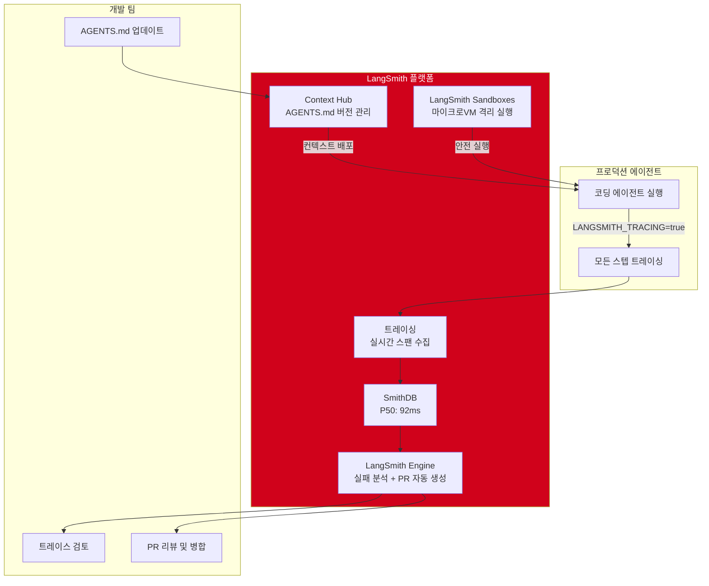

LangSmith 설정은 환경 변수만으로 완료된다.

```python
import os
os.environ["LANGSMITH_TRACING"] = "true"
os.environ["LANGSMITH_API_KEY"]  = "your-api-key"
os.environ["LANGSMITH_PROJECT"]  = "coding-agent-harness"
```

에이전트 품질 측정을 위한 평가 기준도 함께 정의한다.

```python
from langsmith import evaluate

def test_passes(run, example) -> dict:
    """에이전트 수정 코드가 테스트를 통과하는가."""
    last = run.outputs.get("messages", [])[-1]
    return {"score": 1 if "All tests passed" in str(last) else 0,
            "key": "test_passes"}

def no_unintended_deletions(run, example) -> dict:
    """의도하지 않은 파일 삭제가 없는가."""
    tool_calls = [m for m in run.outputs.get("messages", [])
                  if hasattr(m, "tool_calls")]
    dangerous = [t for t in tool_calls if "rm -rf" in str(t)]
    return {"score": 1 if not dangerous else 0,
            "key": "no_unintended_deletions"}

results = evaluate(
    agent,
    data="coding-agent-evals",
    evaluators=[test_passes, no_unintended_deletions],
    experiment_prefix="coding-agent-v1.0",
)
```

---

### D.11 인터페이스 계층 설계

#### D.11.1 대화형 REPL

```python
import asyncio
from rich.console import Console
from langchain.schema import HumanMessage

console = Console()

async def interactive_session(agent, thread_id: str):
    config = {"configurable": {"thread_id": thread_id}}
    console.print("[bold green]코딩 에이전트 시작[/bold green]")

    while True:
        try:
            user_input = console.input("[bold blue]❯[/bold blue] ")
            if user_input.lower() in ["exit", "quit", "q"]:
                break

            console.print("\n[bold yellow]에이전트:[/bold yellow]")
            async for event in agent.astream_events(
                {"messages": [HumanMessage(content=user_input)]},
                config=config, version="v2"
            ):
                if event["event"] == "on_chat_model_stream":
                    chunk = event["data"]["chunk"].content
                    if chunk:
                        console.print(chunk, end="")
                elif event["event"] == "on_tool_start":
                    console.print(f"\n[dim]🔧 {event['name']} 실행 중...[/dim]")
            console.print("\n")
        except KeyboardInterrupt:
            break
```

#### D.11.2 비대화형 파이프 모드 (-n flag)

```python
import sys
from langchain.schema import HumanMessage

def run_noninteractive(task: str, thread_id: str | None = None) -> str:
    import uuid
    config = {"configurable": {"thread_id": thread_id or str(uuid.uuid4())}}
    result = agent.invoke(
        {"messages": [HumanMessage(content=task)]}, config=config
    )
    return result["messages"][-1].content

# 사용: echo "테스트 실행하고 실패 목록 알려줘" | python agent.py -n
if __name__ == "__main__" and "-n" in sys.argv:
    print(run_noninteractive(sys.stdin.read().strip()))
```

---

### D.12 배포 아키텍처

#### D.12.1 환경별 구성 요약

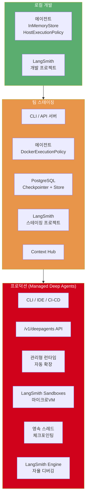

---

### D.13 단계별 구축 로드맵

코딩 에이전트 하네스를 처음 구축하는 팀을 위한 4단계 로드맵이다.

**Phase 1 — MVP (1주)**: 동작하는 기본 하네스를 만드는 것이 목표다. `create_deep_agent`에 `ShellToolMiddleware`와 `FilesystemMiddleware`를 붙이고, LangSmith 트레이싱을 연결한다. 컨텍스트 관리나 장기 메모리는 이 단계에서 신경 쓰지 않는다.

**Phase 2 — 신뢰성 (2주)**: 세션이 길어져도 깨지지 않는 에이전트를 만든다. `SummarizationMiddleware`로 컨텍스트 포화를 방지하고, `HumanInTheLoopMiddleware`로 위험 작업에 승인 게이트를 추가한다. PostgreSQL 기반 영속 스토어로 전환해 세션 재개 기능을 구현한다.

**Phase 3 — 고도화 (3주)**: 에이전트가 프로젝트를 "이해"하도록 만든다. `CodebaseIndexMiddleware`와 `GitMiddleware`를 개발하고, 전문 서브에이전트(테스트 러너, 코드 리뷰어)를 정의한다. LangSmith 평가 데이터셋을 구축해 품질을 측정하기 시작한다.

**Phase 4 — 프로덕션 (2주)**: 팀이 공유해 쓸 수 있는 수준으로 격상한다. Docker 격리 실행 정책을 적용하고, LangSmith Engine으로 자율 디버깅 루프를 구성하며, IDE 플러그인 통합을 위한 API 서버를 구현한다.

---

### D.14 Claude Code와의 기능 대응표

| Claude Code 기능 | 이 하네스에서의 구현 | 구현 방식 |
|---|---|---|
| 파일 읽기/쓰기/편집 | `FilesystemMiddleware` | Deep Agents 내장 (create_deep_agent 기본 포함) |
| 셸 명령 실행 (bash) | `ShellToolMiddleware` | LangChain 사전 빌드 (추가 필요) |
| 코드베이스 검색 (glob/grep) | `FilesystemFileSearchMiddleware` | LangChain 사전 빌드 (추가 필요) |
| 태스크 계획 (TODO) | `TodoListMiddleware` | Deep Agents 내장 (create_deep_agent 기본 포함) |
| 컨텍스트 자동 압축 | `SummarizationMiddleware` | Deep Agents 내장 (create_deep_agent 기본 포함) |
| 서브에이전트 위임 | `subagents` 파라미터 + `SubAgentMiddleware` | Deep Agents 내장 (create_deep_agent 기본 포함) |
| 프로젝트 관례 기억 (AGENTS.md) | `memory` 파라미터 + `/memories/` StoreBackend | Deep Agents + CompositeBackend 설정 |
| 세션 재개 | `PostgresSaver` (Checkpointer) | LangGraph |
| 인간 승인 게이트 | `HumanInTheLoopMiddleware` | LangChain 사전 빌드 (추가 필요) |
| 스트리밍 출력 | LangGraph `astream_events` | LangGraph 내장 |
| Git 통합 | `GitMiddleware` | 커스텀 구현 |
| 프로젝트 구조 파악 | `CodebaseIndexMiddleware` | 커스텀 구현 |
| 실행 격리 (샌드박스) | `DockerExecutionPolicy` / LangSmith Sandboxes | LangChain / LangSmith |
| 트레이싱·관찰성 | LangSmith 트레이싱 (환경 변수 설정만으로 활성화) | LangSmith 내장 |
| 자율 디버깅 | LangSmith Engine | LangSmith |
| 컨텍스트 버전 관리 | Context Hub | LangSmith |

---

*작성일: 2026-06-06*
