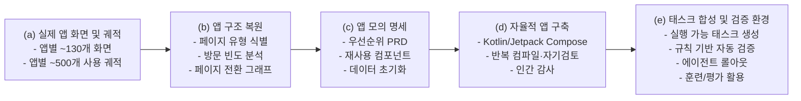
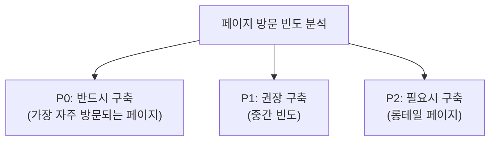
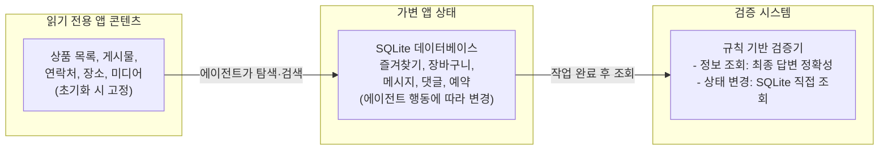
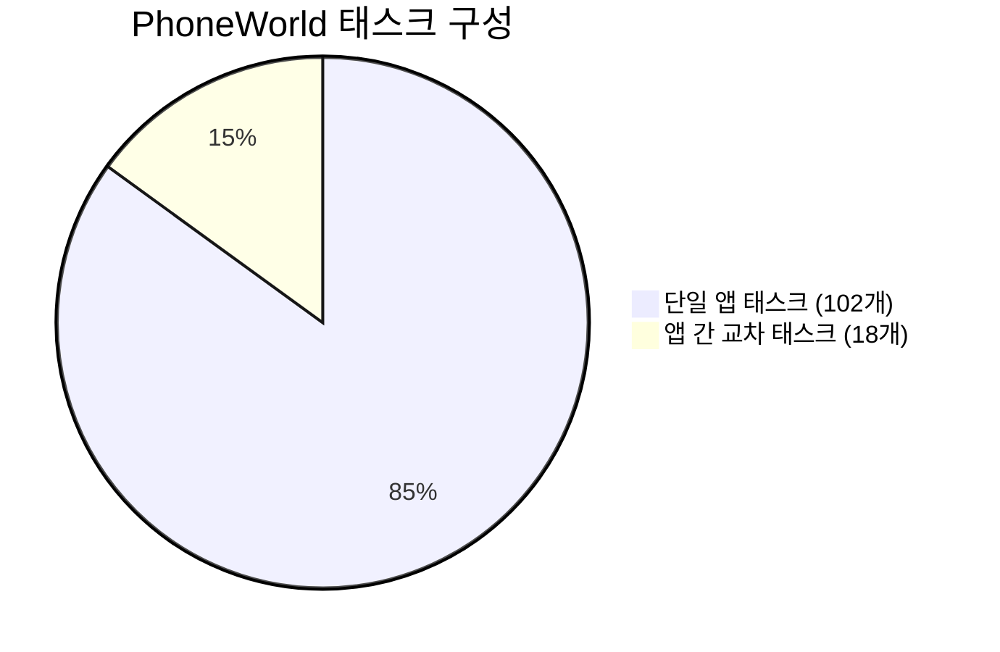
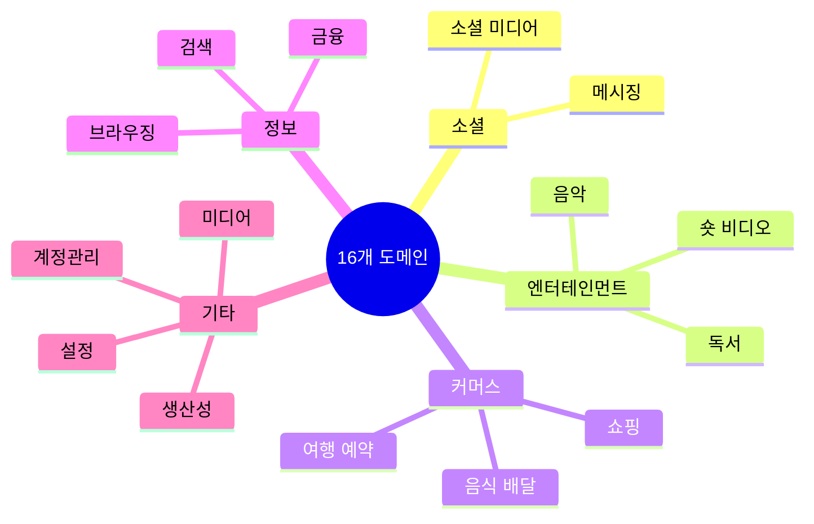
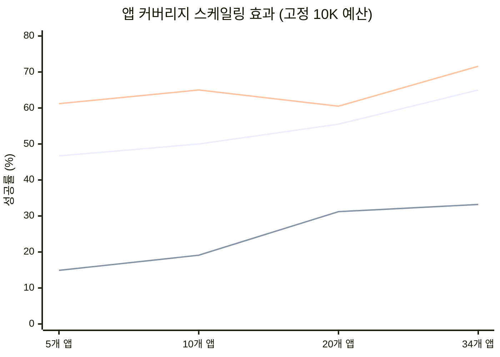
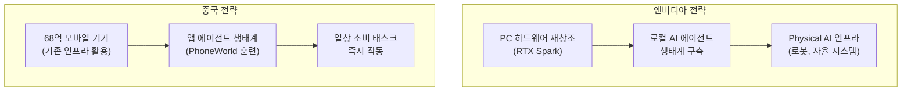

> **논문 정보**  
> - 제목: PhoneWorld: Scaling Phone-Use Agent Environments  
> - arXiv: [2605.29486v1](https://arxiv.org/html/2605.29486v1)  
> - 발표일: 2026년 5월 28일  
> - 주도 기관: 텐센트 혼위안(Tencent Hunyuan) 팀  
> - 참여 기관: 홍콩중문대학교(선전), 중국인민대학 가오링 AI학원, 우한대학교  
> - 제1저자(공동): Zhengyang Tang, Yuxuan Liu, Xin Lai, Junyi Li, Pengyuan Lyu 외 23인

## 관련글

[**폰이 세상이 된다**](https://www.facebook.com/share/p/1JC2Zro3bs/)

---

## 목차

1. [연구 개요 및 발표 맥락](#1-연구-개요-및-발표-맥락)
2. [문제 정의: 왜 모바일 에이전트 훈련이 어려운가](#2-문제-정의-왜-모바일-에이전트-훈련이-어려운가)
3. [PhoneWorld 전체 파이프라인 구조](#3-phoneworld-전체-파이프라인-구조)
4. [파이프라인 단계별 상세 설명](#4-파이프라인-단계별-상세-설명)
   - 4.1 [입력 데이터 수집: 실제 사용 궤적과 화면 정보](#41-입력-데이터-수집-실제-사용-궤적과-화면-정보)
   - 4.2 [앱 구조 복원: 무엇을 만들어야 하는지 파악하기](#42-앱-구조-복원-무엇을-만들어야-하는지-파악하기)
   - 4.3 [빌드 명세 생성: 어떻게 만들어야 하는지 설계하기](#43-빌드-명세-생성-어떻게-만들어야-하는지-설계하기)
   - 4.4 [자율적 앱 구축: 코딩 에이전트의 반복 구현](#44-자율적-앱-구축-코딩-에이전트의-반복-구현)
   - 4.5 [인간-인-더-루프 품질 보증](#45-인간-인-더-루프-품질-보증)
   - 4.6 [태스크 합성 및 자동 검증](#46-태스크-합성-및-자동-검증)
5. [PhoneWorld 스위트 현황](#5-phoneworld-스위트-현황)
6. [실험 설계 및 결과](#6-실험-설계-및-결과)
   - 6.1 [훈련 데이터 구성 및 모델 설정](#61-훈련-데이터-구성-및-모델-설정)
   - 6.2 [평가 벤치마크 네 가지](#62-평가-벤치마크-네-가지)
   - 6.3 [스케일링 실험 1: 부분 교체가 전 벤치마크를 향상시킨다](#63-스케일링-실험-1-부분-교체가-전-벤치마크를-향상시킨다)
   - 6.4 [스케일링 실험 2: 전체 교체는 강하지만 보완재임을 확인](#64-스케일링-실험-2-전체-교체는-강하지만-보완재임을-확인)
   - 6.5 [스케일링 실험 3: PhoneWorld 데이터 양의 증가 효과](#65-스케일링-실험-3-phoneworld-데이터-양의-증가-효과)
   - 6.6 [스케일링 실험 4: 앱 커버리지 확장이 가장 강력한 신호](#66-스케일링-실험-4-앱-커버리지-확장이-가장-강력한-신호)
7. [연구의 핵심 의의와 관련 선행 연구](#7-연구의-핵심-의의와-관련-선행-연구)
8. [중국의 모바일 AI 생태계: PhoneWorld를 둘러싼 시장 맥락](#8-중국의-모바일-ai-생태계-phoneworld를-둘러싼-시장-맥락)
9. [엔비디아 PC AI vs 중국 모바일 AI: 같은 시기 다른 노선](#9-엔비디아-pc-ai-vs-중국-모바일-ai-같은-시기-다른-노선)
10. [한계와 향후 과제](#10-한계와-향후-과제)
11. [종합 결론](#11-종합-결론)

---

## 1. 연구 개요 및 발표 맥락

2026년 5월 28일, 텐센트 혼위안(Tencent Hunyuan) 팀이 주도하고 홍콩중문대학교(선전), 중국인민대학 가오링 AI학원, 우한대학교가 공동 참여한 논문 **"PhoneWorld: Scaling Phone-Use Agent Environments"** 가 arXiv에 공개되었다. 논문 번호는 arXiv:2605.29486이며, Zhengyang Tang, Yuxuan Liu, Xin Lai, Junyi Li, Pengyuan Lyu 등 5명이 제1저자를 공동으로 맡고 있고, 총 24명의 연구자가 참여한 대규모 협력 연구다.

이 논문이 주목받는 이유는 단순히 새로운 모바일 에이전트 벤치마크를 하나 더 만든 것이 아니기 때문이다. PhoneWorld는 모바일 에이전트가 훈련할 수 있는 **통제 가능하고 재현 가능한 환경 자체를 대규모로 생산하는 파이프라인**이다. 다시 말해, 벤치마크를 하나씩 수작업으로 만드는 방식에서 벗어나, 실제 사용자의 행동 궤적을 분석하고 그로부터 훈련용 가상 앱 세계를 자동으로 생성하는 시스템이다. 연구팀이 스스로 "진행 중인 연구(work in progress)"라고 명시했을 만큼, 이 논문은 완성된 결론이 아니라 확장되는 프로젝트의 현재 상태를 보고하는 성격을 갖는다.

발표 시점 또한 의미심장하다. 같은 주에 엔비디아(NVIDIA)는 2026년 6월 1일 컴퓨텍스(Computex) 타이베이 기조연설에서 RTX Spark 슈퍼칩을 발표하며 "40년 만의 PC 재창조"를 선언했고, 텐센트는 같은 시기에 WeChat의 에이전트 생태계를 스마트폰 제조사들에게 개방하는 행보를 보였다. PC 중심의 로컬 AI 에이전트와 모바일 중심의 앱 에이전트가 동시에 시장을 향한 질주를 시작한 순간, PhoneWorld는 모바일 진영의 기술적 토대를 보여주는 연구로 등장한 것이다.

---

## 2. 문제 정의: 왜 모바일 에이전트 훈련이 어려운가

AI 에이전트가 스마트폰을 직접 조작하게 하려면, 먼저 그 에이전트를 충분히 훈련시켜야 한다. 그런데 모바일 에이전트의 훈련에는 다른 AI 훈련과는 구별되는 독특한 어려움이 존재한다. 이 어려움을 이해하는 것이 PhoneWorld가 왜 필요한지를 파악하는 출발점이다.

### 실제 앱에서의 훈련이 갖는 문제

AI 에이전트가 실제 스마트폰 앱을 직접 조작하면서 훈련하는 방식을 상상해보자. 이 접근법은 세 가지 근본적인 문제를 가진다.

첫째, **상태 오염(state contamination)** 의 문제다. 에이전트가 메시지를 보내거나, 상품을 장바구니에 담거나, 설정을 변경하면 실제 계정의 상태가 바뀐다. 동일한 작업을 여러 번 반복 훈련하려면 매번 상태를 원래대로 복구해야 하는데, 이것이 실제 앱에서는 자동화하기 매우 어렵다.

둘째, **검증의 어려움**이다. 에이전트가 작업을 완료했는지 자동으로 확인하려면 앱 내부의 데이터베이스에 직접 접근해야 한다. 메시지가 실제로 발송되었는지, 즐겨찾기가 추가되었는지를 확인하려면 앱이 내부 상태를 외부에 노출해주어야 하는데, 상용 앱은 보안상의 이유로 이를 허용하지 않는다.

셋째, **환경의 불안정성**이다. 실제 앱은 로그인 오류, 광고 팝업, 인증 절차, 버전 업데이트 등 예측 불가능한 요소들로 가득하다. 이런 환경에서는 에이전트의 실패가 실제 능력 부족 때문인지, 아니면 환경의 외부 교란 때문인지 구분하기 어렵다.

### 시뮬레이션 앱을 만들면 되지 않을까

한 가지 대안은 처음부터 훈련용 가짜 앱을 만드는 것이다. 하지만 이 접근법도 문제가 있다. 수작업으로 시뮬레이션 앱을 만들면, 실제 앱과의 시각적·구조적 차이가 크기 때문에 그 환경에서 훈련한 에이전트는 실제 스마트폰으로 옮겨갔을 때 제대로 작동하지 않는다. 또한 수작업은 확장성이 없다. 수백 개의 앱을 커버하려면 엄청난 인력과 시간이 필요하다.

### PhoneWorld가 해결하려는 핵심 병목

PhoneWorld가 해결하고자 하는 것은 이 딜레마다. **실제 앱과 충분히 닮아 있으면서도, 통제 가능하고, 재설정 가능하며, 자동 검증이 가능한 훈련 환경을 대규모로 자동 생성**하는 방법이 바로 이 연구의 핵심 기여다.

연구팀은 이것을 간결하게 표현한다. "기존 모바일 에이전트 벤치마크들은 이미 만들어진 환경에서의 평가에 집중해왔다. PhoneWorld는 다른 질문을 한다. 어떻게 하면 새로운 폰-사용 환경을 대규모로 계속 만들어낼 수 있는가?"

---

## 3. PhoneWorld 전체 파이프라인 구조

PhoneWorld는 다섯 단계로 이루어진 파이프라인이다. 실제 앱의 화면 데이터와 사용 궤적을 입력으로 받아, 훈련 가능한 모의 앱 환경을 출력으로 생성한다.



이 파이프라인의 작동 원리를 한 문장으로 요약하면 다음과 같다. **실제 사용자가 앱을 어떻게 사용하는가라는 행동 구조를 추출하고, 그 구조를 토대로 코딩 에이전트가 안드로이드 앱을 재구현하여, 에이전트가 마음껏 훈련할 수 있는 살아있는 환경을 만드는 것이다.**

---

## 4. 파이프라인 단계별 상세 설명

### 4.1 입력 데이터 수집: 실제 사용 궤적과 화면 정보

PhoneWorld의 모든 것은 두 가지 입력 데이터에서 시작된다. 하나는 **대표 화면(representative screenshots)** 이고, 다른 하나는 **실제 사용 에피소드(real usage episodes)** 다.

화면 데이터는 각 앱에서 앱별로 약 130개의 대표 화면을 수집한다. 이 화면들은 각 페이지가 시각적으로 어떻게 보이는지, 어떤 UI 요소들이 배치되어 있는지를 알려준다.

사용 에피소드 데이터는 사람 운영자(human operators)가 실제 기기에서 앱을 자연스럽게 탐색하면서 수집한다. 각 에피소드는 자연어 사용자 지시문과 함께, 연속적인 화면-행동 쌍으로 구성된다. 이 에피소드들은 앱별로 약 500개씩 수집되며, 중요한 것은 이것이 정해진 시나리오를 따르는 스크립트가 아니라 **탐색적(exploratory) 사용** 이라는 점이다. 고정된 시나리오를 따르면 통계가 편향되기 때문에, 일반 사용자가 앱을 여는 방식과 최대한 유사하게 수집한다.

두 데이터 소스는 서로 보완적인 역할을 한다. 화면 데이터는 "이 페이지는 어떻게 생겼는가"를 알려주고, 사용 에피소드는 "이 앱이 실제로 어떻게 사용되는가"를 알려준다. PhoneWorld는 이 두 신호를 함께 활용하여 실제 행동 패턴을 보존하는 모의 환경을 만든다.

### 4.2 앱 구조 복원: 무엇을 만들어야 하는지 파악하기

실제 소비자 앱은 수십 개의 서로 다른 화면을 가질 수 있다. 그런데 그 중에서 사용자가 실제로 자주 방문하는 화면은 일부에 불과하다. 이 단계의 목표는 **어떤 화면이 중요하고, 그 화면들이 어떻게 연결되어 있는지**를 파악하는 것이다.

#### 페이지 유형 분류

먼저 해당 앱에 대한 페이지 분류 체계(taxonomy)를 만든다. Claude Code를 사용하여 대표 화면들을 분석하고, 반복적으로 등장하는 페이지 유형(홈 페이지, 상세 페이지, 프로필 페이지 등)을 식별한다. 앱 하나당 25~30개의 카테고리와 그에 맞는 분류 기준이 만들어진다. 이후 경량 시각-언어 모델(vision-language model)이 전체 화면 코퍼스를 이 분류 체계에 따라 병렬로 분류한다.

#### 페이지 방문 빈도 분석 및 우선순위 지정

분류된 화면 코퍼스를 바탕으로, 수집된 사용 에피소드에서 각 페이지 유형이 얼마나 자주 등장하는지 빈도를 집계한다. 이 빈도 분포는 다음과 같이 세 수준의 우선순위로 변환된다.



이 빈도 기반 우선순위화는 매우 중요한 설계 결정이다. 어떤 기능이 "중요해 보인다"는 주관적 판단이 아니라, 실제 사용자의 행동 데이터에서 직접 도출된 객관적 우선순위를 따름으로써, 구축 노력을 실제로 의미 있는 곳에 집중할 수 있다.

#### 페이지 전환 그래프 추출

모의 환경이 현실적인 내비게이션을 지원하려면, 어떤 화면에서 어떤 화면으로 이동할 수 있는지의 연결 구조를 보존해야 한다. 각 에피소드에서 연속적으로 방문된 페이지 쌍을 방향성 엣지(directed edge)로 기록하고, 이것을 모든 에피소드에 걸쳐 집계하면 **페이지 전환 그래프(page transition graph)** 가 만들어진다. 이 그래프의 고빈도 엣지들이 모의 앱에서 반드시 구현해야 할 주요 내비게이션 경로가 된다.

### 4.3 빌드 명세 생성: 어떻게 만들어야 하는지 설계하기

앞 단계에서 "무엇을 만들어야 하는지"를 파악했다면, 이 단계에서는 **"어떻게 만들어야 하는지"를 설계**한다.

#### 페이지별 PRD(제품 요구사항 문서) 생성

각 페이지 유형에 대해 구조화된 PRD가 생성된다. 시각-언어 모델이 해당 페이지 유형의 대표 화면 2~3개를 분석하고, 네 가지 차원을 따라 명세를 작성한다.

- **페이지 레이아웃**: 화면 구성 방식과 UI 요소 배치
- **인터랙티브 요소**: 사용자가 탭하거나 입력할 수 있는 요소들
- **전환 관계**: 이 페이지에서 어디로 이동할 수 있는지
- **시각적 속성**: 색상, 폰트, 아이콘 스타일 등

이 PRD가 이후 코딩 에이전트의 구현 지침서가 된다.

#### 재사용 컴포넌트 라이브러리 구축

여러 앱에 걸쳐 반복적으로 등장하는 UI 패턴들(검색 바, 개인 프로필, 피드 카드, 댓글 목록 등)은 별도의 재사용 컴포넌트 라이브러리로 분리된다. 현재 이 라이브러리에는 18개의 모듈이 포함되어 있다. 코딩 에이전트가 새 앱을 구현할 때 이 패턴이 PRD에서 감지되면, 처음부터 다시 구현하는 대신 라이브러리에서 해당 모듈을 가져다 쓴다. 이 방식은 시간을 절약할 뿐 아니라, 이미 검증된 코드를 재활용함으로써 품질의 일관성도 보장한다.

#### 데이터 아키텍처 설계: 읽기 전용 콘텐츠와 가변 상태

이 단계의 가장 중요한 설계 결정은 각 모의 앱의 데이터를 두 층위로 분리하는 것이다.



**읽기 전용 앱 콘텐츠**는 앱 초기화 시 설정되는 고정 데이터다. 상품 목록, 게시물, 연락처, 장소, 미디어 등 에이전트가 검색하고 탐색할 수 있는 콘텐츠가 여기 속한다. 네트워크 접근 없이 오프라인으로 동작하기 위해 BM25 검색 엔진도 이 콘텐츠 위에 로컬로 구축된다.

**가변 앱 상태**는 에이전트의 행동에 따라 실제로 변경되는 데이터다. 즐겨찾기 추가, 장바구니 수정, 댓글 게시, 메시지 발송 등이 이 층위에 기록된다. 이 상태는 초기화 가능한 SQLite 데이터베이스에 저장되며, 태스크가 끝나면 초기 스냅샷으로 복원된다. **이 설계 덕분에 동일한 태스크를 무한히 반복 실행할 수 있다.** 검증기 역시 이 데이터베이스를 직접 조회함으로써 에이전트가 실제로 원하는 상태 변화를 일으켰는지 자동으로 확인한다.

### 4.4 자율적 앱 구축: 코딩 에이전트의 반복 구현

이 단계에서 실제 안드로이드 앱이 만들어진다. 코딩 에이전트는 Kotlin/Jetpack Compose로 소스 코드를 작성하고, APK로 컴파일하며, 자기 검토(self-review) 체크리스트를 실행하고, 발견된 문제를 수정하는 반복 루프를 수행한다.

실제로 하나의 앱을 완성하려면 보통 여러 번의 반복이 필요하다. 내비게이션 상호 의존성, 데이터 로딩, UI 렌더링 등의 문제를 해결하면서 점진적으로 완성된다.

이 과정에서 흥미로운 피드백 루프가 발생한다. 다양한 앱을 구현하면서 쌓이는 경험이 이후 앱 구현을 더 효율적으로 만든다. 컴파일 오류와 런타임 버그는 구조화된 체크리스트로 누적되고(현재 스키마 불일치, 동작 없는 버튼, 누락된 라우트 등 포함), 반복적으로 등장하는 UI 패턴은 재사용 모듈로 추출되며, 이전 앱 구현 경험에서 배운 설계 지식은 이후 구현의 지침으로 변환된다. 앱이 많아질수록 새 앱 하나를 구현하는 비용이 낮아지고 신뢰성이 높아지는 구조다.

### 4.5 인간-인-더-루프 품질 보증

PhoneWorld는 AI 주도이지만 인간의 감사(audit)를 거친다. 자율 구축이 끝나면 컴파일된 앱을 에뮬레이터에 설치하고 자동 스모크 테스트(smoke test)를 실행한다. 핵심 플로우(앱 실행, 탭 전환, 검색, 상세 페이지 내비게이션, 주요 쓰기 작업)를 자동으로 점검하여 일반적인 문제들을 사전에 걸러낸다.

그 다음, 사람 리뷰어가 모의 앱과 실제 앱을 나란히 비교하며 레이아웃, 내비게이션, 데이터 커버리지, 시각적 현실감, 상태 변동 행동의 차이를 검토한다. 여기서 핵심 기준은 **픽셀 단위의 완벽한 일치가 아니라**, 주요 사용자 흐름이 올바르게 작동하고 인터페이스가 실제 앱과 충분히 유사하여 폰-사용 에이전트가 제대로 동작할 수 있는지다. 발견된 문제는 구축 루프로 피드백되어 재구축·재테스트를 거친다. 이 검토 사이클은 보통 1~2회 내에 수렴한다.

완전한 자동화를 주장하지 않고 AI 주도와 인간 감사를 결합하는 이 방식이 실질적인 확장성을 가능하게 한다.

### 4.6 태스크 합성 및 자동 검증

완성된 모의 앱 환경 위에서, 이제 에이전트가 수행할 태스크를 자동으로 생성한다. 태스크를 수작업으로 작성하는 방식은 확장성이 없다. 새 앱마다 사람이 목표를 설계하고, 검증 경로를 추적하고, 데이터와의 일관성을 확인해야 하기 때문이다.

PhoneWorld는 앱 구축 과정에서 이미 만들어진 세 가지 산출물을 태스크 생성의 재료로 활용한다.

- **읽기 전용 앱 콘텐츠**: 실제로 존재하는 엔티티만을 참조하도록 보장
- **데이터베이스 스키마**: 가능한 상태 변화만을 요구하도록 보장
- **페이지별 PRD**: 화면에서 실제로 보이는 것만을 요구하도록 보장

이 세 소스를 교차 참조함으로써, 생성된 모든 태스크는 에이전트가 실제로 수행할 수 있는 작업만을 요구하며, 검증기가 자동으로 확인할 수 있는 형태를 갖춘다.

#### 두 가지 자동 검증 방식

검증은 두 가지 스타일로 이루어진다.

**정보 조회 태스크 검증**: 에이전트의 최종 답변이 읽기 전용 콘텐츠에서 도출된 핵심 값을 포함하는지 확인한다.

**상태 변경 태스크 검증**: SQLite 데이터베이스를 직접 조회하여 기대하는 레코드가 실제로 존재하는지 확인한다. 예를 들어, "QQ 앱에서 '업무 토론' 그룹의 프로젝트 검토 회의 시간을 찾아 장산에게 시간에 맞춰 참석하라는 메시지를 보내라"는 태스크는 다음과 같이 검증된다.

```sql
SELECT COUNT(*) 
FROM messages 
WHERE user_id = 1 AND content LIKE '%3%'
```

이 검증 방식은 모델 기반 판단(LLM-as-judge)을 사용하지 않으므로, 실행마다 평가 결과가 달라지는 분산(variance)이 없다. 어떤 모델이 판단하느냐에 따라 결과가 달라지는 문제를 원천적으로 차단한다.

또한 PhoneWorld는 **앱 간 교차 태스크(cross-app tasks)** 도 지원한다. 서로 다른 앱의 읽기 전용 콘텐츠에서 공유 엔티티를 식별하고, 한 앱에서 정보를 얻어 다른 앱에서 행동하는 목표를 생성한다.

---

## 5. PhoneWorld 스위트 현황

2026년 5월 기준, PhoneWorld 파이프라인을 통해 구축된 현재 스위트의 규모는 다음과 같다.

| 구성요소 | 내용 |
|---------|------|
| 모의 앱 수 | 34개 안드로이드 앱 |
| 커버 도메인 | 16개 소비자 모바일 도메인 |
| 재사용 모듈 | 18개 공유 컴포넌트 |
| 평가 벤치마크 | 120개 수동 검토 태스크 |
| 단일 앱 태스크 | 102개 (앱당 3개) |
| 앱 간 교차 태스크 | 18개 |
| 생성 태스크 풀 | 7,936개 |
| 성공 훈련 에피소드 | 3,354개 |
| 총 상호작용 단계 | 36,193 스텝 |

커버되는 16개 도메인은 숏 비디오, 소셜 미디어, 쇼핑, 음식 배달, 여행, 음악, 독서, 금융 등 현실의 일상적인 모바일 사용 패턴을 포괄한다. 이 34개 앱은 독립적으로 처음부터 만들어진 것이 아니라, 18개의 재사용 모듈을 공유함으로써 개발 효율을 높이고 있다.

훈련용 데이터는 7,936개의 생성 태스크를 Seed 2.0 Pro 모델로 실행한 후, 검증기에서 성공이 확인된 에피소드만을 유지함으로써 구축된다. 이 과정에서 3,354개의 성공 에피소드, 총 36,193개의 상호작용 단계가 훈련 코퍼스를 형성한다.





---

## 6. 실험 설계 및 결과

### 6.1 훈련 데이터 구성 및 모델 설정

모든 실험에서 동일한 비전-언어 백본 모델인 **Qwen3.5-9B**를 사용하며, 동일한 훈련 설정과 입력 포맷을 유지한다. 모델은 시스템 프롬프트, 현재 화면, 사용자 지시문, 이전 행동 요약을 입력으로 받아 다음 사고-행동(thought-and-action) 출력을 예측한다. 훈련은 LlamaFactory에서 동일한 하이퍼파라미터로 2 에폭(epoch) 진행된다.

실험에서 사용하는 세 개의 데이터 코퍼스는 다음과 같다.

- **공유 AndroidWorld 기본 코퍼스**: Gemini 3.1 Pro가 AndroidWorld 태스크에서 수집한 36,193 스텝
- **보조 AndroidWorld 코퍼스**: Seed 2.0 Pro가 AndroidWorld에서 수집한 36,193 스텝
- **PhoneWorld 롤아웃 코퍼스**: Seed 2.0 Pro가 PhoneWorld 태스크 풀에서 수집하고 검증기로 필터링한 36,193 스텝 (3,354 에피소드)

**기준(Baseline) 모델**은 공유 기본 코퍼스(36,193 스텝) + 보조 AndroidWorld 코퍼스(36,193 스텝) = 총 72,386 스텝으로 훈련된다. 이것이 비교 기준이 되는 강력한 AndroidWorld 기반 모델이다.

### 6.2 평가 벤치마크 네 가지

| 벤치마크 | 환경 | 지표 | 논문에서의 역할 |
|---------|------|------|--------------|
| HYMobileBench | 오프라인 (실제 기기) | 스텝 성공률 | 실기기 성능 프록시 |
| AndroidControl | 오프라인 | 스텝 성공률 | 안드로이드 제어 전이 |
| AndroidWorld | 온라인 (실제 앱) | 태스크 성공률 | 도메인 외 실제 앱 전이 |
| PhoneWorld | 온라인 (모의 앱) | 태스크 성공률 | 도메인 내 성능 |

PhoneWorld 온라인 평가는 안드로이드 13 픽셀 6 에뮬레이터 6개와 vLLM 인스턴스 3개로 구성된 환경에서 실행된다.

### 6.3 스케일링 실험 1: 부분 교체가 전 벤치마크를 향상시킨다

첫 번째 핵심 실험은 다음 질문에 답한다. **동일한 총 훈련 예산 내에서, 보조 AndroidWorld 코퍼스의 일부를 PhoneWorld 감독으로 교체하면 기존 강력한 기준선보다 성능이 향상되는가?**

**10K PhoneWorld 교체** 모델은 기준선과 총 예산(72,386 스텝)이 동일하다. 차이는 보조 AndroidWorld 10,000 스텝을 34개 앱에서 수집한 PhoneWorld 스텝으로 교체한 것뿐이다.

| 벤치마크 | Baseline | 10K PhoneWorld 교체 | 변화량 |
|---------|---------|-------------------|-------|
| HYMobileBench | 15.5 | 33.2 | **+17.7** |
| AndroidControl | 53.7 | 59.7 | **+6.0** |
| AndroidWorld | 56.9 | 71.6 | **+14.7** |
| PhoneWorld | 12.5 | 65.0 | **+52.5** |

이 결과는 논문에서 "가장 명확한 단일 결과"로 표현된다. PhoneWorld 성능만 향상된 것이 아니라, 실제 앱 벤치마크인 AndroidWorld와 두 오프라인 벤치마크 모두에서 동시에 성능이 향상되었다. 더 중요한 것은, 이 향상이 단순히 더 많은 데이터를 추가해서 얻어진 것이 아니라는 점이다. 총 예산은 동일하게 유지되었다. 무엇이 바뀐 것은 동일한 예산 내에서 **훈련 환경의 다양성**이 증가한 것이다.

### 6.4 스케일링 실험 2: 전체 교체는 강하지만 보완재임을 확인

두 번째 실험은 교체 비율을 100%까지 확장한다. PhoneWorld 감독이 AndroidWorld 감독을 완전히 대체할 수 있는가, 아니면 두 데이터 소스는 보완재인가?

**전체 PhoneWorld 교체** 모델은 보조 AndroidWorld 36,193 스텝 전체를 PhoneWorld 36,193 스텝으로 교체한다.

| 벤치마크 | Baseline | 전체 PhoneWorld 교체 | 변화량 |
|---------|---------|-------------------|-------|
| HYMobileBench | 15.5 | 33.2 | **+17.7** |
| AndroidControl | 53.7 | 59.3 | **+5.6** |
| AndroidWorld | 56.9 | 46.6 | **-10.3** |
| PhoneWorld | 12.5 | 73.3 | **+60.8** |

결과는 두 가지 사실을 동시에 보여준다. 첫째, PhoneWorld 감독은 그 자체만으로도 매우 강력하다. PhoneWorld 성능이 +60.8점이라는 큰 폭으로 향상되었고, HYMobileBench와 AndroidControl도 개선되었다. 둘째, AndroidWorld 성능이 10.3점 하락했다. 이는 PhoneWorld가 AndroidWorld의 실제 앱 전이 신호를 완전히 대체할 수 없음을 의미한다.

연구팀은 부록에서 추가적인 분석을 제시한다. PhoneWorld 감독을 기존 AndroidWorld 데이터 위에 추가하기만 할 때(교체 없음), PhoneWorld 성능은 크게 상승하면서 AndroidWorld 성능은 거의 변하지 않는다. 이는 AndroidWorld 하락이 PhoneWorld 데이터가 해롭기 때문이 아니라, 보조 AndroidWorld 전이 신호가 사라졌기 때문임을 시사한다. **최적의 전체적 설정은 부분 교체이지, 전체 교체가 아니다.**

### 6.5 스케일링 실험 3: PhoneWorld 데이터 양의 증가 효과

세 번째 실험은 PhoneWorld 감독 데이터의 양을 증가시킬 때 성능이 어떻게 변하는지를 측정한다. 보조 AndroidWorld 코퍼스 없이, 공유 AndroidWorld 기본 코퍼스 위에 0, 10K, 20K, 36K PhoneWorld 스텝을 추가한다.

```
PhoneWorld 태스크 성공률 변화:
0K 스텝   →  14.2%
10K 스텝  →  64.2%
20K 스텝  →  70.0%
36K 스텝  →  73.3%
```

단조 증가(monotonic increase) 패턴이 명확하게 관찰된다. 처음 10K 스텝에서 가장 큰 도약이 일어나고(14.2 → 64.2), 이후 증가 폭은 줄어들지만 계속 양(+)의 방향을 유지한다. 이는 PhoneWorld 감독 데이터 자체의 효과가 실질적임을 보여준다.

### 6.6 스케일링 실험 4: 앱 커버리지 확장이 가장 강력한 신호

네 번째이자 가장 중요한 실험은 다음 질문에 답한다. **동일한 PhoneWorld 예산 내에서, 소스 앱의 수를 늘리면 성능이 향상되는가?**

PhoneWorld 예산을 10K 스텝으로 고정하고, 그 10K 스텝이 5개, 10개, 20개, 34개 앱 중 몇 개에서 추출되었는지만 바꿔가며 실험한다.

```
앱 수   PhoneWorld   HYMobileBench   AndroidControl   AndroidWorld
5개      46.7          14.9            58.6             61.2
10개     50.0          19.1            57.0             65.0
20개     55.5          31.2            59.6             60.5
34개     65.0          33.2            59.7             71.6

(5→34앱 변화량) +18.3    +18.3           +3.0            +10.4
```

이것이 이 논문에서 **"가장 강력한 스케일링 신호"** 로 불리는 결과다. 예산이 동일함에도, 더 많은 앱에서 데이터를 수집할수록 성능이 전반적으로, 그리고 일관되게 향상된다. 이것은 단순히 데이터 양을 늘리는 것만으로는 설명되지 않는다. 모델이 노출되는 **모바일 환경의 다양성** 자체가 핵심 변수임을 의미한다.

이 발견은 PhoneWorld의 핵심 주장을 뒷받침한다. 폰-사용 에이전트의 발전은 더 강력한 모델뿐 아니라, **폰-사용 환경 자체의 공급과 다양성을 확장**하는 것에 달려있다.



---

## 7. 연구의 핵심 의의와 관련 선행 연구

### PhoneWorld가 기존 연구와 다른 점

PhoneWorld를 이해하려면 기존의 모바일 에이전트 벤치마크들과 무엇이 다른지를 명확히 해야 한다.

AndroidWorld(Rawles et al., 2025)는 실제 안드로이드 앱에서 에이전트를 재현 가능하게 평가하는 강력한 벤치마크를 제시했다. MobileWorld(Kong et al., 2025)는 더 긴 수평선과 복잡한 크로스앱 태스크로 이를 확장했다. A3(Chai et al., 2025)는 동적 구글 플레이 앱에서 실시간 온라인 벤치마크를 제공한다. MobileBench-OL(Wu et al., 2026)은 실제 환경에서의 중국어 모바일 에이전트 벤치마크다.

이 연구들의 공통점은 **이미 만들어진 환경에서의 평가에 집중**한다는 것이다. PhoneWorld는 다른 질문을 한다. "어떻게 하면 새로운 환경을 계속 대규모로 만들어낼 수 있는가?"

동시에 PhoneWorld는 일반 에이전트를 위한 확장 가능한 환경 구축 연구들과도 연결된다. InfiniteWeb(Zhang et al., 2026)은 태스크 중심 명세와 검증 가능한 평가자를 갖춘 기능적 멀티페이지 웹사이트를 자동 생성한다. AutoWebWorld(Wu et al., 2026)는 유한 상태 기계를 사용해 웹 환경을 모델링한다. Agent-World(Dong et al., 2026)는 일반 에이전트 훈련과 평가를 위한 도구·데이터베이스 기반 환경 합성을 연구한다.

Agent-World와 PhoneWorld는 환경 규모, 통제성, 평가와 훈련의 연계에 관심을 공유하지만, 상호작용 방식에서 근본적으로 다르다. Agent-World는 도구, 데이터베이스, MCP 스타일 인터페이스를 다루는 일반 도구-사용 에이전트에 집중하는 반면, PhoneWorld는 픽셀, 터치 상호작용, 모바일 내비게이션, 앱 상태를 통해 행동해야 하는 **폰-사용 에이전트**에 특화되어 있다.

### 이중 사용 인프라로서의 PhoneWorld

PhoneWorld의 또 다른 중요한 특징은 **평가와 훈련 모두에 사용되는 단일 인프라**라는 점이다. 동일한 파이프라인이 구축한 앱이 평가 벤치마크도 제공하고, 훈련 롤아웃도 생성한다. 새 앱이 추가될 때마다 자동으로 평가 표면과 훈련 데이터 공급이 함께 확장된다. 이것이 정적 데이터셋을 수집하는 것과 환경을 구축하는 것의 근본적인 차이다.

---

## 8. 중국의 모바일 AI 생태계: PhoneWorld를 둘러싼 시장 맥락

PhoneWorld는 순수 학술 연구지만, 그 배경에는 이미 거대한 시장의 움직임이 있다. 이 맥락을 이해해야 연구의 전략적 의미가 온전히 드러난다.

### IDC 예측: 2026년 중국 AI 스마트폰

시장조사기관 IDC의 데이터에 따르면, 2026년 중국의 AI 스마트폰 출하량은 1억 4,700만 대에 달할 것으로 예상되며, 이는 전체 스마트폰 출하량의 53%를 차지해 절반을 넘어선다. IDC 데이터는 2026년 중국 신세대 AI 스마트폰 출하량이 1억 4,700만 대에 달해 전체 스마트폰 출하량의 53%를 차지, 절반을 돌파할 것으로 전망한다. AI 스마트폰 시장이 폭발적 성장의 문턱에 있는 것이다.

### 바이트댄스(ByteDance)의 더우바오(豆包, Doubao) 폰

바이트댄스는 ZTE와 협력해 세계 최초의 진정한 AI 네이티브 스마트폰을 출시했다. 바이트댄스와 ZTE가 개발한 ZTE Nubia M153는 더우바오 LLM을 탑재한 AI 스마트폰으로, 공개 직후 빠르게 완판되었으나 초도 물량은 약 3만 대의 엔지니어링 테스트용 프로토타입이었다. 바이트댄스는 최근 ZTE와 함께 음성 활성화 더우바오 AI 어시스턴트를 탑재한 에이전트 스마트폰을 출시했는데, 이 기기는 앱을 자율적으로 조작할 수 있다.

그러나 출시 직후 예상치 못한 마찰이 발생했다. 바이트댄스가 ZTE 프로토타입 폰에서 더우바오 모바일 어시스턴트 기술 프리뷰를 공개한 지 이틀 만에, WeChat이 보안 우려를 이유로 해당 서비스를 차단했고, 이에 바이트댄스는 어시스턴트의 WeChat 제어 기능을 비활성화했다. 이 사건은 모바일 AI 에이전트 시대의 플랫폼 권력 다툼이 이미 현실 세계에서 시작됐음을 보여준다.

현재 바이트댄스와 ZTE는 2026년 하반기 출시를 목표로 2세대 더우바오 AI 스마트폰을 공동 개발 중이며, 이 차세대 제품은 하드웨어와 AI 통합 면에서 더욱 성숙한 수준이 될 것으로 알려진다.

### 텐센트의 WeChat: 에이전트 생태계로의 전환

WeChat의 변화는 더욱 극적이다. 14억 명의 사용자를 보유한 WeChat이 AI 에이전트 시대에 어떻게 포지셔닝할지는 모바일 AI 생태계의 구조를 결정할 핵심 변수다.

텐센트는 2026년 6월 4일 명예(Honor), 화웨이(Huawei), 샤오미(Xiaomi), OPPO, 비보(Vivo) 등 중국 주요 스마트폰 제조사들과 WeChat을 통합하는 파트너십을 맺었다고 발표했으며, 이 협력은 AI가 사용자 프라이버시를 침해하지 않으면서 앱 간 태스크를 수행하는 안전한 경계를 설정하는 Agent-to-Agent(A2A) 프로토콜을 기반으로 한다.

Honor가 첫 번째로 통합을 완료해 사용자에게 배포했으며, Caixin Global에 따르면 Honor 활성 기기의 절반가량이 이미 해당 기능을 지원하며, Magic8, 500, X70 시리즈 등이 포함된다. 화웨이, 샤오미, OPPO, 비보와의 통합도 순차적으로 진행 중이다.

이 WeChat A2A 소식이 전해지자, 텐센트의 주가는 2022년 말 이후 최대 상승폭을 기록하며 급등했다. 중국 모바일 AI 에이전트 생태계의 구조화가 시장에서 얼마나 중요하게 받아들여지는지를 보여준다.

기술적 선택에서도 텐센트는 ByteDance와 완전히 다른 경로를 선택했다. ByteDance의 더우바오 폰이 OS 수준에서 GUI를 직접 제어(GUI Agent 방식)하려 했다면, 텐센트는 GUI 에이전트를 수용할 수 없다는 입장이며, 오직 A2A만을 허용한다. A2A 메커니즘 하에서 WeChat은 스마트폰 제조사의 시스템 에이전트가 직접 WeChat 내부 에이전트와 통신하는 문을 열어준다. 시스템 에이전트가 사용자의 '의도'를 분석한 후 암호화·통제된 프로토콜을 통해 WeChat에 지시를 보내면, WeChat이 백그라운드에서 '스스로 실행'하고 결과를 반환하는 구조다.

### 알리바바와 그 외 플레이어

알리바바(Alibaba)는 Qwen 앱을 중심으로 방대한 소비자 서비스 생태계 전반에 에이전트 AI 기능을 통합하고 있으며, 화웨이는 앱 개발자들과 함께 에이전트 간 프레임워크를 구축하는 방식으로 스마트폰에 에이전트 기능을 추가하는 차별화된 접근을 취하고 있다.

이처럼 바이트댄스, 텐센트, 알리바바, 화웨이가 모두 서로 다른 전략으로 모바일 AI 에이전트 생태계를 구축하고 있는 가운데, PhoneWorld가 만드는 것은 이 경쟁의 기술적 기반이 되는 훈련 인프라다.

---

## 9. 엔비디아 PC AI vs 중국 모바일 AI: 같은 시기 다른 노선

### 엔비디아의 선언: RTX Spark와 PC 재창조

2026년 6월 1일, 엔비디아 CEO 젠슨 황(Jensen Huang)은 컴퓨텍스(Computex) 타이베이 기조연설에서 마이크로소프트의 사티아 나델라(Satya Nadella)와 함께 무대에 올라 RTX Spark 슈퍼칩을 공개했다.

엔비디아는 컴퓨텍스 2026에서 RTX Spark를 공개하며 Windows를 에이전트형 AI 플랫폼으로 변환하겠다고 선언했다. RTX Spark는 Arm CPU, Blackwell GPU, 128GB 통합 메모리를 갖춘 Windows on Arm 플랫폼이다.

젠슨 황은 "PC가 재창조되고 있다. 40년 동안 당신은 앱을 실행했다. 클릭하고, 타이핑했다. 이제 RTX Spark와 Microsoft Windows로 당신은 묻는다, 그러면 PC가 일한다. RTX Spark는 CUDA, RTX, AI 플랫폼을 하나의 슈퍼칩에 담았다. 로컬 에이전트, 프론티어 모델, 크리에이티브 워크플로, RTX 게임, 모두 노트북 하나에서. 이것이 새로운 PC, 개인 AI 컴퓨터다"라고 말했다.

이 시스템은 MediaTek과 설계한 20코어 Nvidia Grace CPU와 Blackwell RTX GPU를 페어링하여 최대 128GB 통합 메모리와 1 페타플롭의 AI 성능을 지원한다.

### 두 전략의 구조적 비교



두 전략의 차이는 단순히 PC 대 스마트폰의 하드웨어 선택 문제가 아니다. 더 깊은 차이는 **시장 진입 경로의 차이**다.

엔비디아는 새로운 하드웨어를 소비자들에게 설득해야 한다. RTX Spark 노트북을 먼저 팔아야 로컬 AI 에이전트가 작동할 수 있다. 현재의 게임과 크리에이티브 수요가 이 하드웨어 보급을 이끌고, 그 하드웨어 위에서 AI 에이전트 생태계가 자라나며, 장기적으로 로봇과 자율 시스템의 로컬 두뇌가 되는 미래를 구상하는 순차적 전략이다.

중국은 다른 출발점에 있다. 전 세계 68억 명의 손 안에 이미 스마트폰이 있다. 새로운 하드웨어 구매를 설득할 필요가 없다. 쇼핑, 결제, 소통, 정보 탐색이 이미 스마트폰에서 이루어지는 수십억 명에게, AI 에이전트가 들어올 수 있는 문은 하나다. PhoneWorld가 만드는 것은 그 문 안에서 에이전트가 **지금 당장** 훈련하고 **지금 당장** 작동할 수 있는 환경이다.

**규모의 비대칭성**도 주목할 만하다. 현재 전 세계 스마트폰 사용자는 약 68억 명인 데 반해, PC 사용자는 약 20억 명으로 추산된다. 특히 개발도상국 인구 대다수에게 PC는 접근하기 어렵지만 스마트폰은 이미 일상이다. 모바일 에이전트가 커버할 수 있는 잠재 시장이 PC 에이전트보다 세 배 이상 크다는 의미다.

---

## 10. 한계와 향후 과제

### 현재의 한계

연구팀은 스스로 여러 한계를 명시하고 있다.

**선택적 추상화의 문제**: 생성된 모의 앱은 실제 앱의 완전한 복사본이 아니다. 폰-사용 에이전트에 가장 중요한 화면, 상태 변화, 상호작용 경로를 보존하지만, 완전한 기능 커버리지나 완벽한 시스템 충실도를 목표로 하지는 않는다. 이 선택적 추상화는 미묘한 현실 세계 동작을 놓칠 수 있다.

**PhoneWorld와 실제 앱 데이터의 보완성**: 전체 교체 실험이 보여주듯, PhoneWorld 데이터만으로는 실제 앱 전이 성능을 유지하기 어렵다. 모의 환경은 실제 환경의 대체재가 아니라 보완재다. 따라서 최적의 훈련 방식은 두 종류의 데이터를 균형 있게 혼합하는 것이다.

**컴팩트한 벤치마크의 한계**: 현재 평가 벤치마크는 의도적으로 120개 태스크로 컴팩트하게 유지된다. 안정적이고 노이즈 적은 평가를 위한 선택이지만, 전체 PhoneWorld 스위트의 행동 공간을 완전히 커버하지는 못한다.

**HYMobileBench의 내부 벤치마크 성격**: HYMobileBench는 텐센트 혼위안 내부 벤치마크로, 공개 벤치마크가 아니다. 외부 연구자들이 직접 검증하기 어렵다는 제약이 있다.

**공개 접근성의 제한**: 논문 제출 시점에서 PhoneWorld APK, 벤치마크 태스크, 관련 평가 아티팩트는 공개되지 않았다. 합리적인 요청에 대해 저자들이 접근을 제공할 수 있다고 명시하고 있지만, 재현성 면에서 한계가 있다.

### 향후 과제

연구팀은 이 논문을 "진행 중인 연구(work in progress)"로 명시했다. 앞으로의 방향은 명확하다.

파이프라인의 확장이 계속될 것이다. 앱 커버리지 스케일링 실험이 보여주었듯, 더 많은 앱을 커버할수록 에이전트 성능이 더 넓고 일관되게 향상된다. 현재 34개 앱에서 더 많은 앱으로 확장하는 작업이 이미 진행 중이다.

강화 학습과의 통합도 자연스러운 다음 단계다. 환경이 재설정 가능하고 검증기가 자동화되어 있으므로, 이 인프라는 온라인 강화 학습 훈련을 위한 토대로도 활용될 수 있다. 현재는 SFT(지도 파인튜닝)만 실험되었지만, 리셋 가능한 환경과 결정론적 보상 함수는 온라인 RL에 이상적인 구조다.

또한 멀티-홉 태스크와 더 어려운 추론을 요구하는 태스크들로의 확장, 그리고 중국어 앱 중심의 현재 커버리지에서 더 다양한 언어와 지역의 앱으로의 확장도 예상되는 발전 방향이다.

---

## 11. 종합 결론

PhoneWorld는 모바일 AI 에이전트 연구에서 중요한 방향 전환을 제시한다. 기존 연구들이 "이미 만들어진 환경에서 에이전트를 어떻게 평가할 것인가"를 다루었다면, PhoneWorld는 "어떻게 하면 더 많은 환경을 계속 만들어낼 수 있는가"를 다룬다. 이 전환이 왜 중요한지는 실험 결과가 웅변한다. 동일한 훈련 예산 안에서도, **훈련 환경의 다양성**이 증가하는 것만으로도 네 개의 독립적인 벤치마크 모두에서 성능이 향상되었다.

논문이 제시하는 네 가지 핵심 결론을 다시 정리하면 다음과 같다.

첫째, 고정된 훈련 예산 하에서 보조 AndroidWorld 코퍼스의 일부를 광범위한 PhoneWorld 감독으로 교체하면 네 가지 벤치마크 모두가 동시에 향상된다. 둘째, 전체 교체 실험은 PhoneWorld 감독이 강력하지만 AndroidWorld 데이터와 보완 관계이지 대체 관계가 아님을 보여준다. 셋째, PhoneWorld 감독 데이터 양을 늘리면 주로 PhoneWorld 자체 성능이 강화된다. 넷째, 고정된 PhoneWorld 예산에서 앱 커버리지를 늘리는 것이 가장 광범위하고 일관된 성능 향상을 가져오며, 이것이 논문 전체에서 가장 강력한 스케일링 신호다.

이 결과들은 공통된 하나의 결론을 가리킨다. **폰-사용 에이전트의 진보는 더 강력한 모델뿐 아니라, 폰-사용 환경 자체의 공급과 다양성을 확장하는 데에도 달려있다.**

이것이 폰-사용 에이전트 연구의 도전을 재정의하는 PhoneWorld의 핵심 주장이다. 휴머노이드 로봇이 걷기 위해 수백만 번의 가상 낙하를 경험해야 했듯이, 모바일 에이전트도 지금 PhoneWorld라는 훈련 세계 안에서 수십만 번의 심부름을 반복하며 학습하고 있다. 그리고 그 에이전트가 장차 현실 세계로 나올 때, 우리의 스마트폰은 더 이상 단순한 도구가 아니라 하나의 세계가 될 것이다.

---

## 부록: 데이터 수치 상세 정리

### 실험 수치 전체 요약

| 실험 설정 | HYMobileBench | AndroidControl | AndroidWorld | PhoneWorld |
|---------|-------------|--------------|------------|----------|
| Baseline | 15.5 | 53.7 | 56.9 | 12.5 |
| 10K PW 교체 | 33.2 | 59.7 | 71.6 | 65.0 |
| 전체 PW 교체 | 33.2 | 59.3 | 46.6 | 73.3 |

### PhoneWorld 감독량 스케일링 (추가 분석)

| 추가 PW 스텝 | AndroidWorld | PhoneWorld |
|------------|-------------|----------|
| 0K | 46.6 | 14.2 |
| 10K | 45.7 | 64.2 |
| 20K | 45.2 | 70.0 |
| 36K | 46.6 | 73.3 |

### PhoneWorld 스위트 구성

| 구성요소 | 수치 |
|---------|------|
| 커버 앱 수 | 34개 |
| 커버 도메인 수 | 16개 |
| 재사용 모듈 | 18개 |
| 평가 벤치마크 태스크 | 120개 |
| 단일 앱 태스크 | 102개 |
| 크로스앱 태스크 | 18개 |
| 생성 태스크 풀 | 7,936개 |
| 성공 훈련 에피소드 | 3,354개 |
| 총 상호작용 스텝 | 36,193개 |

---

**참고 문헌**

- Zhengyang Tang et al., "PhoneWorld: Scaling Phone-Use Agent Environments," arXiv:2605.29486v1, 2026년 5월 28일
- IDC China AI Smartphone Market Data, 2026
- Brookings Institution, "China is running multiple AI races," 2026년 3월 9일
- NVIDIA Newsroom, "NVIDIA and Microsoft Reinvent Windows PCs for the Age of Personal AI," 2026년 6월 1일
- Caixin Global, "Tencent Opens WeChat to Handset Makers' AI Assistants," 2026년 6월 4일
- South China Morning Post, "WeChat to take commands from AI assistants in major shift for Tencent," 2026년 6월 4일
- 36Kr, "WeChat AI: A Narrow Door Opened for Smartphone Makers," 2026년 6월 5일

---

*작성일: 2026-06-06*
