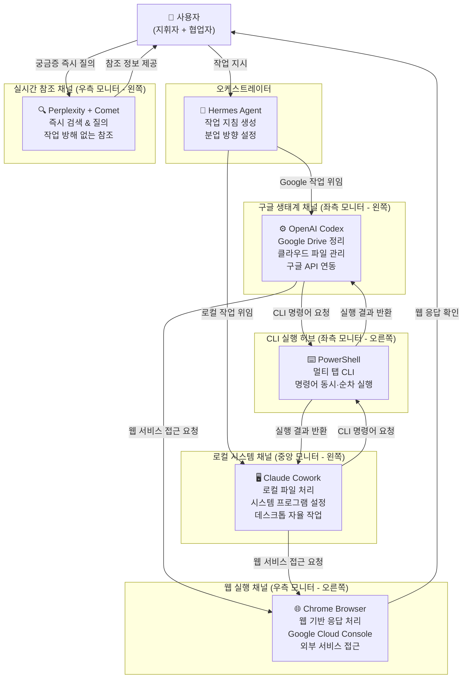
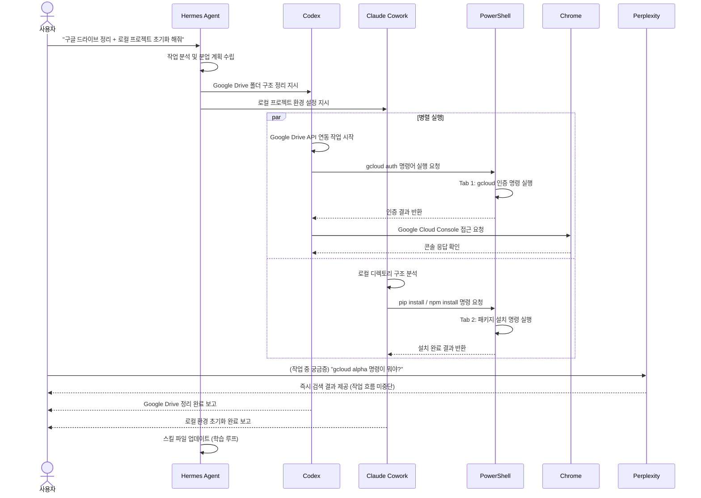
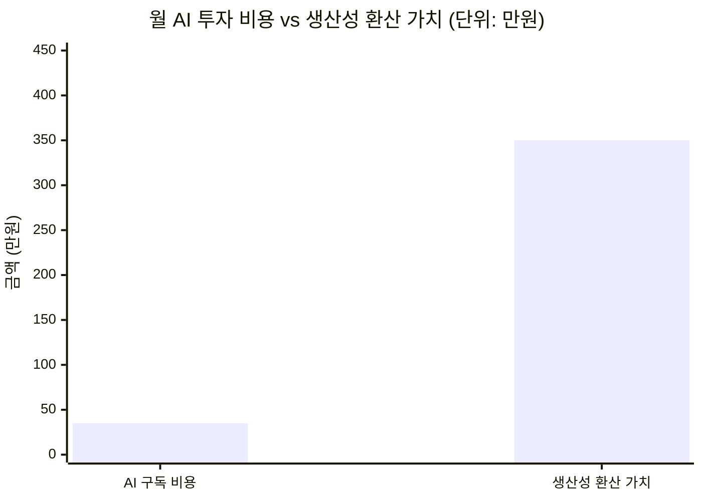

> **#AI_114 No.56 _260606** — 멀티 모니터 효과와 AI 상시 협력 분업체계에 관한 심층 분석  
> 작성 기준일: 2026-06-07

## 관련글

[**AI_114 No.56 _260606. 멀티 모니터 효과**](https://www.facebook.com/share/1LTD79Mcvj/)

---

## 목차

1. [들어가며: 한 장의 사진이 말해주는 것](#1-들어가며-한-장의-사진이-말해주는-것)
2. [물리적 환경 구성: 3모니터 6창의 작전 지도](#2-물리적-환경-구성-3모니터-6창의-작전-지도)
3. [각 도구의 특성과 역할](#3-각-도구의-특성과-역할)
   - 3.1 [OpenAI Codex: 구글 생태계 친화형 코딩 에이전트](#31-openai-codex-구글-생태계-친화형-코딩-에이전트)
   - 3.2 [PowerShell: 멀티 탭 CLI 허브](#32-powershell-멀티-탭-cli-허브)
   - 3.3 [Claude Cowork: 로컬 시스템 친화형 파일 에이전트](#33-claude-cowork-로컬-시스템-친화형-파일-에이전트)
   - 3.4 [Hermes Agent: 자기학습형 오케스트레이터](#34-hermes-agent-자기학습형-오케스트레이터)
   - 3.5 [Perplexity + Comet 브라우저: 실시간 참조 채널](#35-perplexity--comet-브라우저-실시간-참조-채널)
   - 3.6 [Chrome 브라우저: 웹 기반 작업 실행 창구](#36-chrome-브라우저-웹-기반-작업-실행-창구)
4. [오케스트레이션 아키텍처: 헤르메스 중심 분업 체계](#4-오케스트레이션-아키텍처-헤르메스-중심-분업-체계)
5. [실제 워크플로우의 동작 방식](#5-실제-워크플로우의-동작-방식)
6. [생산성 증대와 ROI 분석](#6-생산성-증대와-roi-분석)
7. [이 워크플로우가 갖는 현재적 의미](#7-이-워크플로우가-갖는-현재적-의미)
8. [마치며: AI 학습을 늦출 수 없는 이유](#8-마치며-ai-학습을-늦출-수-없는-이유)

---


## 1. 들어가며: 한 장의 사진이 말해주는 것

세 개의 모니터가 나란히 늘어선 책상 위에는 여섯 개의 창이 동시에 펼쳐져 있다. 그 안에서는 OpenAI의 Codex, Anthropic의 Claude Cowork, Nous Research의 Hermes Agent, 그리고 Perplexity의 Comet 브라우저가 각자의 역할을 수행하고 있다. 인간 사용자 한 명이 이 모든 AI 에이전트들의 지휘자이자 협업자로 자리를 잡고, 책상 위에는 손으로 꼼꼼히 써 내려간 작업 노트까지 펼쳐져 있다.

이 장면은 단순히 "AI 도구를 여러 개 쓴다"는 이야기가 아니다. 2026년 현재 시점에서 가장 진보된 방식으로 AI 에이전트들을 협력 분업 체계로 묶어 운용하는, 하나의 정교한 인간-AI 협업 모델을 보여주는 사례다.

작성자 본인의 표현을 빌리자면, "똘똘한 동료 사원을 넘어 일잘러 전문 멘토 코치 2~3명을 바로 옆자리에 모셔다 앉혀놓고 저를 포함해서 거의 4명의 일을 동시에 처리"하는 상태다. 이것이 과장이 아님을 뒷받침하는 근거들을, 각 도구의 실제 특성과 함께 하나씩 살펴보도록 한다.

---

## 2. 물리적 환경 구성: 3모니터 6창의 작전 지도

책상에는 LG 모니터 세 대가 가로로 나란히 배치되어 있다. 각 모니터는 두 개의 창을 나눠 표시하고 있어, 총 여섯 개의 작업 채널이 동시에 시각화된 상태다. 책상 앞에는 로지텍 무선 키보드 한 대와 마우스가 놓여 있고, 그 사이에는 손으로 작성한 나선형 노트가 펼쳐져 있다. 작은 다육식물 하나가 모니터 뒤편에 자리를 지키고 있으며, 오른편에는 참고용 책들이 쌓여 있다.

이 배치를 조금 더 구체적으로 표현하면 아래와 같다.

```
┌──────────────────┬──────────────────┬────────────────────┐
│  [좌측 모니터]   │  [중앙 모니터]   │   [우측 모니터]    │
│                  │                  │                    │
│  Codex │PowerSh  │  Cowork│ Hermes  │  Perplexity│Chrome │
│  (좌)  │  (우)   │  (좌)  │  (우)   │   Comet    │  (우) │
│        │         │        │         │    (좌)    │       │
└──────────────────┴──────────────────┴────────────────────┘
```

왼쪽 모니터의 왼편에는 OpenAI Codex의 대화 인터페이스가 열려 있고, 오른편에는 PowerShell 터미널이 초록색 텍스트를 출력하며 CLI 명령어를 실행 중이다. 가운데 모니터의 왼편에는 Claude Cowork의 어두운 테마 인터페이스가 자리하고, 오른편에는 Hermes Agent의 채팅창이 파란 색조로 응답을 이어가고 있다. 오른쪽 모니터의 왼편에는 Comet 브라우저를 통한 Perplexity 검색 결과가 표시되고 있으며, 오른편 크롬 브라우저에는 Google Cloud SDK 관련 문서 페이지가 열려 있다.

이 배치는 결코 우연이 아니다. 각 창의 위치는 작업 흐름에 따라 정교하게 설계된 것이며, 그 논리를 이해하는 것이 이 워크플로우를 제대로 파악하는 첫걸음이다.

---

## 3. 각 도구의 특성과 역할

### 3.1 OpenAI Codex: 구글 생태계 친화형 코딩 에이전트

OpenAI Codex는 2025년 4월에 클라우드 기반 소프트웨어 엔지니어링 에이전트로 처음 출시되었다. 당시에는 ChatGPT Pro, Business, Enterprise 가입자에게만 제공되었으나, 이후 점차 접근 범위를 넓혀왔다.

출시 초기 Codex는 `codex-1`이라는 모델에 의해 구동되었는데, 이는 OpenAI의 o3 추론 모델을 소프트웨어 엔지니어링 작업에 최적화한 버전이었다. 이후 GPT-5 Codex, GPT-5.2-Codex(2025년 12월), GPT-5.3-Codex(2026년 2월)로 연속적인 업그레이드가 이루어졌으며, 각 버전은 이전보다 훨씬 넓은 범위의 소프트웨어 수명 주기 작업을 처리할 수 있게 되었다.

2026년 2월에는 공식 데스크톱 앱(macOS, Windows)이 출시되어, 여러 에이전트를 동시에 관리하고 병렬로 작업을 실행하며 장기 실행 태스크와 협업할 수 있는 인터페이스를 제공한다. 또한 같은 레포지토리에서 여러 에이전트가 충돌 없이 작업할 수 있도록 하는 워크트리(worktree) 내장 지원도 추가되었다.

이 워크플로우에서 Codex가 "구글 친화력이 좋다"고 묘사된 데에는 이유가 있다. Codex는 구글 드라이브와 같은 구글 생태계 서비스와의 연동이 자연스럽고, 클라우드 기반 저장소 작업 및 Google Workspace API와의 상호작용에 강점을 보인다. 따라서 이 사용자는 구글 드라이브 정리와 같은 클라우드 파일 관리 작업을 Codex에게 위임한다.

2026년 현재 Codex의 주간 활성 사용자 수는 이미 200만 명을 넘어섰으며, OpenAI는 이를 소프트웨어 개발을 넘어 더 넓은 엔터프라이즈 에이전트 플랫폼으로 포지셔닝하고 있다.

### 3.2 PowerShell: 멀티 탭 CLI 허브

PowerShell은 이 워크플로우에서 AI 에이전트가 아니라, AI 에이전트들이 내뿜는 CLI 명령어 요청들을 실제로 실행하는 통제 기반 역할을 맡는다. Codex와 Claude Cowork 양쪽에서 중간중간 CLI 명령어 실행을 요청해 올 때, 사용자는 이것을 PowerShell의 멀티 탭으로 넘겨받아 동시 혹은 순차적으로 처리한다.

PowerShell의 탭 기능을 활용하면 여러 명령어 실행 컨텍스트를 병렬로 유지할 수 있다. 예를 들어, Codex가 구글 드라이브 API 인증 명령을 요청하는 동안, 동시에 Claude Cowork가 로컬 파일 시스템에 대한 Python 스크립트 실행을 요청할 수 있다. 이 두 가지를 PowerShell의 서로 다른 탭에서 거의 동시에 처리함으로써 인간의 개입 최소화와 병렬 실행 효율을 함께 달성할 수 있다.

이것은 언뜻 단순해 보이지만, 멀티 에이전트 워크플로우에서 실제로 인간이 병목이 되는 지점이 바로 이 "명령어 실행 중계" 단계이기 때문에 중요하다. PowerShell의 멀티 탭 활용은 이 병목을 최소화하는 핵심 장치다.

### 3.3 Claude Cowork: 로컬 시스템 친화형 파일 에이전트

Claude Cowork는 Anthropic이 2026년 1월 12일에 발표한 데스크톱 기반 AI 에이전트 기능이다. 개발자용으로 설계된 Claude Code의 아키텍처를 비개술자도 사용할 수 있는 형태로 일반 지식 업무에 확장한 것이 특징이다. 흥미롭게도 Anthropic 내부에서 이 기능 자체를 Claude Code를 이용해 약 1주일 반 만에 개발했다고 전해진다.

Cowork는 Claude 데스크톱 앱(macOS 및 2026년 2월 10일 추가된 Windows 버전)에 내장되어 있으며, 사용자가 지정한 폴더에 대해 읽기, 쓰기, 생성 권한을 부여받고 멀티스텝 워크플로우를 자율적으로 실행한다. 터미널이나 명령줄 인터페이스가 없어도 되며, 대화형 인터페이스만으로 AI가 로컬 파일을 직접 조작할 수 있다.

2026년 3월 23일에는 Anthropic이 Claude Computer Use Agent를 연구 미리보기로 출시하면서, Claude가 사용자의 데스크톱을 직접 보고 탐색하고 제어할 수 있는 능력까지 추가되었다. 버튼을 클릭하고, 앱을 열고, 스프레드시트를 채우고, 인간 개입 없이 멀티스텝 워크플로우를 완료하는 것이 가능해진 것이다. 이 기능은 Claude Pro 및 Max 구독자에게 Claude Cowork와 Claude Code를 통해 제공된다.

이 워크플로우에서 Cowork가 "로컬 PC 친화력이 좋다"고 묘사된 이유는 명확하다. Cowork는 로컬 파일 시스템에 대한 직접 접근과 조작을 핵심 강점으로 한다. 로컬 시스템의 프로그램 설정이나 파일 처리 작업을 Cowork에게 맡기는 것은 가장 자연스러운 분업이다.

### 3.4 Hermes Agent: 자기학습형 오케스트레이터

이 워크플로우에서 가장 흥미로운 위치를 차지하는 것이 Hermes Agent다. 작성자는 "헤르메스의 작업 지침을 시발점으로 삼고 클로드와 코덱스가 동시 협업으로 일을 처리하게 한다"고 설명한다. 즉, Hermes가 전체 작업의 방향을 잡고 두 에이전트에게 역할을 분배하는 오케스트레이터 기능을 하는 셈이다.

Hermes Agent는 Nous Research가 2026년 2월 25일에 출시한 오픈소스 자율 AI 에이전트다. 출시 이후 약 4개월 만에 GitHub 스타 수 18만 개를 돌파하며 2026년에 가장 빠르게 성장한 오픈소스 에이전트 프레임워크가 되었다. 2026년 6월 2일에는 공식 데스크톱 앱(macOS, Windows, Linux)을 v0.15.2 공개 미리보기로 출시하기도 했다.

Hermes의 가장 독특한 특징은 "닫힌 학습 루프(closed learning loop)"다. 매번 작업 실행 후 Hermes는 자체 평가 레이어를 거쳐 작업의 성공 여부를 평가하고, 재사용 가능한 추론 패턴을 추출하여 스킬 파일(평범한 마크다운 형식)로 저장한다. 다음에 유사한 작업을 만났을 때 처음부터 추론을 반복하는 대신 저장된 스킬을 불러와 적용한다. Nous Research에 따르면 20개 이상의 자체 생성 스킬을 보유한 에이전트는 새로운 인스턴스 대비 유사 작업을 40% 빠르게 완료한다고 한다. 이 수치는 토큰 소비량과 실행 시간 기준이며, 2026년 4월 TokenMix의 독립 벤치마크에서도 이 수치가 확인되었다.

또한 Hermes는 4계층 메모리 구조를 갖추고 있으며, 6개의 메시징 플랫폼(텔레그램 포함)과 연동 가능하다. 출시 당시 118개의 번들 스킬이 포함되었으며, 지속적으로 확장되고 있다. SOUL.md라는 시스템 페르소나 설정 파일을 통해 에이전트의 성격과 작동 원칙을 정의할 수 있어, 다른 에이전트 프레임워크와 차별화된 유연성을 제공한다.

Stanford HAI의 2026 AI 인덱스 보고서에 따르면, 2025년 한 해 동안 AI 에이전트는 질문 답변에서 작업 완료로 진화했지만 구조화된 벤치마크에서 여전히 세 번 중 한 번은 실패한다. 그러나 OSWorld 기준으로 에이전트 정확도는 약 12%에서 66.3%로 크게 향상되어 인간 성능과의 격차가 6%포인트 이내로 좁혀졌다. 이런 환경에서 Hermes처럼 메모리, 워크플로우 복구, 도구 오케스트레이션, 반복성을 갖춘 프레임워크의 가치는 더욱 두드러진다.

### 3.5 Perplexity + Comet 브라우저: 실시간 참조 채널

Perplexity의 Comet 브라우저는 2025년 7월 9일 Windows와 macOS용으로 처음 출시되었고, 이후 2025년 11월 안드로이드, 2026년 3월 18일 iOS까지 확대되어 크로스플랫폼 출시가 완료되었다. 초기에는 Perplexity Max 구독자에게만 제공되는 프리미엄 기능이었지만, 현재는 무료로 다운로드할 수 있다.

Comet은 단순한 웹 브라우저가 아니다. Chromium 기반으로 만들어졌지만, AI 기반 검색과 에이전트 기능이 브라우징 경험 전체에 녹아들어 있다. Comet 어시스턴트를 통해 페이지 요약, 추가 질문, 폼 작성, 이메일 전송, 상품 구매 비교 등의 작업을 자율적으로 수행할 수 있다. 사용자가 지시를 내리면 브라우저가 여러 웹사이트를 직접 방문하여 정보를 종합해 준다.

이 워크플로우에서 Comet의 역할은 명확하다. Codex나 Claude Cowork의 작업을 방해하지 않고, 작업 도중 모르는 용어나 궁금증이 생겼을 때 즉시 Comet에게 물어보는 실시간 참조 채널로 활용한다. 두 AI 에이전트가 바쁘게 작업하는 동안 별도의 창에서 독립적으로 작동하는 Perplexity는 주 작업 흐름에 끼어들지 않는 독립적인 참조 레이어가 된다.

Perplexity는 2026년 2월부터 광고를 답변에서 제거하고 구독 중심 모델로 전환하면서, 답변의 정확성에 더욱 집중하는 방향으로 나아가고 있다. Max 구독자는 브라우저 에이전트를 구동하는 모델을 직접 선택할 수 있으며, 현재 기본값은 Claude Opus 4.6이고 Sonnet 4.5를 대안으로 선택할 수 있다.

### 3.6 Chrome 브라우저: 웹 기반 작업 실행 창구

맨 오른쪽 크롬 브라우저는 이 워크플로우에서 "웹 기반 응답 요청"을 처리하는 직접 실행 창구 역할을 한다. Codex나 Claude Cowork가 특정 웹페이지를 참조해야 하거나, 구글 드라이브나 구글 클라우드 콘솔 같은 웹 서비스에 직접 접근해야 할 때 이 브라우저가 그 인터페이스 역할을 맡는다.

현재 열려 있는 페이지에서 Google Cloud SDK 관련 문서가 표시되고 있는 것도, 구글 드라이브 정리 작업을 진행하는 Codex가 필요로 하는 API 문서나 인증 정보를 이 브라우저를 통해 확인하고 있기 때문으로 해석된다. "이제 gcloud CLI로 인증되었습니다"라는 텍스트가 화면에 보이는 것은 구글 클라우드 인증 과정이 막 완료된 시점임을 보여준다.

---

## 4. 오케스트레이션 아키텍처: 헤르메스 중심 분업 체계

아래 다이어그램은 이 워크플로우의 전체 오케스트레이션 구조를 시각화한 것이다.



이 구조에서 핵심은 헤르메스가 전체 작업의 시발점이자 방향 결정자 역할을 한다는 점이다. 사용자가 처리해야 할 복합 작업을 Hermes에게 제시하면, Hermes는 이를 분석하여 "구글 드라이브 정리"처럼 클라우드 환경에 친화적인 부분은 Codex에게, "로컬 파일 처리"처럼 로컬 시스템에 친화적인 부분은 Claude Cowork에게 각각 위임한다.

두 에이전트가 작업을 진행하는 동안 공통 인프라인 PowerShell이 CLI 명령어 요청들을 중계하고, Chrome이 웹 인터페이스 접근을 담당한다. 그리고 이 모든 과정에서 사용자에게 궁금증이 생기면 Perplexity/Comet으로 별도 질문을 처리함으로써 주 작업 흐름이 중단되지 않도록 설계되어 있다.

---

## 5. 실제 워크플로우의 동작 방식

이 워크플로우가 실제로 어떻게 작동하는지를 구체적인 시나리오로 이해해 보자.



이 시퀀스에서 볼 수 있듯이, 핵심 흐름은 병렬성에 있다. Codex와 Claude Cowork가 동시에 서로 다른 영역의 작업을 진행하는 동안, PowerShell은 두 에이전트로부터 오는 CLI 요청을 각각 다른 탭에서 처리한다. 사용자는 이 모든 과정에서 중간중간 필요한 확인이나 승인을 제공하는 역할을 하되, 각 에이전트가 자율적으로 진행하는 부분에서는 개입할 필요가 없다.

특히 주목할 점은 Hermes Agent의 사후 처리다. 작업이 완료된 후 Hermes는 이번 작업에서 학습된 패턴을 스킬 파일로 저장한다. 다음에 비슷한 "구글 드라이브 정리 + 로컬 환경 초기화" 작업이 들어오면, Hermes는 이전에 저장한 스킬을 활용하여 더 빠르고 효율적으로 분업 계획을 수립할 수 있다.

---

## 6. 생산성 증대와 ROI 분석

작성자는 이 워크플로우를 통해 "같은 시간 동안 감당해낼 수 있는 일은 거의 4~5배 수준"이라고 밝히며, 구체적인 비용 대비 효과를 다음과 같이 제시한다.

- **월 AI 사용 비용**: 30~40만원 (Codex, Claude Max, Hermes, Perplexity Max 등 합산)
- **생산성 향상 효과**: 외주 처리 비용 절감 + 수입 증대 = 월 300~400만원 수준
- **투입 대비 수익률**: 약 900%

이것이 실제로 가능한 수치인지, 외부 데이터로도 확인해 보자.

McKinsey 2026 글로벌 AI 설문조사와 Slack 노동 지수에 따르면, AI 에이전트를 실제 업무에 적용하는 지식 노동자는 주당 중앙값 6.4시간을 절약하고 있으며, 숙련된 실무자는 10~12시간까지 절약한다. 복수의 AI 에이전트를 동시에 운용하는 이 워크플로우에서 4~5배 생산성이라는 수치가 과장만은 아님을 짐작할 수 있다.

PwC의 2025 AI 에이전트 설문조사에서는 AI 에이전트를 도입한 조직의 66%가 생산성 향상을 보고했으며, 일부 기업에서는 개발 사이클 타임을 최대 60%까지 단축하고 오류율도 절반 수준으로 낮췄다. Bain Agentic AI Benchmark 2026에 따르면 중앙값 기준으로 AI 에이전트 투자 회수 기간은 고객 서비스 분야 4.1개월, 마케팅 운영 6.7개월, 엔지니어링 9.3개월이다.



이 수치를 ROI 공식으로 표현하면 다음과 같다.

```
ROI = (순이익 / 투자비용) × 100
    = ((350 - 35) / 35) × 100
    = (315 / 35) × 100
    = 900%
```

물론 이 수치는 개인의 작업 특성, 활용 능력, AI 도구에 대한 숙련도에 따라 크게 달라진다. 그러나 Gartner는 2027년까지 지식 노동자의 절반이 에이전트를 직접 구축하고 관리하게 될 것이라 전망하고 있으며, 기업 앱의 40%에 작업별 AI 에이전트가 내장될 것이라고 예측한다. 이 워크플로우가 보여주는 개인 단위의 다중 에이전트 협업 체계는 이러한 흐름의 최전선에 있는 사례다.

---

## 7. 이 워크플로우가 갖는 현재적 의미

### 7.1 "하네스가 모델보다 중요하다"는 원칙의 구현

AI 에이전트 생태계를 깊이 연구한 사람들 사이에서 반복적으로 등장하는 핵심 명제가 있다. 에이전트 하네스(agent harness), 즉 AI 모델을 감싸고 조율하는 오케스트레이션 레이어가 모델 자체보다 더 중요하다는 것이다.

Stanford HAI의 2026 AI 인덱스에 따르면, 2026년 3월 현재 상위 4개 AI 회사의 아레나 평점이 25 Elo 포인트 이내로 수렴했다. Anthropic이 1,503, xAI가 1,495, Google이 1,494, OpenAI가 1,481로 사실상 같은 수준이다. 모델 간 성능 격차가 사라지면서, 이제 차별점은 메모리, 워크플로우 복구, 도구 오케스트레이션, 반복성이라는 상위 레이어로 이동했다.

이 워크플로우는 바로 이 원칙을 실천한다. 사용자는 특정 모델 하나에 의존하는 것이 아니라, 각 도구의 특성을 파악하고 그에 맞는 작업을 배분함으로써 모델 간 비교 우위를 최대화한다. Codex의 구글 생태계 친화성, Claude Cowork의 로컬 시스템 강점, Hermes Agent의 자기학습 오케스트레이션 능력이 서로를 보완하며 전체 시스템의 성능을 각 부분의 합보다 크게 만든다.

### 7.2 분업과 병렬성의 아키텍처적 사고

이 워크플로우에서 또 하나 주목할 점은 작업을 분업하는 방식의 아키텍처적 정교함이다. 단순히 "AI 도구를 여러 개 쓴다"는 수준이 아니라, 각 도구의 친화 영역(affinity domain)을 명확히 정의하고 그에 따른 역할 분리를 실현하고 있다.

- **클라우드 친화 vs. 로컬 친화**: Codex는 구글 드라이브 등 클라우드 서비스, Claude Cowork는 로컬 시스템
- **오케스트레이션 레이어 vs. 실행 레이어**: Hermes는 지휘, Codex/Cowork는 실행
- **실행 레이어 vs. 참조 레이어**: PowerShell/Chrome은 실행, Perplexity는 참조
- **비중단 참조**: 주 작업 중 Perplexity에 질문하되, 주 에이전트 작업 흐름을 방해하지 않음

이 분리 원칙은 소프트웨어 아키텍처에서 말하는 "관심사의 분리(separation of concerns)"를 인간-AI 협업 워크플로우에 적용한 것과 같다.

### 7.3 인간의 역할 재정의

이 워크플로우에서 인간의 역할은 실행자(executor)에서 조율자(orchestrator)로 전환된다. 사용자는 각 에이전트의 특성을 이해하고, 적절한 작업을 적절한 도구에 배분하며, 중간 결과물을 확인하고 다음 방향을 결정하는 전략적 판단자의 역할을 맡는다. 반복적이고 기계적인 실행 업무는 에이전트들이 담당하고, 인간은 판단과 조율에 집중한다.

McKinsey가 예측한 "지식 노동자가 에이전트를 직접 구축하고 관리하는 시대"가 이미 이 책상 위에서 실현되고 있다고 볼 수 있다.

---

## 8. 마치며: AI 학습을 늦출 수 없는 이유

작성자는 글의 마지막에서 강하게 주장한다. "AI 공부를 늦추거나 게을리하는 것은 한 마디로 인생 허비, 시간 낭비입니다."

이 주장의 근거는 단순한 감상이 아니다. 월 30~40만원의 AI 구독 비용으로 300~400만원에 해당하는 생산성을 창출한다는 것은, 900%의 ROI를 의미한다. 이 비율은 대부분의 금융 투자가 달성하기 어려운 수준이다.

그러나 이 높은 ROI는 도구를 단순히 구매한다고 자동으로 달성되지 않는다. 각 도구의 특성을 깊이 이해하고, 그것들이 어떻게 서로를 보완하는지 파악하며, 실제 워크플로우에 녹여내는 설계 능력이 필요하다. 이것이 바로 "AI 공부"가 의미하는 바다.

2026년 현재, Gartner의 AI 성숙도 로드맵에 따르면 우리는 "작업별 에이전트(task-specific agents)"가 주류가 되는 단계에 있으며, 2027년에는 "협력 에이전트(collaborative agents)", 2028년에는 "크로스앱 생태계(cross-app ecosystems)"로 나아가게 된다. 지금 이 워크플로우는 그 성숙도 곡선의 선두에 위치해 있다.

책상 위에 펼쳐진 세 개의 모니터와 여섯 개의 창, 그리고 손으로 써 내려간 작업 노트는 단순한 업무 환경이 아니다. 그것은 AI와 인간이 어떻게 가장 생산적으로 협력할 수 있는지를 몸으로 탐구하고, 그 결과를 매일 업무에 적용하는 실험실이자 작전 지도다.

---

## 참고: 주요 도구 현황 요약 (2026년 6월 기준)

| 도구 | 개발사 | 출시 / 최신 버전 | 역할 | 특징 |
|------|--------|-----------------|------|------|
| OpenAI Codex | OpenAI | 2025.04 / GPT-5.3-Codex | 코딩 에이전트, 구글 생태계 | 주간 200만+ 활성 사용자 |
| Claude Cowork | Anthropic | 2026.01.12 / macOS+Windows | 로컬 파일 에이전트 | Computer Use 지원 (2026.03) |
| Hermes Agent | Nous Research | 2026.02.25 / v0.15.2 | 자기학습형 오케스트레이터 | 18만 GitHub Stars, 데스크톱앱 출시 |
| Perplexity + Comet | Perplexity AI | Comet: 2025.07 (무료화: 2025.10) | 실시간 웹 검색 + 에이전트 브라우저 | iOS 2026.03 출시, 크로스플랫폼 완성 |
| PowerShell | Microsoft | - | CLI 명령어 실행 허브 | 멀티 탭 병렬 처리 |
| Chrome | Google | - | 웹 기반 작업 실행 | 클라우드 콘솔 접근 |

---

*작성 일자: 2026-06-07*
