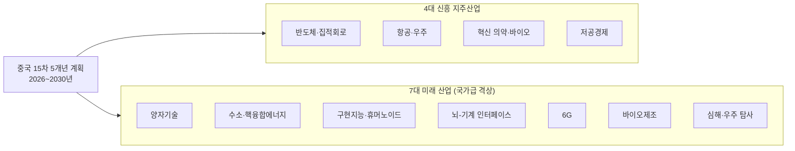
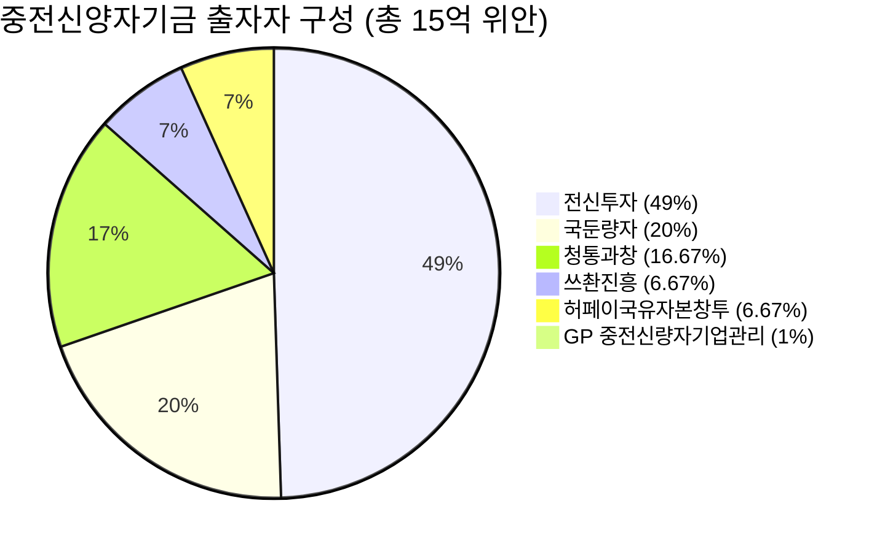
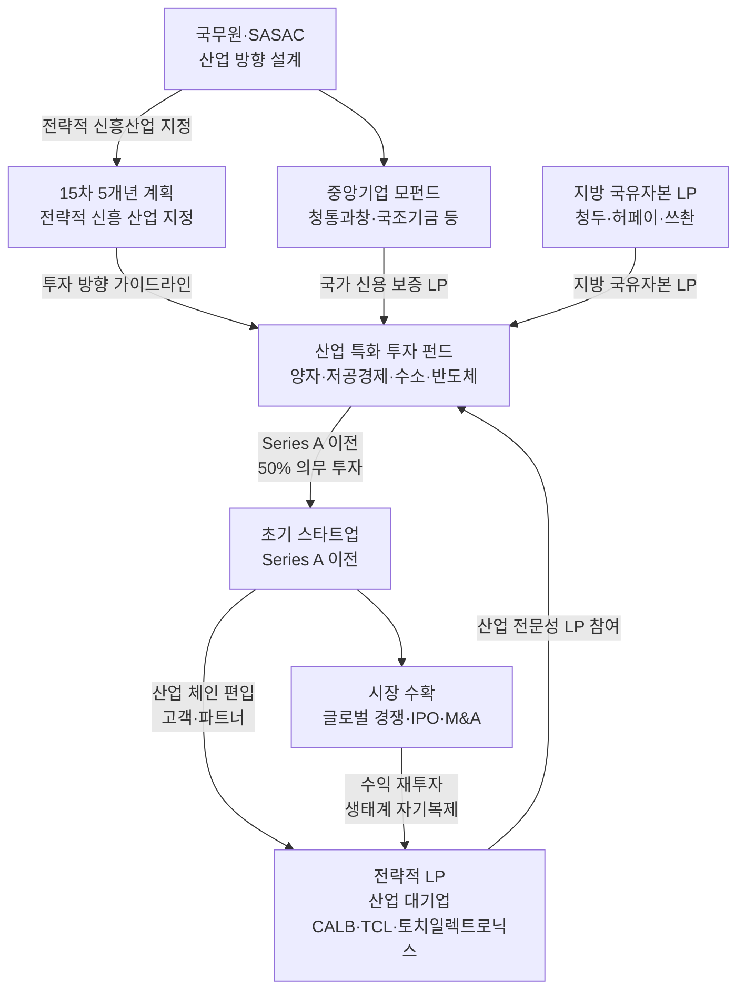

**— 2026년 6월 첫 주 중국 사모펀드 생태계 심층 분석 —**

> **참고 자료**: 차이나벤처닷컴(chinaventure.com.cn), 투자계(pedaily.cn), 중국전신 공식 공시(2026.06.02), 신화통신, 세계에너지시장인사이트(2026.04.20), 조선이코노미(2026.03.23), 한국에너지경제연구원 등

## 관련글

[**국가가 밭을 설계하고, 산업 자본이 씨앗을 고르고, 시장이 수확한다**](https://www.facebook.com/share/18ciyN4v5v/)

---

## 목차

1. [들어가며: 베일 뒤에 숨은 설계도](#1-들어가며)
2. [거시 배경: 중국 15차 5개년 계획의 미래 산업 청사진](#2-거시-배경)
3. [2026년 6월 첫 주, 일주일간의 자본 지도](#3-일주일간의-자본-지도)
4. [핵심 해부: 중전신양자산업창업투자기금](#4-핵심-해부-중전신양자산업창업투자기금)
5. [청통과창(诚通科创)의 LP 진입: 국가 신용의 산업 이식](#5-청통과창의-lp-진입)
6. [정부 투자 규제의 진화: "얼마를"에서 "어디에, 어떻게"로](#6-정부-투자-규제의-진화)
7. [전략적 LP의 부상: 돈 번 대기업이 농부가 된다](#7-전략적-lp의-부상)
8. [저공경제와 상업항공우주: 또 하나의 국가 설계](#8-저공경제와-상업항공우주)
9. [한국에 대한 시사점: 씨앗을 고르는 손의 문제](#9-한국에-대한-시사점)
10. [마치며: 씨앗을 고르는 손](#10-마치며)

---

## 1. 들어가며

중국 자본시장에 대한 통념은 오랫동안 간단했다. "규모는 크지만 무질서하다. 국유 자본이 정치 논리로 배분되고, 시장 효율은 낮다." 중국 벤처캐피털 시장을 외부에서 바라보는 많은 관찰자들이 공유해온 인식이다.

그런데 2026년 6월 첫 주, 단 일주일 사이에 중국 내 신규 등록된 사모펀드 20여 개를 들여다보면 이 통념이 얼마나 표면적인 것인지를 실감하게 된다. 1,000만 위안짜리 소규모 펀드부터 39.4억 위안짜리 대형 펀드까지, 양자컴퓨팅에서 수소에너지, 저공경제(Low-altitude Economy), 집적회로, 도시재생까지 섹터도 천차만별이다. 겉으로는 여전히 무질서해 보인다. 그러나 이 펀드들의 구조를 깊숙이 들여다보면 놀라운 설계도가 모습을 드러낸다.

각 펀드의 출자자 구성, 투자 의무 조항, 지방 정부와 중앙 자본의 결합 방식. 이것들을 조율하는 전문가들의 수준이 놀랍도록 정밀하다. 중국의 벤처캐피털 투자는 국가가 설계한 밭에 자본이 씨앗을 고르는 과정이다. 그리고 그 구조는 매주 한 겹씩 더 정교해지고 있다.

---

## 2. 거시 배경: 중국 15차 5개년 계획의 미래 산업 청사진

2026년은 중국 경제의 중요한 전환점이다. 14차 5개년 계획(2021~2025년)을 마무리하고 제15차 5개년 계획(2026~2030년)이 출발하는 해다. 2026년 3월 전국인민대표대회에서 심의·확정된 15차 5개년 계획은 단순한 경제 성장 목표를 넘어, 중국이 향후 5년 안에 무엇을 어떻게 육성할 것인지를 명확히 명시했다.

핵심 키워드는 '신질생산력(新質生産力)'이다. 과거 중국 성장이 대규모 인프라 투자나 부동산 자산 팽창에 의존했다면, 이제는 질적 성장으로 전략의 방향을 바꿨다는 선언이다. 이를 실현하는 수단으로 자본시장과 첨단 기술 산업 육성을 명시했다.

15차 5개년 계획이 규정한 **4대 신흥 지주산업**은 다음과 같다. 반도체·집적회로, 항공·우주, 혁신 의약·바이오, 그리고 저공경제가 그것이다. 국가 정책 언어에서 "신흥 지주산업"이라는 명칭은 단순한 육성 대상이 아니라 국가 경제 체계의 기둥이 되어야 한다는 의미를 담는다.

더불어 **7대 미래 산업**으로 국가급 격상된 영역도 명시됐다. 양자기술, 수소·핵융합에너지, 구현 지능(인간형 로봇·체화지능), 뇌-기계 인터페이스(BCI), 6G 이동통신, 바이오제조, 심해·우주 탐사 등이 여기에 해당한다. 이는 단순한 R&D 목록이 아니다. 국무원과 국가자산위원회(SASAC)가 중앙기업과 국유자본에게 "여기에 투자하라"는 정책 신호를 공식화한 것이다.

국무원 국유자산감독관리위원회(SASAC)도 이에 발맞춰 2026년 초 중앙기업들을 대상으로 "신에너지, 신에너지차, 신소재, 항공우주, 저공경제, 양자과학, 6G 등 영역에 집중 포진하고, 구현지능·바이오제조·해양에너지·친환경 선박 등 새로운 트랙을 선점하라"는 방향을 제시했다. 이 방향이 곧 2026년 6월 첫 주에 쏟아진 신규 사모펀드들의 투자 섹터 목록과 정확히 일치한다.

---

## 3. 일주일간의 자본 지도

2026년 6월 첫 주, 중국에서 신규 등록된 20여 개의 사모펀드들이 투자 방향으로 명시한 섹터들을 자본 규모별로 나열하면 다음과 같다.

- **집적회로·반도체**: 39.4억 위안(약 8,786억 원)
- **리튬전지 산업 체인**: 16억 위안(약 3,568억 원)
- **양자컴퓨팅**: 15억 위안(약 3,345억 원)
- **신에너지**: 12.25억 위안(약 2,732억 원)
- **저공경제·상업항공우주**: 10억 위안(약 2,230억 원) 및 다수 추가 펀드
- **수소에너지**: 5억 위안(약 1,115억 원)

여기서 주목해야 할 것은 반도체와 AI 투자의 지속성이 아니다. 이미 전세계가 알고 있는 사실이다. 진짜 주목할 대목은 그 다음 층위다. 양자컴퓨팅, 수소에너지, 저공경제, 상업항공우주가 반복적으로 등장한다는 점이다.

청두(成都) 미래산업 펀드 하나만 보더라도 인공지능, 저공경제, 바이오의약, 상업항공우주 네 축이 동시에 명시돼 있다. 안후이 AIC 기금도 항공우주와 저공경제를 핵심 전략 신흥 산업 투자 축으로 명기했다. 이것은 개별 투자기관의 독자적 판단이 아니다. 국무원이 지정한 전략적 신흥 산업 목록이 민간 및 국유 자본 흐름에 그대로 반영되는 구조다.

---

## 4. 핵심 해부: 중전신양자산업창업투자기금

이번 주 등록된 펀드 가운데 가장 정밀한 해부가 필요한 것은 **중전신양자산업창업투자기금(中电信量子产业创业投资基金，有限合伙)** 이다. 2026년 6월 2일 저녁, 중국전신(中国电信)이 공식 공시를 통해 발표했다.

### 4.1 출자자 구조: 누가 어떤 비율로 참여했는가

이 펀드의 총 약정출자액은 **15억 위안(약 3,345억 원)** 이다. 현재 중국 내 등록된 양자 특화 펀드 가운데 연내 최대 규모다. 출자자 구성은 다음과 같다.

| 출자자 | 성격 | 출자액 | 비율 |
|---|---|---|---|
| 중국전신집단투자유한공사(电信投资) | 국유 통신 대기업 자회사 | 7.35억 위안 | 49% |
| 국둔량자(国盾量子) | 중국전신 산하 양자기술 상장사 | 3억 위안 | 20% |
| 청통과창투자기금(诚通科创) | 국무원 SASAC 산하 모펀드 | 2.5억 위안 | 16.67% |
| 쓰촨진흥투자유한공사(四川振兴投资) | 쓰촨성 지방 국유자본 | 1억 위안 | 6.67% |
| 허페이국유자본창업투자(合肥国有资本创投) | 허페이시 지방 국유자본 | 1억 위안 | 6.67% |
| GP: 중전신량자기업관리합과기업 | 중국전신 자회사 (집행 파트너) | 0.15억 위안 | 1% |

이 구성을 보면 흥미로운 패턴이 보인다. 최대 출자자는 중국전신의 자회사인 전신투자(49%)이고, 발기인인 국둔량자가 20%를 부담한다. 그 뒤에 청통과창(诚通科创)이 16.67%로 세 번째다. 쓰촨진흥과 허페이국유자본이 각각 6.67%로 지방 국유자본을 대표한다. 기금 존속기간은 10년이며, 그 중 투자기간은 6년이다.

국둔량자는 이 참여의 의미를 공시에서 이렇게 설명했다. "전 세계 양자기술이 가속 돌파, 응용 안착, 경쟁 격화의 단계에 진입했으며 산업 규모화 발전의 핵심 기회 창문에 있다. 기금을 통한 간접 투자는 포트폴리오 투자로 적절한 리스크 분산을 가능케 하고, 상장사 외부에서 우수한 과학기술 창업 프로젝트를 배양·비축하는 효과가 있다."

### 4.2 두 가지 핵심 의무 조항의 의미

이 펀드에 명시된 두 가지 의무 조항이 중국 국가 주도 투자 설계의 핵심을 드러낸다.

**첫 번째 의무 조항**: 투자 건수 기준으로 시리즈 A 이전(포함) 단계 프로젝트에 대한 투자 비율이 전체의 **50% 이상**이어야 하고, 투자 규모 기준으로는 기금 총 규모의 **30% 이상**을 시리즈 A 이전에 집행해야 한다.

**두 번째 의무 조항**: 중앙기업(央企) 내부 프로젝트가 아닌, 즉 외부 민간 기업 프로젝트에 대한 투자 건수를 전체의 **50% 이상**, 투자 규모를 전체의 **30% 이상** 유지해야 한다.

이 두 조항이 동시에 존재한다는 사실이 중요하다. 첫 번째 조항은 "이미 검증된 성장주에만 돈을 몰지 말고 초기 스타트업에 진정으로 씨앗을 뿌려라"라는 의무다. 두 번째 조항은 "국영기업 내부 순환에만 자금을 돌리지 말고 외부의 진짜 혁신 기업에 투자하라"는 제도적 강제다. 두 조항은 중국 국유 자본 생태계가 오랫동안 빠졌던 고질적 함정, 즉 '체계 내부의 안전한 프로젝트로 자금이 몰리는 문제'를 제도적 설계로 차단하려는 시도다.

---

## 5. 청통과창(诚通科创)의 LP 진입

이 펀드에서 가장 주목해야 할 출자자는 최대 출자자인 전신투자(49%)가 아니다. 2.5억 위안(16.67%)을 공동 출자한 **청통과창투자기금(诚通科创投资基金，北京合伙企业)** 이다.

청통과창은 단순한 투자기관이 아니다. 이것을 이해하기 위해서는 그 모체인 **중국성통(中国诚通控股集团有限公司)** 에 대한 이해가 필요하다. 중국성통은 국무원 SASAC가 직접 감독하는 중앙기업이자, 중국에서 최초로 시범 지정된 '국유자본운영회사(国有资本运营公司)'다. 국유자본운영회사란 한국으로 치면 국가가 보유한 지분과 자본을 전문적으로 운용하는 국가급 투자 플랫폼이다.

청통과창이 관리하는 대표적 기금은 **중국국유기업구조조정기금(国调基金)** 이다. 이 기금은 국무원 SASAC가 리드하고 중국성통이 설립한 중앙기업 창업투자 모펀드로, 국가 공급측 구조 개혁과 전략적 신흥 산업 성장을 지원하는 것이 존재 목적이다. 청통과창이 어떤 섹터의 펀드 LP로 참여하는지를 보면, 그것이 진정한 국가 핵심 의제인지 아닌지를 판별하는 리트머스 시험지가 된다.

청통과창의 LP 참여가 의미하는 것은 단순한 재무적 투자가 아니다. 이것은 세 가지 효과를 동시에 만들어낸다. 첫째, 해당 섹터에 **국가 신용이 직접 부여**된다. 둘째, 이후 민간 자본 유입이 수월해지고 **규제 우호성**이 높아진다. 셋째, 정부 조달 연계와 산업 정책 지원에서 **구조적 우위**가 생긴다. 이 세 가지 효과는 수치로 환산되지 않지만, 실질적인 경쟁 우위를 만들어낸다.

양자컴퓨팅은 이미 이 시험지를 통과했다. 실제로 2026년 1분기에만 중국 내 양자 분야 스타트업 융자 총액이 32.04억 위안으로, 2025년 전체 24.73억 위안을 이미 초과했다. 청통과창의 LP 참여는 이 자본 러시의 신호탄이 아닌 확증이다.

---

## 6. 정부 투자 규제의 진화

중국 자본시장을 이해하는 데 있어 2026년의 가장 중요한 변화는 규제의 질적 전환이다.

2026년 6월 초, 중국증권감독관리위원회(CSRC, 증감회)는 사모펀드 업계 전면 재편 방침을 발표했다. 등록 기준을 높이고 불법 펀드 활동을 단속하는 동시에, 기술 중심 벤처투자에 장기 자금이 유입되도록 유도하겠다는 것이다. 증감회는 "사모펀드 감독 강화가 부실·불량 사업자를 시장에서 퇴출하고 건전한 산업 생태계를 조성하며 투자자를 보호하는 데 도움이 된다"고 설명했다. 이는 미국과의 기술 경쟁 속에서 전략적으로 중요한 기술 부문에 자금을 집중시키려는 정책 방향과 맞닿아 있다.

그런데 규제 진화의 핵심은 단속과 정화만이 아니다. 더 근본적인 변화는 **"얼마를"에서 "어디에, 어떻게"로** 관리의 초점이 이동했다는 점이다.

과거 중국 국유 투자 관리는 금액과 규모에 집중했다. 얼마를 조성하고, 얼마를 투자했는가. 그런데 중전신양자기금의 두 가지 의무 조항처럼, 이제는 구체적인 투자 단계(시리즈 A 이전)와 투자 대상(央企 외부 민간 기업) 비율까지 정량적 의무로 제도화하기 시작했다. 이것이 설계 수준의 차이다.

청두 미래산업 펀드 서명식에 '청렴 협력 이니셔티브(廉洁合作倡议)'가 별도 세션으로 등장한 것도 같은 맥락이다. 국가 유도 자본이 권력형 자원 배분 통로가 되지 않도록 자정하려는 의식이 제도 언어로 등장하기 시작했다. 중국 국가 자본은 "얼마를 모을 것인가"에서 "어떻게 쓸 것인가"로 진화하고 있다.

이 구조도가 보여주는 것이 바로 중국의 벤처캐피털 생태계의 본질이다. 농부처럼 보이는 수십 개의 소규모 펀드들은 실제로는 국가가 설계한 판 위에서 지방과 산업 자본이 역할을 분배받아 움직이는 것이다.

---

## 7. 전략적 LP의 부상

2026년 6월 첫 주 펀드들의 또 다른 공통점은 LP가 순수 금융기관이 아니라는 점이다. 다음 기업들이 각 펀드의 LP 명단에 올랐다.

**토치일렉트로닉스(火炬电子, Torch Electronics)** 는 중국의 대표적 전자부품 기업으로, 2025년 매출이 41.21억 위안(약 9,190억 원), 전년 대비 47% 성장을 기록했다. 이미 관련 산업에서 막대한 이익을 실현한 기업이 초기 스타트업 펀드의 LP로 들어온다는 것은 단순한 금융 다각화가 아니다.

**CALB(中创新航)** 는 중국 리튬전지 시장의 주요 플레이어다. 이 기업이 리튬전지 산업 체인 투자 펀드에 LP로 참여한다는 것은 자신의 공급망에서 필요한 다음 세대 기술을 직접 발굴하겠다는 뜻이다.

**TCL테크놀로지(TCL科技)** 는 디스플레이와 반도체 소재 분야에서 수직계열화를 진행 중인 중국 기업이다. **바이헬스(汤臣倍健, By-Health)** 는 건강식품 분야 기업이며, **진즈테크놀로지(金智科技, Jinzhi Technology)** 는 스마트 에너지·전력 분야 기업이다. **촨넝파워(川能动力, Chuanneng Power)** 는 에너지 분야에서 이미 자리를 굳힌 기업이다.

이들의 공통점은 두 가지다. 첫째, 각자의 산업에서 이미 돈을 번 기업들이다. 둘째, 투자한 스타트업을 자신의 산업 체인으로 즉시 끌어올릴 수 있는 역량을 가진 주체들이다.

이것이 **전략적 LP(Strategic LP)** 현상이다. 금융과 산업의 경계가 LP 구조 안에서 지워지고 있다. 산업 정책과 민간 자본이 LP 구조 안에서 하나의 의사결정 단위로 통합되는 과정이다. 번 돈을 다시 될성부른 씨앗으로 심는 과정이고, 그 씨앗이 자라 다시 산업 체인을 강화한다. 산업 생태계가 자기 복제를 시작한 것이다.

이 구조의 핵심 우위는 이것이다. 전략적 LP가 투자에 참여하는 순간, 해당 스타트업에게는 투자금과 동시에 **고객, 파트너, 양산 경로**가 함께 열린다. 정부 지원금이나 순수 금융 VC로는 절대 만들 수 없는 연결이다.

---

## 8. 저공경제와 상업항공우주

양자컴퓨팅과 함께 이번 주 데이터에서 반복적으로 등장하는 섹터가 **저공경제(低空経済, Low-altitude Economy)** 와 **상업항공우주(商业航天, Commercial Space)** 다.

저공경제란 고도 1,000미터 이하의 공역을 활용한 경제 활동을 총칭하는 개념이다. 드론 물류, 도심 항공 모빌리티(UAM), eVTOL(전기 수직이착륙기), 무인기 응용 서비스 등이 포함된다. 중국은 2024년부터 저공경제를 국가 전략 산업으로 공식 지정하고 주요 도시별 정책과 기금을 쏟아냈다.

베이징이 설립한 **베이징 포춘 상업항공우주·저공경제산업투자유도기금(北京富邦商業航天和低空經濟産業投資引導基金)** 은 총 규모 100억 위안의 유도기금으로, 이미 Everlight Space, Laser Starcom, Flightwin 등 상업 우주·저공경제 기업들에 투자를 집행하고 있다. 2026년 3월에도 Everlight Space에 대한 최신 투자가 이루어졌다.

광둥성은 2024년에 이미 2026년까지 저공경제 규모를 3,000억 위안을 초과하는 산업 허브로 육성하겠다는 행동 계획을 발표했고, 쑤저우(苏州)는 16개 하위 펀드와의 서명으로 총 규모 200억 위안을 초과하는 저공경제 관련 기금 생태계를 조성했다.

상업항공우주 분야에서도 마찬가지다. 왕지펑 대표는 "2026년부터 중국이 상업 발사체 발사의 폭발적 성장 시기에 진입할 것"으로 전망했다. 실제로 2025년 민간 상업 액체 발사체 발사가 10회를 넘겼고, 국가팀의 액체 로켓 발사도 40회 이상을 기록했다.

15차 5개년 계획에서 이미 항공우주가 4대 신흥 지주산업에, 저공경제가 별도로 명시된 만큼, 이 섹터들에 대한 국유 자본의 LP 참여와 지방 정부 유도기금 설립은 앞으로 수년간 가속될 가능성이 높다.

---

## 9. 한국에 대한 시사점

### 9.1 한국도 움직이고 있다

한국도 적극적으로 움직이고 있다. 중소벤처기업부의 2026년 전체 예산은 **16조 5,233억 원**으로 확정됐다. 전년 대비 약 1조 3,000억 원(8.4%) 증액된, 역대 최대 규모다.

'Again 벤처붐'을 슬로건으로 삼아 AI·딥테크 벤처·스타트업 집중 육성에 방점을 찍었다. 중소기업모태조합 출자가 8,200억 원(전년 5,000억에서 대폭 증액), 유니콘브릿지 사업 320억 원(신규), 초격차 스타트업1000+ 1,456억 원, 창업성공패키지 1,064억 원 등이 배정됐다. 창업 지원 예산만 따로 보면 3조 4,645억 원으로 역대 최대다.

AI 및 딥테크 분야에 한해 '창업 7년' 이내 기업까지 지원 대상을 실질적으로 확대한 것도 눈에 띄는 변화다. 양자기술 분야에서도 한국은 2026년 1월 '제1차 양자과학기술 및 양자산업 육성 종합계획'을 발표하며 2035년까지 세계 1위 퀀텀칩 제조국 달성, 양자인력 1만 명 육성, 양자기업 2,000개 확보라는 목표를 제시했다.

방향은 분명히 맞다. 그런데 이 막대한 자금이 움직이는 **구조**를 깊이 들여다볼 필요가 있다.

### 9.2 구조의 문제: 씨앗을 고르는 손이 현장을 아는 손인가

한국의 스타트업 지원 체계는 여전히 **정부가 씨앗을 고르는 구조**다. 예비창업패키지, 초기창업패키지, 모태펀드를 통한 지원은 모두 심사위원단이 사업계획서를 평가하고 정책 목표에 부합하는 기업을 선정하는 방식으로 작동한다.

이 구조에는 본질적인 한계가 있다. 진짜 가능성 있는 스타트업은 서류 심사로 발굴되지 않는다. 어떤 기술이 실제 공급망에 끼어들 수 있는지, 어느 스타트업이 기존 체계가 해결하지 못한 문제를 풀고 있는지는 산업 현장을 오랫동안 뛰어온 전문가들만이 판별할 수 있다.

반면 중국의 양자 펀드가 보여주는 구조는 다르다. 토치일렉트로닉스, CALB, TCL테크놀로지 같은 산업 기업들이 LP로 직접 참여해 씨앗을 고른다. 이들은 투자한 스타트업을 자신의 산업 체인으로 즉시 끌어올릴 수 있는 주체들이다. 투자와 동시에 고객이 되고, 파트너가 되고, 양산 경로가 열린다.

### 9.3 한국에 필요한 구조 변화

물론 중국식 자본시장 생태계를 그대로 모방할 수도 없고, 그럴 필요도 없다. 그러나 중요한 인사이트는 얻을 수 있다.

지금 한국에 필요한 것은 예산 증액과 함께, 산업 현장의 전문가들이 진짜 가능성 있는 스타트업을 선별하고, 직접 투자하며, 자신의 산업 체인으로 바로 끌어올릴 수 있는 **구조의 설계**다.

대기업이 스타트업의 전략적 LP가 되도록 유인하는 제도, 투자와 동시에 공급망 편입이 이루어지는 생태계, 산업 현장 전문가가 심사위원보다 더 큰 역할을 하는 자원 배분 시스템. 이것이 구조의 차이다.

---

## 10. 마치며

2026년 6월 첫 주 중국에서 쏟아진 20여 개의 사모펀드들을 단순히 "중국이 또 돈을 쏟아부었다"는 시각으로 읽는 것은 절반밖에 이해하지 못한 것이다.

중전신양자기금이 보여주는 것은 세 가지 층위가 동시에 작동하는 설계도다. 국가가 전략적 신흥 산업 목록을 확정하고 의무 투자 조항을 제도화하는 것이 첫 번째 층위다. 청통과창 같은 국가 신용 기구가 LP로 진입해 민간 자본의 신뢰를 조달하는 것이 두 번째 층위다. 토치일렉트로닉스, CALB, TCL 같은 산업 대기업들이 LP로 참여해 씨앗을 고르고 산업 체인과 직접 연결하는 것이 세 번째 층위다.

중국이 무서운 이유는 기술이 아니다. 화려한 대기업이 기꺼이 농부 역할을 하도록 설계된 시스템이다.

국가가 밭을 설계하고, 산업 자본이 씨앗을 고르고, 시장이 수확한다.

씨앗을 고르는 손이 현장을 아는 손이어야 한다는 것. 이 구조가 매주 한 겹씩 완성되고 있다. 3~5년 후 한국 기업들이 맞닥뜨릴 중국 경쟁자들은 지금 이 펀드들이 뿌리는 씨앗에서 자라나고 있다.

---

## 부록: 주요 용어 해설

| 용어 | 설명 |
|---|---|
| **저공경제(低空经济)** | 고도 1,000m 이하 공역을 활용한 경제 활동. 드론 물류, eVTOL, UAM 등 포함 |
| **국둔량자(国盾量子)** | 중국전신(中国电信) 산하 양자기술 상장사. 영어명은 QuantumCTek |
| **청통과창(诚通科创)** | 국무원 SASAC 산하 중국성통(中国诚通)이 운용하는 모펀드 |
| **SASAC** | 국무원 국유자산감독관리위원회(国资委). 중앙기업 관리·감독 기관 |
| **전략적 신흥 산업** | 중국 국무원이 정책적으로 집중 육성하는 미래 핵심 산업 군 |
| **유도기금(引导基金)** | 정부 자금으로 민간 자본을 유인·유도하는 정부 출자 모펀드 |
| **GP(General Partner)** | 사모펀드의 집행 파트너. 투자 결정 권한을 가짐 |
| **LP(Limited Partner)** | 사모펀드의 출자자. 재무적 투자자이나 전략적 참여도 가능 |
| **시리즈 A 이전** | 초기 스타트업 투자 단계. 시드, Pre-A, 시리즈 A 전까지의 단계 |
| **신질생산력(新质生产力)** | 전통 요소 투입형 성장을 탈피한 기술·혁신 중심의 질적 생산력 |

---

*작성일: 2026-06-07*
*본 문서는 공개된 중국 기업 공시, 차이나벤처닷컴(chinaventure.com.cn), 투자계(pedaily.cn), 한국에너지경제연구원 보고서, 조선이코노미 등의 자료를 바탕으로 작성되었습니다.*
