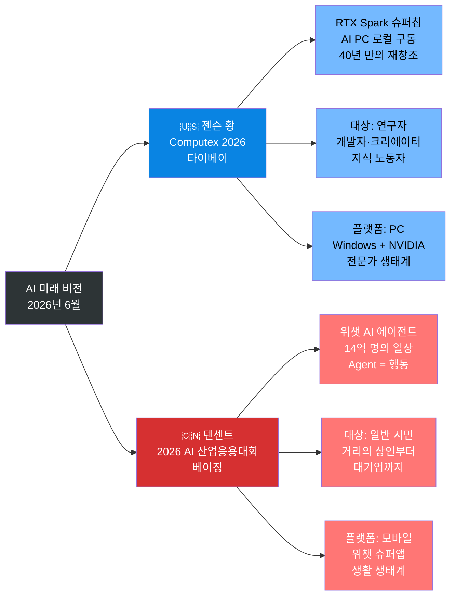
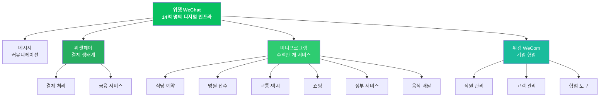
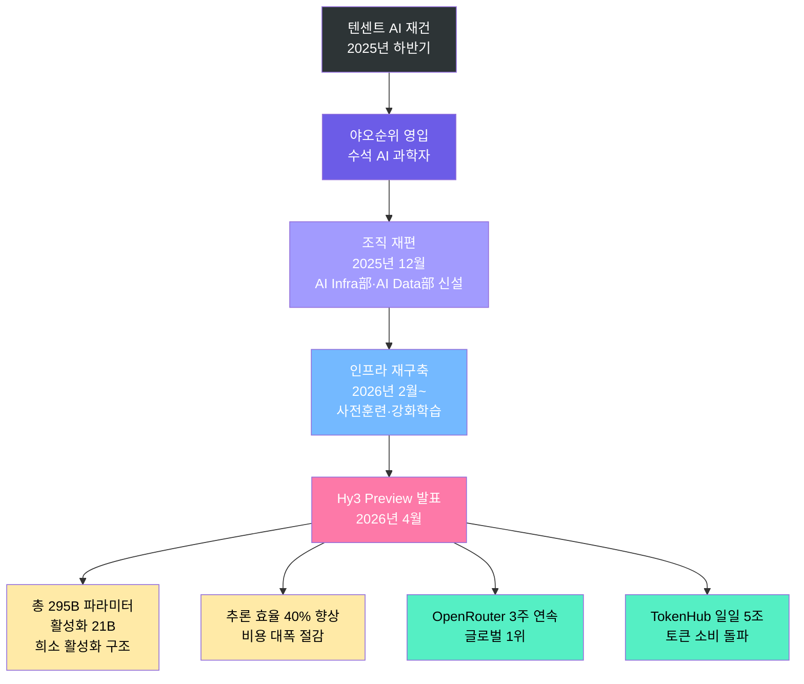
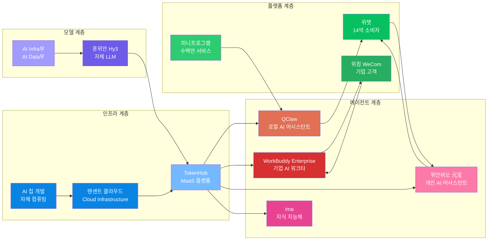
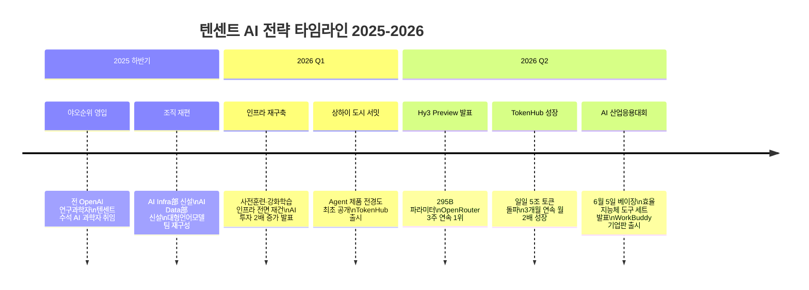

> **문서 개요**: 2026년 6월 초, 같은 주에 전혀 다른 두 개의 AI 미래 비전이 선언되었다. 하나는 대만 타이베이 Computex 2026 무대에서 젠슨 황이 선언한 "40년 만의 PC 재창조"이고, 다른 하나는 중국 베이징에서 텐센트가 개최한 "2026 텐센트 클라우드 AI 산업 응용 대회(腾讯云AI产业应用大会)"에서 선언한 "14억 명을 위한 AI 하반기(下半场)"이다. 이 문서는 두 선언의 배경과 맥락, 텐센트의 실제 발표 내용, 그리고 미국과 중국이 바라보는 AI의 미래가 어떻게 다른지를 상세히 서술한다.

## 관련글

[**젠슨 황의 PC AI 시대 선언 vs. 텐센트의 14억 Mobile 에이전트 선언 - AI 후반전의 진짜 승부처**](https://www.facebook.com/share/1GeYz1kFDy/)

---

## 1. 포스터가 말하는 것 — "腾讯 AI 下半场"

행사 홍보 자료의 제목은 간결하지만 매우 선명하다. "腾讯 AI 下半场(텐센트 AI 하반기)." 스포츠 경기에서 하반기(下半场)란 전반기가 끝나고 새로운 국면이 시작됨을 의미한다. 텐센트가 이 단어를 선택한 것은 단순한 마케팅 용어가 아니다. 지난 수년간 이어진 대형언어모델(LLM) 성능 경쟁, 즉 AI의 "전반기"가 이제 끝났고, AI가 실제 현실에 뿌리를 내리는 새로운 국면이 시작되었다는 선언이다.

대담 형식으로 진행된 이 세션의 두 주인공은 다음과 같다.

- **탕다오셩(汤道生, Tang Daosheng)**: 텐센트 그룹 고급 집행 부총재(高级执行副总裁)이자 클라우드 및 스마트 산업 사업군(云与智慧产业事业群, CSIG) CEO. 텐센트의 B2B 및 클라우드 사업 전반을 총괄하는 핵심 경영진이다.
- **야오순위(姚顺雨, Yao Shunyu)**: 텐센트 수석 AI 과학자(首席AI科学家). 텐센트 혼위안(混元) 대형언어모델 및 AI Infra 총책임자.

이 대담이 특별한 이유가 있다. 야오순위가 텐센트에 합류한 후 처음으로 공개 석상에 모습을 드러내는 자리였기 때문이다. 그는 중국 AI 업계에서 이미 큰 주목을 받고 있던 인물로, 텐센트가 영입에 성공했다는 사실 자체가 시장에 강력한 신호를 보낸 바 있다.

---

## 2. 야오순위(姚顺雨)는 누구인가

야오순위를 이해하지 않고서는 이번 대담의 의미를 제대로 파악하기 어렵다. 그는 중국 최고의 수학·컴퓨터 과학 엘리트 양성 프로그램인 청화대학교(清华大学) 야오반(姚班, Turing Class)을 졸업한 후, 미국 프린스턴대학교(Princeton University)에서 컴퓨터 과학 박사 과정을 밟았다.

2024년 8월, 그는 OpenAI에 합류하여 연구 과학자(Research Scientist)로 재직했다. OpenAI에서 그가 이룬 가장 주목할 만한 성과는 OpenAI 최초의 AI 에이전트 모델 및 제품을 주도적으로 개발한 것이다. 또한 Deep Research 프로젝트에도 참여했다. 2025년, 그는 권위 있는 매체 《MIT Technology Review》의 TR35 명단에 이름을 올리며 중국 출신 최연소 수상자 중 한 명으로 기록되었다.

이후 텐센트가 그를 영입하여 수석 AI 과학자로 임명한 것은 단순한 인재 채용이 아니라, 텐센트가 모델 연구 및 AI 에이전트 개발 분야에서 근본적인 전략 전환을 꾀하고 있다는 강력한 신호였다. 야오순위 본인은 텐센트를 선택한 이유로 두 가지를 꼽았다. 첫 번째는 조직 문화의 솔직함—잘 된 것과 잘 못된 것을 숨기지 않고 직접적으로 인정하는 태도—이고, 두 번째는 텐센트가 성과 지표(metric)가 아닌 신뢰(trust)를 중심으로 운영되는 기업이라는 점이었다. 그는 이러한 문화가 AI 연구의 장기적 발전에 매우 중요하다고 밝혔다.

---

## 3. 2026년 같은 주, 두 개의 선언

### 3-1. 젠슨 황의 선언: "40년 만의 PC 재창조"

2026년 6월 1일, 엔비디아(NVIDIA) CEO 젠슨 황(Jensen Huang)은 대만 타이베이에서 열린 Computex 2026 행사를 앞두고 GTC Taipei 컨퍼런스 무대에 올랐다. 그는 마이크로소프트(Microsoft)의 사티아 나델라(Satya Nadella)와 나란히 서서 새로운 AI 슈퍼칩 RTX Spark를 전 세계에 공개하며 이렇게 선언했다.

> "40년 동안 당신은 앱을 실행했습니다. 클릭하고, 타이핑했습니다. 이제 당신은 묻습니다. 그리고 PC가 일을 합니다." — 젠슨 황

RTX Spark는 단순한 그래픽 카드가 아니다. 엔비디아 Blackwell RTX GPU(6,144개의 CUDA 코어 및 5세대 Tensor Core 포함)와 20코어 NVIDIA Grace CPU를 NVLink-C2C 인터커넥트로 연결한 시스템온칩(SoC) 형태의 슈퍼칩이다. 핵심은 이 칩이 Windows PC에서 AI 에이전트를 로컬로, 즉 클라우드에 의존하지 않고 직접 구동할 수 있도록 설계되었다는 점이다. 1 페타플롭(petaflop)의 연산 성능을 갖추고 있으며, 마이크로소프트와 공동 개발한 보안 샌드박스 환경에서 OpenClaw, Hermes Agent 등 AI 에이전트를 실행할 수 있다.

ASUS, Dell, HP, Lenovo, Microsoft Surface, MSI가 2026년 가을부터 RTX Spark 탑재 제품 출시를 예고했으며, 100개 이상의 소프트웨어 파트너가 지원을 약속했다. 젠슨 황은 나아가 AI 팩토리(AI Factory) 개념을 제시하며 엔비디아가 단순한 GPU 제조사를 넘어 "인프라 기업(Infrastructure Company)"으로 전환했음을 강조했다.

### 3-2. 텐센트의 대응: 행사 이름부터가 전략이다

같은 주 6월 5일, 중국 베이징에서는 정반대의 방향에서 AI의 미래를 바라보는 선언이 이루어졌다. 행사 이름은 **"2026 텐센트 클라우드 AI 산업 응용 대회(2026腾讯云AI产业应用大会)"**, 슬로건은 **"Agent进场，效能生长(에이전트가 등장하고, 효능이 성장한다)"** 이었다.

두 선언이 근본적으로 갈리는 지점은 플랫폼에 대한 가정이다. 젠슨 황은 "AI가 PC 위에서 작동해야 한다"고 말했고, 텐센트는 "AI가 이미 14억 명이 매일 사용하는 모바일 플랫폼—위챗(WeChat, 微信)—위에서 작동해야 한다"고 말했다. 중국 미디어가 공통적으로 제기한 질문은 이것이었다. "당신은 오늘 PC를 몇 시간 사용했습니까. 스마트폰은 몇 시간이나 손에 쥐고 있었습니까."

---

## 4. 위챗(WeChat)이라는 생태계의 본질

텐센트의 AI 전략을 이해하기 위해서는 먼저 위챗이 중국에서 무엇을 의미하는지를 정확히 파악해야 한다. 위챗은 단순한 메신저 앱이 아니다. 그것은 중국인의 디지털 생활 전체를 감싸는 하나의 운영체제(Operating System)다.

중국에서 보통 사람의 하루를 따라가보면, 위챗 하나만으로 거의 모든 디지털 행위가 완결된다. 아침에 일어나 메시지를 확인하고, 미니프로그램(小程序, Mini Program)으로 커피를 주문하고, 위챗페이(WeChat Pay)로 결제하고, 병원 예약을 잡고, 택시를 부르고, 쇼핑을 하고, 저녁엔 공과금을 낸다. 이 모든 행위가 앱 전환 없이 위챗 안에서 이루어진다. 이메일을 열어볼 이유가 없다. PC를 켤 이유도 없다.

월간 활성 이용자 수는 14억 명에 달하며, 위챗 안에서 구동되는 미니프로그램의 수는 수백만 개에 이른다. 이 미니프로그램들은 식당 예약, 병원 접수, 기차표 구매, 택시 호출, 전자상거래, 정부 행정 서비스까지 망라한다. 실제로 중국 항저우(杭州) 거리에서는 구걸하는 사람조차 위챗 QR코드를 내밀고, 군고구마를 파는 노점상도 위챗페이를 받으며, 재래시장 채소 상인도 현금보다 QR코드를 먼저 보여준다.

미국의 인터넷 생태계와 비교해보면 그 차이가 극명해진다. 미국에서는 검색은 구글(Google), 쇼핑은 아마존(Amazon), 영상은 유튜브(YouTube), 차량 호출은 우버(Uber), 결제는 애플페이(Apple Pay)와 페이팔(PayPal), 업무 협업은 슬랙(Slack)과 팀즈(Teams)가 각각 담당한다. 각 서비스는 독립적으로 존재하고, 플랫폼 간 데이터 공유와 서비스 연동은 제한적이다. 강력한 반독점 규제도 수직 통합을 어렵게 만든다.

반면 중국에서는 이 모든 서비스의 상당 부분이 위챗이라는 단일 생태계 안에 이미 구축되어 있다. AI 에이전트가 사용자를 대신해 무언가를 "행동"하기 위해 필요한 서비스 연결이 이미 완성되어 있는 것이다. 이것이 미국과 중국의 AI 에이전트 상용화 속도에 구조적인 차이를 만들어내는 근본 원인이다.

---

## 5. 2026 텐센트 클라우드 AI 산업 응용 대회 — 실제 발표 내용

행사는 2026년 6월 5일 중국 베이징에서 개최되었다. 테마는 "Agent进场，效能生长(에이전트가 등장하고, 효능이 성장한다)"이며, 핵심 청중은 산업계, 기술 개발자, 생태계 파트너들이었다. 메인 세션은 탕다오셩과 야오순위의 대담 "텐센트 AI 하반기"를 중심으로 구성되었다.

### 5-1. 효율 지능체 도구 세트(效率智能体工具集) 최초 발표

텐센트가 이번 대회에서 가장 중점적으로 내세운 것은 **"효율 지능체 도구 세트(效率智能体工具集)"** 이다. 이것은 개인부터 기업까지, 20개 이상의 수직적 시나리오(垂直场景)를 커버하는 차별화된 AI 에이전트 솔루션 모음이다. 텐센트는 이 도구 세트를 "AI 효율화의 새로운 표준(AI提效新标配)"이라고 정의했다.

**개인 사용자 대상 업그레이드**:

- **QClaw**: 텐센트의 로컬 AI 어시스턴트. 이번 발표에서 가장 주목할 만한 새 기능은 "위챗 직접 연결(微信直连)" 모드다. QClaw가 텐센트 문서(腾讯文档), 텐센트 미팅(腾讯会议), ima, QQ 이메일 등과 통합되어 단일 인터페이스에서 모든 텐센트 생태계 서비스에 접근할 수 있게 된다. 특히 위챗과의 직접 연결은 로컬 AI 어시스턴트가 중국 최대 슈퍼앱의 서비스망 전체를 도구로 사용할 수 있음을 의미한다.
  
- **ima**: 개인 지식 지능체(个人知识智能体). 사용자가 전용 AI 에이전트를 만들 수 있으며, 메모리 시스템을 통해 사용자를 지속적으로 이해하고 학습한다.
  
- **위안바오(元宝)**: 개인 AI 어시스턴트. 이번 업그레이드에서 "위안바오파(元宝派)" 기능이 추가되어, 위안바오에서 AI 코딩 에이전트("龙虾", 롱샤)를 원클릭으로 연결할 수 있다. 또한 QQ 브라우저와 협력하여 중국 대학수학능력시험(高考) 전용 상담 AI 에이전트 "위안바오 가오카오퉁(元宝高考通)"을 출시했다.

**기업 사용자 대상 신규 출시**:

- **WorkBuddy 기업판(WorkBuddy Enterprise)**: 오피스 지능체 스위트(办公智能体套件) Agent Suite와 함께 출시. "슈퍼 개인에서 슈퍼 팀으로(从超级个体到超级团队)"라는 설계 철학을 기반으로, 팀 메모리 축적, 인간-기계 협업 새로운 업무 패러다임 구축, 기업 Skills 등 AI 자산 관리를 지원한다. 텐센트는 이를 업계 최초의 "AI 네이티브 조직 진화 솔루션(AI原生组织进化解决方案)"이라고 정의했다.
  
- **ClawPro** 업그레이드
- **텐센트 클라우드 지능체 개발 플랫폼(ADP, Agent Development Platform)** 업그레이드
- **기업점 마케팅 클라우드(企点营销云)** 업그레이드

### 5-2. TokenHub — 일일 5조 토큰 돌파

이번 대회에서 또 하나 주목할 만한 수치가 공개되었다. 텐센트 클라우드 총경리이자 TokenHub 책임자 가오항(高航)은 대형언어모델 서비스 플랫폼 TokenHub의 성과를 공개했다. TokenHub는 출시 3개월 만에 매월 2배씩 성장하는 추세를 유지하고 있으며, 현재 일일 토큰 소비량이 **5조(5万亿) 토큰**을 돌파했다고 밝혔다.

TokenHub는 텐센트 자체 개발 혼위안(混元) 모델 Hy3 Preview, GLM, DeepSeek, MiniMax, Kimi 등 주요 모델을 통합하여 글로벌 시장에 다모델 MaaS(Model as a Service)를 제공한다.

### 5-3. AI 공동 창조 캠프 2기 가동

탕다오셩은 텐센트가 이미 약 2,000개의 파트너사와 협력하여 전국 20만 개 이상의 기업을 서비스하고 있다고 밝혔다. 이번 대회에서 텐센트는 "AI 공동 창조 캠프 2기(腾讯AI共创营第二期)"를 시작하여 업계 파트너들과 함께 AI 솔루션과 사례를 공동 개발하겠다는 계획을 발표했다. 개방형 AI 전략을 유지하겠다는 점도 재확인했다. 탕다오셩은 "우리는 계속 다양한 모델과 협력하며, 선택권을 사용자에게 돌려준다"고 명확히 말했다.

---

## 6. 탕다오셩 × 야오순위 대담 — 핵심 발언

이번 행사의 하이라이트는 두 사람의 약 한 시간에 걸친 공개 대담이었다. 야오순위가 텐센트 합류 후 처음으로 공개 석상에 나선 자리였으며, 중국 AI 업계에서 큰 관심을 끌었다.

### 6-1. "텐센트는 AI에서 늦었는가"

탕다오셩이 야오순위에게 외부에서 많은 이들이 던지는 질문을 그대로 꺼내들었다. "많은 사람들이 텐센트가 AI에서 늦었다고 한다. 당신은 정말 그렇게 생각하는가." 이 질문 자체가 이미 하나의 전략적 메시지다. 텐센트가 자신의 약점을 회피하지 않겠다는 뜻이다.

야오순위는 먼저 "하반기(下半场)"라는 단어 자체를 재정의하는 것으로 시작했다. 그는 이 말이 자신이 쓰기 시작한 것이지만 지금은 "다소 남용되고 있다(有点被滥用)"고 지적했다. 그가 원래 의미했던 "하반기"는 특정 기술이나 제품 카테고리가 아니다. AI 전반기가 훈련 방법론과 모델 돌파구를 찾는 시기였다면, 하반기는 방법론이 성숙한 이후 "풀 가치가 있는 진짜 문제를 찾는 것"이 진정으로 어려워진 시기를 의미한다고 설명했다. 벤치마크에서 몇 퍼센트 앞서는 것보다, 모델이 실제 제품에 들어가고 실제 사용자로부터 실제 피드백을 받으며 실제 수요를 해결하는 것이 이제 더 중요해졌다는 것이다.

### 6-2. AI 하반기에 대한 두 가지 핵심 판단

야오순위는 AI 하반기에 대해 두 가지 핵심 판단을 내놓았다.

**첫 번째: AI는 단기 창이 아니라 장기 게임이다.**

그는 실리콘밸리 일부 종사자들 사이에 "지금 2년 동안 빨리 돈 벌고 은퇴하겠다"는 심리가 있다는 것을 지적하며, 이런 자세가 옳지 않다고 밝혔다. 그의 비유는 강렬했다. "ChatGPT와 Claude Code가 유일한 슈퍼 앱이 되지는 않을 것입니다. 미래에는 계속해서 새로운 제품 기회가 생겨날 것이며, 오늘은 아마도 1970년대에 PC가 막 탄생했을 때와 같은 순간일 것입니다." 즉, AI는 이제 막 시작됐을 뿐이며, 지금 당장 보이는 제품들이 전부가 아니라는 것이다.

**두 번째: AI는 다원적으로 발전할 것이며, 단일 경로가 아니다.**

멀티모달(Multimodal), 구현 지능(具身智能, Embodied Intelligence) 등 수많은 새로운 방향이 이미 형성되고 있거나 형성될 예정이라고 했다. 한 가지 모델, 한 가지 플랫폼, 한 가지 방식으로 AI의 미래가 결정되지 않는다는 뜻이다. 이 판단은 텐센트가 하나의 독점적 AI 플랫폼을 구축하기보다 다양한 모델과 협력하며 개방형 생태계를 지향한다는 전략과 정확히 일치한다.

---

## 7. 텐센트 혼위안(混元) 모델 — Hy3 Preview의 재건

이번 대회의 배경에는 텐센트의 모델 자체에 대한 대대적인 재건 작업이 있다. 2025년 하반기에 야오순위를 수석 AI 과학자로 영입한 이후, 텐센트는 2025년 12월 AI 인프라 부서(AI Infra部), AI 데이터 부서(AI Data部), 데이터 컴퓨팅 플랫폼 부서를 신설하며 모델 연구 조직 구조 전체를 재편했다.

2026년 2월부터 텐센트는 사전 훈련(Pre-training)과 강화 학습(Reinforcement Learning) 인프라를 전면 재구축하기 시작했다. 세 가지 핵심 원칙 아래였다. 첫째, 추론, 장문 이해, 명령 준수, 도구 호출 등을 아우르는 전면적 능력 구축. 둘째, 공개 벤치마크(benchmark)에서의 점수보다 실제 제품 내 사용자 경험을 우선하는 현실 평가 체계. 셋째, 모델과 추론 설계를 통합하여 비용 효율성을 극대화하는 전략.

2026년 4월, 텐센트는 그 첫 번째 결실로 **혼위안 Hy3 Preview(混元Hy3 preview)** 를 발표했다. 총 파라미터(parameter) 수는 295B(2,950억)이지만, 추론 시 활성화 파라미터는 단 21B(210억)에 불과한 희소 활성화(sparse activation) 구조를 채택하여 비용 효율성을 극적으로 높였다. 추론 효율은 이전 세대 대비 40% 향상되었으며, 비용도 대폭 절감되었다.

가격 정책도 공격적이다. TokenHub에서 Hy3 Preview 입력 가격은 최저 1.2위안/백만 토큰이며, 캐시 히트(Cache Hit) 입력은 0.4위안/백만 토큰, 출력은 최저 4위안/백만 토큰이다. 개인 버전 정기 구독 요금제는 월 최저 28위안으로 출시되어 가격 접근성을 대폭 낮췄다.

시장 반응은 뜨거웠다. Hy3 Preview는 출시 이후 OpenRouter 글로벌 총 순위에서 3주 연속 정상을 차지했다. 이 순위는 실제 API 호출량 기준이므로 실제 시장 인기도를 반영하는 강력한 지표다. 2026년 4월 28일 이후 OpenRouter의 토큰 소비량 순위에서도 꾸준히 상위권을 유지하고 있다.

---

## 8. 왜 중국에서는 가능하고 미국에서는 어려운가 — 구조의 문제

많은 이들이 묻는다. 미국이 AI 기술에서는 앞서 있는데 왜 AI 에이전트 상용화에서는 중국이 더 빠를 수 있는가. 이 질문에 대한 답은 기술보다 구조에 있다.

AI 에이전트가 실제로 사용자를 대신해 행동하려면 두 가지가 필요하다. 첫째는 생각하고 판단할 수 있는 모델 능력이고, 둘째는 실제로 행동을 실행할 수 있는 연결망과 권한이다. 두 번째 요소—실행 가능한 연결망—가 바로 미국과 중국의 결정적 차이를 만드는 지점이다.

미국에서 AI가 "내일 상하이 출장 준비해줘"라는 요청을 받으면, 항공권 예약을 위해 아마존 또는 익스피디아(Expedia) API에 접근해야 하고, 호텔 예약을 위해 부킹닷컴(Booking.com)에, 차량 호출을 위해 우버(Uber)에, 회의 일정 정리를 위해 구글 캘린더(Google Calendar)에 별도로 접근해야 한다. 각 서비스는 독립적으로 존재하고 API 연동 계약이 필요하다.

반면 중국에서 위챗 AI 에이전트가 같은 요청을 받으면, 이 모든 서비스가 위챗 생태계 안의 미니프로그램으로 이미 연결되어 있다. AI가 행동하기 위한 파이프라인이 이미 구축된 것이다. 미국은 AI가 더 지능적(Intelligent)일 수 있지만 행동하기(Act) 어렵다. 중국은 AI가 행동하기 좋은 구조를 이미 갖추고 있다.

텐센트의 강점은 단지 소비자 플랫폼에만 있지 않다. 기업용 플랫폼 위컴(WeCom, 企业微信)은 이미 중국 수많은 기업의 업무 시스템으로 자리 잡았다. 직원 관리, 고객 관리, 영업 관리, 협업 시스템이 하나의 플랫폼 위에 구축되어 있다. 즉, 텐센트는 소비자 데이터와 기업 데이터를 동시에 보유하고 양측을 연결할 수 있는 거의 유일한 기업이다.

---

## 9. 텐센트의 수직 통합 전략 — 플라이휠의 설계

텐센트가 추구하는 것은 단순한 AI 제품 출시가 아니라 AI 시대의 선순환 구조(Flywheel) 구축이다. 그 구조는 다음과 같이 작동하도록 설계된다.

사용자가 늘어나면 토큰 소비가 증가하고, 토큰 소비가 늘면 실제 사용 데이터가 쌓이며, 이 데이터가 모델을 개선하고, 개선된 모델이 더 나은 서비스를 만들고, 더 나은 서비스가 다시 더 많은 사용자를 끌어들인다. 이를 가능하게 하기 위해 텐센트는 수직 통합을 강화하고 있다.

모델 계층에서는 야오순위 주도로 혼위안을 재건하고 있다. 인프라 계층에서는 텐센트 클라우드, TokenHub, 그리고 자체 AI 칩 개발로 컴퓨팅 주권을 확보하고 있다. 플랫폼 계층에서는 위챗과 위컴이 소비자와 기업 고객 양쪽을 모두 커버한다. 에이전트 계층에서는 QClaw, WorkBuddy, 위안바오, ima가 실제 사용자 접점을 담당한다.

이 구조에서 각 계층은 독립적으로 존재하는 것이 아니라 상호 강화하는 관계를 형성한다. 사용자가 위안바오를 쓸수록 혼위안 모델이 개선되고, 개선된 모델이 다시 더 유용한 위안바오를 만든다.

---

## 10. 텐센트의 현재 위치 — "선표(站票)"의 솔직함

텐센트의 AI 전략이 인상적이라고 해서 현재의 상황을 장밋빛으로만 볼 수는 없다. 텐센트 창업자이자 이사회 주석 마화텅(马化腾)은 "텐센트가 막 배에 탔지만(站上去了), 아직 제대로 앉지는 못했다(还坐不下去)"라며, 배의 속도가 더 빨라지기를 바란다고 말했다. 이는 텐센트 AI의 현재 발전 속도가 여전히 충분히 빠르지 않으며, 동종 업계에서 뒤처질 수 있는 위험을 인정한 것이다.

실제로 2026년 1분기 재무 실적을 보면 기술 기반 시설 운영 비용이 전년 동기 대비 58% 급증하여 107억 위안에 달했고, AI 장비 감가상각은 46% 증가했으며, AI 네이티브 앱 홍보를 위한 판매비용도 44% 증가하여 113억 위안에 이르렀다. 매출과 Non-IFRS 영업이익의 전년 동기 대비 성장률은 9%에 머물렀고, 증분 서비스 성장도 확연히 둔화되었다.

투자는 늘어나는데 성장은 아직 충분히 따라오지 못하는 상황이다. 그러나 텐센트가 이를 솔직하게 인정하고 장기 게임에 집중한다는 점은, 야오순위가 합류를 결심한 이유와 정확히 일치한다.

2026년 1분기 기준 텐센트의 연구개발비는 약 225억 4,200만 위안으로 전년 동기 대비 19% 증가했으며, 대부분 AI 관련 투자에 집중되었다. 앞서 텐센트는 2025년 신형 AI 제품 개발에 180억 위안을 투입했으며, 2026년에는 이를 2배 이상 늘리겠다고 밝혔다.

---

## 11. 자본시장이 보내는 신호

이러한 전략적 변화에 대해 자본시장도 민감하게 반응하고 있다. 위챗 AI 어시스턴트 출시 임박 소식이 전해지면서 텐센트 주가는 단기간에 약 10% 상승했다. 이는 투자자들이 텐센트를 단순한 인터넷 플랫폼 기업이 아닌, 중국 최대의 AI 생활 플랫폼 기업으로 재평가하기 시작했다는 신호다.

---

## 12. AI 경쟁의 진짜 전장 — 누가 인간의 시간을 점유하는가

이 모든 논의를 관통하는 하나의 핵심 질문이 있다. "어느 플랫폼이 더 많은 인간의 시간을 점유하는가. 그리고 어느 플랫폼이 더 많은 지갑을 열게 하는가." 이것이 AI 경쟁의 궁극적인 전장이다.

엔비디아 RTX Spark가 목표로 하는 것은 생산성 중심의 AI 생태계다. 연구자, 개발자, 크리에이터, 지식 노동자가 PC 위에서 전문적인 AI를 구동하는 세상이다. 이 비전은 기술적으로 완성도 높고 특정 계층에게는 혁명적 변화를 가져올 것이다.

텐센트가 목표로 하는 것은 생활 중심의 AI 생태계다. 거리의 상인부터 대기업 임원까지, 이미 매일 사용하는 위챗 안에서 AI가 그들의 삶을 대신 처리해주는 세상이다. 이 비전은 기술적 장벽이 없고 규모가 압도적이다.

둘 중 어느 것이 옳고 어느 것이 틀렸다는 이분법적 판단은 적절하지 않다. 두 생태계는 서로 다른 시장을 겨냥하고 있으며, 실제로 공존할 가능성이 높다. 그러나 AI가 사람들의 일상을 실제로 바꾸는 속도와 규모의 관점에서 본다면, 이미 14억 명이 매일 사용하는 플랫폼 위에서 AI를 구동하는 전략이 현실적으로 더 빠른 침투력을 가질 수 있다.

야오순위의 말처럼, AI는 이제 막 시작되었다. ChatGPT도, Claude Code도, RTX Spark도 최종 답이 아닐 수 있다. 그리고 텐센트 AI 하반기의 진짜 의미는, 중국이 지금 이 순간 어디서 어떻게 AI를 뿌리내리게 할 것인지에 대한 명확한 답을 내놓았다는 데 있다.

---

## 13. 결론 — 항저우 걸인의 QR코드에서 14억의 AI로

항저우 거리의 걸인이 내밀었던 위챗 QR코드는 단순한 결제 수단이 아니었다. 그것은 중국 사회 전체가 하나의 디지털 생활 운영체제로 연결되고 있다는 신호였다. 텐센트는 이제 그 위에 AI를 얹으려 한다. 그것도 단순히 대화할 수 있는 AI가 아니라, 예약하고, 결제하고, 신청하고, 조율하고, 실행하는 AI를.

6월 5일 베이징의 발표는 텐센트가 AI 후반전에서 어떤 경기를 하겠다는 선언이었다. 최고의 벤치마크 점수를 가진 모델로 싸우겠다는 것이 아니라, 이미 14억 명이 있는 곳에서, 이미 수백만 개의 서비스가 연결된 생태계 안에서, AI를 실제 일상의 도구로 만들겠다는 것이다.

엔비디아가 최고의 칩을 선언하는 동안, 텐센트는 그 칩이 없어도 작동하는 생태계를 완성하고 있다. AI의 최종 승자는 최고의 모델 기업이 아닐 수 있다. 가장 많은 사람의 가장 많은 시간 속에 이미 들어와 있는 기업, 그리고 그 자리에서 AI를 실제 행동으로 연결하는 기업일 가능성이 더 높다.

중국 AI의 후반전은 이제 시작되었다.

---

## 참고 — 주요 등장인물 및 제품 정리

| 구분 | 이름 | 설명 |
|------|------|------|
| 인물 | 탕다오셩 (汤道生, Tang Daosheng) | 텐센트 그룹 고급 집행 부총재, CSIG CEO |
| 인물 | 야오순위 (姚顺雨, Yao Shunyu) | 텐센트 수석 AI 과학자, 혼위안 및 AI Infra 총책임자, 전 OpenAI |
| 인물 | 가오항 (高航) | 텐센트 클라우드 총경리, TokenHub 책임자 |
| 모델 | 혼위안 Hy3 Preview (混元 Hy3 Preview) | 295B 파라미터, 활성화 21B, 텐센트 자체 개발 LLM |
| 플랫폼 | TokenHub | 텐센트 클라우드 대형언어모델 서비스 플랫폼, 일일 5조 토큰 처리 |
| 에이전트 | QClaw | 로컬 AI 어시스턴트, 위챗 직접 연결(微信直连) 지원 |
| 에이전트 | WorkBuddy Enterprise | 기업용 AI 워크타, AI 네이티브 조직 솔루션 |
| 에이전트 | 위안바오 (元宝) | 개인 AI 어시스턴트, 가오카오퉁(高考通) 출시 |
| 에이전트 | ima | 개인 지식 지능체, 기억 시스템 기반 |
| 플랫폼 | 위챗 (WeChat, 微信) | 14억 명, 슈퍼앱, 수백만 개 미니프로그램 |
| 플랫폼 | 위컴 (WeCom, 企业微信) | 기업용 협업 플랫폼 |
| 행사 | 2026 텐센트 클라우드 AI 산업 응용 대회 | 2026년 6월 5일, 베이징, 슬로건: Agent进场，效能生长 |

---

*작성 일자: 2026-06-07*
