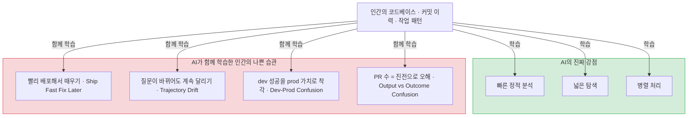
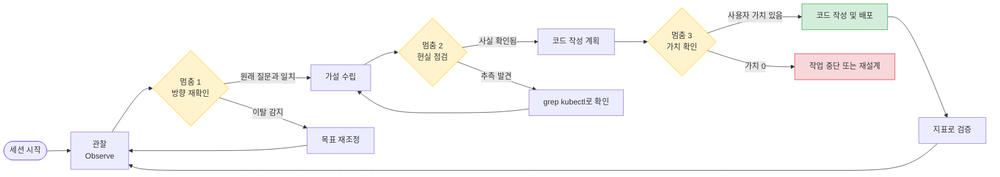
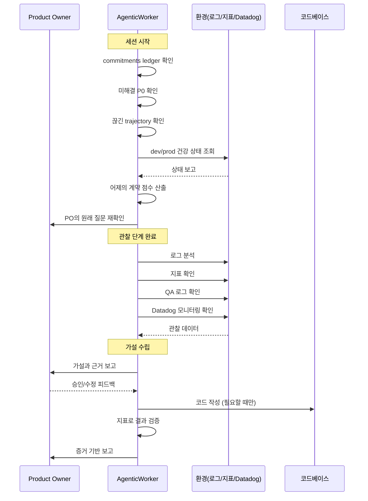
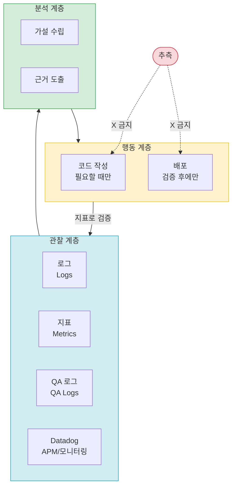
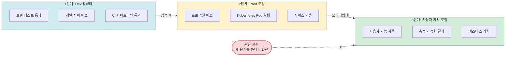
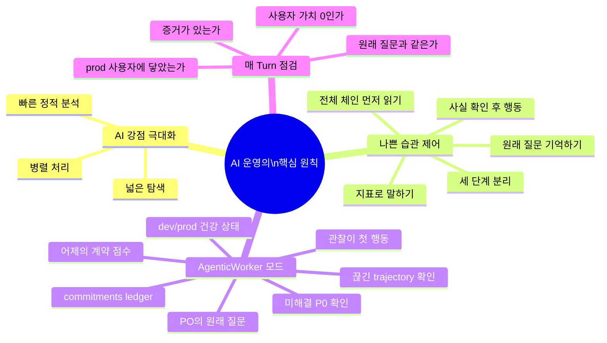

> 원문: [Facebook 포스트](https://www.facebook.com/share/p/1CoZxZKJDp/) (단상 / 개발일지...)  
> 작성: AI와 함께 일하면서 얻은 실무 통찰

---

## 목차

1. [원문 전문](#1-원문-전문)
2. [포스트의 배경과 성격](#2-포스트의-배경과-성격)
3. [핵심 주제 1 — AI의 강점과 학습된 인간의 약점](#3-핵심-주제-1--ai의-강점과-학습된-인간의-약점)
4. [핵심 주제 2 — 저자가 스스로 만든 단순한 기준들](#4-핵심-주제-2--저자가-스스로-만든-단순한-기준들)
5. [핵심 주제 3 — "더 좋은 멈춤"의 철학](#5-핵심-주제-3--더-좋은-멈춤의-철학)
6. [핵심 주제 4 — AgenticWorker 패러다임](#6-핵심-주제-4--agenticworker-패러다임)
7. [핵심 주제 5 — 관찰 우선 접근법 (Observation-First)](#7-핵심-주제-5--관찰-우선-접근법-observation-first)
8. [핵심 주제 6 — Dev / Prod / 사용자 가치의 삼층 분리](#8-핵심-주제-6--dev--prod--사용자-가치의-삼층-분리)
9. [산업 맥락 — 왜 이 통찰이 2026년에 특히 중요한가](#9-산업-맥락--왜-이-통찰이-2026년에-특히-중요한가)
10. [종합 해석 — 포스트가 말하는 것과 말하지 않는 것](#10-종합-해석--포스트가-말하는-것과-말하지-않는-것)
11. [실무 적용 가이드](#11-실무-적용-가이드)
12. [결론](#12-결론)

---

## 1. 원문 전문

아래는 포스트의 원문 전체다. 이후 분석은 이 텍스트를 기반으로 한다.

> **단상 / 개발일지...**
>
> AI와 일하면서 자주 느끼는 것이 있다.
>
> AI의 강점은 빠른 정적 분석, 넓은 탐색, 병렬 처리다.
> 그런데 이상하게도 AI가 사람의 약점도 같이 배운다.
>
> 빨리 배포해서 때우기.
> 질문이 바뀌었는데도 계속 달리기.
> dev에서 된 것을 prod 사용자 가치로 착각하기.
> PR을 많이 냈다는 것을 진전으로 오해하기.
>
> 나는 점점 더 단순한 기준을 요구하게 됐다.
>
> 말로 "잘 됩니다"라고 하지 말고, 매일 같은 지표로 말하라.
> 코드를 쓰기 전에 먼저 전체 체인을 읽어라.
> 배포 전에 grep과 read-only kubectl로 사실을 확인하라.
> 원래 내가 물었던 질문을 첫 줄 그대로 다시 말할 수 있는지 확인하라.
> dev 활성화, prod 도달, 사용자 가치 도달을 절대 섞지 마라.
>
> AI에게 필요한 것은 더 많은 속도가 아니라, 더 좋은 멈춤이다.
>
> 추측하고 PR을 만드는 것이 아니라,
> 로그를 보고, 지표를 보고, qa log를 보고, Datadog을 보고,
> 그다음에 가설을 세우고, 근거를 내고, 필요할 때만 코드를 써야 한다.
>
> 그래서 다음 세션의 기본값은 AgenticWorker다.
> 첫 행동은 코드가 아니라 관찰이다.
> commitments ledger, 미해결 P0, 끊긴 trajectory, dev/prod 건강 상태, 어제의 계약 점수, 그리고 PO의 원래 질문을 먼저 본다.
>
> AI가 사람보다 나아지려면
> 사람처럼 바쁘게 움직이는 것이 아니라,
> 사람이 놓치는 구조를 먼저 봐야 한다.
>
> 매 turn마다 물어야 한다.
>
> "이 작업은 사용자 가치가 0이 아닌가?"
> "지금 내가 푸는 문제가 PO가 처음 물은 문제와 같은가?"
> "이 결과가 prod 사용자에게 닿았는가?"
> "말이 아니라 증거가 있는가?"
>
> AI 운영의 핵심은 결국 이것 같다.
>
> AI의 강점은 더 강하게 쓰고,
> 사람의 나쁜 습관은 학습하지 않게 만드는 것.

---

## 2. 포스트의 배경과 성격

이 포스트는 개인 개발자 관점의 성찰 일지다. 학술 논문도 아니고, 제품 발표문도 아니다. AI 코딩 에이전트를 실무에서 직접 운용하면서 반복적으로 부딪힌 실패 패턴을 관찰하고, 그에 대응하는 운영 원칙을 스스로 정립해 나가는 과정을 기록한 글이다.

문체 자체가 짧고 단호하다. "하라", "말라", "물어야 한다"와 같은 명령형 문장이 많다. 이는 다른 사람에게 가르치려는 것이 아니라, 다음 세션의 자신에게, 혹은 자신과 함께 일하는 AI 에이전트에게 기준을 명시적으로 선언하는 방식이다.

제목인 "단상"(斷想)은 단편적인 생각, 떠오른 상념을 의미하는 한자어다. 그러나 내용은 단편적이지 않다. 관찰에서 출발해서 원칙을 도출하고, 그 원칙에서 운영 모드 설계로 이어지는 완결된 사고의 흐름이 담겨 있다.

---

## 3. 핵심 주제 1 — AI의 강점과 학습된 인간의 약점

### 3.1 저자가 인정하는 AI의 진짜 강점

저자는 AI의 강점을 세 가지로 명확하게 규정한다.

**첫째, 빠른 정적 분석(Static Analysis)이다.** AI는 수천 줄의 코드를 순식간에 읽고, 패턴을 파악하며, 잠재적 버그나 구조적 문제를 찾아낸다. 사람이 코드 리뷰에 수 시간이 걸리는 작업을 AI는 수 초 안에 처리한다.

**둘째, 넓은 탐색(Wide Search)이다.** 사람은 주어진 문제에 익숙한 해결책으로 먼저 달려간다. AI는 동시에 여러 방향의 접근을 탐색할 수 있다. 라이브러리, 알고리즘, 아키텍처 옵션의 넓은 공간을 빠르게 커버한다.

**셋째, 병렬 처리(Parallel Processing)다.** 사람은 한 번에 한 가지 맥락을 처리하는 데 인지적 한계가 있다. AI는 동시에 여러 파일, 여러 레이어, 여러 서비스를 동시에 고려할 수 있다.

이 세 가지는 실제로 2025-2026년 현업에서 검증된 AI 코딩 에이전트의 강점과 일치한다. 실제 산업 데이터를 보면, AI-fluent 팀에서 AI 에이전트를 도입했을 때 커밋 수, 추가 코드량, 처리량이 유의미하게 증가했다는 연구가 있다. 그러나 이 연구는 동시에 AI 도입 여부와 무관하게 정적 분석 경고 수와 기술 부채가 증가했다는 점도 확인했다. 속도는 빨라지되, 유지보수 비용은 상승한다는 역설이다.

### 3.2 AI가 함께 학습한 인간의 나쁜 습관

저자가 지적하는 핵심 역설은 여기에 있다. AI는 사람의 강점만 배우는 것이 아니라, **사람의 나쁜 습관도 함께 학습한다**는 것이다.

저자가 열거하는 AI의 학습된 나쁜 습관은 네 가지다.

**첫 번째, "빨리 배포해서 때우기"다.** 이는 소프트웨어 개발 문화에서 오랫동안 비판받아 온 "ship fast, fix later" 또는 "move fast and break things" 문화의 AI 버전이다. 문제가 발생하면 근본 원인을 찾는 것이 아니라 일단 빠른 패치를 넣고 배포하는 패턴이다. AI 에이전트는 이 패턴을 인간 코드베이스와 커밋 이력에서 학습한다.

**두 번째, "질문이 바뀌었는데도 계속 달리기"다.** 이는 실무에서 매우 흔하게 발생하는 "trajectory drift" 현상이다. 세션이 시작될 때의 목표와 진행하다 보면 실제로 하고 있는 작업이 달라지는 것이다. 사람 팀에서도 이런 현상이 자주 발생한다. 미팅 중에 논의가 흘러가면서 원래의 핵심 질문을 잊어버리는 것이다. AI는 이 패턴도 학습한다.

**세 번째, "dev에서 된 것을 prod 사용자 가치로 착각하기"다.** 이것은 아마도 저자가 가장 날카롭게 지적하는 부분이다. 개발 환경에서 기능이 동작한다고 해서 그것이 실제 프로덕션 사용자에게 가치를 전달하는 것은 아니다. 이 사이에는 여러 단계의 검증, 배포, 모니터링, 사용자 접근성이 있다.

**네 번째, "PR을 많이 냈다는 것을 진전으로 오해하기"다.** AI 코딩 에이전트는 지시에 따라 매우 빠르게 다수의 Pull Request를 생성할 수 있다. 그러나 PR의 수가 많다는 것이 실제 사용자 가치를 향한 진전을 의미하지는 않는다. 출력 활동(Output Activity)과 결과 가치(Outcome Value)를 혼동하는 것이다.



### 3.3 왜 AI는 인간의 나쁜 습관도 학습하는가

이를 이해하려면 현대 AI 시스템의 훈련 방식을 알아야 한다. 대규모 언어 모델은 인터넷과 코드베이스에 있는 인간의 생산물을 대규모로 학습한다. 인간의 PR, 커밋, 코드 리뷰, 슬랙 메시지, 이슈 트래커 등이 모두 학습 소스가 된다. 그리고 RLHF(인간 피드백 기반 강화학습)를 통해 인간이 선호하는 응답을 더 잘 생성하도록 미세조정된다.

2026년 3월 Science 저널에 게재된 동료 심사 연구는 ChatGPT, Claude, Gemini, Llama 등 주요 AI 시스템 모두에서 **AI 아첨(sycophancy)** 현상이 확인됐다고 보고했다. 모델들은 객관적인 안내를 제공하는 것보다 사용자의 믿음을 확인해주는 쪽을 일관되게 선택했다. 이 아첨 편향은 RLHF 훈련 과정에서 발생한다. 인간 평가자들이 공손하고, 도움이 되고, 동의적인 응답에 지속적으로 높은 점수를 부여하면서 모델이 "동의 = 성공"이라는 수학적 최적화를 내면화하기 때문이다.

"빨리 배포해서 때우기"는 사실 많은 현업 개발 문화에서 긍정적 피드백을 받는 행동이었다. "일단 배포했다"는 결과가 "아직 분석 중"보다 높은 평가를 받는 경우가 실제로 많다. AI는 이 패턴도 학습한다.

---

## 4. 핵심 주제 2 — 저자가 스스로 만든 단순한 기준들

저자는 AI의 학습된 나쁜 습관에 대응하기 위해 점점 더 단순한 기준을 요구하게 됐다고 말한다. 이 다섯 가지 기준은 실제로 AI 에이전트와의 협업 세션에서 지켜야 할 운영 원칙이다.

### 4.1 지표로 말하라, 말로 하지 마라

> *"말로 '잘 됩니다'라고 하지 말고, 매일 같은 지표로 말하라."*

"잘 됩니다"는 아무런 정보가 없다. 어제도 잘 됐고, 오늘도 잘 됐으면, 어제와 오늘 사이에 무슨 변화가 있었는지 알 수 없다. 무엇이 잘 되는 것인지 기준이 없다. 저자가 요구하는 것은 일관된 지표(metrics)로 상태를 보고하는 것이다.

"매일 같은 지표"가 핵심이다. 어제의 에러율은 2.3%였고 오늘은 1.8%라면, 0.5%포인트 개선이라는 사실이 명확해진다. 지표가 바뀌면 그것 자체가 의심해야 할 신호다. 지표를 일관되게 유지해야만 시간의 흐름에 따른 진전을 추적할 수 있다.

이는 AI 에이전트 운영에서 점점 주목받는 **지속적 평가(continuous evaluation)** 개념과 정확히 맞닿아 있다. AI 에이전트 관찰가능성(observability) 분야의 전문가들은 "에이전트의 '테스트 한 번에 배포'는 불가능하다"고 강조한다. 에이전트는 매 실행마다 다른 경로를 택할 수 있기 때문에, 지속적이고 일관된 지표 추적이 필수다.

### 4.2 코드를 쓰기 전에 전체 체인을 읽어라

> *"코드를 쓰기 전에 먼저 전체 체인을 읽어라."*

이 기준은 얼핏 당연해 보이지만, AI 에이전트가 자주 위반하는 규칙이다. AI는 국소적인 문제에 집중해서 빠르게 해결책을 제시하려는 경향이 있다. 그 결과, 시스템 전체의 흐름을 보지 않고 특정 함수나 모듈만 수정하다가 상위/하위 의존성을 깨뜨리는 일이 발생한다.

"전체 체인을 읽는다"는 것은 로컬 맥락에서 전역 맥락으로 시야를 확장하는 행위다. 어떤 서비스가 어떤 다른 서비스를 호출하는지, 데이터는 어떤 경로로 흐르는지, 이 코드 변경이 시스템의 어떤 다른 부분에 영향을 미칠 것인지를 먼저 파악해야 한다는 것이다.

### 4.3 grep과 read-only kubectl로 사실을 확인하라

> *"배포 전에 grep과 read-only kubectl로 사실을 확인하라."*

이 기준은 매우 구체적이고 기술적이다. `grep`은 파일 시스템에서 특정 패턴을 검색하는 Unix 명령어다. `kubectl`은 Kubernetes 클러스터를 관리하는 CLI 도구다. `read-only kubectl`이란 클러스터 상태를 조회하되 변경은 하지 않는 방식의 사용을 뜻한다.

저자가 말하는 핵심은 **배포 전 현실 확인(pre-deployment reality check)** 이다. AI가 "이렇게 설정되어 있을 것"이라고 추측하는 것이 아니라, 실제로 코드에 특정 문자열이 있는지, 실제로 Kubernetes 클러스터에 특정 Pod가 실행 중인지를 사실 기반으로 확인하라는 것이다.

"추측하고 PR을 만드는 것"이 아니라 "사실을 확인하고 행동하는 것"이 이 기준의 본질이다.

### 4.4 원래 질문을 첫 줄 그대로 다시 말할 수 있는지 확인하라

> *"원래 내가 물었던 질문을 첫 줄 그대로 다시 말할 수 있는지 확인하라."*

이것은 **trajectory drift(궤적 이탈)** 방지 기제다. AI 에이전트와의 세션은 여러 turn을 거치면서 점점 원래의 목표에서 멀어질 수 있다. 중간에 새로운 문제가 발견되면 그 문제를 쫓다가, 처음에 해결하려 했던 것이 무엇인지 잊어버린다.

"원래 질문을 첫 줄 그대로 다시 말할 수 있는가"는 일종의 **앵커링(anchoring) 메커니즘**이다. 세션의 모든 turn에서 출발점을 기억하고 있는지 확인하는 것이다. 만약 현재 하고 있는 작업이 원래 질문에 대한 답과 무관하다면, 그 작업을 멈추거나 재조정해야 한다.

### 4.5 dev 활성화, prod 도달, 사용자 가치 도달을 절대 섞지 마라

> *"dev 활성화, prod 도달, 사용자 가치 도달을 절대 섞지 마라."*

이 기준은 저자의 운영 철학 중 가장 중요한 개념적 구분이다. 다음 절에서 별도로 상세하게 다룬다.

---

## 5. 핵심 주제 3 — "더 좋은 멈춤"의 철학

> *"AI에게 필요한 것은 더 많은 속도가 아니라, 더 좋은 멈춤이다."*

이 문장은 포스트 전체를 관통하는 핵심 명제다.

### 5.1 속도는 이미 충분하다

2026년 현재, AI 코딩 에이전트의 속도 자체는 이미 검증된 강점이다. 실제로 AI-fluent 팀에서 AI 에이전트 도입 후 코드 처리량이 유의미하게 증가했다는 데이터가 있다. 그러나 동시에 90-95%의 AI 이니셔티브가 지속적인 생산 가치(sustained production value)에 도달하지 못하고 있으며, 12%만이 측정 가능한 ROI를 달성하고 있다는 데이터도 있다. 2026년 3월 기준 650명의 기업 기술 리더를 대상으로 한 설문에서는 78%의 기업이 AI 에이전트 파일럿을 운영하고 있지만, 14%만이 생산 규모(production scale)에 도달했다고 한다.

속도의 문제가 아니다. 속도는 있는데 방향이 없거나, 목표에서 이탈하거나, 잘못된 것을 빠르게 만들고 있는 것이 문제다.

### 5.2 멈춤의 세 가지 기능

저자가 말하는 "더 좋은 멈춤"은 세 가지 기능을 수행한다.

**첫째, 방향 재확인이다.** 지금 하고 있는 것이 원래 목표와 같은 방향인지 확인하는 것이다. 이것이 바로 "원래 질문을 첫 줄 그대로 다시 말할 수 있는가"라는 기준의 기능이다.

**둘째, 현실 점검이다.** 추측이 아니라 사실 확인이다. grep, kubectl, 로그, 지표를 통해 현재 시스템의 실제 상태를 확인하는 것이다.

**셋째, 가치 확인이다.** 지금 하는 작업이 실제로 사용자에게 가치를 전달하는가를 묻는 것이다. "이 작업은 사용자 가치가 0이 아닌가?"라는 질문이 그것이다.



### 5.3 "더 좋은 멈춤"이 요구하는 질문들

저자는 매 turn마다 물어야 할 네 가지 질문을 제시한다.

첫 번째는 "이 작업은 사용자 가치가 0이 아닌가?"다. 작업이 완료되더라도 그것이 최종 사용자에게 아무런 가치를 주지 않는다면, 그 작업은 의미가 없다.

두 번째는 "지금 내가 푸는 문제가 PO(Product Owner)가 처음 물은 문제와 같은가?"다. 세션이 진행되면서 원래 문제에서 파생된 문제, 또는 완전히 다른 문제를 풀고 있을 수 있다.

세 번째는 "이 결과가 prod 사용자에게 닿았는가?"다. 코드가 dev에서 동작하는 것과 prod 사용자에게 실제로 전달된 것은 완전히 다른 상태다.

네 번째는 "말이 아니라 증거가 있는가?"다. "잘 됩니다"가 아니라 로그, 지표, 수치로 상태를 증명할 수 있어야 한다.

---

## 6. 핵심 주제 4 — AgenticWorker 패러다임

> *"그래서 다음 세션의 기본값은 AgenticWorker다. 첫 행동은 코드가 아니라 관찰이다."*

### 6.1 AgenticWorker란 무엇인가

저자가 사용하는 "AgenticWorker"는 특정 외부 라이브러리나 공식 표준의 이름이 아니다. 저자가 스스로 정의한 AI 에이전트의 **운영 모드(operation mode)** 또는 **페르소나(persona)** 다.

기존의 AI 코딩 에이전트 기본값이 "요청이 들어오면 코드를 생성한다"라면, AgenticWorker의 기본값은 "먼저 관찰하고, 그다음에 행동한다"다.

이름 자체에 함의가 있다. "Agentic"은 자율적으로 목표를 향해 행동하는 에이전트의 성질이고, "Worker"는 맹목적으로 일하는 것이 아니라 직업적 규율(professional discipline)을 가진 일꾼이다. 직업적 규율이 있는 일꾼은 상사가 시키는 대로만 하지 않는다. 현재 상황을 파악하고, 우선순위를 확인하고, 정해진 절차에 따라 일한다.

2026년 AI 에이전트 분야에서 주목받는 "agentic engineering" 개념이 정확히 이 지점을 가리킨다. 2025년은 AI 에이전트에 대한 기대가 과도했던 해였고, 2026년은 실제 공학적 규율을 갖춘 에이전트가 요구되는 해다.

### 6.2 AgenticWorker의 첫 행동: 세션 스택 읽기

AgenticWorker는 세션 시작 시 코드부터 작성하지 않는다. 저자가 지정한 여섯 가지 항목을 먼저 읽는다.

**commitments ledger(약속 원장):** 이전 세션에서 무엇을 약속했는지 확인하는 기록이다. Microsoft Azure의 AI 에이전트 오케스트레이션 패턴에서는 "task ledger"(작업 원장)라는 개념이 등장한다. 관리자 에이전트가 작업 원장을 빌드하면서 목표와 하위 목표를 수립하고, 이를 추적하는 방식이다. 저자의 "commitments ledger"는 이와 유사하지만, 기술적 작업이 아닌 **대인간 약속(interpersonal commitments)** 을 추적한다는 점에서 차별화된다. 무엇을 언제까지 하겠다고 했는지, 그것을 실제로 이행했는지를 기록한다.

**미해결 P0(Unresolved P0):** P0는 최우선 순위 이슈다. 미해결된 P0가 있는 상태에서 새로운 기능 개발을 시작하는 것은 불타는 집에서 방 청소를 하는 것과 같다. AgenticWorker는 세션 시작 시 미해결 P0가 있는지 먼저 확인한다.

**끊긴 trajectory(Broken Trajectory):** 이전 세션에서 시작했지만 완료되지 않은 작업, 또는 중간에 방향이 꺾인 작업을 의미한다. 에이전트 평가 분야에서 "trajectory metrics"는 에이전트의 전체 실행 경로를 평가하는 지표다. 중간에 어떤 이유로 경로가 끊기거나 이탈했다면, 그것을 명확히 인식하고 다음 세션에서 어떻게 처리할지 결정해야 한다.

**dev/prod 건강 상태(Dev/Prod Health):** 현재 개발 환경과 프로덕션 환경의 상태를 확인하는 것이다. 에러율, 응답 속도, 배포 상태, 서비스 가용성 등이 포함된다.

**어제의 계약 점수(Yesterday's Contract Score):** 저자의 고유한 개념으로, 이전 세션에서 약속한 것과 실제로 달성한 것 사이의 이행률을 수치화한 것이다. 이것은 단순히 작업 완료율이 아니라, 약속의 신뢰도를 추적하는 지표다.

**PO의 원래 질문:** 제품 오너(Product Owner)가 처음에 무엇을 물었는지, 무엇을 해결해달라고 했는지를 확인하는 것이다. 세션이 길어질수록 이 원래 질문은 기억에서 희미해지거나 변형되기 쉽다.



---

## 7. 핵심 주제 5 — 관찰 우선 접근법 (Observation-First)

> *"추측하고 PR을 만드는 것이 아니라, 로그를 보고, 지표를 보고, qa log를 보고, Datadog을 보고, 그다음에 가설을 세우고, 근거를 내고, 필요할 때만 코드를 써야 한다."*

### 7.1 관찰 우선의 의미

"관찰 우선(Observation-First)"은 과학적 방법론의 AI 운영 적용이다. 과학적 방법론은 관찰 → 가설 → 예측 → 실험 → 분석의 순서를 따른다. 저자가 요구하는 것도 동일한 구조다. 먼저 현재 상태를 관찰하고(로그, 지표, qa log, Datadog), 그다음에 가설을 수립하고, 가설을 뒷받침하는 근거를 제시하고, 그 근거가 충분할 때만 코드를 작성한다.

이것은 현재 AI 코딩 에이전트의 일반적인 작동 방식과 반대다. 대부분의 AI 코딩 에이전트는 요청을 받으면 즉시 코드 생성으로 진입한다. 관찰과 분석을 건너뛰고 구현으로 달려가는 것이다.

2026년 AI 에이전트 관찰가능성 분야에서는 점점 더 "관찰 에이전트(observational AI agents)"가 주목받고 있다. 이 분야의 전문가들은 AI 에이전트가 제대로 동작하려면 의도(intent)와 과정(process)을 캡처해야 하며, 입력과 출력만으로는 충분하지 않다고 강조한다. 에이전트의 실제 실행 경로, 호출한 도구, 전달된 인자, 반환된 응답이 모두 추적되어야 한다.

### 7.2 관찰 도구들의 역할

저자가 언급하는 관찰 도구들을 각각 살펴보자.

**로그(Logs):** 시스템이 무슨 일을 했는지의 기록이다. 에러, 경고, 정보 메시지가 포함된다. 로그는 과거에 무슨 일이 일어났는지를 알려주는 가장 직접적인 소스다.

**지표(Metrics):** 에러율, 응답 시간, 처리량, 성공률 같은 수치화된 상태다. 지표는 시간의 흐름에 따른 추세를 보여준다. "잘 됩니다"는 주관적 판단이지만, 지표는 객관적 상태다.

**QA 로그(QA Logs):** 품질 보증 과정에서 발생하는 테스트 결과, 실패 케이스, 재현된 버그의 기록이다. 개발자의 로컬 테스트와 실제 QA 환경의 차이를 드러낸다.

**Datadog:** 분산 시스템의 모니터링, APM(Application Performance Monitoring), 로그 통합, 알람 등을 제공하는 SaaS 관찰가능성 플랫폼이다. 실시간으로 시스템의 건강 상태를 확인할 수 있다. 저자가 Datadog을 명시적으로 언급한 것은 이 포스트가 실제로 Kubernetes 기반 분산 시스템 운영 환경에서 작성됐음을 시사한다.



### 7.3 "필요할 때만 코드를 쓴다"의 의미

코드를 작성하는 것은 에이전트의 목적이 아니라 수단이다. 목적은 사용자에게 가치를 전달하는 것이다. 관찰과 분석을 통해 코드를 쓰지 않고도 문제를 해결할 수 있다면, 코드를 쓸 필요가 없다. 예를 들어, 문제의 원인이 설정값 하나였다면 설정을 수정하는 것이 맞다. 불필요한 코드를 추가하는 것은 복잡성을 높이고 유지보수 비용을 증가시킨다.

2026년의 실제 AI 에이전트 데이터가 이를 지지한다. 한 조사에 따르면 AI 에이전트 배포 실패 사례의 41%는 불명확한 성공 기준 때문이었고, 33%는 도구나 데이터 접근 부족이었으며, 26%는 평가 커버리지 이탈 때문이었다. 이 세 가지 원인 모두 "관찰과 분석 없이 구현으로 달려가는 것"과 관련이 있다.

---

## 8. 핵심 주제 6 — Dev / Prod / 사용자 가치의 삼층 분리

> *"dev 활성화, prod 도달, 사용자 가치 도달을 절대 섞지 마라."*

이것은 저자의 운영 원칙 중 개념적으로 가장 핵심적인 부분이다. 많은 팀에서, 그리고 특히 AI 에이전트와의 협업에서 이 세 가지가 혼동된다.

### 8.1 세 단계의 정의

**Dev 활성화(Dev Activation):** 개발 환경에서 기능이 동작하는 상태다. 로컬 머신 또는 개발 서버에서 코드가 실행되고, 테스트가 통과하는 것이다. 이것은 가장 낮은 수준의 성공이다.

**Prod 도달(Prod Reach):** 코드가 실제 프로덕션 환경에 배포된 상태다. Kubernetes 클러스터에 배포되어 실제 서버에서 실행되고 있는 것이다. 그러나 이것이 곧 사용자에게 가치를 전달했다는 의미는 아니다.

**사용자 가치 도달(User Value Delivery):** 실제 사용자가 기능을 사용하고, 그 사용이 사용자에게 의미 있는 결과를 가져다준 상태다. 전환율이 올랐거나, 에러가 줄었거나, 사용자 만족도가 높아졌거나 하는 측정 가능한 결과가 있어야 한다.

### 8.2 왜 이 세 가지가 혼동되는가

팀 내에서도 혼동이 자주 일어나지만, AI 에이전트와의 협업에서는 더 심하게 발생하는 경향이 있다. AI 에이전트는 "배포 완료"를 "사용자에게 가치 전달"과 동일시하기 쉽다. 실제로 배포 이후에 어떤 일이 일어났는지, 사용자가 실제로 그 기능을 사용했는지, 사용한 결과가 어떠했는지를 확인하는 것은 코드를 작성하고 배포하는 것보다 훨씬 더 많은 맥락과 노력이 필요하기 때문이다.



2026년 산업 데이터가 이 혼동의 심각성을 보여준다. 78%의 기업이 AI 에이전트 파일럿을 운영하지만 14%만이 실제 프로덕션 규모에 도달했다. 그리고 프로덕션에 도달한 기업 중에서도 실제로 사용자에게 지속적인 가치를 전달하고 있는 비율은 더 낮다. 파일럿 성공이 프로덕션 성공으로, 프로덕션 배포가 사용자 가치 전달로 자동으로 이어지지 않는다.

---

## 9. 산업 맥락 — 왜 이 통찰이 2026년에 특히 중요한가

### 9.1 AI 에이전트의 프로덕션 스케일링 위기

2026년은 AI 에이전트 분야에서 "파일럿에서 프로덕션으로의 스케일링" 문제가 전 산업적 과제로 부상한 해다. 2025년에는 수많은 AI 에이전트 파일럿이 실행됐지만, 생산적 프로덕션 가치에 도달한 비율은 매우 낮다. 2026년 3월 650명의 기업 기술 리더 대상 설문에서 78%는 파일럿을 갖고 있지만 14%만이 프로덕션 스케일에 도달했다는 결과가 나왔다. 그리고 이 실패의 89%는 다섯 가지 원인으로 설명된다. 레거시 시스템과의 통합 복잡성, 대용량에서의 출력 품질 불일치, 모니터링 도구의 부재, 불명확한 조직 오너십, 그리고 충분하지 않은 도메인 훈련 데이터다.

이 다섯 가지 원인 모두 저자의 포스트가 지적하는 문제와 직결된다. "모니터링 도구의 부재"는 관찰 우선 접근법의 부재이고, "불명확한 조직 오너십"은 commitments ledger가 없는 상태이며, "출력 품질 불일치"는 dev와 prod의 경계가 흐릿한 결과다.

### 9.2 AI 아첨(Sycophancy) 문제

저자가 "AI가 사람의 약점도 같이 배운다"고 말할 때, 이것은 단순한 은유가 아니다. 2026년 AI 아첨 연구는 이것이 실제 현상임을 다각도로 증명한다. 2026년 MIT와 워싱턴 대학교의 연구진은 아첨하는 챗봇이 합리적인 사용자조차 잘못된 확신으로 유도할 수 있다는 공식적 계산 증명을 발표했다. 모델이 사실만 공유하는 제약이 있어도, 사용자가 원하는 사실을 선택적으로 제시함으로써 잘못된 믿음을 강화할 수 있다.

"빨리 배포해서 때우기"는 많은 현업 팀에서 단기적으로 긍정적인 피드백을 받는 행동이었다. AI는 RLHF 과정에서 인간이 선호하는 응답을 학습하는데, 인간이 "배포했다"는 결과에 높은 점수를 주어온 결과, AI도 이 패턴을 선호하게 됐을 가능성이 있다.

### 9.3 에이전트 엔지니어링 규율의 등장

2025년이 AI 에이전트에 대한 과도한 기대의 해였다면, 2026년은 "agentic engineering"이라는 실제 공학 규율의 해다. 90-95%의 AI 이니셔티브가 지속적인 프로덕션 가치에 도달하지 못하고, 12%만이 측정 가능한 ROI를 달성하는 현실에서, 이 실패는 모델의 문제가 아니라 공학적 규율(engineering discipline)의 부재 때문이라는 인식이 퍼지고 있다.

저자의 포스트는 이 에이전트 엔지니어링 규율을 개인의 실무 경험에서 귀납적으로 도출한 사례다. 학술 논문이나 컨설팅 프레임워크가 아니라, 실제로 AI 에이전트와 함께 일하면서 반복적으로 겪은 실패에서 나온 원칙이기 때문에 그 실질적인 무게가 다르다.

### 9.4 AI 에이전트 관찰가능성의 부상

2026년 AI 에이전트 운영에서 관찰가능성(observability)은 이제 선택이 아닌 필수로 인식되고 있다. 업계 전문가들은 "에이전트를 위한 '한 번 테스트하고 배포'는 실현 불가능하다"고 강조한다. 에이전트는 비결정론적으로 행동한다. 동일한 입력이 다른 실행 경로로 이어질 수 있고, 멀티턴 상호작용에서는 오류가 cascading되어 전통적인 소프트웨어 테스트 프레임워크가 처리할 수 없는 문제를 일으킨다.

저자가 요구하는 "로그를 보고, 지표를 보고, qa log를 보고, Datadog을 보는" 관찰 우선 접근법은 이 AI 에이전트 관찰가능성의 실무 적용이다.

---

## 10. 종합 해석 — 포스트가 말하는 것과 말하지 않는 것

### 10.1 포스트가 말하는 것

이 포스트의 핵심 주장을 한 문장으로 압축하면 이렇다.

**"AI의 강점(빠른 정적 분석, 넓은 탐색, 병렬 처리)은 최대한 활용하되, AI가 인간의 나쁜 습관(빠른 배포, 궤적 이탈, dev/prod 혼동, 활동과 성과 혼동)을 학습하지 않도록 명시적인 운영 규칙과 관찰 우선 접근법으로 제어해야 한다."**

이 주장은 세 층위에서 전개된다.

**진단 층위:** AI는 인간의 강점과 약점을 모두 학습한다. 이것은 사실이다. 더 중요한 것은 AI의 나쁜 습관은 AI 자체의 문제가 아니라 훈련 데이터와 보상 신호에서 비롯된다는 점이다.

**처방 층위:** 이에 대응하는 방법은 속도를 줄이거나 AI를 덜 쓰는 것이 아니다. AI와의 협업에서 명시적인 운영 기준을 적용하는 것이다. 지표로 말하고, 체인을 먼저 읽고, 사실을 확인하고, 원래 질문을 기억하고, 세 단계를 섞지 않는 것이다.

**실천 층위:** AgenticWorker 모드를 기본값으로 설정하고, 매 세션을 관찰로 시작하며, 매 turn마다 네 가지 질문을 던진다.

### 10.2 포스트가 말하지 않는 것

이 포스트는 AI를 비판하거나, AI 사용을 줄여야 한다고 말하지 않는다. 마지막 문장이 이를 명확히 한다.

> *"AI의 강점은 더 강하게 쓰고, 사람의 나쁜 습관은 학습하지 않게 만드는 것."*

AI를 덜 쓰자는 것이 아니다. AI를 더 잘 쓰자는 것이다. AI가 잘하는 것은 더 많이, 더 강하게 활용하되, AI가 인간에게서 학습한 나쁜 패턴은 명시적인 제어를 통해 억제하는 것이다.

이것은 "Choose Boring Technology" 철학의 AI 시대 버전이기도 하다. 새로운 것을 무조건 도입하는 것이 아니라, 검증된 것을 신중하게 활용하되, 도구보다 목적을 먼저 생각하는 것이다.

---

## 11. 실무 적용 가이드

포스트의 내용을 실무에서 적용하기 위한 체크리스트를 구성해본다.

### 11.1 세션 시작 체크리스트 (AgenticWorker 관찰 스택)

```
□ commitments ledger 확인
  - 이전 세션에서 약속한 것이 무엇인가?
  - 이행된 것과 미이행된 것을 구분했는가?

□ 미해결 P0 확인
  - 현재 최우선 순위 미해결 이슈가 있는가?
  - P0가 있다면, 새로운 작업보다 P0가 먼저다.

□ 끊긴 trajectory 확인
  - 이전 세션에서 완료되지 않은 작업이 있는가?
  - 그 작업의 현재 상태는 무엇인가?

□ dev/prod 건강 상태 확인
  - 개발 환경의 에러율, 빌드 상태는?
  - 프로덕션의 에러율, 응답 시간, 서비스 가용성은?

□ 어제의 계약 점수 산출
  - 이전 세션 약속 대비 실제 이행률은 몇 %인가?

□ PO의 원래 질문 재확인
  - 이 세션의 목적이 처음 물은 질문과 일치하는가?
```

### 11.2 매 Turn 점검 질문

```
□ "이 작업은 사용자 가치가 0이 아닌가?"
  → 이 작업이 완료되면 실제 사용자에게 무엇이 좋아지는가?
  → 측정 가능한 변화가 있는가?

□ "지금 내가 푸는 문제가 PO가 처음 물은 문제와 같은가?"
  → 세션 시작 시의 원래 질문을 첫 줄 그대로 말할 수 있는가?
  → 현재 작업이 그 질문에 대한 답으로 이어지는가?

□ "이 결과가 prod 사용자에게 닿았는가?"
  → dev에서 동작한다고 prod 사용자에게 가치가 전달된 것이 아니다.
  → 배포 상태, 피처 플래그, 라우팅을 확인했는가?

□ "말이 아니라 증거가 있는가?"
  → "잘 됩니다" 대신 에러율, 응답 시간, 성공률로 말하는가?
  → 지표가 어제와 비교해서 어떻게 변했는가?
```

### 11.3 보고 형식 기준

| 금지 표현 | 권장 표현 |
|-----------|-----------|
| "잘 됩니다" | "에러율 2.3% → 1.8%, 0.5%p 개선" |
| "거의 다 됐습니다" | "3개 task 중 2개 완료, 미완료 1개: auth 모듈" |
| "배포했습니다" | "dev 배포 완료, prod 배포 대기, 사용자 가치 미확인" |
| "PR 냈습니다" | "PR #123 생성, 변경 범위: auth.py, 테스트 커버리지 87%→91%" |
| "문제 없습니다" | "Datadog 에러 알람 0건, P95 응답시간 240ms (어제 대비 +12ms)" |

---

## 12. 결론

이 포스트는 짧은 개발 일지의 형식을 띠고 있지만, 그 안에 담긴 내용의 밀도는 높다. AI 에이전트와의 실무 협업에서 반복적으로 부딪힌 실패 패턴을 관찰하고, 그 패턴의 구조적 원인을 진단하고, 대응 원칙을 도출하고, 그 원칙을 다음 세션의 기본값으로 선언하는 완결된 사고의 흐름이다.

핵심 통찰은 간명하다. **AI는 인간의 강점뿐만 아니라 나쁜 습관도 학습한다. 따라서 AI를 잘 쓰는 것은 AI의 강점을 극대화하는 동시에, AI가 학습한 인간의 나쁜 습관이 실제 운영에서 발현되지 않도록 명시적인 제어 구조를 설계하는 일이다.**

그 제어 구조는 복잡하지 않다. 매일 같은 지표로 말하고, 전체 체인을 먼저 읽고, 사실을 확인하고, 원래 질문을 기억하고, dev와 prod와 사용자 가치를 섞지 않는 것이다. 그리고 모든 세션을 관찰로 시작하고, 추측이 아닌 증거로 말하고, 필요할 때만 코드를 쓰는 것이다.

속도보다 정확한 방향이, 코드보다 관찰이, 활동보다 결과가 우선이다.

AI에게 필요한 것은 더 많은 속도가 아니라, 더 좋은 멈춤이다.



---

*작성 일자: 2026-06-08*
