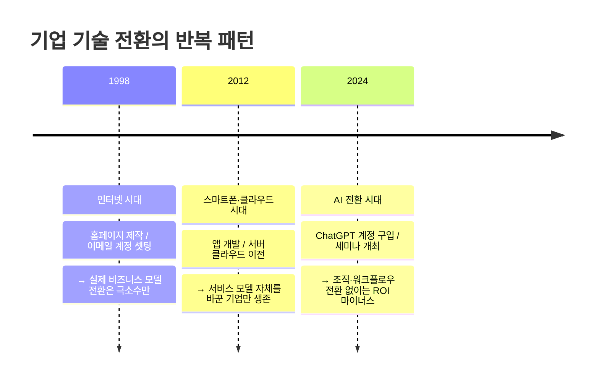
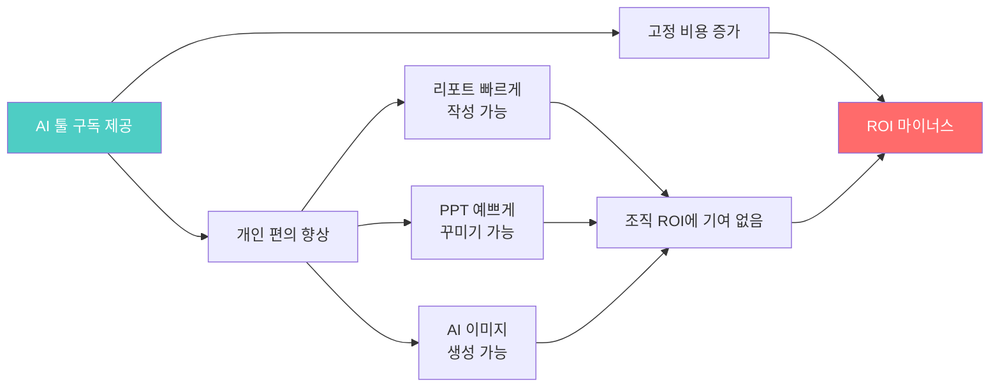
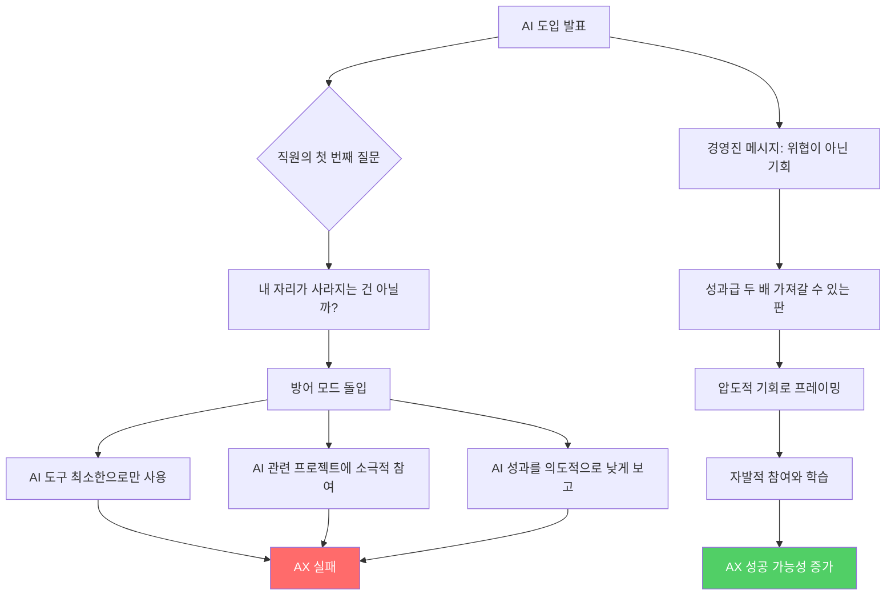
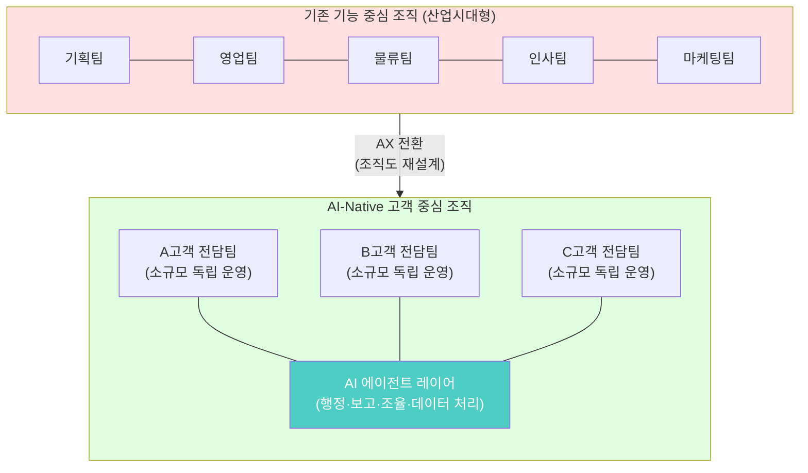
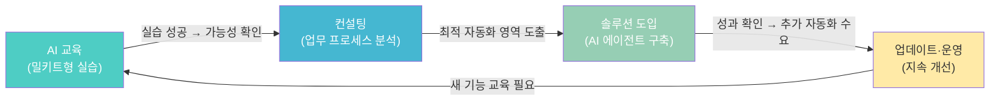
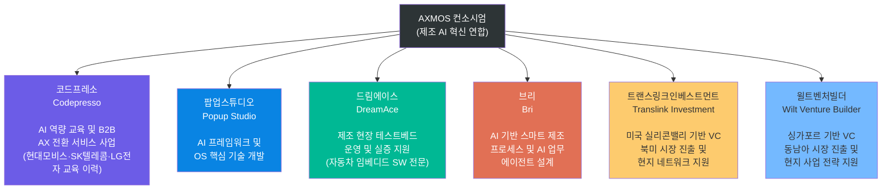
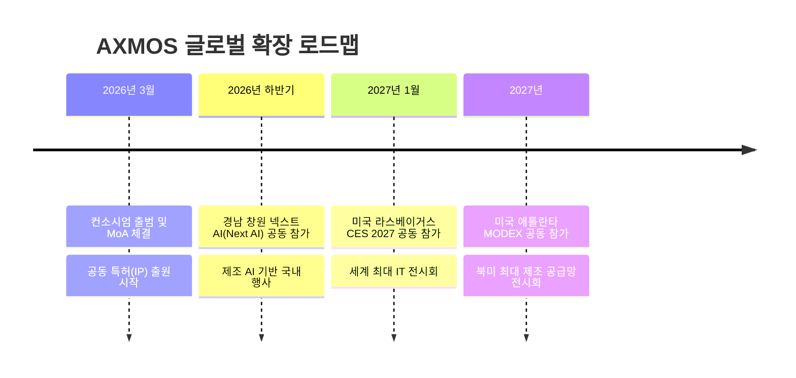
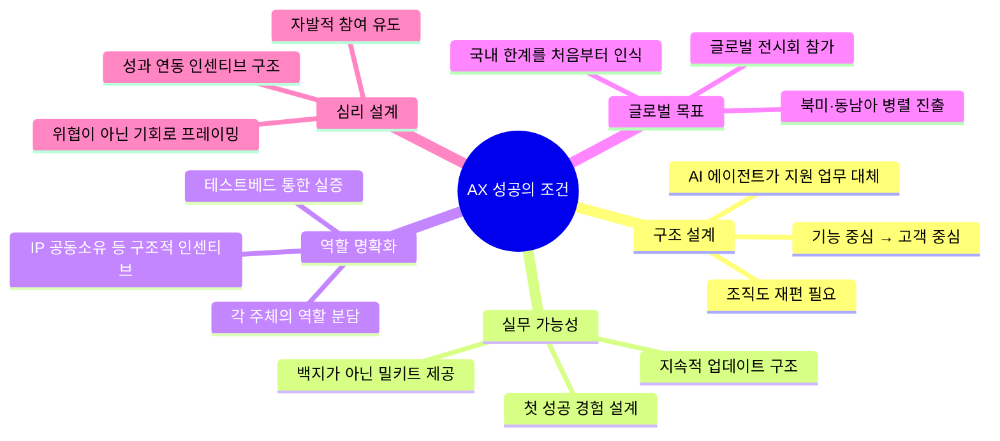

> 출처 1: [업계 현장 AX 실태 분석](https://www.facebook.com/share/1JVbaDGxKu/) (Facebook 소셜 포스트, 2026)
>
> 출처 2: 매일경제 — [AI 스타트업·VC 뭉쳤다…코드프레소 등 참여 제조 AI 연합 'AXMOS' 출범](https://www.mk.co.kr/news/business/11997626) (2026.03.25)
>
> 보조 참조: 베타뉴스, 헬로티, SK AX Insight, 전자신문 AX & 하이퍼오토메이션 코리아 2026-Spring 등

---

## 목차

1. [두 이야기가 연결되는 이유](#1-두-이야기가-연결되는-이유)
2. [AI 어덥션의 함정 — 도구만 줘서는 아무것도 안 바뀐다](#2-ai-어덥션의-함정)
   - 2.1 [반복되는 역사: 인터넷·스마트폰·AI](#21-반복되는-역사)
   - 2.2 [챗GPT 계정 사줬더니 ROI가 마이너스로 꽂힌 이유](#22-챗gpt-계정-사줬더니-roi가-마이너스인-이유)
   - 2.3 [직원이 방어 모드에 돌입하는 심리적 구조](#23-직원이-방어-모드에-돌입하는-심리적-구조)
3. [진짜 AX는 조직도를 뜯어고치는 데서 시작된다](#3-진짜-ax는-조직도를-뜯어고치는-데서-시작된다)
   - 3.1 [기능 중심 조직의 한계](#31-기능-중심-조직의-한계)
   - 3.2 [AI-Native 조직 구조의 특징](#32-ai-native-조직-구조의-특징)
   - 3.3 [AI 에이전트가 대체하는 지원 업무의 실체](#33-ai-에이전트가-대체하는-지원-업무의-실체)
4. [밀키트 전략 — 비개발자도 자동화할 수 있는 현실적 접근](#4-밀키트-전략)
   - 4.1 [왜 백지상태로는 아무도 안 움직이는가](#41-왜-백지상태로는-아무도-안-움직이는가)
   - 4.2 [AX 플라이휠: 교육 → 컨설팅 → 솔루션 → 교육](#42-ax-플라이휠)
5. [AXMOS 컨소시엄 — 제조 AI 전환의 구조적 해법을 연합으로](#5-axmos-컨소시엄)
   - 5.1 [출범 배경과 목적](#51-출범-배경과-목적)
   - 5.2 [6개 참여사와 각자의 역할](#52-6개-참여사와-각자의-역할)
   - 5.3 [MoA 구조 — 단순 협업이 아닌 IP 공동소유](#53-moa-구조)
   - 5.4 [글로벌 확장 로드맵](#54-글로벌-확장-로드맵)
6. [두 이야기를 관통하는 핵심 통찰](#6-두-이야기를-관통하는-핵심-통찰)
7. [결론 — AX 시대의 생존 조건](#7-결론)

---

## 1. 두 이야기가 연결되는 이유

이 문서는 서로 다른 형식의 두 가지 콘텐츠를 함께 다룬다. 하나는 업계 현장에서 목격한 기업 AI 전환(AX) 실태를 솔직하게 정리한 소셜 포스트이고, 다른 하나는 제조 AI 컨소시엄 'AXMOS'의 출범을 보도한 뉴스 기사다.

얼핏 보면 두 콘텐츠는 성격이 다르다. 하나는 문제 진단이고 하나는 해법 사례다. 그러나 이 둘은 사실 동전의 양면을 이루고 있다. 소셜 포스트는 "왜 대부분의 기업이 AI를 도입해도 성과를 못 내는가"를 적나라하게 해부하고, AXMOS 출범 소식은 "그렇다면 어떤 구조로 접근해야 진짜 전환이 가능한가"에 대한 시장의 실질적인 응답이기 때문이다.

두 콘텐츠를 함께 읽는 것이 훨씬 더 입체적인 이해를 준다. 병원 진단서만 있으면 병이 무엇인지는 알지만 치료법이 없고, 처방전만 있으면 왜 이 약이 필요한지 맥락을 이해하기 어렵다. 이 문서는 그 두 가지를 연결하는 역할을 한다.

---

## 2. AI 어덥션의 함정

### 2.1 반복되는 역사

AI를 둘러싼 지금의 혼란은 사실 기술 역사에서 이미 두 번씩이나 반복된 패턴이다. 1990년대 후반 인터넷이 처음 대중화됐을 때, 수많은 기업이 앞다퉈 홈페이지를 만들고 임직원에게 이메일 계정을 셋팅해줬다. 그것으로 충분하다고 생각했다. 그러나 진짜 경쟁력은 웹 기반으로 비즈니스 모델 자체를 바꾼 기업들한테서 나왔다.

2010년대 스마트폰 앱 개발과 클라우드 전환이 유행했을 때도 마찬가지였다. 앱 하나 만들고 클라우드로 서버를 이전하는 것이 마치 디지털 전환의 완성인 양 여겨졌다. 그러나 실질적으로 앞서간 기업들은 앱과 클라우드를 통해 고객과의 관계 방식 자체를, 그리고 내부 일하는 방식 자체를 근본부터 바꿨다.

그리고 지금 AI 전환이 세 번째 물결로 밀려오고 있는데, 조직이 빠지는 함정은 놀랍도록 동일하다. 기술 트렌드만 바뀌었을 뿐, "도구를 쥐여주면 알아서 되겠지"라는 안일한 인식이 반복되고 있다.

### 2.2 챗GPT 계정 사줬더니 ROI가 마이너스인 이유

현장에서 가장 흔하게 목격되는 패턴은 이렇다. 대표가 조찬 모임이나 유튜브에서 AI 트렌드를 잔뜩 접하고 돌아온다. 출근 직후 실무진을 호출해 "앞으로 이렇게 된다더라, 우리는 뭐 하고 있냐"고 묻는다. 부랴부랴 AI 전문가라고 불리는 외부 강사를 섭외해 세미나를 한 번 열고, 전 직원에게 챗GPT나 Claude 같은 AI 유료 계정을 하나씩 제공한다. 대표 입장에서는 나름대로 큰 결단이자 투자다.

그런데 한 달이 지나고 결과를 보면 처참하다. 직원들은 리포트를 조금 빨리 쓰거나, 파워포인트를 예쁘게 꾸미거나, AI로 생성한 이미지를 붙여넣으며 "나 AI 잘 쓴다"고 생각하는 수준에 그친다. 회사의 고정 비용은 수십, 수백 명 단위로 매달 꼬박꼬박 나가는데, 정작 직원들이 예전보다 덜 일하는 기이한 현상이 나타난다. 직원은 편해졌는데 회사 ROI는 마이너스로 향하는 역설이다.

이 현상의 본질은 명확하다. 개인 생산성 향상과 조직 전체의 성과 개선은 완전히 다른 차원의 문제다. AI 툴이 개인의 작업 속도를 높여줄 수 있지만, 그 결과물이 조직의 핵심 성과 지표(KPI)로 연결되는 워크플로우 자체가 바뀌지 않으면 비용만 늘어날 뿐이다.

이것이 바로 포스트에서 지적하는 **'AI 어덥션(Adoption)'과 'AI 전환(Transformation)'의 차이**다. 어덥션은 기존 방식에 AI 도구를 얹는 것이고, 전환은 일하는 방식과 조직 구조 자체를 바꾸는 것이다. 대부분의 기업이 어덥션을 전환이라고 착각하고 있다는 점이 이 포스트의 핵심 진단이다.

### 2.3 직원이 방어 모드에 돌입하는 심리적 구조

새로운 기술이나 변화를 조직에 도입하면, 조직은 본능적으로 방어벽을 친다. 이것은 특정 직원의 문제가 아니라 조직 심리학에서 오래전부터 연구된 정상적인 반응이다. 그런데 AI의 경우 이 방어 반응이 유독 강하게 나타나는 이유가 있다.

AI가 도입되면 직원 스스로가 "내 일이 대체되는 것 아닐까"라는 위협감을 느끼기 때문이다. 이 순간 AI는 동료가 아니라 적이 된다. 실제 현장에서는 AI 관련 프로젝트를 제안할 때 "AI"라는 단어를 아예 빼고 "컴퓨터 프로그래밍으로 반복 업무를 돕는 프로그램"이라고 표현해야 직원들의 방어벽이 낮아진다는 사례도 보고된다. 그 정도로 현장의 공포심은 실재한다.

이 문제를 해결하는 열쇠는 기술이 아니라 경영진의 설계에 있다. "당신을 자르려는 게 아니라, AI를 통해 더 큰 성과를 내고 성과급을 두 배로 가져가게 해주겠다"는 명확하고 구체적인 판을 깔아줘야 한다. 위협이 아니라 압도적인 기회로 느끼게 만드는 것, 이것은 순전히 경영진의 설계 역량 문제다.

---

## 3. 진짜 AX는 조직도를 뜯어고치는 데서 시작된다

### 3.1 기능 중심 조직의 한계

대부분의 한국 기업 조직도를 떠올려보면 공통된 구조가 있다. 기획팀, 영업팀, 물류팀, 인사팀, 마케팅팀과 같이 기능별로 부서가 나뉘어 있다. 이것은 산업화 시대, 즉 1980~90년대에 최적화된 구조다. 당시에는 각 기능의 전문성을 높이고 분업을 명확히 하는 것이 효율의 핵심이었다.

그러나 AI-native 시대에 이 구조는 여러 면에서 한계를 드러낸다. 첫째, 고객 중심의 빠른 대응이 어렵다. 고객 하나의 문제를 해결하려면 영업팀, 물류팀, 고객서비스팀을 거쳐야 하는데, 이 과정에서 시간이 지연되고 책임 소재가 불명확해진다. 둘째, AI가 가장 잘 대체할 수 있는 영역인 반복적·규칙적 지원 업무(행정, 보고, 조율)가 각 부서에 분산되어 있어 일괄적으로 자동화하기 어렵다. 셋째, 기능 사일로(silo) 안에서 데이터가 단절되어 AI가 학습하고 활용할 수 있는 통합 컨텍스트를 형성하기 어렵다.

DX(디지털 전환)가 이미 어느 정도 진행된 기업들에서 오히려 AX가 더디게 진행되는 역설이 여기서 비롯된다. "우리는 이미 클라우드도 쓰고 SaaS도 쓰고 재택근무도 하니까 충분하다"는 착각이 AX를 기존 체계 위에 양념처럼 얹는 것으로 마무리하게 만든다.

### 3.2 AI-Native 조직 구조의 특징

AI-native 기업들은 기능 중심 부서 구조를 버리고, 고객 중심 팀 구조로 전환한다. 'A고객 전담팀', 'B세그먼트 전담팀'처럼 특정 고객이나 고객군을 중심으로 소규모 팀을 구성하고, 각 팀이 마치 작은 사내 벤처처럼 독립적으로 움직인다.

이 구조에서 예전의 기획팀, 물류팀, 인사팀이 수행하던 지원 업무와 행정 업무는 AI 에이전트가 담당한다. 팀 내 인원은 고객 가치 창출에 집중하고, 반복·규칙적인 조율 업무는 에이전트가 처리하는 구조다. 이론적으로 이 구조가 복제 가능해지면, 고객만 확보하는 것으로 사업을 10배 확장할 수 있다.

### 3.3 AI 에이전트가 대체하는 지원 업무의 실체

AI 에이전트가 조직 내 지원 업무를 대체한다고 할 때, 구체적으로 어떤 일을 의미하는지 살펴볼 필요가 있다.

현재 기업 내에서 AI 에이전트가 실질적으로 처리하기 시작한 업무들은 크게 네 가지 유형으로 분류된다. 첫째는 지식형 과제로, RAG(검색 증강 생성)와 LLM을 결합해 사내 규정 검색이나 전문 지식 질의응답을 처리한다. 둘째는 자동화형 과제로, 지능형 RPA(로봇 프로세스 자동화) 기반의 에이전틱 오토메이션이 정형화된 반복 작업을 처리한다. 셋째는 프로세스형 과제로, AI·로직·사람의 역할을 명확히 구분한 워크플로우 조율 업무다. 넷째는 분석형 과제로, 대량의 데이터를 실시간으로 모니터링하고 패턴을 포착해 의사결정을 지원한다.

2026년 1월 기준 국내 시장 분석에 따르면, 에이전틱 AI 시장은 2025년 약 2조원에서 2030년 약 61조원으로 연평균 175% 성장이 전망된다. 생성형 AI가 주로 개인 생산성 향상에 기여했다면, 에이전틱 AI는 조직 전체의 업무 프로세스를 혁신하는 것이 핵심 차별점이다. 실제 사례에서는 에이전틱 AI 도입 후 공정 다운타임이 40% 감소하고 불량률이 15% 개선되는 등 측정 가능한 성과가 보고되고 있다.

---

## 4. 밀키트 전략

### 4.1 왜 백지상태로는 아무도 안 움직이는가

기업에서 AI 전환 교육을 진행할 때 가장 흔하게 맞닥뜨리는 장벽이 있다. 바로 "뭘 만들어보라"고 했을 때 아무도 움직이지 않는다는 것이다. 이것은 능력의 문제가 아니라 구조의 문제다.

비개발자에게 백지상태에서 자동화 도구를 만들어보라고 하면, 무엇을 목표로 삼아야 할지 모르고, 실패했을 때 어디서 문제가 생겼는지도 파악하기 어렵다. 결국 시도 자체를 포기한다. 이것이 대부분의 AI 교육이 세미나 이후 현업 적용으로 이어지지 못하는 이유다.

이 문제를 해결하는 현실적인 접근이 바로 **'밀키트 전략'** 이다. 요리 밀키트가 손질된 재료와 레시피를 함께 제공해서 요리를 경험한 적 없는 사람도 완성품을 만들어낼 수 있게 하듯이, AI 전환 교육에서도 전문가가 미리 구조를 잡아놓은 '반제품'을 직원에게 제공하는 것이다. 직원은 기본 템플릿을 따라 조립한 뒤, 자신의 업무에 맞는 기능을 하나씩 추가(토핑)해가면서 맞춤화를 경험한다.

이 방식의 핵심은 **첫 번째 성공 경험**을 만들어주는 것이다. 비개발자가 직접 어떤 반복 업무를 자동화해본 경험이 쌓이면, 그 이후부터는 직원들끼리 서로 공유하고 학습하는 선순환이 시작된다. 억지로 시키는 교육이 아니라, 스스로 써보고 싶어지는 경험이 조직 전체를 진화시킨다.

그리고 "바이브코딩이 이겁니다"라고 개념 설명으로 끝나는 것은 교육이 아니다. 실습해서 직접 쓸 수 있는 결과물이 나오는 것까지를 교육의 완성으로 봐야 한다.

### 4.2 AX 플라이휠

AI 전환 지원 사업자 입장에서도 단순히 한 번 교육하고 끝내는 방식은 지속 가능하지 않다. 마치 윈도우 업데이트처럼, 업무 환경과 AI 모델이 발전함에 따라 자동으로 기능이 추가되고 업데이트되는 구조를 갖춰야 한다.

이것이 제대로 설계될 때 비로소 AX 플라이휠이 돌아간다. 교육이 컨설팅 수요를 만들고, 컨설팅이 솔루션 도입으로 이어지고, 솔루션이 다시 추가 교육 수요를 만들면서 전체 규모가 지속적으로 커진다. 이 플라이휠이 없으면 AX 사업자는 "이번 달 수주, 다음 달 수주"를 반복하는 SI(시스템통합) 신세를 벗어나지 못한다.

---

## 5. AXMOS 컨소시엄

### 5.1 출범 배경과 목적

2026년 3월 23일, AI 스타트업과 벤처캐피털(VC) 전문 투자사가 모여 제조 AI 컨소시엄 '**엑스모스(AXMOS)**'를 공식 출범시켰다. AXMOS는 'AX(AI Transformation)'와 'Manufacturing OS(제조 운영체제)'의 합성어로, 한국 제조업의 경쟁력에 AI 운영체제(AI OS) 개념을 적용해 업무 프로세스를 혁신하는 것을 핵심 목표로 내세웠다.

이 컨소시엄이 주목을 받는 이유는 단순한 협력 선언이 아니라는 점에 있다. 참여사들은 협업으로 창출하는 지적재산권(IP)을 공동 소유하는 구조의 '합의각서(MoA, Memorandum of Agreement)'를 체결했다. 각 기업이 보유한 기술과 현장 경험을 결합해 실질적인 성과를 만들어내는 것이 목적이며, 공동 특허 출원과 북미·동남아 시장 진출을 구체적인 이정표로 제시했다.

이 움직임은 AI 산업 경쟁이 빅테크 중심으로 재편되는 상황에서, 중소·스타트업 연합 형태로 속도와 실용성을 확보하려는 전략적 대응으로 해석된다. 또한 제조 현장에 AI를 실질적으로 적용하려는 정부 정책 기조(2026년 스마트 제조혁신 지원사업 등)와도 방향성을 같이한다.

코드프레소 이동훈 대표는 출범 당시 "AI 대변혁 시대에 속도와 효율을 기반으로 기업 업무 프로세스를 혁신할 것"이라며 "전문 역량을 가진 스타트업과의 실무적 연대를 통해 글로벌 성과 창출에 주력하겠다"고 밝혔다.

### 5.2 6개 참여사와 각자의 역할

AXMOS 컨소시엄에는 총 6개 기업이 참여하며, 각자가 맡은 역할이 명확하게 분담되어 있다. 이 분업 구조 자체가 소셜 포스트에서 언급한 "조직 재설계"의 실제 사례라고 볼 수 있다.

**코드프레소(Codepresso)** 는 AI 교육·역량 평가 분야의 전문기업으로, 현대모비스, SK텔레콤, LG전자 등 국내 주요 대기업 인력의 디지털 역량 내재화 교육을 통해 B2B 시장에서의 AX 전환 사업 경험을 축적해왔다. 컨소시엄에서는 AI 교육과 B2B 네트워크를 기반으로 한 기업 대상 AI 전환 서비스를 총괄한다. 코드프레소는 누적 100여 개 기업이 자사 플랫폼을 채택했으며, AXMOS 컨소시엄 외에도 여성 개발자 커뮤니티 Women in Vibe Coding(WIV), 가족·비개발자 단위 원데이 특강 시리즈 등 AI 역량 표준화 확산을 위한 다양한 프로그램을 운영 중이다. 본사는 서울에 있으며 룩셈부르크, 베트남, 싱가포르에서도 현지 사업을 전개하고 있다.

**팝업스튜디오(Popup Studio)** 는 AI 프레임워크 및 AI OS(운영체제) 핵심 기술 개발을 담당한다. AXMOS 컨소시엄의 기술 기반을 설계하는 역할로, 제조 현장에 실질적으로 적용할 수 있는 AI 운영 플랫폼을 구축하는 것이 핵심 임무다.

**드림에이스(DreamAce)** 는 자동차 임베디드 소프트웨어 전문기업으로, 르노 등 글로벌 파트너와의 오픈이노베이션 경험을 보유하고 있다. 컨소시엄 내에서는 제조 현장 테스트베드 운영과 실증을 담당한다. 실험실에서 설계된 AI 솔루션이 실제 제조 현장에서도 동작하는지 검증하는 실증 파트너 역할이다.

**브리(Bri)** 는 AI 기반 스마트 제조 프로세스 설계와 AI 업무 에이전트 설계를 맡는다. 제조 현장의 워크플로우를 분석해 어떤 업무를 AI 에이전트로 대체할 수 있는지, 그 설계와 구조를 만드는 역할이다.

**트랜스링크인베스트먼트(Translink Investment)** 는 미국 실리콘밸리에서 활동하는 VC로, 북미 시장 진출 전략과 현지 네트워크 구축을 지원한다.

**윌트벤처빌더(Wilt Venture Builder)** 는 싱가포르 기반 VC이자 벤처 스튜디오로, 동남아 시장에서 DX·AX 컨설팅 플랫폼을 운영하고 있다. 드림에이스와는 AXMOS 이전부터 한국 스타트업의 글로벌 진출 지원을 위한 MOU를 체결한 파트너 관계다.

### 5.3 MoA 구조

AXMOS 컨소시엄이 체결한 합의각서(MoA)에서 특히 주목할 부분은 **지적재산권 공동소유** 조항이다. 단순한 협력 선언이나 정보 공유 수준을 넘어, 컨소시엄 참여를 통해 창출되는 특허 등 IP를 공동으로 소유하는 구조를 명시했다.

이 구조는 참여사들의 기여를 단순한 서비스 제공이 아니라 공동 투자로 격상시키며, 성과를 함께 나누는 인센티브 구조를 만든다. 또한 공동 특허 출원은 글로벌 시장 진출 시 기술적 경쟁 우위를 확보하는 기반이 된다.

참여사들이 제조 현장 중심의 실무형 AI 적용을 핵심 원칙으로 내세운 것도 주목할 만하다. 이론이나 데모 수준이 아니라, 실제 제조 현장에서 바로 적용 가능한 솔루션을 개발하겠다는 원칙이다. 드림에이스가 테스트베드와 실증을 전담하는 역할을 맡은 것이 이 원칙의 구조적 구현이다.

### 5.4 글로벌 확장 로드맵

AXMOS 컨소시엄이 밝힌 향후 일정은 다음과 같다.

시장 확장의 우선 타깃은 **북미와 동남아**다. 트랜스링크인베스트먼트가 북미 현지 네트워크를, 윌트벤처빌더가 동남아 현지 네트워크를 각각 담당하며 시장 진입을 병렬로 추진한다. 글로벌 전시회 공동 참가를 통해 해외 고객에게 K-제조 AI 솔루션을 선보이는 전략이다.

---

## 6. 두 이야기를 관통하는 핵심 통찰

소셜 포스트의 현장 진단과 AXMOS 출범 소식은 표면적으로 다른 형식이지만, 같은 문제의식과 같은 방향을 가리키고 있다. 두 이야기를 겹쳐 읽으면 몇 가지 핵심 통찰이 도출된다.

**첫째, AI 전환의 실패는 기술의 문제가 아니라 구조의 문제다.** 소셜 포스트는 "최신 툴만 결제해준다고 끝나는 마법은 없다"고 단언한다. AXMOS 컨소시엄이 '제조 AI OS'라는 개념, 즉 기술 위에 올려지는 운영 체계와 조직 구조를 핵심으로 내세운 것이 같은 맥락이다. 제조 현장에 AI 툴을 얹는 것이 아니라, AI가 작동하는 방식 자체를 설계하겠다는 선언이다.

**둘째, 역할 분담이 명확해야 스케일이 가능하다.** 소셜 포스트는 AI-native 조직이 고객 중심 팀으로 구조를 재편하고 각 팀의 역할을 명확히 할 때 10배 성장이 가능하다고 설명한다. AXMOS가 참여사 6곳의 역할을 교육·기술·실증·에이전트설계·북미투자·동남아투자로 정확히 나눈 것이 이 원칙의 실제 구현이다.

**셋째, 실무 적용 가능성이 핵심이다.** 소셜 포스트는 "실습해서 직접 쓸 수 있게 만드는 것까지가 교육"이라고 강조한다. AXMOS는 "제조 현장에 바로 적용 가능한 AI 역량을 결집하겠다"는 목표를 명시했고, 드림에이스가 테스트베드와 실증을 전담하는 구조가 이를 뒷받침한다.

**넷째, 글로벌 시장을 처음부터 목표로 삼아야 한다.** 소셜 포스트는 AI 전환이 제대로 이루어질 때 사업의 10배 확장이 가능하다고 말하는데, 이것은 국내 시장만 바라봐서는 실현되기 어렵다. AXMOS가 출범 초기부터 북미와 동남아 두 시장을 동시에 타깃으로 삼고 글로벌 전시회 참가를 계획한 것은 이런 관점과 일치한다.

---

## 7. 결론

AI 전환은 지금 한국 기업들이 마주한 가장 중요한 경영 과제 중 하나가 되었다. 그러나 이 포스트와 기사가 공통적으로 보여주는 것처럼, 대부분의 기업이 아직 도구 도입 수준에 머물러 있고 진짜 전환은 시작조차 못 하고 있다.

소셜 포스트의 저자가 지적하는 대로, 문제는 AI 도구의 품질이나 가격이 아니다. 핵심은 조직이 일하는 방식 자체를 바꾸는 것, 조직도를 재설계하는 것, 직원들이 위협을 느끼지 않고 기회로 느끼도록 경영진이 판을 설계하는 것이다. 그리고 교육은 세미나로 끝나지 않고, 직원이 실제 쓸 수 있는 것을 만들어보는 경험으로 완성된다.

AXMOS 컨소시엄은 그러한 구조적 전환을 제조업 현장에서 실현하려는 시도의 하나다. AI 교육, 기술 개발, 현장 실증, 에이전트 설계, 글로벌 투자 네트워크가 하나의 연합 구조 안에서 역할을 나눠 실행하는 모델이다. 성과는 앞으로의 글로벌 전시회 참가와 공동 특허 실적으로 검증될 것이다.

기술 트렌드는 계속해서 바뀔 것이다. 그러나 조직이 변화를 소화하는 방식, 즉 도구를 쥐여주는 것을 넘어 일하는 방식과 구조 자체를 바꾸는 것이 성공과 실패를 가르는 분기점이라는 통찰은, 인터넷·스마트폰·AI를 거치며 반복적으로 확인되고 있다.

---

## 참고 자료

| 출처 | 내용 | 날짜 |
|------|------|------|
| Facebook 소셜 포스트 | 기업 현장 AX 실태 — AI 어덥션의 함정 | 2026 |
| 매일경제 | AI 스타트업·VC 뭉쳤다…AXMOS 출범 | 2026.03.25 |
| 베타뉴스 | K-제조에 AI 심는다…6개사 엑스모스 컨소시엄 출범 | 2026.03.23 |
| 구닝모닝베트남미디어 | 코드프레소 AI 역량 평가 플랫폼 및 AXMOS | 2026.05.29 |
| SK AX Insight | 2026 에이전틱 AI 트렌드 분석 | 2026.01.16 |
| 전자신문 | AX & 하이퍼오토메이션 코리아 2026-Spring | 2026.05.07 |
| 헬로티 | AI 산업 에이전틱 AI·AX로 이동 | 2026.05 |

---
