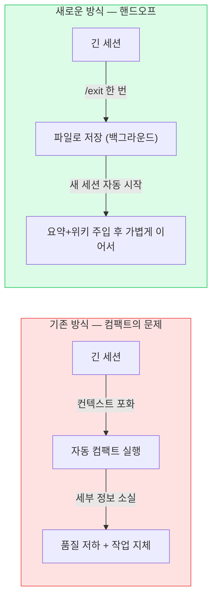
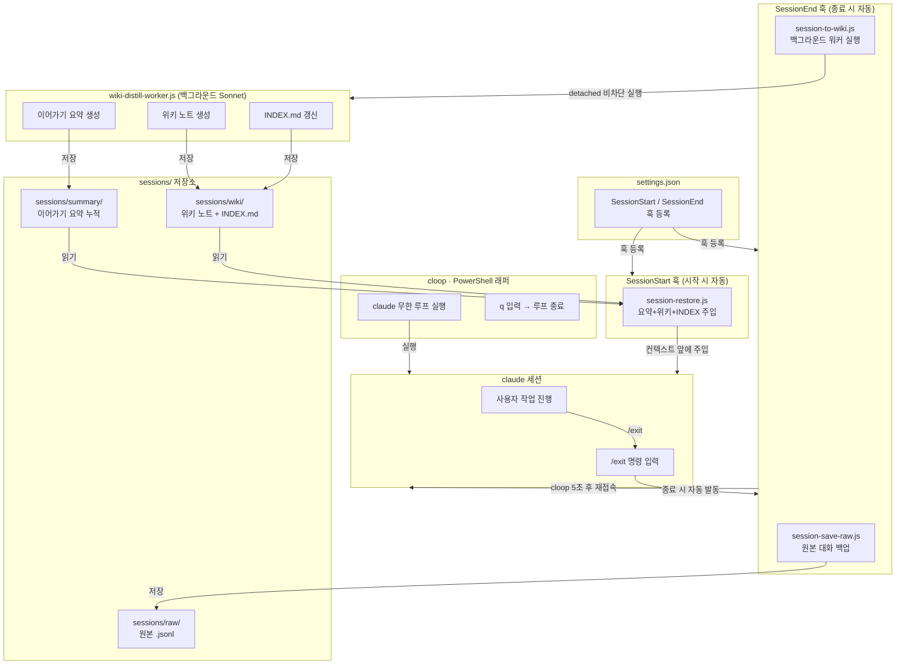
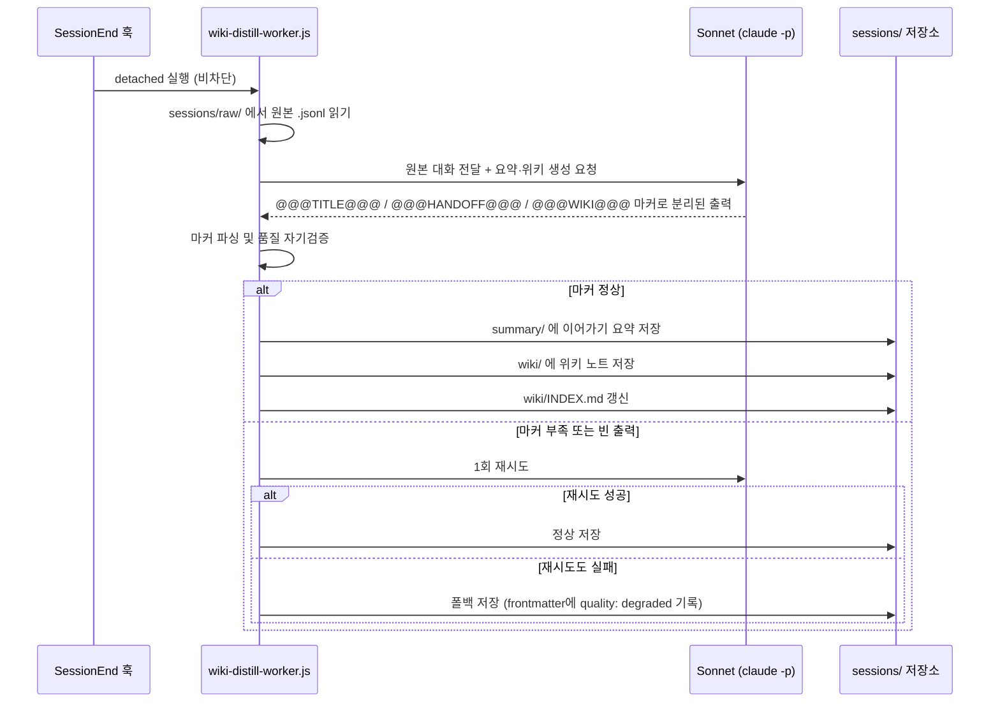
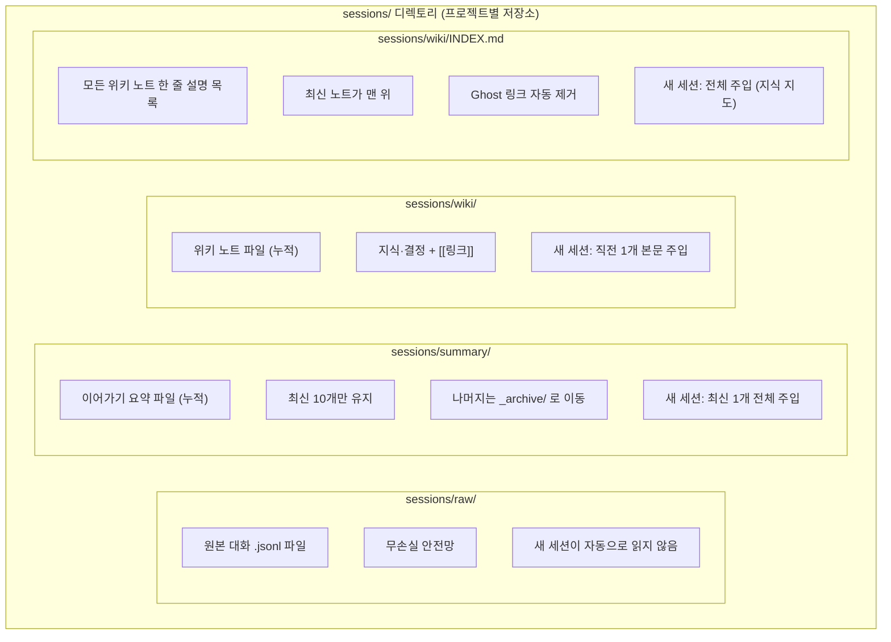
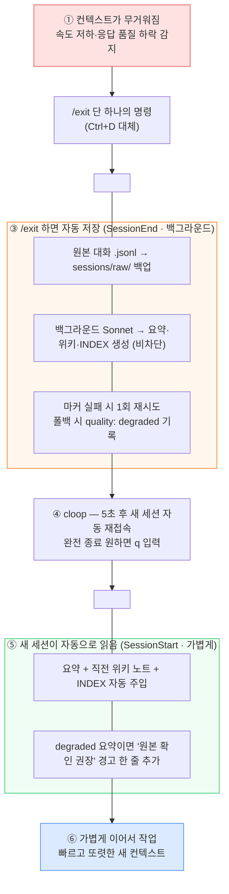
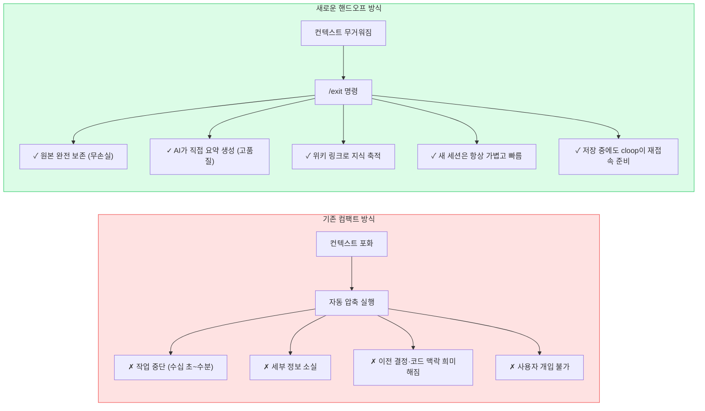

> **원문 출처**: GitHub `SUNWOONGKYU/claude-code-session-handoff`  
> **참고 링크**: https://github.com/SUNWOONGKYU/claude-code-session-handoff  
> **작성 일자**: 2026-06-08


## 관련글

[**AI랑 길게 작업하면, 왜 갈수록 느려지고 멍청해질까?**](https://www.facebook.com/share/p/1YcKFiJj8M/)

---

## 1. 왜 이 시스템이 필요한가 — 문제의 본질

Claude Code를 비롯한 LLM 기반 코딩 에이전트를 장시간 사용해본 사람이라면 공통적으로 경험하는 현상이 있다. 처음에는 빠르고 날카롭게 동작하던 AI가 작업이 길어질수록 점점 느려지고, 이전에 이미 이야기했던 내용을 다시 설명해달라고 하거나, 엉뚱한 방향으로 작업을 진행하는 상황이 발생한다. 마치 작업 중에 AI의 집중력이 희미해지는 느낌이다.

이 현상의 기술적 원인은 **컨텍스트 창(context window)의 포화**에 있다. LLM은 한 번의 대화에서 처리할 수 있는 텍스트의 양에 물리적인 한계가 있으며, 이 한계를 토큰(token)이라는 단위로 측정한다. Claude Code 역시 마찬가지로, 세션이 길어지면 누적된 대화 내용이 컨텍스트 창을 가득 채우게 된다. 그 순간 Claude Code는 자동으로 **컴팩트(compact)** 라고 불리는 대화 압축 동작을 수행한다.

컴팩트가 실행되면 이전 대화 내용이 요약·압축되어 토큰 공간을 확보한다. 그런데 이 과정에는 두 가지 치명적인 문제가 있다. 첫째, 압축 작업 자체가 AI를 한동안 멈추게 만들어 **작업 지체**를 일으킨다. 둘째, 압축 과정에서 이전 대화의 중요한 세부 사항이 소실되어 **품질 손해**가 발생한다. 압축 후의 Claude는 맥락을 제대로 이어받지 못한 채 작업을 이어가게 되고, 이것이 앞서 언급한 "멍해지는" 현상의 실체다.

이 시스템의 핵심 발상은 다음과 같다. "어차피 컨텍스트가 가득 차면 기억이 손실되는데, 그냥 압축하는 대신 **기억을 파일로 꼼꼼히 저장해두고 가볍게 새 세션으로 다시 시작**하면 어떨까?" 즉, AI에게 **외장 하드 같은 장기 기억 장치**를 붙여주는 개념이다.



---

## 2. 시스템 전체 아키텍처 — 관계도 해설

이 시스템은 크게 세 개의 축으로 구성된다. 첫 번째는 사용자가 Claude Code를 실행하고 자동 재접속을 담당하는 **cloop·PowerShell 래퍼**, 두 번째는 세션이 끝나고 시작될 때 자동으로 작동하는 **SessionEnd·SessionStart 훅**, 세 번째는 실제 데이터가 쌓이는 **sessions/ 저장소**다.



각 구성 요소를 하나씩 풀어서 설명하면 다음과 같다.

### 2-1. cloop · PowerShell 래퍼

`cloop`은 사용자가 PowerShell 프로필에 등록하는 함수다. 내부적으로 `claude --dangerously-skip-permissions` 명령을 무한 루프로 실행한다. 즉, claude 세션이 `/exit`으로 종료되면 자동으로 5초 후 새 claude 세션을 다시 시작한다. 사용자가 완전히 작업을 마치고 싶을 때는 세션 종료 후 5초 안에 `q`를 입력하면 루프가 멈춘다. 이 래퍼 덕분에 사용자는 매번 `claude` 명령을 다시 입력할 필요 없이, 자연스럽게 이어지는 흐름으로 작업할 수 있다.

### 2-2. settings.json 훅 등록

Claude Code는 `~/.claude/settings.json` 파일에서 다양한 라이프사이클 훅(hook)을 등록할 수 있다. 이 시스템은 `SessionStart`와 `SessionEnd` 두 가지 이벤트를 활용한다. `settings.example.json`의 구조는 다음과 같다.

```json
{
  "hooks": {
    "SessionStart": [
      {
        "hooks": [
          { "type": "command", "command": "node \"c:/Users/<사용자명>/.claude/hooks/session-restore.js\"" }
        ]
      }
    ],
    "SessionEnd": [
      {
        "hooks": [
          { "type": "command", "command": "node \"c:/Users/<사용자명>/.claude/hooks/session-save-raw.js\"" },
          { "type": "command", "command": "node \"c:/Users/<사용자명>/.claude/hooks/session-to-wiki.js\"" }
        ]
      }
    ]
  }
}
```

이 설정에 의해 세션이 끝날 때와 시작될 때 지정한 Node.js 스크립트가 자동으로 실행된다.

---

## 3. SessionEnd 훅 — 세션 종료 시 자동 저장

`SessionEnd`는 Claude Code 세션이 종료될 때 발동하는 이벤트다. `/exit`, `/quit`, Ctrl+D 등 어떤 방법으로 세션을 닫든 반드시 실행된다. 훅 스크립트는 입력값으로 `transcript_path`(이번 세션의 대화 전체가 담긴 `.jsonl` 파일 경로), `cwd`(현재 작업 디렉토리), `reason`(종료 이유)을 받는다.

Claude Code 공식 사양상 `SessionEnd`는 세션 종료 자체를 막을 수 없다. 즉, 이 훅은 오직 "저장" 목적으로만 사용된다. 이 시스템에서 `SessionEnd`는 두 개의 스크립트를 순서대로 실행한다.

**① session-save-raw.js**: 이번 세션의 전체 대화 원본(`transcript_path`에 있는 `.jsonl` 파일)을 `sessions/raw/` 디렉토리로 복사한다. 이 파일은 어떤 가공도 없는 순수 원본이기 때문에 무손실 안전망 역할을 한다. 나중에 무언가 잘못되었을 때 원본을 열어보면 대화 전체를 그대로 다시 확인할 수 있다.

**② session-to-wiki.js**: `wiki-distill-worker.js`를 **detached(비분리) 모드**로 백그라운드 실행한다. "비차단(non-blocking)"이라는 표현이 핵심이다. 세션이 이미 종료된 상태에서 무거운 AI 호출 작업이 일어나도, cloop의 5초 타이머를 지연시키지 않는다. 즉, 사용자 입장에서는 `/exit` 후 5초 뒤에 새 세션이 뜨는 동안, 뒤에서 조용히 요약과 위키 작업이 진행된다.

---

## 4. wiki-distill-worker.js — 백그라운드 Sonnet의 역할

이 워커가 이 시스템의 핵심 두뇌다. `session-to-wiki.js`에 의해 백그라운드에서 실행되며, Claude API의 `claude -p` 명령으로 **Sonnet 모델을 한 번만 호출**하여 세 가지 산출물을 한꺼번에 생성한다.



### Sonnet 출력 분리 방식

워커는 Sonnet이 출력하는 결과물을 세 개의 섹션으로 구분하기 위해 **줄 단위 마커**를 사용한다.

- `@@@TITLE@@@` — 이 위키 노트의 제목
- `@@@HANDOFF@@@` — 이어가기 요약 내용 (한 일 / 현재 상태 / 다음 할 일)
- `@@@WIKI@@@` — 위키 노트 본문 (지식·결정 + `[[링크]]`)

Sonnet의 출력에서 이 세 마커를 기준으로 파싱하여 각각을 별도 파일로 저장한다.

### 품질 자기검증 메커니즘

단순히 AI를 한 번 호출하고 끝내는 것이 아니라, 생성된 결과물의 품질을 자동으로 검증한다. 마커가 부족하거나, 출력 내용이 비어 있거나, 타임아웃이 발생하면 **1회 한해서 재시도**한다. 재시도 후에도 문제가 해결되지 않으면 폴백 처리를 하되, 생성된 파일의 YAML frontmatter에 `quality: degraded`를 기록한다. 이렇게 되면 이후 `session-restore.js`가 이 파일을 읽을 때 "원본 확인 권장"이라는 경고 문구를 새 세션의 컨텍스트에 함께 포함시킨다.

### 재귀 호출 방지

워커가 `claude -p`를 호출하여 새 Claude 세션을 만들면, 그 세션에도 `SessionEnd` 훅이 등록되어 있다. 이 경우 워커가 만든 세션이 끝날 때 또 워커를 실행하는 무한 재귀가 발생할 수 있다. 이를 막기 위해 워커 실행 환경 변수로 `CLAUDE_WIKI_CHILD=1`을 설정하고, 훅 스크립트 쪽에서 이 환경 변수가 있으면 아무것도 하지 않고 종료(no-op)하도록 처리한다.

### 워커 인증 방식

워커는 `claude -p`를 호출할 때 API 키 대신 **OAuth 인증**을 사용한다. `ANTHROPIC_API_KEY` 환경 변수가 잘못 설정되어 있으면 인증 실패가 발생하므로, 이 변수를 제거하고 OAuth 방식으로 동작하도록 설계되어 있다.

---

## 5. 세 종류의 노트 — sessions/ 저장소 구조

이 시스템이 관리하는 데이터는 `sessions/` 디렉토리 아래 네 가지 폴더로 구분된다.



각 노트 유형을 더 구체적으로 설명하면 다음과 같다.

**이어가기 요약 (sessions/summary/)**: 세 개의 섹션으로 구성된 작업 인수인계 문서다. `## 한 일` 섹션에는 이번 세션에서 완료한 작업들이 기록되고, `## 현재 상태` 섹션에는 현재 코드·파일·프로젝트가 어떤 상태인지가 기록되며, `## 다음 할 일` 섹션에는 다음 세션에서 이어야 할 작업 목록이 기록된다. 이 요약 파일은 세션마다 새 파일로 누적되며, 최신 10개만 `summary/` 폴더에 유지하고 나머지는 `summary/_archive/`로 이동한다(삭제가 아니므로 완전한 이력이 보존된다). 새 세션이 시작될 때는 이 요약 중 **가장 최신 1개 전체**가 컨텍스트에 주입된다.

**위키 노트 (sessions/wiki/)**: 단순한 인수인계 요약을 넘어선 **지식 축적 레이어**다. 위키 노트는 해당 세션에서 발생한 중요한 기술적 결정, 발견한 지식, 산출물, 아키텍처 선택 등을 주제별로 정리하되 `[[노트명]]` 형식의 위키 링크로 서로 연결한다. 이는 옵시디언(Obsidian) 같은 개인 지식 관리 도구에서 바로 활용할 수 있는 형식이다. 위키 노트는 세션마다 쌓여가며, 새 세션이 시작될 때는 **직전 세션의 위키 노트 본문 전체**만 주입된다. 오래된 위키 노트들은 INDEX를 통해 필요할 때만 꺼내볼 수 있다.

**INDEX.md (sessions/wiki/INDEX.md)**: 모든 위키 노트의 한 줄 설명 목록이다. 형식은 `- [[노트명]] — 한 줄 설명` 이며, 최신 노트가 맨 위에 위치한다. 새 세션이 시작될 때 이 INDEX 전체가 주입되어, AI가 어떤 지식 노트들이 존재하는지 파악할 수 있게 된다. 특정 내용이 필요하면 AI가 INDEX에서 관련 노트를 찾아 해당 파일을 직접 열어볼 수 있다. INDEX 갱신 시에는 실제 파일이 존재하지 않는 `[[ghost 링크]]`를 자동으로 제거하고, 반대로 INDEX에 등록되지 않은 고아 파일(orphan)은 로그에만 기록한다.

---

## 6. SessionStart 훅 — 새 세션에 기억 주입

`SessionStart`는 Claude Code 세션이 시작될 때 발동하는 이벤트다. 이 훅의 특별한 점은 **stdout으로 출력하는 내용이 새 세션의 컨텍스트 맨 앞에 자동으로 주입**된다는 것이다. 이것은 `SessionStart` 훅만이 가진 고유한 능력이다.

이 시스템에서 `SessionStart`는 `session-restore.js`를 실행하며, 이 스크립트는 다음 세 가지 내용을 순서대로 출력한다.

1. `sessions/summary/` 에서 **가장 최신 이어가기 요약 전체**
2. `sessions/wiki/` 에서 **직전 세션 위키 노트 본문 전체**
3. `sessions/wiki/INDEX.md` 전체

이 세 가지가 새 세션의 컨텍스트 맨 앞에 자동으로 붙어서 Claude에게 제공된다. 따라서 새 세션에서 Claude는 이전 세션에서 무슨 일이 있었는지, 어떤 지식이 축적되어 있는지, 지금 어떤 상태인지를 즉시 파악하고 작업을 이어갈 수 있다.

단, `/clear` 명령으로 시작한 세션(`source=clear`)의 경우 주입을 생략한다. 완전히 새로운 시작이 필요한 경우를 위한 예외 처리다.

---

## 7. 전체 시간 순서 흐름도

사용자가 실제로 경험하는 흐름을 시간 순서대로 정리하면 다음과 같다.



이 흐름에서 사용자가 직접 해야 하는 일은 딱 하나다. 작업이 무거워졌다고 느끼는 순간 `/exit`를 입력하는 것. 그 이후의 모든 과정(원본 저장, 요약 생성, 위키 작성, INDEX 갱신, 새 세션 시작, 컨텍스트 주입)은 전부 자동으로 처리된다.

---

## 8. 컴팩트 방식과 핸드오프 방식의 비교

두 방식의 차이를 구체적으로 비교하면 다음과 같다.



| 항목 | 기존 컴팩트 방식 | 핸드오프 방식 |
|------|-----------------|--------------|
| **사용자 명령** | 없음 (자동, 통제 불가) | `/exit` 하나 |
| **작업 지체** | 있음 (압축 시간) | 거의 없음 (비차단 백그라운드) |
| **기억 품질** | 손실 있음 (압축 손실) | 무손실 원본 + AI 요약 |
| **이전 대화 원본** | 점진적 소실 | 영구 보존 (sessions/raw/) |
| **지식 축적** | 없음 | 위키 노트 + INDEX |
| **토큰 효율** | 압축된 기억이 계속 차지 | 새 세션은 요약+인덱스만 사용 |
| **비용** | Sonnet 호출 없음 | 세션 종료 시 Sonnet 1회 |
| **Obsidian 연동** | 없음 | [[링크]] 형식으로 즉시 활용 |

---

## 9. 설치 방법 (Windows + PowerShell 기준)

이 시스템을 설치하려면 세 가지 단계가 필요하다. Node.js가 PATH에 등록되어 있어야 하고, Claude Code의 OAuth 로그인이 완료된 상태여야 한다.

### 단계 1: 훅 스크립트 배치

GitHub에서 저장소를 클론하거나 다운로드한 뒤, `hooks/` 폴더 안의 4개 파일을 아래 경로로 복사한다.

```
C:\Users\<사용자명>\.claude\hooks\
```

복사할 파일은 다음과 같다.
- `session-save-raw.js` — 원본 대화 백업 스크립트
- `session-restore.js` — 세션 시작 시 컨텍스트 주입 스크립트
- `session-to-wiki.js` — 백그라운드 워커 실행 스크립트
- `wiki-distill-worker.js` — 실제 요약·위키 생성을 담당하는 Sonnet 호출 스크립트

### 단계 2: settings.json 병합

`~/.claude/settings.json` 파일을 열어 `settings.example.json`에 있는 `SessionStart`와 `SessionEnd` 훅 블록을 기존 `hooks` 섹션에 병합한다. 경로의 `<사용자명>` 부분을 실제 Windows 사용자명으로 교체해야 한다.

### 단계 3: cloop 함수 등록

`powershell/profile-snippet.ps1` 파일 안에 있는 `cloop` 함수를 PowerShell 프로필 파일에 추가한다. PowerShell 프로필 파일의 경로는 `$PROFILE.CurrentUserAllHosts`로 확인할 수 있다. 추가 후 새 PowerShell 창을 열면 바로 `cloop` 명령을 사용할 수 있다.

### macOS / Linux 사용자

`cloop` 함수를 bash/zsh 함수로 변환하고, 훅 경로를 `~/.claude/hooks/`로 바꾸면 동일하게 동작한다. 핵심 로직은 운영체제에 무관하다.

---

## 10. 실제 사용 사이클

일상적인 사용 패턴은 매우 단순하다.

```
1) 프로젝트 폴더에서  cloop  을 실행해 작업 시작
2) Claude Code와 함께 작업을 진행하다가 무거워지면  /exit  입력
   → 원본·요약·위키·INDEX가 자동으로 백그라운드에서 저장됨
3) 5초 후 새 세션이 자동으로 시작되고 이전 작업 맥락이 자동 주입됨
   → 바로 이어서 작업 가능
4) 작업을 완전히 끝내고 싶을 때는 /exit 후 5초 안에  q  입력
```

이 흐름의 핵심은 인간의 규율(discipline)에 의존하지 않는다는 점이다. 세션 저장을 잊어버려도, 요약을 작성하지 않아도, 다음 세션에서 "지난번에 뭐 하고 있었지?"라고 물어볼 필요도 없다. 모든 것이 `/exit` 하나로 처리된다.

---

## 11. 기술적 한계와 유의 사항

이 시스템에는 몇 가지 실용적인 제약이 있다.

**컴팩트 경고 타이밍 문제**: Claude Code의 UI에 "컨텍스트가 가득 찼습니다"라는 경고가 뜨는 순간 자체는 훅으로 잡을 수 없다. 이 경고는 순수 UI 이벤트로, 현재 Claude Code 훅 시스템이 지원하는 이벤트 유형(PreToolUse, PostToolUse, SessionStart, SessionEnd 등)에 포함되지 않는다. 따라서 이 시스템의 트리거는 여전히 사용자가 `/exit`을 직접 치는 행동이다. 무거워지는 것을 느끼는 순간 적극적으로 `/exit`을 활용하는 습관이 중요하다.

**훅의 AI 직접 요약 불가 문제**: 훅 스크립트 자체는 셸 스크립트(또는 Node.js 스크립트)다. 셸 스크립트가 직접 AI를 호출하여 자연어 요약을 생성할 수는 없다. 이것이 별도의 `wiki-distill-worker.js`가 Sonnet을 호출하는 구조가 필요한 이유다.

**요약 보존 정책**: `sessions/summary/` 폴더는 최신 10개 파일만 유지하고, 나머지는 `summary/_archive/`로 자동 이동된다. 파일을 삭제하는 것이 아니라 아카이브하는 방식이므로 이력은 보존되지만, 공간 관리가 필요하다면 `SUMMARY_KEEP` 상수를 조정할 수 있다.

**INDEX 정합성 관리**: INDEX.md 갱신 시 실제 파일이 존재하지 않는 `[[ghost 링크]]`는 자동으로 제거된다. 단, 파일 자체를 삭제하거나 수정하지는 않고, INDEX에서만 해당 항목을 지운다. 반대로 INDEX에 등록되지 않은 고아 파일은 로그에만 기록되므로 주기적으로 확인이 필요할 수 있다.

**추가 API 비용**: 세션 종료마다 Sonnet이 1회 호출되므로 API 사용량이 발생한다. 이 비용은 세션의 길이에 비례한다.

---

## 12. 이 시스템이 주는 효과

이 시스템을 제대로 활용하면 네 가지 실질적인 이점을 얻을 수 있다.

**⚡ 속도와 명료함 유지**: 새 세션은 항상 가벼운 컨텍스트로 시작하므로 AI의 응답 속도와 품질이 일정하게 유지된다. 긴 세션에서 발생하는 "멍해지는" 현상이 사라진다.

**💾 기억의 영구 보존**: 요약, 위키 노트, 원본 대화 모두 파일로 저장되므로 어떤 정보도 소실되지 않는다. 몇 주 전 세션에서 논의한 내용도 `sessions/raw/`의 원본을 열면 그대로 확인할 수 있다.

**💰 토큰 비용 최소화**: 새 세션은 요약 한 개, 직전 위키 노트 한 개, INDEX 전체만 읽는다. 이는 수백 수천 개의 대화 메시지를 통째로 들고 다니는 것보다 훨씬 효율적이다.

**🧠 지식의 그물망 형성**: 위키 노트는 `[[링크]]` 형식으로 서로 연결되어 시간이 지날수록 옵시디언에서 지식 그물망(knowledge graph)을 형성한다. 단순히 대화를 기억하는 수준을 넘어, 프로젝트에 대한 구조화된 지식 베이스가 자동으로 만들어진다.

---

## 13. 더 넓은 맥락 — Claude Code 세션 핸드오프 생태계

이 시스템은 Claude Code에서 세션 연속성을 다루는 여러 오픈소스 프로젝트 중 하나다. 관련 커뮤니티에는 유사한 문제를 다양한 방식으로 해결하는 프로젝트들이 존재한다.

`Sonovore/claude-code-handoff`는 `UserPromptSubmit`, `PostToolUse`, `PreCompact` 등 더 많은 이벤트를 활용하여 매 메시지마다 live handoff를 업데이트하는 방식을 택한다. `shihchengwei-lab/claude-code-session-kit`은 컨텍스트 사용량이 40%·60%·70%에 도달할 때 경고를 띄우고 70%에서 강제 핸드오프를 실행하는 방식을 사용한다. `nlashinsky/claude-code-handoff`는 핸드오프 데이터를 JSON 구조로 저장하여 "결정의 이유"를 명시적으로 보존하는 데 집중한다.

`SUNWOONGKYU/claude-code-session-handoff`가 이 생태계에서 차별화되는 지점은 **위키 노트와 INDEX를 통한 지식 축적 레이어**다. 단순히 다음 세션에 이어가기 위한 인수인계를 넘어, 프로젝트의 지식 베이스를 Obsidian 호환 형식으로 자동 구축한다는 점이 독특하다.

또한 Claude Code 공식 이슈 트래커에는 "컨텍스트 임계치 훅(context threshold hooks)"에 대한 기능 요청이 올라와 있다. 컨텍스트가 70%에 도달하는 순간 자동으로 핸드오프를 실행할 수 있는 시스템 수준 지원이 요청되었으며, 이는 이 분야의 커뮤니티 요구가 얼마나 강한지를 보여준다.

---

## 14. 한 줄 요약

이 시스템의 본질은 단 한 문장으로 요약된다. **"AI에게 외장 하드 같은 장기 기억을 붙여줌으로써, 컨텍스트 포화로 인한 속도 저하와 품질 손해를 '저장 후 가벼운 재시작'으로 대체한다."** 명령은 `/exit` 하나, 나머지는 전부 자동이다.

---

## 참고 자료

- GitHub 저장소: https://github.com/SUNWOONGKYU/claude-code-session-handoff
- 세션훅 설명서: https://github.com/SUNWOONGKYU/claude-code-session-handoff/blob/main/docs/세션훅_설명서.md
- Claude Code 공식 훅 문서: https://code.claude.com/docs/en/hooks.md
- 관련 이슈 (Context threshold hooks): https://github.com/anthropics/claude-code/issues/24320

---

*작성 일자: 2026-06-08*
