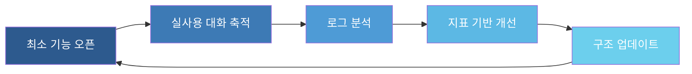
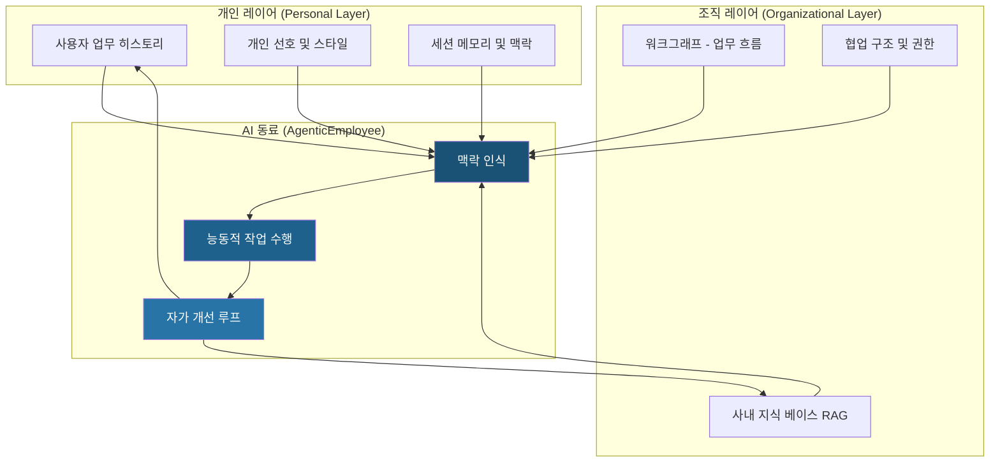
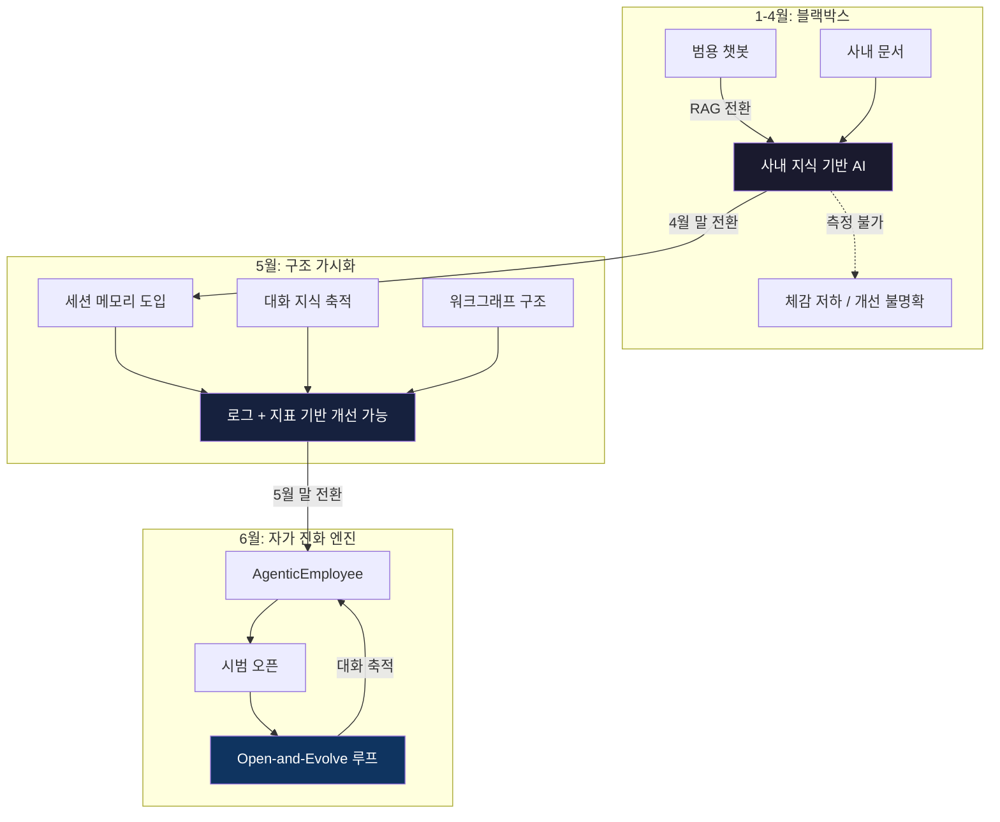

> **원문 출처:** [Facebook 포스트 단상](https://www.facebook.com/share/p/1BiHuGN49z/) + NotebookLM 인포그래픽  
> **주제:** 사내 AI 에이전트(AgenticEmployee)를 구축하며 겪은 6개월간의 설계 철학과 기술적 진화 과정  
> **핵심 메시지:** AI는 완성된 상태로 배포되는 것이 아니라, 대화 속에서 열리고 로그 속에서 배우고 지표 속에서 진화하는 구조여야 한다.

---

## 1. 이 글이 말하고자 하는 것

이 포스트는 한 개발자 혹은 AI 빌더가 약 6개월에 걸쳐 사내 AI 에이전트 시스템을 구축하면서 겪은 경험과 통찰을 솔직하게 풀어낸 회고록이자 설계 철학 선언문이다. 단순한 기술 설명이 아니라, "에이전트를 만든다는 것이 무엇인지"를 몸으로 배우는 과정이 담겨 있다.

글의 구조는 크게 두 부분으로 나뉜다. 하나는 1월부터 6월까지 시스템이 어떻게 변화했는지를 보여주는 **기술적 궤적**이고, 다른 하나는 그 과정에서 얻은 **설계 철학과 인사이트**다. 인포그래픽(NotebookLM으로 제작된 것으로 보이는 다이어그램)은 이 변화의 3단계를 시각적으로 요약하고 있다.

---

## 2. 3단계 기술 진화 상세 해설

### 2-1단계: 1~4월 — "블랙박스" 시기

```
기존 챗봇 → 사내 지식 기반(RAG) 전환
(체감 저하 시기, 측정 부재)
```

처음 시작은 단순했다. 범용 챗봇(ChatGPT 같은 일반 대화형 AI)을 사내 지식과 연결하는 것이었다. 이 과정에서 선택한 기술이 **RAG(Retrieval-Augmented Generation, 검색 증강 생성)** 다.

**RAG가 무엇인가?**

RAG는 LLM(대형 언어 모델)이 답변을 생성할 때, 자신의 학습 데이터만 쓰는 것이 아니라 외부 문서 데이터베이스에서 관련 정보를 실시간으로 검색해서 가져온 뒤 그것을 참고해 답변하는 구조다. 예를 들어, "우리 회사 휴가 규정이 어떻게 돼?"라고 물으면 AI가 사내 HR 문서에서 해당 내용을 찾아 답변한다.

**왜 블랙박스였는가?**

이 시기가 "블랙박스"로 표현된 이유는 두 가지다.

첫째, **무엇이 일어나는지 내부를 볼 수 없었다.** AI가 어떤 문서를 찾아서 왜 그런 답변을 내놓는지 추적하기 어려웠다. 시스템은 작동하고 있었지만 왜 잘 작동하는지, 왜 실패하는지 알 수 없었다.

둘째, **측정 지표가 없었다.** "이 시스템이 지난주보다 좋아졌는가?"를 판단할 수단이 없었다. 그냥 써보고 "좋은 것 같기도 하고..."라는 체감에만 의존해야 했다. 체감은 사람마다 다르고, 시간이 지나면 흐려진다. 개선이 이루어지고 있는지조차 알 수 없는 상태였다.

포스트에서는 이 시기를 "뜬구름 잡는 일을 하는 것 같았다"고 표현한다. 겉으로는 멈춰 있는 시스템처럼 보였지만, 안에서는 구조를 찾고 있었다.

---

### 2-2단계: 5월 — "구조가 보이기 시작한" 시기

```
세션 메모리 / 대화 지식 / 워크그래프 구조 도입
(로그와 지표 기반 개선 가능 상태 도달)
```

5월에는 세 가지 핵심 구조가 도입된다.

**① 세션 메모리 (Session Memory)**

일반 챗봇은 매 대화를 독립적으로 처리한다. 오늘 나눈 대화를 내일은 기억하지 못한다. 세션 메모리는 이 문제를 해결하는 장치다. 대화 중에 나눈 내용, 사용자의 요구사항, 진행 중인 작업의 맥락을 저장해두고 이후 대화에서 참조할 수 있게 한다.

예를 들어 "지난번에 말한 그 보고서 계속 작업해줘"라고 했을 때, 세션 메모리가 없으면 AI는 "어떤 보고서요?"라고 묻는다. 세션 메모리가 있으면 자연스럽게 이어서 작업을 계속할 수 있다.

**② 대화 지식 (Conversational Knowledge)**

대화를 통해 지식이 축적되는 구조다. 단순히 대화를 저장하는 것에서 나아가, 대화 속에서 유용한 정보를 추출해 지식 베이스에 반영한다. 사용자가 "우리 팀은 화요일에 항상 회의해"라고 말하면 그것이 나중에 일정 관련 질문에 참고될 수 있는 지식으로 누적된다.

**③ 워크그래프 구조 (Workgraph Structure)**

워크그래프는 작업(Task)들 사이의 관계와 의존성을 그래프 형태로 표현하는 구조다. "A 작업이 끝나야 B 작업을 시작할 수 있고, C와 D는 병렬로 진행할 수 있다"는 식의 흐름을 에이전트가 인식하고 관리할 수 있게 한다.

이 세 가지가 갖춰지자 비로소 **측정이 가능**해졌다. 로그가 쌓이고, 지표를 만들 수 있고, "이번 주에 무엇이 나아졌는지"를 객관적으로 확인할 수 있게 되었다. 이것이 바로 개선의 전제조건이다. 측정할 수 없으면 개선할 수 없다.

---

### 2-3단계: 6월 (현재) — "자가 진화 엔진"

```
AgenticEmployee 환경 진입
시범 오픈 시작
```

6월에는 시스템이 **AgenticEmployee** 환경으로 진입한다. 이제 단순한 Q&A 도구가 아니라, 사용자의 일과 맥락을 함께 따라가는 **AI 동료**에 가까워진다.

인포그래픽에서 이 단계를 표현하는 다이어그램이 의미심장하다. 닫힌 검은 박스에서, 내부 구조가 살짝 보이는 반투명한 박스를 거쳐, 노드와 엣지가 복잡하게 연결된 투명한 네트워크 구조로 변화한다. 시스템이 "열렸다"는 것, 그리고 내부가 살아 움직이는 복잡한 연결망이 되었다는 것을 시각적으로 보여준다.

**"시범 오픈"의 의미**

이 단계에서 강조하는 것은 "완벽하지 않은 상태로의 오픈"이다. 이것이 핵심 철학이다. 전통적인 소프트웨어 개발은 완성된 제품을 출시한다. 하지만 이 시스템은 **대화 속에서 계속 진화하기 때문에 완성이라는 상태가 없다.** 오픈 자체가 진화의 일부다.

---

## 3. 핵심 통찰 1 — 에이전트 성장은 제곱비례

포스트에서 가장 인상적인 통찰 중 하나는 이것이다:

> "에이전트의 성장은 정비례가 아니었다. 거의 제곱비례에 가까웠다."

이것이 무슨 뜻인지 구체적으로 풀어보자.

**정비례 성장 (잘못된 기대):** 에이전트 1개 → 기능 1개. 에이전트 2개 → 기능 2개. 에이전트가 늘어나는 만큼 기능이 선형으로 늘어날 것이라는 기대.

**실제: 제곱비례 성장 (복잡성의 폭발):** 에이전트 2개는 서로 연결될 때 1+1=2가 아니라, 두 에이전트 사이의 관계 자체가 새로운 차원을 만든다.

왜 그런가? 에이전트가 하나 추가될 때 연결되는 것이 단순히 "기능"이 아니기 때문이다.

- **기억이 연결된다:** 에이전트 A가 알고 있는 것을 에이전트 B가 참조할 수 있어야 한다. 어떤 기억을 공유하고, 어떤 기억을 분리할 것인가?
- **지식이 연결된다:** 각 에이전트가 접근하는 지식 베이스를 어떻게 정렬할 것인가?
- **권한이 연결된다:** 에이전트 A가 할 수 있는 행동을 에이전트 B는 할 수 없을 수도 있다. 이 권한 구조를 어떻게 설계할 것인가?
- **책임이 연결된다:** 에이전트 A의 실수가 에이전트 B의 작업에 영향을 미친다. 누가 어느 결과에 책임을 지는가?
- **대화, 일, 실패가 모두 연결된다.**

이 연결들은 에이전트가 늘어날수록 기하급수적으로 복잡해진다. 이것이 "배선 연결"이라는 비유가 등장하는 이유다. 단순히 전구를 하나 더 다는 것이 아니라, 전체 전기 배선 체계를 다시 설계해야 한다.

---

## 4. 핵심 통찰 2 — 질문의 전환

포스트에서 또 하나의 중요한 전환점을 이렇게 표현한다:

> "에이전트가 답을 잘하는가?"에서  
> "에이전트가 스스로 이어지고, 기억하고, 개선될 수 있는가?"로

이 질문의 변화는 단순한 표현의 차이가 아니다. 시스템 설계의 패러다임이 완전히 달라진다.

**첫 번째 질문 (성능 중심):** 답이 얼마나 정확한가, 얼마나 빠른가, 어떤 벤치마크에서 몇 점을 받는가. 이것은 AI를 **도구**로 보는 시각이다. 도구는 잘 만들어져 있어야 하고, 만들어진 이후에는 변하지 않는다.

**두 번째 질문 (진화 중심):** 이 시스템이 사용될수록 더 좋아지는가, 오늘의 대화가 내일의 응답에 반영되는가, 실패에서 스스로 배우는가. 이것은 AI를 **살아있는 동료**로 보는 시각이다.

이 전환이 일어나기까지 5개월이 걸렸다고 글쓴이는 말한다. 기술을 쌓는 시간만이 아니라, 무엇을 만들어야 하는지를 이해하는 시간이었다.

---

## 5. Open-and-Evolve 전략이란 무엇인가

인포그래픽 하단에 "핵심 요청"으로 등장하는 개념이 바로 이것이다:

> **"완벽한 상태에서의 오픈이 아닌, 대화를 통해 자체 진화하는 'Open-and-Evolve' 전략의 지속 승인"**

이 전략을 제대로 이해하려면 전통적인 소프트웨어 개발 방식과 비교해야 한다.

**전통적 방식 (Build-then-Launch):**  
개발 → 테스트 → 완성 → 출시. 출시 이후에는 버그 수정과 기능 추가만 있고, 시스템의 핵심 지식과 행동 방식은 고정된다.

**Open-and-Evolve 방식:**  
구조 설계 → 최소 기능으로 오픈 → 실사용 대화 데이터 축적 → 로그 분석 → 지표 기반 개선 → 다시 오픈. 이 루프가 끝없이 반복된다.

핵심은 "불완전하게 열어도 괜찮다"는 철학이다. 사실 AI 에이전트의 경우 이것이 불가피하기도 하다. 에이전트는 실제 사용자와의 대화를 통해서만 배울 수 있는 맥락이 있기 때문이다. 아무리 잘 설계된 테스트 환경도 실제 사용자의 예측 불가능한 질문과 요구를 완전히 시뮬레이션할 수 없다.



이 순환이 바로 "자가 진화 엔진"의 작동 원리다.

---

## 6. 최종 목적지 — 개인비서 × 워크그래프의 결합

인포그래픽의 "최종 목적지" 항목은 이렇게 쓰여 있다:

> **"개인비서 × 워크그래프의 결합 (사용자 1명당 1명의 AI 동료)"**

이것이 이 프로젝트가 궁극적으로 만들고자 하는 것이다. 두 개념을 결합하면 어떤 시스템이 되는지 살펴보자.

**개인비서 레이어:**  
특정 사용자 한 명의 업무 방식, 선호, 히스토리, 맥락을 깊이 이해하는 AI. "우리 팀장이 보고서를 어떻게 좋아하는지", "내가 어떤 업무에서 자주 막히는지", "지난 분기 어떤 프로젝트를 진행했는지"를 축적하고 있는 개인화된 지식.

**워크그래프 레이어:**  
조직의 업무 흐름, 프로젝트 구조, 사람들 사이의 작업 의존성을 이해하는 AI. "이 태스크는 저 팀의 승인이 필요하고", "이 프로세스는 저 프로세스가 끝난 뒤에 시작된다"는 조직 수준의 지식.

이 두 레이어가 결합되면, AI는 단순히 질문에 답하는 존재가 아니라 사용자의 일과 조직의 흐름을 모두 이해하고 능동적으로 함께 일하는 동료가 된다.



---

## 7. "배선 연결"이라는 비유의 깊은 의미

포스트의 마지막 문장은 이렇게 끝난다:

> "엔진을 키우기 전에, 먼저 배선을 연결해야 한다."

이 비유는 매우 정확하다. 자동차를 만들 때 엔진을 먼저 키우는 것보다 중요한 것이 있다. 엔진이 아무리 강력해도 배선이 잘못 연결되어 있으면 차는 움직이지 않는다. 오히려 더 위험할 수 있다.

AI 에이전트에서 "엔진"은 LLM 모델 자체 — GPT, Claude, Gemini 같은 거대 언어 모델이다. 이미 충분히 강력한 엔진들이 존재한다. 문제는 배선이다.

**배선이란 무엇인가?**

- 에이전트들이 어떻게 서로 정보를 주고받는가
- 메모리는 어디에 저장하고 어떻게 검색하는가
- 어떤 지식이 어떤 에이전트에게 필요한가
- 작업이 실패했을 때 어떻게 복구할 것인가
- 로그는 어떻게 쌓고, 지표는 어떻게 만들고, 개선은 어떻게 반영할 것인가

이 "배선"을 설계하고 연결하는 작업이 1월부터 6월까지 진행된 일이다. 겉으로는 아무것도 만들지 않는 것처럼 보였지만, 사실은 가장 중요한 일을 하고 있었다.

---

## 8. 산업 맥락 — 2025-2026년 AI 에이전트 트렌드와의 연결

이 포스트가 묘사하는 여정은 단순히 한 개인의 경험이 아니다. 현재 AI 산업 전체가 직면한 과제와 정확히 맞닿아 있다.

**Amazon의 A-이볼브 (A-Evolve):**  
2026년 초 아마존이 발표한 에이전트 자기 개선 인프라다. 에이전트가 문제를 해결하려 시도하고(Solve), 결과를 관찰하고(Observe), 구조를 수정하고(Evolve), 성능을 검증하고(Gate), 다시 실행하는(Reload) 5단계 루프를 통해 인간 개입 없이 지속적으로 진화한다. 이것은 포스트에서 말하는 "자가 진화 엔진"과 구조적으로 동일한 개념이다.

**AWS AgentCore Memory:**  
AWS가 선보인 에이전트 메모리 시스템은 세션 간 대화 연속성을 제공하는 구조로, 포스트의 "세션 메모리"와 "대화 지식" 개념을 대규모 인프라로 구현한 사례다.

**Dify의 MCP 네이티브 통합:**  
2026년 에이전트 생태계에서 MCP(Model Context Protocol)는 에이전트가 외부 도구와 데이터에 접근하는 표준으로 자리잡고 있다. 워크그래프와 도구 레지스트리의 연결은 이 표준을 기반으로 구현될 수 있다.

이 맥락에서 보면, 이 포스트의 저자는 대형 기업들이 수백 명의 엔지니어로 만드는 것과 구조적으로 동일한 문제를 개인 또는 소규모 팀 차원에서 직접 경험하고 있는 것이다.

---

## 9. 시스템 전체 구조 요약



---

## 10. 이 경험에서 배울 수 있는 것

이 포스트와 인포그래픽이 전달하는 핵심 교훈을 정리하면 다음과 같다.

**첫째, 측정 없이는 개선이 없다.**  
블랙박스 시기의 가장 큰 문제는 기술 부족이 아니라 측정 부재였다. 어떤 AI 시스템이든 로그를 남기고, 지표를 정의하고, 개선을 추적할 수 있는 구조를 먼저 갖춰야 한다.

**둘째, 에이전트의 복잡성은 제곱으로 증가한다.**  
에이전트를 하나씩 추가할 때마다 연결 관계의 복잡성이 선형이 아닌 기하급수적으로 늘어난다. 배선을 먼저 설계하지 않으면 엔진을 늘릴수록 오히려 시스템이 불안정해진다.

**셋째, 완성보다 진화를 설계하라.**  
AI 에이전트의 목표는 완성된 제품을 만드는 것이 아니다. 사용할수록 더 좋아지는 구조를 만드는 것이다. Open-and-Evolve 전략은 이 철학의 실천적 표현이다.

**넷째, 질문을 바꾸는 것이 가장 중요한 진보다.**  
"잘 답하는가"에서 "스스로 이어지고 개선되는가"로 질문을 바꾸기까지 5개월이 걸렸다. 기술적 전환보다 사고의 전환이 더 오래 걸리고, 더 중요하다.

**다섯째, 눈에 보이지 않는 일이 가장 중요한 일일 수 있다.**  
"이번 주의 일은 화려하지 않았다. 하지만 중요했다." 배선을 연결하는 작업은 사용자에게 즉각적으로 보이지 않는다. 하지만 그것이 없으면 아무것도 작동하지 않는다.

---

## 마치며

이 포스트는 AI 에이전트를 "만드는" 이야기가 아니라, AI 에이전트가 "무엇인지 이해하는" 이야기다. 기술 스택의 나열이 아니라 설계 철학의 변화를 담고 있다. 그리고 그 변화의 핵심은 결국 하나다.

**AI를 도구로 만들 것인가, 동료로 만들 것인가.**

동료를 만들려면 배선을 먼저 연결해야 한다. 그것이 이 6개월의 가장 중요한 교훈이다.

---

*작성일: 2026년 6월 | 참고: Facebook 원문 포스트, NotebookLM 인포그래픽, AWS 기술 블로그, AI타임스 A-이볼브 기사*
