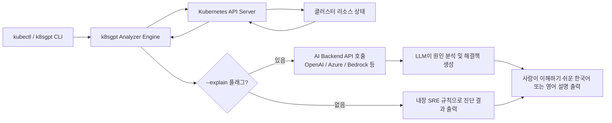
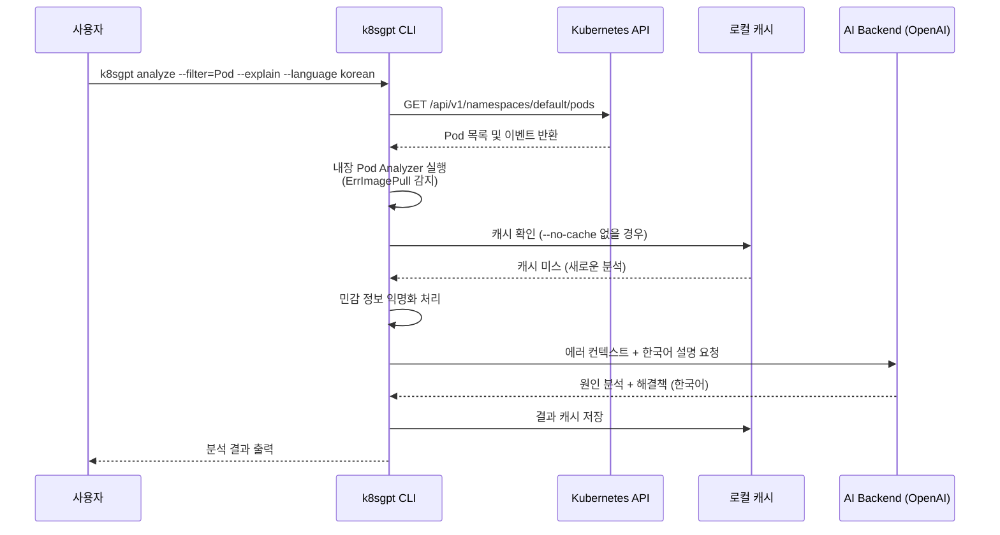
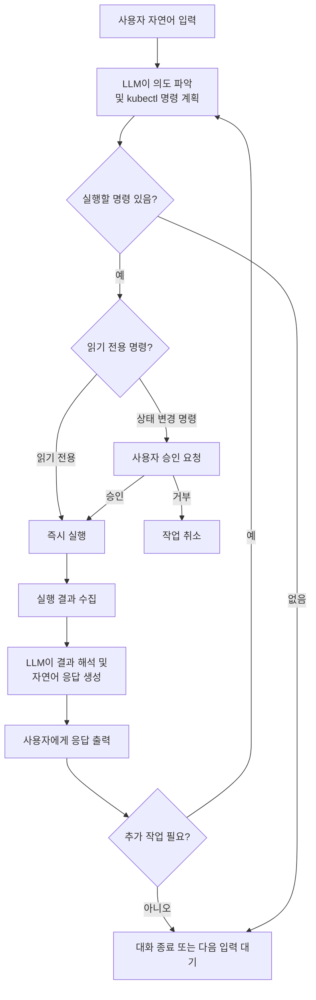
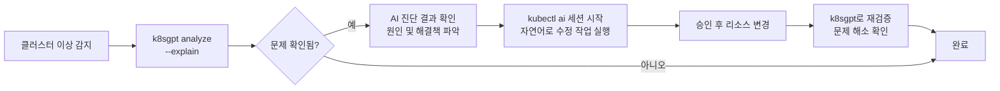
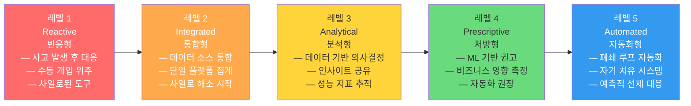
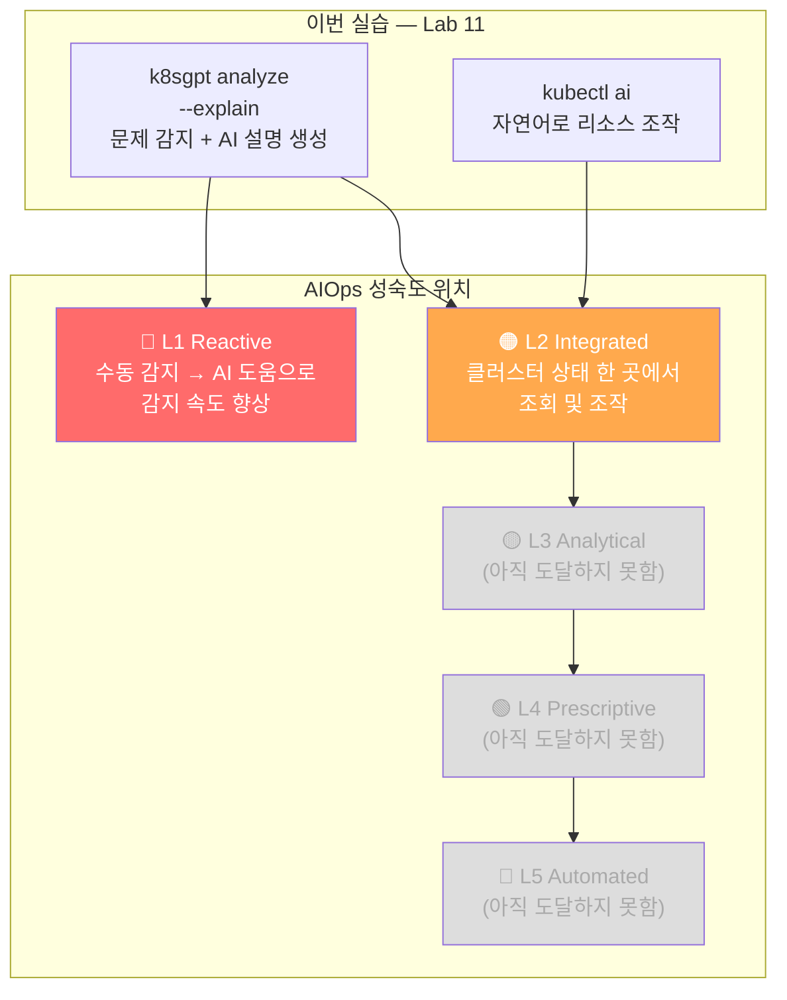
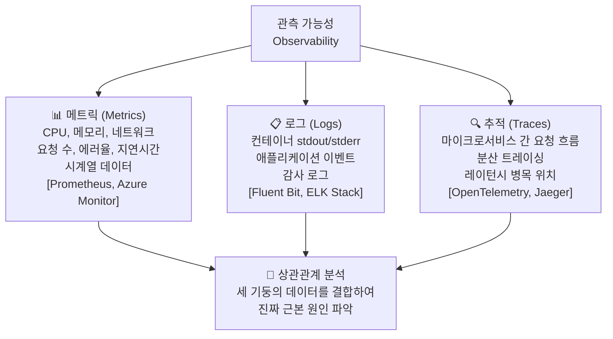
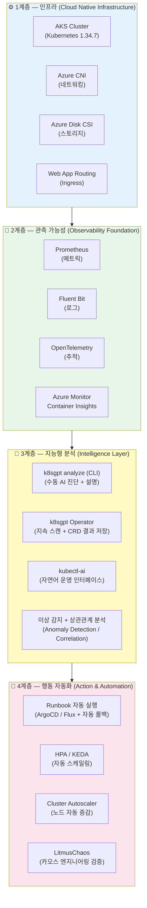
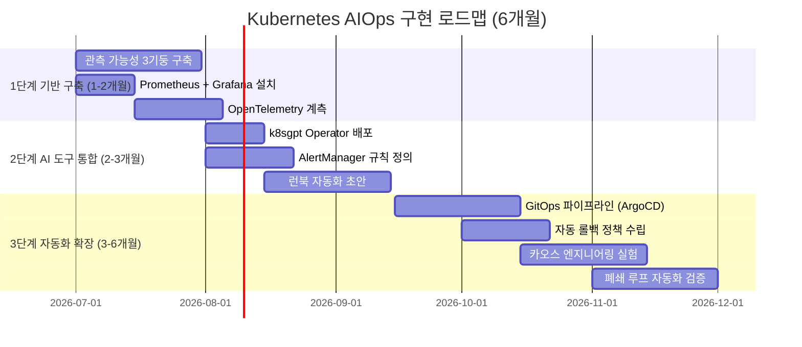

> **과정명**: MS Azure k8s 기반 AIOps 실전  
> **Lab**: 11 — AI 기반 Tools  
> **환경**: Azure Kubernetes Service (AKS) · Korea Central · Kubernetes 1.34.7  
> **작성일**: 2026-06-10  

## 실습 문서

[**Lab 11 - AI 기반 tools**](https://psedu.gitbook.io/k8s-aiops-aks/lab-11-ai-tools)

[**Kubernetes AIOps 실전.pdf**](https://drive.google.com/file/d/1aA2YTol6pRqIkpTyQs0GtZghoVqr7P0E/view?usp=sharing)

---

## 목차

1. [AIOps와 Kubernetes AI Tools 개요](#1-aiops와-kubernetes-ai-tools-개요)
2. [실습 환경 구성 정보](#2-실습-환경-구성-정보)
3. [Task 1 — k8sgpt 설치](#3-task-1--k8sgpt-설치)
4. [Task 2 — k8sgpt 모델 설정 및 클러스터 분석](#4-task-2--k8sgpt-모델-설정-및-클러스터-분석)
5. [k8sgpt 아키텍처 및 동작 원리 심화](#5-k8sgpt-아키텍처-및-동작-원리-심화)
6. [Task 3 — kubectl-ai 설치 및 대화형 사용](#6-task-3--kubectl-ai-설치-및-대화형-사용)
7. [kubectl-ai 동작 원리 심화](#7-kubectl-ai-동작-원리-심화)
8. [k8sgpt vs kubectl-ai 비교](#8-k8sgpt-vs-kubectl-ai-비교)
9. [AI 백엔드 모델 비교](#9-ai-백엔드-모델-비교)
10. [실습 중 발생한 오류 및 해결 정리](#10-실습-중-발생한-오류-및-해결-정리)
11. [구축 및 운영 Claude Code 프롬프트](#11-구축-및-운영-claude-code-프롬프트)
12. [AIOps 확장 도구 및 생태계](#12-aiops-확장-도구-및-생태계)
13. [정리 및 시사점](#13-정리-및-시사점)
14. [부록: 주요 명령어 치트시트](#부록-주요-명령어-치트시트)
15. [별첨 A — AI 기반 Tools 사용이 진정한 AIOps인가?: 심층 고찰](#별첨-a--ai-기반-tools-사용이-진정한-aiops인가-심층-고찰)

---

## 1. AIOps와 Kubernetes AI Tools 개요

### 1.1 AIOps란 무엇인가

AIOps(Artificial Intelligence for IT Operations)는 AI와 머신러닝 기술을 IT 운영 프로세스에 적용하여 모니터링, 장애 탐지, 원인 분석, 자동 복구를 지능화하는 개념이다. 전통적인 Ops 방식이 대시보드 확인, 로그 수동 분석, 경험에 의존한 트러블슈팅이었다면, AIOps는 대규모 데이터를 실시간으로 분석하고 이상 징후를 사전에 포착하며, 심지어 자동 조치까지 수행하는 방향으로 발전하고 있다.

Kubernetes 환경에서 AIOps가 특히 중요해진 이유는 클러스터 복잡도에 있다. 수백 개의 Pod, 다양한 네임스페이스, 중첩된 네트워크 정책, 동적으로 변하는 리소스 상태 — 이 모든 것을 사람이 수동으로 추적하는 것은 점점 더 어려워지고 있다. 2026년 현재, Kubernetes AIOps 생태계는 크게 두 가지 방향으로 발전했다.

첫 번째는 **진단 중심 도구**다. 클러스터를 스캔하여 문제를 자동으로 찾아내고, LLM(대형 언어 모델)의 힘을 빌려 사람이 이해할 수 있는 언어로 설명과 해결 방법을 제공한다. k8sgpt가 이 범주에 속한다.

두 번째는 **인터페이스 중심 도구**다. 복잡한 kubectl 명령어를 암기하지 않아도 자연어로 클러스터를 조작할 수 있도록 해준다. kubectl-ai가 대표적이다.

### 1.2 이번 Lab의 학습 목표

이번 Lab 11은 다음 세 가지 역량을 목표로 한다.

첫째, **k8sgpt를 설치하고 OpenAI 백엔드와 연동**하여 클러스터 문제를 자동으로 진단하는 능력을 습득한다. 단순히 에러 메시지를 확인하는 수준을 넘어서, AI가 이를 해석하고 근본 원인과 해결책을 제시하는 과정을 이해한다.

둘째, **kubectl-ai를 krew 플러그인 매니저를 통해 설치**하고, 자연어로 Kubernetes 클러스터를 운영하는 경험을 쌓는다. 대화 컨텍스트가 유지되는 상태에서 Pod 삭제, 네임스페이스 정리, 리소스 점검을 자연어로 수행한다.

셋째, 두 도구의 **철학적 차이와 사용 시나리오를 비교**하여 실무에서 적절한 상황에 각 도구를 선택하는 판단력을 기른다.

---

## 2. 실습 환경 구성 정보

이번 실습은 Azure Cloud Shell 환경에서 진행됐다. 로컬 PC가 아닌 브라우저 기반의 Cloud Shell을 사용하므로, 바이너리 설치 경로와 PATH 설정에 주의가 필요하다.

| 항목 | 값 |
|---|---|
| Azure Region | Korea Central |
| AKS 클러스터 명 | user13-aks |
| 리소스 그룹 | user13-rg |
| Kubernetes 버전 | 1.34.7 |
| 노드 VM SKU | Standard D2s v3 |
| 실행 환경 | Azure Cloud Shell (Linux x86_64) |
| k8sgpt 버전 | 0.4.33 (빌드: fb24679) |
| krew 버전 | v0.5.0 |
| kubectl-ai 출처 | GoogleCloudPlatform/kubectl-ai |
| AI 백엔드 | OpenAI gpt-4o-mini (k8sgpt), gpt-4o (kubectl-ai) |

Cloud Shell은 세션이 종료되면 `/home/user13` 디렉토리의 일부 데이터가 초기화될 수 있고, 환경 변수는 반드시 매 세션마다 재설정해야 한다. 특히 `OPENAI_API_KEY`와 같은 환경 변수는 `.bashrc`에 저장하지 않는 것이 보안상 권장되며, 세션마다 `export` 명령으로 등록해야 한다.

---

## 3. Task 1 — k8sgpt 설치

### 3.1 설치 전 배경 이해

k8sgpt는 CNCF(Cloud Native Computing Foundation)에 2023년 12월 19일 Sandbox 프로젝트로 등록된 오픈소스 도구다. "Giving Kubernetes Superpowers to Everyone"이라는 슬로건으로, Kubernetes 클러스터를 스캔하고 문제를 진단하며 트리아지(우선순위 분류)하는 기능을 제공한다. Go 언어로 작성된 단일 바이너리로 배포되어, 별도의 런타임 없이 어느 Linux 환경에서도 실행 가능하다.

CNCF Sandbox 등급은 "잠재력은 있지만 아직 성숙 단계에 진입하지 않은 초기 프로젝트"를 의미한다. 그러나 2023년 등록 이후 GitHub에서 빠르게 5,000개 이상의 스타를 받을 만큼 실무 수요가 높음이 입증됐고, 현재는 k8sgpt-ai 조직 아래 활발하게 개발되고 있다.

### 3.2 설치 절차

Azure Cloud Shell (Linux x86_64)에서의 설치는 다음 절차로 진행된다.

**① 바이너리 다운로드**

GitHub 릴리즈 페이지에서 Linux x86_64 용 압축 파일을 내려받는다.

```bash
curl -LO https://github.com/k8sgpt-ai/k8sgpt/releases/latest/download/k8sgpt_Linux_x86_64.tar.gz
```

이 명령에서 `releases`(복수형)를 `release`(단수형)로 오타 입력하면 GitHub의 리다이렉트 응답으로 9바이트짜리 HTML 오류 파일이 내려받아진다. 이 경우 `tar -xzf`를 실행하면 `gzip: stdin: not in gzip format` 오류가 발생한다. 정상적인 다운로드라면 파일 크기가 약 30MB 내외여야 한다.

**② 압축 해제**

```bash
tar -xzf k8sgpt_Linux_x86_64.tar.gz
```

압축을 해제하면 홈 디렉토리에 `k8sgpt` 실행 파일(약 112MB)이 생성된다.

**③ bin 디렉토리 생성 및 이동**

Cloud Shell 환경에서는 `~/bin` 디렉토리가 기본으로 존재하지 않는다. 따라서 이동 전 반드시 디렉토리를 먼저 생성해야 한다.

```bash
mkdir -p ~/bin
mv k8sgpt ~/bin/
```

`mkdir -p` 없이 `mv k8sgpt ~/bin/`을 실행하면 `mv: cannot move 'k8sgpt' to '/home/user13/bin/': Not a directory` 오류가 발생한다. 이는 `~/bin`이 디렉토리가 아니라 존재하지 않는 경로임을 의미한다.

**④ PATH 등록**

```bash
echo 'export PATH=$HOME/bin:$PATH' >> ~/.bashrc
source ~/.bashrc
```

이 설정 후 새 터미널에서는 `k8sgpt` 명령어를 전역으로 사용할 수 있다. 단, `source ~/.bashrc`를 실행한 현재 세션에서만 즉시 적용된다. 이미 `~/bin`에 바이너리를 복사하지 않고 홈 디렉토리에서 실행한 경우에는 `./k8sgpt` 형태로 사용해야 한다.

**⑤ 설치 확인**

```bash
k8sgpt version
# 결과: k8sgpt: 0.4.33 (fb24679), built at: unknown
```

### 3.3 실제 실습에서의 오류 정리

실제 실습에서는 두 가지 오류가 발생했다.

첫 번째는 URL 오타(`release` → `releases`)로 인한 다운로드 실패다. `gzip` 포맷 오류가 발생했을 때 단순히 재시도하면 해결된다.

두 번째는 `~/bin` 디렉토리 미생성으로 인한 `mv` 실패다. 이후 `mkdir -p ~/bin`을 실행하지 않고 `./k8sgpt` 형태로 우회하여 실습을 계속 진행했다. PATH에는 `$HOME/bin`이 등록되어 있었지만, 바이너리가 홈 디렉토리에 위치해 있어서 모든 k8sgpt 명령을 `./k8sgpt` 접두사로 실행해야 했다.

---

## 4. Task 2 — k8sgpt 모델 설정 및 클러스터 분석

### 4.1 AI 백엔드 아키텍처 개요

k8sgpt는 특정 AI 모델에 종속되지 않는 플러거블(pluggable) 백엔드 구조를 채택하고 있다. AI 없이도 내장 분석기(Analyzer)로 기본 진단이 가능하지만, `--explain` 플래그를 사용할 때에만 등록된 AI 백엔드가 호출된다. 즉, AI는 사람이 이해할 수 있는 설명과 해결책을 생성하는 역할이고, 실제 클러스터 스캔과 문제 감지는 k8sgpt 내장 분석기가 담당한다.



### 4.2 지원 백엔드 목록 확인

```bash
./k8sgpt auth list
```

실습에서 확인된 전체 백엔드 목록은 다음과 같다.

```
Default:
> openai
Active:
Unused:
> openai
> localai
> ollama
> azureopenai
> cohere
> amazonbedrock
> amazonbedrockconverse
> amazonsagemaker
> google
> noopai
> huggingface
> googlevertexai
> oci
> customrest
> ibmwatsonxai
> groq
```

총 16개의 백엔드를 지원한다. 상용 클라우드 AI(OpenAI, Azure OpenAI, Google, AWS Bedrock), 온프레미스 로컬 AI(Ollama, LocalAI), 전문 AI 서비스(Cohere, Groq, HuggingFace) 등 다양한 선택지를 제공한다. 이는 인터넷 연결이 제한된 환경이나 데이터 보안이 중요한 환경에서도 k8sgpt를 사용할 수 있음을 의미한다.

### 4.3 OpenAI 백엔드 등록

```bash
./k8sgpt auth add --backend openai --model gpt-4o-mini
# 프롬프트: Enter openai Key: (API Key 입력)
```

API Key 입력은 인터랙티브 프롬프트 방식으로 이루어지며, 입력된 키는 `~/.config/k8sgpt/k8sgpt.yaml` 파일에 저장된다. 이 파일은 평문으로 저장되므로 보안에 주의해야 한다.

실습에서는 첫 번째 등록 시 잘못된 API 키를 입력했다. 이 경우 `./k8sgpt auth remove --backends openai`로 삭제 후 재등록해야 한다. 주의할 점은 플래그가 `--backends`(복수형)이라는 점이다. `--backend`(단수형)를 사용하면 `unknown flag: --backend` 오류가 발생한다.

```bash
# 잘못된 명령 (오류 발생)
./k8sgpt auth remove --backend openai  # Error: unknown flag: --backend

# 올바른 명령
./k8sgpt auth remove --backends openai
# 결과: openai deleted from the AI backend provider list
```

### 4.4 기본 백엔드 고정

여러 백엔드를 등록한 경우, 기본으로 사용할 백엔드를 지정할 수 있다.

```bash
./k8sgpt auth default -p openai
# 결과: Default provider set to openai
```

이 설정이 없으면 매번 `--backend` 또는 `-b` 플래그로 백엔드를 명시해야 한다.

### 4.5 Broken Pod 생성

실습에서는 의도적으로 존재하지 않는 이미지(`nnnginx`)를 사용해 문제 상황을 만들었다.

```bash
kubectl run broken-pod --image=nnnginx --port=80
# 결과: pod/broken-pod created
```

Pod가 생성되면 Kubernetes는 컨테이너 이미지를 Docker Hub에서 가져오려 시도한다. `nnnginx`는 존재하지 않는 이미지이므로 `ErrImagePull` → `ImagePullBackOff` 상태가 된다. `ImagePullBackOff`는 이미지 풀 실패가 반복될 때 Kubernetes가 재시도 간격을 점진적으로 늘리는 백오프(back-off) 메커니즘이 작동 중임을 나타낸다.

### 4.6 k8sgpt로 Pod 분석 (영어)

```bash
./k8sgpt analyze --filter=Pod --namespace default --explain
```

실행하면 진행 상황이 프로그레스 바로 표시되며, 분석 완료 후 다음과 같은 결과가 출력됐다.

```
AI Provider: openai

0: Pod default/broken-pod()
- Error: Back-off pulling image "nnnginx": ErrImagePull: failed to pull and unpack image 
  "docker.io/library/nnnginx:latest": failed to resolve reference 
  "docker.io/library/nnnginx:latest": pull access denied, repository does not exist 
  or may require authorization: server message: insufficient_scope: authorization failed

Error: The error indicates that Kubernetes cannot pull the "nnnginx" image from Docker Hub 
because it either doesn't exist, requires authorization, or access is denied.

Solution:
1. Verify the image name: Check if "nnnginx" is correct.
2. Check Docker Hub: Ensure the image exists in the repository.
3. Authenticate: Run `docker login` to authenticate your Docker Hub account.
4. Update Kubernetes: If private, add imagePullSecrets in your deployment YAML.
```

`--filter=Pod`는 Pod Analyzer만 실행하도록 한정한다. 필터 없이 `analyze`만 실행하면 모든 Analyzer가 동작하므로 분석 시간이 더 길어진다. `--explain` 플래그가 AI 백엔드 호출의 핵심이며, 이 플래그 없이는 내장 분석기의 규칙 기반 결과만 출력된다.

### 4.7 k8sgpt로 Pod 분석 (한국어)

```bash
./k8sgpt analyze --filter=Pod --namespace default --explain --language korean
```

`--language korean` 플래그를 추가하면 AI가 한국어로 설명과 해결책을 생성한다.

```
AI Provider: openai

0: Pod default/broken-pod()
- Error: (동일한 영어 에러 메시지)

Error: 이미지 "nnnginx"를 가져오지 못했습니다. 저장소가 존재하지 않거나 권한이 필요합니다.

Solution:
1. 이미지 이름 확인: "nnnginx"가 맞는지 확인.
2. Docker Hub에서 이미지 검색: 존재하는지 확인.
3. 인증 필요 시 로그인: `docker login` 명령어 사용.
4. 권한 확인: 필요한 경우 저장소 접근 권한 요청.
```

에러 메시지 자체(`Error:` 섹션 이후)는 Kubernetes API에서 가져온 원본 영문 텍스트 그대로 표시되고, AI가 생성하는 해석 및 해결책 부분만 한국어로 출력된다는 점이 특징이다.

---

## 5. k8sgpt 아키텍처 및 동작 원리 심화

### 5.1 내장 Analyzer 목록

k8sgpt는 다음 Kubernetes 리소스 유형에 대한 내장 분석기를 제공한다. 분석기는 쿠버네티스 SRE의 경험 법칙을 코드로 구현한 것으로, 리소스 상태에 따라 미리 정의된 진단 로직을 실행한다.

| Analyzer | 분석 소요 시간 (참고값) | 주요 진단 내용 |
|---|---|---|
| Pod | ~5.6초 | ImagePull 오류, CrashLoopBackOff, OOMKilled, Pending 상태 |
| Service | ~38초 | 백엔드 Pod 없음, 포트 불일치 |
| Node | ~160ms | 메모리/디스크/PID 압박, NotReady 상태 |
| Deployment | ~157ms | 원하는 Replica 수와 실제 불일치 |
| ReplicaSet | ~246ms | Pod 생성 실패 |
| StatefulSet | ~448ms | PVC 바인딩 실패 |
| PersistentVolumeClaim | ~53ms | Pending 상태, StorageClass 없음 |
| Ingress | ~47ms | 백엔드 Service 없음, 설정 오류 |
| CronJob | ~57ms | 최근 실행 실패 |

Service Analyzer의 소요 시간이 긴 이유는 각 Service의 Endpoint 가용성을 실제로 확인하기 때문이다.

### 5.2 데이터 익명화

k8sgpt는 AI 백엔드로 클러스터 데이터를 전송하기 전에 민감한 정보를 자동으로 익명화한다. Pod 이름, 네임스페이스 이름, 레이블 값 등에서 실제 식별 가능한 정보를 마스킹하여 전송한다. 이는 기업 환경에서 보안 컴플라이언스를 충족하면서도 AI 분석을 활용할 수 있게 해주는 중요한 기능이다.

### 5.3 분석 흐름 상세



### 5.4 k8sgpt Operator

k8sgpt는 CLI 모드 외에 Kubernetes Operator로도 배포할 수 있다. Operator 모드에서는 클러스터 내부에 상주하며 지속적으로 상태를 모니터링하고, 문제 감지 시 Kubernetes Custom Resource로 결과를 저장한다. 이를 Prometheus, Alertmanager와 연동하면 클러스터 이상 시 자동 알림 파이프라인을 구성할 수 있다.

```bash
# k8sgpt Operator 설치 (Helm 사용)
helm repo add k8sgpt-operator https://charts.k8sgpt.ai/
helm repo update
helm install k8sgpt-operator k8sgpt-operator/k8sgpt-operator \
  -n k8sgpt-operator-system --create-namespace
```

Operator 방식은 이번 실습 범위 밖이지만, 프로덕션 환경에서 지속적인 AIOps 파이프라인 구축 시 핵심 옵션이다.

### 5.5 MCP 서버 기능 (최신)

k8sgpt는 최근 MCP(Model Context Protocol) 서버 기능을 추가했다. 이를 통해 Claude Desktop 등 MCP 호환 AI 클라이언트에서 직접 k8sgpt의 클러스터 분석 기능을 호출할 수 있다.

```bash
# MCP 서버 모드로 실행 (로컬 AI 어시스턴트용)
k8sgpt serve --mcp

# 네트워크 접근 허용 모드
k8sgpt serve --mcp --mcp-http --mcp-port 8089
```

이 기능은 AI 어시스턴트 생태계와 Kubernetes 운영 도구가 표준 인터페이스로 통합되는 방향을 보여준다.

---

## 6. Task 3 — kubectl-ai 설치 및 대화형 사용

### 6.1 krew 소개 및 설치

kubectl-ai는 krew라는 kubectl 플러그인 패키지 매니저를 통해 설치된다. krew는 Kubernetes SIG(Special Interest Group)가 관리하는 공식 프로젝트로, 수백 개의 kubectl 플러그인을 손쉽게 설치·관리할 수 있게 해준다.

krew 설치는 다소 복잡한 한 줄짜리 스크립트로 진행된다. 이 스크립트는 운영체제와 아키텍처를 자동으로 감지해 적합한 krew 바이너리를 내려받고 설치한다.

**① krew 설치 스크립트 실행**

```bash
(
  set -x; cd "$(mktemp -d)" &&
  OS="$(uname | tr '[:upper:]' '[:lower:]')" &&
  ARCH="$(uname -m | sed -e 's/x86_64/amd64/' \
         -e 's/\(arm\)\(64\)\?.*/\1\2/' \
         -e 's/aarch64$/arm64/')" &&
  KREW="krew-${OS}_${ARCH}" &&
  curl -fsSLO "https://github.com/kubernetes-sigs/krew/releases/latest/download/${KREW}.tar.gz" &&
  tar zxvf "${KREW}.tar.gz" &&
  ./"${KREW}" install krew
)
```

이 스크립트는 `mktemp -d`로 임시 디렉토리를 생성하고, 해당 디렉토리로 이동해 krew 바이너리를 내려받아 실행한다. krew 자체를 설치하는 이 단계에서 krew 바이너리는 임시 디렉토리에만 존재하므로, **설치 완료 후 홈 디렉토리에서 `./krew`를 실행하면 "No such file or directory" 오류가 발생한다.** 이는 정상이며, krew는 `~/.krew/bin/`에 설치되어 `kubectl krew` 명령어로 접근한다.

실습에서 확인된 krew 설치 결과는 다음과 같다.

```
Adding "default" plugin index from https://github.com/kubernetes-sigs/krew-index.git.
Updated the local copy of plugin index.
Installing plugin: krew
Installed plugin: krew
```

**② PATH 등록**

```bash
echo 'export PATH="${KREW_ROOT:-$HOME/.krew}/bin:$PATH"' >> ~/.bashrc
source ~/.bashrc
```

krew 바이너리는 `~/.krew/bin/`에 설치되므로 이 경로를 PATH에 추가해야 한다. `KREW_ROOT` 환경 변수가 설정되어 있으면 그 값을 사용하고, 없으면 `$HOME/.krew`를 기본값으로 사용하는 조건부 표현식이다.

**③ 동작 확인**

```bash
kubectl krew version
```

실습에서 확인된 결과는 다음과 같다.

```
OPTION            VALUE
GitTag            v0.5.0
GitCommit         8a4a6ff
IndexURI          https://github.com/kubernetes-sigs/krew-index.git
BasePath          /home/user13/.krew
IndexPath         /home/user13/.krew/index/default
InstallPath       /home/user13/.krew/store
BinPath           /home/user13/.krew/bin
DetectedPlatform  linux/amd64
```

### 6.2 kubectl-ai 플러그인 설치

```bash
kubectl krew install ai
```

설치 시 경고 메시지가 출력된다.

```
WARNING: You installed plugin "ai" from the krew-index plugin repository.
   These plugins are not audited for security by the Krew maintainers.
   Run them at your own risk.
```

krew의 공식 플러그인 인덱스에 등록된 플러그인이더라도 Krew 유지 관리자가 보안 감사를 수행하지는 않는다. 이 경고는 모든 krew 플러그인에 공통으로 표시된다. 프로덕션 환경에서는 플러그인의 출처와 코드를 직접 검토하는 것이 권장된다.

실습에 사용된 kubectl-ai는 **GoogleCloudPlatform/kubectl-ai** 저장소에서 제공되는 공식 구글 클라우드 플랫폼 도구다.

### 6.3 kubectl-ai 설정

**① 설정 디렉토리 및 파일 생성**

```bash
mkdir -p ~/.config/kubectl-ai
cat <<EOF > ~/.config/kubectl-ai/config.yaml
model: gpt-4o
llmProvider: openai
EOF
```

이 설정 파일은 기본 모델(`gpt-4o`)과 LLM 프로바이더(`openai`)를 지정한다. kubectl-ai는 Gemini, OpenAI, Azure OpenAI, Bedrock, Ollama 등 다양한 LLM 프로바이더를 지원한다.

**② API Key 환경 변수 등록**

```bash
export OPENAI_API_KEY=<제공받은 키>
```

k8sgpt와 달리 kubectl-ai는 API Key를 환경 변수로 받는다. 이 환경 변수는 현재 세션에만 유효하므로, 세션이 종료되면 재설정이 필요하다. `.bashrc`에 저장하는 것은 보안 위험이 있으므로 권장하지 않는다.

### 6.4 대화형 실습 세션 상세

실습에서 진행된 대화형 kubectl-ai 세션을 단계별로 분석한다.

**① Pod 목록 조회**

```bash
kubectl ai "default 네임스페이스의 모든 Pod를 리스트로 보여줘"
```

kubectl-ai는 이 한국어 요청을 해석하여 `kubectl get pods --namespace=default` 명령을 생성하고 실행한 후, 결과를 자연어로 요약해 출력했다.

```
Running: kubectl get pods --namespace=default

현재 default 네임스페이스에 있는 모든 Pod의 상태는 다음과 같습니다:

1. broken-pod
  • READY: 0/1 / STATUS: ImagePullBackOff / RESTARTS: 0 / AGE: 7m30s
2. php-apache-6f9b6b7987-2r6jz
  • READY: 1/1 / STATUS: Running / RESTARTS: 0 / AGE: 74m
```

특이한 점은 kubectl-ai가 실행할 명령어를 먼저 보여준 다음(`Running: ...`) 그 결과를 사람이 읽기 좋게 요약했다는 점이다. 이는 사용자가 실제로 어떤 명령이 실행됐는지 추적할 수 있도록 투명성을 제공하는 설계다.

**② 컨텍스트 유지 대화**

```
>>> broken-pod 삭제 가능?
>>> 삭제해주세요
```

대화가 이어지면서 kubectl-ai는 이전 대화에서 확인한 `broken-pod`의 존재를 기억하고 있다. 이것이 단순 명령어 생성기와 구별되는 핵심 특성이다. 컨텍스트를 유지하는 에이전트 루프(agentic loop) 방식으로 동작하기 때문에, 이전 응답의 내용을 후속 대화의 맥락으로 활용한다.

```
The following commands require your approval to run:
• kubectl delete pod broken-pod --namespace=default

Do you want to proceed?
1. Yes
2. Yes, and don't ask me again
3. No

Enter your choice: 1

Running: kubectl delete pod broken-pod --namespace=default
broken-pod가 성공적으로 삭제되었습니다.
```

삭제처럼 **클러스터 상태를 변경하는 작업** 전에는 항상 사용자 승인을 요청한다. 이는 자연어 인터페이스의 모호성으로 인한 실수를 방지하는 안전 장치다. "Yes, and don't ask me again"을 선택하면 이후 동일 세션에서 추가 승인 없이 명령을 실행한다.

**③ 멀티 스텝 분석**

```
>>> 필요 없는 namespace 확인해줘
>>> 시스템 ns 외 필요없어 보이는 것 판단해줘.
>>> 시스템 ns외 모든 ns에 대한 리소스 확인해줘.
```

이 단계에서 kubectl-ai는 여러 번의 `kubectl get all` 명령을 자동으로 생성하고 실행했다.

```
Running: kubectl get all --namespace=ai-bot-dev
Running: kubectl get all --namespace=ai-bot-prod
Running: kubectl get all --namespace=aks-command
Running: kubectl get all --namespace=app-routing-system
Running: kubectl get all --namespace=kubernetes-dashboard
Running: kubectl get all --namespace=monitoring
```

6개 네임스페이스에 대해 순차적으로 실행한 후, 각 결과를 종합하여 `ai-bot-prod`와 `aks-command`가 리소스 없이 비어있음을 파악하고 "삭제 가능한 네임스페이스"로 판단했다.

**④ 리소스 일괄 삭제**

```
>>> default 네임스페이스 있는 리소스 모두 정리해줘.
>>> 삭제 진행해줘.
```

kubectl-ai가 생성한 삭제 명령은 다음과 같다.

```bash
kubectl delete deployment,service,replicaset,horizontalpodautoscaler \
  --all --namespace=default
```

하나의 명령으로 여러 리소스 종류를 동시에 삭제하는 효율적인 방식을 선택했다. 이 명령으로 `ca-dp`, `php-apache` Deployment, `php-apache` Service, HPA가 한 번에 정리됐다. `kubernetes` Service(ClusterIP, 443)는 시스템 기본 Service로 삭제 대상에서 자동으로 제외됐다.

---

## 7. kubectl-ai 동작 원리 심화

### 7.1 에이전트 루프(Agentic Loop) 구조

kubectl-ai는 단순한 명령어 번역기가 아니라 에이전트로 동작한다. 에이전트 루프는 다음 단계를 반복한다.



이 루프 덕분에 "모든 네임스페이스의 리소스를 확인해줘"라는 단일 요청에 대해 6개 네임스페이스에 대한 6번의 명령을 자동으로 실행하고 결과를 종합하는 것이 가능하다.

### 7.2 컨텍스트 관리

kubectl-ai는 대화 히스토리를 메모리에 유지한다. LLM 호출 시 이전 대화 내용 전체를 컨텍스트로 포함하기 때문에, "앞으로 시스템 네임스페이스에 대해서는 언급하지 말아줘"라는 지시가 이후 응답에 반영된다.

그러나 이 컨텍스트는 단일 `kubectl ai` 세션 내에서만 유지되며, 세션을 종료하고 새로운 `kubectl ai`를 실행하면 이전 대화 내용이 사라진다. 대화 히스토리가 길어지면 LLM의 컨텍스트 창 한계에 도달할 수 있다는 제약도 있다.

### 7.3 지원 LLM 프로바이더

kubectl-ai는 다음 LLM 프로바이더를 지원한다.

| 프로바이더 | 환경 변수 | 기본 모델 | 특징 |
|---|---|---|---|
| Google Gemini (기본) | `GEMINI_API_KEY` | gemini-2.5-flash | 기본 설정, Google AI Studio에서 무료 키 발급 가능 |
| OpenAI | `OPENAI_API_KEY` | gpt-4o | 이번 실습에서 사용 |
| Azure OpenAI | `AZURE_OPENAI_KEY` | - | 기업 Azure 환경 |
| AWS Bedrock | AWS 자격증명 | claude-3-sonnet 등 | AWS 환경 |
| Ollama | 없음 (로컬) | llama3 등 | 인터넷 없이 로컬 실행 |
| Groq | `GROQ_API_KEY` | - | 고속 추론 |

---

## 8. k8sgpt vs kubectl-ai 비교

두 도구는 모두 "AI + Kubernetes"라는 교차점에 있지만, 설계 철학과 사용 목적이 근본적으로 다르다.

### 8.1 핵심 특성 비교

| 항목 | k8sgpt | kubectl-ai |
|---|---|---|
| **주요 목적** | 클러스터 문제 진단 및 AI 설명 | 자연어로 Kubernetes 조작 |
| **동작 방식** | 사전 정의된 Analyzer 기반 스캔 | 자연어 → 명령어 생성 및 실행 |
| **인터페이스 형태** | 비대화형 CLI (단발 명령) | 대화형 인터랙티브 세션 |
| **컨텍스트 유지** | 없음 (매 실행 독립) | 있음 (세션 내 대화 히스토리) |
| **AI 역할** | 감지된 문제의 설명과 해결책 생성 | 사용자 의도 해석 및 명령 계획 수립 |
| **클러스터 변경** | 불가 (읽기 전용 분석) | 가능 (승인 후 실행) |
| **언어 지원** | `--language` 플래그로 다국어 | 입력 언어에 따라 자동 응답 |
| **설치 방법** | GitHub 릴리즈 바이너리 직접 설치 | krew 플러그인 매니저를 통해 설치 |
| **오프라인 사용** | 가능 (--explain 없이 내장 Analyzer만 사용) | 불가 (LLM 호출 필수) |
| **CNCF 등록** | Sandbox 프로젝트 (2023.12) | 미등록 (구글 공식 오픈소스) |
| **주요 사용 시나리오** | 장애 대응 시 빠른 자동 진단 | 운영 작업 자동화, 초보자 교육 |
| **위험성** | 낮음 (조회 전용) | 중간 (실제 리소스 변경 실행 가능) |

### 8.2 사용 시나리오 매트릭스

| 상황 | 권장 도구 | 이유 |
|---|---|---|
| Pod가 갑자기 CrashLoopBackOff 상태 | k8sgpt | 자동 스캔으로 원인 즉시 파악 |
| 복잡한 kubectl 명령이 생각나지 않을 때 | kubectl-ai | 자연어로 의도 전달 |
| CI/CD 파이프라인에서 배포 후 자동 검증 | k8sgpt | 스크립트 자동화에 적합 |
| 네임스페이스 일괄 정리 | kubectl-ai | 대화형으로 판단 후 실행 |
| 클러스터 전반적 건강 점검 | k8sgpt | 모든 리소스 일괄 스캔 |
| Kubernetes 학습 중인 초보자 | kubectl-ai | 명령어 없이 실습 가능 |
| 보안 감사가 엄격한 프로덕션 환경 | k8sgpt (읽기 전용) | 실수로 리소스 변경 위험 없음 |

### 8.3 두 도구가 보완하는 방식

실무에서는 두 도구를 함께 사용하는 것이 이상적이다. k8sgpt로 문제를 빠르게 진단하고, kubectl-ai로 진단 결과를 바탕으로 수정 작업을 자연어로 수행하는 워크플로우가 가능하다.



---

## 9. AI 백엔드 모델 비교

k8sgpt와 kubectl-ai는 모두 다양한 AI 모델을 지원한다. 이번 실습에서는 k8sgpt에 `gpt-4o-mini`, kubectl-ai에 `gpt-4o`를 사용했다. 각 모델의 특성을 비교한다.

| 모델 | 프로바이더 | 강점 | 적합한 용도 | 비용 (참고) |
|---|---|---|---|---|
| gpt-4o-mini | OpenAI | 빠른 응답 속도, 낮은 비용 | k8sgpt 일상 진단, 간단한 설명 | 저렴 |
| gpt-4o | OpenAI | 높은 이해력, 복잡한 추론 | kubectl-ai 다단계 작업 계획 | 중간 |
| gemini-2.5-flash | Google | 빠른 속도, 무료 할당량 | 학습/테스트 환경 | 무료 할당 |
| claude-3-sonnet | Anthropic (Bedrock) | 코드 이해, 안전성 | 보안 민감 환경 | 중간 |
| llama3 (Ollama) | Meta (로컬) | 오프라인, 데이터 보안 | 인터넷 차단 환경, 기업 내부망 | 무료 (컴퓨팅 비용만) |

> **참고**: k8sgpt의 경우 `--explain` 없이는 AI가 전혀 호출되지 않으므로, API 비용 없이 내장 Analyzer만으로도 기본 진단이 가능하다.

---

## 10. 실습 중 발생한 오류 및 해결 정리

실습에서 발생한 모든 오류를 원인과 함께 정리한다.

| 단계 | 오류 내용 | 원인 | 해결 방법 |
|---|---|---|---|
| Task 1 - 다운로드 | `gzip: stdin: not in gzip format` | URL에서 `release`(단수) 오타 → 9바이트 HTML 파일 다운로드됨 | `releases`(복수) URL로 재시도 |
| Task 1 - 이동 | `mv: cannot move 'k8sgpt' to '/home/user13/bin/': Not a directory` | `~/bin` 디렉토리 미존재 | `mkdir -p ~/bin` 후 `mv` 재실행 |
| Task 1 - 실행 | `bash: k8sgpt: command not found` | 바이너리가 `~/bin`에 없어 PATH 미인식 | `./k8sgpt` 접두사로 현재 디렉토리 실행 |
| Task 1 - 목록 | `bash: ll: command not found` | Azure Cloud Shell에서 `ll` 별칭 미지원 | `ls -alF`로 대체 |
| Task 2 - 오타 | `bash: k8sgtp: command not found` | `k8sgpt` → `k8sgtp` 오타 | 올바른 명령어로 재입력 |
| Task 2 - API | `status code: 401, Incorrect API key` | 잘못된 OpenAI API Key 입력 | `auth remove --backends openai` 후 올바른 키로 재등록 |
| Task 2 - 삭제 | `Error: unknown flag: --backend` | `auth remove` 플래그는 `--backends`(복수) | `--backends openai`로 수정 |
| Task 3 - krew | `bash: ./krew: No such file or directory` | krew 바이너리는 임시 디렉토리에 설치되어 홈에 없음 | `kubectl krew`로 사용 (정상 설치 완료) |
| Task 3 - 오타 | `error: unknown command "crew" for "kubectl"` | `krew` → `crew` 오타 | `kubectl krew version`으로 재실행 |

---

## 11. 구축 및 운영 Claude Code 프롬프트

이 섹션은 실습에서 배운 내용을 바탕으로 AKS 기반 Kubernetes AIOps 환경을 구축하고 운영할 때 사용할 수 있는 Claude Code 프롬프트 모음이다. 각 프롬프트는 목적별로 분류하고, 실제 실습에서 사용된 명령어와 오류 패턴을 반영해 작성했다.

---

### 11.1 구축(BUILD) 프롬프트

#### [K8S-BUILD-01] k8sgpt 완전 설치 및 초기 설정

```
Azure Cloud Shell(Linux x86_64) 환경에서 k8sgpt를 설치하고 초기 설정까지 완료해줘.

아래 순서대로 실행하되, 각 단계에서 발생 가능한 오류를 사전에 방지하는 방식으로 진행해.

[설치]
1. ~/bin 디렉토리 존재 여부 확인 후 없으면 생성
   mkdir -p ~/bin

2. k8sgpt 바이너리 다운로드 (releases 복수형 URL 주의)
   curl -LO https://github.com/k8sgpt-ai/k8sgpt/releases/latest/download/k8sgpt_Linux_x86_64.tar.gz

3. 다운로드된 파일 크기 확인 (정상이면 약 30MB 이상)
   ls -lh k8sgpt_Linux_x86_64.tar.gz

4. 압축 해제
   tar -xzf k8sgpt_Linux_x86_64.tar.gz

5. ~/bin에 이동
   mv k8sgpt ~/bin/

6. PATH 등록 (중복 방지)
   grep -q 'export PATH=\$HOME/bin:\$PATH' ~/.bashrc || \
     echo 'export PATH=$HOME/bin:$PATH' >> ~/.bashrc
   source ~/.bashrc

7. 설치 확인
   k8sgpt version

[초기 설정]
8. 지원 백엔드 목록 확인
   k8sgpt auth list

9. OpenAI 백엔드 등록 (API Key는 프롬프트에서 수동 입력)
   k8sgpt auth add --backend openai --model gpt-4o-mini

10. 기본 백엔드 고정
    k8sgpt auth default -p openai

11. 설정 파일 내용 확인
    cat ~/.config/k8sgpt/k8sgpt.yaml

각 단계 실행 결과를 보여주고, 오류 발생 시 원인과 수정 방법을 설명해줘.
```

---

#### [K8S-BUILD-02] krew + kubectl-ai 완전 설치 및 설정

```
Azure Cloud Shell 환경에서 krew 패키지 매니저와 kubectl-ai 플러그인을 설치하고,
OpenAI 백엔드로 설정까지 완료해줘.

[krew 설치]
1. 아래 스크립트로 krew 설치 실행
   (
     set -x; cd "$(mktemp -d)" &&
     OS="$(uname | tr '[:upper:]' '[:lower:]')" &&
     ARCH="$(uname -m | sed -e 's/x86_64/amd64/' \
            -e 's/\(arm\)\(64\)\?.*/\1\2/' -e 's/aarch64$/arm64/')" &&
     KREW="krew-${OS}_${ARCH}" &&
     curl -fsSLO "https://github.com/kubernetes-sigs/krew/releases/latest/download/${KREW}.tar.gz" &&
     tar zxvf "${KREW}.tar.gz" &&
     ./"${KREW}" install krew
   )

2. krew PATH 등록 (중복 방지 포함)
   grep -q 'KREW_ROOT' ~/.bashrc || \
     echo 'export PATH="${KREW_ROOT:-$HOME/.krew}/bin:$PATH"' >> ~/.bashrc
   source ~/.bashrc

3. krew 동작 확인 (kubectl krew version)
   kubectl krew version

[kubectl-ai 설치]
4. kubectl-ai 플러그인 설치
   kubectl krew install ai

5. 설정 디렉토리 생성
   mkdir -p ~/.config/kubectl-ai

6. 설정 파일 생성 (gpt-4o 모델, openai 프로바이더)
   cat <<'EOF' > ~/.config/kubectl-ai/config.yaml
   model: gpt-4o
   llmProvider: openai
   EOF

7. 설정 파일 확인
   cat ~/.config/kubectl-ai/config.yaml

8. API Key 등록 안내 출력 (실제 키는 사용자가 직접 입력하도록)
   echo "다음 명령어에 제공받은 API Key를 입력하세요:"
   echo "export OPENAI_API_KEY=<여기에_키_입력>"

각 단계 결과를 출력하고, 보안 주의사항(API Key를 .bashrc에 저장하지 말 것)도 안내해줘.
```

---

#### [K8S-BUILD-03] AI Tools 설치 상태 검증

```
현재 환경에서 k8sgpt와 kubectl-ai가 올바르게 설치 및 설정됐는지 검증해줘.

아래 항목을 순서대로 확인해.

1. k8sgpt 버전 확인
   k8sgpt version || ./k8sgpt version

2. k8sgpt 등록된 백엔드 확인
   k8sgpt auth list || ./k8sgpt auth list

3. kubectl krew 버전 확인
   kubectl krew version

4. kubectl plugin 목록에서 ai 플러그인 확인
   kubectl plugin list | grep ai

5. kubectl-ai 설정 파일 확인
   cat ~/.config/kubectl-ai/config.yaml

6. OPENAI_API_KEY 환경 변수 등록 여부 확인 (값은 출력하지 않음)
   [ -z "$OPENAI_API_KEY" ] && echo "API Key 미등록" || echo "API Key 등록됨"

7. PATH 설정 확인
   echo $PATH | tr ':' '\n' | grep -E 'bin|krew'

검증 결과를 표 형태로 요약하고, 누락된 설정이 있으면 수정 방법을 안내해줘.
```

---

### 11.2 운영(OPS) 프롬프트

#### [K8S-OPS-01] k8sgpt를 이용한 전체 클러스터 AI 진단

```
k8sgpt를 사용해 현재 AKS 클러스터 전체를 AI로 진단해줘.

아래 순서대로 실행해.

[기본 스캔 - AI 없이]
1. 빠른 전체 스캔 (AI 호출 없이 내장 Analyzer만 사용)
   k8sgpt analyze

[네임스페이스별 AI 진단]
2. default 네임스페이스 Pod AI 진단 (영어)
   k8sgpt analyze --filter=Pod --namespace default --explain

3. default 네임스페이스 Pod AI 진단 (한국어)
   k8sgpt analyze --filter=Pod --namespace default --explain --language korean

4. 전체 네임스페이스 모든 리소스 AI 진단
   k8sgpt analyze --explain --language korean

[캐시 무효화 최신 분석]
5. 캐시 없이 최신 상태 재분석
   k8sgpt analyze --explain --language korean --no-cache

각 분석 결과를 보여주고, 이상 항목이 발견되면 원인과 해결 방법을 상세히 설명해줘.
분석 완료 후 이상 항목 수와 심각도를 요약해줘.
```

---

#### [K8S-OPS-02] Broken Pod 시나리오 진단 실습

```
AI 진단 실습용으로 의도적인 Broken Pod를 생성하고 k8sgpt로 진단한 뒤 정리까지 수행해줘.

[Broken 환경 생성]
1. 존재하지 않는 이미지로 Pod 생성
   kubectl run broken-pod --image=nnnginx --port=80

2. Pod 상태 확인 (ImagePullBackOff 예상)
   kubectl get pod broken-pod -w

[k8sgpt AI 진단]
3. 영어로 진단
   k8sgpt analyze --filter=Pod --namespace default --explain

4. 한국어로 진단
   k8sgpt analyze --filter=Pod --namespace default --explain --language korean

[결과 분석]
5. 진단 결과에서 다음 항목을 확인하고 설명해줘:
   - 감지된 에러 유형 (ErrImagePull vs ImagePullBackOff 차이)
   - AI가 제시한 원인 분석 내용
   - AI가 제시한 해결책 4가지 각각의 의미
   - --explain 없이 실행했을 때와의 차이점

[정리]
6. Broken Pod 삭제
   kubectl delete pod broken-pod

7. Pod 삭제 완료 확인
   kubectl get pods --namespace default
```

---

#### [K8S-OPS-03] kubectl-ai를 이용한 클러스터 리소스 현황 파악

```
kubectl-ai 대화형 세션을 활용해 현재 AKS 클러스터의 리소스 현황을 파악하는 실습을 안내해줘.

먼저 OPENAI_API_KEY 환경 변수가 등록되어 있는지 확인하고,
등록되어 있지 않으면 등록을 먼저 요청해줘.

그 다음 kubectl ai 세션을 시작해 아래 대화 시나리오를 순서대로 실행해줘.
각 질의 후 실행된 kubectl 명령과 AI 응답 내용을 출력해줘.

[대화 시나리오]
질의 1: "현재 클러스터의 모든 네임스페이스 목록을 보여줘"
질의 2: "각 네임스페이스의 Pod 수를 요약해서 보여줘"
질의 3: "Running이 아닌 상태의 Pod가 있으면 알려줘"
질의 4: "노드 리소스 사용률을 확인해줘"
질의 5: "전반적인 클러스터 상태를 한 줄로 평가해줘"

각 질의에서 kubectl-ai가 생성한 명령어와 그 결과를 분석하고,
단순 kubectl 명령으로 동일한 결과를 얻으려면 어떤 명령들이 필요한지도 비교해줘.
```

---

#### [K8S-OPS-04] kubectl-ai를 이용한 네임스페이스 정리

```
kubectl-ai 대화형 세션으로 불필요한 네임스페이스와 리소스를 안전하게 정리하는 실습을 안내해줘.

[사전 확인]
1. 현재 네임스페이스 목록 조회
   kubectl get namespaces

2. 시스템 네임스페이스 목록 확인
   (default, kube-system, kube-public, kube-node-lease는 삭제 금지)

[kubectl-ai 대화 시나리오]
kubectl ai 세션을 시작하고 아래 순서로 진행해줘.

질의 1: "시스템 네임스페이스를 제외한 모든 네임스페이스를 보여줘"
질의 2: "각 네임스페이스 안의 리소스를 모두 확인해줘"
질의 3: "리소스가 없는 빈 네임스페이스 목록을 알려줘"
질의 4: "빈 네임스페이스들을 삭제해줘" (삭제 전 반드시 승인 요청 확인)

[삭제 안전 수칙]
각 삭제 명령 전에 삭제 대상을 명확히 확인하고,
실수로 시스템 네임스페이스를 삭제하려 할 경우 즉시 중단하는 방법도 설명해줘.

[최종 확인]
kubectl get namespaces 로 정리 후 상태를 확인해줘.
```

---

#### [K8S-OPS-05] k8sgpt 백엔드 재설정 및 문제 해결

```
k8sgpt 백엔드 설정에 문제가 생겼을 때 재설정하는 절차를 안내해줘.

[현재 상태 확인]
1. 등록된 백엔드 목록 확인
   k8sgpt auth list

2. 설정 파일 내용 확인
   cat ~/.config/k8sgpt/k8sgpt.yaml

[문제 시나리오별 해결]
3. 401 Unauthorized 오류 발생 시 (잘못된 API Key)
   a. 기존 백엔드 삭제 (--backends 복수형 주의)
      k8sgpt auth remove --backends openai
   b. 새 Key로 재등록
      k8sgpt auth add --backend openai --model gpt-4o-mini
   c. 기본값 재설정
      k8sgpt auth default -p openai

4. "Provider with same name already exists" 오류 시
   a. 기존 삭제 후 재등록
      k8sgpt auth remove --backends openai
      k8sgpt auth add --backend openai --model gpt-4o-mini

5. 설정 파일 완전 초기화가 필요한 경우
   rm -f ~/.config/k8sgpt/k8sgpt.yaml
   k8sgpt auth add --backend openai --model gpt-4o-mini
   k8sgpt auth default -p openai

[검증]
6. 재설정 후 분석 테스트
   k8sgpt analyze --filter=Pod --namespace default --explain

각 단계 실행 결과를 보여주고, 정상 동작을 확인해줘.
```

---

#### [K8S-OPS-06] 특정 리소스 타입별 AI 진단 자동화

```
k8sgpt의 다양한 Filter를 활용해 Kubernetes 리소스 유형별로 진단하는 자동화 스크립트를 작성해줘.

[목표]
Pod, Service, Ingress, PVC, Deployment 각각에 대해 순차적으로 진단하고,
문제가 발견된 리소스만 한국어로 상세 분석 결과를 출력하는 스크립트 작성.

[스크립트 요구사항]
- 대상 네임스페이스: 스크립트 실행 시 인자로 받음 (기본값: default)
- AI 없이 1차 스캔 후, 문제 감지 시에만 --explain으로 AI 호출 (비용 최소화)
- 각 Filter별 분석 소요 시간 측정 및 출력
- 분석 결과를 파일로 저장: k8sgpt-report-$(date +%Y%m%d-%H%M%S).txt
- 오류 발생 시 계속 진행 (set +e 활용)

[스크립트 뼈대]
#!/bin/bash
NAMESPACE=${1:-default}
REPORT_FILE="k8sgpt-report-$(date +%Y%m%d-%H%M%S).txt"
FILTERS=("Pod" "Service" "Ingress" "PersistentVolumeClaim" "Deployment")

echo "=== K8sGPT Cluster Diagnosis Report ===" | tee $REPORT_FILE
echo "Namespace: $NAMESPACE / Time: $(date)" | tee -a $REPORT_FILE

for filter in "${FILTERS[@]}"; do
  echo "\n--- Analyzing $filter ---" | tee -a $REPORT_FILE
  # 여기에 로직 추가
done

echo "\nReport saved: $REPORT_FILE"

위 뼈대를 완성해줘. 각 Filter 분석에서 문제가 감지되면 --explain --language korean을 추가로 호출하고,
문제가 없으면 "[$filter] 이상 없음"만 출력하도록 해줘.
```

---

#### [K8S-OPS-07] AIOps 일일 클러스터 점검 자동화

```
매일 실행할 수 있는 AIOps 기반 Kubernetes 클러스터 일일 점검 스크립트를 작성해줘.

[점검 항목]
1. 클러스터 노드 상태 (kubectl get nodes)
2. 모든 네임스페이스에서 Running이 아닌 Pod 목록
3. 최근 1시간 이내 재시작된 Pod 목록
4. PVC 중 Pending 상태인 것
5. k8sgpt 전체 스캔 (--explain 없이 비용 절약)
6. 문제 발견 시 k8sgpt AI 상세 진단

[출력 형식]
- 전체 점검 결과를 Markdown 형식으로 출력
- 각 항목별 상태 (✅ 정상 / ⚠️ 주의 / ❌ 이상)
- 발견된 문제 건수 요약
- 보고서 파일로 저장: daily-k8s-report-$(date +%Y%m%d).md

[실행 조건]
- CronJob 또는 systemd timer로 매일 오전 9시 실행 가능하도록
- OPENAI_API_KEY 환경 변수가 없으면 AI 진단 건너뛰기
- 네임스페이스 필터: kube-system 제외

스크립트를 완성하고, AKS Cloud Shell 환경에서 실행 가능한 형태로 만들어줘.
```

---

#### [K8S-OPS-08] kubectl-ai와 k8sgpt 연계 트러블슈팅 워크플로우

```
k8sgpt로 문제를 감지하고 kubectl-ai로 수정하는 연계 트러블슈팅 실습을 안내해줘.

[시나리오 설정]
1. 다음 문제 상황 두 가지를 동시에 만들어줘:
   a. 존재하지 않는 이미지의 Pod (이미지 이름 오류)
      kubectl run broken-img --image=nnnginx
   b. 리소스 부족으로 Pending 상태가 될 Pod (매우 큰 리소스 요청)
      kubectl run resource-hog --image=nginx \
        --overrides='{"spec":{"containers":[{"name":"resource-hog","image":"nginx","resources":{"requests":{"memory":"100Gi"}}}]}}'

[k8sgpt로 진단]
2. 전체 스캔
   k8sgpt analyze --namespace default --explain --language korean

3. 진단 결과에서 두 가지 문제가 모두 감지됐는지 확인

[kubectl-ai로 수정]
4. kubectl ai 세션 시작
5. 다음 대화 진행:
   - "default 네임스페이스에서 문제 있는 Pod 목록 보여줘"
   - "이미지 이름 문제인 Pod를 nginx로 이미지 변경해줘" (또는 삭제 후 재생성)
   - "리소스 요청량이 너무 많은 Pod를 수정하거나 삭제해줘"

[사후 검증]
6. k8sgpt로 재스캔하여 문제 해소 확인
   k8sgpt analyze --namespace default --explain --language korean --no-cache

7. 두 도구를 연계한 트러블슈팅 흐름을 정리해서 설명해줘
```

---

## 12. AIOps 확장 도구 및 생태계

### 12.1 Kubernetes AIOps 도구 전체 지형도

2026년 현재 Kubernetes AIOps 생태계는 진단, 운영, 비용 최적화, 보안의 네 영역으로 발전하고 있다.

| 영역 | 도구 | 주요 기능 | CNCF 등록 |
|---|---|---|---|
| **진단/트러블슈팅** | k8sgpt | AI 기반 클러스터 문제 진단 | Sandbox (2023) |
| **자연어 운영** | kubectl-ai (Google) | 자연어 → kubectl 명령 | 미등록 |
| **비용 최적화** | CAST AI | Pod/Node 자동 우측 사이징 | 미등록 |
| **보안 스캔** | Trivy | 컨테이너 취약점 스캔 | CNCF Incubating |
| **정책 관리** | Kyverno | 정책 기반 클러스터 거버넌스 | CNCF Graduated |
| **모니터링** | Prometheus | 메트릭 수집 및 시각화 기반 | CNCF Graduated |
| **시각화** | Grafana | 메트릭 대시보드 및 시각화 | CNCF 비등록 (Grafana Labs 오픈소스) |
| **관측 가능성** | OpenTelemetry | 분산 추적, 메트릭, 로그 통합 | CNCF Incubating |
| **에이전트 프레임워크** | kagent | AI 에이전트 기반 K8s 자동화 | 초기 단계 |

### 12.2 k8sgpt와 Azure의 통합 가능성

Azure 환경에서 k8sgpt는 다음과 같이 확장할 수 있다.

- **Azure OpenAI Service 백엔드**: `azureopenai` 백엔드를 사용하면 Azure 구독 내의 OpenAI 모델을 사용할 수 있어 데이터가 Azure 테넌트 밖으로 나가지 않는다.
- **Azure Monitor 연동**: k8sgpt Operator가 감지한 문제를 Azure Monitor 경고로 전송하는 파이프라인 구성이 가능하다.
- **AKS에서 k8sgpt 권한**: k8sgpt가 AKS 클러스터 API를 읽기 위해 `ClusterRole`과 `ServiceAccount`를 올바르게 설정해야 한다.

### 12.3 AIOps 미래 방향

k8sgpt의 공식 로드맵에는 **자동 교정(Auto-Remediation)** 기능이 포함되어 있다. 단순히 문제를 진단하고 해결책을 제시하는 단계를 넘어서, 안전하게 검증된 수정 작업을 자동으로 적용하는 방향으로 발전하고 있다. 이는 kubectl-ai의 대화형 실행과 k8sgpt의 진단 정밀도가 결합되는 형태가 될 것이다.

Azure도 2026년부터 AKS 텔레메트리를 Microsoft Teams와 Copilot으로 직접 연동하는 기능을 제공하고 있으며, AI 어시스턴트가 클러스터 이상을 실시간으로 감지해 알림을 보내고 수정 방안을 제안하는 "AI 어시스턴트 DevOps" 방향으로 진화하고 있다.

---

## 13. 정리 및 시사점

### 13.1 Lab 11 핵심 학습 포인트

이번 Lab 11에서 가장 중요한 개념은 **AI가 Kubernetes 운영의 "어떻게"와 "왜"를 분리한다는 점**이다.

전통적인 방식에서 엔지니어는 에러 메시지를 보고 직접 Kubernetes 문서를 검색하거나 경험에 의존하여 원인을 파악했다. k8sgpt는 이 과정을 자동화하여, SRE가 수년간 축적한 트러블슈팅 경험을 Analyzer 코드로 인코딩하고 LLM이 이를 사람이 이해할 수 있는 언어로 전달한다.

kubectl-ai는 또 다른 진입 장벽인 "명령어 암기"를 제거한다. Kubernetes는 수백 개의 명령어와 수천 가지 옵션 조합을 가진 복잡한 시스템이다. 자연어 인터페이스는 이 복잡성을 추상화하여 의도에 집중할 수 있게 한다.

### 13.2 실습에서 배운 구체적 교훈

실습 과정에서 발생한 오류들은 공통적인 패턴을 보인다. URL에서 `release` vs `releases`, 플래그에서 `--backend` vs `--backends` — 이처럼 단수와 복수의 차이가 완전히 다른 결과를 만든다. 이는 CLI 도구 설계에서 일관성이 얼마나 중요한지를 보여주는 동시에, 문서와 `--help`를 꼼꼼히 확인하는 습관의 중요성을 일깨워준다.

또한 Azure Cloud Shell이라는 환경 특성 — `~/bin` 디렉토리 미존재, `ll` 명령어 미지원, 세션 종료 시 환경 변수 초기화 — 을 이해하는 것이 안정적인 운영의 기반이 된다.

### 13.3 AIOps의 현실적 가치와 한계

k8sgpt와 kubectl-ai는 강력하지만 만능이 아니다. k8sgpt는 Kubernetes API 컨텍스트 밖의 문제 — 예를 들어 애플리케이션 코드 버그, 외부 서비스 연결 실패 — 는 진단할 수 없다. kubectl-ai는 자연어의 모호성으로 인해 의도와 다른 명령을 생성할 수 있으며, 이것이 바로 상태 변경 전 승인 단계가 존재하는 이유다.

AI 도구는 경험 많은 엔지니어의 판단을 대체하는 것이 아니라 **보조**하는 역할이다. AI의 진단 결과를 맹신하지 않고, 스스로 이해하고 검증하는 능력을 함께 키우는 것이 진정한 AIOps 역량 개발의 방향이다.

---

## 부록: 주요 명령어 치트시트

```bash
# k8sgpt 관련
k8sgpt version                                          # 버전 확인
k8sgpt auth list                                        # 등록된 백엔드 목록
k8sgpt auth add --backend openai --model gpt-4o-mini   # 백엔드 등록
k8sgpt auth remove --backends openai                   # 백엔드 삭제 (복수형 주의)
k8sgpt auth default -p openai                          # 기본 백엔드 설정
k8sgpt analyze                                         # 전체 스캔 (AI 없음)
k8sgpt analyze --filter=Pod --namespace default --explain              # AI 진단 (영어)
k8sgpt analyze --filter=Pod --namespace default --explain --language korean  # AI 진단 (한국어)
k8sgpt analyze --explain --no-cache                    # 캐시 무효화 재분석

# krew / kubectl-ai 관련
kubectl krew version                                    # krew 버전 확인
kubectl krew install ai                                 # kubectl-ai 설치
kubectl plugin list                                     # 설치된 플러그인 목록
kubectl ai "자연어 질의"                                # kubectl-ai 단발 실행
kubectl ai                                             # kubectl-ai 대화형 모드 시작
exit                                                   # kubectl-ai 세션 종료

# 실습 관련
kubectl run broken-pod --image=nnnginx --port=80       # 의도적 오류 Pod 생성
kubectl get pod broken-pod                             # Pod 상태 확인
kubectl delete pod broken-pod                          # Pod 삭제
```

---

*이 문서는 2026-06-10 기준 실습 결과 및 공개된 공식 문서를 기반으로 작성됐으며,*  
*막연한 추측 없이 실제 터미널 출력 결과와 검색된 최신 정보만을 포함합니다.*  
*k8sgpt 공식 사이트: https://k8sgpt.ai | kubectl-ai GitHub: https://github.com/GoogleCloudPlatform/kubectl-ai*

---

## 별첨 A — AI 기반 Tools 사용이 진정한 AIOps인가?: 심층 고찰

> 이 별첨은 다음 질문에 대한 답을 구조적으로 탐구한다.  
> **"k8sgpt와 kubectl-ai 같은 AI 기반 도구를 활용하여 Kubernetes 클러스터를 구축·운영하는 것이 진정한 AIOps인가?"**

---

### A.1 질문의 본질

k8sgpt로 Broken Pod를 진단하고, kubectl-ai로 자연어 명령을 내려 불필요한 네임스페이스를 정리하는 실습을 마치면 자연스럽게 이런 생각이 든다. "우리가 방금 AIOps를 실천한 것인가?"

결론부터 말하면, **부분적으로는 맞고 본질적으로는 아직 아니다.** 이 별첨은 왜 그런지를 설명하고, 진정한 AIOps가 무엇인지, 그리고 지금 우리가 어느 지점에 있는지를 명확히 한다.

### A.2 AIOps의 정의와 역사적 맥락

Gartner는 2017년 "AIOps(Algorithmic IT Operations)"라는 개념을 처음 정식화했다. 초기 정의는 빅데이터, 머신러닝, AI 기술을 IT 운영 데이터에 적용하여 운영 기능을 증강하고 부분적으로 자동화하는 것이었다. 이후 "Artificial Intelligence for IT Operations"의 역두문자어(backronym)로 정착됐다.

중요한 것은 AIOps의 정의가 시간에 따라 급격히 진화했다는 점이다. 몇 년 전까지만 해도 도구가 "무언가 곧 깨질 것 같다"고 알려주는 것만으로도 AIOps라 불렸다. 그러나 2025~2026년 현재의 기준에서 그 수준은 AIOps의 출발점에 불과하다.

2025년부터는 **"예측형(Predictive)"에서 "에이전트형(Agentic)"** 워크플로우로의 전환이 본격화되고 있다. 예측형 AIOps가 "48시간 후 스토리지가 부족해질 것"이라는 경고등 역할에 머물렀다면, 에이전트형 AIOps는 그 경고를 감지한 즉시 자동으로 스토리지를 확장하고, 그 조치의 결과를 검증하며, 학습된 패턴으로 다음 번에는 미리 대비하는 수준으로 나아가고 있다.

### A.3 AIOps 성숙도 5단계 모델

AIOps 도입은 단계적으로 진행되는 여정이다. 조직은 일반적으로 다음 다섯 단계를 거쳐 성숙한다.



각 단계를 구체적으로 살펴보면 다음과 같다.

**레벨 1 — Reactive(반응형)**  
가장 기본적인 상태다. 문제가 발생한 후에야 감지하고 대응한다. 팀은 각자의 모니터링 도구를 따로 사용하며, 경보가 울리면 수동으로 조사하고 수동으로 수정한다. 대부분의 기업이 여기서 출발한다. 하루에 수천 개의 경보가 쌓이고 엔지니어는 알림 피로(alert fatigue)에 시달린다.

**레벨 2 — Integrated(통합형)**  
여러 데이터 소스가 단일 플랫폼으로 통합되기 시작한다. 인프라 메트릭, 애플리케이션 로그, 이벤트 스트림이 한 곳에서 보이고, 팀 간 사일로가 줄어든다. k8sgpt를 설치해서 클러스터를 스캔하는 행위는 이 레벨의 시작에 해당한다.

**레벨 3 — Analytical(분석형)**  
데이터가 인사이트로 전환된다. 공유된 메트릭과 지표를 바탕으로 데이터 기반의 의사결정이 이뤄진다. 성능 추세를 분석하고, 반복되는 장애 패턴을 파악하기 시작한다. AI가 경보를 상관관계로 묶어 실제 사고 수를 줄이는 단계다.

**레벨 4 — Prescriptive(처방형)**  
ML 모델이 단순한 진단을 넘어 구체적인 행동 권고를 생성한다. "이 Pod를 재시작하면 문제가 해결될 가능성이 85%입니다" 같은 수준의 처방이 가능해지며, 비즈니스 영향도가 측정된다. 이 단계에서 조치 자동화가 본격적으로 시작된다.

**레벨 5 — Automated(자동화형)**  
진정한 AIOps의 완성 단계다. 폐쇄 루프(closed loop) 자동화가 구현되어, 이상 감지 → 원인 분석 → 조치 실행 → 결과 검증의 전 사이클이 사람의 개입 없이 자동으로 수행된다. 알려진 문제 패턴에 대해서는 런북(runbook)이 자동 실행되고, 시스템이 스스로 학습하여 유사 문제를 사전에 방지한다.

### A.4 k8sgpt와 kubectl-ai는 어느 단계인가?

솔직하게 평가하면, 이번 실습에서 사용한 도구들은 성숙도 **레벨 1과 레벨 2의 경계**에 위치한다.



k8sgpt는 실행할 때마다 스캔이 필요하다. 스스로 감시하고 있지 않는다. 문제가 발생했을 때 사람이 명령을 입력해야 비로소 진단을 시작한다. 이것은 "도구가 좋아졌을 뿐 여전히 반응형(Reactive)"이다.

kubectl-ai는 한 단계 발전한 형태다. 자연어로 여러 단계의 작업을 연속적으로 처리하고 컨텍스트를 유지한다. 그러나 여기서도 사람이 매 단계를 승인해야 하며, 세션이 종료되면 모든 컨텍스트가 사라진다. 자동으로 감시하거나 예방하는 기능이 없다.

이 두 도구가 진정한 AIOps의 완성 단계에 도달하지 못한 이유를 다음 네 가지 핵심 요소의 관점에서 분석할 수 있다.

### A.5 진정한 AIOps의 4가지 핵심 구성 요소

진정한 AIOps는 네 가지 요소가 유기적으로 결합될 때 완성된다.

#### ① 완전한 관측 가능성 (Full Observability)

관측 가능성(Observability)은 단순한 모니터링과 다르다. 모니터링이 "무언가 잘못됐다"를 알려준다면, 관측 가능성은 "왜 잘못됐는가"를 시스템 내부 상태로부터 추론할 수 있게 한다. 관측 가능성은 세 개의 기둥으로 구성된다.



이번 실습에서 k8sgpt가 분석한 것은 Kubernetes API 이벤트와 Pod 상태 메시지에 국한됐다. 컨테이너 내부의 애플리케이션 로그, 서비스 간 요청 흐름, 메트릭 추세는 분석 대상이 아니었다. 진정한 AIOps를 위해서는 이 세 기둥의 데이터가 모두 통합돼야 한다.

**현재 AKS에서 이 기반을 구축하는 방법**으로는 Azure Monitor Container Insights(메트릭 + 로그), Managed Prometheus + Grafana(메트릭 시각화), OpenTelemetry Collector DaemonSet(분산 추적)의 조합이 있다. 실제로 이번 실습에서 `kubectl-ai` 세션을 통해 확인했듯, 클러스터에는 이미 `monitoring` 네임스페이스가 활성화되어 있었다.

#### ② 지능형 상관관계 분석 (Intelligent Correlation)

대규모 Kubernetes 환경에서는 하루에도 수천 개의 경보가 발생할 수 있다. 그 대부분은 단일 근본 원인에서 연쇄적으로 파생된 증상들이다. 노드 하나가 메모리 압박 상태가 되면 그 노드 위의 Pod들이 줄줄이 죽고, 각 Pod마다 경보가 발생하고, 의존하는 서비스들도 연쇄 경보를 생성한다.

진정한 AIOps는 이 노이즈를 걸러내고, 수십 개의 경보를 단 하나의 "노드 A 메모리 부족 → 파생 사고"로 묶는다. k8sgpt는 개별 리소스 단위의 진단에 강하지만, 클러스터 전체에서 일어나는 이벤트들의 인과관계를 시간 순서로 추적하고 상관관계를 파악하는 기능은 제공하지 않는다.

#### ③ 폐쇄 루프 자동 치유 (Closed-Loop Auto-Remediation)

진정한 AIOps의 핵심은 **사람을 루프에서 제거하는 것(removing human from the loop)** 이 아니라, **사람이 개입해야 하는 상황과 자동으로 처리할 수 있는 상황을 지능적으로 구분**하는 것이다.

알려진 문제 패턴, 예를 들어 Deployment의 특정 Revision에서 반복적으로 OOMKilled가 발생한다면, AIOps 시스템은 자동으로 이전 Revision으로 롤백하고 그 결과를 검증한다. 처음 보는 새로운 패턴이거나 비즈니스 영향이 클 것으로 예상되는 경우에는 적절한 컨텍스트와 함께 사람에게 에스컬레이션한다.

kubectl-ai가 보여준 승인 요청(Do you want to proceed?) 메커니즘은 이 "사람-AI 협업" 모델의 초기 형태다. 그러나 진정한 폐쇄 루프를 구현하려면 다음이 필요하다.

- 사전 정의된 런북(Runbook)과 자동 실행 엔진
- 조치 후 상태 검증 (조치가 실제로 문제를 해결했는가?)
- 조치 결과의 학습 반영 (이 방법이 효과적이었는가?)
- 실패 시 에스컬레이션 경로

#### ④ 지속적 학습 (Continuous Learning)

정적인 규칙 기반 시스템은 알려진 문제만 처리할 수 있다. 진정한 AIOps는 시간이 지남에 따라 클러스터의 정상 상태 기준선(baseline)을 학습하고, 그 기준선에서 벗어나는 이상 징후를 감지하며, 새로운 장애 패턴을 학습하여 다음번에는 더 빠르게 대응한다.

k8sgpt의 내장 Analyzer는 잘 알려진 Kubernetes 문제 패턴을 규칙으로 인코딩한 것이다. 이것은 현재 클러스터의 과거 데이터나 패턴을 학습하지 않는다. OpenAI API가 LLM 수준의 배경 지식을 가져다줄 뿐, 특정 클러스터의 행동 패턴을 학습하는 것은 아니다.

### A.6 진정한 AIOps vs AI 도구 활용 — 종합 비교

| 비교 기준 | AI 도구 활용 (현재 실습 수준) | 진정한 AIOps (성숙도 L4~L5) |
|---|---|---|
| **감지 방식** | 명령 실행 시 스캔 (수동 트리거) | 지속적 자동 모니터링 (이벤트 기반) |
| **분석 범위** | 개별 리소스 단위 | 클러스터 전체 상관관계 분석 |
| **데이터 원천** | Kubernetes API 이벤트 | 메트릭 + 로그 + 추적 3기둥 통합 |
| **AI 역할** | 사람이 요청한 문제 설명 생성 | 자율적 이상 감지 및 근본 원인 추론 |
| **조치 방식** | 사람이 매 단계 직접 실행/승인 | 알려진 패턴 자동 처리, 신규는 에스컬레이션 |
| **피드백 루프** | 없음 (세션 종료 시 컨텍스트 소멸) | 조치 결과 학습 및 기준선 업데이트 |
| **사전 예방** | 불가 (문제 발생 후만 진단) | 이상 징후 감지로 사전 예방 |
| **자동화 깊이** | 명령어 생성 자동화 | 조치 실행, 검증, 학습 전 사이클 자동화 |
| **운영 부담** | 사람의 지속적 개입 필요 | 반복 작업을 시스템이 처리, 사람은 예외 처리 |
| **성숙도 레벨** | L1 ~ L2 | L4 ~ L5 |

### A.7 Cloud Native Kubernetes에서 진정한 AIOps 스택 구성

그렇다면 AKS 기반의 Cloud Native 환경에서 진정한 AIOps를 구현하려면 어떤 스택이 필요한가? 다음은 기술 계층별로 구성한 완성 스택이다.



현재 Lab 11 실습은 3계층(지능형 분석)의 일부 — 특히 k8sgpt와 kubectl-ai — 를 경험했다. 그러나 2계층(관측 가능성 기반)이 완전히 구축되지 않으면 3계층의 분석 품질에 한계가 생기고, 4계층(행동 자동화)이 없으면 "진단은 하지만 자동으로 고치지는 못하는" 반쪽짜리 AIOps에 머문다.

**현재 실습 환경에 추가로 구축하면 좋은 것들:**

| 계층 | 추가 구성 요소 | 역할 | AKS에서 구현 방법 |
|---|---|---|---|
| 관측 가능성 | Managed Prometheus | 메트릭 수집 표준화 | AKS 애드온 활성화 |
| 관측 가능성 | Managed Grafana | 메트릭 시각화 | Azure Managed Grafana |
| 관측 가능성 | Container Insights | 컨테이너 로그/메트릭 | AKS 모니터링 설정 |
| 관측 가능성 | OpenTelemetry Collector | 분산 추적 수집 | DaemonSet으로 배포 |
| 지능형 분석 | k8sgpt Operator | 지속적 자동 스캔 및 CRD 결과 저장 | Helm으로 설치 |
| 지능형 분석 | AlertManager | 경보 라우팅 및 억제 | kube-prometheus-stack |
| 행동 자동화 | ArgoCD | GitOps 기반 자동 배포/롤백 | Helm으로 설치 |
| 행동 자동화 | LitmusChaos | 카오스 엔지니어링으로 복구 검증 | CNCF 프로젝트, Helm으로 설치 |

### A.8 AIOps 구현의 현실적 로드맵

진정한 AIOps로 가는 길은 단번에 이루어지지 않는다. 조직의 현재 상태에서 시작하여 단계적으로 성숙도를 높이는 것이 현실적이다.



**각 단계에서 달성해야 하는 것:**

1단계(기반 구축)에서는 "보이는 것"을 넓히는 데 집중한다. 지금은 Pod 이벤트만 볼 수 있지만, 메트릭, 로그, 추적까지 통합하면 AI가 분석할 수 있는 데이터 품질이 극적으로 높아진다. 클린한 신호가 없으면 이상 감지 자체가 불가능하다는 것이 핵심이다. 고장난 경보 시스템에 AI를 덧붙이는 것은 노이즈만 증폭시킬 뿐이다.

2단계(AI 도구 통합)에서는 k8sgpt를 Operator 모드로 배포하여 클러스터 내부에서 지속적으로 스캔하도록 한다. 이 단계에서 비로소 "k8sgpt가 능동적으로 문제를 감시"하는 진정한 모니터링이 시작된다. AlertManager와 연동하면 문제 발견 시 Slack, 이메일 등으로 자동 알림이 가능해진다.

3단계(자동화 확장)에서는 반복되는 문제를 자동으로 처리하는 런북을 작성하고, GitOps 파이프라인과 결합하여 자동 롤백을 구현한다. 그리고 LitmusChaos로 의도적인 장애를 주입하여 자동화된 복구 메커니즘이 실제로 작동하는지 검증한다. 이 단계가 완성되면 야간 장애에 엔지니어가 깨어나야 하는 빈도가 현저히 줄어든다.

### A.9 "도구 사용"과 "AIOps 실천"의 차이를 가르는 기준

다음 질문들을 스스로에게 던져보면, 현재 자신의 상태가 단순 도구 사용인지 AIOps 실천인지를 판단할 수 있다.

| 질문 | 단순 도구 사용 | AIOps 실천 |
|---|---|---|
| **언제 문제를 알게 되는가?** | 사용자 불만이나 사람의 모니터링 후 | 시스템이 자동으로 감지하여 알림 |
| **얼마나 많은 수동 작업이 필요한가?** | 매 문제마다 수동 분석 및 조치 | 반복 문제는 자동 처리, 예외만 수동 |
| **같은 문제가 반복되는가?** | 예 (매번 같은 방법으로 수동 해결) | 아니오 (자동화되거나 사전 방지) |
| **데이터가 통합되어 있는가?** | 메트릭, 로그, 추적이 따로 관리 | 단일 플랫폼에서 통합 조회 |
| **AI가 무엇을 하는가?** | 사람이 요청한 것을 설명 | 스스로 감지하고 상황을 판단 |
| **장애 시 MTTR(평균 복구 시간)이 줄었는가?** | 개선 없음 | 측정 가능한 단축 |

### A.10 k8sgpt와 kubectl-ai의 진정한 가치 재정의

그렇다고 이번 실습이 의미 없었던 것은 아니다. 진정한 AIOps로 가는 길에서 k8sgpt와 kubectl-ai가 갖는 가치를 올바르게 이해하는 것이 중요하다.

**k8sgpt의 진정한 가치:**

k8sgpt는 SRE의 경험을 민주화하는 도구다. 쿠버네티스를 처음 배우는 엔지니어도, k8sgpt를 통해 수년간의 SRE 경험이 인코딩된 진단 결과를 얻을 수 있다. "ErrImagePull이 뭔지, 왜 발생하는지, 어떻게 고치는지"를 문서를 찾지 않아도 즉시 이해한다. 이것은 팀 전체의 Kubernetes 운영 역량을 평준화하는 효과를 갖는다.

또한 k8sgpt Operator 모드에서는 진정한 지속적 감시 도구로 진화한다. CLI 모드에서의 한계를 넘어서 Operator로 배포하면, 성숙도 L3~L4 수준의 능동적 진단이 가능해진다.

**kubectl-ai의 진정한 가치:**

kubectl-ai는 Kubernetes 운영의 진입 장벽을 낮추고 작업 속도를 높이는 도구다. 복잡한 명령어 조합을 기억하지 않아도 되고, 여러 단계의 작업을 자연어 대화로 연속적으로 처리할 수 있다. 특히 새로운 팀원의 온보딩이나 비정기적인 클러스터 관리 작업에서 생산성을 크게 높인다.

실제로 이번 실습에서 kubectl-ai가 6개 네임스페이스를 순차적으로 점검하고, 빈 네임스페이스를 식별하고, 삭제를 수행하는 과정을 자연어 몇 마디로 처리한 것은 수작업 대비 명확한 효율 향상이다.

### A.11 결론: 출발점과 도착점을 혼동하지 말 것

AI 기반 도구를 활용하여 Kubernetes를 구축·운영하는 것은 AIOps의 **출발점**이지 **완성**이 아니다. 이 두 도구는 "AI 도움을 받아 빠르게 일하는 방법(AI-assisted operations)"이지, 시스템이 자율적으로 감지·판단·조치·학습하는 "진정한 AIOps"와는 아직 거리가 있다.

그러나 이 구분은 폄하가 아니라 방향 설정이다. 진정한 AIOps를 목표로 하는 여정에서 k8sgpt와 kubectl-ai는 다음 세 가지 역할을 한다.

첫째, **팀 역량 개발의 가속기**다. AI의 도움으로 더 빠르게 Kubernetes를 이해하고 운영 경험을 쌓을 수 있다. 경험이 쌓이면 더 정교한 런북을 만들고, 더 의미 있는 경보 규칙을 정의할 수 있다. 진정한 AIOps는 이 축적된 운영 지식 위에 세워진다.

둘째, **관측 가능성 기반 구축의 선행 학습**이다. k8sgpt를 사용하면서 어떤 이벤트가 어떤 의미인지, 어떤 상태가 정상이고 비정상인지를 자연스럽게 학습하게 된다. 이 이해가 없으면 Prometheus 경보 임계값을 정의하거나 이상 감지 모델을 튜닝하는 3단계에서 시행착오가 크다.

셋째, **조직의 AIOps 채택 거부감을 줄이는 도구**다. 복잡한 ML 파이프라인을 구축하기 전에, AI 도구가 실제로 업무 효율을 높인다는 것을 팀 내에서 직접 경험하게 된다. 이 경험이 더 큰 투자를 정당화하는 근거가 된다.

2026년 현재, 2025 CNCF 조사에 따르면 프로덕션에서 Kubernetes를 사용하는 컨테이너 사용자가 82%에 달한다. Gartner는 2026년까지 80% 이상의 ITOps 팀이 AIOps 플랫폼을 도입할 것으로 예측했다. 인프라의 복잡도는 계속 증가하고, 수동 운영만으로는 더 이상 따라갈 수 없다.

오늘 k8sgpt로 Broken Pod를 진단하고 kubectl-ai로 네임스페이스를 정리한 경험은, 그 자체로는 완성된 AIOps가 아니지만, 진정한 AIOps로 향하는 여정에서 **가장 중요한 첫 번째 발걸음**이다. 그 발걸음의 의미를 제대로 이해하고 다음 단계를 설계하는 것 — 그것이 이 실습의 진정한 학습이다.

---

*별첨 추가일: 2026-06-10*  
*참조: Gartner AIOps 정의(2017), CNCF 2025 Cloud Native Survey, Prolifics AIOps 성숙도 모델,*  
*Fairwinds 2026 Kubernetes Playbook, Aisera AIOps Guide 2026*
