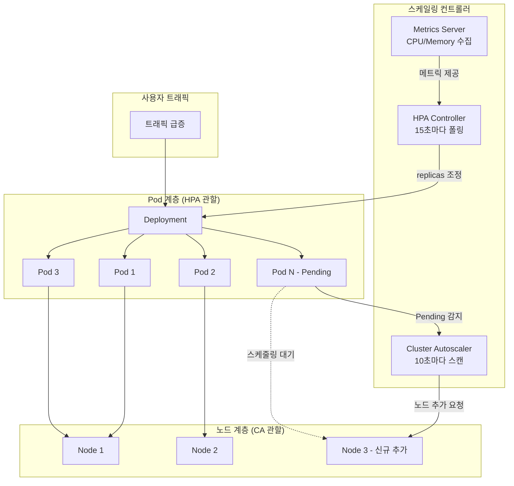
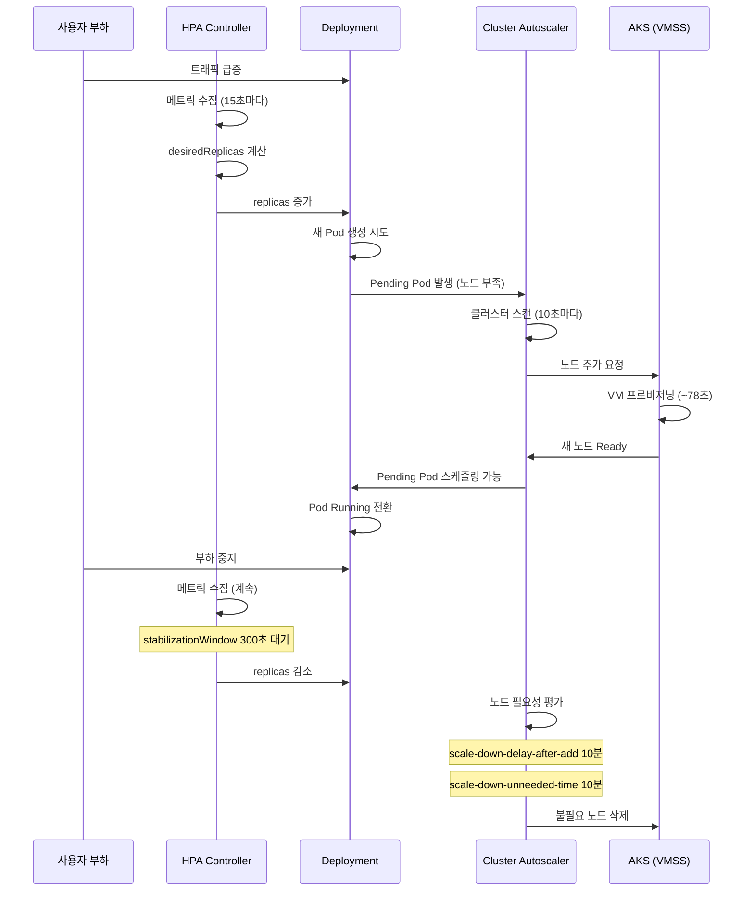
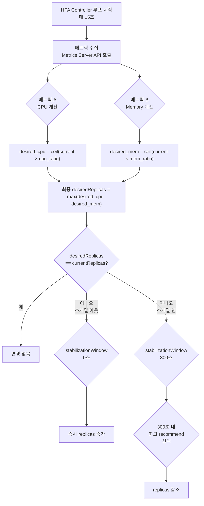
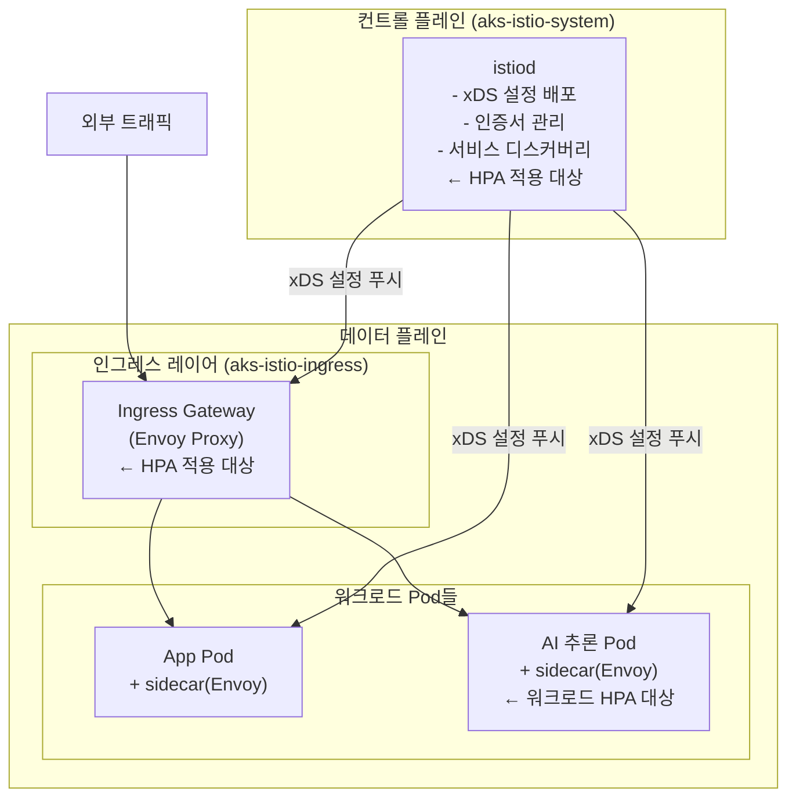
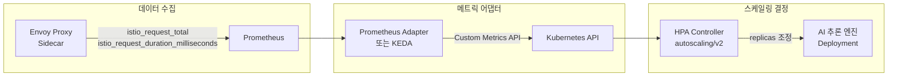
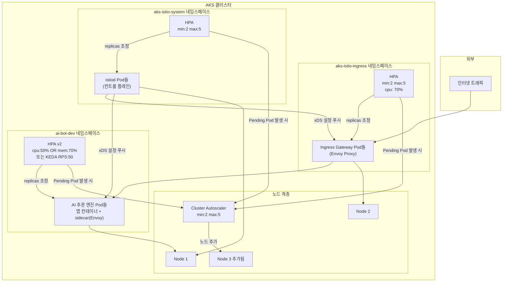

## Lab 9 — HPA · Cluster Autoscaler · 다중 메트릭 HPA (AI 기반)

> **과정명**: MS Azure k8s 기반 AIOps 실전  
> **실습 환경**: Azure Kubernetes Service (AKS) — Korea Central  
> **클러스터 버전**: Kubernetes 1.34.7  
> **노드 VM 스펙**: Standard D2s v3 (2 vCPU, 8GiB RAM)  
> **작성일**: 2026-06-10

## 실습 문서

[**Lab 9 - kubernetes 고가용성**](https://psedu.gitbook.io/k8s-aiops-aks/lab-9-kubernetes)

[**Kubernetes AIOps 실전.pdf**](https://drive.google.com/file/d/1aA2YTol6pRqIkpTyQs0GtZghoVqr7P0E/view?usp=sharing)


---

## 목차

1. [Kubernetes 고가용성 개요](#1-kubernetes-고가용성-개요)
2. [실습 환경 구성](#2-실습-환경-구성)
3. [Task 1: HPA — CPU 기반 수평 자동 스케일링](#3-task-1-hpa--cpu-기반-수평-자동-스케일링)
4. [Task 2: Cluster Autoscaling — 노드 수평 자동 확장](#4-task-2-cluster-autoscaling--노드-수평-자동-확장)
5. [Task 3: HPA v2 — AI 기반 다중 메트릭 스케일링](#5-task-3-hpa-v2--ai-기반-다중-메트릭-스케일링)
6. [전체 아키텍처 및 동작 흐름](#6-전체-아키텍처-및-동작-흐름)
7. [종합 비교표](#7-종합-비교표)
8. [AIOps 구축 및 운영 Claude Code 프롬프트](#8-aiops-구축-및-운영-claude-code-프롬프트)
9. [트러블슈팅 가이드](#9-트러블슈팅-가이드)
10. [베스트 프랙티스 및 권고사항](#10-베스트-프랙티스-및-권고사항)

---

## 1. Kubernetes 고가용성 개요

### 1.1 왜 고가용성이 중요한가

현대의 AI 기반 서비스, 특히 LLM(Large Language Model)을 활용한 챗봇이나 추론 엔진은 트래픽이 예측 불가능하게 급증하는 특성을 가집니다. 사용자가 갑자기 몰리면 서비스 응답 시간이 길어지거나 서버가 다운될 수 있으며, 이는 곧 비즈니스 손실로 이어집니다. 반대로 트래픽이 줄어들 때 과도하게 할당된 인프라는 불필요한 비용을 발생시킵니다.

Kubernetes는 이러한 문제를 해결하기 위해 두 가지 핵심 자동 스케일링 메커니즘을 제공합니다. 첫 번째는 **HPA(Horizontal Pod Autoscaler)** 로, 워크로드의 부하에 따라 Pod 개수를 자동으로 조절합니다. 두 번째는 **Cluster Autoscaler(CA)** 로, Pod를 더 이상 스케줄링할 노드가 부족할 때 노드(VM) 자체를 추가하거나 불필요한 노드를 제거합니다. 이 두 컴포넌트가 함께 동작할 때 진정한 의미의 클라우드 네이티브 고가용성이 실현됩니다.

### 1.2 AIOps와 자동 스케일링의 관계

AIOps(AI for IT Operations)는 인공지능 기술을 IT 운영에 접목하여 장애 예측, 자동 복구, 비용 최적화 등을 실현하는 개념입니다. Kubernetes 환경에서 AIOps를 구현하려면 단순히 AI 워크로드를 배포하는 것을 넘어, 그 워크로드 자체가 스스로 부하에 적응하며 안정적으로 운영될 수 있어야 합니다.

AI 추론 엔진은 일반 웹 서버와 다음과 같은 차이점이 있어 특별한 스케일링 전략이 필요합니다.

| 구분 | 일반 웹 서버 | AI 추론 엔진 (LLM) |
|------|------------|-------------------|
| 주요 리소스 병목 | CPU | CPU + **메모리** 동시 |
| 메모리 사용 패턴 | 요청 처리 후 해제 | 모델 가중치 상시 적재 |
| 스케일링 민감도 | CPU 위주 | 메모리 OOM 위험 |
| 스케일링 전략 | CPU 단일 메트릭 HPA | **다중 메트릭 HPA (v2)** |

---

## 2. 실습 환경 구성

### 2.1 AKS 클러스터 사양

```
클러스터명: user13-aks
리전: Korea Central
Kubernetes: 1.34.7
네트워크: Azure CNI
인증: Managed Identity
노드 VM: Standard D2s v3 (2 vCPU, 8GiB RAM)
초기 노드 수: 2개 (Cluster Autoscaler 활성화 전)
```

### 2.2 실습에서 사용된 네임스페이스

```
default        — Task 1, Task 2 기본 실습
ai-bot-dev     — Task 3 AI 기반 HPA 실습
```

### 2.3 Metrics Server 동작 확인

HPA가 동작하려면 Metrics Server가 반드시 설치되어 있어야 합니다. Metrics Server는 각 노드의 kubelet에서 CPU와 메모리 사용량을 수집하여 Kubernetes API 서버를 통해 HPA 컨트롤러에 제공합니다.

```bash
kubectl top node
```

실제 출력 결과:

```
NAME                                CPU(cores)   CPU(%)   MEMORY(bytes)   MEMORY(%)
aks-nodepool1-12318778-vmss000001   295m         15%      2791Mi          38%
aks-nodepool1-12318778-vmss000004   149m         7%       1535Mi          21%
```

두 노드 모두 CPU와 메모리 수치가 정상 출력되었으므로 Metrics Server가 정상 동작 중임을 확인했습니다. 만약 `error: Metrics API not available` 메시지가 출력된다면, `kubectl get pods -n kube-system | grep metrics-server` 명령으로 Metrics Server Pod 상태를 점검해야 합니다.

---

## 3. Task 1: HPA — CPU 기반 수평 자동 스케일링

### 3.1 HPA 개념과 동작 원리

HPA(Horizontal Pod Autoscaler)는 Kubernetes Controller Manager 내부에서 동작하는 컨트롤 루프입니다. 기본적으로 **15초마다** 설정된 메트릭을 폴링하여 현재 상태를 평가하고, 필요 시 Deployment의 replicas 수를 조정합니다.

HPA의 핵심 계산 공식은 다음과 같습니다.

```
desiredReplicas = ceil(currentReplicas × (currentMetricValue / desiredMetricValue))
```

예를 들어 현재 Pod 1개가 CPU 335m을 사용 중이고 목표가 50m이라면:

```
desiredReplicas = ceil(1 × (335 / 50)) = ceil(6.7) = 7개
```

실제 실습에서 7개의 Pod가 생성된 것은 이 공식에 의한 결과입니다.

#### HPA 스케일 아웃과 스케일 인의 비대칭성

HPA는 스케일 아웃(확장)과 스케일 인(축소)에 서로 다른 안정화 정책을 적용합니다.

| 동작 | 기본 안정화 대기시간 | 이유 |
|------|---------------------|------|
| 스케일 아웃 | **0초** (즉시) | 서비스 가용성 우선 |
| 스케일 인 | **300초 (5분)** | 불필요한 Pod 삭제를 신중하게 |

이 비대칭성 때문에 부하를 중지한 후에도 약 5~7분이 지나야 Pod 수가 감소합니다.

### 3.2 실습 구성: php-apache

실습에서는 `k8s.io/examples/application/php-apache.yaml`을 사용했습니다. 이 YAML은 php-apache라는 간단한 웹 서버 Deployment와 ClusterIP Service를 생성하며, CPU 부하를 인위적으로 발생시켜 HPA 동작을 검증하기에 적합합니다.

```bash
# 1. Deployment와 Service 생성
kubectl apply -f https://k8s.io/examples/application/php-apache.yaml

# 2. HPA 생성 (올바른 의도: CPU 사용률 50% 기준)
# ※ 실제 실습에서는 --cpu=50 을 사용하여 50m(밀리코어) 기준으로 설정됨 (3.3절 오류 분석 참조)
kubectl autoscale deployment php-apache --cpu-percent=50 --min=1 --max=10

# 3. 부하 생성 (별도 터미널)
# ※ 실제 실습에서 첫 번째 시도는 -c와 따옴표 사이 공백 누락으로 실패, 두 번째 시도에서 성공 (3.3절 오류 분석 참조)
kubectl run -i --tty load-generator --rm --image=busybox --restart=Never \
  -- /bin/sh -c "while sleep 0.01; do wget -q -O- http://php-apache; done"
```

### 3.3 실습 중 발생한 오류 분석

#### 오류 1: `--cpu` 플래그의 단위 혼동

실습 중 `--cpu-percent=50` 대신 `--cpu=50`을 사용하여 HPA가 의도와 다르게 설정되었습니다.

```bash
# ❌ 실제 사용한 명령 (50 밀리코어 기준)
kubectl autoscale deployment php-apache --cpu=50 --min=1 --max=10

# ✅ 올바른 명령 (CPU 사용률 50% 기준)
kubectl autoscale deployment php-apache --cpu-percent=50 --min=1 --max=10
```

| 플래그 | 의미 | TARGETS 표시 |
|--------|------|-------------|
| `--cpu=50` | 50 밀리코어(0.05코어) | `cpu: 335m/50m` |
| `--cpu-percent=50` | requests 대비 50% 사용률 | `cpu: 67%/50%` |

`--cpu=50`을 사용하면 Pod당 평균 CPU 사용량이 50 밀리코어를 넘을 때 스케일 아웃하므로, 임계치가 매우 낮아 과도한 스케일 아웃이 발생했습니다. 실제로 `335m/50m`이라는 TARGETS 값이 이를 반증합니다.

#### 오류 2: 부하 생성 명령의 공백 누락

```bash
# ❌ 공백 없음 → /bin/sh: illegal option -w
/bin/sh -c"while sleep 0.01; ...

# ✅ 공백 추가 → 정상 실행
/bin/sh -c "while sleep 0.01; ...
```

`-c` 옵션과 인자 사이에 공백이 없으면 Shell이 `-c"while...`를 하나의 알 수 없는 옵션 문자열로 해석합니다.

### 3.4 스케일 아웃 결과

부하 생성 약 1분 후 확인한 결과입니다.

```
NAME                              READY   STATUS    AGE
pod/load-generator                1/1     Running   77s
pod/php-apache-6f9b6b7987-6rbt4   0/1     Pending   12s
pod/php-apache-6f9b6b7987-7zpnr   1/1     Running   27s
pod/php-apache-6f9b6b7987-ds577   1/1     Running   12s
pod/php-apache-6f9b6b7987-f4zlw   1/1     Running   27s
pod/php-apache-6f9b6b7987-pjtjx   1/1     Running   27s
pod/php-apache-6f9b6b7987-t5l8n   1/1     Running   5m51s
pod/php-apache-6f9b6b7987-tsfn6   1/1     Running   12s

horizontalpodautoscaler.autoscaling/php-apache   cpu: 335m/50m   1   10   4
```

Pod는 7개가 되었지만 HPA의 REPLICAS 컬럼은 4를 표시하고 있습니다. 이는 `watch`로 상태를 캡처한 시점이 스케일링이 진행 중인 순간이었기 때문입니다. HPA가 replicas를 4로 설정한 직후 새 Pod들이 생성되는 도중을 포착한 것으로, HPA REPLICAS(목표값)와 실제 Pod 수가 일시적으로 다를 수 있습니다. 이후 HPA는 CPU 335m/50m 비율(=6.7배)에 따라 최대 maxReplicas=10까지 추가 스케일 아웃을 시도했을 것입니다.

HPA TARGETS는 `335m/50m`으로 목표 임계치(50m)를 약 6.7배 초과하는 상태를 보여줍니다.

### 3.5 스케일 인 결과

부하 중지 약 7분 52초 후 확인한 결과입니다.

```
horizontalpodautoscaler.autoscaling/php-apache   cpu: 1m/50m   1   10   1
```

Pod 수가 7개에서 다시 1개로 감소했으며, CPU 사용량도 `1m/50m`으로 안정화된 것을 확인했습니다.

#### HPA 전체 동작 사이클 요약

```
[초기 상태]       Pod: 1개 │ TARGETS: <unknown>/50m
      ↓ 부하 인가 (~1분)
[스케일 아웃]     Pod: 7개 │ TARGETS: 335m/50m
      ↓ 부하 중지 (~5~8분, stabilizationWindow=300s)
[스케일 인]       Pod: 1개 │ TARGETS: 1m/50m
```

---

## 4. Task 2: Cluster Autoscaling — 노드 수평 자동 확장

### 4.1 Cluster Autoscaler 개념

Cluster Autoscaler(CA)는 HPA와 역할이 다릅니다. HPA가 Pod 수를 조정한다면, CA는 Pod가 스케줄링될 노드(VM)의 수를 조정합니다. AKS에서는 VMSS(Virtual Machine Scale Sets)를 기반으로 동작하며, Azure Portal 또는 Azure CLI를 통해 활성화할 수 있습니다.

CA의 스케일 아웃 트리거는 **Pending 상태의 Pod 발생**입니다. 즉, 현재 노드들의 리소스가 부족하여 스케줄링되지 못한 Pod가 생기면 CA가 이를 감지하고 새 노드를 추가합니다. 반대로 스케일 인 트리거는 **노드의 리소스 사용률이 임계치(기본 50%) 이하**로 떨어지는 것입니다.

### 4.2 CA 핵심 파라미터 (AKS 기본값)

| 파라미터 | 기본값 | 설명 |
|---------|--------|------|
| `scan-interval` | 10초 | CA가 클러스터 상태를 평가하는 주기 |
| `scale-down-delay-after-add` | **10분** | 스케일 아웃 후 스케일 인을 시작하기 전 대기 시간 |
| `scale-down-unneeded-time` | **10분** | 노드가 불필요 상태로 유지되어야 삭제되는 최소 시간 |
| `scale-down-utilization-threshold` | 50% | 이 이하일 때 노드를 삭제 후보로 판단 |
| `max-node-provision-time` | 15분 | 새 노드 프로비저닝 최대 허용 시간 |

스케일 인이 10분 이상 소요되는 이유는 바로 `scale-down-delay-after-add`(10분)와 `scale-down-unneeded-time`(10분)이 순차적으로 적용되기 때문입니다. 방금 스케일 아웃이 일어난 후에는 최소 10분 동안 스케일 인이 차단되고, 그 이후에도 노드가 10분 이상 불필요 상태를 유지해야 삭제됩니다.

### 4.3 실습 구성

실습에서는 `ca-dp.yaml`이라는 Deployment를 생성하여 Pod 50개로 증설함으로써 노드 부족 상황을 인위적으로 만들었습니다.

```yaml
# ca-dp.yaml
apiVersion: apps/v1
kind: Deployment
metadata:
  name: ca-dp
spec:
  replicas: 3
  selector:
    matchLabels:
      app: nginx
  template:
    metadata:
      labels:
        app: nginx
    spec:
      containers:
      - name: nginx
        image: nginx
        ports:
        - containerPort: 80
        resources:
          limits:
            cpu: 500m
          requests:
            cpu: 200m
```

CA는 Pod의 `resources.limits`가 아닌 `resources.requests`를 기준으로 노드 용량을 판단합니다. 이 Deployment는 Pod당 CPU 200m을 요청하므로, 50개 Pod의 총 CPU requests는 10,000m(10 코어)입니다.

```bash
# Deployment 생성
kubectl create -f ca-dp.yaml

# Pod 50개로 증설
kubectl scale deployment ca-dp --replicas=50
```

### 4.4 실습 중 발생한 오류

#### 오류: Deployment 생성 전 scale 명령 실행

```bash
# ❌ Deployment가 없는 상태에서 scale 시도
kubectl scale deployment ca-dp --replicas=50
# Error from server (NotFound): deployments.apps "ca-dp" not found

# ❌ 잘못된 명령 형식 (--replicas 플래그 누락)
kubectl scale deployment ca-dp.yaml
# error: required flag(s) "replicas" not set
```

올바른 순서는 반드시 `kubectl create -f ca-dp.yaml` → `kubectl scale deployment ca-dp --replicas=50` 입니다.

#### 오류: `kubectl delete hpa,deploy,svc --all` 시 kubernetes Service 삭제

```bash
kubectl delete hpa,deploy,svc --all
# service "kubernetes" deleted  ← 시스템 기본 서비스까지 삭제됨
```

`kubernetes` ClusterIP Service는 kube-apiserver 접근을 위한 시스템 서비스로, Kubernetes가 자동으로 재생성하므로 클러스터 동작에는 문제가 없습니다. 다음에는 `kubectl delete deploy,svc --all` (HPA만 개별 삭제)하거나 특정 리소스명을 명시하는 것이 안전합니다.

### 4.5 노드 스케일 아웃 결과

```
시각: 04:50:45 → 노드 4개 (vmss000001, 000004, 000005, 000006)
시각: 04:52:20 → 노드 5개 (vmss000007 추가, AGE: 78s)
```

> **Task 2 시작 시점에 노드가 이미 4개인 이유**: Task 1 HPA 실습에서 부하 생성 Pod가 많은 CPU를 소모하자 Cluster Autoscaler가 이미 노드를 추가(vmss000005, vmss000006)했습니다. Task 1 종료 후 CA의 스케일 인 대기시간(10분 이상)이 아직 만료되지 않은 상태에서 Task 2를 시작했기 때문에 노드가 4개인 상태로 시작된 것입니다.

약 95초(1분 35초) 만에 새로운 노드(vmss000007)가 프로비저닝되어 Ready 상태가 되었습니다. 이는 AKS가 VMSS 기반의 빠른 노드 프로비저닝을 지원하기 때문입니다.

최대 노드 수를 5개로 설정했기 때문에, Pod 50개를 모두 스케줄링하기에는 여전히 부족했습니다(5노드 × 약 1,900m ≒ 9,500m < 10,000m). 일부 Pod는 `max=5` 한계로 인해 Pending 상태로 남았습니다.

#### 노드 용량 계산

```
Standard D2s v3: 2 vCPU = 2,000m
  - 시스템 Pod 예약 (~100m): 실제 가용 ≈ 1,900m/노드

Pod 50개 × 200m = 10,000m 필요
5개 노드 × 1,900m ≈ 9,500m 가용

→ 약 500m 부족 → 일부 Pod Pending 유지
```

### 4.6 Azure Portal에서 확인한 CA 상태

Azure Portal의 노드 풀 설정에서 다음을 확인했습니다.

- **자동 크기 조정 이벤트**: 7회 — CA가 총 7번의 스케일링 결정을 내림
- **자동 크기 조정 상태**: 스케일 다운하는 중 — Pod 0개로 줄인 후 CA가 잉여 노드 삭제를 준비 중
- **대상 노드**: 4개, **준비된 노드**: 4개

---

## 5. Task 3: HPA v2 — AI 기반 다중 메트릭 스케일링

### 5.1 시나리오: AI 추론 엔진의 메모리 민감성

LLM 기반 추론 엔진은 모델 가중치(수십 GB에 달하는 파라미터 파일)를 메모리에 전부 올린 상태에서 추론을 수행합니다. 따라서 트래픽이 급증할 때 CPU뿐 아니라 메모리도 빠르게 포화됩니다. CPU 사용률이 50% 미만이더라도 메모리가 가득 차면 OOM Kill(Out of Memory Kill)이 발생하여 Pod가 강제 종료됩니다.

기존의 `kubectl autoscale` 명령은 `autoscaling/v1` API를 기반으로 하여 CPU 단일 메트릭만 지원합니다. CPU가 낮은 상태에서 메모리만 급증하는 시나리오를 방어하려면 `autoscaling/v2` API를 직접 YAML로 작성해야 합니다.

### 5.2 autoscaling/v1 vs autoscaling/v2 비교

| 구분 | autoscaling/v1 | autoscaling/v2 |
|------|---------------|----------------|
| 설정 방법 | `kubectl autoscale` 명령어 | YAML 직접 작성 |
| 지원 메트릭 | CPU **1개만** | CPU, Memory, Custom 메트릭 **복수** |
| 다중 조건 | ❌ 불가 | ✅ OR 조건으로 동작 |
| 스케일링 정책 | 고정 기본값 | `behavior` 섹션으로 세밀 제어 가능 |
| 안정화 윈도우 설정 | ❌ 불가 | ✅ `stabilizationWindowSeconds` 직접 설정 |
| Custom 메트릭 | ❌ 불가 | ✅ Prometheus Adapter, KEDA 연동 가능 |
| TARGETS 표시 | `cpu: XX%/YY%` | `cpu: XX%/YY%, memory: XX%/YY%` |

### 5.3 다중 메트릭 HPA의 OR 조건 동작 원리

`autoscaling/v2` API에서 여러 메트릭을 지정하면, HPA 컨트롤러는 각 메트릭별로 독립적으로 desired replica 수를 계산한 후 그 중 **최댓값**을 선택합니다. 이것이 사실상 OR 조건처럼 동작하는 이유입니다.

```
메트릭 A (CPU):
  currentReplicas × (현재CPU% / 목표CPU%)
  = 1 × (1% / 50%) = 0.02 → max(minReplicas, 0) = 1개

메트릭 B (Memory):
  currentReplicas × (현재MEM% / 목표MEM%)
  = 1 × (78% / 70%) = 1.11 → ceil(1.11) = 2개

최종 결정: max(1, 2) = 2개 → 스케일 아웃 발생
```

CPU가 낮아도 메모리가 높으면 스케일 아웃이 발생하는 것은 이 공식에 의한 자연스러운 결과입니다.

### 5.4 미션 1: AI 추론 엔진 Deployment 배포

`polinux/stress` 이미지는 CPU와 메모리 부하량을 명령어 인자로 정밀하게 제어할 수 있는 테스트 도구입니다. 실제 LLM 없이도 메모리 집약적 워크로드를 정확히 재현할 수 있어 실습에 적합합니다.

```yaml
# ai-inference-deploy.yaml
apiVersion: apps/v1
kind: Deployment
metadata:
  name: ai-inference-engine
  namespace: ai-bot-dev
spec:
  replicas: 1
  selector:
    matchLabels:
      app: ai-inference-engine
  template:
    metadata:
      labels:
        app: ai-inference-engine
    spec:
      containers:
      - name: stress
        image: polinux/stress
        command: ["sleep", "infinity"]   # 초기: 부하 없이 대기
        resources:
          requests:
            cpu: "200m"
            memory: "256Mi"     # HPA 사용률 계산의 분모
          limits:
            cpu: "500m"
            memory: "512Mi"
```

```bash
kubectl apply -f ai-inference-deploy.yaml
kubectl get pod -n ai-bot-dev
kubectl top pod -n ai-bot-dev
```

초기 상태에서는 `sleep infinity` 명령이 실행 중이므로 CPU는 거의 0에 수렴하고, 메모리는 컨테이너 기본 오버헤드 약 10~20Mi만 사용합니다.

#### 메모리 사용률 계산 원리

HPA는 다음 공식으로 메모리 사용률을 계산합니다.

```
메모리 사용률 = 실제 사용량 / requests.memory × 100
             = 10Mi / 256Mi × 100 ≈ 3.9%   (초기 상태)
             = 200Mi / 256Mi × 100 ≈ 78.1%  (stress 부하 후)
```

부하를 인가하여 200Mi를 점유하면 78.1%가 되어 70% 임계치를 초과합니다.

### 5.5 미션 2: 다중 메트릭 HPA v2 생성

```yaml
# inference-hpa.yaml
apiVersion: autoscaling/v2
kind: HorizontalPodAutoscaler
metadata:
  name: inference-hpa
  namespace: ai-bot-dev
spec:
  scaleTargetRef:
    apiVersion: apps/v1
    kind: Deployment
    name: ai-inference-engine
  minReplicas: 1
  maxReplicas: 3
  metrics:
  - type: Resource
    resource:
      name: cpu
      target:
        type: AverageUtilization
        averageUtilization: 50    # CPU 50% 초과 시 스케일 아웃
  - type: Resource
    resource:
      name: memory
      target:
        type: AverageUtilization
        averageUtilization: 70    # Memory 70% 초과 시 스케일 아웃
```

```bash
kubectl apply -f inference-hpa.yaml
kubectl get hpa inference-hpa -n ai-bot-dev
```

HPA 생성 직후 예상 출력:

```
NAME            REFERENCE                       TARGETS                          MINPODS  MAXPODS  REPLICAS
inference-hpa   Deployment/ai-inference-engine  cpu: 0%/50%, memory: 4%/70%     1        3        1
```

### 5.6 미션 3: 메모리 집중 부하 및 스케일 아웃 검증

이 미션의 핵심은 **CPU는 낮게(< 50%) 유지하면서 메모리만 높게(> 70%)** 만들어, 기존 CPU 단일 HPA로는 절대 감지할 수 없는 시나리오를 재현하는 것입니다.

#### 단계 1: 모니터링 시작 (터미널 A)

```bash
watch -n 2 kubectl get pod,hpa -n ai-bot-dev
```

#### 단계 2: 메모리 폭주 유발 (터미널 B)

```bash
# Pod 이름 확인
kubectl get pod -n ai-bot-dev

# stress 명령으로 200MB 메모리 점유 (CPU 부하 없음)
kubectl exec -it <pod-name> -n ai-bot-dev \
  -- stress --vm 1 --vm-bytes 200M --vm-keep
```

#### `stress` 옵션 해설

| 옵션 | 역할 |
|------|------|
| `--vm 1` | 메모리 점유 워커 프로세스 1개 실행 |
| `--vm-bytes 200M` | 200MB 메모리 할당 |
| `--vm-keep` | 할당된 메모리를 해제하지 않고 계속 유지 (이것이 핵심) |
| `--cpu` 미지정 | CPU 부하 없음 → CPU 사용률 낮게 유지 |

#### 단계 3: 스케일 아웃 확인 (약 1~2분 후, 터미널 A)

```
NAME                                              TARGETS                        REPLICAS
horizontalpodautoscaler.autoscaling/inference-hpa  cpu: 1%/50%, memory: 85%/70%   3
```

| 지표 | 부하 전 | 부하 후 | 판정 |
|------|--------|--------|------|
| CPU 사용률 | ~0% | ~1~2% | ✅ 50% 미만 유지 |
| Memory 사용률 | ~4% | **~78%** | ❌ 70% 초과 |
| REPLICAS | 1 | **2~3** | ✅ 스케일 아웃 발생 |
| 스케일 아웃 원인 | — | **Memory 단독** | 핵심 증명 ✅ |

이 결과는 CPU 단일 HPA였다면 절대 스케일 아웃이 발생하지 않았을 것임을 증명합니다. AI 추론 엔진처럼 메모리 집약적인 워크로드에는 반드시 다중 메트릭 HPA v2가 필요합니다.

---

## 6. 전체 아키텍처 및 동작 흐름

### 6.1 HPA와 Cluster Autoscaler의 계층적 협력 구조



### 6.2 스케일링 이벤트 전체 타임라인



### 6.3 HPA v2 다중 메트릭 처리 흐름



---

## 7. 종합 비교표

### 7.1 HPA vs Cluster Autoscaler vs VPA 전체 비교

| 구분 | HPA (수평 Pod) | Cluster Autoscaler (노드) | VPA (수직 Pod) |
|------|--------------|--------------------------|---------------|
| **스케일 대상** | Pod 개수 | Node 개수 | Pod CPU/Memory 크기 |
| **트리거 조건** | 메트릭 임계치 초과 | Pending Pod 발생 / 노드 미활용 | 리소스 사용 패턴 분석 |
| **반응 속도** | 빠름 (15초 주기) | 중간 (노드 프로비저닝 ~1~3분) | 느림 (권고 → 재시작) |
| **API** | autoscaling/v1, v2 | CA 컴포넌트 | VPA 컴포넌트 |
| **설정 방법** | HPA 리소스 생성 | 노드 풀 자동 크기 조정 활성화 | VPA 리소스 생성 |
| **병용 가능 여부** | CA와 함께 사용 권장 | HPA와 함께 사용 권장 | HPA와 동일 메트릭 병용 시 충돌 |
| **비용 영향** | 간접적 (Pod만 조절) | 직접적 (VM 비용 증감) | 리소스 낭비 최소화 |
| **권장 사용 케이스** | 동적 트래픽 대응 | 노드 부족/잉여 대응 | requests 최적화 |

### 7.2 HPA v1 vs HPA v2 비교

| 구분 | autoscaling/v1 | autoscaling/v2 |
|------|---------------|----------------|
| **지원 메트릭** | CPU 1개 | CPU, Memory, Custom, External |
| **다중 메트릭 조건** | ❌ | ✅ OR 조건 (최댓값 선택) |
| **behavior 설정** | ❌ | ✅ 스케일 아웃/인 독립 제어 |
| **안정화 윈도우** | 고정 (300초) | ✅ 직접 설정 가능 |
| **Custom 메트릭** | ❌ | ✅ Prometheus Adapter 연동 |
| **External 메트릭** | ❌ | ✅ 큐 길이, 레이턴시 등 |
| **KEDA 연동** | ❌ | ✅ |
| **AI 워크로드 적합성** | ❌ 메모리 OOM 위험 | ✅ 메모리 조건 포함 가능 |

### 7.3 스케일링 타이밍 비교

| 동작 | 소요 시간 | 비고 |
|------|---------|------|
| HPA 스케일 아웃 결정 | ~15초 | 메트릭 폴링 주기 |
| Pod 생성 및 Running | ~30초~1분 | 이미지 풀링 포함 |
| HPA 스케일 인 결정 | ~5분 | stabilizationWindowSeconds=300 |
| 노드 프로비저닝 (AKS) | **~1분 30초** | 실습에서 78초 측정 |
| CA 스케일 인 시작 | ~10분 | scale-down-delay-after-add |
| CA 노드 삭제 완료 | ~10~20분 | scale-down-unneeded-time 추가 |

### 7.4 `--cpu` vs `--cpu-percent` 비교 (주의사항)

| 플래그 | 의미 | TARGETS 표시 | 적합한 경우 |
|--------|------|-------------|-----------|
| `--cpu=50` | 50 밀리코어(절대값) | `cpu: 335m/50m` | requests가 명확한 고정 워크로드 |
| `--cpu-percent=50` | requests 대비 50% | `cpu: 67%/50%` | 일반적인 스케일링 (**권장**) |

`--cpu=50`(50 밀리코어)은 D2s v3 노드의 총 CPU 대비 약 2.5%에 해당하는 매우 낮은 임계치입니다. 대부분의 경우 `--cpu-percent=50`을 사용하는 것이 의도에 맞습니다.

---

## 8. AIOps 구축 및 운영 Claude Code 프롬프트

이 섹션은 AKS 기반 AIOps 환경을 구축하고 운영하는 과정에서 Claude Code를 활용하는 실전 프롬프트 모음입니다. 각 프롬프트는 특정 운영 시나리오를 대상으로 작성되었습니다.

---

### 8.1 클러스터 상태 진단 및 초기 점검

```
현재 AKS 클러스터의 전반적인 상태를 점검해줘.

아래 명령들을 순서대로 실행하고 각 결과를 분석해줘:

1. 노드 상태 및 리소스 현황
   kubectl get nodes -o wide
   kubectl top nodes

2. 네임스페이스별 Pod 현황
   kubectl get pods --all-namespaces | grep -v Running

3. 현재 활성화된 HPA 목록
   kubectl get hpa --all-namespaces

4. Cluster Autoscaler 상태
   kubectl -n kube-system logs -l app=cluster-autoscaler --tail=20

5. Metrics Server 동작 확인
   kubectl top node
   kubectl top pod --all-namespaces | sort -k3 -rn | head -20

분석 결과를 다음 형식으로 정리해줘:
- 🔴 즉각 조치 필요
- 🟡 모니터링 필요
- 🟢 정상
```

---

### 8.2 HPA 자동 구성 (단일 메트릭)

```
아래 조건으로 HPA를 생성하고 동작을 검증해줘.

대상 Deployment: [DEPLOYMENT_NAME]
네임스페이스: [NAMESPACE]
CPU 임계치: 60%
최소 Pod 수: 2
최대 Pod 수: 10

작업 순서:
1. 대상 Deployment의 resources.requests.cpu가 설정되어 있는지 확인
   kubectl get deploy [DEPLOYMENT_NAME] -n [NAMESPACE] -o jsonpath='{.spec.template.spec.containers[*].resources}'

2. requests가 없으면 아래와 같이 패치
   kubectl set resources deployment [DEPLOYMENT_NAME] -n [NAMESPACE] \
     --requests=cpu=200m,memory=256Mi \
     --limits=cpu=500m,memory=512Mi

3. HPA 생성
   kubectl autoscale deployment [DEPLOYMENT_NAME] \
     -n [NAMESPACE] \
     --cpu-percent=60 \
     --min=2 \
     --max=10

4. HPA 상태 확인 (1~2분 대기 후)
   kubectl get hpa [DEPLOYMENT_NAME] -n [NAMESPACE]

확인 항목:
- TARGETS에 <unknown>이 아닌 실제 % 값이 표시되는지
- MINPODS, MAXPODS가 설정한 값과 일치하는지
```

---

### 8.3 AI 추론 엔진용 다중 메트릭 HPA v2 자동 구성

```
AI 추론 엔진 워크로드를 위한 다중 메트릭 HPA v2를 구성해줘.

조건:
- 대상 Deployment: [DEPLOYMENT_NAME]
- 네임스페이스: [NAMESPACE]
- CPU 임계치: 50% (CPU가 50% 초과 시 스케일 아웃)
- Memory 임계치: 70% (Memory가 70% 초과 시 스케일 아웃)
- 최소 Pod: 1개, 최대 Pod: 5개

작업:
1. 아래 inference-hpa.yaml 파일을 생성해줘

cat <<EOF > inference-hpa.yaml
apiVersion: autoscaling/v2
kind: HorizontalPodAutoscaler
metadata:
  name: [DEPLOYMENT_NAME]-hpa
  namespace: [NAMESPACE]
spec:
  scaleTargetRef:
    apiVersion: apps/v1
    kind: Deployment
    name: [DEPLOYMENT_NAME]
  minReplicas: 1
  maxReplicas: 5
  metrics:
  - type: Resource
    resource:
      name: cpu
      target:
        type: AverageUtilization
        averageUtilization: 50
  - type: Resource
    resource:
      name: memory
      target:
        type: AverageUtilization
        averageUtilization: 70
  behavior:
    scaleUp:
      stabilizationWindowSeconds: 0
      policies:
      - type: Pods
        value: 2
        periodSeconds: 60
    scaleDown:
      stabilizationWindowSeconds: 300
      policies:
      - type: Pods
        value: 1
        periodSeconds: 120
EOF

2. HPA 적용
   kubectl apply -f inference-hpa.yaml

3. 결과 확인
   kubectl describe hpa [DEPLOYMENT_NAME]-hpa -n [NAMESPACE]

확인 항목:
- Metrics 섹션에 cpu와 memory 두 조건이 모두 표시되는지
- Current Metrics가 정상적으로 수집되는지
- Events에 스케일링 관련 이벤트가 있는지
```

---

### 8.4 Cluster Autoscaler 구성 및 튜닝

```
AKS 클러스터의 Cluster Autoscaler를 운영 환경에 맞게 구성해줘.

현재 클러스터 정보 확인:
az aks show \
  --resource-group $(az aks list --query "[0].resourceGroup" -o tsv) \
  --name $(az aks list --query "[0].name" -o tsv) \
  --query "agentPoolProfiles[0].{name:name, minCount:minCount, maxCount:maxCount, enableAutoScaling:enableAutoScaling, vmSize:vmSize}" \
  -o table

아래 파라미터로 CA 프로파일을 최적화해줘:
- scan-interval: 10s (기본값 유지)
- scale-down-delay-after-add: 5m (기본 10m → 절반으로 단축)
- scale-down-unneeded-time: 5m (기본 10m → 절반으로 단축)
- scale-down-utilization-threshold: 0.5 (기본값 유지)

적용 명령:
az aks update \
  --resource-group [RESOURCE_GROUP] \
  --name [CLUSTER_NAME] \
  --cluster-autoscaler-profile \
    scan-interval=10s,\
    scale-down-delay-after-add=5m,\
    scale-down-unneeded-time=5m,\
    scale-down-utilization-threshold=0.5

적용 후 설정 검증:
az aks show \
  --resource-group [RESOURCE_GROUP] \
  --name [CLUSTER_NAME] \
  --query "autoScalerProfile" \
  -o json

결과를 표로 정리하고, 변경된 파라미터가 어떤 영향을 주는지 설명해줘.
```

---

### 8.5 부하 테스트 및 스케일링 동작 검증

```
현재 배포된 [DEPLOYMENT_NAME]에 대해 부하 테스트를 수행하고 HPA 및 CA 동작을 검증해줘.

단계 1: 부하 전 기준선 측정 (터미널 A)
  kubectl get pod,hpa -n [NAMESPACE]
  kubectl top pod -n [NAMESPACE]
  kubectl get nodes

단계 2: 부하 생성 Pod 실행 (터미널 B - 새 세션)
  # HTTP 서비스의 경우
  kubectl run load-test --rm -i --tty \
    --image=busybox --restart=Never \
    -- /bin/sh -c "while sleep 0.01; do wget -q -O- http://[SERVICE_NAME].[NAMESPACE]; done"

단계 3: 모니터링 루프 실행 (터미널 A - 2분 간격, 5회)
  for i in {1..5}; do
    echo "=== $(date) ==="
    kubectl get pod,hpa -n [NAMESPACE]
    kubectl get nodes
    echo ""
    sleep 120
  done

단계 4: 부하 중지 후 스케일 인 모니터링 (터미널 A - 2분 간격, 8회)
  for i in {1..8}; do
    echo "=== $(date) ==="
    kubectl get pod,hpa -n [NAMESPACE]
    kubectl get nodes
    echo ""
    sleep 120
  done

각 단계의 결과를 아래 항목으로 정리해줘:
1. Pod 수 변화 타임라인
2. HPA TARGETS 변화 (CPU%, Memory%)
3. 노드 수 변화 여부 (CA 동작 확인)
4. 스케일 아웃 → 스케일 인 소요 시간
```

---

### 8.6 메모리 기반 부하 테스트 (AI 추론 엔진 시나리오)

```
[POD_NAME] Pod에 메모리 집중 부하를 주입하여 Memory 단독으로 HPA 스케일 아웃이
발생하는지 검증해줘.

전제 조건:
- HPA가 CPU 50% OR Memory 70% 조건으로 설정되어 있어야 함
- Pod에 polinux/stress 이미지가 사용되어야 함

단계 1: 부하 전 상태 확인
  kubectl get hpa -n [NAMESPACE]
  kubectl top pod -n [NAMESPACE]

단계 2: 메모리 부하 주입 (별도 터미널에서 실행)
  kubectl exec -it [POD_NAME] -n [NAMESPACE] \
    -- stress --vm 1 --vm-bytes 200M --vm-keep

  [주의] 이 명령은 포그라운드로 실행되며, Ctrl+C로 중지 전까지 계속 점유됨

단계 3: 스케일 아웃 확인 (1~2분 간격 모니터링)
  kubectl get pod,hpa -n [NAMESPACE] -w

확인 목표:
- CPU TARGETS: < 50% (낮게 유지되어야 함)
- Memory TARGETS: > 70% (이 조건만으로 스케일 아웃 발생)
- REPLICAS: 1 → 2 또는 3

검증 포인트: CPU가 낮음에도 Memory 조건만으로 스케일 아웃이 발생했는지 확인하고,
이것이 기존 CPU 단일 HPA 대비 다중 메트릭 HPA v2의 핵심 장점임을 설명해줘.
```

---

### 8.7 HPA 및 스케일링 이벤트 분석

```
최근 스케일링 이벤트를 분석하고 이상 징후를 탐지해줘.

1. HPA 이벤트 조회
   kubectl describe hpa --all-namespaces | grep -A 10 "Events:"

2. Cluster Autoscaler 이벤트
   kubectl get events --all-namespaces \
     --sort-by='.lastTimestamp' \
     | grep -iE "scale|autoscal|TriggeredScaleUp|ScaleDown" \
     | tail -20

3. 최근 Pod 재시작 및 OOMKilled 탐지
   kubectl get pods --all-namespaces \
     -o json | jq '.items[] | select(.status.containerStatuses[]?.restartCount > 0)
     | {name: .metadata.name, ns: .metadata.namespace,
        restarts: .status.containerStatuses[].restartCount,
        reason: .status.containerStatuses[].lastState.terminated.reason}'

4. 노드별 리소스 현황
   kubectl describe nodes | grep -A 5 "Allocated resources"

분석 결과를 다음 형식으로 정리해줘:
- 스케일링 패턴 요약 (스케일 아웃/인 빈도, 시간대)
- OOMKilled가 발생한 Pod 목록
- 리소스 부족 노드 여부
- 권고 조치사항
```

---

### 8.8 운영 환경 자동 복구 시나리오

```
AIOps 환경에서 아래 장애 시나리오를 시뮬레이션하고 자동 복구 동작을 검증해줘.

시나리오: Pod OOM Kill 자동 복구

1. 현재 ai-inference-engine Pod 상태 확인
   kubectl get pod -n ai-bot-dev -o wide

2. Pod에 메모리 한도를 초과하는 부하 주입 (limits 초과 → OOM Kill)
   kubectl exec -it [POD_NAME] -n ai-bot-dev \
     -- stress --vm 1 --vm-bytes 600M --vm-keep
   # limits.memory가 512Mi이므로 600M는 한도 초과

3. OOM Kill 후 Pod 상태 변화 모니터링
   kubectl get pod -n ai-bot-dev -w

4. 재시작 횟수 및 이유 확인
   kubectl describe pod [POD_NAME] -n ai-bot-dev | grep -A 5 "Last State"

5. HPA가 새로운 Pod를 배포하는지 확인
   kubectl get pod,hpa -n ai-bot-dev

분석 항목:
- OOM Kill 후 자동 재시작까지 소요 시간
- Kubernetes self-healing이 정상 동작하는지
- HPA가 이 상황을 어떻게 처리하는지
- OOM 반복 시 CrashLoopBackOff 진입 여부와 대응 방안
```

---

### 8.9 전체 Lab 9 리소스 정리 및 검증

```
Lab 9 실습에서 생성한 모든 리소스를 안전하게 정리하고 클러스터를 초기 상태로 복원해줘.

1. default 네임스페이스 정리 (HPA, Deployment, Service)
   kubectl delete hpa,deploy --all -n default
   kubectl delete svc -n default --field-selector metadata.name!=kubernetes

2. ai-bot-dev 네임스페이스 정리
   kubectl delete hpa,deploy -n ai-bot-dev --all
   kubectl delete -f inference-hpa.yaml 2>/dev/null || true
   kubectl delete -f ai-inference-deploy.yaml 2>/dev/null || true

3. 로컬 파일 정리
   rm -f ca-dp.yaml ai-inference-deploy.yaml inference-hpa.yaml

4. 잔존 리소스 확인
   kubectl get all --all-namespaces | grep -v "kube-system\|app-routing\|aks-command"
   kubectl get nodes

5. 노드 수가 minCount(2개)로 수렴하는지 모니터링 (10분 이상 소요 예상)
   watch kubectl get nodes

최종 확인 항목:
- 실습 리소스가 모두 삭제되었는지
- kubernetes ClusterIP Service만 남아 있는지
- 노드 수가 설정한 최솟값(2개)으로 복귀하는지

결과를 표로 정리해줘.
```

---

### 8.10 AIOps 모니터링 대시보드용 명령 세트

```
AKS 기반 AIOps 환경의 운영 현황을 한눈에 확인하는 모니터링 명령 세트를 실행해줘.

=== [1] 클러스터 전체 리소스 요약 ===
kubectl get nodes -o custom-columns=\
"NAME:.metadata.name,STATUS:.status.conditions[-1].type,CPU:.status.allocatable.cpu,MEM:.status.allocatable.memory"

=== [2] 네임스페이스별 Pod 요약 ===
kubectl get pods --all-namespaces -o wide \
  | awk 'NR==1 || $4!="Running"' \
  | head -30

=== [3] 전체 HPA 상태 일람 ===
kubectl get hpa --all-namespaces \
  -o custom-columns=\
"NS:.metadata.namespace,NAME:.metadata.name,TARGETS:.status.currentMetrics[*].resource.current.averageUtilization,REPLICAS:.status.currentReplicas,MAX:.spec.maxReplicas"

=== [4] 리소스 사용량 상위 Pod ===
kubectl top pod --all-namespaces \
  --sort-by=memory | head -15

=== [5] 최근 스케일링 이벤트 ===
kubectl get events --all-namespaces \
  --sort-by='.lastTimestamp' \
  | grep -iE "Scaled|ScaleUp|ScaleDown|OOMKilling|BackOff" \
  | tail -15

모든 결과를 분석하여 현재 클러스터의 상태를 요약하고, 주의가 필요한 항목이 있으면
아래 형식으로 알려줘:
- 🔴 즉각 조치: [내용]
- 🟡 모니터링: [내용]
- 🟢 정상: [내용]
```

---

### 8.11 Cluster Autoscaler 스케일 인 지연 시 강제 진단

```
Cluster Autoscaler의 스케일 인이 예상보다 오래 걸릴 때, 원인을 진단하고
해결 방안을 제시해줘.

진단 명령 순서:

1. CA 로그에서 스케일 인 차단 이유 확인
   kubectl -n kube-system logs \
     $(kubectl -n kube-system get pod -l app=cluster-autoscaler -o name) \
     --tail=50 | grep -iE "scale|unneeded|notready|daemonset|system"

2. 각 노드의 Pod 목록 및 제거 가능 여부 확인
   for node in $(kubectl get nodes -o name | cut -d/ -f2); do
     echo "=== Node: $node ==="
     kubectl get pods --all-namespaces --field-selector spec.nodeName=$node \
       -o custom-columns="NS:.metadata.namespace,NAME:.metadata.name,OWNER:.metadata.ownerReferences[0].kind"
   done

3. Scale-in을 방해하는 Pod 유형 확인
   - DaemonSet Pod (CA는 DaemonSet Pod가 있어도 삭제 가능)
   - Local Storage 사용 Pod (기본적으로 삭제 불가)
   - PodDisruptionBudget이 적용된 Pod

4. CA NotTriggerScaleUp 경고 확인
   kubectl get events -n kube-system \
     | grep -i "NotTriggerScaleUp\|ScaleDownEmpty"

분석 결과를 기반으로:
- 스케일 인이 지연되는 정확한 이유를 파악해줘
- 해당 노드를 안전하게 비울 수 있는지 판단해줘
- 필요 시 수동 드레인 방법을 제시해줘
  kubectl drain [NODE_NAME] --ignore-daemonsets --delete-emptydir-data
```

---

### 8.12 CI/CD 파이프라인 연동용 스케일링 검증 자동화

```
CI/CD 배포 후 HPA가 정상 동작하는지 자동으로 검증하는 스크립트를 작성해줘.

검증 항목:
1. 대상 Deployment의 resources.requests 설정 여부
2. HPA 리소스 존재 여부
3. HPA TARGETS가 <unknown> 상태에서 실제 값으로 변환되는지 (최대 3분 대기)
4. minReplicas 수만큼 Pod가 Running 상태인지
5. kubectl top pod로 메트릭이 수집되는지

아래 형식으로 bash 스크립트 파일을 생성해줘 (파일명: validate-hpa.sh)

스크립트 요구사항:
- 입력 인자: DEPLOYMENT_NAME, NAMESPACE
- 각 검증 항목을 PASS/FAIL로 출력
- FAIL 항목이 하나라도 있으면 exit code 1로 종료
- 검증 성공 시 현재 HPA 상태를 요약 출력

생성 후 실행 권한 부여:
chmod +x validate-hpa.sh

테스트 실행:
./validate-hpa.sh ai-inference-engine ai-bot-dev
```

---

## 9. 트러블슈팅 가이드

### 9.1 HPA TARGETS가 `<unknown>`에서 변하지 않을 때

| 원인 | 진단 명령 | 해결책 |
|------|---------|--------|
| Metrics Server 미설치/오류 | `kubectl top node` | `kubectl get pods -n kube-system \| grep metrics` |
| Deployment에 requests 미설정 | `kubectl describe deploy [name]` | `kubectl set resources deploy [name] --requests=cpu=100m` |
| 메트릭 수집 지연 | — | 1~2분 대기 후 재확인 |

### 9.2 CA가 스케일 아웃하지 않을 때

CA가 작동하려면 Pending 상태의 Pod가 존재해야 합니다. Pod가 Running인데 노드 수가 늘지 않는다면, 리소스 여유가 있어 CA 트리거 조건이 충족되지 않은 것입니다.

```bash
# Pending Pod 확인
kubectl get pods --all-namespaces --field-selector=status.phase=Pending

# CA 로그에서 트리거 여부 확인
kubectl -n kube-system logs -l app=cluster-autoscaler --tail=30 | grep -i "scale\|trigger"
```

### 9.3 CA가 스케일 인하지 않을 때 (10분+ 경과 후에도)

Azure Portal의 노드 풀에서 스케일 다운이 지연될 때 다음을 확인합니다.

- 해당 노드에 `PodDisruptionBudget`이 적용된 Pod가 있는지
- `local-storage`를 사용하는 Pod가 있는지
- `nodeSelector`나 `nodeAffinity`로 특정 노드에만 스케줄링되는 Pod가 있는지

```bash
# CA 로그에서 스케일 다운 차단 이유 직접 확인
kubectl -n kube-system logs -l app=cluster-autoscaler --tail=30 \
  | grep -iE "ScaleDown|unneeded|noScaleDown|blockScaleDown"
```

> **참고 — `NotTriggerScaleUp` 이벤트**: 실습 중 Azure Portal에서 "강화가 트리거되지 않음 (1)" 경고가 표시되었습니다. 이 이벤트는 **스케일 인(ScaleDown)이 아니라 스케일 아웃(ScaleUp)이 트리거되지 않은 경우**를 나타냅니다. 즉, 클러스터에 Pending Pod가 생겼지만 maxCount 제한 또는 리소스 부족으로 노드를 추가할 수 없었던 상황을 기록한 것입니다. 실습에서는 Pod 50개가 모두 5노드에 스케줄링되지 못해 Pending 상태로 남았을 때 이 이벤트가 기록되었을 가능성이 높습니다.

### 9.4 OOMKilled 반복 발생 시

```bash
# OOMKilled 이력 확인
kubectl describe pod [POD_NAME] | grep -A 5 "Last State\|Reason"

# limits 증가 (임시 조치)
kubectl set resources deployment [NAME] \
  --limits=memory=1Gi

# 또는 VPA 권고값 참조 후 영구 조정
```

---

## 10. 베스트 프랙티스 및 권고사항

### 10.1 HPA 설정 권고사항

AI 추론 엔진과 같이 메모리 민감도가 높은 워크로드에는 반드시 `autoscaling/v2` API를 사용하여 CPU와 Memory를 모두 모니터링하는 다중 메트릭 HPA를 설정해야 합니다. CPU 사용률이 낮더라도 메모리가 포화되면 OOM Kill이 발생할 수 있기 때문입니다.

모든 컨테이너에는 `resources.requests`를 반드시 설정해야 합니다. HPA는 requests를 분모로 사용률을 계산하며, requests가 없으면 HPA TARGETS가 `<unknown>` 상태로 남아 스케일링이 동작하지 않습니다.

### 10.2 Cluster Autoscaler 설정 권고사항

스케일 다운 지연 시간(기본 10분)은 운영 환경의 워크로드 패턴에 따라 조정할 수 있습니다. 트래픽이 자주 변동하는 환경에서는 5분으로 단축하여 비용을 절감할 수 있습니다. 단, 너무 공격적으로 줄이면 스케일 아웃-스케일 인이 반복되는 "스래싱(thrashing)" 현상이 발생할 수 있으므로 주의해야 합니다.

maxCount는 실제 비용 계획과 구독 한도(AKS 기본 노드 쿼터)를 고려하여 설정해야 합니다.

### 10.3 AIOps 운영 관점의 권고사항

HPA와 CA를 함께 사용할 때는 두 컴포넌트의 역할을 명확히 이해해야 합니다. HPA는 빠른 트래픽 변화에 Pod 수로 대응하고, CA는 Pod가 스케줄링되지 못하는 상황에서 노드를 추가합니다. 이 두 컴포넌트가 협력할 때 진정한 의미의 탄력적이고 비용 효율적인 클라우드 네이티브 AI 인프라가 구현됩니다.

지속적인 모니터링을 위해 Azure Monitor, Container Insights, 또는 Prometheus + Grafana 스택을 연동하여 스케일링 이벤트를 추적하는 것을 권장합니다.

---

*본 문서는 MS Azure k8s 기반 AIOps 실전 과정 Lab 9 실습 결과를 기반으로 작성되었습니다.*  
*Kubernetes 공식 문서 및 Microsoft AKS 공식 문서를 참조하여 정확성을 검증하였습니다.*  
*작성일: 2026-06-10*

---

## 별첨: Istio 서비스 메시 스케일링과 Lab 9의 연관성

> **이 별첨은 Lab 9에서 실습한 HPA · Cluster Autoscaler · 다중 메트릭 HPA가 Istio 서비스 메시 환경에서 어떻게 확장·적용되는지를 설명합니다.**

### A.1 Istio 스케일링과 Lab 9의 연관성 — 결론 먼저

Istio 스케일링은 Lab 9에서 실습한 개념들과 **직접적으로 연결**됩니다. 다음 표가 그 관계를 요약합니다.

| Lab 9 실습 내용 | Istio 스케일링에서의 확장 적용 |
|----------------|-------------------------------|
| Task 1: CPU 기반 HPA | istiod(컨트롤 플레인) HPA · Ingress Gateway HPA — **동일한 HPA 메커니즘** |
| Task 2: Cluster Autoscaler | Istio Pod들의 HPA 스케일 아웃 시 CA가 노드 추가 — **동일한 CA 메커니즘** |
| Task 3: 다중 메트릭 HPA v2 | Istio 메트릭(RPS, p99 Latency) 기반 HPA — **HPA v2의 실전 확장** |
| Lab 3: NGINX Ingress | Istio Ingress Gateway가 NGINX의 기능적 대안 — **직접적인 후계 관계** |

결정적으로 AKS에서 실습에 사용한 **NGINX 기반 App Routing 애드온은 2026년 11월 지원이 종료**됩니다. Microsoft의 공식 마이그레이션 경로는 Istio 기반 Gateway API입니다.

---

### A.2 Istio 아키텍처 이해

Istio는 **컨트롤 플레인**과 **데이터 플레인**으로 구성됩니다.



각 구성요소의 역할은 다음과 같습니다.

**istiod (컨트롤 플레인)** 는 모든 Envoy 프록시의 설정을 관리하는 뇌 역할을 합니다. 서비스가 추가되거나 설정이 변경될 때마다 istiod는 xDS 프로토콜을 통해 모든 Envoy 프록시에 변경 사항을 푸시합니다. 서비스 수와 Pod 수가 증가할수록 istiod의 CPU와 메모리 사용량도 비례하여 증가합니다.

**Ingress Gateway**는 클러스터 외부에서 들어오는 트래픽을 수신하여 내부 서비스로 라우팅하는 역할을 합니다. TLS 종료(Termination)를 여기서 처리하며, 트래픽이 많아질수록 CPU 사용량이 주요 병목이 됩니다.

**Sidecar Proxy(Envoy)** 는 각 워크로드 Pod 안에 자동으로 주입되는 프록시입니다. 모든 인바운드/아웃바운드 트래픽을 가로채 처리하며, 이 과정에서 메트릭(요청 수, 레이턴시, 오류율 등)을 자동으로 수집합니다.

---

### A.3 컨트롤 플레인(istiod) 스케일링

#### A.3.1 AKS Istio 애드온의 기본 HPA 설정

AKS의 Istio 서비스 메시 애드온은 istiod에 HPA를 **기본으로 활성화**합니다. 이것이 Lab 9 Task 1에서 배운 HPA가 그대로 적용되는 첫 번째 사례입니다.

```bash
# AKS Istio 애드온 활성화 후 HPA 확인
kubectl get hpa -n aks-istio-system
```

AKS Istio 애드온의 기본 HPA 설정값은 다음과 같습니다.

| 구성요소 | 기본 minReplicas | 기본 maxReplicas | 스케일링 메트릭 |
|---------|-----------------|-----------------|----------------|
| istiod | 2 | 5 | CPU 사용률 |
| Ingress Gateway (external) | 2 | 5 | CPU 사용률 |
| Ingress Gateway (internal) | 2 | 5 | CPU 사용률 |

> **minReplicas가 2인 이유**: PodDisruptionBudget(PDB)과의 충돌을 방지하기 위함입니다. istiod가 1개만 남은 상태에서 노드 유지보수로 Pod가 강제 이동될 경우 설정 푸시가 중단됩니다.

#### A.3.2 istiod HPA 수정 방법

```bash
# istiod HPA 수정 예시 (maxReplicas 증가)
# ※ HPA 이름의 버전 숫자(asm-1-21)는 설치된 Istio 버전에 따라 다름 (예: asm-1-22, asm-1-23 등)
# 실제 이름 확인: kubectl get hpa -n aks-istio-system
kubectl patch hpa istiod-asm-1-21 -n aks-istio-system \
  --type merge \
  --patch '{"spec": {"minReplicas": 2, "maxReplicas": 10}}'

# 수정 후 확인
kubectl get hpa -n aks-istio-system
```

#### A.3.3 Discovery Selectors로 istiod 부하 최적화

기본적으로 istiod는 **클러스터의 모든 네임스페이스**를 감시합니다. 실습 환경처럼 `ai-bot-dev`, `ai-bot-prod` 등 메시에 참여하지 않는 네임스페이스까지 감시하면 불필요한 리소스가 낭비됩니다.

`DiscoverySelectors`를 설정하면 istiod가 특정 네임스페이스만 감시하도록 제한할 수 있습니다.

```yaml
# IstioOperator 설정 예시
apiVersion: install.istio.io/v1alpha1
kind: IstioOperator
spec:
  meshConfig:
    discoverySelectors:
    - matchLabels:
        istio-discovery: enabled   # 이 레이블이 있는 네임스페이스만 감시
```

```bash
# 메시 참여 네임스페이스에 레이블 추가
kubectl label namespace ai-bot-dev istio-discovery=enabled
kubectl label namespace ai-bot-prod istio-discovery=enabled
```

이렇게 하면 istiod의 CPU와 메모리 사용량이 줄어 HPA가 더 낮은 min Pod 수로 안정적으로 운영됩니다.

---

### A.4 데이터 플레인(Ingress Gateway) 스케일링

#### A.4.1 Ingress Gateway와 NGINX의 관계 (Lab 3 연결)

Lab 3에서 실습한 NGINX 기반 App Routing 애드온과 Istio Ingress Gateway의 기능적 역할은 동일합니다. 둘 다 외부 트래픽을 받아 내부 서비스로 라우팅합니다. 단, 아키텍처와 기능 범위에서 차이가 있습니다.

| 구분 | NGINX App Routing (Lab 3) | Istio Ingress Gateway |
|------|--------------------------|----------------------|
| **역할** | 외부 → 내부 트래픽 라우팅 | 외부 → 내부 트래픽 라우팅 |
| **프록시 엔진** | NGINX | Envoy |
| **설정 방식** | Ingress 리소스 | Gateway + VirtualService |
| **TLS 종료** | ✅ | ✅ |
| **서비스 메시 연동** | ❌ | ✅ (메시 내부까지 관리) |
| **트래픽 메트릭** | 기본 제공 없음 | ✅ Prometheus 자동 수집 |
| **카나리 배포** | 제한적 | ✅ 정교한 weight 기반 |
| **AKS 지원 종료** | **2026년 11월** | 계속 지원 |

#### A.4.2 AKS에서 Ingress Gateway HPA 조정

AKS의 Gateway API 모드에서는 Gateway 리소스를 생성하면 HPA가 자동으로 생성됩니다. 이 HPA는 ConfigMap을 통해 관리됩니다.

```yaml
# Gateway HPA 설정 ConfigMap 예시
apiVersion: v1
kind: ConfigMap
metadata:
  name: aks-istio-ingressgateway-external-config
  namespace: aks-istio-ingress
data:
  horizontalPodAutoscaler: |
    spec:
      minReplicas: 2
      maxReplicas: 10
  podDisruptionBudget: |
    spec:
      minAvailable: 1
```

```bash
# Gateway HPA 상태 확인
kubectl get hpa -n aks-istio-ingress

# 예상 출력
# NAME                                     REFERENCE                                  TARGETS      MINPODS  MAXPODS  REPLICAS
# aks-istio-ingressgateway-external-...    Deployment/aks-istio-ingressgateway-...    cpu: 3%/80%  2        5        2
```

TARGETS가 `cpu: 3%/80%`로 표시되는 것은 Lab 9 Task 1에서 배운 HPA와 **동일한 형식**입니다.

#### A.4.3 Envoy의 리소스 특성과 HPA 설계

Envoy는 높은 효율의 C++ 기반 프록시로, 동일 처리량에서 NGINX 대비 CPU 사용량이 낮습니다. Istio Ingress Gateway의 HPA를 설계할 때 다음 특성을 고려해야 합니다.

- **CPU**: TLS 종료(암복호화) 처리에 주로 사용됩니다. 트래픽이 많아질수록 CPU가 병목이 됩니다.
- **메모리**: 라우팅 테이블 수(서비스/VirtualService 수)에 비례합니다. 서비스가 수백 개 이상이 되면 메모리 사용량이 커집니다.

따라서 대규모 환경에서는 Lab 9 Task 3에서 배운 **다중 메트릭 HPA v2(CPU + Memory)** 를 Ingress Gateway에도 적용하는 것이 권장됩니다.

```yaml
# Istio Ingress Gateway 다중 메트릭 HPA 예시
apiVersion: autoscaling/v2
kind: HorizontalPodAutoscaler
metadata:
  name: istio-ingressgateway-hpa
  namespace: aks-istio-ingress
spec:
  scaleTargetRef:
    apiVersion: apps/v1
    kind: Deployment
    name: aks-istio-ingressgateway-external
  minReplicas: 2
  maxReplicas: 10
  metrics:
  - type: Resource
    resource:
      name: cpu
      target:
        type: AverageUtilization
        averageUtilization: 70      # TLS 처리로 CPU가 주 병목
  - type: Resource
    resource:
      name: memory
      target:
        type: AverageUtilization
        averageUtilization: 80      # 라우팅 테이블 증가 시 메모리 감시
```

---

### A.5 Istio 메트릭 기반 HPA — Lab 9 Task 3의 실전 확장

#### A.5.1 왜 CPU/메모리 HPA만으로는 부족한가

Lab 9 Task 3에서 AI 추론 엔진에 다중 메트릭 HPA(CPU + Memory)를 적용했습니다. 이것은 훌륭한 출발점이지만, 실제 프로덕션 환경에서는 CPU나 메모리가 높아지기 **전에** 사용자 경험이 나빠지는 경우가 있습니다. 예를 들어 AI 추론 엔진이 요청을 큐에 쌓아두는 방식으로 처리한다면, CPU는 낮아도 응답 시간(레이턴시)이 급격히 증가할 수 있습니다.

Istio는 이 문제를 해결할 수 있습니다. Sidecar Proxy가 모든 HTTP 요청을 가로채면서 **RPS(초당 요청 수)**, **p99 레이턴시**, **오류율** 등을 자동으로 수집하기 때문입니다. 이 메트릭들은 CPU/메모리보다 사용자 경험과 훨씬 직접적으로 연결됩니다.

#### A.5.2 Istio 메트릭 기반 HPA 아키텍처

Istio 메트릭을 HPA에 연결하려면 추가 컴포넌트가 필요합니다.



#### A.5.3 KEDA를 활용한 RPS 기반 스케일링

KEDA(Kubernetes Event-Driven Autoscaling)는 HPA의 한계를 극복하는 오픈소스 컴포넌트입니다. Prometheus에 직접 쿼리하여 Istio가 수집한 RPS나 레이턴시 메트릭으로 스케일링할 수 있으며, **스케일-투-제로(Scale-to-Zero)** 도 지원합니다.

```yaml
# KEDA ScaledObject: RPS 기반 AI 추론 엔진 스케일링
apiVersion: keda.sh/v1alpha1
kind: ScaledObject
metadata:
  name: ai-inference-scaler
  namespace: ai-bot-dev
spec:
  scaleTargetRef:
    name: ai-inference-engine
  minReplicaCount: 1
  maxReplicaCount: 10
  cooldownPeriod: 120         # 스케일 인 전 대기 시간(초)
  pollingInterval: 15         # Prometheus 쿼리 주기(초)
  triggers:
  # 트리거 1: RPS 기반 (Pod당 50 RPS 초과 시 스케일 아웃)
  - type: prometheus
    metadata:
      serverAddress: http://prometheus.monitoring.svc:9090
      metricName: ai_inference_rps
      query: |
        sum(rate(istio_request_total{
          destination_service_name="ai-inference-engine",
          namespace="ai-bot-dev"
        }[2m]))
      threshold: "50"
  # 트리거 2: p99 레이턴시 백스톱 (500ms 초과 시 스케일 아웃)
  - type: prometheus
    metadata:
      serverAddress: http://prometheus.monitoring.svc:9090
      metricName: ai_inference_p99_latency
      query: |
        histogram_quantile(0.99,
          sum(rate(istio_request_duration_milliseconds_bucket{
            destination_service_name="ai-inference-engine"
          }[2m])) by (le)
        )
      threshold: "500"
```

| 구분 | HPA (Task 1/3) | KEDA + Istio 메트릭 |
|------|---------------|---------------------|
| **스케일링 기준** | CPU%, Memory% | RPS, p99 Latency, 오류율 |
| **사용자 경험 반영** | 간접적 | **직접적** |
| **스케일-투-제로** | ❌ | ✅ |
| **Prometheus 직접 연동** | 어댑터 필요 | ✅ 기본 지원 |
| **도입 복잡도** | 낮음 | 중간 |
| **적합한 워크로드** | 일반 웹 서버 | AI 추론, API Gateway |

---

### A.6 Sidecar Proxy가 HPA에 미치는 영향

#### A.6.1 Sidecar CPU/메모리가 HPA 계산에 포함되는가

이것은 실제 운영에서 중요한 질문입니다. **Pod 안에 Envoy sidecar가 주입되면, sidecar의 CPU와 메모리 사용량도 Pod 전체 사용량으로 합산됩니다.**

```
HPA가 측정하는 Pod 메모리 = 앱 컨테이너 메모리 + Envoy sidecar 메모리
```

Envoy sidecar는 기본적으로 약 50~100Mi의 메모리를 사용합니다. 따라서 `resources.requests.memory`를 설정할 때 sidecar 오버헤드를 고려해야 합니다.

```yaml
# Istio 환경의 AI 추론 엔진: sidecar를 고려한 requests 설정
resources:
  requests:
    cpu: "200m"
    memory: "356Mi"   # 앱 256Mi + sidecar 약 100Mi
  limits:
    cpu: "500m"
    memory: "612Mi"   # 앱 512Mi + sidecar 약 100Mi
```

#### A.6.2 Sidecar 메모리 블로팅 방지

대규모 클러스터에서 Envoy sidecar는 모든 서비스의 라우팅 정보를 메모리에 보관합니다. 서비스가 수백 개를 넘으면 sidecar 하나당 수백 MB를 사용할 수 있습니다. 이는 HPA의 메모리 임계치를 예기치 않게 초과시켜 불필요한 스케일 아웃을 유발할 수 있습니다.

`Sidecar` 리소스를 사용하면 각 워크로드가 실제로 통신하는 서비스의 라우팅 정보만 주입하도록 제한할 수 있습니다.

```yaml
# ai-bot-dev 네임스페이스의 Sidecar 범위 제한
apiVersion: networking.istio.io/v1beta1
kind: Sidecar
metadata:
  name: ai-inference-sidecar
  namespace: ai-bot-dev
spec:
  egress:
  - hosts:
    - "./*"              # 같은 네임스페이스 내 서비스만
    - "istio-system/*"   # Istio 시스템 서비스
    # 다른 네임스페이스의 수백 개 서비스 라우팅 정보는 제외
```

---

### A.7 AKS에서의 최신 현황과 마이그레이션 로드맵

#### A.7.1 NGINX → Istio 마이그레이션 타임라인

| 시점 | 내용 |
|------|------|
| 2025년 11월 | Kubernetes SIG Network, standalone NGINX Ingress 프로젝트 은퇴 발표 |
| **2026년 3월** | standalone NGINX Ingress 공식 유지보수 종료 |
| **2026년 3월** | AKS App Routing — Istio Gateway API 모드 프리뷰 출시 |
| **2026년 11월** | AKS NGINX 기반 App Routing 애드온 Azure 지원 종료 |

**Lab 3 실습에서 사용한 NGINX 기반 App Routing 애드온(`app-routing-system`)은 2026년 11월 이후 보안 패치를 받을 수 없게 됩니다.** Microsoft의 권장 마이그레이션 경로는 Istio 기반 Gateway API입니다.

#### A.7.2 AKS Istio 애드온 활성화 및 HPA 확인

```bash
# Istio 서비스 메시 애드온 활성화
az aks update \
  --resource-group [RESOURCE_GROUP] \
  --name [CLUSTER_NAME] \
  --enable-asm

# Istio 컴포넌트 확인
kubectl get pods -n aks-istio-system
kubectl get pods -n aks-istio-ingress

# Istio HPA 전체 확인
kubectl get hpa -n aks-istio-system
kubectl get hpa -n aks-istio-ingress
```

---

### A.8 전체 Istio 스케일링 아키텍처 (AKS 기준)



---

### A.9 별첨 종합 비교: 스케일링 대상별 전략

| 스케일링 대상 | 메커니즘 | 메트릭 | Lab 9 연관 |
|-------------|---------|--------|-----------|
| **워크로드 Pod** (AI 추론 엔진) | HPA v2 | CPU + Memory | Task 3 직접 연결 |
| **istiod** (컨트롤 플레인) | HPA | CPU | Task 1 동일 메커니즘 |
| **Ingress Gateway** (데이터 플레인) | HPA (또는 HPA v2) | CPU (+ Memory) | Task 1/3 동일 메커니즘 |
| **노드 (VM)** | Cluster Autoscaler | Pending Pod 발생 | Task 2 동일 메커니즘 |
| **AI 추론 (고급)** | KEDA + Istio 메트릭 | RPS, p99 Latency | Task 3의 실전 확장 |

---

### A.10 별첨 요약

Istio 스케일링은 Lab 9에서 배운 HPA와 Cluster Autoscaler가 **더 복잡한 레이어에서 동일하게 동작**하는 것입니다. 실습에서 php-apache Deployment에 HPA를 붙인 것처럼, istiod와 Ingress Gateway도 동일한 HPA를 사용합니다. Cluster Autoscaler 역시 istiod Pod들이 늘어나 노드가 부족해지면 자동으로 노드를 추가합니다.

가장 중요한 실용적 의미는 두 가지입니다. 첫째, Lab 3에서 사용한 NGINX 기반 App Routing은 2026년 11월 지원이 종료되므로 Istio 기반 Gateway API로의 마이그레이션을 준비해야 합니다. 둘째, AI 추론 엔진처럼 메모리 민감한 워크로드에는 Task 3에서 배운 다중 메트릭 HPA v2를 적용하고, 이를 더 발전시켜 Istio의 RPS/레이턴시 메트릭을 KEDA와 연동하면 사용자 경험에 직결되는 더 정교한 스케일링이 가능합니다.

---

*별첨 참고 자료: Microsoft AKS Istio 스케일링 공식 문서, Istio 공식 Performance and Scalability 가이드, KEDA 공식 문서*  
*별첨 작성일: 2026-06-10*
